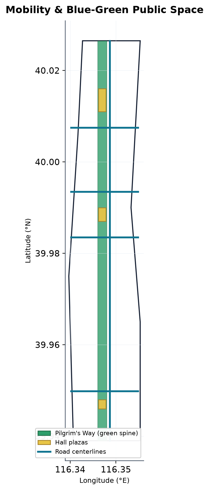
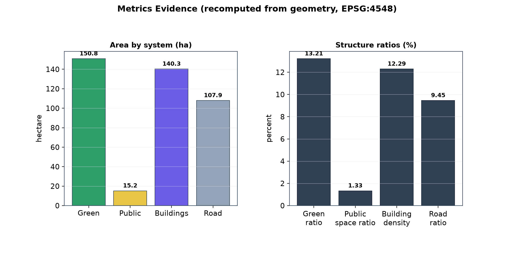

# 京张朝圣带 · Jing-Zhang Pilgrimage Belt

## 设计依据与资料清单

本 formal 方案以北京市规划和自然资源委员会海淀分局发布的《百年京张AI创新带城市设计国际方案征集资格预审公告》为第一依据，并以 `brief/site-package/` 中经维护者登记的临时粗略边界、重点区域、枚举、指标和来源清单为机器可读依据 [source:OFFICIAL-ANNOUNCEMENT] [source:SITE-PACKAGE]。所有设计判断都拆分为可追溯来源、可复算指标、可校验图层和可人工复核假设；文本叙述不替代 GeoJSON、指标表、A3 文册、A0 展板和 HTML 电子展示成果。

方案从公告、面向智能体任务书和场地资料出发组织成果，最关键依据放在判断旁边 [source:AGENT-TASKBOOK] [depth:existing_conditions_diagnosis]。资料登记表的使用边界如下 [source:SOURCE-REGISTRY]：formal 可用资料与 provisional-only 资料被严格区分，agent 不得把 background_only 或 provisional_only 资料升级为官方红线、法定控规、正式评分依据或政府实施承诺。

`data/processed/agent_fact_pack.md` 是本方案的阅读导航层，不是新的权威来源 [source:PROCESSED-FACT-PACK]。当前提交采用 `brief/site-package/geometry/provisional_boundaries.geojson` 生成临时 formal 包，`geometry/site_boundary.geojson` 与 `geometry/key_areas.geojson` 均标注 `provisional_constraint`、`official_boundary=false`，只能用于方案生成、自检、可视化和设计讨论，不能作为 official redline、审批依据、精确面积依据或法定控制结论 [data:geometry/site_boundary.geojson#SITE-001] [metric:site_area_sqm]。该数据缺口不阻断内容评分；替换 official polygons 后，各图层与指标均需重算。

## 设计概念：京张朝圣带（三殿·一路·一铭文·一护照）

本方案把 AI 创新的抽象进程，转译为一段可被市民步行完成的「朝圣」体验。京张铁路遗址公园纵贯三大核心区，是天然的线性公共空间主轴；方案将它命名为 **朝圣之路（Pilgrim's Way）**，并把三处重点片区重构为三座承载不同创新阶段的地标殿堂 [source:AGENT-TASKBOOK] [depth:overall_spatial_structure]：

- **起源殿（Origin Hall）· 众智园**——AI 创新「从 0 到 1」的策源地，对应国家人工智能平台、全栈自主创新与安全治理 [data:geometry/key_areas.geojson#PROV-KEY-001] [data:geometry/public_space.geojson#PUBLIC-001]。
- **转译殿（Translation Hall）· 北京AI原点社区**——把科研「转译」为产品与社区，对应近校成果转化、开源协作与人才特区 [data:geometry/key_areas.geojson#PROV-KEY-002] [data:geometry/public_space.geojson#PUBLIC-002]。
- **应用集（Application Market）· 大钟寺**——AI「进入日常生活」的市集，对应智能体、智能终端、内容消费与数据要素 [data:geometry/key_areas.geojson#PROV-KEY-003] [data:geometry/public_space.geojson#PUBLIC-003]。

三殿之间由南北贯通的绿地骨架连接，这条朝圣之路以公园绿地（1401）落图，全程约 9.7 公里，构成约 150.8 公顷的连续蓝绿公共空间 [data:geometry/green_space.geojson#GREEN-001] [metric:green_space_area_sqm]。沿路布置 **铭文带（Inscription Belt）**——面向开发者、企业、高校与市民的贡献与荣誉展示体系；并配套 **朝圣护照（Pilgrim's Passport）**——以 AI 导览与慢行评估支撑的轻量化打卡与认证体验 [depth:blue_green_public_space]。三座地标广场合计约 15.2 公顷，是整条朝圣带的空间高潮与公共活动锚点 [data:geometry/public_space.geojson#PUBLIC-001] [metric:public_space_area_sqm]。

该概念不是新增红线，而是把公告三层范围与「百年京张文化带、都市AI生活体验带、AI融合创新带」的辨识度要求，转译为一条有起点、有路径、有仪式感、可运营的公共空间叙事 [standard:PROJECT-OFFICIAL-ANNOUNCEMENT]。

## 命名系统、视觉识别与 Logo 方向

本方案的命名系统围绕「朝圣」这一可步行、可传播、可运营的公共隐喻展开，把抽象的 AI 创新阶段转译为具象空间序列 [source:AGENT-TASKBOOK] [depth:overall_spatial_structure]。命名原则有四：其一尊重京张铁路历史文脉，不虚构历史事实；其二把 AI 创新从策源到应用的阶段逻辑转译为空间语言；其三具备步行与传播体验的延展性；其四不照搬城市、园区或企业名称 [standard:AGENT-TASKBOOK]。

| 命名层级 | 名称 | 含义与落位 | 证据引用 |
| --- | --- | --- | --- |
| 一带总名 | 京张朝圣带（Jing-Zhang Pilgrimage Belt） | 以京张铁路遗址公园为「朝圣之路」的 AI 公共空间叙事带 | [data:geometry/site_boundary.geojson#SITE-001] |
| 三座地标 | 起源殿 / 转译殿 / 应用集 | 众智园「从 0 到 1」、原点社区「科研转译产品」、大钟寺「AI 进入日常」 | [data:geometry/key_areas.geojson#PROV-KEY-001] |
| 空间主轴 | 朝圣之路（Pilgrim's Way） | 南北贯通的京张遗址公园绿地骨架 | [data:geometry/green_space.geojson#GREEN-001] |
| 荣誉系统 | 铭文带（Inscription Belt） | 面向开发者、企业、高校、市民的贡献与荣誉展示 | [depth:blue_green_public_space] |
| 体验系统 | 朝圣护照（Pilgrim's Passport） | 轻量化打卡、认证与慢行评估 | [data:geometry/roads.geojson#ROAD-001] |

**Logo 方向（概念建议，供专业团队深化）。** 主标以「铁轨双线」为基底、以「三节点上升路径」为核心：两条平行线代表京张铁路的钢轨与遗址公园的线性公共空间，三个依次抬升的节点代表起源殿、转译殿、应用集三座殿堂，节点之间由一条自左下向右上的路径连接，象征创新「从策源到应用」的递进 [depth:overall_spatial_structure]。色彩采用三色体系：**京张铁轨绿**（#2F6E4F，文脉与绿地）、**AI 靛蓝**（#4F46E5，算力与算法）、**朝圣金**（#C9A227，荣誉与仪式感）。标识可拆分为三殿子标、铭文带徽章与朝圣护照印章三套延展；字体方向建议中文标题采用系统黑体类、英文采用无衬线字体，正式发布前需完成字库授权清权 [source:AGENT-TASKBOOK]。标识概念已以自绘几何 SVG 内联于 `visual/index.html`，不使用任何外部商标、人物肖像或未授权字体。

## 三区两翼协同回路

方案在「三区两翼」既有格局上组织协同回路，把三处重点片区与两翼功能区串联为可流转的创新闭环 [source:AGENT-TASKBOOK] [depth:three_level_scope_framework]。

| 单元 | 定位 | 五大功能对应 | 协同角色 |
| --- | --- | --- | --- |
| 众智园 AI 自主创新加速区 | 起源殿 | AI 全栈自主创新体系、AI 治理全球话语权 | 策源端：自主模型、标准、安全治理 |
| 北京 AI 原点社区 | 转译殿 | 世界级 AI 创新生态 | 转译端：近校成果转化、开源协作、人才特区 |
| 大钟寺 AI 产业集聚区 | 应用集 | 智能原生新业态 | 应用端：智能体、智能终端、内容消费、数据要素 |
| 中关村科技服务翼 | 服务翼 | 要素全球化配置 | 侧向支撑：中关村 IP、资本、专业服务反哺三区 |
| 小月河场景赋能翼 | 场景翼 | AI+ 场景赋能、智能化 AI 活力城市 | 侧向反馈：生活场景与公共体验反哺产品迭代 |

协同回路分「主链」与「两翼」两层：主链为「众智园策源 → 原点社区转译 → 大钟寺应用」的南北向创新流，由朝圣之路绿地骨架承载 [data:geometry/green_space.geojson#GREEN-001]；两翼为「中关村科技服务翼」在要素配置上赋能、「小月河场景赋能翼」在场景验证上反哺，使创新成果「研发有算力、转化有资本、落地有场景、反馈有数据」[depth:overall_spatial_structure]。该回路是概念性的空间与机制建议，不涉及具体投资额、产值或财政承诺。

## 区域创新协同

一带作为「全球人工智能产业高地与朝圣地」的一环，与海淀及京津冀既有创新载体形成差异化分工而非同质竞争 [source:AGENT-TASKBOOK] [depth:three_level_scope_framework]。协同关系按「功能分工—要素流动—品牌联动」三层组织：与**北纬社区、未来科学城、怀柔科学城、经开区**在基础研究、硬科技、制造与产业承载上错位互补；与**京津冀**在算力、数据、人才与产业转移上形成区域协同；在国际传播上以「京张朝圣带」作为 AI 创新叙事的公共入口 [depth:overall_spatial_structure]。以上协同关系均为概念判断与开放性建议，具体合作机制、资源规模与政策安排待正式规划与研究确认，不写入确定结论。

## 三层范围工作框架

方案按公告三个层次组织工作：统筹研究范围关注约 43.6 平方公里的AI产业生态与未来城市形态；总体设计范围关注约 11.4 平方公里京张遗址公园周边城市地区；重点区域范围关注约 368.4 公顷三处详细设计地区 [source:AGENT-TASKBOOK] [depth:three_level_scope_framework]。三层范围在 `compliance_matrix.json` 中逐条映射，保证公告 1.3、1.4、1.5 与 agent.1–agent.6 的必选任务都有章节、图层、指标、图纸和 HTML 证据。

三层工作不是割裂的图纸集合：统筹研究决定产业链与城市形态判断，总体设计把判断落到更新项目与空间结构，重点区域详细设计验证地块、建筑、交通、公共空间与 AI 场景的可实施性 [depth:overall_spatial_structure]。任何无法从结构化数据复算的面积、比例、规模或项目数量，不写入正式结论。

| 层级 | 设计问题 | 方案回答 | 数据落点 |
| --- | --- | --- | --- |
| 统筹研究范围 | AI产业生态和未来城市形态如何组织 | 「高校策源—开源协作—企业转化—公共体验—国际传播」的创新链 | compliance_matrix.json、standard_matrix.json |
| 总体设计范围 | 产业空间、更新、交通市政和风貌如何落图 | 朝圣之路绿地骨架 + 京张大道 + 三殿地标 + 用地建筑道路图层 | [data:geometry/land_use.geojson#LU-001]、[data:geometry/roads.geojson#ROAD-001] |
| 重点区域范围 | 三处片区如何达到详细设计深度 | 起源殿/转译殿/应用集三座地标与各自功能业态 | [data:geometry/key_areas.geojson#PROV-KEY-001]、[metric:key_area_count] |

## 统筹研究范围产业与未来城市研究

统筹研究范围的核心任务是构建世界级 AI 创新生态体系。方案把海淀高校院所、头部企业、算力算法数据要素、孵化平台、上市企业与独角兽资源，组织为「高校策源—开源协作—企业转化—公共体验—国际传播」的空间协同框架 [source:AGENT-TASKBOOK]。命名方案「京张朝圣带」直接服务三大辨识度目标：百年京张文化带（铁路遗址与朝圣叙事）、都市AI生活体验带（朝圣护照与公共场景）、AI融合创新带（三殿产业链） [standard:PROJECT-OFFICIAL-ANNOUNCEMENT]。

未来城市形态研究回答人工智能如何改变工作、生活、社交、学习、交通与公共服务。方案把 AI 交通系统、连续绿色空间、创新服务设施和国际化生活工作氛围，落实为可定位的功能区、节点与廊道 [depth:overall_spatial_structure]。产业战略指标、AI 创新指数、人才密度等绩效指标统一标注为待正式数据校准，不伪造精确数值。

## 全球 AI 创新生态案例研究

方案从公开研究资料中选取 8 个可公开核验的全球 AI 创新生态案例，提炼对一带可复用的机制与空间经验 [source:AGENT-TASKBOOK] [depth:existing_conditions_diagnosis]。案例聚焦「高校策源、要素配置、城市更新、公共空间、场景落地、治理话语权」六个维度，不编造企业名单、投资额或产值。

| 案例 | 关键机制 | 对一带的启示 |
| --- | --- | --- |
| 美国波士顿 Kendall Square（MIT 周边） | 高校实验室与高密度产学研街区深度耦合 | 起源殿与高校院所之间需要「步行可达的创新界面」 |
| 美国硅谷（Stanford / Palo Alto） | 产学研 + 风险资本 + 快速迭代生态 | 转译殿需配套资本与专业服务，而不只是物理空间 |
| 加拿大蒙特利尔 Mila | 研究机构集聚全球 AI 人才形成社区黏性 | 原点社区可借鉴「研究社群 + 公共空间」的人才驻留机制 |
| 英国伦敦 King's Cross / Knowledge Quarter | 城市更新 + 科技 + 文化公共空间复合 | 应用集可把「智能原生消费」与既有文化地标复合运营 |
| 德国柏林 AI Campus Berlin | 以公共空间承载开放 AI 社群与活动 | 朝圣之路可作为「开放 AI 社群」的线下容器 |
| 中国深圳南山（科技园 / 华强北） | 全链条制造 + 场景快速落地 | 应用集智能终端场景需配套测试与体验反馈闭环 |
| 新加坡纬壹科技城 one-north | 治理 + 产城融合 + 国际人才友好 | 一带国际传播与人才服务可借鉴「宜居 + 宜创」并重 |
| 北京中关村（对照样本） | 高校院所策源 + 科技服务集聚 | 中关村科技服务翼是本土化要素配置的现实基础 |

以上案例经验均转化为「概念性借鉴」而非照搬，任何涉及具体企业、投资或政策的判断均标注为待正式资料校准。

## AI 创新生态图谱与中关村科技服务翼

方案把一带 AI 创新生态组织为「五层一环」图谱 [source:AGENT-TASKBOOK] [depth:overall_spatial_structure]：

1. **策源层**——高校院所与国家人工智能平台（起源殿/众智园），承担基础研究与全栈自主 [data:geometry/key_areas.geojson#PROV-KEY-001]；
2. **转译层**——开源社区、孵化平台与近校成果转化（转译殿/原点社区）[data:geometry/key_areas.geojson#PROV-KEY-002]；
3. **应用层**——头部企业、独角兽与智能原生新业态（应用集/大钟寺）[data:geometry/key_areas.geojson#PROV-KEY-003]；
4. **服务层**——中关村科技服务翼，承担要素全球化配置、中关村 IP 与资本赋能；
5. **场景层**——小月河场景赋能翼与朝圣之路公共体验路径，承担场景开放与反馈；
6. **环**——国际传播与治理话语权，由铭文带荣誉体系与朝圣护照体验系统对外输出。

**众智园全栈自主体系**聚焦「算力—算法—数据—框架—芯片—治理」全栈链条，空间上以起源殿广场承载自主模型测试与标准治理展示 [data:geometry/public_space.geojson#PUBLIC-001]。**AI 原点社区创新生态**以「校区—园区—街区」慢行缝合促成成果转化与人才驻留 [data:geometry/buildings.geojson#BLDG-001]。**中关村科技服务翼**以专业化、全球化服务反哺三区，而非新增物理承载 [depth:overall_spatial_structure]。

## 要素保障机制（土地·空间·产业·资金·人才·算力·数据·场景）

方案按八类要素提出「概念建议」级别的保障机制，均表述为可供专业团队深化研究，不构成政策或财政承诺 [source:AGENT-TASKBOOK] [depth:renewal_project_list]。

| 要素 | 概念建议机制 | 边界声明 |
| --- | --- | --- |
| 土地 | 存量更新 + 公共空间优先，优先利用遗址公园与既有园区 | 不给出容积率、建筑高度、拆改留结论 |
| 空间 | 朝圣之路绿地骨架 + 三殿地标 + 公共空间组件库 | 空间落位以 GeoJSON 图层为准 |
| 产业 | 全栈自主 + 智能原生新业态分层培育 | 不编造企业名单或产值 |
| 资金 | 引导「研发有算力、转化有资本」的多元要素组合 | 不承诺投资额或财政安排 |
| 人才 | 人才特区 + 国际社区 + 驻留型公共空间 | 不涉及具体人才政策额度 |
| 算力 | 端侧算力服务点 + 分布式新型基础设施 | 不测算能源负荷或市政容量 |
| 数据 | 公开与清权数据优先，隐私与伦理边界内置 | 不使用非公开或个人隐私数据 |
| 场景 | 场景开放机制 + 测试验证场景 + 反馈闭环 | 不把测试场景写成已批准运营 |

## 总体设计范围城市更新与控规深度城市设计

总体设计范围达到控制性详细规划的城市设计深度。方案提出「一路三殿、蓝绿慢行复合」的总体空间结构：以朝圣之路绿地骨架为纵轴，以京张大道为服务性道路，以三座地标为公共空间锚点 [standard:MOHURD-CONTROL-DETAILED-PLANNING] [depth:land_use_layout]。`geometry/land_use.geojson` 完整覆盖设计边界且无重叠，`geometry/buildings.geojson` 表达更新建筑基底，`geometry/roads.geojson` 表达微循环与慢行接驳关系 [data:geometry/land_use.geojson#LU-001] [data:geometry/buildings.geojson#BLDG-001] [data:geometry/roads.geojson#ROAD-001]。

总体设计支撑交通、轨道、市政与配套设施。涉及建筑高度、开发强度、道路红线、退线与设施标准的内容，官方控制条件尚缺时统一写为「待正式控规条件确认」，不以 agent 推测值冒充审定指标 [standard:MOHURD-CONTROL-DETAILED-PLANNING]。

## 重点区域详细设计（三殿）

重点区域详细设计是必选项，本方案以三殿分别落位 [depth:three_key_area_detailed_design]：

| 重点片区 | 殿堂定位 | 空间动作 | AI产业与运营场景 | 证据引用 |
| --- | --- | --- | --- | --- |
| 众智园AI自主创新加速区 | 起源殿 | 强化清河界面、产业展示、低碳创新交往；以起源殿广场承载自主模型测试与标准治理展示 | 自主模型测试、标准制定工作坊、安全治理展示 | [data:geometry/key_areas.geojson#PROV-KEY-001]、[data:geometry/public_space.geojson#PUBLIC-001] |
| 北京AI原点社区 | 转译殿 | 组织校区、园区、街区慢行缝合；以转译殿广场承载成果发布、开源协作与人才服务 | 开源社区、成果发布、近校孵化 | [data:geometry/key_areas.geojson#PROV-KEY-002]、[data:geometry/public_space.geojson#PUBLIC-002] |
| 大钟寺AI产业聚集区 | 应用集 | 围绕大钟寺站一体化与四象限步行连通；以应用集广场承载智能体、内容消费与国际路演 | 智能体与智能终端展示、内容消费、数据要素 | [data:geometry/key_areas.geojson#PROV-KEY-003]、[data:geometry/public_space.geojson#PUBLIC-003] |

三处重点区域均引用对应图层证据，并由 `design_depth_matrix.json` 检查是否达到规划综合实施方案深度 [metric:key_area_total_area_sqm]。

## AI 创新生态、人才画像与 AI+ 场景

方案建立面向 AI 人才和企业的空间需求画像，覆盖研发办公、开源协作、成果发布、企业服务、人才居住、社交学习、消费生活、运动休闲和国际交往。每个场景说明服务对象、空间位置、数据来源、隐私边界、人工复核机制和运营主体 [source:AGENT-TASKBOOK]。

| 用户画像 | 典型需求 | 空间响应 | 自检边界 |
| --- | --- | --- | --- |
| 开源开发者 | 发布、协作、测试、社区声誉 | 转译殿开源发布厅、公共代码墙、夜间协作空间 | 不采集个人行为轨迹；活动数据只做聚合统计 |
| 初创团队 | 低成本办公、算力入口、产品试验场 | 起源殿共享测试场、端侧算力服务点、标准治理咨询 | 算力和数据服务需另行授权 |
| 头部企业访客 | 展示、商务、国际接待、人才招聘 | 应用集国际路演客厅、轨道站点接驳、企业周边公共空间 | 企业标识和案例须清权 |
| 周边居民 | 通勤、休闲、社区服务、低扰动更新 | 朝圣之路慢行环、社区服务嵌入、夜间照明与活动分级 | 不将居民画像用于商业推荐 |
| 高校师生 | 成果转化、跨校协作、日常慢行 | 校区-园区慢行缝合、成果转化驿站、AI教育体验点 | 校园数据和科研成果需授权 |

AI 场景落到空间与治理边界：朝圣护照场景引用公共空间图层，慢行评估场景引用道路图层，开放空间场景引用绿地图层与指标 [data:geometry/public_space.geojson#PUBLIC-001] [data:geometry/roads.geojson#ROAD-001] [metric:green_ratio]。

## AI 场景卡（10 张）与测试验证场景

方案以「可体验、可展示、可推广、可复核」为标准提供 10 张 AI 场景卡，每张说明服务对象、空间落位、AI 能力、数据与隐私边界、运营主体与人工复核机制 [source:AGENT-TASKBOOK] [depth:scenario_space_operations]。

| 编号 | 场景名 | 服务对象 | 空间落位 | AI 能力 | 隐私/数据边界 |
| --- | --- | --- | --- | --- | --- |
| SC-01 | AI 朝圣导览（朝圣护照） | 市民、访客 | 朝圣之路全域 | 轻量打卡、导览、慢行评估 | 不采集个人轨迹；活动数据仅聚合 |
| SC-02 | 开源成果发布厅 | 开源开发者 | 转译殿 | 成果发布、协作、声誉 | 代码与署名需授权 |
| SC-03 | 自主模型测试场 | 企业与研究团队 | 起源殿 | 模型评测、标准展示 | 测试数据需授权 |
| SC-04 | 端侧智能终端市集 | 公众、开发者 | 应用集（大钟寺） | 智能体、智能终端体验 | 设备互联需同意 |
| SC-05 | AI 教育体验点 | 高校师生、青少年 | 原点社区/校园周边 | 教育、科普、动手实验 | 校园数据需授权 |
| SC-06 | 慢行安全评估 | 通勤者、居民 | 朝圣之路 | 通行分析、安全提示 | 不进行个体识别 |
| SC-07 | 公共艺术 AI 共创 | 公众、艺术家 | 铭文带 | 生成式共创、策展 | 作品版权需清权 |
| SC-08 | 国际路演客厅 | 国际团队、企业访客 | 应用集 | 远程协作、多语发布 | 企业标识需清权 |
| SC-09 | 蓝绿生态感知 | 居民、公众 | 清河、小月河 | 生态感知、环境提示 | 仅公开环境数据 |
| SC-10 | 无障碍适老 AI 陪伴 | 长者、行动不便者 | 全带 | 语音导览、陪伴提示 | 不采集健康隐私 |

**测试验证场景（3 个）** 用于验证技术可落地性，均表述为「待专业团队与技术团队深化的测试设想」，不写成已批准运营 [source:AGENT-TASKBOOK]：

| 编号 | 测试场景 | 落位 | 验证目标 | 边界 |
| --- | --- | --- | --- | --- |
| TS-01 | 自主模型沙箱评测 | 起源殿 | 模型能力与安全治理可复核 | 测试数据与算力需另行授权 |
| TS-02 | 智能终端互联互通 | 应用集 | 多厂商终端互操作与体验闭环 | 不指定供应商 |
| TS-03 | AI 公共安全与治理 | 全带公共空间 | 安全、伦理、可人工复核机制 | 不涉及过度监控 |

**场景—空间—运营映射。** 每张场景卡均映射到结构化图层与运营主体，保证「场景可落位、运营可追责、效果可评估」[depth:scenario_space_operations]：导览类场景映射公共空间与道路图层 [data:geometry/public_space.geojson#PUBLIC-001] [data:geometry/roads.geojson#ROAD-001]；产业类场景映射重点区域与建筑图层 [data:geometry/key_areas.geojson#PROV-KEY-001] [data:geometry/buildings.geojson#BLDG-001]；生态与慢行类场景映射绿地与道路图层 [data:geometry/green_space.geojson#GREEN-001]。运营主体统一以「公共运营方 + 专业服务方 + 技术方」三方结构表述，具体主体与授权待正式机制确认。

## 用地、建筑规模与拆改留方案

用地方案依据国土空间调查、规划、用途管制分类标准表达，形成完整、闭合、无缝的用地分区 [standard:MNR-LAND-USE-CLASSIFICATION-GUIDE]。方案用地分区包括：公园绿地（1401）朝圣之路、城镇村道路用地（1207）京张大道、科研用地（0802）、教育用地（0804）、商业服务业用地（05）、城镇住宅用地（0701）、文化用地（0803）与广场用地（1403）三殿地标，共 23 个用地单元 [data:geometry/land_use.geojson#LU-001]。

建筑方案区分保留、改造、更新、新建与待确认对象。概念布局共 60 栋建筑基底，合计约 140.3 公顷基底面积 [data:geometry/buildings.geojson#BLDG-001] [metric:building_footprint_area_sqm]。因缺少现状建筑、权属、控规和工程条件，容积率、建筑高度、建筑密度等管控指标统一以 `status=unknown` 写入 `metrics.json`，不编造拆改留结论 [depth:retain_renovate_demolish]。

## 交通、轨道、市政与公共服务设施

交通方案回应轨道站点一体化、道路微循环、慢行断点、对外交通、停车与非机动车停放要求 [depth:traffic_rail_slow_parking]。道路中心线图层以京张大道为主线，四条东西向缝合街连接两翼，保持在提交边界内 [data:geometry/roads.geojson#ROAD-001]。重点覆盖大钟寺站、清华东路西口、五道口等轨道节点与京张遗址公园跨环节点。

市政与公共服务设施覆盖 AI 产业服务、创新服务平台、人才生活服务、新型基础设施、分布式能源与端侧算力 [depth:municipal_new_infrastructure]。管线、能源、排水、防洪、消防等工程资料缺失时，列为正式深化前置条件，而非审定条件 [data:geometry/constraints.geojson#CONSTRAINT-001]。

## 蓝绿空间、公共空间与城市风貌（朝圣之路与朝圣地标）

蓝绿空间方案以京张遗址公园活力带为骨架，统筹清河、小月河与高校、企业、社区出行需求，形成南北贯通、东西连通的步道、骑行道与绿色空间体系 [depth:blue_green_public_space]。朝圣之路由 5 段公园绿地组成，合计约 150.8 公顷，绿地率约 13.2% [data:geometry/green_space.geojson#GREEN-001] [metric:green_ratio]。三座朝圣地标广场合计约 15.2 公顷，公共空间占比约 1.3% [data:geometry/public_space.geojson#PUBLIC-001] [metric:public_space_ratio]。

城市风貌融合京张铁路历史文化、中关村创新文化与 AI 创新文化，利用清华园火车站、北影等文化资源提出城市基调、建筑风貌、屋顶形态与公共艺术引导 [standard:MOHURD-URBAN-DESIGN-MEASURES]。铭文带（贡献与荣誉展示）与朝圣护照（导览与认证）构成风貌与运营的衔接层，所有品牌、字体、图像、肖像和企业标识均需清权来源。

## 公共空间组件库

为使朝圣之路与三殿地标可复制、可组合、可运营，方案建立「公共空间组件库」，把空间元素拆解为可组合的标准组件 [source:AGENT-TASKBOOK] [depth:blue_green_public_space]。组件均为概念建议，工程可行性与具体规格待专业团队深化。

| 组件 | 功能 | 落位 | 运营/数据边界 |
| --- | --- | --- | --- |
| 朝圣节点广场 | 三殿公共活动锚点 | 起源殿/转译殿/应用集 | [data:geometry/public_space.geojson#PUBLIC-001] |
| 铭文带铭牌 | 贡献与荣誉展示 | 朝圣之路沿线 | 展示内容需清权 |
| 朝圣护照打卡点 | 轻量打卡与认证 | 全带节点 | 不采集个体轨迹 |
| 慢行铺装 | 步行与骑行连续性 | 绿地骨架 | [data:geometry/green_space.geojson#GREEN-001] |
| 端侧算力智慧杆 | 分布式算力与照明 | 重点节点 | 不测算能源负荷 |
| 公共座椅与遮阴 | 停留与交往 | 沿线 | 无障碍设计 |
| 标识导视 | 三级导视与符号系统 | 全带 | 见导视系统 |
| 无障碍坡道 | 适老与无障碍 | 高差处 | 无障碍规范 |
| 蓝绿生态驳岸 | 清河/小月河生态 | 滨水 | 蓝线生态约束 |
| 开放舞台 | 路演、发布、活动 | 三殿广场 | 活动分级管理 |

组件库的意义在于：任何新增公共空间或节点都可从库中选取并组合，保证整条朝圣带在材料、色彩、符号与无障碍上的连续性与可识别度 [depth:blue_green_public_space]。

## 历史文化资源系统、导视符号、城市气质与国际传播

**历史文化资源系统。** 方案把京张铁路文化、中关村创新文化与 AI 新文化作为三层叙事叠加，而非把文化当作科技装饰 [source:AGENT-TASKBOOK] [depth:cultural_heritage]。历史资源盘点仅引用公开史实，不歪曲、不杜撰：

| 资源 | 类型 | 叙事角色 |
| --- | --- | --- |
| 京张铁路（詹天佑，1909 年建成） | 工程史/民族自强 | 朝圣之路的空间与精神原点 |
| 清华园火车站遗址 | 铁路建筑 | 历史节点的可感知载体 |
| 大钟寺 | 地名/古刹文脉 | 应用集「钟鸣」仪式的文化锚点 |
| 北京电影学院（北影）等高校院所 | 科教文化 | 中关村创新文化的策源与创意支撑 |
| 中关村创新街区 | 科技史 | 从电子一条街到 AI 创新带的演进脉络 |

**导视标识符号系统。** 采用三级导视体系：一级为三殿地标徽章（起源殿/转译殿/应用集三套子标），二级为朝圣之路方向与里程指引，三级为铭文带铭牌、组件库元素与无障碍说明 [depth:cultural_heritage]。符号系统与一带整体 Logo 系统分层，不混用 [standard:AGENT-TASKBOOK]；所有字体、图形与图标均需清权来源。

**城市气质。** 一带的气质定义为「历史厚重 × 科技锐利 × 人文温度」的复合：铁轨绿承载历史厚度，AI 靛蓝承载创新锐度，公共空间承载人的尺度与温度 [depth:cultural_heritage]。气质落到材料、色彩、照明与公共艺术的统一基调，避免过度娱乐化、网红化或低俗化表达 [standard:AGENT-TASKBOOK]。

**国际传播叙事。** 以「朝圣（Pilgrimage）」这一跨文化隐喻作为全球传播入口，把「对 AI 创新高地的向往」转译为「可被任何语言理解的旅程」；配套中英双语叙事、开源协作与 AI 治理话语权三层传播框架 [source:AGENT-TASKBOOK] [depth:cultural_heritage]。传播叙事是开放性建议，不夸大政府承诺或活动效果。

## 更新项目清单、实施政策与分期计划

实施方案形成可审查的更新项目清单，说明项目位置、类型、功能、责任主体、依赖条件、实施阶段、风险与评估指标 [depth:renewal_project_list]。

| 项目编号 | 项目名称 | 类型 | 主要依赖 | 证据引用 |
| --- | --- | --- | --- | --- |
| JZ-01 | 朝圣之路绿地骨架贯通 | 公共空间/交通 | 道路红线、桥下空间、交通组织复核 | [data:geometry/green_space.geojson#GREEN-001] |
| JZ-02 | 起源殿（众智园）广场与创新界面 | 蓝绿空间/产业展示 | 河道蓝线、生态和防洪条件 | [data:geometry/public_space.geojson#PUBLIC-001] |
| JZ-03 | 转译殿（原点社区）成果转化街 | 城市更新/产业服务 | 校区边界、权属、首层业态 | [data:geometry/buildings.geojson#BLDG-001] |
| JZ-04 | 应用集（大钟寺）四象限步行连通 | 轨道一体化/慢行 | 轨道站点、道路交叉口、市政管线 | [data:geometry/public_space.geojson#PUBLIC-003] |
| JZ-05 | 铭文带与朝圣护照体验系统 | 新基建/运营 | 公共空间许可、版权清权、运营主体 | [data:geometry/roads.geojson#ROAD-001] |

分期与 100 天征集设计周期区分：征集周期是提交成果的时间要求，实施分期是城市更新推进路径 [depth:phasing_implementation]。近期（PHASE-001）先以朝圣之路绿地骨架与三殿地标轻量设施启动；中期（PHASE-002）推进三处核心区更新；长期（PHASE-003）缝合过渡区并转入运营 [data:geometry/phasing.geojson#PHASE-001]。

## 年度活动体系与长期运营

**年度活动体系。** 方案以「四季一圈」组织年度活动日历，把朝圣带沉淀为长期品牌资产而非一次性事件 [source:AGENT-TASKBOOK] [depth:operations_governance]：春季「开源季」呼应起源殿策源，夏季「开发者节」呼应转译殿开源协作，秋季「AI 治理峰会」呼应治理话语权，冬季「成果回顾与铭文表彰」呼应荣誉体系；全年以「朝圣护照」打卡串联。所有活动均为设想，不写成已确定安排。

**活动品牌与传播视觉系统。** 主品牌「京张朝圣带」下设「朝圣节、开源夜、应用集」三类子品牌，视觉沿用三色体系与三殿子标延展 [depth:operations_governance]。品牌与传播视觉系统需与一带整体 Logo 系统分层管理，字体与图形均需清权。

**开发者社区运营机制。** 以开源发布厅、公共代码墙与铭文带荣誉体系构成「贡献—声誉—认证」闭环：贡献可追溯、声誉可累计、认证可兑换 [depth:operations_governance]。开发者社区是开放性建议，不涉及具体激励金额或政策。

**场景开放运营机制。** 场景卡按「预约开放、分级管理、人工复核」运营，测试验证场景在授权与安全前提下向企业、团队有序开放 [depth:operations_governance]。不把测试场景写成已批准运营。

**公共体验与城市地标运营。** 朝圣护照承担公共体验入口，三殿地标承担城市级活动锚点，蓝绿与无障碍组件承担日常公共体验 [data:geometry/public_space.geojson#PUBLIC-001]。地标运营需遵循文保、绿地、蓝线与交通安全约束，不擅自改造企业建筑或权属空间 [standard:AGENT-TASKBOOK]。

**国际传播与招引转化机制。** 以国际路演客厅与双语叙事承接全球关注，形成「关注 → 参与 → 落地 → 铭文」的转化路径：关注者通过朝圣护照参与场景体验，开发者通过开源与测试场景参与共建，企业通过应用集与测试验证场景落地转化 [depth:operations_governance]。招引转化路径为概念建议，不把招商、政策、资金写成确定承诺。

## 指标体系、面积复算与合规矩阵

指标体系包含总体设计范围面积、重点区域面积、绿地与公共空间比例、建筑基底、更新项目数量、AI 场景节点、慢行连通指标、产业空间指标、人才服务指标与自检状态 [depth:metrics_recalculation]。所有 known 指标从 GeoJSON 或可信来源复算，unknown 指标给出原因和正式提交前置条件。

核心复算指标：总体设计范围约 1141.3 公顷 [metric:site_area_sqm]，三处重点区合计约 369.3 公顷 [metric:key_area_total_area_sqm]，绿地率 13.2% [metric:green_ratio]，公共空间占比 1.3% [metric:public_space_ratio]，建筑基底密度 12.3% [metric:building_density]，道路占比 9.5% [metric:road_ratio]。完整数值、公式、来源文件与置信度保存在 `metrics.json`。

合规矩阵是任务响应性的主控文件。每条公告任务与 agent_taskbook 任务对应到报告章节、图层、指标、图纸、HTML 页面、来源、假设与自检项 [depth:compliance_coverage]。未能覆盖公告 1.3、1.4、1.5 或 agent.1–agent.6 的任一必选任务，方案不得进入 formal professional scoring。

## 风险、版权与合规说明

**要求双语言。** 主文件为中文，通过 `proposal.en.md` 提供完整对照译文；A3/A0、HTML 与含文字图件亦提供对应语言副本 [source:SITE-PACKAGE]。HTML 页面不加载远程脚本、远程地图瓦片、远程字体、iframe、表单或外部 API，不跟踪评审者行为。

本方案不声称官方批准、审定控规、最终土地权属、最终建设规模或保证实施。临时边界、重点区、控规、道路、地块、建筑、市政、文保与公共服务数据缺口均进入 `assumptions.json`、自检与风险章节 [depth:risk_missing_data]。AI agent 对事实、来源、版权、空间数据、指标与表达负责；维护者和专业评审可依据自检结果、空间复核和合规矩阵要求返修或拒绝。

## 参考资料

- brief/public-brief.md
- brief/site-package/design_brief.json
- brief/site-package/allowed_design_space.json
- brief/site-package/enums/
- brief/site-package/ranges/planning_limits.json
- data/processed/agent_fact_pack.md
- data/processed/project_scope_summary.csv
- data/processed/agent_task_requirements.csv
- data/processed/source_use_matrix.csv
- data/processed/missing_data_checklist.csv
- 完整机器索引：见 `sources.json`、`metrics.json`、`compliance_matrix.json`、`standard_matrix.json` 与 `design_depth_matrix.json`
- 本节书目入口依据场地包登记，完整出处和许可见结构化来源清单 [source:SITE-PACKAGE]
