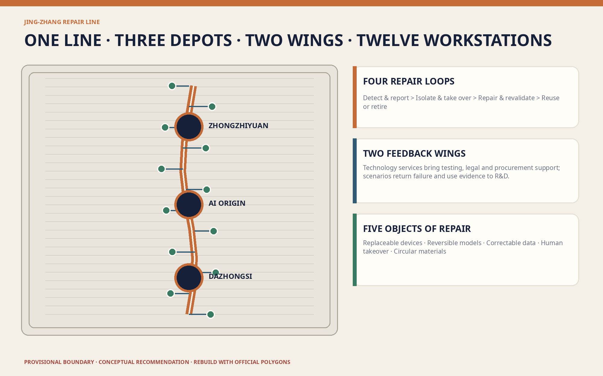
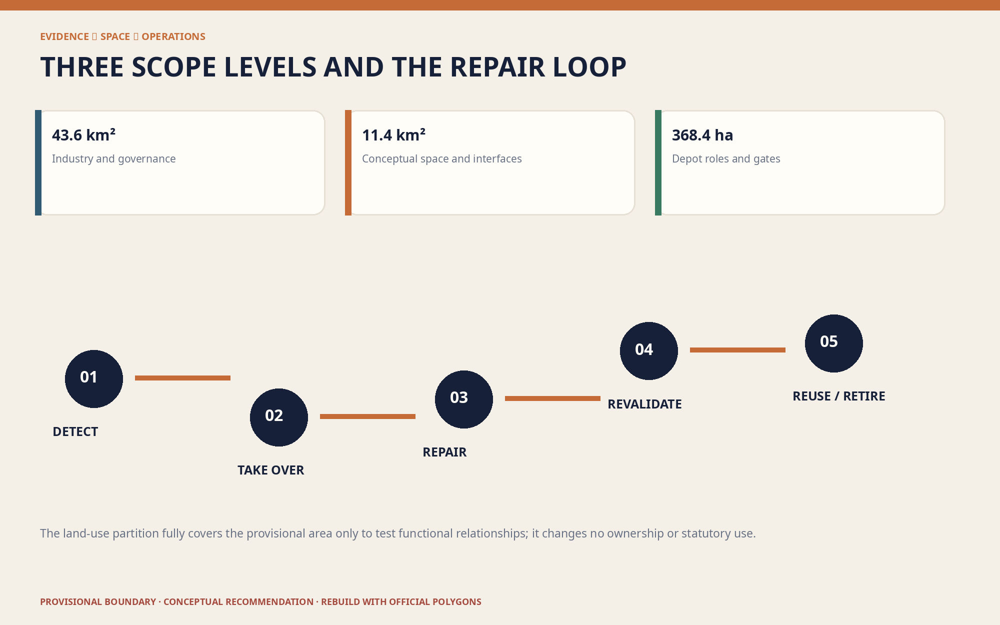
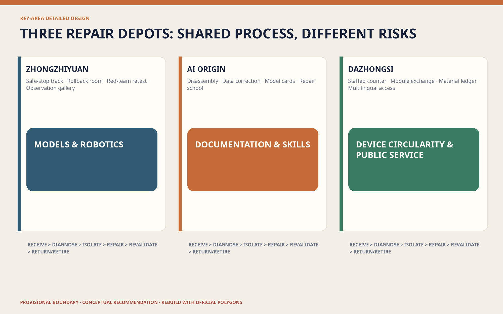
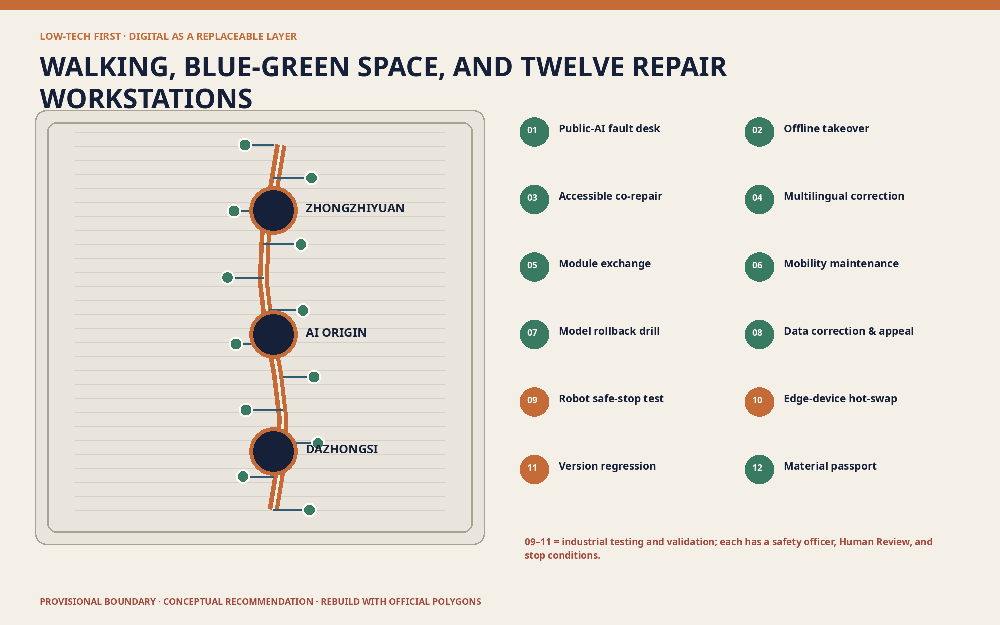
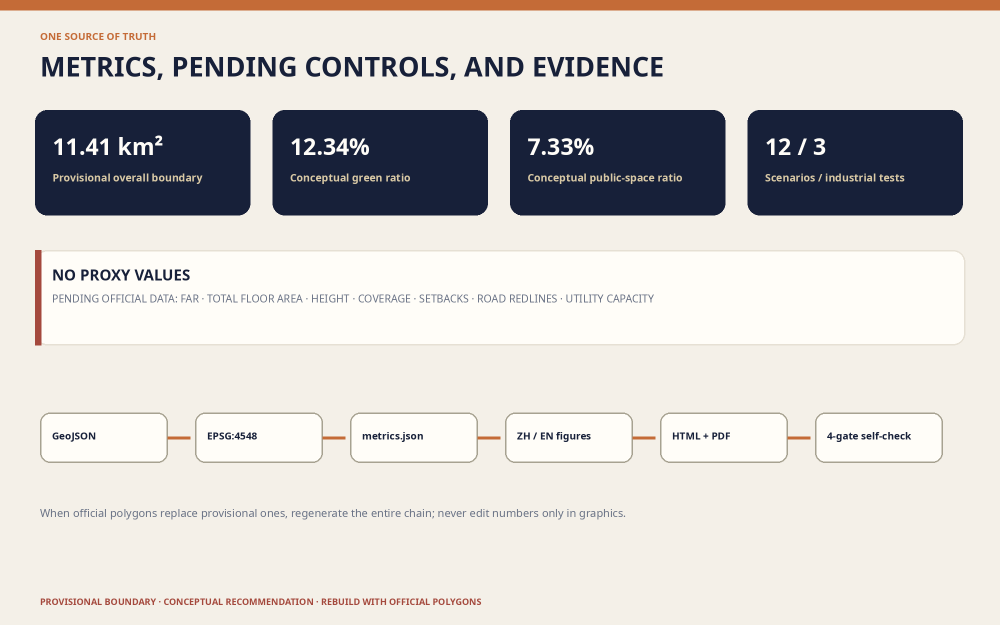

# JING-ZHANG REPAIR LINE

> **Keep the right to repair urban AI on site.** Innovation happens not only when a model launches, but throughout the daily work of opening a failed device, rolling a model back, correcting data, handing a disrupted service to a person, and recovering retired components.

## Design Basis and Source List

The project basis is the qualification announcement issued by the Haidian Branch of the Beijing Municipal Commission of Planning and Natural Resources and the repository's agent-facing taskbook. The announcement defines an approximately 43.6 km² Coordinated Research Area, an approximately 11.4 km² Overall Design Area, and three Key-Area Detailed Design Areas totalling approximately 368.4 ha: Zhongzhiyuan, Beijing AI Origin Community, and Dazhongsi. These are announced quantities, not precise polygons already held by the repository. [source:OFFICIAL-ANNOUNCEMENT]

At submission time, the repository contains no official precise boundaries, parcel ownership, building survey, road redlines, utilities, heritage controls, or approved regulatory metrics. This package uses maintainer-provided rough provisional geometry only to build a discussable, testable, replaceable data framework. Its EPSG:4548 recalculation is approximately 11.41 km², but it is neither an Official Planning Boundary nor a precise-area basis. When official geometry arrives, the entire package must be regenerated from the constraint layer. [data:geometry/site_boundary.geojson#SITE-001]

Sources have four roles: official material confirms tasks and standards; provisional material supports generation and discussion only; international cases contribute mechanisms only; participant-generated layers express Conceptual Recommendations only. No site visit, resident interview, operator confirmation, or engineering survey was conducted, so the proposal does not diagnose existing service quality or claim any approved project, event, budget, or policy commitment. [source:SOURCE-REGISTRY]

The merged peer proposal JINGZHANG BASICS already establishes non-AI equivalent channels and failure substitution for public services. Under its CC BY 4.0 licence, this proposal explicitly distinguishes its scope: it does not repeat the ten-service baseline, but advances the question to whole-lifecycle repair interfaces for devices, models, data, people, and materials. [source:PEER-JINGZHANG-BASICS]

## Three-Level Scope Framework

Each scope asks a different question at a different precision. The coordinated layer asks how the region can form a repairable AI value chain; the overall layer asks how repair capacity enters public space, buildings, walking and cycling, and New Infrastructure; the key-area layer asks who detects, repairs, retests, and retires systems in each place. This avoids presenting regional strategy as construction documentation while still discussing public value before precise base data exists. [depth:three_level_scope_framework]

The spatial structure is **one line, three depots, two wings, and twelve workstations**. The Repair Line follows the Jing-Zhang Railway Heritage Park. Zhongzhiyuan becomes the Model and Robotics Depot; Beijing AI Origin Community becomes the Open Documentation and Skills Depot; Dazhongsi becomes the Device Circularity and Public Service Depot. The two taskbook-defined wings connect technology services and scenario feedback. Twelve workstations distribute visible public repair, controlled industrial testing, and human takeover. [source:AGENT-TASKBOOK]

Repair is organised as four loops: **detect and report; isolate and take over; repair and revalidate; reuse or retire**. Each loop has a spatial host, accountable roles, and stop conditions. Provisional boundaries remain pale and dashed in every drawing; design intent, not the temporary polygon, forms the visual hierarchy. [standard:MOHURD-URBAN-DESIGN-MEASURES]

## Coordinated Research Area: Industry and Future City Research

The regional proposition is to make repair capacity an innovation infrastructure. Universities and institutes contribute models, algorithms, and talent; firms contribute products and services; controlled public scenarios contribute real problems; the technology-services wing supplies testing, legal, insurance, intellectual-property, and procurement support; the scenario-enablement wing returns failure, use, and maintenance evidence to research. Value is assessed not only by launches, but also by documentation completeness, rollback feasibility, part availability, failure disclosure, and retirement traceability. [depth:overall_spatial_structure]

Seven external cases provide mechanisms only. Directive (EU) 2024/1799 points to repair services, information, and longer product life; France's Repairability Index shows how documentation, disassembly, and parts can become visible criteria; Repair Café demonstrates shared skills and community participation; NIST AI RMF offers a Govern–Map–Measure–Manage cycle; EU AI Testing and Experimentation Facilities emphasise real-world validation; Punggol Digital District connects industry, education, community, and an open digital platform; JINGZHANG BASICS protects service continuity. None is Chinese law, a Beijing planning standard, certification, or evidence of local performance. [source:CASE-EU-RIGHT-TO-REPAIR]

The brand is **JING-ZHANG REPAIR LINE / 京张可修线**. Its sign is an unsealed pair of rail joints and a removable bolt: the opening means accessible and replaceable; the joint means returning safely to service. Deep indigo represents the auditable base, oxidised-copper orange railway maintenance, and civic green everyday urban life. It is a proposal identity, not an official mark. [source:AGENT-TASKBOOK]

An annual “Jing-Zhang Repair Season” is proposed as an operating prototype: an open problem call, a 100-day repair sprint, a failed-prototype exhibition, a skills week, an international open-source maintainer residency, and a retirement review. Hosts, dates, budgets, and government involvement remain pending operator confirmation. [source:CASE-REPAIR-CAFE]

## Overall Design Area: Urban Renewal and Regulatory-Plan-Level Urban Design

The overall design starts with a repair-first spatial base, not a predetermined construction quantity. The conceptual land-use partition fully covers the provisional area with research-and-repair, public green, industry services, and community services. It tests functional relationships without changing ownership or statutory land use. Reversible adaptation is the default for building hosts; no demolition is determined before survey. [data:geometry/land_use.geojson#LU-001]

The Repair Line combines continuous Walking and Cycling Network, shade and rest, a device-maintenance edge, staffed counters, and offline wayfinding. Six east–west “feedback links” connect universities, firms, communities, and transit access to the spine, supporting a sequence from field issue to controlled test, human revalidation, and return to service. Lines express connectivity, not road redlines or engineering quantities. [data:geometry/roads.geojson#ROAD-SPINE]

Buildings and devices follow five interface rules: standard fasteners are reachable; high-failure modules can be replaced without damaging the body; power, network, and data can be isolated by zone; a device passport shows owner, version, and fallback; materials can be separated for recovery. These are conceptual procurement and design recommendations subject to fire, electrical, cybersecurity, structural, accessibility, and operational review. [depth:municipal_new_infrastructure]

Floor Area Ratio, total floor area, Building Height, Building Coverage Ratio, setbacks, parking, and utility capacity remain pending official data. Here, Regulatory Detailed Planning depth means known facts, unknown controls, recommendations, and recalculation triggers are separated—not that proxy numbers fill gaps. [metric:floor_area_ratio]

## Detailed Design of Key Areas

**Zhongzhiyuan AI Independent Innovation Acceleration Area — Model and Robotics Depot.** A separated robot safe-stop track, model rollback room, red-team and revalidation benches, version archive, and public observation gallery make failure review visible. Industrial tests are physically separated from everyday open space; a safety officer, emergency stop, test window, and exit rule are explicit. Location and boundary remain provisional. [data:geometry/key_areas.geojson#PROV-KEY-001]

**Beijing AI Origin Community — Open Documentation and Skills Depot.** A “repair school” brings universities, developers, start-ups, and community maintainers together through disassembly tables, a data-correction clinic, model-card workshops, an open documentation room, and a revalidation bench. Public learning and professional testing remain separate; sensitive data and unauthorised research cannot enter open workstations. [data:geometry/key_areas.geojson#PROV-KEY-002]

**Dazhongsi AI Industry Cluster — Device Circularity and Public Service Depot.** The transit arrival interface combines visible staffed service, modular exchange cabinets, component diagnosis, a material-recovery ledger, and multilingual explanations. Commercial demonstration becomes an experience of “openable, explainable, and retireable” technology. A QR code cannot be the only entrance, and maintenance must not occupy an accessible route. [data:geometry/key_areas.geojson#PROV-KEY-003]

All depots share a six-stage sequence—receive, diagnose, isolate, repair, revalidate, return/retire—but have different functions and risks. Official polygons, ownership, building and facility surveys, fire and traffic evidence, utilities, and responsible operators are prerequisites for detailed professional design. This proposal is not a definitive masterplan. [depth:three_key_area_detailed_design]

## AI Innovation Ecosystem, Personas, and AI+ Scenarios

Six personas test exclusion rather than infer individuals. A field maintainer needs isolation, spares, and work orders; a developer needs versions, test sets, and rollback; an SME operator needs comparable maintenance cost and responsibility interfaces; a resident or older person needs staffed and paper channels; a disabled user needs co-tested accessible routes and information; a student or international visitor needs bilingual explanation, learning benches, and responsible staff. Persona data cannot drive commercial targeting. [standard:BARRIER-FREE-ENVIRONMENT-LAW]

The twelve scenario cards are: 01 public-AI fault desk; 02 account-free offline takeover; 03 co-repair of accessible navigation; 04 multilingual explanation correction; 05 modular exchange for public-space devices; 06 walking/cycling and charging maintenance; 07 public-service model rollback drill; 08 data correction and appeal clinic; 09 enclosed robot safe-stop test; 10 edge-device hot-swap and energy retest; 11 urban-model version regression test; 12 retired-part material passport. Cards 09–11 are industry testing and validation scenarios. Every card has a baseline, accountable person, Human Review, stop condition, and retirement path. [metric:scenario_card_count]

Three civic landmarks avoid spectacle. The “Failure Prototype Roundhouse” records failed and repaired prototypes; the “Human Takeover Signal Tower” uses mechanical signals and static signs to show the active service mode; the “Zero-Kilometre Repair Bench” displays tools, contributors, open issues, and component destinations. Their value is current information and skills, not screen size. [metric:landmark_count]

AI may organise public information, flag anomalies, compare versions, draft reviewable explanations, and aggregate feedback. Where a public generative-AI service falls within the applicable Interim Measures, content handling, complaint channels, and accountable human service must be addressed. This proposal does not infer approval, completed filing, or a universal opt-out right from those Measures. [standard:GENERATIVE-AI-INTERIM-MEASURES]

## Land Use, Building Scale, and Retain-Renovate-Demolish Strategy

Four conceptual land-use families line the spine: research repair for controlled tests; park green for open repair and daily movement; industry services for testing and enterprise support; community services for staffed access and shared skills. Codes use the repository's registered subset of the national land-use classification and express intent only, not surveyed conditions or statutory adjustment. [standard:MNR-LAND-USE-CLASSIFICATION-GUIDE]

Conceptual footprints are spatial-demand interfaces, not a building inventory. Three depots and small workstations should first occupy verified retained ground floors, leftover spaces, or reversible structures. Until identity, ownership, structural and fire condition, cultural value, operations, and lifecycle carbon are assessed, the rule is retain or adapt first; demolition needs separate evidence. [data:geometry/buildings.geojson#BLDG-DEPOT-01]

The same order applies to devices: diagnose first; replace a module before a whole unit; roll back a version before enforcing continual upgrades; remanufacture before discarding. Documentation, standard interfaces, tool and spare strategies, and retirement records are recommended without preselecting a supplier. [depth:retain_renovate_demolish]

Only conceptual footprint area is reported now. Statutory building scale, height, density, and FAR remain unknown. Future massing must recalculate daylight, fire access, utilities, traffic, heritage, views, and operational capacity against official parcels and controls. [depth:development_intensity_controls]

## Transport, Rail, Municipal Infrastructure, and Public Services

The transport priority is continuous walking, clear transit arrival, repairable cycle parking, then motor-vehicle planning after professional data. The Repair Line carries north–south walking/cycling and maintenance logistics; feedback links connect the wings and depots. Dazhongsi prioritises accessible arrival, AI Origin campus–district stitching, and Zhongzhiyuan separation of testing logistics from public paths. [depth:traffic_rail_slow_parking]

Every device node has physical, human, and digital layers. The physical layer supplies static signs, seating, light, and accessible interfaces; the human layer handles takeover, explanation, appeals, and professional decisions; the digital layer supplies status, version, fault hints, and aggregate feedback. Basic movement and staffed service must not disappear when a system is offline. [standard:ELDERLY-SMART-TECH-PLAN-2020-45]

New Infrastructure uses small, isolatable, observable, replaceable units. Failure-prone modules face the maintenance edge; power and data are separated; work zones do not invade continuous passage; sensitive data never enters public display. Road redlines, flows, parking, fire access, drainage, power, communications, utilities, and capacity remain prerequisites. [data:geometry/constraints.geojson]

## Blue-Green Network, Public Space, and Urban Character

Blue-Green Space is the low-tech resilience base, not leftover scenery for devices. Continuous shade, water, seats, permeable surfaces, clear directions, and human service precede digital enhancement. Maintenance and pedestrian bands are adjacent but physically separated; temporary work barriers cannot sever an accessible route. The conceptual green ratio is approximately 12.34%, a submitted-layer value rather than a statutory target. [metric:green_ratio]

Public space follows “visible repair, invisible person”: components, versions, fault categories, and aggregate work orders may be displayed; personal routes, faces, identities, and sensitive appeals may not. The conceptual public-space ratio is approximately 7.33%, used to test the network rather than claim existing openness or performance. [metric:public_space_ratio]

Urban Character links railway workshops, signals, and standard parts with contemporary open-source culture. Weathering metal, replaceable timber, recycled metal, and low-glare static signs form a material direction. The generated cover is a conceptual illustration, not a site photograph. Railway history requires rights-cleared evidence; AI interpretation cannot generate unverified facts. [depth:blue_green_public_space]

## Renewal Projects, Implementation Policy, and Phasing

Eight projects are Conceptual Recommendations: R01 official boundary and asset survey; R02 first Repair Line segment and accessibility co-test; R03 Zhongzhiyuan Model and Robotics Depot; R04 AI Origin Repair School; R05 Dazhongsi Device Circularity Depot; R06 controlled tests for twelve scenarios; R07 public fault and retirement ledger; R08 Jing-Zhang Repair Season. Before implementation, each needs named asset, operations, data, model, site-safety, and appeal responsibility. [depth:renewal_project_list]

Phase 1, “verify facts and interfaces,” acquires official boundaries and RDP data, conducts multi-time site, building, facility, accessibility, and operator surveys, and establishes device passports and human-takeover rules. Phase 2, “controlled repair,” opens one supervised, baselined, exit-ready test in each depot and repairs documentation and interfaces before adding devices. Phase 3, “replicate or publicly retire,” scales only after revalidation, accessibility, privacy, maintenance cost, and accountability pass; failures are explained and removed. [data:geometry/phasing.geojson#PHASE-001]

Policy prototypes include a repairability statement, open work orders, rollback requirements, spare and tool lists, human-takeover clauses, data-correction and appeal clauses, test-exit clauses, component passports, and an annual review. They are proposals for procurement, operation, and professional study—not current local policy or government commitments. [source:CASE-FR-REPAIRABILITY-INDEX]

## Metrics, Area Recalculation, and Compliance Matrix

Metrics have three classes. First are announced quantities: 43.6 km², 11.4 km², and the three key-area areas. Second are provisional geometry and package completeness: approximately 11.41 km², green and public-space ratios, footprints, 12 scenarios, 3 industrial tests, 6 personas, 3 landmarks, 7 cases, 4 repair loops, and 8 projects. Third are pending official controls: FAR, total floor area, height, density, road-area ratio, setbacks, parking, and utility capacity. [metric:site_area_sqm]

Every second-class count describes what exists in the submission, not deployed city performance. The recalculation order is fixed: replace constraints; calculate in EPSG:4548; regenerate derived layers and metrics; regenerate bilingual figures, HTML, and PDFs; refresh hashes; run the four-gate self-check. Numbers must never be changed in images alone. [depth:metrics_recalculation]

The compliance matrix links all 23 announcement and agent-taskbook requirements to chapters, layers, metrics, drawings, pages, sources, assumptions, and checks. The standard matrix records applicability; the design-depth matrix records the evidence arrangement. Complete indexes remain machine-readable rather than overwhelming the narrative. [standard:PROJECT-OFFICIAL-ANNOUNCEMENT]

## Risk, Copyright, and Compliance

The primary risk is mistaking provisional geometry for official planning; every figure and page therefore uses dashed boundaries and explicit warnings. The second is diagnosing a place without fieldwork; this package proposes verification objects and conceptual interfaces only. The third is safety, privacy, and responsibility within repair itself: open benches cannot handle sensitive data, robot tests require enclosure, and any AI service must support human takeover and safe stop. [depth:risk_missing_data]

The Barrier-Free Environment Law is used only within its express scope and does not prove site compliance. The 2020 elderly smart-technology plan is background for maintaining traditional channels and not evidence of present Haidian implementation. The Interim Measures are applied only where a public generative-AI service falls within their scope. These references are not legal advice. [source:BARRIER-FREE-LAW]

The bilingual text, design geometry, diagrams, pages, and PDFs were generated by OpenAI Codex for xitongsitian and are released under CC BY 4.0. The cover was generated from a text prompt with OpenAI's image-generation tool and labelled conceptual. No third-party photographs, map tiles, trademarks, portraits, or font files are redistributed; system Noto Sans CJK and DejaVu Sans are used for local rendering only. [source:COVER-IMAGEGEN]

This proposal is not government approval, a statutory plan, engineering design, investment commitment, certification, or legal opinion. Official boundaries and controls, ownership and building surveys, transport/utilities/fire evidence, heritage/tree surveys, operators and budgets, public participation, and impact assessment are prerequisites. [assumption:A-CONTROLS-001]

## References

1. Haidian Branch of the Beijing Municipal Commission of Planning and Natural Resources, qualification announcement for the Centennial Jing-Zhang AI Innovation Belt. [source:OFFICIAL-ANNOUNCEMENT]
2. Agent-facing taskbook for the Centennial Jing-Zhang AI Innovation Belt Open Call for Urban Design. [source:AGENT-TASKBOOK]
3. Directive (EU) 2024/1799; France Repairability Index; Repair Café Foundation. [source:CASE-EU-RIGHT-TO-REPAIR]
4. NIST AI RMF 1.0; EU AI Testing and Experimentation Facilities; JTC Punggol Digital District. [source:CASE-NIST-AI-RMF]
5. FoxBai, JINGZHANG BASICS, CC BY 4.0. [source:PEER-JINGZHANG-BASICS]

Full bibliographic records, access dates, use limits, and asset rights are in `sources.json` and `report/copyright_statement.md`. International mechanisms are not Beijing controls; provisional geometry is not an Official Planning Boundary. [source:SITE-PACKAGE]
