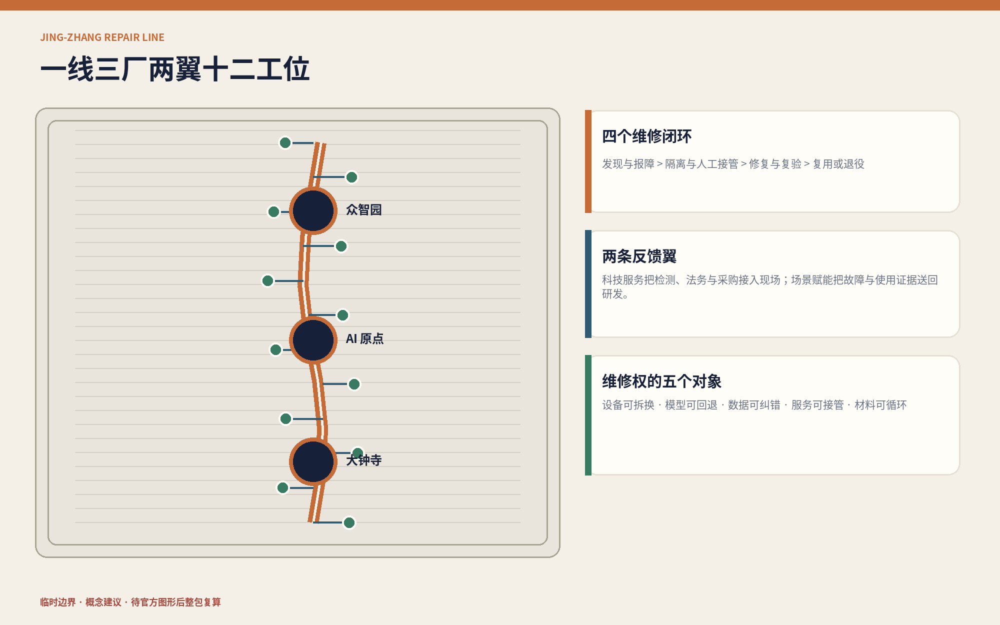
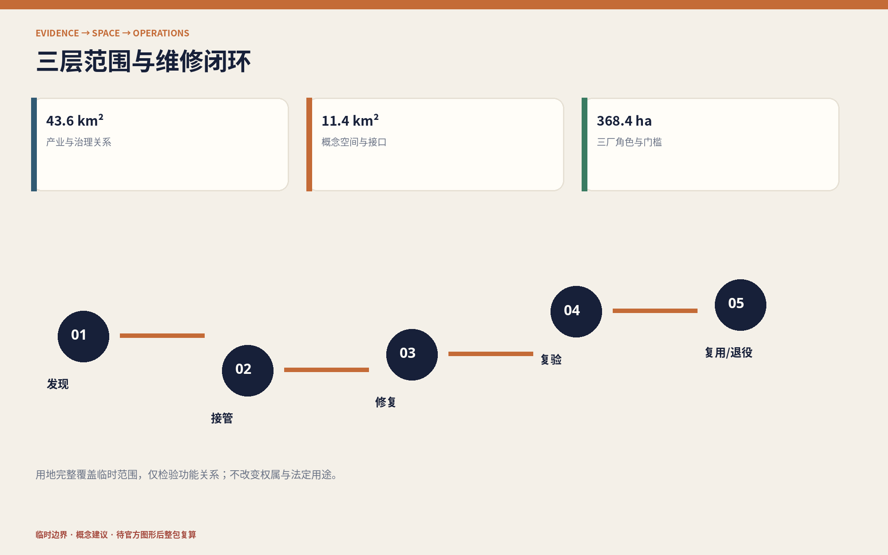
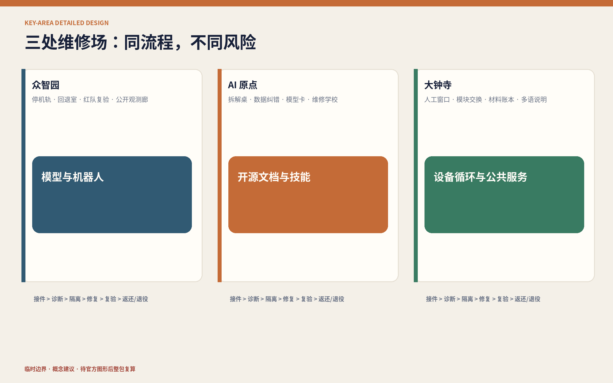
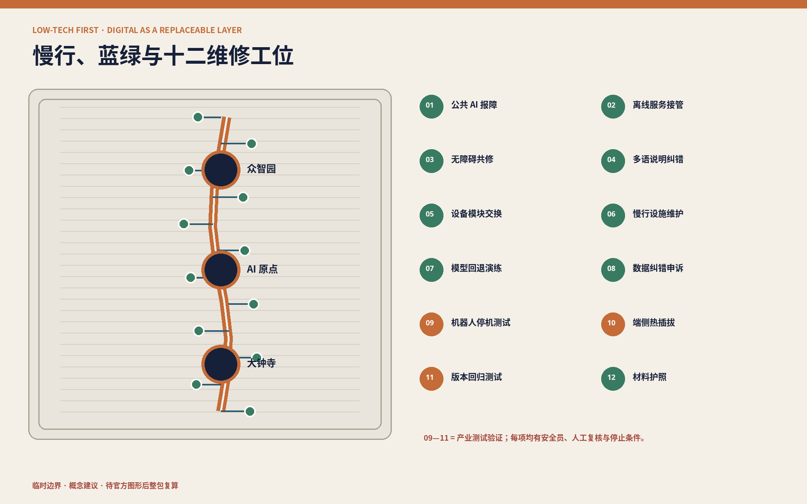
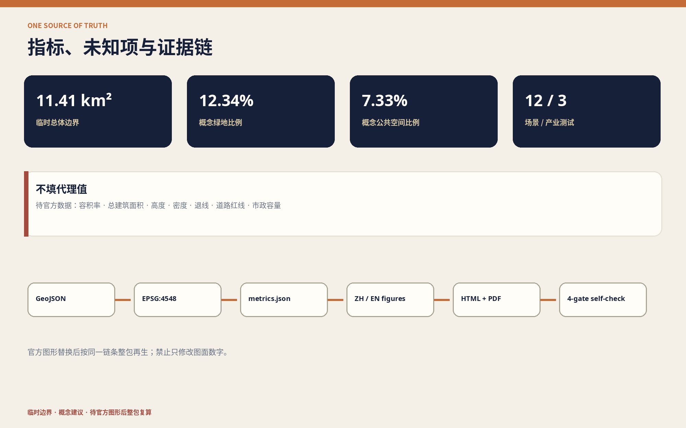

# 京张可修线 / JING-ZHANG REPAIR LINE

> **把城市 AI 的维修权留在现场。** 创新不只发生在发布新模型的一刻，也发生在设备坏了能拆开、模型失效能回退、数据出错能纠正、服务中断有人接手、部件退役能够再用的一整套日常工作里。

## 设计依据与资料清单

本方案以北京市规划和自然资源委员会海淀分局发布的资格预审公告和仓库内面向智能体的任务书为项目依据。公告确定约 43.6 平方公里统筹研究范围、约 11.4 平方公里总体设计范围，以及众智园、北京 AI 原点社区、大钟寺三处共约 368.4 公顷重点区域；这些数字是公告口径，不等于仓库已有精确红线。[source:OFFICIAL-ANNOUNCEMENT]

截至本次提交，仓库没有官方精确边界、地块权属、建筑普查、道路红线、管线、文保与控规指标。本包采用维护者提供的临时粗略几何，只为构建可讨论、可校验、可替换的数据骨架。临时总体边界在 EPSG:4548 下复算约 11.41 平方公里，但它不得被称为官方红线或精确面积依据；官方图形到位后应从约束层开始整包再生。[data:geometry/site_boundary.geojson#SITE-001]

资料按四级使用：官方材料确认任务与标准；临时资料仅支撑生成和讨论；国际案例只提取机制；本方案生成的图层只表达概念建议。未做现场踏勘、居民访谈、运营方确认或工程勘察，因此不判断现状设施好坏，也不声称任何项目、活动、预算或政策已获政府承诺。[source:SOURCE-REGISTRY]

同伴方案“京张基本功”已提出公共服务的非 AI 等价渠道和故障替代，本方案据其 CC BY 4.0 文本明确区分：不再重复“十项基本服务”框架，而把研究对象推进到设备、模型、数据、人员和材料的全生命周期维修接口。[source:PEER-JINGZHANG-BASICS]

## 三层范围工作框架

三层范围对应三种问题和三种精度。统筹研究层回答“区域如何形成可修复 AI 产业链”；总体设计层回答“维修能力如何进入公共空间、建筑、慢行和新型基础设施”；重点区域层回答“谁在什么场所完成检测、修复、复验和退役”。这避免把区域策略伪装成施工图，也避免因缺少正式底图而停止对公共价值的讨论。[depth:three_level_scope_framework]

空间结构概括为 **“一线、三厂、两翼、十二工位”**。一线是沿京张铁路遗址公园组织的“可修主线”；三厂分别是众智园的模型与机器人检修场、北京 AI 原点社区的开源文档与技能场、大钟寺的设备循环与公共服务场；两翼复用任务书的中关村科技服务翼和小月河场景赋能翼；十二工位把维修活动分布到公众可见、产业可测、人员可接管的节点。[source:AGENT-TASKBOOK]

本方案把维修过程定义为四个闭环：**发现与报障—隔离与人工接管—修复与复验—复用或退役**。每个闭环都有空间载体、责任角色和停止条件，所有节点都能在图层与任务覆盖矩阵中定位。图上的临时边界用低对比虚线表达，设计主线和三厂才是视觉主体。[standard:MOHURD-URBAN-DESIGN-MEASURES]

## 统筹研究范围产业与未来城市研究

统筹研究范围的产业命题是“把维修能力做成创新基础设施”。高校和研发机构提供模型、算法与人才，企业提供产品与服务，公共场景提供受控问题，科技服务翼提供检测、法务、保险、知识产权和采购支持，场景赋能翼把故障、使用与维护反馈送回研发。产业价值不只按发布数量衡量，也观察文档是否齐全、回退是否可行、零部件是否可获得、故障是否被记录、退役资产是否可追踪。[depth:overall_spatial_structure]

七个外部案例只提供可转化机制：欧盟 2024/1799 维修指令提示维修服务、信息透明和延长产品寿命；法国可修复性指数提示把文档、拆解、零件等条件转成可见结构；Repair Café 提示技能共享和社区参与；NIST AI RMF 提供 Govern–Map–Measure–Manage 风险循环；欧盟 AI 测试与实验设施强调真实环境验证；新加坡榜鹅数字园区提示产业、教育、社区和开放数字平台协同；“京张基本功”提示任何 AI 增强都不能吞掉服务连续性。它们均不构成中国法律、北京规划标准、认证资格或本项目绩效证明。[source:CASE-EU-RIGHT-TO-REPAIR]

品牌采用 **JING-ZHANG REPAIR LINE / 京张可修线**。标志由一对没有闭死的轨道接头和一枚可拆螺栓构成：开口表示可进入、可替换，连接表示修复后重新上线。深靛蓝代表可审计底座，氧化铜橙代表铁路维修，公共绿代表城市日常。标志只用于导向、工单、设备护照和年度报告，不暗示官方标识。[source:AGENT-TASKBOOK]

长期运营以“京张维修季”为年度循环：公开问题征集、100 天修复冲刺、失效原型展、维修技能周、国际开源维护者驻留和年度退役复盘。活动是否举办、主办主体、频次和预算均待正式运营方确认，本次只提出可供深化的运营原型。[source:CASE-REPAIR-CAFE]

## 总体设计范围城市更新与控规深度城市设计

总体设计不是先决定新建多少，而是先建立“维修前置”的空间底座。概念用地完整覆盖临时范围并分为研发检修、公共绿地、产业服务、社区服务四类；它用于测试功能关系，不改变现状权属或法定用地。建筑载体以可逆适配为默认，正式普查前不确定拆除对象。[data:geometry/land_use.geojson#LU-001]

可修主线包含连续慢行、遮荫休息、设备维护带、人工服务台和离线导向。六条东西向“反馈横线”将高校、企业、社区和轨道接驳点连接到主线，形成“现场问题进入—受控测试—人工复验—重新上线”的路径。当前线位只表达连接关系，不是道路红线或工程长度。[data:geometry/roads.geojson#ROAD-SPINE]

建筑与设施采用五项界面规则：标准紧固件可达；高故障模块无需破坏主体即可更换；电源、网络和数据可分区隔离；设备护照公开责任人、版本与替代方式；材料可拆分回收。规则是概念性的采购与设计建议，仍需消防、电气、网络安全、结构、无障碍和运营专业核对。[depth:municipal_new_infrastructure]

容积率、总建筑面积、建筑高度、建筑密度、退线、停车和市政容量保持未知。控规深度在本阶段体现为已知、未知、概念建议和复算触发条件被清楚分开，而不是用代理数字补空白。[metric:floor_area_ratio]

## 重点区域详细设计

**众智园 AI 自主创新加速区——模型与机器人检修场。** 设置围合机器人安全停机轨、模型回退测试室、红队/复验工位、版本档案和公开观测廊。产业测试与日常开放空间物理分隔，现场安全员、急停、测试窗口和退出条件可见。其位置和边界均为临时概念表达。[data:geometry/key_areas.geojson#PROV-KEY-001]

**北京 AI 原点社区——开源文档与技能场。** 把高校、开发者、初创团队与社区维护人员组织到同一“维修学校”：设备拆解桌、数据纠错诊所、模型卡工作坊、开源文档室和成果再验证台。公共学习与专业测试分区，敏感数据和未经授权成果不得进入开放工位。[data:geometry/key_areas.geojson#PROV-KEY-002]

**大钟寺 AI 产业聚集区——设备循环与公共服务场。** 轨道抵达界面设置可见人工服务、模块交换柜、部件诊断台、材料回收账本和多语说明；商业展示转为“拆得开、讲得清、退得掉”的体验。扫码不能成为唯一入口，维修作业不得占用无障碍通行空间。[data:geometry/key_areas.geojson#PROV-KEY-003]

三厂共享“接件—诊断—隔离—修复—复验—返还/退役”六段空间序列，但功能和风险不同。正式深化前必须取得官方多边形、权属、建筑与设施普查、消防、交通、市政和运营主体资料；本图不构成确定总平面。[depth:three_key_area_detailed_design]

## AI 创新生态、人才画像与 AI+ 场景

六类画像用于检查空间是否排除某类人，而不用于推断个人：现场维修员需要安全隔离、备件和工单；开发者需要版本、测试集和回退环境；中小企业运营者需要可比较的维护成本与责任接口；周边居民和老人需要人工与纸面渠道；残障使用者需要共同测试无障碍路径和信息；学生与国际访客需要双语说明、学习工位和责任人员。画像数据不进入商业推荐。[standard:BARRIER-FREE-ENVIRONMENT-LAW]

十二张场景卡分别为：01 公共 AI 报障台；02 无账号离线服务接管；03 无障碍导航共同修复；04 多语说明纠错；05 公共空间设备模块交换；06 慢行与充电设施维护；07 公共服务模型回退演练；08 数据纠错与申诉诊所；09 围合机器人安全停机测试；10 端侧设备热插拔与能耗复验；11 城市模型版本回归测试；12 退役部件材料护照。09—11 为产业测试验证场景，每一项均有基线、责任人、人工复核、停止条件和退役路径。[metric:scenario_card_count]

三个公共地标不追求巨物化：“故障原型机务段”保存失败和修复过程；“人工接管信号塔”用机械信号与静态标识显示当前服务方式；“零公里维修台”公开工具、贡献者、问题队列和部件去向。地标价值来自可持续更新的信息与技能，而非屏幕尺寸。[metric:landmark_count]

AI 只辅助整理公开信息、发现异常、比较版本、生成可复核说明和汇总聚合反馈。公共生成式 AI 若进入真实服务，应按适用范围落实内容处置、投诉举报与人工责任；本方案不以该办法推导审批通过、备案完成或通用“退出权”。[standard:GENERATIVE-AI-INTERIM-MEASURES]

## 用地、建筑规模与拆改留方案

四类概念用地沿主线组织：研发检修区承载受控实验，公园绿地承载开放维修与日常慢行，产业服务区承载检测和企业服务，社区服务区承载人工窗口与技能共享。代码沿用仓库登记的国土空间用途分类子集，只表示设计意图，不替代现状调查或法定调整。[standard:MNR-LAND-USE-CLASSIFICATION-GUIDE]

概念建筑基底是“空间需求接口”，不是现场建筑清单。三座维修场和若干小型工位优先嵌入可确认保留的首层、边角空间和可逆构件；在建筑身份、产权、结构消防、历史价值、运营需求和全生命周期碳比较完成前，统一采用“保留或适配优先、拆除待另证”。[data:geometry/buildings.geojson#BLDG-DEPOT-01]

设备级拆改留也采用同样顺序：先诊断，能换模块不换整机，能回退版本不强迫连续升级，能再制造不直接报废。设计建议要求关键部件有标准接口、工具清单、文档、备件策略和退役记录，但不预设具体供应商或采购结果。[depth:retain_renovate_demolish]

当前仅报告可由概念图层复算的建筑基底面积；法定建筑规模、高度、密度与容积率均待官方地块和控规条件补齐。任何后续体量方案须重新核对日照、消防、市政、交通、文保、视廊和运营容量。[depth:development_intensity_controls]

## 交通、轨道、市政与公共服务设施

交通顺序是“步行连续—轨道抵达清楚—骑行可停可修—机动车待专业数据”。可修主线承担南北步行骑行和维修后勤，反馈横线联系两翼与三厂；大钟寺侧强调无障碍抵达，原点侧强调校区园区缝合，众智园侧强调测试物流与公众路径分离。[depth:traffic_rail_slow_parking]

每个设备节点都由物理层、人工层、数字层构成：物理层提供静态标识、座椅、照明和可达接口；人工层负责接管、解释、申诉和专业判断；数字层只提供状态、版本、故障提示和聚合反馈。系统离线时，基本通行和人工服务不能随之关闭。[standard:ELDERLY-SMART-TECH-PLAN-2020-45]

新型基础设施采用“小单元、可隔离、可观测、可替换”：高故障模块面向维护侧，动力与数据线路分开，维护作业区不侵入连续通行面，敏感数据不进入开放展示。正式深化须补齐道路红线、客流、停车、消防、排水、电力、通信、管线和设施容量。[data:geometry/constraints.geojson]

## 蓝绿空间、公共空间与城市风貌

蓝绿空间不是设备的剩余背景，而是低技术优先的韧性底座。连续树荫、可饮水、可坐、透水地面、清楚导向和人工服务先于数字增强；维修带与步行主线并置但物理分隔，临时围挡不得切断无障碍通行。概念绿地比例约 12.34%，只描述本方案图层，不是法定绿地率。[metric:green_ratio]

公共空间采用“看得见维修、看不见个人”的原则：可以展示部件、版本、故障类别和聚合工单，不展示个人轨迹、面孔、身份或敏感申诉。概念公共空间比例约 7.33%，用于验证场所网络关系，不能替代现状开放性或使用绩效调查。[metric:public_space_ratio]

城市风貌把百年铁路的机务、信号、标准件与当代开源文化连接起来。材料以耐候钢、可替换木构件、再生金属和低眩光静态标识为方向；生成封面是概念插画，不是现场照片。铁路史实必须来自清权史料，AI 导览不得生成未经核验的历史事实。[depth:blue_green_public_space]

## 更新项目清单、实施政策与分期计划

八个更新项目均为概念建议：R01 官方边界与资产普查；R02 可修主线首段及无障碍共测；R03 众智园模型与机器人检修场；R04 原点社区维修学校；R05 大钟寺设备循环场；R06 十二场景的受控试验；R07 故障与退役公开账本；R08 京张维修季。每项在进入实施前都需明确资产、运营、数据、模型、现场安全和申诉责任人。[depth:renewal_project_list]

第一期“先核事实与接口”：取得正式边界和控规资料，完成多时段现场、建筑、设施、无障碍与运营普查，建立设备护照和人工接管规则。第二期“受控试修”：三厂各开放一个有安全员、基线和退出条件的试验，先修文档与接口再扩设备。第三期“达标复制或公开退役”：只有复验、无障碍、隐私、维护成本和责任机制通过，才沿主线复制；未通过者公布原因并撤除。[data:geometry/phasing.geojson#PHASE-001]

政策工具包括可修复性说明表、开放工单、版本回退要求、备件与工具清单、人工接管条款、数据纠错与申诉条款、测试退出条款、部件材料护照和年度复盘。它们是供采购、运营和专业团队研究的条款原型，不是现行地方政策或政府承诺。[source:CASE-FR-REPAIRABILITY-INDEX]

## 指标体系、面积复算与合规矩阵

指标严格分三类。第一类是公告口径：43.6 平方公里、11.4 平方公里和三处重点区公告面积。第二类是临时几何与方案完整性：临时边界约 11.41 平方公里、绿地与公共空间比例、建筑基底、12 场景、3 产业测试、6 画像、3 地标、7 案例、4 维修闭环和 8 项目。第三类是未知控制：容积率、总建筑面积、高度、密度、道路面积率、退线、停车和市政容量。[metric:site_area_sqm]

所有第二类数量都是“提交中是否存在”的设计证据，不是城市运行绩效。复算顺序固定为：替换约束图层—在 EPSG:4548 计算—生成派生图层和指标—再生中英图件、HTML 与 PDF—刷新哈希—运行四门自检。不得只手改图上的数字。[depth:metrics_recalculation]

任务覆盖矩阵逐条连接公告和 agent.1—agent.6 的 23 项要求；专业标准矩阵说明依据与适用边界；设计深度矩阵说明已完成的证据组织。完整矩阵不堆入正文，但所有核心判断可回到 GeoJSON、metrics、图纸和自检。[standard:PROJECT-OFFICIAL-ANNOUNCEMENT]

## 风险、版权与合规说明

最高风险是把临时几何误读为官方规划，故所有图件和网页均以虚线、水印和文字披露其临时性。第二是“无现场替现场下结论”，所以本包只提出核验对象和概念接口。第三是维修本身产生安全、隐私和责任风险，因此开放工位不处理敏感数据，机器人测试必须围合，任何 AI 服务必须能人工接管和安全停止。[depth:risk_missing_data]

无障碍法只在其明确适用范围内作为服务与设施设计依据，不据此声称本场地完成合规审查；老年人智能技术文件只作保留传统服务渠道的背景，不声称海淀已执行某项阶段目标；生成式 AI 办法只在面向公众提供相应服务时适用。法律和政策引用不是法律意见。[source:BARRIER-FREE-LAW]

中英文文字、设计图层、图解、网页与 PDF 由 OpenAI Codex 为 xitongsitian 本次提交生成并以 CC BY 4.0 发布。封面由 OpenAI 图像生成工具依据文字提示生成，明确标作概念表达；包内不分发第三方照片、地图瓦片、商标、肖像或字体文件。系统 Noto Sans CJK 与 DejaVu Sans 仅用于本地栅格/PDF 渲染。[source:COVER-IMAGEGEN]

本方案不构成政府批准、法定规划、工程设计、投资承诺、认证或法律意见。官方边界与控规、权属与建筑普查、交通市政消防、文保树木、运营主体预算、公众参与和影响评估是专业深化前置条件。[assumption:A-CONTROLS-001]

## 参考资料

1. 北京市规划和自然资源委员会海淀分局，百年京张 AI 创新带城市设计国际方案征集资格预审公告。[source:OFFICIAL-ANNOUNCEMENT]
2. 面向全球智能体开展百年京张 AI 创新带城市设计开源征集任务书摘录。[source:AGENT-TASKBOOK]
3. 欧盟 2024/1799 维修指令；法国生态转型部门可修复性指数；Repair Café Foundation。[source:CASE-EU-RIGHT-TO-REPAIR]
4. NIST AI RMF 1.0；欧盟 AI 测试与实验设施；JTC 榜鹅数字园区。[source:CASE-NIST-AI-RMF]
5. FoxBai，“京张基本功”，CC BY 4.0。[source:PEER-JINGZHANG-BASICS]

完整书目、访问日期、用途、限制和资产权利见 `sources.json` 与 `report/copyright_statement.md`；国际机制不作为北京控制标准，临时图形不作为官方红线。[source:SITE-PACKAGE]
