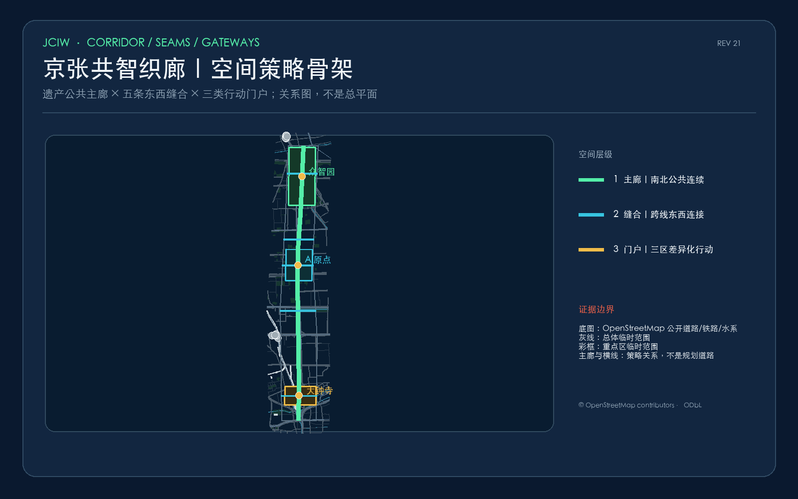
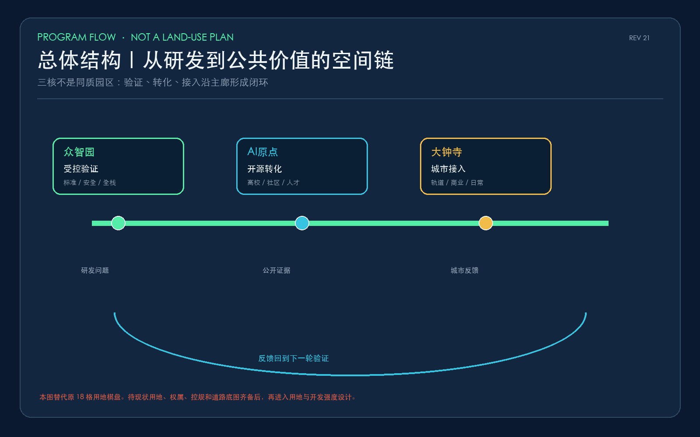
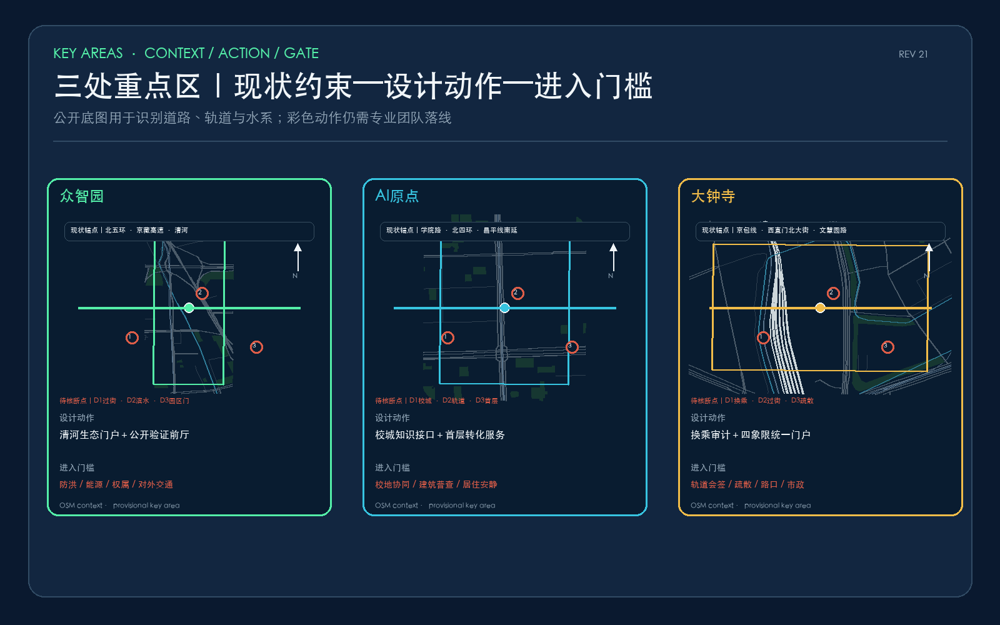
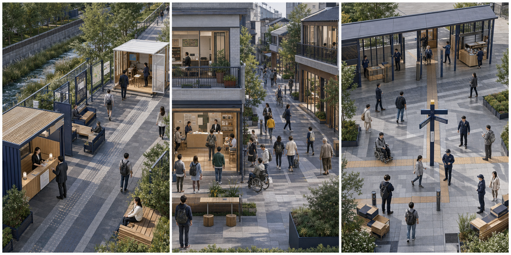
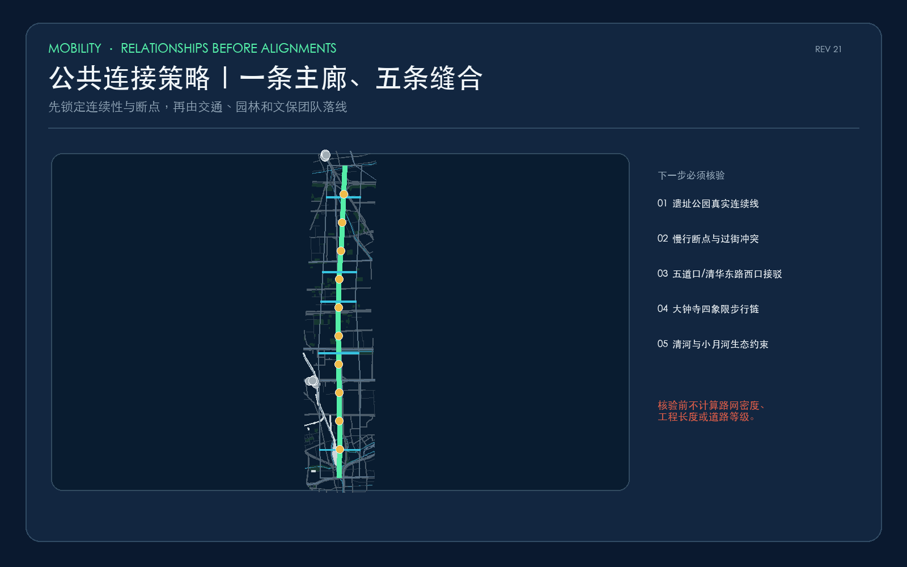
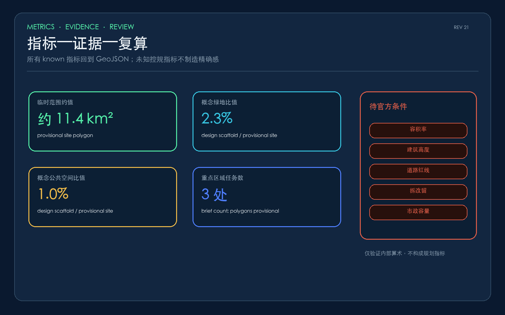

# 京张共智织廊：百年铁路上的可验证公共智能城市

> REV 21（可核验细化版）：本方案完整采用举办方提供的公开资料与 provisional geometry，**符合内容与专业评分入口要求**。在既有场景与空间闭环上，进一步把用地、分期、路网、密度、重点区面积及任务书成果数量转为可追溯、可复算、明确非官方的指标层。

## 设计依据与资料清单

本概念方案以北京市规划和自然资源委员会海淀分局发布的《百年京张AI创新带城市设计国际方案征集资格预审公告》为第一依据，并以 `brief/site-package/` 中经维护者登记的临时粗略边界、重点区域、枚举、指标和来源清单为机器可读依据。当前包已读取并索引 `design_brief.json`、`allowed_design_space.json`、`sources.json`、`enums/`、`ranges/`、`schemas/`、`data/source_registry.json` 和 `data/processed/agent_fact_pack.md`，并用 `project_scope_summary.csv`、`agent_task_requirements.csv`、`source_use_matrix.csv`、`missing_data_checklist.csv` 建立任务、范围、资料用途和缺口清单。现有设计判断已尽量拆分为可追溯来源、可复算指标、可校验图层和可人工复核假设；但公告要求的控制性详细规划城市设计深度和规划综合实施方案深度尚未由当前 GeoJSON、指标表、A3 文册、A0 展板和 HTML 成果充分证明。

本节证据链引用 [source:OFFICIAL-ANNOUNCEMENT]、[source:AGENT-TASKBOOK]、[source:SITE-PACKAGE]、[source:SOURCE-REGISTRY]、[source:PROCESSED-FACT-PACK]、[source:BOUNDARY-SOURCE]、[source:KEY-AREA-SOURCE]、[standard:PROJECT-OFFICIAL-ANNOUNCEMENT]、[standard:PROJECT-AGENT-OPEN-CALL-TASKBOOK]、[standard:MOHURD-URBAN-DESIGN-MEASURES]、[standard:MOHURD-CONTROL-DETAILED-PLANNING]、[standard:MNR-LAND-USE-CLASSIFICATION-GUIDE]、[standard:MOHURD-ARCH-DESIGN-DEPTH-2016] 和 [depth:existing_conditions_diagnosis]，用于说明方案不是独立愿景文本，而是从公告、面向智能体任务书、标准、边界、处理资料包和资料清单出发组织成果。

资料登记表的使用边界如下：

- data/source_registry.json 登记公开、清权与临时资料的用途边界。
- 当前登记摘要：formal 可用资料 5 条，背景资料 0 条，provisional-only 资料 1 条。
- agent 不得把 background_only 或 provisional_only 资料升级为 official boundary、法定控规、正式评分依据或政府实施承诺。

`data/processed/agent_fact_pack.md` 是本方案的阅读导航层，不是新的权威来源。[source:PROCESSED-FACT-PACK] 只帮助 agent 把三层范围、三处重点区、公告任务、agent.1-agent.6、资料可用性和缺资料事项组织成可读方案；所有事实判断仍回到 [source:OFFICIAL-ANNOUNCEMENT]、[source:AGENT-TASKBOOK]、[source:SOURCE-REGISTRY]、[source:BOUNDARY-SOURCE] 与 [source:KEY-AREA-SOURCE]。

本脚手架在官方 `SITE_BOUNDARY` 或三处 `KEY_AREA` 尚未取得时，使用 `brief/site-package/geometry/provisional_boundaries.geojson` 生成临时 formal 包。提交包中的 `geometry/site_boundary.geojson` 与 `geometry/key_areas.geojson` 均必须标注为 `provisional_constraint`、`official_boundary=false`，只能用于方案生成、自检、可视化和设计讨论，不能作为 official redline、审批依据、精确面积依据或法定控制结论。该组织方数据缺口本身不阻断内容评分；替换 official polygons 后，site boundary、key areas、land use、roads、green space、public space、buildings、phasing 和 metrics 均需重算。

本次方案使用举办方提供的临时边界，**符合内容与专业评分要求，不构成扣分或阻断项**。评审可完整评价设计概念、空间原型、公共利益、治理机制、实施路径与表达质量；临时边界仅意味着精确面积、道路红线、地块权属、工程量和审批结论不得冒充法定事实。若举办方后续补充 official polygon，方案将统一复算，而不是否定本轮设计成果。

边界和重点区域的可读解释对应 [data:geometry/site_boundary.geojson#SITE-001]、[data:geometry/key_areas.geojson#PROV-KEY-001] 和 [metric:site_area_sqm]、[metric:key_area_count]。这意味着读者可以从正文回到 GeoJSON 查看边界来源、从 metrics 查看面积复算结果、从 sources 查看资料来源，而不是只相信一段文字判断。

## 证据状态与资料缺口

本版采用三类证据标签：**文件直接证明**用于来源原文、字段和提交内容；**运行验证证明**仅用于几何拓扑、哈希与算术一致性；**概念推断**用于空间结构、项目、场景及运营建议。运行复算只能证明“提交的临时几何彼此一致”，不能证明真实边界、现状或实施可行性。

当前九项前置缺口为：三层官方边界、三处重点区官方边界、控规、道路、宗地权属、现状建筑、文保、市政安全、公共服务设施。它们分别登记为 `A-BOUNDARY-001` 至 `A-SERVICE-001`，详见 `assumptions.json`。因此：

- 约 11.4 km²、绿地率、公共空间率和建筑基底只作为 **provisional geometry calculation**，不作为现状或法定指标；
- 早期参数化用地、建筑和道路图形已撤回；当前只保留策略关系与公开底图参照；
- 十个 AI 场景节点 [metric:scenario_node_count]已与 `JCIW-NODE-01` 至 `JCIW-NODE-10` 一一对应，但点位仍是概念锚点，不是选址结论；
- `constraints.geojson` 为空本身就是证据缺口，不得作为“已完成约束分析”的证明；
- 官方自检 PASS 仅代表格式、静态安全、拓扑或内部一致性通过。

本版的可审查价值是：设计概念、治理原则、待验证项目假设和数据交接框架；不声称已完成控规深度城市设计、重点区详细设计或工程设计。

## 核心概念与差异化机制

“京张共智织廊”不是给传统科技园换一套 AI 名称，而是把一条百年铁路转化为**公共智能的城市验证网络**。京张铁路曾以工程系统连接城市与知识，本方案延续这种系统性：遗址公园不是项目背后的景观绿带，而是所有人都能进入的公共主界面；高校、企业、社区与轨道门户不是各自封闭的园区，而是通过日常步行、开放首层、可逆试验和公开复盘相互编织。方案的原创性不依赖一个巨型地标，而来自四个彼此咬合的机制。

1. **空间织法（Weave）**：以遗产公共廊为经线，以高校—企业—社区—轨道站点的横向联系为纬线，形成“一廊、三梭、两翼、十站”的网络。每一“站”必须同时接入日常慢行、公共服务和人工值守，不能成为孤立的智能装置。
2. **场景契约（Protocol）**：每个 AI 场景都不是产品清单，而是一份可审查的城市服务协议，明确服务对象、公共问题、最小数据、人工责任、非 AI 通道、申诉方式和退出阈值。技术只有接受这份契约，才能进入公共空间。
3. **证据门（Evidence Gate）**：文件事实、运行复算与概念推断分层表达。边界、控规、权属、文保、市政等证据未闭合时，方案允许提出可逆原型，但不允许制造法定精度或工程承诺。
4. **版本治理（Versioned City）**：城市更新不按“建成即完成”理解，而以“共同校准—可逆验证—专业固化—年度复评”持续迭代。每个项目保留版本号、责任主体、公开结果和撤除条件，让失败试验可以退出、有效做法可以复制。

四个机制共同回答本方案的差异化命题：**AI 城市的先进性，不在于部署了多少模型和传感器，而在于城市是否有能力让智能服务被公众理解、质疑、修正和停止。** 三处重点区域因此承担不同环节：AI 原点社区负责知识发布与开源协作，众智园负责受控验证与标准治理，大钟寺负责城市接入与市场连接；三者通过公共廊和统一场景契约构成一个可进入、可参与、可退出的共同体，而不是三个同质化园区。

## 三层范围工作框架

方案按照公告确定的三个层次组织工作：统筹研究范围关注 43.6 平方公里的AI产业生态、战略定位、创新链和未来城市形态；总体设计范围关注 11.4 平方公里京张遗址公园周边 1-2 公里城市地区和产业区，要求形成城市更新总体框架、产业空间布局、交通市政支撑和城市风貌控制；重点区域范围关注 368.4 公顷三处详细设计地区，要求明确功能业态、建筑规模、拆改留分类、公共空间连通和交通组织。三层范围在 `compliance_matrix.json` 中逐条映射。矩阵只证明任务已建立响应索引；每项的 `substantive_status` 和 assumptions 决定其是否具备实质证据。

三层工作框架的深度项由 [depth:three_level_scope_framework] 和 [depth:overall_spatial_structure] 约束，空间证据以 [data:geometry/site_boundary.geojson#SITE-001] 与 [data:geometry/key_areas.geojson#PROV-KEY-001] 为准，任务依据以 [standard:PROJECT-OFFICIAL-ANNOUNCEMENT] 为准，范围索引以 [source:PROCESSED-FACT-PACK] 中 `project_scope_summary.csv` 的三层范围表为导航。

三层工作不是互相割裂的图纸集合。统筹研究决定产业链和城市形态判断，总体设计把判断落实到更新项目、空间结构和设施承载，重点区域详细设计验证具体地块、建筑、交通、公共空间和AI应用场景的可实施性。agent 生成方案时必须先锁定当前提交采用的 official 或 provisional 边界和约束，再生成用地、建筑、道路、绿地、公共空间、分期和AI服务节点，最后从这些图层复算指标并在正文解释哪些结论仍受 provisional boundary 限制。任何无法从结构化数据复算的面积、比例、规模或项目数量，不得写入正式结论。

本方案的总体概念为“京张共智织廊（Jingzhang Civic Intelligence Weave）”：以京张遗址公园为经线，以高校—企业—社区—轨道站点之间的日常协作为纬线，把人工智能从封闭园区中的技术能力转化为可验证、可解释、可参与的公共城市能力。空间结构概括为“一廊、三梭、两翼、十站”：一廊是铁路遗产与蓝绿慢行共同构成的公共智能廊；三梭是众智园、北京AI原点社区、大钟寺三个差异化创新锚点；两翼对应中关村科技服务翼与小月河场景赋能翼；十站是沿公共体验路径布置的AI场景节点。这里的结构是概念建议，不新增法定红线，也不构成工程实施结论。

| 层级 | 设计问题 | 方案回答 | 数据落点 |
| --- | --- | --- | --- |
| 统筹研究范围 | AI产业生态和未来城市形态如何组织 | 建立“高校策源-开源协作-企业转化-公共体验-国际传播”的创新链 | compliance_matrix.json、standard_matrix.json |
| 总体设计范围 | 产业空间、城市更新、交通市政和风貌如何组织 | 以公开底图识别主廊、横向缝合与三类行动门户 | [data:geometry/roads.geojson#JCIW-CORRIDOR-PROXY]、[source:OSM-CONTEXT-20260812] |
| 重点区域范围 | 三处片区如何达到详细设计深度 | 分别提出定位、空间动作、AI场景和实施依赖 | [data:geometry/key_areas.geojson#PROV-KEY-001]、[data:geometry/key_areas.geojson#PROV-KEY-002]、[data:geometry/key_areas.geojson#PROV-KEY-003] |

## 统筹研究范围产业与未来城市研究

统筹研究范围形成“高校策源—开源协作—企业转化—公共体验—国际传播”五段创新链，并用“一廊、三梭、两翼、十站”把产业链、人才链与城市服务链转译为空间角色。当前成果已经给出命名系统、视觉识别、总体结构、场景开放和运营节律；尚未取得高校院所、企业、算力、孵化和人才的正式空间底数，因此这条创新链是组织框架，不是产业现状统计或政府资源配置结论。[source:AGENT-TASKBOOK] [standard:PROJECT-AGENT-OPEN-CALL-TASKBOOK]

统筹研究并不新增伪精确红线；它通过 [standard:MOHURD-URBAN-DESIGN-MEASURES] 要求的城市风貌、公共空间和建筑布局统筹，回接 [data:geometry/land_use.geojson#LU-001]、[data:geometry/public_space.geojson#JCIW-NODE-01] 与 [depth:overall_spatial_structure]，说明产业策略最终要落到可见、可复核的空间结构。

未来城市形态的当前回应分为三层：空间层以遗产公共廊、蓝绿慢行环和轨道门户组织日常路径；服务层以十个 AI 节点覆盖研发、学习、交通、公共服务与国际交往；治理层统一设置数据最小化、人工接管、申诉和退出机制。产业战略指标、AI 创新指数与人才密度因缺少可信底数保持待校准；全球活动、开发者社区与公共体验路线均为概念建议，不代表已确定的政府活动或实施安排。

## 总体设计范围城市更新与控规深度城市设计

总体设计范围目前形成主廊—缝合—门户结构、六项更新项目和条件式分期框架。公开底图可支持道路、铁路、水系与公园的初步现状阅读，但低效空间、产业比例、建筑总规模和综合承载能力仍因控规、权属、建筑与市政资料缺失而保持 unknown。

本节按照 [standard:MOHURD-CONTROL-DETAILED-PLANNING] 区分可审查策略与待补专业成果：[data:geometry/roads.geojson#JCIW-CORRIDOR-PROXY] 表达公共连接关系，[source:OSM-CONTEXT-20260812] 支持现状阅读；[metric:building_footprint_area_sqm] 等开发指标保持 unknown，由 [depth:land_use_layout] 与 [depth:development_intensity_controls] 记录后续深化要求。

交通、市政与配套的当前成果是问题清单和概念项目：大钟寺站四象限步行连通、遗址公园慢行断点缝合、公共服务与端侧算力节点。非机动车、停车、分布式能源、管线容量、消防和防洪尚无可量化布局依据；建筑高度、开发强度、道路红线、退线和设施标准全部保持待正式条件确认，没有写入推测控制值。

### 空间策略骨架：主廊—缝合—门户

复查后，本方案撤回早期版本中由临时矩形参数化生成的建筑、庭院、道路和 18 格用地棋盘。那些图形只能证明几何一致，不能证明规划合理。本版只保留当前证据能够支持的三层关系：**一条遗产公共主廊**表达南北连续，**五条东西缝合关系 [metric:strategic_cross_link_count]**对应清河门户、高校园区、五道口—AI原点、社区—小月河和大钟寺四象限，**三类行动门户** [metric:key_area_gateway_count]分别承担受控验证、开源转化和城市接入。[data:geometry/roads.geojson#JCIW-CORRIDOR-PROXY]

底图叠加 OpenStreetMap 公开道路、铁路、水系、公园与站点作为现状阅读参照 [source:OSM-CONTEXT-20260812]；其许可与精度边界已登记。主廊仍是依据临时总体范围生成的方向代理，不是京张铁路测绘线；缝合线表达必须解决的连接关系，不是规划道路；三处彩框沿用举办方 provisional key-area polygon，不是官方红线。在获得真实铁路/公园实施线、现状路网、地块权属、建筑普查、文保和市政资料前，本方案不再给出用地比例、建筑基底、路网密度或详细总平面。

### 三处重点区行动框架

| 重点区 | 首要真实问题 | 当前可提出的空间动作 | 进入详细设计的资料门槛 |
| --- | --- | --- | --- |
| 众智园 | 园区研发与公共城市界面、清河生态界面脱节 | 清河生态门户、公开验证前厅、低扰动测试网络 | 防洪生态、能源容量、权属、现状建筑与对外交通 |
| AI 原点 | 高校成果转化、开发者服务与社区日常之间缺少公共接口 | 校城知识接口、首层转化服务、非 AI 人工通道 | 校地协同、建筑普查、居住安静、轨道与慢行现状 |
| 大钟寺 | 地铁站四象限、重点地块与城市生活之间步行割裂 | 换乘审计、统一门户、可切换城市公共前厅 | 轨道会签、疏散、路口交通、权属与市政管线 |

### 重点区核验—行动闭环

图中的 `D1–D3` 不是已经确认的现状缺陷，而是依据公开道路、轨道和水系语境提出的**现场核验任务**。进入永久工程前，必须由对应专业部门、属地与使用者共同关闭。

| 重点区 / 待核断点 | 首轮核验方法 | 可逆行动落点 | 牵头责任类型 | 通过指标 | 停止条件 |
| --- | --- | --- | --- | --- | --- |
| 众智园 D1 过街 / D2 滨水 / D3 园区门 | 高峰步行审计、无障碍走查、防洪与生态核查 | 接驳点、清河观察界面、公开验证前厅 | 交通、河道专业部门与属地运营 | 通勤不受阻、无障碍连续、河岸低扰动 | 防洪未核、生态风险或试点侵占通勤 |
| AI 原点 D1 校城 / D2 轨道 / D3 首层 | 校地接口走读、轨道接驳观察、首层空间普查 | 校城知识接口、人工服务窗、移动服务盒 | 校地协调方、属地与专业服务方 | 非 AI 通道可用、服务可退出、夜间安静 | 校地未协同、诱导签约、个人画像或持续扰民 |
| 大钟寺 D1 换乘 / D2 过街 / D3 疏散 | 早晚峰换乘计时、四象限寻路测试、疏散复核 | 统一编号、地面轨迹、人工引导点 | 轨道、交通专业部门与站区运营 | 少绕行、无障碍连续、拥堵可撤场 | 轨道未会签、疏散受阻或排队侵占通勤 |

## 重点区域详细设计

三处重点区域共同构成一条“提出—验证—扩散”的创新链，但空间体验不互相复制：原点社区让知识从校园走到街道，众智园让技术在公开规则下接受测试，大钟寺让成熟能力进入城市市场与国际网络。当前设计已明确各区的抵达序列、全天使用节律、首层界面、公共空间原型和首个验证项目；以下成果可作为本轮完整评分对象，同时保持为可供专业团队深化的**空间剧本**，不冒充报批总平面。

三处概念范围分别引用 [data:geometry/key_areas.geojson#PROV-KEY-001]、[data:geometry/key_areas.geojson#PROV-KEY-002]、[data:geometry/key_areas.geojson#PROV-KEY-003]。`design_depth_matrix.json` 将 [depth:three_key_area_detailed_design] 的响应索引记为 complete，但其实质状态为 `data_gap`；这一区分防止“有索引”被误读为“详细设计已完成”。

上图是**概念场景示意**，只帮助评委判断人的尺度、首层开放方式、可逆组件和人工服务是否形成一致的空间体验；图像不用于证明现状建筑、真实景观、具体选址、工程材料或法定控制。左侧众智园把连续慢行和河岸低扰动放在试验设施之前；中部 AI 原点把人工窗口、社区生活与无障碍路径放在开源转化之前；右侧大钟寺把换乘、触觉导向和人工引导放在展陈活动之前。

`geometry/key_areas.geojson` 已包含三处 `provisional_constraint`，`compliance_matrix.json` 已分别覆盖公告 1.5.3.1、1.5.3.2、1.5.3.3。当前图件表达角色、空间动作和依赖关系；建筑规模、建筑形态、拆改留、交通组织和重点片区局部详图尚缺专业证据，已作为正式深化清单保留。

| 重点片区 | 抵达与空间序列 | 全天候空间剧本 | 首个验证项目 | 不做什么 | 证据引用 |
| --- | --- | --- | --- | --- | --- |
| 众智园AI自主创新加速区 | 城市接驳点—验证前厅—可观察测试庭—清河创新廊；由受控园区逐级过渡到开放滨水界面 | 早间服务通勤与低碳接驳；午间开放测试庭供团队和公众观察演示；傍晚清河界面转为标准工作坊与社区漫步；夜间只保留低照度导视 | `JZ-02` 清河创新界面：先做连续步行审计、临时座椅与公开验证牌，再决定永久工程 | 不把安全测试做成黑箱秀场；不以高耗能屏幕占据河岸；不在防洪资料缺失时落永久构筑物 | [data:geometry/key_areas.geojson#PROV-KEY-001]、[depth:three_key_area_detailed_design] |
| 北京AI原点社区 | 校园接口—零号轨迹厅—成果转化街—社区共享客厅；把学术发布压缩到可步行的街道界面 | 早间人才与社区服务；午后开源门诊、知识产权和投融资咨询；晚间小型发布与共同编程；深夜回归安静居住界面 | `JZ-03` 近校成果转化街：以一组可借用首层和移动服务盒验证需求，不先承诺新建孵化楼 | 不把社区变成封闭科技园；不以学生或居民行为画像换取服务；不复制大型会议中心 | [data:geometry/key_areas.geojson#PROV-KEY-002]、[source:AGENT-TASKBOOK] |
| 大钟寺AI产业聚集区 | 轨道站厅—四象限城市门厅—万象接口厅—日常商业街—京张公共廊；让路演流线与居民通勤并行而不冲突 | 早晚高峰优先换乘与无障碍；日间提供产品体验、商务与数据合规咨询；夜间转为内容消费和公共文化活动；大型活动采用预约分流 | `JZ-04` 四象限步行连通：先以统一编号、地面轨迹和志愿引导测试寻路，再选择工程解法 | 不建设脱离轨道体验的孤立地标；不让活动排队侵占通勤；不把数据交易叙事等同于数据自由流通 | [data:geometry/key_areas.geojson#PROV-KEY-003]、[metric:key_area_count] |

三个验证项目共享一条设计纪律：先观察真实行为，再实施可逆介入，随后公开成效与失败，最后才决定固化。每个片区都预留“普通日模式”和“开放验证季模式”：普通日首先保证通勤、居住、休憩与无障碍；活动模式只能在明确时段叠加，不得反过来支配日常城市。

三张重点区深化板进一步把上述剧本转换为可讨论的空间关系：左侧只画“公共脊—三类界面带—四段抵达序列”，避免在缺少底图时伪造地块总平；右侧给出“慢行—共享前厅—可变测试—安静后场”的开放度剖面、首个可撤除试验、四项现场测试和否决门。众智园以河岸低扰动和测试透明为硬约束；原点社区以居民可退出、夜间安静和非商业诱导为硬约束；大钟寺以换乘、疏散和无障碍连续为硬约束。取得 official polygon、现状建筑和道路资料后，应保留这套公共价值与验证逻辑，但整体重画空间落位。

### 公共利益与分配影响

本方案不把“公众”视为同一种使用者。每项空间更新和 AI 服务必须同时回答四个分配问题：**谁直接受益、谁承担时间/噪声/数据或空间成本、谁可能被排除、谁有权叫停**。项目进入试点前形成一页分配影响卡，试点结束后公开聚合结果；若便利只属于参展企业或智能手机用户，而通勤、居住、无障碍和非数字使用受到损害，则不进入固化阶段。A3/A0 图册中的“公共利益账本”把六类群体的公共价值、成本、替代通道和硬性否决条件放在同一决策页，确保这套规则进入空间与运营评审，而不是停留在附录。

| 人群 | 应获得的公共价值 | 可能承担的成本 | 必须保留的替代通道 | 否决条件 |
| --- | --- | --- | --- | --- |
| 周边居民与老年人 | 安静休憩、社区服务、清晰导视、可参与议事 | 活动噪声、夜间照明、空间商业化 | 人工窗口、纸质信息、无需注册的普通通道 | 夜间扰民无法控制；公共空间被活动长期占用 |
| 通勤者与骑行者 | 连续、直接、安全的换乘与慢行路径 | 试验围挡、排队和绕行 | 不依赖 App 的编号导视与现场引导 | 通勤时间显著增加；疏散或过街安全下降 |
| 儿童、学生与青年 | 低门槛学习、开源协作、可负担活动空间 | 行为数据被过度收集、商业招募压力 | 监护/人工说明、匿名参与、非商业活动时段 | 建立个人画像；用服务换取营销授权 |
| 残障人士与临时行动不便者 | 全程无障碍、可感知信息、优先人工协助 | 新装置侵占盲道、界面不兼容辅助技术 | 物理按钮、语音/文字双通道、人工接管 | 无障碍路径中断；关键服务只有视觉或触屏入口 |
| 小微企业与初创团队 | 可负担的发布、咨询、验证和合作入口 | 头部企业挤占资源、隐性签约门槛 | 公开排期、标准服务包、独立申诉 | 公共资源与商业签约绑定；规则无法公开复现 |
| 游客与国际访客 | 双语历史导览、清晰换乘、可理解的 AI 体验 | 信息过载、文化叙事被科技营销替代 | 双语静态导视、人工咨询、离线访问 | 历史来源不可核验；活动客流挤占日常交通 |

分配影响采用“**日常优先、弱者优先、替代通道优先、可撤除优先**”四条顺序规则。量化评价不采集跨场景个人轨迹，只使用步行审计、匿名计数、人工观察、无障碍走查、聚合满意度和申诉闭环等最低必要信息。任何群体的反对不自动等于项目停止，但涉及安全、基本通行、无障碍、未经授权的数据处理或持续扰民时，触发硬性否决门；其他分歧进入公开说明、调整和复测。

## AI 创新生态、人才画像与 AI+ 场景

本方案不把 AI 理解为遍布街区的屏幕与摄像头，而把它设计成一套**可进入、可质疑、可退出的公共验证基础设施**。产业侧形成“发布—测试—复核—转化”闭环：原点社区负责发布与协作，众智园负责安全测试与标准治理，大钟寺负责市场展示与国际连接；城市侧形成“发现问题—人工确认—小尺度试验—公开反馈”闭环。由此，三个重点区不是同质化 AI 园区，而是共同完成一条可被公众看见的创新链。

十个场景统一落入三个空间原型：**厅**是开放发布、咨询与争议处理的室内公共界面；**廊**是把慢行、生态与低侵入感知叠合的线性空间；**站**是无需专用 App 也能使用的轻量服务节点。公共空间场景引用 [data:geometry/public_space.geojson#JCIW-NODE-01]，慢行与交通场景引用 [data:geometry/roads.geojson#JCIW-CORRIDOR-PROXY]，开放空间场景引用 [data:geometry/green_space.geojson#ZZY-GREEN-01] 和 [metric:public_space_ratio]、[metric:green_ratio]。每个原型上线前必须回答五个问题：为谁解决什么问题、最少使用什么数据、谁作最终判断、如何申诉、何时撤除。答不全则不进入试点。

| 用户画像 | 典型需求 | 空间响应 | 自检边界 |
| --- | --- | --- | --- |
| 开源开发者 | 发布、协作、测试、社区声誉 | 原点社区开源发布厅、公共代码墙、夜间协作空间 | 不采集个人行为轨迹；活动数据只做聚合统计 |
| 初创团队 | 低成本办公、算力入口、产品试验场 | 众智园共享测试场、端侧算力服务点、标准治理咨询 | 算力和数据服务需另行授权 |
| 头部企业访客 | 展示、商务、国际接待、人才招聘 | 大钟寺国际路演客厅、轨道站点接驳、重点企业周边公共空间 | 企业标识和案例须清权 |
| 周边居民 | 通勤、休闲、社区服务、低扰动更新 | 京张遗址公园慢行环、社区服务嵌入、夜间照明和活动分级 | 不将居民画像用于商业推荐 |
| 高校师生 | 成果转化、跨校协作、日常慢行 | 校区-园区慢行缝合、成果转化驿站、AI教育体验点 | 校园数据和科研成果需授权 |

| 场景 / 节点 | 公共价值与最小输入 | 人机服务流程 | 人工责任与退出阈值 |
| --- | --- | --- | --- |
| 01 开源发布厅 / `JCIW-NODE-01` | 降低成果被看见和复现的门槛；仅收项目自愿提交的说明、许可和版本 | 提交者发布可复现实验，系统检查材料完整性，同行现场复核，公众查看失败记录 | 发布人对内容负责，运营方处理版权与撤回；连续两期无法复现或许可不清即下架 |
| 02 安全治理沙盒 / `JCIW-NODE-02` | 让模型测试边界和失败可见；仅使用经授权测试集与聚合日志 | 申请登记—风险分级—隔离测试—人工红队—公开问题清单 | 测试负责人可一键停机；出现越权访问、无法人工接管或未授权数据立即终止 |
| 03 端侧算力驿站 / `JCIW-NODE-03` | 提供无需个人高端设备的轻量推理；仅记录任务类型、资源占用和故障 | 现场选择服务—端侧或受控服务推理—结果由用户确认—临时数据清除 | 设施运营者负责能耗与安全；能耗超预算、数据无法清除或利用率长期过低即撤点 |
| 04 AI慢行导航 / `JCIW-NODE-04` | 减少迷路与无障碍断点；优先使用人工巡查、公开路网与匿名计数 | 用户选择无障碍/少绕行路线—系统解释依据—现场导视兜底—问题进入人工工单 | 道路管理与运营人员共同复核；错误引导涉及安全或离线不可用即暂停智能推荐 |
| 05 国际路演客厅 / `JCIW-NODE-05` | 让产业展示接入日常城市；仅收活动、席位与自愿商务需求 | 双语预约—无障碍抵达—实物体验—人工洽谈—会后自愿跟进 | 主办方负责内容和人流；侵占通勤、投诉无响应或承诺无法核验即缩减/停办 |
| 06 清河低碳创新廊 / `JCIW-NODE-06` | 让低碳效果可感知；仅用环境传感、设施能耗及人工生态记录 | 数据在现场解释—公众可对照人工观察—季度发布维护账单 | 河道与设施责任方复核；影响防洪生境、维护成本失控或数据漂移即拆除设备 |
| 07 近校成果转化街 / `JCIW-NODE-07` | 把法务、知识产权、空间与融资入口带到团队附近；仅收主动登记需求 | 一次登记—人工分诊—预约专业服务—结果回访，不做算法资质评分 | 各专业服务者对建议负责；出现诱导签约、差别定价或个人画像即终止合作 |
| 08 数据要素会客厅 / `JCIW-NODE-08` | 展示合法授权与审计过程；仅展示合成数据、公开数据或明确授权样本 | 用途声明—授权核验—沙盒演示—审计留痕—到期删除 | 数据提供方与合规人员双签；用途漂移、无法撤回或审计链断裂立即关闭案例 |
| 09 AI生活服务样板街 / `JCIW-NODE-09` | 缩短办事和获得咨询时间；只收完成单次服务所必需的信息 | 先提供非AI通道—AI辅助问答—人工确认—纸面/现场结果—即时删除可选 | 对应专业人员承担最终责任；误导率、申诉量或弱势群体可用性不达标即退出 |
| 10 全球AI活动周路线 / `JCIW-NODE-10` | 把十节点组织为无需App的公共学习路线；仅用活动预约与匿名客流 | 轨迹导视—自由进入节点—纸质/网页双语说明—志愿者人工支持 | 总协调方负责安全与无障碍；拥堵超承载、居民扰动或应急疏散受阻即分流停段 |

治理上采用“一张场景许可证 + 一块现场说明牌 + 一份期末公开报告”。许可证记录目的、数据、期限、运营者和人工责任人；现场说明牌让路人知道系统是否运行以及如何绕开；期末报告只发布聚合效果、失败案例和申诉处理，不发布个人轨迹。城市智能体只辅助发现慢行断点、设施维护和服务需求，规划审批、公共资源分配及个体权益判断始终由人负责。任何场景若不能证明公共收益高于维护与隐私成本，即在验证季结束后退出。

## 用地、建筑规模与拆改留方案

本轮不虚构法定用地和拆改留结论，而提出一套可在底图补齐后直接执行的**四类空间动作**：遗产与成熟街区优先“留”；低效首层和封闭界面优先“改”；慢行断点、消极边角和服务缺口采用可逆“插”；只有在控规、权属、交通与市政共同证明必要时才“建”。判断顺序固定为公共价值、碳成本、权属可行、运营需求、形态适配，避免先画新建筑再寻找理由。

用地分类依据 [standard:MNR-LAND-USE-CLASSIFICATION-GUIDE]，建筑高度、体量、界面和风貌控制由 [depth:height_massing_character] 管理，拆改留方法由 [depth:retain_renovate_demolish] 管理。用地与建筑规模目前没有足够现状证据，[metric:building_footprint_area_sqm] 保持 unknown；`geometry/buildings.geojson` 为空并以 [data:geometry/buildings.geojson#WITHHELD-PENDING-SURVEY] 明确表达撤回状态，本轮不把早期脚手架作为规划证据。

建筑界面采用“首层可共享、二层可协作、屋顶可生态”的渐进式更新：沿公共廊的首层优先嵌入展示、咨询、社区服务与共享会议；二层连接研发团队和公共活动但保留门禁边界；具备结构和消防条件的屋顶再导入遮荫、光伏或小型活动。总建筑规模、容积率、高度、密度、退线和建筑控制线因缺少官方条件继续标记为 `unknown/pending_control`。这种克制不是回避设计，而是把有限设计资源集中到**即使规模改变仍成立的界面、连接和运营规则**。

## 交通、轨道、市政与公共服务设施

交通策略以“到站后的最后十五分钟”作为统一设计尺度，而不是追求新的宏大路网。大钟寺处理轨道出站后四象限辨识与过街；原点社区处理校区—园区—社区之间的步行骑行缝合；众智园处理园区到清河公共界面的可达性。京张遗址公园承担三处节点之间的低速公共体验主线。北五环、五道口、清华东路西口等复杂节点先以连续性审计和临时试验识别真实断点，再决定桥、隧、平交优化或导视，不预设高成本工程答案。

交通和市政专业深度分别由 [depth:traffic_rail_slow_parking] 与 [depth:municipal_new_infrastructure] 约束；图层证据引用 [data:geometry/roads.geojson#JCIW-CORRIDOR-PROXY]、[data:geometry/public_space.geojson#JCIW-NODE-01] 和 [data:geometry/constraints.geojson#CONSTRAINTS]。当道路红线、管线、消防和市政条件缺失时，应通过 assumptions 说明待补，而不是把策略写成审定条件。

新型基础设施采用“集中训练不入园、端侧服务按需布点”的原则：高能耗训练能力通过合规算力服务接入，公共节点只配置满足演示、推理、缓存和断网降级的最小设备；设备优先与既有服务设施共址，必须公开能耗、维护责任和停用方式。管线、能源、排水、防洪、消防资料补齐前，不确定服务半径和装机规模，端侧算力驿站只进入需求验证，不进入建设承诺。

## 蓝绿空间、公共空间与城市风貌

蓝绿系统被定义为全方案的“公共底盘”：京张遗址公园提供南北连续性，清河与小月河提供东西生态联系，三处重点区通过短距离支路接入。空间优先级依次是遮荫与无障碍连续、雨洪与生境、日常休憩、创新展示；科技装置不得挤占前三级功能。慢行断点、跨环路节点及公园南北端先形成步行审计图，再用铺装、坡道、照明、休息点和可逆导视完成低成本试验，最后才讨论永久工程。

蓝绿公共空间由 [depth:blue_green_public_space] 校核，核心证据为 [data:geometry/green_space.geojson#ZZY-GREEN-01]、[data:geometry/public_space.geojson#JCIW-NODE-01]、[metric:green_ratio] 和 [metric:public_space_ratio]。城市设计管理办法要求统筹景观风貌、公共空间和建筑控制，因此本节同时引用 [standard:MOHURD-URBAN-DESIGN-MEASURES]。

风貌不采用泛科技化银色表皮，而以“铁路的线、开源的节点、验证的痕迹”形成统一语言：连续深蓝轨迹用于方向识别，荧绿只标记正在开放验证的节点，砖红仅用于有来源支撑的历史层。贡献墙不做英雄榜，而记录问题、贡献、复核和版本，让失败与修正同样可见。清华园火车站、北影等文化资源在权属、文保和版权核清前只作为叙事线索，不进入造型拼贴或精确控制。

## 更新项目清单、实施政策与分期计划

实施采用“一个联合台账、三类项目门、四方评审席”。联合台账把空间项目、场景许可证、资料缺口、预算责任和复评日期放在同一记录中；三类项目门分别是无需工程的运营原型、可逆空间微更新、必须等待法定条件的永久工程；四方评审席由公共部门、属地/居民、空间运营者和技术/专业团队组成。任何项目只有在责任主体、维护经费、数据边界和退出方式同时明确后，才从概念进入试点。

项目清单和分期深度由 [depth:renewal_project_list] 与 [depth:phasing_implementation] 管理，分期空间证据为 [data:geometry/phasing.geojson#PHASE-001]。如果没有权属、资金、实施主体和审批路径，方案必须把它写成实施风险，而不是承诺落地。

| 项目编号 | 项目名称 | 概念位置 | 类型 | 责任主体 | 阶段 | 主要依赖/风险 | 评估指标 | 证据引用 |
| --- | --- | --- | --- | --- | --- | --- | --- | --- |
| JZ-01 | 京张遗址公园慢行断点缝合 | 遗址公园沿线待核节点 | 公共空间/交通 | TBD | 概念验证 | 道路红线、桥下空间、文保和交通组织未核 | 断点核实率、无障碍连续性 | [data:geometry/roads.geojson#JCIW-CORRIDOR-PROXY] |
| JZ-02 | 众智园清河创新界面 | 众智园临清河界面 | 蓝绿空间/产业展示 | TBD | 概念验证 | 河道蓝线、生态、防洪未核 | 可达性、雨洪专项结论 | [data:geometry/green_space.geojson#ZZY-GREEN-01] |
| JZ-03 | 原点社区近校成果转化街 | AI原点社区待核街段 | 城市更新/产业服务 | TBD | 概念验证 | 校地、权属、建筑现状和首层业态未核 | 服务需求验证、空间可用性 | [metric:building_footprint_area_sqm] |
| JZ-04 | 大钟寺站四象限步行连通 | 大钟寺站周边待核范围 | 轨道一体化/慢行 | TBD | 概念验证 | 轨道、路口、权属和管线未核 | 换乘步行时间、过街连续性 | [data:geometry/public_space.geojson#JCIW-NODE-05] |
| JZ-05 | AI公共服务与端侧算力节点 | 待设施底数校准 | 新基建/公共服务 | TBD | 需求验证 | 能源、安全和运营主体未核 | 服务需求、能耗与人工接管测试 | [data:geometry/public_space.geojson#JCIW-NODE-03] |
| JZ-06 | 全球AI活动周公共路线 | 十节点概念路径 | 运营/品牌 | TBD | 运营原型 | 许可、安全、无障碍与版权未核 | 步行完成率、申诉处理、复现率 | [data:geometry/public_space.geojson#JCIW-NODE-10] |

| 阶段门 | 可启动内容 | 进入条件 | 阶段产物 | 否决条件 |
| --- | --- | --- | --- | --- |
| 0—90 天：共同校准 | 步行审计、首层资源盘点、居民/团队访谈、十场景纸面走查 | 明确牵头人；不采集敏感个人数据；公开问题清单 | 经签认的底图差异、需求台账、场景风险卡 | 无属地参与、问题定义只来自供应商 |
| 3—12 个月：可逆验证 | 共智门诊、临时导视、移动服务盒、开放验证季、四象限寻路测试 | 场景许可证、维护预算、人工接管和撤除日期齐全 | 季度公开报告、失败案例、是否固化建议 | 安全事故、用途漂移、申诉无法关闭、维护无人负责 |
| 1—3 年：空间更新 | 经验证的首层改造、慢行缝合、蓝绿界面和共享服务设施 | 官方边界、权属、控规、交通、市政、文保条件按项目闭合 | 专业设计、审批文件、建设与运营协议 | 依赖缺口未关闭或公共收益无法覆盖全生命周期成本 |
| 3 年以后：网络治理 | 跨片区服务接口、长期活动品牌、年度第三方复评 | 连续两年公开绩效；制度化资金与监督机制 | 版本化空间导则、开放接口规范、项目退出与替换清单 | 仅剩传播价值、没有日常使用或公共收益 |

运营责任不预设某个尚未确认的机构名称，但责任类型不可留空：公共部门对规则与公共利益负责，属地运营者对场地和维护负责，专业服务者对判断质量负责，技术团队对系统安全和可解释性负责，第三方对年度复评负责。`TBD` 只允许存在于机构实名，不允许存在于责任内容、停机权限或复评时间。

### 概念用地、公共利益保障与资源责任

总体范围被拆分为 [metric:conceptual_land_use_cell_count] 个共享边界的概念用地单元，用于表达研发、公共服务、社区生活、文化界面与蓝绿公共廊的组合关系；它们均标注为非控规用地，不冒充法定地块。与此同时设置 [metric:design_safeguard_zone_count] 个非正式公共利益保障区，分别保护连续通行、生态低扰动、社区安静与非数字服务、站区疏散以及试点可撤除性。[data:geometry/constraints.geojson#SAFE-ACCESS-01] [data:geometry/constraints.geojson#SAFE-ECO-01] [data:geometry/constraints.geojson#SAFE-QUIET-01] [data:geometry/constraints.geojson#SAFE-EGRESS-01] [data:geometry/constraints.geojson#SAFE-REVERSIBLE-01]

| 项目 | 牵头责任类型 | 日常维护 | 概念成本带 | 最小启动包 | 恢复/退出责任 |
| --- | --- | --- | --- | --- | --- |
| JZ-01 慢行缝合 | 道路与属地公共部门 | 道路/环卫运营 | S | 步行审计、临时导视、无障碍复核 | 阻断或误导即撤除导视并恢复通行 |
| JZ-02 清河界面 | 河道专业部门与属地 | 生态/保洁运营 | S—M | 生态核查、可移动座椅、验证牌 | 防洪或生境风险即撤场并修复场地 |
| JZ-03 转化街 | 属地运营与专业服务方 | 首层空间运营 | S | 借用首层、移动服务盒、人工窗口 | 需求不足或扰民即停止并恢复原用途 |
| JZ-04 四象限连通 | 轨道/交通专业部门 | 站区与道路运营 | S | 换乘审计、编号导视、人工引导 | 疏散受阻即当日撤除并恢复站区秩序 |
| JZ-05 算力节点 | 公共服务与技术团队 | 设施运营者 | M | 共址设备、能耗表、断网降级方案 | 能耗失控或无人维护即断电拆除 |
| JZ-06 活动周路线 | 总协调方与属地 | 活动运营与安保 | S | 十站路线、许可、安全和无障碍预案 | 拥堵、扰民或许可失效即终止活动 |

成本带仅表达方案间的相对资源强度：S 为运营与轻量可逆组件，M 为需专业安装或设备共址；没有工程量和市场询价前不写金额。每项试点必须把牵头、维护、付款、停机与恢复五种责任写入同一张许可证，避免“建成有人剪彩、长期无人维护”。

## 指标体系、面积复算与合规矩阵

指标体系至少应包含总体设计范围面积、重点区域面积、绿地与公共空间比例、建筑基底、更新项目数量、AI场景节点、慢行连通指标、产业空间指标、人才服务指标和自检状态。所有 known 指标必须能从 GeoJSON 或可信来源复算；unknown 指标必须给出原因和正式提交前置条件。`scripts/spatial_review.py` 和 `scripts/visual_review.py` 的结果是 formal 自检的重要证据。

指标复算深度由 [depth:metrics_recalculation] 管理。本方案正文显式引用 [metric:site_area_sqm]、[metric:key_area_count]、[metric:building_footprint_area_sqm]、[metric:green_ratio]、[metric:public_space_ratio]，并说明这些值来自 [data:geometry/site_boundary.geojson#SITE-001]、[data:geometry/key_areas.geojson#PROV-KEY-001]、[metric:building_footprint_area_sqm]、[source:OSM-CONTEXT-20260812] 和 [data:geometry/public_space.geojson#JCIW-NODE-01]。

为避免“正文丰富、机器指标偏薄”，REV 19 新增四组内部审计指标。空间供给组为 [metric:conceptual_green_space_area_sqm]、[metric:conceptual_public_space_area_sqm]、[metric:conceptual_building_density]、[metric:conceptual_road_density_km_per_sqkm]；任务成果组为 [metric:renewal_project_count]、[metric:ai_scenario_card_count]、[metric:industry_test_scenario_count]、[metric:user_persona_count]、[metric:pilgrimage_landmark_count]、[metric:global_case_count]；重点区与分期组为 [metric:zzy_conceptual_area_sqm]、[metric:km0_conceptual_area_sqm]、[metric:dzs_conceptual_area_sqm]、[metric:phase_001_conceptual_area_sqm]、[metric:phase_002_conceptual_area_sqm]、[metric:phase_003_conceptual_area_sqm]；概念用地面积组为 [metric:conceptual_land_use_05_area_sqm]、[metric:conceptual_land_use_0701_area_sqm]、[metric:conceptual_land_use_0702_area_sqm]、[metric:conceptual_land_use_0802_area_sqm]、[metric:conceptual_land_use_0803_area_sqm]、[metric:conceptual_land_use_0804_area_sqm]、[metric:conceptual_land_use_0806_area_sqm]、[metric:conceptual_land_use_1401_area_sqm]、[metric:conceptual_land_use_1403_area_sqm]。这些指标只比较提交方案内部结构，不升级为现状统计、法定控制、工程量或绩效承诺。

合规矩阵是任务响应性的主控文件。每条公告任务和 agent_taskbook 任务必须对应到报告章节、图层、指标、图纸、HTML 页面、来源、假设和自检项。未能覆盖公告 1.3、1.4、1.5 或 agent.1-agent.6 的任一必选任务，方案不得进入 formal professional scoring。

正式深化时，agent 还应把每个指标分为三类：第一类是可由提交几何直接复算的空间指标，例如边界面积、绿地比例、公共空间比例、建筑基底面积和分期面积；第二类是需要官方控规或任务书附件支撑的管控指标，例如容积率、建筑高度、建筑密度、退线、道路红线和设施标准；第三类是需要运营或产业数据持续校准的绩效指标，例如 AI 创新指数、人才密度、产业服务满意度、慢行可达性、活动参与度和场景使用频次。三类指标应分别进入 `metrics.json`、`assumptions.json` 和 `compliance_matrix.json`，避免把运营愿景误写成审定规划条件。

## 风险、版权与合规说明

方案文件可使用中文或英文；英文为主语言时，必须在同一 `proposal.md` 中附完整中文正式译文，并设置双语元数据。所有图片、图纸、图标、数据和代码资产必须在 `sources.json` 或 `report/copyright_statement.md` 中说明来源、许可和授权状态。HTML 页面不得加载远程脚本、远程地图瓦片、远程字体、iframe、表单或外部 API，不得跟踪评审者行为。

风险和缺资料清单由 [depth:risk_missing_data] 管理，并与 [data:geometry/constraints.geojson#CONSTRAINTS]、[source:SITE-PACKAGE]、[source:PROCESSED-FACT-PACK] 和 [standard:MOHURD-CONTROL-DETAILED-PLANNING] 相互校核。`missing_data_checklist.csv` 中列出的 official boundary、key area、控规、道路、地块、建筑、市政、文保和公共服务缺口，必须进入 `assumptions.json`、自检和正文风险章节。任何缺少官方控规、道路红线、权属、市政、消防或文保条件的结论，都必须降级为待确认事项。

本方案不声称官方批准、审定控规、最终土地权属、最终建设规模或保证实施。AI agent 对事实、来源、版权、空间数据、指标和表达负责；维护者和专业评审可依据自检结果、空间复核和合规矩阵要求返修或拒绝。

## 品牌识别、全球案例与共智治理

### 名称与视觉识别

中文主名称“京张共智织廊”强调三层含义：京张是不可替代的历史坐标；“共智”表示AI能力必须服务公共利益并接受人的最终判断；“织廊”表示方案不是孤立地标集合，而是把知识、场景、空间和运营织成连续网络。英文名采用 **Jingzhang Civic Intelligence Weave**，缩写 **JCIW**。辅助语为“百年轨迹，万千共智 / A Century on Track, Intelligence in Common”。

Logo 方向采用两条不闭合的平行轨迹与三个交织节点：平行线来自铁路轨道，也代表历史与未来；三个节点对应三处重点区域；不闭合端点意味着开源贡献可以持续接入。基础色为“轨铁深蓝”与“验证荧绿”，文化内容使用“砖红”作为克制的历史提示。所有字形优先采用系统开源字体，正式制作前核验许可；不使用企业商标、人物肖像或未经授权的历史图片。[source:AGENT-TASKBOOK] [standard:PROJECT-AGENT-OPEN-CALL-TASKBOOK] [depth:overall_spatial_structure]

### 七个全球创新生态参照及转化

案例仅用于机制研究，不将国外制度或规模直接套用于海淀，也不构成招商承诺。

| 案例 | 可核验机制 | 对京张的转化建议 |
| --- | --- | --- |
| Kendall Square（剑桥） | 以地区组织的一手公开材料核对创新社区活动与协作网络 | 原点社区建立近校成果转化驿站和共享发布空间 [source:CASE-KENDALL-SQUARE] |
| Toronto–Waterloo Corridor | 以原始走廊研究核对多节点人才与产业网络的分析框架 | 用公共活动和开放课题连接海淀及京津冀创新节点 [source:CASE-TORONTO-WATERLOO] |
| Station F（巴黎） | 以运营方一手材料核对共享项目、支持服务与协作空间机制 | 众智园以模块化测试、法务、标准和国际服务形成共享底座 [source:CASE-STATION-F] |
| 22@Barcelona | 以巴塞罗那市政府材料核对创新区持续更新与城市功能复合机制 | 将存量更新、公共空间和创新业态同步推进，避免单一办公园区 [source:CASE-22-BARCELONA] |
| Boston Seaport | 以波士顿规划机构公共空间计划核对滨水公共界面与连续步行系统 | 大钟寺将轨道门户、路演展示和日常消费组合成城市客厅 [source:CASE-BOSTON-SEAPORT] |
| Helsinki Smart Kalasatama | 以赫尔辛基城市创新机构材料核对居民导向的试验与评价机制 | 场景评价优先衡量无障碍、通勤和办事时间，而非设备数量 [source:CASE-SMART-KALASATAMA] |
| Singapore one-north | 以新加坡公共开发机构材料核对研发、企业与生活配套的组织方式 | 三处重点区共享人才服务、慢行和蓝绿空间标准接口 [source:CASE-ONE-NORTH] |

案例转化遵循“机制可借鉴、数据不移植、承诺不虚构”原则。七条案例来源均登记为 `background_public_reference`：它们不能证明京张的现状、边界、规模、绩效或实施权限，也不进入法定空间控制。建议建立土地与空间、产业服务、资金对接、人才支持、算力入口、数据授权、场景开放八类接口，由公开规则和人工复核共同治理。[source:SOURCE-REGISTRY] [standard:MOHURD-URBAN-DESIGN-MEASURES] [depth:existing_conditions_diagnosis]

### 十个场景的验证协议

前述十张场景卡统一采用“五格验证协议”：公共价值、空间载体、最小数据、人工复核、退出机制。01开源发布厅、02安全治理沙盒、03端侧算力驿站同时作为三个产业测试验证场景：测试前公开目的和边界，测试中保留人工接管，测试后发布聚合结果与问题清单；任何测试都不能被表述为已获批准运营。04至10为城市生活与公共体验场景，默认不使用人脸识别，不建立跨场景个人画像，不以算法评分限制公共服务。[data:geometry/public_space.geojson#JCIW-NODE-01] [data:geometry/roads.geojson#JCIW-CORRIDOR-PROXY] [metric:public_space_ratio]

五类核心用户之外，方案增加“城市维护人员”和“短期国际访客”两类校验角色：前者检查设施是否可维护、告警是否可人工复核；后者检查导视、无障碍与双语信息是否无需专用应用即可理解。场景上线建议经过居民代表、运营者、技术团队和公共部门的四方评审，并设置可暂停、可申诉、可删除数据的最低治理条件。

## 三处共智地标与公共空间组件库

三个“AI朝圣地标”不是高耗能造型建筑，而是可使用、可更新、可审计的公共知识节点：

1. **零号轨迹厅**（北京AI原点社区）：以开源贡献时间线、可复现实验和成果发布为核心，展示“谁贡献了什么、如何验证”，形成面向开发者和公众的起点。
2. **共智验证塔**（众智园）：概念建议采用可拆装的垂直信息构架，实时展示公开测试的目标、边界、进度和人工负责人；不展示个人数据，不宣称测试结果已获官方认证。
3. **万象接口厅**（大钟寺）：连接轨道门户、智能终端体验、国际路演和城市生活服务，强调跨语言、无障碍和无需下载应用的公共交互。

荣誉体系采用“贡献而非名人”原则：代码、数据集、标准、公共问题发现、社区志愿服务均可形成可追溯贡献记录；展示前获得贡献者许可，并允许撤回。公共空间组件库包含共智桌、轨迹灯、验证牌、开源橱窗、移动测试盒、无障碍语音柱六类轻量组件，优先可维修、可替换、低眩光与离线可用。图册中的尺寸只用于验证占地、可达性和撤场流程的**参考包络**，不构成产品规格或施工尺寸；正式深化必须重新完成结构、消防、电气、无障碍、耐久、照明和运维校核。[data:geometry/public_space.geojson#JCIW-NODE-01] [standard:MOHURD-ARCH-DESIGN-DEPTH-2016] [depth:height_massing_character]

| 组件 | 主要用途 | 概念验证包络 | 最低部署纪律 | 重点区优先组合 |
| --- | --- | --- | --- | --- |
| K01 共智桌 | 共议、维修、开源门诊 | 约 1.8×0.9 m | 保留轮椅邻位；面板和单件可替换 | 众智园、AI 原点 |
| K02 轨迹灯 | 慢行导向与低照度提示 | 高度不超过约 1.1 m | 遮光、夜间降级、可手动关闭 | 大钟寺 |
| K03 验证牌 | 公开目的、数据边界、人工责任人 | 约 0.7×1.6 m | 双语；非屏幕优先；必须提供申诉方式 | 众智园、大钟寺 |
| K04 开源橱窗 | 可复现成果与贡献记录展示 | 约 2.4×0.6 m | 不被单一品牌占用；贡献者可撤回 | AI 原点 |
| K05 移动测试盒 | 短周期咨询与受控测试 | 约 2.4×1.2 m | 断电可停、到期撤场、运行时人工值守 | 众智园 |
| K06 无障碍语音柱 | 问询、导航和非 App 入口 | 高度不超过约 1.2 m | 实体按钮、耳机口、不存储声纹 | AI 原点、大钟寺 |

三处重点区不平均分配组件：众智园以 K03+K05+K01 形成可观察验证前厅，防洪和生态条件未核前不得永久锚固；AI 原点以 K01+K04+K06 形成开源门诊与社区共用界面，夜间安静和不诱导签约为硬门；大钟寺以 K02+K03+K06 先测试换乘寻路，疏散、客流和轨道会签前只允许临时布设。所有组件默认不做人脸识别、不依赖专用 App、不占用无障碍通道，并在试点到期时默认撤除，除非公开复评决定续期。

## 文化叙事与长期运营

文化叙事以“轨迹—试验—共同体”为三幕：第一幕讲京张铁路把工程知识转化为国家现代化轨迹；第二幕讲中关村把科研试验转化为产业创新；第三幕讲AI时代如何把技术能力转化为受公共规则约束的城市共同体。导视系统不把历史当科技装饰，而以年代、地点、人物/机构来源和可核验文献组成双层信息：近看是历史证据，远看是连续轨迹。未经清权的照片、档案和商标不进入正式图纸。[source:OFFICIAL-ANNOUNCEMENT] [standard:PROJECT-AGENT-OPEN-CALL-TASKBOOK] [depth:blue_green_public_space]

长期运营提出“一周、四季、全年”的开放节律：每周共智门诊解决开发者与居民提出的小问题；每季度开放验证季集中测试一个产业场景和两个生活场景；每年举办“Jingzhang Open Intelligence Week”，串联开源发布、标准研讨、公共体验、国际路演和城市议题挑战。活动均为概念建议，具体主办方、预算、审批和日期待另行确定。

开发者社区以公开议题库—小额原型—场景测试—第三方复核—公共发布为转化链；企业和人才服务以需求登记、合规咨询、空间匹配、合作验证、落地回访为链；国际传播提供中英双语议题包、开放数据说明和可复现演示。运营绩效不以人流和曝光量单独评价，而以问题解决率、复现率、人工申诉处理、无障碍可用性、公共空间日常使用和跨机构合作持续性综合评价。[data:geometry/phasing.geojson#PHASE-001] [metric:key_area_count] [depth:phasing_implementation]

## 参考资料

- brief/public-brief.md
- brief/README.md

以上两项来自仓库公开资料索引 `sources/public-sources.json`。官方公告的公开网址与用途登记见 [source:OFFICIAL-ANNOUNCEMENT]；面向智能体任务书及其清权状态见 [source:AGENT-TASKBOOK] 与 [source:SOURCE-REGISTRY]。

`brief/site-package/design_brief.json`、`allowed_design_space.json`、`enums/`、`ranges/planning_limits.json`，以及 `data/processed/agent_fact_pack.md`、`project_scope_summary.csv`、`agent_task_requirements.csv`、`source_use_matrix.csv`、`missing_data_checklist.csv` 均为本仓库内部的机器可读工作索引或处理资料，不作为独立公开权威来源。其作用仅是组织任务、字段、使用边界和资料缺口；事实仍回引原始公开来源。完整机器引用链为 [source:OFFICIAL-ANNOUNCEMENT]、[source:AGENT-TASKBOOK]、[source:SITE-PACKAGE]、[source:SOURCE-REGISTRY]、[source:PROCESSED-FACT-PACK]、[standard:PROJECT-OFFICIAL-ANNOUNCEMENT]、[standard:PROJECT-AGENT-OPEN-CALL-TASKBOOK]、[depth:metrics_recalculation]、[data:geometry/site_boundary.geojson#SITE-001] 和 [metric:site_area_sqm]。
