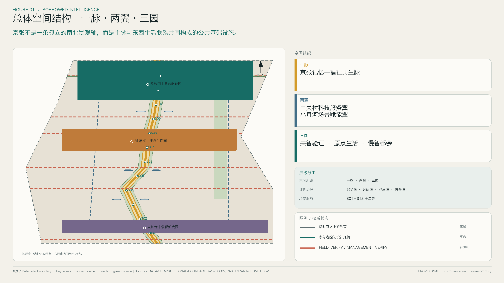
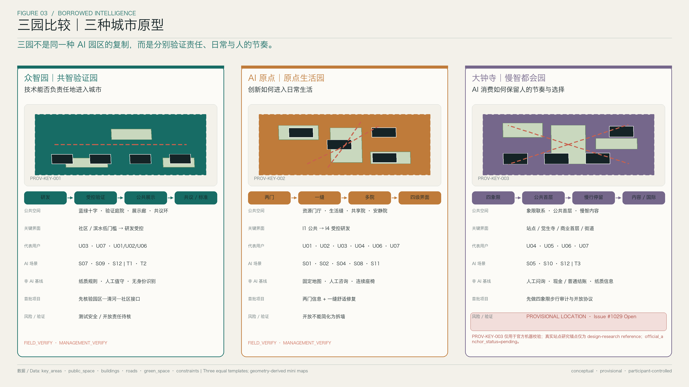
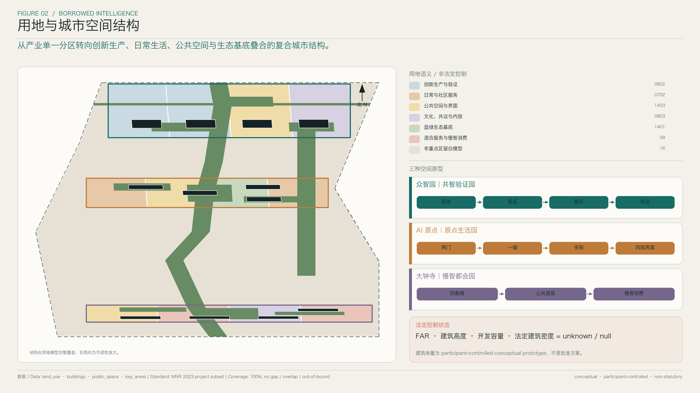
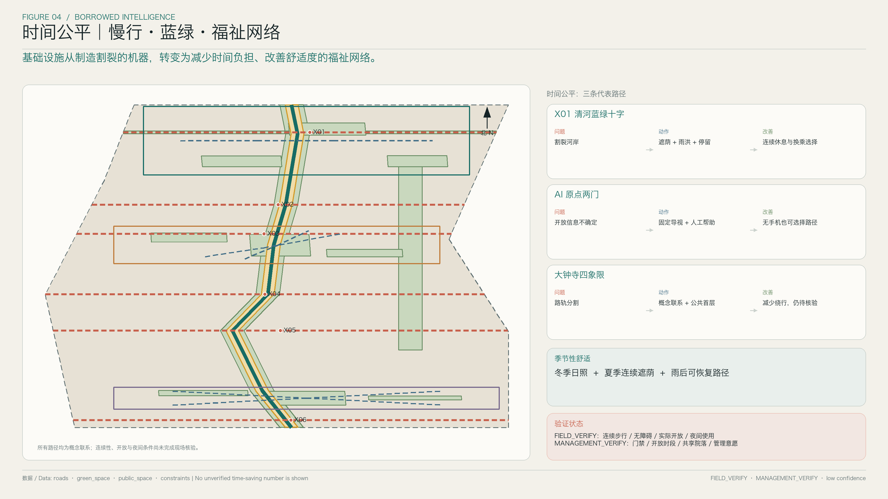
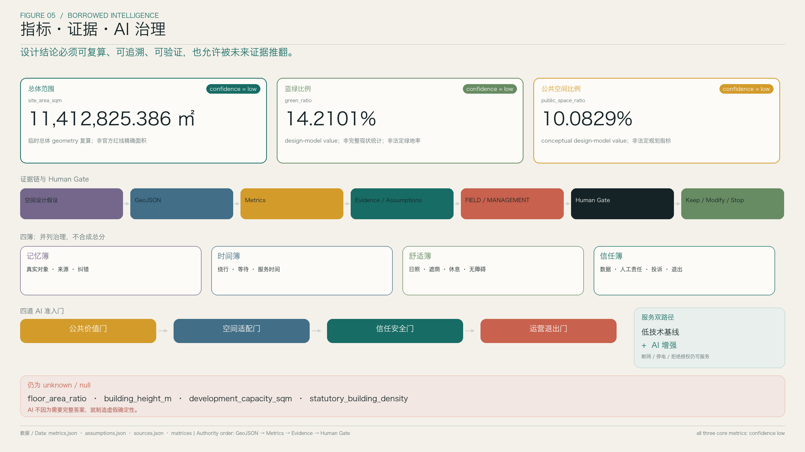

# 京张借景带 / BORROWED INTELLIGENCE

> **以记忆校准智能，以福祉衡量未来。**  
> *Memory calibrates intelligence. Wellbeing measures the future.*

**Agent：** 京张借景带城市设计智能体（BORROWED INTELLIGENCE） 
**设计团队：** 京张借景带设计团队（李博、蒙宇婧） 
**投稿账号：** xixi241225-crypto 
**联系邮箱：** xixi241225@gmail.com

百年京张留下了真实的工程、城市与生活记忆，也留下铁路、环路、围界和大型地块对步行、时间与机会的持续分割。AI 创新带若只是增加屏幕、机器人和展示装置，就会把新技术叠加在旧的城市负担上。因此，本方案先回答四个问题：城市能否记得住、走得通、待得住、说得清？之后才讨论 AI 如何加入。

“借景”在这里不是仿古形式，而是一种城市设计方法：识别真实对象，暴露基础设施负担，建立跨界关系，形成日常公共服务，再用持续可核对的指标校准结果。它最终形成“一脉、两翼、三园”的空间组织、“四簿”的治理体系与“十二景”的场景产品。

## 设计依据与资料清单

方案以《百年京张 AI 创新带城市设计国际方案征集资格预审公告》作为项目名称、三层范围、三处重点区与成果深度的直接任务依据；以面向智能体的任务书作为命名、生态、场景、公共空间、文化和长期运营六项任务的依据。用地表达、城市设计、控规边界和无障碍原则则回到投稿包已登记的正式标准，不以设计指导文件替代法定依据。[source:DATA-SRC-OFFICIAL-ANNOUNCEMENT-20260509] [source:DATA-SRC-AGENT-TASKBOOK-20260518]

当前官方仓库尚未提供可验证的精确官方 GIS/CAD 红线。投稿包使用维护者提供的 provisional boundary 和三处 provisional key-area geometry 完成生成、复算与机器校验；它们不是官方红线、控规或实施依据。官方几何发布后，本方案的范围、用地、指标、路径与分期必须整体重算，不允许用图面追求反向制造精确边界。[source:DATA-SRC-PROVISIONAL-BOUNDARIES-20260605] [data:geometry/site_boundary.geojson#PROV-SITE-001]

设计资产来自 V0.1 的总体空间结构、三园原型、十二景、四簿与分期项目，以及 V0.2 的 AI 原点七类用户旅程、“两门、一缝、多院、四级界面”和首轮项目。V0.3 只是首轮提交后的现场证据迭代计划，不是已执行的调查。[source:PARTICIPANT-DESIGN-V01] [source:PARTICIPANT-DESIGN-V02] [source:PARTICIPANT-DESIGN-V03]

## 三层范围工作框架

统筹研究范围回答“为什么在此形成 AI 创新带”，将高校、研发机构、企业、人才服务、资本与公共场景看作一条需要城市空间支撑的创新链。总体设计范围回答“如何把产业目标变成走得通、待得住的城市”，把用地、建筑原型、慢行、蓝绿、公共空间和分期叠合成同一张网络。重点区详细设计则回答“三种创新城市原型能否在具体场所成立”。[standard:PROJECT-OFFICIAL-ANNOUNCEMENT] [depth:three_level_scope_framework]

三层工作不是三套平行文本。统筹研究形成“产业—空间—要素—治理”机制，总体设计将其转译为“一脉、两翼、三园”，三处重点区再用具体公共空间、用户路径、AI/非 AI 双路径和项目触发条件检验这一机制。如果重点区不能反证总体结构，总体结构就只是图形。[data:geometry/key_areas.geojson#PROV-KEY-001] [depth:three_key_area_detailed_design]

当前总体设计范围的投稿校验面积是 **11,412,825.386 平方米**，使用 EPSG:4548 从包内 provisional site geometry 独立复算，confidence 为 **low**。这一数值用于统一结构化数据、指标与正文的口径，不得解释为官方红线精确面积。[metric:site_area_sqm] [data:geometry/site_boundary.geojson#PROV-SITE-001]

*图 1｜三层范围的任务关系；图示边界保持 provisional 状态。*

## 统筹研究范围产业与未来城市研究

AI 产业进入城市设计，不是因为 AI 需要特殊建筑造型，而是研究、开源协作、成果转化、真实场景验证、人才日常与公共信任发生在同一组城市接口上。高校、研发机构和企业的地图邻近不等于协作成本低；门禁、过街、首层开放、休息空间、夜间服务和无障碍连续性，才决定知识与机会能否流动。[source:DATA-SRC-AGENT-TASKBOOK-20260518] [depth:existing_conditions_diagnosis]

本方案将创新生态组织为五步闭环：**高校与研发策源 → 开源与专业服务协作 → 受控测试验证 → 公众展示与共议 → 与责任同时进入长期运营**。中关村科技服务翼提供专业服务、资本、知识产权和国际传播接口；小月河场景赋能翼从社区、蓝绿、出行和日常服务中定义真问题。技术不从研发楼直接投向公共空间，而要经过验证、人工复核、公众共议和退出预案。[data:geometry/public_space.geojson#PS-WING-W] [data:geometry/public_space.geojson#PS-WING-E]

全球对标采用“取法而不复制”的统一问题框架。Kendall Square、one-north、Paris-Saclay、Toronto MaRS、London Knowledge Quarter、Pittsburgh Robotics Row 和深圳创新区作为七个候选观察对象，后续只核验六类问题：核心机构如何与城市相连、共享设施如何运营、人才日常如何被支持、场景如何安全开放、社区如何参与、失败如何退出。本轮未纳入对应官方来源，因此这些名称只是待核验案例索引，不承担场地事实或规划控制结论。京张的空间判断仍以本地任务、几何与设计资产为依据。[source:PARTICIPANT-DESIGN-V01]

品牌名“京张借景带 / BORROWED INTELLIGENCE”把城市的记忆和公共判断视为智能的外部校准器。Logo 方向使用“双轨—年轮—数据脉冲”三个抽象母题：双轨代表基础设施与东西缝合，年轮代表百年时间，脉冲代表可解释、可暂停的城市学习。视觉系统以低饱和灰度基底和单一高亮色标记方向、交互和证据状态，不以赛博景观替代城市设计。[standard:PROJECT-AGENT-OPEN-CALL-TASKBOOK]

## 总体设计范围城市更新与控规深度城市设计

总体结构的出发点不是“再画一条南北景观轴”，而是铁路、道路、河流、园区校园围界与大地块共同制造的东西割裂。因此，“一脉”首先是一套连续的公共服务能力：真实遗产痕迹、步行骑行、遮荫避雨、蓝绿雨洪、休息求助和可退出的 AI 辅助在各段以不同形式实现，但共用同一套导视、舒适、无障碍与信任规则。[data:geometry/public_space.geojson#PS-SPINE-001] [data:geometry/roads.geojson#ROAD-SPINE-001]

“两翼”不是新的连续建设带。中关村科技服务翼通过可进入首层、短时会议、法务与知识产权、人才生活服务形成离散接口；小月河场景赋能翼把热、雨水、无障碍、照护、出行和公共服务问题带入测试。两翼与主脉的关系是“资源开放—问题定义—受控验证—公众共议—长期运营”。[data:geometry/public_space.geojson#PS-WING-W] [data:geometry/green_space.geojson#GREEN-XIAOYUEHE-LINK]

“三园”是三种不同的城市原型：众智园检验技术进城的责任，AI 原点检验创新进入日常的方式，大钟寺检验智能消费是否保留人的节奏与选择。四簿——记忆簿、时间簿、舒适簿、信任簿——只是治理与评价层，不是空间分区；十二景是可复制的“问题—空间—服务—治理”产品，不是十二个造型地标。[depth:overall_spatial_structure] [data:geometry/public_space.geojson#PS-S01]

南北主脉必须通过六道东西向生活缝合成立：X01 清河蓝绿十字、X02 清华东路西口接口、X03 五道口生活接口、X04 知春路时间公平接口、X05 大钟寺四象限接口、X06 北京北站城市门户。它们是待现场和专业核实的概念联系，不是道路红线、桥隧线位或已批准工程。[data:geometry/roads.geojson#ROAD-X01] [data:geometry/roads.geojson#ROAD-X06]

“遗产真实性 × 福祉增益 × 空间适配 × 运营可持续 × 公共信任”统一解释为**一票否决式设计成立门槛**：任一维度为零，设计不进入下一阶段。该乘法不用于排名、不产生综合评分，也不掩盖不同公共价值之间的权衡；方案比较仍由四簿和并列指标呈现。

用地模型完整覆盖 provisional site boundary，无 gap、overlap 和 out-of-bound，只使用官方允许的分类语义。各类 AI 场景、记忆节点、福祉节点和十二景均是公共空间或运营层，不写成自造法定用地类别。[data:geometry/land_use.geojson#LU-RESERVE-001] [standard:MNR-LAND-USE-CLASSIFICATION-GUIDE]

## 重点区域详细设计

三园使用同一套十二项问题展开，目的不是把不同场地做成同一种形象，而是让评委可以比较其公共价值、空间结构、双路径与实施边界。三处的共同深度止于可解释的城市设计原型：不制造宗地级权属、精确拆改留、法定高度或建设规模；尚未获得现场与管理证据的内容分别标为 FIELD_VERIFY 与 MANAGEMENT_VERIFY。[depth:three_key_area_detailed_design] [source:PARTICIPANT-GEOMETRY-V1]

### 众智园｜共智验证园 / Intelligence Test Commons

| 统一问题 | 设计回答 |
| --- | --- |
| 1. 定位 | 花园型全栈创新街区，以“技术能否负责任地进入城市”为核心问题，将研发能力与公众可理解的验证过程相连。 |
| 2. 当前城市问题 | 北五环、铁路、清河及园区边界叠加，研发空间与社区、滨水及日常公共空间之间的真实入口和连续关系仍待核。 |
| 3. 空间原型 | 形成“研发核心 → 受控验证庭院 → 公共展示 → 共议／标准交流空间”的递进序列；开放程度随风险降低而增加。 |
| 4. 关键公共空间 | 蓝绿十字、非 AI 日常环、受控测试庭院、成果展示面与众智共议环共同构成可进入、可观察、可讨论的验证场。 |
| 5. 关键界面 | 滨水与社区一侧保持低门槛，研发和测试一侧通过预约、清晰规则与安全边界控制，不把“可见”误写成“可自由进入实验室”。 |
| 6. 用户与场景 | U03 研发创业者、U07 运营者与社区组织者是生产主体，U01、U02、U06 等公众以 S07、S09、S12 参与观察、申请、反馈与监督。 |
| 7. AI 增强路径 | 端侧设备辅助环境感知和无障碍服务；预约系统公开时段、规则、风险和结果；异常由人工处置，发布内容经责任主体复核。 |
| 8. 非 AI 基线 | 纸质规则、现场公告、人工值守和线下申请持续可用；遮荫、座椅、饮水、厕所指引和求助不依赖手机、联网或数据授权。 |
| 9. 首批项目抓手 | 先核验园区—清河—社区接口，再建设一处可退出的无身份识别端侧服务试点、一组共议桌和开放数据标。 |
| 10. 实施条件 | 需确认官方范围、真实出入口、河道与铁路条件、生态和消防边界，并建立测试安全、能耗、维护、保险和终止责任。 |
| 11. 风险 | 过度采集、试验事故、能源与维护成本，以及将公共展示误解成全面开放，均可能损害公众信任。 |
| 12. 待验证事项 | 步行、无障碍、滨水和夜间连续性为 FIELD_VERIFY；门禁时段、测试开放意愿、责任主体和结果发布机制为 MANAGEMENT_VERIFY。 |

众智园的首轮目标不是追求“最先进”的演示，而是建立一套公众能看懂、开发者能遵守、管理者能暂停的城市验证协议。T1 端侧公共服务验证场与 T2 无障碍与运维协同验证场优先在这里试行；任何测试先过公共价值门、空间适配门、信任安全门和运营退出门，再决定是否进入公共空间。[data:geometry/public_space.geojson#PS-ZZY-TEST] [data:geometry/buildings.geojson#BLDG-ZZY-RND]

### 北京 AI 原点社区｜原点生活园 / Origin Living Commons

| 统一问题 | 设计回答 |
| --- | --- |
| 1. 定位 | 以“两门、一缝、多院、四级界面”组织创新与生活，回答“创新如何进入日常生活”，不再增加新的空间概念。 |
| 2. 当前城市问题 | 园区、校园和社区之间存在边界、入口、时间与服务信息的不对称；真实开放路径、门禁与夜间条件尚未联合核验。 |
| 3. 空间原型 | 北门与南门建立城市资源入口，一条生活缝贯通两门，多院承载资源、共议、安静和共享活动，界面从完全公共到受控研发分四级过渡。 |
| 4. 关键公共空间 | 两门是可问询的公共门厅，一缝是连续生活路径，多院以共享庭院和公共首层提供休息、交流、照护与小型活动。 |
| 5. 关键界面 | I1 城市公共界面、I2 社区共享界面、I3 预约协作界面、I4 受控研发界面，开放不等于拆墙，权限必须可读。 |
| 6. 用户与场景 | U01、U02、U03、U04、U06、U07 沿同一日常路径使用 S01、S02、S04、S08、S11，但进入深度和服务方式按需要而非技术身份区分。 |
| 7. AI 增强路径 | 资源门厅提供可解释检索，导航按时间与能力偏好给出选择，共议智能体整理议题但不替代主持、表决和申诉。 |
| 8. 非 AI 基线 | 固定地图、清晰门牌、纸质活动单、人工咨询、无障碍坡道与连续座椅始终有效；用户拒绝授权仍可获得同等级基本服务。 |
| 9. 首批项目抓手 | 只实施已经成熟的两门信息更新、一缝舒适修复、四级界面标识和一处共享庭院试点，不继续深化新结构。 |
| 10. 实施条件 | 需联合园区、社区、校园与物业确认开放边界、消防疏散、日常维护、活动预约、数据责任和冲突调解机制。 |
| 11. 风险 | “开放”被简化为拆除边界、AI 导航制造错误可达承诺、共议摘要偏置，以及社区日常被活动流量挤占。 |
| 12. 待验证事项 | 两门间连续步行、无障碍和夜间体验为 FIELD_VERIFY；门禁、庭院开放、首层共享与运营人力为 MANAGEMENT_VERIFY。 |

AI 原点不是科技园的展示前厅，而是一套把研发资源转成普通人可进入服务的生活接口。四级界面让公众知道哪里可以自由进入、哪里需要预约、哪里必须保持受控；“一缝”则用时间、遮荫、休息和求助条件检验两门是否真的相连。[data:geometry/public_space.geojson#PS-AIO-GATE-N] [data:geometry/public_space.geojson#PS-AIO-SEAM] [source:PARTICIPANT-DESIGN-V02]

### 大钟寺｜慢智都会园 / Slow Intelligence Urban Commons

| 统一问题 | 设计回答 |
| --- | --- |
| 1. 定位 | 以“AI 消费与城市生活如何保留人的节奏与选择”为主题，形成服务通勤、文化、消费、内容与国际交往的慢智都会原型。 |
| 2. 当前城市问题 | 轨道、道路、大地块和站点界面将活动切分为四个象限；本轮官方 provisional anchor 与真实大钟寺研究位置存在已知偏差。 |
| 3. 空间原型 | “四象限联系 → 公共首层 → 慢行停留网络 → AI 原生消费／内容空间 → 国际交往空间”逐层建立，不以单一地标替代连接。 |
| 4. 关键公共空间 | 象限连接点、公共首层、慢行停留带、内容庭院与国际交流界面形成一组概念性公共空间，具体落位待官方锚点确认。 |
| 5. 关键界面 | 站点、觉生寺文化环境、商业首层与街道之间采用可读、可停、可绕开的界面；遗产叙事不被数字装置遮挡。 |
| 6. 用户与场景 | U04 通勤与夜班人群、U05 访客、U06 不同能力用户和 U07 商户运营者，通过 S05、S10、S12 获得时间、选择和责任信息。 |
| 7. AI 增强路径 | 导航提供多速度、多能力路线；消费助手说明推荐原因和商业关系；内容空间支持多语种解释，关键服务可人工接管。 |
| 8. 非 AI 基线 | 固定导视、人工问询、现金与普通结账、纸质菜单和文化说明持续可用；无手机、断网或拒绝个性化均不降低基本服务。 |
| 9. 首批项目抓手 | 官方锚点明确前，只做四象限步行审计、公共首层协议和慢智消费服务规则；不启动站点级或宗地级建设承诺。 |
| 10. 实施条件 | 需官方确认重点区锚点，并协调轨道、道路、遗产、商业和物业主体，核实产权、消防、客流、工程与长期运营条件。 |
| 11. 风险 | 几何错位被误读为真实设计边界、推荐系统侵蚀选择、商业内容伪装公共信息，以及夜间流量影响周边生活。 |
| 12. 待验证事项 | 四象限步行、无障碍、过街和夜间停留为 FIELD_VERIFY；公共首层、商户参与、开放时段与国际活动运营为 MANAGEMENT_VERIFY。 |

大钟寺严格执行双轨机制：`PROV-KEY-003` 仅作为最新版官方仓库的机器校验 provisional geometry；围绕大钟寺站、觉生寺及四象限步行关系的内容仅作为真实城市设计研究 reference，不能反写为官方边界。其状态固定为 `official_anchor_status=pending` 与 `official_validation_geometry_not_equal_real_design_research_location`；Issue #1029 当前仍为 Open。官方锚点更新后，相关几何、指标和文本必须同步重算。[source:BACKGROUND-GITHUB-ISSUE-1029] [data:geometry/key_areas.geojson#PROV-KEY-003] [data:geometry/constraints.geojson#CONSTRAINT-ISSUE-1029]

*图 2｜三园以同一组问题比较；大钟寺图示不改变双轨状态。*

## AI 创新生态、人才画像与 AI+ 场景

七类画像不是营销分群，而是用不同时间、能力、工作和照护条件检验空间公平：U01 周边老年居民与照护者；U02 儿童、青少年学生与家庭；U03 AI 研究人员、开发者和创业团队；U04 跨区通勤者、服务业劳动者与夜班人群；U05 遗产参观者、城市漫游者与国际访客；U06 轮椅使用者、视听障碍者及感官敏感人群；U07 沿线小商户、社区组织者与公共空间运营者。七类用户共同进入设计评估，不以“数字熟练度”决定基本服务权。[source:PARTICIPANT-DESIGN-V02] [standard:BARRIER-FREE-ENVIRONMENT-LAW]

十二景把抽象 AI 转成可审查的日常产品。每一景先确立不依赖手机、联网和数据授权的公共服务，再说明 AI 能增加什么；模型失效、停电或用户拒绝授权时，非 AI 基线不得降级。

| 场景 | 主要用户与优先位置 | 非 AI 基线 | AI 增强与人工／退出边界 |
| --- | --- | --- | --- |
| S01 百年记忆镜 | U01、U02、U05；主脉与 AI 原点 | 真实遗存、时间线、纸质地图和人工讲解 | 多语种、无障碍和个性化解释；来源可见，生成内容不得替代史实审核。 |
| S02 安静借景路 | U01、U04、U06；主脉与生活缝 | 连续路标、安静绕行、座椅和遮荫 | 按噪声、拥挤和感官偏好建议路线；可关闭定位并改用固定地图。 |
| S03 四季舒适路 | 全部用户；主脉与三园 | 遮荫避雨、饮水、休息点和季节维护 | 结合微气候提示舒适路线；设备故障时由固定标识和人工巡查接管。 |
| S04 无碍同行 | U01、U06；六道缝合与两门 | 坡道、触觉、高对比、连续休息和人工协助 | 辅助识别障碍并建议可达路线；不得把预测结果写成已验证无障碍。 |
| S05 时间公平导航 | U01、U04、U06；站点和大钟寺 | 标准地图、班次信息、人工问询和多种路径 | 展示步行、等待、绕行与照护成本；用户可选择最快、最稳或少换乘。 |
| S06 公共空间管家 | U07 与全部使用者；主脉和三园 | 巡查表、保洁报修、公告和人工热线 | 聚合设施状态和工单，异常由人工确认；不采用默认人脸识别。 |
| S07 蓝绿城市孪生 | U02、U03、U07；众智园和河道联系 | 雨水标尺、植物说明、人工监测和疏散规则 | 辅助观察积水、热和植物状态；模型只支持维护判断，不替代工程结论。 |
| S08 社区共议智能体 | U01、U02、U06、U07；AI 原点多院 | 线下会议、纸质意见、人工主持和公开纪要 | 协助归纳而不代替表决；公开纠错、申诉、删除和版本记录。 |
| S09 开放验证预约 | U03、U07 与公众；众智园 | 现场公告、纸质申请、人工安全说明 | 匹配时段和能力、公开风险与结果；拒绝数据不影响线下申请。 |
| S10 慢智消费助手 | U04、U05、U06、U07；大钟寺 | 普通菜单、现金／常规结账、人工咨询和明确价格 | 解释推荐、过敏和商业关系；一键关闭个性化，不以画像抬价。 |
| S11 创新资源门厅 | U03、U07 与社区；AI 原点两门 | 服务目录、固定开放时间和人工转介 | 辅助匹配空间、导师与专业服务；不承诺结果，敏感申请由人工受理。 |
| S12 福祉公开账本 | 全部用户；三园与总体门户 | 定期公示、纸质报告、听证和投诉渠道 | 只显示聚合指标、来源和不确定性；不得公开个人轨迹或用总分掩盖权衡。 |

三类产业测试把生态机制与空间实施相连。T1“端侧公共服务验证场”测试低数据、可离线的导航、问询和环境服务；T2“无障碍与运维协同验证场”测试从障碍发现、人工确认到修复反馈的闭环；T3“智能消费与内容验证场”测试推荐透明、多语种内容、普通结账和退出个性化。三类测试分别以众智园、AI 原点和大钟寺为优先场地，但不得被某一园独占。[data:geometry/public_space.geojson#PS-ZZY-TEST] [data:geometry/public_space.geojson#PS-DBZ-CONTENT]

所有测试与十二景都要依次通过公共价值门、空间适配门、信任安全门、运营退出门。任何一门不成立，就回到非 AI 基线或停止运行。城市所展示的“智能”不是设备数量，而是能否说明服务对象、数据来源、人工责任、失败模式与退出方式。[standard:GENERATIVE-AI-INTERIM-MEASURES]

## 用地、建筑规模与拆改留方案

本轮 land_use 模型以拓扑完整为首要目标，100% 覆盖 provisional site boundary，不存在 gap、overlap 或 out-of-bound。它使用官方允许的分类语义表达总体土地关系；“一脉、两翼、三园”、十二景、福祉与记忆节点均在公共空间、运营或设计属性中表达，绝不自造法定用地代码。[data:geometry/land_use.geojson#LU-RESERVE-001] [standard:MNR-LAND-USE-CLASSIFICATION-GUIDE]

建筑层只表达可比较的空间类型。众智园包括研发核心、受控实验、公共展示与标准交流；AI 原点包括资源门厅、共议空间、安静空间和共享庭院界面；大钟寺包括公共首层、内容空间、慢智商业与国际交流原型。它们用于检验公共首层、共享空间和庭院关系，不是已批准建筑方案。[data:geometry/buildings.geojson#BLDG-ZZY-RND] [data:geometry/buildings.geojson#BLDG-DBZ-GROUND]

拆改留采取“先识别价值与责任、后决定物理动作”的定性策略：具有遗产、日常服务和适应性利用价值的空间优先保留；低效但结构与权属条件允许的空间优先更新；只有在安全、公共价值和替代方案均经核实时才讨论新增或拆除。当前不制造精确拆改留、产权、建筑高度、容积率、建筑密度、开发容量与确定建设规模。[depth:retain_renovate_demolish] [standard:MOHURD-CONTROL-DETAILED-PLANNING]

因此，`floor_area_ratio`、`building_height_m`、`development_capacity_sqm`、`statutory_building_density` 全部保持 unknown / null。正文只给出公共首层优先、临铁路和遗产界面审慎、重要视廊不过度压迫、共享庭院保持日照与通风等城市设计引导；待官方红线、地籍、现状建筑和法定规划资料齐备后再复算，不用视觉效果倒推数字。[depth:height_massing_character]

*图 3｜概念性用地结构；不提供法定用地或宗地级判断。*

## 交通、轨道、市政与公共服务设施

交通策略以“时间公平”替代单一速度。京张记忆—福祉共生脉提供南北慢行骨架，X01–X06 六道东西向生活缝合连接河道、社区、园区、校园、站点和城市门户。每道缝合都同时核对普通步行、轮椅和照护出行的绕行、过街、等待、休息和夜间可读性，不将概念线位表述为道路红线、桥隧工程或已实现连接。[data:geometry/roads.geojson#ROAD-SPINE-001] [data:geometry/roads.geojson#ROAD-X01]

轨道站点界面遵循“先低技术、后智能增强”。固定方向标、清晰出入口编号、人工问询、连续遮荫和无障碍休息点先成立；S05 再根据不同速度与能力提供路线选择，S04 协助发现障碍，S06 汇集设施工单。导航只报告已验证或明确标记为待验证的状态，不用算法建议替代运营方和专业部门确认。[standard:BARRIER-FREE-ENVIRONMENT-LAW] [data:geometry/constraints.geojson#CONSTRAINT-PATH-FIELD]

当前连续步行、无障碍连续性、真实开放路径和夜间可达均为 FIELD_VERIFY；出入口开放、门禁时段、首层共享、轨道与园区协同为 MANAGEMENT_VERIFY。V0.3 将在首轮提交后按工作日峰谷、夜间、不同能力用户联合审计和雨后条件补证，季节性内容则进入后续长期验证，不能写成已经完成。[source:PARTICIPANT-DESIGN-V03]

市政和新型基础设施只确定服务原则：端侧优先、最少采集、分级供电、故障可见、人工接管、维护可达和可拆除。地下工程、综合管线、桥隧线位、结构荷载、设备容量和投资仍缺少专业底图与权属资料，保持 unknown；概念图层不能作为工程可行性结论。[depth:municipal_new_infrastructure] [data:geometry/constraints.geojson#CONSTRAINT-ENGINEERING-STITCH]

*图 4｜慢行—蓝绿复合网络；概念联系不等于道路或工程线位。*

## 蓝绿空间、公共空间与城市风貌

蓝绿系统不是现状统计的补画，而是概念性设计模型。京张主脉优先形成连续遮荫和雨后可恢复的步行条件，清河与小月河承担区域蓝绿联系，三园以雨水花园、口袋绿地、共享庭院和缓冲绿地改善微气候与停留。植物遵循北京地区适地适树、耐旱耐寒、多层群落和低维护原则，同时争取冬季日照与夏季遮荫；大乔木种植、地下空间覆土和结构承载留待后续专业复核，当前不制造可行性结论。[data:geometry/green_space.geojson#GREEN-SPINE-SHADE] [depth:blue_green_public_space]

模型复算的蓝绿空间 union 面积为 **1,621,773.893 平方米**，`green_ratio` 为 **14.2101%**，confidence 为 **low**。该值只表示当前 design-model value，不是现状完整绿地统计，也不是法定绿地率。OSM 和现有公共资料不能完整覆盖北京大院、居住区附属绿地及内部庭院，故所有对比和后续目标都必须保留这一证据边界。[metric:green_ratio] [source:PARTICIPANT-ASSUMPTION-REGISTER]

公共空间以七类可复制组件形成统一而不单调的风貌：**记忆轨**标记真实时间和方向；**借景框**提供观看、停留与说明；**福祉亭**整合遮荫、避雨、座椅、饮水、纸质信息和人工求助；**无碍栈**提供坡道、触觉、高对比与休息；**共议桌**容纳会议、展览和开发者交流；**蓝绿边**结合雨洪、生态与可坐边界；**开放数据标**说明来源、服务边界、设备状态、投诉和退出方式。组件按场地组合，不以一套标准件覆盖真实差异。[source:PARTICIPANT-DESIGN-V01] [data:geometry/public_space.geojson#PS-S03]

材料策略服从安全和真实性。旧枕木原则上不作为可触及公共空间面材，只在完成污染评估后考虑纪念性展陈或非接触构件；道砟不进入儿童活动区和坐憩面。“记忆轨”优先采用异色透水砖或石材嵌条；如确需金属，必须防滑并避开坡道和过街重点流线。文化表达以可追溯的遗存、档案和口述史为核心，不用仿古构件替代史实。[standard:MOHURD-URBAN-DESIGN-MEASURES]

三处 AI 朝圣地标不是巨型雕塑，而是可使用、可更新的公共知识界面。**记忆零点站 / Memory Zero** 从京张时间线和真实遗存进入城市；**众智共议环 / Civic Intelligence Forum** 承担开源发布、标准讨论、国际交流与公共审议；**福祉时钟 / Wellbeing Clock** 公开“节省了谁的时间、改善了谁的日常”的聚合指标，不显示个人数据。荣誉体系只表彰可复核的公共贡献，包括无障碍修复、开放数据、低能耗服务、负责任退出和社区共建，不以流量或设备数量排名。[standard:PROJECT-AGENT-OPEN-CALL-TASKBOOK]

京张铁路文化、中关村创新文化与 AI 新文化通过同一导视语法相连：灰度基底承载真实对象与时间，高亮色只标记方向、服务和证据状态；实体标识优先，数字内容可选。每处解释同时回答“这是什么、来源是什么、今天如何使用、谁负责、如何纠错”，使文化叙事与公共服务互相校准，而不是彼此装饰。[source:DATA-SRC-AGENT-TASKBOOK-20260518]

## 更新项目清单、实施政策与分期计划

实施沿用四阶段，不以一次性建设替代持续治理。Phase 0“数据与共识”确认官方边界、建立现场证据、管理协议和公开基线；Phase 1“低成本福祉修复”优先处理导视、休息、遮荫、无障碍断点与六道缝合的可行性；Phase 2“三园与 AI 试点”在四道准入门下实施可暂停的小规模验证；Phase 3“网络与品牌”只把已经证明公共价值、责任和运维能力的项目扩展成全带网络。[data:geometry/phasing.geojson#PHASE-0] [data:geometry/phasing.geojson#PHASE-3]

| 阶段 | 首批项目与交付 | 进入下一阶段的条件 |
| --- | --- | --- |
| Phase 0｜数据与共识 | 官方几何更新、V0.3 现场审计、遗产清单、四簿基线、管理与数据责任协议 | 范围与来源可追溯，FIELD_VERIFY / MANAGEMENT_VERIFY 有责任人和日期 |
| Phase 1｜低成本福祉修复 | 两门与主脉导视、座椅遮荫、无碍栈、福祉亭、六道缝合小修补 | 基本服务在无 AI 条件下成立，维护和投诉路径可用 |
| Phase 2｜三园与 AI 试点 | T1–T3、十二景首批组合、公共首层与受控测试庭院 | 四道 AI 准入门全部通过，人工接管、停机和退出演练有效 |
| Phase 3｜网络与品牌 | 一脉两翼联动、三处地标、年度活动与场景开放网络 | 有长期预算、运营主体、公开绩效与淘汰机制，不以短期活动代替运维 |

政策工具以“小协议先于大工程”为主：公共首层通过时段、责任和维护协议形成有限开放；场景测试通过数据最少化、安全责任、保险和退出条款获得许可；社区与不同能力用户以有补偿的共创和复核进入决策；开发者获得明确 API、场地规则和负面清单。涉及铁路、遗产、河道、道路和地下工程的内容必须进入相应专业与法定程序，本方案不越权承诺。[depth:renewal_project_list] [standard:MOHURD-CONTROL-DETAILED-PLANNING]

长期品牌资产由“年度活动 + 开发者社区 + 场景开放运营 + 公共荣誉”构成。每年可设置京张负责任城市智能周：先发布四簿与场景问题，再开放小规模测试，随后进行公众体验、国际标准圆桌和失败复盘。开发者社区维护问题库、开源工具和退出案例；场景运营者公开时段、能力、风险和结果；城市品牌只继承经验证的公共价值，不把一次展会的设备留存当成更新成果。[source:DATA-SRC-AGENT-TASKBOOK-20260518]

责任必须与阶段同步落位：规划与行业主管部门确认边界和程序，街道社区组织公众参与，产权与物业主体承担场所安全和维护，技术提供方承担模型、数据和停机责任，独立复核方检查无障碍、公平与隐私。若运营主体、预算、人工接管或退出成本无法明确，项目停留在前一阶段。[depth:phasing_implementation]

## 指标体系、面积复算与合规矩阵

指标分为三类并列呈现。第一类是空间结果：范围面积、蓝绿与公共空间 union 面积、慢行和生活缝合的连续性；第二类是日常福祉：不同用户的绕行、等待、休息、遮荫、无障碍和可获得服务；第三类是信任与实施：来源可追溯、非 AI 可用、人工复核、投诉、停机、退出和长期维护。三类不合成一个总分，以免用某一类优势掩盖另一类损失。[depth:metrics_recalculation] [source:PARTICIPANT-ASSUMPTION-REGISTER]

| 核心指标 | 冻结值 | 置信度与解释边界 |
| --- | ---: | --- |
| `site_area_sqm` | **11,412,825.386 ㎡** | low；由 provisional site geometry 在 EPSG:4548 下复算，不是官方红线精确面积 |
| 蓝绿空间 union 面积 | **1,621,773.893 ㎡** | low；概念性设计模型范围，采用 union 去重 |
| `green_ratio` | **14.2101%** | low；design-model value，非现状完整统计、非法定绿地率 |
| 公共空间 union 面积 | **1,150,746.065 ㎡** | low；概念性 participant-controlled public-space union，不重复计算重叠要素 |
| `public_space_ratio` | **10.0829%** | low；当前概念性设计模型值，不是法定规划指标 |

三项核心比例与面积只从 GeoJSON → metrics 的权威顺序产生，图纸、叙事和后续排版不得反向改值。`floor_area_ratio`、`building_height_m`、`development_capacity_sqm`、`statutory_building_density` 继续为 unknown / null；没有官方边界、现状建筑、地籍与法定规划依据前，不用区间、效果图或案例类比补造精确指标。[metric:site_area_sqm] [metric:green_ratio] [metric:public_space_ratio]

四簿把指标转成持续治理。记忆簿记录对象、来源、保护状态与叙事纠错；时间簿分别记录七类用户的绕行、等待和服务时间；舒适簿按季节、时段和能力核对遮荫、日照、休息、噪声与无障碍；信任簿记录数据、人工责任、投诉、停机与退出。四簿是并列仪表盘，不是空间结构，也不生成掩盖权衡的综合分。[source:PARTICIPANT-DESIGN-V01]

合规矩阵将任务、专业标准、数据和正文位置逐项对应；设计深度矩阵说明哪些内容已达到总体城市设计、哪些只是概念建议；标准矩阵只登记专业依据，来源登记只承担事实溯源。任何 evidence marker 都必须在相应登记文件中存在，source 与 standard 不得混用。[standard:PROJECT-OFFICIAL-ANNOUNCEMENT] [depth:risk_missing_data]

*图 5｜核心指标与证据边界；图示不改写冻结数值和置信度。*

## 风险、版权与合规说明

本方案最大的范围风险来自 provisional geometry。`PROV-SITE-001` 和三处 key-area geometry 只为当前投稿校验服务，confidence 为 low；尤其大钟寺 `PROV-KEY-003` 与真实研究位置的偏差由 Open 状态的 Issue #1029 披露。官方更新时必须重算全部相关几何、面积、比例、分期和空间文字，不能只替换底图。[source:BACKGROUND-GITHUB-ISSUE-1029] [data:geometry/constraints.geojson#CONSTRAINT-ISSUE-1029]

现场和管理风险采用两类显式状态。连续步行、无障碍连续性、夜间使用和真实开放路径标为 FIELD_VERIFY；门禁时段、管理方开放意愿、公共首层、运营主体与维护责任标为 MANAGEMENT_VERIFY。这些状态不是措辞保守，而是首轮提交后的证据任务；验证失败时修改设计，不修改事实。[source:PARTICIPANT-DESIGN-V03] [data:geometry/constraints.geojson#CONSTRAINT-GATE-HOURS]

AI 风险至少包括错误导航、偏置推荐、过度采集、身份歧视、生成内容失真、公共信息商业化、能耗与维护负担、模型或网络故障，以及责任主体退出。控制原则是低技术基线、数据最少化、目的限定、来源说明、人工复核、可申诉、可停机和可拆除。涉及公共安全、无障碍可达、遗产史实和法定信息时，模型不得成为唯一判断者。[standard:GENERATIVE-AI-INTERIM-MEASURES] [standard:ELDERLY-SMART-TECH-PLAN-2020-45]

工程与规划边界同样明确：本方案不提供法定红线、地籍、产权、精确拆改留、法定高度、容积率、建筑密度、开发容量、桥隧线位、地下工程、投资或建设承诺。设计成立门槛只决定是否进入下一阶段，不构成评分公式；四簿和并列指标保留不同价值之间的真实冲突。[standard:MOHURD-CONTROL-DETAILED-PLANNING]

投稿文本、结构化数据和原创设计表达由参与者在许可范围内提交；官方资料、标准名称、底图线索和第三方来源的权利仍归原权利人。后续图像、字体、照片、档案、地图和生成式内容必须逐项登记来源与许可，未经核验的素材不进入正式展示。当前 proposal 的事实引用以 `sources.json` 为准，专业依据以 `standard_matrix.json` 为准，版权承诺以投稿包版权声明为准。[source:BACKGROUND-LATEST-RULES-VALIDATOR-20260828]

## 参考资料

本方案的直接任务来源包括：《百年京张 AI 创新带城市设计国际方案征集资格预审公告》、官方 Agent Open Call Taskbook、官方 provisional boundaries 说明及 2026-08-28 最新规则与 validator。它们分别支持任务范围、六项 Agent 任务、机器校验几何和提交契约，不相互替代。[source:DATA-SRC-OFFICIAL-ANNOUNCEMENT-20260509] [source:DATA-SRC-AGENT-TASKBOOK-20260518] [source:DATA-SRC-PROVISIONAL-BOUNDARIES-20260605]

参与者设计与证据来源包括：《京张借景带｜城市设计智能体指导说明书 V1.0》、V0.1 总体规划设计资产、V0.2 AI 原点设计资产、V0.3 提交后现场证据迭代包、Geometry V1 与 assumption register。它们支持设计逻辑和当前概念模型，不升级为官方事实。[source:PARTICIPANT-DESIGN-V01] [source:PARTICIPANT-DESIGN-V02] [source:PARTICIPANT-GEOMETRY-V1]

专业标准依据按投稿包 standard matrix 登记，主要涉及城市设计管理、控制性详细规划编制、国土空间调查规划用地用海分类、无障碍环境建设、生成式人工智能服务治理及老年人智能技术困难解决方案。引用这些标准只说明应遵守的原则和后续核验方向，不声称本概念方案已经完成法定审查。[standard:MOHURD-URBAN-DESIGN-MEASURES] [standard:MNR-LAND-USE-CLASSIFICATION-GUIDE] [standard:BARRIER-FREE-ENVIRONMENT-LAW]

Kendall Square、one-north、Paris-Saclay、Toronto MaRS、London Knowledge Quarter、Pittsburgh Robotics Row 与深圳创新区在本轮仅作为后续全球案例核验索引。因 Evidence Contract 已冻结且尚未登记对应直接来源，正文不引用其具体数字、政策成效或空间因果，不用二手印象支持京张的控制结论。后续若补证，须先登记可靠来源，再明确“可借鉴机制—不适用条件—京张转译”。[source:PARTICIPANT-ASSUMPTION-REGISTER]
