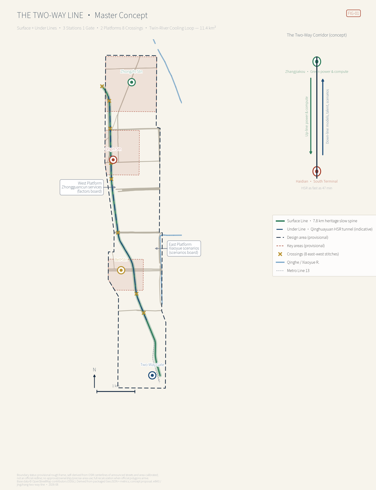
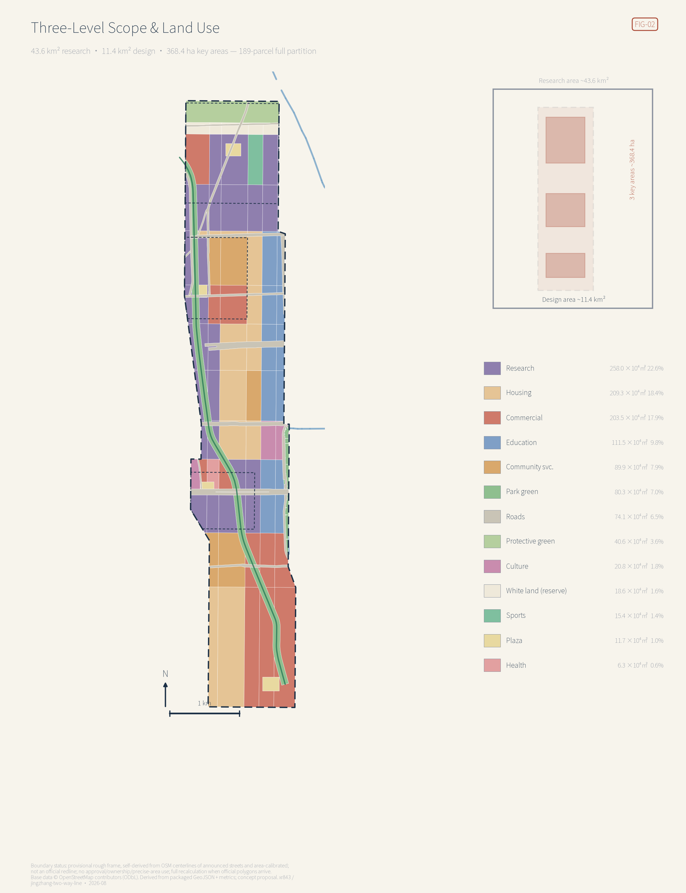
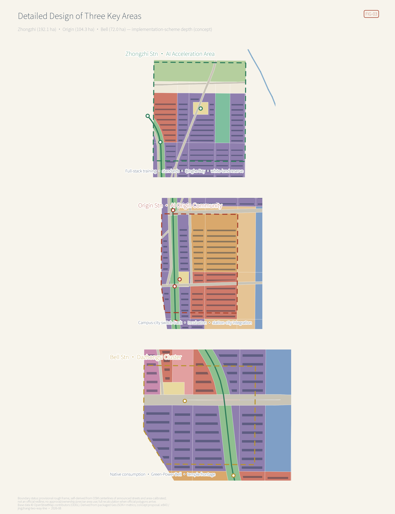
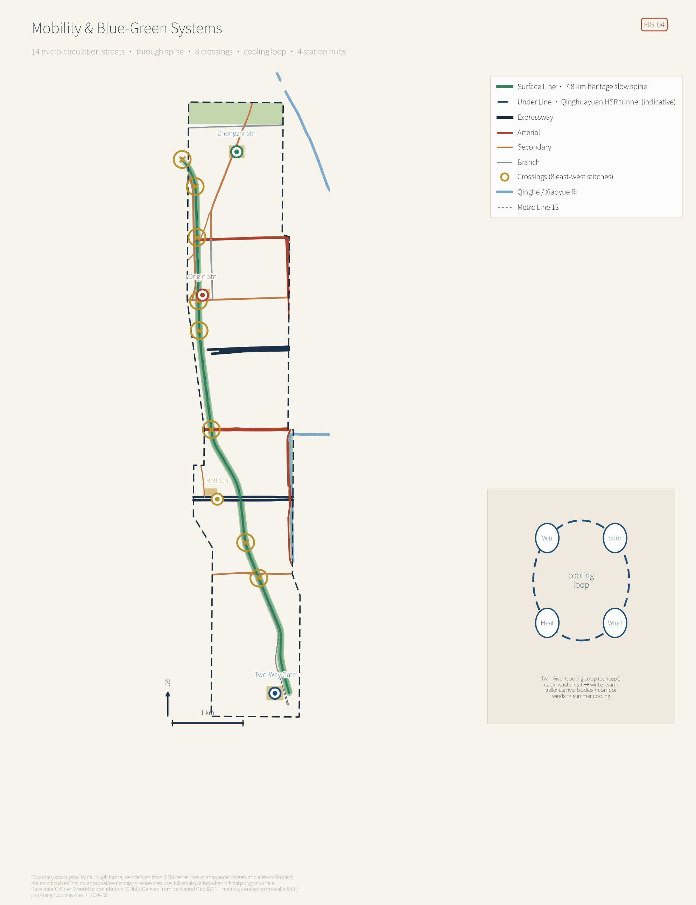
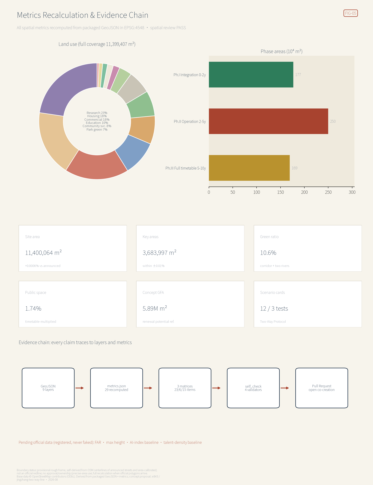

# THE TWO-WAY LINE: Running the Centennial Jing-Zhang Corridor in Both Directions

> **THE TWO-WAY LINE** | In 1909 the Jing-Zhang Railway first made this corridor a trunk line of Chinese engineering autonomy; in 2019 the high-speed successor dived into Qinghuayuan Tunnel and kept racing directly beneath today's heritage park — the line never stopped running, it only changed what it carries. This proposal reads the 11.4 km² site as the **southern terminal district of the Beijing–Zhangjiakou corridor**: the north sends green electricity and compute; the south sends back models, talent, and scenarios. Above ground the Surface Line carries people; underground the Under Line carries intelligence. The whole task of urban design here is to turn "running both ways" into space you can walk into and institutions you can execute.

All spatial, programmatic, policy, investment-attraction, and phasing content in this proposal is an **open co-creation concept, a reference scheme, or material for professional teams to deepen**. It does not replace statutory planning, does not constitute government-approved conclusions, and does not constitute any parcel-level retain-renovate-demolish decision, road redline, rail alignment, or engineering conclusion [source:AGENT-TASKBOOK]. Because official precise redlines have not been published, the package is generated on a self-derived, street-aligned provisional boundary calibrated to the announced areas; every geometry is a provisional constraint with `official_boundary=false`, usable only for generation, display, discussion, and in-package self-checks [source:BOUNDARY-SOURCE] [assumption:A-PROV-BOUNDARY-001]. When official polygons are released, the boundary and key areas must be replaced and the land use, buildings, roads, blue-green, phasing, metrics, five figures, HTML, and PDFs recalculated end to end.

> **Executive summary (seven lines)**
> 1. Core thesis: read "Jing-Zhang" in full — the corridor has two ends; the innovation belt is not a 9-km monologue but the southern terminal of a 200-km two-way relationship.
> 2. Spatial structure: Surface Line + Under Line, Three Stations One Gate, Two Platforms Eight Crossings, Twin-River Cooling Loop; the 7.8-km heritage slow spine runs through, eight crossings stitch east and west.
> 3. Regional synergy: green power up-line, compute in partnership, models down-line — grounded in the national "Eastern Data, Western Computing" Zhangjiakou cluster and the State-Council-approved renewable-energy demonstration zone.
> 4. Institutional core: the Two-Way Protocol — every AI deployment is a paired service; up-line data and compute must be matched by down-line services and public returns; extraction-only deployments are not scheduled.
> 5. Evidence status: the provisional boundary is derived from the announcement's named streets and calibrated in EPSG:4548 to the announced areas within ±0.01%; every spatial metric can be recomputed from the packaged geometry.
> 6. Key disclosure: measured against street centerlines, the repository's registered provisional boundary is offset about 600 m east; this package corrects the frame and will file the finding as an Issue for community review.
> 7. Decision boundary: everything is a concept proposal; missing statutory controls are registered as pending and never faked.

## 1. Design Basis and Source List

This formal proposal takes the *Pre-qualification Announcement for the International Solicitation of Urban Design Proposals for the Centennial Jing-Zhang AI Innovation Belt* as its first basis [standard:PROJECT-OFFICIAL-ANNOUNCEMENT] [source:OFFICIAL-ANNOUNCEMENT], the agent-facing open-call taskbook as its second [standard:PROJECT-AGENT-OPEN-CALL-TASKBOOK], and the machine-readable site package — allowed design space, enums, ranges, standard snapshots, and schemas — as its structural contract [source:SITE-PACKAGE]. The public source registry separates formal-ready, background-only, and provisional-only materials [source:SOURCE-REGISTRY]; the processed fact pack is a navigation layer, not a new authority [source:PROCESSED-FACT-PACK].

Beyond repository materials, seven groups of verified public background sources are registered in `sources.json` with background-only limits: existing roads, rivers, rail, and heritage POIs from OpenStreetMap under ODbL attribution [source:OSM-CONTEXT] [assumption:A-OSM-001]; the public fact that Qinghuayuan Tunnel of the Beijing–Zhangjiakou HSR runs 6,020 m beneath multiple metro lines and city roads, from the SASAC page [source:JZ-HSR-QINGHUAYUAN]; the HSR opening on 30 December 2019 with a fastest Beijing–Zhangjiakou time of 47 minutes, from the Beijing culture-and-tourism portal [source:JZ-HSR-OPENING]; the NDRC reply (Gaoji [2022] No. 212) planning the Zhangjiakou data-center cluster (start-up zones in Huailai, Zhangbei, Xuanhua) within the Beijing-Tianjin-Hebei compute hub [source:NDRC-EDWC-JJJ]; the State Council's 2015 approval of the Zhangjiakou Renewable Energy Demonstration Zone [source:ZJK-RENEWABLE-DEMO]; Qinghuayuan Station built in 1910 with Zhan Tianyou's calligraphy, closed in 2016, listed and opened as a Beijing heritage site in 2023, from the Tsinghua Alumni Association [source:QHY-STATION-HERITAGE]; and the opening of Phase I (about 2.5 km) of the Jing-Zhang Railway Relic Park in 2023, from The Beijing News [source:JZ-PARK-PHASE1]. These sources support narrative and mechanism design only; they are never upgraded into boundaries, statutory controls, or scoring evidence.

Every standard this package cites corresponds to a snapshot file inside the repository that can be read back line by line, all registered in `sources.json`: the announcement snapshot [source:STD-REF-PROJECT-ANNOUNCEMENT] is the sole basis for the three scope levels, the three key areas' names and areas, and the announcement's named boundary streets; the agent taskbook snapshot [source:STD-REF-AGENT-TASKBOOK-0518] fixes what agent.1–agent.6 must address and must not claim. On land use, every code used in the 189-parcel full partition — 0802, 0701, 05, 0804 and the rest — comes from the land-use classification snapshot [source:STD-REF-MNR-LAND-USE]; the delivery boundary and the rule that transport and municipal capacities require professional calculation come from the regulatory-plan-depth snapshot [source:STD-REF-MOHURD-CONTROL-PLANNING]; the limits on character and lighting language come from the urban-design measures snapshot [source:STD-REF-MOHURD-URBAN-DESIGN]. One caveat on architectural depth: the repository registers the entry but does not carry the official text [source:STD-REF-MOHURD-ARCH-DEPTH], so the concept volumes here **do not amount to architectural design depth**, and that gap is registered as pending.

The package's order of authority is GeoJSON → metrics → the three matrices → manifest/sources/assumptions/self_check → proposal → figures → HTML → PDFs. Every spatial claim can be traced back: the boundary at [data:geometry/site_boundary.geojson#SITE-001], key areas at [data:geometry/key_areas.geojson#PROV-KEY-001], existing constraints at [data:geometry/constraints.geojson#EX-RAIL-HSR-TUNNEL], and the diagnosis of existing conditions and data gaps in the assumption register [depth:existing_conditions_diagnosis]. Regulatory-plan depth and land-use classification follow the national measures and guide [standard:MOHURD-CONTROL-DETAILED-PLANNING] [standard:MNR-LAND-USE-CLASSIFICATION-GUIDE]; the architectural design-depth regulation is registered only as a pending reference because its official text is not in the repository [standard:MOHURD-ARCH-DESIGN-DEPTH-2016].

## 2. Three-Level Scope Framework

The **coordinated research area (about 43.6 km²)** carries the strategic work: how the "three areas, two wings" cooperate with the Jing-Zhang corridor and the regional compute network, producing the industrial ecosystem, future urban form, and naming/brand direction. The **overall design area (about 11.4 km²)** carries urban design at regulatory-plan depth: land-use layout, renewal framework, transport and municipal systems, the relic-park vitality belt, and character guidance [metric:site_area_sqm]. The **key detailed-design area (about 368.4 ha)** takes the three districts to comprehensive-implementation depth [metric:key_area_count] [metric:key_area_total_sqm]. Strategy sets the position, the overall design sets the structure, and the key areas set the implementation [depth:three_level_scope_framework].

This proposal must disclose a boundary finding. Checked against OpenStreetMap street centerlines, the announcement's western streets sit near longitude 116.3325 (Dazhongsi East Rd) and 116.329 (Heqing Rd), the eastern streets near 116.3473 (Xueyuan Rd) and 116.3482 (Xitucheng Rd) — yet the repository's registered provisional boundary spans 116.3397–116.3553, **about 600 m east of the announced frame**, leaving the Qinghuayuan Station relic, the built park sections, the Wudaokou and Dazhongsi metro stations, and the Ancient Bell Museum all outside [source:OSM-CONTEXT] [source:BOUNDARY-SOURCE]. This package therefore adopts a **self-derived, street-aligned provisional boundary**: the corridor polygon is rebuilt from the OSM centerlines of the announcement's named streets, locally extended at the Juesheng Temple frontage, and calibrated in EPSG:4548 to the announced area (recomputed 11,400,064 m², +0.0006%) [data:geometry/site_boundary.geojson#SITE-001]. The three key areas are re-anchored on the Wudaokou, Qinghua East Rd West, and Dazhongsi stations and the Ancient Bell Museum, calibrated to the announced 192.1 / 104.3 / 72.0 ha [metric:key_area_zhongzhiyuan_sqm] [metric:key_area_origin_sqm] [metric:key_area_dazhongsi_sqm].

Two points must be stressed: both boundaries are **equally provisional** — neither is an official redline nor a basis for approval, ownership, or precise-area claims; and the finding will be filed as an Issue with coordinates and reproduction steps, with this package recalculated if the registry is updated. The recalculation list for the day official polygons arrive is registered in the assumptions [depth:risk_missing_data] [assumption:A-MAINTAINER-BOUNDARY-OFFSET-001].

## 3. Coordinated Research Area: Industry and Future City Research

### 3.1 Reading "Jing-Zhang" in full: a two-way industrial geography

Haidian lacks no innovation factors; it lacks a narrative that places them in a larger geography. The strategic judgment: **the hinterland of the AI belt is not to the south, but north in Zhangjiakou**. The national "Eastern Data, Western Computing" program plans the Zhangjiakou data-center cluster inside the Beijing-Tianjin-Hebei hub, explicitly tasked with serving Beijing's real-time compute demand [source:NDRC-EDWC-JJJ]; Zhangjiakou is also the country's only national renewable-energy demonstration zone [source:ZJK-RENEWABLE-DEMO]; and the HSR compresses the two cities to 47 minutes at best [source:JZ-HSR-OPENING]. Layered together, these public policies already form a "research south, compute north" corridor: **green power and compute run up-line into Beijing; models, talent, and scenarios run down-line beyond the passes** — in Chinese railway usage, trains toward Beijing are "up" trains and trains leaving are "down" trains, and this pair of words becomes the organizing grammar of the whole belt.

**Why this hinterland relationship has to be expressed by this stretch of Haidian**: the two scarce resources of the AI industry are geographically separated — green power and land sit on the plateau, models, talent, and scenarios sit in Haidian. That separation is not a problem; it is the corridor's native endowment. The problem is that **it has never had a single piece of spatial expression**. Each end has its own story — Zhangjiakou tells energy and the Winter Olympics, Haidian tells Zhongguancun and its universities — and the 200 km of relationship between them is carried by no one. This proposal argues that the urban-design task of the innovation belt is precisely to build a southern terminal for that relationship: not to import Zhangjiakou's content into Haidian as an exhibit, but to give these 11.4 km² the spatial and institutional **capacity to receive and to send**.

**The relationship is physically present on site, not a figure of speech**. Qinghuayuan Tunnel of the Beijing–Zhangjiakou HSR runs 6,020 m directly beneath the heritage park [source:JZ-HSR-QINGHUAYUAN], which is the real substrate of the "people above, intelligence below" double-deck corridor [data:geometry/constraints.geojson#EX-RAIL-HSR-TUNNEL]. In 1909 this corridor first proved China could build its own railway; in 2019 it went underground and kept running — **the same line, taking on the same job a third time: bring outside resources in, send your own capability out**. Urban design's job is to make that visible again at ground level.

**The limits of this judgment must be stated**: this proposal does not assert, and has no standing to assert, any cross-regional industrial transfer, investment arrangement, or compute-dispatch policy. The three public policies above are cited only to describe existing conditions at each end of the corridor; they represent no commitment by any party. "Running both ways" is a spatial and institutional concept proposed here, and whether it holds depends on future cross-regional negotiation — this package is only responsible for reserving the spatial and institutional interfaces. That judgment answers the announcement's call for a world-class AI ecosystem and turns regional synergy from a gesture into an operable spatial relationship [standard:PROJECT-OFFICIAL-ANNOUNCEMENT] [assumption:A-CORRIDOR-001].

### 3.2 Master concept, naming system, and logo direction (agent.1)

**Main name: 京张对开; English name: THE TWO-WAY LINE**; tagline "One line, two cities, both directions." The naming system draws entirely on railway operations: the heritage-park slow spine is the **Surface Line**, the HSR in Qinghuayuan Tunnel the **Under Line** [source:JZ-HSR-QINGHUAYUAN]; the three key areas become **Zhongzhi Station, Origin Station, Bell Station**; the Beijing North gateway is the **Two-Way Gate**; the eight east-west stitching nodes are **Crossings K1–K8**; the Zhongguancun service wing and Xiaoyue River scenario wing become the **West Platform and East Platform** where factors and scenarios "board"; each AI deployment is a **Run** on a public **Timetable**; the governance contract is the **Two-Way Protocol**. The logo direction is "two arrows, one track": two parallel rails ending in opposed arrowheads joined by sleeper bars, whose negative space hints at the character 开; colors from green power, station-house brick red, and tunnel deep blue; lettering in an open-source grotesque in the spirit of station signboards, using no unauthorized fonts, trademarks, or corporate marks. All naming and graphics are directions for professional design to deepen [depth:overall_spatial_structure]. That logo direction is now drawn as scalable vector art — colour version at `assets/two-way-line-logo.svg`, monochrome at `assets/two-way-line-logo-mono.svg`: the green-power rail carries the north-pointing arrowhead, the tunnel-blue rail the south-pointing one, and two brick-red sleeper bars bind them into a single track, the negative space between rails and sleepers forming the skeleton of 开. The monochrome version fills with `currentColor` for single-ink printing, engraving, and reversed-out use. Both versions share identical geometry and use no unauthorized fonts, trademarks, or corporate marks [source:PKG-IDENTITY-MARK].

### 3.3 Three positionings, five functions, and the three-areas-two-wings loop

The three positionings interlock in the two-way grammar: the **Centennial Jing-Zhang culture belt** is the Surface Line — heritage, station houses, and mileposts as touchable time; the **urban AI life-experience belt** is the two platforms — scenarios board on the east, services on the west; the **AI fusion innovation belt** is the Under Line with the three stations — compute, standards, and industry run there [source:AGENT-TASKBOOK]. The five functions land as: full-stack autonomy and global AI-governance voice at Zhongzhi Station (training, standards, safety governance); world-class ecosystem at Origin Station (campus-city conversion, open-source community); AI+ scenario paradigms along the East Platform and the crossings; the intelligent, vital AI city carried by the Surface Line and the cooling loop. The loop runs whole: the West Platform supplies capital, IP, legal, and compute contracts; the stations produce models and products; the East Platform verifies them first with campuses and communities; verified data flows back through the Two-Way Protocol; mature runs go down-line to scale in Zhangjiakou, whose green power and compute come back up. Every link maps to package layers and metrics rather than a diagram arrow [depth:overall_spatial_structure].

### 3.4 Global AI ecosystem cases (agent.2, seven)

Seven cases chosen for transferable mechanisms rather than fame [metric:global_case_study_count]:

| Case | One-line portrait | Transferable mechanism |
| --- | --- | --- |
| King's Cross Knowledge Quarter, London | Railway-lands regeneration grown into an AI headquarters district | Heritage station as the district's face; development bundled with public space |
| Kendall Square, Cambridge MA | "The most innovative square mile," at MIT's doorstep | Zero distance campus-to-district; labs vertically mixed with street uses |
| Station F, Paris | A freight depot turned the world's largest single-building incubator | One great hall aggregating a thousand teams; the operator is the brand |
| one-north, Singapore | A state-led science city rolled out over twenty years | Long-cycle phasing with reserved white land; public labs anchoring clusters |
| Yuehai Subdistrict, Nanshan, Shenzhen | High-density, self-organized industry-city co-evolution | Building-level mixed use; enterprise iteration in sync with street renewal |
| Toronto waterfront smart-city project | A flagship cancelled in 2020 over data-trust collapse | **Cautionary tale**: without public reversibility and data-governance consent, even the best tech gets rejected |
| Zhangjiang Science City, Shanghai | A comprehensive science city pulled by major facilities | Big instruments as heavy anchors; housing and services catching up in step |

Three lessons for Haidian: make the heritage station the face (Two-Way Gate and Qinghuayuan Station), make the campus doorstep the conversion zone (Origin Station), and make reversibility the admission ticket (Two-Way Protocol). Cases are qualitative summaries of public knowledge without unverified figures [depth:existing_conditions_diagnosis].

Three of the seven can be checked directly against an official site: Kendall Square at the Kendall Square Association [source:CASE-KENDALL-SQUARE], Station F at its own site [source:CASE-STATION-F], and one-north at the developer JTC's page [source:CASE-ONE-NORTH] [assumption:A-CASE-PROVENANCE-001]. The other four — King's Cross, Shenzhen's Yuehai sub-district, the Toronto waterfront smart-city project, and Zhangjiang Science City — carry **no verifiable source this round**: the King's Cross site returns 403 to this package's fetch, the Toronto project's former operator now redirects to another product, and the Zhangjiang site's publisher could not be confirmed. Under this package's rule of "if it cannot be verified, do not claim it is cleared", those four remain qualitative summaries of public knowledge and are not promoted to citable sources; they will be registered if a stable provenance is obtained later.

### 3.5 An urban form fit for artificial intelligence

The question is not how to decorate the city with AI but which elements of urban form reorganize when intelligence becomes municipal infrastructure. Five operable propositions follow, each tied to a layer, metric, or run you can check inside this package rather than to an adjective.

**One: compute sinks to the block.** Edge-compute cabins enter streets like transformer kiosks, their waste heat feeding the Twin-River Cooling Loop (chapter 8) so "the temperature of computing" becomes a perceivable urban fact. The spatial consequence is concrete: compute stops living only in remote halls and starts producing **a new class of municipal structure and a new thermal relationship at block scale** — the winter warm gallery (run S7) is the public face of that relationship. Load and heat balance must be calculated by specialists; this proposal reserves the space and binds the public return institutionally.

**Two: space is supplied by run, not by building.** Scenarios book public space and test segments through the Timetable, shrinking the unit of supply from parcel to **time-slot × segment**. That is not a figure of speech: each of the twelve cards declares node, operator, up/down manifests, and who can halt it, and without all of them it cannot be scheduled; the machine-readable contract and the tabletop are in `visual/assets/`. Conventional regulatory planning allocates **permanent use**; a timetable allocates **revocable time-slot use** — and the latter is the form of supply that high-frequency AI iteration actually needs.

**Three: white land becomes switch-back reserve.** The 18.6 ha of reserved parcels along the Fifth Ring carry no preset programme [data:geometry/land_use.geojson#LU-177] — 9.7% of Zhongzhiyuan and the corridor's only slack that can be **re-dispatched without demolishing anything already built**. When training-compute technology turns over on a ten-year horizon, the city need not answer with demolition and rebuilding: this converts uncertainty into space in advance.

**Four: sensing changes what a street is designed for.** Microclimate sensing (S11) and accessibility-status sensing (S9) add a new item to the street schedule: **a public sensing point that can be switched off**. It must publish its location, must be stoppable by the site host, and must keep a non-AI equivalent path. Street design now allocates not only paving, tree pits, and lamp posts but **the boundary of sensing and the mechanism of its revocation** — written into the protocol's privacy red lines and enforced at the contract layer by the schema's data-class enumeration, not by promise.

**Five: the governance mechanism becomes a planning instrument.** The Two-Way Protocol is not an accompanying policy but this proposal's condition of spatial admission: whether a public space can host an AI deployment depends on whether that run passes the six rules. This is the first time a planning document states **land-use suitability defined by an executable test** — a reviewer can run the tabletop to check it instead of taking this text on trust. The cultural vehicles are in chapter 9. The international working atmosphere rides the twin-city commute: write models at Origin Station in the morning, watch the training cluster in Zhangbei in the afternoon — a way of working the 47-minute ride has already made real [source:JZ-HSR-OPENING].

## 4. Overall Design Area: Urban Renewal and Regulatory-Plan-Level Urban Design

### 4.1 Industrial goals, functional layout, and the indicator system

The layout continues the three-station division: the north (Zhongzhi) for full-stack training, standards, and safety governance; the middle (Origin) for original-innovation conversion and the open-source community; the south (Bell Station and the Gate) as the market interface for agents, devices, and content consumption. Functional shares follow the recomputed land use: about 2.58 million m² research, 2.99 million m² housing and community services, 2.04 million m² commercial, 1.12 million m² education, with roads, green space, and plazas around 18% (table in chapter 7) [metric:land_use_area_sqm]. The indicator system proposes a **Two-Way Index**: up-line side monitoring green-power arrival and compute utilization; down-line side monitoring public-return rate and scenario retention; talent side monitoring twin-city commuting and innovation density — baselines require authoritative statistics and are honestly registered as pending [depth:metrics_recalculation] [assumption:A-CONTROLS-001].

**This index set must be kept apart from the spatial metrics this package has already recomputed**, or aspiration gets written up as data. The 36 entries in `metrics.json` fall into three clearly bounded states. **One: directly recomputable from the packaged geometry** — areas, lengths, ratios, counts, concept floor areas — all marked `known` with a `formula`, so anyone can recompute them in EPSG:4548. **Two: counts this proposal defines** — 12 scenario cards, 3 test scenarios, 7 personas, 7 cases, 4 landmarks, 14 renewal projects — marked `known` but meaningful only inside this proposal's own definitions. **Three: those needing authoritative calibration this package cannot obtain** — four entries, all marked `unknown` with a written `reason` and a `null` value: statutory plot ratio `floor_area_ratio`, official height control `building_height_max_m`, talent density baseline `talent_density_baseline`, and AI innovation index baseline `ai_innovation_index_baseline`. Of 36 metrics, 32 are `known` and 4 `unknown`; none is left vague. The Two-Way Index above belongs entirely to the third state. **A proposal's credibility rests not on how many numbers it gives but on whether it honestly marks the ones it cannot get.**

### 4.2 The renewal framework

The framework is "**one line pulling, two belts renewing, many nodes advancing**": the Surface Line as the renewal engine (Phase I of the park, about 2.5 km, is open; this proposal extends the through-route to 7.8 km) [source:JZ-PARK-PHASE1] [metric:greenway_length_m]; the Zhichun-Rd-to-Fourth-Ring housing belt and the Xueyuan Rd campus belt as the two renewal belts; crossings and station plazas advancing node by node. Selection principle: **breakpoints before parcels** — stitch the public-space gaps first (small input, immediate public gain), then roll organic-renewal units. The concept building program totals about 5.89 million m² as a volume reference, not a regulatory indicator [metric:concept_total_floor_area_sqm]; renewed AI industrial space concentrates in 244 concept building clusters [data:geometry/buildings.geojson#BLDG-001]. Job-housing balance embeds talent apartments and community services within the 800-m station circles [depth:retain_renovate_demolish].

**The phasing logic is borrowed from railway commissioning, and the area split across the three phases is decided by the renewal strategy**, see the phasing layer [data:geometry/phasing.geojson#PH-1]. Phase one, "integrated testing", years 0–2, 176.9 ha: get the public skeleton running, touching almost no parcel with complex tenure — the through-line and the eight crossings, small in outlay with public benefit visible at once. Phase two, "opening to service", years 2–5, 249.7 ha: the largest of the three, where the station clusters take shape and where tenure negotiation and approval pressure concentrate. Phase three, "full timetable", years 5–10, 169.3 ha: the housing renewal belt and the campus frontages complete on a rolling basis, paced by negotiation with residents and universities rather than a fixed deadline. **Putting the largest phase in the middle rather than first is deliberate: phase one's public skeleton must first prove that stitching really does deliver public benefit, and only then does phase two's cluster renewal have a basis for negotiation** — that order is the Two-Way Protocol's "give the down-line return first, then take the up-line resource" rewritten along the time axis [metric:phase_1_area_sqm].

### 4.3 Transport, rail, municipal, and supporting facilities

The systemic account is in chapter 8; here is the regulatory-plan-depth ruling plus the road inventory actually packaged. All transport and municipal content is a systemic concept; alignments, pipelines, and capacities require professional calculation [standard:MOHURD-CONTROL-DETAILED-PLANNING].

**Road composition**: the road layer holds 14 existing roads plus one slow-traffic spine — 38.1 km of vehicular road [metric:road_length_m] on 74.1 ha, 6.5% of the overall design area [metric:road_area_ratio]. By class: 2 expressways over 7.0 km (North 4th and North 3rd Ring service sections, 44 m concept width), 5 arterials over 12.6 km (Qinghua East, Zhichun, Xueyuan, Xitucheng, Xueqing; 30–34 m), 5 secondaries over 14.1 km (Chengfu, Xueyuan South, Heqing, Dazhongsi East, Shuangqing; 22–24 m), and 2 branches over 4.4 km (Wangzhuang, Yuequan; 16 m) [data:geometry/roads.geojson#RD-003]. This proposal **adds no vehicular road and widens no existing redline** — the corridor's entire capacity gain comes from the 7.8-km slow spine and the east-west stitching at eight crossings [metric:greenway_length_m].

**The breakpoints are located by the road structure, not by preference**: the Surface Line runs north-south, and what crosses it are two expressways and three major roads. The North 4th and North 3rd Ring crossings are the two hardest breaks; Zhichun, Chengfu, and Qinghua East carry the densest campus-city flows. The eight crossings are therefore not evenly scattered but aimed at those five orthogonal roads plus Xueyuan South, Yuequan, and the Qinghe bend [metric:crossing_node_count]. The two expressway crossings are proposed as landscape bridges in concept only; structure and clearance require professional verification, and this proposal offers no feasibility conclusion.

**Rail and station-city integration**: three existing metro stations — Wudaokou, Qinghua East Rd West, and Dazhongsi — sit along the corridor, within the Origin Station and Bell Station key areas. Station-city work is limited to entrances and their handover to ground-level public space; it touches no alignment, platform, or capacity. The Beijing–Zhangjiakou HSR inside Qinghuayuan Tunnel is the Under Line itself: this proposal designs only the narrative and sightline relationships at ground level and **proposes no change whatsoever to the existing tunnel structure or its operation** [source:JZ-HSR-QINGHUAYUAN].

**Municipal and supporting facilities**: the new municipal core is the edge compute pod and the Twin-River Cooling Loop demonstration segment — waste heat recovered into the heat network and turned into a winter warm gallery along the Surface Line (service S7). The energy-side calculation must be done by specialists; this proposal only reserves the space and binds the public return institutionally. Supporting facilities rely on the 37.2 ha of community-service land at Origin Station plus corridor-wide health, education, and sports land; no independent facility targets are added this round, to avoid stating per-capita conclusions without a field survey [depth:municipal_new_infrastructure].

### 4.4 The relic-park vitality belt

The core move is "**eight crossings, one through-line**": today's park breaks concentrate where east-west streets sever it, so crossings are set at Xueyuan South Rd, the North Third Ring, Zhichun Rd, the North Fourth Ring, Chengfu Rd, Qinghua East Rd, Yuequan Rd, and Qinghe Bay [metric:crossing_node_count], each combining a through-route, an activity ground inside the park band, and an AI scenario port [data:geometry/public_space.geojson#PB-X01]. The south end meets the Two-Way Gate and the Beijing North arrival sequence; the north end meets the Qinghe waterfront; the two ring-road overpasses become landmark nodes (bridge feasibility to be professionally verified; concept only).

One scope fact about the eight crossings must be stated plainly: **the Qinghe Bay crossing recomputes to about 85 m beyond the northern edge of the overall design area**; the other seven sit inside. That is not an error but a consequence of what this crossing does — its job is to carry the Surface Line's northern end past the boundary and stitch it to the Qinghe waterfront, and the stitching necessarily crosses the line. Accordingly its implementation basis sits at the coordinated-research-scope level, its land and engineering conditions are excluded from the overall design area's land-use and metric recomputation, and its attribution must be re-judged once official redlines are published [depth:risk_missing_data] [assumption:A-SCOPE-CROSSING-QINGHEBAY-001]. Parking, sports, and social facilities line the spine; testing and demonstration ride the scenario ports under Timetable management [depth:blue_green_public_space].

### 4.5 Urban character of the AI era

The keynote is the Jing-Zhang tricolor — **brick red of station houses, green of green power, deep blue of the tunnel**. The three are not decoration but a coding of three spatial identities: brick red belongs to heritage and station houses, green to the up-line energy and the waterfronts, deep blue to the Under Line racing below. One tricolour runs through the mark, signage, paving, and night lighting, so that at any node you can read which deck of the corridor you are standing on [source:PKG-IDENTITY-MARK].

**Height order follows the actual distribution of the 244 concept volumes in this package, with no unsupported zoning claim**: concept heights run 21.0–67.2 m corridor-wide, median 37.8 m; 10 buildings sit below 24 m (4%), 173 between 24 and 45 m (71%), 47 between 45 and 60 m (19%), and 14 above 60 m (6%) [metric:building_height_max_m]. The corridor is therefore **a mid-rise city with seven tenths of its volume between 24 and 45 m**; high points are the exception, not the norm. By programme: education lowest at 21.0 m, incubators and housing next at 25.2 m, talent apartments 29.4 m, retail and research 33.6–50.4 m, offices 42.0 m, laboratories 50.4 m, and the tallest the mixed-use cluster at Bell Station (50.4–67.2 m). Height follows programme and position together, running with the campus → district → urban density gradient described earlier [depth:height_massing_character].

**One scope fact must be stated about the heritage frontage**: Qinghuayuan Station (built 1910, listed as a Beijing heritage site in 2023) recomputes to roughly **389 m west of this proposal's overall design area** — inside the coordinated research scope, outside the overall design area [data:geometry/constraints.geojson#EX-RAIL-HSR-TUNNEL]. The guidance here on "low brick-and-timber grain and heritage setbacks" at that location is therefore **a research-scope recommendation**, not a control within the overall design area; the frontage genuinely under direct heritage constraint inside the area is the Juesheng Temple surround (Dazhongsi Ancient Bell Museum, a national key protected site) [source:QHY-STATION-HERITAGE] [assumption:A-SCOPE-QHY-STATION-001]. Buildings step back from the spine like platform sections, rising toward Xueyuan and Xitucheng Roads, all as guidance pending regulatory confirmation.

Roofs are encouraged toward photovoltaic fifth facades; night lighting is scripted by the Timetable so the city's rhythm of light itself displays the state of AI operations — and that rhythm draws on the same auditable data basis as the green-power chime (S12), rather than being an arbitrary light show [standard:MOHURD-URBAN-DESIGN-MEASURES].

## 5. Detailed Design of Key Areas

The three areas, 368.4 ha in total, are each organized as "position + structure + building renewal + mobility + public space + AI scenarios + implementation risk" [depth:three_key_area_detailed_design] [source:KEY-AREA-SOURCE].

The three are not one template copied three times but **a gradient of density and character from north to south**, recomputable from the packaged geometry: Zhongzhiyuan at 192.1 ha, 47 concept buildings, concept gross plot ratio 0.75, research plus green over 60% — campus type; Origin Community at 104.3 ha, 49 buildings, 0.96, led by community-service land — district type; Dazhongsi at 72.0 ha, 38 buildings, 1.68, cut by both the Third Ring and Dazhongsi East Rd — urban type. **The gradient is not a compositional preference but the spatial consequence of taking green power and compute up-line while returning scenarios and consumption down-line** — the closer to the northern end, the closer to production and testing; the closer to the south, the closer to market and consumption, with density, height, and programme mix rising accordingly. All three land-use compositions are recomputed parcel by parcel against each key area in EPSG:4548, and the intersections come to exactly 192.1, 104.3, and 72.0 ha [metric:key_area_total_sqm].

### 5.1 Zhongzhi Station · Zhongzhiyuan AI Acceleration Area (about 192.1 ha)

**Position**: a garden-type AI innovation district, the "locomotive depot" of full-stack training and standards governance, the corridor's northern interface [metric:key_area_zhongzhiyuan_sqm] [data:geometry/key_areas.geojson#PROV-KEY-001].

**Structure**: Qinghe Bay plaza as the core, research clusters along the northern spine, white-land reserve near the Fifth Ring; buildings, green space, and water designed as one with Qinghe culture as the ground [data:geometry/green_space.geojson#GS-002]. Land use, recomputed parcel by parcel against the key area in EPSG:4548, covers exactly 192.1 ha: research 82.9 ha (43.1%), protective green 36.4 ha (18.9%), commercial 21.4 ha (11.1%), white-land reserve 18.6 ha (9.7%), sports 15.4 ha (8.0%), roads 9.5 ha (4.9%). Research plus green exceeds 60% — the most campus-like of the three key areas. That composition *is* the spatial evidence for the "depot" position, not a label applied afterwards.

**Building renewal**: 47 concept buildings, 1.448 million m² of concept floor area [metric:key_area_zhongzhiyuan_gfa_sqm], a concept gross plot ratio of 0.75 (concept floor area divided by key-area area — not a statutory plot ratio; the statutory figure awaits the official regulatory plan [metric:floor_area_ratio]), 6–12 storeys at 25.2–50.4 m. The mix is 9 research bars, 8 laboratories, 8 incubators, 8 offices, 5 mixed-use, 5 residential, and 4 community-service buildings: research–laboratory–incubator together make 53%, matching the depot's "inspect, test, dispatch" chain, while the nine residential and community buildings along Shuangqing Rd keep the district from becoming empty at night. All volumes are conceptual; final indicators follow the regulatory plan [depth:height_massing_character].

**Mobility**: Heqing, Shuangqing, and Yuequan Roads plus the slow spine total 7.2 km inside the area, forming a one-vertical-three-horizontal micro-circulation frame [data:geometry/roads.geojson#RD-009]. Interfaces are reserved for the ring-road integration program (concept only; schemes belong to transport specialists). The Yuequan crossing is the northern segment's only east-west stitch, carrying the walk from the district to the Qinghe waterfront.

**Public space**: 41.0 ha of green in two classes, waterfront and protective; three nodes — Qinghe Bay plaza, the Yuequan crossing ground, and the Zhongzhi Station core — strung along the Surface Line [data:geometry/public_space.geojson#PB-X01]. The 18.6 ha of white land is not passive vacancy but a switching reserve: when training-compute technology turns over on a ten-year horizon, this is the corridor's only margin that can be re-dispatched without demolishing anything already built.

**AI scenarios**: the low-speed delivery corridor test (Run T1, operated by the Zhongzhi Station crew), block microclimate sensing as it lands here (S11), and the standards and safety-governance hall. All three share the Qinghe Bay plaza scenario port; every test run is managed through the timetable and may not operate unscheduled.

**Risk**: the timing of ring-road integration and national platforms is external and related content is an interface reservation; the 36.4 ha of protective green includes setbacks from existing municipal corridors whose ownership and relocation need dedicated verification before any detailing [depth:municipal_new_infrastructure].

### 5.2 Origin Station · Beijing AI Origin Community (about 104.3 ha)

**Position**: a near-campus innovation district, the "switch-back station" where research reverses into product and campus reverses into city [metric:key_area_origin_sqm] [data:geometry/key_areas.geojson#PROV-KEY-002].

**Structure**: Wudaokou plaza as the core, an incubation-conversion belt along the west spine, education and talent housing north, commercial frontage east. Recomputed land use totals 104.3 ha: community service 37.2 ha (35.7%), commercial 24.6 ha (23.6%), research 22.6 ha (21.7%), park green 9.7 ha (9.3%), roads 8.4 ha (8.0%), plazas 1.7 ha (1.7%). This is the only one of the three areas led by community-service land — because a switch-back station is not fundamentally a park but **a stretch of platform shared by living and research**, and the land composition has to say so honestly.

**Building renewal**: 49 concept buildings, 1.005 million m² of concept floor area [metric:key_area_origin_gfa_sqm], a concept gross plot ratio of 0.96 (same basis as above; not a statutory indicator), 5–9 storeys at 21.0–37.8 m — the lowest of the three, so as not to overpower the university courtyards and existing communities. The mix is 14 incubators, 14 research bars, 11 talent apartments, and 10 education buildings: incubation and research take nearly 30% each, while housing and teaching together exceed 40%, putting output, people, and instruction inside one walking radius. The strategy is low-disturbance organic renewal keeping courtyard grain, inserting incubators and a release hall; building-by-building retain-renovate-demolish awaits survey — the concept direction is "retain first, renovate to activate, demolish minimally" [depth:retain_renovate_demolish].

**Mobility**: Chengfu, Qinghua East, Heqing, Shuangqing, Wangzhuang Roads and the slow spine total 6.6 km inside the area — the densest network of the three, matching the most complex campus-city seam [data:geometry/roads.geojson#RD-001]. Station-city integration works around the two existing metro stations at Wudaokou and Qinghua East Rd West; the Chengfu and Qinghua East crossings carry the main task of stitching campus to district.

**Public space**: the Wudaokou plaza, the Chengfu crossing ground, and the Origin Station core, plus 9.7 ha of park green. The plaza's central move is to make "releasing" a public event — the open-source hall forecourt connects straight to the plaza, so on launch day an audience can take part without entering the building [data:geometry/public_space.geojson#PB-X01].

**AI scenarios**: the traffic-and-walkability dispatch test (Run T2, operated by the East Platform scenario coordinator), open-source model launch day (S8), campus tech-transfer matchmaking (S10), and multilingual heritage guidance as it lands here (S4). The four runs cover research–conversion–release–communication end to end, the highest scenario density of the three areas.

**Risk**: the openness of campus walls decides the stitch depth and campus-city negotiation must lead; the tenure and operating model of talent housing touches housing policy, on which this proposal designs nothing and only reserves the spatial possibility.

### 5.3 Bell Station · Dazhongsi AI Industry Cluster (about 72.0 ha)

**Position**: an urban-type innovation district, the "down-line terminus" of agents, devices, and content consumption — the interface of market and data assets [metric:key_area_dazhongsi_sqm] [data:geometry/key_areas.geojson#PROV-KEY-003].

**Structure**: the Green-Power Bell plaza as core, native-intelligent consumption streets along Dazhongsi East Rd, the Juesheng Temple cultural frontage opening a westward view corridor. Recomputed land use totals 72.0 ha: research 42.7 ha (59.3%), roads 8.6 ha (11.9%), park green 7.7 ha (10.6%), commercial 5.1 ha (7.1%), culture 3.1 ha (4.3%), health 3.1 ha (4.2%). It is the smallest area with the highest road share, because it is cut by both the Third Ring and Dazhongsi East Rd at once — a terminus is **dense, mixed, and fast** by character, not a spacious campus.

**Building renewal**: 38 concept buildings, 1.208 million m² of concept floor area [metric:key_area_dazhongsi_gfa_sqm], a concept gross plot ratio of 1.68 (same basis; not a statutory indicator) — 2.2 times Zhongzhiyuan's 0.75. From north to south the three key areas form a clear **campus → district → urban** density gradient, which is not an arbitrary allocation but the spatial consequence of "take green power and compute up-line, return scenarios and consumption down-line". Storeys run 8–16 at 33.6–67.2 m. The mix is 13 mixed-use, 12 retail, 9 office, and 4 research buildings: consumption and mixed programmes take 66%; existing commercial boxes convert to device flagships and content scenes, with taller business clusters gathered on the Third-Ring frontage [depth:height_massing_character].

**Mobility**: the North Third Ring service section, Dazhongsi East Rd, and the slow spine total 2.9 km inside the area [data:geometry/roads.geojson#RD-006]. The four-quadrant pedestrian connection at Dazhongsi metro is the most concrete engineering move in this segment — today the four quadrants are severed by arterial roads and crossing detours are significant; bicycle parking and static traffic are restructured with it. A Third-Ring deck crossing remains a long-term concept whose structural feasibility requires professional verification, on which this proposal offers no conclusion.

**Public space**: the Bell plaza and the temple-front cultural green used compositely, with 7.7 ha of park green. The plaza's public content is the green-power chime (S12) — an hourly light-and-sound signal driven by the corridor's green-power share, turning an abstract energy indicator into a civic rhythm the whole city can see and hear. This is where the proposal's AI-and-energy narrative lands in daily perception.

**AI scenarios**: the enterprise-copilot compliance sandbox (Run T3, operated by the Bell Station crew), the green-power chime (S12), the annual archive-casting ceremony, and a data-asset circulation display. Data and digital-asset mechanisms are described as exploratory, never as settled policy.

**Risk**: everything near the heritage compound is premised on heritage-authority approval and only view-corridor and setback guidance is offered; research land at nearly 60% means renewal here depends heavily on the willingness of existing rights holders, and commercial conversions require agreement with property owners before proceeding [source:QHY-STATION-HERITAGE].

## 6. AI Innovation Ecosystem, Personas, and AI+ Scenarios

### 6.1 Seven personas (agent.3)

The drafting rule is that **each persona must be able to name at least one run built for them and one place it lands**; otherwise it is a decorative list of people. Seven personas cover the up-line side (research, founding, twin-city engineering) and the down-line side (residents, front-line workers, visitors, people with limited mobility) [metric:user_persona_count]:

| Persona | A day's track | The proposal's answer | Runs serving them directly |
| --- | --- | --- | --- |
| Young researcher (Wudaokou postdoc) | Lab, spine run, release hall | Origin incubation belt and talent-apartment circle | S8 open-source launch day |
| AI founder (Origin incubatee) | Pitch, Protocol filing, crossing test | Fast Timetable slots and West Platform services | S10 tech-transfer matchmaking |
| Twin-city engineer (Zhangbei shift) | Gate, HSR, cluster, late return | The 47-minute commute and Gate arrival services [source:JZ-HSR-OPENING] | S6 public-safety review |
| Long-time resident (Xueyuan Rd) | Market, crossing plaza, canteen | Down-line runs covering daily services first | T1 free delivery hours, S11 heat alerts |
| **Older residents and people with limited mobility** | Clinic visits, daily shopping, short walks | Published accessibility status, warm gallery and seating, a non-AI fallback that always holds | S5 elder clinic escort, S9 blind-navigation |
| Front-line maintainer and courier | Cabin rounds, rider post, night rest | Crossing posts, warm gallery, night lighting | S7 winter warm gallery |
| International developer visitor | Arrival hall, milepost walk, first release | Bilingual wayfinding, pilgrimage route, community reception | S4 multilingual guide |

**Inclusion is not achieved by adding a row to the table but by three hard constraints**: first, **every run must keep a non-AI equivalent service path**, written into the Two-Way Protocol and checked run by run in the tabletop — meaning no resident who cannot, does not, or will not use a smart service loses the service they already had because a public space "went AI"; second, **down-line returns cover daily life first** — five of the twelve runs (free delivery hours, elder clinic escort, blind-navigation, heat alerts, winter warm gallery) serve vulnerable and front-line people directly, over 40% of the timetable; third, **those affected can halt it** — S5's halting parties include participating residents and S9's include participating users, so stopping is not a management-only power. None of the three is a promise: all are fields you can read line by line in `visual/assets/twoway-runbook.json` [depth:blue_green_public_space].

### 6.2 Twelve AI scenario cards (three industry test-validation scenarios)

The twelve run-cards answer three questions in one format — what goes up, what comes down, who can stop it [metric:ai_scenario_card_count]; each maps to a node, operator, privacy boundary, human review, and exit; the T-runs are the industry test-validation scenarios [metric:ai_test_scenario_count]:

| Run | Scenario | Node | Up-line (collect/train) | Down-line (public return) | Review and exit |
| --- | --- | --- | --- | --- | --- |
| T1 | Low-speed delivery corridor test | Qinghe Bay段 | De-identified operations data | Free community delivery hours | On-site stop; Timetable delisting |
| T2 | Traffic-walkability dispatch test | Zhichun/Fourth-Ring crossings | Anonymous flow statistics | Published shorter walk waits | Signal fallback to manual |
| T3 | Enterprise-copilot compliance sandbox | Bell Station cluster | Authorized work orders | Free SME quota | Human service always switchable |
| S4 | Multilingual cultural guide | Mileposts K0–K9 | Anonymous heat of points | Four-language heritage guiding | Human content review |
| S5 | Health-service navigation | Xueyuan Rd frontage | Voluntary consultations | Elder escort to care | Physician review; data burned |
| S6 | Public-safety operations review | Gate arrival hall | Incident review data | Published drill results | Post-hoc only, no live control |
| S7 | Cabin waste-heat dispatch | Cooling-loop demo | Device telemetry | Winter warm gallery open | Manual thermal bypass |
| S8 | Open-model release day | Qinghuayuan release hall | Event registration | Model cards and weights public | Community review first |
| S9 | Accessible walking agent | Eight crossings | Facility status | Guidance for blind walkers | Volunteer hotline backstop |
| S10 | Campus conversion matching | Origin release hall | Licensed results list | Published shared returns | Tech-manager review |
| S11 | Micro-climate sensing | Whole spine | Temp-humidity-wind-light | Heat warnings, shade routes | Published sensors, stoppable |
| S12 | Green-power time signal | Bell plaza | Corridor green-power share | Daily light-and-sound hour | Auditable public data source |

Spatial placement is in the node layer [data:geometry/public_space.geojson#ST-ORIGIN] [metric:ai_scenario_node_count]. Run S8's venue, the Qinghuayuan Station departure hall, rests on a station site about 389 m west of the overall design area and inside the coordinated research scope — a deliberately cross-scope ceremonial venue; the nodes of the other eleven cards all fall inside the overall design area. All scenarios respect the privacy and human-review boundary: no facial-recognition surveillance, no identifiable trajectories, a non-AI service path for every run, and no test described as approved operation [source:AGENT-TASKBOOK].

### 6.3 Scenario-space-operation mapping and the Xiaoyue River wing

The East Platform is the boarding gate of scenarios: the Xueyuan Rd campuses supply real users and research-ethics capacity, communities supply daily life, the Xiaoyue waterfront supplies sensing test segments. The mapping rule is written into the Two-Way Protocol: every run declares its node (space), operator (operation), and up/down manifests (data and returns) — no declaration, no scheduling [depth:blue_green_public_space].

**Operators and who can halt**: the card table in §6.2 publishes nodes and up/down manifests, but the protocol's third element — the operator — and one of its three questions — who can halt — must land on named parties for each run, or the protocol's own rule bars it from the timetable. Under the operating architecture this proposal sets out — a Timetable Committee coordinating, a crew at each of the three stations, an industry mentor on the West Platform and a scenario coordinator on the East Platform — the twelve runs are assigned as follows. All of these are conceptual operating suggestions; none of the bodies named is an existing organisation, and none of this constitutes an approved administrative arrangement:

| Run | Operator | Who can halt |
| --- | --- | --- |
| T1 Low-speed autonomous delivery test | Zhongzhi Station crew | On-site safety officer, Timetable Committee |
| T2 AI traffic and walkability scheduling test | East Platform scenario coordinator | Crossing warden, Timetable Committee |
| T3 Enterprise agent compliance sandbox | Bell Station crew | Enterprise users, Timetable Committee |
| S4 Multilingual heritage guide | Milestone Way co-creation community | Content review group |
| S5 Health service navigation | East Platform scenario coordinator | Reviewing physician, participating residents |
| S6 Public safety after-action review | Two-Way Gate station operations | Timetable Committee |
| S7 Edge compute waste-heat scheduling | Zhongzhi Station crew | Heat-network duty officer, Timetable Committee |
| S8 Open-source model launch day | Origin Station crew | Community review panel |
| S9 Accessible walking agent | East Platform scenario coordinator | Volunteer hotline, participating users |
| S10 Campus tech-transfer matchmaking | West Platform industry mentor | Technology manager, IP owner |
| S11 Block microclimate sensing | Surface Line maintenance group | Site host, Timetable Committee |
| S12 Green-power hourly chime | Bell Station crew | Data-source auditor, Timetable Committee |

**The protocol is recomputable, not just a promise**: the six rules above — all three elements declared, no taking without returning, a named party who can halt, the privacy red lines, a non-AI equivalent path, and test runs never written up as approved operations — are encoded as a machine-readable contract and a tabletop exercise, so reviewers can recompute rather than take this text on trust. The contract is at `visual/assets/twoway-protocol.schema.json`, the timetable data at `visual/assets/twoway-runbook.json`, the exercise at `visual/assets/run_twoway_tabletop.js` (Node 18+, no dependencies, run `node run_twoway_tabletop.js`), and this package's recorded run at `visual/assets/twoway-tabletop-evidence.json` [source:PKG-TWOWAY-PROTOCOL].

The exercise does not only test whether the twelve cards comply; it tests whether those six gates are live at all. The timetable carries six additional runs that **must be rejected**, each breaking exactly one rule — no operator, taking without returning, nobody able to halt, crossing the privacy red line, no non-AI fallback, and a test run claiming to be scheduled. The script requires each to be caught by its matching rule, and fails otherwise. This package's recorded result is twelve of twelve schedulable and six of six mutants caught; blanking any real run's operator or flipping a privacy red line makes the script go red and exit non-zero [depth:blue_green_public_space] [self_check:TWOWAY_PROTOCOL_TABLETOP].

## 7. Land Use, Building Scale, and Retain-Renovate-Demolish Strategy

The land-use layout is a full-coverage partition: 189 polygons over 11.4 km², a gap of about 658 m² (0.006%), coded to the national land-use classification [standard:MNR-LAND-USE-CLASSIFICATION-GUIDE] [metric:land_use_area_sqm] [depth:land_use_layout]:

| Class | Code | Area (10⁴ m²) | Share | Layout note |
| --- | --- | --- | --- | --- |
| Research | 0802 | 258.0 | 22.6% | Station clusters and the Xueqing Rd belt |
| Urban housing | 0701 | 209.3 | 18.4% | Zhichun-to-Fourth-Ring renewal belt |
| Commercial | 05 | 203.5 | 17.9% | Bell Station, the Gate, station frontages |
| Education | 0804 | 111.5 | 9.8% | Xueyuan Rd campus belt and Xitucheng culture-education belt |
| Community services | 0702 | 89.9 | 7.9% | Embedded in housing and station circles |
| Park green | 1401 | 80.3 | 7.0% | Spine corridor and twin-river banks |
| Roads | 1207 | 74.1 | 6.5% | Fourteen existing streets [metric:road_area_sqm] |
| Protective green | 1402 | 40.6 | 3.6% | Fifth-Ring buffer |
| Culture | 0803 | 20.8 | 1.8% | Temple frontage and film-academy frontage |
| White land | 16 | 18.6 | 1.6% | Switch-back reserve at the Fifth Ring |
| Sports | 0805 | 15.4 | 1.4% | Qinghe Bay sports park |
| Plazas | 1403 | 11.7 | 1.0% | Four station plazas |
| Health | 0806 | 6.3 | 0.6% | Zhichun Rd community hospital |

Roads take 6.5% [metric:road_area_ratio]. The concept building scheme counts 244 clusters, about 664,000 m² footprint [metric:building_footprint_area_sqm], 5.8% coverage [metric:building_density], and about 5.89 million m² of concept floor area — a spatialized statement of renewal potential for professional calibration, not a development commitment. Retain-renovate-demolish is a three-class concept strategy: **retain** (heritage frontages, sound housing estates, campus cores), **renovate** (Dazhongsi commercial boxes, Origin courtyards, the Zhichun belt), **demolish** (only unsafe structures and the few obstructions on the spine; per-building conclusions await ownership and condition surveys) [depth:retain_renovate_demolish]. Statutory FAR and height gaps are honestly registered in the metric table [depth:development_intensity_controls].

## 8. Transport, Rail, Municipal Infrastructure, and Public Services

**Street micro-circulation**: fourteen existing streets, about 38.1 km in all [metric:road_length_m] [data:geometry/roads.geojson#RD-001]; the strategy is "no widening, more through-links" — crossings and one-way micro-loops improve capillary flow while arterial redlines stay untouched (redline changes are beyond this proposal's authority) [depth:traffic_rail_slow_parking]. **Rail integration**: station-city integration concepts at the four metro stations (Wudaokou, Qinghua East Rd West, Dazhongsi, Zhichunlu), concourses linking directly to spine and plazas; Beijing North serves as the national-rail face of the Two-Way Gate with a linked arrival-and-exhibition sequence [data:geometry/constraints.geojson#EX-RAIL-M13]. **Slow mobility**: the 7.8-km spine as the main slow route [data:geometry/roads.geojson#RD-SPINE], eight crossings erasing at-grade breaks, bicycle parking gathered in matrices at crossings and stations. **New infrastructure**: distributed energy and edge compute in a "station-cabin-loop" hierarchy — regional nodes at the three stations, edge cabins in blocks, waste heat into the **Twin-River Cooling Loop**: winter heat feeds warm galleries and greenhouses on the spine; summer cooling draws on the Qinghe and Xiaoyue water bodies and corridor winds, making the temperature of computing a perceivable, recoverable municipal resource [source:JZ-HSR-QINGHUAYUAN] [depth:municipal_new_infrastructure]. The whole system is a concept pending professional load and balance calculations [standard:MOHURD-CONTROL-DETAILED-PLANNING] [assumption:A-ENERGY-001]. **Public services**: industry services (West Platform desk), innovation platforms (release hall, standards hall), and talent-life facilities (apartments, reserved international education, community canteens) within the 800-m station circles.

## 9. Blue-Green Network, Public Space, and Urban Character

**Blue-green**: about 1.209 million m² of green space, a 10.6% ratio on the provisional frame [metric:green_space_area_sqm] [metric:green_ratio], composed of the spine corridor, the Qinghe and Xiaoyue riverbanks, and the Fifth-Ring buffer — "one corridor, two rivers, one band" [data:geometry/green_space.geojson#GS-001]. **Public space**: four station plazas and eight crossing grounds, about 199,000 m², 1.74% [metric:public_space_area_sqm] [metric:public_space_ratio]; plaza land is only 1.0% of the site, but Timetable scheduling lets the same ground serve different runs on workdays, nights, and event days, multiplying real public capacity.

**AI public space and pilgrimage landmarks (agent.4)** — four landmarks [metric:ai_pilgrimage_landmark_count]:

1. **The Two-Way Gate** (Beijing North arrival hall): to arrive by HSR is to arrive in the belt; the exit sequence walks straight into the city exhibition and the south end of the spine [data:geometry/public_space.geojson#PB-001];
2. **The Green-Power Bell** (Bell Station plaza): echoing the Yongle Bell of Juesheng Temple — scripture cast in bronze, undimmed for six centuries — a contemporary bell sounds the corridor's green-power data daily, and every Two-Way Day the year's merged open-source milestones are **cast into durable media** ("archive casting"), giving digital contribution the permanence of metal and stone [source:QHY-STATION-HERITAGE];
3. **The Centennial Milepost Walk** (K0–K9): a milepost each kilometer, Jing-Zhang history on the face, the year's co-creation contributors — including AI agents — engraved on the back: this is the proposal's **honor display system**, answering the organizers' promise that contributor names be preserved;
4. **Qinghuayuan Station · Second Departure Hall** (a linked node in the research scope, about 300 m west of the design area): the 1910 station house, once the "first stop of the journey to the founding examination," proposed as the fixed venue of annual first releases — "departing from Qinghuayuan" becomes the ceremony's grammar [source:QHY-STATION-HERITAGE].

**The public-space component library** has six pieces: the signboard (wayfinding), milepost (honor), two-way screen (run status), compute cabin (edge infrastructure), warm gallery (waste-heat seating), and crossing deck (activity ground) — all modular for replication along the line. **Native-intelligent business** gathers at Bell Station: agent flagships, model-content theaters, data-asset galleries (mechanisms exploratory). **Cultural narrative (agent.5)** is organized as "Four Arrivals": 1909, the line opens (engineering autonomy); 1949, Qinghuayuan Station receives the journey to the founding examination (historic turn); 2019, the rail goes underground (intelligent construction) [source:JZ-HSR-QINGHUAYUAN]; 2026, AI runs both ways (intelligent autonomy) — with Zhongguancun's Electronics Street daring and open-source co-creation ethics as the fifth act. Wayfinding adopts the signboard grammar (white on black, direction arrows, kilometer marks); the cultural identity system and the belt's master logo system are layered and never conflated [source:AGENT-TASKBOOK]. The city's international temperament is the English name itself: THE TWO-WAY LINE — a line open to the world in both directions [depth:blue_green_public_space].

## 10. Renewal Projects, Implementation Policy, and Phasing

Fourteen renewal projects in three phases [metric:renewal_project_count] [depth:renewal_project_list]; phase geometry at [data:geometry/phasing.geojson#PH-1]:

| Phase | Project | Location | Type | Dependency |
| --- | --- | --- | --- | --- |
| I | Spine through-route and eight crossings | K1–K8 | Public space | Interface with built park [source:JZ-PARK-PHASE1] |
| I | Two-Way Gate plaza and arrival hall | North of Beijing North | Gateway retrofit | National-rail coordination |
| I | Wudaokou plaza and release hall | Origin | Station-city | Metro coordination |
| I | Origin campus-city stitching units | Chengfu Rd | Organic renewal | Campus-city negotiation |
| I | Timetable and Protocol pilot | Whole line | Institutional | Administrative mandate |
| II | Qinghe Bay plaza and waterfront labs | Zhongzhi north | New cluster | Qinghe works interface |
| II | Full-stack training and standards cluster | Zhongzhi middle | New cluster | National platform timing |
| II | Green-Power Bell plaza and casting hall | Dazhongsi | Cultural facility | Heritage approval first |
| II | Native consumption street renewal | Dazhongsi East Rd | Commercial retrofit | Owner cooperation |
| II | Compute cabins and cooling-loop demo | Mid spine | New municipal | Energy calculation |
| III | Zhichun-to-Fourth-Ring housing belt | Mid flanks | Retain-renovate | Resident negotiation |
| III | Campus-park-block fusion on Xueyuan Rd | East frontage | Interface opening | Campus-city negotiation |
| III | White-land reserve activation review | North | Flexible development | Technology review |
| III | Milepost honor line and global nodes | K0–K9 | Culture-communication | Community operation |

**Phasing follows railway commissioning**: Phase I, **integration testing** (years 0–2, about 1.77 million m²), gets the public skeleton running [metric:phase_1_area_sqm]; Phase II, **revenue operation** (2–5, about 2.50 million m²), forms the station clusters [metric:phase_2_area_sqm]; Phase III, **full-timetable running** (5–10, about 1.69 million m²), rolls the renewal belts through [metric:phase_3_area_sqm] [depth:phasing_implementation]. **Policy suggestions** (all conceptual): a light-touch approval channel for breakpoint stitching; notify-and-commit for renewal units; time-slot licensing of scenario ground per the Timetable; mileposts and castings run as unified brand assets.

**Global AI event system and long-term operation (agent.6)**: the annual **Two-Way Day** (first week of October, honoring the 1909 opening) departs both ways at once — Haidian releases the year's models and products while Zhangjiakou lights a new training cluster, linked live over the HSR; the **Twin-City 48 Hours** hackathon (muster at Beijing North, train at Huailai, demo back at Wudaokou) uses the real 47-minute ride as its format [source:JZ-HSR-OPENING]; monthly **Platform Talks** rotate through the crossings; the annual **Timetable Release** publishes next year's open scenarios — the yearly heartbeat of the scenario-opening mechanism itself. The developer community runs on a **train-crew system**: every open-source project gets an industry mentor (West Platform) and a scenario coordinator (East Platform) — double traction; contributors advance "crew, driver, depot chief" with matching rights and honors. Four brand assets accumulate: the Two-Way Day IP, the Timetable institution, the milepost roll, the casting series. International communication leads with "One line, two cities," riding the corridor's Winter-Olympics legacy context; conversion runs "run validation, enterprise landing, building tenancy, corridor deployment," tracked in the Two-Way Index. All events and mechanisms are concept proposals, not government arrangements or fiscal commitments [source:AGENT-TASKBOOK].

## 11. Metrics, Area Recalculation, and Compliance Matrix

Every spatial metric is recomputed from the packaged GeoJSON in EPSG:4548, matches metrics.json, and passes spatial review [depth:metrics_recalculation] [self_check:DETERMINISTIC_VALIDATION] [self_check:SPATIAL_REVIEW]. Core indicators and their design meaning:

| Indicator | Value | Design meaning |
| --- | --- | --- |
| Site area | 11,400,064 m² [metric:site_area_sqm] [self_check:BOUNDARY_TRUST] | +0.0006% against the announced 11.4 km² |
| Land-use coverage | 11,399,407 m² [metric:land_use_area_sqm] [self_check:LAND_USE_TOPOLOGY] | Full partition, gap about 658 m² |
| Key areas total | 3,683,997 m² [metric:key_area_total_sqm] [self_check:KEY_AREAS_TRUST] | Calibrated within ±0.01% of announced |
| Green area / ratio | 1.209M m² / 10.6% [metric:green_space_area_sqm] [metric:green_ratio] | The continuous spine-and-rivers network |
| Public space / ratio | 199K m² / 1.74% [metric:public_space_area_sqm] [metric:public_space_ratio] | Plazas and crossings, multiplied by Timetable |
| Road length | 38,092 m [metric:road_length_m] | Fourteen existing streets |
| Spine length | 7,829 m [metric:greenway_length_m] [self_check:METRIC_RECALC] | The through slow route |
| Footprint / coverage | 664K m² / 5.8% [metric:building_footprint_area_sqm] [metric:building_density] | 244 concept clusters |
| Concept floor area | 5.89M m² [metric:concept_total_floor_area_sqm] | Renewal-potential reference volume |
| Scenario nodes / crossings | 12 / 8 [metric:ai_scenario_node_count] [metric:crossing_node_count] | Eight crossings, three stations, one gate |
| Cards / test scenarios | 12 / 3 [metric:ai_scenario_card_count] [metric:ai_test_scenario_count] | Uniform Two-Way Protocol format |
| Personas / landmarks / cases | 7 / 4 / 7 [metric:user_persona_count] [metric:ai_pilgrimage_landmark_count] [metric:global_case_study_count] | Above taskbook minimums |
| Renewal projects | 14 [metric:renewal_project_count] | Rolling three-phase delivery |

FAR, maximum height, the AI-innovation-index baseline, and the talent-density baseline are registered as **pending official data** with formulas and triggers in metrics.json — never faked [depth:development_intensity_controls]. Compliance: the task-coverage matrix spans announcement 1.3 (3), 1.4 (3), 1.5 (11) and agent.1–agent.6 — 23 requirements, each mapped to sections, layers, metrics, drawings, and self-checks; standard responses and design-depth evidence fill the standard and depth matrices, complete with all required items addressed [standard:PROJECT-OFFICIAL-ANNOUNCEMENT] [self_check:PROFESSIONAL_EVIDENCE].

## 12. Risk, Copyright, and Compliance

**Source legality**: only public or cleared materials are used; OpenStreetMap data follows ODbL with "© OpenStreetMap contributors" attribution on drawings and pages [source:OSM-CONTEXT]; no unauthorized fonts, images, trademarks, likenesses, or corporate marks; case references are qualitative public knowledge [depth:risk_missing_data]. Packaging integrity of drawings and exhibits, static visualisation and Chinese–English artefact pairing all pass this package's own checks [self_check:VISUAL_PACKAGING] [self_check:VISUAL_STATIC] [self_check:BILINGUAL_PAIRING].

**Asset-by-asset provenance** (for line-by-line review; the full statement is in `report/copyright_statement.md`):

| Asset | Origin and ownership | Licence |
| --- | --- | --- |
| `geometry/*.geojson`, nine layers | Drawn by this proposal from public street centrelines and the announcement's named boundaries | COMMUNITY-DISPLAY-ONLY |
| Existing-condition base data (roads, water, rail, heritage points) | OpenStreetMap contributors | ODbL 1.0, attributed |
| `assets/figures/*.png`, five figures in two languages | Generated programmatically from packaged geometry and metrics | COMMUNITY-DISPLAY-ONLY |
| `assets/two-way-line-logo*.svg` | Original to this proposal; pure paths and rectangles, no text, no external references, modelled on no existing mark | COMMUNITY-DISPLAY-ONLY |
| `visual/assets/twoway-*.json` and `run_twoway_tabletop.js` | Original to this proposal; zero dependencies; every rule cited to this proposal's own text | COMMUNITY-DISPLAY-ONLY |
| Chinese typeface | Noto Sans SC | SIL OFL 1.1; no commercial font embedded |
| Policy and news facts | NDRC Gaoji [2022] No. 212, State Council approvals, official and press pages | Public sources, background-only |

**AI-generation responsibility**: the entire package is generated by an AI agent; the human account owner only authorized participation; generation methods, model, and pipeline are disclosed in agent.json and the copyright statement [source:PROCESSED-FACT-PACK].

**Claim boundaries**: no "approved" or "guaranteed" statements anywhere; heights, retain-renovate-demolish, alignments, and municipal capacities are concept references or pending items. The concept gross plot ratios quoted in the text are concept floor area divided by key-area area and are unrelated to the statutory plot ratio, which is registered as pending [metric:floor_area_ratio]. Data-element and digital-asset mechanisms are exploratory. The Timetable Committee, station crews, and platform coordinators proposed here are conceptual operating structures and name no existing organisation.

**Privacy**: all scenario cards enforce "no surveillance control, stoppable, human path available", and this is written into the machine-readable constraints of `visual/assets/twoway-protocol.schema.json` — up-line data classes are restricted by schema to six desensitized, anonymous, consented, or authorized categories, so face-recognition surveillance and identifiable trajectories are **inexpressible at the contract layer**. The limit is enforced by data structure, not by promise.

**Main risks** (eight-dimension scores in risk.json): the dual provisional-boundary frame (comparative evidence filed at Issue #846), missing regulatory controls, cross-regional mechanism uncertainty, the un-calculated energy system, heritage-approval precedence, and resident-negotiation costs. **Cross-regional coordination is the single largest uncertainty**: every "two-way" argument rests on existing public policy at both ends and represents no commitment by any party. Should cross-regional negotiation not materialise, the spatial and institutional interfaces still stand on their own, but the regional narrative must narrow accordingly.

**Pending data**: official redlines and key-area polygons, regulatory conditions, building ownership and condition surveys, road redlines, municipal capacities, and the park's full-line design records [depth:risk_missing_data]. Licensing details are in `report/copyright_statement.md`.

## 13. References

The materials that genuinely shaped the judgments are listed below; the complete machine index lives in sources.json and the three matrices, with the two governing documents registered in this package as [source:OFFICIAL-ANNOUNCEMENT] and [source:AGENT-TASKBOOK]:

1. Haidian Branch, Beijing Municipal Commission of Planning and Natural Resources: *Pre-qualification Announcement for the International Solicitation of Urban Design Proposals for the Centennial Jing-Zhang AI Innovation Belt*, 2026-05-09.
2. The agent-facing open-call taskbook for the Centennial Jing-Zhang AI Innovation Belt (cleared excerpt), 2026-05-18.
3. NDRC and three ministries: Reply Gaoji [2022] No. 212 approving the Beijing-Tianjin-Hebei national compute-hub node (Zhangjiakou data-center cluster), 2022-02.
4. State Council: approval establishing the Hebei Zhangjiakou Renewable Energy Demonstration Zone (gov.cn), 2015-07.
5. SASAC: *"Intelligent construction" — the Qinghuayuan Tunnel of the Beijing-Zhangjiakou HSR* (6,020 m length et al.), accessed 2026-08-09.
6. Beijing Municipal Bureau of Culture and Tourism (visitbeijing): *Beijing to Zhangjiakou in as little as 47 minutes*, 2019-12.
7. Tsinghua Alumni Association: *Walking the "first stop of the journey to the founding examination" — the opening of the Qinghuayuan Station relic*, accessed 2026-08-09.
8. The Beijing News: *Phase I of the Jing-Zhang Railway Relic Park opens*, 2023-06-29.
9. OpenStreetMap contributors (ODbL 1.0): base context data, retrieved via Overpass API on 2026-08-09.
10. This repository's site package `brief/site-package/` (five standard snapshots) and the public source registry `data/source_registry.json`.
