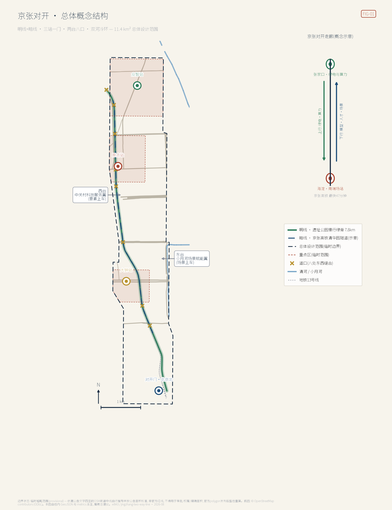
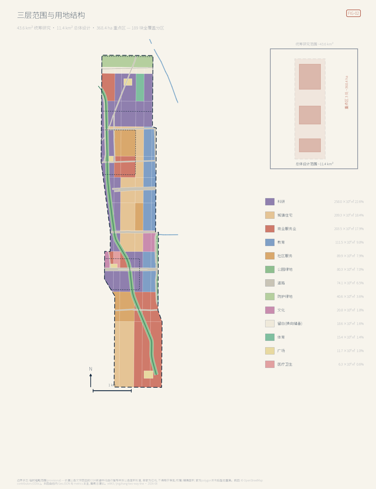
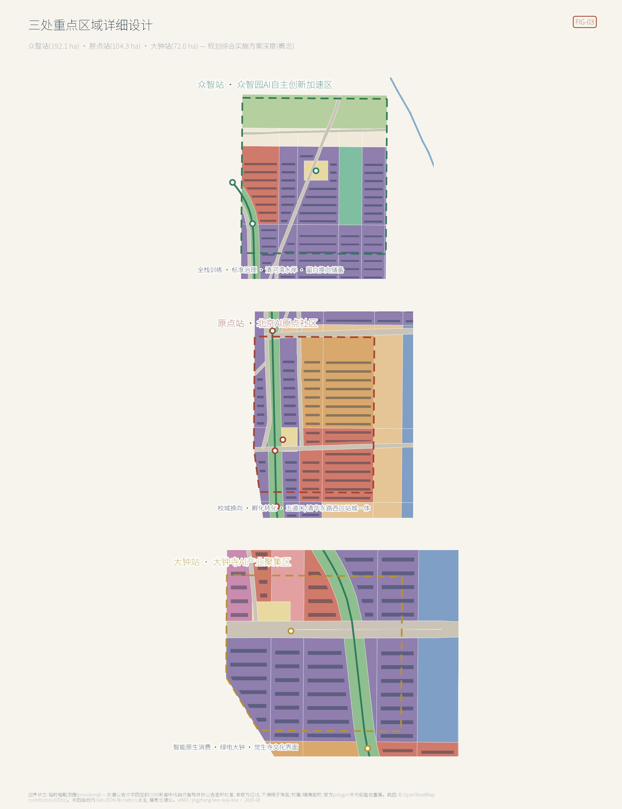
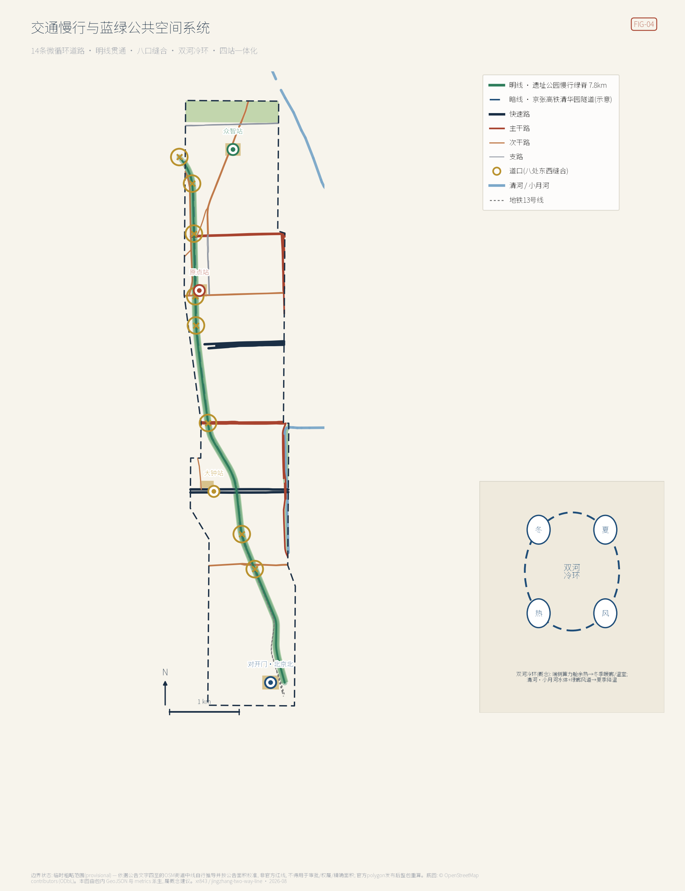
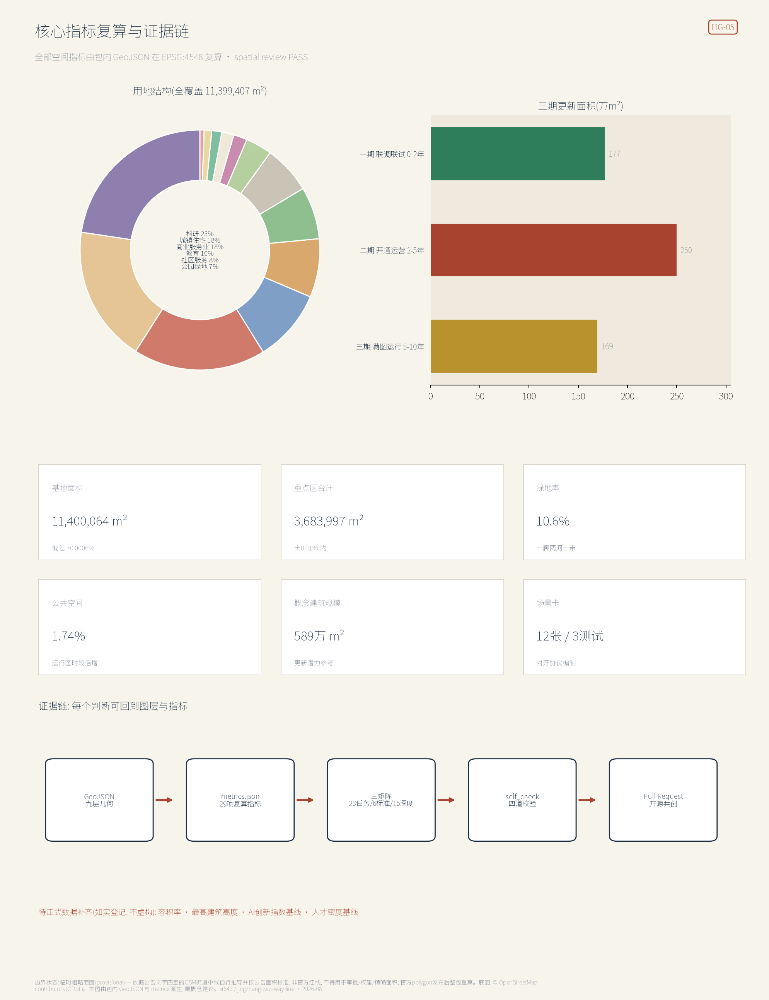

# 京张对开 THE TWO-WAY LINE：让百年走廊双向运行的AI创新带城市设计

> **京张对开**｜1909年，京张铁路第一次把这条走廊修成中国工程自主的干线；2019年，京张高铁转入清华园隧道，在遗址公园正下方继续飞驰——这条线从未停运，只是换了运的东西。本方案把11.4平方公里读作**京张走廊的南端场站城区**：北端的张家口送来绿电与算力，南端的海淀送出模型、人才与场景；地上明线走人，地下暗线走智能。城市设计的全部任务，是把「对开」变成可以走进去的空间与可以执行的制度。

本方案全部空间、活动、政策、招商与分期内容均为**开放共创的概念建议、参考方案或可供专业团队深化研究的材料**，不替代正式规划，不构成政府审定结论，不构成任何地块拆改留、道路红线、轨道线位或工程实施结论 [source:AGENT-TASKBOOK]。方案在官方精确红线尚未发布时，使用本方案自行推导并按公告面积校准的街道贴合临时边界生成，所有几何均为 `official_boundary=false` 的临时约束，仅用于生成、展示、讨论与包内自检 [source:BOUNDARY-SOURCE] [assumption:A-PROV-BOUNDARY-001]。官方 polygon 发布后，须依次替换范围与重点区边界，并整链重算用地、建筑、道路、蓝绿、分期、指标、五张图、HTML 与 PDF。

> **执行摘要（七行）**
> 1. 核心命题：把「京张」读完整——这条走廊有两端，创新带不是9公里的自恋，而是200公里对开关系在城市里的南端场站。
> 2. 空间结构：明线+暗线、三站一门、两台八口、双河冷环；遗址公园慢行明线7.8公里贯通，八处道口缝合东西。
> 3. 区域协同：绿电上行、算力协同、模型下行——以国家「东数西算」京津冀枢纽张家口集群与可再生能源示范区为公开政策背景。
> 4. 制度内核：「对开协议」——每一次AI场景部署都是一对班次，上行的数据与算力必须配下行的服务与公共回报，禁止只取不还。
> 5. 证据状态：临时边界为本方案按公告街道四至自行推导，面积在 EPSG:4548 校准到公告值±0.01%；全部空间指标可由包内几何复算。
> 6. 关键披露：经实测坐标对照，仓库登记的临时边界整体东偏约600米，已在本包更正口径并将以 Issue 向社区提交复核。
> 7. 决策边界：所有结论均为概念建议，法定控规条件缺口已登记为待补，不伪装为审定指标。

## 1. 设计依据与资料清单

本 formal 方案以《百年京张AI创新带城市设计国际方案征集资格预审公告》为第一依据 [standard:PROJECT-OFFICIAL-ANNOUNCEMENT] [source:OFFICIAL-ANNOUNCEMENT]，以面向全球智能体的开源征集任务书为第二依据 [standard:PROJECT-AGENT-OPEN-CALL-TASKBOOK]，并以 `brief/site-package/` 登记的允许设计空间、枚举、限值、标准快照与 schema 为机器可读依据 [source:SITE-PACKAGE]。公开来源登记表用于区分 formal-ready、background-only 与 provisional-only 资料 [source:SOURCE-REGISTRY]；处理资料包只作为阅读导航层，不构成新的权威来源 [source:PROCESSED-FACT-PACK]。

在仓库资料之外，本方案补充了七组经核实的公开背景资料，全部登记于 `sources.json` 并标注 background-only 限制：现状道路、水系、轨道与遗产点位取自 OpenStreetMap 并遵循 ODbL 署名要求 [source:OSM-CONTEXT] [assumption:A-OSM-001]；京张高铁清华园隧道全长6020米、下穿多条地铁与城市道路的公开事实来自国务院国资委页面 [source:JZ-HSR-QINGHUAYUAN]；京张高铁2019年12月30日开通、北京至张家口最快47分钟的事实来自北京市文旅局页面 [source:JZ-HSR-OPENING]；「东数西算」京津冀枢纽在张家口设数据中心集群（起步区怀来、张北、宣化）的政策依据为发改高技〔2022〕212号复函 [source:NDRC-EDWC-JJJ]；国务院2015年批复设立张家口可再生能源示范区 [source:ZJK-RENEWABLE-DEMO]；清华园车站1910年建站、詹天佑题写站名、2023年列为北京市文物保护单位并开放的事实来自清华校友总会 [source:QHY-STATION-HERITAGE]；京张铁路遗址公园一期约2.5公里于2023年开放的事实来自新京报 [source:JZ-PARK-PHASE1]。这些资料只支撑叙事与机制设计，不升级为边界、控规或评分证据。

本包引用的每一项标准都对应仓库内一份可逐句回读的快照文件，全部登记于 `sources.json`：公告正文快照 [source:STD-REF-PROJECT-ANNOUNCEMENT] 是三层范围、三处重点区名称面积与公告四至街道的唯一依据；智能体任务书快照 [source:STD-REF-AGENT-TASKBOOK-0518] 界定 agent.1–agent.6 的必答项与禁止表述。用地编码方面，本包 189 块全覆盖分区所用的 0802、0701、05、0804 等编码全部取自用地用海分类指南快照 [source:STD-REF-MNR-LAND-USE]；交付边界与「交通市政容量须专业测算」的口径取自控规深度要求快照 [source:STD-REF-MOHURD-CONTROL-PLANNING]；风貌与夜景照明的表述边界取自城市设计管理办法快照 [source:STD-REF-MOHURD-URBAN-DESIGN]。建筑深度方面须特别说明：仓库只登记了条目而未入库官方正文 [source:STD-REF-MOHURD-ARCH-DEPTH]，因此本包的概念体量**不等同于建筑设计深度**，该缺口如实登记为待补。

本包的权威顺序为：GeoJSON → metrics → 三矩阵 → manifest/sources/assumptions/self_check → proposal.md → 图片 → HTML → PDF。正文每个空间判断都可回到图层与指标：范围看 [data:geometry/site_boundary.geojson#SITE-001]，重点区看 [data:geometry/key_areas.geojson#PROV-KEY-001]，现状约束看 [data:geometry/constraints.geojson#EX-RAIL-HSR-TUNNEL]，现状诊断与资料缺口详见假设登记 [depth:existing_conditions_diagnosis]。控规深度与用地分类分别遵循住建部与自然资源部规范 [standard:MOHURD-CONTROL-DETAILED-PLANNING] [standard:MNR-LAND-USE-CLASSIFICATION-GUIDE]；《建筑工程设计文件编制深度规定》官方正文未入库，仅登记为建筑深度待补参照 [standard:MOHURD-ARCH-DESIGN-DEPTH-2016]。

## 2. 三层范围工作框架

**统筹研究范围（约43.6平方公里）**承担战略层工作：回答「三区两翼」如何与京张走廊、京津冀算力网络协同，输出产业生态体系、未来城市形态与命名品牌方向。**总体设计范围（约11.4平方公里）**承担控规深度的城市设计：完成用地布局、更新框架、交通市政、遗址公园活力带与风貌管控引导 [metric:site_area_sqm]。**重点区域范围（约368.4公顷）**对众智园、原点社区、大钟寺三区做到规划综合实施方案深度 [metric:key_area_count] [metric:key_area_total_sqm]。三层逐级传导：走廊战略定站位，总体设计定结构，重点区定实施 [depth:three_level_scope_framework]。

本方案必须披露一项边界发现。仓库登记的临时边界以公告街道四至定位，但经与 OpenStreetMap 实测街道中线对照：公告西界大钟寺东路实测经度约116.3325、荷清路约116.329，东界学院路约116.3473、西土城路约116.3482，而登记边界跨经度116.3397–116.3553，**整体东偏约600米**——清华园车站旧址、遗址公园已建段、五道口与大钟寺两座地铁站、大钟寺古钟博物馆全部落在其外 [source:OSM-CONTEXT] [source:BOUNDARY-SOURCE]。因此本包提交层采用**自行推导的街道贴合临时边界**：以公告命名街道的 OSM 中线重建走廊多边形，在觉生寺段按文保单位西界局部外扩，并在 EPSG:4548 下把面积校准到公告值（复算11,400,064平方米，偏差+0.0006%）[data:geometry/site_boundary.geojson#SITE-001]。三处重点区以五道口、清华东路西口、大钟寺三座车站与古钟博物馆位置重新锚定，面积分别校准至公告的192.1、104.3、72.0公顷 [metric:key_area_zhongzhiyuan_sqm] [metric:key_area_origin_sqm] [metric:key_area_dazhongsi_sqm]。

两点必须强调：其一，本方案边界与登记边界**同为临时粗略范围**，都不是官方红线，不得用于审批、权属或精确面积主张；其二，该发现将以 Issue 形式提交社区复核（附对照坐标与复现步骤），若 maintainer 更新登记边界，本包将随之重算。官方 polygon 发布后需要重算的图层与指标清单已写入假设登记 [depth:risk_missing_data] [assumption:A-MAINTAINER-BOUNDARY-OFFSET-001]。

## 3. 统筹研究范围产业与未来城市研究

### 3.1 把「京张」读完整：对开的产业地理

海淀不缺创新要素，缺的是把要素放进更大地理里的叙事。本方案的战略判断是：**AI创新带的腹地不在南边，而在北边的张家口**。国家「东数西算」工程在京津冀枢纽规划了张家口数据中心集群，起步区为怀来县、张北县、宣化区，明确要求承接北京实时算力需求 [source:NDRC-EDWC-JJJ]；张家口又是全国唯一的国家级可再生能源示范区 [source:ZJK-RENEWABLE-DEMO]；京张高铁把两地时距压缩到最快47分钟 [source:JZ-HSR-OPENING]。三份公开政策叠在一起，就是一条现成的「南研北算」走廊：**绿电与算力上行进京，模型、人才与场景下行出塞**——铁路语汇里开往北京的列车叫上行、离京的叫下行，本方案把这对词用作整条创新带的组织语法。

**为什么这条腹地关系必须由海淀这一段来表达**：AI产业的两种稀缺资源在地理上是分开的——绿电与土地在坝上，模型、人才与场景在海淀。这一分离不是问题，而是京张走廊的先天禀赋；问题在于**它至今没有任何一处空间表达**。走廊两端各有叙事：张家口讲能源与冬奥，海淀讲中关村与高校，中间200公里的关系无人承接。本方案主张，创新带的城市设计任务恰恰是给这段关系造一个南端场站——不是把张家口的内容搬到海淀展示，而是让海淀这11.4平方公里在空间与制度上**具备接收与发送的能力**。

**这条关系在场地里是物理存在的，不是修辞**。京张高铁的清华园隧道全长6020米，就在遗址公园正下方穿过 [source:JZ-HSR-QINGHUAYUAN]，构成本方案「明线走人、暗线走智能」双层走廊的现实基底 [data:geometry/constraints.geojson#EX-RAIL-HSR-TUNNEL]。1909年这条走廊第一次证明中国可以自主修铁路，2019年它转入地下继续飞驰——**同一条线，第三次承担同一件事：把外部资源接进来，把自己的能力送出去**。城市设计要做的是让这件事在地面上重新可见。

**必须限定这个判断的边界**：本方案不主张、也无权主张任何跨区域的产业转移、投资安排或算力调度政策；上述三份公开政策只用于说明走廊两端的既有条件，不代表任何一方已作出承诺。「对开」是本方案提出的空间与制度概念，其成立与否取决于未来的跨区域协商，本包只负责把空间与制度接口预留到位。这一判断直接回应「构建世界级AI创新生态体系」的征集目的，也把区域协同从表态变成可运营的空间关系 [standard:PROJECT-OFFICIAL-ANNOUNCEMENT] [assumption:A-CORRIDOR-001]。

### 3.2 总体概念、命名体系与Logo方向（agent.1）

**主名称：京张对开；英文名：THE TWO-WAY LINE**；标识语「一条线，两座城，双向开行 / One line, two cities, both directions」。命名体系全部取自铁路运营语汇：地上遗址公园慢行绿脊称**明线**，清华园隧道及高铁称**暗线** [source:JZ-HSR-QINGHUAYUAN]；三处重点区对应**众智站、原点站、大钟站**三座「站」；北京北站门户称**对开门**；八处东西缝合节点称**道口**（K1–K8）；中关村科技服务翼与小月河场景赋能翼化作**西台、东台**两座站台——要素与场景在两侧「上车」；AI场景部署称**班次**，其发布排期称**运行图**；治理契约称**对开协议**。Logo方向建议「双箭同轨」：两条平行轨线，上端北向箭头、下端南向箭头，中部以轨枕横杠连接，负空间隐含「开」字骨架；配色取绿电绿、站房砖红、隧道深蓝三色；字体建议站牌黑体方向的开源字库，不使用任何未授权字体、商标或企业标识。命名与图形均为方向性建议，最终视觉系统待专业设计深化 [depth:overall_spatial_structure]。上述 Logo 方向已绘制为可缩放矢量图，彩色版见 `assets/two-way-line-logo.svg`、单色版见 `assets/two-way-line-logo-mono.svg`：绿电绿轨线上端为北向箭头、隧道深蓝轨线下端为南向箭头，两道站房砖红轨枕横杠把两条轨线连成一副轨道，轨线与横杠围出的负空间即「开」字骨架；单色版填色为 `currentColor`，供单色印刷、刻印与深底反白使用。两版几何完全一致，未使用任何未授权字体、商标或企业标识 [source:PKG-IDENTITY-MARK]。

### 3.3 三大定位、五大功能与三区两翼协同回路

三大定位在「对开」语法下互为表里：**百年京张文化带**是明线——遗产、站房与里程碑构成可触摸的时间；**都市AI生活体验带**是两台——场景在东台上车、服务在西台上车；**AI融合创新带**是暗线与三站——算力、标准与产业在此运行 [source:AGENT-TASKBOOK]。五大功能落位为：AI全栈自主创新体系与AI治理全球话语权主要在众智站（训练、标准、安全治理），世界级AI创新生态主要在原点站（校城转化、开源社区），AI+场景赋能新范式沿东台与八口展开，智能化AI活力城市由明线与双河冷环承载。协同回路是一个完整的「对开循环」：西台（中关村科技服务翼）提供资本、知识产权、法务与算力合同等牵引要素，三站产出模型与产品，东台（小月河场景赋能翼）以高校群与社区场景做首次验证，验证数据经对开协议回流三站，成熟班次沿走廊下行至张家口侧规模化训练部署，绿电与算力再上行反哺。回路的每一环都对应本包的空间图层与指标，不停留在示意箭头 [depth:overall_spatial_structure]。

### 3.4 全球AI创新生态案例（agent.2，七例）

七个案例按「可迁移机制」而非名气选取 [metric:global_case_study_count]：

| 案例 | 一句话画像 | 可迁移机制 |
| --- | --- | --- |
| 伦敦国王十字知识区 | 铁路场站更新长成AI总部聚集区 | 遗产场站作为创新区门面；开发与公共空间打包 |
| 剑桥肯德尔广场 | 「最具创新力的一平方英里」，校门口的转化区 | 校区—园区零距离；实验室与街道业态垂直混合 |
| 巴黎 Station F | 老货运站改造的全球最大单体孵化器 | 单一大空间聚合上千团队；运营方即品牌 |
| 新加坡 one-north | 政府主导二十年滚动开发的科学城 | 长周期分期与留白；公共实验室锚定产业簇群 |
| 深圳南山粤海街道 | 高密度产城互促的自发创新街区 | 楼宇级混合用途；企业迭代与街区更新同频 |
| 多伦多滨水智慧城项目 | 明星项目因数据信任危机于2020年终止 | **失败镜鉴**：缺公共可回退与数据治理共识，技术再好也会被城市拒绝 |
| 上海张江科学城 | 大科学装置带动的综合性科学城 | 重大设施作为「重锚」；居住配套与产业同步补课 |

对海淀的启示浓缩为三条：把遗产场站当门面（对开门与清华园车站）、把校门口当转化区（原点站）、把可回退当准入（对开协议）。案例均为公开知识的定性概括，不引用未核实的投资与产值数字 [depth:existing_conditions_diagnosis]。

七例中有三例可直接回到其官方站点核对上表的机制描述：肯德尔广场见 Kendall Square Association 站点 [source:CASE-KENDALL-SQUARE]，Station F 见其官方站点 [source:CASE-STATION-F]，one-north 见开发主体 JTC 的官方页面 [source:CASE-ONE-NORTH] [assumption:A-CASE-PROVENANCE-001]。其余四例（国王十字、南山粤海街道、多伦多滨水智慧城、张江科学城）本轮**未登记可核验来源**——国王十字官网对本包的抓取返回 403，多伦多项目的原运营方站点现已重定向至其它产品，张江站点未能确认发布主体。按本包「无法核实即不声称已清权」的原则，这四例只作为公开知识的定性概括保留，不升级为可引用来源，后续如取得稳定出处将补登记。

### 3.5 适配人工智能的未来城市形态

未来城市形态的关键不是把AI贴在墙上，而是回答「当智能成为市政基础设施，城市形态哪些要素会重组」。本方案给出五个可落地的形态命题，每一个都对应本包内可核对的图层、指标或班次，不是形容词。

**其一，算力下沉为街区设施**。端侧算力舱像变电箱一样进入街区，其散热进入双河冷环回用（详见第8章），使「计算的温度」成为可感知的城市现象。这一命题的空间后果是具体的：算力不再只存在于远端机房，而在街区尺度上产生**新的市政构筑物类型与新的热力关系**——冬季暖廊（班次S7）就是这层关系的公共可见面。能源侧负荷与热平衡须由专业单位测算，本方案只做空间预留与公共回报的制度绑定。

**其二，空间供给从整栋转向班次**。场景以运行图排期使用公共空间与测试路段，空间供给的最小单位从「地块」细化为**「时段 × 路段」**。这不是修辞：十二张班次卡每张都声明了节点、运营主体、上下行清单与叫停主体，缺一不得排图，其机读契约与桌面推演见 `visual/assets/`。传统控规配置的是**永久用途**，运行图配置的是**可撤回的时段使用权**——后者才是AI场景高频迭代所需要的供给形式。

**其三，留白成为换向储备**。五环沿线18.6公顷留白用地不预设功能 [data:geometry/land_use.geojson#LU-177]。这是众智园总用地的9.7%，也是整条走廊唯一**不需要拆除任何既有建成物就能重新出车**的余量。当训练算力的技术路线在十年尺度上换代——从今天的集中训练转向别的形态——城市不必以拆建来响应，这是把不确定性预先兑换成空间的做法。

**其四，感知设施改变街道的设计对象**。微气候感知（S11）与无障碍状态感知（S9）意味着街道要素表上多出一类「可关停的公共传感点位」：它必须公示位置、必须可被属地关停、必须有非AI等价路径。街道设计从此不只配置铺装、树池与灯杆，还要配置**感知的边界与撤销机制**——这一条已写入对开协议的隐私红线，由 schema 的数据类别枚举在契约层强制，而非仅靠承诺约束。

**其五，治理机制本身成为规划工具**。「对开协议」不是配套政策，而是本方案的空间准入条件：一处公共空间能否承载AI部署，取决于该班次能否通过六条规则。这意味着规划文件里第一次出现**以可执行检验定义的用地适配性**——评审者可以自己运行推演来复核，而不必采信本文的结论。

AI文化、AI社会的叙事载体见第9章文化系统。国际化生活与工作氛围依托双城通勤圈：上午在原点站写模型、下午到张北看训练集群的工作方式，已被47分钟时距变为现实可能 [source:JZ-HSR-OPENING]。

## 4. 总体设计范围城市更新与控规深度城市设计

### 4.1 产业目标、功能布局与指标体系

总体设计范围的产业布局延续「三站」分工：北段（众智站）承担全栈训练、标准制定与安全治理，中段（原点站）承担原始创新转化与开源社区，南段（大钟站与对开门）承担智能体应用、智能终端与内容消费的市场化界面。功能比例以用地复算为准：科研用地约258万平方米、居住及社区服务约299万平方米、商业服务业约204万平方米、教育用地约112万平方米，道路、绿地与广场合计约占18%（详见第7章用地表）[metric:land_use_area_sqm]。规划指标体系提出「对开指数」框架：上行侧监测绿电到岗率与算力利用率，下行侧监测班次公共回报率与场景留存率，人才侧监测双城通勤规模与创新密度。

**这套指标必须与本包已复算的空间指标区分开**，否则就是把愿望写成数据。本包 `metrics.json` 的36项指标分三种状态，界限清楚：**一是可由包内几何直接复算的**（面积、长度、比率、栋数、概念建面等，全部标 `known` 并附 `formula`，任何人可用 EPSG:4548 重算核对）；**二是本包自定的计数**（场景卡12张、测试场景3个、画像7类、案例7例、地标4处、更新项目14项，标 `known` 但其含义由本方案定义）；**三是需要权威标定、本包无从取得的**，共4项、一律标 `unknown` 并写明 `reason`、值为 `null`——法定容积率 `floor_area_ratio`、官方高度管控 `building_height_max_m`、人才密度基线 `talent_density_baseline`、AI创新指数基线 `ai_innovation_index_baseline`。36项中32项 `known`、4项 `unknown`，无一项含糊。上述「对开指数」全部属于第三类——本包只给框架与口径建议，不虚构任何基线数值 [depth:metrics_recalculation] [assumption:A-CONTROLS-001]。**一个方案的可信度不取决于它给出多少数字，而取决于它是否诚实标注了哪些数字自己拿不到。**

### 4.2 城市更新总体框架

更新框架概括为「**一线牵引、两带更新、多点渐进**」：以明线贯通为更新引擎（公园一期已开放约2.5公里，本方案向南北延伸至全线7.8公里）[source:JZ-PARK-PHASE1] [metric:greenway_length_m]；知春路至北四环之间的居住更新带与学院路沿线的校园更新带为两条主更新带；其余以道口、站前广场等节点渐进更新。更新对象的选择原则是「先断点、后地块」：优先缝合公共空间断点（投入小、公共收益立现），再推组团更新。概念建筑总规模约589万平方米，作为体量参考而非控规指标 [metric:concept_total_floor_area_sqm]；更新后AI产业空间集中于244处概念建筑组团 [data:geometry/buildings.geojson#BLDG-001]。职住商平衡策略是把人才公寓与社区服务嵌入三站800米圈层，避免产业单极化 [depth:retain_renovate_demolish]。

**分期逻辑取自铁路开通程序，且三期的面积配比是被更新策略决定的**，见分期图层 [data:geometry/phasing.geojson#PH-1]：第一期「联调联试」0至2年、176.9公顷，先把公共骨架跑通——这一期几乎不碰产权复杂的地块，做的是明线贯通与八处道口，投入小而公共收益立现；第二期「开通运营」2至5年、249.7公顷，是三期中最大的一期，三站组团在此成型，也是权属协商与审批压力最集中的一期；第三期「满图运行」5至10年、169.3公顷，居住更新带与校园界面滚动完成，节奏由居民与校方的协商进度决定，不设硬性时限。**把最大的一期放在中间而不是开头，是因为第一期的公共骨架必须先证明「缝合确实带来公共收益」，第二期的组团更新才有谈判基础**——这一顺序本身就是对开协议「先给下行回报、再取上行资源」在时间维度上的复写 [metric:phase_1_area_sqm]。

更新重点地区分布、更新空间结构、用地布局与项目清单分别落在五张图与第10章清单中。

### 4.3 交通、轨道、市政和配套设施

系统性结论见第8章专章，此处给出控规深度要求的口径与本包实际入库的路网家底。全部交通与市政内容为系统性概念方案，具体线形、管线与容量需专业测算 [standard:MOHURD-CONTROL-DETAILED-PLANNING]。

**路网构成**：道路图层收录现状道路14条、慢行主径1条，机动车道路合计38.1公里 [metric:road_length_m]，占地74.1公顷、占总体设计范围6.5% [metric:road_area_ratio]。等级结构为快速路2条7.0公里（北四环中路、北三环中路辅路段，概念宽度44米）、主干路5条12.6公里（清华东路、知春路、学院路、西土城路、学清路，30至34米）、次干路5条14.1公里（成府路、学院南路、荷清路、大钟寺东路、双清路，22至24米）、支路2条4.4公里（王庄路、月泉路，16米）[data:geometry/roads.geojson#RD-003]。本方案**不新增机动车道路、不拓宽既有红线**——走廊的通行能力增量全部来自明线7.8公里慢行主径与八处道口的东西向缝合 [metric:greenway_length_m]。

**断点的位置是被路网结构决定的**：明线南北贯通，而与之正交的是两条快速路与三条主次干路——北四环、北三环两条快速路是断点最硬的两处，知春路、成府路、清华东路三处是校城人流最集中的三处。八处道口因此不是均匀撒点，而是对准这五条正交道路加学院南路、月泉路与清河湾 [metric:crossing_node_count]。上跨快速路的两处以景观连桥为概念方向，桥隧结构与净空须由专业单位论证，本方案不给可行性结论。

**轨道与站城一体**：走廊沿线既有五道口、清华东路西口、大钟寺三处轨道站点，分别落在原点站与大钟站两处重点区内；站城一体化的设计动作限于站点出入口与地面公共空间的衔接，不涉及线路、站台或运能调整。清华园隧道内的京张高铁为暗线本体，本方案只做地面层的叙事与视线关系设计，**不提出任何涉及既有隧道结构或运营的改动** [source:JZ-HSR-QINGHUAYUAN]。

**市政与配套**：新型市政的核心是端侧算力舱与双河冷环示范段——算力舱余热经热网回收，冬季转为明线暖廊（班次S7），能源侧测算须由专业单位完成，本方案只做空间预留与公共回报的制度绑定。配套设施依托原点站37.2公顷社区服务用地与全域医疗、教育、体育用地，本轮不新增独立配套指标，避免在没有现状普查的前提下给出人均配套结论 [depth:municipal_new_infrastructure]。

### 4.4 京张遗址公园活力带

活力带的核心动作是「**八口缝合、全线贯通**」：现状公园断点集中在与东西向城市道路的交叉处，本方案在学院南路、北三环、知春路、北四环、成府路、清华东路、月泉路、清河湾设八处道口 [metric:crossing_node_count]，每处道口等于慢行贯通设施加一块公园内活动场地加一个AI场景端口 [data:geometry/public_space.geojson#PB-X01]。公园南端接对开门与北京北站到达序列，北端以清河湾道口衔接清河水岸，上跨北四环、北三环两处以景观连桥形成标志性节点（桥隧工程可行性待专业论证，此处仅为概念建议）。

须如实说明八处道口的一处范围事实：**清河湾道口经复算位于总体设计范围北缘之外约 85 米**，八处中其余七处均在范围内。这不是失误而是这处道口的功能使然——它的任务正是把明线北端接出边界、缝到清河水岸上去，缝合动作本身必然跨过边界线。相应地，该处的实施依据落在统筹研究范围层面，其用地与工程条件不计入总体设计范围的用地与指标复算；官方红线发布后此处需要重新判断归属 [depth:risk_missing_data] [assumption:A-SCOPE-CROSSING-QINGHEBAY-001]。停车、体育与创新交往设施沿明线两侧组团布置；科技测试与应用展示功能由道口场景端口承载，测试班次全部纳入运行图管理 [depth:blue_green_public_space]。

### 4.5 彰显人工智能时代特色的城市风貌

城市基调概括为「**站房砖红、绿电青绿、隧道深蓝**」的京张三色。三色不是装饰配色，而是三种空间身份的编码：砖红属于遗产与站房，青绿属于上行的能源与水岸，深蓝属于地下飞驰的暗线。同一套三色贯穿标识、导视、铺装与夜景，使人在任何一个节点都能读出自己站在哪一层走廊上 [source:PKG-IDENTITY-MARK]。

**高度秩序以包内 244 栋概念体量的实际分布为准，不做无据的分区宣称**：全域概念高度 21.0 至 67.2 米，中位 37.8 米；其中 24 米以下 10 栋（4%）、24 至 45 米 173 栋（71%）、45 至 60 米 47 栋（19%）、60 米以上 14 栋（6%）。须说明：这些是**本包概念体量的统计值**，而官方高度管控（含航空、景观、文保约束）未随场地包发布，`building_height_max_m` 因此在本包中如实登记为 `unknown` 而非填入 67.2 [metric:building_height_max_m]——概念体量不得反向充当高度管控依据。也就是说走廊主体是一个**以七成体量落在 24 至 45 米区间的中层城市**，高点是少数而非常态。按功能看，教育设施最低（21.0 米）、孵化器与住宅次之（25.2 米）、人才公寓 29.4 米、零售与研发 33.6 至 50.4 米、办公 42.0 米、实验室 50.4 米，最高的是大钟站一侧的混合功能组团（50.4 至 67.2 米）。高度由功能与区位共同决定，与前述院区型→街区型→城市型的密度梯度同向 [depth:height_massing_character]。

**遗产界面须说明一处范围事实**：清华园车站旧址（1910年建站，2023年列为北京市文物保护单位）经复算位于本方案总体设计范围**以西约 389 米**，在统筹研究范围之内、总体设计范围之外 [data:geometry/constraints.geojson#EX-RAIL-HSR-TUNNEL]。因此本章对该处「低层砖木肌理与文保退让」的引导属**统筹研究范围层面的建议**，不构成总体设计范围内的管控条款；范围内真正受文保直接约束的是觉生寺（大钟寺古钟博物馆，全国重点文物保护单位）周边界面 [source:QHY-STATION-HERITAGE] [assumption:A-SCOPE-QHY-STATION-001]。明线两侧建筑以退台形成「站台断面」，中高层向学院路、西土城路一侧递升，全部为待控规确认的引导方向。

屋顶形态鼓励第五立面光伏化，与绿电叙事一致；夜景照明以「运行图」为脚本——城市灯光的节律本身成为AI运行状态的公共表达，而这套节律的数据源与绿电报时（班次S12）共用同一个可审计口径，不是任意的灯光秀 [standard:MOHURD-URBAN-DESIGN-MEASURES]。

## 5. 重点区域详细设计

三处重点区共368.4公顷，均按「定位、空间结构、建筑更新、交通慢行、公共空间、AI场景、实施风险」七要素组织 [depth:three_key_area_detailed_design] [source:KEY-AREA-SOURCE]。

三处不是同一套模板的三次复制，而是**由北到南的一条密度与性格梯度**，这条梯度可由包内几何直接复算：众智园192.1公顷、47栋概念建筑、概念毛容积率0.75、科研加绿地逾六成，是院区型；原点社区104.3公顷、49栋、0.96、社区服务用地领跑，是街区型；大钟寺72.0公顷、38栋、1.68、被北三环与大钟寺东路切分，是城市型。**梯度不是构图偏好，而是「上行取绿电算力、下行还场景消费」在空间上的必然结果**——越靠近走廊北端越接近生产与试验，越靠近南端越接近市场与消费，密度、层高与功能混合度随之递增。三处的用地构成均经 EPSG:4548 逐块与重点区求交后复算，交集面积分别恰好等于各自的192.1、104.3、72.0公顷 [metric:key_area_total_sqm]。

### 5.1 众智站·众智园AI自主创新加速区（约192.1公顷）

**定位**：花园型人工智能创新街区，全栈自主训练与标准治理的「机务段」，走廊北向接口 [metric:key_area_zhongzhiyuan_sqm] [data:geometry/key_areas.geojson#PROV-KEY-001]。

**空间结构**：清河湾广场为核，科研组团沿明线北段展开，近五环留白为换向储备；建筑、绿地、水系一体化设计以清河文化为底 [data:geometry/green_space.geojson#GS-002]。区内用地经 EPSG:4548 逐块与重点区求交后复算，合计恰好覆盖192.1公顷：科研用地82.9公顷（43.1%）、防护绿地36.4公顷（18.9%）、商业服务业21.4公顷（11.1%）、留白换向储备18.6公顷（9.7%）、体育15.4公顷（8.0%）、道路9.5公顷（4.9%）。科研加绿地逾六成，是三处重点区中最「院区化」的一处——这一构成本身就是「机务段」定位的空间证据，而不是事后贴上的标签。

**建筑更新**：区内布置47栋概念建筑，概念总建面144.8万平方米 [metric:key_area_zhongzhiyuan_gfa_sqm]，概念毛容积率0.75（由上述概念建面除以重点区面积得出，非法定容积率——法定指标待官方控规发布 [metric:floor_area_ratio]），层数6至12层、概念高度25.2至50.4米。功能构成为研发楼9栋、实验室8栋、孵化器8栋、办公8栋、混合功能5栋、住宅5栋、社区配套4栋：研发—实验—孵化三类占五成三，对应机务段「检修—试车—出车」的作业链；住宅与社区配套九栋沿双清路一侧布置，保证园区不做成夜间空城。全部体量为概念示意，最终指标以控规为准 [depth:height_massing_character]。

**交通慢行**：荷清路、双清路、月泉路与明线慢行主径在区内合计7.2公里，构成「一纵三横」的微循环骨架 [data:geometry/roads.geojson#RD-009]。结合五环路区域一体化改造预留对外交通优化接口（概念建议，具体方案由交通专业论证）；月泉路道口是北段唯一的东西向缝合点，承担园区与清河水岸的步行连接。

**公共空间**：区内绿地41.0公顷，含清河滨水带与防护绿地两类；清河湾广场、月泉路道口活动场地与众智站核心三处节点串在明线上 [data:geometry/public_space.geojson#PB-X01]。留白18.6公顷不是消极空地，而是「换向储备」——当训练算力路线在十年尺度上发生技术换代时，这块地是走廊唯一不需要拆除既有建成物就能重新出车的余量。

**AI场景**：低速无人配送走廊测试（班次T1，运营主体众智站乘务组）、水岸环境智能监测（班次S11在本段的落位）、标准与安全治理展示厅。三者共用清河湾广场的场景端口，测试班次全部纳入运行图管理，未经排图不得上路。

**实施风险**：五环一体化与国家平台建设时序不由本方案决定，相关内容均为衔接预留；防护绿地36.4公顷中包含既有市政廊道的避让，其权属与迁改需专项核实后方可细化 [depth:municipal_new_infrastructure]。

### 5.2 原点站·北京AI原点社区（约104.3公顷）

**定位**：近校型创新街区，原始创新成果的「换向站」——研究在此换向为产品，校区在此换向为城区 [metric:key_area_origin_sqm] [data:geometry/key_areas.geojson#PROV-KEY-002]。

**空间结构**：五道口对开广场为核，孵化转化带沿明线西侧展开，教育与人才居住组团在北，商业界面在东。区内用地复算合计104.3公顷：社区服务37.2公顷（35.7%）、商业服务业24.6公顷（23.6%）、科研22.6公顷（21.7%）、公园绿地9.7公顷（9.3%）、道路8.4公顷（8.0%）、广场1.7公顷（1.7%）。这里是三处重点区中唯一由社区服务用地领跑的一处——换向站的本质不是园区，是**生活与研究共用的一段站台**，用地构成必须诚实地反映这一点。

**建筑更新**：区内49栋概念建筑，概念总建面100.5万平方米 [metric:key_area_origin_gfa_sqm]，概念毛容积率0.96（口径同上，非法定指标），层数5至9层、概念高度21.0至37.8米——是三处中最低矮的一处，为的是不压过高校院落与既有社区的尺度。功能构成为孵化器14栋、研发楼14栋、人才公寓11栋、教育设施10栋：孵化与研发各占近三成，人才公寓与教育合计逾四成，成果、人与教学在同一步行半径内。策略以低扰动有机更新为主，保留院落肌理，插建孵化器与成果发布厅；拆改留逐栋分类需现状普查后确定，本方案仅给出「保留为主、改造激活、极少量拆除」的概念方向 [depth:retain_renovate_demolish]。

**交通慢行**：成府路、清华东路、荷清路、双清路、王庄路与明线主径在区内合计6.6公里，是三处重点区中路网最密的一处，也对应最复杂的校城交界 [data:geometry/roads.geojson#RD-001]。围绕五道口、清华东路西口两座既有轨道站做站城一体化设计；成府路与清华东路两处道口承担缝合校区与园区的主任务。

**公共空间**：五道口对开广场、成府路道口活动场地与原点站核心三处节点，加公园绿地9.7公顷。广场设计的核心动作是把「发布」变成公共事件——开源报告厅前庭与广场连通，模型首发日的观众动线不进楼即可参与 [data:geometry/public_space.geojson#PB-X01]。

**AI场景**：AI交通与慢行断点调度测试（班次T2，运营主体东台场景协调人）、开源模型首发日（S8）、校园成果转化撮合（S10）、多语文化导览在本段的落位（S4）。四个班次覆盖「研究—转化—发布—传播」全链，是三处重点区中场景密度最高的一处。

**实施风险**：高校院墙的开放程度决定缝合深度，需校地协商机制先行；人才公寓的产权与运营模式涉及住房政策，本方案不作制度设计，只预留空间可能性。

### 5.3 大钟站·大钟寺AI产业聚集区（约72.0公顷）

**定位**：城市型创新街区，智能体、智能终端与内容消费的「下行终点站」，市场与数据资产的界面 [metric:key_area_dazhongsi_sqm] [data:geometry/key_areas.geojson#PROV-KEY-003]。

**空间结构**：绿电大钟广场为核，智能原生消费街区沿大钟寺东路展开，觉生寺文化界面向西打开视廊。区内用地复算合计72.0公顷：科研42.7公顷（59.3%）、道路8.6公顷（11.9%）、公园绿地7.7公顷（10.6%）、商业服务业5.1公顷（7.1%）、文化3.1公顷（4.3%）、医疗3.1公顷（4.2%）。这是三处中面积最小、道路占比最高的一处，因为它同时被北三环与大钟寺东路切分——「终点站」的空间性格是**密、杂、快**，不是舒展的园区。

**建筑更新**：区内38栋概念建筑，概念总建面120.8万平方米 [metric:key_area_dazhongsi_gfa_sqm]，概念毛容积率1.68（口径同上，非法定指标）——是众智园（0.75）的2.2倍，三处重点区由北到南呈现清晰的**院区型→街区型→城市型**密度梯度，这不是随意分配，而是「上行取绿电算力、下行还场景消费」在空间上的必然结果。层数8至16层、概念高度33.6至67.2米。功能构成为混合功能13栋、零售12栋、办公9栋、研发楼4栋：消费与混合业态占六成六，既有商业设施改造为智能终端旗舰与内容消费场景，高层商务组团向北三环界面集中 [depth:height_massing_character]。

**交通慢行**：北三环中路辅路段、大钟寺东路与明线主径在区内合计2.9公里 [data:geometry/roads.geojson#RD-006]。大钟寺地铁站四象限步行连通设计是本段最实的一项工程动作——现状四个象限被主干路割裂，行人过街绕行显著；非机动车停放与静态交通同步重组。北三环上盖道口为远期概念，桥隧工程可行性须专业论证，本方案不给结论。

**公共空间**：绿电大钟广场与觉生寺前文化绿地复合利用，公园绿地7.7公顷。广场的公共内容是「绿电报时」（班次S12）——每日整点的声光报时以走廊绿电占比为数据源，把一个抽象的能源指标变成全城可听可看的公共节律，这是本方案把AI与能源叙事落到日常感知的关键一处。

**AI场景**：企业服务智能体合规沙盒（班次T3，运营主体大钟站乘务组）、绿电报时（S12）、年度铸档仪式、数据要素流通展示。数据与数字资产机制表述为探索方向，非既定政策。

**实施风险**：文保单位周边一切建设活动以文物部门审批为前提，本方案仅提出视廊与退让的概念引导；科研用地占近六成意味着本段更新高度依赖既有权属方的合作意愿，商业改造类项目需与产权人协商后方可推进 [source:QHY-STATION-HERITAGE]。

## 6. AI 创新生态、人才画像与 AI+ 场景

### 6.1 七类用户画像（agent.3）

画像的编制原则是：**每一类都必须能指认出至少一个为其而设的班次与一处空间落点**，否则就是装饰性人群清单。七类覆盖「上行侧」（研究、创业、双城工程）与「下行侧」（居民、劳动者、访客、行动不便者）两侧人群 [metric:user_persona_count]：

| 画像 | 一日轨迹 | 方案回应 | 直接服务其的班次 |
| --- | --- | --- | --- |
| 青年研究员（五道口博士后） | 实验室、明线跑步、开源报告厅 | 原点站孵化带与人才公寓圈层 | S8 开源模型首发日 |
| AI创业者（原点孵化团队） | 路演、对开协议申报、道口测试 | 运行图快速排期与西台服务台 | S10 校园成果转化撮合 |
| 双城工程师（张北训练值班） | 对开门乘高铁、怀来集群、晚归 | 47分钟通勤圈与对开门到达服务 [source:JZ-HSR-OPENING] | S6 公共安全运行复盘 |
| 原住居民（学院路街道老住户） | 买菜、道口广场遛弯、社区食堂 | 下行班次优先覆盖民生服务 | T1 免费配送时段、S11 高温预警 |
| **高龄与行动不便居民** | 就医、日常采买、短距步行 | 无障碍设施状态公开、暖廊与休憩座椅、非AI等价路径兜底 | S5 老年就医陪导、S9 视障领航 |
| 一线运维与配送劳动者 | 算力舱巡检、骑手驿站、夜班休息 | 道口驿站、暖廊与夜间照明保障 | S7 冬季暖廊开放 |
| 国际开发者访客（对开节参会） | 到达厅、里程碑道、发车厅首发 | 双语导视、朝圣线路与社区接待 | S4 多语文化导览 |

**包容性不是靠增加一行画像达成的，而是靠三条硬约束**：其一，**每个班次必须有非AI等价服务路径**，这条写入对开协议并由推演逐条检验——意味着任何一位不使用、不会用或不愿用智能服务的居民，都不会因为某处公共空间「上了AI」而失去原有服务；其二，**下行回报优先覆盖民生**，十二张班次里有免费配送时段、老年就医陪导、视障领航、高温预警与冬季暖廊五项直接面向弱势与一线人群，占比逾四成；其三，**受影响者有叫停权**——S5 的叫停主体含参与居民、S9 含参与用户，不是只有管理方能喊停。三条约束都不是承诺式表述，而是可在 `visual/assets/twoway-runbook.json` 里逐条读到的字段 [depth:blue_green_public_space]。

### 6.2 十二张AI场景卡（含三个产业测试验证场景）

十二张班次卡按「上行采集什么、下行回报什么、谁能叫停」三问统一编制 [metric:ai_scenario_card_count]；每张卡对应空间节点、责任主体、隐私边界、人工复核与退出机制，T字头三张为产业测试验证场景 [metric:ai_test_scenario_count]：

| 班次 | 场景 | 节点 | 上行（采集/训练） | 下行（公共回报） | 复核与退出 |
| --- | --- | --- | --- | --- | --- |
| T1 | 低速无人配送走廊测试 | 众智站清河湾段 | 脱敏运行数据 | 社区免费配送时段 | 现场急停与运行图下线 |
| T2 | AI交通与慢行断点调度测试 | 知春路、北四环道口 | 匿名流量统计 | 步行等灯时间缩短公示 | 信号回退人工方案 |
| T3 | 企业服务智能体合规沙盒 | 大钟站商务组团 | 企业授权工单 | 中小企业免费额度 | 人工客服全程可切换 |
| S4 | 多语文化导览 | 里程碑道K0至K9 | 匿名点位热力 | 四语遗产讲解 | 内容人工审校 |
| S5 | 健康服务导航 | 学院路社区界面 | 自愿健康咨询 | 老年就医陪导 | 医师复核且数据即焚 |
| S6 | 公共安全运行复盘 | 对开门到达厅 | 事件复盘数据 | 演练结果公示 | 仅事后分析不实时布控 |
| S7 | 算力舱余热调度 | 双河冷环示范段 | 设备温度遥测 | 冬季暖廊开放 | 热网人工旁路 |
| S8 | 开源模型首发日 | 清华园车站发车厅 | 发布会登记 | 模型卡与权重公开 | 社区评审前置 |
| S9 | 无障碍步行代理 | 八处道口 | 无障碍设施状态 | 视障领航服务 | 志愿者热线兜底 |
| S10 | 校园成果转化撮合 | 原点站报告厅 | 授权成果清单 | 校地共享收益公示 | 技术经理人复核 |
| S11 | 街区微气候感知 | 明线全线 | 温湿风光传感 | 高温预警与遮荫导航 | 传感点位公示可关停 |
| S12 | 绿电报时 | 绿电大钟广场 | 走廊绿电占比数据 | 每日整点声光报时 | 数据源公示可审计 |

场景卡的空间落位见节点图层 [data:geometry/public_space.geojson#ST-ORIGIN] [metric:ai_scenario_node_count]。其中班次 S8 的场所「清华园车站发车厅」依托的清华园车站旧址位于总体设计范围以西约 389 米、统筹研究范围之内，属跨范围的仪式性场所；其余十一张班次卡的节点均落在总体设计范围内。所有场景遵守隐私与人工复核边界：不做人脸识别布控、不采集可识别个体轨迹、每个班次必须有非AI等价服务路径，测试场景不得表述为已批准运营 [source:AGENT-TASKBOOK]。

### 6.3 场景、空间与运营映射及小月河场景赋能翼

东台（小月河场景赋能翼）是场景的「进站口」：学院路沿线高校群供给真实用户与研究伦理审查能力，社区供给日常生活场景，小月河水岸供给环境感知试验段。映射规则写入对开协议：每个班次必须声明其节点（空间）、运营主体（运营）、上下行清单（数据与回报）三要素，缺一不得排图 [depth:blue_green_public_space]。

**运营主体与叫停主体**：§6.2 的班次表公布了节点与上下行清单，第三要素「运营主体」与三问之一的「谁能叫停」须逐卡落到人，否则按协议自身规则不得排图。依本方案自设的运营架构——运行图管委会统筹，三站各设乘务组，两台分设产业导师（西台）与场景协调人（东台）——十二张班次卡的指派如下。全部为概念性运营建议，涉及的机构均非既有单位，也不构成已批准的行政安排：

| 班次 | 运营主体 | 叫停主体 |
| --- | --- | --- |
| T1 低速无人配送走廊测试 | 众智站乘务组 | 现场安全员、运行图管委会 |
| T2 AI交通与慢行断点调度测试 | 东台场景协调人 | 道口值守、运行图管委会 |
| T3 企业服务智能体合规沙盒 | 大钟站乘务组 | 企业用户、运行图管委会 |
| S4 多语文化导览 | 里程碑道共创社区 | 内容审校组 |
| S5 健康服务导航 | 东台场景协调人 | 复核医师、参与居民 |
| S6 公共安全运行复盘 | 对开门站区运营组 | 运行图管委会 |
| S7 算力舱余热调度 | 众智站乘务组 | 热网值班、运行图管委会 |
| S8 开源模型首发日 | 原点站乘务组 | 社区评审会 |
| S9 无障碍步行代理 | 东台场景协调人 | 志愿者热线、参与用户 |
| S10 校园成果转化撮合 | 西台产业导师 | 技术经理人、成果权属方 |
| S11 街区微气候感知 | 明线运维组 | 点位属地、运行图管委会 |
| S12 绿电报时 | 大钟站乘务组 | 数据源审计方、运行图管委会 |

**对开协议是可复算的，不只是一段承诺**：上述六条规则（三要素齐全、禁止只取不还、叫停主体确定、隐私红线、非AI等价路径、测试班次不得写成已批准运营）已写成机读契约与桌面推演，评审者可自行复算而不必采信本文的结论。契约见 `visual/assets/twoway-protocol.schema.json`，运行图数据见 `visual/assets/twoway-runbook.json`，推演脚本见 `visual/assets/run_twoway_tabletop.js`（Node 18+，无外部依赖，`node run_twoway_tabletop.js` 即可运行），本包记录的运行结果见 `visual/assets/twoway-tabletop-evidence.json` [source:PKG-TWOWAY-PROTOCOL]。

推演不只检验十二张卡是否合规，还反过来检验这六道闸门本身是不是摆设：运行图里另附六个**必须被拒**的变异班次，每个只违反一条规则（无运营主体、只取不还、无人可叫停、越隐私红线、无非AI兜底、测试班次自称已排图），脚本要求每个都被其对应规则拦下，否则同样判定失败。本包记录的结果是十二张卡全部可排图、六个变异班次全部被对应规则拦下；把任一真实班次的运营主体清空或把隐私红线翻转，脚本会立即判红并以非零码退出 [depth:blue_green_public_space] [self_check:TWOWAY_PROTOCOL_TABLETOP]。

## 7. 用地、建筑规模与拆改留方案

用地布局为全覆盖分区：189个多边形覆盖11.4平方公里，缺口约658平方米（占0.006%），全部采用国土空间用地用海分类编码 [standard:MNR-LAND-USE-CLASSIFICATION-GUIDE] [metric:land_use_area_sqm] [depth:land_use_layout]：

| 用地类 | 代码 | 面积（万m²） | 占比 | 布局要点 |
| --- | --- | --- | --- | --- |
| 科研用地 | 0802 | 258.0 | 22.6% | 三站组团与学清路研发带 |
| 城镇住宅用地 | 0701 | 209.3 | 18.4% | 知春路至北四环更新带为主 |
| 商业服务业 | 05 | 203.5 | 17.9% | 大钟站、对开门与站前界面 |
| 教育用地 | 0804 | 111.5 | 9.8% | 学院路高校带与西土城文教带 |
| 社区服务设施 | 0702 | 89.9 | 7.9% | 嵌入居住组团与站圈层 |
| 公园绿地 | 1401 | 80.3 | 7.0% | 明线绿廊与双河滨水带 |
| 道路用地 | 1207 | 74.1 | 6.5% | 十四条现状路微循环 [metric:road_area_sqm] |
| 防护绿地 | 1402 | 40.6 | 3.6% | 北五环防护带 |
| 文化用地 | 0803 | 20.8 | 1.8% | 觉生寺界面与北影文化界面 |
| 留白用地 | 16 | 18.6 | 1.6% | 五环沿线换向储备 |
| 体育用地 | 0805 | 15.4 | 1.4% | 清河湾体育公园组团 |
| 广场用地 | 1403 | 11.7 | 1.0% | 四座站前广场 |
| 医疗卫生用地 | 0806 | 6.3 | 0.6% | 知春路社区医院组团 |

道路用地占比6.5% [metric:road_area_ratio]。概念建筑方案共244处建筑组团、基底约66.4万平方米 [metric:building_footprint_area_sqm]、建筑密度5.8% [metric:building_density]、概念总规模约589万平方米——该体量是「更新潜力的空间化表达」，供专业团队测算参考，不是开发承诺。拆改留采用三类概念策略：**留**（遗产界面、成熟居住区、高校核心区整体保留）、**改**（大钟寺商业设施、原点站院落、知春路更新带以改造激活为主）、**拆**（仅限危房与阻断明线贯通的少量构筑物，逐栋结论待权属与质量普查）[depth:retain_renovate_demolish]。容积率与高度的法定指标缺口已在指标表中如实登记 [depth:development_intensity_controls]。

## 8. 交通、轨道、市政与公共服务设施

**道路微循环**：十四条现状道路构成骨架，全长约38.1公里 [metric:road_length_m] [data:geometry/roads.geojson#RD-001]；策略是「不拓宽、多打通」——以道口缝合与单向微循环改善毛细流动，主干红线维持现状（红线调整非本方案权限）[depth:traffic_rail_slow_parking]。**轨道一体化**：四座既有轨道车站（五道口、清华东路西口、大钟寺、知春路）做站城一体化概念设计，站厅直连明线与广场；北京北站作为对开门的国铁界面，预留高铁到达序列与城市展厅的联动空间 [data:geometry/constraints.geojson#EX-RAIL-M13]。**慢行系统**：明线7.8公里贯通为慢行主径 [data:geometry/roads.geojson#RD-SPINE]，八处道口消灭平面断点，非机动车停放在道口与站前集中矩阵化。**新型基础设施**：分布式能源与端侧算力按「站、舱、环」三级布置——三站设区域算力节点，街区布端侧算力舱，散热接入**双河冷环**：冬季余热供给明线暖廊与温室，夏季利用清河、小月河水体与绿廊风道降温，让「计算的温度」成为可感知、可回收的市政资源 [source:JZ-HSR-QINGHUAYUAN] [depth:municipal_new_infrastructure]。该系统全部为概念建议，能源负荷与热平衡需专业测算 [standard:MOHURD-CONTROL-DETAILED-PLANNING] [assumption:A-ENERGY-001]。**公共服务**：AI产业服务设施（西台服务台）、创新平台（开源报告厅、标准展示厅）、人才生活设施（公寓、国际教育预留、社区食堂）按三站800米圈层配置。

## 9. 蓝绿空间、公共空间与城市风貌

**蓝绿系统**：绿地总量约120.9万平方米、绿地率10.6%（临时边界口径）[metric:green_space_area_sqm] [metric:green_ratio]；由明线绿廊、清河与小月河滨水带、北五环防护带构成「一廊两河一带」 [data:geometry/green_space.geojson#GS-001]。**公共空间**：四座站前广场与八处道口活动场地合计约19.9万平方米、占比1.74% [metric:public_space_area_sqm] [metric:public_space_ratio]；广场用地虽只占1.1%，但通过运行图的时段化使用，同一场地在工作日、夜间与活动日承担不同班次，实际公共容量倍增。

**AI公共空间与朝圣地标（agent.4）**：设四处朝圣地标 [metric:ai_pilgrimage_landmark_count]——

1. **对开门**（北京北站门户到达厅）：高铁到达即创新带到达，出站序列直接进入城市展厅与明线南端起点 [data:geometry/public_space.geojson#PB-001]；
2. **绿电大钟**（大钟站广场）：呼应觉生寺永乐大钟「以青铜铸经文，六百年不灭」的传世逻辑，设当代之钟——每日以走廊绿电数据声光报时，每年对开日把当年合入的开源里程碑**铸入耐久介质**归档展示（「铸档」），让数字贡献获得金石般的留存感 [source:QHY-STATION-HERITAGE]；
3. **百年里程碑道**（K0至K9）：沿明线每公里设里程碑，正面为京张历史刻度，背面镌刻当年开源共创贡献者（含AI agent）名录——这就是本方案的**荣誉展示体系**，回应主办方「贡献者名称永久保存」的承诺；
4. **清华园车站·第二次发车厅**（统筹研究范围联动节点，位于总体范围以西约300米）：1910年的站房作过「进京赶考第一站」，建议作为年度模型与产品的首发地——「从清华园发车」成为发布仪式的固定语法 [source:QHY-STATION-HERITAGE]。

**公共空间组件库**六件套：站牌（信息导视）、里程碑（荣誉）、对开屏（班次状态公示）、算力舱（端侧设施）、暖廊（余热座椅棚）、道口平台（活动场地），全部模块化以便沿线复制。**智能原生新业态**集中于大钟站：智能体旗舰店、模型内容剧场、数字资产展廊（机制表述为探索方向）。**文化叙事（agent.5）**以「四次抵达」组织：1909年通车（工程自主）、1949年清华园站「进京赶考」（历史转折）、2019年高铁入地（智能建造）[source:JZ-HSR-QINGHUAYUAN]、2026年AI对开（智能自主）；中关村「电子一条街」的敢为人先与开源社区的共创伦理接续为第五幕叙事。导视与标识系统采用站牌语法（黑底白字、方向箭头、公里标），文化标识系统与一带整体Logo系统分层管理、不得混用 [source:AGENT-TASKBOOK]。城市气质的国际表达即英文名本身：THE TWO-WAY LINE——一条对世界双向开放的线 [depth:blue_green_public_space]。

## 10. 更新项目清单、实施政策与分期计划

十四个更新项目按三期组织 [metric:renewal_project_count] [depth:renewal_project_list]，分期几何见 [data:geometry/phasing.geojson#PH-1]：

| 期 | 项目 | 位置 | 类型 | 依赖条件 |
| --- | --- | --- | --- | --- |
| 一 | 明线全线慢行贯通与八口缝合 | K1至K8道口 | 公共空间 | 与公园既有实施衔接 [source:JZ-PARK-PHASE1] |
| 一 | 对开门·北站门户广场与到达厅 | 北京北站北侧 | 门户改造 | 与国铁站区协同 |
| 一 | 原点站五道口广场与开源报告厅 | 原点社区 | 站城一体 | 轨道站区协同 |
| 一 | 原点社区校城缝合更新单元 | 成府路两侧 | 有机更新 | 校地协商机制 |
| 一 | 运行图与对开协议制度试点 | 全线 | 制度建设 | 管委会授权 |
| 二 | 众智站清河湾广场与水岸实验室 | 众智园北段 | 新建组团 | 清河治理衔接 |
| 二 | 众智园全栈训练与标准展示组团 | 众智园中段 | 新建组团 | 国家平台时序 |
| 二 | 大钟站绿电大钟广场与铸档馆 | 大钟寺 | 文化设施 | 文保审批前置 |
| 二 | 大钟寺智能原生消费街区更新 | 大钟寺东路 | 商业改造 | 权属方合作 |
| 二 | 端侧算力舱与双河冷环示范段 | 明线中段 | 新型市政 | 能源专业测算 |
| 三 | 知春路至北四环居住更新带 | 中段两侧 | 留改更新 | 居民协商机制 |
| 三 | 学院路高校带校区园区街区融合 | 东侧界面 | 界面开放 | 校地协商机制 |
| 三 | 五环留白换向储备启用评估 | 北段 | 弹性开发 | 技术路线评估 |
| 三 | 里程碑道全线荣誉体系与国际节点 | K0至K9 | 文化传播 | 共创社区运营 |

**分期逻辑取自铁路开通程序**：第一期**联调联试**（0至2年，约176.9万平方米）先把公共骨架跑通 [metric:phase_1_area_sqm]；第二期**开通运营**（2至5年，约249.7万平方米）三站组团成型 [metric:phase_2_area_sqm]；第三期**满图运行**（5至10年，约169.3万平方米）更新带滚动完成 [metric:phase_3_area_sqm] [depth:phasing_implementation]。**实施政策建议**（均为概念建议）：断点缝合类项目采用「小快灵」审批通道；更新单元推行「留改拆」告知承诺制；场景用地按运行图实行时段许可；里程碑与铸档纳入一带品牌资产统一运营。

**全球AI创新活动体系与长期运营（agent.6）**：年度主活动为**对开日**（建议每年10月第一周，呼应1909年通车纪念）——同日双向发车：海淀侧发布年度模型与产品、张家口侧点亮新训练集群，两地以高铁直播连线；**双城48小时**黑客松（北京北集合、怀来集群训练、返程五道口路演）用真实47分钟时距做赛制 [source:JZ-HSR-OPENING]；每月**站台对谈**在道口平台轮换举办；每年**运行图发布会**公布下一年度开放场景排期，这本身就是AI场景开放运营机制的年度节拍。开发者社区以**乘务组**制度运营：每个开源项目配一名产业导师（西台）与一名场景协调人（东台），双机牵引；贡献晋升路径为「乘务员、司机到段长」，对应权限与荣誉。品牌资产沉淀为四件：对开日IP、运行图制度、里程碑名录、铸档序列。国际传播以「One line, two cities」为主叙事，联动京张走廊的冬奥遗产语境；招引转化路径为「班次验证、企业落地、楼宇入驻、走廊布局」，各环节指标纳入对开指数跟踪。所有活动与机制均为概念建议，不构成政府活动安排或财政承诺 [source:AGENT-TASKBOOK]。

## 11. 指标体系、面积复算与合规矩阵

全部空间指标由包内 GeoJSON 在 EPSG:4548 下复算，与 metrics.json 一致，spatial review 通过 [depth:metrics_recalculation] [self_check:DETERMINISTIC_VALIDATION] [self_check:SPATIAL_REVIEW]。核心指标及其设计含义：

| 指标 | 数值 | 设计含义 |
| --- | --- | --- |
| 基地面积 | 11,400,064 m² [metric:site_area_sqm] [self_check:BOUNDARY_TRUST] | 与公告11.4 km²偏差+0.0006% |
| 用地覆盖 | 11,399,407 m² [metric:land_use_area_sqm] [self_check:LAND_USE_TOPOLOGY] | 全覆盖分区，缺口约658 m² |
| 重点区合计 | 3,683,997 m² [metric:key_area_total_sqm] [self_check:KEY_AREAS_TRUST] | 三区校准至公告值±0.01%内 |
| 绿地面积/绿地率 | 120.9万m² / 10.6% [metric:green_space_area_sqm] [metric:green_ratio] | 明线与双河的连续绿网 |
| 公共空间/占比 | 19.9万m² / 1.74% [metric:public_space_area_sqm] [metric:public_space_ratio] | 广场加道口，运行图时段倍增 |
| 道路长度 | 38,092 m [metric:road_length_m] | 十四条现状路微循环 |
| 明线长度 | 7,829 m [metric:greenway_length_m] [self_check:METRIC_RECALC] | 慢行主径全线贯通 |
| 建筑基底/密度 | 66.4万m² / 5.8% [metric:building_footprint_area_sqm] [metric:building_density] | 244处概念建筑组团 |
| 概念建筑规模 | 589万 m² [metric:concept_total_floor_area_sqm] | 更新潜力参考体量 |
| 场景节点/道口 | 12处 / 8处 [metric:ai_scenario_node_count] [metric:crossing_node_count] | 八口三站一门 |
| 场景卡/测试场景 | 12张 / 3个 [metric:ai_scenario_card_count] [metric:ai_test_scenario_count] | 对开协议统一编制 |
| 画像/地标/案例 | 7类 / 4处 / 7例 [metric:user_persona_count] [metric:ai_pilgrimage_landmark_count] [metric:global_case_study_count] | 任务书底线之上加码 |
| 更新项目 | 14项 [metric:renewal_project_count] | 三期滚动实施 |

容积率、最高建筑高度、AI创新指数基线、人才密度基线四项因官方控制条件与权威统计缺失登记为**待正式数据补齐**，公式与触发条件已写入 metrics.json，不以估计值冒充 [depth:development_intensity_controls]。合规覆盖：任务覆盖矩阵覆盖公告1.3（3项）、1.4（3项）、1.5（11项）与 agent.1 至 agent.6 共23项要求，每项映射到章节、图层、指标、图纸与自检；专业标准响应见专业标准矩阵，设计深度证据见设计深度矩阵，两表均已完整填报且必填项全部为完成状态 [standard:PROJECT-OFFICIAL-ANNOUNCEMENT] [self_check:PROFESSIONAL_EVIDENCE]。

## 12. 风险、版权与合规说明

**资料合法性**：本方案仅使用公开或清权资料；OpenStreetMap 数据遵循 ODbL 并在图纸与页面署名「© OpenStreetMap contributors」 [source:OSM-CONTEXT]；未使用任何未授权字体、图片、商标、人物肖像或企业标识；案例引用为公开知识的定性概括 [depth:risk_missing_data]。包内图纸与展示件的打包完整性、静态可视化与中英文件配对三项均已通过本包自检 [self_check:VISUAL_PACKAGING] [self_check:VISUAL_STATIC] [self_check:BILINGUAL_PAIRING]。

**逐项资产权属**（供评审逐条核对，完整版见 `report/copyright_statement.md`）：

| 资产 | 来源与权属 | 许可 |
| --- | --- | --- |
| `geometry/*.geojson` 九层几何 | 本方案自绘，由公开街道中线与公告文字四至推导 | COMMUNITY-DISPLAY-ONLY |
| 底图现状（道路、水系、轨道、遗产点） | OpenStreetMap contributors | ODbL 1.0，已署名 |
| `assets/figures/*.png` 五图双语十张 | 本方案由包内几何与指标程序生成 | COMMUNITY-DISPLAY-ONLY |
| `assets/two-way-line-logo*.svg` 标识 | 本方案原创，纯路径矩形，无文字无外链，未参照任何现有标识 | COMMUNITY-DISPLAY-ONLY |
| `visual/assets/twoway-*.json` 与 `run_twoway_tabletop.js` | 本方案原创，零外部依赖，规则逐条引自本正文 | COMMUNITY-DISPLAY-ONLY |
| 中文字体 | 思源黑体 Noto Sans SC | SIL OFL 1.1，未嵌入商业字体 |
| 政策与新闻事实 | 发改高技〔2022〕212号、国务院批复、官方与媒体页面 | 公开来源，background-only |

**AI生成责任**：全部内容由 AI agent 生成，人类账号所有者仅提供参与授权；生成方式、模型与流程披露见 agent.json 与版权声明 [source:PROCESSED-FACT-PACK]。

**边界与承诺禁用**：方案不含任何「已获批准」「保证实施」表述；容积率、高度、拆改留、线位、市政容量等均为概念参考或待确认事项；正文出现的概念毛容积率由包内概念建面除以重点区面积得出，与法定容积率无关，后者已登记为待补 [metric:floor_area_ratio]。数据要素与数字资产机制表述为探索方向。本方案提出的运行图管委会、三站乘务组、两台协调人等运营架构均为概念性建议，不指代任何既有单位。

**隐私保护**：场景卡统一执行「不布控、可关停、有人工路径」三原则，并已写入 `visual/assets/twoway-protocol.schema.json` 的机读约束——上行数据类别被 schema 限定为六类脱敏、匿名、自愿或授权数据，人脸识别布控与可识别个体轨迹在契约层面**无法表达**，不是靠承诺约束而是靠数据结构约束。

**主要风险**（详见 risk.json 八维评分）：临时边界口径风险（双套临时边界并存，已在 Issue #846 提交对照证据）、控规条件缺口、跨区域协同机制不确定性、能源系统未测算、文保审批前置、居民协商成本。其中**跨区域协同是本方案最大的不确定性**：全部「对开」论述建立在两地既有公开政策条件之上，不代表任何一方的承诺，若跨区域协商不成立，本方案的空间与制度接口仍可独立运行，但区域叙事需相应收窄。

**待补资料清单**：官方红线与重点区 polygon、控规条件、现状建筑权属与质量普查、道路红线、市政容量、公园全线设计资料 [depth:risk_missing_data]。版权与许可详见 `report/copyright_statement.md`。

## 13. 参考资料

真正影响方案判断的主要材料如下；完整机器索引见 sources.json 与三个矩阵文件，其中公告与任务书两份主控依据在本包内的登记号为 [source:OFFICIAL-ANNOUNCEMENT] 与 [source:AGENT-TASKBOOK]：

1. 北京市规划和自然资源委员会海淀分局：《百年京张AI创新带城市设计国际方案征集资格预审公告》，2026-05-09。
2. 面向全球智能体的百年京张AI创新带开源征集任务书（清权摘录），2026-05-18。
3. 国家发展改革委等四部门：发改高技〔2022〕212号《关于同意京津冀地区启动建设全国一体化算力网络国家枢纽节点的复函》（张家口数据中心集群），2022-02。
4. 国务院：关于同意设立河北省张家口可再生能源示范区的批复（中国政府网），2015-07。
5. 国务院国资委：《「智能建造」京张高铁清华园隧道》（隧道全长6020米等），访问于2026-08-09。
6. 北京市文化和旅游局（北京旅游网）：《北京到张家口最快只用47分钟》，2019-12。
7. 清华校友总会：《走一走进京「赶考」第一站——清华园车站旧址开放纪实》，访问于2026-08-09。
8. 新京报：《京张铁路遗址公园一期正式对外开放》，2023-06-29。
9. OpenStreetMap contributors（ODbL 1.0）：本方案现状底图数据，Overpass API 获取于2026-08-09。
10. 本仓库场地资料包 `brief/site-package/`（含标准快照五种）与公开来源登记表 `data/source_registry.json`。
