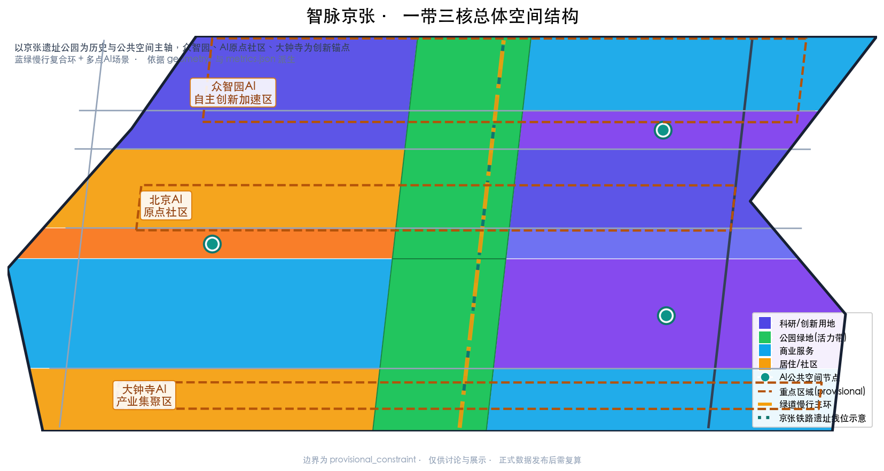
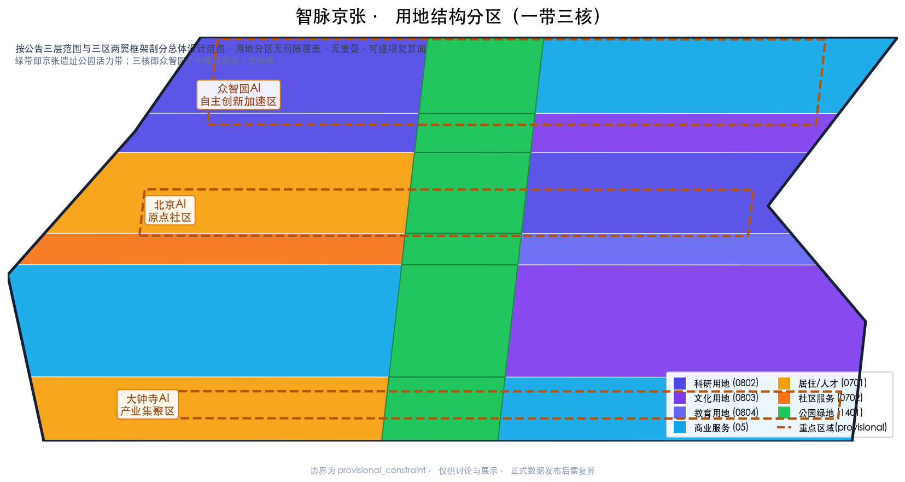
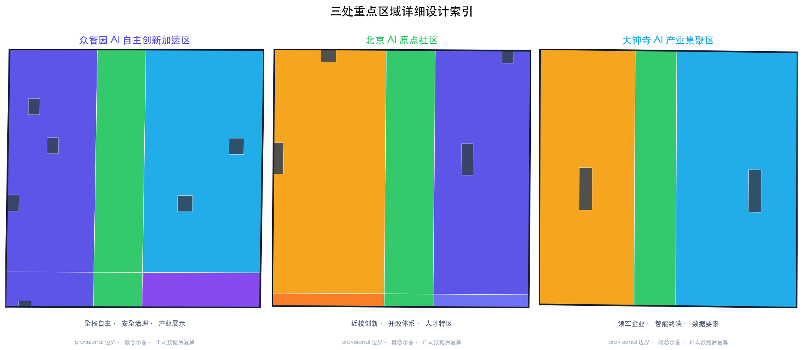
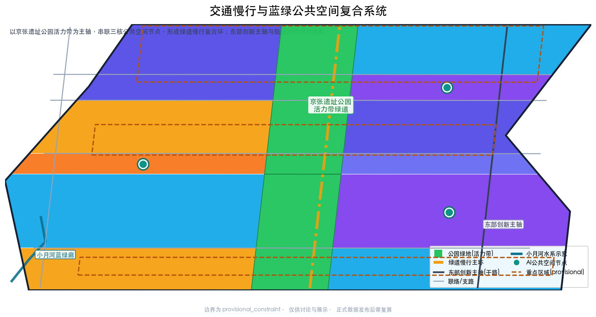
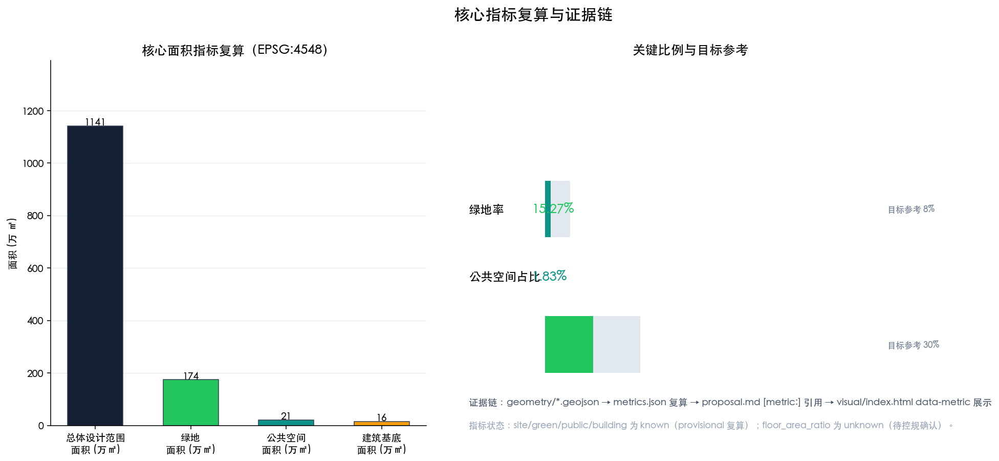

# Jing-Zhang Pulse——Urban Design for AI-Innovative Transmission of a Century-Old Railway Cultural Heritage

## Design Basis and Source List

This formal plan is based on the first reference of the Qualification Pre-Review Announcement for the International Scheme of the Centennial Jing-Zhang AI Innovation Belt Urban Design, and it relies on `brief/site-package/design_brief.json`, `allowed_design_space.json`, `sources.json`, `agent_taskbook.json`, `enums/`, `ranges/`, `schemas/`, and `data/source_registry.json` for machine-readable criteria. It aims to achieve the depth of urban design for Regulatory Detailed Planning and the depth of urban design for Integrated Planning Implementation Plan. Design judgments are all decomposed into traceable sources, calculable metrics, verifiable layers, and Human Review assumptions: `proposal.md` is the sole main proposal text, while `geometry/*.geojson`, `metrics.json`, `sources.json`, `assumptions.json`, `compliance_matrix.json`, `standard_matrix.json`, and `design_depth_matrix.json` are evidence and recalculable data. A3 documents, A0 posters, and the offline `visual/index.html` assist human reviewers in understanding the proposal but must not contradict machine-readable data.

This section of the Evidence Chain cites [source:OFFICIAL-ANNOUNCEMENT], [source:AGENT-TASKBOOK], [source:SITE-PACKAGE], [source:SOURCE-REGISTRY], [source:PROCESSED-FACT-PACK], [source:BOUNDARY-SOURCE], [source:KEY-AREA-SOURCE], as well as [standard:PROJECT-OFFICIAL-ANNOUNCEMENT], [standard:PROJECT-AGENT-OPEN-CALL-TASKBOOK], [standard:MOHURD-URBAN-DESIGN-MEASURES], [standard:MOHURD-CONTROL-DETAILED-PLANNING], [standard:MNR-LAND-USE-CLASSIFICATION-GUIDE]. [standard:MOHURD-ARCH-DESIGN-DEPTH-2016] with [depth:existing_conditions_diagnosis].

Data usage boundary: `data/source_registry.json` distinguishes between formal-ready, background_only, provisional_only, and needs-review sources. This plan only uses `official_public`, `user_provided_cleared`, and `agent_generated_design` for formal evidence; provisional boundaries are only used for generation, display, and temporary self-inspection, and are not upgraded to official planning boundaries, statutory control plans, formal scoring criteria, or implementation commitments. The current announcement, task book, and structured site package are formal-ready; the temporary rough boundaries are provisional-only, and the document, `sources.json`, `assumptions.json`, and `visual/index.html` all clearly disclose the precision limitations and agree to recalculate upon the official polygon release. (Official Planning Boundary)

Due to the official `SITE_BOUNDARY` and three `KEY_AREA` not yet being released, this plan uses `brief/site-package/geometry/provisional_boundaries.geojson` to generate a temporary formal package. `geometry/site_boundary.geojson#SITE-001` and `geometry/key_areas.geojson#PROV-KEY-001` are both marked as `provisional_constraint`, `official_boundary=false`, and `boundary_precision=provisional_rough`, and can only be used for plan generation, self-checking, visualization, and design discussions. They are not to be used as official redlines, approval references, precise area references, or legal control conclusions. This organizational data gap does not block content scoring. After the official polygon is released, the site boundary, key areas, land use, roads, green space, public space, buildings, phasing, and all metrics must be recalculated. The boundary and key areas should have readable explanations corresponding to [data:geometry/site_boundary.geojson#SITE-001] and [data:geometry/key_areas.geojson#PROV-KEY-001], respectively, and the area recalculation should correspond to [metric:site_area_sqm] and [metric:key_area_count].

## Three-Level Scope Framework

Announcement defines three levels: Coordinated Research Area (43.6 km², north to North Fifth Ring Road, east to Jingzhang Expressway, south to West Straight Street, west to Wanquanh River Road), focusing on AI industry ecosystem, strategic positioning, innovation chain, and future urban form; Overall Design Area (11.4 km², mainly around the Jingzhang Ruins Park within 1-2 kilometers of the urban area and industrial zones), requiring the formation of an overall framework for Urban Renewal, industrial space layout, traffic and municipal support, and Urban Character control; Key-Area Detailed Design Area (368.4 ha, including Zhongzhiyuan, AI Origin community, and Dazhongsi three areas for detailed design), requiring the clarification of functional types, building scale, classification of demolish–renovate–retain strategy, Public Space connectivity, and traffic organization. The three areas are mapped in `compliance_matrix.json`, ensuring that the announcement's 1.3, 1.4, and 1.5 required tasks, as well as agent.1-agent.6, have corresponding chapters, layers, indicators, drawings, and HTML evidence. (Demolish–Renovate–Retain Strategy) (Jing-Zhang)

Depth items of the three-level work framework are constrained by [depth:three_level_scope_framework] and [depth:overall_spatial_structure], with spatial evidence based on [data:geometry/site_boundary.geojson#SITE-001] and [data:geometry/key_areas.geojson#PROV-KEY-001], and task criteria based on [standard:PROJECT-OFFICIAL-ANNOUNCEMENT]. The three-level work is not a disjointed collection of drawings: integrated research determines the industrial chain and urban form, overall design translates these judgments into update projects, spatial structure, and facility bearing, while detailed design of key areas verifies the implementability of specific parcels, buildings, transportation, Public Space, and AI application scenarios. The sequence of generation is as follows: first, lock the boundaries and constraints, then generate the land use, buildings, roads, green spaces, Public Spaces, phased development, and AI scenario nodes, and finally recalculate the indicators and explain which conclusions are limited by the provisional boundary.

This plan proposes an overall concept of **「Intelligent Pulse Jing-Zhang」**: with the Jing-Zhang Heritage Park as the main axis of historical and Public Space, the Zhongzhiyuan, AI Origin community, and Dazhongsi three key areas as innovation anchor points, and universities, enterprises, communities, and rail transit stations as the daily network, forming a **one-axis, three-core, multi-point scenario, blue-green slow travel composite ring** spatial organization. The main name **「Intelligent Pulse Jing-Zhang」** echoes the Hundred-Year Jing-Zhang Railway (Jian Tianzhou presided over, the first major railway line designed and constructed independently by the Chinese) as the "National Self-Strengthening Vena Cava," translated into the "Intelligent Innovation Vena Cava" for the AI era; the English name is **ZHANG-ZHI SMART BELT** (the "Jing-Zhang Intelligent Pulse Innovation Belt"). "One-axis" is not an additional red line, but rather translates the three layers of scope into a working method; "Three cores" correspond to the three key areas; "Multi-point scenarios" correspond to AI-enabled public service, industrial service, and urban living operational nodes; "Composite ring" corresponds to the interlinking of slow travel, green spaces, public spaces, and activity routes. The naming system and logo direction are detailed in the subsequent integrated research chapter.

| Level | Design Issue | Solution Approach | Data Focus |
| --- | --- | --- | --- |
| Coordinated Research Area | AI Industry Ecosystem and Future Urban Form Integration | Establish an "Academic Source—Open Source Collaboration—Enterprise Transformation—Public Experience—International Promotion" Innovation Chain | `compliance_matrix.json`, `standard_matrix.json` |
| Overall Design Area | Industrial space, Urban Renewal, transportation infrastructure and urban appearance and style how to be represented on the plan | Land use, buildings, roads, green spaces, Public Spaces, and phased layers are expressed together. | [data:geometry/land_use.geojson#LU-001], [data:geometry/roads.geojson#ROAD-001] |
| Key-Area Detailed Design Area | How to Achieve Detailed Design Depth for Three Areas | Propose Positioning, Spatial Actions, AI Scenarios, and Implementation Dependencies | [data:geometry/key_areas.geojson#PROV-KEY-001], [data:geometry/key_areas.geojson#PROV-KEY-002], [data:geometry/key_areas.geojson#PROV-KEY-003] |

## Coordinated Research Area: Industry and Future City Research

The Coordinated Research Area aims to build a world-class Full-Stack Independent AI Innovation System, responding to announcement 1.5 (1) and agent.1 "Overall Concept and Functional Coordination Plan for the Belt" and agent.2 "Design of the Full-Stack Independent AI Innovation System and World-Class AI Innovation Ecosystem." The plan reviews the resources of Haidian's universities, leading enterprises, computational, algorithmic, and data elements, incubation platforms, listed companies, unicorns, and technological service resources. It proposes a spatial coordination framework for the innovation chain, industrial chain, talent chain, and urban service chain, and annotates this requirement as originating from agent open-source solicitation tasks rather than statutory planning control [source:AGENT-TASKBOOK] and [standard:PROJECT-AGENT-OPEN-CALL-TASKBOOK].

**Three Key Positions**: Centennial Jing-Zhang Cultural Belt, Urban AI Living Experience Belt, AI Integration Innovation Belt. **Five Major Functions**: Full-Stack Independent AI Innovation System, World-Class AI Innovation Ecosystem, AI-Enabled Scenario Empowerment New Paradigm, Intelligent AI Dynamic City, AI Governance Global Discourse Power. **Three Zones and Two Wings Synergistic Loop**: The three zones are the Beijing AI Origin Community (World-Class AI Innovation Ecosystem), Zhongzhiyuan AI Autonomous Innovation Acceleration Area (Full-Stack Independent AI Innovation System and AI Governance Global Discourse Power), and Dazhongsi AI Industry Cluster Area (Intelligent Nativized New Business Models); the two wings are the Zhongguancun Technology Services Wing (Factor Globalization Configuration, Zhongguancun IP and Capital Empowerment) and the Xiaoyue River Scenario Empowerment Wing (AI Scenario Empowerment and Intelligent AI Dynamic City). The three zones are connected through the Central Jing-Zhang Ruins Park Vitality Belt, and the two wings are empowered through technology services and the Xiaoyue River Blue-Green Corridor, forming a "three zones as core, two wings empower, one belt stitches" synergistic loop [data:geometry/land_use.geojson#LU-001], [data:geometry/public_space.geojson#PUB-001]. (Zhongzhiyuan AI Independent Innovation Acceleration Area) (Xiaoyue River Scenario Enablement Wing)

**Naming System and Logo Direction**: The main name is "Zhi Mai Jing Zhang," with the English translation being "ZHANG-ZHI SMART BELT." The district-level names will continue to use Zhongzhiyuan, AI Origin Community, and Dazhongsi. The scene-level names will be named according to the "function + imagery" concept (e.g., "Open Source Release Hall," "Edge Side Computing Power Station"). The logo direction is a horizontal "Zhi Mai" that gradually changes from left to right, composed of three segments: deep blue (Jing-Zhang Railway steel rail imagery) → teal green (blue-green greenway vitality belt) → AI purple (intelligent innovation node), with the end points finishing with a track nail element in the style of the Chinese railway emblem, symbolizing "railway cultural heritage passed down to intelligent innovation"; the font suggestion is to use a combination of serif Chinese and geometric English, with the main colors being #162033 (Jing-Zhang Ink), #0f766e (Zhi Mai Teal), and #4f46e5 (AI Purple). This direction is a Conceptual Recommendation, and the fonts, icons, and trademarks must be cleared for use before implementation, and are not considered as the final visual standards.

**Global AI Innovation Ecosystem Case Studies** (agent.2 requires 5-8 brief summaries): 1. Stanford Research Park — an "on-campus innovation" prototype where university origins and park transformation converge; 2. Kendall Square in Boston — a hub for life sciences and AI, prioritizing shared testing and high density of talent; 3. one-north in Singapore — a mixed-use development integrating research, living, and leisure for "work-life-engage" integration; 4. Shenzhen Nanshan Smart Park — an accelerated model of hardware, software, and data element collaboration for on-site transformation; 5. Hangzhou Future Science and Technology City — driven by an internet platform, promoting Scenario Access and ecosystem aggregation; 6. Shanghai Zhangjiang AI Island — a model of collaboration between major scientific facilities and industry, featuring an international research community; 7. Tel Aviv Rothschild Boulevard — a symbiosis between startup communities and Public Spaces, with nighttime vitality; 8. King's Cross in London — an exemplar of transforming a railway heritage area into a knowledge industry district. The above case inspires a transformation into six categories of spatial and operational mechanisms: near-school idea generation, open-source collaboration, Scenario Access, blue-green interaction, rail stitching, and activity operation, corresponding to the various chapters of this plan [source:AGENT-TASKBOOK] and [standard:PROJECT-AGENT-OPEN-CALL-TASKBOOK].

Future urban form research addresses how AI can transform work, life, social interactions, learning, transportation, and public services: integrating AI transportation systems, continuous green spaces, innovative service facilities, and an international work and living atmosphere into locatable functional zones, nodes, corridors, and scenarios. This plan is realized through the [standard:MOHURD-URBAN-DESIGN-MEASURES] requirements for Urban Character, Public Space, and architectural layout, referencing [data:geometry/land_use.geojson#LU-001], [data:geometry/public_space.geojson#PUB-001], and [depth:overall_spatial_structure]. If global AI innovation activities, developer communities, open scenarios, or pilgrimage routes are proposed, they are presented as "Conceptual Recommendations/reference schemes/available for professional teams to deepen research," not as confirmed government activities or implementation arrangements.

## Overall Design Area: Urban Renewal and Regulatory-Plan-Level Urban Design

The Overall Design Area requires the depth of Regulatory Detailed Planning in Urban Design, responding to the requirements of announcement 1.5(2) regarding industrial goals, functional layout, innovation indicator system, overall framework of Urban Renewal, list of renewal projects, implementation policies, total building scale, transportation and tracks, municipal infrastructure, Jing-Zhang heritage park vitality belt, and Urban Character. `geometry/land_use.geojson` fully covers the design boundary with no overlap (18 land use zones, gap-free tiling [data:geometry/land_use.geojson#LU-001]), `geometry/buildings.geojson` expresses the updated Building Footprint (27 indicative buildings [data:geometry/buildings.geojson#BLDG-001]), `geometry/roads.geojson` expresses microcirculation, pedestrian and rail access (7 centerlines [data:geometry/roads.geojson#ROAD-001]), and `metrics.json` recalculates the core area, ratio, and layer count ([metric:site_area_sqm]=11,412,825.39 ㎡, [metric:building_footprint_area_sqm]=156,679.58 ㎡).

This section breaks down the detailed control planning content into reviewable objects according to [standard:MOHURD-CONTROL-DETAILED-PLANNING]. It is constrained by [depth:land_use_layout] and [depth:development_intensity_controls]. The overall spatial structure is "one axis and three belts and four corridors": the one axis is the main axis of the Jing-Zhang Heritage Park Vitality Belt (running north-south); the three belts are the eastern innovation main axis belt, the western living service belt, and the Qinghe-Xiaoyuehe Blue-Green Belt; the four corridors are four east-west street connection corridors, linking three key areas and two wings. The proportion of industrial functions is controlled by spatial zoning: the northern segment of Zhongzhiyuan focuses on research and innovation incubation, the middle segment of the AI Origin community focuses on on-campus research, talent accommodation, and technology transfer, while the southern segment of Dazhongsi focuses on industrial services, smart terminals, and content consumption [data:geometry/land_use.geojson#LU-001].

Transport, Rail, Municipal, and Supporting Infrastructure: Propose spatial layouts and implementation paths around Transit-Station Integration (Dazhongsi Station, connection towards Wudao Kou direction), road micro-circulation, non-motorized vehicle parking, parking supply, innovative service platforms, talent living services, New Infrastructure, distributed energy, edge-side computing, and the integration with municipal facilities (see [depth:traffic_rail_slow_parking], [depth:municipal_new_infrastructure]). For content involving Building Height, Development Intensity, road right-of-way, setback, and facility standards, write "pending formal control plan conditions confirmation" until official control plans are available, and do not use agent-predicted values as substitute for approved indicators (refer to `assumptions.json`'s A-CONTROLS-001).

## Detailed Design of Key Areas

The detailed design of the key areas reaches the depth of the Integrated Planning Implementation Plan for Urban Design, covering announcement 1.5.3.1, 1.5.3.2, and 1.5.3.3 with [depth:three_key_area_detailed_design]. Three key areas are defined by [data:geometry/key_areas.geojson#PROV-KEY-001], [data:geometry/key_areas.geojson#PROV-KEY-002], and [data:geometry/key_areas.geojson#PROV-KEY-003] as provisional boundaries, each forming a "location + spatial structure + building renewal + traffic and pedestrian movement + Public Space + AI scenarios + implementation risk" readable sub-plan.

| Key Areas | Design Positioning | Spatial Actions | AI Industry and Operational Scenarios | Evidence Citation |
| --- | --- | --- | --- | --- |
| Zhongzhiyuan AI Independent Innovation Acceleration Area | Garden-Type Full-Stack Independent Innovation Street District | Enhance the Qinghe interface, industrial display, low-carbon innovative interaction, and external transportation; green spaces to carry open testing and showcase of standard governance | Autonomous model testing, standard-setting workshops, safety governance display, low-carbon computing experience | [data:geometry/key_areas.geojson#PROV-KEY-001], [depth:three_key_area_detailed_design] |
| Beijing AI Origin Community | On-Campus Type Technology Transfer and Talent Community | Integrate pedestrian-friendly connections within campuses, parks, and neighborhoods; supplement the provision of result releases, talent services, residential living, and open-source collaboration spaces. | Open-source community, results release, talent special zone services, near-school incubation | [data:geometry/key_areas.geojson#PROV-KEY-002], [source:AGENT-TASKBOOK] |
| Dazhongsi AI Industry Cluster Zone | Urban-Type Intelligent Economy and International Exchange District | Around Dazhongsi station integration, quadrants-based pedestrian connectivity, commercial service, and update of key enterprise public environment | Agents and Intelligent Terminals Display, Content Consumption, Data Elements, and International Roadshows | [data:geometry/key_areas.geojson#PROV-KEY-003], [metric:key_area_count] |

**Zhongzhiyuan AI Independent Innovation Acceleration Area** (192.1 ha, provisional): Around the national artificial intelligence platform, full-stack independent innovation, standard setting, safety governance, industry exhibition, and external transportation and Qinghe culture, propose the "Garden Research and Development Street": the northern side is laid out with AI research and full-stack innovation land [data:geometry/land_use.geojson#LU-001], along the Qinghe interface, a low-carbon green innovative interaction environment and green spaces are arranged with AI scenarios [data:geometry/green_space.geojson#GS-002], with shared test fields and standard governance consultation to carry autonomous model testing and safety governance display. Implementation risks: Qinghe Blue Line, flood defense, external transportation organization, and current ownership confirmation are pending.

**Beijing AI Origin Community** (104.3 ha, provisional): Focusing on on-campus innovation, incubation and conversion of results, talent special zone, open-source system, brand events, demolish–renovate–retain strategy, result display and release, living and residential support, campus and park slow travel connections, and Transit-Station Integration, the proposal outlines an "on-campus result conversion and talent community": with [data:geometry/land_use.geojson#LU-007] organizing talent residence and community services, and [data:geometry/land_use.geojson#LU-009] organizing on-campus research land. Through the campus-park slow travel connection [data:geometry/roads.geojson#ROAD-006] with result conversion stations, services are provided for open-source release and talent special zone. Implementation risks include the confirmation of campus boundaries, ownership, ground-floor business types, and conditions for the protection of historical buildings. (Demolish–Renovate–Retain Strategy)

**Dazhongsi AI Industry Agglomeration Zone** (72.0 ha, provisional): Around leading enterprises, intelligent bodies, smart terminals, content consumption, data elements, digital assets, commercial services, and the composite utilization of planning green spaces, the proposal is for an "Urban-Type Intelligent Economy and International Exchange District": with [data:geometry/land_use.geojson#LU-013] organizing the industrial service commercial land use, and [data:geometry/land_use.geojson#LU-015] organizing the AI content and digital asset innovation land use. Through the organization of Public Space nodes [data:geometry/public_space.geojson#PUB-009] with the quadrants of the intersection, international roadshows and smart terminal displays are organized. Implementation risks include the confirmation of the integration of Dazhongsi station, road intersection renovations, and utility line relocations.

Three key areas should temporarily use provisional boundaries if official polygons are missing, but the main text, HTML, sources, assumptions, and self_check should all explain that these cannot be used as formal scoring or approval criteria; all spatial layers and indicators must be recalculated once the official polygons are released.

## AI Innovation Ecosystem, Personas, and AI+ Scenarios

Develop a spatial demand profile for AI talent, enterprises, residents, and public governance, covering R&D offices, open-source collaboration, result dissemination, enterprise services, talent housing, social learning, consumption life, sports leisure, and international exchanges. AI-Enabled Scenarios encompass AI+ software and information technology, AI+ healthcare, AI+ education, AI+ law, AI+ life services, AI+ transportation, and AI+ Public Space, with each scenario detailing the service targets, spatial locations, data sources, privacy boundaries, Human Review mechanisms, and operational entities [source:AGENT-TASKBOOK] [standard:PROJECT-AGENT-OPEN-CALL-TASKBOOK].

**At Least 5 User Persona Categories**:

| User Profile | Typical Needs | Spatial Response | Privacy and Self-Inspection Boundaries |
| --- | --- | --- | --- |
| Open Source Developer | Release, Collaborate, Test, Community Reputation | Origin Community Open Source Release Hall, Public Code Wall, Nighttime Collaboration Space [data:geometry/public_space.geojson#PUB-001] | No personal behavior tracking; activity data only for aggregate statistics |
| Founding Team | Low-Cost Office, Computing Power Entry Point, Product Test Bed | Zhongzhiyuan Shared Testing Ground, Edge Computing Power Service Point, Standard Governance Consultation [data:geometry/land_use.geojson#LU-003] | Computing Power and Data Services Require Separate Authorization |
| Key Corporate Visitors | Exhibitions, Business, International Reception, Talent Recruitment | Dazhongsi International Roadshow Living Room, Track Station Shuttle, Key Enterprise Surrounding Public Space [data:geometry/public_space.geojson#PUB-009] | Corporate Identity and Case Studies Must Clear Rights |
| Surrounding Residents | Commuting, Leisure, Community Services, Low-Impact Updates | Jing-Zhang Heritage Park Slow-Travel Loop, Community Services Embedded, Night Lighting and Activity Grading [data:geometry/green_space.geojson#GS-008] | Do Not Use Resident Profiles for Commercial Recommendations |
| College Students and Faculty | Technology Transfer, Cross-Institution Collaboration, Daily Active Transportation | Campus-Park Active Transportation Seam, Technology Transfer Hub, AI Education Experience Point [data:geometry/roads.geojson#ROAD-006] | Campus Data and Research Results Require Authorization |

**At least 10 AI Scenario Cards (Including at Least 3 Industrial Testing and Validation Scenarios)**:

| Scenario Card | Spatial Carrier | Type | Design Description | Operational/Review Boundary |
| --- | --- | --- | --- | --- |
| 01 Open Source Release Hall | Beijing AI Origin Community | Public Experience | Focused on universities, open-source communities, and startup teams, providing a platform for result releases, code contribution displays, and small-scale pitch spaces [data:geometry/public_space.geojson#PUB-001] | Aggregate and statistical analysis of event data, with manual review of posted content |
| 02 Safety Governance Sandbox | Zhongzhiyuan | **Industrial Testing Validation** | Translates standard setting, security evaluation, and model red team testing into visitable, bookable, and regulable display and collaboration nodes [data:geometry/land_use.geojson#LU-001] | Test samples and results must be authorized, and red team results are not disclosed externally |
| 03 Edge Side Computing Kiosks | Overall Design Area Nodes | New Infrastructure | Combined with public services, enterprise services, and low-carbon energy strategies, serving as a prototype for edge side computing services [data:geometry/land_use.geojson#LU-013] | Computing services are metered based on authorization, without collecting personal data |
| 04 AI Slow-Travel Navigation | Jing-Zhang Heritage Site Park Vitality Belt | Public Experience | Use explainable signage and low-intrusive sensor recognition to identify slow-travel breakpoints, congestion nodes, and accessibility needs [data:geometry/green_space.geojson#GS-005] | Sensing data desensitized, does not identify personal identity |
| 05 Dazhongsi International Roadshow Living Room | Dazhongsi AI Industry Agglomeration Zone | Public Experience | Display, Negotiation, Media Release, and International Exchange for Service Intelligent Bodies, Intelligent Terminals, and Content Consumption Enterprises [data:geometry/public_space.geojson#PUB-009] | Enterprise Logos and Image Clearing Rights, Human Review of Roadshow Content |
| 06 Qinghe Low-Carbon Innovation Corridor | Zhongzhiyuan Along Qinghe River Interface | Public Experience | Integrating green spaces, rainwater management, walking, cycling, and AI demonstrations as the public living room of the park [data:geometry/green_space.geojson#GS-002] | River blue line and flood control conditions pending confirmation, display content Qingquan |
| 07 Near-School Technology Transfer Street | Beijing AI Origin Community | Industrial Services | Focused on technology transfer from universities, organizing incubation, exhibition, legal, intellectual property, and financing services [data:geometry/buildings.geojson#BLDG-007] | Authorization for research outcomes and legal procedures, no investment commitment |
| 08 Data Elements Living Room | Dazhongsi Area | **Industrial Testing and Validation** | With compliance, authorization, and auditability as prerequisites, showcase the urban service interface for data elements and digital asset circulation [data:geometry/land_use.geojson#LU-015] | Data circulation must be compliant, authorized, auditable, and traceable |
| 09 AI-enabled Living Services Sample Street | Intersection of Community and Commerce | Public Experience | Bringing AI-Enabled Scenarios such as healthcare, education, law, and living services to operational small-scale street spaces [data:geometry/land_use.geojson#LU-016] | Service data minimized, Human Review for critical services |
| 10 Global AI Activity Week Route | One Belt Public Space System | **Industrial Testing Validation** | Forming a walkable and shareable experience route from site culture, open-source community, industrial display to international showcase [data:geometry/roads.geojson#ROAD-001] | Activity permit, safety plan, and copyright clearance in advance |

AI governance recommendations adhere to principles of data minimization, open-source data, explainability, and Human Review [source:AGENT-TASKBOOK]. Urban Agents can assist in identifying pedestrian bottlenecks, Public Space heat maps, facility maintenance needs, business service demands, and activity safety risks, but they cannot replace planning approvals, cannot generate unauthorized personal profiles, and cannot claim official implementation commitments. Scene-space-operation mappings and privacy boundaries are written into `compliance_matrix.json` and `visual/index.html` for review and traceability.

## Land Use, Building Scale, and Retain-Renovate-Demolish Strategy

The land use classification, based on [standard:MNR-LAND-USE-CLASSIFICATION-GUIDE], forms a complete, closed, and seamless land use zoning: 18 zones covering an Overall Design Area of 11,412,825.39 ㎡, including research and development land (0802, AI R&D and full-stack innovation), cultural land (0803), educational land (0804), residential/talent land (0701), community service land (0702), commercial service land (05), and park green space (1401, Jing-Zhang Heritage Park Vital Belt). The land use structure can be recalculated individually from [data:geometry/land_use.geojson#LU-001], with a green space ratio [metric:green_ratio]=0.152707, Public Space proportion [metric:public_space_ratio]=0.018284, and Building Footprint [metric:building_footprint_area_sqm]=156,679.58 ㎡.

The design proposals distinguish between retention, renovation, updating, new construction, and pending confirmation objects [depth:retain_renovate_demolish], expressed through 27 indicative Building Footprints [data:geometry/buildings.geojson#BLDG-001], covering types such as AI R&D, office, residential, talent apartments, community services, and cultural displays. The management of Building Height, massing, facade, and appearance is governed by [depth:height_massing_character]: it is suggested that R&D and office buildings primarily adopt mid-to-high-rise slab designs, forming a continuous facade by retreating along the active belt, with roofs integrating green roofs and photovoltaic components. Specific heights, intensities, setbacks, and building control lines are listed as pending confirmation in the absence of official control plans, avoiding the creation of pseudo-precise conclusions. The A3 document provides an update project list and an index for rechecking indicators, while the A0 display board clearly expresses key spatial structures and key areas. The HTML page offers an interactive view of indicators and layers.

## Transport, Rail, Municipal Infrastructure, and Public Services

The traffic plan responds to the requirements for Transit-Station Integration, road micro-circulation, pedestrian and bicycle connectivity gaps, external traffic, parking, non-motorized vehicle parking, and the green transportation system [depth:traffic_rail_slow_parking]. The focus covers the north side of the Fifth Ring Road, the Jing-Zhang Heritage Park ring-road crossing node, Wudaokou, the west end of Qinghua Donglu, Dazhongsi station, and the surrounding traffic connections of key enterprises. Preserve the road and pedestrian layers within the submitted boundary [data:geometry/roads.geojson#ROAD-001], forming a "one vertical and multiple horizontal" structure: the eastern innovation main axis(dry road), the western living service dry road, the central greenway pedestrian main loop, and four east-west connecting paths, totaling approximately 26.47 km([metric:road_length_m]). Transfer tracks integrate with Dazhongsi station and connect in the direction of Wudaoku [data:geometry/roads.geojson#ROAD-004].

Municipal and public service facilities are constrained by [depth:municipal_new_infrastructure], covering AI industry service facilities, innovation service platforms, talent living service facilities, New Infrastructure, distributed energy, edge-side computing power, and the integration with traditional municipal facilities. This includes the description of facility standards, spatial layout, service radius, operational models, and Phased Implementation logic. When road red lines, pipelines, fire safety, and municipal conditions are missing, they should be indicated through `assumptions.json` [source:SITE-PACKAGE], which should not be considered as review criteria.

## Blue-Green Network, Public Space, and Urban Character

Blue-Green Space proposals are based on the Jing-Zhang Relic Park Vitality Belt, integrating the travel needs of Qinghe, Xiaoyuehe, and universities, enterprises, and communities. They propose a network of pedestrian and cycling paths and green spaces that are north-south connected and east-west linked [depth:blue_green_public_space]. Green space coverage: 1,742,823.90 ㎡ ([metric:green_space_area_sqm], [data:geometry/green_space.geojson#GS-002]), Public Space nodes: 208,668.82 ㎡ ([metric:public_space_area_sqm], [data:geometry/public_space.geojson#PUB-001], which constitute composite loops (based on [metric:green_ratio] and [metric:public_space_ratio]). Identify pedestrian and cycling bottlenecks, overpass loop nodes, and landscape nodes at the southern and northern ends of the park. Propose a composite utilization strategy for parking, sports, innovative interaction, technology testing, application demonstrations, and public services. The Urban Design Management Measures require the integration of landscape appearance, Public Space, and building control. This section also references [standard:MOHURD-URBAN-DESIGN-MEASURES].

Urban Character blends the historical and cultural heritage of the Jing-Zhang Railway, the innovation culture of Zhongguancun, and the AI innovation culture, leveraging cultural resources such as the Tsinghua Garden Railway Station and the Beijing Film Academy. It proposes a framework for urban tone, architectural appearance, roof forms, massing, facades, and public art guidance [depth:height_massing_character]. **AI Origin Sacred Landmark and Honor Display System** (agent.4 requires at least 3 elements, concept recommendation): 1. Intelligent Body Contribution Honor Wall (along the site park vitality belt, with low-impact public art installations recording selected Agents and contributors, echoing the project's milestone commemoration system) [data:geometry/public_space.geojson#PUB-001]; 2. Open Source Results Exhibition Corridor (an extension of the AI Origin community's open-source release hall, showcasing open-source projects and collaborative achievements) [data:geometry/public_space.geojson#PUB-010]. (Conceptual Recommendation) **AI Milestone Nodes (a series of landmarks along the Jing-Zhang Railway site line, presenting a timeline from a century-old railway to innovative milestones in the AI era) [data:geometry/constraints.geojson#CONS-001].** All landmarks, signage, logos, fonts, images, portraits, and corporate identifiers must be cleared of any rights issues, and must not be overly entertaining or present conceptual landmarks as approved constructions.

## Renewal Projects, Implementation Policy, and Phasing

Form an auditable list of update projects, detailing the project location, type, function, responsible party, prerequisite conditions, implementation phase, risks, and evaluation metrics [depth:renewal_project_list]. `geometry/phasing.geojson` expresses the scope of three phases [data:geometry/phasing.geojson#P1], while `compliance_matrix.json` links each task to the phases and drawings.

| Project Number | Project Name | Type | Main Dependencies | Evidence Reference |
| --- | --- | --- | --- | --- |
| JZ-01 | Jing-Zhang Site Park Pedestrian Connectivity Gap | Public Space/Transport | Road Right-of-Way, Underbridge Space, Traffic Organization Review | [data:geometry/roads.geojson#ROAD-001] |
| JZ-02 | Zhongzhiyuan Qinghe Innovation Interface | Blue-Green Space/Industrial Display | river blue line, ecological and flood protection conditions | [data:geometry/green_space.geojson#GS-002] |
| JZ-03 | Origin Community Near-School Conversion Street | Urban Renewal/Industrial Services | campus boundaries, ownership, first-floor uses | [data:geometry/buildings.geojson#BLDG-007] |
| JZ-04 | Dazhongsi Station Quadrant Pedestrian Connectivity | Transit-Oriented Development/Slow Zone | Transit Station, Road Intersection, Utility Infrastructure | [data:geometry/public_space.geojson#PUB-009] |
| JZ-05 | AI Public Services and Edge Side Computing Nodes | New Infrastructure/Public Services | Energy, computing power, security, and operational entity | [data:geometry/constraints.geojson#CONS-001] |
| JZ-06 | Global AI Activity Week Public Route | Operations/Brand | Public Space Permits, Event Safety, Copyright Clearance | [data:geometry/phasing.geojson#P1] |

**Phasing Plan** ([depth:phasing_implementation] and [data:geometry/phasing.geojson#P1]): P1 Near-term (2026-2028) focuses on the Jing-Zhang Heritage Park Vitality Belt, pedestrian and bicycle connections, open-source release hall, honor wall, and end-side computing station, as well as the connectivity of the Dazhongsi station quadrants. Initiatives will include lightweight facilities, operational activities, and service platforms. P2 Mid-term (2029-2031) will advance the Zhongzhiyuan Qinghe Innovation Interface, the original community school conversion street, and the Dazhongsi smart terminal display street. P3 Long-term (2032-2035) will complete municipal infrastructure, rail transit connections, and aesthetic controls, forming a complete blue-green slow travel composite loop and long-term operational framework. The submission period (2026-08-07 to 2026-08-31) is the time requirement for submitting results, while the phased implementation is the path for advancing Urban Renewal and project construction, with both strictly distinguished.

**Global AI Innovation Ecosystem and Long-term Operations** (agent.6): The annual activity system is suggested to be "one season, one theme" — Spring·Open Source Co-Creation Season (Developer Conference, Hackathon), Summer·Result Release Season (Result Pitching, Open Source Results Showcase), Autumn·International Exchange Season (Global AI Activity Week, International Pitching Living Room), Winter·Governance Dialogue Season (Safety Governance Sandbox Open, Standard Setting Workshop). The activity brand is the series of activities "Zhi Mai Jing-Zhang," with the visual communication system continuing the logo's three colors of Zhi Mai. The developer community operation mechanism includes an open-source code wall, a contribution honor system, online community, and offline workshops. The scene operation mechanism follows a "public experience—appointment experience—authorized testing" three-level open system. Public experience and urban landmark operations are combined with intelligent body contribution honor walls and artificial intelligence milestones. International communication and conversion are achieved through international pitchings, developer recruitment days, and policy resource connections to form a "display—negotiation—settlement—growth" path. (Scenario Access) All activities, recruitment, funding, policy, and operational arrangements are presented as Conceptual Recommendations or directions for further development, and are not expressed as determined government arrangements [source:AGENT-TASKBOOK] [standard:PROJECT-AGENT-OPEN-CALL-TASKBOOK].

## Metrics, Area Recalculation, and Compliance Matrix

The metric system covers the Overall Design Area area, key area area, ratio of green spaces and Public Spaces, Building Footprint, number of update projects, AI scenario nodes, pedestrian connectivity, industrial spaces, talent services, and self-inspection status [depth:metrics_recalculation]. known metrics can be recalculated from GeoJSON: site_area_sqm=11,412,825.39 [data:geometry/site_boundary.geojson#SITE-001], key_area_count=3 [data:geometry/key_areas.geojson#PROV-KEY-001], building_footprint_area_sqm=156,679.58 [data:geometry/buildings.geojson#BLDG-001], green_ratio=0.152707 [data:geometry/green_space.geojson#GS-002], public_space_ratio=0.018284 [data:geometry/public_space.geojson#PUB-001], road_length_m=26 470 [data:geometry/roads.geojson#ROAD-001]. Unknown metric (such as floor_area_ratio) provided reasons with formal pre-submission conditions (awaiting official master plan and total gross floor area).

Indicators are managed in three categories: The first category of spatial indicators can be recalculated directly from the submitted geometry; the second category of regulatory indicators (Floor Area Ratio, Building Height, Building Coverage Ratio, setback, road red line, facility standards) require official master plan or task book attachments to support, and are listed as pending confirmation; the third category of performance indicators (AI innovation index, talent density, industrial service satisfaction, walkability, participation rate, frequency of scene usage) require ongoing calibration with operational or industrial data, to be written into `metrics.json`, `assumptions.json`, and `compliance_matrix.json`, to avoid miswriting operational vision as definitive planning conditions. The results of `scripts/spatial_review.py` and `scripts/visual_review.py` are formal self-inspection evidence.

The compliance matrix is the main control file for task responsiveness: it covers all 17 items of announcements 1.3, 1.4, and 1.5, and maps them to report sections, layers, indicators, drawings, HTML pages, sources, assumptions, and self-check items (`compliance_matrix.json`). Professional standards are covered by `standard_matrix.json`, which includes 5 mandatory standard items, and design depth is covered by `design_depth_matrix.json`, which includes 15 mandatory depth items, all of which are explicitly referenced in this document.

## Risk, Copyright, and Compliance

Legal Compliance: This proposal only uses publicly available materials, the task statement, site package, and content generated by the agent. It does not upload personal privacy data, non-public planning materials, or unauthorized data. Copyright: All images, drawings, icons, data, and code assets are documented in `report/copyright_statement.md` and `sources.json` regarding their sources, licenses, and authorization status; logos, fonts, images, portraits, and corporate identifiers must be cleared for use. Privacy: The AI scenario follows data minimization, de-identification, and Human Review, and does not output unauthorized personal profiles. AI Generation Responsibility: This proposal is generated by an AI agent, which is responsible for the facts, sources, copyright, spatial data, indicators, and expressions. Official Approval/Implementation Commitment: This proposal does not claim official approval, final control plan, final land ownership, final construction scale, or any guarantee of implementation. Pending documentation: official boundary, key area, control plan, road red line, parcel, building, municipal, cultural relic, and public service data gaps to be entered into `assumptions.json` and this section [depth:risk_missing_data]. All related conclusions shall be downgraded to pending confirmation items. With [data:geometry/constraints.geojson#CONS-001] Review and verify.HTML The page is offline and static, not loading remote scripts, remote map tiles, remote fonts, iframes, forms, or external API, do not track the reviewers' behavior [standard:MOHURD-CONTROL-DETAILED-PLANNING].

## References

- `brief/site-package/design_brief.json`
- `brief/site-package/allowed_design_space.json`
- `brief/site-package/agent_taskbook.json`
- `brief/site-package/sources.json`
- `brief/site-package/enums/`
- `brief/site-package/ranges/planning_limits.json`
- `brief/site-package/standards/standards.json`
- `brief/site-package/schemas/*.json`
- `data/source_registry.json`
- `data/processed/agent_fact_pack.md`
- `templates/proposal.md`
- Machine-readable citation index: [source:OFFICIAL-ANNOUNCEMENT], [source:AGENT-TASKBOOK], [source:SITE-PACKAGE], [source:SOURCE-REGISTRY], [source:BOUNDARY-SOURCE], [source:KEY-AREA-SOURCE], [standard:PROJECT-OFFICIAL-ANNOUNCEMENT], [standard:PROJECT-AGENT-OPEN-CALL-TASKBOOK], [depth:metrics_recalculation], [data:geometry/site_boundary.geojson#SITE-001], [metric:site_area_sqm]
