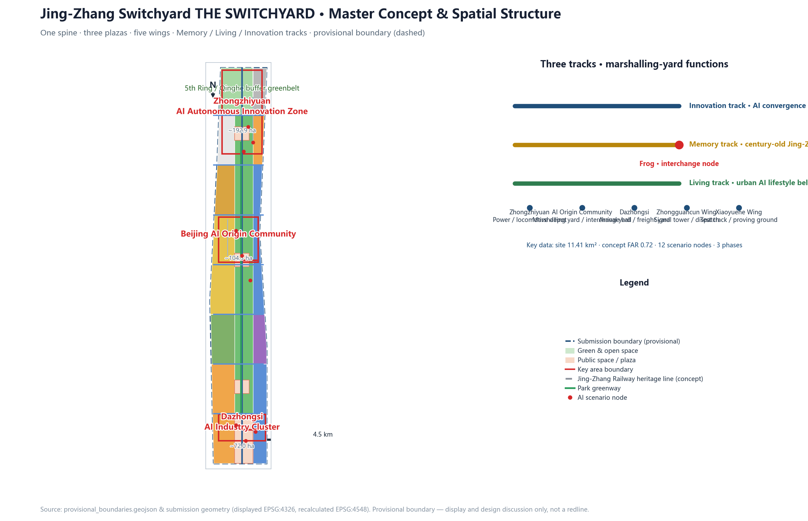
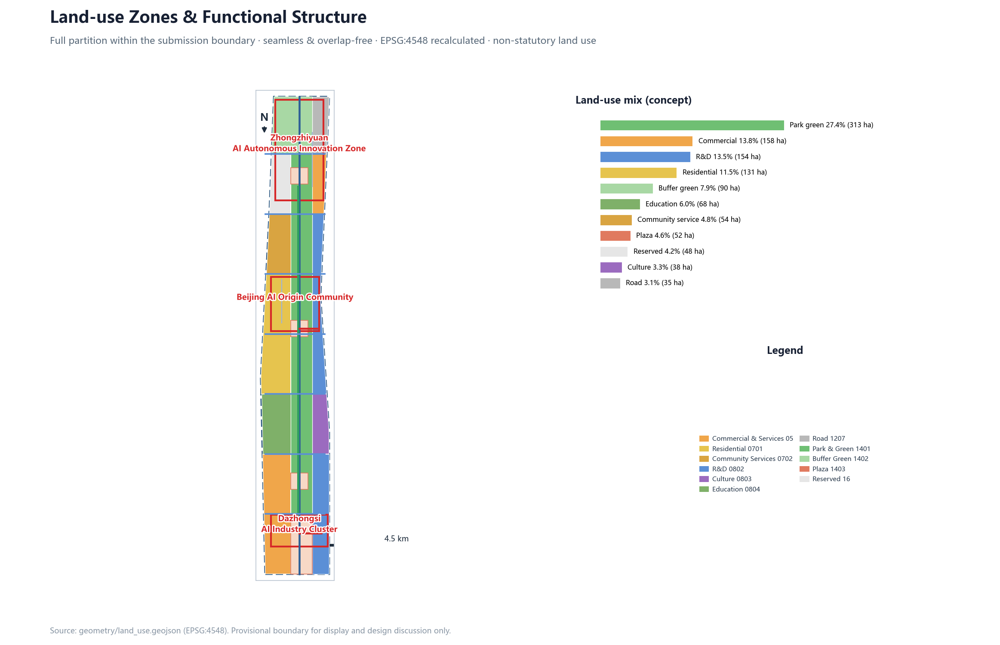
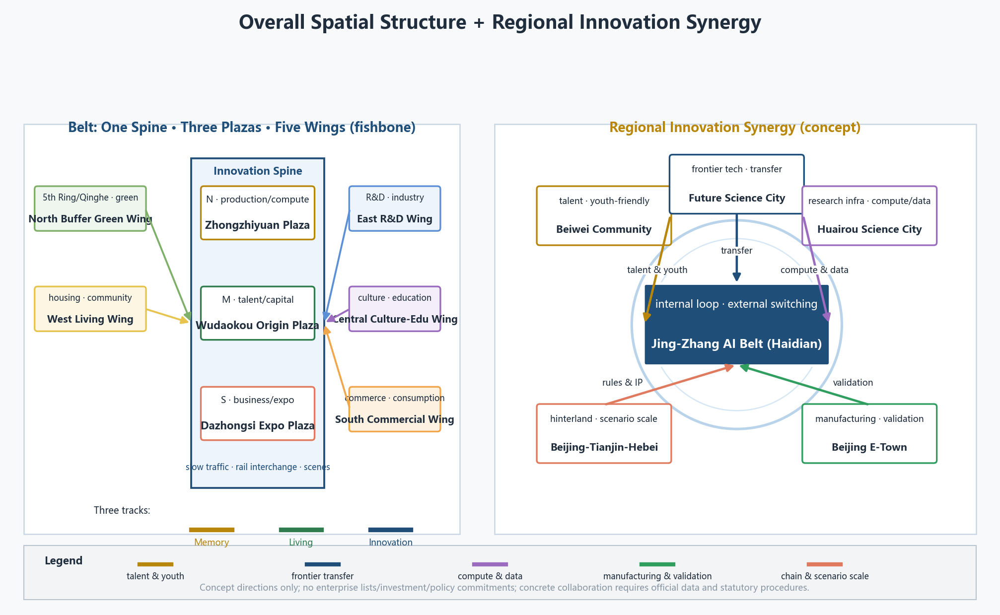
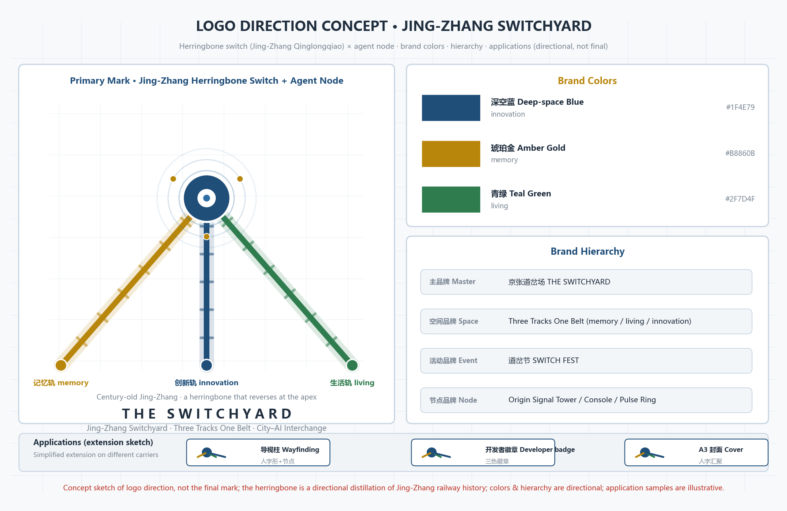
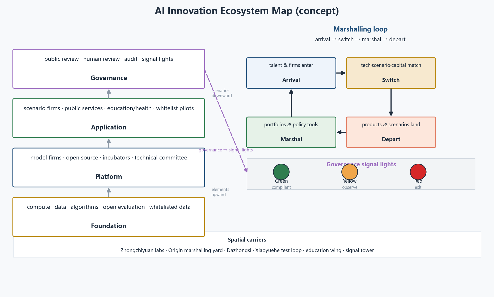
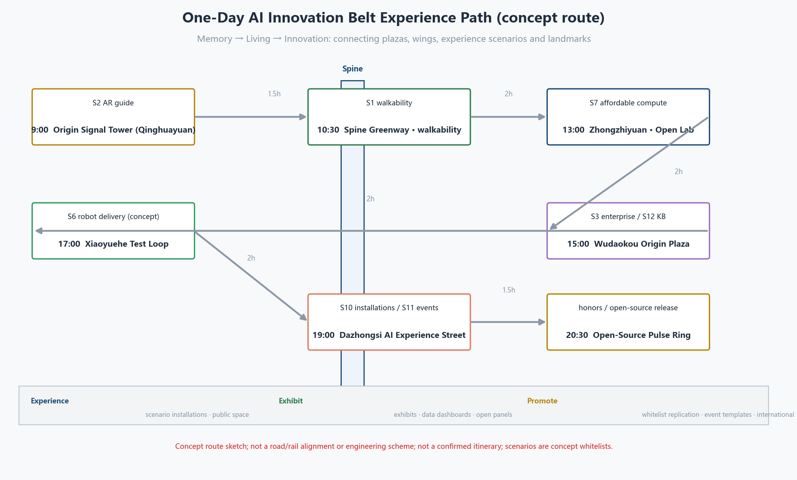
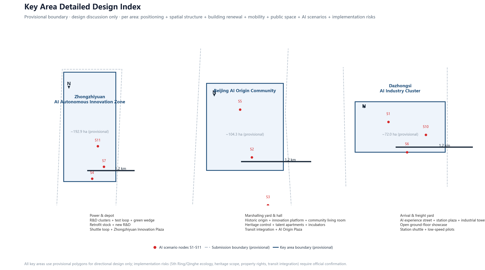
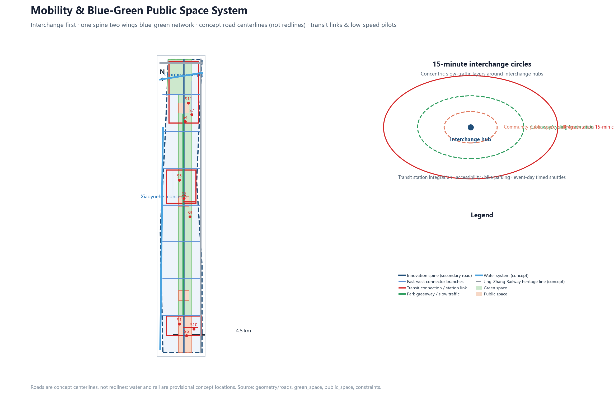
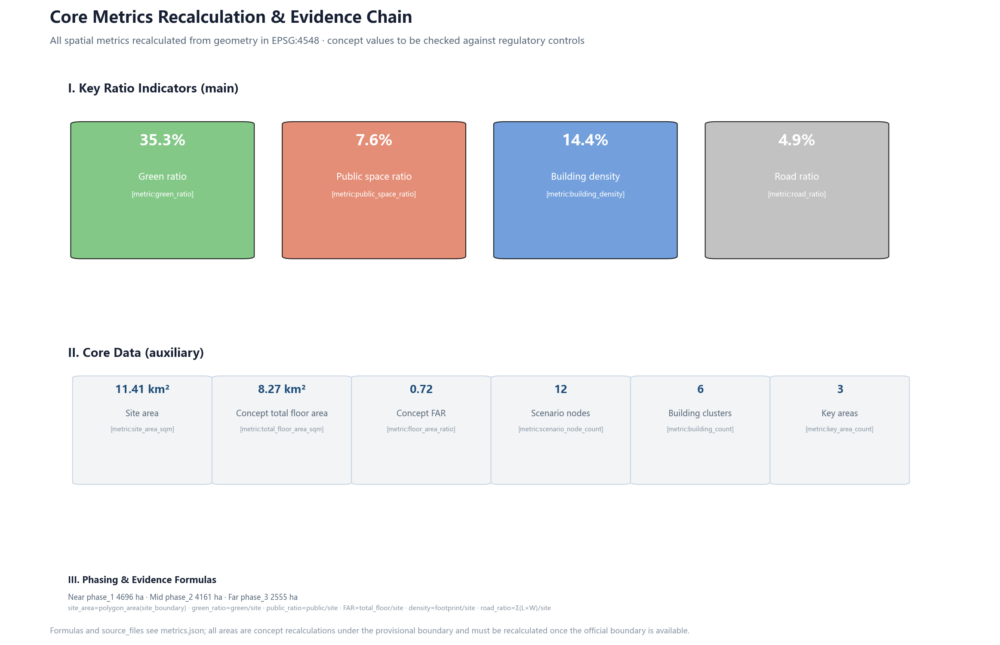

# Jing-Zhang Switchyard · THE SWITCHYARD — A City-AI Interchange on a Century-Old Railway

> One hundred years ago, the Jing-Zhang Railway changed the direction of China's railway independence with a herringbone switch. One hundred years later, Haidian hands an 11.4 km² urban corridor to agents and the public for co-design. This proposal reads the entire innovation belt as a **city-scale switchyard**: the city and AI act as trains and dispatchers, completing "switch tracks, marshal, depart" in the three key areas, turning the century-old railway into a public interchange hub between the city and agents. This is an open co-created concept design; all spatial conclusions are expressed as "concept proposals for professional teams to deepen" and do not replace statutory planning. [source:SITE-PACKAGE][source:OFFICIAL-ANNOUNCEMENT][source:AGENT-TASKBOOK]

## One-Page Overview

- Concept: a city-scale switchyard — three tracks (memory / living / innovation) converge, completing "switch tracks, marshal, depart" in the three key areas.
- Structure: one spine, three plazas, five wings; three-level scope: coordinated research about 43.6 km², overall design about 11.4 km², key areas about 368.4 ha.
- Metrics (recalculated within the provisional boundary): green ratio `[metric:green_ratio]`, public-space ratio `[metric:public_space_ratio]`, building density `[metric:building_density]`, concept FAR `[metric:floor_area_ratio]`, road ratio `[metric:road_ratio]`.
- Scenarios: `[metric:scenario_node_count]` AI scenario nodes (including 3 industry test-and-verify scenarios); governance follows "public data, human review, explainability, exit".
- Phasing: near 1-3 years Origin Community and mid-park demonstration, mid 3-5 years Zhongzhiyuan and the north end, far 5-10 years Dazhongsi and the west side.
- Data boundary: all spatial conclusions rest on the provisional boundary and will be recalculated per the replacement checklist when official geometry arrives. [standard:PROJECT-AGENT-OPEN-CALL-TASKBOOK][depth:risk_missing_data]
- Objective: serves the "global AI industry highland and pilgrimage destination" goal, linking the "three zones and two wings" loop with the "two zones, one belt" and the Beijing-Tianjin-Hebei innovation network (concept).
- Highlights: overall spatial structure and regional synergy diagram, AI ecosystem map figure, cultural-resource system and narrative, scenario-space-operation mapping, public-space component library, wayfinding and symbol system, and international communication narrative in the corresponding chapters.

## Design Basis and Source List

### Judgment: use the public open call and the provisional boundary as the only factual base

This proposal uses only the official announcement, the agent-facing taskbook, the repository site package and public materials; it does not cite any uncleared or non-public sources. Design basis includes: the pre-qualification announcement issued by the Haidian Branch of the Beijing Municipal Commission of Planning and Natural Resources (three-level scope, key areas, design tasks and approximate areas) [source:OFFICIAL-ANNOUNCEMENT]; the excerpt of the global agent-facing taskbook with its ten co-creation principles, three positions, five functions, six agent tasks and unified boundary clause [source:AGENT-TASKBOOK]; the repository site package with design brief, allowed design space, enums, planning limits, standards and schemas [source:SITE-PACKAGE]; the public source usability registry that distinguishes formal-ready, background and provisional materials [source:SOURCE-REGISTRY]; the provisional boundary inferred by maintainers from the announcement text and approximate areas, with derivation notes [source:BOUNDARY-SOURCE][source:KEY-AREA-SOURCE]; and the agent-facing material navigation and missing-data checklist [source:PROCESSED-FACT-PACK].

### Why this judgment

The official announcement does not publish a verifiable coordinate-based exact polygon, and the pre-qualification file requires a password to download; therefore all spatial data in this proposal rests on a "provisional substitute boundary". The boundary is used only for generation, display and self-check, and is not a redline, approval basis or precise area basis. Once official CAD/GIS/PDF is obtained, the three-level scope, the three key areas and all layers and metrics should be replaced and recalculated. [data:geometry/site_boundary.geojson#SITE-001][data:geometry/key_areas.geojson#PROV-KEY-001]

### Evidence chain and data gaps

- Used: `brief/site-package/geometry/provisional_boundaries.geojson` (provisional polygons of the three-level scope and the three key areas), `data/source_registry.json` (source usability), `brief/site-package/standards/standards.json` and its references.
- To be supplemented: official exact boundary, regulatory planning conditions (FAR/height/density/green ratio/setback), existing buildings and ownership, and transport/municipal baseline data. Gaps are managed under the `risk_missing_data` depth item; they do not block content scoring, but all precision-sensitive conclusions must be recalculated when official data arrives.
- Depth items: [depth:existing_conditions_diagnosis][depth:risk_missing_data]
- Standard items: [standard:PROJECT-OFFICIAL-ANNOUNCEMENT][standard:PROJECT-AGENT-OPEN-CALL-TASKBOOK][standard:MOHURD-URBAN-DESIGN-MEASURES]
- Standard items (cont.): [standard:MOHURD-CONTROL-DETAILED-PLANNING][standard:MNR-LAND-USE-CLASSIFICATION-GUIDE][standard:MOHURD-ARCH-DESIGN-DEPTH-2016]

### Evidence index

| Type | Reference |
|---|---|
| Source | `[source:SITE-PACKAGE]` |
| Source | `[source:SOURCE-REGISTRY]` |
| Source | `[source:PROCESSED-FACT-PACK]` |
| Source | `[source:BOUNDARY-SOURCE]` |
| Source | `[source:KEY-AREA-SOURCE]` |
| Source | `[source:OFFICIAL-ANNOUNCEMENT]` |
| Source | `[source:AGENT-TASKBOOK]` |
| Data | `[data:geometry/site_boundary.geojson#SITE-001]` |
| Data | `[data:geometry/key_areas.geojson#PROV-KEY-001]` |
| Data | `[data:geometry/land_use.geojson#LU-001]` |
| Data | `[data:geometry/buildings.geojson#BLDG-001]` |
| Data | `[data:geometry/roads.geojson#ROAD-001]` |
| Data | `[data:geometry/green_space.geojson#LU-008]` |
| Data | `[data:geometry/public_space.geojson#LU-010]` |
| Data | `[data:geometry/constraints.geojson#CON-RAIL-001]` |
| Data | `[data:geometry/phasing.geojson#phase_1]` |

## Three-Level Scope Framework

### Judgment: a three-level "marshalling" system from strategy to statutory depth

- **Coordinated research scope (about 43.6 km²)**: north to the 5th Ring Road, east to the Jingzang Expressway, south to Xizhimenwai Street, west to Wanquanhe Road. It hosts industrial strategy, ecological networks and regional coordination research, answering "where is the belt and whom does it switch tracks with"; it outputs the innovation-ecosystem cases, the three-zones-two-wings coordination loop and the naming system.
- **Overall design scope (about 11.4 km², i.e., the submission boundary of this proposal)**: targeting the 1-2 km urban and industrial area around the Jing-Zhang Heritage Park, at regulatory-detailed-planning urban-design depth; it outputs spatial structure, land-use zoning, building scale, mobility, blue-green systems, renewal projects and phasing.
- **Key area scope (about 368.4 ha)**: from north to south, the Zhongzhiyuan AI Autonomous Innovation Zone (about 192.1 ha), the Beijing AI Origin Community (about 104.3 ha) and the Dazhongsi AI Industry Cluster (about 72.0 ha), at comprehensive-implementation-plan urban-design depth; each key area completes a mini-plan of "positioning + spatial structure + building renewal + mobility + public space + AI scenarios + implementation risks". [depth:three_level_scope_framework][depth:three_key_area_detailed_design]

### Why this judgment

The three levels correspond to the progressive relationship of "industrial strategy — overall urban design — key-area detailed design", consistent with announcement tasks 1.3, 1.4 and 1.5. This proposal submits complete design layers for the overall design scope and detailed designs for the three key areas; the coordinated research scope is developed in text and cases and does not generate statutory layers.

### Layers and metrics

The three levels correspond to `geometry/site_boundary.geojson` (overall design scope), `geometry/key_areas.geojson` (three key areas) and `geometry/phasing.geojson` (phasing). Area metrics see `[metric:site_area_sqm]`, `[metric:key_area_count]`, `[metric:key_area_zhongzhiyuan_area_sqm]`, `[metric:key_area_beijing_ai_origin_area_sqm]`, `[metric:key_area_dazhongsi_area_sqm]`.

### Boundary risk

The provisional boundary is inferred only from the announcement text and approximate areas; rectangular edges do not equal road redlines or parcel boundaries. After official polygons are substituted, `[metric:site_area_sqm]`, all land-use areas, green/public-space ratios, FAR, phasing areas and the three key-area areas must be recalculated.

## Coordinated Research Scope: Industry and Future City Research

### Judgment: three tracks and five functions turn the belt into an operable "switchyard"

This proposal responds to the three positions with a **three-track system**: the **memory track** (century-old Jing-Zhang culture belt) unfolds along the Jing-Zhang Railway Heritage Park, preserving and translating railway memory; the **living track** (urban AI lifestyle belt) connects communities, commerce and public services to make AI scenarios part of daily life; the **innovation track** (AI convergence belt) connects R&D, industry and scenario-validation space to host full-stack autonomous innovation. The three tracks converge at the three key areas to form "switch nodes".

The five functions map onto marshalling-yard roles: the full-stack AI innovation system = power and locomotive depot (Zhongzhiyuan); the world-class AI innovation ecosystem = marshalling yard and interchange hall (AI Origin Community); the AI+ scenario empowerment paradigm = test track and proving ground (Xiaoyuehe scenario-enabling wing); the intelligent AI-vibrant city = living line and station plazas (Dazhongsi and communities along the line); global AI governance discourse = signal tower and dispatch center (Zhongguancun science-service wing, with governance rules, public protocols and open-source mechanisms as the "dispatch language"). The three zones and two wings form a closed loop: Zhongzhiyuan produces capacity, the Origin Community converges talent, Dazhongsi transforms business formats, the Zhongguancun Wing allocates capital and rules, and the Xiaoyuehe Wing opens scenario testing. [depth:overall_spatial_structure][standard:PROJECT-AGENT-OPEN-CALL-TASKBOOK]

### Regional innovation synergy (concept)

This proposal treats the belt as a "marshalling segment" of Haidian's AI innovation network: internally, the "three zones and two wings" form a closed loop; externally, a "track-switch" approach connects the Beiwei community, Future Science City, Huairou Science City, Beijing E-Town and the Beijing-Tianjin-Hebei region, strengthening complementary collaboration and avoiding isolated development. [standard:PROJECT-AGENT-OPEN-CALL-TASKBOOK]

| Partner | Relationship (concept) | Role undertaken by the belt | Spatial/mechanism anchor |
|---|---|---|---|
| Beiwei community | Northern innovation-community linkage | Shared talent services and youth-friendly facilities | Slow-traffic connection and mutual recognition of public services between the Origin Community and northern communities (concept) |
| Future Science City | Frontier technology and engineering collaboration | "Track-switch segment" for technology transfer | Co-built pilot-testing channels between Zhongzhiyuan R&D labs and Future Science City engineering platforms (concept) |
| Huairou Science City | Large-scale research infrastructure and basic-research collaboration | Compute/data cooperation and concept validation | Affordable-compute mechanism at Zhongzhiyuan interfacing with Huairou Science City data interfaces (concept) |
| Beijing E-Town | Intelligent manufacturing and vehicle/robot verification collaboration | Open end of the testing ladder | Xiaoyuehe Wing "semi-open testing" progressing to E-Town "full-open validation" (concept) |
| Beijing-Tianjin-Hebei | Industrial-chain hinterland and scalable scenario replication | Rule, IP and capital export | Zhongguancun Wing uses public protocols/open-source mechanisms as collaboration interfaces; scenario whitelists are replicable (concept) |

> These are conceptual collaboration directions only, involving no specific enterprise lists, investment amounts or policy commitments; concrete collaboration must be deepened by professional teams and relevant parties under official data and statutory procedures.

> The diagram places the belt-internal "one spine, three plazas, five wings" structure and the five external synergy partners on one page: left is the internal spatial structure, right is the regional synergy relationship (conceptual sketch, not a precise-location map). [standard:PROJECT-AGENT-OPEN-CALL-TASKBOOK]

### Comprehensive planning and territorial spatial-planning innovation (concept)

- **Comprehensive planning connotation**: run "industry-space-operation" on three parallel tracks — the industry track handles functions and indicator systems (concept indicators such as AI innovation index, talent density, scenario-node count), the space track handles land use, mobility, blue-green and character (recalculated from geometry layers), and the operation track handles phasing, funding, governance and exit mechanisms (see implementation chapter); the three tracks cross-check each other in the same "marshalling-yard" model. [standard:PROJECT-AGENT-OPEN-CALL-TASKBOOK]
- **Industry-space integration**: organize industry elements into space with "marshalling" logic — compute/data/algorithms enter the "locomotive depot" (Zhongzhiyuan), talent/capital/IP enter the "interchange hall" (Origin Community), scenarios/markets enter the "station forecourt" (Dazhongsi), testing/demonstration enter the "test track" (Xiaoyuehe Wing), rules/protocols enter the "signal tower" (Zhongguancun Wing); land use maps one-to-one with industry stages and supporting needs (`[data:geometry/land_use.geojson#LU-001]`).
- **Territorial spatial-planning innovation**: first, "flexible reservation + phased supply" — reserved land `[metric:land_use_16_area_sqm]` m² accommodates uncertain industrial evolution, with release pace driven by monitored indicators; second, "data-driven dynamic calibration" — all spatial conclusions are anchored by reproducible layers and metrics (EPSG:4548) and recalculated when official geometry/regulatory conditions arrive; third, "renewal-unit and industry-attraction coordination" — the renewal project list is tied to industrial function gaps to avoid supply-demand mismatch; fourth, "three zones two wings + two zones one belt" regional synergy to avoid belt-only thinking.

> These are concept-level research suggestions and do not replace statutory territorial spatial planning, regulatory detailed planning or legal approval; they do not give FAR, building height, specific retain-renovate-rebuild, road redline or engineering-implementation conclusions.

### Global AI innovation ecosystem cases (5-8)

1. **Stanford Research Park / Silicon Valley**: university-capital-enterprise adjacency with venture capital within walking distance; transferable lesson — place incubators and funds within the talent walking circle, mapped to the AI Origin Community "marshalling yard".
2. **Singapore one-north**: a "work-live-learn-play" mixed district organizing life-science and infocomm industries; transferable lesson — co-locating public open space with laboratory platforms, mapped to the intersection of the living and innovation tracks.
3. **Boston Kendall Square**: labs, hospitals and startups around MIT coexist with extremely high knowledge-spillover density; transferable lesson — set an "open data and compliance testing" public interface, mapped to the Xiaoyuehe scenario-enabling wing.
4. **Shenzhen Nanshan Science & Technology Park**: leading enterprises drive industrial-chain agglomeration with hardware innovation and supply chains in the same city; transferable lesson — a "chain-leader + developer community" mechanism, mapped to the Dazhongsi AI Industry Cluster.
5. **Hangzhou Future Sci-Tech City / Dream Town**: policy, funds, events and the startup community operated as one; transferable lesson — annual event branding and youth-community operation, mapped to the long-term operation design.
6. **London King's Cross**: railway heritage regenerated into a knowledge-economy district with public-space-first sequencing; transferable lesson — the railway heritage park as a first public asset, mapped to the Jing-Zhang Heritage Park vitality belt.
7. **Helsinki smart city**: renowned for citizen experience and open-data governance; transferable lesson — city-agent governance and public review mechanisms, mapped to the civic-agent-governance track.

These experiences are converted into three spatial mechanisms: **walkable innovation-exchange circles** (Origin Community), **testable scenario-open belts** (Xiaoyuehe Wing) and **reusable public protocols and governance rules** (Zhongguancun Wing and signal tower).

### Naming system and logo direction

- Master concept: **Jing-Zhang Switchyard THE SWITCHYARD**; spatial brand: **Three Tracks One Belt** (memory/living/innovation tracks); event brand: **SWITCH FEST** (see operation section).

> The figure shows the primary-mark direction (herringbone switch + agent node), standard color card, brand hierarchy and application sketches as a concept; "logo direction concept sketch, not the final mark". [standard:PROJECT-AGENT-OPEN-CALL-TASKBOOK]
- Logo direction: the herringbone ("人"-shaped) switch of the Jing-Zhang Railway as the motif, with three track lines converging from south to north into the "人" shape and an "agent node" dot at the frog; suggested colors are deep-space blue (innovation), amber gold (memory) and teal green (living), in an engineering-drawing line style, avoiding entertainment-style expression. [depth:overall_spatial_structure]

### Brand assets and visual system (concept)

- Brand hierarchy: master brand "Jing-Zhang Switchyard THE SWITCHYARD" → spatial brand "Three Tracks One Belt" → event brand "SWITCH FEST" → node brands (Origin Signal Tower, Interchange Hall Dispatch Console, Open-Source Pulse Ring).
- Visual system: primary colors deep-space blue (innovation), amber gold (memory), teal green (living); auxiliary line styles adopt railway signals and engineering-drawing linework; typography suggests mixed Chinese-Western composition (Chinese hei/ming, Western monospace engineering type).
- Applications: wayfinding, event materials, digital interfaces, landmark installations, developer badges; all visual materials must be cleared before use.
- Communication narrative: the herringbone switch as the story motif — "the place where China's railway first chose its own direction, and the place where city and AI first choose a shared direction".

### Wayfinding, signage and symbol system (concept)

- **Symbol motif**: a unified symbol system of "herringbone switch + three-track colors (deep-space blue / amber gold / teal green) + signal-light language"; the frog dot represents the "agent node", used in maps, wayfinding, digital interfaces and event materials.
- **Three-level wayfinding**: belt (whole spine, color identity and direction), zone (three plazas and five wings entrances and functions), node (key areas, landmarks and scenario entrances); digital and physical wayfinding are linked, providing bilingual, large-print, voice and braille information.
- **Expression carriers**: ground paving, info columns, platform installations, public screens, event signs and developer badges share the same motif; all graphics, fonts and imagery must be cleared before use.
- **Application boundary**: the wayfinding system is a concept direction; specifications, placements and color management are to be deepened by professional teams against site and implementation conditions.

### International communication narrative (concept)

- **One-line motif (EN/ZH)**: "Where China's first railway chose its own direction, the city and AI now choose theirs together." / "中国铁路第一次自主选择方向的地方，也是城市与AI第一次共同选择方向的地方。"
- **Narrative layers**: global developer narrative (open source, evaluation, reproducible governance protocols) → city public narrative (railway memory, public space, scenario experience) → academic/review narrative (reproducible metrics, evidence chains, concept-advice boundaries).
- **Communication assets**: the THE SWITCHYARD English brand, SWITCH FEST and ritual events such as the Open-Source Pulse Ring; build a bilingual terminology glossary to prevent brand names and key concepts from distorting in communication.
- **Attraction and conversion**: use "scenario whitelist + public protocols + reproducible evaluation" as a verifiable invitation to global developers and enterprises (concept), linked with the developer community and event system in the long-term operation chapter.

### Cultural-resource system and narrative (concept)

| Cultural resource (public/cleared materials) | Type | Spatial carrier | Expression carrier | Clearing and review boundary |
|---|---|---|---|---|
| Qinghuayuan Station heritage site and the herringbone switch | Jing-Zhang railway history and culture | Qinghuayuan site, Origin Signal Tower | Exhibition, AR guide, ground paving | Heritage and history expert review; imagery/historical materials cleared before use |
| Jing-Zhang Railway Heritage Park and the century-old line | Jing-Zhang railway history and culture | One-spine greenway, platform installations | Slow-traffic narrative, sound/light installations | Current conditions and heritage scope await official data; not stated as confirmed implementation |
| Zhongguancun innovation culture (universities/research institutes, entrepreneurial spirit) | Zhongguancun innovation culture | Origin Community, Zhongzhiyuan | Developer community, exhibitions, event narrative | Uses public ethos and narratives; no fictional enterprise stories |
| AI new culture (open source, evaluation, public protocols) | AI new culture | Signal tower, Open-Source Pulse Ring | Open-source releases, evaluation leaderboards, developer badges | Generated content cites sources; contributor attribution requires authorization |

- Narrative spine: **"century-old railway → Zhongguancun spirit → AI new culture"** — first the railway's independence and urban memory, then Zhongguancun entrepreneurship and openness, and finally open source, evaluation and public protocols in the AI era; it shares one narrative asset with the herringbone-switch motif, three-track colors and wayfinding/symbol system.
- Expression boundary: the resources above are compilations and translations of public or cleared materials; no fabricated historical records, no fictional enterprise stories, and exhibitions are not stated as confirmed arrangements; specific exhibitions, installations and content are to be deepened by professional teams under heritage, copyright and public-participation procedures. [standard:PROJECT-AGENT-OPEN-CALL-TASKBOOK]

### Land-to-space and metrics

| Track | Land use | Area metric |
|---|---|---|
| Memory | Park green | `[metric:land_use_1401_area_sqm]` |
| Memory | Buffer green | `[metric:land_use_1402_area_sqm]` |
| Living | Residential | `[metric:land_use_0701_area_sqm]` |
| Living | Community service | `[metric:land_use_0702_area_sqm]` |
| Living | Commercial | `[metric:land_use_05_area_sqm]` |
| Living | Plaza | `[metric:land_use_1403_area_sqm]` |
| Innovation | R&D | `[metric:land_use_0802_area_sqm]` |
| Innovation | Culture | `[metric:land_use_0803_area_sqm]` |
| Innovation | Education | `[metric:land_use_0804_area_sqm]` |
| Innovation | Reserved | `[metric:land_use_16_area_sqm]` |

## Overall Design Scope: Urban Renewal and Regulatory-Depth Urban Design

### Spatial structure: "one spine, three plazas, five wings"

- One spine: the innovation spine (`[data:geometry/roads.geojson#ROAD-001]`) connects the three key areas and organizes mixed-use renewal on both sides.
- Three plazas: Dazhongsi AI showcase plaza (south), Wudaokou AI Origin plaza (middle) and Zhongzhiyuan Innovation plaza (north), mapped to `[data:geometry/public_space.geojson#PUBLIC-002]`, `[data:geometry/public_space.geojson#PUBLIC-003]` and `[data:geometry/public_space.geojson#PUBLIC-004]`.
- Five wings: R&D wing (east of the spine), living wing (west), buffer green wing (5th Ring/Qinghe, north), culture/education wing (middle) and commercial service wing (south), mapped to `[data:geometry/land_use.geojson#LU-004]`, `[data:geometry/land_use.geojson#LU-002]`, `[data:geometry/land_use.geojson#LU-009]`, `[data:geometry/land_use.geojson#LU-005]` and `[data:geometry/land_use.geojson#LU-001]`.
- Urban renewal framework: "retain the memory, renew the fabric, reserve flexibility, build new nodes" — see the renewal project list and phasing plan below. [depth:overall_spatial_structure]

### Why this judgment

The Jing-Zhang Railway Heritage Park is an existing north-south public spine; the 1-2 km corridor along it is the densest area of innovation factors. Interlocking the spine, nodes and functional wings into a "fishbone" structure provides a reviewable spatial order without presupposing road redlines. The land-use zoning is a topologically safe full partition that covers the submission boundary seamlessly and without overlap (see `[data:geometry/land_use.geojson#LU-001]` to `#LU-011`). [depth:land_use_layout][standard:MOHURD-CONTROL-DETAILED-PLANNING]

### Functional ratio and building scale

- Land-use composition (recalculated within the provisional boundary):

| Land use | Area |
|---|---|
| R&D | `[metric:land_use_0802_area_sqm]` |
| Commercial | `[metric:land_use_05_area_sqm]` |
| Residential | `[metric:land_use_0701_area_sqm]` |
| Community services | `[metric:land_use_0702_area_sqm]` |
| Culture | `[metric:land_use_0803_area_sqm]` |
| Education | `[metric:land_use_0804_area_sqm]` |
| Road land | `[metric:land_use_1207_area_sqm]` |
| Park green space | `[metric:land_use_1401_area_sqm]` |
| Buffer green space | `[metric:land_use_1402_area_sqm]` |
| Plaza | `[metric:land_use_1403_area_sqm]` |
| Reserved land | `[metric:land_use_16_area_sqm]` |
| Building footprint | `[metric:building_footprint_area_sqm]` |
| Total floor area | `[metric:total_floor_area_sqm]` |

- Building density `[metric:building_density]` and concept FAR `[metric:floor_area_ratio]` are the above recalculated ratios; floor counts are concept assumptions to be verified against regulatory controls. [depth:development_intensity_controls][depth:height_massing_character]

### Retain-renovate-rebuild logic

With the principle of "retain the memory, renew the fabric, reserve flexibility, build new nodes": retain and activate mainly along the Jing-Zhang Heritage Park; retrofit mainly low-efficiency industrial land; reserved land `[metric:land_use_16_area_sqm]` acts as flexible reserve for AI-era functions; new buildings concentrate in the three key areas and along both sides of the innovation spine with medium intensity, mixed use and reversible structures. Existing building and ownership baselines are not public; specific retain-renovate-rebuild targets need professional verification. [depth:retain_renovate_demolish]

## Key Area Detailed Design

### I. Zhongzhiyuan AI Autonomous Innovation Zone (North, about 192.1 ha) [data:geometry/key_areas.geojson#PROV-KEY-001]

- **Positioning**: the "power and locomotive depot" of the full-stack AI innovation system, oriented to foundation models, chips, computing and agent R&D.
- **Spatial structure**: with the Zhongzhiyuan Innovation Plaza as the heart, R&D clusters on the east side, and a buffer greenbelt connecting the 5th Ring and Qinghe on the north, forming an "R&D clusters + test loop + green wedge" structure.
- **Building renewal**: retain and retrofit existing research buildings; new construction focuses on AI R&D, laboratories and incubators with medium intensity and flexible, dividable floor plans.
- **Mobility**: separate freight from commuter traffic along the innovation spine and east-west branches; an autonomous shuttle loop is proposed (concept).
- **Public space**: the Zhongzhiyuan Innovation Plaza is the northern node of the plaza system (about `[metric:land_use_1403_area_sqm]` m²), hosting innovation launches and public experience.
- **AI scenarios**: open agent R&D laboratories, affordable compute center, and an autonomous low-speed test loop (related to `[data:geometry/roads.geojson#ROAD-024]`).
- **Implementation risks**: 5th Ring and Qinghe ecological constraints and existing ownership need verification; all areas under the provisional boundary are directional design only.

### II. Beijing AI Origin Community (Middle, about 104.3 ha) [data:geometry/key_areas.geojson#PROV-KEY-002]

- **Positioning**: the "marshalling yard and interchange hall" of the world-class AI innovation ecosystem, where AI talent, enterprises, capital and scenarios converge.
- **Spatial structure**: with the Wudaokou AI Origin Plaza and the Qinghuayuan Station heritage site as the core, forming "historic origin + innovation platform + community living room"; the culture/education wing (`[data:geometry/land_use.geojson#LU-005]`, `#LU-006`) and R&D land (`#LU-004`) surround it.
- **Building renewal**: strictly control around the Qinghuayuan Station heritage site per heritage requirements, retain historic buildings and embed digital exhibitions; retrofit surrounding low-efficiency properties into incubators, talent apartments and mixed uses.
- **Mobility**: integrated interchange at the transit station (`[data:geometry/roads.geojson#ROAD-022]`), with accessible transfers and bike parking.
- **Public space**: the AI Origin Plaza of about 114,000 m² (`[data:geometry/public_space.geojson#PUBLIC-003]`) is the location of "pilgrimage landmark No.1".
- **AI scenarios**: AI Origin cultural guide (ai-cultural-guide), developer co-creation space, one-stop talent service window.
- **Implementation risks**: heritage protection scope and construction control zones need official confirmation; complex ownership requires building-by-building negotiation.

### III. Dazhongsi AI Industry Cluster (South, about 72.0 ha) [data:geometry/key_areas.geojson#PROV-KEY-003]

- **Positioning**: the "arrival and freight yard" of AI-native new businesses, where AI application enterprises, scenario operators and commercial conversion converge.
- **Spatial structure**: with the Dazhongsi station plaza as the entrance, an AI+consumer experience street along the commercial land (`[data:geometry/land_use.geojson#LU-001]`), connecting eastward to R&D and the Zhongguancun wing.
- **Building renewal**: mixed-use and commercial services; ground floors open as AI application showcase frontages, upper floors host SME offices.
- **Mobility**: Dazhongsi station interchange (`[data:geometry/roads.geojson#ROAD-021]`), non-motorized and low-speed shuttles to relieve event-day crowds.
- **Public space**: the Dazhongsi AI showcase plaza of about 114,000 m² (`[data:geometry/public_space.geojson#PUBLIC-002]`).
- **AI scenarios**: robot delivery and unmanned retail pilots (robot-delivery-low-speed), AI health service navigation (ai-health-service-navigation).
- **Implementation risks**: good passenger flows and commercial base around Dazhongsi station, but renewal entities and property rights still need coordination; conclusions under the provisional boundary are directional design.

### Key-area metric snapshot

| Key area | Provisional area | Concept positioning | Concept density range | Concept height band | Scenario nodes | Suggested renewal projects |
|---|---|---|---|---|---|---|
| Zhongzhiyuan AI Autonomous Innovation Zone | about 192.1 ha | Power & locomotive depot | 0.18-0.25 | 30-60 m, node 80 m | 4 | 4 |
| Beijing AI Origin Community | about 104.3 ha | Marshalling yard & interchange hall | 0.15-0.22 | 24-45 m, heritage ≤18 m | 4 | 5 |
| Dazhongsi AI Industry Cluster | about 72.0 ha | Arrival & freight yard | 0.20-0.30 | 40-80 m, station front ≤60 m | 4 | 3 |

> Note: density ranges and height bands are concept proposals subject to regulatory planning, heritage and aviation review; areas are based on the provisional boundary for directional design only; Zhongzhiyuan about 192.1 ha is the announced figure, while the provisional boundary recalculation is about 192.9 ha (about 0.4% difference), to be recalculated once the official boundary is available.

The three key areas total `[metric:key_area_count]` areas (area recalculation in the metrics section); all key-area conclusions are based on provisional polygons for design discussion only.

## AI Innovation Ecosystem, Talent Profiles and AI+ Scenarios

### Ecosystem organization

Organize the ecosystem with "marshalling-yard" logic: **arrival** (talent/enterprises enter) — **switch** (technology/scenario/capital matching) — **marshal** (project portfolios and policy tools) — **depart** (products and scenarios land). Relying on the three-zones-two-wings closed loop: Zhongzhiyuan supplies compute and models, the Origin Community supplies talent and capital, Dazhongsi supplies scenarios and markets, the Zhongguancun Wing supplies rules and IP, and the Xiaoyuehe Wing supplies testing and demonstration. [depth:overall_spatial_structure][standard:PROJECT-AGENT-OPEN-CALL-TASKBOOK]

**AI innovation ecosystem map (concept)**

| Layer | Actors (categories) | Spatial carriers | Mechanisms | Suggested operation-phase metrics |
|---|---|---|---|---|
| Foundation | Compute/data/algorithm suppliers | Zhongzhiyuan open labs, affordable-compute nodes | Open evaluation, whitelisted data | Compute utilization, data-compliance rate |
| Platform | Model enterprises, open-source communities, incubators | Origin Community marshalling yard, Open-Source Pulse Ring | Open-source protocols, developer community, technical committee | Open-source contributions, community activity |
| Application | Scenario enterprises, public service bodies | Dazhongsi commercial area, Xiaoyuehe test loop, education wing | Scenario openness, whitelist pilots, industry test-and-verify | Live scenario count, success rate, satisfaction |
| Governance | Public, regulators, operators | Signal tower (Zhongguancun Wing) | Public review, human review, audit trail | Review count, review pass rate, exit rate |

Logic: foundation elements "switch tracks" through the platform layer into the application layer; the governance layer supervises the whole chain with "signal-light" logic (green=public-compliant, yellow=pilot observation, red=exit), matching the marshalling yard's arrival—switch—marshal—depart loop. [standard:PROJECT-AGENT-OPEN-CALL-TASKBOOK]

> The figure and the table above complement each other: left is the four-layer ecosystem structure, right is the "arrival—switch—marshal—depart" loop and the governance-layer signal-light supervision (conceptual sketch). [standard:PROJECT-AGENT-OPEN-CALL-TASKBOOK]

**Factor-support mechanism quick table (concept)**

| Factor | Mechanism (concept) | Main spatial carrier | Operation phase |
|---|---|---|---|
| Land/space | Flexible release of reserved land, renewal units tied to industrial functions | Reserved land `[metric:land_use_16_area_sqm]`, three zones two wings | Phased |
| Industry | Full-stack innovation + scenario enablement + business conversion loop | Zhongzhiyuan / Origin Community / Dazhongsi | Continuous |
| Funding | Diversified funding structure, performance-linked, annual budget cap | Zhongguancun Wing capital enablement | From mid phase |
| Talent | Talent apartments, evening schools, developer community, internship entry | Origin Community, education wing | Near term |
| Compute | Affordable compute, open evaluation, open labs | Zhongzhiyuan | Near term |
| Data | Whitelisted data, public/cleared boundary, anonymization | Signal tower, open knowledge base | Continuous |
| Scenario | Scenario whitelist, pilot-to-scale, industry test-and-verify | Xiaoyuehe test loop, Dazhongsi | Near term |

### Five user personas

1. **AI developers/entrepreneurs**: need low-cost compute, open data, test venues and investor access; concentrate at the Origin Community and SWITCH FEST.
2. **AI enterprise employees/researchers**: need efficient commuting, midday walkable green space and canteens, and cross-company exchange spaces; served by the living track.
3. **Young residents/students**: need evening schools, sports, third places and internship entrances; served by youth-friendly public space and the education wing.
4. **Surrounding citizens/visitors**: need experiential AI public installations, cultural guides and family space; served by the park vitality belt.
5. **Public governors/city-agent operators**: need verifiable governance protocols, public review and human review mechanisms; served by the signal tower.

### AI+ scenario cards (no fewer than 10, including no fewer than 3 industry test-and-verify scenarios)

1. **AI+Transit Connection & Walkability Assessment (ai-traffic-walkability)**: accessible routes and interchange guidance along the innovation spine; data from public road/rail materials and authorized feedback; privacy boundary: no personal location collection; human review: planning, transport and accessibility departments; operator: street office + transport operator; location: `[data:geometry/roads.geojson#ROAD-001]`, `#ROAD-002`.
2. **AI Origin Cultural Heritage Guide (ai-cultural-guide)**: AR guide and railway-memory narrative at the Qinghuayuan Station heritage site; data: public historical materials and cleared imagery; human review: heritage and history experts; location: `[data:geometry/constraints.geojson#CON-HERITAGE-001]`.
3. **Enterprise Service Copilot (enterprise-service-copilot)**: agent Q&A for policy, scenarios, compliance and investment; data: public policy library; human review: policy departments; location: Zhongguancun Wing and Origin Community.
4. **City Agent Operations Review (public-safety-operations-review)**: public review and human review of public-safety and city-operation agents (concept, not replacing statutory decisions); location: signal tower (Zhongguancun Wing).
5. **AI+Health Service Navigation (ai-health-service-navigation)**: medical and health service navigation without diagnosis conclusions; location: community service land.
6. **Robot Delivery & Low-Speed Shuttle (robot-delivery-low-speed)**: unmanned delivery pilot in the Dazhongsi commercial area, **industry test-and-verify scenario**; location: around `[data:geometry/roads.geojson#ROAD-021]`.
7. **Affordable Compute & Open R&D Lab**: developer-facing compute and evaluation services at Zhongzhiyuan, **industry test-and-verify scenario**; location: `[data:geometry/buildings.geojson#BLDG-004]`.
8. **AI+Education & Learning**: AI teaching and youth programming camps in the education wing, **industry test-and-verify scenario** (for education-technology enterprises).
9. **AI+Legal & Compliance Advisory**: compliance Q&A for enterprises and residents, information guidance only, not legal advice.
10. **AI+Interactive Public Space Installations**: soundscape, lightscape and "railway memory" interactive installations in the park vitality belt (cleared materials).
11. **AI+Event-Day Traffic Organization**: crowd prediction and shuttle dispatch during SWITCH FEST (based on public event data).
12. **AI+City Knowledge Base**: turning the open call, announcements and cases into a searchable city knowledge base to support governance discourse.

### Scenario card summary table

| ID | Scenario | Type | Service object | Data source | Privacy boundary | Human review | Suggested operator | Location | Main risk |
|---|---|---|---|---|---|---|---|---|---|
| S1 | AI+Transit Connection & Walkability Assessment | Public | Commuters/visitors | Public road & rail data, authorized feedback | No personal location | Planning, transport, accessibility review | Transport operator + street office | Innovation spine | Data representativeness |
| S2 | AI Origin Cultural Heritage Guide | Public | Visitors/developers | Public history, cleared imagery | No personal identity | Heritage, history experts | Heritage operator | Qinghuayuan site | Material copyright |
| S3 | Enterprise Service Copilot | Public | Enterprises/developers | Public policy library | Enterprise data desensitized | Policy departments | Zhongguancun Wing operator | Origin Community | Policy timeliness |
| S4 | City Agent Operations Review | Governance | Public/managers | Public operation summaries | Sensitive data anonymized | Human final decision | Governance committee | Signal tower | Liability for misjudgment |
| S5 | AI+Health Service Navigation | Public | Residents | Public service directory | No diagnosis, no medical records | Medical institutions | Health operator | Community service land | Misleading risk |
| S6 | Robot Delivery & Low-Speed Shuttle | Industry test-and-verify | Residents/enterprises | Scenario whitelist, operation data | Anonymous trajectories | Transport, police review | Pilot enterprise + street office | Dazhongsi commercial area | Public safety |
| S7 | Affordable Compute & Open R&D Lab | Industry test-and-verify | Developers | Public compute & evaluation data | Code/data isolation | Technical committee | Zhongzhiyuan operator | Zhongzhiyuan | Compute cost |
| S8 | AI+Education & Learning | Industry test-and-verify | Students/teachers | Authorized education content | Minor protection | Education departments | Education institutions | Education wing | Content compliance |
| S9 | AI+Legal & Compliance Advisory | Public | Enterprises/residents | Public regulation library | No consulting privacy stored | Legal review | Public legal service | Origin Community | Not legal advice |
| S10 | AI+Interactive Public Space Installations | Public | Citizens/visitors | Cleared materials, anonymous sensing | Anonymous aggregation | Community & art review | Park operator | Park vitality belt | Over-entertainment |
| S11 | AI+Event-Day Traffic Organization | Public | Event crowds | Public event data | No personal tracking | Transport departments | Event organizer | Three-plaza linkage | Crowd risk |
| S12 | AI+City Knowledge Base | Governance | All public | Public open-call/announcement/cases | Public aggregation | Maintainer review | Open-source community | Signal tower | Factual accuracy |

> Every scenario follows the six elements of "public or cleared data, explicit privacy boundary, human review, explicit operator, spatial location, risk note"; S6, S7 and S8 are industry test-and-verify scenarios, meeting the requirement of no fewer than 3.

Each card requires: public or cleared data sources, explicit privacy boundary, human review, operator, spatial location and risk note; this proposal plans `[metric:scenario_node_count]` scenario nodes in total (see the visualization page).

**Scenario-space-operation mapping matrix (explicit)**

| Scenario | Spatial location (zone/track) | Carrier type | Suggested operator | Pilot-to-scale path (concept) | Monitoring metrics |
|---|---|---|---|---|---|
| S1 | Innovation spine | Slow-traffic corridor + interchange node | Transport operator + street office | Mid-section demo → full-line scale-up | Interchange satisfaction, accessibility compliance |
| S2 | Qinghuayuan heritage site | Cultural exhibition + AR guide | Heritage operator | Single-point pilot → belt-wide replication | Visits, material-compliance rate |
| S3 | Origin Community / Zhongguancun Wing | Digital service interface | Zhongguancun Wing operator | Whitelist beta → public launch | Answer accuracy, review pass rate |
| S4 | Signal tower | Governance review space | Governance committee | Thematic review → routine | Review count, exit rate |
| S5 | Community service land | Community service center | Health operator | Single-community pilot → 15-minute-circle coverage | Service satisfaction, misleading rate |
| S6 | Dazhongsi commercial area | Commercial streets + delivery berths | Pilot enterprise + street office | Closed testing → zone-limited operation | Incident rate, delivery success rate |
| S7 | Zhongzhiyuan | Open lab | Zhongzhiyuan operator | Developer beta → affordable public access | Compute utilization, evaluation pass rate |
| S8 | Education wing | School/camp space | Education institutions | Partner-school pilot → regional rollout | Content compliance, minor-protection compliance |
| S9 | Origin Community | Public legal service station | Public legal service body | Public-interest pilot → routine | Not-legal-advice labeling rate |
| S10 | Park vitality belt | Public installation area | Park operator | Festival pop-up → permanent rotation | Interactions, anonymous-aggregation compliance |
| S11 | Three-plaza linkage | Event venues + digital platform | Event organizer | SWITCH FEST practice → event templating | Crowd-forecast error, emergency response time |
| S12 | Signal tower | Open-source knowledge base | Open-source community | Public co-building → continuous maintenance | Factual accuracy, citation coverage |

> The mapping matrix corresponds one-to-one with the scenario cards (S1-S12); spatial locations fall on carriers already defined in the text and geometry layers; operators and monitoring metrics are concept suggestions for professional teams and operators to deepen.

> The figure organizes the experienceable parts of the 12 scenarios into a "memory → living → innovation" one-day route (concept) with three progressive layers: **experience** (scenario installations and public space), **exhibit** (exhibitions, data dashboards and open-source panels) and **promote** (whitelist replication, event templates and international communication); it is a concept route sketch, not a road/rail alignment or engineering scheme, and not a confirmed itinerary. [standard:PROJECT-AGENT-OPEN-CALL-TASKBOOK]

### AI in urban-planning methodology (this proposal's practice and mechanism)

**This proposal's AI planning method (transparent and reproducible)**: the agent translates taskbook constraints into spatial structure, land-use partitioning, layers and metrics with code, then recalculates, self-checks and generates drawings in EPSG:4548 (`[data:geometry/land_use.geojson#LU-001]`, `[metric:site_area_sqm]`); every judgment is anchored by an evidence chain for review.

**City-agent governance protocol (concept)**:
1. Data grading: use only public / cleared / provisional data; sensitive data stays out of models;
2. Human review: key decisions (transport, public safety, health, law) are reviewed by professionals; agents do not auto-decide;
3. Explainability: key outputs include evidence sources and confidence notes, with an appeal channel;
4. Audit trail: review, pilot and change records are retained per retention rules;
5. Exit mechanism: non-compliant pilots exit with a public notice. [standard:PROJECT-AGENT-OPEN-CALL-TASKBOOK][depth:risk_missing_data]

**AI scenario evaluation metrics (concept)**: each scenario whitelist defines measurable metrics — success rate, false-alarm rate, response time, satisfaction, incident rate and data-compliance rate — as the basis for "scale up when met, exit when missed".

## Land Use, Building Scale and Retain-Renovate-Rebuild Proposal

### Land-use layout

Organize land use with "one spine, three plazas, five wings": park green space runs continuously along the spine; R&D and commercial land are arranged on the east and west sides of the spine; residential and community services are in the western living wing; culture and education concentrate in the Origin Community; road land follows the skeleton; reserved land provides flexibility. All land-use polygons are generated by partitioning the submission boundary — no gaps, no overlaps (`[data:geometry/land_use.geojson]`), with areas recalculated in EPSG:4548. [depth:land_use_layout][standard:MNR-LAND-USE-CLASSIFICATION-GUIDE]

### Building scale and retain-renovate-rebuild

- Concept building footprint `[metric:building_footprint_area_sqm]` m² (`[metric:building_count]` concept clusters), building density `[metric:building_density]`, concept total floor area `[metric:total_floor_area_sqm]` m², concept FAR `[metric:floor_area_ratio]`.
- Retain-renovate-rebuild categories: retain (parks, heritage, quality existing stock), renovate (low-efficiency buildings, street frontages), rebuild (scattered dilapidated buildings and low-efficiency factories, to be verified), new-build (key-area nodes and both sides of the spine).
- Height and massing: control 40-60 m along both sides of the spine as the main band; key-area nodes may locally rise to 80 m (concept, subject to regulatory, aviation and landscape review).
- Concept intensity bands: FAR 0.8-1.5 for R&D and commercial clusters along the spine, 1.5-2.5 reserved for key-area core nodes, 0.6-1.2 for heritage and living areas; all subject to regulatory conditions; `[metric:floor_area_ratio]` is the belt-wide concept average.
- Existing building footprints, floor counts and ownership are not public; all retain-renovate-rebuild conclusions are marked as to-be-confirmed. [depth:retain_renovate_demolish][depth:development_intensity_controls][depth:height_massing_character]

## Transport, Transit, Municipal and Public Service Facilities

### Judgment: "interchange first" organization

- Road micro-circulation: the innovation spine (secondary road, `[data:geometry/roads.geojson#ROAD-001]`) connects the three areas; an east-west connector every about 1.2 km; denser branches and parcel access roads to reduce detours caused by enclosed campuses.
- Transit and interchange: integrated interchange at Dazhongsi, Wudaokou/Qinghua East Road stations (`[data:geometry/roads.geojson#ROAD-021]`, `#ROAD-022`) with accessible routes, bike parking and low-speed shuttles (concept).
- Slow traffic: the park greenway `[data:geometry/roads.geojson#ROAD-002]` connects north-south, forming "15-min walking + 5-min cycling" interchange circles; event-day timed shuttles and parking guidance.
- Parking and non-motorized: P+R and shared bikes as the main modes; curb parking controlled in key areas.
- Concept road area `[metric:road_area_sqm]` m², ratio `[metric:road_ratio]`, total centerline length about `[metric:road_centerline_km]` km. [depth:traffic_rail_slow_parking]

### Municipal and new infrastructure (concept)

- Conventional municipal: stormwater, sewage, power, gas and fire lanes checked against existing corridors; no pipeline alignments presupposed.
- New infrastructure: distributed energy interfaces, edge computing nodes and public IoT sensing units along the spine (open facilities, no personal privacy collection); municipal baseline data is not public; loads and capacities need professional review. [depth:municipal_new_infrastructure]
- Public services: education, medical, elderly-care and cultural facilities along community service land `[metric:land_use_0702_area_sqm]`, forming 15-minute living circles; the specific facility list awaits existing-condition baseline data.

## Blue-Green Space, Public Space and Urban Character

### Blue-green system

With the Jing-Zhang Heritage Park vitality belt as the vertical axis and Qinghe and Xiaoyuehe as the horizontal wings (`[data:geometry/constraints.geojson#CON-WATER-001]`, `#CON-WATER-002`), forming a "one vertical, two horizontal" blue-green skeleton. It promotes east-west stitching (the wings connect via the spine), north-south connection (the vitality belt runs through) and public-space activation. Park green `[metric:land_use_1401_area_sqm]` m² and buffer green `[metric:land_use_1402_area_sqm]` m² total `[metric:green_space_area_sqm]` m², green ratio `[metric:green_ratio]`; public space `[metric:public_space_area_sqm]` m², ratio `[metric:public_space_ratio]`. [depth:blue_green_public_space]

### Public space and character

The three plazas (Dazhongsi/Wudaokou/Zhongzhiyuan) are public-life anchors; together with the park greenway and community plazas (`[data:geometry/public_space.geojson#LU-010]`), they form a "three-level plazas + one-spine greenway" system. Character: **engineering-drawing aesthetics + digital lightness** — light stone, glass and weathering steel; reversible lightweight structures along the spine; rooftop photovoltaics and public terraces; iconic digital media walls allowed at key-area nodes but entertainment-style and kitsch expressions prohibited. The historic character is anchored by the Qinghuayuan Station heritage site (`[data:geometry/constraints.geojson#CON-HERITAGE-001]`), with new buildings set back in response, forming a recognizable urban character of "engineering-drawing aesthetics + digital lightness".

**Public-space component library (concept)**

| Level | Component | Function | Suggested configuration (concept) | Suggested operator |
|---|---|---|---|---|
| A belt | One-spine greenway | North-south slow traffic and scenario display | Continuous accessible cross-section, service station every 500 m | Park operator + street office |
| A belt | Wayfinding info columns | Bilingual wayfinding, AR entry | Along the whole spine, linked with digital maps | Operator + information department |
| B zone | Three plazas | Public-life and event anchors | Gatherings, pop-ups, reserved smart-device interfaces | Zone operator |
| B zone | Community pocket parks | 15-minute living-circle green space | Child/ageing-friendly, tree-pit seating | Street office + community |
| B zone | Platform installations | Railway-memory display | Cleared materials, reversible installation | Heritage + park operator |
| C node | Smart benches/info screens | Rest and information services | Anonymous sensing, human alternatives | Zone operator |
| C node | Accessible ramps and tactile paving | All-age access | Built with the spine slow-traffic system | Transport + street office |
| C node | Weather shelters and lighting | All-weather public experience | Photovoltaic lighting, engineering-drawing aesthetics | Municipal + operator |
| C node | Event-space modules | Pop-up/market/performance | Mobile modules, recycled materials | Event organizer |

> The library is graded "belt—zone—node" and assumes reversible, maintainable, cleared materials, serving as a public-space toolbox for later design deepening (concept).

### AI pilgrimage landmarks (no fewer than 3)

1. **Origin Signal Tower (Qinghuayuan Station heritage site)**: convert the century-old station into a "railway memory + AI origin" dual exhibition, with a programmable public signal lamp on top — publishing open-source dynamics in railway signal language as the developers' "first pilgrimage stop". [standard:PROJECT-AGENT-OPEN-CALL-TASKBOOK]
2. **Interchange Hall · City-Agent Dispatch Console (Wudaokou AI Origin Plaza)**: a "switch device" in the center of the public plaza where citizens can cast "virtual switches" to participate in scenario-open reviews, turning city-agent governance into an experiential public ritual.
3. **Switch Monument · Open-Source Pulse Ring (Zhongzhiyuan Innovation Plaza)**: herringbone rails as ground paving; the ring light advances one level with each open dataset release, symbolizing the long-term accumulation of open contributions.

All three landmarks are concept proposals to be deepened after site, heritage and public-participation procedures; they are not stated as confirmed implementation. [depth:overall_spatial_structure]

### Inclusive design checklist (concept)

- Accessibility and ageing-friendly: the spine slow-traffic system is fully accessible; stations and public spaces provide continuous tactile paving, ramps, lower-height services and rest seats; age-friendly facilities enter the 15-minute living-circle checklist.
- Children- and family-friendly: the park vitality belt provides safe children's routes and family spaces; AI education scenarios (S8) follow minor-protection and guardian-consent rules.
- Digital divide: every AI scenario keeps human/offline alternatives (human assistance, paper guides, phone services) and never forces agent use; public facilities provide bilingual and large-print information.
- Young talent: the Origin Community provides talent apartments, evening schools and internship entry points to lower the barrier for young innovators (personas 1/2/3).
- Vulnerable-group participation: public review sets dedicated channels for elderly, disabled and low-income residents, with accessible review materials; participation data is anonymized.
- Public-space equity: community-level plazas and green space are provisioned on a 15-minute-living-circle floor, avoiding over-concentration in key areas; `[metric:public_space_ratio]` is the belt-wide recalculated share and will be recomputed when the official boundary arrives. [depth:blue_green_public_space]

## Renewal Project List, Implementation Policy and Phasing Plan

### Renewal project list (illustrative)

1. Jing-Zhang Heritage Park vitality belt connection and greenway upgrade (near term).
2. Qinghuayuan Station heritage exhibition activation and Origin Plaza (near term).
3. Dazhongsi station plaza and AI experience street renewal (far term).
4. Zhongzhiyuan Innovation Plaza and open laboratory cluster (mid term).
5. Xiaoyuehe scenario-enabling wing test loop (mid term).
6. West living wing 15-minute living circle upgrades (long term).
7. Reserved-land flexible development mechanism (long term, depending on industry maturity).

### Renewal project details (examples)

| ID | Project | Type | Dependency | Suggested lead | Suggested policy tool | Phase |
|---|---|---|---|---|---|---|
| P1 | Jing-Zhang Heritage Park vitality belt & greenway upgrade | Public space | Park boundary confirmation | District platform + street office | Urban renewal fund | Near |
| P2 | Qinghuayuan Station heritage exhibition activation | Heritage activation | Heritage scope confirmation | Heritage authority + social capital | Heritage activation policy | Near |
| P3 | Wudaokou AI Origin Plaza | Public space | Property negotiation | District platform | Urban design guidelines | Near |
| P4 | Dazhongsi station plaza & AI experience street | Commercial renewal | Transit integration plan | Transit + commercial operators | Open scenario procurement | Far |
| P5 | Zhongzhiyuan Innovation Plaza & open lab | Industrial renewal | Compute & land conditions | Platform company + enterprises | White land + performance-linked | Mid |
| P6 | Xiaoyuehe scenario-enabling wing test loop | Industrial testing | Road & safety conditions | Transport + enterprise alliance | Scenario whitelist | Mid |
| P7 | West living wing 15-min living circle | Livelihood renewal | Existing baseline | Street office + community | Gap-filling checklist | Far |
| P8 | Reserved-land flexible development | Reserve land | Industry maturity | Platform company | Flexible planning mechanism | Long |

> The project list is a concept example; specific entities, policies and funding must be deepened by professional teams and authorities and do not constitute confirmed arrangements.

### Implementation policy proposals (concept)

- FAR and functional flexibility: "white land + conditional permits" in key areas, exchanging industrial performance for functional flexibility (requires regulatory support).
- Open scenario procurement: government and enterprises open tests through "public scenarios + public review".
- Public participation: annual SWITCH FEST review combined with online agent review; human review retains final decision rights.
- Funding: urban renewal funds, REITs and developer-community crowdfunding (all stated as concept directions). [depth:renewal_project_list][depth:phasing_implementation]

### Implementation governance structure (concept)

- District-level coordination platform: overall coordination, urban-renewal pilot applications and cross-department linkage (projects P1/P3/P5 and other public/industrial projects).
- Professional design team: deepening of key-area detailed design, regulatory-planning checks and construction-document depth (to be commissioned after official data arrives).
- Developer community and open-source organizations: operating the city knowledge base, compute vouchers, evaluation leaderboards and SWITCH FEST (see long-term operation design).
- Public review committee: reviewing scenario whitelists, public-space proposals and the annual operation report, retaining advisory power; final decisions rest with government bodies or statutory procedures.

### Project delivery matrix and decision gates (concept)

| Project | Lead | Supporting | Funding | Precondition | Decision gate | Success indicator (example) | Exit / adjustment |
|---|---|---|---|---|---|---|---|
| P1 Park vitality belt connection | District platform | Street office | Urban renewal fund | Park boundary confirmation | Plan publication + public review pass | Greenway ≥4.5 km, zero slow-traffic gaps | Phased delivery if ownership unresolved |
| P2 Qinghuayuan heritage exhibition | Heritage authority | Social capital | Heritage activation policy | Heritage scope confirmation | Heritage expert review pass | Annual visits ≥300,000 | Adjust exhibit if approval fails |
| P3 Wudaokou AI Origin Plaza | District platform | Street office | Urban design guidelines | Property negotiation | Design review pass | Plaza completed and open | Keep flexible if ownership unresolved |
| P4 Dazhongsi station plaza | Transit operator | Commercial operator | Open scenario procurement | Transit integration plan | Integration plan approved | Plaza and AI experience street open | Delay if integration fails |
| P5 Zhongzhiyuan open laboratory | Platform company | Enterprises | White land + performance link | Compute and land conditions | Tenancy + performance agreement | ≥20 companies, ≥10 open datasets | Adjust quota if performance missed |
| P6 Xiaoyuehe test loop | Transport authority | Enterprise alliance | Scenario whitelist | Road and safety conditions | Safety assessment pass | ≥50,000 km test mileage, zero major incidents | Suspend if unsafe |
| P7 West-side 15-minute living circle | Street office | Community | Gap-filling checklist | Existing baseline | Community council pass | ≥80% gap closure | Batch delivery if baseline missing |
| P8 Reserved-land flexible development | Platform company | Authorities | Flexible planning mechanism | Industry maturity | Industry assessment + regulatory permit | ≥2 flexible functions delivered | Keep reserve if market immature |

### Monitoring, evaluation and exit mechanism (concept)

- Annual monitoring: publish an annual implementation monitoring report tracking project progress, scenario whitelists, open datasets, public review and budget execution (metrics such as `[metric:scenario_node_count]` scenario nodes and `[metric:building_count]` concept clusters are tracked).
- Data sources: public ledgers, open-source platform records, event check-ins and third-party evaluations; no sensitive personal data is collected.
- Decision gates: each project has "start—mid-term—acceptance" gates; any failed gate triggers correction or suspension.
- Exit mechanism: scenario pilots that miss evaluation standards for two consecutive quarters exit with a public notice; reserved-land functions adjust dynamically with industry maturity.
- Public oversight: monitoring reports and review results are public and open to questions from the public and developer community. [depth:phasing_implementation][depth:risk_missing_data]

### Phasing plan

- **Near (1-3 years)**: Origin Community and mid-park demonstration, about `[metric:phase_1_area_sqm]` m² (`[data:geometry/phasing.geojson#phase_1]`).
- **Mid (3-5 years)**: Zhongzhiyuan and north-end innovation acceleration, about `[metric:phase_2_area_sqm]` m² (`[data:geometry/phasing.geojson#phase_2]`).
- **Far (5-10 years)**: Dazhongsi and west-side renewal, about `[metric:phase_3_area_sqm]` m² (`[data:geometry/phasing.geojson#phase_3]`).

### Near-term action anchors (1-3 years, concept)

1. Connect the mid-park greenway and slow-traffic gaps to form an experience-ready "memory track" demonstration segment;
2. Complete the Qinghuayuan Station heritage exhibition plan and public-participation design of the AI Origin Plaza;
3. Publish the first three open scenario whitelists (walkability assessment, cultural guide, robot delivery pilot) and publicly solicit operators;
4. Establish the developer community and SWITCH FEST organizing team, and release the first version of the open city knowledge base;
5. Apply to list the park vitality belt and Origin Community as district urban-renewal pilots, and start the existing-condition baseline survey.

### Long-term operation design

- Annual event system: **SWITCH FEST** (open-source releases + scenario opening + developer marathon), quarterly "Switch Days" (enterprise-scenario matching), monthly developer tea gatherings.
- Event branding and communication: the herringbone switch + signal lamp as the visual motif with a unified event visual system; international communication centered on "THE SWITCHYARD" and the open-source protocol story.
- Developer community operation: open data, compute vouchers, evaluation leaderboards and contributor attribution; contributor GitHub IDs can be listed on the "switch wall".
- Scenario-open operation: quarterly scenario whitelists; enterprises apply under public rules and pilot after human review.
- Public experience and landmark operation: the three pilgrimage landmarks operate through "exhibition + ritual + honor", building long-term brand assets.
- Attraction and conversion: event data and scenario pilots form an enterprise directory and convert into the Zhongguancun Wing investment channel (concept mechanism). [depth:overall_spatial_structure][standard:PROJECT-AGENT-OPEN-CALL-TASKBOOK]
- Honor display system: **switch wall** (contributor attribution), **open-source contribution and evaluation leaderboards**, **developer badges** and annual honors (attribution requires authorization; no cash incentives to avoid induced participation); together with the three-zones-two-wings public protocols, they become long-term brand assets of the belt.

### Handover Package for Deepening (concept)

This proposal is an open co-created concept and can be deepened by three types of teams (concept checklist, not confirmed implementation arrangements):

| Receiving team | Deepening items (concept checklist) | Prerequisites |
|---|---|---|
| Professional planning/design teams | Overall spatial structure and regional synergy alignment, land-use/transport/blue-green system review, key-area 1:2000 deepening | Official boundary / regulatory controls / existing baseline |
| Operation teams | Scenario whitelist operation SOP, milestone monitoring metrics, cooperation-channel mechanisms, honor-display-system implementation | Operator confirmation, performance agreements |
| Communication/brand teams | Logo direction visualization, bilingual glossary, SWITCH FEST narrative and international materials | Trademark/copyright clearing, visual standards |

> The handover package is only a conceptual "entry point for deepening" and does not replace professional design, operation or legal procedures. [standard:PROJECT-AGENT-OPEN-CALL-TASKBOOK]

### Operation Estimation (concept)

> The following are concept estimates for proposal argumentation and implementation preparation; they are not financial commitments. All figures need financial and professional review.

**Three-year operation investment estimate (concept, RMB)**

| Item | Near (1-3y) | Mid (3-5y) | Far (5-10y) | Note |
|---|---|---|---|---|
| Open scenario platform (whitelist management/review system) | 8-12M | 5-8M | 3-5M | One-off build + annual O&M |
| Affordable compute and compute vouchers | 15-25M/yr | 20-30M/yr | 15-25M/yr | Annual budget cap |
| Events and branding (SWITCH FEST / Switch Days) | 3-5M/yr | 4-6M/yr | 5-8M/yr | Government guidance + sponsorship |
| Developer community operation | 2-4M/yr | 3-5M/yr | 3-5M/yr | Includes data platform and contribution incentives |
| Public space and landmark O&M | 5-8M/yr | 8-12M/yr | 10-15M/yr | Includes mid-park demonstration segment |

**Output indicators (concept targets, 3-year cumulative)**

| Indicator | Concept target | Verification |
|---|---|---|
| Enterprises landed/incubated | 50-80 | Scenario whitelist and investment ledger |
| Scenario pilots | 30 | Pilot evaluation records |
| Open datasets | 20 | Open-source release records |
| Developer community size | 5,000 | Platform registration and activity |
| Event participation | 100,000 | Check-ins and online participation |
| Named contributors | 200 | Switch wall and leaderboard |

**Suggested funding structure (concept)**: government guidance and urban renewal fund about 40%, enterprise input and scenario procurement about 35%, REITs and social capital about 15%, open-source community and public crowdfunding about 10%. [depth:phasing_implementation][depth:risk_missing_data]

**Operation-phase milestone suggested metrics (concept, years 1/3/5)**

| Milestone | Year 1 | Year 3 | Year 5 |
|---|---|---|---|
| Scenario whitelists launched | 3 | 15 | 30 |
| Open datasets | 3 | 10 | 20 |
| Public review sessions | 2 | 6 | 10 |
| Developer community size | 500 | 2,000 | 5,000 |

> The above are suggested monitoring metrics for the operation phase, not investment/output/fiscal commitments; they support "scale up when met, exit when missed".

**Cooperation-channel mechanisms (concept)**: universities (joint research and internship entry), enterprises (scenario whitelists and joint testing), communities (15-minute living-circle co-building and review) and international partners (open-source protocols and international events); all cooperation is premised on public rules and agreements, presumes no specific partners, and constitutes no confirmed cooperation arrangement.

### Public Participation Mechanism Design (concept)

**Decision hierarchy**: public review (transparency + suggestion collection) → professional review (planning/transport/heritage/legal) → human final decision (government department or governance committee). Agents only assist information organization and topic aggregation; they do not auto-decide.

**Channels**: annual SWITCH FEST public review, quarterly Switch Days enterprise-scenario matching, an online review platform, community councils and developer marathons; review materials are public, the review period is no less than 30 days, and results are published with adopted/not-adopted reasons.

**Data and privacy**: participation data is anonymously aggregated; no personal location, identity or health information is collected; minors need guardian consent; review data is automatically deleted per retention rules.

**Incentives**: named contributions (switch wall), points and compute vouchers, annual honors; no cash incentives to avoid induced participation.

**Pilot arrangement**: the first three scenario whitelists (walkability assessment, cultural guide, robot delivery) will be publicly solicited for operators and enter public review; pilots that fail evaluation exit with published reasons.

**Safeguards**: public participation does not replace statutory approval procedures; human review retains final decision rights; scenarios involving personal data require separate authorization. [depth:phasing_implementation][depth:risk_missing_data][standard:PROJECT-AGENT-OPEN-CALL-TASKBOOK]

**Feedback loop**: public participation runs a five-step closed loop of "solicit—review—adopt—publish—archive": topics are solicited publicly, review results are published with adopted/not-adopted reasons, adopted items enter the renewal list or scenario whitelist, and participation records are archived anonymously and published annually with the monitoring report (no sensitive personal data collected).

## Indicator System, Area Recalculation and Compliance Matrix

### Indicator system

This proposal supports design judgments with reproducible metrics: **spatial indicators** (area, ratio, density, FAR, road, green, public space, phasing) are all recalculated from `geometry/*.geojson` in EPSG:4548; **scenario indicators** (`[metric:scenario_node_count]` scenario nodes, `[metric:building_count]` concept clusters) are defined by the visualization and the text; **governance and innovation indicators** (open datasets, public review counts, scenario whitelist counts) are proposed for the operation phase, expressed as concept mechanisms in this version. Regulatory conditions (FAR cap, height, density, green ratio, setback) are not officially published and are uniformly marked as to-be-confirmed, see the assumption note for `[metric:floor_area_ratio]`. [depth:metrics_recalculation][standard:MOHURD-URBAN-DESIGN-MEASURES]

### Metric overview (all recalculated from geometry or concept-defined)

| Metric | Value | Unit | Formula |
|---|---|---|---|
| `[metric:building_count]` | 6 | count | count(buildings) |
| `[metric:building_density]` | 0.143547 | ratio | building_footprint_area_sqm / site_area_sqm |
| `[metric:building_footprint_area_sqm]` | 1638273.329 | sqm | polygon_area(buildings) |
| `[metric:floor_area_ratio]` | 0.724282 | ratio | total_floor_area_sqm / site_area_sqm |
| `[metric:green_ratio]` | 0.35323 | ratio | green_space_area_sqm / site_area_sqm |
| `[metric:green_space_area_sqm]` | 4031355.259 | sqm | polygon_area(green_space) |
| `[metric:key_area_beijing_ai_origin_area_sqm]` | 1043236.909 | sqm | polygon_area(key_area) |
| `[metric:key_area_count]` | 3 | count | count(key_areas) |
| `[metric:key_area_dazhongsi_area_sqm]` | 720454.219 | sqm | polygon_area(key_area) |
| `[metric:key_area_zhongzhiyuan_area_sqm]` | 1929201.877 | sqm | polygon_area(key_area) |
| `[metric:land_use_05_area_sqm]` | 1579479.901 | sqm | polygon_area(land_use land_use_code=05) |
| `[metric:land_use_0701_area_sqm]` | 1307288.418 | sqm | polygon_area(land_use land_use_code=0701) |
| `[metric:land_use_0702_area_sqm]` | 544419.075 | sqm | polygon_area(land_use land_use_code=0702) |
| `[metric:land_use_0802_area_sqm]` | 1538030.778 | sqm | polygon_area(land_use land_use_code=0802) |
| `[metric:land_use_0803_area_sqm]` | 377961.887 | sqm | polygon_area(land_use land_use_code=0803) |
| `[metric:land_use_0804_area_sqm]` | 684985.839 | sqm | polygon_area(land_use land_use_code=0804) |
| `[metric:land_use_1207_area_sqm]` | 349596.039 | sqm | polygon_area(land_use land_use_code=1207) |
| `[metric:land_use_1401_area_sqm]` | 3129957.492 | sqm | polygon_area(land_use land_use_code=1401) |
| `[metric:land_use_1402_area_sqm]` | 901397.767 | sqm | polygon_area(land_use land_use_code=1402) |
| `[metric:land_use_1403_area_sqm]` | 521948.854 | sqm | polygon_area(land_use land_use_code=1403) |
| `[metric:land_use_16_area_sqm]` | 477778.519 | sqm | polygon_area(land_use land_use_code=16) |
| `[metric:phase_1_area_sqm]` | 4696433.999 | sqm | polygon_area(phase) |
| `[metric:phase_2_area_sqm]` | 4161324.324 | sqm | polygon_area(phase) |
| `[metric:phase_3_area_sqm]` | 2555092.323 | sqm | polygon_area(phase) |
| `[metric:public_space_area_sqm]` | 863393.875 | sqm | polygon_area(public_space) |
| `[metric:public_space_ratio]` | 0.075651 | ratio | public_space_area_sqm / site_area_sqm |
| `[metric:road_area_sqm]` | 556616.215 | sqm | sum(road_centerline_length * assumed_width) |
| `[metric:road_centerline_km]` | 27.278 | none | sum(road_centerline_length_km) |
| `[metric:road_ratio]` | 0.048771 | ratio | road_area_sqm / site_area_sqm |
| `[metric:scenario_node_count]` | 12 | count | count(scenario nodes defined in visual/index.html and proposal.md) |
| `[metric:site_area_sqm]` | 11412825.386 | sqm | polygon_area(site_boundary) |
| `[metric:total_floor_area_sqm]` | 8266107.699 | sqm | sum(building_footprint * floors_above_ground) |

### Compliance matrix coverage

`compliance_matrix.json` covers all announcement tasks and the six agent-taskbook tasks; `standard_matrix.json` covers six standards; `design_depth_matrix.json` covers fifteen design-depth items, all marked complete. Each chapter follows the template requirements of design judgment, evidence references and data gaps; see the schemas in `[source:SITE-PACKAGE]` and the rendered `report/proposal.en.html`.

**Task response matrix (quick reference)**

| Task | Response | Main sections | Evidence |
|---|---|---|---|
| Announcement 1.3.1-1.3.3 ecosystem/indicator/network | Three-track system, marshalling-yard functions, three-zones-two-wings loop, AI ecosystem map, 32 reproducible metrics | Coordinated research scope / indicators | [standard:PROJECT-AGENT-OPEN-CALL-TASKBOOK] |
| Announcement 1.3.1 regional synergy / two-zones-one-belt | Regional synergy table: Beiwei community / Future Science City / Huairou Science City / E-Town / Beijing-Tianjin-Hebei | Coordinated research scope · regional synergy | [standard:PROJECT-AGENT-OPEN-CALL-TASKBOOK] |
| Agent task agent.1 comprehensive planning & industry-space integration | Three-track comprehensive planning, industry-space integration, territorial spatial-planning innovation | Coordinated research scope · planning innovation | [standard:PROJECT-AGENT-OPEN-CALL-TASKBOOK] |
| Announcement 1.4.1-1.4.3 three-level scope | Coordinated research—overall design—key areas "marshalling" framework | Three-Level Scope Framework | [depth:three_level_scope_framework] |
| Announcement 1.5.1.1-1.5.1.2 future city form | Memory/living/innovation tracks and AI scenarios | Coordinated research / AI+ scenarios | [depth:overall_spatial_structure] |
| Announcement 1.5.2.1-1.5.2.5 overall design | One spine, three plazas, five wings; land use, mobility, blue-green, character, retain-renovate-rebuild | Overall design / land use / transport / blue-green | [depth:land_use_layout] |
| Announcement 1.5.3.required key-area detailed design | Each key area completes "positioning + structure + renewal + mobility + public space + AI scenarios + risks" | Key Area Detailed Design | [depth:three_key_area_detailed_design] |
| Agent tasks agent.1-6 | Positioning and functions, ecosystem, AI+ scenarios, space and landmarks, cultural narrative, long-term operations | Throughout | [source:AGENT-TASKBOOK] |
| Agent task agent.3 scenario-space-operation mapping | Scenario-space-operation mapping matrix (S1-S12) | AI innovation ecosystem chapter | [standard:PROJECT-AGENT-OPEN-CALL-TASKBOOK] |
| Agent task agent.4 public-space component library | Belt-zone-node three-level component library | Blue-green space chapter | [standard:PROJECT-AGENT-OPEN-CALL-TASKBOOK] |
| Agent task agent.5 wayfinding/symbols/international narrative | Wayfinding, signage and symbol system; international communication narrative | Brand and character chapters | [standard:PROJECT-AGENT-OPEN-CALL-TASKBOOK] |
| Agent task agent.5 cultural-resource system | Cultural-resource system (Jing-Zhang heritage / Zhongguancun innovation culture / AI new culture) and three-stage narrative | Brand and character · cultural-resource section | [standard:PROJECT-AGENT-OPEN-CALL-TASKBOOK] |

## Risk, Copyright and Compliance Statement

- **Material legality**: this proposal uses only public announcements, the public taskbook, the repository site package and public materials; no uncleared or non-public drawings are used. All provisional boundaries are explicitly marked and are not redlines, approval bases or precise area bases.
- **Copyright and authorization**: text, figures, geometry and visualization are generated by the submitting agent or use cleared public materials; `visual/index.en.html` is a purely static page with no remote dependencies; see `report/copyright_statement.md`.
- **Privacy protection**: AI scenarios do not collect sensitive data such as personal location, identity or health; any personal data involved is anonymized and minimized.
- **AI-generated responsibility**: all generated content is labeled and reviewed by the submitting agent; spatial proposals are expressed as "concept proposals for professional teams to deepen" and are not disguised as government-approved conclusions.
- **No promises**: this proposal does not claim any government approval, does not promise guaranteed implementation, and does not present events, investment or funding as confirmed arrangements.
- **To-be-supplemented materials and professional review**: after official boundaries, regulatory conditions, existing-condition baseline, heritage scope and engineering conditions arrive, all layers and metrics must be recalculated and reviewed by planning, transport, heritage and other professional teams. [depth:risk_missing_data]

### Implementation risk register (concept)

| Risk | Likelihood | Impact | Mitigation | Responsible |
|---|---|---|---|---|
| Official boundary / regulatory change | High | High | Provisional labeling, replacement checklist, fixed recalculation pipeline | District platform + professional team |
| Missing existing ownership baseline | Medium | High | Retain-renovate-rebuild marked to-be-confirmed, building-level list to be added, professional review first | Professional team + owners |
| Safety or privacy incident in scenario pilots | Medium | High | Whitelist + human review + anonymization + exit mechanism | Pilot enterprises + regulators |
| Insufficient operating funds | Medium | Medium | Diversified funding, performance-linked allocation, annual budget caps | Platform company + finance |
| Public participation becomes tokenistic | Medium | Medium | SWITCH FEST + online review + dedicated channels + incentives | Operators + communities |
| Heritage and character conflict | Low | High | Heritage expert review, setback control, cleared materials | Heritage authority |

> The register is a concept list that updates dynamically with official data and implementation progress; it is not a commitment. [depth:risk_missing_data]

## Appendix: Chinese-English Glossary

| Chinese | English | Note |
|---|---|---|
| 京张道岔场 | Jing-Zhang Switchyard | Master concept |
| THE SWITCHYARD | THE SWITCHYARD | English brand name |
| 三轨一带 | Three Tracks One Belt | Spatial brand |
| 记忆轨 / 生活轨 / 创新轨 | Memory / Living / Innovation Track | Three positions |
| 一脊三场五翼 | One Spine, Three Plazas, Five Wings | Spatial structure |
| 创新主脊 | Innovation Spine | The spine |
| 五翼 | Five Wings | R&D/living/green/culture/commercial wings |
| 编组场 / 编组段 | Marshalling Yard / Segment | Ecosystem model |
| 进站—换轨—编组—出发 | Arrival—Switch—Marshal—Depart | Ecosystem loop |
| 信号楼 | Signal Tower | Governance node (Zhongguancun Wing) |
| 道岔节 | SWITCH FEST | Event brand |
| 换轨日 | Switch Day | Quarterly event |
| 开源脉冲环 | Open-Source Pulse Ring | Landmark installation |
| 道岔墙 | Switch Wall | Contributor attribution |
| 场景白名单 | Scenario Whitelist | Scenario-open mechanism |
| 信号灯监督 | Signal-Light Supervision | Governance mechanism (green/yellow/red) |
| 临时替代边界 | Provisional Substitute Boundary | Data boundary |
| 概念建议 | Concept Proposal | Boundary wording |
| 可供专业团队深化 | Available for Professional Teams to Deepen | Boundary wording |

## References

The correspondence between this list and `compliance_matrix.json`, `standard_matrix.json` and `design_depth_matrix.json` is described in `[source:SITE-PACKAGE]`, `[source:SOURCE-REGISTRY]` and `[standard:PROJECT-OFFICIAL-ANNOUNCEMENT]`.

- `brief/site-package/design_brief.json`
- `brief/site-package/allowed_design_space.json`
- `brief/site-package/agent_taskbook.json`
- `brief/site-package/sources.json`
- `brief/site-package/geometry/provisional_boundaries.geojson`
- `brief/site-package/ranges/planning_limits.json`
- `brief/site-package/standards/standards.json`
- `data/source_registry.json`
- `brief/site-package/schemas/*.schema.json`
- `scripts/validate_submission.py`, `scripts/spatial_review.py`, `scripts/visual_review.py`, `scripts/professional_review.py`
