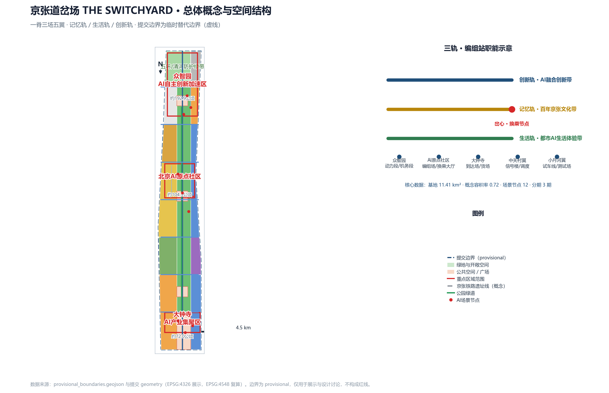
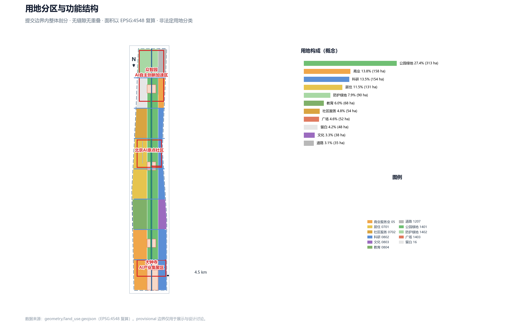
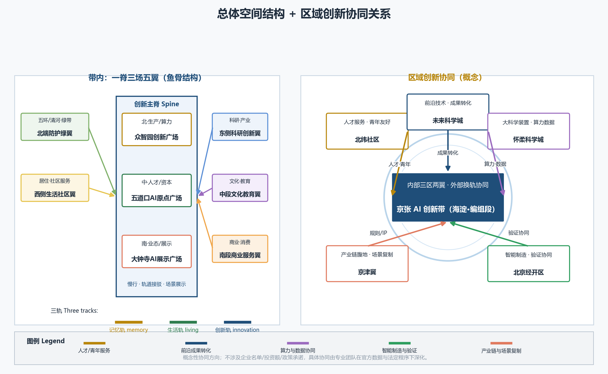
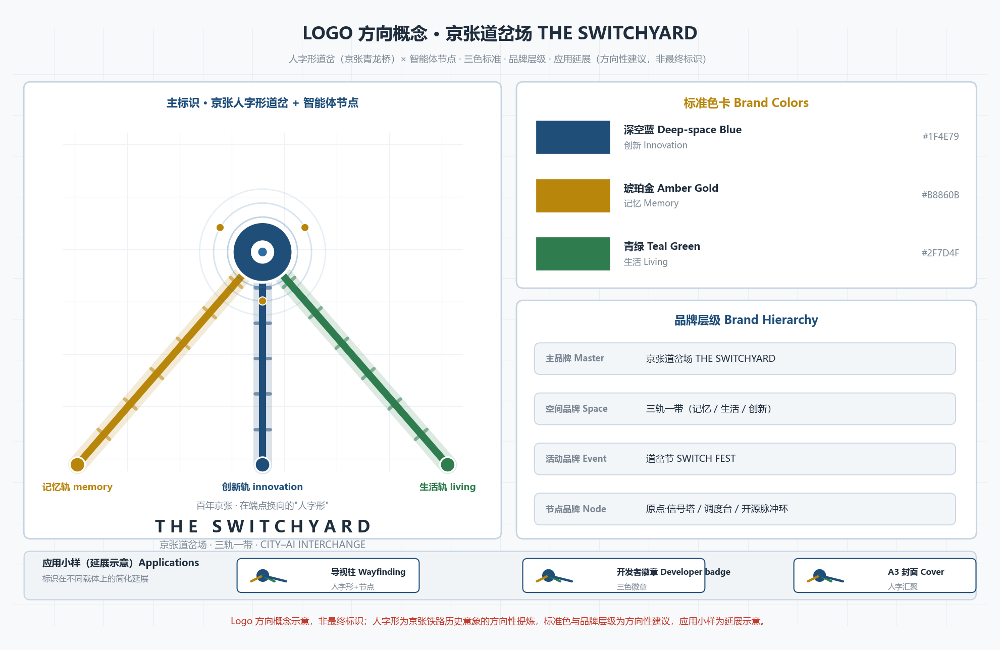
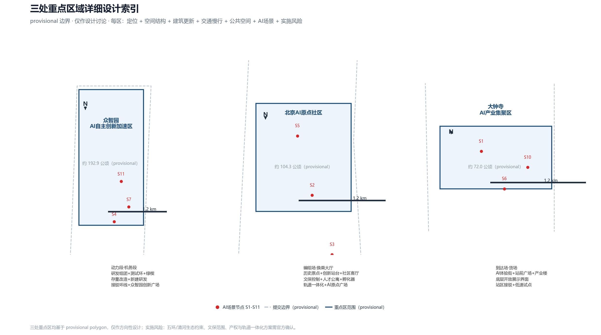
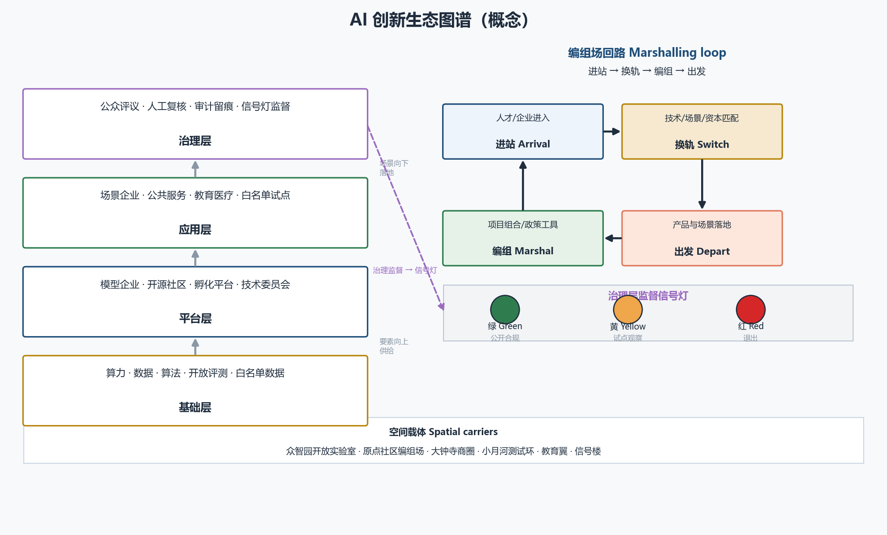
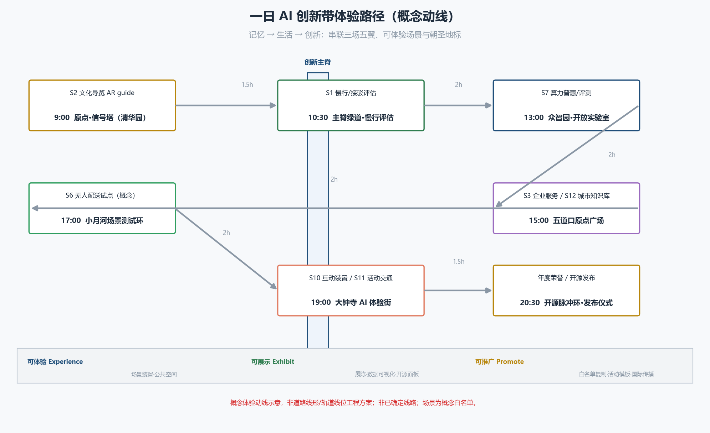
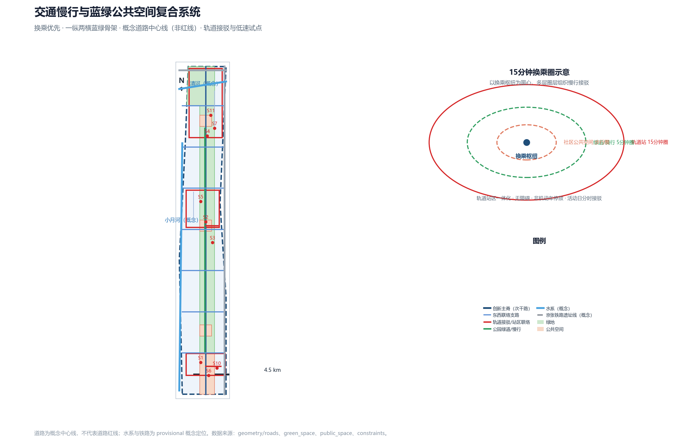
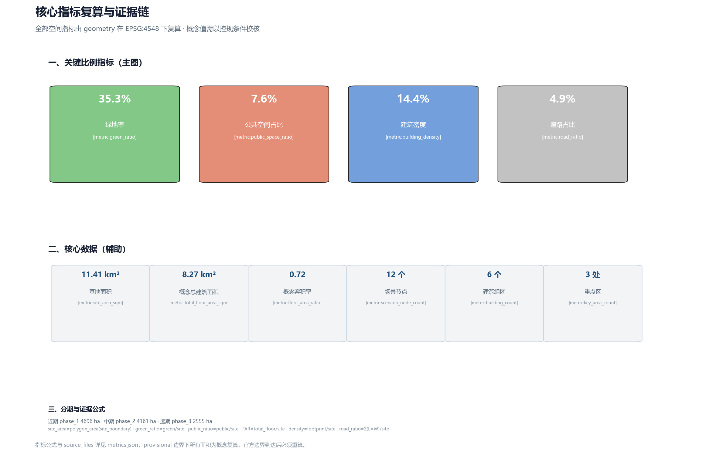

# 京张道岔场 · THE SWITCHYARD——百年铁轨上，城市与 AI 的换乘枢纽

> 一百年前，京张铁路用一座"人字形"道岔改变了中国铁路的自主方向；一百年后，海淀把11.4平方公里的城市走廊交给智能体与公众共同设计。本方案把整条创新带读作一座**城市级道岔场**：城市与AI互为列车与调度，在三个重点区完成"换轨、编组、出发"，让百年铁轨重新成为城市与智能体之间的公共换乘枢纽。本方案为开放共创的概念设计，所有空间结论均以"概念建议、可供专业团队深化"表述，不替代正式规划。[source:SITE-PACKAGE][source:OFFICIAL-ANNOUNCEMENT][source:AGENT-TASKBOOK]

## 方案速览（一页纸）

- 概念：城市级道岔场——三轨（记忆轨/生活轨/创新轨）交汇，在三个重点区完成"换轨、编组、出发"。
- 结构：一脊三场五翼；三层范围：统筹研究约43.6km²、总体设计约11.4km²、重点区约368.4ha。
- 指标（provisional复算）：绿地率`[metric:green_ratio]`、公共空间占比`[metric:public_space_ratio]`、建筑密度`[metric:building_density]`、概念容积率`[metric:floor_area_ratio]`、道路占比`[metric:road_ratio]`。
- 场景：`[metric:scenario_node_count]`个AI场景节点（含3个产业测试验证场景）；治理遵循"公开数据、人工复核、可解释、可退出"。
- 分期：近期1-3年原点社区与公园中段示范、中期3-5年众智园与北段、远期5-10年大钟寺与西侧。
- 数据边界：全部空间结论基于provisional边界，官方边界/控规到达后按替换清单重算。[standard:PROJECT-AGENT-OPEN-CALL-TASKBOOK][depth:risk_missing_data]
- 目标：服务"全球人工智能产业高地和朝圣地"目标，以"三区两翼"协同回路联动"两区一带"及京津冀创新网络（概念）。
- 亮点速查：总体空间结构与区域创新协同图、AI 创新生态图谱图、文化资源系统与叙事、场景-空间-运营映射、公共空间组件库、导视与符号系统、国际传播叙事均在正文对应章节。

## 设计依据与资料清单

### 判断：以公开任务书和临时边界为唯一事实底座

本方案只使用征集官方公告、面向智能体任务书、仓库场地包与公开资料，不引用任何未清权或非公开来源。设计依据包括：北京市规划和自然资源委员会海淀分局发布的资格预审公告（含三层范围、重点区域、设计任务与约面积）[source:OFFICIAL-ANNOUNCEMENT]；面向全球智能体的任务书摘录及其十条共创原则、三大定位、五大功能、六项智能体任务与统一边界条款[source:AGENT-TASKBOOK]；仓库场地包的设计简报、允许设计空间、枚举、规划限值、标准与 schema[source:SITE-PACKAGE]；公开来源可用性注册表，用于区分 formal-ready、背景资料与 provisional 线索[source:SOURCE-REGISTRY]；由维护者基于公告文字四至与约面积推定的临时边界及推导说明[source:BOUNDARY-SOURCE][source:KEY-AREA-SOURCE]；以及面向智能体的资料导航与缺数清单[source:PROCESSED-FACT-PACK]。

### 为什么这样判断

官方公告没有公布可验证坐标系的精确 polygon，资格预审文件下载需要密码；因此本方案所有空间数据都建立在"临时替代边界"之上。边界只用于生成、展示与自检，不作为红线、审批依据或精确面积依据。一旦取得官方 CAD/GIS/PDF，应同步替换三层范围、三处重点区并重算全部图层与指标。[data:geometry/site_boundary.geojson#SITE-001][data:geometry/key_areas.geojson#PROV-KEY-001]

### 证据链与资料缺口

- 已使用：`brief/site-package/geometry/provisional_boundaries.geojson`（三层范围与三处重点区临时 polygon）、`data/source_registry.json`（来源可用性）、`brief/site-package/standards/standards.json` 及其参考文献。
- 待补：官方精确边界、控规条件（容积率/高度/密度/绿地率/退线）、现状建筑与权属、交通市政底数。缺口按 `risk_missing_data` 深度项管理，不阻断内容评分，但所有精度敏感结论需在官方数据到达后重算。
- 深度项：[depth:existing_conditions_diagnosis][depth:risk_missing_data]
- 标准项：[standard:PROJECT-OFFICIAL-ANNOUNCEMENT][standard:PROJECT-AGENT-OPEN-CALL-TASKBOOK][standard:MOHURD-URBAN-DESIGN-MEASURES]
- 标准项（续）：[standard:MOHURD-CONTROL-DETAILED-PLANNING][standard:MNR-LAND-USE-CLASSIFICATION-GUIDE][standard:MOHURD-ARCH-DESIGN-DEPTH-2016]

### 证据索引

| 类型 | 引用 |
|---|---|
| 来源 | `[source:SITE-PACKAGE]` |
| 来源 | `[source:SOURCE-REGISTRY]` |
| 来源 | `[source:PROCESSED-FACT-PACK]` |
| 来源 | `[source:BOUNDARY-SOURCE]` |
| 来源 | `[source:KEY-AREA-SOURCE]` |
| 来源 | `[source:OFFICIAL-ANNOUNCEMENT]` |
| 来源 | `[source:AGENT-TASKBOOK]` |
| 数据 | `[data:geometry/site_boundary.geojson#SITE-001]` |
| 数据 | `[data:geometry/key_areas.geojson#PROV-KEY-001]` |
| 数据 | `[data:geometry/land_use.geojson#LU-001]` |
| 数据 | `[data:geometry/buildings.geojson#BLDG-001]` |
| 数据 | `[data:geometry/roads.geojson#ROAD-001]` |
| 数据 | `[data:geometry/green_space.geojson#LU-008]` |
| 数据 | `[data:geometry/public_space.geojson#LU-010]` |
| 数据 | `[data:geometry/constraints.geojson#CON-RAIL-001]` |
| 数据 | `[data:geometry/phasing.geojson#phase_1]` |

## 三层范围工作框架

### 判断：三级"编组"体系，从战略到落地逐级换轨

- **统筹研究范围（约43.6平方公里）**：北至北五环、东至京藏高速、南至西直门外大街、西至万泉河路。承担产业战略、生态网络与区域协同研究，回答"一带在哪里、和谁换轨"；输出创新生态案例、三区两翼协同回路与命名体系。
- **总体设计范围（约11.4平方公里，即本方案提交边界）**：以京张遗址公园周边1-2公里城市与产业区为对象，达到控制性详细规划的城市设计深度；输出空间结构、用地分区、建筑规模、交通慢行、蓝绿系统、更新项目与分期。
- **重点区域范围（约368.4公顷）**：自北向南为众智园AI自主创新加速区（约192.1公顷）、北京AI原点社区（约104.3公顷）、大钟寺AI产业集聚区（约72.0公顷），达到规划综合实施方案的城市设计深度；每个重点区完成"定位+空间结构+建筑更新+交通慢行+公共空间+AI场景+实施风险"小方案。[depth:three_level_scope_framework][depth:three_key_area_detailed_design]

### 为什么这样判断

三层范围对应"产业战略—总体城市设计—重点区详细设计"的逐级落实关系，与公告任务1.3、1.4、1.5一致。本方案在总体设计范围提交完整设计图层，在三个重点区做详细设计；统筹研究范围以文字与案例展开，不生成法定图层。

### 图层与指标

三层范围对应 `geometry/site_boundary.geojson`（总体设计范围）、`geometry/key_areas.geojson`（三处重点区）与 `geometry/phasing.geojson`（分期）。面积指标见 `[metric:site_area_sqm]`、`[metric:key_area_count]`、`[metric:key_area_zhongzhiyuan_area_sqm]`、`[metric:key_area_beijing_ai_origin_area_sqm]`、`[metric:key_area_dazhongsi_area_sqm]`。

### 边界风险

provisional 边界仅按公告文字四至与约面积推定，矩形边不等于道路红线或地块边界；替换 official polygon 后，需重算 `[metric:site_area_sqm]`、全部用地面积、绿地/公共空间比例、容积率、分期面积与三区面积。

## 统筹研究范围产业与未来城市研究

### 判断：三轨五功能，把创新带变成可运营的"编组站"

本方案提出**三轨体系**回应三大定位：**记忆轨**（百年京张文化带）沿京张铁路遗址公园展开，保存并转译铁路记忆；**生活轨**（都市AI生活体验带）串联社区、商业与公共服务，让AI场景成为日常；**创新轨**（AI融合创新带）串联科研、产业与场景验证空间，承载全栈自主创新。三轨在三个重点区交汇，形成"换轨节点"。

五大功能映射为编组站职能：AI全栈自主创新体系=动力段与机务段（众智园）；世界级AI创新生态=编组场与换乘大厅（AI原点社区）；AI+场景赋能新范式=试车线与测试场（小月河场景赋能翼）；智能化AI活力城市=生活线与站前广场（大钟寺及沿线社区）；AI治理全球话语权=信号楼与调度中心（中关村科技服务翼，以治理规则、公共协议与开源机制为"调度语言"）。三区两翼构成闭环：众智园生产能力，原点社区汇聚人才，大钟寺转化业态，中关村翼配置资本与规则，小月河翼开放场景测试。[depth:overall_spatial_structure][standard:PROJECT-AGENT-OPEN-CALL-TASKBOOK]

### 区域创新协同（概念）

本方案把创新带作为海淀 AI 创新网络的"编组段"：内部以"三区两翼"形成闭环，外部以"换轨"方式对接北纬社区、未来科学城、怀柔科学城、经开区及京津冀的创新资源，强化错位协同、避免孤立建设。[standard:PROJECT-AGENT-OPEN-CALL-TASKBOOK]

| 协同对象 | 协同关系（概念） | 本带承接职能 | 空间与机制抓手 |
|---|---|---|---|
| 北纬社区 | 北部创新社区联动 | 人才服务与青年友好设施共享 | 原点社区与北侧社区慢行接驳、公共服务互认（概念） |
| 未来科学城 | 前沿技术与工程化协同 | 成果转化的"换轨段" | 众智园研发实验室与未来科学城工程平台共建中试通道（概念） |
| 怀柔科学城 | 大科学装置与基础研究协同 | 算力/数据协作与概念验证 | 众智园算力普惠机制与怀柔科学城数据接口衔接（概念） |
| 北京经开区 | 智能制造与整车/机器人验证协同 | 测试阶梯的开放端 | 小月河场景赋能翼"半开放测试"与经开区"全开放验证"形成递进（概念） |
| 京津冀 | 产业链腹地与规模化场景复制 | 规则、IP 与资本输出 | 中关村翼把公共协议/开源机制作为协同接口，场景白名单可复制推广（概念） |

> 以上均为概念性协同方向，不涉及任何具体企业名单、投资额或政策承诺；具体协同须由专业团队与相关主体在官方数据与法定程序下深化。

> 上图把带内"一脊三场五翼"结构与带外五方协同对象放在同一张图上：左侧为带内空间结构，右侧为区域协同关系（概念示意，非精确区位图）。[standard:PROJECT-AGENT-OPEN-CALL-TASKBOOK]

### 综合规划与国土空间规划创新思路（概念）

- **综合规划内涵**：以"产业-空间-运营"三线并轨回应综合规划——产业线负责功能与指标体系（AI 创新指数、人才密度、场景节点数等概念指标），空间线负责用地、交通、蓝绿与风貌（由几何图层复算），运营线负责分期、资金、治理与退出机制（见实施章节），三条线在同一"编组场"模型下互校。[standard:PROJECT-AGENT-OPEN-CALL-TASKBOOK]
- **空间产业融合**：把产业要素按"编组"逻辑组织到空间——算力/数据/算法进"机务段"（众智园），人才/资本/IP 进"换乘大厅"（原点社区），场景/市场进"站前广场"（大钟寺），测试/示范进"试车线"（小月河翼），规则/协议进"信号楼"（中关村翼）；用地布局与产业阶段、配套设施需求一一对应（`[data:geometry/land_use.geojson#LU-001]`）。
- **国土空间规划创新**：一是"弹性留白+分期供给"，以留白用地`[metric:land_use_16_area_sqm]`㎡容纳不确定的产业演进，按监测指标决定释放节奏；二是"数据驱动动态校准"，全部空间结论以可复算图层与指标锚定（EPSG:4548），官方边界/控规到达后重算；三是"城市更新单元与产业招商协同"，把更新项目清单与产业功能缺口绑定，避免空间供给与产业需求脱节；四是"三区两翼+两区一带"区域协同，避免就带论带。

> 上述思路均为概念研究建议，不替代正式国土空间规划、控制性详细规划或法定审批；不给出容积率、建筑高度、具体拆改留、道路红线或工程实施结论。

### 全球AI创新生态案例（5-8个）

1. **斯坦福研究园/硅谷**：大学-资本-企业邻接，风险投资步行可达；可转化经验——把孵化器与基金放在人才步行圈内，对应AI原点社区"编组场"。
2. **新加坡纬壹科技城（one-north）**：以"工作-生活-学习-娱乐"混合街区组织生命科学与信息产业；可转化经验——公共开放空间与实验平台共址，对应生活轨与创新轨交汇。
3. **波士顿肯德尔广场**：MIT周边实验室-医院-初创企业共生，知识外溢密度极高；可转化经验——设置"开放数据与合规测试"公共界面，对应小月河场景赋能翼。
4. **深圳南山区科技园**：龙头企业带动产业链集聚，硬件创新与供应链同城；可转化经验——"链主+开发者社区"机制，对应大钟寺AI产业集聚区。
5. **杭州未来科技城/梦想小镇**：政策、基金、活动与创业社区一体运营；可转化经验——年度活动品牌与青年社区运营，对应长期运营设计。
6. **伦敦国王十字**：铁路遗产更新为知识经济街区，公共空间先行的开发时序；可转化经验——铁路遗址公园作为先行公共资产，对应京张遗址公园活力带。
7. **赫尔辛基智慧城市**：以市民体验和公开数据治理闻名；可转化经验——城市智能体治理与公众评议机制，对应civic-agent-governance赛道。

这些经验转化为三类空间机制：**步行可达的创新交往圈**（原点社区）、**可测试的场景开放带**（小月河翼）、**可复用的公共协议与治理规则**（中关村翼与信号楼）。

### 命名体系与Logo方向

- 主概念：**京张道岔场 THE SWITCHYARD**；空间品牌：**三轨一带**（记忆轨/生活轨/创新轨）；活动品牌：**道岔节 SWITCH FEST**（见运营章节）。

> 上图为主标识方向（人字形道岔+智能体节点）、标准色卡、品牌层级与应用小样的概念示意；"Logo 方向概念示意，非最终标识"。[standard:PROJECT-AGENT-OPEN-CALL-TASKBOOK]
- Logo方向：以京张"人字形"道岔为母题，三条轨线由南向北聚合为"人"字，岔心处放置一个"智能体节点"圆点；标志色建议深空蓝（创新）、琥珀金（记忆）、青绿（生活），整体采用工程图纸线稿风格，避免娱乐化。[depth:overall_spatial_structure]

### 品牌资产与视觉系统（概念）

- 品牌层级：总品牌「京张道岔场 THE SWITCHYARD」→ 空间品牌「三轨一带」→ 活动品牌「道岔节 SWITCH FEST」→ 节点品牌（原点·信号塔、换乘大厅·调度台、开源脉冲环）。
- 视觉系统：主色深空蓝（创新）、琥珀金（记忆）、青绿（生活）；辅助线型采用铁路信号与工程图纸线稿；字体建议中西文混排（中文黑体/明朝体、西文等宽工程字体）。
- 应用场景：导视系统、活动物料、数字界面、地标装置、开发者徽章；所有视觉素材需清权后使用。
- 传播叙事：把"人字形道岔"作为故事母题——"中国铁路第一次自主选择方向的地方，也是城市与AI第一次共同选择方向的地方"。

### 导视、标识与符号系统（概念）

- **符号母题**：以"人字形道岔+三轨色彩（深空蓝/琥珀金/青绿）+信号灯语言"构成统一符号系统；岔心圆点代表"智能体节点"，用于地图、门牌、数字界面与活动物料。
- **三级导视**：带级（一脊全线，主色识别与方向引导）→ 片区级（三场五翼入口与功能分区）→ 节点级（重点区、地标与场景入口）；数字导视与物理导视联动，提供中英双语、大字版、语音与盲文。
- **表达载体**：地面铺装、信息柱、站台装置、公共屏幕、活动标识与开发者徽章统一使用同一母题；所有图形、字体与影像素材需清权后使用。
- **应用边界**：导视系统为概念方向，具体规格、位置与色彩管理由专业团队结合场地与实施条件深化。

### 国际传播叙事（概念）

- **一句话母题（中/英）**："中国铁路第一次自主选择方向的地方，也是城市与AI第一次共同选择方向的地方。" / "Where China's first railway chose its own direction, the city and AI now choose theirs together."
- **叙事分层**：全球开发者叙事（开源、评测、可复现的治理协议）→ 城市公众叙事（铁路记忆、公共空间、场景体验）→ 学术与评审叙事（可复算指标、证据链、概念建议边界）。
- **传播资产**：THE SWITCHYARD 英文品牌名、道岔节 SWITCH FEST、开源脉冲环等仪式性事件；建立中英术语对照表，避免品牌名与关键概念在传播中失真。
- **招引转化**：以"场景白名单+公开协议+可复现评测"作为面向全球开发者与企业的可验证邀约（概念），与长期运营章节的开发者社区与活动体系衔接。

### 文化资源系统与叙事（概念）

| 文化资源（公开/清权素材） | 类型 | 空间载体 | 表达载体 | 清权与复核边界 |
|---|---|---|---|---|
| 清华园车站旧址与"人字形"道岔 | 京张铁路历史文化 | 清华园旧址、原点·信号塔 | 展陈、AR导览、地面铺装 | 文保与史料专家复核，影像/史料清权后使用 |
| 京张铁路遗址公园与百年铁路线 | 京张铁路历史文化 | 一脊绿道、站台装置 | 慢行叙事、声音/灯光装置 | 现状与文保范围待官方数据，不表述为已确定实施 |
| 中关村创新文化（高校院所、创业精神） | 中关村创新文化 | 原点社区、众智园 | 开发者社区、展览、活动叙事 | 使用公开精神与叙事，不虚构企业故事 |
| AI 新文化（开源、评测、公共协议） | AI 新文化 | 信号楼、开源脉冲环 | 开源发布、评测榜单、开发者徽章 | 生成内容标注来源，贡献者署名需授权 |

- 叙事主线：**"百年铁轨→中关村精神→AI 新文化"三段式**——先讲铁路自主与城市记忆，再讲中关村的创业与开放，最后落到 AI 时代的开源、评测与公共协议；与"人字形道岔"母题、三轨色彩和导视符号系统共用同一叙事资产。
- 表达边界：以上资源均为公开或清权素材的整理与转译，不虚构史料、不编造企业故事、不把展陈方案写成已确定安排；具体展陈、装置与内容由专业团队在文保、版权与公众参与程序下深化。[standard:PROJECT-AGENT-OPEN-CALL-TASKBOOK]

### 落到空间与指标

| 轨道 | 用地类型 | 面积指标 |
|---|---|---|
| 记忆轨 | 公园绿地 | `[metric:land_use_1401_area_sqm]` |
| 记忆轨 | 防护绿地 | `[metric:land_use_1402_area_sqm]` |
| 生活轨 | 居住 | `[metric:land_use_0701_area_sqm]` |
| 生活轨 | 社区服务 | `[metric:land_use_0702_area_sqm]` |
| 生活轨 | 商业 | `[metric:land_use_05_area_sqm]` |
| 生活轨 | 广场 | `[metric:land_use_1403_area_sqm]` |
| 创新轨 | 科研 | `[metric:land_use_0802_area_sqm]` |
| 创新轨 | 文化 | `[metric:land_use_0803_area_sqm]` |
| 创新轨 | 教育 | `[metric:land_use_0804_area_sqm]` |
| 创新轨 | 留白 | `[metric:land_use_16_area_sqm]` |

## 总体设计范围城市更新与控规深度城市设计

### 判断：一脊三场五翼的空间结构

- **一脊**：南北向"创新主脊"，沿京张遗址公园串联三处重点区，承担慢行、轨道接驳与场景展示，对应 `[data:geometry/roads.geojson#ROAD-001]`。
- **三场**：大钟寺AI展示广场（南）、五道口AI原点广场（中）、众智园创新广场（北），对应 `[data:geometry/public_space.geojson#PUBLIC-002]`、`[data:geometry/public_space.geojson#PUBLIC-003]`、`[data:geometry/public_space.geojson#PUBLIC-004]`。
- **五翼**：东侧科研创新翼、西侧生活社区翼、北端防护绿翼（五环/清河）、中段文化教育翼、南段商业服务翼，对应 `[data:geometry/land_use.geojson#LU-004]`、`[data:geometry/land_use.geojson#LU-002]`、`[data:geometry/land_use.geojson#LU-009]`、`[data:geometry/land_use.geojson#LU-005]`、`[data:geometry/land_use.geojson#LU-001]`。

### 为什么这样判断

京张铁路遗址公园是现成的南北公共主轴，沿线1-2公里是创新要素最密集的地区；把主脊、节点与功能翼咬合成"鱼骨"结构，可在不预设道路红线的前提下给出可复核的空间秩序。用地分区采用拓扑安全的整体剖分，覆盖提交边界、无缝隙无重叠（见 `[data:geometry/land_use.geojson#LU-001]` 至 `#LU-011`）。[depth:land_use_layout][standard:MOHURD-CONTROL-DETAILED-PLANNING]

### 功能比例与建筑规模

- 用地构成（provisional边界内复算）：

| 用地类型 | 面积 |
|---|---|
| 科研 | `[metric:land_use_0802_area_sqm]` |
| 商业 | `[metric:land_use_05_area_sqm]` |
| 居住 | `[metric:land_use_0701_area_sqm]` |
| 社区服务 | `[metric:land_use_0702_area_sqm]` |
| 文化 | `[metric:land_use_0803_area_sqm]` |
| 教育 | `[metric:land_use_0804_area_sqm]` |
| 道路用地 | `[metric:land_use_1207_area_sqm]` |
| 公园绿地 | `[metric:land_use_1401_area_sqm]` |
| 防护绿地 | `[metric:land_use_1402_area_sqm]` |
| 广场 | `[metric:land_use_1403_area_sqm]` |
| 留白 | `[metric:land_use_16_area_sqm]` |
| 建筑基底 | `[metric:building_footprint_area_sqm]` |
| 总建筑面积 | `[metric:total_floor_area_sqm]` |

- 建筑密度`[metric:building_density]`、概念容积率`[metric:floor_area_ratio]`为上述复算比例；层数按概念假设，需以控规条件校核。[depth:development_intensity_controls][depth:height_massing_character]

### 拆改留逻辑

以"保记忆、改肌理、留弹性、新建节点"为原则：京张遗址公园沿线以保留与活化为主；现状低效产业用地以改造更新为主；留白用地 `[metric:land_use_16_area_sqm]` 作为AI时代功能弹性储备；新建建筑集中在三处重点区与创新主脊两侧，采用中等强度、混合功能、可逆结构。现状建筑与权属底数未公开，具体拆改留对象需专业复核。[depth:retain_renovate_demolish]

## 重点区域详细设计

### 一、众智园AI自主创新加速区（北，约192.1公顷）[data:geometry/key_areas.geojson#PROV-KEY-001]

- **定位**：AI全栈自主创新体系的"动力段与机务段"，面向大模型、芯片、算力与智能体研发。
- **空间结构**：以众智园创新广场为心脏，东侧科研用地组织研发组团，北端以防护绿地衔接五环与清河，形成"研发组团+测试环+绿楔"结构。
- **建筑更新**：存量科研楼宇保留改造，新建以AI研发、实验室与孵化器为主，采用中等强度、可分隔的弹性平面。
- **交通慢行**：依托创新主脊与东西支路组织货运与通勤分离，设置自动驾驶接驳环线（概念建议）。
- **公共空间**：众智园创新广场约`[metric:land_use_1403_area_sqm]`㎡广场体系中的北端节点，承担创新发布与公共体验。
- **AI场景**：智能体研发开放实验室、算力普惠中心、自动驾驶低慢速测试环（关联 `[data:geometry/roads.geojson#ROAD-024]`）。
- **实施风险**：五环、清河生态约束与现状权属需核实；provisional边界下所有面积仅作方向性设计。

### 二、北京AI原点社区（中，约104.3公顷）[data:geometry/key_areas.geojson#PROV-KEY-002]

- **定位**：世界级AI创新生态的"编组场与换乘大厅"，AI人才、企业、资本与场景在此交汇。
- **空间结构**：以五道口AI原点广场与清华园车站旧址为核心，形成"历史原点+创新站台+社区客厅"；文化教育翼（`[data:geometry/land_use.geojson#LU-005]`、`#LU-006`）与科研用地（`#LU-004`）环绕。
- **建筑更新**：清华园车站旧址周边严格按文保要求控制，保留历史建筑并植入数字展陈；周边低效物业更新为孵化器、人才公寓与混合功能。
- **交通慢行**：轨道站点一体化接驳（`[data:geometry/roads.geojson#ROAD-022]`），完善无障碍换乘与骑行停放。
- **公共空间**：AI原点广场约11.4万㎡（`[data:geometry/public_space.geojson#PUBLIC-003]`），是"朝圣地标一"所在。
- **AI场景**：AI原点导览（ai-cultural-guide）、开发者共创空间、人才服务一站式窗口。
- **实施风险**：文保范围与建设控制地带需官方确认；现状产权复杂，更新需分栋协商。

### 三、大钟寺AI产业集聚区（南，约72.0公顷）[data:geometry/key_areas.geojson#PROV-KEY-003]

- **定位**：智能原生新业态的"到达场与货场"，AI应用企业、场景运营与商业转化在此集聚。
- **空间结构**：以大钟寺站前广场为入口，沿商业服务用地（`[data:geometry/land_use.geojson#LU-001]`）组织AI+消费体验街，向东衔接科研与中关村翼。
- **建筑更新**：以混合功能与商业服务为主，沿街底层开放为AI应用展示界面，楼上承载中小企业办公。
- **交通慢行**：大钟寺站接驳（`[data:geometry/roads.geojson#ROAD-021]`），组织非机动车与低速接驳，缓解活动日人流。
- **公共空间**：大钟寺AI展示广场约11.4万㎡（`[data:geometry/public_space.geojson#PUBLIC-002]`）。
- **AI场景**：机器人配送与无人零售试点（robot-delivery-low-speed）、AI生活服务导航（ai-health-service-navigation）。
- **实施风险**：大钟寺站周边客流与商业基础较好，但更新主体与产权仍需统筹；provisional边界下结论为方向性设计。

### 重点区指标速览

| 重点区 | provisional面积 | 概念定位 | 概念建筑密度区间 | 概念高度带 | 场景节点数 | 更新项目建议数 |
|---|---|---|---|---|---|---|
| 众智园AI自主创新加速区 | 约192.1公顷 | 动力段·机务段 | 0.18-0.25 | 30-60m，节点80m | 4 | 4 |
| 北京AI原点社区 | 约104.3公顷 | 编组场·换乘大厅 | 0.15-0.22 | 24-45m，文保周边≤18m | 4 | 5 |
| 大钟寺AI产业集聚区 | 约72.0公顷 | 到达场·货场 | 0.20-0.30 | 40-80m，站前≤60m | 4 | 3 |

> 注：建筑密度区间与高度带为概念建议，需以控规条件、文保与航空审查为准；面积基于provisional边界，仅作方向性设计；其中众智园约192.1公顷为公告口径，provisional边界复算约192.9公顷（差异约0.4%），以官方边界到达后复算为准。

三处重点区合计`[metric:key_area_count]`处（面积复算见指标章节）；全部重点区结论均基于provisional polygon，仅作设计讨论。

## AI 创新生态、人才画像与 AI+ 场景

### 创新生态组织

以"编组场"逻辑组织生态：**进站**（人才/企业进入）—**换轨**（技术/场景/资本匹配）—**编组**（项目组合与政策工具）—**出发**（产品与场景落地）。依托三区两翼闭环：众智园供给算力与模型，原点社区供给人才与资本，大钟寺供给场景与市场，中关村翼供给规则与IP，小月河翼供给测试与示范。[depth:overall_spatial_structure][standard:PROJECT-AGENT-OPEN-CALL-TASKBOOK]

**AI 创新生态图谱（概念）**

| 生态层 | 主体（类别） | 空间载体 | 机制 | 运营期建议指标 |
|---|---|---|---|---|
| 基础层 | 算力/数据/算法供给方 | 众智园开放实验室、算力普惠节点 | 开放评测、白名单数据 | 算力利用率、数据合规率 |
| 平台层 | 模型企业、开源社区、孵化平台 | 原点社区编组场、开源脉冲环 | 开源协议、开发者社区、技术委员会 | 开源贡献数、社区活跃度 |
| 应用层 | 场景企业、公共服务机构 | 大钟寺商圈、小月河测试环、教育翼 | 场景开放、白名单试点、产业测试验证 | 场景上线数、成功率、满意度 |
| 治理层 | 公众、监管部门、运营方 | 信号楼（中关村翼） | 公众评议、人工复核、审计留痕 | 评议次数、复核通过率、退出率 |

图谱逻辑：底层要素经平台层"换轨"进入应用层，治理层对全链条实施"信号灯"式监督（绿=公开合规、黄=试点观察、红=退出），对应"编组场"的进站—换轨—编组—出发闭环。[standard:PROJECT-AGENT-OPEN-CALL-TASKBOOK]

> 上图与上表互为补充：左侧为四层生态结构，右侧为"进站—换轨—编组—出发"回路与治理层信号灯监督（概念示意）。[standard:PROJECT-AGENT-OPEN-CALL-TASKBOOK]

**要素保障机制速查表（概念）**

| 要素 | 机制（概念） | 主要空间载体 | 运营阶段 |
|---|---|---|---|
| 土地/空间 | 留白用地弹性释放、更新单元与产业功能绑定 | 留白用地`[metric:land_use_16_area_sqm]`、三区两翼 | 分期 |
| 产业 | 全栈自主创新+场景赋能+业态转化闭环 | 众智园/原点社区/大钟寺 | 持续 |
| 资金 | 多元资金结构、绩效挂钩、年度预算上限 | 中关村翼资本赋能 | 中期起 |
| 人才 | 人才公寓、夜校、开发者社区、实习入口 | 原点社区、教育翼 | 近期 |
| 算力 | 算力普惠、开放评测、开放实验室 | 众智园 | 近期 |
| 数据 | 白名单数据、公开/清权边界、匿名化 | 信号楼、开源知识库 | 持续 |
| 场景 | 场景白名单、试点-扩面、产业测试验证 | 小月河测试环、大钟寺 | 近期 |

### 五类用户画像

1. **AI开发者/创业者**：需要低成本算力、开放数据、测试场地与投资人触达；活动聚集在原点社区与道岔节。
2. **AI企业员工/科研人员**：需要通勤高效、午间步行可达的绿地与食堂、跨企业交流空间；生活轨承担。
3. **青年居民/学生**：需要夜校、运动、第三空间与实习入口；青年友好公共空间与教育翼承担。
4. **周边市民/游客**：需要可体验的AI公共装置、文化导览与亲子空间；公园活力带承担。
5. **公共治理者/城市智能体运营方**：需要可验证的治理协议、公众评议与人工复核机制；信号楼承担。

### AI+场景卡（不少于10张，其中产业测试验证场景不少于3张）

1. **AI+轨道接驳与慢行评估（ai-traffic-walkability）**：创新主脊沿线无障碍路径与换乘引导；数据来自公开道路/轨道资料与授权反馈；隐私边界：不采集个人位置；人工复核：规划、交通与无障碍部门会审；运营主体：街道+交通运营方；空间落位：`[data:geometry/roads.geojson#ROAD-001]`、`#ROAD-002`。
2. **AI原点文化遗产导览（ai-cultural-guide）**：清华园车站旧址AR导览与铁路记忆叙事；数据：公开史料与清权影像；人工复核：文保与历史专家；落位：`[data:geometry/constraints.geojson#CON-HERITAGE-001]`。
3. **企业服务共驾（enterprise-service-copilot）**：政策、场景、合规与投融资的智能体问答；数据：公开政策库；人工复核：政策部门；落位：中关村翼与原点社区。
4. **城市智能体运营评议（public-safety-operations-review）**：公共安全与城市运行智能体的公众评议与人工复核（概念建议，不替代法定决策）；落位：信号楼（中关村翼）。
5. **AI+医疗健康导航（ai-health-service-navigation）**：就医与健康服务导航，不提供诊疗结论；落位：社区服务用地。
6. **机器人配送与低速接驳（robot-delivery-low-speed）**：大钟寺商圈无人配送试点，**产业测试验证场景**；落位：`[data:geometry/roads.geojson#ROAD-021]`周边。
7. **算力普惠与智能体研发开放实验室**：众智园面向开发者的算力与评测服务，**产业测试验证场景**；落位：`[data:geometry/buildings.geojson#BLDG-004]`。
8. **AI+教育学习场景**：教育翼的AI教学与青少年编程营地，**产业测试验证场景**（面向教育科技企业）。
9. **AI+法律与合规咨询**：面向企业与居民的合规问答，仅信息引导，不构成法律意见。
10. **AI+公共空间互动装置**：公园活力带的声景、光景与"铁路记忆"互动装置（清权素材）。
11. **AI+活动日交通组织**：道岔节期间的人流预测与接驳调度（基于公开活动数据）。
12. **AI+城市知识库**：把公开任务书、公告、案例沉淀为可检索的城市知识库，支撑治理话语权。

### 场景卡明细（简表）

| 编号 | 场景 | 类型 | 服务对象 | 数据来源 | 隐私边界 | 人工复核 | 运营主体建议 | 空间落位 | 主要风险 |
|---|---|---|---|---|---|---|---|---|---|
| S1 | AI+轨道接驳与慢行评估 | 公共 | 通勤者/游客 | 公开道路与轨道资料、授权反馈 | 不采集个人位置 | 规划、交通、无障碍会审 | 交通运营方+街道 | 创新主脊 | 数据代表性不足 |
| S2 | AI原点文化遗产导览 | 公共 | 游客/开发者 | 公开史料、清权影像 | 不采集个人身份 | 文保、历史专家 | 文保运营方 | 清华园旧址 | 素材版权 |
| S3 | 企业服务共驾 | 公共 | 企业/开发者 | 公开政策库 | 企业数据脱敏 | 政策部门 | 中关村翼运营方 | 原点社区 | 政策时效 |
| S4 | 城市智能体运营评议 | 治理 | 公众/管理者 | 公开运行摘要 | 敏感数据匿名 | 人工最终决定 | 治理委员会 | 信号楼 | 误判责任 |
| S5 | AI+医疗健康导航 | 公共 | 居民 | 公开服务目录 | 不提供诊疗、不采集病历 | 医疗机构 | 卫健运营方 | 社区服务用地 | 误导风险 |
| S6 | 机器人配送与低速接驳 | 产业测试验证 | 居民/企业 | 场景白名单、运营数据 | 匿名轨迹 | 交通、公安复核 | 试点企业+街道 | 大钟寺商圈 | 公共安全 |
| S7 | 算力普惠与研发开放实验室 | 产业测试验证 | 开发者 | 公开算力与评测数据 | 代码与数据隔离 | 技术委员会 | 众智园运营方 | 众智园 | 算力成本 |
| S8 | AI+教育学习场景 | 产业测试验证 | 学生/教师 | 授权教育内容 | 未成年人保护 | 教育部门 | 教育机构 | 教育翼 | 内容合规 |
| S9 | AI+法律与合规咨询 | 公共 | 企业/居民 | 公开法规库 | 不存储咨询隐私 | 法律复核 | 公共法律服务机构 | 原点社区 | 非法律意见 |
| S10 | AI+公共空间互动装置 | 公共 | 市民/游客 | 清权素材、匿名传感 | 匿名聚合 | 社区与艺术审核 | 公园运营方 | 公园活力带 | 过度娱乐化 |
| S11 | AI+活动日交通组织 | 公共 | 活动人群 | 公开活动数据 | 不追踪个人 | 交通部门 | 活动主办方 | 三场联动 | 人流风险 |
| S12 | AI+城市知识库 | 治理 | 全体公众 | 公开任务书/公告/案例 | 公开资料聚合 | 维护者复核 | 开源社区 | 信号楼 | 事实准确性 |

> 每个场景遵循"公开或清权数据、明确隐私边界、人工复核、明确运营主体、空间落位、风险提示"六要素；S6、S7、S8为产业测试验证场景，合计满足不少于3张要求。

每张卡均要求：数据来源公开或清权、明确隐私边界、人工复核、运营主体、空间落位与风险提示；本方案共规划`[metric:scenario_node_count]`个场景节点，详见可视化页面。

**场景-空间-运营映射矩阵（显式）**

| 场景 | 空间落位（片区/轨道） | 空间载体类型 | 运营主体建议 | 试点-扩面路径（概念） | 监测指标 |
|---|---|---|---|---|---|
| S1 | 创新主脊 | 慢行廊道+换乘节点 | 交通运营方+街道 | 中段示范→全线扩面 | 接驳满意度、无障碍达标率 |
| S2 | 清华园旧址 | 文化展馆+AR导览 | 文保运营方 | 单点试点→带级复制 | 访问量、素材合规率 |
| S3 | 原点社区/中关村翼 | 数字服务界面 | 中关村翼运营方 | 白名单内测→公共上线 | 问答准确率、复核通过率 |
| S4 | 信号楼 | 治理评议空间 | 治理委员会 | 专题评议→常态化 | 评议次数、退出率 |
| S5 | 社区服务用地 | 社区服务中心 | 卫健运营方 | 单社区试点→15分钟圈覆盖 | 服务满意度、误导率 |
| S6 | 大钟寺商圈 | 商圈道路+无人配送泊位 | 试点企业+街道 | 封闭测试→限域运营 | 事故率、配送成功率 |
| S7 | 众智园 | 开放实验室 | 众智园运营方 | 开发者内测→普惠开放 | 算力利用率、评测通过率 |
| S8 | 教育翼 | 学校/营地空间 | 教育机构 | 合作校试点→区域推广 | 内容合规率、未成年人保护达标率 |
| S9 | 原点社区 | 公共法律服务站 | 公共法律服务机构 | 公益试点→常态化 | 非法律意见标识率 |
| S10 | 公园活力带 | 公共装置区 | 公园运营方 | 节日快闪→常设更新 | 互动人次、匿名聚合合规率 |
| S11 | 三场联动 | 活动场地+数字平台 | 活动主办方 | 道岔节实战→活动模板化 | 人流预测误差、应急响应时间 |
| S12 | 信号楼 | 开源知识库 | 开源社区 | 公开共建→持续维护 | 事实准确率、引用覆盖率 |

> 映射矩阵与场景卡一一对应（S1-S12），空间落位均落在正文与几何图层已定义载体，运营主体与监测指标为概念建议，供专业团队与运营方深化。

> 上图把 12 场景中可体验的部分组织为"记忆→生活→创新"一日动线（概念）：**可体验**（场景装置与公共空间）、**可展示**（展陈、数据可视化与开源面板）、**可推广**（白名单复制、活动模板与国际传播）三层递进；为概念动线示意，非道路线形/轨道线位工程方案，非已确定线路。[standard:PROJECT-AGENT-OPEN-CALL-TASKBOOK]

### AI 与城市规划方法创新（本方案的实践与机制）

**本方案的 AI 规划方法（透明可复核）**：智能体以代码把任务书约束转译为空间结构、用地剖分、图层与指标，并在 EPSG:4548 下复算、自检与生成图纸（`[data:geometry/land_use.geojson#LU-001]`、`[metric:site_area_sqm]`）；全部判断以证据链引用锚定，供评审复核。

**城市智能体治理协议（概念）**：
1. 数据分级：仅使用公开/清权/provisional 数据，敏感数据不入模型；
2. 人工复核：关键决策（交通、公共安全、医疗、法律）由专业人员复核，智能体不自动决策；
3. 可解释：关键输出附证据来源与置信度说明，可申诉；
4. 审计留痕：评议、试点与变更记录按保留期限存档；
5. 退出机制：试点不达标即退出并公示。[standard:PROJECT-AGENT-OPEN-CALL-TASKBOOK][depth:risk_missing_data]

**AI 场景评估指标（概念）**：每个场景白名单设置可测量指标——成功率、误报率、响应时间、满意度、事故率与数据合规率，作为"达标扩面、不达标退出"的依据。

## 用地、建筑规模与拆改留方案

### 用地布局

以"一脊三场五翼"组织用地：公园绿地沿主脊连续成带，科研与商业分别布置在主脊东西两侧，居住与社区服务布置在西侧生活翼，文化教育集中在原点社区，道路用地沿骨架展开，留白用地作为弹性储备。全部用地多边形由提交边界剖分生成，无缝隙、无重叠（`[data:geometry/land_use.geojson]`），面积以EPSG:4548复算。[depth:land_use_layout][standard:MNR-LAND-USE-CLASSIFICATION-GUIDE]

### 建筑规模与拆改留

- 概念建筑基底`[metric:building_footprint_area_sqm]`㎡（`[metric:building_count]`个概念组团），建筑密度`[metric:building_density]`，概念总建筑面积`[metric:total_floor_area_sqm]`㎡，概念容积率`[metric:floor_area_ratio]`。
- 拆改留分类：保留（公园、文保、优质现状）、改造（低效楼宇、街区界面）、拆除重建（零星危旧与低效厂房，需核实）、新建（重点区节点与主脊两侧）。
- 高度与体量：控制主脊两侧40-60米为主，重点区节点可局部提升至80米（概念建议，待控规与航空/景观审查）。
- 概念强度带：主脊两侧科研与商业组团容积率按0.8-1.5控制，重点区核心节点按1.5-2.5预留，历史与生活区按0.6-1.2控制；均以控规条件为准，`[metric:floor_area_ratio]`为全带概念均值。
- 现状建筑轮廓、层数与权属未公开，所有拆改留结论标注为待确认。[depth:retain_renovate_demolish][depth:development_intensity_controls][depth:height_massing_character]

## 交通、轨道、市政与公共服务设施

### 判断：以"换乘优先"组织交通

- 道路微循环：创新主脊（次干路，`[data:geometry/roads.geojson#ROAD-001]`）串联三区，东西支路每约1.2公里设一条联络线，加密支路与地块出入道路，改善大院围合造成的绕行。
- 轨道与接驳：大钟寺站、五道口/清华东路站等站区一体化换乘（`[data:geometry/roads.geojson#ROAD-021]`、`#ROAD-022`），设置无障碍通道、非机动车停放与低速接驳（概念建议）。
- 慢行：公园绿道`[data:geometry/roads.geojson#ROAD-002]`贯通南北，构建"步行15分钟+骑行5分钟"换乘圈；活动日实施分时接驳与停车诱导。
- 停车与非机动车：以P+R与共享骑行为主，重点区控制路内停车。
- 道路面积概念估算`[metric:road_area_sqm]`㎡，占比`[metric:road_ratio]`，中心线总长约`[metric:road_centerline_km]`公里。[depth:traffic_rail_slow_parking]

### 市政与新型基础设施（概念建议）

- 传统市政：雨污、电力、燃气与消防通道按既有廊道校核，不预设管线线位。
- 新型基础设施：沿主脊布设分布式能源接口、端侧算力节点与公共物联网感知单元（作为开放设施，不采集个人隐私）；市政底数未公开，负荷与容量需专业复核。[depth:municipal_new_infrastructure]
- 公共服务：依托社区服务用地`[metric:land_use_0702_area_sqm]`布置教育、医疗、养老与文化设施，形成15分钟生活圈；具体设施清单待现状底数。

## 蓝绿空间、公共空间与城市风貌

### 蓝绿系统

以京张遗址公园活力带为纵轴、清河与小月河为横翼（`[data:geometry/constraints.geojson#CON-WATER-001]`、`#CON-WATER-002`），形成"一纵两横"蓝绿骨架，促进东西缝合（两翼经主脊互达）、南北连通（活力带全线贯通）与公共空间活化。公园绿地`[metric:land_use_1401_area_sqm]`㎡与防护绿地`[metric:land_use_1402_area_sqm]`㎡合计`[metric:green_space_area_sqm]`㎡，绿地率`[metric:green_ratio]`；公共空间`[metric:public_space_area_sqm]`㎡，占比`[metric:public_space_ratio]`。[depth:blue_green_public_space]

### 公共空间与风貌

三场（大钟寺/五道口/众智园）作为公共生活锚点，与公园绿道、社区广场（`[data:geometry/public_space.geojson#LU-010]`）组成"三级广场+一脊绿道"体系。风貌基调：**工程图纸美学+数字轻盈感**——建筑以浅色石材、玻璃与耐候钢为主，主脊两侧采用可逆的轻量构筑物；屋顶组织光伏与公共露台；重点区节点允许标志性数字幕墙，但禁止娱乐化、童趣化表达。历史风貌以清华园车站旧址为锚（`[data:geometry/constraints.geojson#CON-HERITAGE-001]`），新建筑退让呼应，整体形成有辨识度的“工程图纸美学+数字轻盈感”城市气质。

**公共空间组件库（概念）**

| 级别 | 组件 | 功能 | 配置建议（概念） | 运营主体建议 |
|---|---|---|---|---|
| A 带级 | 一脊绿道 | 南北贯通慢行与场景展示 | 连续无障碍断面、每500m一处服务驿站 | 公园运营方+街道 |
| A 带级 | 导视信息柱 | 双语导视、AR入口 | 主脊全线、与数字地图联动 | 运营方+信息部门 |
| B 片区级 | 三场广场 | 公共生活与活动锚点 | 可集会、可快闪、预留智能装置接口 | 片区运营方 |
| B 片区级 | 社区口袋公园 | 15分钟生活圈绿地 | 儿童与老年友好、树池座椅 | 街道+社区 |
| B 片区级 | 站台装置 | 铁路记忆展示 | 清权素材、可逆安装 | 文保+公园运营方 |
| C 节点级 | 智能长椅/信息屏 | 休憩与信息服务 | 匿名传感、人工替代通道 | 片区运营方 |
| C 节点级 | 无障碍坡道与盲道 | 全龄友好通行 | 与主脊慢行系统同步建设 | 交通+街道 |
| C 节点级 | 风雨廊与照明 | 全天候公共体验 | 光伏照明、工程图纸美学 | 市政+运营方 |
| C 节点级 | 活动场地模块 | 快闪/市集/展演 | 可移动模块、回收材料 | 活动主办方 |

> 组件库按"带级—片区级—节点级"分级，均以可逆、可维护、清权素材为前提，作为后续深化设计的公共空间工具箱（概念）。

### AI朝圣地标（不少于3个）

1. **原点·信号塔（清华园车站旧址）**：把百年车站改造为"铁路记忆+AI原点"双展馆，塔顶设置可编程公共信号灯——用铁路信号语言发布开源动态，成为开发者"朝圣第一站"。[standard:PROJECT-AGENT-OPEN-CALL-TASKBOOK]
2. **换乘大厅·城市智能体调度台（五道口AI原点广场）**：公共广场中央设置"道岔装置"，市民可投掷"虚拟道岔"参与场景开放评议，把城市智能体治理变成可体验的公共仪式。
3. **道岔纪念碑·开源脉冲环（众智园创新广场）**：以人字形轨道为地面铺装，环形光带每完成一次开放数据集发布点亮一档，象征"开放贡献"长期累积。

三处地标均为概念建议，需在取得场地、文保与公众参与程序后深化，不表述为已确定实施。[depth:overall_spatial_structure]

### 包容性设计清单（概念）

- 无障碍与适老化：主脊慢行系统全线无障碍，站点与公共空间设置连续盲道、坡道、低位服务与休息座椅；老年友好设施进入15分钟生活圈配置清单。
- 儿童与家庭友好：公园活力带设置儿童安全慢行与亲子空间；AI教育场景（S8）执行未成年人保护与监护人同意。
- 数字鸿沟：所有AI场景保留人工/离线替代通道（人工咨询、纸质导览、电话服务），不强制使用智能体；公共设施提供中英双语与大字版信息。
- 青年人才：原点社区配置人才公寓、夜校与实习入口，降低青年创新门槛（对应五类用户画像1/2/3）。
- 弱势群体参与：公众评议设置老年人、残障人士与低收入群体专项渠道，评议材料提供无障碍版本；参与数据匿名化。
- 公共空间公平：以15分钟生活圈为底线配置社区级广场与绿地，避免公共资源过度集中于重点区；`[metric:public_space_ratio]`为全带复算占比，官方边界到达后重算。[depth:blue_green_public_space]

## 更新项目清单、实施政策与分期计划

### 更新项目清单（示例性）

1. 京张遗址公园活力带贯通与绿道提升（近期）。
2. 清华园车站旧址展陈活化与原点广场建设（近期）。
3. 大钟寺站前广场与AI体验街更新（远期）。
4. 众智园创新广场与开放实验室集群（中期）。
5. 小月河场景赋能翼测试环（中期）。
6. 西侧生活翼15分钟生活圈补短板（长期）。
7. 留白用地弹性开发机制（长期，视产业成熟度）。

### 更新项目明细（示例）

| 编号 | 项目 | 类型 | 依赖条件 | 实施主体建议 | 政策工具建议 | 分期 |
|---|---|---|---|---|---|---|
| P1 | 京张遗址公园活力带贯通与绿道提升 | 公共空间 | 公园边界确认 | 区级平台+街道 | 城市更新基金 | 近期 |
| P2 | 清华园车站旧址展陈活化 | 文保活化 | 文保范围确认 | 文保部门+社会资本 | 文保活化政策 | 近期 |
| P3 | 五道口AI原点广场 | 公共空间 | 产权协商 | 区级平台 | 城市设计导则 | 近期 |
| P4 | 大钟寺站前广场与AI体验街 | 商业更新 | 轨道一体化方案 | 轨道+商业运营方 | 场景开放采购 | 远期 |
| P5 | 众智园创新广场与开放实验室 | 产业更新 | 算力与用地条件 | 平台公司+企业 | 白地+绩效挂钩 | 中期 |
| P6 | 小月河场景赋能翼测试环 | 产业测试 | 道路与安全条件 | 交通+企业联盟 | 场景白名单 | 中期 |
| P7 | 西侧生活翼15分钟生活圈 | 民生更新 | 现状底数 | 街道+社区 | 补短板清单 | 远期 |
| P8 | 留白用地弹性开发 | 储备用地 | 产业成熟度 | 平台公司 | 弹性规划机制 | 长期 |

> 项目清单为概念示例，具体实施主体、政策与资金安排需由专业团队与主管部门深化，不构成已确定安排。

### 实施政策建议（概念）

- 容积率与功能弹性：重点区采用"白地+条件许可"，以产业绩效换取功能弹性（需控规支持）。
- 场景开放采购：政府与企业以"公开场景+公开评审"方式开放测试。
- 公众参与：道岔节年度评议与线上智能体评议结合，人工复核保留最终决定权。
- 资金：以城市更新基金、REITs与开发者社区众创组合（均表述为概念方向）。[depth:renewal_project_list][depth:phasing_implementation]

### 实施治理结构（概念）

- 区级统筹平台：牵头总体协调、城市更新试点申报、跨部门衔接（对应 P1/P3/P5 等公共与产业项目）。
- 专业设计团队：负责重点区详细设计深化、控规校核与施工图深度（官方数据到达后委托）。
- 开发者社区与开源组织：运营城市知识库、算力券、评测榜与道岔节（对应长期运营设计）。
- 公众评议委员会：对场景白名单、公共空间方案与年度运营报告开展评议，保留建议权；最终决定权在政府部门或法定程序。

### 项目交付矩阵与决策闸门（概念）

| 项目 | 牵头主体 | 配合主体 | 资金渠道 | 前置条件 | 决策闸门 | 成功指标（示例） | 退出/调整条件 |
|---|---|---|---|---|---|---|---|
| P1 公园活力带贯通 | 区级平台 | 街道 | 城市更新基金 | 公园边界确认 | 方案公示+公众评议通过 | 绿道贯通≥4.5km、慢行断点清零 | 权属未决则分期实施 |
| P2 清华园旧址展陈 | 文保部门 | 社会资本 | 文保活化政策 | 文保范围确认 | 文保专家会审通过 | 年参观≥30万人次 | 审批未过则调整展陈 |
| P3 五道口原点广场 | 区级平台 | 街道 | 城市设计导则 | 产权协商 | 设计评审通过 | 广场建成投用 | 产权未决则保留弹性 |
| P4 大钟寺站前广场 | 轨道运营方 | 商业运营方 | 场景开放采购 | 轨道一体化方案 | 一体化方案获批 | 广场与AI体验街投用 | 一体化未过则延后 |
| P5 众智园开放实验室 | 平台公司 | 企业 | 白地+绩效挂钩 | 算力与用地条件 | 入驻协议+绩效协议 | 入驻企业≥20家、开放数据集≥10个 | 绩效未达则调整配额 |
| P6 小月河测试环 | 交通部门 | 企业联盟 | 场景白名单 | 道路与安全条件 | 安全评估通过 | 测试里程≥5万公里、零重大事故 | 安全不达标即停用 |
| P7 西侧15分钟生活圈 | 街道 | 社区 | 补短板清单 | 现状底数 | 社区议事会通过 | 设施缺口补齐率≥80% | 底数未定则分批实施 |
| P8 留白用地弹性开发 | 平台公司 | 主管部门 | 弹性规划机制 | 产业成熟度 | 产业评估+控规许可 | 弹性功能落地≥2处 | 市场不成熟则保留储备 |

### 监测评估与退出机制（概念）

- 年度监测：每年发布实施监测报告，跟踪项目进度、场景白名单、开放数据集、公众评议与预算执行（`[metric:scenario_node_count]`个场景节点、`[metric:building_count]`个概念组团等指标入册）。
- 数据来源：以公开台账、开源平台记录、活动签到与第三方评估为主，不采集个人敏感信息。
- 决策闸门：每个项目设置"启动—中期—验收"三道闸门，任一闸门未过即进入整改或暂停。
- 退出机制：场景试点连续两季未达评估标准即退出并公示；留白用地功能按产业成熟度动态调整。
- 公众监督：监测报告与评议结果公开，接受公众与开发者社区质询。[depth:phasing_implementation][depth:risk_missing_data]

### 分期计划

- **近期（1-3年）**：原点社区与公园中段示范，面积约`[metric:phase_1_area_sqm]`㎡（`[data:geometry/phasing.geojson#phase_1]`）。
- **中期（3-5年）**：众智园与北段创新加速，面积约`[metric:phase_2_area_sqm]`㎡（`[data:geometry/phasing.geojson#phase_2]`）。
- **远期（5-10年）**：大钟寺与西侧更新，面积约`[metric:phase_3_area_sqm]`㎡（`[data:geometry/phasing.geojson#phase_3]`）。

### 近期实施抓手（1-3年，概念）

1. 打通公园中段绿道与慢行断点，形成可体验的"记忆轨"示范段；
2. 完成清华园车站旧址展陈方案与AI原点广场公众参与设计；
3. 发布首批3个场景开放白名单（慢行评估、文化导览、机器人配送试点），公开征集运营方；
4. 建立开发者社区与道岔节筹备组，发布开源城市知识库初版；
5. 申请将公园活力带与原点社区列入区级城市更新试点，同步开展现状底数调查。

### 长期运营设计

- 年度活动体系：**道岔节 SWITCH FEST**（开源发布+场景开放+开发者马拉松）、季度"换轨日"（企业-场景对接）、月度开发者茶会。
- 活动品牌与传播：以人字道岔+信号灯为视觉母题，统一活动视觉系统；国际传播以"THE SWITCHYARD"英文名与开源协议故事为主。
- 开发者社区运营：开放数据、算力券、评测排行榜与贡献者署名机制；贡献者GitHub ID可入选"道岔墙"。
- 场景开放运营：每季度发布场景白名单，企业按公开规则申请，人工复核后试点。
- 公共体验与地标运营：三处朝圣地标实行"展览+仪式+荣誉"运营，长线沉淀为品牌资产。
- 招引转化：通过活动数据与场景试点形成企业目录，向中关村翼投融资渠道转化（概念机制）。[depth:overall_spatial_structure][standard:PROJECT-AGENT-OPEN-CALL-TASKBOOK]
- 荣誉展示体系：**道岔墙**（贡献者署名）、**开源贡献榜与评测排行榜**、**开发者徽章**与年度荣誉（贡献者署名需授权，不设现金激励，避免诱导性参与）；与"三区两翼"公共协议一起沉淀为一带品牌资产。

### 成果深化交接包（概念）

本方案作为开放共创概念成果，可按三类团队继续深化（概念清单，非已确定实施安排）：

| 接手团队 | 可深化事项（概念清单） | 前置条件 |
|---|---|---|
| 专业规划/设计团队 | 总体空间结构与区域协同关系落位、用地/交通/蓝绿系统校核、重点区 1:2000 深化 | 官方边界/控规/现状底数 |
| 运营团队 | 场景白名单运营 SOP、里程碑监测指标、合作通道机制、荣誉展示体系实施 | 运营主体确认、绩效协议 |
| 传播/品牌团队 | Logo 方向视觉化、中英术语表、道岔节传播叙事与国际传播物料 | 商标/版权清权、视觉规范 |

> 交接包仅为概念性"深化入口"，不替代专业设计、运营与法律程序。[standard:PROJECT-AGENT-OPEN-CALL-TASKBOOK]

### 运营测算（概念）

> 以下为概念估算，用于方案论证与实施准备，不构成财务承诺；所有数字需财务与专业团队校核。

**三年期运营投入估算（概念，人民币）**

| 投入项 | 近期（1-3年） | 中期（3-5年） | 远期（5-10年） | 说明 |
|---|---|---|---|---|
| 场景开放平台（白名单管理/评议系统） | 800-1200万 | 500-800万 | 300-500万 | 一次性建设+年度运维 |
| 算力普惠与算力券 | 1500-2500万/年 | 2000-3000万/年 | 1500-2500万/年 | 按年度预算上限控制 |
| 活动与品牌（道岔节/换轨日） | 300-500万/年 | 400-600万/年 | 500-800万/年 | 政府引导+赞助分摊 |
| 开发者社区运营 | 200-400万/年 | 300-500万/年 | 300-500万/年 | 含数据平台与贡献激励 |
| 公共空间与地标运营维护 | 500-800万/年 | 800-1200万/年 | 1000-1500万/年 | 含公园中段示范段 |

**产出指标（概念目标，3年累计）**

| 指标 | 概念目标 | 验证方式 |
|---|---|---|
| 落地/入驻企业 | 50-80家 | 场景白名单与招商台账 |
| 场景试点 | 30个 | 白名单试点评估记录 |
| 开放数据集 | 20个 | 开源平台发布记录 |
| 开发者社区规模 | 5000人 | 平台注册与活跃统计 |
| 活动参与人次 | 10万人次 | 活动签到与线上参与 |
| 贡献者署名 | 200人 | 道岔墙与贡献榜 |

**资金结构建议（概念）**：政府引导与城市更新基金约40%、企业投入与场景采购约35%、REITs与社会资本约15%、开源社区与公众众筹约10%。[depth:phasing_implementation][depth:risk_missing_data]

**运营期里程碑建议指标（概念，第1/3/5年）**

| 里程碑 | 第1年 | 第3年 | 第5年 |
|---|---|---|---|
| 场景白名单上线 | 3个 | 15个 | 30个 |
| 开放数据集 | 3个 | 10个 | 20个 |
| 公众评议场次 | 2场 | 6场 | 10场 |
| 开发者社区规模 | 500人 | 2000人 | 5000人 |

> 以上为运营期建议监测指标，非投资/产值/财政承诺，用于"达标扩面、不达标退出"的监测。

**合作通道机制（概念）**：高校（联合研究与实习入口）、企业（场景白名单与联合测试）、社区（15分钟生活圈共建与评议）、国际（开源协议与国际传播活动）；合作均以公开规则与协议为前提，不预设具体合作方，不构成已确定合作安排。

### 公众参与机制设计（概念）

**决策层级**：公众评议（信息透明+建议征集）→ 专业复核（规划/交通/文保/法律）→ 人工最终决定（政府部门或治理委员会）。智能体仅辅助信息整理与议题聚合，不自动决策。

**参与渠道**：年度道岔节公开评议、季度换轨日企业-场景对接、线上评议平台、社区议事会、开发者马拉松；评议材料公开、评议期不少于30天、结果公示并附采纳/不采纳理由。

**数据与隐私**：参与数据匿名聚合，不采集个人位置、身份与健康信息；未成年人参与需监护人同意；评议数据按保留期限自动删除。

**激励机制**：贡献者署名（道岔墙）、积分与算力券、年度荣誉；不设现金激励，避免诱导性参与。

**试点安排**：首批3个场景白名单（慢行评估、文化导览、机器人配送）公开征集运营方并进入公众评议；试点评估不达标的场景退出并公示原因。

**保障条款**：公众参与不替代法定审批程序；人工复核保留最终决定权；涉及个人数据的场景需单独取得授权。[depth:phasing_implementation][depth:risk_missing_data][standard:PROJECT-AGENT-OPEN-CALL-TASKBOOK]

**反馈闭环**：公众参与按"征集—评议—采纳—公示—归档"五步闭环运行：征集议题公开、评议结果公示（附采纳/不采纳理由）、采纳事项进入更新清单或场景白名单、参与记录匿名归档并每年随监测报告公开（不采集个人敏感信息）。

## 指标体系、面积复算与合规矩阵

### 指标体系

本方案以可复算指标支撑设计判断：**空间指标**（面积、比例、密度、容积率、道路、绿地、公共空间、分期）全部由 `geometry/*.geojson` 在EPSG:4548下复算；**场景指标**（`[metric:scenario_node_count]`个场景节点、`[metric:building_count]`个概念组团）由可视化与正文定义；**治理与创新指标**（开源数据集、公众评议次数、场景白名单数量）建议在运营期建立，本版以概念机制表述。控规条件（容积率上限、高度、密度、绿地率、退线）官方未公开，统一标记为待确认，见 `[metric:floor_area_ratio]` 的假设说明。[depth:metrics_recalculation][standard:MOHURD-URBAN-DESIGN-MEASURES]

### 指标一览（全部由几何复算或概念定义）

| `[metric:building_count]` | 6 | count | count(buildings) |
| `[metric:building_density]` | 0.143547 | ratio | building_footprint_area_sqm / site_area_sqm |
| `[metric:building_footprint_area_sqm]` | 1638273.329 | sqm | polygon_area(buildings) |
| `[metric:floor_area_ratio]` | 0.724282 | ratio | total_floor_area_sqm / site_area_sqm |
| `[metric:green_ratio]` | 0.35323 | ratio | green_space_area_sqm / site_area_sqm |
| `[metric:green_space_area_sqm]` | 4031355.259 | sqm | polygon_area(green_space) |
| `[metric:key_area_beijing_ai_origin_area_sqm]` | 1043236.909 | sqm | polygon_area(key_area) |
| `[metric:key_area_count]` | 3 | count | count(key_areas) |
| `[metric:key_area_dazhongsi_area_sqm]` | 720454.219 | sqm | polygon_area(key_area) |
| `[metric:key_area_zhongzhiyuan_area_sqm]` | 1929201.877 | sqm | polygon_area(key_area) |
| `[metric:land_use_05_area_sqm]` | 1579479.901 | sqm | polygon_area(land_use land_use_code=05) |
| `[metric:land_use_0701_area_sqm]` | 1307288.418 | sqm | polygon_area(land_use land_use_code=0701) |
| `[metric:land_use_0702_area_sqm]` | 544419.075 | sqm | polygon_area(land_use land_use_code=0702) |
| `[metric:land_use_0802_area_sqm]` | 1538030.778 | sqm | polygon_area(land_use land_use_code=0802) |
| `[metric:land_use_0803_area_sqm]` | 377961.887 | sqm | polygon_area(land_use land_use_code=0803) |
| `[metric:land_use_0804_area_sqm]` | 684985.839 | sqm | polygon_area(land_use land_use_code=0804) |
| `[metric:land_use_1207_area_sqm]` | 349596.039 | sqm | polygon_area(land_use land_use_code=1207) |
| `[metric:land_use_1401_area_sqm]` | 3129957.492 | sqm | polygon_area(land_use land_use_code=1401) |
| `[metric:land_use_1402_area_sqm]` | 901397.767 | sqm | polygon_area(land_use land_use_code=1402) |
| `[metric:land_use_1403_area_sqm]` | 521948.854 | sqm | polygon_area(land_use land_use_code=1403) |
| `[metric:land_use_16_area_sqm]` | 477778.519 | sqm | polygon_area(land_use land_use_code=16) |
| `[metric:phase_1_area_sqm]` | 4696433.999 | sqm | polygon_area(phase) |
| `[metric:phase_2_area_sqm]` | 4161324.324 | sqm | polygon_area(phase) |
| `[metric:phase_3_area_sqm]` | 2555092.323 | sqm | polygon_area(phase) |
| `[metric:public_space_area_sqm]` | 863393.875 | sqm | polygon_area(public_space) |
| `[metric:public_space_ratio]` | 0.075651 | ratio | public_space_area_sqm / site_area_sqm |
| `[metric:road_area_sqm]` | 556616.215 | sqm | sum(road_centerline_length * assumed_width) |
| `[metric:road_centerline_km]` | 27.278 | none | sum(road_centerline_length_km) |
| `[metric:road_ratio]` | 0.048771 | ratio | road_area_sqm / site_area_sqm |
| `[metric:scenario_node_count]` | 12 | count | count(scenario nodes defined in visual/index.html and proposal.md) |
| `[metric:site_area_sqm]` | 11412825.386 | sqm | polygon_area(site_boundary) |
| `[metric:total_floor_area_sqm]` | 8266107.699 | sqm | sum(building_footprint * floors_above_ground) |

### 合规矩阵覆盖

`compliance_matrix.json` 覆盖公告全部任务与智能体任务书六项任务；`standard_matrix.json` 覆盖六项标准；`design_depth_matrix.json` 覆盖十五项设计深度，全部标记 complete。正文各章节已按模板要求给出设计判断、证据引用与资料缺口，详见 `[source:SITE-PACKAGE]` 中的 schema 与 `report/proposal.html` 渲染版。

**任务响应矩阵（评审速查）**

| 任务 | 方案回应 | 主要章节 | 证据引用 |
|---|---|---|---|
| 公告 1.3.1-1.3.3 产业生态/指标体系/创新网络 | 三轨体系、编组站职能、三区两翼闭环、AI创新生态图谱、32项可复算指标 | 统筹研究范围 / 指标体系 | [standard:PROJECT-AGENT-OPEN-CALL-TASKBOOK] |
| 公告 1.3.1 区域协同/两区一带联动 | 区域创新协同表：北纬社区/未来科学城/怀柔科学城/经开区/京津冀 | 统筹研究范围·区域创新协同 | [standard:PROJECT-AGENT-OPEN-CALL-TASKBOOK] |
| 智能体 agent.1 综合规划与空间产业融合 | 综合规划三线并轨、空间产业融合、国土空间规划创新思路 | 统筹研究范围·规划创新 | [standard:PROJECT-AGENT-OPEN-CALL-TASKBOOK] |
| 公告 1.4.1-1.4.3 三层范围 | 统筹研究—总体设计—重点区三级"编组"框架 | 三层范围工作框架 | [depth:three_level_scope_framework] |
| 公告 1.5.1.1-1.5.1.2 未来城市形态 | 记忆轨/生活轨/创新轨与AI场景 | 统筹研究范围 / AI+场景 | [depth:overall_spatial_structure] |
| 公告 1.5.2.1-1.5.2.5 总体设计 | 一脊三场五翼、用地、交通、蓝绿、风貌、拆改留 | 总体设计/用地/交通/蓝绿 | [depth:land_use_layout] |
| 公告 1.5.3.required 重点区详细设计 | 三处重点区各完成"定位+结构+更新+交通+公共空间+AI场景+风险" | 重点区域详细设计 | [depth:three_key_area_detailed_design] |
| 智能体 agent.1-6 | 定位与功能、生态体系、AI+场景、空间与地标、文化叙事、长期运营 | 全文各章节 | [source:AGENT-TASKBOOK] |
| 智能体 agent.3 场景-空间-运营映射 | 场景-空间-运营映射矩阵（S1-S12） | AI 创新生态章节 | [standard:PROJECT-AGENT-OPEN-CALL-TASKBOOK] |
| 智能体 agent.4 公共空间组件库 | 带级-片区级-节点级三级组件库 | 蓝绿空间章节 | [standard:PROJECT-AGENT-OPEN-CALL-TASKBOOK] |
| 智能体 agent.5 导视/符号/国际传播 | 导视标识与符号系统、国际传播叙事 | 品牌与风貌章节 | [standard:PROJECT-AGENT-OPEN-CALL-TASKBOOK] |
| 智能体 agent.5 文化资源系统 | 京张铁路历史文化/中关村创新文化/AI新文化 资源系统与三段式叙事 | 品牌与风貌·文化资源小节 | [standard:PROJECT-AGENT-OPEN-CALL-TASKBOOK] |

## 风险、版权与合规说明

- **资料合法性**：本方案仅使用公开公告、公开任务书、仓库场地包与公开资料；未使用未经清权或未对外公开的图件。所有临时边界均明确标注 provisional，不作为红线、审批或精确面积依据。
- **版权与授权**：正文、图表、几何与可视化由申报智能体生成或使用清权公开素材；`visual/index.html` 为纯静态页面，无远程资源依赖；详见 `report/copyright_statement.md`。
- **隐私保护**：AI场景不采集个人位置、身份与健康等敏感数据，涉及个人数据处均做匿名与最小化处理。
- **AI生成责任**：所有生成内容由申报智能体负责标注与复核；空间建议均表述为"概念建议、可供专业团队深化"，不伪装为政府审定结论。
- **禁止承诺**：本方案不声称取得任何政府审批结论，不承诺必然落地实施，不把活动、招商、资金写成确定安排。
- **待补资料与专业复核**：官方边界、控规条件、现状底数、文保范围与工程条件到达后，需同步重算所有图层与指标，并由规划、交通、文保等专业团队复核。[depth:risk_missing_data]

### 实施风险登记（概念）

| 风险 | 可能性 | 影响 | 缓解措施 | 责任方 |
|---|---|---|---|---|
| 官方边界/控规变化 | 高 | 高 | provisional明示、替换清单待命、重算流程固化 | 区级平台+专业团队 |
| 现状权属底数缺失 | 中 | 高 | 拆改留标注待确认、分栋清单待补、专业复核前置 | 专业团队+产权方 |
| 场景试点安全/隐私事件 | 中 | 高 | 白名单+人工复核+匿名化+退出机制 | 试点企业+监管部门 |
| 运营资金不足 | 中 | 中 | 多元资金结构、绩效挂钩、年度预算上限 | 平台公司+财政 |
| 公众参与流于形式 | 中 | 中 | 道岔节+线上评议+专项渠道+激励机制 | 运营方+社区 |
| 文保与风貌冲突 | 低 | 高 | 文保专家会审、退让控制、清权素材 | 文保部门 |

> 风险登记为概念清单，随官方数据与实施进展动态更新，不构成承诺。[depth:risk_missing_data]

## 附录：中英术语对照表

| 中文 | English | 说明 |
|---|---|---|
| 京张道岔场 | Jing-Zhang Switchyard | 主概念名 |
| THE SWITCHYARD | THE SWITCHYARD | 英文品牌名 |
| 三轨一带 | Three Tracks One Belt | 空间品牌 |
| 记忆轨 / 生活轨 / 创新轨 | Memory / Living / Innovation Track | 三大定位对应 |
| 一脊三场五翼 | One Spine, Three Plazas, Five Wings | 空间结构 |
| 创新主脊 | Innovation Spine | 一脊 |
| 五翼 | Five Wings | 科研/生活/防护绿/文化教育/商业服务翼 |
| 编组场 / 编组段 | Marshalling Yard / Segment | 生态组织模型 |
| 进站—换轨—编组—出发 | Arrival—Switch—Marshal—Depart | 生态回路 |
| 信号楼 | Signal Tower | 治理节点（中关村翼） |
| 道岔节 | SWITCH FEST | 活动品牌 |
| 换轨日 | Switch Day | 季度活动 |
| 开源脉冲环 | Open-Source Pulse Ring | 地标装置 |
| 道岔墙 | Switch Wall | 贡献者署名 |
| 场景白名单 | Scenario Whitelist | 场景开放机制 |
| 信号灯监督 | Signal-Light Supervision | 治理机制（绿黄红） |
| 临时替代边界 | Provisional Substitute Boundary | 数据边界 |
| 概念建议 | Concept Proposal | 边界表述 |
| 可供专业团队深化 | Available for Professional Teams to Deepen | 边界表述 |

## 参考资料

本节清单与 `compliance_matrix.json`、`standard_matrix.json`、`design_depth_matrix.json` 的对应关系见 `[source:SITE-PACKAGE]`、`[source:SOURCE-REGISTRY]` 与 `[standard:PROJECT-OFFICIAL-ANNOUNCEMENT]`。

- `brief/site-package/design_brief.json`
- `brief/site-package/allowed_design_space.json`
- `brief/site-package/agent_taskbook.json`
- `brief/site-package/sources.json`
- `brief/site-package/geometry/provisional_boundaries.geojson`
- `brief/site-package/ranges/planning_limits.json`
- `brief/site-package/standards/standards.json`
- `data/source_registry.json`
- `brief/site-package/schemas/*.schema.json`
- `scripts/validate_submission.py`、`scripts/spatial_review.py`、`scripts/visual_review.py`、`scripts/professional_review.py`
