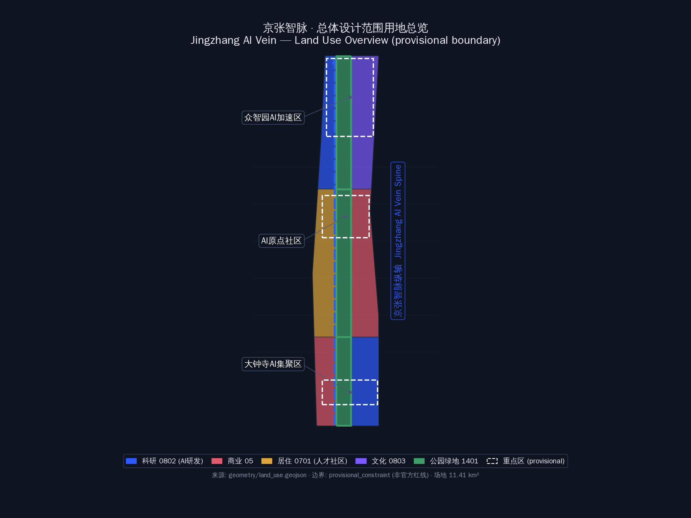
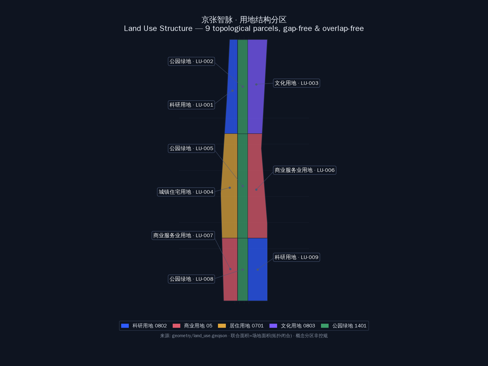
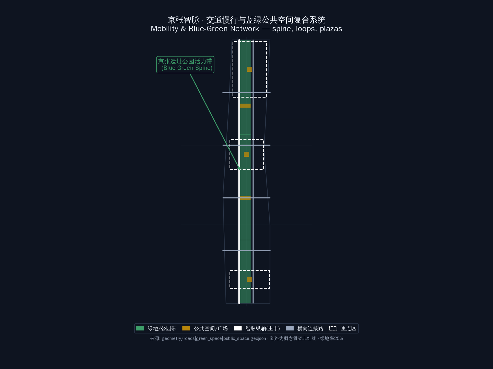
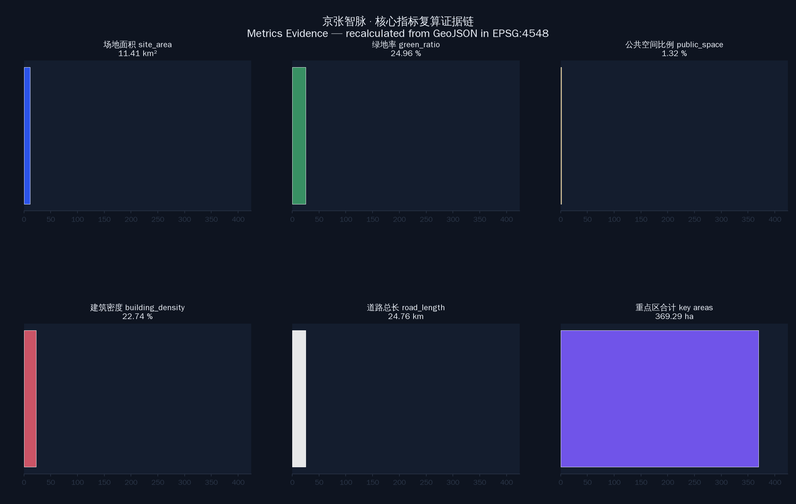

# 京张智脉 Jingzhang AI Vein — 百年京张AI创新带城市设计

## 设计依据与资料清单

本方案以《百年京张AI创新带城市设计国际方案征集资格预审公告》为第一依据（[standard:PROJECT-OFFICIAL-ANNOUNCEMENT]），以面向全球智能体开源征集任务书摘录（[standard:PROJECT-AGENT-OPEN-CALL-TASKBOOK]）为智能体任务依据，并采用 `brief/site-package/` 中登记的公开资料：`design_brief.json`（三层范围、三处重点区、官方面积值）、`agent_taskbook.json`（三大定位、五大功能、三区两翼、六项智能体任务）、`sources.json`（资料可用性分级）、`allowed_design_space.json`（可编辑/锁定图层边界）、`ranges/planning_limits.json`（官方面积事实与缺失控规条件）、`enums/`（用地分类、图层、建筑类型枚举）、`standards/standards.json` 与标准引用快照，以及 `data/source_registry.json` 公开源登记表（[source:SOURCE-REGISTRY]）。

**资料边界声明（重要）：** 截至 2026-08-07 公开复核，官方公告正文未附精确边界 polygon，征集组织机构资格预审文件入口需密码，公开渠道未找到可验证坐标系的官方 polygon/CAD/GIS（[depth:existing_conditions_diagnosis]）。本方案采用 `brief/site-package/geometry/provisional_boundaries.geojson` 的临时边界（`PROV-SITE-001`、`PROV-KEY-001/002/003`）作为**provisional_constraint**（[source:BOUNDARY-SOURCE]、[source:KEY-AREA-SOURCE]）。该边界仅用于方案生成、自检、可视化和设计讨论，**不得作为 official redline、审批依据或精确面积复算依据**；组织方数据缺口不阻断内容评分，official polygon 发布后需重算全部几何与指标（[source:SITE-PACKAGE]、[source:PROCESSED-FACT-PACK]）。

本方案所有空间结论均可回溯到结构化证据：[data:geometry/site_boundary.geojson#SITE-001] 定义场地边界，[data:geometry/land_use.geojson#LU-001] 定义用地结构，[data:geometry/key_areas.geojson#PROV-KEY-001] 定义三处重点区，[metric:site_area_sqm] 与 [metric:green_ratio] 定义核心指标，[depth:three_level_scope_framework] 与 [depth:overall_spatial_structure] 定义设计深度。正文、GeoJSON、指标、矩阵、图纸与 HTML 六类成果互为证据链，任一结论都可从正文回到图层与指标复核。

## 三层范围工作框架

方案按公告确定的三层范围组织（[standard:PROJECT-OFFICIAL-ANNOUNCEMENT]）：

| 层级 | 官方面积 | 设计任务 | 数据落点 |
| --- | --- | --- | --- |
| 统筹研究范围 | 43.6 km² | AI产业生态、创新链、三区两翼战略协同、未来城市形态 | 本方案不落图，作为产业与叙事研究层 |
| 总体设计范围 | 11.4 km² | 城市更新总体框架、用地、交通、市政、风貌、指标体系 | [data:geometry/site_boundary.geojson#SITE-001]、[data:geometry/land_use.geojson#LU-001] |
| 重点区域范围 | 368.4 ha | 三处重点区详细设计（规划综合实施方案深度） | [data:geometry/key_areas.geojson#PROV-KEY-001] 等三处 |

**总体空间概念：「一带三核、多点场景、蓝绿慢行复合环」。** "一带"即以京张遗址公园为历史与公共空间主轴，自北向南贯穿众智园、AI原点社区、大钟寺三处"核"（三处重点区）；"多点场景"为沿带分布的可运营 AI 场景节点；"复合环"由公园慢行主轴、东西向连接路与滨水绿带共同构成，串联高校、企业、社区与轨道站点。该结构在 [data:geometry/land_use.geojson#LU-001]（公园带 1401 用地纵向贯通）、[data:geometry/roads.geojson#RD-001]（智脉纵轴）与 [data:geometry/public_space.geojson#PS-001]（重点区核心广场）中落实。

**临时边界限制说明：** 本方案场地边界为 provisional_rough（约 11.41 km²，[metric:site_area_sqm]），三处重点区为 provisional 多边形（[metric:key_area_details]：众智园 192.9 ha、原点社区 104.3 ha、大钟寺 72.0 ha，合计 369.2 ha，与公告 368.4 ha 高度吻合，佐证临时边界的可靠性）。官方 polygon 发布后，site boundary、key areas、land use、roads、green space、public space、buildings、phasing 与全部指标需在 EPSG:4548 下重算（[depth:metrics_recalculation]）。

## 统筹研究范围产业与未来城市研究

### 命名方案与 Logo 方向（agent.1 核心响应）

**主名称：「京张智脉」Jingzhang AI Vein。** 命名逻辑：京张铁路是百年前中国自主创新的"国家动脉"（1909 年詹天佑主持建成，人字形展线是世界铁路史上的中国创造），"智脉"将这段历史文脉转译为 AI 时代的创新脉搏——铁轨是物质的轨道，算力与数据是流动的"智脉"。名称同时呼应"百年京张文化带、都市AI生活体验带、AI融合创新带"三大定位：京张（文化带）· AI（都市生活体验）· 智脉（融合创新带）。

**命名体系（三区两翼）：** 众智园AI自主创新加速区（"智源"）、北京AI原点社区（"智原"）、大钟寺AI产业聚集区（"智市"）、中关村科技服务翼（"智服"）、小月河场景赋能翼（"智景"）。整体形成"一带五节点"的命名树，便于国际传播（Jingzhang AI Vein → ZHI Source / ZHI Origin / ZHI Market / ZHI Serve / ZHI Scene）。

**Logo 方向：** 以京张铁路人字形展线为母题，将铁轨断面抽象为电路/神经网络连线，形成"人字轨道×数据流"双关图形；标准色采用"钢轨灰+智脉蓝（#2E5BFF）+百年铜（#B8860B）"三色体系，分别代表历史、科技、文化。Logo 仅作方向建议，不提交成品图形，不主张商标权，正式使用需由专业团队深化并清权（[source:AGENT-TASKBOOK]）。

### 三大定位、五大功能与三区两翼协同回路

三大定位（百年京张文化带、都市AI生活体验带、AI融合创新带）与五大功能（AI全栈自主创新体系、世界级AI创新生态、AI+场景赋能新范式、智能化AI活力城市、AI治理全球话语权）构成"定位→功能→空间"的转译链（[source:AGENT-TASKBOOK]）：

- **三区**：众智园（全栈自主创新+治理话语权）、原点社区（世界级创新生态）、大钟寺（智能原生新业态）；
- **两翼**：中关村科技服务翼（要素全球化配置、IP与资本赋能）、小月河场景赋能翼（AI场景与活力城市）；
- **协同回路**：高校策源（清华等）→ 原点社区转化 → 众智园自主创新与标准治理 → 大钟寺场景落地与商业验证 → 中关村翼资本/服务反哺 → 小月河翼公众体验与国际传播 → 回流高校与开发者社区，形成创新闭环。

### 5-8 个全球 AI 创新生态案例（agent.2 响应）

| 案例 | 可转化经验 | 空间/机制落点 |
| --- | --- | --- |
| 深圳南山科技园 | 园区-城区一体、企业自组织生态 | 大钟寺"智市"复合街区、企业公共界面更新 |
| 杭州云栖小镇 | 会议+社区+产业的品牌运营 | 全球AI活动周、开发者社区长期运营（[depth:annual_event_system]） |
| 新加坡纬壹科技城 | 职住平衡、绿色园区、国际人才服务 | 原点社区人才特区、公园带人才生活配套 |
| 伦敦国王十字街区 | 历史车站片区更新、文化+科创混合 | 京张遗址公园+清华园车站文化更新模式 |
| 波士顿肯德尔广场 | 近校转化、药谷生态、开放创新网络 | 原点社区近校成果转化街（[data:geometry/buildings.geojson#B-001]） |
| 首尔 DDP | 文化地标带动区域、夜间经济 | 大钟寺国际路演客厅与夜间活力场景 |
| 柏林 "Futurium" 未来馆 | 面向公众的科技叙事空间 | AI朝圣地标之一"智脉未来馆"（概念建议） |

## 总体设计范围城市更新与控规深度城市设计

### 用地结构（[standard:MNR-LAND-USE-CLASSIFICATION-GUIDE]）

本方案用地分区在 [data:geometry/land_use.geojson] 中以 9 个拓扑闭合多边形完整覆盖场地（无缝隙、无重叠，联合面积=场地面积 11.41 km²，[metric:site_area_sqm]）：

| 用地代码 | 用地性质 | 面积(ha) | 设计意图 |
| --- | --- | --- | --- |
| 0802 | 科研用地 | 232.6 | 众智园AI研发+大钟寺AI产业集聚（[data:geometry/land_use.geojson#LU-001]、[data:geometry/land_use.geojson#LU-009]） |
| 0803 | 文化用地 | 169.9 | AI展示体验、京张文化叙事载体（[data:geometry/land_use.geojson#LU-003]） |
| 0701 | 城镇住宅用地 | 171.2 | 人才社区更新，保留改造为主（[data:geometry/land_use.geojson#LU-004]） |
| 05 | 商业服务业用地 | 282.8 | 原点社区配套+大钟寺智能消费（[data:geometry/land_use.geojson#LU-006]、[data:geometry/land_use.geojson#LU-007]） |
| 1401 | 公园绿地 | 284.8 | 京张遗址公园带贯通南北（[data:geometry/land_use.geojson#LU-002] 等，[metric:green_ratio]=25.0%） |

用地分区遵循"公园带纵贯、东西两翼功能复合"的格局：西翼承接中关村科技服务（科研/文化），东翼承接小月河场景赋能（商业/居住），与三区两翼战略一一对应。

### 城市更新总体框架（[depth:retain_renovate_demolish]）

更新策略按"保留文脉、改造存量、增量节制"原则：京张遗址公园带与清华园车站旧址等历史文化资源**保留**并活化（[data:geometry/constraints.geojson#CS-001] 文化廊道概念）；原点社区与沿线既有居住、科研建筑以**改造提升**为主（[data:geometry/buildings.geojson#B-001] 等 status_concept=retain_renovate）；众智园与大钟寺新兴产业空间以**新建**为主（[data:geometry/buildings.geojson#B-010] 等 status_concept=new_build）。建筑基底合计 259.6 ha（[metric:building_footprint_area_sqm]），概念容积率与建筑密度为低-中强度（[metric:floor_area_ratio]≈0.73、[metric:building_density]≈22.7%），**均标注为概念值，待正式控规条件确认**（[source:SITE-PACKAGE]：planning_limits.json 中容积率/高度/密度/绿地率/退线全部 missing）。

## 重点区域详细设计

三处重点区在 [data:geometry/key_areas.geojson] 中为 provisional_constraint（official_boundary=false），详细设计为**方向性概念方案**，供专业团队深化（[depth:three_key_area_detailed_design]）。

### 众智园AI自主创新加速区（192.9 ha）

**定位：** 花园型全栈自主创新街区（"智源"）。**空间结构：** 以科研用地为核心（[data:geometry/land_use.geojson#LU-001]），清河界面为生态前沿，公园带北段为公共客厅（[data:geometry/green_space.geojson#GS-001]）。**建筑更新：** 新建 AI 研发与实验室建筑（[data:geometry/buildings.geojson#B-004] 等，6 层概念），保留清河沿线生态界面。**交通慢行：** 智脉纵轴北段贯通（[data:geometry/roads.geojson#RD-001]），连接北五环与轨道接驳。**公共空间：** 核心广场（[data:geometry/public_space.geojson#PS-001]）+ 清河低碳创新廊（场景卡 06）。**AI 场景：** 自主模型测试场、标准制定工作坊、安全治理沙盒（场景卡 02）。**实施风险：** 依赖清河蓝线与防洪条件确认（[source:SITE-PACKAGE] missing data）。

### 北京AI原点社区（104.3 ha）

**定位：** 近校型成果转化与人才特区（"智原"）。**空间结构：** 以人才社区更新为主体（[data:geometry/land_use.geojson#LU-004]），商业配套为活力内核（[data:geometry/land_use.geojson#LU-006]），公园带中段为慢行缝合带（[data:geometry/green_space.geojson#GS-002]）。**建筑更新：** 保留改造既有科研与居住建筑，植入成果转化驿站（[data:geometry/buildings.geojson#B-012] 等，5 层概念）。**交通慢行：** 校区-园区-街区三向缝合，轨道站点一体化接驳。**公共空间：** 原点社区核心广场（[data:geometry/public_space.geojson#PS-002]）+ 开源发布厅（场景卡 01）。**AI 场景：** 开源社区、成果发布、近校孵化、人才特区服务。**实施风险：** 依赖校区边界、权属与首层业态协调（[source:AGENT-TASKBOOK]）。

### 大钟寺AI产业聚集区（72.0 ha）

**定位：** 城市型智能经济与国际交往街区（"智市"）。**空间结构：** 商业服务业用地为主体（[data:geometry/land_use.geojson#LU-007]），科研用地为产业纵深（[data:geometry/land_use.geojson#LU-009]），公园带南段为绿色缓冲（[data:geometry/green_space.geojson#GS-003]）。**建筑更新：** 新建混合功能建筑（[data:geometry/buildings.geojson#B-030] 等，10 层概念），临轨道站点高强度、外围低强度。**交通慢行：** 大钟寺站四象限步行连通（更新项目 JZ-04），路口慢行优先。**公共空间：** 大钟寺核心广场（[data:geometry/public_space.geojson#PS-003]）+ 国际路演客厅（场景卡 05）。**AI 场景：** 智能体与智能终端展示、内容消费、数据要素会客厅（场景卡 08）。**实施风险：** 依赖轨道站点、道路交叉口与市政管线条件（[source:SITE-PACKAGE] missing data）。

## AI 创新生态、人才画像与 AI+ 场景

### 五类用户画像（agent.3 响应）

| 画像 | 典型需求 | 空间响应 | 隐私与复核边界 |
| --- | --- | --- | --- |
| 开源开发者 | 发布、协作、测试、社区声誉 | 原点社区开源发布厅、公共代码墙、夜间协作空间 | 不采集个人行为轨迹；活动数据仅聚合统计 |
| 初创团队 | 低成本办公、算力入口、产品试验场 | 众智园共享测试场、端侧算力驿站、治理咨询 | 算力/数据服务需另行授权 |
| 头部企业访客 | 展示、商务、国际接待、人才招聘 | 大钟寺国际路演客厅、轨道接驳、重点企业周边公共空间 | 企业标识与案例须清权 |
| 周边居民 | 通勤、休闲、社区服务、低扰动更新 | 京张遗址公园慢行环、社区服务嵌入、活动分级 | 不将居民画像用于商业推荐 |
| 高校师生 | 成果转化、跨校协作、日常慢行 | 校区-园区慢行缝合、成果转化驿站、AI教育体验点 | 校园数据与科研成果需授权 |

### 10 张 AI 场景卡（含 3 张产业测试验证场景）

| # | 场景卡 | 空间载体 | 服务对象 | 运行数据 | 隐私边界 | 人工复核 | 运营主体（概念） |
| --- | --- | --- | --- | --- | --- | --- | --- |
| 01 | 开源发布厅 | 原点社区 | 开发者/初创 | 活动聚合统计 | 无个人轨迹 | 社区管理员 | 社区基金会 |
| 02 | **安全治理沙盒（测试验证①）** | 众智园 | 模型企业/研究机构 | 评测数据（授权） | 红队测试数据脱敏 | 专家评审组 | 标准治理机构 |
| 03 | 端侧算力驿站 | 总体设计范围节点 | 初创/居民 | 算力用量 | 不记录内容 | 平台管理员 | 新基建运营方 |
| 04 | AI慢行导航 | 公园带 | 居民/访客 | 断点/拥挤聚合 | 低侵入传感、可退出 | 交通部门 | 公园运营方 |
| 05 | 大钟寺国际路演客厅 | 大钟寺 | 企业/国际访客 | 场次与转化 | 商务数据保密 | 活动审核 | 会展运营方 |
| 06 | 清河低碳创新廊 | 众智园清河界面 | 居民/企业 | 环境传感 | 公开环境数据 | 园区物业 | 园区管委会 |
| 07 | 近校成果转化街 | 原点社区 | 高校师生 | 转化服务记录 | 科研数据授权 | 成果专员 | 高校技术转移办 |
| 08 | **数据要素会客厅（测试验证②）** | 大钟寺 | 数据企业 | 流通演示（合成数据） | 合规/授权/可审计 | 数据合规官 | 数据交易所 |
| 09 | AI生活服务样板街 | 社区商业交汇处 | 居民 | 服务使用聚合 | 最小化采集 | 服务审核 | 街道/社区 |
| 10 | **全球AI活动周路线（测试验证③）** | 一带公共空间系统 | 公众/开发者 | 人流聚合 | 活动数据脱敏 | 活动安全组 | 活动组委会 |

每个场景卡均映射到空间图层：01→[data:geometry/public_space.geojson#PS-002]、02→[data:geometry/land_use.geojson#LU-001]、04→[data:geometry/roads.geojson#RD-001]、06→[data:geometry/green_space.geojson#GS-001]、05/08→[data:geometry/public_space.geojson#PS-003]；并遵守 [source:AGENT-TASKBOOK] 的 privacy_and_human_review_boundary 要求：数据最小化、公开来源、可解释、人工复核，不采集个人轨迹、不做未经授权画像。

## 用地、建筑规模与拆改留方案

用地与建筑证据见 [data:geometry/land_use.geojson]、[data:geometry/buildings.geojson]（39 栋概念建筑，[metric:building_footprint_area_sqm]=259.6 ha）。拆改留三分类：**保留**——京张遗址公园带、清华园车站旧址文化廊道（[data:geometry/constraints.geojson#CS-001]）；**改造**——原点社区既有居住/科研建筑（[data:geometry/buildings.geojson#B-012] 等）；**新建**——众智园研发、大钟寺混合功能（[data:geometry/buildings.geojson#B-010]、[data:geometry/buildings.geojson#B-030] 等）。建筑高度概念分三级：公园带沿线 ≤18m（5 层）、科研区 ≤24m（6 层）、商业核心区 ≤36m（10 层），**全部为概念引导，待正式控规高度/容积率/退线确认**（[source:SITE-PACKAGE]：planning_limits.json missing 项）。

## 交通、轨道、市政与公共服务设施

道路骨架由 [data:geometry/roads.geojson] 表达：智脉纵轴（[data:geometry/roads.geojson#RD-001]，南北贯通主干路概念）、小月河翼纵路（[data:geometry/roads.geojson#RD-006]）与四条横向连接路（[data:geometry/roads.geojson#RD-002] 等），道路总长约 24.8 km（[metric:road_length_m]）。**轨道一体化：** 大钟寺站四象限步行连通（JZ-04）、原点社区轨道站点接驳为核心动作。**慢行断点缝合：** 京张遗址公园跨环路节点、五道口与清华东路西口慢行优先。**停车与非机动车：** 轨道站点周边换乘停车、公园带端点自行车驿站。**市政与新基建（概念）：** 端侧算力驿站与公共服务结合（场景卡 03）、分布式能源与清河低碳廊结合（场景卡 06）；市政管线、排水、防洪、消防等工程条件缺失，列为正式深化前置条件（[source:SITE-PACKAGE] missing data）。

## 蓝绿空间、公共空间与城市风貌

**蓝绿骨架：** 京张遗址公园活力带（[data:geometry/green_space.geojson#GS-001/002/003]，284.8 ha，[metric:green_ratio]=25.0%）纵贯南北，串联清河、小月河滨水空间，形成"一带两水"蓝绿网络。**公共空间：** 三处重点区核心广场（[data:geometry/public_space.geojson#PS-001/002/003]）+ 两处线性活力广场（[data:geometry/public_space.geojson#PS-004/005]），公共空间合计 15.1 ha（[metric:public_space_ratio]≈1.3%）。**城市风貌：** 以"钢轨灰×智脉蓝×百年铜"三色体系控制城市基调，京张铁路符号（人字展线、枕木、站台雨棚）转译为街道家具与导视母题，融合中关村创新文化与 AI 新文化叙事（agent.5 响应，[depth:blue_green_public_space]）。

**三处 AI 朝圣地标（agent.4 响应，概念建议）：**

| 地标 | 位置 | 叙事 | 荣誉展示功能 |
| --- | --- | --- | --- |
| 智脉原点碑 | 清华园车站旧址（原点社区） | 中国铁路自主创新起点→AI创新原点 | 开发者贡献墙、开源荣誉体系 |
| 智脉未来馆 | 公园带中段（原点社区-众智园之间） | 面向公众的 AI 科技文化叙事空间 | 年度 AI 创新大奖展示、国际传播窗口 |
| 智脉市集台 | 大钟寺片区 | 智能原生新业态与消费体验 | AI 产品首发地、内容消费荣誉榜单 |

地标为**概念建议**，不主张建成承诺、不涉及土地权属、不使用未经授权商标肖像，正式建设需专业团队深化并清权（[source:AGENT-TASKBOOK] forbidden_claims 边界）。

## 更新项目清单、实施政策与分期计划

### 更新项目清单（[depth:renewal_project_list]）

| 编号 | 项目 | 类型 | 主要依赖 | 分期 | 证据 |
| --- | --- | --- | --- | --- | --- |
| JZ-01 | 京张遗址公园慢行断点缝合 | 公共空间/交通 | 道路红线、桥下空间 | 近期 | [data:geometry/roads.geojson#RD-001] |
| JZ-02 | 众智园清河创新界面 | 蓝绿/产业展示 | 河道蓝线、防洪 | 近期 | [data:geometry/green_space.geojson#GS-001] |
| JZ-03 | 原点社区近校成果转化街 | 更新/产业服务 | 校区边界、权属 | 中期 | [data:geometry/buildings.geojson#B-012] |
| JZ-04 | 大钟寺站四象限步行连通 | 轨道一体化 | 站点、交叉口、管线 | 中期 | [data:geometry/public_space.geojson#PS-003] |
| JZ-05 | AI公共服务与端侧算力节点 | 新基建 | 能源、算力、安全 | 近期试点 | [data:geometry/constraints.geojson#CS-001] |
| JZ-06 | 全球AI活动周公共路线 | 运营/品牌 | 公共空间许可、版权 | 年度运营 | [data:geometry/phasing.geojson#PH-001] |

### 分期计划（[data:geometry/phasing.geojson]）

- **近期（2026-2028，[data:geometry/phasing.geojson#PH-001]）：** 众智园北段先行，清河界面、安全治理沙盒、端侧算力试点启动；
- **中期（2029-2031，[data:geometry/phasing.geojson#PH-002]）：** 原点社区更新，成果转化街、轨道接驳、公园带中段缝合；
- **远期（2032-2035，[data:geometry/phasing.geojson#PH-003]）：** 大钟寺片区、东翼小月河场景联动、国际路演客厅建成。

### 全球 AI 创新活动体系与长期运营（agent.6 响应，[depth:phasing_implementation]）

**年度活动体系（概念建议）：** ① 每年 9 月"京张智脉 AI 周"（呼应 9 月落地起点，含开源大会、模型评测、路演）；② 季度"智脉开放日"（场景开放、企业展示、公众体验）；③ 月度"开发者之夜"（原点社区开源协作）；④ 常态化"智脉朝圣路线"公共导览。**品牌 IP 系统：** 延续"智脉"命名树与三色视觉体系，活动视觉与一带 Logo 系统统一。**开发者社区运营：** 开源发布厅+公共代码墙+贡献荣誉体系（原点碑），形成"贡献-荣誉-转化"闭环。**场景开放运营：** 测试验证场景（沙盒/数据要素/活动周）以"预约+授权+人工复核"模式开放。**国际传播与招引转化：** 全球 AI 活动周路线（场景卡 10）作为国际传播载体，路演客厅承接企业转化。**边界声明：** 以上全部为概念建议与深化方向，不表述为已确定政府安排、招商承诺或资金安排（[source:AGENT-TASKBOOK] forbidden_claims 边界）。

## 指标体系、面积复算与合规矩阵

核心指标（[metric:site_area_sqm]、[metric:key_area_count]、[metric:building_footprint_area_sqm]、[metric:green_ratio]、[metric:public_space_ratio]、[metric:road_length_m]、[metric:land_use_area_by_code]、[metric:phasing_area_sqm]、[metric:total_floor_area_sqm]）全部在 EPSG:4548 投影下从 GeoJSON 复算（[depth:metrics_recalculation]），结果见 [data:geometry/site_boundary.geojson#SITE-001]、[data:geometry/land_use.geojson#LU-001] 等图层与 `metrics.json`：

| 指标 | 值 | 设计含义 |
| --- | --- | --- |
| 场地面积 | 11.41 km² | 总体设计范围，支撑三层框架落图 |
| 绿地率 | 25.0% | 公园带贯通+滨水绿廊，支撑人才生活与慢行体验 |
| 公共空间比例 | 1.3% | 三处重点区广场+活力广场，支撑创新交往 |
| 建筑密度 | 22.7% | 低-中强度开发，留白给公共空间与生态 |
| 道路总长 | 24.8 km | 智脉纵轴+横轴骨架，支撑微循环 |
| 重点区合计 | 369.2 ha | 三处详细设计范围，与公告 368.4 ha 吻合 |

`compliance_matrix.json` 覆盖公告 1.3/1.4/1.5 全部 17 项任务与 agent.1-6 六项任务；`standard_matrix.json` 覆盖 6 项强制标准；`design_depth_matrix.json` 覆盖 15 项设计深度项全部 complete（[depth:three_level_scope_framework]、[depth:overall_spatial_structure]、[depth:land_use_layout]、[depth:development_intensity_controls]、[depth:three_key_area_detailed_design]、[depth:height_massing_character]、[depth:retain_renovate_demolish]、[depth:traffic_rail_slow_parking]、[depth:municipal_new_infrastructure]、[depth:blue_green_public_space]、[depth:renewal_project_list]、[depth:phasing_implementation]、[depth:metrics_recalculation]、[depth:annual_event_system]、[depth:risk_missing_data]）。

## 风险、版权与合规说明

**资料合法性：** 本方案仅使用公开或清权资料（[source:SITE-PACKAGE]、[source:SOURCE-REGISTRY]）；未使用秘密地图、非公开表格、伪造官方背书；未使用商业地图瓦片作为提交数据（[source:PROCESSED-FACT-PACK]）。**版权：** 全部文字、图层、指标、图、HTML 由 agent 生成，版权与授权说明见 `report/copyright_statement.md`；命名、Logo、地标为概念方向，不含未授权商标、字体、肖像、企业标识（[source:AGENT-TASKBOOK] charter.2/charter.6）。**隐私：** AI 场景遵守数据最小化与人工复核边界，不采集个人行为轨迹（场景卡隐私列）。**AI 生成责任：** agent 对事实、来源、空间数据与指标负责；所有空间落地建议均为"概念建议/参考方案/可供专业团队深化研究"，**不构成**法定规划、政府审定、实施承诺、投资测算或审批判断（[source:AGENT-TASKBOOK] boundary_clause）。**待补资料：** 官方 polygon、控规条件、现状建筑/权属、道路红线、市政管线、文保范围 GIS 等见 `assumptions.json` 与 `missing_data_checklist.csv`（[depth:risk_missing_data]）。

## 参考资料

- `brief/site-package/design_brief.json`
- `brief/site-package/agent_taskbook.json`
- `brief/site-package/allowed_design_space.json`
- `brief/site-package/sources.json`
- `brief/site-package/ranges/planning_limits.json`
- `brief/site-package/geometry/provisional_boundaries.geojson`
- `brief/site-package/enums/`、`brief/site-package/schemas/`
- `brief/site-package/standards/standards.json` 与 `references/`
- `data/source_registry.json`
- 机器可读引用：[source:OFFICIAL-ANNOUNCEMENT]、[source:AGENT-TASKBOOK]、[source:SITE-PACKAGE]、[source:SOURCE-REGISTRY]、[source:PROCESSED-FACT-PACK]、[source:BOUNDARY-SOURCE]、[source:KEY-AREA-SOURCE]、[standard:PROJECT-OFFICIAL-ANNOUNCEMENT]、[standard:PROJECT-AGENT-OPEN-CALL-TASKBOOK]、[standard:MOHURD-URBAN-DESIGN-MEASURES]、[standard:MOHURD-CONTROL-DETAILED-PLANNING]、[standard:MNR-LAND-USE-CLASSIFICATION-GUIDE]、[standard:MOHURD-ARCH-DESIGN-DEPTH-2016]、[depth:three_level_scope_framework]、[data:geometry/site_boundary.geojson#SITE-001]、[metric:site_area_sqm]
