<!-- COMPLETE-TRANSLATION: aligned with proposal.md and the official terminology glossary. -->

# JING-ZHANG INTELLIGENCE VEIN | THE COMMONS LINE

## Design Basis and Source List

### Defining the Design Boundary with Evidence | A Trustworthy Data Base

This proposal responds to the Centennial Jing-Zhang AI Innovation Belt Open Call for Urban Design. Its deliverables are structured around the official announcement, the Agent Taskbook, the repository Source Registry, and applicable professional standards. [source:OFFICIAL-ANNOUNCEMENT] [source:AGENT-TASKBOOK] [source:SITE-PACKAGE] [source:SOURCE-REGISTRY] [source:PROCESSED-FACT-PACK] Missing information is not converted into false precision: the Overall Design Area and three key areas currently use repository-maintained provisional rough geometry solely for design framing, intake validation, and public discussion. They are not an Official Planning Boundary, Regulatory Detailed Planning boundary, or engineering basis. [source:BOUNDARY-SOURCE] [source:KEY-AREA-SOURCE]

At this stage, the confirmed planning inputs are the tasks, approximate scope values, names of the three key areas, professional deliverable requirements, and permitted uses of data. Still missing are official polygons, existing-building and ownership data, statutory controls, municipal utility lines, transport surveys, heritage assessments, and confirmed implementation entities. The proposal therefore distinguishes two layers of conclusion: robust spatial-organization and governance methods; and area, Development Intensity, Demolish-Renovate-Retain Strategy, and engineering alignments that must be recalibrated when formal information becomes available. [standard:PROJECT-OFFICIAL-ANNOUNCEMENT] [standard:PROJECT-AGENT-OPEN-CALL-TASKBOOK]

The existing-conditions diagnosis is not a substitute survey. It comprises four planning hypotheses inferred from the brief and awaiting field verification: universities, research institutes, and enterprises are strong, but innovation is not sufficiently visible or accessible in public space; the heritage corridor has continuity potential, but east-west links may be weakened by linear infrastructure and superblocks; experimentation is fast, while public explanation, Human Review, and exit mechanisms often lag; and Zhongzhiyuan, AI Origin, and Dazhongsi each have distinctive strengths but require explicit roles and a shared operating protocol. These hypotheses are to be tested through fieldwork, transport surveys, ownership checks, and operator interviews. [depth:existing_conditions_diagnosis]

Boundary evidence is recorded in [data:geometry/site_boundary.geojson#SITE-001] and [data:geometry/key_areas.geojson#PROV-KEY-001]; the provisional total area is recalculated as [metric:site_area_sqm]. The first action in formal deepening is not another rendering, but replacement with official boundaries followed by synchronized recalculation of all layers and metrics.

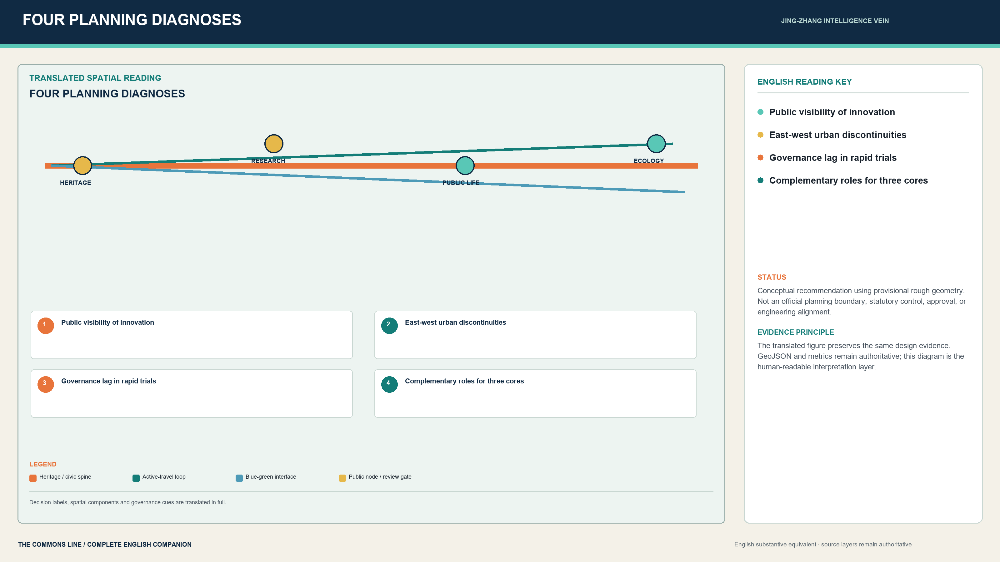

## Haidian Humanistic Development and a Better Living Environment

### Returning Innovation to Everyday Life | From Technology Hub to Livable District

The value of Jing-Zhang is greater than a railway relic or an AI showcase strip. It connects modern independent engineering, universities and institutes, Zhongguancun's innovation culture, established communities, and future public governance. Beijing public sources call for the north-south extension of the Jing-Zhang Railway Heritage Park, east-west urban stitching, minimal intervention, and all-age services. Haidian's 14th Five-Year Plan emphasizes balanced public services, integration of culture and technology, support for young and international talent, ecological livability, and whole-process participation. [source:BJ-JINGZHANG-PARK-OPEN] [source:BJ-JINGZHANG-COCREATION] [source:HD-14TH-FIVE-YEAR] [source:BJ-JINGZHANG-PHASE2]

The proposition is therefore condensed into “Jing-Zhang Intelligence Vein | THE COMMONS LINE”: **an AI innovation urban commons built on a century-old railway heritage corridor.** “Retain the Rail, Open the Source, Stitch the City, Nurture Water, Co-govern” are not slogans; they are five spatial actions spanning heritage, ground floors, Walking and Cycling Networks, Blue-Green Space, and operations. The commons makes science visible on the street, lets railway memory continue in daily life, gives children and older people equal spatial dignity, supports affordable life for researchers and service workers, treats ecological resilience as public-health infrastructure, and permits AI to serve people only when it is explainable and withdrawable.

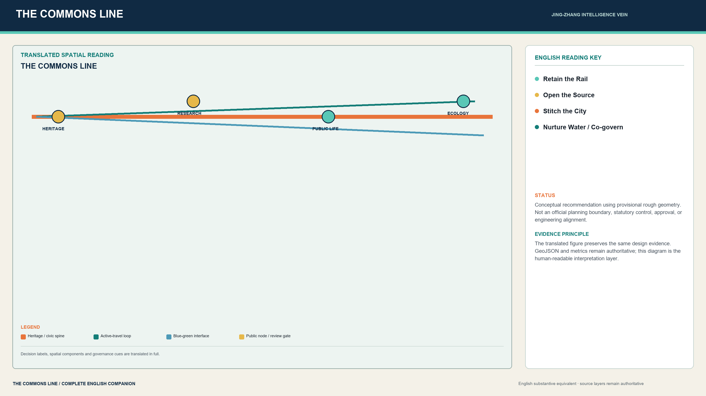

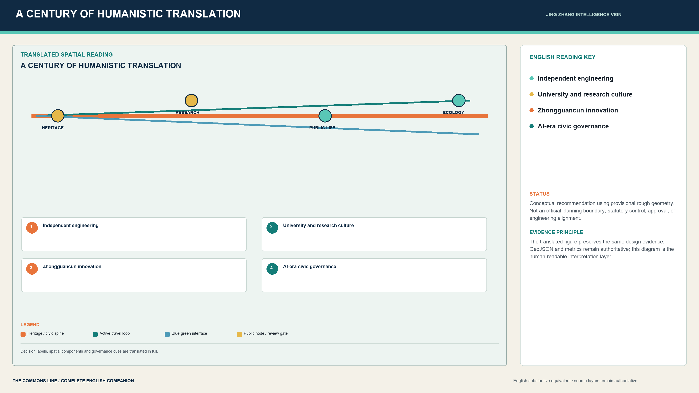

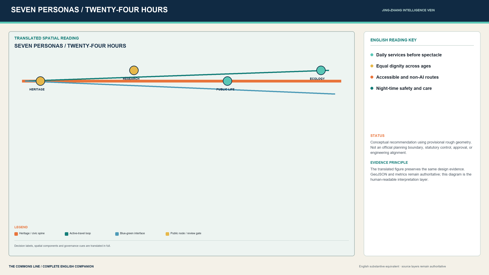

## Three-Level Scope Framework

### From Regional Coordination to Neighborhood-Making | Three-Level Spatial Translation

The proposal establishes a three-level chain: regional ecosystem, overall structure, and key-area design. The 43.6 km² Coordinated Research Area asks how innovation resources collaborate, how Jing-Zhang culture becomes a regional identity, and how global events operate over time. The approximately 11.4 km² Overall Design Area asks how industry, daily life, mobility, Blue-Green Space, and public services form a continuous district. The approximately 368.4 ha Key-Area Detailed Design Area asks how three distinctive urban types support validation, translation, and application. [depth:three_level_scope_framework]

The aim is not an “AI landscape belt” for spectators. It is publicly legible innovation-city infrastructure: research can be seen, testing can be reviewed, results can be translated, and applications can be questioned or withdrawn. Four objectives follow. Industry forms a research-validation-open-source-translation-application loop; space stitches both sides of the heritage park through a continuous Walking and Cycling Network; public value guarantees non-AI equivalent services, accessibility, and Human Review; and implementation begins with reversible pilots that expand only on evidence.

The structure is “one civic spine, two chains, three cores, six gardens, one hundred daily lives.” The spine carries railway memory, continuous active travel, and ecological resilience. The two chains are open knowledge and all-age living. The cores are the Zhongzhiyuan trustworthy-validation core, AI Origin knowledge-translation core, and Dazhongsi public-application core. The six gardens are railway memory, scientific discovery, youth co-creation, community care, stormwater habitat, and station-city reception. Two loops, five bridges, and eight program segments remain network and zoning tools, but success is measured by everyday use rather than landmark count. [depth:overall_spatial_structure]

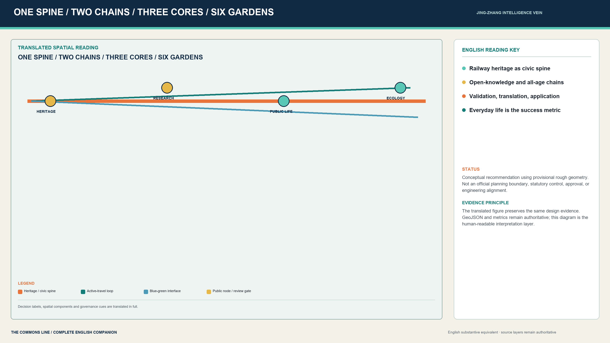

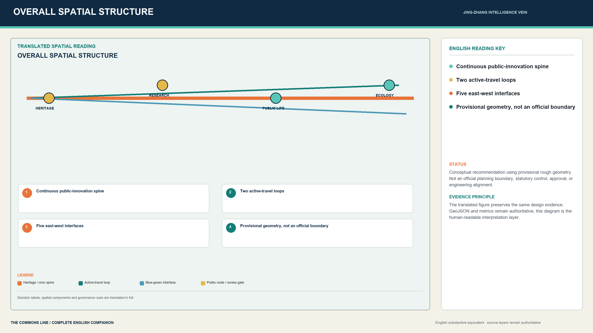

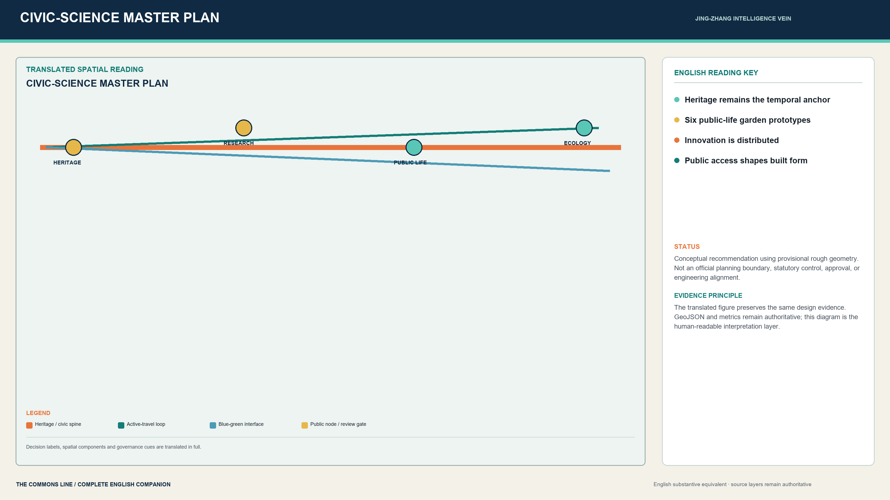

| Level | Core Judgment | Principal Deliverables | Required Calibration |
| --- | --- | --- | --- |
| Coordinated research | The belt must be a regional innovation network rather than a single corridor | Industry and talent ecosystem, cultural narrative, annual program | Institution list, industry data, operators |
| Overall design | The heritage park becomes the spine; continuity and east-west stitching come first | One spine and three cores, two loops and five bridges, eight segments and distributed nodes | Official boundaries, transport, municipal systems, RDP |
| Key areas | Each of the three areas adopts a different urban type | Innovation campus, knowledge district, transit-oriented application district | Ownership, existing buildings, DRR, engineering conditions |

### Translating Six Tasks into One Spatial System | Taskbook Response

The six Agent Taskbook requirements are not six disconnected drawings. They form a public-value cycle: identity, innovation ecosystem, scenario validation, public space, cultural communication, and long-term operation. The concept explains why the belt exists; ecosystem and talent mechanisms determine who collaborates; scenario cards define how technology is tested; public space determines how people encounter and challenge it; cultural narrative carries history into the present; and annual operations keep space evolving. Remove any link and the proposal becomes a temporary exhibition or ordinary business park. [source:AGENT-TASKBOOK]

The quantified response comprises six international AI-ecosystem cases, 12 scenario cards including four Testing and Validation Scenarios, seven personas, four public-service pilgrimage landmarks, and a long-term program of Global Mutual-Learning Week, Open Validation Days, community co-learning, and an annual transparency report. [metric:global_case_count] [metric:scenario_card_count] [metric:test_scenario_count] [metric:persona_count] [metric:landmark_count] These counts are not performance commitments; they are the minimum structure ensuring complete spatial and operational translation of the Taskbook.

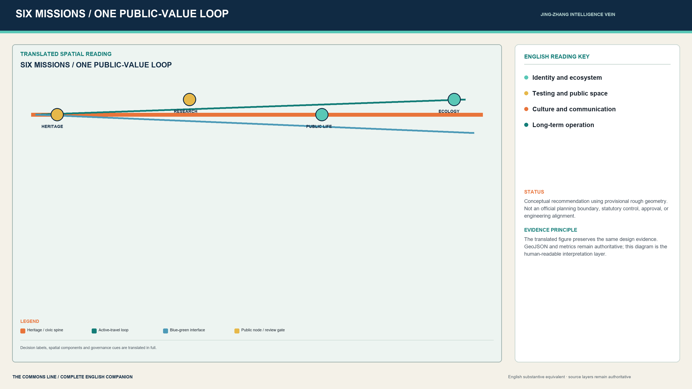

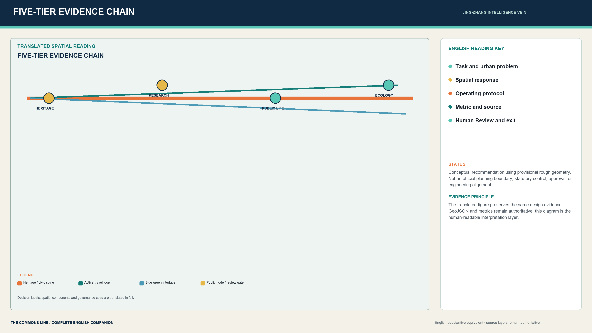

## Coordinated Research Area: Industry and Future City Research

### Anchoring a World-Class Innovation Corridor | Regional Coordination and Industrial Ecosystem

The regional ecosystem follows six linked functions: knowledge origination, trustworthy validation, open-source collaboration, enterprise translation, public application, and international communication. Universities and institutes originate knowledge; Zhongzhiyuan hosts technology, safety, and green-computing validation; AI Origin supports open-source work, incubation, and releases; Dazhongsi hosts public-facing urban applications and commercial validation; the Jing-Zhang civic spine provides continuous display, exchange, and public learning; and the annual Global Mutual-Learning Week is the international window. Spatial value is measured not by maximum office floor area, but by walkable connections, shared resources, and public visibility across the chain. [source:AGENT-TASKBOOK]

Six international cases provide mechanisms rather than forms to copy. Stanford HAI demonstrates interdisciplinary research with public-policy education; Mila shows that industry partnerships need rigorous experimental protocols; Vector and AI Singapore connect talent training to real projects; AI Verify introduces structured testing and assurance before deployment; and Testbed Helsinki begins urban experimentation with real needs and publicly reports lessons. [source:CASE-STANFORD-HAI] [source:CASE-MILA] [source:CASE-VECTOR] [source:CASE-AI-SINGAPORE] [source:CASE-AI-VERIFY] [source:CASE-HELSINKI]

These lessons become four spatial prototypes: a shared laboratory foyer for research, an open-source workshop and demonstration street for translation, an urban trial ground for public use, and a Human Review and appeal desk for governance. They are distributed across eight program segments and 12 conceptual carriers, not concentrated in one iconic building. [data:geometry/land_use.geojson#LU-001] [data:geometry/buildings.geojson#BLDG-001] [metric:land_use_zone_count] [metric:building_carrier_count]

The brand “Jing-Zhang Intelligence Vein | THE COMMONS LINE” translates the railway's historic role of connecting cities into an AI-era mission of connecting innovation with the public. Railway sleepers overlaid by an open network form the identity motif; mint denotes open validation, yellow knowledge translation, and orange urban application. The identity serves wayfinding and events without replacing heritage fabric or using corporate marks and portraits. [standard:MOHURD-URBAN-DESIGN-MEASURES]

## Overall Design Area: Urban Renewal and Regulatory-Plan-Level Urban Design

### Stitching Both Sides of the Railway | Overall Renewal and Spatial Reconstruction

Five layers are superimposed. First, the ecological and heritage base protects the Qinghe River and railway setting with a continuous Blue-Green buffer. Second, a public-space armature creates one public-innovation spine, three key-area civic rooms, and distributed open spaces. Third, transport stitching establishes two Walking and Cycling Network loops, five east-west interfaces, and rail-station links. Fourth, eight continuous program segments combine ecology, R&D, education, translation, community, culture, application, and talent living. Fifth, governance requires each scenario to pass data declaration, Human Review, public feedback, and exit evaluation. [depth:land_use_layout]

The eight segments are not statutory land-use amendments. They are spatial recommendations for how the innovation chain can enter the city. Conceptual areas for seven land-use codes are produced from one provisional boundary with shared cut lines and correspond to [metric:land_use_1401_area_sqm], [metric:land_use_0802_area_sqm], [metric:land_use_0804_area_sqm], [metric:land_use_0702_area_sqm], [metric:land_use_0803_area_sqm], [metric:land_use_05_area_sqm], and [metric:land_use_0701_area_sqm]. They guarantee completeness, seam-free topology, and reproducibility, but cannot support development permission. [standard:MNR-LAND-USE-CLASSIFICATION-GUIDE]

Urban design control uses five principles: frontage, ground floor, scale, connectivity, and openness. The heritage park edge is continuous but not over-unified; key-node ground floors prioritize shared halls, services, exhibitions, and light food; large volumes use courts, passages, and through-routes to reduce superblock enclosure; east-west interfaces take precedence over isolated icons; and every AI experience provides a legible entrance, staffed service, and exit route. FAR, Building Height, Building Coverage Ratio, setbacks, and road lines remain unknown pending official RDP and specialist assessment. [depth:development_intensity_controls] [depth:height_massing_character] [standard:MOHURD-CONTROL-DETAILED-PLANNING]

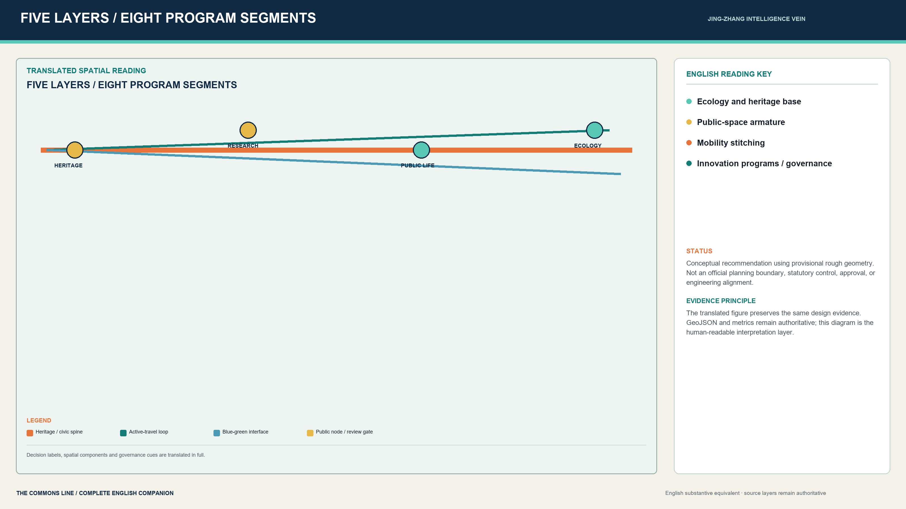

## Detailed Design of Key Areas

### Three Differentiated Cores, One Collaborative System | Complementary Innovation-City Prototypes

The three key areas are complementary urban types, not copies of one model. [data:geometry/key_areas.geojson#PROV-KEY-001] [data:geometry/key_areas.geojson#PROV-KEY-002] [data:geometry/key_areas.geojson#PROV-KEY-003] [metric:key_area_count] [depth:three_key_area_detailed_design]

| Key Area | Urban Type and Role | Spatial Structure | Critical Public Space | Near-Term Project and Delivery Gate |
| --- | --- | --- | --- | --- |
| Zhongzhiyuan AI Independent Innovation Acceleration Area | **Open innovation campus / validation core:** teach machines to accept scrutiny | Qinghe ecological edge - validation courts - standards workshops - public observation gallery | Ecological learning wetland, validation foyer, green-computing display court | Begin with Open Validation Days and a reversible foyer; verify river, heritage, ownership, fire, and transport conditions before construction |
| Beijing AI Origin Community | **Compact knowledge district / translation core:** bring research into the city | Campus interface - open-source street - translation courts - community living room | Open-source workshop, release hall, talent-service lane, community co-learning room | Begin with shared space and walking interfaces; assess building value, ownership, and operator before renewal |
| Dazhongsi AI Industry Cluster | **Transit-oriented application district / application core:** enable safe civic adoption | Station gateway - four-quadrant walking grid - urban application street - international living room | Station commons, application trial ground, co-creation street, international event room | Begin with wayfinding, events, and crossing diagnosis; require rail, transport, fire, and engineering studies before grade-separated links |

Zhongzhiyuan follows “experiment inside, explain at the front, ecology at the edge,” making safety validation and standards work publicly legible rather than creating a closed R&D island. AI Origin follows “research leaves the campus, translation enters the street, daily life fills the gaps,” linking open-source work, incubation, housing, and community services in a walkable mixed-use district. Dazhongsi follows “station-city integration, four-quadrant stitching, withdrawable application,” solving pedestrian continuity and public service before adding terminals, content consumption, or international events.

All three apply a public-value baseline: at least one all-weather staffed service point, one continuous accessible route, one non-AI equivalent service, and one scenario space able to publish lessons. Their geometry is currently provisional rough. Announcement area values cannot be reverse-engineered into parcel boundaries, road lines, or development capacities.

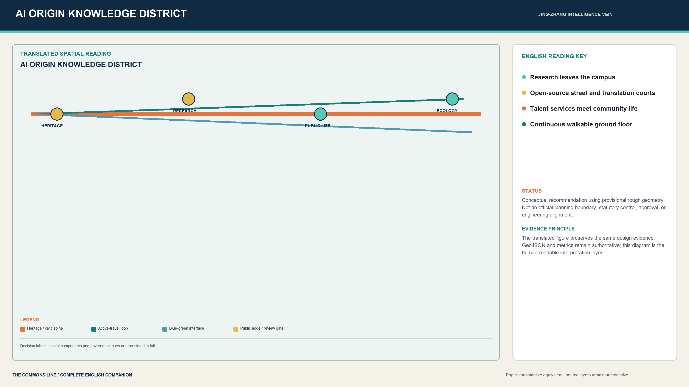

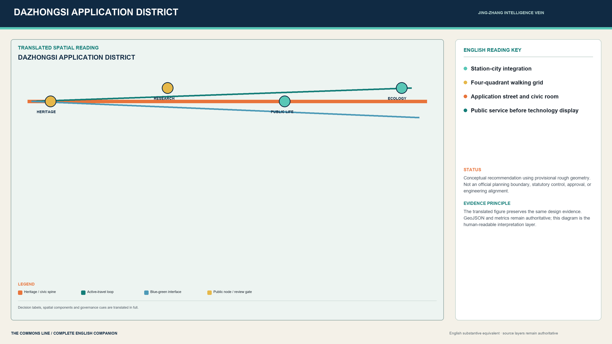

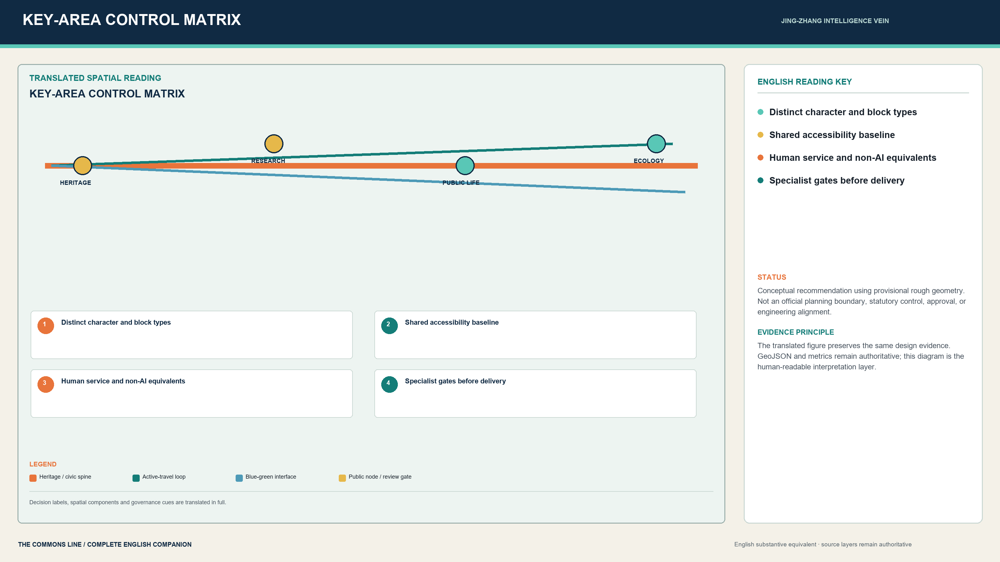

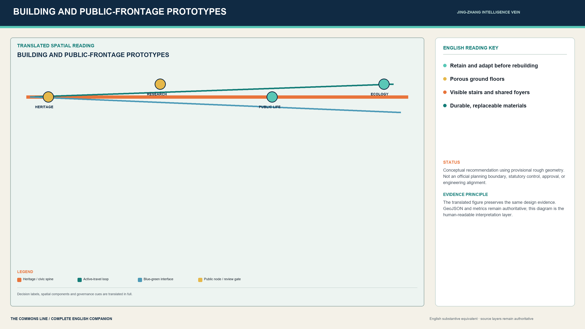

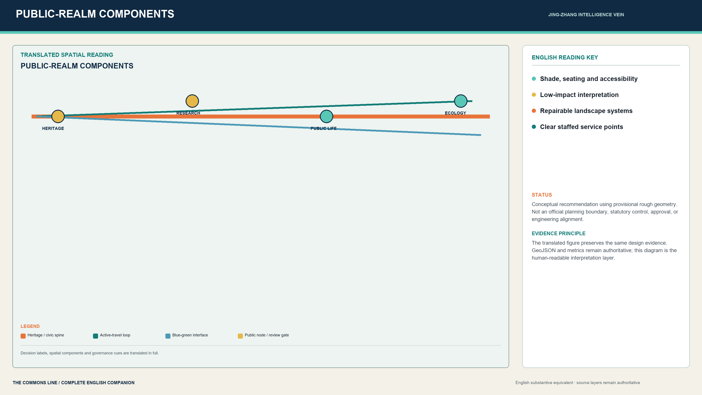

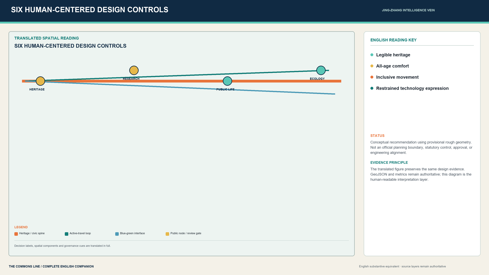

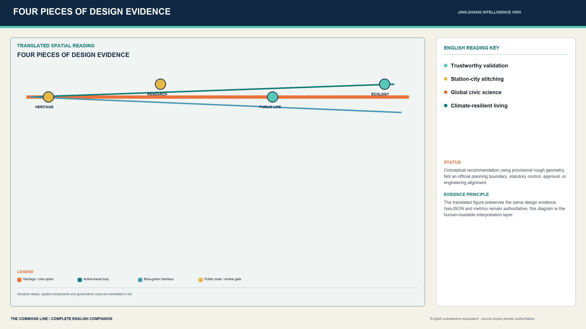

## AI Innovation Ecosystem, Personas, and AI+ Scenarios

### From Technology Cluster to Innovation Commons | People and Scenarios in Symbiosis

Scenario planning uses six fields: urban problem, user, spatial carrier, minimum data, human takeover, and exit condition. AI is not a separate display layer, but a governed operating mechanism within public space and urban services. The seven core personas are developers, start-up teams, university staff and students, residents, older people and carers, people with disabilities, and international visitors. [metric:persona_count]

| No. | Scenario | Area and Carrier | Primary Users | Data and Human Boundary |
| --- | --- | --- | --- | --- |
| 01 | Public model red-teaming class (TVS) | Zhongzhiyuan validation foyer | Developers, public | Authorized test set only; expert takeover and public limitations |
| 02 | Synthetic-data bias clinic (TVS) | Zhongzhiyuan standards workshop | Firms, universities | No real personal data; Human Review signs the retrospective |
| 03 | Edge-device energy challenge (TVS) | Zhongzhiyuan green-computing court | Firms, students | Aggregated device data; engineer verification |
| 04 | Shared-path robot sandbox (TVS) | Zhongzhiyuan low-speed loop | Residents, people with disabilities | Small area, low speed, staffed and immediately stoppable |
| 05 | Open-source release and dependency clinic | AI Origin open-source street | Developers, start-ups | Public repositories and version records; maintainer review |
| 06 | University-enterprise problem matching | AI Origin translation courts | Students, faculty, firms | Minimum need disclosure; human project-manager matching |
| 07 | Start-up compliance rehearsal | AI Origin service lane | Start-ups | Navigation only; no replacement for legal or policy advice |
| 08 | Community service rehearsal | AI Origin community living room | Residents, carers | Minimal authorization; staffed counter retained |
| 09 | Co-testing accessible routes | Dazhongsi station-city interface | People with disabilities, visitors | Crowdsourced issues need field verification; no automatic engineering conclusion |
| 10 | Evidence-based Jing-Zhang memory walk | Heritage-park spine | Residents, visitors | Public historical sources only; expert editorial review |
| 11 | AI content preview and appeal | Dazhongsi application street | Consumers, creators | Generated content disclosed; appeal and removal process |
| 12 | Global Mutual-Learning Week | Public spaces along the line | International visitors, communities | Public event data; human hosts and multilingual service |

Four of the 12 cards are Testing and Validation Scenarios; the remainder cover industry services, public services, culture, and international events. [metric:scenario_card_count] [metric:test_scenario_count] Spatial locations correspond to public space [data:geometry/public_space.geojson#PUBLIC-001], active travel [data:geometry/roads.geojson#ROAD-001], and conceptual program carriers [data:geometry/buildings.geojson#BLDG-001]. Every scenario follows “explain first, trial second, enable appeal, permit exit,” with periodic decisions to expand, reduce, or terminate.

## Land Use, Building Scale, and Retain-Renovate-Demolish Strategy

### Mixed Use for All-Day Vitality | Intensity and Renewal Strategy

Eight continuous program segments express functional mix and spatial rhythm. [data:geometry/land_use.geojson#LU-001] The current provisional Overall Design Area recalculates to about 11.41 km². Approximately 109,300 m² of conceptual building footprint across 12 carriers indicates functional distribution rather than real buildings. [metric:building_footprint_area_sqm] [metric:building_carrier_count]

Instead of parcel-by-parcel conclusions under insufficient evidence, DRR follows a four-step auditable method. [depth:retain_renovate_demolish] First, inventory building age, ownership, structure, utilization, heritage value, and ground-floor public value. Second, prioritize retaining railway heritage, culturally valuable buildings, and well-used stock. Third, adapt structurally viable but underused industrial, office, and support buildings into shared laboratories, open-source collaboration, and public services. Fourth, consider demolition and rebuilding only with sufficient safety, functional, public-interest, and approval evidence.

Three massing prototypes are proposed. Zhongzhiyuan uses low-rise courts and an ecological edge at campus scale; AI Origin uses continuous street walls, open ground floors, and small blocks at knowledge-district scale; Dazhongsi uses a transit gateway, mixed podiums, and layered public space at metropolitan-node scale. All use ground-floor passages, pocket plazas, and visible stairs to improve publicness. Specific height, FAR, BCR, and floor area await RDP and existing-condition data. [standard:MOHURD-ARCH-DESIGN-DEPTH-2016]

The conceptual building layer [data:geometry/buildings.geojson#BLDG-001] tests program distribution, public-space relationships, and the Evidence Chain; it is not a development-application master plan. Formal deepening should follow “retain first, adapt first, reversible insertion first,” supported by structural, fire, energy, heritage, and economic studies.

## Transport, Rail, Municipal Infrastructure, and Public Services

### Active Travel First, Resilience as Support | Infrastructure as Public Space

The transport hierarchy is “rail first, active network, east-west stitching, reachable services.” [depth:traffic_rail_slow_parking] It comprises station walking catchments and interchange at locations such as Dazhongsi; a continuous walking-cycling spine along the heritage park; loops connecting communities and campuses on both sides; five east-west interfaces requiring field verification; and a logistics, emergency, and operations loop. Total conceptual network length is [metric:conceptual_mobility_length_m]. It represents relationships, not road, bridge, or tunnel engineering alignments.

Deepening proceeds through discontinuity diagnosis, temporary trials, specialist study, and engineering delivery. Early work surveys accessible continuity, crossing wait times, bicycle parking, station wayfinding, and night lighting. No new lane, bridge, or underpass is promised without models and official boundaries. Relations in [data:geometry/roads.geojson#ROAD-001] are all marked design proposal.

Municipal and New Infrastructure follow “shared, low-carbon, maintainable.” [depth:municipal_new_infrastructure] Key areas reserve conceptual interfaces for public charging, edge computing, equipment maintenance, stormwater monitoring, and emergency communications. Computing displays must disclose energy use and maintenance accountability. Sensors minimize collection, process at the edge, and define retention periods. Capacities and engineering locations remain undetermined until utility, power, drainage, fire, and waste data are available.

Public services are foundations of talent attraction and equity, not ancillary facilities. Three civic rooms provide validation explanation, translation services, and application appeals. Along the line are childcare consultation, health navigation, legal and talent services, accessible rest, and public toilets. Every AI service retains a human and non-AI route.

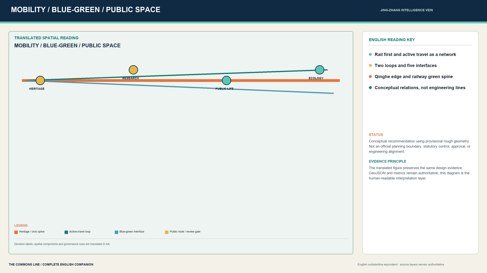

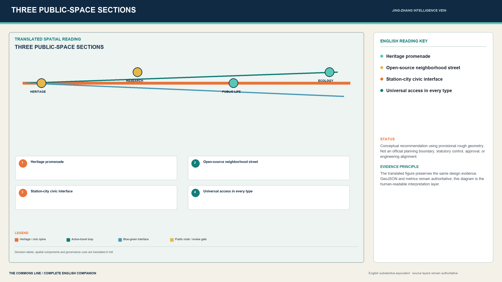

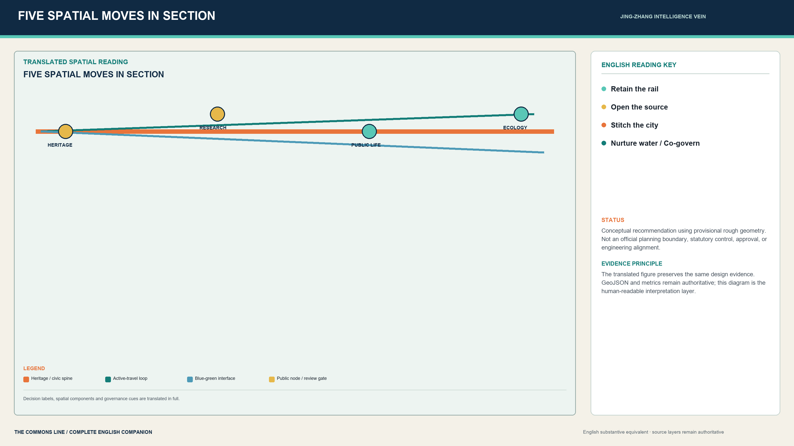

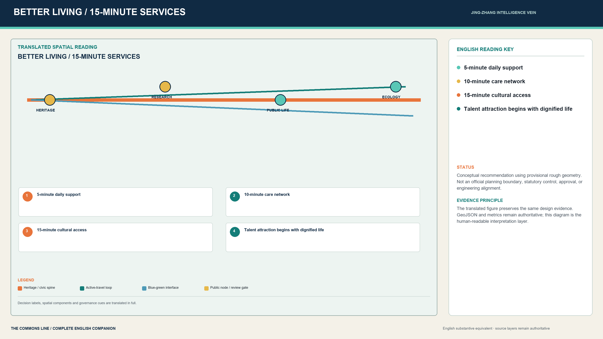

## Blue-Green Network, Public Space, and Urban Character

### The Heritage Park as Civic Living Room | Blue-Green and Character Design

The Blue-Green system is organized by the Qinghe ecological edge, railway cultural green spine, and a constellation of community gardens. [data:geometry/green_space.geojson#GREEN-001] Conceptual green-space area and ratio are [metric:green_space_area_sqm] and [metric:green_ratio]. They compare internal structure and must be recalculated when official boundaries and ecological surveys arrive. Habitat, stormwater, shade, and continuous walking come before events and displays, avoiding over-equipment of natural space. [depth:blue_green_public_space]

Public space consists of a linear public-innovation spine for daily walking, cultural reading, and low-impact display; three civic rooms for explanation, service, and retrospectives; and distributed pocket spaces for rest, accessibility transitions, and community events. [data:geometry/public_space.geojson#PUBLIC-001] Conceptual area and ratio are [metric:public_space_area_sqm] and [metric:public_space_ratio].

Urban Character follows four guidelines: legible heritage, restrained innovation, open ground floors, and low-impact nightscape. Railway structures and industrial memory remain the temporal layer. New and adapted buildings do not compete with heritage through exaggerated technology imagery. Materials are durable, replaceable, and low-reflectance. Wayfinding distinguishes historical facts, AI-generated content, and design recommendations. Lighting prioritizes walking safety and node recognition rather than continuous high-brightness media facades.

The Xiaoyue River Scenario Enablement Wing turns climate resilience into a legible urban section: roof runoff enters bioswales and detention gardens, then seasonal wetlands and safe overflow routes. The accessible main path is raised to remain dry after rain; maintenance uses a separate service edge. This is a reference prototype for joint deepening by water, landscape, accessibility, and operations teams, not a drainage design or flood-level conclusion.

Four conceptual landmarks are the Qinghe Validation Gate, AI Origin Open-Source Pages, Jing-Zhang Evidence Station, and Dazhongsi Urban Application Hall. [metric:landmark_count] They are public services and spatial nodes before visual objects. Exact locations, forms, and names await heritage, landscape, and public-participation deepening.

## Renewal Projects, Implementation Policy, and Phasing

### Project Packages for Incremental Renewal | From Reversible Pilots to Long-Term Governance

Implementation combines project packages with governance gates, avoiding one-time engineering of the entire vision. [data:geometry/phasing.geojson#PHASE-001] [metric:phase_count] [depth:renewal_project_list] [depth:phasing_implementation]

| Package | Core Content | First Action | Delivery Gate |
| --- | --- | --- | --- |
| P1 Public-innovation spine | Heritage interpretation, active travel, public learning | Wayfinding, shade, seating, discontinuity survey | Heritage, green-space, transport, maintenance responsibility |
| P2 Zhongzhiyuan validation foyer | Public model, safety, and green-computing validation | Reversible displays and Open Validation Day | Ownership, fire, data, professional review |
| P3 AI Origin open-source street | Workshops, releases, talent services | Shared ground floors and weekend demonstrations | Building safety, ownership, operating protocol |
| P4 Dazhongsi station-city interface | Four-quadrant walking, rail connection, application street | Crossing and wayfinding diagnosis | Rail, transport, fire, engineering study |
| P5 Two-loop, five-bridge network | Active loops and east-west interfaces | Temporary markings and accessibility co-testing | Boundary, traffic safety, public feedback |
| P6 Blue-Green learning network | Qinghe classroom, railway green spine, pocket gardens | Habitat and thermal survey | Ecology, stormwater, maintenance assessment |
| P7 Three civic rooms | Staffed service, appeal, non-AI equivalent | Lightweight counters | Operator, funding, service standards |
| P8 Global Mutual-Learning Week | Developer, community, cultural, global events | Small thematic week | Public safety, copyright, outcome evaluation |

Phase 1 (2026-2027, conceptual recommendation) prioritizes reversible, low-cost, evaluable classes, wayfinding, service counters, and active-travel diagnosis. Phase 2 advances key-area public-space and building renewal after official boundaries, RDP, ownership, and specialist studies. Phase 3 uses published metrics and public feedback from the earlier phases to establish regional coordination and long-term operations. Each phase must pass four gates: official information, specialist review, responsible operator, and public review. If one remains unmet, the action stays conceptual or pilot-scale.

Policy recommendations are to establish a cross-area project-management office; include public access, accessibility, data boundaries, and exits in operating agreements; follow “lease and adapt before building” for space provision; issue an annual transparency report; and tie pilot renewal to public value, complaint resolution, energy use, and equitable access rather than attendance alone.

### Converting an Annual Event into Daily Institutions | “Jing-Zhang Co-Creation Seasons”

Long-term operation is “four seasons, one conversion path, one Scenario Access gate.” Spring Evidence Season at AI Origin examines public sources, historical evidence, and open-source dependencies. Summer Open Validation Season at Zhongzhiyuan hosts small public tests of model safety, edge energy, and low-speed shared paths. Autumn Global Mutual-Learning Week along the spine hosts interdisciplinary forums, peer teaching, heritage walks, and community learning. Winter Urban Retrospective Season at Dazhongsi and the civic rooms publishes accessibility, energy, complaints, and scenario-exit reports. This annual framework is conceptual; names, dates, organizers, and scale require operator, public-safety, and copyright approval.

The developer community follows an open problem library, monthly maintenance clinic, cross-institution teams, version releases, and urban retrospective. The participant path is visitor, scenario participant, contributor, maintainer, and research or industry partner; event traffic is not equated with investment outcomes. Scenario Access checks the public problem, minimum data, human takeover, accessibility and non-AI substitute, professional review, time-limited pilot, public evaluation, and continue/exit decision. A scenario failing any gate cannot expand. [source:AGENT-TASKBOOK]

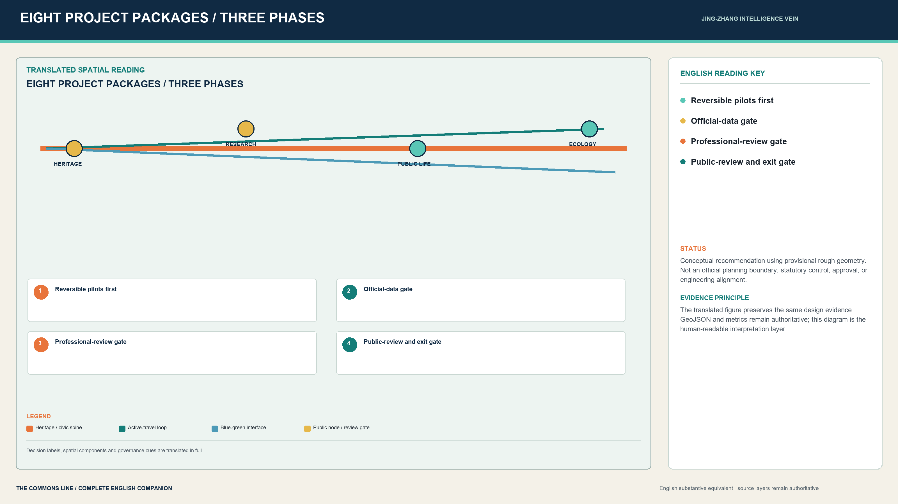

## Metrics, Area Recalculation, and Compliance Matrix

### Reproducible Metrics Calibrate the Design | Every Judgment Remains Traceable

Metrics fall into four groups: spatial-base, public-value, implementation-process, and information-maturity. [depth:metrics_recalculation] GeoJSON recalculates the site, building footprint, green space, public space, and conceptual mobility. Public-value metrics record scenarios, personas, landmarks, and services. Process metrics track gate passage, pilot exits, human-takeover response, and closure of public issues. Maturity metrics track the availability of official boundaries, RDP, ownership, and specialist data.

| Group | Currently Reproducible Metrics | Professional Interpretation |
| --- | --- | --- |
| Spatial base | [metric:site_area_sqm] [metric:building_footprint_area_sqm] [metric:green_space_area_sqm] [metric:public_space_area_sqm] [metric:conceptual_mobility_length_m] | Based on provisional or conceptual layers for internal comparison |
| Ratios | [metric:green_ratio] [metric:public_space_ratio] | Recalculate as a whole when official polygons arrive |
| Structural counts | [metric:key_area_count] [metric:land_use_zone_count] [metric:building_carrier_count] [metric:phase_count] | Indicate deliverable completeness, not approval or performance |
| Task coverage | [metric:scenario_card_count] [metric:test_scenario_count] [metric:persona_count] [metric:landmark_count] [metric:global_case_count] | Correspond to minimum Taskbook requirements |

The professional Evidence Chain is source, assumption, geometry, metric, diagram, and Human Review. Nine readable layers cover the site, key areas, land use, buildings, roads, green space, public space, constraints, and phasing, including [data:geometry/constraints.geojson#CONSTRAINT-001]. Six standards are mapped in `standard_matrix.json`: [standard:PROJECT-OFFICIAL-ANNOUNCEMENT] [standard:PROJECT-AGENT-OPEN-CALL-TASKBOOK] [standard:MOHURD-URBAN-DESIGN-MEASURES] [standard:MOHURD-CONTROL-DETAILED-PLANNING] [standard:MNR-LAND-USE-CLASSIFICATION-GUIDE] [standard:MOHURD-ARCH-DESIGN-DEPTH-2016].

Fifteen depth items are recorded in `design_depth_matrix.json`, including [depth:risk_missing_data]. All Development Intensity, Building Height, and DRR conclusions remain unknown where evidence is missing; precise numbers are not used to manufacture certainty.

## Risk, Copyright, and Compliance

### Defining the Boundary of a Conceptual Proposal | Risk, Rights, and Responsibility

The primary risk is not technical implementation, but misreading a conceptual proposal as statutory or engineering fact. Every drawing continues to disclose provisional geometry and non-approval status. When official polygons arrive, boundaries and all land-use, building, road, green-space, public-space, phasing, and metric outputs must be recalculated together; changing one master plan image is insufficient. [depth:risk_missing_data]

| Dimension | Principal Risk | Control |
| --- | --- | --- |
| Data privacy | Excessive collection or secondary use | Data minimization, defined retention, edge processing, human authorization, deletion |
| Delivery complexity | Multiple areas, owners, and disciplines | Project packaging, governance gates, phased approvals |
| Public acceptance | AI display displaces daily needs | Walking, service, shade, and accessibility before AI scenarios |
| Operating cost | Equipment and events depend on short-term funding | Light equipment, replaceability, accountable operator, lifecycle budget |
| Policy uncertainty | RDP, data, or pilot permissions unconfirmed | Retain conceptual status and recheck when formal inputs arrive |
| Spatial dispute | Provisional rectangles mistaken for parcels or boundaries | Visually subordinate and continuously label provisional geometry |
| Technology maturity | Model, robot, or terminal failure | Small areas, low speed, Human Review, immediate stop |
| Equity and inclusion | Digital barriers exclude older or disabled people | Accessibility co-testing, multilingual explanation, human and non-AI equivalents |

The text, diagrams, scenarios, offline HTML, and PDF layouts were originally generated by an AI agent for this submission. They contain no third-party maps, corporate logos, portraits, or restricted images. International cases cite only factual information from institutional websites and state their limits of use. System fonts are used only for local rendering and are not distributed. External publication, professional judgment, and rights confirmation remain the responsibility of the GitHub account owner and relevant professional teams.

## References

1. Haidian Branch of the Beijing Municipal Commission of Planning and Natural Resources, prequalification announcement for the Centennial Jing-Zhang AI Innovation Belt urban design call. [source:OFFICIAL-ANNOUNCEMENT]
2. Global Agent Open Call Taskbook and its structured repository extract. [source:AGENT-TASKBOOK]
3. Repository Site Package, Source Registry, and processed fact pack. [source:SITE-PACKAGE] [source:SOURCE-REGISTRY] [source:PROCESSED-FACT-PACK]
4. Applicable urban design, Regulatory Detailed Planning, land-use classification, and architectural-design depth standards listed in `standard_matrix.json`.
5. Official materials from Stanford HAI, Mila, Vector Institute, AI Singapore, IMDA AI Verify, and Testbed Helsinki, used only for mechanism comparison.

The final design-depth index maps existing conditions, three-level scope, overall structure, land use, intensity, height and massing, DRR, transport, municipal systems, Blue-Green Space, key areas, projects, phasing, metrics, and risk to [depth:existing_conditions_diagnosis] [depth:three_level_scope_framework] [depth:overall_spatial_structure] [depth:land_use_layout] [depth:development_intensity_controls] [depth:height_massing_character] [depth:retain_renovate_demolish] [depth:traffic_rail_slow_parking] [depth:municipal_new_infrastructure] [depth:blue_green_public_space] [depth:three_key_area_detailed_design] [depth:renewal_project_list] [depth:phasing_implementation] [depth:metrics_recalculation] [depth:risk_missing_data].
