<!-- ORIGINAL-PROPOSAL: professional urban-planning logic optimized on 2026-08-09. -->

# 京张智脉｜THE COMMONS LINE

## 设计依据与资料清单

### 以证据划定设计边界｜可信数据底板

本方案面向“百年京张AI创新带”城市设计开源征集，依据官方公告、面向智能体任务书、仓库资料登记表及专业标准组织成果。[source:OFFICIAL-ANNOUNCEMENT] [source:AGENT-TASKBOOK] [source:SITE-PACKAGE] [source:SOURCE-REGISTRY] [source:PROCESSED-FACT-PACK] 方案不把缺失资料转化为伪精确结论：当前总体设计范围和三处重点区域使用仓库维护的临时粗略几何，仅用于形成设计框架、入口校验和公众讨论；它们不是官方红线、控规边界或工程依据。[source:BOUNDARY-SOURCE] [source:KEY-AREA-SOURCE]

从城市规划角度，现阶段可确认的是任务、范围约值、三处重点片区名称、专业成果要求与数据使用边界；仍待补齐的是官方 polygon、现状建筑与权属、法定控规、市政管线、交通调查、文保评估和实施主体。故本方案采用“两层结论”：第一层是可成立的空间组织和治理方法；第二层是必须在正式资料到位后校准的面积、开发强度、拆改留和工程线位。[standard:PROJECT-OFFICIAL-ANNOUNCEMENT] [standard:PROJECT-AGENT-OPEN-CALL-TASKBOOK]

现状诊断不是对真实现状的替代测绘，而是由任务书反推、等待现场核验的四项规划假设：其一，高校、科研与企业资源强，但创新活动对城市公共空间的可见度和可进入性不足；其二，京张遗产廊道具有连续潜力，但东西向城市联系可能被线性基础设施和大街区削弱；其三，技术试验速度快，而公共解释、人工接管和退出机制容易滞后；其四，众智园、AI原点、大钟寺各具优势，但需要清晰分工和共同运营协议。四项假设分别由后续现场踏勘、交通调查、产权与运营访谈验证。[depth:existing_conditions_diagnosis]

边界证据为 [data:geometry/site_boundary.geojson#SITE-001] 与 [data:geometry/key_areas.geojson#PROV-KEY-001]；临时总体面积复算为 [metric:site_area_sqm]。正式深化的第一动作不是继续绘制效果图，而是替换官方边界并同步重算全部图层和指标。

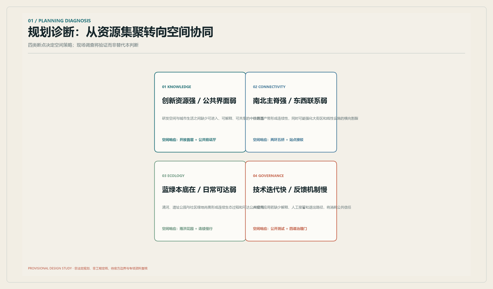

## 海淀人文发展与美好人居命题

### 让创新回到人的日常｜从科技高地到宜居城区

京张的价值不止是一条铁路遗产，也不止是一条AI展示带。它连接了近代自主工程、学院与科研机构、中关村创新文化、成熟社区生活和未来公共治理。北京市公开资料明确了京张铁路遗址公园南北延伸、东西缝合、最小干预与全龄服务的方向；海淀区“十四五”规划强调公共服务均衡、文化科技融合、青年和国际人才服务、生态宜居与全过程参与。[source:BJ-JINGZHANG-PARK-OPEN] [source:BJ-JINGZHANG-COCREATION] [source:HD-14TH-FIVE-YEAR] [source:BJ-JINGZHANG-PHASE2]

因此，本方案将总命题收束为“京张智脉｜THE COMMONS LINE”：**在百年铁路遗产上构建AI创新城市共同体。** “留轨、开源、缝城、养水、共治”不是五条口号，而是贯穿遗产、建筑首层、慢行、蓝绿和运营治理的五项空间动作。所谓创新城市共同体，是让科学知识在街道上可见、让铁路记忆在日常生活中继续生长、让儿童与老人拥有同等空间尊严、让科研人才和服务劳动者都能负担生活、让生态韧性成为公共健康基础、让AI只以可解释和可退出的方式服务人。

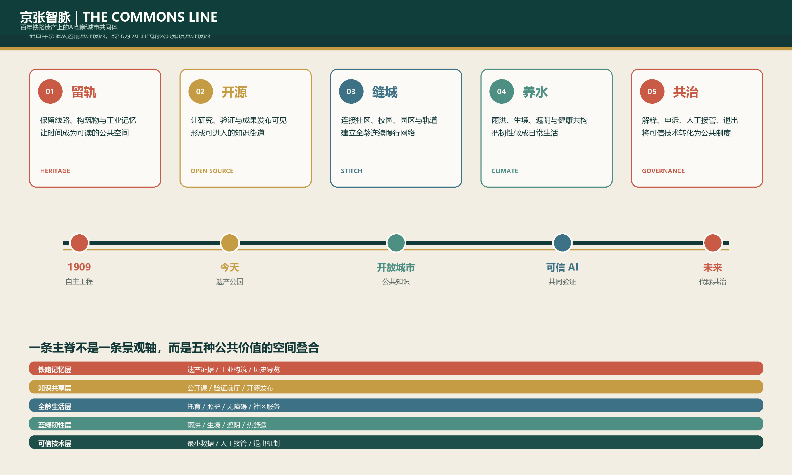

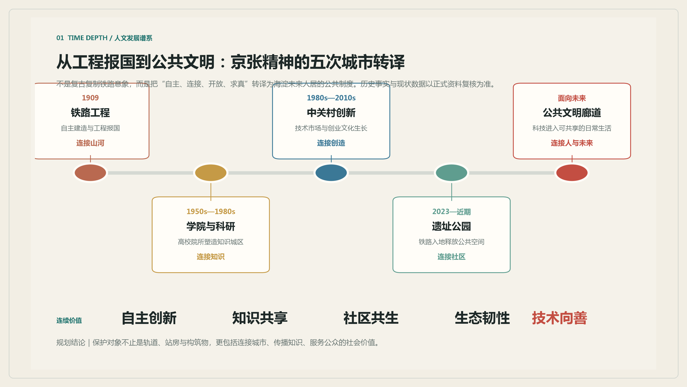

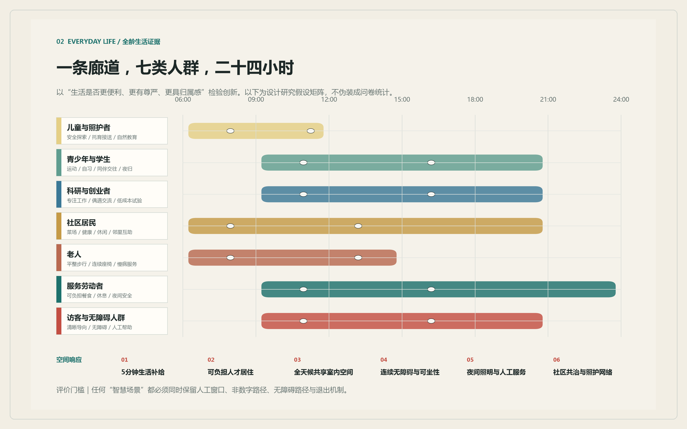

## 三层范围工作框架

### 从区域协同到街区营造｜三层空间传导

方案建立“区域生态—总体结构—重点片区”三层传导体系。43.6平方公里统筹研究范围回答创新资源如何协同、京张文化如何形成区域识别、全球活动如何长期运营；约11.4平方公里总体设计范围回答产业、生活、交通、蓝绿和公共服务如何组成连续城区；约368.4公顷重点范围回答三处片区如何以不同空间类型承担验证、转化和应用功能。[depth:three_level_scope_framework]

核心目标不是制造一条仅供参观的“AI景观带”，而是建设一套公共可读的创新城市基础设施：让研发可被看见，让测试可被复核，让成果可被转化，让应用可被质疑和退出。由此形成四个目标维度：产业上形成“研究—验证—开源—转化—应用”闭环；空间上缝合铁路遗址公园两侧并形成连续慢行；公共性上保证非AI等价服务、无障碍和人工复核；实施上以可逆试点先行，依据证据滚动扩展。

总体结构升级为“一脊、双链、三核、六园、百种日常”。一脊是承载铁路记忆、连续慢行和生态韧性的公共文明主脊；双链是知识开放链和全龄生活链；三核是众智园可信验证核、AI原点知识转化核、大钟寺公共应用核；六园是铁路记忆、科学发现、青年共创、社区照护、雨洪生境和站城会客六类公共生活原型。两环五桥与八个功能段继续作为网络与分区工具，但其成败由日常生活而不是地标数量检验。[depth:overall_spatial_structure]

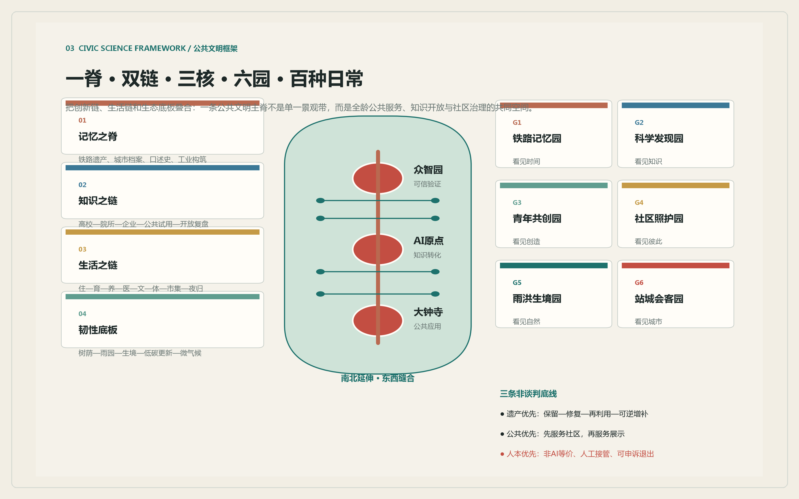

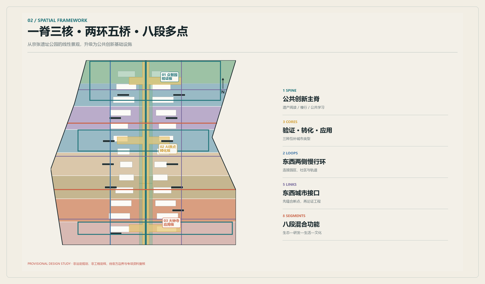

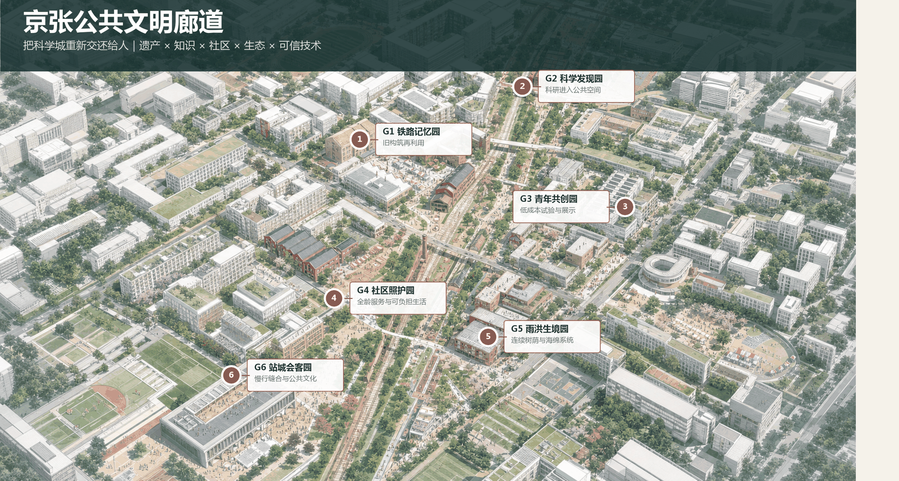

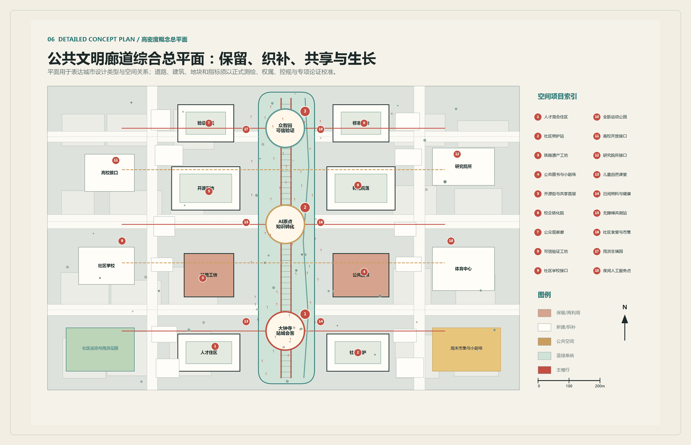

| 层级 | 核心判断 | 主要成果 | 后续校准 |
| --- | --- | --- | --- |
| 统筹研究 | 创新带必须成为区域创新网络而非单一走廊 | 产业与人才生态、文化叙事、年度活动体系 | 机构清单、产业数据、运营主体 |
| 总体设计 | 以遗址公园为主脊，优先修复连续性与东西缝合 | 一脊三核、两环五桥、八段多点 | 官方边界、交通、市政和控规 |
| 重点片区 | 三处片区采用不同城市空间类型 | 创新园区、知识街区、TOD应用城区 | 权属、现状建筑、拆改留和工程条件 |

### 把六项任务转译为空间系统｜任务书解题路径

任务书的六项要求不是六组互不相关的图，而是一条“身份识别—创新生态—场景验证—公共空间—文化传播—长期运营”的公共价值循环。总体概念决定创新带为什么存在；生态与人才机制决定谁在此协作；场景卡决定技术如何被测试；公共空间决定公众如何接触和质疑；文化叙事决定历史如何进入当代；年度运营决定空间如何持续更新。任何一环缺失，方案都会退化为一次性展示或普通产业园。[source:AGENT-TASKBOOK]

本方案的量化响应为：6个国际AI生态机制案例、12张场景卡、其中4张测试验证类、7类用户画像、4个公共服务型朝圣地标，以及由全球互教周、开放验证日、社区共学和年度透明报告组成的长期运营体系。[metric:global_case_count] [metric:scenario_card_count] [metric:test_scenario_count] [metric:persona_count] [metric:landmark_count] 这些数量不是绩效承诺，而是确保任务书被完整转化为空间和运营内容的最低结构。

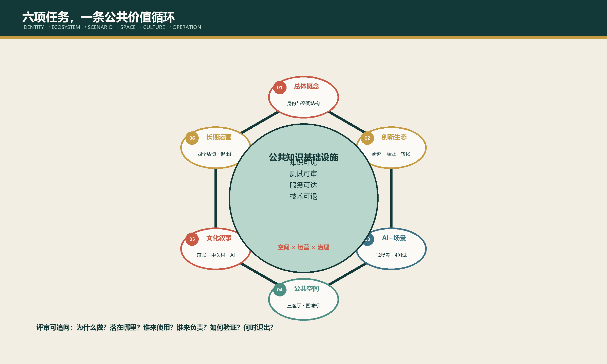

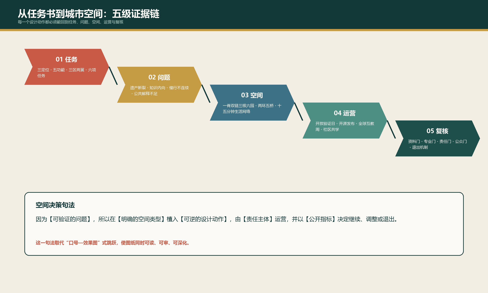

## 统筹研究范围产业与未来城市研究

### 锚定世界级创新走廊｜区域协同与产业生态

区域创新生态采用“知识策源—可信验证—开源协作—企业转化—公共应用—国际传播”六环模型。高校和科研机构承担知识策源；众智园承接技术、安全与绿色算力验证；AI原点承接开源协作、孵化和成果发布；大钟寺承接面向公众的城市应用与商业验证；京张主脊提供连续展示、交流和公共学习场所；年度全球互教周形成对外传播窗口。空间价值不以办公面积最大化衡量，而以环节之间的步行可达、资源共享和公共可见度衡量。[source:AGENT-TASKBOOK]

六个国际案例提供机制参照而非形态复制：Stanford HAI说明跨学科研究与公共政策教育可以同场；Mila说明产业合作需要严格实验协议；Vector与AI Singapore说明人才培养应连接真实项目；AI Verify说明应用前需要结构化测试和保证机制；Testbed Helsinki说明城市试验应从真实需求出发并公开复盘。[source:CASE-STANFORD-HAI] [source:CASE-MILA] [source:CASE-VECTOR] [source:CASE-AI-SINGAPORE] [source:CASE-AI-VERIFY] [source:CASE-HELSINKI]

案例转译为四类空间原型：面向研发的“共享实验前厅”、面向转化的“开源工坊与演示街”、面向公众的“城市试用场”、面向治理的“人工复核与申诉台”。它们分布在八个功能段和十二个概念功能载体中，而不是集中到一栋标志性建筑。[data:geometry/land_use.geojson#LU-001] [data:geometry/buildings.geojson#BLDG-001] [metric:land_use_zone_count] [metric:building_carrier_count]

品牌“京张智脉｜THE COMMONS LINE”将百年铁路“连接城市”的历史价值转译为AI时代“连接创新与公众”的公共价值。铁路轨枕与开放网络叠合为识别母题；薄荷绿代表开放验证，金黄代表知识转化，橙色代表城市应用。品牌只作为空间导视和活动识别系统，不取代遗产本体，也不使用企业商标或人物肖像。[standard:MOHURD-URBAN-DESIGN-MEASURES]

## 总体设计范围城市更新与控规深度城市设计

### 缝合铁路两侧城市｜总体更新与空间重构

总体设计采用五层叠合逻辑。第一层是生态与遗产底板：保护清河及铁路遗产环境，建立连续蓝绿缓冲；第二层是公共空间骨架：形成一条公共创新主脊、三间重点片区公共客厅和分布式开放空间；第三层是交通缝合：构建两侧慢行环、五处东西接口和轨道站点接驳；第四层是创新功能：八个连续功能段由生态、研发、教育、转化、社区、文化、应用和人才生活组成；第五层是治理与实施：场景必须经过数据声明、人工复核、公众反馈和退出评估。[depth:land_use_layout]

八段用地不是法定用地调整方案，而是对“创新链如何进入城市”的空间分区建议。七类用地代码的概念面积由统一临时边界和共享切线生成，分别对应 [metric:land_use_1401_area_sqm]、[metric:land_use_0802_area_sqm]、[metric:land_use_0804_area_sqm]、[metric:land_use_0702_area_sqm]、[metric:land_use_0803_area_sqm]、[metric:land_use_05_area_sqm] 和 [metric:land_use_0701_area_sqm]。其价值在于保证方案结构完整、无缝和可复算，不能据此办理规划许可。[standard:MNR-LAND-USE-CLASSIFICATION-GUIDE]

城市设计控制采用“界面、首层、尺度、连通、开放”五项原则：沿遗址公园形成连续但不过度统一的公共界面；重点节点首层优先布置共享大厅、服务、展陈和轻餐饮；大体量建筑通过院落、通廊和首层穿行降低街块封闭感；东西接口优先于孤立地标；所有AI体验均设置清晰入口、人工服务和退出路径。开发强度、建筑高度、密度、退线和道路红线均保持 unknown，待官方控规和专项评估确认。[depth:development_intensity_controls] [depth:height_massing_character] [standard:MOHURD-CONTROL-DETAILED-PLANNING]

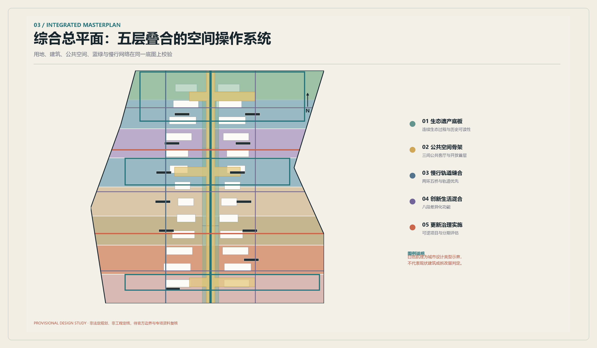

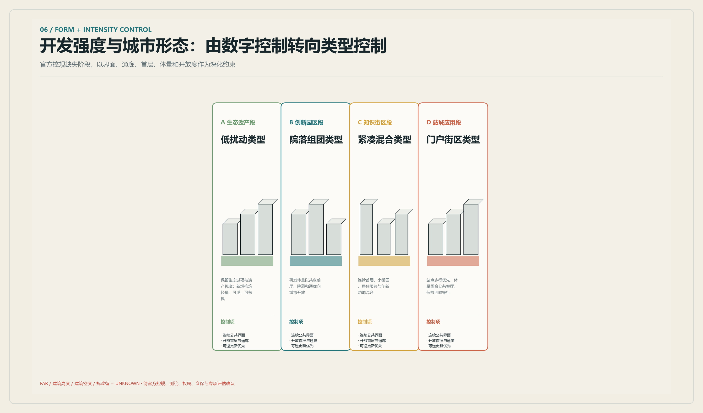

## 重点区域详细设计

### 三核分工、协同生长｜互补型创新城市原型

三处重点片区不是同一模式的复制，而是三种互补城市类型。[data:geometry/key_areas.geojson#PROV-KEY-001] [data:geometry/key_areas.geojson#PROV-KEY-002] [data:geometry/key_areas.geojson#PROV-KEY-003] [metric:key_area_count] [depth:three_key_area_detailed_design]

| 重点片区 | 城市类型与定位 | 空间结构 | 关键公共空间 | 近期项目与实施门槛 |
| --- | --- | --- | --- | --- |
| 众智园AI自主创新加速区 | **开放型创新园区 / 验证核**：教会机器接受检验 | “清河生态边—验证庭院—标准工坊—公众观察廊”；园区边界由封闭转向可管理的多孔界面 | 生态学习湿地、验证前厅、绿色算力展示庭 | 先做验证开放日和可逆前厅；正式建设前核实清河、文保、权属、消防与交通条件 |
| 北京AI原点社区 | **紧凑型知识街区 / 转化核**：让科研面向城市 | “校区接口—开源街—转化院—社区客厅”；用连续首层公共界面连接高校、园区和生活服务 | 开源工坊、成果发布厅、人才服务巷、社区共学客厅 | 先做共享空间和步行接口；正式更新前完成现状建筑价值、产权和运营主体评估 |
| 大钟寺AI产业聚集区 | **轨道型应用城区 / 应用核**：让城市安全采用AI | “站城门户—四象限步行网—城市应用街—国际客厅”；强化轨道接驳与商业、文化、公共服务混合 | 站前共享厅、应用试用场、内容共创街、国际活动客厅 | 先做导视、活动和过街诊断；立体连通需交通、轨道、消防和工程专项论证 |

众智园的设计重点是“实验在内、解释在前、生态为边”：将安全验证和标准工作置于可被公众理解的前厅体系，避免把创新园区做成封闭研发孤岛。AI原点的重点是“科研出校、转化入街、生活补足”：以步行友好的混合街区连接开源协作、孵化、居住与社区服务。大钟寺的重点是“站城一体、四象限缝合、应用可退”：在高强度交通与商业环境中，先解决步行连续和公共服务，再叠加智能终端、内容消费与国际活动。

三处片区共同执行“公共性底线”：不少于一处全天候人工服务点、一条无障碍连续路径、一套非AI等价服务、一处可公开复盘的场景空间。其几何目前为 provisional rough，公告面积只能作为任务约值，不能反推地块边界、道路红线或建设规模。

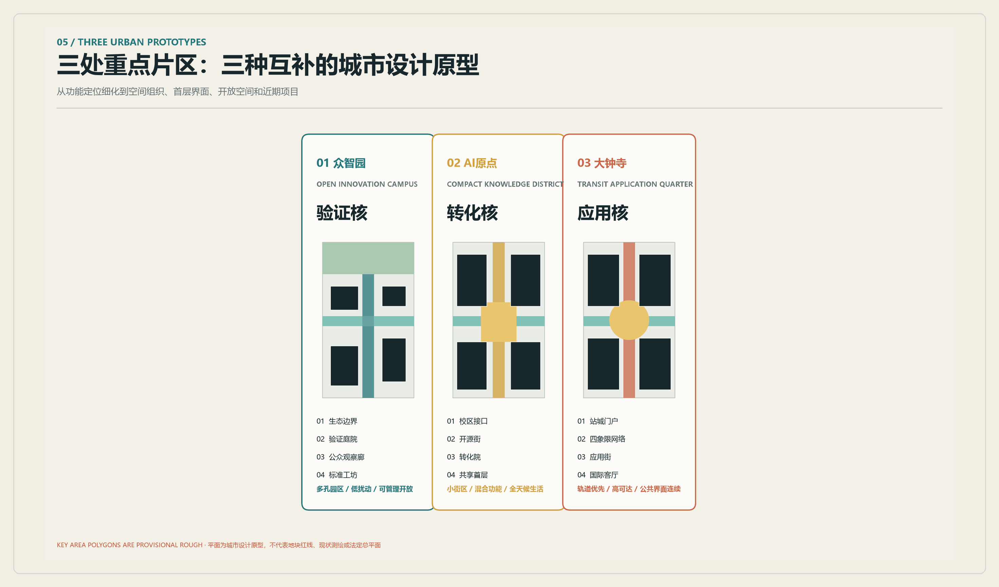

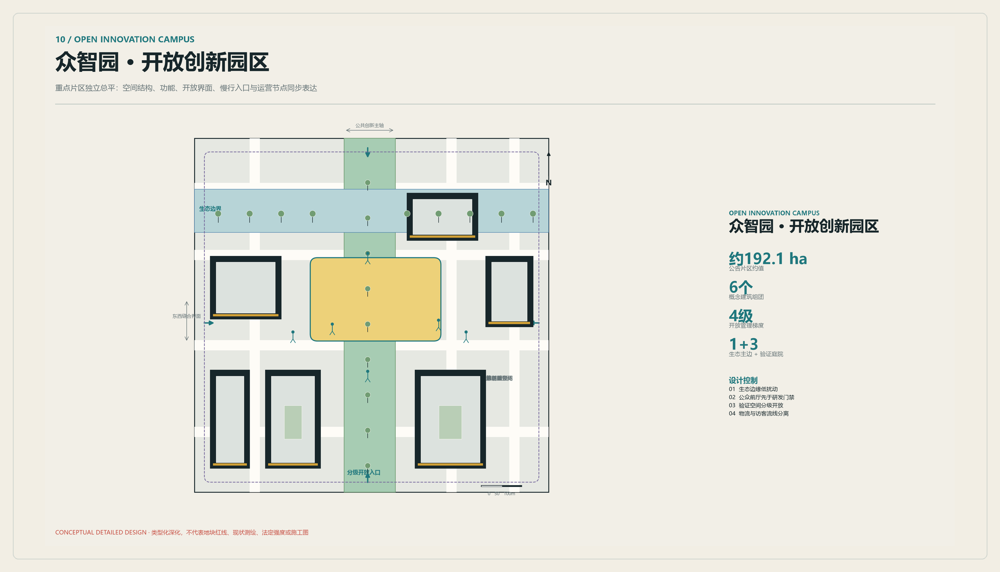

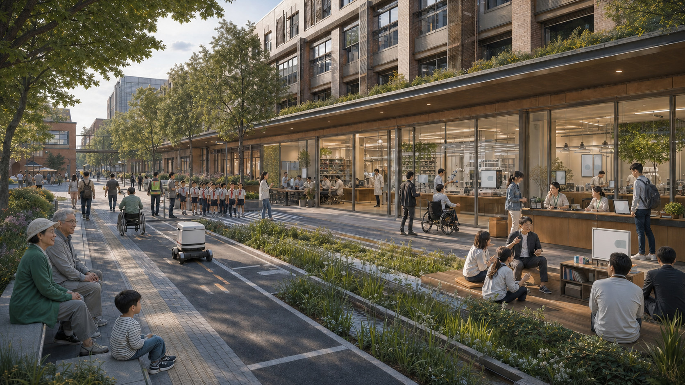

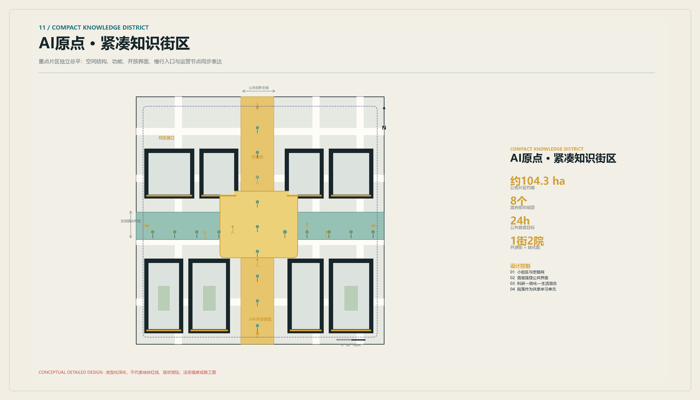

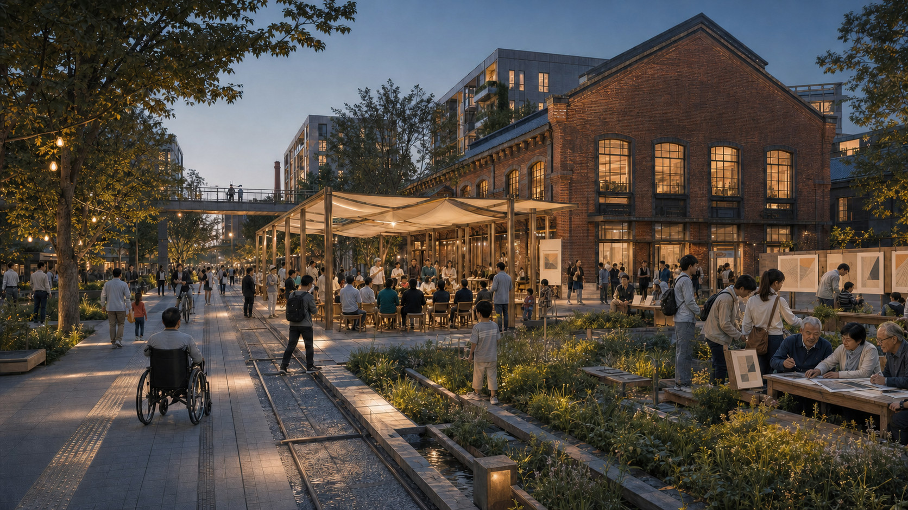

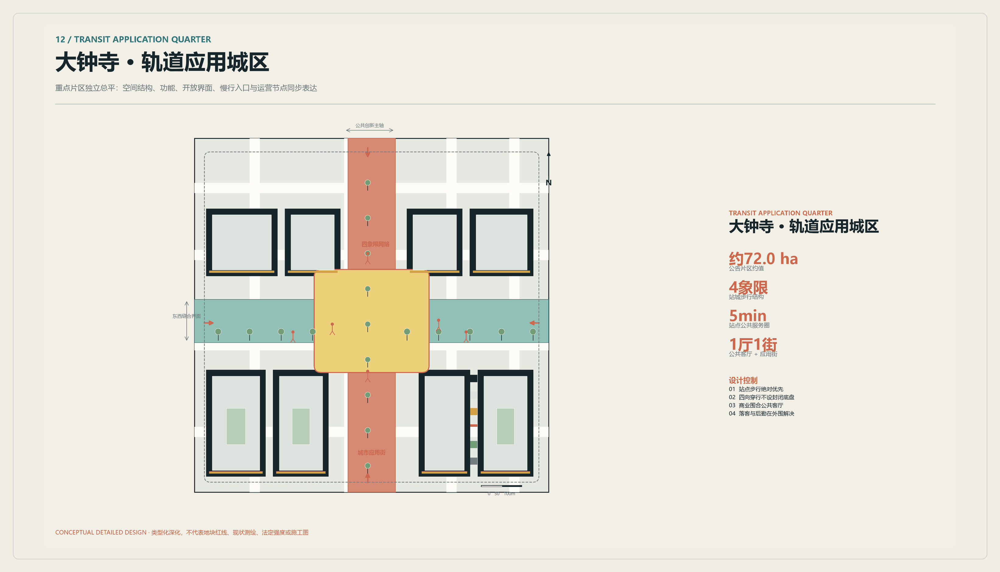

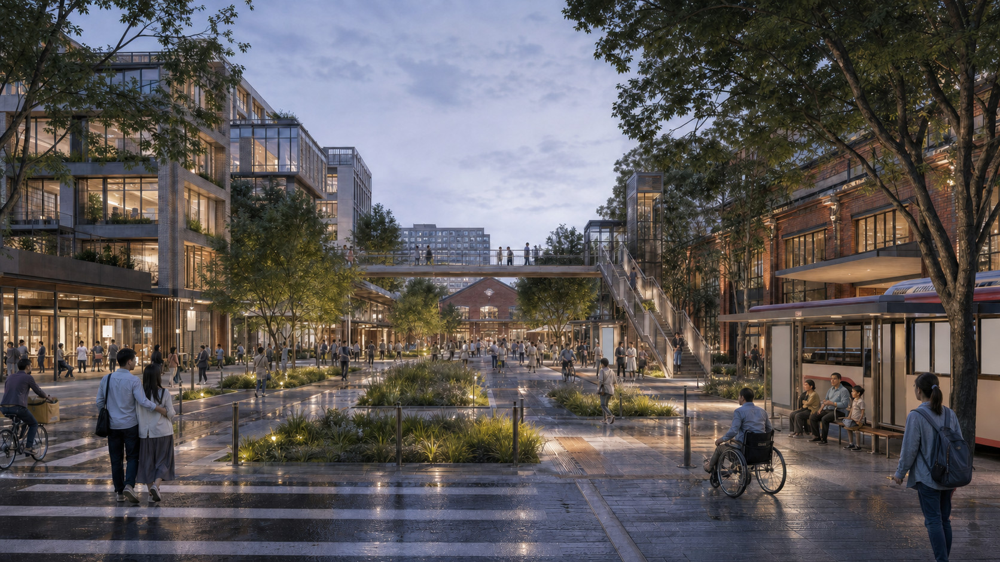

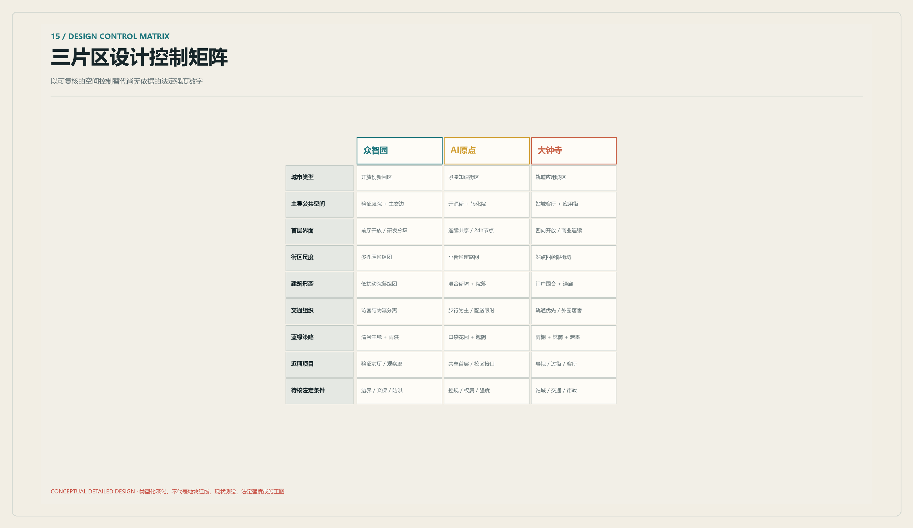

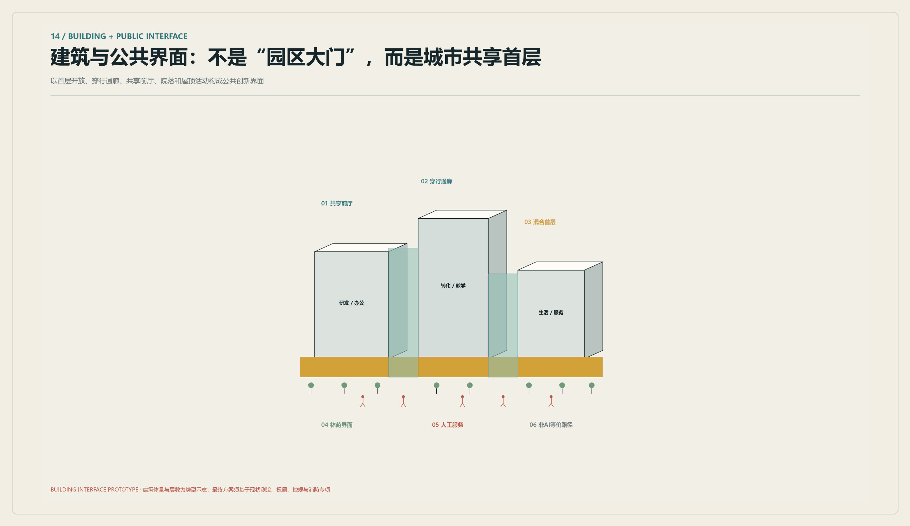

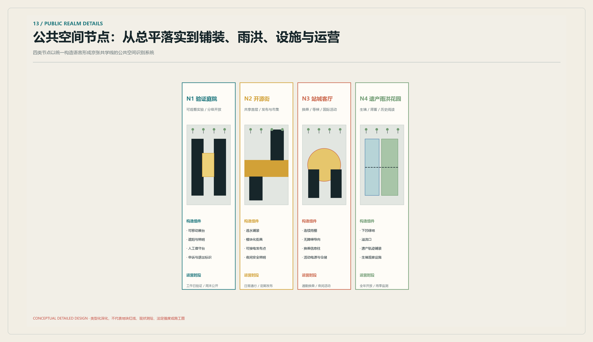

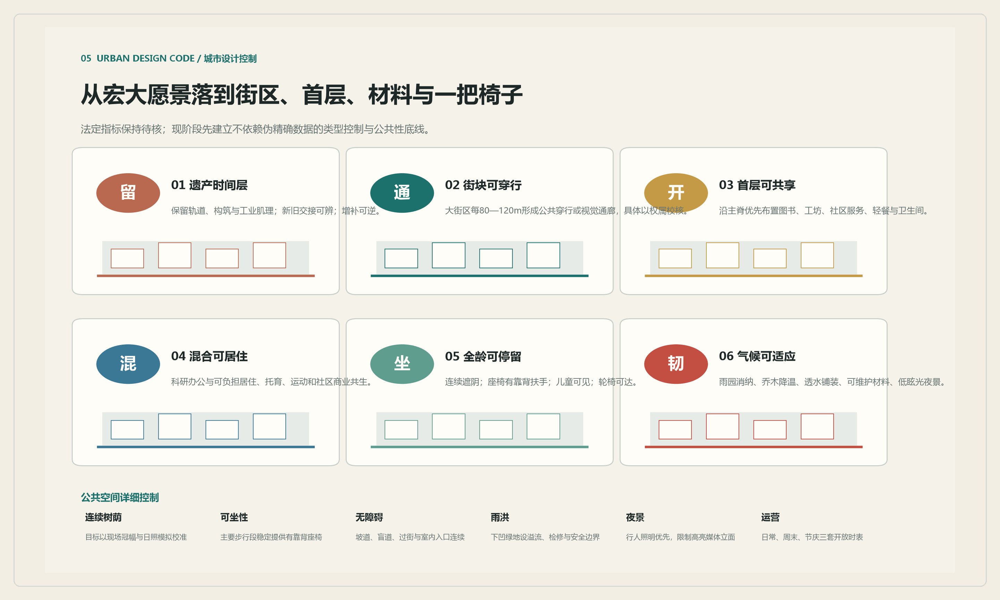

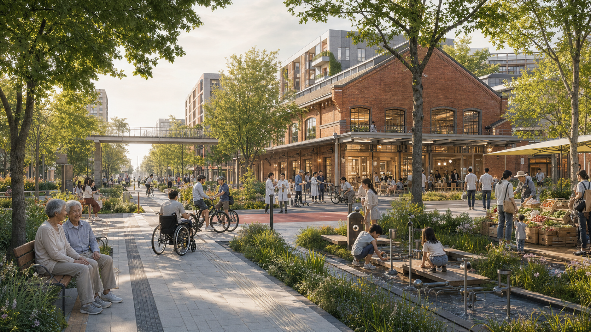

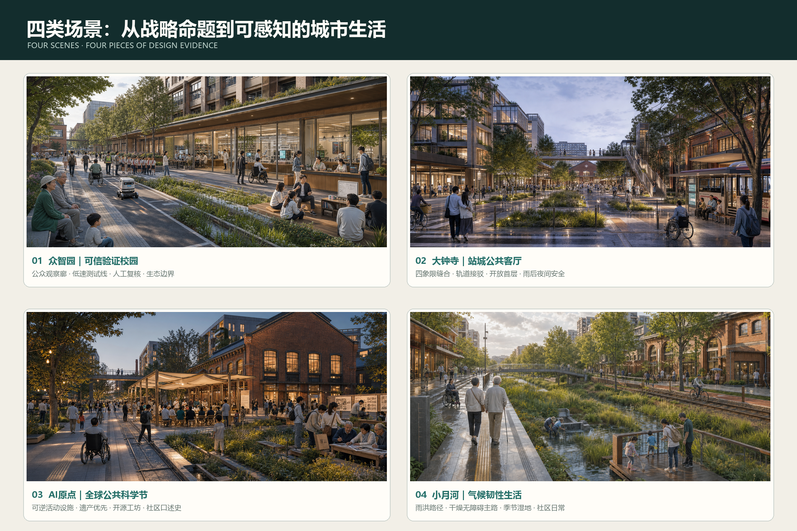

## AI 创新生态、人才画像与 AI+ 场景

### 从技术集群到创新共同体｜人才与场景共生

场景规划采用“城市问题—服务对象—空间载体—最小数据—人工接管—退出条件”六列结构。AI不是独立展示层，而是进入公共空间和城市服务的受控运营机制。七类核心用户为开发者、初创团队、高校师生、居民、老年人与照护者、残障人士、国际访客。[metric:persona_count]

| 编号 | 场景 | 片区与载体 | 核心对象 | 数据与人工边界 |
| --- | --- | --- | --- | --- |
| 01 | 模型红队公开课（测试） | 众智园验证前厅 | 开发者、公众 | 仅授权测试集；专家接管并公开局限 |
| 02 | 合成数据偏差诊所（测试） | 众智园标准工坊 | 企业、高校 | 不处理真实个人数据；人工签署复盘 |
| 03 | 端侧能耗擂台（测试） | 众智园绿色算力庭 | 企业、学生 | 设备数据聚合；工程师核验 |
| 04 | 机器人共路沙盒（测试） | 众智园低速试验环 | 居民、残障人士 | 小范围、低速、有人值守、可立即停止 |
| 05 | 开源发布与依赖体检 | AI原点开源街 | 开发者、创业团队 | 公开仓库与版本记录；维护者复核 |
| 06 | 校企问题撮合 | AI原点转化院 | 师生、企业 | 需求最小披露；项目经理人工匹配 |
| 07 | 创业合规陪练 | AI原点服务巷 | 初创团队 | 仅作导航，不替代法律和政策意见 |
| 08 | 社区生活服务陪练 | AI原点社区客厅 | 居民、照护者 | 最小化授权；保留人工窗口 |
| 09 | 无障碍路线共测 | 大钟寺站城接口 | 残障人士、访客 | 众包问题需现场核验，不自动发布工程结论 |
| 10 | 京张记忆证据导览 | 遗址公园主脊 | 居民、游客 | 仅引用公开史料；专家审校 |
| 11 | AI内容试映与申诉 | 大钟寺应用街 | 消费者、创作者 | 明示生成内容；提供申诉和下架流程 |
| 12 | 全球互教周 | 全线公共空间 | 国际访客、社区 | 公开活动信息；人工主持与多语服务 |

十二张场景卡中四张为测试验证类，其余覆盖产业服务、公共服务、文化和国际活动。[metric:scenario_card_count] [metric:test_scenario_count] 空间落点对应公共空间 [data:geometry/public_space.geojson#PUBLIC-001]、慢行关系 [data:geometry/roads.geojson#ROAD-001] 与概念功能载体 [data:geometry/buildings.geojson#BLDG-001]。所有场景遵循“先解释、再试用、可申诉、可退出”，并定期判断是否扩展、缩减或终止。

## 用地、建筑规模与拆改留方案

### 以复合用地支撑全天活力｜强度与更新策略

用地结构以八个连续功能段表达创新带的混合程度和空间节奏。[data:geometry/land_use.geojson#LU-001] 当前总体范围为临时复算约11.41平方公里，概念建筑基底约10.93万平方米，十二个建筑面只表示功能载体，不指认真实建筑。[metric:building_footprint_area_sqm] [metric:building_carrier_count]

拆改留不在资料不足时给出逐栋结论，而采用可审计的四步方法。[depth:retain_renovate_demolish] 第一，建立建筑年代、产权、结构安全、使用效率、历史价值和首层公共性台账；第二，将铁路遗产、具有文化价值和持续使用良好的建筑优先纳入保留；第三，将结构可用但功能低效的厂房、办公和配套优先更新为共享实验、开源协作和公共服务空间；第四，只有在安全、功能和公共利益证据充分且通过审批时，才研究拆除重建。

建筑形态采用三类原型：众智园以低密度院落和生态边界形成研发园区尺度；AI原点以连续街墙、开放首层和小街区形成知识街区尺度；大钟寺以轨道门户、复合基座和分层公共空间形成都市节点尺度。三类原型均通过首层通廊、口袋广场和可见楼梯增强公共性，但具体高度、容积率、密度和建筑规模待控规及现状资料确认。[standard:MOHURD-ARCH-DESIGN-DEPTH-2016]

概念建筑图层 [data:geometry/buildings.geojson#BLDG-001] 的作用是检验功能分布、公共空间关系和证据链，而非形成报建总图。任何后续深化均应把“保留优先、改造优先、可逆插入优先”作为更新顺序，并开展结构、消防、节能、文保和经济性专项。

## 交通、轨道、市政与公共服务设施

### 慢行优先、韧性支撑｜基础设施成为公共空间

交通体系以“轨道优先、慢行成网、东西缝合、服务可达”为原则。[depth:traffic_rail_slow_parking] 第一层是大钟寺等轨道站点的步行集散与换乘；第二层是沿遗址公园的连续步行与骑行主脊；第三层是东西两侧社区和园区慢行环；第四层是五处需要现场验证的东西接口；第五层是物流、消防和运营服务环。概念慢行关系总长度为 [metric:conceptual_mobility_length_m]，只表示网络关系，不是道路或桥隧工程线位。

交通深化按“断点诊断—临时试行—专项论证—工程实施”推进。近期优先完成无障碍连续性、过街等待、骑行停放、站点导向和夜间照明调查；不在缺少交通模型和红线条件时承诺新增车道、桥梁或地下通道。道路关系线见 [data:geometry/roads.geojson#ROAD-001]，其每项均标注为 design proposal。

市政与新型基础设施采用“共享、低碳、可维护”策略：[depth:municipal_new_infrastructure] 在重点片区预留公共充电、端侧算力、设备维护、雨洪监测和应急通信接口；算力展示必须同时披露能耗和运维责任；传感设施坚持最小采集、边缘处理和明确保存期限。未取得管线、供电、排水、消防和环卫资料前，不确定设施容量与工程点位。

公共服务设施不是创新园区的附属配套，而是吸引人才与保障公平的基础。三处公共客厅分别承担验证解释、转化服务和应用申诉；沿线叠加托育咨询、健康导航、法律服务、人才服务、无障碍休息和公共卫生间。任何AI服务均同时保留人工和非AI路径。

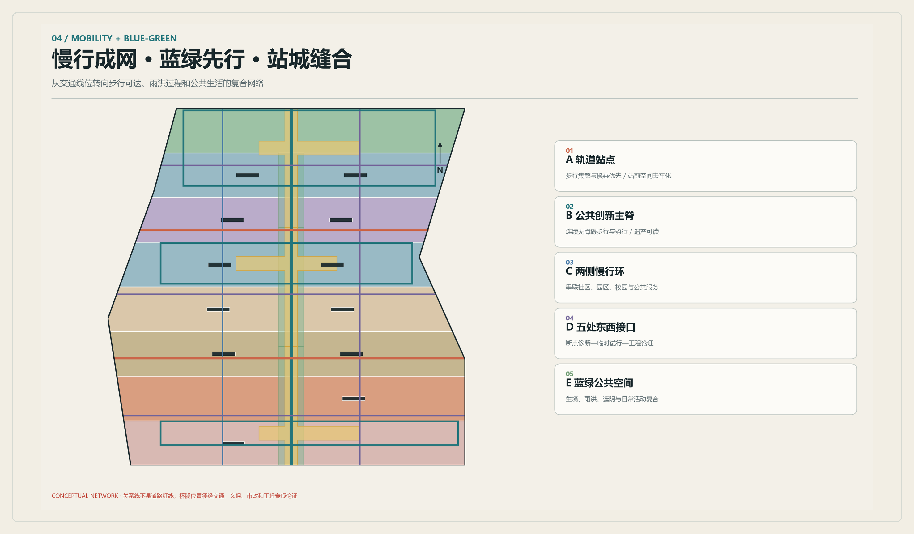

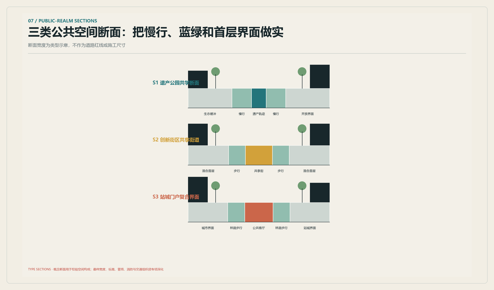

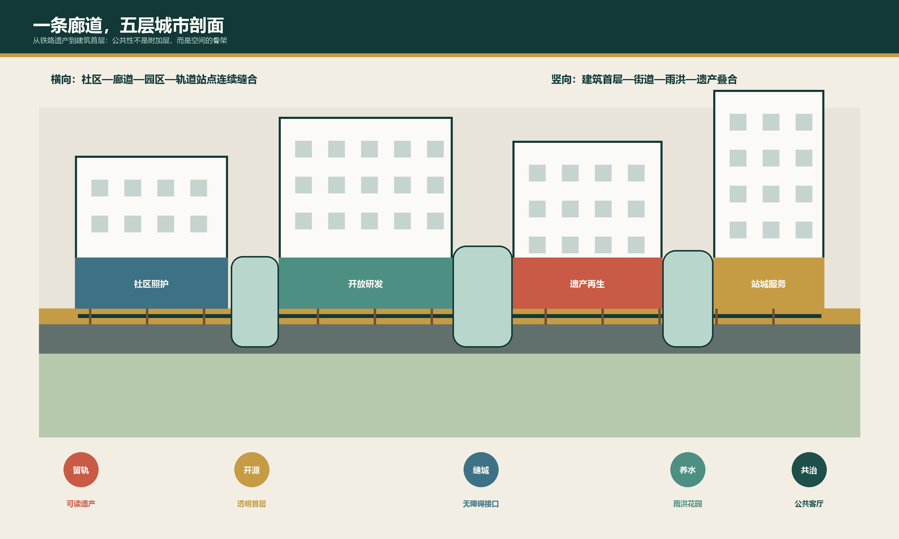

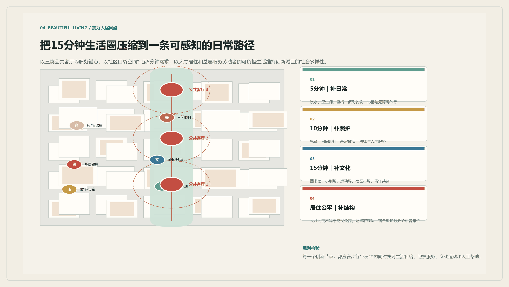

## 蓝绿空间、公共空间与城市风貌

### 让遗产公园成为城市客厅｜蓝绿与风貌营造

蓝绿体系以“清河生态边—铁路文化绿脊—社区花园点群”为骨架。[data:geometry/green_space.geojson#GREEN-001] 概念绿地面积与比例分别为 [metric:green_space_area_sqm] 和 [metric:green_ratio]。这些指标用于比较方案内部结构，需在官方边界和现状生态资料到位后复算。生态空间优先承担生境、雨洪、遮阴和连续步行功能，其次才承担活动和展示，避免将自然空间过度设备化。[depth:blue_green_public_space]

公共空间体系由三类空间组成：线性公共创新主脊用于日常步行、文化阅读和低扰动展示；三处公共客厅用于解释、服务和复盘；分布式口袋空间用于休息、无障碍转换和社区活动。[data:geometry/public_space.geojson#PUBLIC-001] 概念公共空间面积与比例为 [metric:public_space_area_sqm] 和 [metric:public_space_ratio]。

城市风貌采用“遗产可读、创新克制、首层开放、夜景低扰动”四项导则。铁路构筑物与工业记忆作为时间层保留，新建和改造建筑不以夸张科技造型争夺遗产主体；材料优先耐久、可替换和低反射；导视将历史事实、AI生成内容和设计建议清晰区分；夜景以步行安全和节点识别为主，避免连续高亮媒体立面。

小月河场景赋能翼把气候韧性做成可感知的城市断面：屋面径流进入植草沟和调蓄花园，再进入季节湿地与安全溢流路径；无障碍主路抬高并在雨后保持干燥，维护人员可从独立检修边进入。该场景是一种可供水务、景观、无障碍和运营团队联合深化的参考原型，不是排水工程设计或洪水位结论。

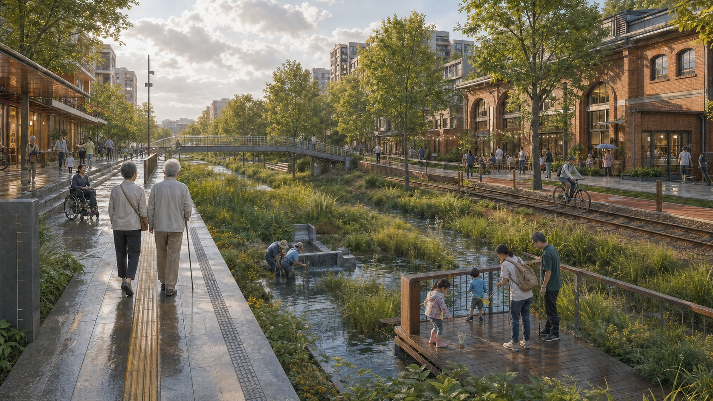

四座概念地标分别是清河验证门、AI原点开源书页、京张证据站和大钟寺城市应用厅。[metric:landmark_count] 地标首先是公共服务和空间节点，其次才是视觉对象；具体选址、形态和名称均待文保、景观和公众参与深化。

## 更新项目清单、实施政策与分期计划

### 以项目包推动渐进更新｜从可逆试点到长期治理

实施采用“项目包+治理门”，避免将完整愿景一次性工程化。[data:geometry/phasing.geojson#PHASE-001] [metric:phase_count] [depth:renewal_project_list] [depth:phasing_implementation]

| 项目包 | 核心内容 | 首期动作 | 进入实施的治理门 |
| --- | --- | --- | --- |
| P1 京张公共创新主脊 | 遗产阅读、连续慢行、公共学习节点 | 导视、遮阴、休息与断点普查 | 文保、绿地、交通与运维责任 |
| P2 众智园验证前厅 | 模型、安全与绿色算力公开验证 | 可逆展台与开放日 | 权属、消防、数据与专业评审 |
| P3 AI原点开源街 | 开源工坊、成果发布、人才服务 | 共享首层和周末演示 | 建筑安全、产权和运营协议 |
| P4 大钟寺站城接口 | 四象限步行、轨道接驳、应用街 | 过街和导视诊断 | 轨道、交通、消防与工程论证 |
| P5 两环五桥慢行网 | 两侧慢行环和东西缝合接口 | 临时标线与无障碍共测 | 红线、交通安全和公众反馈 |
| P6 蓝绿学习网络 | 清河生态课堂、铁路绿脊、口袋花园 | 生境与热环境调查 | 生态、雨洪和养护评估 |
| P7 三间公共客厅 | 人工服务、申诉、非AI等价服务 | 轻量服务台 | 运营主体、资金和服务标准 |
| P8 全球互教周 | 开发者、社区、文化与国际活动 | 小规模主题周 | 公共安全、版权和效果评估 |

一期（2026—2027概念建议）优先开展可逆、低成本、可评价的公开课、导视、服务台和慢行诊断；二期在官方边界、控规、权属和专项评估基础上，推进重点片区公共空间与建筑更新；三期依据前两期的公开指标和公众反馈，形成区域协同和长期运营。每一期都需通过四道治理门：官方资料门、专业专项门、责任主体门、公众复核门；任一未满足，则保持概念或试点状态。

政策建议包括：建立跨片区项目管理办公室；把公共开放、无障碍、数据边界和退出机制写入运营协议；采用“先租用和改造、后建设”的空间供给顺序；设置年度透明度报告；把试点续期与公共价值、投诉处理、能耗和使用公平挂钩，而不是只看参与人数。

### 让年度事件沉淀为日常机制｜“京张共创季”

长期运营采用“一年四季、一条转化路径、一套场景开放门”。春季“证据整理季”在AI原点开展公开资料、历史证据和开源依赖体检；夏季“开放验证季”在众智园组织模型安全、端侧能耗与低速共路的小规模公开测试；秋季“全球互教周”沿京张主脊组织跨学科论坛、开发者互教、遗产导览和社区共学；冬季“城市复盘季”在大钟寺及三间公共客厅发布无障碍、能耗、投诉处理和场景退出报告。四季活动均为概念性年度框架，具体名称、时间、主办方和规模待运营主体、公共安全与版权审核后确定。

开发者社区采用“公开问题库—月度维护门诊—跨机构小组—版本发布—城市复盘”的协作机制；参与者的转化路径为“访客—场景参与者—项目贡献者—维护者—研究或产业合作伙伴”，不把活动流量直接等同于招商成果。场景开放门依次检查公共问题、最小数据、人工接管、无障碍与非AI替代、专业评审、限时试点、公开评价和继续/退出决定；未通过任一门槛的场景不得扩大部署。[source:AGENT-TASKBOOK]

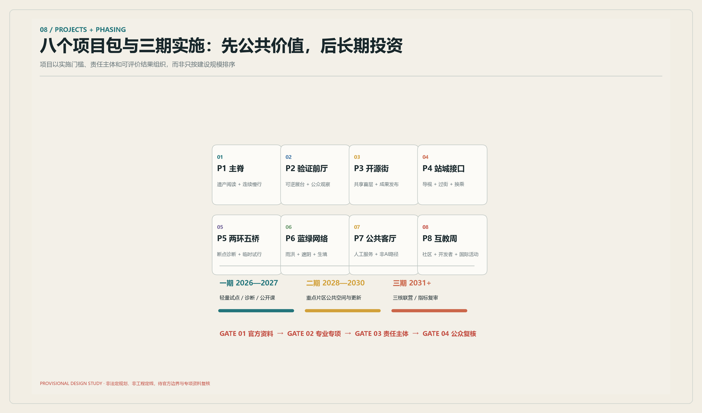

## 指标体系、面积复算与合规矩阵

### 用可复算指标校准设计｜让每项判断可追溯

指标分为四类：空间底板指标、公共价值指标、实施过程指标和资料成熟度指标。[depth:metrics_recalculation] 空间底板指标由GeoJSON复算，包括总体面积、建筑基底、绿地、公共空间和概念慢行关系；公共价值指标记录场景、画像、地标与公共服务配置；实施过程指标记录治理门通过率、试点退出率、人工接管响应和公众问题关闭率；资料成熟度指标记录官方边界、控规、权属和专项资料是否到位。

| 指标组 | 当前可复算指标 | 专业解释 |
| --- | --- | --- |
| 空间底板 | [metric:site_area_sqm] [metric:building_footprint_area_sqm] [metric:green_space_area_sqm] [metric:public_space_area_sqm] [metric:conceptual_mobility_length_m] | 均基于临时边界或概念图层，用于方案内比较 |
| 比例 | [metric:green_ratio] [metric:public_space_ratio] | official polygon 到位后整体复算 |
| 结构数量 | [metric:key_area_count] [metric:land_use_zone_count] [metric:building_carrier_count] [metric:phase_count] | 表示成果完整度，不代表审批或绩效 |
| 任务覆盖 | [metric:scenario_card_count] [metric:test_scenario_count] [metric:persona_count] [metric:landmark_count] [metric:global_case_count] | 对应任务书的最低交付要求 |

专业证据链为“来源—假设—几何—指标—图示—人工复核”。九个可读图层为总体边界、重点片区、用地、建筑、道路、绿地、公共空间、约束和分期：[data:geometry/constraints.geojson#CONSTRAINT-001]。六项专业标准已映射至 `standard_matrix.json`：[standard:PROJECT-OFFICIAL-ANNOUNCEMENT] [standard:PROJECT-AGENT-OPEN-CALL-TASKBOOK] [standard:MOHURD-URBAN-DESIGN-MEASURES] [standard:MOHURD-CONTROL-DETAILED-PLANNING] [standard:MNR-LAND-USE-CLASSIFICATION-GUIDE] [standard:MOHURD-ARCH-DESIGN-DEPTH-2016]。

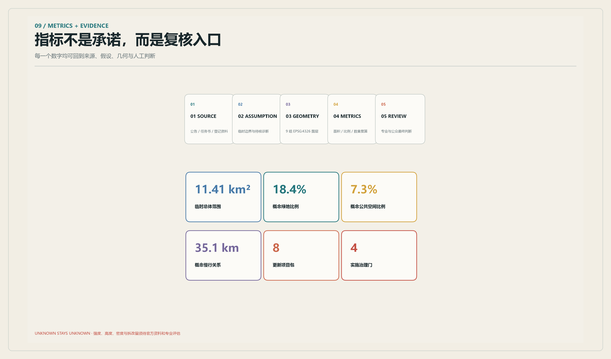

十五项设计深度由 `design_depth_matrix.json` 记录。除前文已引用项目外，还包括 [depth:risk_missing_data]；所有强度、高度和拆改留结论在缺资料条件下保持 unknown，不用“精确数字”制造确定感。

## 风险、版权与合规说明

### 明确概念方案边界｜风险、版权与责任

首要风险不是技术实现，而是把概念方案误读为法定或工程结论。所有图纸均持续显示 provisional geometry 和非审批依据说明；官方 polygon 发布后，必须替换边界并同步重算用地、建筑、道路、绿地、公共空间、分期和指标，不允许只改一张总图。[depth:risk_missing_data]

| 风险维度 | 主要风险 | 控制措施 |
| --- | --- | --- |
| 数据隐私 | 场景过度采集或二次使用个人数据 | 最小采集、明确期限、端侧处理、人工授权和删除机制 |
| 实施复杂度 | 多片区、多产权和多专业难以同步 | 项目包拆分、治理门控制、分期审批 |
| 公众接受 | AI展示压过日常生活需求 | 先解决步行、服务、遮阴和无障碍，再叠加AI场景 |
| 运维成本 | 设备和活动依赖短期资金 | 轻设备、可替换、责任主体和全生命周期预算 |
| 政策不确定 | 控规、数据和试点许可未确定 | 保持概念状态，正式资料到位后复核 |
| 空间争议 | 临时矩形被误解为地块或红线 | 图面弱化边界并持续标注 provisional |
| 技术成熟 | 模型误判、机器人或终端失效 | 小范围、低速、人工接管和可立即停止 |
| 公平包容 | 数字门槛排除老年人或残障人士 | 无障碍共测、多语说明、人工与非AI等价服务 |

本方案文字、图示、场景、离线HTML和PDF版式由AI agent为本次投稿原创生成，未嵌入第三方地图、企业标志、人物肖像或受限图片。国际案例仅引用机构官网事实并列明用途边界；系统字体只用于本地渲染，不在仓库中分发。最终对外发布、专业判断和权利确认由GitHub账号所有者及相关专业团队承担。

## 建立可追溯证据链｜参考资料

1. 北京市规划和自然资源委员会海淀分局，《百年京张AI创新带城市设计国际方案征集资格预审公告》。[source:OFFICIAL-ANNOUNCEMENT]
2. 面向全球智能体的开源征集任务书及仓库结构化摘录。[source:AGENT-TASKBOOK]
3. 开源仓库 site package、source registry 与 processed fact pack。[source:SITE-PACKAGE] [source:SOURCE-REGISTRY] [source:PROCESSED-FACT-PACK]
4. 住房城乡建设与自然资源相关城市设计、控规、用地分类和建筑设计深度标准，适用性见 `standard_matrix.json`。
5. Stanford HAI、Mila、Vector Institute、AI Singapore、IMDA AI Verify、Testbed Helsinki 官方资料，均只作机制比较。

最终设计深度索引：既有诊断、三层范围、总体结构、用地、强度、高度与形态、拆改留、交通、市政、蓝绿、重点片区、项目、分期、指标和风险已分别映射至 [depth:existing_conditions_diagnosis] [depth:three_level_scope_framework] [depth:overall_spatial_structure] [depth:land_use_layout] [depth:development_intensity_controls] [depth:height_massing_character] [depth:retain_renovate_demolish] [depth:traffic_rail_slow_parking] [depth:municipal_new_infrastructure] [depth:blue_green_public_space] [depth:three_key_area_detailed_design] [depth:renewal_project_list] [depth:phasing_implementation] [depth:metrics_recalculation] [depth:risk_missing_data]。
