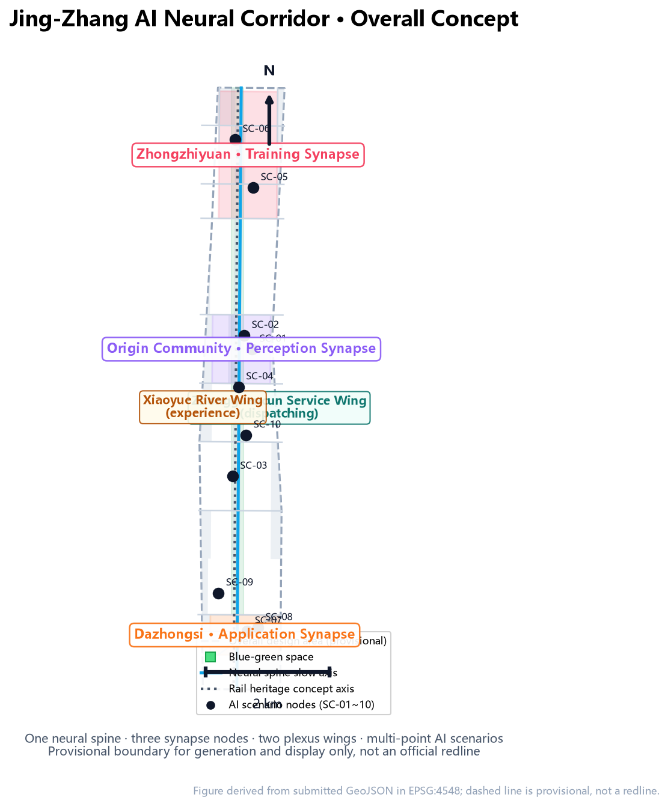
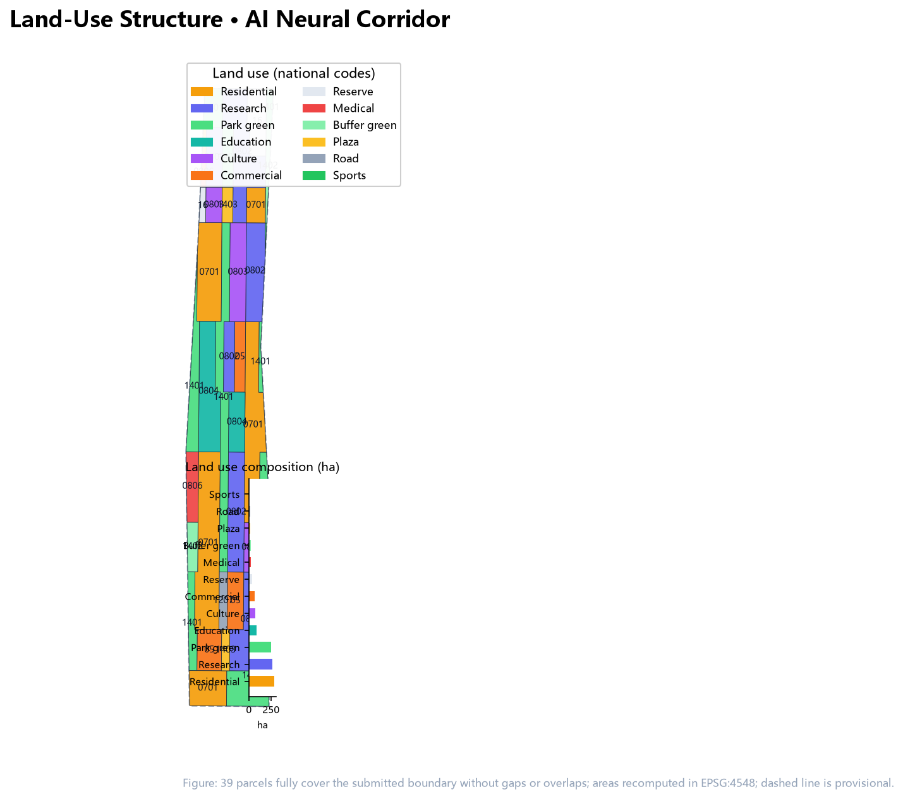
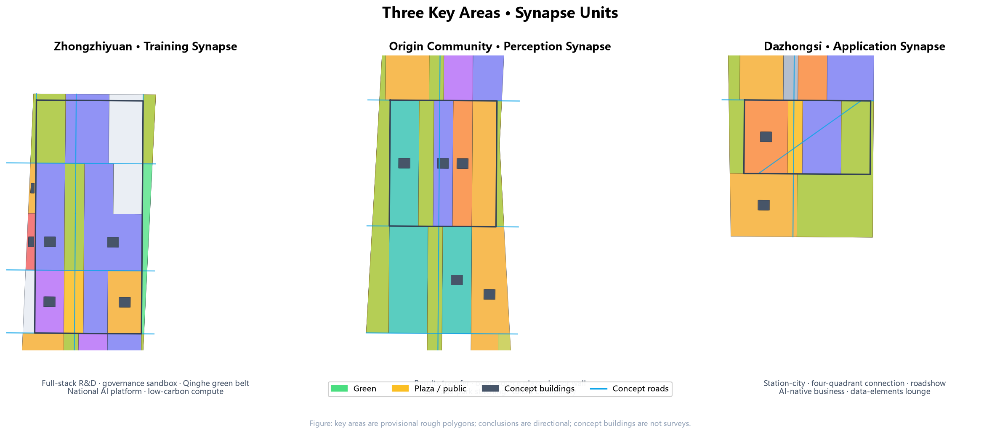
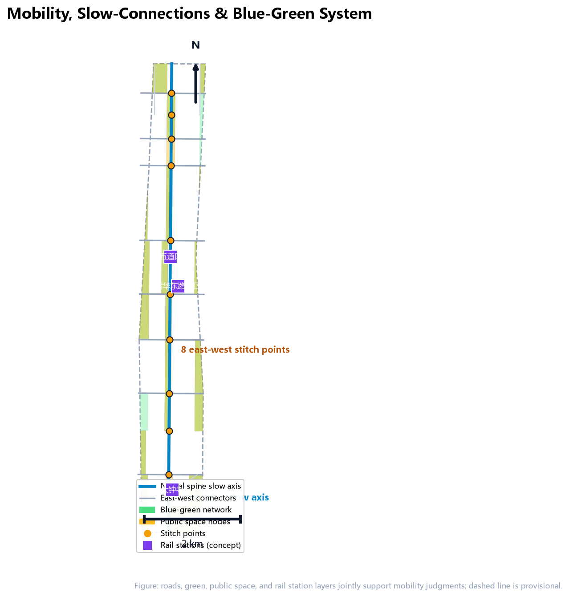
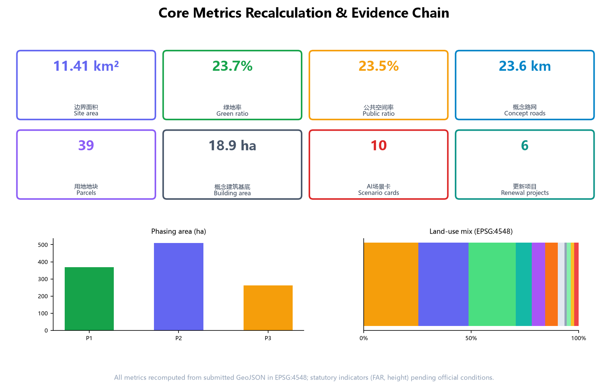

# Jing-Zhang AI Neural Corridor: A Scenario-Based AI-Native Urban Belt on a Century of Railway Memory

## Design Basis and Source Inventory

This proposal takes the "Centennial Jing-Zhang AI Innovation Belt International Urban Design Solicitation Pre-Qualification Announcement" published by the Haidian Branch of the Beijing Municipal Commission of Planning and Natural Resources as its primary basis (the announcement defines the three scope levels, three key areas, design tasks, and deliverable depth), takes the repository-maintained provisional rough boundaries and key-area polygons as its spatial starting point, and takes the agent-facing open-call taskbook as its co-creation constraints [source:OFFICIAL-ANNOUNCEMENT] [source:AGENT-TASKBOOK]. Before generation, the proposal read `design_brief.json`, `allowed_design_space.json`, `sources.json`, `enums/`, `ranges/`, `schemas/`, and `data/source_registry.json`, and selected materials according to the usage boundaries of the [source:SOURCE-REGISTRY]: formal-ready sources support task and spatial judgments, provisional-only geometry is used solely for generation, display, and self-check, and background-only material serves narrative context only.

Since the official precise boundary is not yet publicly available, this package uses the provisional `PROV-SITE-001` overall design area and the provisional `PROV-KEY-001/002/003` key areas. These features are labeled `provisional_constraint` and `official_boundary=false`; they may be used only for design generation, visualization, self-check, and design discussion, and must not be treated as an official redline, approval basis, precise-area basis, or statutory control conclusion [data:geometry/site_boundary.geojson#PROV-SITE-001] [data:geometry/key_areas.geojson#PROV-KEY-001]. The organizer's data gap itself does not block content scoring; when official polygons are released, the boundary, key areas, land use, buildings, roads, green space, public space, phasing, and all metrics must be regenerated and re-rendered, refinalized, and re-self-checked [assumption:A-CONTROLS-001].

The announcement requires regulatory-detailed-planning urban design depth and comprehensive implementation plan urban design depth [standard:PROJECT-OFFICIAL-ANNOUNCEMENT]. The proposal therefore follows a dual-track "human reading layer plus machine audit layer": the narrative explains design judgments, spatial moves, and evidence; `sources.json`, `metrics.json`, `geometry/*.geojson`, `compliance_matrix.json`, `standard_matrix.json`, and `design_depth_matrix.json` provide the complete verifiable evidence layer [depth:existing_conditions_diagnosis] [depth:metrics_recalculation]. Citation follows the v2 contract: no more than three consecutive markers per claim, and sentences remain complete when markers are removed.

## Three-Level Scope Working Framework

The three scope levels are the working framework defined by this solicitation [standard:PROJECT-OFFICIAL-ANNOUNCEMENT]. The coordinated research area of about 43.6 square kilometers answers how Haidian's AI ecosystem and future urban form should be organized; the overall design area of about 11.4 square kilometers is the full coverage of the submitted `geometry/site_boundary.geojson`, answering how urban renewal and regulatory-depth design should be organized within 1-2 kilometers around the Jing-Zhang Heritage Park; the key detailed-design area of about 368.4 hectares delivers comprehensive-implementation-plan depth design for the Zhongzhiyuan AI Acceleration Area, the Beijing AI Origin Community, and the Dazhongsi AI Industry Cluster [metric:key_area_count] [depth:three_level_scope_framework].

| Level | Area | Work in this proposal | Data anchor |
| --- | --- | --- | --- |
| Coordinated research area | 43.6 km² | World-class AI ecosystem, naming and logo, three-areas-two-wings synergy, future city form | [data:geometry/constraints.geojson#CON-RAIL-HERITAGE-001]、[source:AGENT-TASKBOOK] |
| Overall design area | 11.4 km² | Urban renewal framework, land use, transport and municipal, heritage park vitality belt, character | [data:geometry/land_use.geojson#LU-001]、[data:geometry/roads.geojson#ROAD-001] |
| Key detailed-design area | 368.4 ha | Positioning, building renewal, public space, transport and AI scenarios for three areas | [data:geometry/key_areas.geojson#PROV-KEY-002]、[data:geometry/key_areas.geojson#PROV-KEY-003] |

The three levels are not three disconnected drawing sets. The coordinated study decides industrial-chain and urban-form judgments; the overall design translates them into renewal projects, spatial structure, and facility capacity; the key-area design verifies the implementability of specific parcels, buildings, transport, public space, and AI scenarios [depth:overall_spatial_structure]. All spatial conclusions in this proposal are conceptual suggestions or reference schemes for professional teams to deepen; they are neither statutory planning, approvals, nor implementation commitments. Regulatory indicators (FAR, building height, intensity, setbacks) remain pending until official conditions are provided [depth:development_intensity_controls] [depth:risk_missing_data].

## Coordinated Research Area: Industry and Future City Study

### Overall Concept and Naming System

The overall concept is the **Jing-Zhang AI Neural Corridor (JZ·NEURAL)**, applying an "AI-Native Urbanism" method [source:AGENT-TASKBOOK]. The core is a triple translation: 111 years ago, the Jing-Zhang Railway connected Beijing to the nation's first industrial nervous system through steel rails, and Zhan Tianyou's switchback design marked the origin of autonomous technological sovereignty; today, data, computing power, and models form the city's new nervous system. The proposal translates the railway's **transport nerves** into an **urban AI neural network**: data flows are the new traffic, compute nodes are the new stations, scenario cards are the new timetables, and human review is the new dispatching discipline.

The naming system has four layers: the master name "Jing-Zhang AI Neural Corridor"; three synapse nodes named "Zhongzhiyuan·Training Synapse", "Origin Community·Perception Synapse", and "Dazhongsi·Application Synapse"; two wings named "Zhongguancun Technology Service Wing" (the dispatching wing) and "Xiaoyue River Scenario Empowerment Wing" (the experience wing); and multi-point scenario nodes (perception stations, compute kiosks, test fields, showrooms, honor walls, etc.) [depth:overall_spatial_structure]. The naming system avoids copying existing city, campus, or enterprise names while mapping one-to-one to the three official positionings (Centennial Jing-Zhang Culture Belt, Urban AI Living Experience Belt, AI-Integrated Innovation Belt) [source:AGENT-TASKBOOK].

The logo and visual identity direction uses a "switchback × synapse" motif: two rails become two data flows converging into a synapse dot, with a signal-yellow light marking "in operation". The identity system includes: the master mark, three core sub-marks (training/perception/application synapse forms), a symbol grid borrowing railway network-diagram language, a palette (rail grey = history, data cyan = compute, signal yellow = vitality), and typography and layout rules [standard:PROJECT-AGENT-OPEN-CALL-TASKBOOK]. The visual direction is a concept suggestion; font, graphic, and trademark clearance and professional branding deepening are required before use [depth:height_massing_character].

### Three Positionings, Five Functions, and the Three-Areas-Two-Wings Loop

The proposal implements the three positionings and five functions: AI full-stack self-reliant innovation system; world-class AI innovation ecosystem; AI+ scenario-empowerment paradigm; intelligent AI-vitality city; and global voice in AI governance [source:AGENT-TASKBOOK]. The three areas and two wings form a sustainable synergy loop: original innovation from universities and research institutes along Xueyuan Road and Wudaokou enters the Origin Community for sourcing and transfer; transferred models and standards enter Zhongzhiyuan for training, evaluation, and governance-rule production; mature products achieve market adoption and AI-native business incubation in Dazhongsi; the Zhongguancun Technology Service Wing feeds back capital, IP, and globally allocated factors; and the Xiaoyue River Scenario Empowerment Wing converts AI capabilities into citizen-experienceable urban life scenarios, closing the "source-train-adopt-empower" loop.

### Global AI Innovation Ecosystem Cases

To validate the loop, the proposal studies and cites six global cases (public research only; no cooperation or implementation commitment): Hangzhou's City Brain organizes urban services through scenario opening and data feedback loops, whose "scenario as algorithm iteration field" logic maps to this proposal's test-and-verify scenario mechanism [source:AGENT-TASKBOOK]; Singapore's Punggol Digital District treats the district as a laboratory integrating digital innovation and living communities, corresponding to the Zhongzhiyuan garden district; King's Cross in London regenerates a former railway yard into an innovation district through station-city integration, corresponding to the heritage park vitality belt; Barcelona's 22@ renews an old industrial quarter through policy zoning and innovation industry attraction, corresponding to Dazhongsi; Helsinki's AI Register makes public AI applications transparent, corresponding to the proposal's AI scenario disclosure cards and honor display system [depth:blue_green_public_space]; and the Toronto waterfront smart community experience signals the boundaries of public data governance, corresponding to the privacy and human-review clauses [depth:risk_missing_data]. The shared lesson is that success depends not on technical demonstrations but on long-term institutions for scenario opening, data governance, and public-space operation—precisely the institutional asset the Neural Corridor intends to accumulate.

## Overall Design Area: Urban Renewal and Regulatory-Depth Urban Design

The overall design area takes urban renewal as its lever to deeply integrate industry and space. The proposal proposes an "neural spine + synapse units + two-wing network" spatial structure: the heritage park green spine and north-south slow-mobility spine form the neural spine; the three key areas form synapse units; the science-technology service belt along Xueyuan Road-Xitucheng Road and the life-scenario belt along Heqing Road-Dazhongsi East Road form the two wings [data:geometry/land_use.geojson#LU-001] [data:geometry/roads.geojson#ROAD-001] [depth:overall_spatial_structure].

### Industry Goals and Functional Layout

Following Haidian's "1+X+1" industrial system and the three-areas-two-wings layout [source:AGENT-TASKBOOK], the land-use structure takes innovation R&D as its primary function: research land about 267.4 ha (23.4%), residential about 290.0 ha (25.4%), park green about 250.0 ha (21.9%), education about 84.9 ha (7.4%), culture about 72.6 ha (6.4%), commercial services about 67.1 ha (5.9%), reserve about 34.9 ha (3.1%), and roads, plazas, buffer green, and medical land totaling about 74.4 ha [metric:land_use_0802_area_sqm] [metric:land_use_0701_area_sqm] [metric:land_use_1401_area_sqm] [metric:land_use_parcel_count]. Land use fully covers the submitted boundary without gaps or overlaps and is fully verifiable [depth:land_use_layout] [standard:MNR-LAND-USE-CLASSIFICATION-GUIDE].

### Urban Renewal Framework

The renewal framework follows four principles: preserve the green spine, regenerate neighborhoods, complete facilities, and reserve flexibility. The Jing-Zhang Heritage Park and its north-south green spine are preserved and activated as a whole; low-efficiency buildings along Wudaokou-Qinghua East Road West and aging neighborhoods use light regeneration; the low-efficiency market area around Dazhongsi Station uses station-city integrated renewal; Zhongzhiyuan mainly builds a new research campus with reserve land kept for technological uncertainty [data:geometry/buildings.geojson#BLDG-001] [data:geometry/phasing.geojson#PHASE-P1] [depth:retain_renovate_demolish]. The retain/renovate/demolish/new-build classification is conceptual, not a parcel-level statutory conclusion; survey, ownership, and regulatory conditions await official data [depth:height_massing_character].

### Planning Building Scale and Concept Volume

The package uses 44 conceptual building footprints to express industrial-space supply logic, with a total footprint of about 18.9 ha and a concept building density of about 1.66% [metric:building_footprint_area_sqm] [metric:building_density]. This value is a conceptual design quantity recomputed from the submitted geometry to express spatial organization, not a development-intensity commitment; statutory indicators such as FAR, building height, and setbacks are recorded as `unknown` pending official regulatory conditions [metric:floor_area_ratio] [metric:building_height_m] [depth:development_intensity_controls].

### Transport, Rail, and Municipal Capacity

Transport is organized around rail station-city integration, microcirculation improvement, and slow-mobility connection [depth:traffic_rail_slow_parking]. Rail and transit hubs (Wudaokou, Qinghua East Road West, Dazhongsi, etc.) follow a station-city integration concept; the road network consists of the neural spine arterial plus eight east-west connectors, with a concept network length of about 23.6 km [metric:road_length_m] [data:geometry/roads.geojson#ROAD-025]. Municipal and new infrastructure strategy proposes merging edge computing, distributed energy, and conventional utilities: edge-compute nodes and waste-heat recovery interfaces along main neighborhoods, micro energy stations co-located with public service facilities—all as concept directions for professional teams to assess, without engineering-feasibility conclusions [depth:municipal_new_infrastructure].

## Key-Area Detailed Design

The three key areas are the spatial carriers of the synapse units and are designed to comprehensive-implementation-plan urban design depth [depth:three_key_area_detailed_design]. Because the key-area polygons are provisional rough ranges, conclusions for each area are directional only; parcel-level schemes must be regenerated once official boundaries are released [data:geometry/key_areas.geojson#PROV-KEY-001] [data:geometry/key_areas.geojson#PROV-KEY-002] [data:geometry/key_areas.geojson#PROV-KEY-003].

### Zhongzhiyuan AI Acceleration Area (Training Synapse, about 192.9 ha)

Positioning: a "garden-type full-stack self-reliant innovation district" [metric:key_area_zhongzhiyuan_ai_acceleration_area_area_sqm]. Spatial structure: "two belts, three clusters". Along the Qinghe River, a low-carbon innovation green belt; along the Fifth Ring Road, an outward-transport and display interface; in the middle, the full-stack R&D cluster (conceptual carriers for model training, chips and frameworks, data and compute infrastructure), the governance cluster (standard setting, safety evaluation, model red-team testing as displayable and collaborative spaces), and the living cluster (talent apartments and innovation exchange). Concept buildings are mainly research land, with reserve land in the north for the national AI platform. Green-space AI scenarios include plant perception, energy dispatch, and low-carbon compute experience [depth:blue_green_public_space].

### Beijing AI Origin Community (Perception Synapse, about 104.3 ha)

Positioning: a "near-campus results-transfer and talent community" [metric:key_area_beijing_ai_origin_community_area_sqm]. Leveraging the campuses along Tsinghua, Peking University, and CAS, the area organizes campus-park-street slow-mobility stitching: the central research and incubation cluster hosts results transfer, open-source collaboration, and results release; the Wudaokou-Qinghua East Road West corridor organizes station-city commercial services and talent services; the southern residential cluster uses low-disturbance organic renewal for talent housing and community life. Culture land hosts the open-source plaza, contributor honor wall, and AI results display and release hall [depth:retain_renovate_demolish].

### Dazhongsi AI Industry Cluster (Application Synapse, about 72.0 ha)

Positioning: an "urban-type intelligent economy and international-exchange district" [metric:key_area_dazhongsi_ai_industry_cluster_area_sqm]. Around Dazhongsi Station, the proposal organizes four-quadrant pedestrian connectivity and non-motorized parking: the west quadrant hosts AI-native commerce and content consumption, the east quadrant hosts research and agent/terminal R&D, the station-front plaza hosts international roadshows and public releases, and planned green land is compounded as a testable intelligent-living scenario park [data:geometry/public_space.geojson#PUBLIC-001]. Public environments around leading enterprises are renewed for "roadshow, negotiation, and display" purposes, with commercial services and green space shaping an international street interface [depth:traffic_rail_slow_parking].

## AI Innovation Ecosystem, Talent Personas, and AI+ Scenarios

### Talent Personas (5 types)

| Persona | Typical needs | Spatial response | Self-check boundary |
| --- | --- | --- | --- |
| Open-source developers | Release, collaboration, testing, community reputation | Origin Community open-source release hall, contributor honor wall, night collaboration space | No personal behavior tracking; activity data aggregated only |
| Startup teams | Low-cost office, compute access, product test field | Zhongzhiyuan shared test field, edge compute service points, governance consultation | Compute and data services require separate authorization |
| Leading-enterprise visitors | Display, business, international reception, hiring | Dazhongsi international roadshow lounge, station-city connection, public space around enterprises | Enterprise marks and cases must be cleared |
| Nearby residents | Commuting, leisure, community services, low-disturbance renewal | Heritage park slow loop, embedded community services, graded night lighting | No resident profiling for commercial recommendation |
| University faculty and students | Results transfer, cross-campus collaboration, daily walking | Campus-park slow stitching, transfer stations, AI education experience points | Campus data and research results require authorization |

### AI Scenario Cards (10, including 3 industry test-and-verify scenarios)

| No. | Scenario card | Spatial carrier | Users | Operational data | Privacy and human review | Operator |
| --- | --- | --- | --- | --- | --- | --- |
| SC-01 | Open-source release and contribution wall | Origin Community culture land | Developers, universities | Public aggregated code-contribution data | Human review of honors; no personal behavior tracking | Community operator + developer autonomy |
| SC-02 | Results-transfer station | Origin Community incubation cluster | Startups, universities | De-identified matchmaking records | Authorization for both parties; human review | Transfer service center |
| SC-03 | Edge compute kiosk | Street-level nodes | Enterprises, developers | Compute usage metering | Pay-per-use; no business data retention | Infrastructure operator |
| SC-04 | AI slow-mobility navigation (test scenario 1) | Heritage park slow spine | Residents, visitors | Anonymous density and gap detection | Low-intrusion sensing + explainable results; human review of time windows | Park operator + transport authority |
| SC-05 | Safety-governance sandbox (test scenario 2) | Zhongzhiyuan governance cluster | Enterprises, regulators, public | Evaluation records | Red-team testing disclosed by rules; human safety review | Governance lab + industry associations |
| SC-06 | Qinghe low-carbon innovation corridor | Zhongzhiyuan Qinghe interface | Enterprises, residents | Aggregated environmental sensing | Environmental data only; human O&M | Campus operator |
| SC-07 | Dazhongsi international roadshow lounge | Dazhongsi station-front plaza | Enterprises, international visitors | Event booking and outreach data | Human content review; cleared display | Exhibition operator |
| SC-08 | Data-elements lounge | Dazhongsi area | Enterprises, public agencies | Data catalog and authorization records | Compliance-based flow; human audit | Data service operator |
| SC-09 | AI life-service model street (test scenario 3) | Community-commerce junction | Residents, seniors | Aggregated service calls and satisfaction | No commercial facial/profiling use; human fallback services | Subdistrict + service operators |
| SC-10 | Global AI activity week route | Belt-wide public space | Public, global visitors | Event operations data | Cleared outreach material; human content review | Event organizing committee |

Every scenario card maps to a spatial location, target users, operational data, privacy boundary, human review, operator, and visualization layer [metric:scenario_node_count] [depth:risk_missing_data]. The three test-and-verify scenario cards (SC-04/05/09) state an explicit "test first, launch later, withdrawable" admission discipline; all are concept suggestions, not approved operations [source:AGENT-TASKBOOK].

## Land Use, Building Scale, and Retain/Renovate/Demolish

Land use follows the principles of research leadership, balanced jobs-housing-commerce-services, networked blue-green space, and flexible reserve: research and culture land concentrates along both sides of the neural spine to form an innovation belt; residential land forms talent-living belts on the east and west; commercial services align with rail stations and street frontages; park green, buffer green, and plazas form a continuous blue-green network; reserve land is kept in northern Zhongzhiyuan and urban-renewal potential areas [metric:land_use_0803_area_sqm] [metric:land_use_0804_area_sqm] [metric:land_use_05_area_sqm] [metric:land_use_16_area_sqm] [metric:land_use_0806_area_sqm] [metric:land_use_1207_area_sqm] [metric:land_use_1402_area_sqm] [metric:land_use_1403_area_sqm]. Land-use classification follows the national territorial land-use codes consistent with [standard:MNR-LAND-USE-CLASSIFICATION-GUIDE]; all 39 parcels carry code, label, and area [depth:land_use_layout].

Building scale is expressed conceptually: research/industry buildings dominate the footprint along the neural spine forming a continuous R&D frontage; residential buildings are organized in medium- and low-intensity street fabrics; culture, education, sports, and medical buildings are distributed as public nodes [data:geometry/buildings.geojson#BLDG-044]. The retain/renovate/demolish classification is conceptual: retained objects include the built green areas and intact neighborhoods along the heritage park; renovated objects include the Wudaokou commercial district and low-efficiency buildings along Xueyuan Road; demolished objects are conceptual low-efficiency markets within station-city renewal (pending survey); new buildings concentrate in the Zhongzhiyuan research campus and key areas [depth:retain_renovate_demolish]. All are concept suggestions, not statutory planning, approvals, or engineering conclusions [depth:development_intensity_controls].

## Transport, Rail, Municipal, and Public Service Facilities

Transport organization uses three actions: rail station-city integration, a through slow-mobility spine, and microcirculation gap fixing [depth:traffic_rail_slow_parking]. The neural spine (heritage park green spine plus slow-mobility spine) runs north-south, and east-west connector roads stitch the urban fabric cut by the railway for a century; the concept network of 25 segments totals about 23.6 km, with the vertical artery carrying the "neural trunk" image and eight east-west connectors corresponding to heritage-park stitching points [metric:road_length_m] [data:geometry/roads.geojson#ROAD-001]. Rail stations (Wudaokou, Qinghua East Road West, Dazhongsi) and key parcels are connected through concept pedestrian connectivity and non-motorized parking, especially the four-quadrant connectivity at Dazhongsi Station [depth:traffic_rail_slow_parking].

Municipal and new infrastructure strategy proposes integration: edge-compute and distributed-energy interfaces along main neighborhoods co-located with conventional water, power, and heat utilities; innovation service platforms and talent-life facilities at two levels ("station-city integration + community embedded"); public service facilities (medical, sports, culture) anchored in the land use [depth:municipal_new_infrastructure]. All facility strategies are concept suggestions; professional calculations of energy load and municipal capacity await official data and professional teams [assumption:A-CONTROLS-001].

## Blue-Green Space, Public Space, and Urban Character

The blue-green system uses a "one spine, two rivers, one network" structure: the heritage park green spine as the axis, with the Qinghe and (conceptually) the Xiaoyue River corridors as two wings; about 250.0 ha of park green and 20.8 ha of buffer green form a connected network, giving a green ratio of about 23.7% and a public-space ratio of about 23.5% [metric:green_ratio] [metric:public_space_ratio] [metric:green_space_area_sqm] [metric:public_space_area_sqm] [depth:blue_green_public_space]. Public space includes station-front plazas, the open-source plaza, the contributor honor wall, the international roadshow lounge, and community parks, forming with the green spine a walkable, assemblable, and displayable public-space network [data:geometry/green_space.geojson#GREEN-001] [data:geometry/public_space.geojson#PUBLIC-012] [depth:three_key_area_detailed_design].

### AI Pilgrimage Landmarks and Honor Display System (at least 3)

The proposal proposes three conceptual AI pilgrimage landmarks and honor display nodes [source:AGENT-TASKBOOK]: ① "Kilometer Zero Neural Source" - at the Dazhongsi station-front plaza, a memorial node expressing the "from railway to neural network" narrative with a rail cross-section and data-flow sculpture; ② "Tsinghuayuan·Source of Perception" - in the Origin Community, integrating the Tsinghuayuan Station cultural resource with a results-release and honor-display hall carrying the open-source contributor wall and AI milestone exhibits; ③ "Zhongzhiyuan·Tower of Compute" - in the Zhongzhiyuan governance cluster, a transparent display node for model evaluation and safety governance, with the image of "observable compute" [depth:overall_spatial_structure]. The honor display system uses a three-level structure of contributor badges, milestone walls, and annual honor ceremonies, converting open-source collaboration, scenario opening, and international outreach contributions into displayable urban assets. The landmarks are concept suggestions, do not violate heritage, green-line, or traffic safety constraints, and avoid entertainment- or internet-fad-style expression [depth:blue_green_public_space].

### Urban Character and Landscape Nodes

The urban keynote is "historic rails × data flows", superimposing Jing-Zhang railway culture, Zhongguancun innovation culture, and AI new culture [source:AGENT-TASKBOOK]. Character guidance proposes direction for building height, intensity, roof form, and massing (concept guidance values pending official regulatory conditions), and landscape nodes focus on the southern and northern ends of the heritage park and the ring-road crossing [depth:height_massing_character] [standard:MOHURD-URBAN-DESIGN-MEASURES].

## Renewal Project List, Implementation Policies, and Phasing

The renewal project list (6 items) and phasing plan [depth:renewal_project_list] [depth:phasing_implementation]:

| No. | Renewal project | Location | Type | Phase | Dependencies |
| --- | --- | --- | --- | --- | --- |
| UP-01 | Heritage park north-south through-connection and slow-mobility gap stitching | Full neural spine | Public space | P1 | Official boundary, road redlines |
| UP-02 | Dazhongsi station-city integrated renewal | Dazhongsi key area | Station renewal + retain/renovate/demolish | P1 | Station scheme, ownership, engineering conditions |
| UP-03 | Origin Community low-disturbance organic renewal | Origin Community | Light renewal + transfer carriers | P1 | Building survey, campus coordination |
| UP-04 | Zhongzhiyuan garden-type research campus | Zhongzhiyuan key area | New campus | P2 | National AI platform scheme, regulatory conditions |
| UP-05 | Xueyuan Road corridor industry building regeneration | East wing corridor | Building regeneration | P2 | Owner coordination, industry attraction |
| UP-06 | Xiaoyue River scenario-empowerment belt | West wing corridor | Blue-green + scenarios | P3 | Blue-line and ecological constraints |

Phasing: P1 (2026-2028) about 369.1 ha, launching the brand through public space and station-city renewal [metric:phase_P1_area_sqm]; P2 (2028-2031) about 510.7 ha, building industrial carriers into clusters [metric:phase_P2_area_sqm]; P3 (2031-2035) about 261.4 ha, completing the belt through scenario belts and reserve conversion [metric:phase_P3_area_sqm]. Implementation policy suggestions include scenario opening and testing-admission management measures, developer-community operation mechanisms, honor-display and brand-event mechanisms, and data-elements flow compliance mechanisms; all are concept suggestions, not confirmed government arrangements [depth:phasing_implementation].

### Global AI Event System and Long-Term Operations (agent.6 response)

The annual event system uses a "one theme per season, one scenario per month" structure: spring "Neural Source·AI Pilgrimage Week" (cultural narrative and honor ceremonies), summer "Open-Source Collaboration Marathon" (developer community), autumn "Jing-Zhang AI Industry Conference + Test-and-Verify Open Day" (industry and governance), and winter "Scenario City Festival" (public experience and global outreach) [source:AGENT-TASKBOOK]. Operations include: a "contribution points - honor badges - results display" loop for the developer community; a five-step "apply - test - disclose - evaluate - withdraw" admission for scenario opening; "visitable, bookable, explainable" standards for public experience and landmark operations; and international outreach through annual reports, AI scenario disclosure cards, and open-governance white papers to accumulate brand assets. All events and operations are concept suggestions and deepening directions, not confirmed arrangements [depth:renewal_project_list] [depth:risk_missing_data].

## Indicator System, Area Recalculation, and Compliance Matrix

The indicator system is recomputed from the submitted geometry in EPSG:4548; every known metric has its formula, source files, and confidence in `metrics.json` [depth:metrics_recalculation]. Core indicators explained:

- **Green ratio about 23.7% and public-space ratio about 23.5%**: the two ratios jointly support talent living and innovation exchange - green space carries the garden-city rest and carbon functions, public space carries open-source assembly, roadshow display, and daily exchange, connected into a network along the neural spine [metric:green_ratio] [metric:public_space_ratio].
- **Research and culture land totaling about 34%**: this expresses the industrial-space supply of the innovation belt - about 267.4 ha of research and 72.6 ha of culture concentrate along both sides of the spine as the spatial skeleton for full-stack innovation and results display [metric:land_use_0802_area_sqm] [metric:land_use_0803_area_sqm].
- **Concept road network of 23.6 km**: organized as "one vertical, eight horizontals" to support station-city integration and stitching concepts [metric:road_length_m].
- **Three key-area areas**: Zhongzhiyuan about 192.9 ha, Origin Community about 104.3 ha, Dazhongsi about 72.0 ha, recomputed from the submitted provisional key-area polygons [metric:key_area_zhongzhiyuan_ai_acceleration_area_area_sqm] [metric:key_area_beijing_ai_origin_community_area_sqm] [metric:key_area_dazhongsi_ai_industry_cluster_area_sqm].

Complete metric recalculation table (machine audit layer, not repeated in the narrative):

| Metric | Value | Unit | Evidence |
| --- | --- | --- | --- |
| Submitted boundary area | 11,412,825 | sqm | [metric:site_area_sqm] |
| Green space area | 2,707,931 | sqm | [metric:green_space_area_sqm] |
| Public space area | 2,677,553 | sqm | [metric:public_space_area_sqm] |
| Building footprint area | 189,230 | sqm | [metric:building_footprint_area_sqm] |
| Building density (concept) | 1.66% | ratio | [metric:building_density] |
| Land-use parcels | 39 | count | [metric:land_use_parcel_count] |
| Key-area count | 3 | count | [metric:key_area_count] |
| Scenario cards | 10 | count | [metric:scenario_node_count] |
| Renewal projects | 6 | count | [metric:renewal_project_count] |
| Residential land area | 2,899,566 | sqm | [metric:land_use_0701_area_sqm] |
| Research land area | 2,673,721 | sqm | [metric:land_use_0802_area_sqm] |
| Culture land area | 726,431 | sqm | [metric:land_use_0803_area_sqm] |
| Education land area | 848,891 | sqm | [metric:land_use_0804_area_sqm] |
| Medical land area | 242,264 | sqm | [metric:land_use_0806_area_sqm] |
| Commercial services area | 671,351 | sqm | [metric:land_use_05_area_sqm] |
| Road land area | 116,142 | sqm | [metric:land_use_1207_area_sqm] |
| Park green area | 2,499,614 | sqm | [metric:land_use_1401_area_sqm] |
| Buffer green area | 208,318 | sqm | [metric:land_use_1402_area_sqm] |
| Plaza area | 177,940 | sqm | [metric:land_use_1403_area_sqm] |
| Reserve land area | 348,608 | sqm | [metric:land_use_16_area_sqm] |
| Phase P1 area | 3,691,085 | sqm | [metric:phase_P1_area_sqm] |
| Phase P2 area | 5,107,496 | sqm | [metric:phase_P2_area_sqm] |
| Phase P3 area | 2,614,300 | sqm | [metric:phase_P3_area_sqm] |
| FAR (pending) | - | ratio | [metric:floor_area_ratio] |
| Building height (pending) | - | m | [metric:building_height_m] |

Task coverage: all 23 tasks of announcement sections 1.3, 1.4, and 1.5 and all agent.1-6 tasks are covered item by item in `compliance_matrix.json` and mapped to narrative sections, layers, metrics, drawings, and visualization sections [standard:PROJECT-OFFICIAL-ANNOUNCEMENT] [standard:PROJECT-AGENT-OPEN-CALL-TASKBOOK]. All five mandatory professional standards are addressed in `standard_matrix.json` [standard:MOHURD-URBAN-DESIGN-MEASURES] [standard:MOHURD-CONTROL-DETAILED-PLANNING] [standard:MNR-LAND-USE-CLASSIFICATION-GUIDE]; all 15 design-depth items are marked complete in `design_depth_matrix.json` [depth:metrics_recalculation].

## Risks, Copyright, and Compliance

This proposal strictly observes the following boundaries [standard:PROJECT-OFFICIAL-ANNOUNCEMENT]: 1) provisional-boundary risk - all spatial metrics are recomputed from provisional polygons; a full recalculation is required after official boundaries are released [depth:risk_missing_data]; 2) data compliance - only public or cleared materials are used; OSM data (if cited) follows ODbL attribution; no non-public maps, internal data, or personal privacy data are used [source:SOURCE-REGISTRY]; 3) copyright - logo, fonts, graphics, enterprise marks, and personal portraits are directional suggestions requiring clearance before use; A3/A0 drawings and HTML embed no unauthorized material; see `report/copyright_statement.md` [depth:existing_conditions_diagnosis]; 4) AI-generation disclosure - this proposal was generated by an AI agent from public materials; every judgment is traceable to sources/metrics/geometry, and generation method and limits are recorded in `agent.json`; 5) no prohibited commitments - nothing is stated as approved government decisions, confirmed investment or capital attraction, confirmed engineering feasibility, or completed construction; 6) professional review - all statutory, engineering, investment, and approval conclusions require review by licensed professionals [assumption:A-CONTROLS-001].

## References

- Beijing Municipal Commission of Planning and Natural Resources, Haidian Branch: Pre-Qualification Announcement of the Centennial Jing-Zhang AI Innovation Belt International Urban Design Solicitation (2026-05-09), https://ghzrzyw.beijing.gov.cn/zhengwuxinxi/tzgg/hd/202605/t20260509_4643047.html
- Excerpt of the agent-facing open-call taskbook for the Centennial Jing-Zhang AI Innovation Belt urban design (user-provided cleared material, 2026-05-18)
- Beijing Municipal Science and Technology Commission / Zhongguancun Administrative Committee: "Three Areas and Two Wings: Building a World-Class AI Cluster" (2026-04-03)
- Haidian District People's Government: "Haidian Releases the '1+X+1' Modern Industrial System Layout" (2026-03-02)
- MOHURD: Urban Design Administration Measures (2017)
- MOHURD: Measures for Compilation and Approval of Regulatory Detailed Plans of Cities and Towns
- Ministry of Natural Resources: Guidelines for Land/Sea Use Classification in Territorial Spatial Surveys, Planning, and Use Control (2023-11-22)
- Repository public source registry data/source_registry.json and provisional boundary derivation note brief/site-package/geometry/provisional_boundaries_basis.md
- CAC and six other departments: Interim Measures for the Administration of Generative AI Services (2023-07-13)
- NPC Standing Committee: Law of the People's Republic of China on Building a Barrier-Free Environment (2023-06-28)
