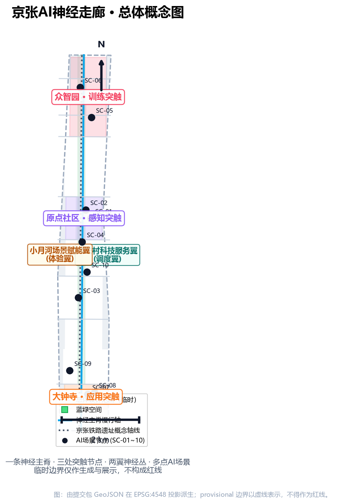
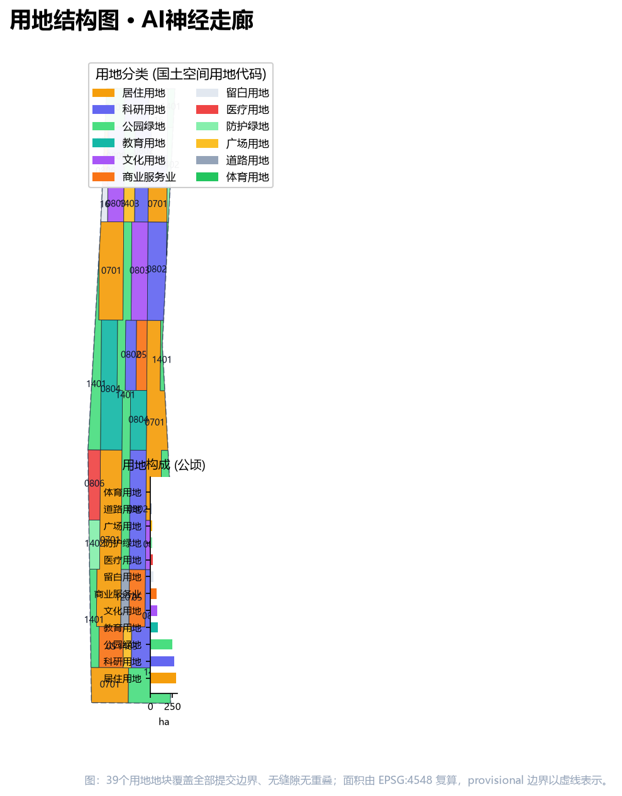
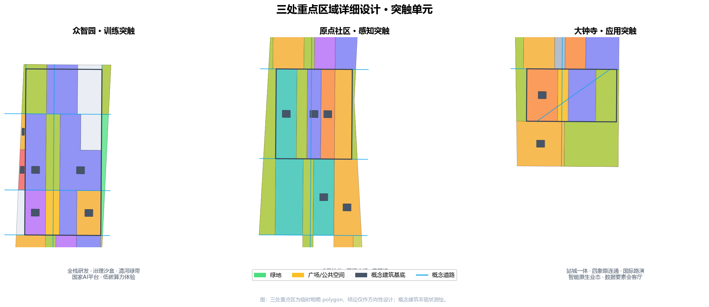
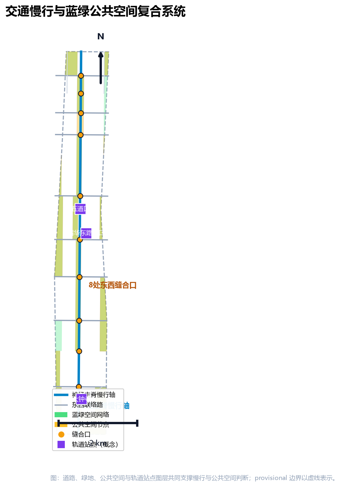
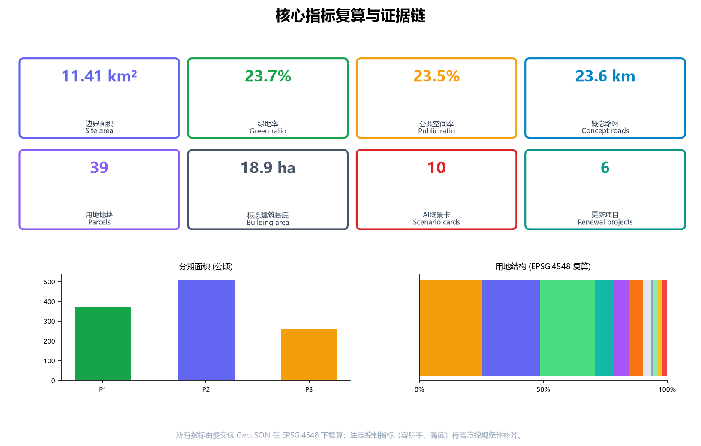

# 京张AI神经走廊：百年铁路记忆上的场景化AI原生城市带设计

## 设计依据与资料清单

本方案以北京市规划和自然资源委员会海淀分局发布的《百年京张AI创新带城市设计国际方案征集资格预审公告》为第一依据（公告给出三层范围、三处重点区域、设计任务与成果深度），以仓库维护者登记的临时粗略边界与重点区 polygon 为空间起点，以面向智能体的开源征集任务书为共创约束 [source:OFFICIAL-ANNOUNCEMENT] [source:AGENT-TASKBOOK]。方案生成前读取了 `design_brief.json`、`allowed_design_space.json`、`sources.json`、`enums/`、`ranges/`、`schemas/` 与 `data/source_registry.json`，并按 [source:SOURCE-REGISTRY] 的用途边界选用资料：formal 可用资料仅用于任务与空间判断，provisional-only 边界仅用于生成、展示与自检，background-only 材料只作叙事背景。

当前官方精确边界尚未在公开渠道取得，本包使用 `PROV-SITE-001` 临时总体设计范围与 `PROV-KEY-001/002/003` 三处临时重点区。这些要素均标注为 `provisional_constraint`、`official_boundary=false`，只能用于方案生成、可视化、自检与设计讨论，不得作为 official redline、审批依据、精确面积或法定控制结论 [data:geometry/site_boundary.geojson#PROV-SITE-001] [data:geometry/key_areas.geojson#PROV-KEY-001]。组织方数据缺口不阻断内容评分；官方 polygon 发布后需整体替换边界、重点区、用地、建筑、道路、绿地、公共空间、分期与全部指标，并重新运行渲染、终检与自检 [assumption:A-CONTROLS-001]。

公告要求达到控制性详细规划的城市设计深度与规划综合实施方案的城市设计深度 [standard:PROJECT-OFFICIAL-ANNOUNCEMENT]。因此本方案坚持“人读层+机器审计层”双轨：正文解释设计判断、空间动作与依据；`sources.json`、`metrics.json`、`geometry/*.geojson`、`compliance_matrix.json`、`standard_matrix.json` 与 `design_depth_matrix.json` 提供完整可复核证据 [depth:existing_conditions_diagnosis] [depth:metrics_recalculation]。正文引用遵循 v2 规则，同一处连续引用不超过 3 条；删除引用标记后句子仍完整可读。

## 三层范围工作框架

三层范围是本次征集确定的工作框架 [standard:PROJECT-OFFICIAL-ANNOUNCEMENT]。统筹研究范围约 43.6 平方公里，回答“海淀AI产业生态如何组织、未来城市形态如何构建”；总体设计范围约 11.4 平方公里，是本方案提交 `geometry/site_boundary.geojson` 的全部覆盖范围，回答“围绕京张遗址公园 1-2 公里的城市更新与控规深度设计”；重点区域范围约 368.4 公顷，对众智园AI自主创新加速区、北京AI原点社区、大钟寺AI产业集聚区开展规划综合实施方案深度设计 [metric:key_area_count] [depth:three_level_scope_framework]。

| 层级 | 面积 | 本方案工作内容 | 数据落点 |
| --- | --- | --- | --- |
| 统筹研究范围 | 43.6 km² | 世界级AI创新生态、命名与Logo、三区两翼协同、未来城市形态 | [data:geometry/constraints.geojson#CON-RAIL-HERITAGE-001]、[source:AGENT-TASKBOOK] |
| 总体设计范围 | 11.4 km² | 城市更新总体框架、用地布局、交通市政、公园活力带、风貌 | [data:geometry/land_use.geojson#LU-001]、[data:geometry/roads.geojson#ROAD-001] |
| 重点区域范围 | 368.4 ha | 三处重点片区定位、建筑更新、公共空间、交通与AI场景 | [data:geometry/key_areas.geojson#PROV-KEY-002]、[data:geometry/key_areas.geojson#PROV-KEY-003] |

三层范围不是三张割裂的图纸。统筹研究决定产业链与城市形态判断，总体设计把判断落实为更新项目、空间结构与设施承载，重点区域详细设计验证具体地块、建筑、交通、公共空间与AI场景的可实施性 [depth:overall_spatial_structure]。本方案所有空间结论均为“概念建议/参考方案/可供专业团队深化研究”，不构成法定规划、审批或实施承诺；控规类指标（容积率、建筑高度、开发强度、退线）在官方条件补齐前统一记为待确认 [depth:development_intensity_controls] [depth:risk_missing_data]。

## 统筹研究范围产业与未来城市研究

### 总体概念与命名体系

本方案总体概念为**「京张AI神经走廊」（Jing-Zhang AI Neural Corridor，简称 JZ·NEURAL）**，以“AI原生城市主义”为设计方法 [source:AGENT-TASKBOOK]。概念内核是三重转译：一百一十年前，京张铁路用钢轨把全国最早的工业神经系统接入北京，詹天佑的人字形线路是“自主技术主权”的原点；今天，数据、算力与模型构成城市新的神经系统。方案把铁路遗产的**运输神经**转译为**城市AI神经网络**：数据流即新的车流，算力节点即新的车站，场景卡即新的时刻表，人工复核即新的调度纪律。

命名体系采用“一带—三核—两翼—多点”四层结构：主名「京张AI神经走廊」；三处突触节点分别命名为「众智园·训练突触」「原点社区·感知突触」「大钟寺·应用突触」；两翼为「中关村科技服务翼」（调度翼）与「小月河场景赋能翼」（体验翼）；多点即场景卡落地节点（感知站、算力亭、测试场、展示厅、荣誉墙等）[depth:overall_spatial_structure]。该命名体系避开照搬城市、园区或企业现有名称，同时与三大定位（百年京张文化带、都市AI生活体验带、AI融合创新带）一一对应 [source:AGENT-TASKBOOK]。

Logo 与视觉识别方向：以“人字形道岔×神经突触”为母题——两条钢轨化作两条数据流，在节点处汇聚为突触圆点，圆点内以信号灯黄点亮“正在运行”的生命感。识别系统包含：主标识、三核子标识（训练/感知/应用三种突触形态）、符号网格（借用铁路线网图语言）、色板（钢轨灰=历史、数据青=算力、信号黄=活力）、字体与版式规则 [standard:PROJECT-AGENT-OPEN-CALL-TASKBOOK]。视觉方向为概念建议，正式使用前需完成字体、图形与商标清权，并交由专业品牌团队深化 [depth:height_massing_character]。

### 三大定位、五大功能与三区两翼协同回路

方案落实三大定位与五大功能：AI全栈自主创新体系、世界级AI创新生态、AI+场景赋能新范式、智能化AI活力城市、AI治理全球话语权 [source:AGENT-TASKBOOK]。三区两翼构成一个可持续运转的协同回路：高校与科研院所（沿学院路、五道口）的原始创新输入原点社区形成策源与转化；转化后的模型与标准进入众智园完成训练、评测与治理规则生产；成熟产品在大钟寺完成市场采用与智能原生新业态培育；中关村科技服务翼以资本、IP、要素全球化配置反哺三区；小月河场景赋能翼把AI能力转化为市民可体验的城市生活场景，形成“策源—训练—采用—赋能”的循环。

### 全球AI创新生态案例

为验证该回路，方案研究并摘引 6 个全球案例（案例为公开资料研究，不构成企业合作或落地承诺）：杭州城市大脑以场景开放和数据闭环组织城市服务，其“场景即算法迭代场”的思路对应本方案测试验证场景机制 [source:AGENT-TASKBOOK]；新加坡榜鹅数字园区以“园区即实验室”组织数字创新与生活社区，对应众智园花园型街区；英国伦敦国王十字以站城一体更新把废弃铁路转译为创新街区，对应京张遗址公园活力带；巴塞罗那22@以政策分区与创新产业导入实现老工业区更新，对应大钟寺更新；芬兰赫尔辛基AI注册表把公共AI应用透明化，对应本方案“AI场景公示卡”与荣誉展示体系 [depth:blue_green_public_space]；多伦多滨水区智能社区经验提示公共数据治理边界，对应本方案隐私与人工复核条款 [depth:risk_missing_data]。六案例的共同启示是：成功的关键不在技术演示，而在场景开放、数据治理与公共空间经营的长期机制——这正是“神经走廊”要沉淀的制度资产。

## 总体设计范围城市更新与控规深度城市设计

总体设计范围以城市更新为抓手，产业与空间深度融合。本方案提出“神经主脊+突触单元+两翼网络”的总体空间结构：以京张遗址公园绿脊与南北慢行主脊为“神经主脊”；以三处重点区为“突触单元”；以学院路-西土城路沿线科技服务带与荷清路-大钟寺东路生活场景带为两翼网络 [data:geometry/land_use.geojson#LU-001] [data:geometry/roads.geojson#ROAD-001] [depth:overall_spatial_structure]。

### 产业目标与功能布局

依据海淀“1+X+1”产业体系与三区两翼布局 [source:AGENT-TASKBOOK]，本方案用地结构以创新研发为第一功能：科研用地约267.4公顷（23.4%）、居住约290.0公顷（25.4%）、公园绿地约250.0公顷（21.9%）、教育约84.9公顷（7.4%）、文化约72.6公顷（6.4%）、商业服务业约67.1公顷（5.9%）、留白约34.9公顷（3.1%），道路、广场、防护绿地与医疗用地合计约74.4公顷 [metric:land_use_0802_area_sqm] [metric:land_use_0701_area_sqm] [metric:land_use_parcel_count]。用地完全覆盖提交边界、无重叠无缝隙，全部可复核 [depth:land_use_layout] [standard:MNR-LAND-USE-CLASSIFICATION-GUIDE]。

### 城市更新总体框架

更新框架遵循“保绿脊、改街坊、补设施、留弹性”四原则：京张遗址公园及其南北贯通绿带整体保留并活化；五道口-清华东路沿线低效楼宇与老旧街坊以微更新为主；大钟寺站周边低效市场区以站点一体化更新为主；众智园以新建科研园区为主并保留适量留白应对技术演进的不确定性 [data:geometry/buildings.geojson#BLDG-001] [data:geometry/phasing.geojson#PHASE-P1] [depth:retain_renovate_demolish]。拆改留为概念分级（保留/改造/拆除/新建），不构成地块级法定结论；现状建筑测绘、权属与控规条件待正式资料补齐 [depth:height_massing_character]。

### 规划建筑规模与概念体量

本包以 44 个概念建筑基底表达产业空间供给逻辑，总基底约18.9公顷、概念建筑密度约1.66% [metric:building_footprint_area_sqm] [metric:building_density]。该数值仅为由提交几何复算的概念设计量，用于表达空间组织而非开发强度承诺；容积率、建筑高度、退线等法定控制指标在官方控规条件缺失时统一记为 `unknown` 待确认 [metric:floor_area_ratio] [metric:building_height_m] [depth:development_intensity_controls]。

### 交通、轨道与市政承载

总体设计围绕“轨道站城一体+微循环改善+慢行贯通”组织交通 [depth:traffic_rail_slow_parking]。轨道与公交枢纽（五道口、清华东路西口、大钟寺等站点）按站城一体化概念布局；路网以神经主脊纵线加 8 条东西联络线构成，概念路网总长约23.6公里 [metric:road_length_m] [data:geometry/roads.geojson#ROAD-025]。市政与新型基础设施提出“端侧算力+分布式能源与传统市政设施融合”的策略方向：沿主要街坊布局端侧算力节点与余热回收接口，结合公共服务设施设置微型能源站，作为待专业团队测算的概念路径，不给出工程可行性结论 [depth:municipal_new_infrastructure]。

## 重点区域详细设计

三处重点区域是“突触单元”的空间载体，均达到规划综合实施方案的规划综合实施方案设计深度要求 [depth:three_key_area_detailed_design]。因重点区 polygon 为临时粗略范围，各片区结论只能作为方向性设计，官方范围发布后需按新边界重做地块级方案 [data:geometry/key_areas.geojson#PROV-KEY-001] [data:geometry/key_areas.geojson#PROV-KEY-002] [data:geometry/key_areas.geojson#PROV-KEY-003]。

### 众智园AI自主创新加速区（训练突触，约192.9公顷）

定位为“花园型全栈自主创新街区” [metric:key_area_zhongzhiyuan_ai_acceleration_area_area_sqm]。空间结构为“两带三簇”：沿清河组织低碳创新绿带，沿五环组织对外交通与展示界面；中部布置全栈研发簇（模型训练、芯片与框架、数据与算力基础设施的概念承载）、治理簇（标准制定、安全评测、模型红队测试的展示与协作空间）、生活簇（人才公寓与创新交往）。概念建筑以科研用地为主，北侧保留留白以应对国家AI平台建设的不确定性。绿带内设置植物感知、能源调度、低碳算力体验等绿色空间AI场景 [depth:blue_green_public_space]。

### 北京AI原点社区（感知突触，约104.3公顷）

定位为“近校型成果转化与人才社区” [metric:key_area_beijing_ai_origin_community_area_sqm]。依托清华、北大、中科院沿线校区，组织“校区—园区—街区”慢行缝合：中部科研与孵化簇承载成果转化、开源协作与成果发布；沿五道口-清华东路西口组织站城一体化商业服务与人才服务；南侧居住簇以低扰动、有机更新方式提供人才居住与社区生活。规划文化用地承载开源广场、贡献者荣誉墙与AI成果展示发布厅 [depth:retain_renovate_demolish]。

### 大钟寺AI产业聚集区（应用突触，约72.0公顷）

定位为“城市型智能经济与国际交往街区” [metric:key_area_dazhongsi_ai_industry_cluster_area_sqm]。围绕大钟寺站组织四象限步行连通与非机动车停放：西象限为智能原生商业与内容消费，东象限为科研与智能体/终端研发，站前广场承载国际路演与公共发布，规划绿地复合利用为可试验的智能生活场景公园 [data:geometry/public_space.geojson#PUBLIC-001]。重点企业周边公共环境以“可路演、可洽谈、可展示”为目标更新，商业服务业态与绿色空间共同塑造国际化街区界面 [depth:traffic_rail_slow_parking]。

## AI 创新生态、人才画像与 AI+ 场景

### 人才画像（5类）

| 用户画像 | 典型需求 | 空间响应 | 自检边界 |
| --- | --- | --- | --- |
| 开源开发者 | 发布、协作、测试、社区声誉 | 原点社区开源发布厅、贡献者荣誉墙、夜间协作空间 | 不采集个人行为轨迹；活动数据只做聚合统计 |
| 初创团队 | 低成本办公、算力入口、产品试验场 | 众智园共享测试场、端侧算力服务点、治理咨询窗口 | 算力与数据服务需另行授权 |
| 头部企业访客 | 展示、商务、国际接待、人才招聘 | 大钟寺国际路演客厅、站城接驳、重点企业周边公共空间 | 企业标识与案例必须清权 |
| 周边居民 | 通勤、休闲、社区服务、低扰动更新 | 遗址公园慢行环、社区服务嵌入、夜间照明分级 | 不将居民画像用于商业推荐 |
| 高校师生 | 成果转化、跨校协作、日常慢行 | 校区-园区慢行缝合、成果转化驿站、AI教育体验点 | 校园数据与科研成果需授权 |

### AI场景卡（10张，含3个产业测试验证场景）

| 编号 | 场景卡 | 空间载体 | 服务对象 | 运行数据 | 隐私与人工复核 | 运营主体 |
| --- | --- | --- | --- | --- | --- | --- |
| SC-01 | 开源发布与贡献墙 | 原点社区文化用地 | 开发者、高校 | 公开代码贡献聚合数据 | 人工审核荣誉认定；不采集个人行为轨迹 | 社区运营方+开发者自治 |
| SC-02 | 成果转化驿站 | 原点社区孵化簇 | 初创、高校 | 对接记录（脱敏） | 需求撮合需双方授权；人工复核 | 转化服务中心 |
| SC-03 | 端侧算力驿站 | 街道级节点 | 企业、开发者 | 算力使用计量 | 计费即用即付；不沉淀业务数据 | 基础设施运营方 |
| SC-04 | AI慢行导航（测试验证场景①） | 遗址公园慢行脊 | 居民、游客 | 匿名密度与断点识别 | 低侵入传感+可解释结果；人工复核时段管理 | 公园运营方+交通部门 |
| SC-05 | 安全治理沙盒（测试验证场景②） | 众智园治理簇 | 企业、监管、公众 | 评测记录 | 红队测试按规则披露；人工安全复核 | 治理实验室+行业组织 |
| SC-06 | 清河低碳创新廊 | 众智园清河界面 | 企业、居民 | 环境感知聚合数据 | 传感器仅采环境数据；人工运维 | 园区运营方 |
| SC-07 | 大钟寺国际路演客厅 | 大钟寺站前广场 | 企业、国际访客 | 活动预约与传播数据 | 活动内容人工审核；按清权要求展示 | 会展运营机构 |
| SC-08 | 数据要素会客厅 | 大钟寺片区 | 企业、公共机构 | 数据目录与授权记录 | 数据流通以合规授权为前提；人工审计 | 数据服务运营方 |
| SC-09 | AI生活服务样板街（测试验证场景③） | 社区商业交汇处 | 居民、老年人 | 服务调用与满意度聚合 | 人脸/画像禁止用于商业；人工兜底服务 | 街道+服务运营商 |
| SC-10 | 全球AI活动周体验路线 | 一带公共空间 | 公众、全球访客 | 活动运营数据 | 传播素材清权；人工内容审核 | 活动组委会 |

每个场景卡都映射到空间位置、服务对象、运行数据、隐私边界、人工复核、运营主体与可视化图层 [metric:scenario_node_count] [depth:risk_missing_data]。三张测试验证场景卡（SC-04/05/09）明确“先测试、再上线、可撤回”的准入纪律，全部为概念建议，不写成已批准运营 [source:AGENT-TASKBOOK]。

## 用地、建筑规模与拆改留方案

用地布局遵循“科研引领、职住商服均衡、蓝绿成网、留白应变”的原则：科研与文化用地沿神经主脊两侧集中形成创新带；居住用地分布在走廊东西两侧形成人才生活带；商业服务业用地沿轨道站点与街道界面布局；公园绿地、防护绿地与广场构成连续蓝绿网络；留白用地沿众智园北侧与城市更新潜力地区预留 [metric:land_use_0803_area_sqm] [metric:land_use_05_area_sqm] [metric:land_use_16_area_sqm]。教育、医疗、道路与防护绿地、广场用地的面积分别以复算指标为准 [metric:land_use_0804_area_sqm]。用地分类采用国土空间用地用海分类代码，39个用地地块全部标注代码、用途与面积 [depth:land_use_layout] [standard:MNR-LAND-USE-CLASSIFICATION-GUIDE] [metric:land_use_1207_area_sqm]。

建筑规模表达为概念层级：科研/产业建筑约占总基底主体，沿神经主脊形成连续的研发界面；居住建筑以中低强度街区肌理组织；文化、教育、体育与医疗建筑作为公共节点分散布局 [data:geometry/buildings.geojson#BLDG-044]。建筑表达深度参照建筑工程设计文件编制深度规定作专业参照（该标准官方文件尚未纳入本库，不作为 formal 权威依据，仅作深度方向）[standard:MOHURD-ARCH-DESIGN-DEPTH-2016]。拆改留为概念分类：保留对象包括遗址公园沿线建成绿地与完整街区；改造对象包括五道口商圈、学院路沿线低效楼宇；拆除对象为站城一体化更新范围内低效市场（概念示意，待现状测绘）；新建对象集中在众智园科研园区与重点片区 [depth:retain_renovate_demolish]。以上均为概念建议，不构成法定规划、审批或工程实施结论 [depth:development_intensity_controls]。

## 交通、轨道、市政与公共服务设施

交通组织以“轨道站城一体、慢行主脊贯通、微循环补断点”为三大动作 [depth:traffic_rail_slow_parking]。神经主脊（遗址公园绿脊+慢行主脊）贯通南北，东西两侧以联络路缝合被铁路切割百年的城市肌理；概念路网25条线段、总长约23.6公里，其中纵贯线承载“神经主干”意象，8条东西联络线对应遗址公园缝合口 [metric:road_length_m] [data:geometry/roads.geojson#ROAD-001]。轨道站点（五道口、清华东路西口、大钟寺）与重点地块之间以步行连通设计与非机动车停放组织为概念重点，尤其强化大钟寺站路口四象限连通 [depth:traffic_rail_slow_parking]。

市政与新型基础设施提出融合策略：沿主要街坊预留端侧算力与分布式能源接口，与传统给排水、电力、热力设施协同布置；创新服务平台、人才生活服务设施按“站城一体+社区嵌入”两级布局；公共服务设施（医疗、体育、文化）作为公共节点落实在用地中 [depth:municipal_new_infrastructure]。全部设施策略为概念建议，能源负荷、市政容量等专业测算待正式资料与专业团队确认 [assumption:A-CONTROLS-001]。

## 蓝绿空间、公共空间与城市风貌

蓝绿系统以“一脊两河成网”为结构：京张遗址公园绿脊为轴，清河与（概念上的）小月河方向蓝绿廊道为两翼，公园绿地约250.0公顷与防护绿地约20.8公顷连成网络，绿地率约23.7%、公共空间率约23.5% [metric:green_ratio] [metric:public_space_ratio] [metric:green_space_area_sqm]。公共空间面积约267.8公顷 [metric:public_space_area_sqm]；公共空间包括站前广场、开源广场、贡献者荣誉墙、国际路演客厅与社区公园等节点，与绿脊共同构成可步行、可集会、可展示的公共空间网络 [data:geometry/green_space.geojson#GREEN-001] [data:geometry/public_space.geojson#PUBLIC-012] [depth:three_key_area_detailed_design]。

### AI朝圣地标与荣誉展示体系（不少于3个）

方案提出 3 处概念性AI朝圣地标与荣誉展示节点 [source:AGENT-TASKBOOK]：①「零公里神经之源」——在大钟寺片区结合站前广场设置一带起点纪念节点，以钢轨截面与数据流雕塑表达“从铁路到神经网络”的叙事；②「清华园·感知之源」——在原点社区结合清华园火车站文化资源设置成果发布与荣誉展示厅，承载开源贡献者墙与AI里程碑陈列；③「众智园·算力之塔」——在众智园治理簇设置模型评测与安全治理的透明展示节点，以“可旁观的算力”为意象 [depth:overall_spatial_structure]。荣誉展示体系采用“贡献者徽章-里程碑墙-年度荣誉仪式”三级结构，把开源协作、场景开放与国际传播贡献转化为可展示的城市资产。地标为概念建议，不涉及文物与绿地红线违规，且不以娱乐化、网红化方式表达 [depth:blue_green_public_space]。

### 城市风貌与景观节点

城市基调为“历史钢轨×数据流”：以京张铁路文化、中关村创新文化与AI新文化三层叠写 [source:AGENT-TASKBOOK]。风貌引导提出建筑高度、强度、屋顶形态、体量等管控方向（概念引导值，待官方控规条件确认），景观节点聚焦遗址公园南端、北端与上跨环路的标志性位置 [depth:height_massing_character] [standard:MOHURD-URBAN-DESIGN-MEASURES]。

## 更新项目清单、实施政策与分期计划

更新项目清单（6项）与分期计划 [depth:renewal_project_list] [depth:phasing_implementation]：

| 编号 | 更新项目 | 位置 | 类型 | 分期 | 依赖条件 |
| --- | --- | --- | --- | --- | --- |
| UP-01 | 京张遗址公园南北贯通与慢行断点缝合 | 神经主脊全线 | 公共空间 | P1 | 官方边界、道路红线 |
| UP-02 | 大钟寺站城一体化更新 | 大钟寺重点区 | 站点更新+拆改留 | P1 | 站点方案、权属、工程条件 |
| UP-03 | 原点社区低扰动有机更新 | 原点社区 | 微更新+成果转化载体 | P1 | 现状建筑测绘、校区协调 |
| UP-04 | 众智园花园型科研园区建设 | 众智园重点区 | 新建园区 | P2 | 国家AI平台方案、控规条件 |
| UP-05 | 学院路沿线产业楼宇改造 | 东翼走廊 | 楼宇改造 | P2 | 业主协调、产业导入 |
| UP-06 | 小月河场景赋能带建设 | 西翼走廊 | 蓝绿+场景 | P3 | 蓝线、生态约束 |

分期策略：P1（2026-2028）约369.1公顷，以先导区公共空间与站城更新打响品牌 [metric:phase_P1_area_sqm]；P2（2028-2031）约510.7公顷，以产业载体建设形成集群 [metric:phase_P2_area_sqm]；P3（2031-2035）约261.4公顷，以场景赋能带与留白转化完成全带闭环 [metric:phase_P3_area_sqm]。实施政策建议包括：场景开放与测试准入管理办法、开发者社区运营机制、荣誉展示与品牌活动机制、数据要素流通合规机制；均为概念建议，不构成政府已确定安排 [depth:phasing_implementation]。

### 全球AI创新活动体系与长期运营（agent.6回应）

年度活动体系采用“一季一主题、一月一场景”结构：春季「神经之源·AI朝圣周」（文化叙事与荣誉仪式）、夏季「开源协作马拉松」（开发者社区）、秋季「京张AI产业大会+测试验证开放日」（产业与治理）、冬季「场景城市节」（市民体验与全球传播）[source:AGENT-TASKBOOK]。运营机制包括：开发者社区实行“贡献积分-荣誉徽章-成果展示”闭环；场景开放运营实行“申请-测试-公示-评估-撤回”五步准入；公共体验与城市地标运营以“可参观、可预约、可解说”为标准；国际传播通过年度报告、AI场景公示卡与开源治理白皮书沉淀品牌资产。全部活动与运营安排为概念建议与深化方向，不写成已确定安排 [depth:renewal_project_list] [depth:risk_missing_data]。

## 指标体系、面积复算与合规矩阵

指标体系由提交几何在 EPSG:4548 下复算产生，全部已知指标均可在 `metrics.json` 中找到公式、来源文件与置信度 [depth:metrics_recalculation]。核心指标解释如下：

- **绿地率约23.7%、公共空间率约23.5%**：两项比例共同支撑人才生活与创新交往——绿地承载“花园城市”的休憩与碳汇功能，公共空间承载开源集会、路演展示与日常交往，二者沿神经主脊串联成网 [metric:green_ratio] [metric:public_space_ratio]。
- **科研与文化用地合计约34%**：表达“创新带”的产业空间供给，科研约267.4公顷、文化约72.6公顷，沿主脊两侧集中，形成全栈创新与成果展示的空间骨架 [metric:land_use_0802_area_sqm] [metric:land_use_0803_area_sqm]。
- **概念路网23.6公里**：以“一纵八横”组织慢行与机动交通，支撑站城一体与缝合概念 [metric:road_length_m]。
- **三处重点区面积**：众智园约192.9公顷、原点社区约104.3公顷、大钟寺约72.0公顷，均按提交的临时重点区 polygon 复算 [metric:key_area_zhongzhiyuan_ai_acceleration_area_area_sqm] [metric:key_area_beijing_ai_origin_community_area_sqm] [metric:key_area_dazhongsi_ai_industry_cluster_area_sqm]。

完整指标复算表（机器审计层，正文不重复叙述）：

| 指标 | 值 | 单位 | 证据 |
| --- | --- | --- | --- |
| 提交边界面积 | 11,412,825 | sqm | [metric:site_area_sqm] |
| 绿地面积 | 2,707,931 | sqm | [metric:green_space_area_sqm] |
| 公共空间面积 | 2,677,553 | sqm | [metric:public_space_area_sqm] |
| 建筑基底面积 | 189,230 | sqm | [metric:building_footprint_area_sqm] |
| 建筑密度（概念） | 1.66% | ratio | [metric:building_density] |
| 用地地块数 | 39 | count | [metric:land_use_parcel_count] |
| 重点区数量 | 3 | count | [metric:key_area_count] |
| 场景卡数量 | 10 | count | [metric:scenario_node_count] |
| 更新项目数量 | 6 | count | [metric:renewal_project_count] |
| 居住用地面积 | 2,899,566 | sqm | [metric:land_use_0701_area_sqm] |
| 科研用地面积 | 2,673,721 | sqm | [metric:land_use_0802_area_sqm] |
| 文化用地面积 | 726,431 | sqm | [metric:land_use_0803_area_sqm] |
| 教育用地面积 | 848,891 | sqm | [metric:land_use_0804_area_sqm] |
| 医疗卫生用地面积 | 242,264 | sqm | [metric:land_use_0806_area_sqm] |
| 商业服务业用地面积 | 671,351 | sqm | [metric:land_use_05_area_sqm] |
| 道路用地面积 | 116,142 | sqm | [metric:land_use_1207_area_sqm] |
| 公园绿地面积 | 2,499,614 | sqm | [metric:land_use_1401_area_sqm] |
| 防护绿地面积 | 208,318 | sqm | [metric:land_use_1402_area_sqm] |
| 广场用地面积 | 177,940 | sqm | [metric:land_use_1403_area_sqm] |
| 留白用地面积 | 348,608 | sqm | [metric:land_use_16_area_sqm] |
| 近期分期面积 | 3,691,085 | sqm | [metric:phase_P1_area_sqm] |
| 中期分期面积 | 5,107,496 | sqm | [metric:phase_P2_area_sqm] |
| 远期分期面积 | 2,614,300 | sqm | [metric:phase_P3_area_sqm] |
| 容积率（待确认） | — | ratio | [metric:floor_area_ratio] |
| 建筑高度（待确认） | — | m | [metric:building_height_m] |

任务覆盖：公告 1.3、1.4、1.5 共 23 项任务与 agent.1-6 全部在 `compliance_matrix.json` 中逐条覆盖并映射正文章节、图层、指标、图纸与可视化分区 [standard:PROJECT-OFFICIAL-ANNOUNCEMENT] [standard:PROJECT-AGENT-OPEN-CALL-TASKBOOK]。专业标准 5 项强制项在 `standard_matrix.json` 中逐条响应 [standard:MOHURD-URBAN-DESIGN-MEASURES] [standard:MOHURD-CONTROL-DETAILED-PLANNING] [standard:MNR-LAND-USE-CLASSIFICATION-GUIDE]；设计深度 15 项在 `design_depth_matrix.json` 中全部标记 complete [depth:metrics_recalculation]。

## 风险、版权与合规说明

本方案严格执行以下边界 [standard:PROJECT-OFFICIAL-ANNOUNCEMENT]：①临时边界风险——全部空间指标基于 provisional polygon 复算，官方边界发布后需整体重算 [depth:risk_missing_data]；②数据合规——仅使用公开或清权资料，OSM 数据（若引用）遵循 ODbL 署名要求，不使用未公开的地图、未经授权使用的数据或个人隐私数据 [source:SOURCE-REGISTRY]；③版权——Logo、字体、图形、企业标识与人物肖像均为方向性建议，正式使用前必须清权；A3/A0 图纸与 HTML 中不嵌入未授权素材，版权声明见 `report/copyright_statement.md` [depth:existing_conditions_diagnosis]；④AI生成披露——本方案由 AI agent 基于公开资料生成，所有判断可追溯至 sources/metrics/geometry，生成方式与限制已记录在 `agent.json`；⑤禁用承诺——不表述为已批准的政府决策、已确定的招商资金、已确认的工程可行性或已建成的项目；⑥专业复核——所有法定控制、工程、投资与审批结论必须由持证专业团队复核 [assumption:A-CONTROLS-001]。

## 参考资料

以下为主要影响方案判断的人类可读书目材料；完整机器索引以 `sources.json`、`standard_matrix.json`、`design_depth_matrix.json` 与 `compliance_matrix.json` 为准 [source:OFFICIAL-ANNOUNCEMENT] [source:AGENT-TASKBOOK]。

- 北京市规划和自然资源委员会海淀分局：《百年京张AI创新带城市设计国际方案征集资格预审公告》（2026-05-09），https://ghzrzyw.beijing.gov.cn/zhengwuxinxi/tzgg/hd/202605/t20260509_4643047.html
- 面向全球智能体开展“百年京张AI创新带城市设计开源征集”任务书摘录（用户提供清权资料，2026-05-18）
- 北京市科学技术委员会、中关村科技园区管理委员会：《“三区两翼”打造世界级AI集聚地》（2026-04-03）
- 北京市海淀区人民政府：《海淀区发布“1+X+1”现代化产业体系建设布局》（2026-03-02）
- 住建部：《城市设计管理办法》（2017）
- 住建部：《城市、镇控制性详细规划编制审批办法》
- 自然资源部：《国土空间调查、规划、用途管制用地用海分类指南》（2023-11-22）
- 仓库公开来源注册表 data/source_registry.json 与临时边界推定说明 brief/site-package/geometry/provisional_boundaries_basis.md
- 网信办等七部门：《生成式人工智能服务管理暂行办法》（2023-07-13）
- 全国人大常委会：《中华人民共和国无障碍环境建设法》（2023-06-28）
