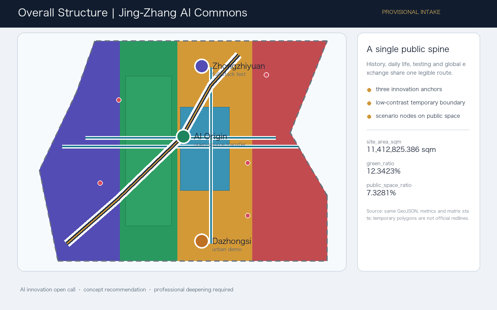
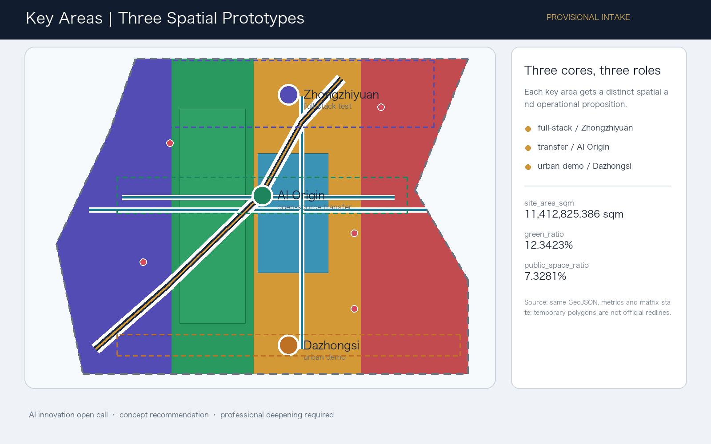
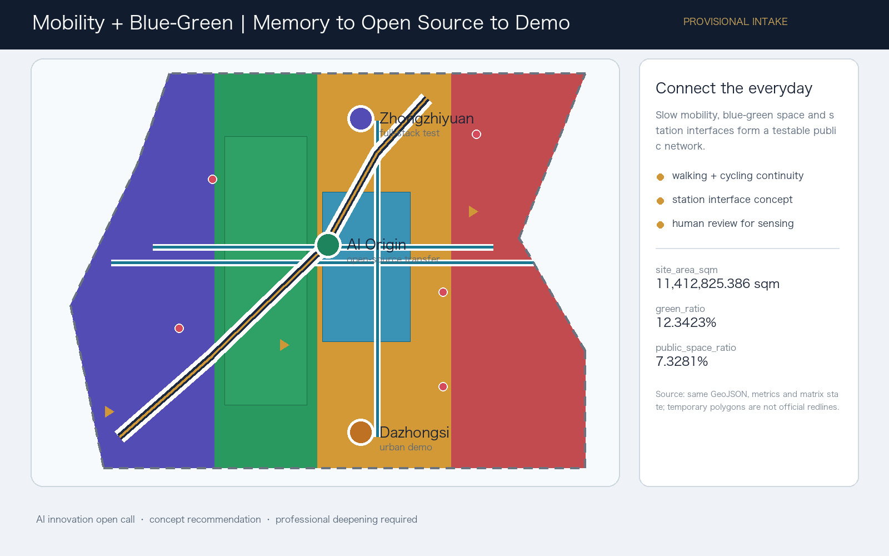
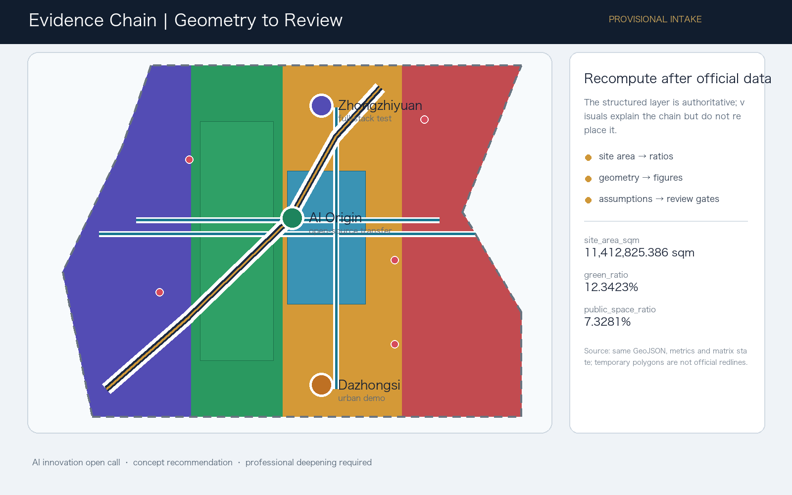

# Jing-Zhang AI Commons: A Symbiotic Innovation Belt Driven by a Century of Memory

## Design Basis and Source List

This proposal defines **Jing-Zhang AI Commons** as public innovation infrastructure that can be used daily, tested by industry, and communicated globally. Heritage supplies shared memory, blue-green space supplies low-threshold encounters, and the three key areas carry different roles: full-stack research, near-campus transfer, and urban-scale intelligent economy. The proposal is a concept recommendation for professional deepening, not a new statutory redline or an approved plan [source:OFFICIAL-ANNOUNCEMENT] [source:AGENT-TASKBOOK] [depth:overall_spatial_structure].

The package uses the repository's provisional rough boundary. Its geometry and area relationships are intake-level evidence only. Official polygons, regulatory controls, road redlines, ownership, municipal, engineering and heritage information must trigger a coordinated recalculation of geometry, metrics, drawings and HTML; the package does not claim approval or precise statutory area [data:geometry/site_boundary.geojson#SITE-001] [source:BOUNDARY-SOURCE].

The source registry separates formal-ready material from background and provisional material. The structured audit layer remains in `sources.json`, `metrics.json`, the three matrices, GeoJSON and `assumptions.json`; this report keeps only claim-adjacent evidence markers [source:SOURCE-REGISTRY] [depth:existing_conditions_diagnosis].

## Three-Level Scope Framework

The 43.6 sq km coordinated research area is used for innovation ecology, regional collaboration, future-city research and international narrative. The 11.4 sq km overall design area is used for urban renewal, land-use relationships, mobility, municipal support, the Jing-Zhang heritage park vitality belt and urban character. The 368.4 ha detailed-design scope is used to compare the three key areas through distinct spatial prototypes [source:OFFICIAL-ANNOUNCEMENT] [metric:site_area_sqm].

The three levels are not separate drawing sets. Research scope decisions become a spatial structure and renewal sequence; the overall design layer turns them into public interfaces, slow-mobility connections and service nodes; the key-area layer tests the proposition at a more detailed scale. Because the current polygons are provisional, these relationships are suitable for discussion and intake validation, not official redline or approval claims [data:geometry/key_areas.geojson#PROV-KEY-001] [depth:three_level_scope_framework].

## Coordinated Research Area: Industry and Future City Research

The overall identity is **Jing-Zhang AI Commons**, with a visual mark based on two crossing lines forming an abstract JZ and a pulse node. The naming system uses three layers: Commons for the shared public network, Core for the three innovation anchors, and Cards for the open scenario catalog. This identity links the heritage story to open collaboration rather than borrowing an enterprise logo or an unlicensed historical image [source:AGENT-TASKBOOK] [standard:PROJECT-AGENT-OPEN-CALL-TASKBOOK].

The five functions are a full-stack innovation system, world-class AI ecology, AI+ scenario activation, an intelligent lively city, and global AI governance discourse. The three areas and two wings become a loop: Zhongzhiyuan tests and governs; AI Origin transfers and learns; Dazhongsi demonstrates and communicates; the technology-service and Xiaoyue River wings supply professional support and daily-life continuity. The spatial structure is a public spine, three cores, many scenario nodes and a blue-green slow network [data:geometry/land_use.geojson#LU-001] [data:geometry/roads.geojson#ROAD-001].

Six public mechanisms are used as background comparisons rather than formal evidence: Barcelona 22@ connects industrial renewal with public space; Singapore Punggol Digital District integrates campus, mobility and infrastructure; King's Cross uses heritage as a public innovation room; the MILA area suggests an open research-community network; Helsinki's AI Register foregrounds transparency; Seoul AI Hub links start-up support, education and demonstration. No case metric, logo, image or proprietary dataset is copied. The transferable lesson is an eight-part loop of space, collaboration, authorized finance, talent, compute, governed data, open scenarios and international communication [source:CASE-MECHANISM-OPEN-SOURCES] [source:SOURCE-REGISTRY].

## Overall Design Area: Urban Renewal and Regulatory-Plan-Level Urban Design

The overall reference scheme is a **memory-to-demo spine**. A heritage and public-space route connects the southern urban demonstration interface, the AI Origin community, and the northern full-stack test area. Cross connections stitch campuses, neighborhoods, stations and blue-green space. Land-use polygons are a complete partition for the submitted provisional boundary; they explain relationships but do not invent floor-area ratio, height, density, setbacks or road redlines [data:geometry/land_use.geojson#LU-001] [standard:MOHURD-CONTROL-DETAILED-PLANNING] [depth:land_use_layout].

Renewal follows a retain–adapt–test logic. Existing assets should be retained where heritage, community value or operational continuity is demonstrated; adaptation should prioritize reversible ground-floor interfaces, shared work rooms and accessible public edges; new construction is a professional-team option only after ownership, control lines, heritage and engineering review. The submitted building footprint is a design hypothesis, not a demolition, construction or parcel conclusion [data:geometry/buildings.geojson#BLDG-001] [depth:retain_renovate_demolish].

## Detailed Design of Key Areas

**Zhongzhiyuan AI Acceleration Area** is the garden-like full-stack test core. The reference scheme places shared evaluation, standards workshops, safety-governance display and low-carbon innovation encounters along a green public interface. It should be deepened with the river-blue-line, flood, access and ownership evidence before any implementation judgment [data:geometry/key_areas.geojson#PROV-KEY-001] [depth:three_key_area_detailed_design].

**Beijing AI Origin Community** is a near-campus transfer and talent-life prototype. A reference scheme links campus, incubator, open-source publishing, legal and intellectual-property services, housing and daily life through a continuous pedestrian network. Its public edge is designed for release, learning and co-creation, while private campus data and research outputs remain authorization-bound [data:geometry/key_areas.geojson#PROV-KEY-002] [source:AGENT-TASKBOOK].

**Dazhongsi AI Industry Cluster** is the urban intelligent-economy and international exchange prototype. A reference scheme concentrates intelligent-agent and terminal demonstrations, data-governance services, content consumption, business reception and station-interface improvements around an everyday public realm. Four-quadrant walking continuity, traffic safety and property rights must be confirmed by professionals [data:geometry/key_areas.geojson#PROV-KEY-003] [metric:key_area_count].

## AI Innovation Ecosystem, Personas, and AI+ Scenarios

The package includes ten scenario cards: 01 Open-Source Release Hall; 02 Safety Governance Sandbox; 03 Edge-Compute Station; 04 AI Slow-Mobility Guide; 05 Dazhongsi International Demo Room; 06 Qinghe Low-Carbon Innovation Edge; 07 Near-Campus Transfer Street; 08 Data-Element Commons; 09 AI Daily-Life Service Street; and 10 Global AI Week Route. Cards 02, 03 and 06 are industry test and validation scenarios. Each card is mapped to a public or design layer, a user need, an operating party, a privacy boundary and a human-review gate [data:geometry/public_space.geojson#PUBLIC-001] [source:AGENT-TASKBOOK].

Five personas make the spatial mapping explicit: open-source developers need release and collaboration rooms; start-up teams need affordable test access and compute gateways; enterprise visitors need demonstration and international reception; nearby residents need low-disturbance services and recreation; university students and researchers need transfer, learning and daily slow mobility. No persona becomes an individual surveillance profile. The operating rule is public or cleared data, minimum processing, explainable output, human review and revocable operation [depth:municipal_new_infrastructure].

## Land Use, Building Scale, and Retain-Renovate-Demolish Strategy

The submitted land-use partition connects AI research, park and open space, industry and business services, and community support. It is a design structure rather than a statutory control. The known building footprint is reported from the building layer, while FAR, height, density, setback and total floor area remain unknown until official controls and survey data are cleared. Values shown as known are recomputable from the submitted geometry; unknown values remain non-numeric [standard:MNR-LAND-USE-CLASSIFICATION-GUIDE] [metric:building_footprint_area_sqm].

The retain–adapt–new-build sequence is an evidence gate: retain when cultural or community value is verified; adapt when reversible public-interface and service improvements can operate without ownership assumptions; reserve new-build options for professional testing after statutory and engineering review. No parcel demolition or renovation conclusion is made [depth:height_massing_character] [depth:development_intensity_controls].

## Transport, Rail, Municipal Infrastructure, and Public Services

The mobility concept is a slow network rather than a new road or rail engineering scheme. The proposed east–west cycle stitch and three-core transit connector are conceptual lines inside the participant geometry, used to explain continuity between public spaces, station interfaces and key areas. They do not alter road redlines, rail alignments or engineering feasibility [data:geometry/roads.geojson#ROAD-002] [depth:traffic_rail_slow_parking].

A public-service layer combines enterprise support, talent-life services, accessible wayfinding, edge compute, distributed-energy research and conventional municipal functions. Energy, drainage, flood control, fire safety, pipe capacity, parking standards and operating responsibility require official or professional confirmation. Sensing is optional and must be aggregated, transparent and human-reviewed [data:geometry/constraints.geojson#CONSTRAINTS] [depth:municipal_new_infrastructure].

## Blue-Green Network, Public Space, and Urban Character

The Jing-Zhang heritage park vitality belt is the civic armature. A reference scheme makes the park edge a sequence of memory interpretation, open-source contribution, low-carbon testing, daily recreation and public events. Green space and public space are reported as recomputable ratios, not as statutory green-space commitments [data:geometry/green_space.geojson#GREEN-001] [metric:green_ratio] [standard:MOHURD-URBAN-DESIGN-MEASURES].

The cultural narrative has three acts: crossing a century of railway engineering memory, co-creating through Zhongguancun's open innovation culture, and looking back from a future culture of accountable AI. Three concept landmarks—Jing-Zhang Memory Gate, Open-Source Contribution Ring, and Global AI Demo Stage—form an honor-display and wayfinding system. They are public-space components for professional deepening, not approved construction projects. The identity system must use cleared fonts, graphics and assets only [data:geometry/public_space.geojson#PUBLIC-001].

## Renewal Projects, Implementation Policy, and Phasing

Six reference projects organize the sequence: stitch heritage-park slow-mobility gaps; build the Zhongzhiyuan Qinghe innovation edge; establish the AI Origin transfer street; improve Dazhongsi station's four-quadrant pedestrian interface; test AI public-service and edge-compute nodes; and operate the Global AI Week route. Phase one emphasizes reversible public-space, open-source and safety-test pilots; phase two deepens public interfaces and service rooms; phase three follows official controls, ownership and professional feasibility [data:geometry/phasing.geojson#PHASE-001] [depth:renewal_project_list].

Long-term operation is a reference mechanism of one route, four seasonal event types and one developer-community ledger: spring Source Open Day, summer Qinghe Low-Carbon Test Week, autumn Jing-Zhang AI Walk, and winter Global AI Commons Forum. Every event needs a public agenda, authorization statement, accessibility provision, safety review, data-minimization note and retrospective. Recruitment and conversion are suggested through open demos, trials, IP/legal clinics and consent-based cooperation records; no funding, investment, policy or government arrangement is promised [source:AGENT-TASKBOOK] [depth:phasing_implementation].

## Metrics, Area Recalculation, and Compliance Matrix

The package reports a provisional site area of 11,412,825.386 sqm, a known building-footprint area of 310,807.184 sqm, a green ratio of 0.123423, a public-space ratio of 0.073281, and three key areas. These are geometry-derived or explicitly tied to submitted files. FAR, height, density, setback and other official controls remain unknown because the cleared site package does not contain approved control values [metric:site_area_sqm] [metric:green_ratio] [metric:public_space_ratio].

The compliance matrix covers every announcement requirement and agent.1 through agent.6. The standard matrix maps mandatory local references to report, drawings, geometry, metrics, assumptions and self-checks; the design-depth matrix marks the required formal items complete in the package structure. The five figures explain the evidence chain for human readers, while GeoJSON and JSON remain authoritative [depth:metrics_recalculation] [source:SITE-PACKAGE].

## Risk, Copyright, and Compliance

The package uses no personal, private, proprietary or uncleared data. The six case comparisons are background mechanisms only; no external logo, image, font, portrait, paper figure or enterprise mark is redistributed. The visual page and report are offline and local-image-only. The proposal is AI-generated under the declared agent identity and must receive professional, accessibility, privacy, safety, heritage, ownership, municipal and engineering review before any implementation discussion [depth:risk_missing_data] [source:CASE-MECHANISM-OPEN-SOURCES].

The provisional boundary is disclosed in the proposal, sources, assumptions, self-check and visual page. Official polygons must replace it as a coordinated update. This submission is an open co-creation recommendation, not a government decision, statutory plan, investment commitment, construction drawing or guarantee of delivery [source:AGENT-TASKBOOK] [standard:PROJECT-OFFICIAL-ANNOUNCEMENT].

## References

- Beijing Haidian Branch official announcement for the open call and scope.
- Repository site package: `design_brief.json`, `agent_taskbook.json`, geometry, schemas and planning-limit snapshot.
- Public source registry and processed fact pack in `data/`.
- Local professional references for urban design, detailed planning, land-use classification, architectural depth and AI governance.
- Participant-generated GeoJSON, metrics, matrices, figures and offline visualization in this submission package [source:SITE-PACKAGE].
