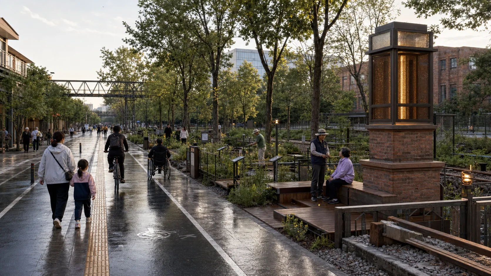
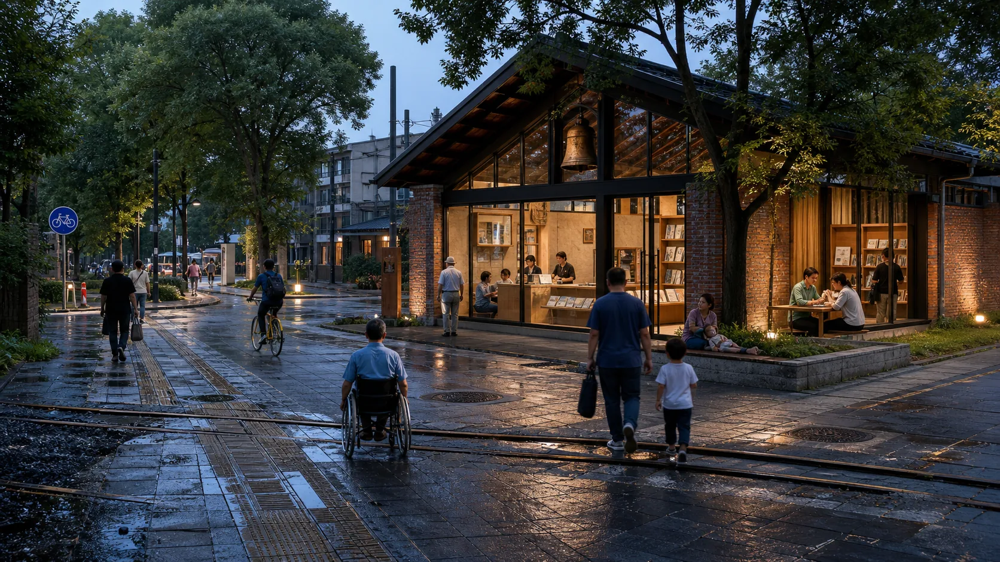
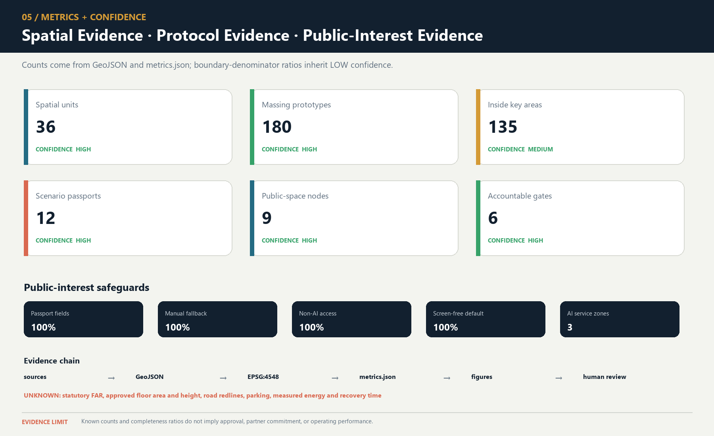

## Proposal ruling

- Chinese name: **双轨京张**
- Back-stage audit system: JZ-AIOS (Jing-Zhang Auditable Innovation Operating System)

### Why Haidian: innovation density must become public capability

Public materials place Haidian's talent, residents, services and opened Jing-Zhang park together, but do not prove innovation resources have become usable, challengeable and leaveable everyday services [source:AGENT-TASKBOOK] [source:HAIDIAN-JZ-MIDTERM-2026] [source:HAIDIAN-JZ-PHASE2-OPEN-2026]. The judgement is: **innovation density is public capability only when ordinary people can use, question and exit without account, device or professional identity.** This package has not sampled people or measured impact. Ordinary ground carries movement, rest, questions, care and basic services; bounded verification moves aside [source:HAIDIAN-15FYP-2026] [data:visual/assets/non-ai-parity-contract.json].

## One Spatial Decision: Verification Must Step Aside from Ordinary Life

**Proof may not occupy the ground required to complete an ordinary task.** Ordinary ground carries movement, rest, questions, care, and basic services first; proof may appear only beside it, bounded, stoppable, and removable.

Review follows one anonymous ordinary task before it follows a system: **arrive → understand → complete → correct or withdraw → leave**. If any action requires an account, scan, screen, network or AI, the Continuous Civic Track has not been established. If a person cannot finish through staff and leave safely during failure, the verification overlay must stop. This is a front-stage reading of the existing seven rights and same-task dual paths, not a new persona, scene, service promise or maturity claim.

| Three non-interchangeable prototypes | Explicitly rejected | Spatial answer kept | What continues on failure |
|---|---|---|---|
| **Zhongzhiyuan · Verify** | Proof crossing the ordinary path | Parallel bypass plus a side verification garden, with staffed handoff between the routes | Ordinary bypass, physical information, and staffed handoff |
| **Origin Community · Co-create** | Proof nodes taking the resident street | One open resident street, two stepped-back courts, and four independently withdrawable nodes | Resident street, paper/spoken entry, and staffed handoff |
| **Dazhongsi · Publish** | Service objects taking the four-way commute centre | A clear centre, with information hall and staffed desk off the main route | Four-way commute, quiet rest, and off-route staffed service |

> **The four states change only the verification overlay.** Ordinary use works first; verification appears only after its preconditions are met. Failure isolates verification objects while the complete non-AI path, staffed handoff, withdrawal, and appeal continue. Recovery returns ordinary ground and the same task before recheck; it **is not authorization, approval, restart or G1**. The motion diagram's 54 seconds are editorial pacing, and its static fallback gives the same answer; neither states a real recovery duration.

> **Truth boundary.** These are G0 conceptual relationships on provisional geometry, not a survey, precise masterplan, approved design, accessibility result, or resident opinion. Official redlines, exact anchors, real thresholds, accountable parties, field service, approval, and independent retesting remain 0 or `unknown`. Contributor content, code, the OSM-derived layer, and the Noto subset use CC BY 4.0, MIT, ODbL, and OFL respectively; third-party citations and repository inputs are not relicensed. Path-level rights disposition is bound by the final manifest and rights inventory; there is no package-wide licence. New photorealistic scenes are explicitly labelled synthetic G0 concept images and prove no site, service, public-feedback, or maturity outcome.

The eight-question map, synthetic replay, and handoff material have one back-stage entry: `visual/index.en.html#handoff` (review handoff). It supports traceability only, not public feedback, expert opinion, field results, authorization, or maturity advancement. The proposal retains 12 scenarios, 8 projects, 3 key areas, and 36 conceptual land-use cells; all 13 formal chapters and their order remain unchanged.

## Design Basis and Source List

The design basis starts from the present boundary of site knowledge. Public sources report an opened park, while the package has no official redline, as-built survey, completed field walk, or approved pilot. The first question is therefore how existing ordinary life remains uninterrupted; only then may a reversible proof increment be tested for net value. The twelve existing scenes, eight projects, three key areas, and governance contracts form the complete auditable object set; an additional checklist would create no evidence [depth:existing_conditions_diagnosis].

### Approved neighbourhood control-plan context: Twin-Track is a reversible service overlay, not a second statutory structure

The Beijing Municipal Government portal reported on 12 August 2026 that the neighbourhood control plan for the Jing-Zhang Railway Heritage Park corridor had been approved, covering nine neighbourhoods and about 1,668.2 hectares for 2024–2035. Its public text describes “one belt, one axis, two centres and multiple nodes,” north–south and east–west walking/cycling connections, sports, recreation and convenience facilities, an integrated life/innovation circle, and stronger transport and municipal capacity [source:BEIJING-JZ-CONTROL-PLAN-APPROVAL-20260812]. This source establishes only the **reported approval status and published textual directions**. The package has no approval instrument, statutory drawings, official GIS/CAD, neighbourhood or parcel polygons, road redlines, land-use controls, heights, title, municipal capacity or specialist conclusions.

| Published direction of the approved plan | Twin-Track incremental response | Still requires official files / professional handoff |
|---|---|---|
| “One belt, one axis, two centres and multiple nodes,” with Dazhongsi and Wudaokou as the two centres | Twin-Track creates no second statutory structure. It states an operating rule for continuous ordinary ground and stoppable side verification; the three prototypes remain G0 design relations | Statutory drawings, centre/node boundaries and hierarchy, existing-condition registration, and planning review |
| Green public space leads renewal; north–south continuity and east–west walking/cycling links | The continuous civic track first protects movement, rest, inquiry and the same-task non-AI path; verification may not take ordinary ground | Official redlines, street/slow-mobility alignments, existing breaks, railway protection, accessibility and peak surveys |
| Sports, recreation, convenience service, and integrated 15-minute life/innovation circles | The three places add only removable, refusable and staff-transferable service interfaces; account, scan and AI are never prerequisites | Real demand, opening windows, staff, capacity, facility standards, community input and accepted responsibility |
| Renewal of old factories/low-efficiency buildings and directions for foundation models, agents and embodied AI | Side verification at Zhongzhiyuan, set-back co-creation at Origin and off-route publication at Dazhongsi remain conditional G0 prototypes | Building survey, title, retain/renovate decisions, fire, structure, equipment, operations and industry actors |
| Stronger road-network and municipal capacity | The proposal invents no road, utility, investment or recovery duration; it retains stop lines and D01–D08 replacement entries | Transport, municipal, railway, fire, planning, architecture and rights professionals may recalculate, condition or reject |

**Do not substitute extents.** The current `site_boundary.geojson` recomputes to 11,412,825.386 m² (about 11.41 km²) and remains a repository provisional design model. The reported 1,668.2 hectares (about 16.682 km²) is a textual total for the approved neighbourhood-plan extent. They are unequal and have not been co-registered, nested or boundary-checked against an official file. All geometry and `metrics.json` therefore remain frozen: the former must not be renamed as the approved extent, and the latter figure must not be used to rescale or move the current drawings [assumption:A-BOUNDARY-001] [assumption:A-CONTROLS-001] [metric:site_area_sqm].

### The Real Starting Point after 6 August 2026

Public reporting states that Phase II of the Jing-Zhang Railway Heritage Park opened on 6 August 2026. Its southern community-vitality section and northern nature-and-leisure section now form a reported green corridor of about 9 km, with existing outcomes in community connectivity, all-age activity, slow mobility, and sponge infrastructure [source:HAIDIAN-JZ-PHASE2-OPEN-2026]. This changes the proposal’s basic judgment: JZ-AIOS no longer treats “building a continuous park” as its own outcome. It proposes only a reversible, low-footprint, and removable public-service and verification increment over the existing park. The table below is a design starting point derived from desk research, not a site visit, as-built drawing review, or confirmation of a statutory red line. Location, operating condition, and actual use still require item-by-item verification [data:visual/assets/site-grounding-register.json#SG-001] [assumption:A-SITE-LOCATION-008].

| Publicly reported baseline | Design increment proposed here | To be verified on site |
|---|---|---|
| Phase II is open; the southern section is reported to serve adjacent communities and open lateral connections | Recast the six spatial interfaces as audit/service interface types that first reuse existing entrances, staffed services, and slow-mobility nodes rather than presuming new landmarks | Exact location, accessible continuity, peak-hour detours, ownership, and operations boundary at each interface |
| The northern section is reported to provide fishbone slow-mobility links and connections to waterfront and park networks | Add only pausable scenario passports, offline wayfinding, and public retest interfaces; do not rebuild the basic greenway | Conflicts among walking, cycling, and running; night lighting; stormwater and railway-safety conditions |
| All-age activity, heritage reuse, and sponge facilities have been publicly reported | AI must prove net value over everyday use; device count, screens, and event footfall cannot substitute for public value | A 30-day post-opening use audit, task success across groups, noise, complaints, and maintenance burden |

#### Built-Park Delta Protocol (INNOV-006)

Before any G1/G2 pilot, one page must record the “non-AI current baseline → AI increment hypothesis → minimum footprint and time window → stop and recovery → independent retest” chain. AI must prove incremental value over staffed, paper-based, physical-wayfinding, or existing services, with no net loss of accessible public space or quiet periods. If it cannot prove an increment, cannot restore a state no worse than the baseline, or fails independent retesting, the pilot returns to G0 or exits. The completed 30-day post-opening field-audit count is currently 0; protocol completeness proves only design-field coverage, not field effectiveness [data:visual/assets/innovation-register.json#INNOV-006] [assumption:A-POST-OPENING-007] [metric:completed_post_opening_field_audit_count].

#### G1 Preregistration: Write the Failure Conditions before Requesting a Site Test

`visual/assets/g1-preregistration-register.json` turns all 12 existing scenarios into executable-but-unexecuted first-test contracts. Before testing, each record must lock a non-AI comparison task, one primary metric and denominator, affected groups, sample frame, collection window, no-harm rule, stop and recovery conditions, independent-retest inputs, and version. The 12/12 figure proves required-field coverage only. Completed preregistrations, approved G1 windows, field executions, and known results all remain **0**, so no scene may advance from G0 on the strength of this register [data:visual/assets/g1-preregistration-register.json#G1-PREREG-001] [metric:g1_preregistration_required_field_coverage_ratio] [metric:completed_g1_preregistration_count].

**Review path (a conceptual protocol, not approval or results):** built-park baseline → public problem → same-task non-AI baseline → G1 shadow test → stop/recover → independent retest → upgrade or exit. Every node remains at G0; this path is not approval, field execution, or field results.

| First minimum test packet | Same-task non-AI comparator | Single primary metric | Non-negotiable stop condition | Current status |
|---|---|---|---|---|
| T-03 / SCENE-009 accessible route | Staffed service, paper, or physical wayfinding for the same origin and destination | Successful tasks by co-test group / consented tasks | Stop and restore on a critical barrier, stale route state, or unavailable non-AI route | Threshold pending field preregistration; unexecuted |
| T-02 / SCENE-011 enterprise service | Staffed counter or traceable static guide using the same frozen question set | Sourced and correctly bounded answers / frozen questions | Stop on an unsourced conclusion, prohibited-data exposure, or unavailable human takeover | 10/10 synthetic decision replays exactly matched; real threshold, owner, site, and service unexecuted; G0 |
| T-01 / SCENE-001 low-speed delivery | Staffed delivery or static route for the same task | Tasks with no collision, no boundary breach, and a working physical stop / approved controlled tasks | Stop on any collision, boundary breach, physical-stop failure, or broken takeover chain | Safety red lines fixed; efficiency threshold pending preregistration; unexecuted |

### Innovation Is Not a Slogan: A Falsifiable Register

“Looking new” does not prove innovation. `innovation-register.json` binds six claims to a baseline, falsifiable hypothesis, minimum evidence, pass threshold, failure signal and exit action; INNOV-006 tests for a demonstrable, recoverable net increment over the opened park. A claim without failure and exit cannot be registered, while unobserved operating results remain `unknown` [data:visual/assets/innovation-register.json#INNOV-001] [data:visual/assets/innovation-register.json#INNOV-006].

The evidence is organized into four tiers, each limited to a role consistent with its authority:

- Tier 1 comprises the open-call announcement, agent taskbook, and project site package, which define the task and submission boundary [source:DATA-SRC-OFFICIAL-ANNOUNCEMENT-20260509] [source:AGENT-TASKBOOK] [source:SITE-PACKAGE].

- Tier 2 comprises the repository source registry, standards index, and processing guide, which locate evidence and its use limits [source:SOURCE-REGISTRY] [source:PROCESSED-FACT-PACK].

- Tier 3 comprises public Beijing materials concerning the AI Origin Community, real-world testing along the century-old Jing-Zhang corridor, and the “one core, multiple points” innovation-district pattern. These materials assess possible coordination directions only; they do not mean that the project has been approved or that an organization has committed to participating [source:BEIJING-AI-ORIGIN-2026] [source:BEIJING-AI-DISTRICTS-2026].

- Tier 4 combines national policies on data, AI-content labeling, and “AI+” with six global cases for mechanism inspiration and governance boundaries only [source:NATIONAL-DATA-INFRA-2025] [source:AI-CONTENT-LABEL-2025] [source:AI-PLUS-2025].

### Evidence Is Not a One-Time Snapshot: Expiry Must Propagate Downstream

`sources.json` records 52 sources; an access date proves neither continued availability nor performance. On 2026-08-24, two `review_due` items were checked: Barcelona's page still identifies 22@ as an innovation and technology-transfer hub; the King's Cross source returned 403, so an accessible consultation page from the same operator now supports only human-scale, public-space and continuing-consultation comparisons. This updates access status, not Haidian control, approval, outcome or maturity evidence [data:visual/assets/evidence-freshness-policy.json#refresh_records]. Provisional spatial data remains `provisional_only`.

### Policy Sets Entry Gates; It Does Not Replace Approval or Responsibility

This round compresses six existing policy directions into one anti-misreading structure: applicability must be established before policy can be translated into an ordinary task or a spatial or service action; the human handoff, stop condition and prohibited inference must then be stated. The complete bilingual record is `visual/assets/policy-to-task-register.json`. It is a G0 policy translation, not legal advice or project approval.

| Policy applicability boundary | Action entering this proposal | Stop and prohibited inference |
|---|---|---|
| “AI+” supplies people-centred, open-sharing and safe-controllable policy direction only | Unmanned or smart service sits beside the continuous ordinary route; failure of the public-value, technical or governance gate prevents graduation | Stop verification when the ordinary task or same-task non-AI route is blocked; this proves no approval, funding, service capacity or G1 [source:AI-PLUS-2025] |
| Article 39 of the Barrier-Free Environment Construction Law is limited to listed medical, social-security, financial and living-payment matters | Only when an actual JZ-05 or `SCENE-011/012` matter falls within the list does a reachable staffed desk and handoff position become a G1 prerequisite | Unclear scope, human reachability or professional review means NO-GO; do not generalize to every park or digital interface, and do not claim existing-facility compliance [source:DATA-SRC-BARRIER-FREE-ENVIRONMENT-LAW] |
| The elderly smart-technology plan is `background_only` context for parallel traditional and smart channels | The existing seven non-AI public rights continue to guarantee the same task, a visible entry and equivalent completion; the smart channel is never the sole entry | An absent traditional channel or missing group co-test cannot be described as compliance; this proves no Haidian implementation, demand scale or coverage [source:DATA-SRC-ELDERLY-SMART-TECH-PLAN-2020-45] |
| The Interim Measures for Generative AI apply only to candidate services providing generated content to the public within mainland China | Before a relevant candidate enters G1, preregister a complaint/reporting entry, responsible role, handling process and project-defined feedback timeframe | A missing element or an error affecting a formal matter stops the overlay; do not infer a general opt-out from Article 14, invent a numeric Article 15 deadline, or claim filing or security assessment [source:DATA-SRC-GENERATIVE-AI-INTERIM-MEASURES] |
| Generated-content labeling rules apply only to relevant generated content | Retain explicit labels, metadata labels where applicable, human curatorial review and removal when verification fails | Do not publish when provenance, generation method, model, authorization or unprovable matters are missing; labeling is not clearance, factual truth or installation permission [source:AI-CONTENT-LABEL-2025] |
| Haidian's three groups and “five-minute support” provide public background priorities only | Map them to the existing seven personas and support cells as future co-testing questions, without adding scenarios or inventing coverage | Without a field baseline, group co-testing and accepted responsibility, remain at G0; this proves no participant recruitment, completed research, partner commitment or service performance [source:HAIDIAN-JZ-MIDTERM-2026] |

The professional response separates standards by question instead of stacking identifiers behind one conclusion:

- The open-call announcement and agent taskbook constrain the project and agent tasks [standard:PROJECT-OFFICIAL-ANNOUNCEMENT] [standard:PROJECT-AGENT-OPEN-CALL-TASKBOOK].

- The urban-design scope and regulatory-planning process boundary are constrained by two housing and urban-rural development references [standard:MOHURD-URBAN-DESIGN-MEASURES] [standard:MOHURD-CONTROL-DETAILED-PLANNING].

- Land-use terminology and the architectural-depth gap are recorded separately; a gap record is not represented as a verified clause [standard:MNR-LAND-USE-CLASSIFICATION-GUIDE] [standard:MOHURD-ARCH-DESIGN-DEPTH-2016].

Precise red lines, existing buildings, ownership, regulatory-plan indicators, municipal infrastructure, traffic engineering, and heritage controls have not yet been obtained. `geometry/site_boundary.geojson` and the three key areas continue to use provisional repository extents for conceptual review only [data:geometry/site_boundary.geojson#SITE-001] [source:DATA-SRC-PROVISIONAL-BOUNDARIES-20260605]. They must not be used for approval, land acquisition, precise area calculation, or engineering implementation; boundary and control assumptions remain explicit [assumption:A-BOUNDARY-001] [assumption:A-CONTROLS-001].

The latest boundary-basis note on the main branch also records an independent background check: OSM-mapped park features have 0% overlap with `PROV-SITE-001`, with a nearest distance of about 412.5 m. The reading may reflect incomplete OSM coverage, error in the provisional inferred extent, or both. It **does not decide which geometry is correct and must not be used to alter or promote either one into an official boundary**. This proposal therefore leaves the provisional geometry unchanged and treats receipt and verification of an official polygon, coordinate reference system, and version as a trigger for full recalculation [source:PROVISIONAL-BOUNDARY-BASIS].

## Three-Level Scope Framework

The three scope levels address different questions at different levels of precision while sharing one evidence chain. The approximately 43.6 km² coordinated research area asks how industry, research, urban problems, and external innovation nodes can collaborate. The approximately 11.4 km² overall design area asks how the century-old Jing-Zhang corridor can organize public space, slow mobility, functions, and scenarios. The three provisional key areas ask how three state stations—“co-create, verify, publish”—can shape blocks, buildings, public frontages, and operating gates. The areas express task hierarchy only and cannot be used to infer statutory boundaries [metric:site_area_sqm] [metric:key_area_total_sqm] [depth:three_level_scope_framework].

### Twin-Track Jing-Zhang: a public-space operating framework

Twin-Track Jing-Zhang has five spatial elements: **Continuous Civic Track**, **Intermittent Verification Track**, **Three Switchyards**, **Failure Siding**, and **Civic Timetable**. The civic track is the open ordinary-task baseline; the proof track is voluntary, announced, accountable, time-bounded, and removable. Origin Community defines a problem, Zhongzhiyuan verifies it, and Dazhongsi publishes evidence or hands the task to staff. The failure siding handles stopping, explanation, detour, appeal, and recovery. This relay neither redraws provisional geometry nor promises a site. JZ-AIOS, G0–G3, evidence gates, and rights boundaries remain the audit kernel [data:visual/assets/key-area-evidence-matrix.json#twin_track_frontend_contract] [data:visual/assets/non-ai-parity-contract.json].

#### Haidian social relation to spatial consequence (design review)

The public brief produces four design questions: who defines the problem, whether proof occupies an ordinary route, whether technology displaces heritage and recreation, and whether a user can refuse and reach a person. The spatial answers are Origin's problem entry, an always-open ordinary route, Zhongzhiyuan's side proof area, and Dazhongsi's staffed service. These are design checks, not population statistics, public feedback, or built results [source:AGENT-TASKBOOK] [source:HAIDIAN-JZ-MIDTERM-2026] [source:HAIDIAN-JZ-PHASE2-OPEN-2026].

Entry, time, state, human, source, and exit use physical wayfinding, paper, speech, and accessibility markers. The timetable defines ordinary-first, quiet/screen-free, conditional-proof, and stop/recovery windows; actual times, rosters, and approvals remain `unknown` or 0. Anyone may enter, complete the task, leave, or appeal without registration, a QR code, or AI. A stop condition isolates only the proof layer and transfers responsibility to staff [data:visual/assets/key-area-evidence-matrix.json#twin_track_frontend_contract] [data:geometry/public_space.geojson#PUBLIC-004] [data:geometry/public_space.geojson#PUBLIC-009].

#### Public Signal Interface: six questions × four states × three carriers

The twelve signal rows sit on Zhongzhiyuan's observation bypass, Origin's one street/two courts/four withdrawal points, and Dazhongsi's four-way commute with off-route hall and desk. Their six questions match; entry, failure extent and restoration object differ, while number, wording, line style and static table avoid colour dependence [data:visual/assets/key-area-evidence-matrix.json#public_signal_interface_round18]. Missing restoration, maintenance closure, resident confirmation or independent review closes the interface. The rows work without JavaScript; staff presence, windows, field tests, approvals, GO and real recoveries are 0, with field parameters `unknown` [data:visual/assets/site-grounding-register.json#public_signal_interface_round18] [data:visual/assets/civic-operations-contract.json] [source:SOURCE-JZ-CIVIC-OPERATIONS-G0-V1].

The typical section shows “staffed station—screen-free node—ordinary space—proof overlay—restoration edge.” Ordinary, verification, failure, and recovery state the opening condition, stopped object, and restored object. This is a relationship drawing, not continuous construction, an exact location, approval, an operating result, or an engineering section [data:visual/assets/key-area-evidence-matrix.json#twin_track_frontend_contract] [assumption:A-KEY-AREA-DETAIL-010].

### The Single Core Mechanism

The core mechanism turns an urban problem into co-creation, verification, pause, reproduction, and public delivery. **Proof** means spatial evidence, technical verification, and proof of public value [assumption:A-GOVERNANCE-001]. One proof line connects three state stations, two supply wings, and six interfaces: Origin co-creates, Zhongzhiyuan verifies, and Dazhongsi publishes; Xiaoyue River supplies problems, while the Zhongguancun wing offers proposed support. External roles are planning suggestions, not secured cooperation [assumption:A-EXTERNAL-COLLAB-005] [depth:overall_spatial_structure].

### Readable Mapping to the Three Positioning Statements and Five Functions

The mapping below translates the taskbook's own terms directly into spatial and operating mechanisms instead of leaving them as compliance-matrix checkmarks. It remains a conceptual response for professional teams to develop further; it creates no statutory function, project authorization, or institutional commitment [source:AGENT-TASKBOOK] [standard:PROJECT-AGENT-OPEN-CALL-TASKBOOK].

| Taskbook position / function | Direct response in this proposal | Boundary that must not be crossed |
|---|---|---|
| The Centennial Jing-Zhang Cultural Belt | A double helix of railway engineering, Zhongguancun innovation, and AI correction history, with three knowledge-journey landmarks | Historical facts, heritage, names, and media await official/archival and rights review |
| The Urban AI Life Experience Belt | Six interfaces, nine everyday-first public nodes, non-AI parity, and quiet/screen-free modes | Field coverage is not an open service or a public-experience result |
| The AI Convergence Innovation Belt | A problem–co-create–verify–publish/service–transform–feedback state machine across three areas and two wings | No fabricated company, partner, land, funding, or implementation commitment |
| Full-stack independent AI innovation system | Zhongzhiyuan hosts proposed offline, shadow, bounded-test application, safety, and independent-retest gates | No claim of an existing full-stack platform, operator, or approved test field |
| World-class AI innovation ecosystem | Origin Community co-creation interfaces, six international comparisons, and two-wing factor support | “World-class” is an objective, not a ranking, concentration measure, or partnership fact |
| New paradigm for AI+ scenario enablement | Twelve scenario passports, three first-test protocols, and non-skippable G0–G3 gates | All items remain G0; approvals, participants, executions, and results remain 0 |
| Intelligent AI-vibrant city | Daily, learning, Beta, quiet, and offline modes alongside staffed services | Screens, surveillance, event popularity, and mandatory accounts are not proxies for vitality |
| Global voice in AI governance | Traceable sources, published failures, suspension and grievance, expiry and retirement, and retest packages | A discussable method only; it is not an international rule or government institution |

I01–I06 are Dazhongsi Communication, Urban Services, Xiaoyue River Experience, University Co-creation, Zhongzhiyuan Verification and Qinghe Ecological Calibration interfaces, corresponding to `PUBLIC-004`–`PUBLIC-009`; `GATE-01`–`GATE-06` remain machine-only compatibility IDs. These are audit/service types pending field review, not sited landmarks. Each must check public space, lateral slow mobility, sponge stitching, non-digital access, quiet hours and scenario relay, reusing existing entrances and facilities first [data:geometry/public_space.geojson#PUBLIC-004] [data:visual/assets/site-grounding-register.json#SG-003] [metric:gateway_count].

The proposed logo uses two open-ended rail lines to form the letters **JZ**. The opening between them becomes a “verification opening with room for human intervention,” and six short ticks represent the six spatial interfaces. The logo uses only geometric linework and a project-owned wordmark; it does not use corporate trademarks, portraits, or restricted fonts. The overall palette comprises Rail Silver, Haidian Blue, Open-source Green, Verification Orange, and Bell Gold. Cultural wayfinding follows a separate three-line grammar—“mileage, year, source”—so that the cultural signage is not confused with the overall logo system.

## Coordinated Research Area: Industry and Future City Research

**Spatial outcome of the public mission economy.** Haidian's research, enterprise and service capacity is judged here not by event popularity but by whether an ordinary person's problem can be defined in public, tested within limits, handed to staff and returned with a traceable receipt. The three prototypes therefore perform different define—compare—handoff roles; this adds no project, institutional commitment or operating result [data:visual/assets/public-mission-economy-contract.json].

### Three-Anchor, Two-Wing Industrial State Machine

Industry is not zoned by company lists; space and resources are allocated according to task state. The Xiaoyue River Wing gathers problems that residents, urban service providers, and public bodies are willing to make public. Origin Community converts those problems into open-source tasks, user journeys, and comparison baselines. Zhongzhiyuan verifies models, robots, safety, ethics, and interoperability in offline, shadow, and bounded environments. Dazhongsi converts passed outcomes into urban services, enterprise services, and international exchange that the public can understand. The Zhongguancun Technology Services Wing offers proposed compliance, intellectual-property, talent, computing, and transformation support at every stage. Complaints, incidents, failures, and public-value results feed into the following year. Public Beijing materials propose opening the Origin Community, Beiwei Community, and the century-old Jing-Zhang corridor to real-world testing for urban governance and public services. This provides a practical interface for a “proof belt” rather than an ordinary display belt, but this proposal does not present that public direction as project authorization [source:BEIJING-AI-ORIGIN-2026].

Eight resource types follow a “public foundation + conditional access” model. Land provides only reversible-use interfaces. Space provides shared laboratories, public living rooms, and bounded test surfaces. Industry is driven by problems rather than vendors. Funding is limited to a proposed multi-party review and milestone-disbursement mechanism, without inventing budget amounts. Talent is engaged through joint testing by developers, residents, and professionals. Computing prioritizes auditable shared environments. Data follows necessity minimization, retention at source, and controlled computation. Every scenario must hold a passport and expire. The National Data Infrastructure Construction Guidelines provide policy context for consensus rules, trusted controls, and auditable lifecycles in trusted data spaces, but they do not mean that this project’s data system has been approved [source:NATIONAL-DATA-INFRA-2025].

### Six Cases: Mechanism—Local Action—Verification—No-Go Area

| Case | Transferable mechanism | Local Jing-Zhang action | Proposed verification | Not directly transferable |
|---|---|---|---|---|
| Kendall Square | Joint organization of research, firms, housing, and public space | Co-locate Origin Community’s co-creation street with everyday services | Whether cross-institutional co-creation and resident use occur together | Land regime, rents, and firm density [source:CASE-KENDALL] |
| one-north | Themed districts connected by shared facilities and walking networks | Three state stations share one passport and retest package | Whether the relay between stations preserves the same evidence version | Development system and authority over park management [source:CASE-ONE-NORTH] |
| Barcelona 22@ | Industrial upgrading proceeds in parallel with neighborhood renewal and knowledge transfer | Use the six spatial interfaces first to repair everyday public frontages | Whether public-interest delivery precedes expansion | Land-use policy and fiscal instruments [source:CASE-22AT] |
| King’s Cross | Heritage reuse, car-free public space, and mixed use | Present railway engineering history and contemporary public life along the same line | Whether residents continue to use the area on non-event days | Ownership, protection grades, and business model [source:CASE-KINGS-CROSS] |
| STATION F | Physical space operated through programs, mentors, and partner networks | Four-season operating protocol and a problem-to-Proof funnel | Cycle time from problem to bounded prototype | A single large campus and private operating conditions [source:CASE-STATION-F] |
| MaRS | Coupling laboratories, offices, events, and community services | Co-locate publication, compliance advice, and staffed service at Dazhongsi | Success rate of human handoff and follow-up services | Healthcare, investment, and institutional systems [source:CASE-MARS] |

Regional coordination uses a “testing relay,” not a vague alliance. The following matrix states one conditional role for each optional node. Every status remains **unconfirmed**; the matrix records proposed responsibilities and retest questions, not partnership, authorization, G1 readiness, or an operating arrangement [source:BEIJING-AI-DISTRICTS-2026].

| Optional node (all unconfirmed) | Conditional role | Input permitted for a proposed retest | Proposed output |
| --- | --- | --- | --- |
| **Beiwei Community** | Community-context comparator alongside, but not interchangeable with, Origin Community | The same G0 community-service task passport and a PII-free synthetic or lawfully anonymized script | A versioned difference/failure list asking whether same-task non-AI access, staffed handoff, withdrawal and appeal remain intact in another community context |
| Future Science City | Basic-science or frontier-equipment retest | Bounded task, protocol, evidence version and failure conditions | Reproducibility questions and failed conditions, not a scientific-facility commitment |
| Huairou Science City | Retest related to major scientific facilities | The minimum protocol and non-sensitive result package required for the stated question | Facility-interface and reproducibility questions, not access approval |
| Beijing Economic-Technological Development Area | Manufacturing or embodied-system engineering retest | Safety envelope, interface specification and anonymized/synthetic result package | Engineering discrepancy and stop-condition list, not production or procurement approval |
| Other first-batch innovation districts | Retest of a cultural or industrial scenario within each district's stated competence | Task, protocol and minimum non-sensitive evidence package | Context-transfer differences and failed assumptions, not a district partnership |
| Beijing–Tianjin–Hebei nodes | Cross-regional replicability check | Versioned task, protocol, anonymized result and failure record | Replicability differences and conditions requiring local professional review, not a regional rollout commitment |

The common gate is stricter than the table: a relay requires written role acceptance, a lawful data boundary, an ordinary-task baseline and applicable H01–H07 materials. Only tasks, protocols, versioned anonymized/synthetic results and failure records may move—not personal, location-trace, complaint or other sensitive data. Missing, rejected or expired conditions keep the node and package stopped.

## Overall Design Area: Urban Renewal and Regulatory-Plan-Level Urban Design

The overall area takes the opened park’s north–south green corridor, reported lateral connections, and all-age public activity as a publicly reported baseline rather than an object that this proposal has yet to build from scratch [source:HAIDIAN-JZ-PHASE2-OPEN-2026]. Only then does it organize a three-layer section: railway-side historical interpretation, existing slow-mobility and blue-green space, and a reversible innovation-service layer. The railway side receives only low-intervention interpretation; the middle first protects everyday walking, cycling, and staying; and the neighborhood side uses six interface types to audit breaks and add small-scale services. Any action crossing railways, rivers, urban roads, bridges, tunnels, or underground space is only a question pending verification and a design direction; separate field, transport, flood-control, railway-safety, and engineering studies are mandatory.

Land use is refined from 12 large color blocks into 36 irregular, topologically closed conceptual units. They cover nine project-enumerated categories: research, education, housing, community services, commercial services, culture, green space, plazas, and flexible reserve. The number and categories of units can be recalculated from the GeoJSON [metric:land_use_unit_count] [metric:land_use_category_count]. They express spatial–industrial functional envelopes and are neither statutory parcels nor approved uses [data:geometry/land_use.geojson#LU-001] [depth:land_use_layout].

The six lateral interface lines and the north–south main line form a fishbone accessibility network. Every interface binds slow mobility, public space, stormwater stitching, and a testable urban problem. The nine public spaces do not turn the park into a round-the-clock testing ground. Instead, they follow reversible time-space rules: daily life is the default; public learning is scheduled; bounded Beta operation occurs only during approved periods; quiet mode applies from 22:00 to 07:00; and everyone can always choose a non-AI route. The innovation is not that “the city adapts to AI,” but that “AI must adapt to everyday urban life.”

The building layer uses massing prototypes to express priority intervention capacity; it does not simulate the complete existing city. Each prototype is marked as retain for assessment, adaptive-reuse candidate, or new-build candidate. Without evidence from surveys, ownership, structural conditions, heritage controls, and regulatory planning, none may be converted into a demolition or construction conclusion. Floor area ratio, total floor area, building height, road red lines, parking, and municipal capacity remain `unknown` [assumption:A-SPATIAL-REPRESENTATION-002] [depth:development_intensity_controls] [depth:height_massing_character].

## Detailed Design of Key Areas

The three key areas use the same response framework—site conflict, spatial structure, core project, AI scenario, admission gate, and acceptance—and organize the material at key-area detailed-design depth [depth:three_key_area_detailed_design]. The extents below remain provisional substitutes; all area and massing-coverage values are for conceptual review only [data:geometry/key_areas.geojson#PROV-KEY-001] [data:geometry/key_areas.geojson#PROV-KEY-002] [data:geometry/key_areas.geojson#PROV-KEY-003].

### Key-area evidence crosswalk

`key-area-evidence-matrix.json` crosswalks each provisional area to its station, public anchor, I/GATE reference, service zone, scenarios, concept acceptance and first-test inputs [data:visual/assets/key-area-evidence-matrix.json] [metric:key_area_evidence_matrix_record_count]. Its 100% value means only three complete records; field audits, role confirmation, approvals, executions and known results remain 0 [metric:key_area_evidence_matrix_field_coverage_ratio].

| Provisional key area | Station / conceptual spatial response | AI zone / scenarios | Evidence required before G1 | Current boundary |
| --- | --- | --- | --- | --- |
| `PROV-KEY-001` Zhongzhiyuan | VERIFY; one garden, one stack, two interfaces | `AI-ZONE-001`; `SCENE-001`—`004` | Legal/owner site, safety and physical-stop review, accountable roles, non-AI baseline, independent retest package | Provisional extent, not approved, untested |
| `PROV-KEY-002` Origin Community | CO-CREATE; one street, two courtyards, four nodes | `AI-ZONE-002`; `SCENE-005`—`008` | Venue and safeguarding, rights and consent, non-technical participation, withdrawal route, independent retest package | Provisional extent, no partner commitment, untested |
| `PROV-KEY-003` Dazhongsi | PUBLISH; four-quadrant walking plus one hall and one staffed desk | `AI-ZONE-003`; `SCENE-009`—`012` | Route/service ownership, staffed desk, source maintenance, same-task comparator, independent retest package | Provisional extent, no approved service desk, untested |

The sections are non-interchangeable: Zhongzhiyuan is observation edge—test-garden loop—maintenance edge; Origin is daily street—two courts—four withdrawal nodes; Dazhongsi is four-way walk—commons—staffed desk—quiet rest. All use ordinary—verification—fault—recovery, making twelve concept states. Verification means a booked, bounded activity; a future approved co-test is an entry gate, not a fifth state. Drawing and matrix record yielding, isolation, return and blocked restart [data:visual/assets/key-area-evidence-matrix.json] [metric:key_area_reversible_mode_count].

The matrix adds only reviewable design mappings. It does not turn interface IDs into sited landmarks or public desk research into as-built survey, regulatory plan, ownership or institutional commitment evidence [data:visual/assets/key-area-evidence-matrix.json].

### A shared reading method for three spatial prototypes

The two figure families have distinct jobs. `key-areas` draws each place's **ordinary plan skeleton** first, then locates side verification, staffed handoff, node-by-node withdrawal, and off-route service in three different spatial relations. `key-area-sections` is limited to ground, thresholds, stop objects, staff positions, and restoration objects, with fault and restoration duties stated below each section. Ordinary–proof–fault–recovery remains governed by the proposal and the four-state contracts rather than being repeated in one section. The green line is the continuously protected non-AI/accessibility intent; the blue dashed line is a stoppable and removable service overlay; massing blocks express unknown relationships only. No figure supplies a scale, exact siting, existing-building record, or engineering section. Accessibility continuity, clear width, slopes, turning, tactile guidance, and rest conditions all require survey and co-testing evidence [assumption:A-KEY-AREA-SPATIAL-011].

Three non-interchangeable prototypes and shared safeguards form the current design. Zhongzhiyuan uses a parallel verification court and equipment isolation; Origin Community uses one street, two courts, four nodes, and screen-free withdrawal; Dazhongsi uses a four-quadrant walk and one hall/one desk. All three retain continuous non-AI/access routes, staffed handoff, removable components, night-time quiet, four-state switching, place-restoration acceptance, and structured evidence backlinks. They share an evidence grammar but never a plan skeleton, and use only the existing `PROV-KEY-001`–`003`, `AI-ZONE-001`–`003`, and `SCENE-001`–`012` objects [data:visual/assets/key-area-evidence-matrix.json#round2_spatial_deepening].

**Nested-atlas reading.** Read continuous civic ground and three nodes, then descend: Zhongzhiyuan's parallel bypass and side court; Origin's one street/two courts/four withdrawal points; Dazhongsi's commute cross and off-route hall/desk. Failure stops the overlay while ordinary life, the complete non-AI route and safe exit continue; recovery creates no authorization, approval, G1 or restart. The not-to-scale provisional concept proves no location, built state, accessibility, staffing, duration or public opinion. Spatial figures `S01–S08` and evidence figure `E01` provide one backlink system [data:visual/assets/spatial-atlas-contract.json].

All three prototypes observe the 22:00–07:00 quiet gate: no testing, amplification, or event priority is allowed, while ordinary paths, screen-free information, and staffed help remain available. This is a conceptual operating constraint; exact opening conditions still require field and accountable-operator confirmation.

### From spatial contracts to photorealistic scenes: comprehension only, no added evidence

The master scene places the twin-track ruling in one view: the continuous ordinary route at left does not stop with digital service, railway heritage and ecological ground remain legible in the centre, and optional activity plus staffed service stay to the side. Every person, building, component, plant, weather condition and light is synthetic; none establishes a real place, existing condition, partner, staffing, footfall, accessibility result or public opinion, and no dimension, alignment or metric may be inferred from the pixels [data:assets/media/real-scene-visuals.md].

The three close views respectively foreground equipment isolation, consent withdrawal and source correction; they cannot be exchanged as one generic streetscape. They translate existing spatial contracts into human-scale atmosphere only. Exact sites, official boundaries, existing buildings, engineering conditions, accepted professional duties and restoration durations remain `unknown`; the current state remains G0 / NO-GO.

### Zhongzhiyuan: Verification Station / VERIFY

**Conditional fit:** this prototype may advance here only if future field evidence confirms a continuous ordinary bypass, an independently isolatable equipment-side court and an accessible staffed handoff position. If any condition fails, the prototype must not be located here.

**Ordinary task.** A visitor first uses the continuous observation bypass to walk, rest, read physical status, or appeal. The ordinary task and exit work without registration, a QR code, AI, or entry to the verification court. The bypass is the protected public baseline, not a temporary detour available only after equipment fails [data:visual/assets/non-ai-parity-contract.json#place_service_contracts].

**Spatial distinction.** Zhongzhiyuan answers equipment-test risk with parallel bands: the continuous bypass and isolated verification court sit side by side, while the physical stop, equipment service, and staffed takeover occupy a service edge. “One garden, one stack, two interfaces” carries proposed AI4S, safety-governance, and interoperability themes only. Equipment isolation, physical stop, and an independent-retest gate cannot be copied into resident courts or a commuter release hall [data:visual/assets/key-area-evidence-matrix.json#KAE-001] [data:visual/assets/reversible-component-restoration-register.json#RCP-ZZY] [source:SOURCE-JZ-REVERSIBLE-REGISTER-R13].

**Optional proof.** Side-positioned, bounded, offline verification may be considered only after the source record, accountable roles, risk classification, and same-task non-AI baseline are verified, the physical stop circuit is closed, and a visitor reads the time, state, and exit signals and opts in. Ecological daily, booked proof, fault isolation, and recovery remain G0 hypotheses. A future approved bounded co-test is an evidence gate; it does not establish a current capability, add a fifth state, or authorize G1 [data:geometry/constraints.geojson#AI-ZONE-001] [assumption:A-KEY-AREA-DETAIL-010].

**Staffed handoff.** A visible human point explains, refuses, takes over, directs the bypass, and receives an appeal without transferring judgement burden to the public. If real personnel and stop authority are unconfirmed, the interface must state unavailable or pending rather than present a role type as staffed presence. Accepted duties and field staff remain 0 [data:visual/assets/reversible-component-restoration-register.json#RCP-ZZY] [source:SOURCE-JZ-REVERSIBLE-FIGURE-R13].

**Failure and restoration.** Boundary breach, collision, equipment nuisance, unauthorized data processing, physical-stop failure, or unavailable takeover stops and physically isolates only the verification overlay; the continuous bypass remains open. Exit removes equipment, enclosure, cables, fixings, and temporary signs, then restores the bypass, ground surface, planting, quiet, and staffed explanation before independent retest. Ordinary-use recovery is not restart authorization or G1; current restoration acceptance is `unknown / not executed` [data:visual/assets/reversible-component-restoration-register.json#RCP-ZZY].

**Missing inputs.** `PROV-KEY-001` remains a provisional concept extent. Official boundary, exact site, ownership and capacity, accountable operator, railway, fire, network, data, physical-stop and accessibility findings, plus component type, dimensions, material, connection, installation method, and restoration duration all await authoritative evidence and professional judgement. Until then, the drawing proves no exact siting, approval, platform, partner, field test, safety result, or engineering feasibility [data:geometry/key_areas.geojson#PROV-KEY-001] [assumption:A-KEY-AREA-DETAIL-010].

### Beijing AI Origin Community: Co-creation Station / CO-CREATE

**Conditional fit:** this prototype may advance here only if future field evidence confirms that the resident street remains complete, two set-back spaces do not displace movement and four nodes can withdraw independently. If any condition fails, the prototype must not be located here.

**Ordinary task.** Residents first use one continuous daily street to pass, stay, read paper information, ask orally, or leave. Basic learning, inquiry, and exit work without registration, a QR code, AI, or entry to either court. Resident daily life and screen-free quiet are the ordinary baseline, not gaps between programmes [data:visual/assets/non-ai-parity-contract.json#place_service_contracts].

**Spatial distinction.** “One street, two courts, four nodes” places the problem court, review court, and four independently withdrawable screen-free nodes beside the daily street. Event kits, seating, canopies, signs, queues, and capture cannot enter the through-route. Paired-court deliberation, node-by-node withdrawal, resident quiet, and safeguarding belong only to this co-creation prototype; they cannot be renamed as equipment testing or peak publication [data:visual/assets/key-area-evidence-matrix.json#KAE-002] [data:visual/assets/reversible-component-restoration-register.json#RCP-ORIGIN].

**Optional proof.** A side issue clinic or co-learning session may occur only when the problem comes from an explicit public need, paper or staffed explanation is complete, participation is separately voluntary and withdrawable, the non-technical route is available, and all safeguarding measures are in place. Recommendations cannot enter hiring evaluation. Community daily, co-learning, fault withdrawal, and recovery remain G0; a future approved co-design test is an evidence gate, but does not establish participation by a community, school, or venue and does not authorize G1 [data:geometry/constraints.geojson#AI-ZONE-002] [assumption:A-KEY-AREA-DETAIL-010].

**Staffed handoff.** Paper and oral handoff sits off the daily street. Staff explain, refuse, process withdrawals and corrections, implement safeguards, and receive appeals; every node allows exit without returning to a digital interface. If safeguarding, accountable roles, opening windows, or human capacity are unconfirmed, the interface must say pending rather than treat volunteers or event workers as stable duty holders [data:visual/assets/non-ai-parity-contract.json#service_blueprint].

**Failure and restoration.** Unhonoured withdrawal, safeguarding gaps, material group disparity, excessive capture, amplified nuisance, or quiet failure stops matching, capture, and amplification at the affected node only; the continuous daily street and paper/staffed task continue. A node fault clears kit, screens, amplification, capture, temporary fixings, and signs from that node only, closes out the documented disposition of consent and withdrawal records, and restores that node. Ordinary use of the daily street and both courts continues throughout and is not treated as a restoration object for the local fault. Only a whole-project exit removes every overlay node by node and rechecks both courts and the street for ordinary use. Recovery is not restart authorization or G1; current results are `unknown / not executed` [data:visual/assets/reversible-component-restoration-register.json#RCP-ORIGIN].

**Missing inputs.** The approximately 3 km² and “ten-minute innovation circle” are public context, not a project site or partnership. Exact venue, opening and quiet windows, ownership, school/community relationship, safeguarding and accountable roles, content rights, consent/withdrawal, non-technical participation, accessibility, materials, dimensions, and restoration duration await authoritative evidence and professional judgement. No partner commitment, resident consent, approved co-test, or learning outcome may be inferred [source:HAIDIAN-AI-TRIAL-FIELD-2026] [data:geometry/key_areas.geojson#PROV-KEY-002] [assumption:A-KEY-AREA-DETAIL-010].

### Dazhongsi: Publication Station / PUBLISH

**Conditional fit:** this prototype may advance here only if future peak-period evidence confirms that four-way commuting must remain clear and that off-route information and staffed service do not spill queues into it. If any condition fails, the prototype must not be located here.

**Ordinary task.** Commuters first follow physical wayfinding through four continuous movement arms, rest quietly, or—only when genuinely open—complete the same basic task through either entrance of a staffed desk. Commuting, inquiry, correction, appeal, and exit work without registration, a QR code, AI, or entry to the release hall [data:visual/assets/non-ai-parity-contract.json#place_service_contracts].

**Spatial distinction.** Dazhongsi answers high-flow conditions with a commute cross plus one off-route hall and desk: four arms and a clear centre work first, while the evidence hall, dual-entry staffed desk, source ledger, and quiet rest sit in a side bay. Peak continuity, source correction, and staffed-task adjacency belong only to the publication prototype; they cannot become an equipment court or resident paired courts [data:visual/assets/key-area-evidence-matrix.json#KAE-003] [data:visual/assets/reversible-component-restoration-register.json#RCP-DZS].

**Optional proof.** Source-bounded navigation and evidence release may appear only in a future announced, approved, accountable window beside the route, with no queue, enclosure, sound, or light occupying the commute. Passed, failed, and corrected evidence must remain traceable. Commute/rest, booked release, fault offline, and source recovery remain G0; an approved service trial is an evidence gate, but does not establish a current service, add a fifth state, or authorize G1 [data:geometry/constraints.geojson#AI-ZONE-003] [assumption:A-KEY-AREA-DETAIL-010].

**Staffed handoff.** The dual-entry staffed desk owns the same-task service, source explanation, expiry notice, correction, complaint, and safe refusal, and joins automation to the same accountable queue. If real personnel, capacity, or windows are unconfirmed, it must show pending or unavailable; a conceptual desk cannot imply an operating counter [data:visual/assets/non-ai-parity-contract.json#service_blueprint].

**Failure and restoration.** A stale or conflicting source, diagnosis-like output, rights dispute, failed handoff, queue spill, or inaccessible/blocked peak route closes only the off-route hall and automated service siding—screens, sound, light, automation, and queue—while all four commute arms and the ordinary task continue. Recovery checks the ordinary crossings first, then removes release kit, corrects the source and version chain, closes complaint handoff, and retests the service edge. Recovery is not restart authorization or G1; real recoveries remain 0 [data:visual/assets/reversible-component-restoration-register.json#RCP-DZS].

**Missing inputs.** `PROV-KEY-003` is an order- and area-fitted provisional polygon, not an anchor to Dazhongsi station, a railway boundary, road, parcel, or building ground floor. Exact route, venue and service ownership, barriers, accessibility and peak conditions, source maintenance, staffed capacity, transport, railway, fire, municipal findings, component type, dimensions, materials, and restoration duration await authoritative evidence and professional judgement. No approved service point, deployment, formal-service result, or field performance may be inferred [data:geometry/key_areas.geojson#PROV-KEY-003] [source:HAIDIAN-15FYP-2026] [assumption:A-KEY-AREA-DETAIL-010].

The three pilgrimage landmarks are redefined as three chapters in one knowledge journey. Zhongzhiyuan’s “Open-source Spark Tower” records reproducible contributions without displaying personal rankings. Origin Community’s “Algorithm Milestone” places Jing-Zhang engineering history, Zhongguancun innovation history, and the history of AI correction side by side. Dazhongsi’s “Bell-and-Rail Commons” houses an archive of failures and corrections. Contributors may choose real names, pseudonyms, or anonymity. Recognition records only verifiable public contributions and is not tied to wealth, traffic, recruitment, or administrative evaluation. All names and forms require copyright, trademark, portrait-rights, historical-source, and accessibility review [assumption:A-CULTURE-CONTENT-006].

### Components that cannot be copied mechanically, and their recovery gates

#### Zhongzhiyuan VERIFY

- **Exclusive components:** parallel verification court, physical equipment-isolation strip, service/stop edge, and independent-retest gate.
- **Ordinary baseline:** the public observation edge, non-AI passage, and staffed appeal must remain.
- **Recovery gate:** remove equipment, enclosure, and cables; review surface, planting, sound, and light; current state `unknown / not executed`.

#### Origin Community CO-CREATE

- **Exclusive components:** paired-court dialogue, four withdrawal nodes, screen-free learning corridor, and resident quiet gate.
- **Ordinary baseline:** resident passage, screen-free staying, paper information, and staffed exit must remain.
- **Recovery gate:** remove screens, amplification, capture, and signs, then complete the documented disposition of consent and withdrawal records; current state `unknown / not executed`.

#### Dazhongsi PUBLISH

- **Exclusive components:** four-way commute cross, off-route evidence commons, source ledger, and staffed-task adjacency.
- **Ordinary baseline:** four-way passage, quiet rest, physical wayfinding, and same-task staffed service must remain.
- **Recovery gate:** remove release kit, sound, and light; correct sources, resolve complaints, and complete the full retest; current state `unknown / not executed`.

The “restoration acceptance” above is a conceptual checklist for a future accountable role, not site approval, completion acceptance, or proof that existing conditions comply. All three prototypes require removability, stoppability, and a detour, but no component may be sited until exact land, ownership, fire, railway protection, municipal, accessibility, and operating responsibility evidence has passed professional review [assumption:A-KEY-AREA-SPATIAL-011] [data:visual/assets/key-area-evidence-matrix.json#round2_spatial_deepening].

### One Person, One Task, One Place: Follow the Ordinary Task First

The human-scale figure applies one five-action lens to three different spaces: **arrive, understand, complete, correct or withdraw, and leave**. In Zhongzhiyuan, a person reads physical status from the parallel bypass, finds staff and leaves safely. In Origin Community, a person uses the resident street to raise a task on paper or by speech, complete it with staff and withdraw. At Dazhongsi, a person keeps the four-way commute while checking a source and correcting it off-route. AI appears only in a side-positioned, optional, stoppable overlay. No place requires an account, scan, screen, network or AI, and none places verification furniture, platform, queue or cables in the continuous daily route [data:visual/assets/non-ai-parity-contract.json] [data:visual/assets/key-area-evidence-matrix.json].

This contributor-authored editable vector is rendered locally and deterministically to PNG without a site photograph, map screenshot, private image, identifiable person, logo, third-party visual or model-generated pixel. It converts the existing place contracts into a human-scale reading sequence and proves no real flow, service capacity, accessibility compliance or resident opinion [data:visual/assets/non-ai-parity-contract.json].

**Ordinary—verification—fault—recovery.** Ordinary state first keeps physical wayfinding, continuous accessibility intent, screen-free staying and staffed explanation. Verification permits only a future announced, authorized, time-bounded, accountable, removable overlay outside the route; the figure does not prove those conditions exist. Fault immediately stops the overlay, isolates equipment, explains through staff and keeps the bypass. Recovery removes the overlay and restores surface, planting, quiet and passage first. Unless independent review confirms restoration, the object remains at G0, stays stopped or retires. The three places share this order but implement it differently through equipment isolation, consent withdrawal and source correction, so they cannot be copied mechanically [source:SOURCE-ORDINARY-LIFE-PROPOSAL-R12] [data:visual/assets/key-area-evidence-matrix.json#round2_spatial_deepening].

**Rights visible in the image do not prove current site provision.** Anonymous standing and wheeled-mobility symbols test whether the task chain and spatial relationship are legible; they do not represent real identities, participation, consent, or research samples. Tactile wayfinding, step-free continuity, clear width, slope, turning, rest, fire, railway protection, municipal conditions, and staffed-service capacity still require survey, co-testing, and professional responsibility. Real photographs, confirmed viewpoints, field observations, approved components, operational interactions, confirmed accessibility results, and confirmed restoration results all remain 0. The image cannot establish location, scale, dimension, material, shift, construction, operation, or approval [assumption:A-KEY-AREA-SPATIAL-011] [data:visual/assets/implementation-handoff-matrix.json].

## AI Innovation Ecosystem, Personas, and AI+ Scenarios

### Seven Joint-Testing Profiles

Haidian’s latest public requirements prioritize three groups: leading research talent, young innovators and entrepreneurs, and permanent residents. This proposal does not create a separate persona system. Instead, it maps them to the existing seven: leading research talent primarily maps to open-source developers and university faculty and students; young innovators and entrepreneurs map to start-up teams and connect with enterprise-service teams; permanent residents map to nearby residents and older people and people with reduced mobility; tourists and international visitors remain as reviewers of communication and legibility. The three policy groups set demand priorities, while the seven profiles decompose joint-testing and risk. Neither means that samples have been recruited or research completed [source:HAIDIAN-JZ-MIDTERM-2026] [data:visual/assets/site-grounding-register.json#SG-006].

| Profile | Core needs | Potential harm | Hard protection |
|---|---|---|---|
| Open-source developers | Computing, protocols, retesting, and collaborators | Contributions captured by a platform | Right to withdraw, clear licenses, portable contributions |
| Start-up teams | Low-cost verification, compliance, and transformation | Misled by demonstration metrics | Publish failures; prohibit implied government endorsement |
| Enterprise-service teams | Clearly sourced administrative and market information | Harm from outdated content | Source dates, human handoff, and clear responsibility boundaries |
| University faculty and students | Learning, research, and outcome transformation | Leakage of education data | Local sandbox, teacher review, and minimum data for minors |
| Nearby residents | Quiet, accessibility, and everyday services | Noise, congestion, surveillance, and exclusion | Daily life first; quiet and screen-free operation; grievance and pause rights |
| Older people and people with reduced mobility | Continuous accessibility and human assistance | Exclusion through digital barriers | Non-AI access, joint testing, and no withdrawal of staffed service |
| Tourists and international visitors | Trustworthy multilingual cultural content | False narratives and excessive collection | Source labels, curatorial review, and account-free browsing |

### Non-AI-First Public City: Seven Rights and Two Paths to the Same Task

**Core principle.** Non-AI is not a backup button used after AI fails. It is a first-class public-space and service infrastructure on the continuous civic track. A person must first be able to read a physical rights legend and use paper, speech, physical wayfinding, or staffed service along a continuous non-AI/accessibility-intent line, and may then choose bounded AI assistance voluntarily. The interfaces may differ, but both paths must reach the same essential outcome, eligibility, cost rule, accountable queue, appeal and correction rights, and stop/recovery route. “Permanent” means these design rights may not be removed from any future offered service window; it does not claim that the three places currently have fixed hours, assigned staff, or an approved service [data:visual/assets/non-ai-parity-contract.json] [assumption:A-NON-AI-FIRST-013].

| Seven permanent public rights | Spatial and service requirement | Unacceptable counterexample |
|---|---|---|
| 1. No account or QR code | Entry, orientation, the basic task, complaint, and exit do not depend on an account, QR code, smartphone, or personal device | Entry is nominally open but service, ticketing, or appeal requires a scan |
| 2. Complete non-AI path | Paper, oral, physical-wayfinding, or staffed channels actually reach the same essential outcome | A sign says “ask staff” but no task-completing handoff chain exists |
| 3. Continuous accessibility intent | The ordinary route and service sequence are continuous by design; activities, queues, cables, and equipment may not occupy them. Field compliance still requires survey, co-testing, and professional review | A green line is presented as proof of existing accessibility compliance |
| 4. Staffed service and handoff | When a future service is offered, a visible or callable human route receives, explains, safely refuses, or transfers the same task | Volunteers or event staff are presented as stable duty bearers |
| 5. Consent can be withdrawn | Passage and basic service do not depend on co-testing or data processing; withdrawal can be oral, on paper, or through staff | Withdrawal is possible only by returning to a digital interface |
| 6. Appeal and correction | Complaint, evidence supplement, correction, suspension, status query, and review enter the same accountable queue across channels | A non-AI request is deprioritised or receives no durable status reference |
| 7. Screen-free and quiet | Screen-free waiting, physical information, and quiet rest remain; sound, light, queues, and events yield to ordinary movement and the quiet baseline | Persistent displays, announcements, or event intensity substitute for public service |

**Dual-entry service blueprint.** The common entry first shows the seven rights and six civic signals. The primary route is “paper/oral task entry → screen-free waiting and physical status → dual-entry staffed desk → same basic task → paper/oral complaint, withdrawal, or correction → technology-free exit.” The optional AI route begins only after plain-language disclosure and separate voluntary consent, then rejoins the same staffed desk and accountable queue. Any hard failure stops the automated overlay while ordinary passage and the non-AI task remain, or a safe refusal and accountable handoff are provided. Temporary sound, light, screens, queues, collection, and equipment leave; restart cannot be discussed until independent retesting is complete and place restoration has independent acceptance [data:visual/assets/non-ai-parity-contract.json#service_blueprint].

| Switchyard | Continuous ordinary path and non-AI entry | Optional AI overlay | Stop and recovery |
|---|---|---|---|
| Zhongzhiyuan VERIFY | Continuous bypass and observation, physical state sign, staffed takeover point, and paper stop or appeal | Bounded offline proof only after future gates | Boundary breach, collision, failed detour, nuisance, or failed takeover isolates equipment while the ordinary path remains; equipment, cables, enclosure, sound, light, and queue leave before independent path and place recheck |
| Origin Community CO-CREATE | Continuous daily street, screen-free waiting, paper or oral issue, staffed explanation, and withdrawal | Voluntary co-learning separated from passage and basic service | Failed withdrawal, safeguarding gap, material group disparity, amplified nuisance, or quiet-baseline failure stops collection and matching; paper and staffed service remain, digital/event overlays leave, and resident daily use returns |
| Dazhongsi PUBLISH | Continuous four-way walking, physical source status, dual-entry staffed desk, and paper correction or appeal | Source-bounded navigation beside rather than over staffed service | Stale/conflicting sources, diagnosis-like output, failed handoff, blocked commuting, or unequal grievance takes automation offline; staffed and source-list service remain, the queue is corrected, event kit leaves, and all four movement arms are retested |

**Accept groups separately; never hide exclusion in an average.** Older people test “find right—ask orally—wait screen-free—complete—correct/withdraw—leave account-free.” Disabled or reduced-mobility users test the same route with needed support and no activity obstruction. Low-digital-literacy users must find paper/staffed options and query or correct unaided; account/device-free users need a durable reference, same queue, cost and review rights. Record completion, breaks, unexpected handoff, waiting, extra steps, rights understanding and grievance by group. Denominators, thresholds and results require consent, field baseline and preregistration; all remain `unknown / not measured` [data:visual/assets/non-ai-parity-contract.json#group_acceptance].

**Reality-maturity self-check.** Seven rights, three place-service contracts, four group-acceptance structures and six same-task journeys are document coverage only. Operators, staff, real interactions, group results, approvals and operations remain 0; T-02 proves only offline contract logic. Exact service points, windows, staffed capacity, accessibility compliance, samples, thresholds, complaints and recovery remain unknown; provisional boundaries, IDs and rights status are unchanged [metric:non_ai_permanent_public_right_count] [metric:non_ai_observed_real_service_interaction_count] [data:visual/assets/key-area-evidence-matrix.json#non_ai_first_public_city_contract].

### Four-Gate System and Scenario Passports

JZ-AIOS requires every scenario to proceed in sequence through G0 concept/offline, G1 shadow comparison, G2 time-bounded and geographically bounded Beta, and G3 approved public operation. No level may be skipped. Every node in the current submission is in **G0 conceptual status**; no scenario is operating or approved. Each passport must include version, responsible role, risk level, minimum dataset, geographic and temporal boundary, potentially harmed groups, human takeover, grievance channel, non-AI option, admission conditions, stop conditions, retest package, and expiry date [assumption:A-SCENARIO-PROTOCOL-004].

The 12 scenarios are grouped in human-facing prose as safety and access (`SCENE-001`, `003`, `009`, `010`), trusted public service (`SCENE-002`, `005`, `011`, `012`), and public learning and collaboration (`SCENE-004`, `006`, `007`, `008`). The machine record retains every `SCENE-001`—`012` passport and field; grouping does not indicate deployment, priority, or test results. The ten service scenario cards are listed below. A spatial Feature indicates conceptual placement only, not deployment:

| ID / Node | Scenario and space | Minimum input → output | Responsibility and manual fallback | Admission / stop / retirement |
|---|---|---|---|---|
| SC-01 / `SCENE-005` | Trusted Jing-Zhang cultural guide; Origin–milestone route | Rights-cleared historical sources and an actively selected language → sourced content | Human curator; account-free print/audio alternative | Complete sources and AI labels; remove disputed content that cannot be verified; annual review |
| SC-02 / `SCENE-009` | Accessible route assistant; Dazhongsi and I01—I06 | Slopes, temporary obstacles, and facility status → suggested route | Confirmation by on-site service staff; retain physical wayfinding | Road test and joint testing passed; stop recommending a route upon any critical obstacle; invalidate when data changes |
| SC-03 / `SCENE-010` | Slow-mobility crowding notice; public greenway | Segment-level anonymous flow → detour suggestion | Published by management staff; no automated control | No facial data; return to static wayfinding if false alerts affect passage; expire after the event |
| SC-04 / `SCENE-001` | Low-speed delivery sandbox; authorized surface in Zhongzhiyuan | Vehicle state, geofence, and obstacles → low-speed task | On-site safety officer, physical emergency stop, and manual towing | May apply for G2 only after passing offline and closed-site tests; one collision or boundary breach triggers suspension; retire the configuration after each test |
| SC-05 / `SCENE-011` | Enterprise-service agent; Dazhongsi Services Desk | Public policy and a user-initiated question → sourced navigation | Staff handle formal matters | Complete sources and update dates; suspend if an error affects official procedures; policy updates trigger invalidation |
| SC-06 / `SCENE-006` | Open-source collaboration matching; Origin Co-creation Courtyard | Voluntarily disclosed skills and topics → team suggestions | Community operator processes withdrawal; excluded from hiring evaluation | Confirm withdrawal and license terms; stop upon discriminatory matching; clear data when the project ends |
| SC-07 / `SCENE-002` | Public-space energy assistant; Zhongzhiyuan and I01—I06 | Equipment and environmental data → lighting suggestion | Operations staff retain priority; manual switches remain available | No identity data; return to manual control if safety lighting is affected; retest when seasonal parameters expire |
| SC-08 / `SCENE-012` | Community health navigation; beside staffed service at Dazhongsi | Publicly listed institutions and a user-initiated inquiry → public information and booking entrance | No diagnosis; emergencies handed off to professional institutions | Clear boundary notice; any diagnostic output triggers suspension; invalidate when institution information changes |
| SC-09 / `SCENE-007` | Educational experience workshop; Origin Community | Local teaching data → bias and programming exercises | Full teacher review; minors’ data do not leave the site | Parent/school rules and local sandbox in place; stop upon external data transfer; destroy temporary data after the course |
| SC-10 / `SCENE-003` | Assisted safety-incident assessment; Zhongzhiyuan control room | Equipment alerts and human reports → unverified incident summary | Authorized personnel decide; no automated enforcement | Permissions, logs, and comparison baseline complete; suspend upon overreach or misleading handling; re-review after model changes |

Two public-governance nodes are added. `SCENE-004`, the “Public Archive of Failures and Corrections,” records suspensions, corrections, and voluntary retirements. `SCENE-008`, “Climate and Accessibility Joint Testing,” makes older people, children, and people with reduced mobility co-testers at an early stage rather than passive recipients of acceptance after completion. Node and service-zone counts are machine-verifiable [metric:mapped_scenario_node_count] [metric:ai_service_zone_count]. Passport and manual-fallback field coverage is counted separately and does not prove field performance [metric:scenario_passport_coverage_ratio] [metric:manual_fallback_coverage_ratio].

### Three Priority Industrial Test Protocols

- T-01 Robot Safety Graduation Protocol: G0 digital and closed-site baseline → G1 shadow task → application for G2. Proposed hard gates require all physical emergency stops to succeed in controlled tests, zero collisions, zero boundary breaches, and a complete human-takeover chain. Any safety red line triggers suspension, review, and restart from a lower gate. The figures are proposed design acceptance criteria, not measured results.
- T-02 Sourced Enterprise-Service Protocol: a zero-dependency Node.js 22.x runner replayed 10 PII-free synthetic fixtures. Decisions matched 10/10, four stop events mapped to their recovery actions, and 13/13 negative mutations failed closed on unknown fields, enum/answer drift, source closure, prohibited-data precedence, RACI, real-service authorization and count tampering. This proves only offline contract determinism and refusal precedence; it produces no answer and calls no model, API or real service. Real outputs, field tests, accepted responsibility, independent retests and first-test results remain 0 or unknown [data:visual/assets/g0-offline-enterprise-service-baseline.json] [assumption:A-G0-OFFLINE-009] [data:visual/assets/t02-g0-g1-replay-result.json] [metric:completed_g0_offline_replay_count]. No bounded service application may proceed before sources, stale warnings, staffed takeover, approval, responsibility and real retest meet predeclared gates; an error affecting a formal procedure stops it.
- T-03 Universal-Access Route Protocol: This is the **spatial and public-interest exemplar**: wheelchair users, visually impaired users, older people, child caregivers, and ordinary pedestrians complete the same task together. A proposal cannot graduate if any critical break lacks a non-AI alternative route. It likewise has no approval or field result; only after operation begins may it continue comparing gaps in task success among groups and publish improvements.

Graduation uses a three-dimensional cube of “technical maturity × public-value maturity × governance maturity.” Failure in any dimension allows only correction or retirement. The national “AI+” policy emphasizes openness and sharing, safety and controllability, and broadly shared outcomes. This proposal translates those directions into a public-value gate but does not replace specific law, approvals, or professional responsibility [source:AI-PLUS-2025] [depth:municipal_new_infrastructure].

## Land Use, Building Scale, and Retain-Renovate-Demolish Strategy

Land-use classification uses the project-permitted codes 0701, 0702, 0802, 0803, 0804, 05, 1401, 1403, and 16. Thirty-six units fully cover the provisional overall extent; a color-coded diagram is not presented as statutory land use. Code 1403 represents a functional envelope suitable for public activity. `PUBLIC_SPACE` records only the nine public nodes receiving direct design intervention, so the two areas are not expected to match. They will be reconciled after formal parcel and public-space data become available [standard:MNR-LAND-USE-CLASSIFICATION-GUIDE] [assumption:A-PUBLIC-SPACE-SCOPE-003].

Conceptual massing has recalculable counts, footprints and representation ratio [metric:building_count] [metric:building_footprint_area_sqm] [metric:building_representation_ratio]. Key-area counts and coverage test drawing depth, not existing or statutory BCR [metric:key_area_building_count] [metric:key_area_building_footprint_ratio]. The three classes are retain for assessment, adaptive-reuse candidate, and new-build candidate pending planning, ownership, fire, daylight, transport and municipal confirmation. Evidence is insufficient for a demolition class [data:geometry/buildings.geojson#BLDG-001] [depth:retain_renovate_demolish].

Building-form principles serve the public frontage rather than pursue a technological aesthetic. Along the railway, reduce ground-level enclosure and increase visual permeability. Organize research clusters around shared courtyards. Prioritize small scale, mixed use, and everyday services in Origin Community. At Dazhongsi, separate staffed service, logistics, and public frontages. Avoid abrupt massing at heritage and residential edges. Building height, floor area ratio, total floor area, number of stories, and construction scale all remain unknown. The A3/A0 masses explain spatial relationships only and cannot support investment estimates or approval.

## Transport, Rail, Municipal Infrastructure, and Public Services

Transport evidence has two layers. Existing roads, railways, and waterways come from OpenStreetMap, are used only for directional identification, and retain ODbL attribution; they cannot establish road red lines, railway protection zones, or waterway blue lines [source:OSM-CONTEXT] [assumption:A-OSM-001]. Design centerlines are conceptual proposals for slow mobility, lateral stitching, connections, and service wings; route count and length can be recalculated [metric:design_road_count] [metric:design_road_length_m]. The route layer and professional depth provide separate machine and human review entry points [data:geometry/roads.geojson#ROAD-001] [depth:traffic_rail_slow_parking].

The six spatial interfaces follow one protocol: first document existing breaks and detours; then propose a minimum continuous walking and accessible line; then add cycling and transit connections; and only then discuss works crossing roads, rivers, or railways. Every interface must provide an everyday non-AI route, a clearly identified human contact, and quiet and no-testing periods. Robots and test vehicles must not occupy commuter movement, nighttime quiet periods, or peak public passage. Road widths, turning movements, bridges, underground connections, and station interchanges shown in conceptual drawings do not replace surveys or specialist design.

Municipal and new infrastructure follows four principles: edge-based, minimal, replaceable, and degradable. The three service zones record functions only and make no claims about equipment capacity. In normal L0 state, approved digital services are available. In degraded L1 state, personalization and automated control are disabled. In offline L2 state, physical wayfinding, staffed service, lighting, and emergency stops remain available. A trusted data space exchanges only tasks, permissions, anonymized results, and audit evidence; sensitive raw data remains at source wherever possible. Computing, energy, network, fire-safety, flood-control, and utility capacity must all be confirmed after formal engineering information is obtained.

Public services use a nested logic of an “outer fifteen-minute planning framework + inner five-minute support cells.” The fifteen-minute layer proposes connections among talent advice, childcare, health, legal support, meetings, accessibility, and community activities. During co-creation or testing, the five-minute layer requires walkable access to staffed help, rest, toilets, basic supplies, and screen-free information. The five-minute objective comes from Haidian’s public priorities, but without real population, facility capacity, walking-network, and service-radius data, the plan does not claim that coverage already exists [source:HAIDIAN-JZ-MIDTERM-2026]. Every intelligent service must coexist with staffed counters, telephone, print, or physical wayfinding. Non-AI access coverage is recalculated from public-space attributes [metric:non_ai_access_coverage_ratio].

## Blue-Green Network, Public Space, and Urban Character

The blue-green system no longer claims to build the main green spine from scratch. The publicly reported approximately 9 km green corridor, north–south sections, fishbone slow-mobility network, and sponge facilities become an existing baseline pending field verification. The proposal’s increment is limited to continuity audits at the six interface types, low-risk learning interfaces at the three state stations, and reversible components that do not damage everyday recreation [source:HAIDIAN-JZ-PHASE2-OPEN-2026] [data:visual/assets/site-grounding-register.json#SG-004]. Green-space area and count are still recalculated from submission-package design geometry [metric:green_space_area_sqm] [metric:green_space_count] and cannot be represented as as-built conditions. Because the ratio uses the provisional boundary as its denominator, its confidence remains low [metric:green_ratio] [depth:blue_green_public_space].

The nine public spaces consist of three pilgrimage-landmark living rooms and six spatial interfaces, forming a line–surface–point network. Daily-life mode is the default at every space. Public learning or bounded Beta begins only when notice, authorization, time limits, and rollback conditions are all in place. Quiet mode applies from 22:00 to 07:00. Screen-free areas are the default, and bright large displays, continuous broadcasting, and dense camera arrays are not treated as technological character. Public-node count and area can be recalculated [metric:public_space_node_count] [metric:public_space_area_sqm]. The ratio remains a low-confidence conceptual value; screen-free defaults and the spatial layer retain separate review entry points [metric:public_space_ratio] [metric:screen_free_public_node_ratio] [data:geometry/public_space.geojson#PUBLIC-001].

The public-space component library contains six replaceable component types: bilingual/tactile milestones; offline maps and human-call points; switchable low-level guide lighting; mobile joint-testing tables; rain gardens and shaded seating; and bounded test barriers with physical emergency stops. Every component must be usable without an account, retain basic function when power is lost, and identify who is responsible for maintenance. Bridges, tunnels, equipment foundations, and utility conditions require separate investigation.

Culture follows a “double helix of trustworthy narrative.” The physical strand explains railway engineering → urban growth → Zhongguancun innovation. The learning strand explains problem raising → model failure → human correction → public verification. Public Beijing materials show that Phase I of the Jing-Zhang Railway Heritage Park connects universities, research, and residents’ lives through railway remains, green public space, and functional stitching. Public participation and the responsible-planner mechanism in the existing project also show that cultural space requires continuous professional stewardship [source:JZ-PARK-2023] [source:JZ-COCREATION-2021]. The proposal does not copy the existing landscape; it turns “source, correction, and failure” into new cultural content.

All AI-generated text, images, audio, video, or virtual scenes carry both public-facing explicit labels and, where applicable, file-metadata labels. Disputed content enters human curatorial review and is removed if it cannot be verified. This rule is consistent with the direction of the 2025 synthetic-content labeling regime, but formal operation still requires legal review [source:AI-CONTENT-LABEL-2025]. The international message is **“Build in public. Test with people. Keep the evidence.”** It emphasizes open development, joint testing, and retained evidence rather than claiming global leadership or completed delivery.

## Renewal Projects, Implementation Policy, and Phasing

This section places phases, pilots, participating parties, and measurable indicators within one implementation framework. Each project first states prerequisites and then a proposed responsibility combination and acceptance indicators. At every phase, monitoring, resident feedback, and professional assessment must determine whether to continue, correct, or exit.

### Four Back-stage Contracts Serving Only the Eight Existing Projects

Maintenance, metabolism, failure and climate are no longer presented as four competing front-stage narratives. They answer one implementation question only: **what ordinary life keeps, what the optional overlay consumes, who can stop it, and how the place is returned.** Detailed machine-readable contracts remain in the existing files; no scene, project, governance brand or maturity is added.

| Back-stage contract | One role across the eight projects | Current reality and stop line |
|---|---|---|
| Maintenance | Inspect, clean, adjust and repair existing facilities before procurement; retain the same-task non-AI path | Real complaints, hours, budgets and repair outcomes are 0 or `unknown`; repeated failure or no safe staffed path stops the overlay [data:visual/assets/key-area-evidence-matrix.json#maintenance_urbanism_contract] |
| Urban metabolism | Register compute, energy, equipment/materials, data, labour, vendor dependence and exit cost for the existing 12 scenes | Valid denominators and measured energy, compute and staff minutes are 0 or `not_measured`; no accountable component/data destination means NO-GO [data:visual/assets/urban-metabolism-ledger.json] |
| Failure governance | Synchronise scene passport, civic timetable and evidence matrix on pause, correction, recovery or retirement | T-02 is synthetic replay only; real failures, independent retests and restoration acceptances are 0. Restoring ordinary use creates no authorization, approval, restart or G1 [data:visual/assets/failure-governance-register.json] |
| Climate resilience | Establish the ordinary blue-green path, static notice, staffed inspection and maintenance clearance before an optional prompt layer sits at the service edge | Shade, rest, stormwater, events and restoration are unmeasured; extreme weather, maintenance conflict or damage to the ordinary route closes the optional layer [data:visual/assets/climate-resilience-contract.json] |

**Spatial outcome of long-term civic operations.** Every opening, stop and return is tied to the eight existing projects; missing accepted duty, ordinary baseline, staffed takeover, exit destination or independent review keeps the decision stopped. The timetable is conditional—not a roster, shift, budget or event commitment [data:visual/assets/civic-operations-contract.json].

Eight projects form a renewal package that maps space, protocols, and operations one to one

Eight projects form a renewal package that maps space, protocols, and operations one to one [depth:renewal_project_list]:

| Project | Main content and Feature | Prerequisites | Proposed responsibility combination | Conceptual acceptance |
|---|---|---|---|---|
| JZ-01 Accessible Stitching at Six Interfaces | `PUBLIC-004`—`009` and the lateral interface lines | Existing-condition survey and transport/accessibility review | Public bodies + transport/landscape professionals + community | I01—I06 each have a continuous non-AI line, break-point register, and rollback plan |
| JZ-02 Reversible Time-Space Park | Nine public spaces, the main green spine, and sponge stitches | Green-space, water, railway, and operations conditions | Landscape/ecology professionals + community operator | Daily, learning, Beta, quiet, and offline modes can switch |
| JZ-03 Zhongzhiyuan Verification Commons | `AI-ZONE-001` and four nodes | Safety, network, fire safety, and responsible entity | Technical testing + safety/ethics + on-site operations | Retestable, emergency-stoppable, and able to publish failures |
| JZ-04 Origin Open-source Co-creation Street | `AI-ZONE-002` and four nodes | Community co-creation, education, and copyright rules | Universities/developers + community + curation | Withdrawal, licensing, non-technical participation, and joint testing are verifiable |
| JZ-05 Dazhongsi Urban Services Portal | `AI-ZONE-003` and the staffed service desk | Station-city, transport, commercial, and public-service conditions | Enterprise service + staffed counter + operations | Sources, expiry warnings, human handoff, quiet operation, and screen-free space all coexist |
| JZ-06 Trustworthy Narrative Double Helix | Three landmarks, milestones, and failure archive | Historical-source, copyright, trademark, and accessibility review | Curation + heritage/history professionals + public | Full coverage of sources, AI labels, correction, and alternative media |
| JZ-07 Scenario Passports and Open Benchmarks | JZ-AIOS, retest packages, and annual expiry | Legal, safety, data, and professional review | Independent evaluation + responsible operations + community seats | Passport fields, manual fallbacks, and stop thresholds are complete |
| JZ-08 Four-Season Operations and Proof Week | Annual problems, open source, Beta, and evidence release | Budget, venue, responsible party, and event approval | Proposed Jing-Zhang Open Collaboration Desk | Publish passes, failures, corrections, and voluntary retirements together |

`visual/assets/pilot-readiness-register.json` adds conceptual RACI, approval triggers, prohibited data, incident and shutdown responsibility, community co-testing, exit and recovery, independent retesting, and go/no-go evidence for JZ-01—JZ-08 and T-01—T-03. “Coverage” means only that all eight projects and three pilots have these fields; it does not mean that responsible parties have accepted roles, approvals have been obtained, or pilots have operated. Current status remains uniformly G0/`concept_only`, while field outcomes and recovery time remain `unknown` [data:visual/assets/pilot-readiness-register.json#JZ-01] [metric:pilot_readiness_protocol_coverage_ratio].

To make those existing requirements handoff-ready, `readiness-closure-contract.json` reduces each item to nine mandatory evidence closures: role acceptance; approval scope; site, window, and daily baseline; prohibited-data control; stop authority; recovery rehearsal; community co-test; independent retest; and the final go/no-go minute. Every category must close before G1 can be considered, any missing category means NO-GO, and an active stop condition overrides prior authorization. All 99 slots across the 11 items are currently open, 0 are closed, and all 11 decisions remain NO-GO. These counts disclose missing real-world evidence rather than treating template completeness as feasibility performance [data:visual/assets/readiness-closure-contract.json#JZ-READINESS-CLOSURE-V1].

`implementation-handoff-matrix.json` then crosswalks those 11 items to all 12 existing preregistration scenes. Each item resolves to the current `PHASE-1`, spatial objects, a closure record, and seven handoff packs that collectively cover all nine closure categories; every scene resolves to at least one existing project or protocol. Documentation destinations are now mapped for 12/12 scenes, but all 99 stable real-world evidence IDs still have no submitted artifacts, while approved items, operating items, field tests, known real-world results, and GO decisions remain at 0. This strengthens professional transfer without upgrading implementation maturity [data:visual/assets/implementation-handoff-matrix.json#JZ-IMPLEMENTATION-HANDOFF-V1] [source:SOURCE-JZ-REVIEW-HANDOFF-V1].

A professional team therefore does not need to reinterpret all 99 slots. It submits real-world evidence through seven existing handoff packs. One artifact may enter more than one review packet, but the NO-GO decision changes only when the corresponding nine closure records are completed one by one:

| Handoff pack | Required real-world material | Closure object | Current state |
|---|---|---|---|
| H01 Authority and stop chain | Real accountable-party acceptance, operating-party acceptance, and a reachable stop chain with shift coverage | Role acceptance | Not submitted / NO-GO |
| H02 Approval and scope | Approval register, approved site and time window, conditions, and expiry | Approval scope | Not submitted / NO-GO |
| H03 Site and ordinary-use baseline | Dated site survey, ordinary-use baseline, and same-task non-AI comparator | Site/window baseline | Not submitted / NO-GO |
| H04 Data and safety | Prohibited-data control, minimum-data inventory, and incident/retention procedure | Prohibited-data control | Not submitted / NO-GO |
| H05 Stop and recovery | Physical or procedural stop test, named restart authority, and rehearsed restoration/acceptance record | Stop authority + recovery rehearsal | Not submitted / NO-GO |
| H06 Public parity | Community co-test, same-task non-AI parity comparison, and appeal/withdrawal record | Community co-test | Not submitted / NO-GO |
| H07 Retest and decision | Independent retest package, versioned finding register, and signed go/no-go minute | Independent retest + final decision | Not submitted / NO-GO |

**Duty-acceptance ruling.** H01–H02 first ask who accepts duty and within what exact scope they may act; H03–H05 then ask whether the ordinary-task baseline, prohibited-data controls, and stop/recovery sequence are reproducible; H06–H07 finally ask whether affected groups have same-task parity, the retester is independent, and the final decision permits a veto. Any missing item in any group must refuse real-world start and retain NO-GO. Even all seven closed only permits considering G1; it never auto-authorizes, approves, or restarts. Written real-world acceptance is currently 0/7, approvals are 0, and field execution is 0. The ordinary route, printed/staffed same-task service, correction, complaint, withdrawal, and exit do not wait for duty acceptance; failure stops verification only [data:visual/assets/professional-handoff-candidate.json#PRE-G1-JZ05-SCENE011-T02] [data:visual/assets/readiness-closure-contract.json#JZ-READINESS-CLOSURE-V1].

**Independent human bilingual review remains incomplete.** On the final PR exact head, a reviewer must complete HUMAN-EQ-01-08 in order: ordinary task and thesis, three prototypes, values and denominators, source authority, G0/provisional/not-approved boundaries, figure/media/page positions, implementation gates and professional veto, and duty/refusal/ordinary-life floor. Artifact hashes are recorded from `manifest.json` before each result and discrepancy is entered. Independent human results remain 0/8 and signoff is `not_signed`; a null, cannot-determine or unresolved material discrepancy blocks signoff. Machine bilingual PASS proves packaging consistency only [data:visual/assets/bilingual-material-equivalence.json#formal_human_review_packet].

Phasing uses “year window + evidence gate”; a date never automatically grants eligibility to enter the next phase [data:geometry/phasing.geojson#PHASE-1] [metric:phase_count] [depth:phasing_implementation]:

| Window | Status | Admission gate | Graduation gate | Rollback |
|---|---|---|---|---|
| Years 0—2 | G0 concept/offline and G1 shadow | Complete sources, responsibility, risk, baseline, and manual fallback | Safe rollback, public-value gate passed, and complete retest package | Any major safety, privacy, accessibility, or public-value failure |
| Years 3—5 | Approved G2 bounded Beta | Independent retest, community deliberation, professional review, and site permission | Pass the three-dimensional graduation cube and publish evidence | Repeated failure, unanswered grievances, or undelivered public benefit |
| After Year 5 | Apply for G3, expand, correct, or retire | Formal approval and operating resources defined | Annual report confirms continuation, correction, or voluntary retirement | Major change in boundaries, controls, technology, or social impact |

Annual operations follow a four-season protocol. In the first quarter, “Problem Season,” communities, universities, and urban service providers publish problems suitable for public release. In the second quarter, “Open-source Season,” teams, protocols, and offline baselines are formed. In the third quarter, “Urban Beta Season,” only approved bounded tests operate. In the fourth quarter, “Proof Week,” passes, failures, complaints, corrections, and voluntary retirements are published, generating the following year’s problems. The developer-transformation funnel is “public problem → co-creation team → offline baseline → bounded application → public evidence → staffed service / enterprise transformation / external retest.” Participation must never be presented as a commitment to investment promotion, funding, or policy. Event branding uses seasonal colors from the same logo and does not create a separate IP that conflicts with the belt’s primary brand.

The proposed “Jing-Zhang Open Collaboration Desk” assigns rule-setting to public bodies, spatial/data/safety/accessibility review to professionals, withdrawable projects to universities/firms, and agenda, grievance and pause-request rights to community representatives. Annual reports disclose services, public benefits, complaints, data incidents, human takeover, energy, failures and improvements; targets cannot replace missing measurements.

## Metrics, Area Recalculation, and Compliance Matrix

Read the metrics through three questions:

- **What is drawn?** Provisional site/key areas [metric:site_area_sqm] [metric:key_area_count] [metric:key_area_total_sqm]; land-use units/categories [metric:land_use_unit_count] [metric:land_use_category_count].
- Overall massing [metric:building_count] [metric:building_footprint_area_sqm] [metric:building_representation_ratio]; key-area massing [metric:key_area_building_count] [metric:key_area_building_footprint_ratio].
- Blue-green [metric:green_space_area_sqm] [metric:green_space_count] [metric:green_ratio]; public space [metric:public_space_area_sqm] [metric:public_space_node_count] [metric:public_space_ratio]; routes [metric:design_road_count] [metric:design_road_length_m].
- **How is it recalculated?** Commercial/residential/community-service [metric:land_use_area_05_sqm] [metric:land_use_area_0701_sqm] [metric:land_use_area_0702_sqm]; R&D/culture/education-research [metric:land_use_area_0802_sqm] [metric:land_use_area_0803_sqm] [metric:land_use_area_0804_sqm]. These are functional envelopes, not statutory parcels, land supply or construction quantum.
- Green/public-interface/flexible-reserve [metric:land_use_area_1401_sqm] [metric:land_use_area_1403_sqm] [metric:land_use_area_16_sqm]; three phases show evidence-gate coverage only [metric:phase_1_area_sqm] [metric:phase_2_area_sqm] [metric:phase_3_area_sqm]. The 1403 envelope is not the nine direct `PUBLIC_SPACE` footprints.
- Key areas retain low-confidence provisional values; published approximations stay separate and official areas empty [metric:key_area_zhongzhiyuan_sqm] [metric:key_area_origin_community_sqm] [metric:key_area_dazhongsi_sqm].
- **What is ready?** Scenarios/nodes/service zones are registered [metric:scenario_count] [metric:mapped_scenario_node_count] [metric:ai_service_zone_count], with I01–I06 separate [metric:gateway_count].
- Passport/manual fallback [metric:scenario_passport_coverage_ratio] [metric:manual_fallback_coverage_ratio]; non-digital access/screen-free default [metric:non_ai_access_coverage_ratio] [metric:screen_free_public_node_ratio]; three phase gates [metric:phase_count].
- Site, responsibility and post-opening audits [metric:site_grounding_observation_count] [metric:pilot_readiness_project_coverage_ratio] [metric:completed_post_opening_field_audit_count]; the last remains 0. First-test records have field coverage only [metric:g1_preregistration_record_count] [metric:g1_preregistration_required_field_coverage_ratio].
- Completed registrations/approved windows [metric:completed_g1_preregistration_count] [metric:approved_g1_test_window_count] and field executions/known independent retests [metric:g1_field_execution_count] [metric:known_g1_result_count] remain 0.

These metrics prove only what the package designs and registers, not real-world operating performance.

All area ratios using the provisional boundary as their denominator have `low` confidence. Counts of design objects and attribute-completeness rates may have `high` confidence. Route lengths and massing areas have `medium` conceptual-design confidence or `low` confidence where affected by the boundary. Floor Area Ratio, total floor area, Building Coverage Ratio, average height, road area and road ratio, parking supply, measured recovery time, and energy per effective service remain pending until statutory material or controlled-test evidence is available; massing-prototype coverage and road centerlines are not substitutes [metric:building_density] [metric:road_ratio]. The fixed evidence chain is “public source / explicit assumption → GeoJSON → EPSG:4548 recalculation or attribute count → `metrics.json` → text / drawings / HTML → machine self-check → human professional judgment” [depth:metrics_recalculation].

`compliance_matrix.json` maps all 23 tasks to task-specific prose, Features, metrics, sources, assumptions, and checks. `standard_matrix.json` and `design_depth_matrix.json` apply the same item-level evidence allocation to professional requirements; none uses a duplicated generic evidence bundle.

## Risk, Copyright, and Compliance

`risk.json` records eight editorial-review dimensions and links assumptions, H01–H07 and P01–P07. Scores rank review priority only; a material gap keeps the stop decision in force [data:risk.json].

| Risk group | Stop line and required evidence |
|---|---|
| Boundary / space | Without official GIS/CAD, ownership, regulatory planning, red lines or engineering conditions, every spatial output remains conceptual. The 36 units and massing prototypes are not a survey, Building Coverage Ratio or construction quantum. Formal inputs must replace provisional data, trigger difference review and full recalculation [assumption:A-SPATIAL-REPRESENTATION-002]. |
| Public / data / safety | Stop on uncontrolled nuisance, congestion, exclusion, privatization, bias, privacy, unauthorized automation or physical danger. Ordinary tasks, non-digital access, quiet/screen-free operation, grievance, human responsibility, physical stop and L0/L1/L2 degradation must remain available. Automated enforcement, diagnosis and substitution for approval are prohibited; unmeasured indicators remain unknown. |
| Culture | Historical facts, people, artifacts and engineering material require official, archival or rights-cleared verification. Generated content needs visible and metadata labels; disputes must be correctable, removable and traceable [assumption:A-CULTURE-CONTENT-006]. |
| Rights / brand | Contributor content is CC BY 4.0, code MIT, the OSM-derived database ODbL and bundled fonts OFL; external pages, standards, cases, marks and repository inputs are not relicensed. Four photorealistic scenes are explicitly disclosed model-generated G0 concepts with a local method and non-evidence note. Component licences permit reuse of this exact version, but prove no factual authority, approval, field result, accepted professional duty or trademark registrability [data:assets/media/real-scene-visuals.md] [data:visual/assets/rights-clearance-ledger.json] [data:visual/assets/submission-use-rights-matrix.json]. |
| Coordination / operations | Beiwei Community, Future Science City, Huairou Science City, the Beijing Economic-Technological Development Area, other districts and Beijing–Tianjin–Hebei remain unconfirmed retest roles—not partners, investors or delivery commitments [assumption:A-EXTERNAL-COLLAB-005]. Event popularity and contribution recognition cannot replace resident satisfaction, equity and complaint closure, or feed traffic, hiring or administrative ranking. |
| Tool / field | Machine checks cover structure, topology, references and consistency, not discipline judgement [depth:risk_missing_data]. Desk research includes no site visit, as-built review or operating audit; exact location, built state, use intensity and accessibility require field verification [data:visual/assets/site-grounding-register.json#SG-001]. |

The rights matrix answers “who licenses which component” while keeping permission separate from factual authority, planning approval and professional duty. A machine PASS or public visibility creates no licence by itself; permission comes from the contributor's express grant and each third-party component's own terms:

| Use context | Current permission basis | Boundary that remains |
|---|---|---|
| Repository validation, issue discussion and code review | Contributor content under CC BY 4.0; contributor code under MIT | Preserve author, source, provisional-boundary and modification notices |
| Print, publication, exhibition, communication or translation of contributor-owned content | CC BY 4.0 permits attributed reuse and adaptation | Never rewrite provisional, G0 or zero real outcomes as official, built, approved or field-tested conclusions |
| Modification or reuse of contributor code | MIT | Retain copyright and permission notice; machine results do not replace professional judgment |
| Planning, architectural or engineering development | Contributor content/code may be reused as a licence matter | Reuser must independently verify sources, field conditions, law and professional duty; H01-H07 remain NO-GO until accepted |
| OSM-derived database and PDF font subsets | ODbL 1.0 and OFL 1.1 respectively | Preserve OSM attribution/share-alike and font-licence obligations |
| External pages, standards, cases and repository inputs | Cited only; not relicensed by this package | Follow original rights and the bounded uses in `sources.json`; no redistribution right is inferred |
| Twin-Track name, logo, landmark and photorealistic scene expression | Reviewable/adaptable as CC BY concept content | No trademark search or registration conclusion and no third-party mark right; generated scenes are synthetic G0 concept expression only and must retain disclosure and non-evidence boundaries |

The eight projects and four-season activities are unapproved, unbuilt, non-operating concepts with no institutional commitment. E1–E7 only index the existing geometry, SCENE/JZ/T, D01–D08, H01–H07 and P01–P07. Official archives, real tasks, accepted duties, written confirmations, approvals, independent retests and operating outcomes remain 0. These units add evidence and fallback, not chapters, proposals or maturity.

### Back-stage Evidence and Professional Handoff: One Entry, Five Trace Steps

The back-stage index answers five trace steps: culture returns to correctable narrative, the mission economy to define—compare—handoff, and operations to opening—stopping—return across eight projects. Existing contracts, figures and sources stay at their paths; unknowns, public parity, rights blocks and professional veto remain.

| Trace step | Review question | Single primary answer and back-stage object |
|---|---|---|
| 1 · Space | Why are the twin tracks and three places different? | Daily main line + side verification; Zhongzhiyuan parallel bypass, Origin one street/two courts, Dazhongsi four-way commute [data:visual/assets/key-area-evidence-matrix.json] |
| 2 · Ordinary task | Can it be completed without AI? | “Find entrance—read state—complete staffed task—correct or exit”; account, scanning and AI are never prerequisites [data:visual/assets/non-ai-parity-contract.json] |
| 3 · Failure/recovery | What stops, who takes over, what returns first? | Stop only the verification object; staffed takeover and the ordinary route continue; return the place before review. Recovery is not authorization, approval, restart or G1 [data:visual/assets/failure-governance-register.json] |
| 4 · Evidence/rights | Where does a claim lead, and what remains unproved? | `sources.json`, the rights ledger, scene passports and T-02 synthetic replay; field outcomes, public opinion, independent clearance and real recovery duration remain 0 or `unknown` |
| 5 · Responsibility | Who may change or reject? | D01–D08 replace provisional objects; H01–H07 remain unsubmitted; only a future competent party accepting an exact scope may recalculate, revise, condition, reject or delete [data:visual/assets/implementation-handoff-matrix.json] |

### Sole pre-G1 professional handoff candidate: JZ-05 × SCENE-011 × T-02

The sole next verification object is Dazhongsi JZ-05 × SCENE-011 × T-02. Its five-question source boundary, ten PII-free synthetic replays and refusal/stop/staffed-transfer/recovery branches can be reviewed without a model, API or substantive procedure. Real accountability, staff, procedure channel, data safety, ordinary-task baseline, public-parity co-test, approved scope, recovery acceptance and independent retest still block advancement; any H01–H07 item without acceptance by a real responsible party prevents it [data:visual/assets/g0-offline-enterprise-service-baseline.json] [data:visual/assets/t02-g0-g1-replay-result.json] [data:visual/assets/professional-handoff-candidate.json].

The packet makes those duties signable. Its sole metric is “tasks with a correct current source and successful required transfer / all started service tasks”; sample size, real value and threshold remain empty. An unwarned stale source, unresolved conflict, unavailable staffed route or prohibited data overrides any score and stops the overlay; 10/10 synthetic replay is not service accuracy. D01–D08 have no real attachment, so material, acceptance and approval counts remain zero. At all three places, component type, dimension, material, connection, specialist clearance, location, installation and restoration duration remain `unknown` [data:visual/assets/reversible-component-restoration-register.json]. All eight field packets remain `not_collected`; recalculation is not approval [data:visual/assets/field-evidence-intake-contract.json].

## References

The primary project basis comprises [source:DATA-SRC-OFFICIAL-ANNOUNCEMENT-20260509], the Beijing Municipal Commission of Planning and Natural Resources open-call announcement; [source:AGENT-TASKBOOK], the repository agent taskbook; [source:SITE-PACKAGE], the site package; [source:SOURCE-REGISTRY], the source registry; and [source:PROCESSED-FACT-PACK], the processing guide. The provisional spatial basis is [source:DATA-SRC-PROVISIONAL-BOUNDARIES-20260605], used only for generation, presentation, and informal review.

The direct entry to the repository’s public-information index is `brief/public-brief.md`; public boundary and use limitations are described in `brief/README.md`. Both provide only public task context and data boundaries and cannot generate statutory control values.

Local professional materials include `brief/site-package/standards/standards.json` and its references: [source:STD-URBAN-DESIGN] for urban-design administration, [source:STD-CONTROL-PLAN] for the preparation and approval of detailed regulatory plans, [source:STD-LAND-USE] for territorial spatial land-and-sea-use classification, and [source:STD-ARCH-DEPTH-GAP] as a data-gap record for the required depth of architectural design documents. These materials constrain representation depth and risk boundaries; they do not make this proposal a statutory plan, and a gap record cannot be treated as a verified provision.

Recent policy and site context comprises [source:BEIJING-AI-ORIGIN-2026], [source:BEIJING-AI-DISTRICTS-2026], [source:HAIDIAN-JZ-PHASE2-OPEN-2026], [source:HAIDIAN-AI-TRIAL-FIELD-2026], [source:HAIDIAN-JZ-MIDTERM-2026], and [source:HAIDIAN-15FYP-2026]. These public-web desk sources support only a reported baseline, policy intent, and questions for verification—not a site survey, as-built proof, parcel approval, or institutional commitment.

Governance and method context also includes [source:NATIONAL-DATA-INFRA-2025], [source:AI-CONTENT-LABEL-2025], [source:AI-PLUS-2025], [source:DATA-SRC-BARRIER-FREE-ENVIRONMENT-LAW], [source:DATA-SRC-ELDERLY-SMART-TECH-PLAN-2020-45], [source:DATA-SRC-GENERATIVE-AI-INTERIM-MEASURES], [source:JZ-PARK-2023], and [source:JZ-COCREATION-2021]. They support only direction, method, and governance boundaries. The elderly smart-technology plan remains `background_only`, and statutory duties stay scoped to their actual subjects; none creates project approval, funding, partnership, enforcement authority, or a control value.

Innovation-district mechanism comparisons include [source:CASE-KENDALL], [source:CASE-ONE-NORTH], and [source:CASE-22AT]. Heritage-renewal and operating mechanisms additionally reference [source:CASE-KINGS-CROSS], [source:CASE-STATION-F], and [source:CASE-MARS]. Existing directional context is [source:OSM-CONTEXT]. Its ODbL data is used only to identify roads, railways, and waterways and cannot serve as an official boundary or engineering basis.

Generation method: the spatial design is derived from the public provisional boundary, project enumerations, OSM context and deterministic scripts. Areas and lengths are recalculated in EPSG:4548. Scenario passports, service zones, public-space modes and phase gates are recorded as GeoJSON attributes. PNG, A3/A0 and offline HTML are explanatory layers, while `geometry/*.geojson`, `metrics.json`, the three matrices and `self_check.json` are the evidence layer. This round adds four model-generated photorealistic scenes only to translate existing spatial contracts into synthetic G0 concept expression; they contribute no geometry, metric or factual inference. Tool, conversion, rights and exclusion details are recorded in `assets/media/real-scene-visuals.md`. Other front-stage figures, drawings and HTML use contributor-authored SVG, an OFL-licensed Noto Sans SC subset and deterministic local export; the builder is excluded from the final submission tree. Licences, the font-subset method, the path-by-path contributor rights inventory and exclusions are consolidated in `visual/assets/file-rights-inventory.json`, `visual/assets/rights-clearance-ledger.json` and `report/copyright_statement.md`.
