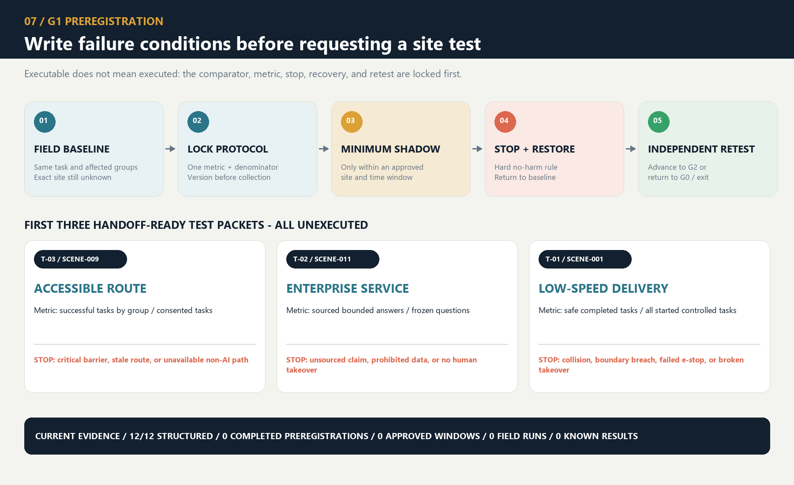
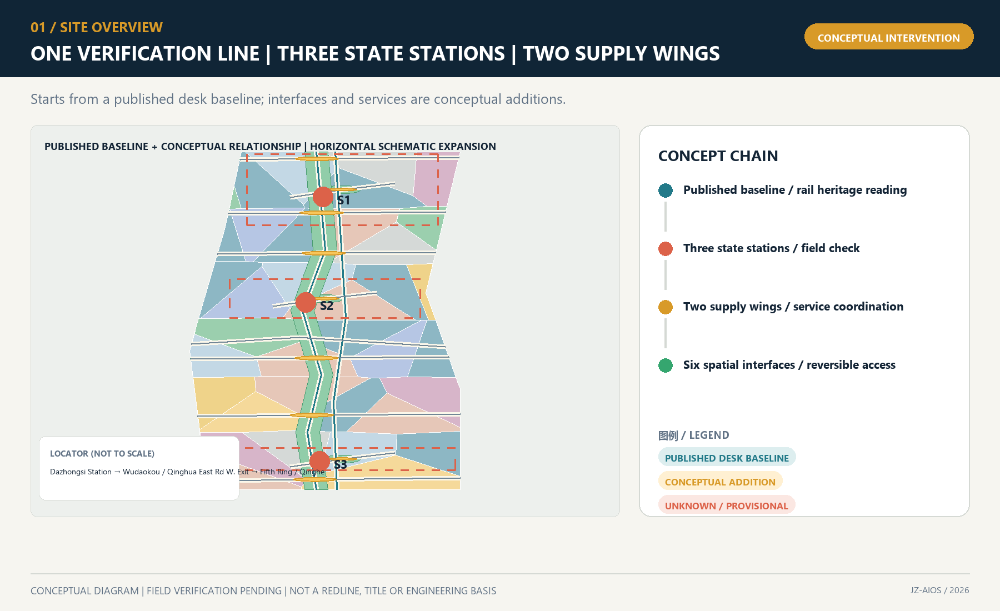
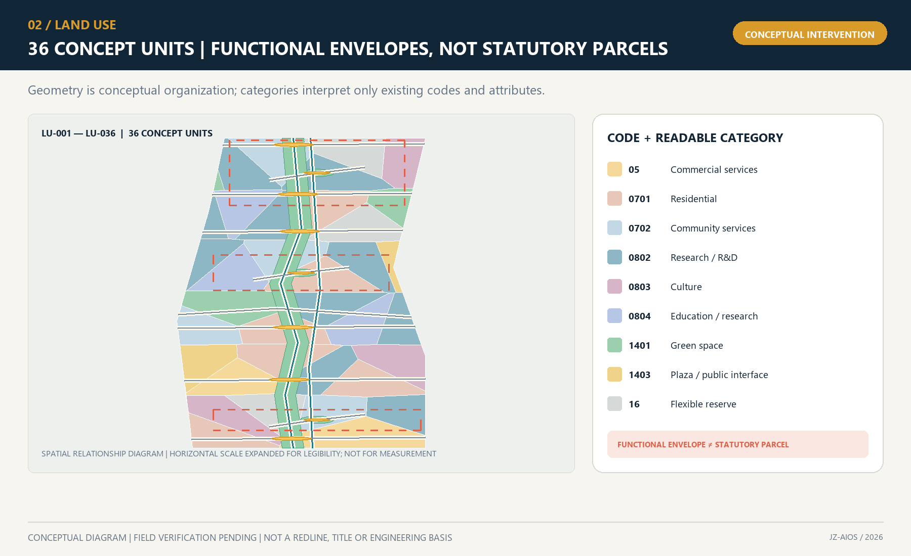
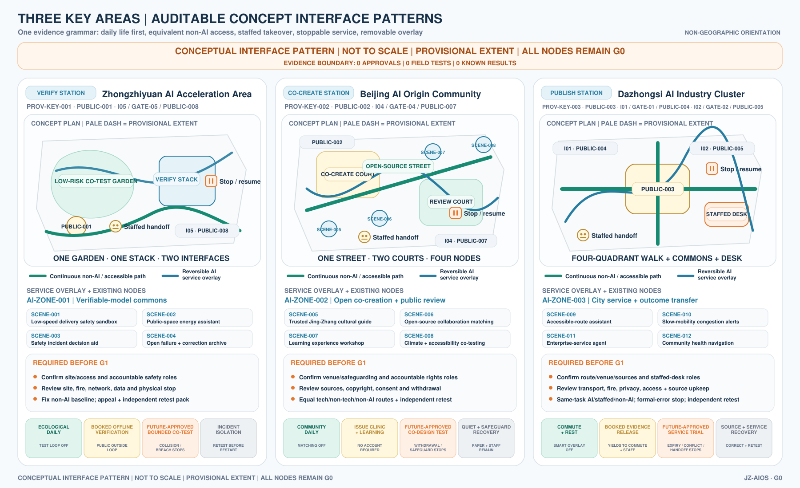
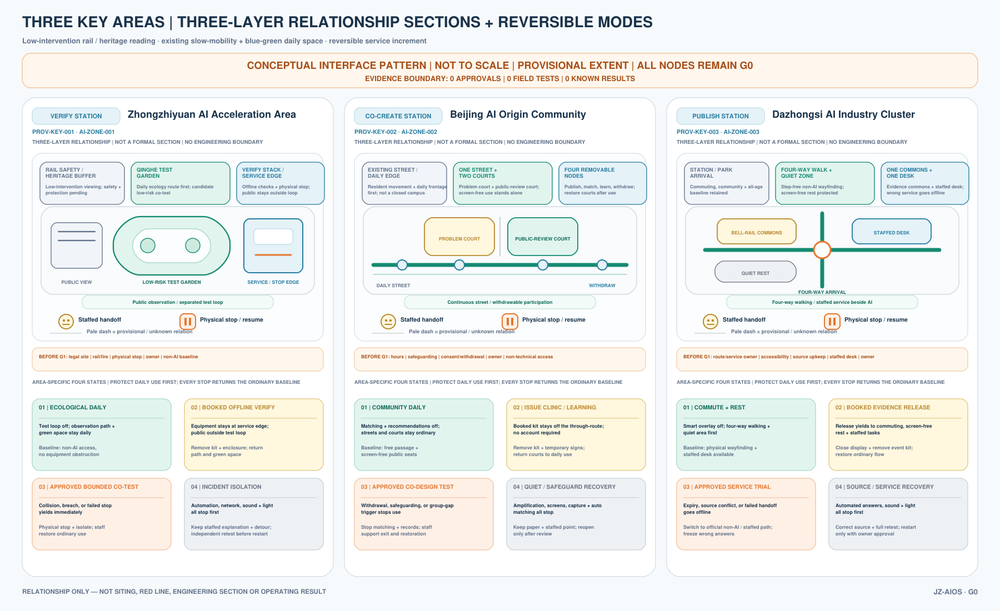
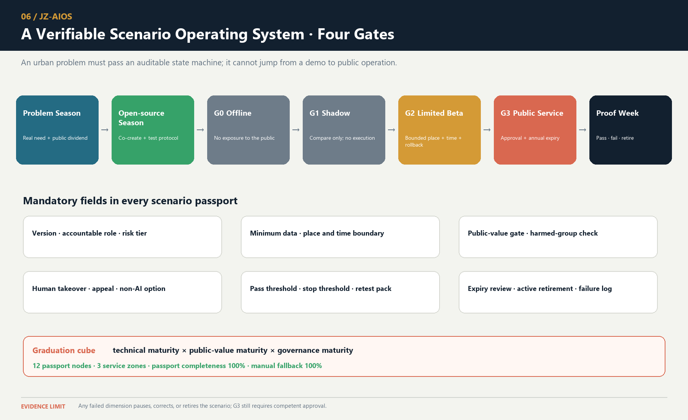
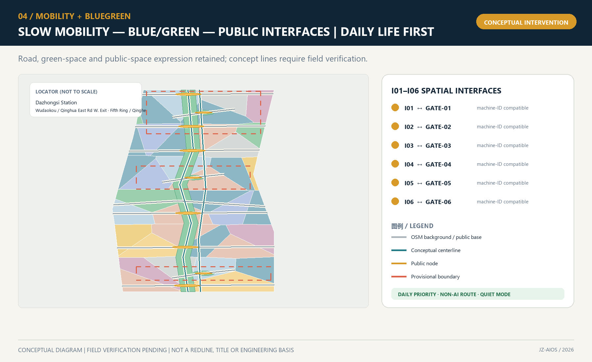

# AI Pilgrimage · Rail Rebirth Belt

- English name: Jing-Zhang AI Pilgrimage & Proof Line
- Core system: JZ-AIOS (Jing-Zhang Auditable Innovation Operating System)

## Design Basis and Source List

This second-round plan begins by acknowledging a fact: although the existing proposal passed the 8/8 baseline score and the spatial, visual, and professional self-checks, “validation passed” only means that the files are complete, the format is correct, and the references exist. It does not prove that the proposal has established a distinctive urban method. V1’s “one spine, three anchors, six interfaces, and multiple nodes” remained close to a conventional corridor plan: the three anchors were positioned but the two wings were absent; the ten AI scenarios were described in only one sentence each; three public-space nodes were insufficient to support continuous public life; and the task matrix repeatedly reused the same evidence. V2 therefore stops adding isolated applications and instead consolidates space, industry, culture, scenarios, and operations into “an auditable urban innovation production line” [depth:existing_conditions_diagnosis].

| Current shortcoming | Verifiable evidence | V2 planning response |
|---|---|---|
| Three parallel anchors, with no operating loop across the three zones and two wings | The text positions three places but provides no relay for problem intake, verification, publication, and feedback | Establish a state machine: “Xiaoyue River problem intake → Origin Community co-creation → Zhongzhi verification → Dazhongsi publication → Zhongguancun transformation → public feedback” |
| Ten scenarios are a feature list rather than operating protocols | `scenario_count` is derived only by counting numbered items in the text | Establish 12 machine-readable scenario nodes; the ten service scenarios plus two public-audit nodes all receive passports, risk controls, manual fallbacks, expiry, and rollback |
| The six spatial interfaces are slogans only | No Feature IDs, locations, functions, or acceptance criteria | Materialize the six spatial interfaces as `PUBLIC-004`—`PUBLIC-009` and bind them to lateral stitching routes, non-AI access, quiet hours, and the right to pause |
| Spatial expression in the key areas is too sparse | V1 contains only a few randomly placed masses and cannot show block–frontage–scenario relationships | Concentrate and refine the massing prototypes in the three provisional key areas, adding three attributes: retain for assessment, adaptive-reuse candidate, and new-build candidate |
| Public-space and land-use measurement scopes conflict | V1 has only three `PUBLIC_SPACE` nodes, while land-use code 1403 is a broad functional envelope | Distinguish “land-use functional envelope” from “direct design-intervention footprint” and expand to nine reversible public nodes |
| Metrics are overly geometric | No metrics for passports, manual fallback, non-AI access, or quiet and screen-free space | Expand the indicators into seven categories: space, governance, public value, industrial verification, cultural trustworthiness, operations, and resilience |
| Operations cover only organization and annual reporting | No annual rhythm, admission gates, outcome transformation, or public disclosure of failures | Establish a four-season protocol: Problem Season → Open-source Season → Urban Beta Season → Proof Week |

### The Real Starting Point after 6 August 2026

Public reporting states that Phase II of the Jing-Zhang Railway Heritage Park opened on 6 August 2026. Its southern community-vitality section and northern nature-and-leisure section now form a reported green corridor of about 9 km, with existing outcomes in community connectivity, all-age activity, slow mobility, and sponge infrastructure [source:HAIDIAN-JZ-PHASE2-OPEN-2026]. This changes the proposal’s basic judgment: JZ-AIOS no longer treats “building a continuous park” as its own outcome. It proposes only a reversible, low-footprint, and removable public-service and verification increment over the existing park. The table below is a design starting point derived from desk research, not a site visit, as-built drawing review, or confirmation of a statutory red line. Location, operating condition, and actual use still require item-by-item verification [data:visual/assets/site-grounding-register.json#SG-001] [assumption:A-SITE-LOCATION-008].

| Publicly reported baseline | Design increment proposed here | To be verified on site |
|---|---|---|
| Phase II is open; the southern section is reported to serve adjacent communities and open lateral connections | Recast the six spatial interfaces as audit/service interface types that first reuse existing entrances, staffed services, and slow-mobility nodes rather than presuming new landmarks | Exact location, accessible continuity, peak-hour detours, ownership, and operations boundary at each interface |
| The northern section is reported to provide fishbone slow-mobility links and connections to waterfront and park networks | Add only pausable scenario passports, offline wayfinding, and public retest interfaces; do not rebuild the basic greenway | Conflicts among walking, cycling, and running; night lighting; stormwater and railway-safety conditions |
| All-age activity, heritage reuse, and sponge facilities have been publicly reported | AI must prove net value over everyday use; device count, screens, and event footfall cannot substitute for public value | A 30-day post-opening use audit, task success across groups, noise, complaints, and maintenance burden |

#### Built-Park Delta Protocol (INNOV-006)

Before any G1/G2 pilot, one page must record the “non-AI current baseline → AI increment hypothesis → minimum footprint and time window → stop and recovery → independent retest” chain. AI must prove incremental value over staffed, paper-based, physical-wayfinding, or existing services, with no net loss of accessible public space or quiet periods. If it cannot prove an increment, cannot restore a state no worse than the baseline, or fails independent retesting, the pilot returns to G0 or exits. The completed 30-day post-opening field-audit count is currently 0; protocol completeness proves only design-field coverage, not field effectiveness [data:visual/assets/innovation-register.json#INNOV-006] [assumption:A-POST-OPENING-007] [metric:completed_post_opening_field_audit_count].

#### G1 Preregistration: Write the Failure Conditions before Requesting a Site Test

`visual/assets/g1-preregistration-register.json` turns all 12 existing scenarios into executable-but-unexecuted first-test contracts. Before testing, each record must lock a non-AI comparison task, one primary metric and denominator, affected groups, sample frame, collection window, no-harm rule, stop and recovery conditions, independent-retest inputs, and version. The 12/12 figure proves required-field coverage only. Completed preregistrations, approved G1 windows, field executions, and known results all remain **0**, so no scene may advance from G0 on the strength of this register [data:visual/assets/g1-preregistration-register.json#G1-PREREG-001] [metric:g1_preregistration_required_field_coverage_ratio] [metric:completed_g1_preregistration_count].

**Review path (a conceptual protocol, not approval or results):** built-park baseline → public problem → same-task non-AI baseline → G1 shadow test → stop/recover → independent retest → upgrade or exit. Every node remains at G0; this path is not approval, field execution, or field results.

| First minimum test packet | Same-task non-AI comparator | Single primary metric | Non-negotiable stop condition | Current status |
|---|---|---|---|---|
| T-03 / SCENE-009 accessible route | Staffed service, paper, or physical wayfinding for the same origin and destination | Successful tasks by co-test group / consented tasks | Stop and restore on a critical barrier, stale route state, or unavailable non-AI route | Threshold pending field preregistration; unexecuted |
| T-02 / SCENE-011 enterprise service | Staffed counter or traceable static guide using the same frozen question set | Sourced and correctly bounded answers / frozen questions | Stop on an unsourced conclusion, prohibited-data exposure, or unavailable human takeover | 10/10 synthetic decision replays exactly matched; real threshold, owner, site, and service unexecuted; G0 |
| T-01 / SCENE-001 low-speed delivery | Staffed delivery or static route for the same task | Tasks with no collision, no boundary breach, and a working physical stop / approved controlled tasks | Stop on any collision, boundary breach, physical-stop failure, or broken takeover chain | Safety red lines fixed; efficiency threshold pending preregistration; unexecuted |

### Innovation Is Not a Slogan: A Falsifiable Register

V2 closes another remaining gap: the proposal already introduces a proof line, a four-gate system, reversible public space, and public disclosure of failures, but “looking new” still does not prove that an innovation works. `visual/assets/innovation-register.json` binds six core innovations to their baseline shortcoming, novelty claim, falsifiable hypothesis, minimum evidence, pass threshold, failure signal, and exit action. INNOV-006 specifically tests whether the proposal creates a demonstrable and recoverable net increment over the opened park. A claim without a failure signal or exit action cannot be registered as a formal innovation, and operating results that do not yet exist remain `unknown` [data:visual/assets/innovation-register.json#INNOV-001] [data:visual/assets/innovation-register.json#INNOV-006]. Reviewers can therefore ask not only “what is new?” but also “what evidence would prove that it did not work?”

The evidence is organized into four tiers, each limited to a role consistent with its authority:

- Tier 1 comprises the open-call announcement, agent taskbook, and project site package, which define the task and submission boundary [source:DATA-SRC-OFFICIAL-ANNOUNCEMENT-20260509] [source:AGENT-TASKBOOK] [source:SITE-PACKAGE].
- Tier 2 comprises the repository source registry, standards index, and processing guide, which locate evidence and its use limits [source:SOURCE-REGISTRY] [source:PROCESSED-FACT-PACK].
- Tier 3 comprises public Beijing materials concerning the AI Origin Community, real-world testing along the century-old Jing-Zhang corridor, and the “one core, multiple points” innovation-district pattern. These materials assess possible coordination directions only; they do not mean that the project has been approved or that an organization has committed to participating [source:BEIJING-AI-ORIGIN-2026] [source:BEIJING-AI-DISTRICTS-2026].
- Tier 4 combines national policies on data, AI-content labeling, and “AI+” with six global cases for mechanism inspiration and governance boundaries only [source:NATIONAL-DATA-INFRA-2025] [source:AI-CONTENT-LABEL-2025] [source:AI-PLUS-2025].

### Evidence Is Not a One-Time Snapshot: Expiry Must Propagate Downstream

`sources.json` records 29 sources and their access dates, but access on the same date does not mean that content remains valid indefinitely, nor does it reveal later revisions, replacement, unavailability, or the substitution of an official boundary for a provisional one. The new `visual/assets/evidence-freshness-policy.json` groups sources into project materials, provisional spatial data, urban context, policies and standards, and case references, then specifies review triggers, recommended maximum periods without re-verification, responsible roles, and invalidation actions. When a source becomes `review_due`, `superseded`, or `unavailable`, affected claims, matrix items, and scenario gate levels must be downgraded or frozen accordingly. The package currently confirms access dates only; it does not claim that a refresh audit with content summaries has been completed, so the completed-refresh count remains 0. Provisional spatial data remains `provisional_only` regardless of how recently it was accessed [data:visual/assets/evidence-freshness-policy.json#FRESH-01] [data:visual/assets/evidence-freshness-policy.json#FRESH-02].

The professional response separates standards by question instead of stacking identifiers behind one conclusion:

- The open-call announcement and agent taskbook constrain the project and agent tasks [standard:PROJECT-OFFICIAL-ANNOUNCEMENT] [standard:PROJECT-AGENT-OPEN-CALL-TASKBOOK].
- The urban-design scope and regulatory-planning process boundary are constrained by two housing and urban-rural development references [standard:MOHURD-URBAN-DESIGN-MEASURES] [standard:MOHURD-CONTROL-DETAILED-PLANNING].
- Land-use terminology and the architectural-depth gap are recorded separately; a gap record is not represented as a verified clause [standard:MNR-LAND-USE-CLASSIFICATION-GUIDE] [standard:MOHURD-ARCH-DESIGN-DEPTH-2016].

Precise red lines, existing buildings, ownership, regulatory-plan indicators, municipal infrastructure, traffic engineering, and heritage controls have not yet been obtained. `geometry/site_boundary.geojson` and the three key areas continue to use provisional repository extents for conceptual review only [data:geometry/site_boundary.geojson#SITE-001] [source:DATA-SRC-PROVISIONAL-BOUNDARIES-20260605]. They must not be used for approval, land acquisition, precise area calculation, or engineering implementation; boundary and control assumptions remain explicit [assumption:A-BOUNDARY-001] [assumption:A-CONTROLS-001].

The latest boundary-basis note on the main branch also records an independent background check: OSM-mapped park features have 0% overlap with `PROV-SITE-001`, with a nearest distance of about 412.5 m. The reading may reflect incomplete OSM coverage, error in the provisional inferred extent, or both. It **does not decide which geometry is correct and must not be used to alter or promote either one into an official boundary**. This proposal therefore leaves the provisional geometry unchanged and treats receipt and verification of an official polygon, coordinate reference system, and version as a trigger for full recalculation [source:PROVISIONAL-BOUNDARY-BASIS].

## Three-Level Scope Framework

The three scope levels address different questions at different levels of precision while sharing one evidence chain. The approximately 43.6 km² coordinated research area asks how industry, research, urban problems, and external innovation nodes can collaborate. The approximately 11.4 km² overall design area asks how the century-old Jing-Zhang corridor can organize public space, slow mobility, functions, and scenarios. The three provisional key areas ask how three state stations—“co-create, verify, publish”—can shape blocks, buildings, public frontages, and operating gates. The areas express task hierarchy only and cannot be used to infer statutory boundaries [metric:site_area_sqm] [metric:key_area_total_sqm] [depth:three_level_scope_framework].

### The Single Core Mechanism

The century-old Jing-Zhang corridor is not a technology corridor on which AI products are placed. It is a public AI innovation production line that transforms urban problems into outcomes that are **co-creatable, verifiable, pausable, reproducible, and deliverable to society**. “AI Pilgrimage” does not mean worshipping technology. It describes a knowledge journey on which the public can “understand history → raise a problem → participate in joint testing → witness failure → leave a credited contribution.” **Proof** in the English name refers simultaneously to spatial evidence, technical verification, and proof of public value.

The overall structure evolves from “one spine, three anchors, six interfaces, and multiple nodes” to “one proof line, three state stations, two supply wings, and six urban interfaces.” The three state stations are not three homogeneous parks. Beijing AI Origin Community is responsible for co-creation and public deliberation; Zhongzhiyuan AI Independent Innovation Acceleration Area (Zhongzhiyuan) is responsible for technical, safety, and governance verification; and Dazhongsi is responsible for public release, urban services, and outcome transformation. The Xiaoyue River Scenario Enablement Wing supplies real problems and experiential feedback, while the Zhongguancun Technology Services Wing offers proposed support in intellectual property, compliance, talent, capital, and transformation. Every role assigned to an external organization is a planning recommendation and does not mean that cooperation has been secured [assumption:A-EXTERNAL-COLLAB-005] [depth:overall_spatial_structure].

### Readable Mapping to the Three Positioning Statements and Five Functions

The mapping below translates the taskbook's own terms directly into spatial and operating mechanisms instead of leaving them as compliance-matrix checkmarks. It remains a conceptual response for professional teams to develop further; it creates no statutory function, project authorization, or institutional commitment [source:AGENT-TASKBOOK] [standard:PROJECT-AGENT-OPEN-CALL-TASKBOOK].

| Taskbook position / function | Direct response in this proposal | Boundary that must not be crossed |
|---|---|---|
| The Centennial Jing-Zhang Cultural Belt | A double helix of railway engineering, Zhongguancun innovation, and AI correction history, with three knowledge-journey landmarks | Historical facts, heritage, names, and media await official/archival and rights review |
| The Urban AI Life Experience Belt | Six interfaces, nine everyday-first public nodes, non-AI parity, and quiet/screen-free modes | Field coverage is not an open service or a public-experience result |
| The AI Convergence Innovation Belt | A problem–co-create–verify–publish/service–transform–feedback state machine across three areas and two wings | No fabricated company, partner, land, funding, or implementation commitment |
| Full-stack independent AI innovation system | Zhongzhiyuan hosts proposed offline, shadow, bounded-test application, safety, and independent-retest gates | No claim of an existing full-stack platform, operator, or approved test field |
| World-class AI innovation ecosystem | Origin Community co-creation interfaces, six international comparisons, and two-wing factor support | “World-class” is an objective, not a ranking, concentration measure, or partnership fact |
| New paradigm for AI+ scenario enablement | Twelve scenario passports, three first-test protocols, and non-skippable G0–G3 gates | All items remain G0; approvals, participants, executions, and results remain 0 |
| Intelligent AI-vibrant city | Daily, learning, Beta, quiet, and offline modes alongside staffed services | Screens, surveillance, event popularity, and mandatory accounts are not proxies for vitality |
| Global voice in AI governance | Traceable sources, published failures, suspension and grievance, expiry and retirement, and retest packages | A discussable method only; it is not an international rule or government institution |

In conceptual south-to-north order, the spatial interfaces are I01 Dazhongsi Communication Interface, I02 Urban Services Interface, I03 Xiaoyue River Experience Interface, I04 University Co-creation Interface, I05 Zhongzhi Verification Interface, and I06 Qinghe Ecological Calibration Interface. They correspond to `PUBLIC-004`—`PUBLIC-009` in `geometry/public_space.geojson`. Human-facing spatial prose uses I01—I06 only; G0—G3 is reserved for scenario maturity. The existing GeoJSON `GATE-01`—`GATE-06` values are retained machine-compatibility identifiers, not spatial stages or human labels. All six interfaces are audit/service types pending field verification, not newly sited landmarks. Each interface type must jointly audit public space, a lateral slow-mobility link, sponge-system stitching, non-AI access, quiet hours, and scenario relay, prioritizing reuse of existing entrances and service facilities [data:geometry/public_space.geojson#PUBLIC-004] [data:visual/assets/site-grounding-register.json#SG-003] [metric:gateway_count].

The proposed logo uses two open-ended rail lines to form the letters **JZ**. The opening between them becomes a “verification opening with room for human intervention,” and six short ticks represent the six spatial interfaces. The logo uses only geometric linework and a project-owned wordmark; it does not use corporate trademarks, portraits, or restricted fonts. The overall palette comprises Rail Silver, Haidian Blue, Open-source Green, Verification Orange, and Bell Gold. Cultural wayfinding follows a separate three-line grammar—“mileage, year, source”—so that the cultural signage is not confused with the overall logo system.

## Coordinated Research Area: Industry and Future City Research

### Three-Anchor, Two-Wing Industrial State Machine

Industry is not zoned by company lists; space and resources are allocated according to task state. The Xiaoyue River Wing gathers problems that residents, urban service providers, and public bodies are willing to make public. Origin Community converts those problems into open-source tasks, user journeys, and comparison baselines. Zhongzhiyuan verifies models, robots, safety, ethics, and interoperability in offline, shadow, and bounded environments. Dazhongsi converts passed outcomes into urban services, enterprise services, and international exchange that the public can understand. The Zhongguancun Technology Services Wing offers proposed compliance, intellectual-property, talent, computing, and transformation support at every stage. Complaints, incidents, failures, and public-value results feed into the following year. Public Beijing materials propose opening the Origin Community, Beiwei Community, and the century-old Jing-Zhang corridor to real-world testing for urban governance and public services. This provides a practical interface for a “proof belt” rather than an ordinary display belt, but this proposal does not present that public direction as project authorization [source:BEIJING-AI-ORIGIN-2026].

Eight resource types follow a “public foundation + conditional access” model. Land provides only reversible-use interfaces. Space provides shared laboratories, public living rooms, and bounded test surfaces. Industry is driven by problems rather than vendors. Funding is limited to a proposed multi-party review and milestone-disbursement mechanism, without inventing budget amounts. Talent is engaged through joint testing by developers, residents, and professionals. Computing prioritizes auditable shared environments. Data follows necessity minimization, retention at source, and controlled computation. Every scenario must hold a passport and expire. The National Data Infrastructure Construction Guidelines provide policy context for consensus rules, trusted controls, and auditable lifecycles in trusted data spaces, but they do not mean that this project’s data system has been approved [source:NATIONAL-DATA-INFRA-2025].

### Six Cases: Mechanism—Local Action—Verification—No-Go Area

| Case | Transferable mechanism | Local Jing-Zhang action | Proposed verification | Not directly transferable |
|---|---|---|---|---|
| Kendall Square | Joint organization of research, firms, housing, and public space | Co-locate Origin Community’s co-creation street with everyday services | Whether cross-institutional co-creation and resident use occur together | Land regime, rents, and firm density [source:CASE-KENDALL] |
| one-north | Themed districts connected by shared facilities and walking networks | Three state stations share one passport and retest package | Whether the relay between stations preserves the same evidence version | Development system and authority over park management [source:CASE-ONE-NORTH] |
| Barcelona 22@ | Industrial upgrading proceeds in parallel with neighborhood renewal and knowledge transfer | Use the six spatial interfaces first to repair everyday public frontages | Whether public-interest delivery precedes expansion | Land-use policy and fiscal instruments [source:CASE-22AT] |
| King’s Cross | Heritage reuse, car-free public space, and mixed use | Present railway engineering history and contemporary public life along the same line | Whether residents continue to use the area on non-event days | Ownership, protection grades, and business model [source:CASE-KINGS-CROSS] |
| STATION F | Physical space operated through programs, mentors, and partner networks | Four-season operating protocol and a problem-to-Proof funnel | Cycle time from problem to bounded prototype | A single large campus and private operating conditions [source:CASE-STATION-F] |
| MaRS | Coupling laboratories, offices, events, and community services | Co-locate publication, compliance advice, and staffed service at Dazhongsi | Success rate of human handoff and follow-up services | Healthcare, investment, and institutional systems [source:CASE-MARS] |

Regional coordination uses a “testing relay,” not a vague alliance. The Future Science City is proposed for retesting in basic science or frontier equipment; Huairou Science City for verification related to major scientific facilities; the Beijing Economic-Technological Development Area for engineering retests in manufacturing and embodied systems; other first-batch innovation districts for cultural or industrial scenarios in which they specialize; and Beijing–Tianjin–Hebei nodes for cross-regional replicability checks. Each relay transmits only tasks, protocols, anonymized results, and failure records; it does not require the transfer of raw sensitive data. The publicly stated “one core, multiple points” pattern only shows that this division of work has a basis for discussion; it does not mean that any node has agreed to participate [source:BEIJING-AI-DISTRICTS-2026].

## Overall Design Area: Urban Renewal and Regulatory-Plan-Level Urban Design

The overall area takes the opened park’s north–south green corridor, reported lateral connections, and all-age public activity as a publicly reported baseline rather than an object that this proposal has yet to build from scratch [source:HAIDIAN-JZ-PHASE2-OPEN-2026]. Only then does it organize a three-layer section: railway-side historical interpretation, existing slow-mobility and blue-green space, and a reversible innovation-service layer. The railway side receives only low-intervention interpretation; the middle first protects everyday walking, cycling, and staying; and the neighborhood side uses six interface types to audit breaks and add small-scale services. Any action crossing railways, rivers, urban roads, bridges, tunnels, or underground space is only a question pending verification and a design direction; separate field, transport, flood-control, railway-safety, and engineering studies are mandatory.

Land use is refined from 12 large color blocks into 36 irregular, topologically closed conceptual units. They cover nine project-enumerated categories: research, education, housing, community services, commercial services, culture, green space, plazas, and flexible reserve. The number and categories of units can be recalculated from the GeoJSON [metric:land_use_unit_count] [metric:land_use_category_count]. They express spatial–industrial functional envelopes and are neither statutory parcels nor approved uses [data:geometry/land_use.geojson#LU-001] [depth:land_use_layout].

The six lateral interface lines and the north–south main line form a fishbone accessibility network. Every interface binds slow mobility, public space, stormwater stitching, and a testable urban problem. The nine public spaces do not turn the park into a round-the-clock testing ground. Instead, they follow reversible time-space rules: daily life is the default; public learning is scheduled; bounded Beta operation occurs only during approved periods; quiet mode applies from 22:00 to 07:00; and everyone can always choose a non-AI route. The innovation is not that “the city adapts to AI,” but that “AI must adapt to everyday urban life.”

The building layer uses massing prototypes to express priority intervention capacity; it does not simulate the complete existing city. Each prototype is marked as retain for assessment, adaptive-reuse candidate, or new-build candidate. Without evidence from surveys, ownership, structural conditions, heritage controls, and regulatory planning, none may be converted into a demolition or construction conclusion. Floor area ratio, total floor area, building height, road red lines, parking, and municipal capacity remain `unknown` [assumption:A-SPATIAL-REPRESENTATION-002] [depth:development_intensity_controls] [depth:height_massing_character].

## Detailed Design of Key Areas

The three key areas use the same response framework—site conflict, spatial structure, core project, AI scenario, admission gate, and acceptance—and organize the material at key-area detailed-design depth [depth:three_key_area_detailed_design]. The extents below remain provisional substitutes; all area and massing-coverage values are for conceptual review only [data:geometry/key_areas.geojson#PROV-KEY-001] [data:geometry/key_areas.geojson#PROV-KEY-002] [data:geometry/key_areas.geojson#PROV-KEY-003].

### Key-area evidence crosswalk

To keep “key area → scenario → acceptance” reviewable rather than implicit in long prose, `visual/assets/key-area-evidence-matrix.json` crosswalks each provisional area to its state station, public anchor, I/GATE interface references, AI service zone, scenario nodes and concept-level acceptance contract, then lists the formal evidence required before G1 [data:visual/assets/key-area-evidence-matrix.json] [metric:key_area_evidence_matrix_record_count]. Its 100% matrix-field coverage means only that the three records contain the required crosswalk fields; it does not mean field coverage, partner confirmation, approval, operating performance or public-value evidence. Field audits, accountable-role confirmation, approvals, test executions and known results remain 0 for all three records [metric:key_area_evidence_matrix_field_coverage_ratio].

| Provisional key area | Station / conceptual spatial response | AI zone / scenarios | Evidence required before G1 | Current boundary |
| --- | --- | --- | --- | --- |
| `PROV-KEY-001` Zhongzhiyuan | VERIFY; one garden, one stack, two interfaces | `AI-ZONE-001`; `SCENE-001`—`004` | Legal/owner site, safety and physical-stop review, accountable roles, non-AI baseline, independent retest package | Provisional extent, not approved, untested |
| `PROV-KEY-002` Origin Community | CO-CREATE; one street, two courtyards, four nodes | `AI-ZONE-002`; `SCENE-005`—`008` | Venue and safeguarding, rights and consent, non-technical participation, withdrawal route, independent retest package | Provisional extent, no partner commitment, untested |
| `PROV-KEY-003` Dazhongsi | PUBLISH; four-quadrant walking plus one commons and one desk | `AI-ZONE-003`; `SCENE-009`—`012` | Route/service ownership, staffed desk, source maintenance, same-task comparator, independent retest package | Provisional extent, no approved service desk, untested |

The sections no longer render the three areas as one generic campus template. Zhongzhiyuan separates the public observation edge, low-risk test-garden loop, and verification/service edge. Origin Community protects resident passage and exit through a continuous daily street, problem court, public-review court, and four removable nodes. Dazhongsi makes releases yield to commuting, screen-free rest, and staffed tasks through four-way walking, the Bell-Rail Commons, a staffed desk, and quiet rest. Each area has its own daily, booked, future-approved bounded, and stop/recovery states, producing three differentiated sections and twelve G0 concept states; the drawing and matrix state what yields first, how ordinary use returns, and what blocks restart [data:visual/assets/key-area-evidence-matrix.json] [metric:key_area_reversible_mode_count].

The matrix adds only reviewable design mappings. It does not turn interface IDs into sited landmarks or public desk research into as-built survey, regulatory plan, ownership or institutional commitment evidence [data:visual/assets/key-area-evidence-matrix.json].

### Zhongzhiyuan: Verification Station / VERIFY

The conflict is that autonomous technology needs real problems and compound testing, while urban public space cannot become an unbounded testing ground. In line with Haidian’s latest public objectives, Zhongzhiyuan treats AI4S, AI-safety governance, and mutual recognition of rules as proposed verification themes; it does not claim that platforms, partners, or international mechanisms already exist [source:HAIDIAN-JZ-MIDTERM-2026]. The spatial structure is “one garden, one stack, two interfaces.” Qinghe Test Garden supports environmental and low-risk joint testing. The Verifiable Model Commons supports offline benchmarks, safety checks, and interoperability checks. The community-facing side provides a public observation and grievance interface, while the service side supports human takeover and equipment maintenance. `AI-ZONE-001` binds four nodes: low-speed delivery, energy use, safety assessment, and the failure archive [data:geometry/constraints.geojson#AI-ZONE-001] [data:geometry/constraints.geojson#SCENE-001]. Admission requires complete sources, a responsible person, a risk level, a comparison baseline, and a physical emergency stop. Any collision, boundary breach, unauthorized data processing, or failed human takeover triggers immediate suspension. Acceptance is not based on a “successful demonstration,” but on a complete retest package, reproducible failure, usable human takeover, and passage through the public-value gate.

**How to read the drawing / missing evidence.** In the plan and section/mode diagrams, the pale dashed line represents only the provisional conceptual extent of `PROV-KEY-001`. The public observation path is separated from the low-risk test-garden loop, while the service/physical-stop edge receives equipment withdrawal. Ecological daily, booked offline verification, future-approved bounded co-test, and incident-isolation states remain G0 hypotheses. No exact location, scale, approval, test, or result may be inferred until official boundary and site conditions, accountable roles, and railway, fire, network, data, and physical-stop reviews are complete [data:visual/assets/key-area-evidence-matrix.json] [data:geometry/key_areas.geojson#PROV-KEY-001] [assumption:A-KEY-AREA-DETAIL-010].

### Beijing AI Origin Community: Co-creation Station / CO-CREATE

The conflict is the absence of a stable interface between a high density of innovation resources and residents’ daily lives, low-cost entrepreneurship, and public participation. Public materials describe Origin Community as an approximately 3 km² area with a “ten-minute innovation circle” context; published scale figures are context only, not an inventory of this project’s resources, a siting basis, or evidence of partnership [source:HAIDIAN-AI-TRIAL-FIELD-2026]. The spatial structure is “one street, two courtyards, four nodes,” with five-minute everyday-life support cells nested inside the ten-minute innovation context and a broader fifteen-minute public-service planning framework. The Open-source Release Street connects universities and the community. The Co-creation Courtyard supports problem decomposition and team matching. The Public Deliberation Courtyard supports resident joint testing, education for minors, and screen-free discussion. `AI-ZONE-002` binds trusted cultural guidance, open-source matching, educational workshops, and climate-and-accessibility joint testing [data:geometry/constraints.geojson#AI-ZONE-002] [data:geometry/constraints.geojson#SCENE-005]. Admission requires a problem grounded in an explicit public need, participants able to withdraw, and recommendations excluded from hiring evaluation. Acceptance focuses on cross-role co-creation, responsiveness to withdrawal, non-technical participation, and differences in task success across groups.

**How to read the drawing / missing evidence.** The plan and section/mode diagrams read “one street, two courtyards, and four nodes” as withdrawable participation overlays on a continuous daily street. Community daily, issue clinic/learning, future-approved co-design test, and quiet/safeguarding recovery remain G0 hypotheses and do not imply participation by a community, school, or venue. No partner commitment, approved co-testing, or learning outcome may be inferred until the exact venue and opening hours, safeguarding and accountable roles, content rights, consent/withdrawal, and non-technical participation conditions are confirmed [data:visual/assets/key-area-evidence-matrix.json] [data:geometry/key_areas.geojson#PROV-KEY-002] [assumption:A-KEY-AREA-DETAIL-010].

### Dazhongsi: Publication Station / PUBLISH

The conflict is that station-area footfall, enterprise services, and consumer display can easily turn AI into screen-based marketing while displacing staffed services and quiet space. The design first acknowledges the opened southern section’s community, commuting, and all-age activity baseline, rather than repackaging existing connectivity improvements as this proposal’s outcome [source:HAIDIAN-JZ-PHASE2-OPEN-2026]. The spatial structure is “four-quadrant walking + one hall and one desk.” The four quadrants indicate connection directions pending field verification. The Bell-and-Rail Commons presents evidence of passage, failure, and correction. The Urban Services Desk places intelligent navigation alongside a staffed counter. The publication frontage provides screen-free default areas and quiet hours. Haidian’s public Fifteenth Five-Year Plan sets district-level objectives to become a global AI innovation source and industry highland by 2030 and to advance high-quality urban renewal; it is used here only as district direction and does not show that any specific Dazhongsi parcel is included, rights are settled, or delivery is committed [source:HAIDIAN-15FYP-2026]. `AI-ZONE-003` binds accessible routing, slow-mobility guidance, enterprise services, and health navigation [data:geometry/constraints.geojson#AI-ZONE-003] [data:geometry/constraints.geojson#SCENE-009]. Acceptance focuses on source-hit rate, expiration notices, human handoff, complaint closure, and incremental value over existing services—not event attendance or exposure.

**How to read the drawing / missing evidence.** The plan and section/mode diagrams show four-way walking, one commons, one staffed desk, quiet rest, and physical wayfinding as relationships pending verification—not an exact route or approved service point. Commute/rest, booked evidence release, future-approved service trial, and source/service recovery require every AI overlay to pause and return to ordinary use. No deployment, formal-service outcome, or field performance may be inferred until exact route, venue and service ownership, current barriers and accessibility conditions, source maintenance, and staffed-handoff capacity are confirmed [data:visual/assets/key-area-evidence-matrix.json] [data:geometry/key_areas.geojson#PROV-KEY-003] [assumption:A-KEY-AREA-DETAIL-010].

The three pilgrimage landmarks are redefined as three chapters in one knowledge journey. Zhongzhiyuan’s “Open-source Spark Tower” records reproducible contributions without displaying personal rankings. Origin Community’s “Algorithm Milestone” places Jing-Zhang engineering history, Zhongguancun innovation history, and the history of AI correction side by side. Dazhongsi’s “Bell-and-Rail Commons” houses an archive of failures and corrections. Contributors may choose real names, pseudonyms, or anonymity. Recognition records only verifiable public contributions and is not tied to wealth, traffic, recruitment, or administrative evaluation. All names and forms require copyright, trademark, portrait-rights, historical-source, and accessibility review [assumption:A-CULTURE-CONTENT-006].

## AI Innovation Ecosystem, Personas, and AI+ Scenarios

### Seven Joint-Testing Profiles

Haidian’s latest public requirements prioritize three groups: leading research talent, young innovators and entrepreneurs, and permanent residents. This proposal does not create a separate persona system. Instead, it maps them to the existing seven: leading research talent primarily maps to open-source developers and university faculty and students; young innovators and entrepreneurs map to start-up teams and connect with enterprise-service teams; permanent residents map to nearby residents and older people and people with reduced mobility; tourists and international visitors remain as reviewers of communication and legibility. The three policy groups set demand priorities, while the seven profiles decompose joint-testing and risk. Neither means that samples have been recruited or research completed [source:HAIDIAN-JZ-MIDTERM-2026] [data:visual/assets/site-grounding-register.json#SG-006].

| Profile | Core needs | Potential harm | Hard protection |
|---|---|---|---|
| Open-source developers | Computing, protocols, retesting, and collaborators | Contributions captured by a platform | Right to withdraw, clear licenses, portable contributions |
| Start-up teams | Low-cost verification, compliance, and transformation | Misled by demonstration metrics | Publish failures; prohibit implied government endorsement |
| Enterprise-service teams | Clearly sourced administrative and market information | Harm from outdated content | Source dates, human handoff, and clear responsibility boundaries |
| University faculty and students | Learning, research, and outcome transformation | Leakage of education data | Local sandbox, teacher review, and minimum data for minors |
| Nearby residents | Quiet, accessibility, and everyday services | Noise, congestion, surveillance, and exclusion | Daily life first; quiet and screen-free operation; grievance and pause rights |
| Older people and people with reduced mobility | Continuous accessibility and human assistance | Exclusion through digital barriers | Non-AI access, joint testing, and no withdrawal of staffed service |
| Tourists and international visitors | Trustworthy multilingual cultural content | False narratives and excessive collection | Source labels, curatorial review, and account-free browsing |

### Non-AI Options Must Complete the Same Basic Task

Existing indicators can show that nine public nodes declare non-AI access and that twelve scenarios declare manual fallback, but they cannot prove that those alternatives are actually usable. The new `visual/assets/non-ai-parity-contract.json` requires every public service seeking entry to G2 or G3 to compare six dimensions: opening hours, basic outcome, cost, rights and grievance, safety and accessibility, and completion time. A person who does not use an account, smartphone, or algorithm must not receive lower eligibility, higher charges, or weaker review rights. No on-site joint-test results currently exist, so all four test journeys remain `unknown`; any permitted completion-time difference must be preregistered after a baseline is obtained rather than invented in the proposal [data:visual/assets/non-ai-parity-contract.json#PARITY-001] [data:visual/assets/non-ai-parity-contract.json#PARITY-004].

### Four-Gate System and Scenario Passports

JZ-AIOS requires every scenario to proceed in sequence through G0 concept/offline, G1 shadow comparison, G2 time-bounded and geographically bounded Beta, and G3 approved public operation. No level may be skipped. Every node in the current submission is in **G0 conceptual status**; no scenario is operating or approved. Each passport must include version, responsible role, risk level, minimum dataset, geographic and temporal boundary, potentially harmed groups, human takeover, grievance channel, non-AI option, admission conditions, stop conditions, retest package, and expiry date [assumption:A-SCENARIO-PROTOCOL-004].

The 12 scenarios are grouped in human-facing prose as safety and access (`SCENE-001`, `003`, `009`, `010`), trusted public service (`SCENE-002`, `005`, `011`, `012`), and public learning and collaboration (`SCENE-004`, `006`, `007`, `008`). The machine record retains every `SCENE-001`—`012` passport and field; grouping does not indicate deployment, priority, or test results. The ten service scenario cards are listed below. A spatial Feature indicates conceptual placement only, not deployment:

| ID / Node | Scenario and space | Minimum input → output | Responsibility and manual fallback | Admission / stop / retirement |
|---|---|---|---|---|
| SC-01 / `SCENE-005` | Trusted Jing-Zhang cultural guide; Origin–milestone route | Rights-cleared historical sources and an actively selected language → sourced content | Human curator; account-free print/audio alternative | Complete sources and AI labels; remove disputed content that cannot be verified; annual review |
| SC-02 / `SCENE-009` | Accessible route assistant; Dazhongsi and I01—I06 | Slopes, temporary obstacles, and facility status → suggested route | Confirmation by on-site service staff; retain physical wayfinding | Road test and joint testing passed; stop recommending a route upon any critical obstacle; invalidate when data changes |
| SC-03 / `SCENE-010` | Slow-mobility crowding notice; public greenway | Segment-level anonymous flow → detour suggestion | Published by management staff; no automated control | No facial data; return to static wayfinding if false alerts affect passage; expire after the event |
| SC-04 / `SCENE-001` | Low-speed delivery sandbox; authorized surface in Zhongzhiyuan | Vehicle state, geofence, and obstacles → low-speed task | On-site safety officer, physical emergency stop, and manual towing | May apply for G2 only after passing offline and closed-site tests; one collision or boundary breach triggers suspension; retire the configuration after each test |
| SC-05 / `SCENE-011` | Enterprise-service agent; Dazhongsi Services Desk | Public policy and a user-initiated question → sourced navigation | Staff handle formal matters | Complete sources and update dates; suspend if an error affects official procedures; policy updates trigger invalidation |
| SC-06 / `SCENE-006` | Open-source collaboration matching; Origin Co-creation Courtyard | Voluntarily disclosed skills and topics → team suggestions | Community operator processes withdrawal; excluded from hiring evaluation | Confirm withdrawal and license terms; stop upon discriminatory matching; clear data when the project ends |
| SC-07 / `SCENE-002` | Public-space energy assistant; Zhongzhiyuan and I01—I06 | Equipment and environmental data → lighting suggestion | Operations staff retain priority; manual switches remain available | No identity data; return to manual control if safety lighting is affected; retest when seasonal parameters expire |
| SC-08 / `SCENE-012` | Community health navigation; beside staffed service at Dazhongsi | Publicly listed institutions and a user-initiated inquiry → public information and booking entrance | No diagnosis; emergencies handed off to professional institutions | Clear boundary notice; any diagnostic output triggers suspension; invalidate when institution information changes |
| SC-09 / `SCENE-007` | Educational experience workshop; Origin Community | Local teaching data → bias and programming exercises | Full teacher review; minors’ data do not leave the site | Parent/school rules and local sandbox in place; stop upon external data transfer; destroy temporary data after the course |
| SC-10 / `SCENE-003` | Assisted safety-incident assessment; Zhongzhiyuan control room | Equipment alerts and human reports → unverified incident summary | Authorized personnel decide; no automated enforcement | Permissions, logs, and comparison baseline complete; suspend upon overreach or misleading handling; re-review after model changes |

Two public-governance nodes are added. `SCENE-004`, the “Public Archive of Failures and Corrections,” records suspensions, corrections, and voluntary retirements. `SCENE-008`, “Climate and Accessibility Joint Testing,” makes older people, children, and people with reduced mobility co-testers at an early stage rather than passive recipients of acceptance after completion. Node and service-zone counts are machine-verifiable [metric:mapped_scenario_node_count] [metric:ai_service_zone_count]. Passport and manual-fallback field coverage is counted separately and does not prove field performance [metric:scenario_passport_coverage_ratio] [metric:manual_fallback_coverage_ratio].

### Three Priority Industrial Test Protocols

- T-01 Robot Safety Graduation Protocol: G0 digital and closed-site baseline → G1 shadow task → application for G2. Proposed hard gates require all physical emergency stops to succeed in controlled tests, zero collisions, zero boundary breaches, and a complete human-takeover chain. Any safety red line triggers suspension, review, and restart from a lower gate. The figures are proposed design acceptance criteria, not measured results.
- T-02 Sourced Enterprise-Service Protocol: This is the first **offline reproducible evidence package**. It freezes the question set, source closure, update times, refusals, stop/recovery behavior, human handoff, and an independent-retest placeholder so others can review the same materials. A zero-dependency Node.js 22.x runner completed one governance-decision replay across 10 PII-free synthetic fixtures: 10/10 exactly matched the expected decisions; all four distinct declared stop events mapped to their exact recovery actions; and 13/13 negative mutation controls failed closed on unknown fixture and frozen-contract fields, enum and answer-mode drift, full source closure, prohibited-data precedence, canonical RACI closure, real-service authorization, and summary-count tampering. This proves only deterministic G0 contract behavior and refusal precedence. It produces no substantive answer and calls no model, API, or real service. Answer outputs, model calls, API calls, real-service interactions, field tests, approved triggers, confirmed accountable parties, real independent retests, and G1 results all remain 0 or unknown [data:visual/assets/g0-offline-enterprise-service-baseline.json] [data:visual/assets/t02-g0-g1-replay-result.json] [metric:completed_g0_offline_replay_count]. Entry into a bounded service may be requested only after source coverage, stale-information warnings, human takeover, approvals, accountable parties, and independent real-world retesting reach pre-published thresholds. Suspend the service if an error affects a formal procedure.
- T-03 Universal-Access Route Protocol: This is the **spatial and public-interest exemplar**: wheelchair users, visually impaired users, older people, child caregivers, and ordinary pedestrians complete the same task together. A proposal cannot graduate if any critical break lacks a non-AI alternative route. It likewise has no approval or field result; only after operation begins may it continue comparing gaps in task success among groups and publish improvements.

Graduation uses a three-dimensional cube of “technical maturity × public-value maturity × governance maturity.” Failure in any dimension allows only correction or retirement. The national “AI+” policy emphasizes openness and sharing, safety and controllability, and broadly shared outcomes. This proposal translates those directions into a public-value gate but does not replace specific law, approvals, or professional responsibility [source:AI-PLUS-2025] [depth:municipal_new_infrastructure].

## Land Use, Building Scale, and Retain-Renovate-Demolish Strategy

Land-use classification uses the project-permitted codes 0701, 0702, 0802, 0803, 0804, 05, 1401, 1403, and 16. Thirty-six units fully cover the provisional overall extent; a color-coded diagram is not presented as statutory land use. Code 1403 represents a functional envelope suitable for public activity. `PUBLIC_SPACE` records only the nine public nodes receiving direct design intervention, so the two areas are not expected to match. They will be reconciled after formal parcel and public-space data become available [standard:MNR-LAND-USE-CLASSIFICATION-GUIDE] [assumption:A-PUBLIC-SPACE-SCOPE-003].

The building layer consists of conceptual massing prototypes. Their count, footprint area, and overall representation ratio can be recalculated [metric:building_count] [metric:building_footprint_area_sqm] [metric:building_representation_ratio]. The prototype count and footprint coverage within the key areas indicate whether the drawings genuinely refine the three state stations; they do not represent existing or statutory building density [metric:key_area_building_count] [metric:key_area_building_footprint_ratio]. Prototypes have three classes: `retain_for_assessment` enters investigation of historical, structural, and use value; `adaptive_reuse_candidate` gives priority to comparing adaptive-reuse options; and `new_build_candidate` may be refined only after regulatory planning, ownership, fire safety, daylight, transport, and municipal conditions are all confirmed. There is currently no “demolish” class because the evidence is insufficient to support such a judgment [data:geometry/buildings.geojson#BLDG-001] [depth:retain_renovate_demolish].

Building-form principles serve the public frontage rather than pursue a technological aesthetic. Along the railway, reduce ground-level enclosure and increase visual permeability. Organize research clusters around shared courtyards. Prioritize small scale, mixed use, and everyday services in Origin Community. At Dazhongsi, separate staffed service, logistics, and public frontages. Avoid abrupt massing at heritage and residential edges. Building height, floor area ratio, total floor area, number of stories, and construction scale all remain unknown. The A3/A0 masses explain spatial relationships only and cannot support investment estimates or approval.

## Transport, Rail, Municipal Infrastructure, and Public Services

Transport evidence has two layers. Existing roads, railways, and waterways come from OpenStreetMap, are used only for directional identification, and retain ODbL attribution; they cannot establish road red lines, railway protection zones, or waterway blue lines [source:OSM-CONTEXT] [assumption:A-OSM-001]. Design centerlines are conceptual proposals for slow mobility, lateral stitching, connections, and service wings; route count and length can be recalculated [metric:design_road_count] [metric:design_road_length_m]. The route layer and professional depth provide separate machine and human review entry points [data:geometry/roads.geojson#ROAD-001] [depth:traffic_rail_slow_parking].

The six spatial interfaces follow one protocol: first document existing breaks and detours; then propose a minimum continuous walking and accessible line; then add cycling and transit connections; and only then discuss works crossing roads, rivers, or railways. Every interface must provide an everyday non-AI route, a clearly identified human contact, and quiet and no-testing periods. Robots and test vehicles must not occupy commuter movement, nighttime quiet periods, or peak public passage. Road widths, turning movements, bridges, underground connections, and station interchanges shown in conceptual drawings do not replace surveys or specialist design.

Municipal and new infrastructure follows four principles: edge-based, minimal, replaceable, and degradable. The three service zones record functions only and make no claims about equipment capacity. In normal L0 state, approved digital services are available. In degraded L1 state, personalization and automated control are disabled. In offline L2 state, physical wayfinding, staffed service, lighting, and emergency stops remain available. A trusted data space exchanges only tasks, permissions, anonymized results, and audit evidence; sensitive raw data remains at source wherever possible. Computing, energy, network, fire-safety, flood-control, and utility capacity must all be confirmed after formal engineering information is obtained.

Public services use a nested logic of an “outer fifteen-minute planning framework + inner five-minute support cells.” The fifteen-minute layer proposes connections among talent advice, childcare, health, legal support, meetings, accessibility, and community activities. During co-creation or testing, the five-minute layer requires walkable access to staffed help, rest, toilets, basic supplies, and screen-free information. The five-minute objective comes from Haidian’s public priorities, but without real population, facility capacity, walking-network, and service-radius data, the plan does not claim that coverage already exists [source:HAIDIAN-JZ-MIDTERM-2026]. Every intelligent service must coexist with staffed counters, telephone, print, or physical wayfinding. Non-AI access coverage is recalculated from public-space attributes [metric:non_ai_access_coverage_ratio].

## Blue-Green Network, Public Space, and Urban Character

The blue-green system no longer claims to build the main green spine from scratch. The publicly reported approximately 9 km green corridor, north–south sections, fishbone slow-mobility network, and sponge facilities become an existing baseline pending field verification. The proposal’s increment is limited to continuity audits at the six interface types, low-risk learning interfaces at the three state stations, and reversible components that do not damage everyday recreation [source:HAIDIAN-JZ-PHASE2-OPEN-2026] [data:visual/assets/site-grounding-register.json#SG-004]. Green-space area and count are still recalculated from submission-package design geometry [metric:green_space_area_sqm] [metric:green_space_count] and cannot be represented as as-built conditions. Because the ratio uses the provisional boundary as its denominator, it inherits low confidence [metric:green_ratio] [depth:blue_green_public_space].

The nine public spaces consist of three pilgrimage-landmark living rooms and six spatial interfaces, forming a line–surface–point network. Daily-life mode is the default at every space. Public learning or bounded Beta begins only when notice, authorization, time limits, and rollback conditions are all in place. Quiet mode applies from 22:00 to 07:00. Screen-free areas are the default, and bright large displays, continuous broadcasting, and dense camera arrays are not treated as technological character. Public-node count and area can be recalculated [metric:public_space_node_count] [metric:public_space_area_sqm]. The ratio remains a low-confidence conceptual value; screen-free defaults and the spatial layer retain separate review entry points [metric:public_space_ratio] [metric:screen_free_public_node_ratio] [data:geometry/public_space.geojson#PUBLIC-001].

The public-space component library contains six replaceable component types: bilingual/tactile milestones; offline maps and human-call points; switchable low-level guide lighting; mobile joint-testing tables; rain gardens and shaded seating; and bounded test barriers with physical emergency stops. Every component must be usable without an account, retain basic function when power is lost, and identify who is responsible for maintenance. Bridges, tunnels, equipment foundations, and utility conditions require separate investigation.

Culture follows a “double helix of trustworthy narrative.” The physical strand explains railway engineering → urban growth → Zhongguancun innovation. The learning strand explains problem raising → model failure → human correction → public verification. Public Beijing materials show that Phase I of the Jing-Zhang Railway Heritage Park connects universities, research, and residents’ lives through railway remains, green public space, and functional stitching. Public participation and the responsible-planner mechanism in the existing project also show that cultural space requires continuous professional stewardship [source:JZ-PARK-2023] [source:JZ-COCREATION-2021]. V2 does not copy the existing landscape; it turns “source, correction, and failure” into new cultural content.

All AI-generated text, images, audio, video, or virtual scenes carry both public-facing explicit labels and, where applicable, file-metadata labels. Disputed content enters human curatorial review and is removed if it cannot be verified. This rule is consistent with the direction of the 2025 synthetic-content labeling regime, but formal operation still requires legal review [source:AI-CONTENT-LABEL-2025]. The international message is **“Build in public. Test with people. Keep the evidence.”** It emphasizes open development, joint testing, and retained evidence rather than claiming global leadership or completed delivery.

## Renewal Projects, Implementation Policy, and Phasing

This section places phases, pilots, participating parties, and measurable indicators within one implementation framework. Each project first states prerequisites and then a proposed responsibility combination and acceptance indicators. At every phase, monitoring, resident feedback, and professional assessment must determine whether to continue, correct, or exit.

Eight projects form a renewal package that maps space, protocols, and operations one to one [depth:renewal_project_list]:

| Project | Main content and Feature | Prerequisites | Proposed responsibility combination | Conceptual acceptance |
|---|---|---|---|---|
| JZ-01 Accessible Stitching at Six Interfaces | `PUBLIC-004`—`009` and the lateral interface lines | Existing-condition survey and transport/accessibility review | Public bodies + transport/landscape professionals + community | I01—I06 each have a continuous non-AI line, break-point register, and rollback plan |
| JZ-02 Reversible Time-Space Park | Nine public spaces, the main green spine, and sponge stitches | Green-space, water, railway, and operations conditions | Landscape/ecology professionals + community operator | Daily, learning, Beta, quiet, and offline modes can switch |
| JZ-03 Zhongzhi Verification Commons | `AI-ZONE-001` and four nodes | Safety, network, fire safety, and responsible entity | Technical testing + safety/ethics + on-site operations | Retestable, emergency-stoppable, and able to publish failures |
| JZ-04 Origin Open-source Co-creation Street | `AI-ZONE-002` and four nodes | Community co-creation, education, and copyright rules | Universities/developers + community + curation | Withdrawal, licensing, non-technical participation, and joint testing are verifiable |
| JZ-05 Dazhongsi Urban Services Portal | `AI-ZONE-003` and the staffed service desk | Station-city, transport, commercial, and public-service conditions | Enterprise service + staffed counter + operations | Sources, expiry warnings, human handoff, quiet operation, and screen-free space all coexist |
| JZ-06 Trustworthy Narrative Double Helix | Three landmarks, milestones, and failure archive | Historical-source, copyright, trademark, and accessibility review | Curation + heritage/history professionals + public | Full coverage of sources, AI labels, correction, and alternative media |
| JZ-07 Scenario Passports and Open Benchmarks | JZ-AIOS, retest packages, and annual expiry | Legal, safety, data, and professional review | Independent evaluation + responsible operations + community seats | Passport fields, manual fallbacks, and stop thresholds are complete |
| JZ-08 Four-Season Operations and Proof Week | Annual problems, open source, Beta, and evidence release | Budget, venue, responsible party, and event approval | Proposed Jing-Zhang Open Collaboration Desk | Publish passes, failures, corrections, and voluntary retirements together |

`visual/assets/pilot-readiness-register.json` adds conceptual RACI, approval triggers, prohibited data, incident and shutdown responsibility, community co-testing, exit and recovery, independent retesting, and go/no-go evidence for JZ-01—JZ-08 and T-01—T-03. “Coverage” means only that all eight projects and three pilots have these fields; it does not mean that responsible parties have accepted roles, approvals have been obtained, or pilots have operated. Current status remains uniformly G0/`concept_only`, while field outcomes and recovery time remain `unknown` [data:visual/assets/pilot-readiness-register.json#JZ-01] [metric:pilot_readiness_protocol_coverage_ratio].

To make those existing requirements handoff-ready, `readiness-closure-contract.json` reduces each item to nine mandatory evidence closures: role acceptance; approval scope; site, window, and daily baseline; prohibited-data control; stop authority; recovery rehearsal; community co-test; independent retest; and the final go/no-go minute. Every category must close before G1 can be considered, any missing category means NO-GO, and an active stop condition overrides prior authorization. All 99 slots across the 11 items are currently open, 0 are closed, and all 11 decisions remain NO-GO. These counts disclose missing real-world evidence rather than treating template completeness as feasibility performance [data:visual/assets/readiness-closure-contract.json#JZ-READINESS-CLOSURE-V1].

Phasing uses “year window + evidence gate”; a date never automatically grants eligibility to enter the next phase [data:geometry/phasing.geojson#PHASE-1] [metric:phase_count] [depth:phasing_implementation]:

| Window | Status | Admission gate | Graduation gate | Rollback |
|---|---|---|---|---|
| Years 0—2 | G0 concept/offline and G1 shadow | Complete sources, responsibility, risk, baseline, and manual fallback | Safe rollback, public-value gate passed, and complete retest package | Any major safety, privacy, accessibility, or public-value failure |
| Years 3—5 | Approved G2 bounded Beta | Independent retest, community deliberation, professional review, and site permission | Pass the three-dimensional graduation cube and publish evidence | Repeated failure, unanswered grievances, or undelivered public benefit |
| After Year 5 | Apply for G3, expand, correct, or retire | Formal approval and operating resources defined | Annual report confirms continuation, correction, or voluntary retirement | Major change in boundaries, controls, technology, or social impact |

Annual operations follow a four-season protocol. In the first quarter, “Problem Season,” communities, universities, and urban service providers publish problems suitable for public release. In the second quarter, “Open-source Season,” teams, protocols, and offline baselines are formed. In the third quarter, “Urban Beta Season,” only approved bounded tests operate. In the fourth quarter, “Proof Week,” passes, failures, complaints, corrections, and voluntary retirements are published, generating the following year’s problems. The developer-transformation funnel is “public problem → co-creation team → offline baseline → bounded application → public evidence → staffed service / enterprise transformation / external retest.” Participation must never be presented as a commitment to investment promotion, funding, or policy. Event branding uses seasonal colors from the same logo and does not create a separate IP that conflicts with the belt’s primary brand.

Operations propose a “Jing-Zhang Open Collaboration Desk.” Public bodies define rules only within their statutory duties. Professional organizations review space, data, safety, and accessibility. Universities and firms supply withdrawable projects. Community representatives hold agenda seats and rights to grievance and proposed suspension. The annual report must disclose services, public benefits, complaints, data incidents, human takeovers, energy use, failures, and improvements together. Target values must not be presented as achievements when measured data do not exist.

## Metrics, Area Recalculation, and Compliance Matrix

The seven indicator categories are presented as readable review questions:

- Site and key-area scale: provisional site area, key-area count, and total key-area area [metric:site_area_sqm] [metric:key_area_count] [metric:key_area_total_sqm].
- Land-use structure: land-use unit and category counts [metric:land_use_unit_count] [metric:land_use_category_count].
- Building representation: massing-prototype count, footprint, and overall representation ratio [metric:building_count] [metric:building_footprint_area_sqm] [metric:building_representation_ratio].
- Key-area massing: key-area prototype count and footprint coverage [metric:key_area_building_count] [metric:key_area_building_footprint_ratio].
- Blue-green system: green-space area, count, and ratio [metric:green_space_area_sqm] [metric:green_space_count] [metric:green_ratio].
- Public space: public-space area, node count, and ratio [metric:public_space_area_sqm] [metric:public_space_node_count] [metric:public_space_ratio].
- Transport: design-route count and length [metric:design_road_count] [metric:design_road_length_m].

The required area families now go beyond unit counts and are complete by recomputable object while retaining the conceptual-design boundary:

- The commercial-service, residential, and community-service envelopes are recalculated from the land-use layer; they are not statutory parcels or land-supply quantities [metric:land_use_area_05_sqm] [metric:land_use_area_0701_sqm] [metric:land_use_area_0702_sqm].
- Research and development, culture, and education/research envelopes likewise describe only the current design geometry; they create no floor-area ratio or construction quantum [metric:land_use_area_0802_sqm] [metric:land_use_area_0803_sqm] [metric:land_use_area_0804_sqm].
- Green-space, plaza/public-interface, and flexible-reserve envelope areas are recalculated separately; the 1403 functional envelope is not the same as the nine direct `PUBLIC_SPACE` intervention footprints [metric:land_use_area_1401_sqm] [metric:land_use_area_1403_sqm] [metric:land_use_area_16_sqm].
- Areas for the three year windows come from `geometry/phasing.geojson`. They show evidence-gate coverage only, not approved construction boundaries or an automatic delivery sequence [metric:phase_1_area_sqm] [metric:phase_2_area_sqm] [metric:phase_3_area_sqm].
- Each key area retains a low-confidence area recalculated from its provisional polygon. Published approximate areas and provisional-geometry areas remain separate fields, while official polygon areas remain unavailable [metric:key_area_zhongzhiyuan_sqm] [metric:key_area_origin_community_sqm] [metric:key_area_dazhongsi_sqm].

AI and public-value indicators are separated in the same way:

- Scenario scale: service-scenario, mapped-node, and service-zone counts [metric:scenario_count] [metric:mapped_scenario_node_count] [metric:ai_service_zone_count].
- Operating interfaces: spatial interfaces I01—I06, passport-field coverage, and manual-fallback-field coverage [metric:gateway_count] [metric:scenario_passport_coverage_ratio] [metric:manual_fallback_coverage_ratio].
- Public access: non-AI access and screen-free-default coverage [metric:non_ai_access_coverage_ratio] [metric:screen_free_public_node_ratio].
- Implementation: three phase gates [metric:phase_count].
- Field grounding and handoff readiness: site-grounding observations, responsibility-field coverage for eight projects and three pilots, and the post-opening field-audit count that remains 0 [metric:site_grounding_observation_count] [metric:pilot_readiness_project_coverage_ratio] [metric:completed_post_opening_field_audit_count].
- First-test documentation: all 12 scenes have preregistration records with 100% required-field coverage [metric:g1_preregistration_record_count] [metric:g1_preregistration_required_field_coverage_ratio].
- First-test real-world evidence: completed preregistrations and approved windows both remain 0 [metric:completed_g1_preregistration_count] [metric:approved_g1_test_window_count]; field executions and known independently retested results also remain 0 [metric:g1_field_execution_count] [metric:known_g1_result_count].

These indicators prove only “what has been designed” in the submission package; they do not prove real-world operating performance.

All area ratios using the provisional boundary as their denominator have `low` confidence. Counts of design objects and attribute-completeness rates may have `high` confidence. Route lengths and massing areas have `medium` conceptual-design confidence or `low` confidence where affected by the boundary. Floor area ratio, total floor area, building density, average height, road area and road ratio, parking supply, measured recovery time, and energy per effective service remain pending until statutory material or controlled-test evidence is available; massing-prototype coverage and road centerlines are not substitutes [metric:building_density] [metric:road_ratio]. The fixed evidence chain is “public source / explicit assumption → GeoJSON → EPSG:4548 recalculation or attribute count → `metrics.json` → text / drawings / HTML → machine self-check → human professional judgment” [depth:metrics_recalculation].

`compliance_matrix.json` no longer makes 23 tasks share the same evidence bundle. agent.1 points to branding and the three-zone/two-wing structure; agent.2 to the cases and industrial state machine; agent.3 to scenario passports and test protocols; agent.4 to nine public spaces, three landmarks, and the component library; agent.5 to trustworthy narrative and synthetic-content labeling; and agent.6 to four-season operations and the transformation funnel. Announcement tasks are also mapped separately to the relevant chapter, layer, metric, source, assumption, and self-check. `standard_matrix.json` and `design_depth_matrix.json` likewise assign genuine evidence by professional question instead of using a batch-copied summary.

## Risk, Copyright, and Compliance

- Boundary and planning risk: Official GIS/CAD, ownership, regulatory planning, road red lines, and engineering conditions are absent. Every spatial conclusion is only a conceptual recommendation. When formal information becomes available, it must replace the provisional data, be compared for differences, and trigger full recalculation.
- Spatial-representation risk: The 36 units and massing prototypes are design representations, not an existing-condition survey. The representation ratio must not be interpreted as building density or construction scale [assumption:A-SPATIAL-REPRESENTATION-002].
- Public-interest risk: Testing may create noise, congestion, digital exclusion, or privatization of public space. Everyday life, non-AI access, quiet and screen-free operation, joint testing, grievance, and suspension are hard gates.
- AI and data risk: Bias, hallucination, privacy leakage, unauthorized automation, and vendor lock-in are controlled through data minimization, retention at source, logging, human responsibility, retesting, expiry, and retirement. Automated enforcement, diagnosis, and substitution for formal approval are prohibited.
- Safety and resilience risk: Robot, vehicle, and equipment testing occurs only within authorized areas. Physical emergency stops, on-site safety officers, offline human operation, and L0/L1/L2 degradation must remain available. Energy and recovery indicators remain unknown until measured.
- Cultural and historical risk: Historical facts, people, artifacts, and engineering materials require verification through official, archival, or rights-cleared sources. AI-generated content receives explicit and metadata labels; disputed content can be corrected, removed, and traced [assumption:A-CULTURE-CONTENT-006].
- Copyright and branding risk: The final file set contains 65 manifest paths, including 64 non-manifest content files; its 65 file-level asset records and 29 source-evidence records prove disclosure and link closure only. Coverage completeness becomes valid only after the manifest and rights ledger are refreshed from the final Git blobs and pass validation. Completed independent file-level clearance audits remain at 0 and the overall status is `not_fully_cleared`. The complete `COMMUNITY-DISPLAY-ONLY` terms, OSM ODbL obligations, PDF fonts, Node.js runtime and generation-tool terms, and logo/landmark trademark status still require review; both bilingual SVG source sets for the key-area figures are editable, but source files for the remaining outputs are incomplete, and the package must not claim full clearance [data:visual/assets/rights-clearance-ledger.json#RIGHTS-01] [data:visual/assets/rights-clearance-ledger.json#RIGHTS-GATE-02].
- External-coordination risk: Future Science City, Huairou Science City, the Beijing Economic-Technological Development Area, other innovation districts, and Beijing–Tianjin–Hebei are only optional retest roles. Without written confirmation, none may be described as a partner, investor, or committed implementation party [assumption:A-EXTERNAL-COLLAB-005].
- Operations and equity risk: Event popularity cannot replace resident satisfaction, accessibility, fairness, or complaint closure. Recognition for contributions must not be used for traffic rankings, employment screening, or administrative evaluation.
- Tool and evidence risk: Machine checks verify only structure, topology, references, and consistency. They do not replace professional judgment in planning, architecture, transport, municipal engineering, landscape, ecology, fire safety, railway safety, data security, accessibility, community engagement, or law [depth:risk_missing_data].
- Public-reporting versus field-condition risk: This Firecrawl desk-research pass preserves public-page sources, dates, summaries, and content digests for citation and design judgment only. It did not conduct a site visit, review as-built drawings, or audit facility operations. Every claim involving exact location, built condition, intensity of use, or accessibility performance requires field verification before G1 [data:visual/assets/site-grounding-register.json#SG-001].

All current AI scenarios are in G0 conceptual status. The eight projects and four-season events are proposals: they are not approved, built, or operating, and no organization has committed to them. Entry to a higher operating gate may be discussed only after statutory approval, responsible entities, professional review, public participation, funding and operations, and incident response are all defined.

## References

The primary project basis comprises [source:DATA-SRC-OFFICIAL-ANNOUNCEMENT-20260509], the Beijing Municipal Commission of Planning and Natural Resources open-call announcement; [source:AGENT-TASKBOOK], the repository agent taskbook; [source:SITE-PACKAGE], the site package; [source:SOURCE-REGISTRY], the source registry; and [source:PROCESSED-FACT-PACK], the processing guide. The provisional spatial basis is [source:DATA-SRC-PROVISIONAL-BOUNDARIES-20260605], used only for generation, presentation, and informal review.

The direct entry to the repository’s public-information index is `brief/public-brief.md`; public boundary and use limitations are described in `brief/README.md`. Both provide only public task context and data boundaries and cannot generate statutory control values.

Local professional materials include `brief/site-package/standards/standards.json` and its references: [source:STD-URBAN-DESIGN] for urban-design administration, [source:STD-CONTROL-PLAN] for the preparation and approval of detailed regulatory plans, [source:STD-LAND-USE] for territorial spatial land-and-sea-use classification, and [source:STD-ARCH-DEPTH-GAP] as a data-gap record for the required depth of architectural design documents. These materials are cited to constrain the depth of representation and define risk boundaries. They do not make this proposal a statutory plan, and a gap record cannot be treated as a verified provision.

Recent policy and site context comprises [source:BEIJING-AI-ORIGIN-2026], 2026 public information from the Beijing Municipal Commission of Development and Reform on Origin Community and the century-old Jing-Zhang corridor; [source:BEIJING-AI-DISTRICTS-2026], the “one core, multiple points” context for Beijing’s first AI innovation districts; [source:HAIDIAN-JZ-PHASE2-OPEN-2026], August 2026 reporting on the opening of Phase II; [source:HAIDIAN-AI-TRIAL-FIELD-2026], context on Haidian’s AI test field and Origin Community; [source:HAIDIAN-JZ-MIDTERM-2026], midterm outcomes and objectives for three priority groups and five-minute life support; and [source:HAIDIAN-15FYP-2026], district-level directions for AI, urban renewal, and public services in Haidian’s Fifteenth Five-Year Plan. The latter four come from this round of public-web desk research and support only a real-world baseline, policy intent, and questions for verification—not a site survey, as-built proof, parcel approval, or institutional commitment.

Governance and method context also includes [source:NATIONAL-DATA-INFRA-2025], the National Data Infrastructure Construction Guidelines; [source:AI-CONTENT-LABEL-2025], the Measures for Labeling AI-Generated and Synthetic Content; [source:AI-PLUS-2025], the State Council’s “AI+” opinion; [source:JZ-PARK-2023], public information on Phase I of the Jing-Zhang Railway Heritage Park; and [source:JZ-COCREATION-2021], material on public co-creation and professional continuity for the Jing-Zhang Railway Heritage Park. They support only direction, method, and governance boundaries; they create no project approval, funding, partnership, or control value.

The global comparison set includes [source:CASE-KENDALL], [source:CASE-ONE-NORTH], and [source:CASE-22AT]. The same set also includes [source:CASE-KINGS-CROSS], [source:CASE-STATION-F], and [source:CASE-MARS]. Existing directional context is [source:OSM-CONTEXT]. Its ODbL data is used only to identify roads, railways, and waterways and cannot serve as an official boundary or engineering basis.

Generation method: the spatial design is derived from the public provisional boundary, project enumerations, OSM context, and deterministic scripts. Areas and lengths are recalculated in EPSG:4548. Scenario passports, service zones, public-space modes, and phase gates are recorded as GeoJSON attributes. PNG, A3/A0, and offline HTML are explanatory layers, while `geometry/*.geojson`, `metrics.json`, the three matrices, and `self_check.json` are the evidence layer. `COMMUNITY-DISPLAY-ONLY` is recorded only as the current license label because its complete terms are not included. File-level status, unresolved items, and use limitations are stated in `visual/assets/rights-clearance-ledger.json` and `report/copyright_statement.md`.
