# AI 朝圣·铁轨新生带

- 英文名称：Jing-Zhang AI Pilgrimage & Proof Line
- 核心系统：JZ-AIOS（Jing-Zhang Auditable Innovation Operating System，京张可验证场景操作系统）

## 设计依据与资料清单

本次二次规划先承认一个事实：现有方案虽然通过 8/8 基础评分和空间、视觉、专业自检，但“校验通过”只说明文件齐全、格式正确、引用存在，并不能证明方案已经形成独特的城市方法。V1 的“一脊三锚六接口多点”仍接近常规廊道规划，三锚有定位而两翼缺席，十个 AI 场景只有一句话说明，三个公共空间节点不足以支撑连续公共生活，任务矩阵又大量重复同一组证据。V2 因此不再增加孤立应用，而把所有空间、产业、文化、场景与运营收束到“一条可审计的城市创新生产线” [depth:existing_conditions_diagnosis]。

| 当前不足 | 可核验证据 | V2 二次规划动作 |
|---|---|---|
| 三锚并列、三区两翼没有运行回路 | 正文有三处定位，但没有问题输入、验证、发布和反馈接力 | 建立“小月河问题输入—原点共创—众智验证—大钟寺发布—中关村转化—公众反馈”状态机 |
| 十个场景是功能清单，不是运行协议 | `scenario_count` 只由正文编号计数 | 建立 12 个机器可读场景节点；十个服务场景加两个公共审计节点都配置护照、风险、人工兜底、到期与回滚 |
| 六个空间接口只是口号 | 没有 Feature ID、位置、功能和验收口径 | 将六个空间接口落为 `PUBLIC-004`—`PUBLIC-009`，并绑定横向缝合路线、非 AI 通道、安静时段和暂停权 |
| 重点区空间表达过稀 | V1 只有少量随机体量，无法表现街坊—界面—场景关系 | 将体量原型集中深化到三处临时重点区，补充保留评估、适应性改造、新建候选三类属性 |
| 公共空间与用地口径冲突 | V1 `PUBLIC_SPACE` 仅三个节点，而 1403 用地是大范围功能包络 | 明确“用地功能包络”和“直接设计干预足迹”两种口径，扩展为九处可逆公共节点 |
| 指标偏几何 | 没有护照、人工兜底、非 AI 通道和安静无屏指标 | 指标扩展为空间、治理、公共价值、产业验证、文化可信、运营和韧性七类 |
| 运营只有组织与年报 | 缺少年度节律、准入门、成果转化和失败公开 | 建立问题季—开源季—城市 Beta 季—Proof Week 四季协议 |

### 2026 年 8 月 6 日之后的现实起点

公开报道显示，京张铁路遗址公园二期已于 2026 年 8 月 6 日开放，南段社区活力区和北段自然休闲区已形成约 9 公里的连续绿色廊道，并报告了社区连通、全龄活动、慢行与海绵设施等既有成果 [source:HAIDIAN-JZ-PHASE2-OPEN-2026]。这改变了方案的基本判断：JZ-AIOS 不再把“建成一条连续公园”当作自身成果，而只在既有公园之上提出可逆、低占用、可退出的公共服务与验证增量。下表是桌面研究形成的设计起点，不是现场踏勘、竣工图核验或法定红线确认；位置、运行状态和人群使用仍须逐项复核 [data:visual/assets/site-grounding-register.json#SG-001] [assumption:A-SITE-LOCATION-008]。

| 公开基线 | 本方案的设计增量 | 待现场核验 |
|---|---|---|
| 二期已开放；南段已报告服务周边社区并打开横向联系 | 六个空间接口降级为审计/服务界面类型，优先复用既有入口、人工服务和慢行节点，不预设新建地标 | 每个接口的准确位置、无障碍连续性、高峰绕行、产权与运维边界 |
| 北段已报告形成鱼骨慢行联系、滨水与公园网络 | 只叠加可暂停的场景护照、离线导视和公共复测接口，不重复建设基础绿道 | 步行、骑行、跑步冲突，夜间照明，雨洪与铁路安全条件 |
| 全龄活动、遗产再利用和海绵设施已被公开报道 | AI 必须证明对既有日常生活的净增益，不以设备数量、屏幕或活动流量替代公共价值 | 开园后 30 日使用观察、不同人群任务成功、噪声、投诉与维护负担 |

#### 已建公园增量协议 / Built-Park Delta Protocol（INNOV-006）

任何 G1/G2 试点须先完成“非 AI 现状基线—AI 增量假设—最小占地与时段—停止与恢复—独立复测”的同页记录。AI 必须证明相对人工、纸质、实体导视或既有服务的增量价值；不得造成无障碍公共空间或静音时段的净损失。若不能证明增量、恢复后不能回到不低于基线的状态，或独立复测失败，试点退回 G0 或退出。当前开园后 30 日现场审计完成数为 0，协议完整只代表设计字段覆盖，不代表现场有效 [data:visual/assets/innovation-register.json#INNOV-006] [assumption:A-POST-OPENING-007] [metric:completed_post_opening_field_audit_count]。

#### G1 预注册：先写失败条件，再申请现场

`visual/assets/g1-preregistration-register.json` 将 12 个现有场景逐一转成“可执行但尚未执行”的首测合同：测试前必须锁定非 AI 对照任务、唯一主指标及分母、受影响人群、采样框、时间窗、禁止伤害条件、停止与恢复、独立复测输入和版本。12/12 只表示必填字段已覆盖；已完成预注册、获批 G1 窗口、现场执行和已知结果仍全部为 **0**，因此任何场景都不能据此从 G0 升级 [data:visual/assets/g1-preregistration-register.json#G1-PREREG-001] [metric:g1_preregistration_required_field_coverage_ratio] [metric:completed_g1_preregistration_count]。

**评审路径（概念协议，不是审批或结果）**：已建公园基线 → 公共问题 → 同任务非 AI 对照 → G1 影子测试 → 停止/恢复 → 独立复测 → 升级或退出。所有节点当前仍为 G0；此路径不构成审批、现场执行或现场结果。

| 首批最小测试包 | 同任务非 AI 对照 | 唯一主指标 | 不得协商的停止条件 | 当前状态 |
|---|---|---|---|---|
| T-03 / SCENE-009 无障碍路径 | 同起终点的人工服务、纸质或实体导视 | 各共同测试人群的任务成功数 / 已同意任务数 | 出现关键障碍、过期路径状态或非 AI 路径不可用即停止并恢复 | 阈值待现场预注册；未执行 |
| T-02 / SCENE-011 企业服务 | 同一冻结问题集的人工窗口或可追溯静态指南 | 有来源且边界正确的回答数 / 冻结问题数 | 输出无来源结论、泄露禁采数据或人工接管不可用即停止 | 合成决策回放 10/10 精确匹配；现实阈值、责任主体、场地与服务均未执行；G0 |
| T-01 / SCENE-001 低速配送 | 相同任务的人工配送或静态路线 | 无碰撞、无越界且可急停的任务数 / 获批受控任务数 | 任一碰撞、越界、实体急停失败或接管链断裂即停止 | 安全红线固定；效率阈值待预注册；未执行 |

### 创新不是口号：可证伪登记表

V2 进一步补上一个仍然存在的缺口：方案已经提出验证线、四门制、可逆公共空间和失败公开，但“看起来新”仍不能证明“创新成立”。`visual/assets/innovation-register.json` 把六项核心创新逐一绑定到基线不足、新颖性主张、可证伪假设、最小证据、通过标准、失败信号和退出动作，其中 INNOV-006 专门检验方案对已开放公园是否产生可证明、可恢复的净增量；缺少失败信号或退出动作的主张不得登记为正式创新，尚未发生的运营结果继续保持 `unknown` [data:visual/assets/innovation-register.json#INNOV-001] [data:visual/assets/innovation-register.json#INNOV-006]。这使评审者不仅能问“新在哪里”，还可以直接判断“什么证据会证明它没有成立”。

依据分为四级，各级只承担与其权威程度相称的作用：

- 第一级是征集公告、智能体任务书和项目场地包，用于确认任务与提交边界 [source:DATA-SRC-OFFICIAL-ANNOUNCEMENT-20260509] [source:AGENT-TASKBOOK] [source:SITE-PACKAGE]。

- 第二级是仓库资料登记、标准索引和处理导航，用于定位证据及其用途限制 [source:SOURCE-REGISTRY] [source:PROCESSED-FACT-PACK]。

- 第三级是北京市关于原点社区、百年京张实景测试和“一核多点”创新街区的公开背景，只用于判断协同方向，不代表项目已批准或任何机构承诺参与 [source:BEIJING-AI-ORIGIN-2026] [source:BEIJING-AI-DISTRICTS-2026]。

- 第四级是国家数据、AI 内容标识和“人工智能+”政策，与六个全球案例一起用于机制启发和治理边界 [source:NATIONAL-DATA-INFRA-2025] [source:AI-CONTENT-LABEL-2025] [source:AI-PLUS-2025]。

### 证据不是一次性快照：失效必须向下游传播

`sources.json` 已记录 29 条来源及访问日期，但同一天访问不等于内容永久有效，也不能发现修订、替代、失联或临时边界被正式资料取代。新增 `visual/assets/evidence-freshness-policy.json`，把来源分成项目资料、临时空间数据、城市背景、政策标准和案例参考五类，规定复核触发点、建议最长未核时间、责任角色和失效动作；来源变为 `review_due`、`superseded` 或 `unavailable` 时，受影响主张、矩阵项和场景门级必须同步降级或冻结。当前只确认已有访问日期，尚未形成带内容摘要的刷新审计，因此完成刷新审计数保持为 0，临时空间数据无论多新也仍然只是 `provisional_only` [data:visual/assets/evidence-freshness-policy.json#FRESH-01] [data:visual/assets/evidence-freshness-policy.json#FRESH-02]。

专业响应按问题拆分，而不是把标准编号堆在一个结论后：

- 项目任务与智能体任务由征集公告和任务书约束 [standard:PROJECT-OFFICIAL-ANNOUNCEMENT] [standard:PROJECT-AGENT-OPEN-CALL-TASKBOOK]。
- 城市设计范围与控规程序边界分别由两项住建领域材料约束 [standard:MOHURD-URBAN-DESIGN-MEASURES] [standard:MOHURD-CONTROL-DETAILED-PLANNING]。
- 用地术语和建筑设计深度缺口分别登记，不把缺口记录冒充已核条文 [standard:MNR-LAND-USE-CLASSIFICATION-GUIDE] [standard:MOHURD-ARCH-DESIGN-DEPTH-2016]。

当前精确红线、现状建筑、权属、控规指标、市政、交通工程与文保控制仍未取得。`geometry/site_boundary.geojson` 和三处重点区继续使用仓库临时替代范围，只能支撑概念复核 [data:geometry/site_boundary.geojson#SITE-001] [source:DATA-SRC-PROVISIONAL-BOUNDARIES-20260605]。它们不得用于审批、征地、精确面积或工程实施，边界与控制条件假设保持显式 [assumption:A-BOUNDARY-001] [assumption:A-CONTROLS-001]。

主线最新边界依据还记录了一次独立背景核查：OSM 已测绘公园要素与 `PROV-SITE-001` 的相交覆盖率为 0%，最近距离约 412.5 米。该读数既可能受 OSM 不完整影响，也可能反映临时推定范围的偏差，**不能据此判定哪一方正确，更不能反向修改或升级成官方边界**；本方案因此保持临时几何不变，把正式 polygon、坐标系和版本核验列为全量重算的触发条件 [source:PROVISIONAL-BOUNDARY-BASIS]。

## 三层范围工作框架

三层范围采用不同问题、不同精度、同一证据链。约 43.6 平方公里统筹研究范围回答产业、科研、城市问题和外部创新节点怎样协同；约 11.4 平方公里总体设计范围回答百年京张怎样组织公共空间、慢行、功能与场景；三处临时重点区回答“共创—验证—发布”三种状态站怎样形成街坊、建筑、公共界面和运行门。面积只表达任务层级，不能反推法定边界 [metric:site_area_sqm] [metric:key_area_total_sqm] [depth:three_level_scope_framework]。

### 双轨京张：前台空间总纲 / Twin-track Jing-Zhang

**核心概念。** 双轨京张把方案的前台空间语法明确为：**连续日常轨 / Continuous Civic Track**、**间歇验证轨 / Intermittent Proof Track**、**三座换轨场 / Three Switchyards**、**失败侧线 / Failure Siding** 和 **公共时刻表 / Civic Timetable**。日常轨是连续、开放、可独立完成普通任务的公共生活底盘；验证轨是自愿、公告、有责任人、有时段和可拆除的间歇叠层，绝不画成连续占地或已建设施。JZ-AIOS、G0—G3、证据门和权利边界不被替换，而是作为看不见但可追溯的后台治理内核 [data:visual/assets/key-area-evidence-matrix.json#twin_track_frontend_contract] [data:visual/assets/non-ai-parity-contract.json]。

**总体空间解释。** 三座换轨场采用不同角色而不是复制同一类 AI 园区：原点社区把公共问题接入共创、共学和评议；众智园把问题转为离线、低风险、可停止的验证；大钟寺把通过、失败和修正变成公共发布与人工服务。三者的顺序是可读的任务接力，不是对临时几何的重新排序或新的选址承诺。连续日常轨贯穿入口、步行、通勤、休憩、办事和离开；验证轨只在换轨场之间以短段出现。每个换轨场旁都保留人工站房、无屏节点和非 AI 完整路径；失败侧线负责停止、人工解释、绕行、申诉和恢复，不让一次故障阻断普通生活。

**六类城市信号与公共时刻表。** 入口、时段、状态、人工、来源、退出六类信号使用实体导视、纸面信息、口头说明、触觉/无障碍标识和可读版本共同表达。07:00—22:00 以日常为默认，22:00—07:00 静音、低照度、无屏优先；验证轨只能在公告和批准的限域时段出现；任意时段触发停止条件都进入“停止—人工接管—失败侧线—恢复日常”。公众无需注册、扫码或使用 AI，即可进入、询问、完成基本任务、离开或申诉 [data:visual/assets/key-area-evidence-matrix.json#twin_track_frontend_contract] [data:geometry/public_space.geojson#PUBLIC-004] [data:geometry/public_space.geojson#PUBLIC-009]。

| 可读使用旅程 | 普通状态 | 进入验证 | 故障与恢复 |
|---|---|---|---|
| 1. 进入 | 从既有入口进入连续日常轨，步行、通勤、休憩或办事 | 不需要技术账户或设备 | 任何人可停下找人工、绕行或离开 |
| 2. 判断 | 看入口、时段、状态、人工、来源、退出六类信号 | 只有自愿且公告的窗口可通过换轨场进入验证轨 | 停止信号把验证叠层隔离，不把故障变成日常阻断 |
| 3. 完成任务 | 纸面、口头、实体导视和人工路径可独立完成同一基本任务 | 验证轨仍保留日常轨和非 AI 对照 | 修正来源、责任交接和独立复测未完成前保持 G0/退出 |

**双轨典型剖面与四态。** 典型剖面按“人工站房—无屏节点—连续日常空间—间歇验证叠层—恢复花园”读图。四态是：①普通：日常轨开放、验证设备关闭；②验证：自愿进入公告时段，验证叠层限域且不占用日常通行；③故障：自动化停机，进入失败侧线并由人工接管；④恢复：完成纠错与独立复测后还原普通状态，否则保持 G0 或退出。图面只表达关系，不表达连续建设、准确位置、批准、运行结果或专业工程剖面 [data:visual/assets/key-area-evidence-matrix.json#twin_track_frontend_contract] [assumption:A-KEY-AREA-DETAIL-010]。

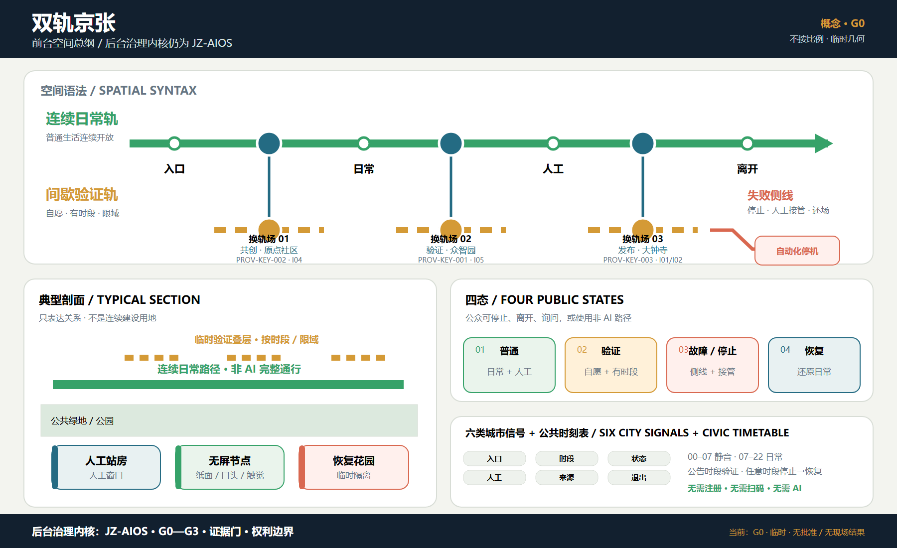

### 唯一核心机制

百年京张不是一条摆放 AI 产品的科技走廊，而是一条把城市问题转化为**可共创、可验证、可暂停、可复现、可向社会交付**的 AI 公共创新生产线。“AI 朝圣”不是对技术的崇拜，而是公众沿线完成“认知历史—提出问题—参与共测—看见失败—贡献留名”的知识旅程。英文名称中的 **Proof** 同时指空间实证、技术验证和公共价值证明。

总体结构从“一脊三锚六接口多点”升级为“一条验证线、三座状态站、两条供给翼、六个城市接口”。三座状态站不是三种同质园区：北京 AI 原点社区负责共创和公共评议，众智园负责技术、安全与治理验证，大钟寺负责公共发布、城市服务和成果转化；小月河场景赋能翼输入真实问题与体验反馈，中关村科技服务翼提供建议性的知识产权、合规、人才、资本和转化支撑。任何外部机构角色都是规划建议，不代表合作已经达成 [assumption:A-EXTERNAL-COLLAB-005] [depth:overall_spatial_structure]。

### 任务书定位与五大功能的可读映射

以下映射把任务书原词直接转成方案中的空间和运行机制，避免只在合规矩阵里形式勾选；它仍是供专业团队深化的概念响应，不产生法定功能、项目授权或机构承诺 [source:AGENT-TASKBOOK] [standard:PROJECT-AGENT-OPEN-CALL-TASKBOOK]。

| 任务书定位 / 功能 | 本方案的直接响应 | 不得越过的边界 |
|---|---|---|
| 百年京张文化带 | 铁路工程史—中关村创新史—AI 纠错史双螺旋，三处知识旅程地标 | 史实、文物、名称与载体待官方/馆藏和权利复核 |
| 都市 AI 生活体验带 | 六接口、九处日常优先公共节点、非 AI 等价与静音无屏模式 | 不把字段覆盖写成已开放服务或公众体验成绩 |
| AI 融合创新带 | “问题—共创—验证—发布/服务—转化—反馈”状态机和三区两翼 | 不虚构企业、伙伴、土地、资金或实施承诺 |
| AI 全栈自主创新体系 | 众智园承接离线、影子、限域申请、安全与独立复测门 | 不声称已有全栈平台、运营主体或获批测试场 |
| 世界级 AI 创新生态 | 原点社区共创接口、六个国际案例对照与两翼要素支持 | “世界级”是目标，不是排名、集聚度或合作事实 |
| AI+ 场景赋能新范式 | 12 个场景护照、三项先行测试协议和 G0—G3 不跨级门 | 当前全部 G0，批准、参与者、执行和结果均为 0 |
| 智能化 AI 活力城市 | 日常/学习/Beta/静音/离线五模式与人工服务并置 | 不以大屏、监控、活动热度或强制账户代表活力 |
| AI 治理全球话语权 | 来源可追溯、失败公开、暂停申诉、到期退役与复测包 | 只提出可讨论方法，不宣称形成国际规则或政府制度 |

空间接口按南北概念顺序定义为：I01 大钟寺传播接口、I02 城市服务接口、I03 小月河体验接口、I04 高校共创接口、I05 众智验证接口、I06 清河生态校准接口；对应 `geometry/public_space.geojson` 的 `PUBLIC-004`—`PUBLIC-009`。面向人类的空间叙事只使用 I01—I06；G0—G3 只表示场景成熟度。既有 GeoJSON 的 `GATE-01`—`GATE-06` 是保留的机器兼容标识，不是空间阶段或人类编号。六个接口均是待现场复核的审计/服务类型，不是已选址的新建地标；每类接口要求同时核对公共空间、横向慢行、海绵缝合、非 AI 通道、静音时段和场景接力，并优先复用已建入口与服务设施 [data:geometry/public_space.geojson#PUBLIC-004] [data:visual/assets/site-grounding-register.json#SG-003] [metric:gateway_count]。

Logo 方向采用两条不闭合轨线构成字母 **JZ**，中间的开放缺口形成“人工可介入的校验口”，六个短刻度对应六个空间接口。Logo 只使用几何线段和项目自有字标，不调用企业商标、人物肖像或受限字体。整体视觉为铁轨银、海淀蓝、开源绿、校验橙、钟声金；文化导视另用“里程—年份—来源”三行语法，避免把文化标识与整体 Logo 混为一套。

## 统筹研究范围产业与未来城市研究

### 三锚两翼产业状态机

产业不是按企业名单划地，而按任务状态配置空间和要素。小月河翼汇集居民、城市服务者和公共部门愿意公开的问题；原点社区把问题转为开源任务、用户旅程和对照基线；众智园在离线、影子和限域环境中完成模型、机器人、安全、伦理与互操作验证；大钟寺把通过的成果转成公众可理解的城市服务、企业服务和国际交流；中关村科技服务翼在每一环提供建议性的合规、知识产权、人才、算力和转化支持；投诉、事故、失败和公共价值结果回流下一年度。北京市公开资料提出以原点社区、北纬社区和百年京张开放城市治理与民生服务实景测试场景，为“验证带”而非普通展示带提供了现实接口，但本方案不把公开方向写成项目授权 [source:BEIJING-AI-ORIGIN-2026]。

八类要素采用“公共底座 + 有条件接入”：土地只提供可逆使用接口；空间提供共享实验室、公共客厅和限域测试面；产业由问题牵引而非供应商牵引；资金只提出多方评审和里程碑拨付机制，不编造额度；人才通过开发者、居民和专业人员共同测试；算力优先使用可审计的共享环境；数据遵循最小必要、源端保留和受控计算；场景必须持有护照并到期失效。国家数据基础设施指引对可信数据空间的共识规则、可信管控和可审计生命周期提供政策背景，但不等于本项目的数据系统已经获批 [source:NATIONAL-DATA-INFRA-2025]。

### 六个案例的“机制—本地动作—验证—禁区”

| 案例 | 可迁移机制 | 京张本地动作 | 建议验证 | 不可直接迁移 |
|---|---|---|---|---|
| Kendall Square | 科研、企业、住房和公共空间共同组织 | 原点社区的共创街与生活服务并置 | 跨机构共创和居民使用是否同时发生 | 土地制度、租金与企业密度 [source:CASE-KENDALL] |
| one-north | 分主题片区由共享设施和步行网络连接 | 三座状态站共用护照和复测包 | 跨站接力是否保留同一证据版本 | 开发制度和园区管理权 [source:CASE-ONE-NORTH] |
| Barcelona 22@ | 产业升级与街区更新、知识转移并行 | 六个空间接口优先修补日常公共界面 | 公共利益交付是否先于规模扩展 | 用地政策和财政工具 [source:CASE-22AT] |
| King’s Cross | 遗产再利用、无车公共空间与混合功能 | 铁路工程史与当代公共生活同线呈现 | 居民是否在非活动日持续使用 | 产权、保护等级和商业模型 [source:CASE-KINGS-CROSS] |
| STATION F | 实体空间依靠项目、导师和伙伴网络运营 | 四季运营协议与问题到 Proof 的漏斗 | 问题到限域原型的周期 | 单一大型园区和私人运营条件 [source:CASE-STATION-F] |
| MaRS | 实验室、办公、活动和社群服务耦合 | 大钟寺把发布、合规咨询和人工服务并置 | 人工转接和后续服务成功率 | 医疗、投资与机构体系 [source:CASE-MARS] |

区域协同采用“测试接力”而非泛泛结盟。建议由未来科学城承接基础科学或前沿装备复测、怀柔科学城承接科学设施相关验证、经开区承接制造和具身系统工程复测、其他首批创新街区承接其擅长的文化或产业场景，京津冀节点承接跨区域可复制性检查；每次接力只传递任务、协议、匿名结果和失败记录，不要求传递原始敏感数据。公开的“一核多点”格局只说明这种分工有讨论基础，不代表任何节点已同意参与 [source:BEIJING-AI-DISTRICTS-2026]。

## 总体设计范围城市更新与控规深度城市设计

总体范围以已开放公园的南北绿廊、已报告横向联系和全龄公共活动为公开基线，而非待本方案从零建设的对象 [source:HAIDIAN-JZ-PHASE2-OPEN-2026]。在此之上才组织“轨旁历史阅读层—既有慢行与蓝绿层—可逆创新服务层”三层剖面：铁路侧只建议低干预阅读，中部先保护日常步行、骑行和停留，街区侧以六类界面审计断点并叠加小尺度服务。任何跨铁路、跨河、跨城市道路、桥隧或地下空间动作都只是待核问题和设计方向，必须另行开展现场、交通、防洪、铁路安全和工程论证。

用地从 12 个大色块深化为 36 个不规则、拓扑闭合的概念单元，覆盖科研、教育、居住、社区服务、商业服务、文化、绿地、广场和弹性留白九类项目枚举。单元数量和类别可由 GeoJSON 复算 [metric:land_use_unit_count] [metric:land_use_category_count]；它们表达空间—产业功能包络，不是法定地块或已批用途 [data:geometry/land_use.geojson#LU-001] [depth:land_use_layout]。

六条横向接口线与南北主线形成“鱼骨式”可达网络：每个接口都将慢行、公共空间、雨洪缝合与一个可测试的城市问题绑定。九处公共空间不是把公园变成全天候试验场，而采用可逆时空规则：日常生活为默认，公共学习按预约，限域 Beta 仅在批准时段，22:00—07:00 进入静音，任何人始终可以选择非 AI 通道。设计的创新不在“城市适应 AI”，而在“AI 必须适应城市日常生活”。

建筑图层用体量原型表达优先干预容量，不模拟完整现状城市。每个原型标注保留评估、适应性改造候选或新建候选，但在测绘、权属、结构、文保和控规证据缺失时不得转成拆除或建设结论。容积率、总建筑面积、建筑高度、道路红线、停车和市政容量继续保持 `unknown` [assumption:A-SPATIAL-REPRESENTATION-002] [depth:development_intensity_controls] [depth:height_massing_character]。

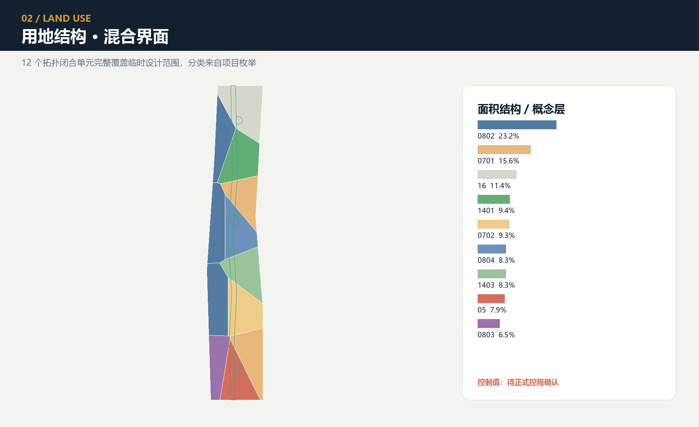

## 重点区域详细设计

三处重点区使用同一套回答框架：场地矛盾、空间结构、核心项目、AI 场景、进入门与验收，并按重点区详细设计深度组织表达 [depth:three_key_area_detailed_design]。下述范围仍为临时替代，三处面积和体量覆盖只用于概念复核 [data:geometry/key_areas.geojson#PROV-KEY-001] [data:geometry/key_areas.geojson#PROV-KEY-002] [data:geometry/key_areas.geojson#PROV-KEY-003]。

### 重点区证据交叉矩阵

为避免“重点区—场景—验收”只在长文中隐含，`visual/assets/key-area-evidence-matrix.json` 将三处临时范围逐条交叉到状态站、公共锚点、I/GATE 接口、AI 服务区、场景节点和概念级验收包，并单列 G1 前必须取得的正式资料 [data:visual/assets/key-area-evidence-matrix.json] [metric:key_area_evidence_matrix_record_count]。矩阵字段覆盖率为 100% 只表示三条记录的交叉字段齐全，不表示现场覆盖、合作确认、审批、运行成绩或公共价值结果；三条记录的现场审计、责任主体确认、批准、测试执行和已知结果均为 0 [metric:key_area_evidence_matrix_field_coverage_ratio]。

| 临时重点区 | 状态站 / 概念空间响应 | 交叉的 AI 区与场景 | G1 前置证据 | 当前边界 |
| --- | --- | --- | --- | --- |
| `PROV-KEY-001` 众智园 | VERIFY；一园、一栈、两界面 | `AI-ZONE-001`；`SCENE-001`—`004` | 法定/业主场地、安全与急停、责任角色、非 AI 基线、独立复测包 | 临时范围、未获批、未测试 |
| `PROV-KEY-002` 原点社区 | CO-CREATE；一街、两院、四节点 | `AI-ZONE-002`；`SCENE-005`—`008` | 场地与保障、权利与同意、非技术参与、撤回机制、独立复测包 | 临时范围、无合作承诺、未测试 |
| `PROV-KEY-003` 大钟寺 | PUBLISH；四象限步行 + 一厅一台 | `AI-ZONE-003`；`SCENE-009`—`012` | 路线/服务权属、人工窗口、来源维护、同任务对照、独立复测包 | 临时范围、无批准服务点、未测试 |

剖面不再把三处画成同一种园区模板：众智园以“公众观察边—低风险测试花园环—验证栈/维护边”分开公众日常与设备测试；原点社区以“连续日常街—问题共创院—公共评议院—四个可撤节点”保护居民通行和退出；大钟寺以“四向步行—钟轨会客厅—人工服务台—静音休憩”让发布活动服从通勤、无屏休憩和人工办事。每处都只使用普通—验证—故障—恢复一套权威运行四态，形成 3 组差异化剖面、共 12 个 G0 概念状态；当前验证态仅指预约、限域且不主张现场绩效的 G0 活动，未来任何获批限域共测仍是进入验证态前的成熟度门，不另算第五态。图与矩阵共同记录谁先让位、故障如何隔离、如何还场以及何时不得重启 [data:visual/assets/key-area-evidence-matrix.json] [metric:key_area_reversible_mode_count]。

这份矩阵只增加可复核的设计映射，不把接口标识变成已选址地标，也不把公开桌面资料变成现状测绘、控规、权属或机构承诺 [data:visual/assets/key-area-evidence-matrix.json]。

### 三种空间原型的共同读法

本轮将现有两组图明确分工：`key-areas` 先画每处的**普通状态平面**，再叠加首层公共界面、人工交接、可拆构件和四步使用旅程；`key-area-sections` 再把同一对象转成差异化关系剖面、普通—验证—故障—恢复四态和场所恢复验收。绿线是始终连续的非 AI / 无障碍意图线，蓝色虚线是可停止、可拆除的服务叠层，灰色虚线与原型体量只表示未知关系。图件不提供比例尺、准确落位、建筑现状或工程断面；其中无障碍连续性、净宽、坡度、转弯、触觉与休息条件都必须由测绘和共同测试补证 [assumption:A-KEY-AREA-SPATIAL-011]。

六个内聚工作包共同完成这次深化：众智园的平行验证庭与设备隔离；原点社区的一街两院四节点与无屏撤回；大钟寺的四象限步行与一厅一台；三处连续非 AI / 无障碍路径和人工交接；可拆构件与夜间静音；四态切换、场所恢复验收和结构化证据回链。它们共享证据语法但不共享平面骨架，且均只使用现有 `PROV-KEY-001`—`003`、`AI-ZONE-001`—`003` 和 `SCENE-001`—`012` [data:visual/assets/key-area-evidence-matrix.json#round2_spatial_deepening]。

三个原型共同继承 22:00—07:00 静音门：不得安排测试、扩声或活动优先权，普通路径、无屏信息与人工求助仍可用；这一时段是概念运行约束，确切场地开放条件仍待现场和运营主体确认。

### 众智园：验证站 / VERIFY

矛盾是自主技术需要真实问题和复合测试，但城市公共空间不能成为无边界试验场。结合海淀最新公开目标，众智园把 AI4S、AI 安全治理和规则互认作为建议验证主题，不据此宣称已有平台、伙伴或国际机制 [source:HAIDIAN-JZ-MIDTERM-2026]。空间采用“一园、一栈、两界面”：清河测试花园承载环境和低风险共测，可验证模型公共栈承载离线基准、安全与互操作检查，面向社区设置公众观察与申诉界面，后勤侧设置人工接管和设备维护。`AI-ZONE-001` 绑定低速配送、能耗、安全研判与失败档案四个节点 [data:geometry/constraints.geojson#AI-ZONE-001] [data:geometry/constraints.geojson#SCENE-001]。进入条件是来源、责任人、风险级、对照基线和实体急停齐全；任何碰撞、越界、未经授权数据处理或人工接管失效立即停止。验收不以“演示成功”计，而以复测包完整、失败可复现、人工接管可用和公共价值门通过计。

**图面读法 / 尚缺资料。** 平面与剖面/模式图中的淡色虚线仅表示 `PROV-KEY-001` 临时概念范围；公众观察路径与低风险测试花园环分开，维护/急停边承担设备退出。生态日常、预约离线验证、故障隔离、场所恢复验收四态仍是 G0 假设；未来获批限域共测只是验证态的前置成熟度门，不是当前能力或另一运行态。正式边界与场地条件、责任角色，以及铁路、消防、网络、数据和实体急停审查未补齐前，不得据图推断准确位置、尺度、批准、测试或结果 [data:visual/assets/key-area-evidence-matrix.json] [data:geometry/key_areas.geojson#PROV-KEY-001] [assumption:A-KEY-AREA-DETAIL-010]。

**场所旅程 / 首层交接。** 普通使用者先沿公众观察边完成通行与休憩；只有在读懂状态、时段和退出信号并自愿后，才从可见的人工交接点进入公告的离线验证。实体急停、越界、碰撞、设备噪声或人工接管失效时，验证庭立即隔离，普通路径保持开放。设备、围挡、线缆和临时标识撤除，路径表面、绿化、声光与人工说明完成恢复验收并闭合独立复测门后，才可讨论再次启用；当前恢复验收状态为 `unknown / 未执行`。实体隔离带、维护边和独立复测门属于众智园验证原型，不能机械复制到居民共创院或通勤发布场 [data:visual/assets/key-area-evidence-matrix.json#round2_spatial_deepening]。

### 北京 AI 原点社区：共创站 / CO-CREATE

矛盾是高密度创新资源与居民日常、低成本创业和公共参与之间缺少稳定接口。公开材料把原点社区描述为约 3 平方公里范围、具有“十分钟创新圈”背景的科技社区；其中规模数字只作背景，不作本项目资源盘点、选址或合作证明 [source:HAIDIAN-AI-TRIAL-FIELD-2026]。空间采用“一街、两院、四节点”，并把五分钟日常生活支持单元嵌入十分钟创新背景和更广域的十五分钟公共服务规划框架：开源发布街连接高校与社区，共创院落承载问题拆解和团队匹配，公共评议院落承载居民共测、未成年人教育和无屏讨论。`AI-ZONE-002` 绑定可信文化导览、开源匹配、教育工坊和气候无障碍共测 [data:geometry/constraints.geojson#AI-ZONE-002] [data:geometry/constraints.geojson#SCENE-005]。进入条件是问题来自明确公共需求、参与者可撤回、推荐不用于录用评价；验收关注跨角色共创、撤回响应、非技术参与和不同人群任务成功差距。

**图面读法 / 尚缺资料。** 平面与剖面/模式图把“一街、两院、四节点”读作连续日常街上的可撤回参与叠层；社区日常、问题门诊/共学、故障撤回、静音/保障恢复四态仍只是 G0 假设，未来获批共创共测只是验证态的前置成熟度门，不表示社区、学校或场地方已参与。准确场地和开放时段、保障与责任角色、内容权利、同意/撤回及非技术参与条件未确认前，不得据图推断伙伴承诺、获批共测或学习成效 [data:visual/assets/key-area-evidence-matrix.json] [data:geometry/key_areas.geojson#PROV-KEY-002] [assumption:A-KEY-AREA-DETAIL-010]。

**场所旅程 / 首层交接。** 居民无需账号、扫码或进入院落即可沿连续日常街通行和停留；无屏共学节点提供纸面说明与人工问询。选择参与者在进入问题院或评议院前取得可撤回同意，并可在任一节点退出；活动工具、座椅、遮棚和标识始终放在通行线之外。撤回、未成年人保障缺口、显著群体差距、扩声扰民或夜间静音失效时，采集与匹配立即停止，纸面与人工服务保留；恢复验收必须确认屏幕、扩声、采集和临时标识退出，两院与街道回到居民日常。双院协商关系、四个撤回节点和居民静音门只服务原点社区原型，不能改名后复制到另两处；当前安静时段兑现与恢复验收均为 `unknown / 未执行` [data:visual/assets/key-area-evidence-matrix.json#round2_spatial_deepening]。

### 大钟寺：发布站 / PUBLISH

矛盾是站城流量、企业服务和消费展示容易把 AI 变成屏幕化营销，并挤压人工服务与安静空间。这里先承认已开放南段的社区、通勤与全龄活动基线，不把既有连通改善重复包装为本方案成果 [source:HAIDIAN-JZ-PHASE2-OPEN-2026]。空间采用“四象限步行 + 一厅一台”：四象限只表达待现场复核的连接方向；钟轨会客厅呈现通过、失败和修正的证据；城市服务台并置智能导航与人工窗口；发布界面设置无屏默认区和静音时段。海淀“十五五”公开文本提出到 2030 年成为全球人工智能创新策源地和产业高地，并要求高质量推进城市更新；这里仅把它作为区级方向，不由此推断大钟寺任何具体地块已纳入更新、权利已确定或实施已承诺 [source:HAIDIAN-15FYP-2026]。`AI-ZONE-003` 绑定无障碍路径、慢行提示、企业服务和健康导航 [data:geometry/constraints.geojson#AI-ZONE-003] [data:geometry/constraints.geojson#SCENE-009]。验收关注来源命中、过期提示、人工转接、投诉闭环和相对既有服务的增量，而不是活动人流或曝光量。

**图面读法 / 尚缺资料。** 平面与剖面/模式图将“四向步行 + 一厅一台 + 静音休憩”、实体导视与人工窗口画成待核关系，而非准确路线或获批服务点；通勤与休憩、预约证据发布、故障下线、来源/服务恢复四态要求任何 AI 叠层都能暂停并切回普通使用。未来获批服务试用只是验证态的前置成熟度门，不是当前能力或第五态。准确路线、场所和服务权属、现状障碍与无障碍条件、来源维护和人工接管能力未确认前，不得据图推断部署、办事结果或现场绩效 [data:visual/assets/key-area-evidence-matrix.json] [data:geometry/key_areas.geojson#PROV-KEY-003] [assumption:A-KEY-AREA-DETAIL-010]。

**场所旅程 / 首层交接。** 通勤者先按实体导视沿四向路径通过，也可直接在人工服务台完成与智能服务相同的基本任务；证据发布是路径之外的自愿停留，不得形成排队或活动围挡。来源过期、答案冲突、人工转接失败或无障碍路径中断时，自动服务、屏幕、声音和灯光下线，人工窗口与普通路径继续。发布物料撤除、错误来源纠正、投诉交接和全量复测闭合后才可讨论恢复。四向通勤十字、来源台账与人工办事并置只属于发布原型；`PROV-KEY-003` 仍是按顺序和面积拟合的临时多边形，并不证明与大钟寺站、铁路边界、现状道路或任何建筑首层准确锚定 [data:visual/assets/key-area-evidence-matrix.json#round2_spatial_deepening]。

三个朝圣地标被重新定义为同一知识旅程的三个章节：众智园“开源火种塔”记录可复验贡献，不展示个人排名；原点社区“算法里程碑”把京张工程史、中关村创新史与 AI 纠错史并排；大钟寺“钟轨会客厅”设置失败与修正档案。贡献者可选择实名、化名或匿名，荣誉只记录可验证的公共贡献，不与财富、流量、招聘或行政评价绑定。名称和形象均需完成版权、商标、肖像、史料和无障碍审查 [assumption:A-CULTURE-CONTENT-006]。

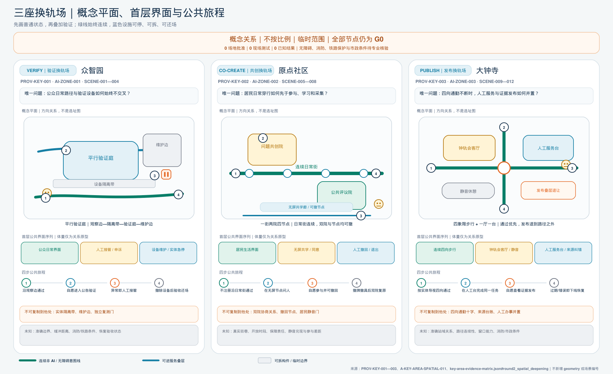

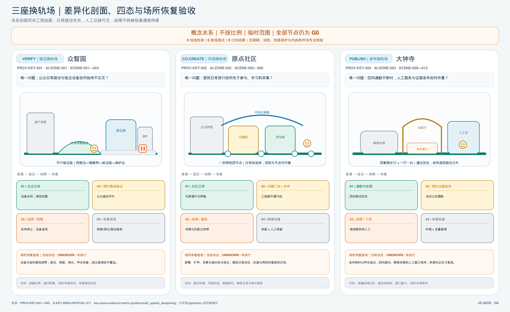

### 不能机械复制的组件与恢复门

#### 众智园 VERIFY

- **专属组件：** 平行验证庭、实体设备隔离带、维护/急停边、独立复测门。
- **普通基线：** 公众观察边、非 AI 通行与人工申诉必须保留。
- **恢复门：** 设备、围挡和线缆清零，表面、绿化与声光复核；当前状态 `unknown / 未执行`。

#### 原点社区 CO-CREATE

- **专属组件：** 一街两院的协商关系、四个撤回节点、无屏共学廊、居民静音门。
- **普通基线：** 居民穿行、无屏停留、纸面与人工退出必须保留。
- **恢复门：** 屏幕、扩声、采集与标识退出，同意撤回闭合；当前状态 `unknown / 未执行`。

#### 大钟寺 PUBLISH

- **专属组件：** 四向通勤十字、路径外证据会客厅、来源台账、人工办事并置。
- **普通基线：** 四向通过、静音休憩、实体导视与人工同任务服务必须保留。
- **恢复门：** 发布物料与声光退出，来源纠正、投诉交接和全量复测；当前状态 `unknown / 未执行`。

上述“恢复验收”是未来责任角色使用的概念检查表，不是场地批准、竣工验收或现状合格证明。三个原型共同要求可拆、可停、可绕行，但任何构件只有在准确场地、权属、消防、铁路保护、市政、无障碍和运营责任完成专业核验后才可落位 [assumption:A-KEY-AREA-SPATIAL-011] [data:visual/assets/key-area-evidence-matrix.json#round2_spatial_deepening]。

## AI 创新生态、人才画像与 AI+ 场景

### 七类共测画像

海淀最新公开要求聚焦顶尖科研人才、青年创新创业者和常住居民三类主要人群；本方案不另造一套画像，而将其映射到既有七类：顶尖科研人才主要对应开源开发者与高校师生，青年创新创业者对应创业团队并与企业服务团队相接，常住居民对应周边居民、老年人与行动不便者，同时保留游客与国际来访者作为传播和可读性校验者。三类政策人群是需求优先级，七类画像是共同测试与风险分解工具，两者都不代表已取得样本或完成调研 [source:HAIDIAN-JZ-MIDTERM-2026] [data:visual/assets/site-grounding-register.json#SG-006]。

| 画像 | 核心需要 | 可能受损 | 硬保护 |
|---|---|---|---|
| 开源开发者 | 算力、协议、复测和协作者 | 贡献被平台占有 | 可撤回、许可证清楚、贡献可携带 |
| 创业团队 | 低成本验证、合规和转化 | 被演示指标误导 | 失败公开、禁止暗示政府背书 |
| 企业服务团队 | 来源清楚的办事与市场信息 | 过期内容造成损失 | 来源时间、人工转接、责任边界 |
| 高校师生 | 学习、研究和成果转化 | 教育数据外泄 | 本地沙盒、教师复核、未成年人最小数据 |
| 周边居民 | 安静、可达、日常服务 | 噪声、拥挤、监控与排斥 | 日常优先、静音无屏、申诉与暂停权 |
| 老年人与行动不便者 | 连续无障碍和人工帮助 | 被数字门槛排除 | 非 AI 通道、共同测试、人工服务不撤销 |
| 游客与国际来访者 | 可信多语言文化内容 | 错误叙事和过度采集 | 来源标识、策展复核、无账户浏览 |

### 非 AI 优先公共城市：七项权利与同任务双路径

**核心原则。** 非 AI 不是 AI 故障后的备用按钮，而是连续日常轨上的第一类公共空间与服务基础设施。任何人应先能看见实体权利图例，沿连续非 AI / 无障碍意图线，以纸面、口头、实体导视或人工服务完成基本任务，再自愿选择有边界的 AI 帮助。两条路径不必使用相同界面，但必须抵达同一基本结果、资格、费用规则、责任队列、申诉纠正和停止恢复路径。这里的“永久”是未来任何服务窗口都不得删除的设计权利，不表示三处现在已有固定窗口、值班人员或获批服务 [data:visual/assets/non-ai-parity-contract.json] [assumption:A-NON-AI-FIRST-013]。

| 七项永久公共权利 | 空间与服务要求 | 不能接受的反例 |
|---|---|---|
| 1. 无需账户或扫码 | 进入、导引、基本任务、投诉和离开均不依赖账户、二维码、智能手机或个人设备 | “可进入”但办事、取号或申诉必须扫码 |
| 2. 完整非 AI 路径 | 纸面、口头、实体导视或人工渠道真正抵达同一基本结果 | 只放一张“可咨询人工”的牌，却没有可完成任务的交接链 |
| 3. 连续无障碍意图 | 普通路径和服务序列在图面上连续，活动、排队、线缆与设备不得侵占；现场合规仍待勘测、共测和专业复核 | 把一段绿色线当成现状无障碍合格证明 |
| 4. 人工服务与交接 | 未来服务开放时，可见或可呼叫的人工路径负责受理、解释、安全拒绝或转交同一任务 | 用志愿者或临时活动人员冒充稳定责任主体 |
| 5. 同意可撤回 | 通行和基本服务不以参加共测或数据处理为条件；可口头、纸面或通过人工撤回 | 只能回到数字界面撤回 |
| 6. 申诉与纠正 | 投诉、补充证据、纠正、暂停、查询和复核不分渠道进入同一责任队列 | 非 AI 请求降级排队或没有可保留的状态凭据 |
| 7. 无屏与安静 | 保留无屏等候、实体信息和安静休息；声光、排队与活动让位于普通通行和静音基线 | 以持续大屏、播报或活动热度替代公共服务 |

**双入口服务蓝图。** 共用入口先给出七项权利和六类城市信号。主路径是“纸面/口头提出任务 → 无屏等候与实体状态 → 双入口人工台 → 完成同一基本任务 → 纸面/口头投诉、撤回或纠正 → 不依赖技术离开”；可选 AI 路径只能在易懂披露与单独自愿同意后进入，并在同一人工台和同一责任队列汇合。任何硬性失败都停止自动化叠层，保留普通通行与非 AI 任务，或给出安全拒绝和人工转交；临时声光、屏幕、排队、采集与设备退出，独立复测和场所恢复未闭合前不得讨论重启 [data:visual/assets/non-ai-parity-contract.json#service_blueprint]。

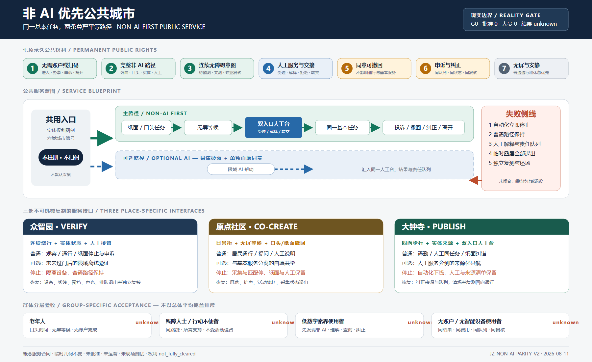

| 三处换轨场 | 连续普通路径与非 AI 入口 | 可选 AI 叠层 | 停止与恢复 |
|---|---|---|---|
| 众智园 VERIFY | 连续绕行与观察、实体状态牌、人工接管点、纸面停止或申诉 | 只在未来过门后出现的限域离线验证 | 越界、碰撞、绕行失效、扰民或接管失败即隔离设备；普通路径保持；设备、线缆、围挡、声光与排队退出后独立复核路径和场所 |
| 原点社区 CO-CREATE | 连续日常街、无屏等候、纸面或口头问题、人工说明与撤回 | 与通行和基本服务分离的自愿共学 | 撤回失效、保障缺口、显著群体差距、扩声扰民或静音失败即停止采集与匹配；纸面和人工服务保留，撤除数字与活动叠层并恢复居民日常 |
| 大钟寺 PUBLISH | 四向连续步行、实体来源状态、双入口人工台、纸面纠错或申诉 | 只在人工服务旁侧出现的来源化导航 | 来源过期/冲突、诊断性输出、转交失败、通勤受阻或申诉不等价即下线；保留人工与来源清单，纠正队列、清退活动物料并复测四向通行 |

**按群体分别验收，不用总体平均掩盖排斥。** 老年人需要完成“找到权利—口头询问—无屏等候—完成任务—纠正/撤回—无账户离开”；残障人士与行动不便者需要在所需沟通或移动支持下完成同一路线和服务序列，且不受活动侵占；低数字素养使用者需要在无人提示前发现非 AI 选择、理解下一步、完成任务并能查询和纠正；无账户或无智能设备使用者需要获得可持久保存的状态凭据，进入同一队列并拥有同等费用与复核权。每组分别记录完成/放弃、路线或沟通断点、非预期人工交接、等待与补件负担、权利理解、投诉/撤回/纠正结果；样本分母、阈值与结果均须在取得同意与现场基线后预注册，当前统一为 `unknown / not measured` [data:visual/assets/non-ai-parity-contract.json#group_acceptance]。

**现实成熟度自检。** 结构化合同现含 7 项权利、3 处场所服务合同、4 类群体验收和 6 条同任务旅程；这些是文件覆盖，不是现场表现。已确认运营主体 0、已确认服务人员 0、现实服务交互 0、已知群体结果 0、现实批准与运营 0；T-02 的 10 条合成决策回放只证明 G0 合同逻辑，不证明非 AI 路径可用。具体服务点、时段、人工容量、无障碍合规、群体样本、阈值、投诉与恢复表现均未知。全部场景保持 G0；临时边界、场景编号和权利状态不变 [metric:non_ai_permanent_public_right_count] [metric:non_ai_observed_real_service_interaction_count] [data:visual/assets/key-area-evidence-matrix.json#non_ai_first_public_city_contract]。

### 四门制与场景护照

JZ-AIOS 规定任何场景依次经过 G0 概念/离线、G1 影子比对、G2 限时限域 Beta、G3 经批准的公共运行；不得跨级。当前提交中的全部节点均为 **G0 概念状态**，没有任何场景正在运行或已获批准。每张护照必须包括版本、责任角色、风险级、数据最小集、地理与时段边界、可能受损人群、人工接管、申诉、非 AI 选项、进入条件、停止条件、复测包和到期日期 [assumption:A-SCENARIO-PROTOCOL-004]。

12 个场景在面向人类的叙事中分为三组：安全与可达（`SCENE-001`、`003`、`009`、`010`），可信公共服务（`SCENE-002`、`005`、`011`、`012`），以及公共学习与协作（`SCENE-004`、`006`、`007`、`008`）。机器记录仍保留全部 `SCENE-001`—`012` 护照及其字段，分组不代表部署、优先级或测试结果。十个服务场景卡如下；空间 Feature 只是概念落位，不代表部署：

| ID / 节点 | 场景与空间 | 最小输入 → 输出 | 责任与人工兜底 | 进入 / 停止 / 退役 |
|---|---|---|---|---|
| SC-01 / `SCENE-005` | 京张可信文化导览；原点—里程标路径 | 清权史料、主动语言选择 → 带来源内容 | 人工策展人；无账户纸质/音频替代 | 来源与 AI 标识完整；争议无法核实即下架；年度复审 |
| SC-02 / `SCENE-009` | 无障碍路径助手；大钟寺与 I01—I06 | 坡度、临时障碍、设施状态 → 建议路径 | 现场服务人员确认；实体导视保留 | 路测和共测通过；出现关键障碍即停推该路线；数据变化即失效 |
| SC-03 / `SCENE-010` | 慢行拥堵提示；公共绿道 | 分段匿名流量 → 绕行建议 | 管理人员发布，不自动管制 | 不使用人脸；误报影响通行即回退静态导视；活动结束失效 |
| SC-04 / `SCENE-001` | 低速配送沙盒；众智园授权面 | 车辆状态、围栏、障碍 → 低速任务 | 现场安全员、实体急停、人工牵引 | 离线和封闭场通过后才可申请 G2；碰撞/越界一次即停止；每次测试后退役配置 |
| SC-05 / `SCENE-011` | 企业服务智能体；大钟寺服务台 | 公开政策与用户主动问题 → 来源化导航 | 工作人员受理正式事项 | 来源与更新时间完整；错误影响办事即停；政策更新触发失效 |
| SC-06 / `SCENE-006` | 开源协作匹配；原点共创院 | 自愿公开技能与议题 → 团队建议 | 社区运营者处理撤回；不进入招聘评价 | 可撤回与许可证确认；歧视性匹配即停；项目结束清理 |
| SC-07 / `SCENE-002` | 公共空间能耗助手；众智园与 I01—I06 | 设备和环境数据 → 照明建议 | 运维人员保留优先权；人工开关可用 | 不采身份；影响安全照明即回退；季节参数到期重测 |
| SC-08 / `SCENE-012` | 社区健康导航；大钟寺人工服务旁 | 公开机构和主动咨询 → 科普与预约入口 | 不诊断；紧急情况转专业机构 | 边界提示清楚；出现诊断性输出即停；机构信息变化即失效 |
| SC-09 / `SCENE-007` | 教育体验工坊；原点社区 | 本地教学数据 → 偏差与编程练习 | 教师全程复核；未成年人数据不外传 | 家长/学校规则与本地沙盒齐全；数据外发即停；课程结束销毁临时数据 |
| SC-10 / `SCENE-003` | 安全事件辅助研判；众智园控制室 | 设备告警和人工报告 → 待核事件摘要 | 授权人员决定；不得自动执法 | 权限、日志、对照基线齐全；越权或误导处置即停；模型变更重审 |

另设两个公共治理节点：`SCENE-004`“失败与修正公开档案”记录暂停、纠错和主动退役；`SCENE-008`“气候与无障碍共同测试”让老年人、儿童和行动不便者在早期成为共同测试者，而非完工后的被动验收对象。节点和服务区数量可由机器数据核验 [metric:mapped_scenario_node_count] [metric:ai_service_zone_count]。护照与人工兜底的字段覆盖另行计数，不能被解释为现场效果 [metric:scenario_passport_coverage_ratio] [metric:manual_fallback_coverage_ratio]。

### 三项先行产业测试协议

- T-01 机器人安全毕业协议：G0 数字与封闭场基线 → G1 影子任务 → 申请 G2。建议硬门为实体急停在受控测试中全部成功、零碰撞、零越界、人工接管链完整；任何一次安全红线触发停止、复盘和重新从低门开始。数值是设计验收建议，不是已测结果。
- T-02 来源化企业服务协议：作为首个**离线可复现证据包**，它固定问题集、来源闭包、更新时间、拒答、停止恢复、人工转接和独立复测占位，以便他人按同一材料复核。零依赖 Node.js 22.x 回放器已对 10 个无个人信息的合成样例完成 1 次治理决策回放：10/10 与预期精确匹配，4/4 个不同的已声明停止事件均精确映射到各自恢复动作，13/13 负向变异控制对样例与冻结合同未知字段、枚举及回答模式漂移、完整来源闭包、禁采数据优先级、canonical RACI 闭包、现实服务授权和摘要计数篡改均按预期 fail-closed。该结果只证明 G0 合同的确定性与拒答优先级，不生成实质回答，也不调用模型、API 或现实服务；回答输出、模型调用、API 调用、现实服务交互、现场测试、已批准触发项、已确认责任主体、现实独立复测和 G1 结果均保持 0 或 unknown [data:visual/assets/g0-offline-enterprise-service-baseline.json] [data:visual/assets/t02-g0-g1-replay-result.json] [metric:completed_g0_offline_replay_count]。只有来源覆盖、过期提示、人工接管、审批、责任主体与独立现实复测均达到预先公布阈值后，才可申请进入限域服务；错误影响正式办事即暂停。
- T-03 全民可达路径协议：作为空间与公共利益的**示例性测试**，由轮椅使用者、视障者、老年人、儿童照护者和普通步行者共同完成同一任务。任何关键断点未提供非 AI 替代路径即不毕业；它同样没有获批或现场结果，运行后才可继续比较群体间任务成功差距并公开改进。

毕业采用“技术成熟度 × 公共价值成熟度 × 治理成熟度”三维立方体，任一维不合格都只能修正或退役。国家“人工智能+”文件强调开放共享、安全可控和全民共享成果，本方案把这些方向转成公共价值门，但不替代具体法律、审批与专业责任 [source:AI-PLUS-2025] [depth:municipal_new_infrastructure]。

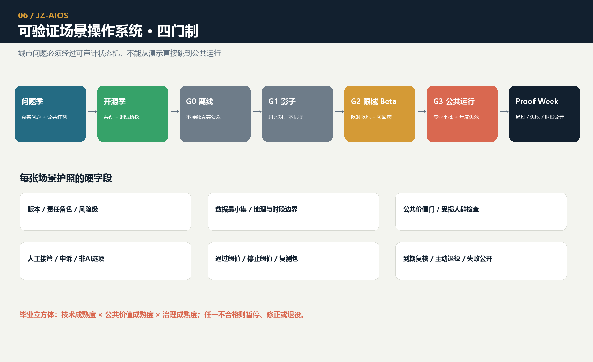

## 用地、建筑规模与拆改留方案

用地分类使用项目允许的 0701、0702、0802、0803、0804、05、1401、1403 和 16，36 个单元完整覆盖临时总体范围，不用调色图冒充法定用地。1403 表示适宜承担公共活动的功能包络；`PUBLIC_SPACE` 只记录九处已经直接设计的公共节点，因此两者面积不会相等，待正式地块与公共空间资料到位后再统一口径 [standard:MNR-LAND-USE-CLASSIFICATION-GUIDE] [assumption:A-PUBLIC-SPACE-SCOPE-003]。

建筑层由概念体量原型组成，数量、基底面积和总体表示比例可复算 [metric:building_count] [metric:building_footprint_area_sqm] [metric:building_representation_ratio]。重点区内原型数量和基底覆盖用于判断图纸是否真正深化三处状态站，不代表现状密度或法定建筑密度 [metric:key_area_building_count] [metric:key_area_building_footprint_ratio]。原型分为三类：`retain_for_assessment` 表示进入历史、结构和使用价值调查；`adaptive_reuse_candidate` 表示优先比较适应性改造；`new_build_candidate` 表示只在控规、权属、消防、日照、交通和市政均确认后才可能深化。当前没有“拆除”分类，因为没有足够证据作出该判断 [data:geometry/buildings.geojson#BLDG-001] [depth:retain_renovate_demolish]。

建筑形态原则服务于公共界面而非追求科技造型：轨旁降低首层压迫并增加通透界面；研发组团围绕共享庭院；原点社区优先小尺度、混合使用与生活服务；大钟寺确保人工服务、后勤和公众界面分开；历史和居住界面避免突兀体量。建筑高度、容积率、总建面、层数和建设规模均保持未知，A3/A0 中的体量只用于空间关系解释，不可用于投资估算或审批。

## 交通、轨道、市政与公共服务设施

交通证据分两层。现状道路、铁路和水系来自 OpenStreetMap，只用于方向识别并保留 ODbL 署名，不能建立道路红线、铁路保护区或水系蓝线 [source:OSM-CONTEXT] [assumption:A-OSM-001]。设计中心线是概念慢行、横向缝合、接驳和服务翼建议，可复算路线数量与长度 [metric:design_road_count] [metric:design_road_length_m]。路线图层和专业表达深度分别提供机器证据与人工复核入口 [data:geometry/roads.geojson#ROAD-001] [depth:traffic_rail_slow_parking]。

六个空间接口采用同一协议：先记录现状断点与绕行，再提出步行和无障碍最低连续线，再叠加骑行与公交接驳，最后才讨论跨路、跨河或轨道工程。每个接口必须配置日常非 AI 通道、清晰人工联系人、静音与无测试时段；机器人和测试车辆不得占用通勤、夜间安静或高峰公共通行。概念图上的道路宽度、转弯、桥梁、地下连接和站点接驳不能替代勘察与专项设计。

市政与新基建采用“边缘、最小、可替换、可降级”。三处服务区只记录功能，不声明设备容量：L0 正常状态提供经批准的数字服务，L1 降级状态关闭个性化与自动控制，L2 离线状态保留实体导视、人工服务、照明与急停。可信数据空间只交换任务、权限、匿名结果和审计证据，敏感原始数据尽可能留在源端；任何算力、能源、网络、消防、防洪和管线容量必须在正式工程资料取得后确认。

公共服务采用“外层十五分钟规划框架 + 内层五分钟支持单元”的嵌套逻辑：十五分钟层建议连接人才咨询、托育、健康、法律、会议、无障碍和社区活动；五分钟层规定共创或测试期间必须可步行到达人工求助、休息、卫生间、基础补给和无屏信息。五分钟要求来自海淀公开目标，但没有真实人口、设施容量、步行网络和服务半径数据时不声称“已经覆盖” [source:HAIDIAN-JZ-MIDTERM-2026]。所有智能服务必须与人工窗口、电话、纸质或实体导视并存；非 AI 通道覆盖由公共空间属性复算 [metric:non_ai_access_coverage_ratio]。

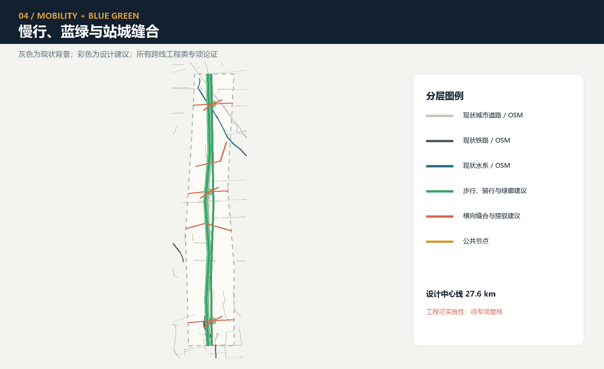

## 蓝绿空间、公共空间与城市风貌

蓝绿系统不再声称从零建设主绿脊。公开报道的约 9 公里绿色廊道、南北分段、鱼骨慢行和海绵设施作为待现场核验的既有基线；本方案的增量仅是六类横向界面的连续性审计、三处状态站的低风险学习接口，以及在不损害日常游憩前提下的可逆组件 [source:HAIDIAN-JZ-PHASE2-OPEN-2026] [data:visual/assets/site-grounding-register.json#SG-004]。绿地面积与数量仍由提交包设计几何复算 [metric:green_space_area_sqm] [metric:green_space_count]，不能用来声称竣工现状；比例使用临时边界作分母，置信度必须继承为低 [metric:green_ratio] [depth:blue_green_public_space]。

九处公共空间由三个朝圣地标客厅和六个空间接口组成，形成线—面—点网络。每处默认日常生活模式，只有在公示、授权、限时和可回滚条件齐全时才进入公共学习或限域 Beta；22:00—07:00 静音，默认设置无屏区，禁止把“高亮大屏、持续播报和密集摄像头”当成科技感。公共节点数量与面积可复算 [metric:public_space_node_count] [metric:public_space_area_sqm]。比例仍是低置信概念值，无屏默认与空间图层分别保留独立核验入口 [metric:public_space_ratio] [metric:screen_free_public_node_ratio] [data:geometry/public_space.geojson#PUBLIC-001]。

公共空间组件库包含六类可替换组件：双语/触觉里程标、离线地图与人工呼叫点、可关闭低位导光、移动共测桌、雨水花园与遮阴座椅、带实体急停的限域测试边界。每一组件都必须做到不依赖账户也能使用、失电后保留基本功能、维护责任可识别；桥隧、设备基础和管线条件另行论证。

文化采用“可信叙事双螺旋”。物理线讲铁路工程—城市生长—中关村创新，学习线讲提出问题—模型失败—人工修正—公共验证。北京市公开资料表明京张铁路遗址公园一期通过铁路遗存、绿色公共空间与功能织补连接高校、科研和居民生活；既有项目的公众参与与责任规划师机制也说明文化空间需要持续专业把关 [source:JZ-PARK-2023] [source:JZ-COCREATION-2021]。V2 不复制既有景观，而把“来源、纠错和失败”变成新的文化内容。

所有 AI 生成文字、图像、音频、视频或虚拟场景都同时设置公众可感知的显式标识和适用时的文件元数据标识；争议内容进入人工策展复核，无法核实则下架。该规则与 2025 年生成合成内容标识制度方向一致，但正式运营仍须法律审查 [source:AI-CONTENT-LABEL-2025]。国际传播语为 **“Build in public. Test with people. Keep the evidence.”**，强调公开建构、共同测试与证据留存，而不是宣称全球领先或已经落地。

## 更新项目清单、实施政策与分期计划

本节把阶段、试点、参与主体和可衡量指标放在同一实施框架中：每个项目先写前置条件，再写责任组合和验收指标；任何阶段都必须根据监测、居民反馈和专业评估决定继续、修正或退出。

### 维护型城市：从日常问题到普通基线 / Maintenance urbanism: from everyday issue to ordinary baseline

本轮不新增场景、项目或空间对象，而把既有 12 个 `SCENE-001`—`012` 与八个 `JZ-01`—`08` 放入五类**维护任务族**：无障碍修复（`accessibility_repair`）、气候舒适维护（`climate_comfort_upkeep`）、公共服务连续性（`public_service_continuity`）、遗产真实性纠错（`heritage_authenticity_correction`）与小微企业服务支持（`small_business_service_support`）。这些是面向用户目标的维护分类，不是新场景、项目编号或已承诺服务 [data:visual/assets/key-area-evidence-matrix.json#maintenance_urbanism_contract]。

| 维护任务族 | 既有场景 → 既有项目 | 维护焦点 |
|---|---|---|
| 无障碍修复 | `SCENE-009` → `JZ-01`/`JZ-05`；`SCENE-010` → `JZ-01`/`JZ-02` | 日常问题、无障碍共同测试、断点修复与非 AI 路径 |
| 气候舒适维护 | `SCENE-002` → `JZ-02`/`JZ-03`；`SCENE-008` → `JZ-01`/`JZ-02` | 舒适、能耗与环境条件的维护，不把传感或设备当效果 |
| 公共服务连续性 | `SCENE-003` → `JZ-03`/`JZ-07`；`SCENE-004` → `JZ-07`/`JZ-08`；`SCENE-007` → `JZ-04`；`SCENE-012` → `JZ-05` | 失败公开、人工交接、服务恢复与独立复核 |
| 遗产真实性纠错 | `SCENE-005` → `JZ-04`/`JZ-06` | 来源、叙事和更正记录的策展复核 |
| 小微企业服务支持 | `SCENE-001` → `JZ-03`；`SCENE-006` → `JZ-04`；`SCENE-011` → `JZ-05` | 问题门诊、人工服务和小微经营者可理解的支持 |

闭环从“问题进入”开始，但不得把它写成已收集的现实投诉：每一条仅是 `pending` 的问题记录壳，随后依次为工单壳、责任接受、计划/实际人工工时、既有设施检查、清洁/调整、修复、可维修组件替换、独立复核，以及继续/纠正/停止。采购只能在既有设施已检查、清洁或调整、修复和组件替换均不足后才被讨论；全寿命成本、可维修性、部件可得性、退役和恢复普通基线字段必须保留，但预算、采购、人员、工时、修复与效果均不被虚构 [metric:maintenance_real_complaint_count] [metric:maintenance_actual_human_hours]。

维护旅程必须让维修人员、保洁人员、有人值守服务人员、策展人员和无障碍共同测试者可见：他们可接收、拒绝或转交问题；责任未接受时不生成现实工单；独立复核失败、重复失败、无安全人工路径或无法恢复日常时进入停止，撤除临时层并回到普通基线。季度维护地图只是一张待填模板，用来按任务族、既有场景/项目、失败类型和退役决定复盘，不能显示现实投诉、预算或绩效。`maintenance_urbanism_contract` 以机器可审计形式保存上述字段、12 场景→既有项目映射与现实零/未知计数 [data:visual/assets/key-area-evidence-matrix.json#maintenance_urbanism_contract] [assumption:A-MAINTENANCE-URBANISM-012]。

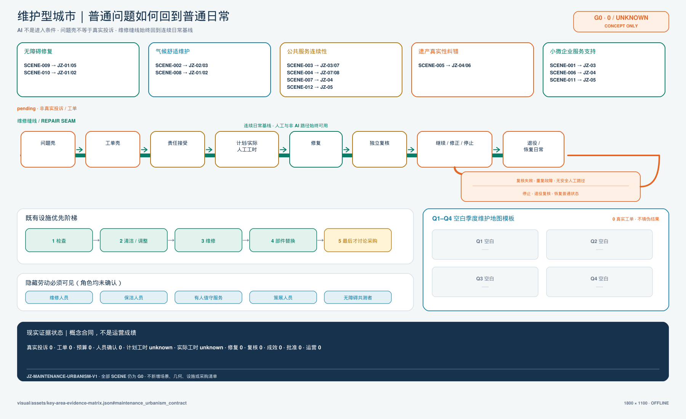

### AI 城市代谢：十二场景、七类资源、完整退出 / AI urban metabolism: twelve scenes, seven resources, complete exit

本轮仍不新增场景、项目、几何或成熟度，而为既有 `SCENE-001`—`012` 建立十二本 G0 资源护照。每本护照同时登记算力、能源、设备与材料、数据、人工复核、供应商依赖、失败与退出成本七类资源，并把核算边界从服务器扩展到边缘与网络、公众或个人终端、传感/显示/固定件、人工与非 AI 基线，以及场所无障碍、安静和恢复。**七类字段齐全只表示设计覆盖，不表示节能、减碳、低成本、已采购或已运行** [data:visual/assets/urban-metabolism-ledger.json#resource_dimensions] [metric:urban_metabolism_scene_resource_passport_count]。

| 重点区 | 四个既有场景 | 必须看见的代谢负担 | 退出先问什么 |
|---|---|---|---|
| 众智园 | `SCENE-001`—`004` | 移动设备与电池、边缘/网络、事故资料、人工接管、长期档案 | 设备怎样隔离、返修或回收；最小事故记录如何保留；连续绕行怎样恢复 |
| 原点社区 | `SCENE-005`—`008` | 媒体与来源权利、共享设备、同意与撤回、保障/策展/共测人工、静音清场 | 资料怎样撤回删除；活动构件怎样清走；两院一街怎样先回到居民日常 |
| 大钟寺 | `SCENE-009`—`012` | 路线与权威来源更新、传感/终端、敏感推断禁区、人工窗口、四向通勤 | 自动层怎样下线；资料怎样导出纠正；人工同任务服务和四向步行怎样保持 |

任何强度或“更绿色”比较都必须先固定一个公众可理解的任务分母、普通非 AI 对照、纳入的完整系统组件、时间窗、完成/放弃口径及必要的群体拆分。当前有效项目分母为 0；能源、算力、人工分钟和设备寿命均为 `not_measured`，供应商、设备生命周期与责任接受为 `external_confirmation_required`，数据和权利为 `not_fully_cleared`。行业均值、设备铭牌、供应商材料、模拟值和传感器安装数量不得代替项目测量 [data:visual/assets/urban-metabolism-ledger.json#denominator_contract] [metric:urban_metabolism_measured_energy_scene_count] [metric:urban_metabolism_confirmed_vendor_scene_count] [assumption:A-URBAN-METABOLISM-014]。

退出不是“关机”两个字，而是逐项决定：既有设施保留，现场维修/复用，异地再部署，供应商回收，合规回收处置，数据导出—删除—最小日志关闭，以及拆除线缆、固定件、标识、排队和临时设备后恢复普通场所与同任务人工/非 AI 服务。分母、来源、责任、供应商导出维修条款、组件去向、普通路径和独立复核任一未关闭即维持 `NO-GO / G0`；未来即使测试 `PASS`，也不等于部署授权、场地批准、采购批准、清权或环境收益 [data:visual/assets/urban-metabolism-ledger.json#public_decision_gate]。

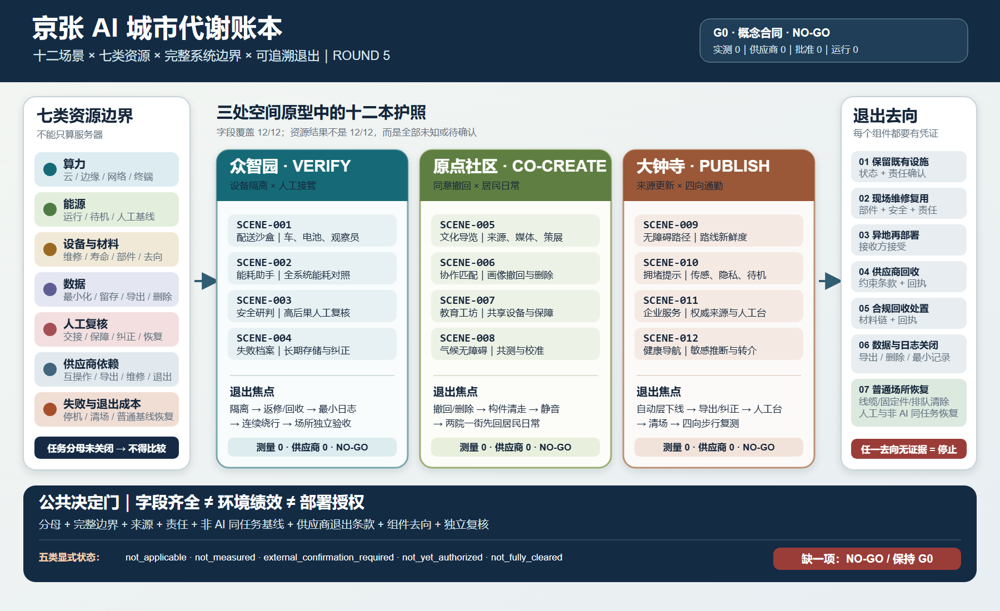

### 反脆弱失败治理：停止要能回写，恢复不能冒充授权

现有方案已经有失败侧线、普通—验证—故障—恢复四态、公共时刻表、场景护照和 T-02 合成回放；本轮不重复画另一条侧线，也不另造治理品牌，而是在既有 JZ-AIOS 内补上最关键的闭环：同一次暂停、复核、恢复、撤回或退役，必须同时准备**场景护照—公共时刻表—证据矩阵**三份原子回写。任一载体缺失、版本不一致或状态相互矛盾时，公众界面显示更保守的组合，普通/非 AI 路径优先，禁止重启；运行态、成熟度、授权态和服务态始终分开，恢复普通使用不会自动把 G0 升级，也不会产生部署授权 [data:visual/assets/failure-governance-register.json#three_carrier_writeback_contract] [data:visual/assets/key-area-evidence-matrix.json#antifragile_failure_governance_contract] [assumption:A-ANTIFRAGILE-GOVERNANCE-015]。

失败先按六类进入同一语法：安全与无障碍、权利/同意与禁采、来源/版本与可复现、服务与人工交接、证据与决策、场所恢复与退出。前两类立即硬停；来源和版本冻结输出并保留旧证据；人工路径缺失时停止自动化、保留同任务人工/非 AI 服务或给出安全拒绝；分母、证据或申诉未进入决策时暂停 go/no-go；构件、数据、服务或场所没有可负责的去向时维持停止或主动退役。公共记录只公开受影响任务、失败类、当前状态、纠正、证据版本、普通绕行和角色类型，不公开申诉人身份、敏感叙述或原始个人数据，也不做失败羞辱榜 [metric:failure_governance_failure_class_count] [metric:failure_governance_real_failure_event_count]。

| 载体 | 暂停时必须写什么 | 恢复或退役时必须写什么 | 缺失时的公众状态 |
|---|---|---|---|
| 场景护照 | 四轴状态、失败类、停止权限角色、前一版本、证据/申诉引用 | 新版本、独立复测、到期/撤回/退役、未解决责任 | `failure_stop / G0 / not_authorized` |
| 公共时刻表 | 公众运行态、普通/非 AI 路径、人工联系、开始时间、下次更新 | 普通使用恢复、可用服务、来源版本、绕行/退出 | 自动化不可用；普通路径或安全拒绝先行 |
| 证据矩阵 | 哪一条主张被暂停或缩小、证据锚点、范围与限制 | 追加纠正、保留旧证据、复测结果、go/no-go 及“不授权什么” | 主张保持暂停，禁止用旧 PASS 重启 |

可读使用旅程以 T-02 的 `STOP-STALE-SOURCE` 为合成示例：① 合成请求命中过期来源，不生成实质回答；② 冻结输出，保留纸面来源页与人工路径；③ 交给“来源包保管角色”，但角色目前仍待确认；④ 为同一事件准备三载体回写；⑤ 追加纠正版本并保留旧版本；⑥ 由独立复测角色按锁定条件完整重放，现实复测完成数仍为 0；⑦ 证据未闭合则继续停止或退役，闭合也只恢复普通使用。T-02 仍是 deterministic、无个人信息、无模型/API/现实服务调用、fail-closed 的合成治理回放，不是现实事故、服务成绩或现场恢复 [data:visual/assets/t02-g0-g1-replay-result.json#STOP-STALE-SOURCE] [metric:failure_governance_completed_real_independent_retest_count]。

公众可口头、纸面或经未来真实存在的人工窗口提出停止或申诉，无需账户、扫码或 AI；决策回执必须说明暂停、缩小范围、更正、复测、撤回、退役或“有理由不改变”中的一种影响。新证据采用追加式版本：新记录通过 `supersedes / superseded_by` 链接旧记录，旧证据仍可寻址，不能被版本更新覆盖。重复硬失败、没有责任明确的停止权限、普通/非 AI 路径无法恢复、权利事件无法闭合、独立复测不能复现主张或退出没有去向时，主动退役成为合法的 NO-GO 结果；退役回执逐项关闭服务与授权、组件去向、数据/日志、同任务服务、场所恢复、未解决责任和独立验收 [metric:failure_governance_appeal_decision_change_count] [metric:failure_governance_completed_real_retirement_count]。

**常驻授权边界：文件检查、合成回放、机器 PASS、独立复测或恢复验收，只对明确对象、判断主体、证据、有效范围和限制成立；均不授权试用、采购、建设、部署、成熟度升级、场地批准、专业批准、权利清除或现实成效主张。** 当前现实失败事件、确认停止权限、公开纠正、现实独立复测、主动退役和批准重启均为 0；停止到人工交接时间、普通使用恢复时间为 unknown，而不是空白或虚构数字 [metric:failure_governance_confirmed_stop_authority_count] [metric:failure_governance_stop_to_staffed_handoff_time] [metric:failure_governance_ordinary_use_recovery_time]。

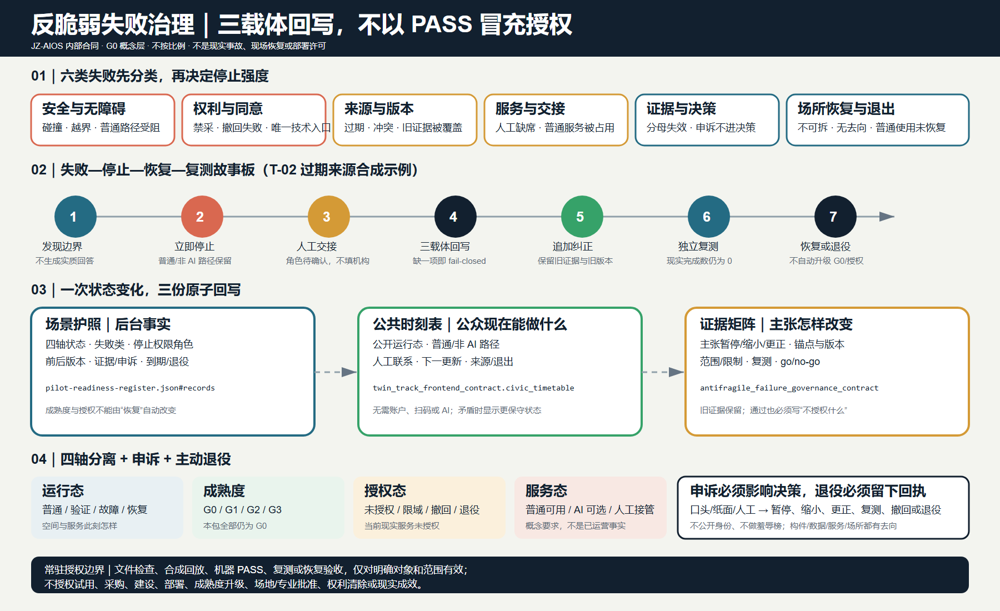

### 气候韧性验证走廊：普通蓝绿基线先成立，提示增量必须可退出

本轮不另建气候治理品牌，也不重做维护工单、资源账本、失败侧线或权利系统；它把这些既有后台约束应用到一条可读的气候空间关系：**连续普通蓝绿路径—遮阴与可达休息意图—静态非 AI 提示—人工巡检交接—雨洪/生态维护净空**先构成完整日常基线；只有在未来获批、限域、有责任人的条件下，AI 辅助提示与小月河气候观察翼概念边才作为间歇、可拒绝、可停止、可拆除的叠层出现。图中观察翼是关系原型，不是河岸精确位置、现状建筑、退界、已建设施或工程结论 [data:visual/assets/climate-resilience-contract.json#cohesive_work_packages] [data:visual/assets/key-area-evidence-matrix.json#climate_resilience_corridor_contract] [assumption:A-CLIMATE-RESILIENCE-016]。

典型剖面把三个不能互相挤占的带画在一起：普通路径与遮阴休息保持连续；雨洪渗透、溢流、园林水务检修和生态过程形成设备不得进入的净空；可拆挂点、电源、网络、数据、标识和排队仅能位于服务边。任一叠层缩窄普通路径、妨碍休息、遮挡可读线索、阻断雨洪或生态维护、缺少人工确认，或在极端天气仍继续活动，就立即 fail-closed：停止可选层，撤除构件和固定件，隔离电源/网络，按获批规则关闭数据与服务，清除标识和排队，修复表面，并由未来独立角色验收普通场所恢复。传感器不能替代园林、水务、场地、应急、无障碍或社区判断；设备退出后，场所和同任务服务仍必须完整 [metric:climate_installed_sensor_or_interface_count] [metric:climate_completed_place_restoration_receipt_count]。

| 同一任务 | 静态非 AI 主路径 | 可选 AI 辅助支线 | 共同停止条件 |
|---|---|---|---|
| 获得可理解、经人工确认的气候安全行动，并选择继续普通通行、休息、寻求人工或离开 | 高对比实体提示使用获批公共来源与人工观察，写明来源/日期、行动、人工或纸面联系和退出；无需账户、扫码、屏幕、传感器、模型或网络 | 单独披露和自愿选择，只用未来获批的最小数据；同一人工责任人确认，输出同一行动词汇、普通路径、人工交接、申诉和退出 | 来源过期、两支线不一致、无人确认、输出不可达、能源/网络不可用、权利事件、普通路径或维护净空受损 |

两条路径比较的是**同一任务与同一群体结果**，不能把更快的数字提示建立在更弱的静态服务上。未来比较至少分别记录老年人、残障/行动不便者、低数字素养者和无设备/无账户者的完成、放弃、断点、等待、人工交接与权利实现；当前现实提示事件、误报漏报、响应时间、群体结果与确认运营主体均为 0 或 unknown。图件、模板完整或合成 PASS 均不能证明预警准确 [metric:climate_real_warning_event_count] [metric:climate_known_warning_performance_count]。

脆弱群体旅程保持四态而不改任务：① 普通态沿实体导视到遮阴/休息意图点，可口头或纸面求助并直接离开；② 可选辅助态先读静态提示，再选择或拒绝辅助支线，仍获得同一人工、申诉和退出；③ 极端天气停止态中活动和可选设备全部停止，以实体安全拒绝引向普通出口或人工交接；④ 恢复态先验收危险清除、雨洪/维护净空、普通路径、休息意图、实体提示、表面与人工巡检，可选层继续关闭。恢复普通使用不会自动升级 G0 或产生重启授权 [data:visual/assets/climate-resilience-contract.json#vulnerable_group_journey]。

未来实测采用“类型化锚点 + 分母 + 证明上限”，而不是用渲染精度补数据：连续遮阴待测长度需要测绘路径段与有日期的日照/观察记录；可达休息节点需要测绘节点与无障碍共测；人工巡检覆盖需要版本化路线日志与责任签署；预警误报漏报需要预注册同任务事件、参考来源和独立复测；雨洪维护完成需要官方设施清单、维护记录和验收；停止时间需要获批事件日志与核验时间戳；设备退出需要全组件登记及场所恢复回执。以上七项当前均为 `unknown`，现实现场测量为 0；绿地率只表达概念几何比例，现实测量计数只表达证据状态 [metric:green_ratio] [metric:climate_real_field_measurement_count]。连续遮阴与可达休息值仍待正式测绘和共测，临时边界、概念节点或传感器数量不能替代微气候、热舒适、雨洪能力、海绵绩效或无障碍结果 [metric:climate_continuous_shade_length] [metric:climate_reachable_rest_node_count]。

季节运营只写触发条件，不伪造年度班次：高温/日照关注时先检查普通遮阴与休息意图并发布人工确认的静态提示；降雨/雨洪关注时先保持流路、溢流、巡检和维护净空；生态维护窗口中维护优先，设备与公众活动退出工作区。极端天气、未知水文影响、维护冲突、无责任人员或普通场所无法恢复均要求停止。正式边界、现状测绘、微气候、雨洪/市政/生态条件、权属、开放时段、责任与停机权限、专业结论、阈值、设备和权利均列为外部待核，不把缺失资料包装成气候成绩。

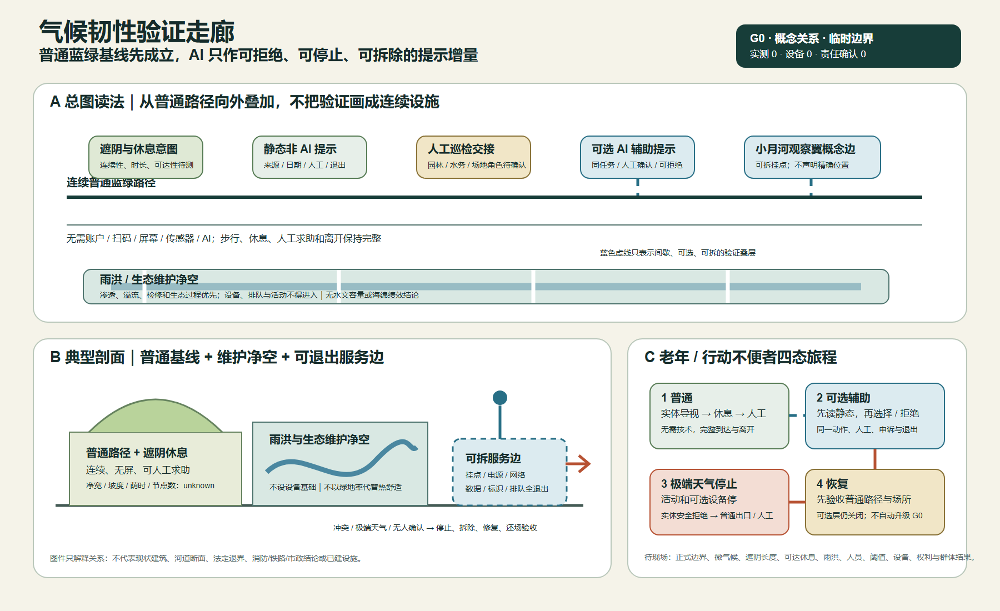

八个项目形成空间、协议和运营一一对应的更新包 [depth:renewal_project_list]：

| 项目 | 主要内容与 Feature | 前置条件 | 建议责任组合 | 概念验收 |
|---|---|---|---|---|
| JZ-01 六接口无障碍缝合 | `PUBLIC-004`—`009` 与横向接口线 | 现状测绘、交通与无障碍审查 | 公共部门 + 交通/景观专业 + 社区 | I01—I06 均有非 AI 连续线、断点台账和回滚方案 |
| JZ-02 可逆时空公园 | 九处公共空间、主绿脊和海绵缝合 | 绿地、水务、铁路与运维条件 | 景观/生态专业 + 社区运营 | 日常、学习、Beta、静音、离线模式可切换 |
| JZ-03 众智验证公共栈 | `AI-ZONE-001` 与四节点 | 安全、网络、消防和责任主体 | 技术测试 + 安全/伦理 + 现场运营 | 可复测、可急停、失败可公开 |
| JZ-04 原点开源共创街 | `AI-ZONE-002` 与四节点 | 社区共创、教育和版权规则 | 高校/开发者 + 社区 + 策展 | 撤回、许可、非技术参与和共同测试可核验 |
| JZ-05 大钟寺城市服务门户 | `AI-ZONE-003` 与人工服务台 | 站城、交通、商业与公共服务条件 | 企业服务 + 人工窗口 + 运维 | 来源、过期提示、人工转接和安静无屏同时成立 |
| JZ-06 可信叙事双螺旋 | 三地标、里程标、失败档案 | 史料、版权、商标和无障碍审查 | 策展 + 文保/历史专业 + 公众 | 来源、AI 标识、纠错和替代媒介全覆盖 |
| JZ-07 场景护照与开放基准 | JZ-AIOS、复测包与年度失效 | 法律、安全、数据与专业审查 | 独立评测 + 责任运营 + 社区席位 | 护照字段、人工兜底和停止阈值完整 |
| JZ-08 四季运营与 Proof Week | 年度问题、开源、Beta 和证据发布 | 预算、场地、主体和活动审批 | 京张开放协作台建议主体 | 同时公开通过、失败、修正和主动退役 |

`visual/assets/pilot-readiness-register.json` 为 JZ-01—JZ-08 和 T-01—T-03 逐项补齐概念级 RACI、审批触发、禁止数据、事故与停机责任、社区共测、退出恢复、独立复测和 go/no-go 证据。这里的“覆盖”仅表示 8 个项目和 3 个试点都有字段，不表示责任主体已接受、审批已取得或试点已运行；当前状态统一保持 G0/`concept_only`，现场结果与恢复时间保持 `unknown` [data:visual/assets/pilot-readiness-register.json#JZ-01] [metric:pilot_readiness_protocol_coverage_ratio]。

为让这些既有要求能够真正交接，`readiness-closure-contract.json` 把每项压成九类必须归档的关闭材料：责任接受、审批范围、场地/时段与日常基线、禁采数据控制、停机权限、恢复演练、社区共测、独立复测和最终 go/no-go 纪要。规则是“全部关闭才可讨论 G1，任一缺失即 NO-GO，任何停止条件优先于旧授权”；当前 11 项共 99 个材料槽全部开放，已关闭为 0，11 项决定均为 NO-GO。这个数字只说明现实证据尚未交付，不把模板完整误写成可实施成绩 [data:visual/assets/readiness-closure-contract.json#JZ-READINESS-CLOSURE-V1]。

`implementation-handoff-matrix.json` 再把这 11 项与 12 个既有预注册场景逐一交叉：每项固定到当前 `PHASE-1`、空间对象、关闭记录和七组移交包，七组包完整覆盖九类关闭材料；每个场景至少回指一个既有项目或试点。当前 12/12 场景已完成“文档去向”映射，但 99 个稳定现实证据 ID 仍全部没有提交材料，获批项目、运行项目、现场测试、已知现实结果和 GO 决定仍均为 0。这项增强只减少专业团队接手时的解释损失，不提升实施成熟度 [data:visual/assets/implementation-handoff-matrix.json#JZ-IMPLEMENTATION-HANDOFF-V1]。

专业团队接手时不需要重新解释 99 个槽，而是按七组既有移交包提交现实材料；一份材料可以同时进入复核包，但只有对应的九类关闭记录逐项完成后才能改变 NO-GO：

| 移交包 | 必交现实材料 | 关闭对象 | 当前状态 |
|---|---|---|---|
| H01 责任与停机链 | 真实责任主体接受、运行责任接受、可联络停机链与轮班覆盖 | 责任接受 | 未提交 / NO-GO |
| H02 审批与范围 | 审批台账、获批场地与时段、条件与到期日 | 审批范围 | 未提交 / NO-GO |
| H03 场地与日常基线 | 有日期的现场调查、日常使用基线、同任务非 AI 对照 | 场地/时段基线 | 未提交 / NO-GO |
| H04 数据与安全 | 禁采数据控制、最小数据清单、事件与留存程序 | 禁采数据控制 | 未提交 / NO-GO |
| H05 停止与恢复 | 实体或程序停机测试、具名重启权限、恢复演练与验收记录 | 停机权限 + 恢复演练 | 未提交 / NO-GO |
| H06 公共同权 | 社区共测、同任务非 AI 同权比较、申诉与退出记录 | 社区共测 | 未提交 / NO-GO |
| H07 复测与决定 | 独立复测包、版本化发现台账、签署的 go/no-go 纪要 | 独立复测 + 最终决定 | 未提交 / NO-GO |

分期采用“年份窗口 + 证据门”，年份从不自动赋予进入下一阶段的资格 [data:geometry/phasing.geojson#PHASE-1] [metric:phase_count] [depth:phasing_implementation]：

| 窗口 | 状态 | 进入门 | 毕业门 | 回滚 |
|---|---|---|---|---|
| 0—2 年 | G0 概念/离线与 G1 影子 | 来源、责任、风险、基线、人工兜底齐全 | 可安全回滚、公共价值门通过、复测包完整 | 任一重大安全、隐私、无障碍或公共价值失败 |
| 3—5 年 | 经批准的 G2 限域 Beta | 独立复测、社区评议、专业审查和场地许可 | 三维毕业立方体通过并发布证据 | 连续失败、申诉无响应、公共红利未交付 |
| 5 年后 | G3 申请、扩展、修正或退役 | 正式审批和运行资源明确 | 年度报告确认继续、改正或主动退役 | 边界、控制条件、技术或社会影响发生重大变化 |

年度运营采用四季协议。第一季度“问题季”由社区、高校和城市服务者发布可公开问题；第二季度“开源季”形成团队、协议和离线基线；第三季度“城市 Beta 季”只运行获批的限域测试；第四季度“Proof Week”发布通过、失败、投诉、修正和主动退役，并形成下一年问题。开发者转化漏斗为“公开问题 → 共创队伍 → 离线基线 → 限域申请 → 公开证据 → 人工服务/企业转化/外部复测”；任何环节都不得把参与写成招商、资金或政策承诺。活动品牌采用同一 Logo 的季节色，不额外制造与一带主品牌冲突的 IP。

运营建议设“京张开放协作台”，公共部门只在法定职责内明确规则，专业机构负责空间、数据、安全与无障碍审查，高校和企业提供可撤回的项目，社区代表拥有议题席位、申诉和暂停建议权。年度报告必须同时披露服务、公共红利、投诉、数据事件、人工接管、能耗、失败与改进；实测数据不存在时不得用目标值冒充成绩。

## 指标体系、面积复算与合规矩阵

指标仍分七类，但按可读问题拆开呈现：

- 场地与重点区规模：临时场地面积、重点区数量及总面积 [metric:site_area_sqm] [metric:key_area_count] [metric:key_area_total_sqm]。

- 用地结构：用地单元数量和类别数量 [metric:land_use_unit_count] [metric:land_use_category_count]。

- 建筑表达：体量原型数量、基底面积和总体表示比例 [metric:building_count] [metric:building_footprint_area_sqm] [metric:building_representation_ratio]。

- 重点区体量：重点区原型数量和基底覆盖 [metric:key_area_building_count] [metric:key_area_building_footprint_ratio]。

- 蓝绿系统：绿地面积、数量和比例 [metric:green_space_area_sqm] [metric:green_space_count] [metric:green_ratio]。

- 公共空间：公共空间面积、节点数量和比例 [metric:public_space_area_sqm] [metric:public_space_node_count] [metric:public_space_ratio]。

- 交通：设计路线数量和长度 [metric:design_road_count] [metric:design_road_length_m]。

必需面积指标族不再只报“单元数量”，而按可复算对象补齐，同时保持概念设计边界：

- 商业服务、居住与社区服务三类功能包络分别从用地图层复算；它们不是法定地块或供地规模 [metric:land_use_area_05_sqm] [metric:land_use_area_0701_sqm] [metric:land_use_area_0702_sqm]。

- 研发、文化与教育科研三类功能包络同样只表达当前设计几何，不生成容积率或建设规模 [metric:land_use_area_0802_sqm] [metric:land_use_area_0803_sqm] [metric:land_use_area_0804_sqm]。

- 绿地、广场/公共界面与弹性留白三类面积分别复算；其中 1403 功能包络不等于九处 `PUBLIC_SPACE` 直接干预范围 [metric:land_use_area_1401_sqm] [metric:land_use_area_1403_sqm] [metric:land_use_area_16_sqm]。

- 三个年份窗口的面积来自 `geometry/phasing.geojson`，只表达证据门覆盖范围，不是批准建设边界或自动实施时序 [metric:phase_1_area_sqm] [metric:phase_2_area_sqm] [metric:phase_3_area_sqm]。

- 三处重点区分别保留低置信的临时 polygon 复算面积；公告约面积与临时几何面积分栏保存，正式 polygon 面积仍为空 [metric:key_area_zhongzhiyuan_sqm] [metric:key_area_origin_community_sqm] [metric:key_area_dazhongsi_sqm]。

AI 与公共价值指标同样按核验问题拆开：

- 场景规模：服务场景、映射节点和服务区数量 [metric:scenario_count] [metric:mapped_scenario_node_count] [metric:ai_service_zone_count]。

- 运行接口：I01—I06 空间接口、护照字段覆盖和人工兜底字段覆盖 [metric:gateway_count] [metric:scenario_passport_coverage_ratio] [metric:manual_fallback_coverage_ratio]。

- 公共可达：非 AI 通道覆盖与无屏默认覆盖 [metric:non_ai_access_coverage_ratio] [metric:screen_free_public_node_ratio]。

- 实施：三个阶段门 [metric:phase_count]。

- 实地与交接准备：场地落地观察、八项目责任字段覆盖、三试点责任字段覆盖，以及仍为 0 的开园后现场审计 [metric:site_grounding_observation_count] [metric:pilot_readiness_project_coverage_ratio] [metric:completed_post_opening_field_audit_count]。

- 首测文档：12 个场景均有预注册记录，必填字段覆盖率为 100% [metric:g1_preregistration_record_count] [metric:g1_preregistration_required_field_coverage_ratio]。

- 首测现实证据：完成预注册和获批窗口均为 0 [metric:completed_g1_preregistration_count] [metric:approved_g1_test_window_count]；现场执行和已知独立复测结果也均为 0 [metric:g1_field_execution_count] [metric:known_g1_result_count]。

这些指标只证明提交包中“设计了什么”，不证明现实运行效果。

所有使用临时边界作分母的面积比例统一为 `low` 置信度；设计对象的数量和属性完整率可为 `high`；路线长度和体量面积为概念设计的 `medium` 或受边界影响的 `low`。容积率、总建面、建筑密度、平均高度、道路面积与道路比例、停车供给、实测恢复时间和单位有效服务能耗继续保持待正式资料或受控测试补齐，不以体量原型覆盖率或道路中心线代替 [metric:building_density] [metric:road_ratio]。证据链固定为“公开来源/明确假设 → GeoJSON → EPSG:4548 复算或属性计数 → `metrics.json` → 正文/图纸/HTML → 机器自检 → 人工专业判断” [depth:metrics_recalculation]。

`compliance_matrix.json` 将 23 项任务分别指向对应正文、Feature、指标、来源、假设与检查；`standard_matrix.json` 和 `design_depth_matrix.json` 对专业要求采用同样的逐项证据分配，均不使用重复的泛化证据包。

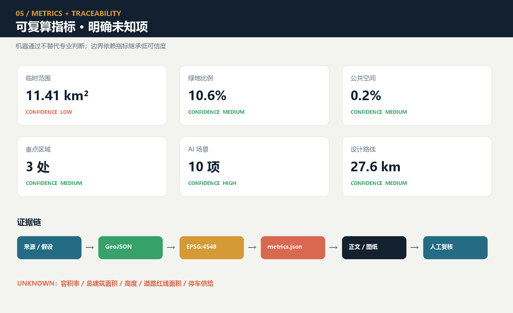

## 风险、版权与合规说明

- 边界与规划风险：官方 GIS/CAD、权属、控规、道路红线和工程条件缺失，任何空间结论都只是概念建议；正式资料到位后必须替换、差异比对和全量重算。
- 空间表达风险：36 个单元和体量原型是设计表达，不是现状调查；不得把表示比例解释为建筑密度或建设规模 [assumption:A-SPATIAL-REPRESENTATION-002]。
- 公共利益风险：测试可能造成噪声、拥堵、数字排斥或公共空间私有化；日常生活、非 AI 通道、静音无屏、共同测试和申诉暂停构成硬门。
- AI 与数据风险：偏差、幻觉、隐私泄露、越权自动化和供应商锁定通过最小数据、源端保留、日志、人工责任、复测、到期和退役控制；不得自动执法、诊断或替代正式审批。
- 安全与韧性风险：机器人、车辆和设备测试只在授权范围；实体急停、现场安全员、离线人工和 L0/L1/L2 降级必须可用。能源和恢复指标未实测时保持未知。
- 文化与历史风险：史实、人物、文物和工程资料需由官方/馆藏/清权来源复核；AI 生成内容显式与元数据标识，争议内容可纠错、下架和追溯 [assumption:A-CULTURE-CONTENT-006]。
- 版权与品牌风险：本次提交的最终文件集合为 manifest 中 89 个路径（其中 88 个为非 manifest 内容文件）；89 条逐文件资产记录与 29 条来源证据记录只证明披露和链接闭合，覆盖完整性只在 manifest 与权利状态台账从最终 Git blobs 刷新并通过校验后成立。当前独立逐文件清权审计完成数为 0，总体状态为 `not_fully_cleared`。`submission-use-rights-matrix.json` 已逐条记录公告 8.1、仓库评审、主办方项目内使用、投稿人对外展示、跨项目复用和第三方组件的当前决策，但本包未证明正式公告条款与本次 GitHub 开源 Agent 征集具有完全相同的适用关系；`COMMUNITY-DISPLAY-ONLY` 完整条款、书面同意、OSM ODbL 义务、PDF 字体、Node.js 运行时与生成工具条款以及 Logo/地标商标仍待复核，不能声称已经全部清权 [data:visual/assets/rights-clearance-ledger.json#RIGHTS-01] [data:visual/assets/submission-use-rights-matrix.json#JZ-SUBMISSION-USE-RIGHTS-V1]。
- 外部协同风险：未来科学城、怀柔科学城、经开区、其他创新街区和京津冀只作为可选复测角色，未经书面确认不得写成合作方、投资方或落地承诺 [assumption:A-EXTERNAL-COLLAB-005]。
- 运营与公平风险：活动热度不能替代居民满意、可达、公平与投诉闭环；贡献荣誉不得用于流量排名、就业筛选或行政评价。
- 工具与证据风险：机器检查只验证结构、拓扑、引用和一致性，不替代规划、建筑、交通、市政、景观、生态、消防、铁路、数据安全、无障碍、社区与法律专业判断 [depth:risk_missing_data]。
- 公开报道与现场差异风险：本轮 Firecrawl 桌面研究只保存公开页面的来源、日期、摘要和内容摘要值，用于引用与设计判断；未进行现场踏勘、竣工图核验或设施运行审计。凡涉及准确位置、已建状态、使用强度和无障碍表现的判断，均须在进入 G1 前现场复核 [data:visual/assets/site-grounding-register.json#SG-001]。

权利矩阵把“可在仓库内评审”与“可以公开或专业复用”严格分开；当前只有披露条件下的仓库评审可进行，其余用途不会因 PR、机器 PASS 或文件公开可见而自动放行：

| 使用场景 | 当前决定 | 尚缺证据 |
|---|---|---|
| 仓库验证、Issue 与 PR 评审 | 仅限披露条件下评审 | 无新增许可；必须保留作者、工具、来源和临时边界 |
| 主办方在本京张项目内使用或修改 | 待确认 | 条款适用关系、第三方授权审计 |
| 主办方印刷、出版、展览或传播 | 待确认 | 条款适用关系、署名形式、发布审计 |
| 投稿人对外媒体、出版或展览 | 阻断 | 书面同意、完整许可条款、独立逐文件审计 |
| 在其他设计项目中复用 | 阻断 | 权威权利结论或新的项目授权 |
| 翻译、衍生编辑或专业深化 | 阻断待范围确认 | 衍生/专业使用授权、完整可编辑源清单 |
| OSM、字体、Logo、软件及生成资产发布 | 阻断待组件审计 | ODbL、字体嵌入、商标和工具输出条款审计 |

当前全部 AI 场景处于 G0 概念状态，八个项目和四季活动均为建议，未获批准、未建设、未运行、无机构承诺。只有在法定审批、责任主体、专业审查、公众参与、资金运维和事故响应全部明确后，才可讨论进入更高运行门。
## 百年时间博物馆：可核验·可纠错·无屏可达的城市时间教育线

> 本节为第 8 轮（JZ-FUTURE-07）新增的文化叙事增量，继承前序公共权利、证据类型与失败回写合同；不另造治理品牌或重复失败侧线。

### 战略命题

把京张铁路的勘测、标准、信号、维护与公共记忆，同 AI 的训练、验证、失败、纠错和退役并置，形成一条不崇拜技术的城市时间教育线。

这一命题的核心不是展览，而是一条**可纠错的时间教育线**——每个史实、每个档案、每个生成内容都携带来源等级和允许用途；任何争议内容都有停止、下架、纠错、版本保留和恢复的明确流程；所有节点都不依赖账号、扫码、屏幕或 AI。

### 文化内容来源与权利边界

本轮新增 `century-time-museum-contract.json`（JZ-TIME-MUSEUM-G0-V1），组织以下内容：

- **百年时间轴**：五条史实对象（1905–1909 勘测建设、1909 全线通车、2019 京张高铁、2023+ 遗址公园分期开放、年度证据更新机制），每条标注来源等级、允许用途和未知项
- **史实来源等级表**：七级类型化证据锚点——official_archive / in_package_source / public_reporting / public_reporting_pending_archive / osm_background / generated_content / oral_history_pending
- **口述史同意模板**：采集前合同状态；同意可随时撤回，撤回后内容从公开侧下架，版本保留仅限内部最小化存证
- **争议纠错五步流**：停止→下架→纠错→版本保留→恢复；独立复核 + 公众说明后方可恢复，否则保持下架或主动退役
- **无屏节点链**：起点站牌 → 对照图谱牌 → 证据更新墙；全程无需账号、二维码、屏幕或 AI

### 指标与验收

十项文化指标全部保持 unknown 或 0，禁止用字段覆盖率冒充现实成效：

| 指标 | 设计期状态 | 分母 | 证明上限 |
|---|---|---|---|
| 史实来源可核验率 | unknown | 同任务同人群同时段 | 现场观察 + 独立复测 |
| 未清权内容数量 | unknown | 同任务同人群同时段 | 独立逐文件审计 |
| 生成内容标识覆盖 | unknown | 生成内容条目总数 | 人工检查 + 抽样审计 |
| 争议处理时间 | unknown | 无现实争议事件 | 过程日志 + 时间戳 |
| 口述史有效同意率 | 0（模板仅） | 口述史采集总数 | 同意记录 + 撤回记录 |
| 多语言概念一致性 | unknown | 概念对总数 | 双语对照 + 专业审核 |
| 无屏完成导览率 | unknown | 无屏路径使用者数 | 现场或受控测试 |
| 儿童理解度待测 | unknown | 学龄使用者样本 | 教育工作者评估 |
| 年度退役内容数 | 0 | 年度审核周期 | 退役清单 + 回执 |
| 独立史实复核状态 | unknown | 要求复核者数 | 独立审核员签署 |

### 三处重点区的差异化表达

| 重点区 | 原型角色 | 时间博物馆表达 |
|---|---|---|
| 众智园 VERIFY | 平行验证庭 | 设备隔离带 + 人工接管窗口可见于来源等级展示 |
| 原点社区 CO-CREATE | 一街两院四节点 | 无屏共学节点承载多语言站牌与口述史同意展示 |
| 大钟寺 PUBLISH | 四象限步行 + 一厅一台 | 一厅作为人工服务与信息纠错节点，非 AI 强制入口 |

### 风险预演与停止恢复

- **R01 把历史比喻当事实**：发现后立即 fail-closed，切换人工或普通使用，停止到恢复需独立复核
- **R02 使用未清权图片文字**：撤除临时设备，恢复普通路径，通知受影响人群，最小化保存事件证据
- **R03 生成内容伪装史料**：生成内容必须可见标识，可随时下架；下架后版本保留，不自动删除档案

### 图件交付

`century-timeline.{svg,png}` 双语时间图谱通过图面 QA，A 双轨对照图谱 / B 来源等级表 / C 争议纠错流程，全部标注 G0 概念状态与 provisional geometry 边界。

### 继承与冻结

geometry、既有 SCENE/JZ/T 编号、八个项目、全部 G0、临时边界和 `not_fully_cleared` 均不变。官方馆藏、明确责任主体、独立复测、批准或运行结果仍为 0。

[back to top](#ai-朝圣铁轨新生带)

## 参考资料

项目主依据：[source:DATA-SRC-OFFICIAL-ANNOUNCEMENT-20260509] 北京市规划自然资源委征集公告；[source:AGENT-TASKBOOK] 仓库智能体任务书；[source:SITE-PACKAGE] 场地包；[source:SOURCE-REGISTRY] 资料登记；[source:PROCESSED-FACT-PACK] 处理导航。临时空间依据为 [source:DATA-SRC-PROVISIONAL-BOUNDARIES-20260605]，仅用于生成、展示和非正式复核。

仓库公开资料索引的直接入口为 `brief/public-brief.md`，公开边界与用途说明见 `brief/README.md`；两者只提供可公开的任务背景和数据边界，不能生成法定控制值。

本地专业资料包括 `brief/site-package/standards/standards.json` 及其 references：[source:STD-URBAN-DESIGN] 城市设计管理、[source:STD-CONTROL-PLAN] 控制性详细规划编制审批、[source:STD-LAND-USE] 国土空间用地用海分类，以及 [source:STD-ARCH-DEPTH-GAP] 建筑工程设计文件编制深度的资料缺口记录；引用这些材料是为了限定表达深度和风险边界，不代表本方案已经成为法定规划，缺口记录更不能被当作已核验条文。

近期政策与场地背景：[source:BEIJING-AI-ORIGIN-2026] 北京市发展改革委 2026 年原点社区与百年京张公开信息；[source:BEIJING-AI-DISTRICTS-2026] 北京首批 AI 创新街区“一核多点”背景；[source:HAIDIAN-JZ-PHASE2-OPEN-2026] 2026 年 8 月二期开放报道；[source:HAIDIAN-AI-TRIAL-FIELD-2026] 海淀 AI 试验场与原点社区背景；[source:HAIDIAN-JZ-MIDTERM-2026] 京张人工智能创新带中期成果与三类人群、五分钟生活支持目标；[source:HAIDIAN-15FYP-2026] 海淀“十五五”规划中的人工智能、城市更新与公共服务方向。后四项来自本轮公开网页桌面研究，只用于形成现实基线、政策意向和待核验问题，不是现场调查、竣工证明、地块批准或机构承诺。

治理与方法背景还包括 [source:NATIONAL-DATA-INFRA-2025] 国家数据基础设施建设指引；[source:AI-CONTENT-LABEL-2025] 人工智能生成合成内容标识办法；[source:AI-PLUS-2025] 国务院“人工智能+”意见；[source:JZ-PARK-2023] 京张铁路遗址公园一期公开资料；[source:JZ-COCREATION-2021] 京张遗址公园公众共创与专业连续性资料。它们只支撑方向、方法和治理边界，不产生本项目审批、资金、伙伴或控制值。

全球案例对照包括 [source:CASE-KENDALL]、[source:CASE-ONE-NORTH] 与 [source:CASE-22AT]。同一对照集还包括 [source:CASE-KINGS-CROSS]、[source:CASE-STATION-F] 与 [source:CASE-MARS]。现状方向背景为 [source:OSM-CONTEXT]，其 ODbL 数据只用于道路、铁路和水系识别，不能作为官方边界或工程依据。

生成方法：空间设计由公开临时边界、项目枚举、OSM 背景和确定性脚本派生；面积与长度在 EPSG:4548 中复算；场景护照、服务区、公共空间模式和阶段门以 GeoJSON 属性记录；PNG、A3/A0 与离线 HTML 是解释层，`geometry/*.geojson`、`metrics.json`、三类矩阵和 `self_check.json` 是证据层。`COMMUNITY-DISPLAY-ONLY` 仅作为当前许可标签记录，其完整条款未随包提供；逐文件状态、未完成事项与使用限制见 `visual/assets/rights-clearance-ledger.json` 和 `report/copyright_statement.md`。
