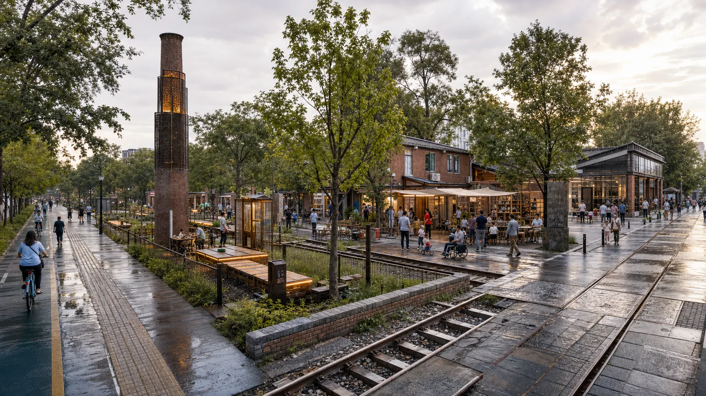
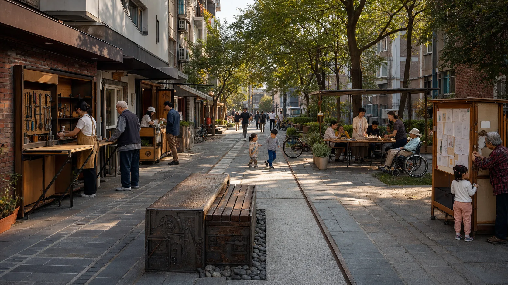
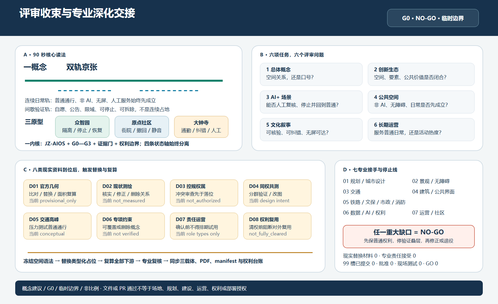

## 方案总纲

- 英文名称：TWIN-TRACK JING-ZHANG
- 后台核验系统：JZ-AIOS（Jing-Zhang Auditable Innovation Operating System，京张可验证场景操作系统）

### 为什么是海淀：创新密度要成为公共能力

公开材料把海淀人才、居民、公共服务和已开放京张遗址公园并置，却未证明创新资源已成为可用、可质疑、可退出的日常服务 [source:AGENT-TASKBOOK] [source:HAIDIAN-JZ-MIDTERM-2026] [source:HAIDIAN-JZ-PHASE2-OPEN-2026]。本方案的判断是：**普通人无需账户、设备或专业身份也能使用、质疑和退出，创新密度才是公共能力。** 本包未完成抽样或影响测量；普通地面先承载通行、休息、问询、照护和基本服务，限域验证退到旁侧 [source:HAIDIAN-15FYP-2026] [data:visual/assets/non-ai-parity-contract.json]。

## 一次空间裁决：验证必须退到普通生活之外

**任何验证都不得占用完成普通任务所需的地面。** 普通地面先承担通行、休息、问询、照护和基本服务；验证只能旁置、限域、可停止、可撤除。

评审不先跟随系统，而先跟随一个匿名普通任务：**到达 → 理解 → 完成 → 纠正或撤回 → 离开**。五个动作中任一步若强制依赖账户、扫码、屏幕、网络或 AI，连续日常轨就没有成立；故障时若不能继续完成人工任务并安全离开，验证叠层就必须停止。这是对既有七项权利和同任务双路径的前台读法，不新增人物、场景、服务承诺或成熟度。

| 三处不可互换原型 | 明确拒绝 | 保留的空间答案 | 故障时仍继续 |
|---|---|---|---|
| **众智园 · 验证** | 验证跨越普通路径 | 平行绕行与旁置证明园，人工交接位于两条路径之间 | 普通绕行、非 AI 信息与人工交接 |
| **原点社区 · 共创** | 验证节点占据居民街 | 一条开放居民街、两座退后庭院、四个可逐点撤回节点 | 居民街、纸面／口述入口与人工交接 |
| **大钟寺 · 发布** | 服务设施占据四向通勤中心 | 中心只供通行，信息厅与人工台均退到主路之外 | 四向通勤、安静休息与路外人工服务 |

> **四态只改变验证叠层。** 普通状态先成立；验证满足前置条件后才出现；故障只隔离验证对象，完整非 AI 路径、人工交接、撤回与申诉继续；恢复先还普通地面和同一任务，再复核，**不等于授权、批准、重启或 G1**。动态图解的 54 秒只是编辑节奏，静态图给出同一答案，均不表示现实恢复时长。

> **真实性边界。** 三处图面是临时几何上的 G0 概念关系，不是现状测绘、精确总平、获批方案、无障碍结果或居民意见；官方红线、准确锚点、现实阈值、责任主体、现场服务、批准与独立复测仍为 0 或 `unknown`。投稿方内容、代码、OSM 衍生层和 Noto 字体分别适用 CC BY 4.0、MIT、ODbL 与 OFL；第三方引用和仓库输入不被重新许可。路径级权利处置以最终 manifest 与权利台账为准，不存在单一整包许可。新增真实感场景均显式标为合成 G0 概念图，不构成现场、服务、公众反馈或成熟度证据。

八问答案、合成回放和交接材料只有一个后台入口：`visual/index.html#handoff`（评审交接）。它只用于追证，不构成公众反馈、专家意见、现场结果、授权或成熟度升级。方案仍保留 12 个场景、8 个项目、3 个重点区和 36 个概念用地单元；13 个正式章节及顺序不变。

## 设计依据与资料清单

设计依据从当前场地事实边界出发：公开资料报告公园已开放、街区控规已获批，但本包没有批复文件与图则、官方红线、竣工测绘、完成的现场走查或获批试点；因此先判断既有日常如何不被打断，再判断可逆验证是否有净增益。既有 12 个场景、8 个项目、三处重点区和治理合同构成完整的可审计对象集；额外清单不能制造新证据 [depth:existing_conditions_diagnosis]。

### 已批街区控规语境：双轨是可逆服务叠层，不是第二套法定结构

北京市政府门户 2026 年 8 月 12 日公开信息显示，覆盖 9 个街区、约 1668.2 公顷、规划期 2024—2035 年的京张铁路遗址公园沿线街区控规已获批，并以“一带一轴、两心多点”概括空间结构；公开文字还提出南北贯通、东西连通的步行骑行、体育游憩与便民设施、生活圈与创新圈融合，以及交通市政能力完善 [source:BEIJING-JZ-CONTROL-PLAN-APPROVAL-20260812]。这条来源只证明**获批状态和公开文字方向**；本包没有批复正文、图则、官方 GIS/CAD、街区或地块边界、道路红线、用地指标、建筑高度、权属、市政容量或专项结论。

| 已批规划公开文字方向 | “双轨京张”的增量回应 | 仍须官方文件／专业交接 |
|---|---|---|
| “一带一轴、两心多点”，大钟寺与五道口为“两心” | 双轨不另立法定结构，只把连续普通地面与旁侧可停止验证写成公共空间运行规则；三处原型仍是 G0 设计关系 | 官方图则、中心与节点边界、法定层级、现状套合及规划专业复核 |
| 绿色公共空间引领更新，南北贯通、东西连通步行骑行 | 连续日常轨先保通行、休息、问询与非 AI 同任务路径；验证不得占用普通地面 | 正式红线、道路／慢行线位、现状断点、铁路保护、无障碍和高峰调查 |
| 体育、游憩、便民服务与一刻钟生活／创新圈 | 三处只增加可撤、可拒绝、可转人工的服务接口，不把账户、扫码或 AI 设为前提 | 真实需求、开放时段、人员、容量、设施标准、社区意见和责任接受 |
| 老旧厂房、低效楼宇更新与大模型、智能体、具身智能方向 | 众智园的旁置验证、原点社区的退院共创和大钟寺的路外发布仅作为条件式 G0 原型 | 建筑测绘、产权、保留／改造判断、消防、结构、设备、运营和产业主体 |
| 道路网与市政基础设施能力完善 | 本方案不填造道路、市政、投资或恢复时长，只保留停止线和 D01—D08 替换入口 | 交通、市政、铁路、消防、规划、建筑及权利专业方可复算、附条件或否决 |

**范围不得偷换。** 当前 `site_boundary.geojson` 复算面积 11,412,825.386 m²（约 11.41 km²），只是仓库临时设计模型；公开报道的 1668.2 公顷（约 16.682 km²）是获批街区控规的文字范围总量。二者既不等量，也未用官方文件完成同坐标套合、包含关系或边界核验，因此本轮冻结全部 geometry 与 `metrics.json`，不得把前者改称获批范围，也不得用后者反算或平移现有图面 [assumption:A-BOUNDARY-001] [assumption:A-CONTROLS-001] [metric:site_area_sqm]。

### 2026 年 8 月 6 日之后的现实起点

公开报道显示，京张铁路遗址公园二期已于 2026 年 8 月 6 日开放，南段社区活力区和北段自然休闲区已形成约 9 公里的连续绿色廊道，并报告了社区连通、全龄活动、慢行与海绵设施等既有成果 [source:HAIDIAN-JZ-PHASE2-OPEN-2026]。这改变了方案的基本判断：JZ-AIOS 不再把“建成一条连续公园”当作自身成果，而只在既有公园之上提出可逆、低占用、可退出的公共服务与验证增量。下表是桌面研究形成的设计起点，不是现场踏勘、竣工图核验或法定红线确认；位置、运行状态和人群使用仍须逐项复核 [data:visual/assets/site-grounding-register.json#SG-001] [assumption:A-SITE-LOCATION-008]。

| 公开基线 | 本方案的设计增量 | 待现场核验 |
|---|---|---|
| 二期已开放；南段已报告服务周边社区并打开横向联系 | 六个空间接口降级为审计/服务界面类型，优先复用既有入口、人工服务和慢行节点，不预设新建地标 | 每个接口的准确位置、无障碍连续性、高峰绕行、产权与运维边界 |
| 北段已报告形成鱼骨慢行联系、滨水与公园网络 | 只叠加可暂停的场景护照、离线导视和公共复测接口，不重复建设基础绿道 | 步行、骑行、跑步冲突，夜间照明，雨洪与铁路安全条件 |
| 全龄活动、遗产再利用和海绵设施已被公开报道 | AI 必须证明对既有日常生活的净增益，不以设备数量、屏幕或活动流量替代公共价值 | 开园后 30 日使用观察、不同人群任务成功、噪声、投诉与维护负担 |

#### 已建公园增量协议 / Built-Park Delta Protocol（INNOV-006）

任何 G1/G2 试点须先完成“非 AI 现状基线—AI 增量假设—最小占地与时段—停止与恢复—独立复测”的同页记录。AI 必须证明相对人工、纸质、实体导视或既有服务的增量价值；不得造成无障碍公共空间或静音时段的净损失。若不能证明增量、恢复后不能回到不低于基线的状态，或独立复测失败，试点退回 G0 或退出。当前开园后 30 日现场审计完成数为 0，协议完整只代表设计字段覆盖，不代表现场有效 [data:visual/assets/innovation-register.json#INNOV-006] [assumption:A-POST-OPENING-007] [metric:completed_post_opening_field_audit_count]。

#### G1 预注册：先写失败条件，再申请现场

`g1-preregistration-register.json` 为 12 个场景列出首测前须锁定的同任务对照、主指标/分母、人群、样本、时窗、禁伤、停止恢复、独立复测输入和版本。12/12 仅指字段齐全；完成登记、获批窗口、现场执行和已知结果仍为 **0**，不能据此升级 [data:visual/assets/g1-preregistration-register.json#G1-PREREG-001] [metric:g1_preregistration_required_field_coverage_ratio] [metric:completed_g1_preregistration_count]。

**评审路径（概念协议，不是审批或结果）**：已建公园基线 → 公共问题 → 同任务非 AI 对照 → G1 影子测试 → 停止/恢复 → 独立复测 → 升级或退出。所有节点当前仍为 G0；此路径不构成审批、现场执行或现场结果。

| 首批最小测试包 | 同任务非 AI 对照 | 唯一主指标 | 不得协商的停止条件 | 当前状态 |
|---|---|---|---|---|
| T-03 / SCENE-009 无障碍路径 | 同起终点的人工服务、纸质或实体导视 | 各共同测试人群的任务成功数 / 已同意任务数 | 出现关键障碍、过期路径状态或非 AI 路径不可用即停止并恢复 | 阈值待现场预注册；未执行 |
| T-02 / SCENE-011 企业服务 | 同一冻结问题集的人工窗口或可追溯静态指南 | 有来源且边界正确的回答数 / 冻结问题数 | 输出无来源结论、泄露禁采数据或人工接管不可用即停止 | 合成决策回放 10/10 精确匹配；现实阈值、责任主体、场地与服务均未执行；G0 |
| T-01 / SCENE-001 低速配送 | 相同任务的人工配送或静态路线 | 无碰撞、无越界且可急停的任务数 / 获批受控任务数 | 任一碰撞、越界、实体急停失败或接管链断裂即停止 | 安全红线固定；效率阈值待预注册；未执行 |

### 创新不是口号：可证伪登记表

“看起来新”不等于创新成立。`innovation-register.json` 把六项主张绑定到基线、可证伪假设、最小证据、通过标准、失败信号和退出动作；INNOV-006 专查已开放公园上的可证明、可恢复净增量。缺失败信号或退出动作就不登记为正式创新，未发生的运营结果保持 `unknown` [data:visual/assets/innovation-register.json#INNOV-001] [data:visual/assets/innovation-register.json#INNOV-006]。

依据分为四级，各级只承担与其权威程度相称的作用：

- 第一级是征集公告、智能体任务书和项目场地包，用于确认任务与提交边界 [source:DATA-SRC-OFFICIAL-ANNOUNCEMENT-20260509] [source:AGENT-TASKBOOK] [source:SITE-PACKAGE]。

- 第二级是仓库资料登记、标准索引和处理导航，用于定位证据及其用途限制 [source:SOURCE-REGISTRY] [source:PROCESSED-FACT-PACK]。

- 第三级是北京市关于原点社区、百年京张实景测试和“一核多点”创新街区的公开背景，只用于判断协同方向，不代表项目已批准或任何机构承诺参与 [source:BEIJING-AI-ORIGIN-2026] [source:BEIJING-AI-DISTRICTS-2026]。

- 第四级是国家数据、AI 内容标识和“人工智能+”政策，与六个全球案例一起用于机制启发和治理边界 [source:NATIONAL-DATA-INFRA-2025] [source:AI-CONTENT-LABEL-2025] [source:AI-PLUS-2025]。

### 证据不是一次性快照：失效必须向下游传播

`sources.json` 登记 52 条来源；访问日期不证明页面持续有效或现实绩效。2026-08-24 复核两条 `review_due`：Barcelona 市政府页面仍把 22@列为创新与技术转移节点；King's Cross 原页面返回 403，故改用同一运营方的可访问咨询页，仅保留人尺度、公共空间与持续咨询的背景比较。该动作只更新访问状态，不产生海淀控制、批准、绩效或成熟度证据；URL、方法与用途见记录 [data:visual/assets/evidence-freshness-policy.json#refresh_records]。临时空间数据仍仅用于 `provisional_only` 关系表达。

### 政策只设置进入门，不替代批准与责任

本轮把六项既有政策方向压缩成同一防误读结构：适用对象先成立，才允许把政策转成普通任务、空间或服务动作；随后必须写明人工交接、停止条件和不可推导结论。完整双语记录见 `visual/assets/policy-to-task-register.json`，它是 G0 政策转译，不是法律意见或项目批准。

| 政策适用边界 | 进入本方案的动作 | 停止与不可推导 |
|---|---|---|
| “人工智能+”只提供以人为本、开放共享、安全可控的政策方向 | 无人或智能服务退到连续普通路径旁侧；公共价值、技术、治理任一门不通过即不升级 | 普通任务或非 AI 同任务路径被阻断时停止验证；不证明批准、资金、服务能力或 G1 [source:AI-PLUS-2025] |
| 无障碍法第三十九条只限医疗、社保、金融、生活缴费等列举事项 | 仅当 JZ-05、`SCENE-011/012` 的实际事项落入列举范围，才把可达人工服务台和交接位置列为 G1 前置 | 事项范围、人工可达性或专业复核不明即 NO-GO；不泛化到全部公园和数字界面，也不证明现状设施合格 [source:DATA-SRC-BARRIER-FREE-ENVIRONMENT-LAW] |
| 适老化方案仅为传统与智能渠道并行的 `background_only` 背景 | 既有七项非 AI 公共权利继续保证同任务、可见入口和等价完成，不把智能渠道设为唯一入口 | 传统渠道缺失或未经分组共测不得写成已达标；不证明海淀实施、需求规模或覆盖率 [source:DATA-SRC-ELDERLY-SMART-TECH-PLAN-2020-45] |
| 生成式 AI 暂行办法只适用于向境内公众提供生成内容的候选服务 | 相关候选进入 G1 前预登记投诉举报入口、责任角色、处理流程和项目自定反馈期限 | 任一要素缺失或错误影响正式事项即停；不从第十四条推导一般退出权、不虚构第十五条数字期限，也不证明备案或安全评估 [source:DATA-SRC-GENERATIVE-AI-INTERIM-MEASURES] |
| 生成合成内容标识规则只约束适用的生成内容 | 保留显式标识、适用时的元数据标识、人工策展复核与无法核实时下架 | 来源、生成方法、模型、授权或不可证明事项缺失即不发布；标识不等于清权、事实真实性或安装许可 [source:AI-CONTENT-LABEL-2025] |
| 海淀三类人群与“五分钟支持”只提供公开背景优先级 | 映射到既有七类画像和支持单元，作为后续共测问题，不新增场景或虚构覆盖 | 无现场基线、群体共测和责任接受即维持 G0；不证明已招募样本、完成调研、获得伙伴承诺或形成服务绩效 [source:HAIDIAN-JZ-MIDTERM-2026] |

专业响应按问题拆分，而不是把标准编号堆在一个结论后：

- 项目任务与智能体任务由征集公告和任务书约束 [standard:PROJECT-OFFICIAL-ANNOUNCEMENT] [standard:PROJECT-AGENT-OPEN-CALL-TASKBOOK]。

- 城市设计范围与控规程序边界分别由两项住建领域材料约束 [standard:MOHURD-URBAN-DESIGN-MEASURES] [standard:MOHURD-CONTROL-DETAILED-PLANNING]。

- 用地术语和建筑设计深度缺口分别登记，不把缺口记录冒充已核条文 [standard:MNR-LAND-USE-CLASSIFICATION-GUIDE] [standard:MOHURD-ARCH-DESIGN-DEPTH-2016]。

当前精确红线、现状建筑、权属、控规指标、市政、交通工程与文保控制仍未取得。`geometry/site_boundary.geojson` 和三处重点区继续使用仓库临时替代范围，只能支撑概念复核 [data:geometry/site_boundary.geojson#SITE-001] [source:DATA-SRC-PROVISIONAL-BOUNDARIES-20260605]。它们不得用于审批、征地、精确面积或工程实施，边界与控制条件假设保持显式 [assumption:A-BOUNDARY-001] [assumption:A-CONTROLS-001]。

主线最新边界依据还记录了一次独立背景核查：OSM 已测绘公园要素与 `PROV-SITE-001` 的相交覆盖率为 0%，最近距离约 412.5 米。该读数既可能受 OSM 不完整影响，也可能反映临时推定范围的偏差，**不能据此判定哪一方正确，更不能反向修改或升级成官方边界**；本方案因此保持临时几何不变，把正式 polygon、坐标系和版本核验列为全量重算的触发条件 [source:PROVISIONAL-BOUNDARY-BASIS]。

## 三层范围工作框架

三层范围采用不同问题、不同精度、同一证据链。已批街区控规公开文字所述约 16.682 km² 与本包约 11.41 km² 临时总体设计模型不得互换；两者待官方文件同坐标核验。约 43.6 平方公里统筹研究范围回答产业、科研、城市问题和外部创新节点怎样协同；约 11.4 平方公里总体设计范围回答百年京张怎样组织公共空间、慢行、功能与场景；三处临时重点区回答“共创—验证—发布”三种状态站怎样形成街坊、建筑、公共界面和运行门。面积只表达任务层级，不能反推法定边界 [metric:site_area_sqm] [metric:key_area_total_sqm] [depth:three_level_scope_framework]。

### 双轨京张：公共空间运行框架 / Twin-Track Jing-Zhang

双轨京张由五个空间要素组成：**连续日常轨 / Continuous Civic Track**、**间歇验证轨 / Intermittent Proof Track**、**三座换轨场 / Three Switchyards**、**失败侧线 / Failure Siding** 和 **公共时刻表 / Civic Timetable**。日常轨提供开放、连续的普通任务基线；验证轨是自愿、有公告、有责任人、有时段且可拆除的叠层。原点社区定义问题，众智园验证，大钟寺发布与转人工；失败侧线承担停止、解释、绕行、申诉和恢复。这个任务接力不改变临时几何，也不是选址承诺。JZ-AIOS、G0—G3、证据门和权利边界留在后台核验 [data:visual/assets/key-area-evidence-matrix.json#twin_track_frontend_contract] [data:visual/assets/non-ai-parity-contract.json]。

#### 海淀社会关系—空间后果（设计审查）

公开任务中的高校、创新、社区、公共服务和遗址公园关系，在这里只形成四个设计问题：谁定义问题、验证是否占路、技术是否压过遗址与游憩、使用者能否拒绝并转人工。对应的空间答案分别落在原点社区的问题入口、始终开放的普通路径、众智园的旁置验证和大钟寺的人工服务。它们是设计审查，不是人群统计、公众反馈或已建结果 [source:AGENT-TASKBOOK] [source:HAIDIAN-JZ-MIDTERM-2026] [source:HAIDIAN-JZ-PHASE2-OPEN-2026]。

入口、时段、状态、人工、来源和退出用实体导视、纸面、口头及无障碍标识共同表达。公共时刻表只定义日常优先、静音无屏、条件验证、停止恢复四类窗口；真实时间、班次和批准仍为 `unknown` 或 0。公众无需注册、扫码或使用 AI，即可进入、完成任务、离开或申诉；停止条件触发后只隔离验证叠层并转人工 [data:visual/assets/key-area-evidence-matrix.json#twin_track_frontend_contract] [data:geometry/public_space.geojson#PUBLIC-004] [data:geometry/public_space.geojson#PUBLIC-009]。

#### 公共信号界面：六问 × 四态 × 三载体

12 行公共信号分别落在众智园观察绕行、原点社区一街两院四撤回点和大钟寺四向通勤与路外一厅一台；六问相同，入口、停止范围与恢复对象不同，编号、文字、线型和静态表不依赖颜色 [data:visual/assets/key-area-evidence-matrix.json#public_signal_interface_round18]。缺还场、维护关闭、居民确认或独立复核即关闭；无 JavaScript 仍可读。人工在线、时段、现场测试、批准、GO 与现实恢复均为 0，现场参数 `unknown` [data:visual/assets/site-grounding-register.json#public_signal_interface_round18] [data:visual/assets/civic-operations-contract.json] [source:SOURCE-JZ-CIVIC-OPERATIONS-G0-V1]。

典型剖面只画“人工站房—无屏节点—普通空间—验证叠层—恢复边”：普通、验证、故障、恢复依次说明开启条件、停止对象和还场对象。它是关系图，不是连续建设、准确位置、批准、运行结果或工程剖面 [data:visual/assets/key-area-evidence-matrix.json#twin_track_frontend_contract] [assumption:A-KEY-AREA-DETAIL-010]。

### 唯一核心机制

核心机制是把城市问题依次转成共创、验证、暂停、复现和公共交付；**Proof** 同时指空间实证、技术验证和公共价值证明 [assumption:A-GOVERNANCE-001]。一条验证线连接三座状态站、两条供给翼和六个城市接口：原点社区共创，众智园验证，大钟寺发布；小月河输入问题，中关村科技服务翼提供建议性支撑。外部角色都是规划建议，不代表合作已达成 [assumption:A-EXTERNAL-COLLAB-005] [depth:overall_spatial_structure]。

### 任务书定位与五大功能的可读映射

以下映射把任务书原词直接转成方案中的空间和运行机制，避免只在合规矩阵里形式勾选；它仍是供专业团队深化的概念响应，不产生法定功能、项目授权或机构承诺 [source:AGENT-TASKBOOK] [standard:PROJECT-AGENT-OPEN-CALL-TASKBOOK]。

| 任务书定位 / 功能 | 本方案的直接响应 | 不得越过的边界 |
|---|---|---|
| 百年京张文化带 | 铁路工程史—中关村创新史—AI 纠错史双螺旋，三处知识旅程地标 | 史实、文物、名称与载体待官方/馆藏和权利复核 |
| 都市 AI 生活体验带 | 六接口、九处日常优先公共节点、非 AI 等价与静音无屏模式 | 不把字段覆盖写成已开放服务或公众体验成绩 |
| AI 融合创新带 | “问题—共创—验证—发布/服务—转化—反馈”状态机和三区两翼 | 不虚构企业、伙伴、土地、资金或实施承诺 |
| AI 全栈自主创新体系 | 众智园承接离线、影子、限域申请、安全与独立复测门 | 不声称已有全栈平台、运营主体或获批测试场 |
| 世界级 AI 创新生态 | 原点社区共创接口、六个国际案例对照与两翼要素支持 | “世界级”是目标，不是排名、集聚度或合作事实 |
| AI+ 场景赋能新范式 | 12 个场景护照、三项先行测试协议和 G0—G3 不跨级门 | 当前全部 G0，批准、参与者、执行和结果均为 0 |
| 智能化 AI 活力城市 | 日常/学习/Beta/静音/离线五模式与人工服务并置 | 不以大屏、监控、活动热度或强制账户代表活力 |
| AI 治理全球话语权 | 来源可追溯、失败公开、暂停申诉、到期退役与复测包 | 只提出可讨论方法，不宣称形成国际规则或政府制度 |

I01—I06 依次是大钟寺传播、城市服务、小月河体验、高校共创、众智验证和清河生态校准接口，对应 `PUBLIC-004`—`PUBLIC-009`；`GATE-01`—`GATE-06` 仅保留作机器兼容标识。它们是待现场复核的审计/服务类型，不是已选址地标；须核对公共空间、横向慢行、海绵缝合、非技术通道、静音时段和场景接力，并优先复用已有入口与设施 [data:geometry/public_space.geojson#PUBLIC-004] [data:visual/assets/site-grounding-register.json#SG-003] [metric:gateway_count]。

Logo 方向采用两条不闭合轨线构成字母 **JZ**，中间的开放缺口形成“人工可介入的校验口”，六个短刻度对应六个空间接口。Logo 只使用几何线段和项目自有字标，不调用企业商标、人物肖像或受限字体。整体视觉为铁轨银、海淀蓝、开源绿、校验橙、钟声金；文化导视另用“里程—年份—来源”三行语法，避免把文化标识与整体 Logo 混为一套。

## 统筹研究范围产业与未来城市研究

**公共任务经济的空间结果。** 海淀的科研、创业和企业服务能力不以活动热度衡量，而以一个普通人提出的问题能否被公开定义、有限测试、人工接管并留下可复核回执衡量。三处原型因此承担定义—比较—交接的不同环节；这不是新增项目、机构承诺或现实运营结果 [data:visual/assets/public-mission-economy-contract.json]。

### 三锚两翼产业状态机

产业不是按企业名单划地，而按任务状态配置空间和要素。小月河翼汇集居民、城市服务者和公共部门愿意公开的问题；原点社区把问题转为开源任务、用户旅程和对照基线；众智园在离线、影子和限域环境中完成模型、机器人、安全、伦理与互操作验证；大钟寺把通过的成果转成公众可理解的城市服务、企业服务和国际交流；中关村科技服务翼在每一环提供建议性的合规、知识产权、人才、算力和转化支持；投诉、事故、失败和公共价值结果回流下一年度。北京市公开资料提出以原点社区、北纬社区和百年京张开放城市治理与民生服务实景测试场景，为“验证带”而非普通展示带提供了现实接口，但本方案不把公开方向写成项目授权 [source:BEIJING-AI-ORIGIN-2026]。

八类要素采用“公共底座 + 有条件接入”：土地只提供可逆使用接口；空间提供共享实验室、公共客厅和限域测试面；产业由问题牵引而非供应商牵引；资金只提出多方评审和里程碑拨付机制，不编造额度；人才通过开发者、居民和专业人员共同测试；算力优先使用可审计的共享环境；数据遵循最小必要、源端保留和受控计算；场景必须持有护照并到期失效。国家数据基础设施指引对可信数据空间的共识规则、可信管控和可审计生命周期提供政策背景，但不等于本项目的数据系统已经获批 [source:NATIONAL-DATA-INFRA-2025]。

### 六个案例的“机制—本地动作—验证—禁区”

| 案例 | 可迁移机制 | 京张本地动作 | 建议验证 | 不可直接迁移 |
|---|---|---|---|---|
| Kendall Square | 科研、企业、住房和公共空间共同组织 | 原点社区的共创街与生活服务并置 | 跨机构共创和居民使用是否同时发生 | 土地制度、租金与企业密度 [source:CASE-KENDALL] |
| one-north | 分主题片区由共享设施和步行网络连接 | 三座状态站共用护照和复测包 | 跨站接力是否保留同一证据版本 | 开发制度和园区管理权 [source:CASE-ONE-NORTH] |
| Barcelona 22@ | 产业升级与街区更新、知识转移并行 | 六个空间接口优先修补日常公共界面 | 公共利益交付是否先于规模扩展 | 用地政策和财政工具 [source:CASE-22AT] |
| King’s Cross | 遗产再利用、无车公共空间与混合功能 | 铁路工程史与当代公共生活同线呈现 | 居民是否在非活动日持续使用 | 产权、保护等级和商业模型 [source:CASE-KINGS-CROSS] |
| STATION F | 实体空间依靠项目、导师和伙伴网络运营 | 四季运营协议与问题到 Proof 的漏斗 | 问题到限域原型的周期 | 单一大型园区和私人运营条件 [source:CASE-STATION-F] |
| MaRS | 实验室、办公、活动和社群服务耦合 | 大钟寺把发布、合规咨询和人工服务并置 | 人工转接和后续服务成功率 | 医疗、投资与机构体系 [source:CASE-MARS] |

区域协同采用“测试接力”而非泛泛结盟。下表为每个可选节点只指定一项条件式角色；全部状态均为**未确认**，记录的是建议责任与复测问题，不是伙伴关系、授权、G1 就绪或运营安排 [source:BEIJING-AI-DISTRICTS-2026]。

| 可选节点（全部未确认） | 条件式角色 | 建议复测可接收输入 | 建议输出 |
| --- | --- | --- | --- |
| **北纬社区** | 与原点社区并列但不可互换的社区语境对照点 | 同一份 G0 社区服务任务护照，以及无 PII 合成脚本或依法匿名脚本 | 带版本的差异/失败清单：追问非 AI 同任务路径、人工交接、撤回和申诉在另一社区语境是否仍完整 |
| 未来科学城 | 基础科学或前沿装备复测 | 限域任务、协议、证据版本和失败条件 | 可复现性问题和失败条件，不是科学设施承诺 |
| 怀柔科学城 | 科学设施相关复测 | 回答既定问题所需的最小协议与非敏感结果包 | 设施接口与可复现性问题，不是设施准入批准 |
| 经开区 | 制造和具身系统工程复测 | 安全包络、接口规范和匿名/合成结果包 | 工程差异与停止条件清单，不是生产或采购批准 |
| 其他首批创新街区 | 在各自公开专长内复测文化或产业场景 | 任务、协议和最小非敏感证据包 | 语境迁移差异与失效假设，不是街区伙伴关系 |
| 京津冀节点 | 跨区域可复制性检查 | 带版本的任务、协议、匿名结果和失败记录 | 可复制性差异与须本地专业复核的条件，不是区域推广承诺 |

共同硬门比表格更严格：没有书面责任接受、合法数据边界、普通任务基线及适用的 H01—H07 材料，接力不启动。节点间只传任务、协议、带版本匿名/合成结果和失败记录，不传个人、位置轨迹、投诉等敏感数据；条件缺失、拒绝或过期时，节点退出，投稿包保持停止状态。

## 总体设计范围城市更新与控规深度城市设计

总体范围以已开放公园的南北绿廊、已报告横向联系和全龄公共活动为公开基线，而非待本方案从零建设的对象 [source:HAIDIAN-JZ-PHASE2-OPEN-2026]。在此之上才组织“轨旁历史阅读层—既有慢行与蓝绿层—可逆创新服务层”三层剖面：铁路侧只建议低干预阅读，中部先保护日常步行、骑行和停留，街区侧以六类界面审计断点并叠加小尺度服务。任何跨铁路、跨河、跨城市道路、桥隧或地下空间动作都只是待核问题和设计方向，必须另行开展现场、交通、防洪、铁路安全和工程论证。

用地从 12 个大色块深化为 36 个不规则、拓扑闭合的概念单元，覆盖科研、教育、居住、社区服务、商业服务、文化、绿地、广场和弹性留白九类项目枚举。单元数量和类别可由 GeoJSON 复算 [metric:land_use_unit_count] [metric:land_use_category_count]；它们表达空间—产业功能包络，不是法定地块或已批用途 [data:geometry/land_use.geojson#LU-001] [depth:land_use_layout]。

六条横向接口线与南北主线形成“鱼骨式”可达网络：每个接口都将慢行、公共空间、雨洪缝合与一个可测试的城市问题绑定。九处公共空间不是把公园变成全天候试验场，而采用可逆时空规则：日常生活为默认，公共学习按预约，限域 Beta 仅在批准时段，22:00—07:00 进入静音，任何人始终可以选择非 AI 通道。设计的创新不在“城市适应 AI”，而在“AI 必须适应城市日常生活”。

建筑图层用体量原型表达优先干预容量，不模拟完整现状城市。每个原型标注保留评估、适应性改造候选或新建候选，但在测绘、权属、结构、文保和控规证据缺失时不得转成拆除或建设结论。容积率、总建筑面积、建筑高度、道路红线、停车和市政容量继续保持 `unknown` [assumption:A-SPATIAL-REPRESENTATION-002] [depth:development_intensity_controls] [depth:height_massing_character]。

## 重点区域详细设计

三处重点区使用同一套回答框架：场地矛盾、空间结构、核心项目、AI 场景、进入门与验收，并按重点区详细设计深度组织表达 [depth:three_key_area_detailed_design]。下述范围仍为临时替代，三处面积和体量覆盖只用于概念复核 [data:geometry/key_areas.geojson#PROV-KEY-001] [data:geometry/key_areas.geojson#PROV-KEY-002] [data:geometry/key_areas.geojson#PROV-KEY-003]。

### 重点区证据交叉矩阵

`key-area-evidence-matrix.json` 把三处临时范围交叉到状态站、公共锚点、I/GATE 接口、服务区、场景和概念验收包，并列出首测前正式资料 [data:visual/assets/key-area-evidence-matrix.json] [metric:key_area_evidence_matrix_record_count]。100% 仅指三条记录字段齐全；现场审计、责任确认、批准、执行和已知结果均为 0 [metric:key_area_evidence_matrix_field_coverage_ratio]。

| 临时重点区 | 状态站 / 概念空间响应 | 交叉的 AI 区与场景 | G1 前置证据 | 当前边界 |
| --- | --- | --- | --- | --- |
| `PROV-KEY-001` 众智园 | VERIFY；一园、一栈、两界面 | `AI-ZONE-001`；`SCENE-001`—`004` | 法定/业主场地、安全与急停、责任角色、非 AI 基线、独立复测包 | 临时范围、未获批、未测试 |
| `PROV-KEY-002` 原点社区 | CO-CREATE；一街、两院、四节点 | `AI-ZONE-002`；`SCENE-005`—`008` | 场地与保障、权利与同意、非技术参与、撤回机制、独立复测包 | 临时范围、无合作承诺、未测试 |
| `PROV-KEY-003` 大钟寺 | PUBLISH；四象限步行 + 一厅一台 | `AI-ZONE-003`；`SCENE-009`—`012` | 路线/服务权属、人工窗口、来源维护、同任务对照、独立复测包 | 临时范围、无批准服务点、未测试 |

三处剖面不可互换：众智园是观察边—测试花园环—维护边；原点社区是日常街—两院—四撤回节点；大钟寺是四向步行—会客厅—人工台—静音休憩。三组剖面都只用普通—验证—故障—恢复四态，共 12 个概念状态；验证仅指预约限域活动，未来获批共测是进入门而非第五态。图与矩阵记录让位、隔离、还场和禁止重启 [data:visual/assets/key-area-evidence-matrix.json] [metric:key_area_reversible_mode_count]。

这份矩阵只增加可复核的设计映射，不把接口标识变成已选址地标，也不把公开桌面资料变成现状测绘、控规、权属或机构承诺 [data:visual/assets/key-area-evidence-matrix.json]。

### 三种空间原型的共同读法

两组图分工明确：`key-areas` 先画每处的**普通状态平面骨架**，再把旁置验证、人工交接、逐点撤回和路外服务放回各自不同的空间关系；`key-area-sections` 只负责地面、阈值、停止对象、人工位置与还场对象，并在图下注明故障和恢复责任。普通—验证—故障—恢复仍由正文和四态合同统一定义，不用一张剖面重复全部状态。绿线是始终连续的非 AI / 无障碍意图线，蓝色虚线是可停止、可拆除的服务叠层；原型体量只表示未知关系。图件不提供比例尺、准确落位、建筑现状或工程断面；其中无障碍连续性、净宽、坡度、转弯、触觉与休息条件都必须由测绘和共同测试补证 [assumption:A-KEY-AREA-SPATIAL-011]。

三处不可互换原型与共享保障共同构成当前设计：众智园采用平行验证庭与设备隔离；原点社区采用一街两院四节点与无屏撤回；大钟寺采用四象限步行与一厅一台。三处都保留连续非 AI / 无障碍路径、人工交接、可拆构件、夜间静音、四态切换、场所恢复验收和结构化证据回链。它们共享证据语法但不共享平面骨架，且均只使用现有 `PROV-KEY-001`—`003`、`AI-ZONE-001`—`003` 和 `SCENE-001`—`012` [data:visual/assets/key-area-evidence-matrix.json#round2_spatial_deepening]。

**嵌套图集读法。** 先读连续公共地面与三节点，再下钻：众智园平行绕行与旁侧证明庭；原点社区一街两院四撤回点；大钟寺十字通勤与路外信息厅/人工台。故障只停叠层，普通生活、完整非 AI 路径与安全离开继续；恢复不产生授权、批准、G1 或重启。图为临时关系、非比例概念，不证明地点、已建、无障碍、人员、工期、恢复时长或公众意见。空间图 `S01—S08`、证据图 `E01` 统一回链 [data:visual/assets/spatial-atlas-contract.json]。

三个原型共同遵守 22:00—07:00 静音门：不得安排测试、扩声或活动优先权，普通路径、无屏信息与人工求助仍可用；这一时段是概念运行约束，确切场地开放条件仍待现场和运营主体确认。

### 从空间合同到真实感场景：只帮助理解，不增加证据

总场景把“双轨”读法放进同一画面：左侧连续普通路径不因数字服务停止，中部铁路遗产和生态地面保持可见，右侧可选活动与人工服务退到旁侧。图中人物、建筑、构件、植物、天气与照明均为合成表达，不代表真实地点、现状、伙伴、人员、客流、无障碍结果或公众意见，也不得从像素反推尺寸、线位和指标 [data:assets/media/real-scene-visuals.md]。

三张近景分别强调设备隔离、同意撤回和来源纠错，不能互换成一套通用街景。它们只把既有空间合同转译为人尺度氛围；三处准确场地、官方边界、现状建筑、工程条件、专业接责与恢复时长继续 `unknown`，当前仍为 G0 / NO-GO。

### 众智园：验证站 / VERIFY

**条件式归属：** 只有未来现场资料证明存在可连续保留的普通旁路、可独立隔离的设备侧场和可达人工交接位时，验证站原型才可在此深化；任一条件不成立，原型不得落位。

**普通任务。** 使用者先沿连续观察旁路通行、休憩、看实体状态或提出申诉；不注册、不扫码、不使用 AI，也不进入验证庭，就能完成普通任务并离开。旁路是必须保留的公共基线，不是设备故障后的临时绕行 [data:visual/assets/non-ai-parity-contract.json#place_service_contracts]。

**空间差异。** 众智园以“平行双带”回应设备验证风险：连续旁路与隔离验证庭并列，实体停止、设备维护和人工接管位于服务边；“一园、一栈、两界面”只承载 AI4S、安全治理和互操作的建议验证主题。设备隔离、实体停止和独立复测门不能复制成居民共创院或通勤发布厅 [data:visual/assets/key-area-evidence-matrix.json#KAE-001] [data:visual/assets/reversible-component-restoration-register.json#RCP-ZZY] [source:SOURCE-JZ-REVERSIBLE-REGISTER-R13]。

**可选验证。** 只有来源、责任角色、风险级和同任务非 AI 基线均经确认，实体急停回路闭合，且使用者读懂时段、状态和退出信号并自愿选择时，才可讨论旁侧、限域、离线验证。当前生态日常、预约验证、故障隔离和恢复均只是 G0 假设；未来获批限域共测只是前置证据门，不证明当前能力，不增加第五态，也不授权 G1 [data:geometry/constraints.geojson#AI-ZONE-001] [assumption:A-KEY-AREA-DETAIL-010]。

**人工交接。** 可见人工点负责解释、拒绝、接管、绕行和申诉，不把判断负担转给公众；若真实人员与停机责任尚未确认，界面必须如实显示不可用或待确认，而不能用角色类型冒充值守。当前责任接受与现场人员均为 0 [data:visual/assets/reversible-component-restoration-register.json#RCP-ZZY] [source:SOURCE-JZ-REVERSIBLE-FIGURE-R13]。

**故障与恢复。** 越界、碰撞、设备噪声、未经授权的数据处理、实体急停或人工接管失效时，只停止并物理隔离验证叠层，连续旁路继续。退场须撤除设备、围挡、线缆、固定和临时标识，先恢复旁路、地面、绿化、静音与人工说明，再由独立复测判断是否继续；恢复普通使用不等于重启授权或 G1，当前恢复验收为 `unknown / 未执行` [data:visual/assets/reversible-component-restoration-register.json#RCP-ZZY]。

**尚缺资料。** `PROV-KEY-001` 仍是临时概念范围；正式边界、准确场地、权属与容量、责任主体，以及铁路、消防、网络、数据、实体急停、无障碍、类型、尺寸、材料、连接、安装方式和恢复时长均待正式资料与专业判断。资料未闭合前不得推出准确落位、批准、平台伙伴、现场测试、安全结果或工程可行性 [data:geometry/key_areas.geojson#PROV-KEY-001] [assumption:A-KEY-AREA-DETAIL-010]。

### 北京 AI 原点社区：共创站 / CO-CREATE

**条件式归属：** 只有未来现场资料证明居民日常街可完整保留、两处退后空间不挤占通行且四个节点可逐点撤回时，共创站原型才可在此深化；任一条件不成立，原型不得落位。

**普通任务。** 居民先沿一条连续日常街通行、停留、看纸面信息、口头提问或直接离开；不注册、不扫码、不使用 AI，也不进入两院，就能完成基本学习、问询和退出。居民日常与无屏安静不是活动间隙，而是始终优先的普通基线 [data:visual/assets/non-ai-parity-contract.json#place_service_contracts]。

**空间差异。** “一街、两院、四节点”把问题院、评议院和四个可分别撤回的无屏节点放在日常街旁侧；活动工具、座椅、遮棚、标识、排队和采集不得侵入通行线。双院协商、逐点撤回、居民静音和未成年人保障只属于社区共创原型，不能改名复制为设备试验或高峰发布 [data:visual/assets/key-area-evidence-matrix.json#KAE-002] [data:visual/assets/reversible-component-restoration-register.json#RCP-ORIGIN]。

**可选验证。** 只有问题来自明确公共需求、纸面或人工说明完整、参与者单独自愿且可撤回、非技术路径可用且保障措施全部落实时，才可进入旁侧问题门诊或共学；推荐不得用于录用评价。当前社区日常、共学、故障撤回和恢复均为 G0；未来获批共创共测只是前置证据门，不证明社区、学校或场地方已经参与，也不授权 G1 [data:geometry/constraints.geojson#AI-ZONE-002] [assumption:A-KEY-AREA-DETAIL-010]。

**人工交接。** 纸面和口头交接位于日常街之外，人工负责说明、拒绝、处理撤回与纠错、落实保障并接收申诉；四个节点都允许退出，不要求回到数字界面。真实保障、责任角色、开放时段和人工能力未确认时，必须显示待确认，不能把志愿者或活动人员写成稳定责任主体 [data:visual/assets/non-ai-parity-contract.json#service_blueprint]。

**故障与恢复。** 撤回未兑现、保障缺口、显著群体差距、过度采集、扩声扰民或静音失效时，只停止受影响节点的匹配、采集与扩声，连续日常街和纸面/人工任务继续。节点故障退场只清除该节点的工具、屏幕、扩声、采集、临时固定和标识，完成同意与撤回记录的去向处置并恢复该节点；日常街与两院的普通使用始终持续，不作为该局部故障的“恢复对象”。只有项目整体退出时，才逐点撤除全部叠层并对两院和街道完成普通使用复核。恢复不等于重启授权或 G1，当前结果为 `unknown / 未执行` [data:visual/assets/reversible-component-restoration-register.json#RCP-ORIGIN]。

**尚缺资料。** 约 3 平方公里和“十分钟创新圈”仅为公开背景，不是本项目选址或合作证明。`PROV-KEY-002` 的准确场地、开放与静音时段、权属、学校/社区关系、保障与责任角色、内容权利、同意撤回、非技术参与、无障碍、材料尺寸和恢复时长均待正式资料与专业判断；不得推出伙伴承诺、居民同意、获批共测或学习成效 [source:HAIDIAN-AI-TRIAL-FIELD-2026] [data:geometry/key_areas.geojson#PROV-KEY-002] [assumption:A-KEY-AREA-DETAIL-010]。

### 大钟寺：发布站 / PUBLISH

**条件式归属：** 只有未来峰时调查证明四向通勤中心必须保持净空，并确认路外信息与人工服务位置不产生排队回溢时，发布站原型才可在此深化；任一条件不成立，原型不得落位。

**普通任务。** 通勤者先按实体导视沿四向连续路径通过、安静休息，或在真实确认开放时从双入口人工台完成同一基本任务；不注册、不扫码、不使用 AI，也不进入发布厅，就能通勤、问询、纠错、申诉和离开 [data:visual/assets/non-ai-parity-contract.json#place_service_contracts]。

**空间差异。** 大钟寺以“通勤十字 + 路外一厅一台”回应高流量条件：四条通勤臂和清空中心先成立，证据发布厅、双入口人工台、来源台账与静音休憩退到路径外。高峰连续、来源纠错和人工办事并置只属于发布原型，不能变成设备验证庭或居民双院 [data:visual/assets/key-area-evidence-matrix.json#KAE-003] [data:visual/assets/reversible-component-restoration-register.json#RCP-DZS]。

**可选验证。** 来源化导航和证据发布只可在未来公告、获准、有责任人的限域窗口旁侧出现，且不得形成排队、活动围挡或声光占路；通过、失败和修正都须可追溯。当前通勤休憩、预约发布、故障下线和来源恢复均为 G0；获批服务试用只是前置证据门，不证明当前服务，不增加第五态，也不授权 G1 [data:geometry/constraints.geojson#AI-ZONE-003] [assumption:A-KEY-AREA-DETAIL-010]。

**人工交接。** 双入口人工台承担同任务服务、来源说明、过期提示、纠错、投诉和安全拒绝，并与自动服务进入同一责任队列；真实人员、容量和时段未确认时只能显示待确认或不可用，不能用概念台位暗示已有窗口 [data:visual/assets/non-ai-parity-contract.json#service_blueprint]。

**故障与恢复。** 来源过期或冲突、诊断性输出、权利争议、人工转接失败、排队外溢或无障碍/高峰路径受阻时，只关闭路外发布厅与服务侧线中的自动化、屏幕、声光和队列，四向通勤与普通任务继续。恢复先检查四条普通通行臂，再撤除发布物料、纠正来源与版本链、关闭投诉交接并复测服务边；恢复不等于重启授权或 G1，当前现实恢复为 0 [data:visual/assets/reversible-component-restoration-register.json#RCP-DZS]。

**尚缺资料。** `PROV-KEY-003` 是按顺序和面积拟合的临时多边形，不证明与大钟寺站、铁路边界、道路、地块或建筑首层锚定。准确路线、场所与服务权属、现状障碍、无障碍与高峰条件、来源维护、人工容量，以及交通、铁路、消防、市政、类型尺寸材料和恢复时长均待正式资料与专业判断；不得推出服务点批准、部署、办事结果或现场绩效 [data:geometry/key_areas.geojson#PROV-KEY-003] [source:HAIDIAN-15FYP-2026] [assumption:A-KEY-AREA-DETAIL-010]。

三个朝圣地标被重新定义为同一知识旅程的三个章节：众智园“开源火种塔”记录可复验贡献，不展示个人排名；原点社区“算法里程碑”把京张工程史、中关村创新史与 AI 纠错史并排；大钟寺“钟轨会客厅”设置失败与修正档案。贡献者可选择实名、化名或匿名，荣誉只记录可验证的公共贡献，不与财富、流量、招聘或行政评价绑定。名称和形象均需完成版权、商标、肖像、史料和无障碍审查 [assumption:A-CULTURE-CONTENT-006]。

### 不能机械复制的组件与恢复门

#### 众智园 VERIFY

- **专属组件：** 平行验证庭、实体设备隔离带、维护/急停边、独立复测门。
- **普通基线：** 公众观察边、非 AI 通行与人工申诉必须保留。
- **恢复门：** 设备、围挡和线缆清零，表面、绿化与声光复核；当前状态 `unknown / 未执行`。

#### 原点社区 CO-CREATE

- **专属组件：** 一街两院的协商关系、四个撤回节点、无屏共学廊、居民静音门。
- **普通基线：** 居民穿行、无屏停留、纸面与人工退出必须保留。
- **恢复门：** 屏幕、扩声、采集与标识退出，同意撤回闭合；当前状态 `unknown / 未执行`。

#### 大钟寺 PUBLISH

- **专属组件：** 四向通勤十字、路径外证据会客厅、来源台账、人工办事并置。
- **普通基线：** 四向通过、静音休憩、实体导视与人工同任务服务必须保留。
- **恢复门：** 发布物料与声光退出，来源纠正、投诉交接和全量复测；当前状态 `unknown / 未执行`。

上述“恢复验收”是未来责任角色使用的概念检查表，不是场地批准、竣工验收或现状合格证明。三个原型共同要求可拆、可停、可绕行，但任何构件只有在准确场地、权属、消防、铁路保护、市政、无障碍和运营责任完成专业核验后才可落位 [assumption:A-KEY-AREA-SPATIAL-011] [data:visual/assets/key-area-evidence-matrix.json#round2_spatial_deepening]。

### 一人一事一处：先跟随普通任务，再看系统叠加

这张人尺度图把同一五动作镜头放进三处不同空间：**到达、理解、完成、纠正或撤回、离开**。众智园让人沿平行旁路读实体状态、找人工并安全离开；原点社区让人沿居民街以纸面或口述提出任务、办理并撤回；大钟寺让人保持四向通勤、在路外核来源和纠错。AI 只在旁侧、可选、可停的叠层中出现；三处均不要求账户、扫码、屏幕、网络或 AI，也不把验证、桌椅、平台、排队或线缆放进连续日常路径 [data:visual/assets/non-ai-parity-contract.json] [data:visual/assets/key-area-evidence-matrix.json]。

这张投稿方自制的可编辑矢量图在本地确定性渲染为 PNG，不使用现场照片、地图截图、私人图像、可识别人像、Logo、第三方视觉或模型生成像素。它只把已有的三处空间合同转换成人尺度阅读顺序，不证明真实人流、服务能力、无障碍达标或居民意见 [data:visual/assets/non-ai-parity-contract.json]。

**普通—验证—故障—恢复。** 普通态先保持实体导向、连续无障碍意图、无屏停留和人工说明；验证态只允许未来经公布、获准、限时且有人负责的路径外可拆叠层，图中并不证明这些条件已经成立；故障态立即停止叠层、隔离设备、人工解释并保留绕行；恢复态先撤除叠层并恢复地面、绿化、静音与通行，独立复核未确认恢复合格时就保持 G0、继续停止或退役。三处共用这一顺序，但分别通过设备隔离、同意撤回和来源纠错实现，不能机械复制 [source:SOURCE-ORDINARY-LIFE-PROPOSAL-R12] [data:visual/assets/key-area-evidence-matrix.json#round2_spatial_deepening]。

**图中能看见的权利，不等于现场已经具备。** 站立与使用轮式辅助的匿名人物只用于检验任务链和空间关系是否易懂，不代表真实身份、参与、同意或调研样本；触觉导向、无台阶连续、净宽、坡度、转弯、休息、消防、铁路保护、市政和人工服务能力仍需测绘、共测和专业责任确认。当前真实照片、确认视点、现场观察、获批构件、运营交互、无障碍结果和恢复结果均为 0；图像不能推出位置、比例、尺寸、材料、班次、建设、运行或审批结论 [assumption:A-KEY-AREA-SPATIAL-011] [data:visual/assets/implementation-handoff-matrix.json]。

## AI 创新生态、人才画像与 AI+ 场景

### 七类共测画像

海淀最新公开要求聚焦顶尖科研人才、青年创新创业者和常住居民三类主要人群；本方案不另造一套画像，而将其映射到既有七类：顶尖科研人才主要对应开源开发者与高校师生，青年创新创业者对应创业团队并与企业服务团队相接，常住居民对应周边居民、老年人与行动不便者，同时保留游客与国际来访者作为传播和可读性校验者。三类政策人群是需求优先级，七类画像是共同测试与风险分解工具，两者都不代表已取得样本或完成调研 [source:HAIDIAN-JZ-MIDTERM-2026] [data:visual/assets/site-grounding-register.json#SG-006]。

| 画像 | 核心需要 | 可能受损 | 硬保护 |
|---|---|---|---|
| 开源开发者 | 算力、协议、复测和协作者 | 贡献被平台占有 | 可撤回、许可证清楚、贡献可携带 |
| 创业团队 | 低成本验证、合规和转化 | 被演示指标误导 | 失败公开、禁止暗示政府背书 |
| 企业服务团队 | 来源清楚的办事与市场信息 | 过期内容造成损失 | 来源时间、人工转接、责任边界 |
| 高校师生 | 学习、研究和成果转化 | 教育数据外泄 | 本地沙盒、教师复核、未成年人最小数据 |
| 周边居民 | 安静、可达、日常服务 | 噪声、拥挤、监控与排斥 | 日常优先、静音无屏、申诉与暂停权 |
| 老年人与行动不便者 | 连续无障碍和人工帮助 | 被数字门槛排除 | 非 AI 通道、共同测试、人工服务不撤销 |
| 游客与国际来访者 | 可信多语言文化内容 | 错误叙事和过度采集 | 来源标识、策展复核、无账户浏览 |

### 非 AI 优先公共城市：七项权利与同任务双路径

**核心原则。** 非 AI 不是 AI 故障后的备用按钮，而是连续日常轨上的第一类公共空间与服务基础设施。任何人应先能看见实体权利图例，沿连续非 AI / 无障碍意图线，以纸面、口头、实体导视或人工服务完成基本任务，再自愿选择有边界的 AI 帮助。两条路径不必使用相同界面，但必须抵达同一基本结果、资格、费用规则、责任队列、申诉纠正和停止恢复路径。这里的“永久”是未来任何服务窗口都不得删除的设计权利，不表示三处现在已有固定窗口、值班人员或获批服务 [data:visual/assets/non-ai-parity-contract.json] [assumption:A-NON-AI-FIRST-013]。

| 七项永久公共权利 | 空间与服务要求 | 不能接受的反例 |
|---|---|---|
| 1. 无需账户或扫码 | 进入、导引、基本任务、投诉和离开均不依赖账户、二维码、智能手机或个人设备 | “可进入”但办事、取号或申诉必须扫码 |
| 2. 完整非 AI 路径 | 纸面、口头、实体导视或人工渠道真正抵达同一基本结果 | 只放一张“可咨询人工”的牌，却没有可完成任务的交接链 |
| 3. 连续无障碍意图 | 普通路径和服务序列在图面上连续，活动、排队、线缆与设备不得侵占；现场合规仍待勘测、共测和专业复核 | 把一段绿色线当成现状无障碍合格证明 |
| 4. 人工服务与交接 | 未来服务开放时，可见或可呼叫的人工路径负责受理、解释、安全拒绝或转交同一任务 | 用志愿者或临时活动人员冒充稳定责任主体 |
| 5. 同意可撤回 | 通行和基本服务不以参加共测或数据处理为条件；可口头、纸面或通过人工撤回 | 只能回到数字界面撤回 |
| 6. 申诉与纠正 | 投诉、补充证据、纠正、暂停、查询和复核不分渠道进入同一责任队列 | 非 AI 请求降级排队或没有可保留的状态凭据 |
| 7. 无屏与安静 | 保留无屏等候、实体信息和安静休息；声光、排队与活动让位于普通通行和静音基线 | 以持续大屏、播报或活动热度替代公共服务 |

**双入口服务蓝图。** 共用入口先给出七项权利和六类城市信号。主路径是“纸面/口头提出任务 → 无屏等候与实体状态 → 双入口人工台 → 完成同一基本任务 → 纸面/口头投诉、撤回或纠正 → 不依赖技术离开”；可选 AI 路径只能在易懂披露与单独自愿同意后进入，并在同一人工台和同一责任队列汇合。任何硬性失败都停止自动化叠层，保留普通通行与非 AI 任务，或给出安全拒绝和人工转交；临时声光、屏幕、排队、采集与设备退出，独立复测完成且场所恢复获独立确认前不得讨论重启 [data:visual/assets/non-ai-parity-contract.json#service_blueprint]。

| 三处换轨场 | 连续普通路径与非 AI 入口 | 可选 AI 叠层 | 停止与恢复 |
|---|---|---|---|
| 众智园 VERIFY | 连续绕行与观察、实体状态牌、人工接管点、纸面停止或申诉 | 只在未来过门后出现的限域离线验证 | 越界、碰撞、绕行失效、扰民或接管失败即隔离设备；普通路径保持；设备、线缆、围挡、声光与排队退出后独立复核路径和场所 |
| 原点社区 CO-CREATE | 连续日常街、无屏等候、纸面或口头问题、人工说明与撤回 | 与通行和基本服务分离的自愿共学 | 撤回失效、保障缺口、显著群体差距、扩声扰民或静音失败即停止采集与匹配；纸面和人工服务保留，撤除数字与活动叠层并恢复居民日常 |
| 大钟寺 PUBLISH | 四向连续步行、实体来源状态、双入口人工台、纸面纠错或申诉 | 只在人工服务旁侧出现的来源化导航 | 来源过期/冲突、诊断性输出、转交失败、通勤受阻或申诉不等价即下线；保留人工与来源清单，纠正队列、清退活动物料并复测四向通行 |

**按群体分别验收，不用总体平均掩盖排斥。** 老年人验“找权利—口头问—无屏等—办任务—纠正/撤回—无账户离开”；残障或行动不便者验同路线、所需支持和不受活动侵占；低数字素养者验主动发现纸面/人工选择并查询纠正；无账户或设备者验可保存凭据、同队列、同费用和复核权。各组分别记录完成/放弃、断点、意外交接、等待/补件、权利理解和申诉结果；分母、阈值与结果须在同意和现场基线后预注册，当前为 `unknown / not measured` [data:visual/assets/non-ai-parity-contract.json#group_acceptance]。

**现实成熟度自检。** 7 项权利、3 处服务合同、4 类群体验收和 6 条同任务旅程只是文件覆盖。运营主体、服务人员、现实交互、群体结果、批准与运营均为 0；T-02 合成回放只证明合同逻辑。服务点、时段、人工容量、无障碍合规、样本、阈值、投诉与恢复表现未知；临时边界、场景编号和权利状态不变 [metric:non_ai_permanent_public_right_count] [metric:non_ai_observed_real_service_interaction_count] [data:visual/assets/key-area-evidence-matrix.json#non_ai_first_public_city_contract]。

### 四门制与场景护照

JZ-AIOS 规定任何场景依次经过 G0 概念/离线、G1 影子比对、G2 限时限域 Beta、G3 经批准的公共运行；不得跨级。当前提交中的全部节点均为 **G0 概念状态**，没有任何场景正在运行或已获批准。每张护照必须包括版本、责任角色、风险级、数据最小集、地理与时段边界、可能受损人群、人工接管、申诉、非 AI 选项、进入条件、停止条件、复测包和到期日期 [assumption:A-SCENARIO-PROTOCOL-004]。

12 个场景在面向人类的叙事中分为三组：安全与可达（`SCENE-001`、`003`、`009`、`010`），可信公共服务（`SCENE-002`、`005`、`011`、`012`），以及公共学习与协作（`SCENE-004`、`006`、`007`、`008`）。机器记录仍保留全部 `SCENE-001`—`012` 护照及其字段，分组不代表部署、优先级或测试结果。十个服务场景卡如下；空间 Feature 只是概念落位，不代表部署：

| ID / 节点 | 场景与空间 | 最小输入 → 输出 | 责任与人工兜底 | 进入 / 停止 / 退役 |
|---|---|---|---|---|
| SC-01 / `SCENE-005` | 京张可信文化导览；原点—里程标路径 | 清权史料、主动语言选择 → 带来源内容 | 人工策展人；无账户纸质/音频替代 | 来源与 AI 标识完整；争议无法核实即下架；年度复审 |
| SC-02 / `SCENE-009` | 无障碍路径助手；大钟寺与 I01—I06 | 坡度、临时障碍、设施状态 → 建议路径 | 现场服务人员确认；实体导视保留 | 路测和共测通过；出现关键障碍即停推该路线；数据变化即失效 |
| SC-03 / `SCENE-010` | 慢行拥堵提示；公共绿道 | 分段匿名流量 → 绕行建议 | 管理人员发布，不自动管制 | 不使用人脸；误报影响通行即回退静态导视；活动结束失效 |
| SC-04 / `SCENE-001` | 低速配送沙盒；众智园授权面 | 车辆状态、围栏、障碍 → 低速任务 | 现场安全员、实体急停、人工牵引 | 离线和封闭场通过后才可申请 G2；碰撞/越界一次即停止；每次测试后退役配置 |
| SC-05 / `SCENE-011` | 企业服务智能体；大钟寺服务台 | 公开政策与用户主动问题 → 来源化导航 | 工作人员受理正式事项 | 来源与更新时间完整；错误影响办事即停；政策更新触发失效 |
| SC-06 / `SCENE-006` | 开源协作匹配；原点共创院 | 自愿公开技能与议题 → 团队建议 | 社区运营者处理撤回；不进入招聘评价 | 可撤回与许可证确认；歧视性匹配即停；项目结束清理 |
| SC-07 / `SCENE-002` | 公共空间能耗助手；众智园与 I01—I06 | 设备和环境数据 → 照明建议 | 运维人员保留优先权；人工开关可用 | 不采身份；影响安全照明即回退；季节参数到期重测 |
| SC-08 / `SCENE-012` | 社区健康导航；大钟寺人工服务旁 | 公开机构和主动咨询 → 科普与预约入口 | 不诊断；紧急情况转专业机构 | 边界提示清楚；出现诊断性输出即停；机构信息变化即失效 |
| SC-09 / `SCENE-007` | 教育体验工坊；原点社区 | 本地教学数据 → 偏差与编程练习 | 教师全程复核；未成年人数据不外传 | 家长/学校规则与本地沙盒齐全；数据外发即停；课程结束销毁临时数据 |
| SC-10 / `SCENE-003` | 安全事件辅助研判；众智园控制室 | 设备告警和人工报告 → 待核事件摘要 | 授权人员决定；不得自动执法 | 权限、日志、对照基线齐全；越权或误导处置即停；模型变更重审 |

另设两个公共治理节点：`SCENE-004`“失败与修正公开档案”记录暂停、纠错和主动退役；`SCENE-008`“气候与无障碍共同测试”让老年人、儿童和行动不便者在早期成为共同测试者，而非完工后的被动验收对象。节点和服务区数量可由机器数据核验 [metric:mapped_scenario_node_count] [metric:ai_service_zone_count]。护照与人工兜底的字段覆盖另行计数，不能被解释为现场效果 [metric:scenario_passport_coverage_ratio] [metric:manual_fallback_coverage_ratio]。

### 三项先行产业测试协议

- T-01 机器人安全毕业协议：G0 数字与封闭场基线 → G1 影子任务 → 申请 G2。建议硬门为实体急停在受控测试中全部成功、零碰撞、零越界、人工接管链完整；任何一次安全红线触发停止、复盘和重新从低门开始。数值是设计验收建议，不是已测结果。
- T-02 来源化企业服务协议：零依赖 Node.js 22.x 回放器对 10 个无个人信息合成样例完成 1 次治理决策回放；10/10 决策匹配、4/4 停止事件映射到恢复动作，13/13 负向变异对未知字段、枚举/回答漂移、来源闭包、禁采优先级、RACI、现实授权和计数篡改按预期 fail-closed。它只证明离线合同确定性与拒答优先级，不生成答案，也不调用模型、API 或现实服务；现实输出、现场测试、责任接受、独立复测与首测结果仍为 0 或 unknown [data:visual/assets/g0-offline-enterprise-service-baseline.json] [assumption:A-G0-OFFLINE-009] [data:visual/assets/t02-g0-g1-replay-result.json] [metric:completed_g0_offline_replay_count]。来源、过期提示、人工接管、审批、责任和现实复测未达预设门即不得申请限域服务；错误影响正式办事即暂停。
- T-03 全民可达路径协议：作为空间与公共利益的**示例性测试**，由轮椅使用者、视障者、老年人、儿童照护者和普通步行者共同完成同一任务。任何关键断点未提供非 AI 替代路径即不毕业；它同样没有获批或现场结果，运行后才可继续比较群体间任务成功差距并公开改进。

毕业采用“技术成熟度 × 公共价值成熟度 × 治理成熟度”三维立方体，任一维不合格都只能修正或退役。国家“人工智能+”文件强调开放共享、安全可控和全民共享成果，本方案把这些方向转成公共价值门，但不替代具体法律、审批与专业责任 [source:AI-PLUS-2025] [depth:municipal_new_infrastructure]。

## 用地、建筑规模与拆改留方案

用地分类使用项目允许的 0701、0702、0802、0803、0804、05、1401、1403 和 16，36 个单元完整覆盖临时总体范围，不用调色图冒充法定用地。1403 表示适宜承担公共活动的功能包络；`PUBLIC_SPACE` 只记录九处已经直接设计的公共节点，因此两者面积不会相等，待正式地块与公共空间资料到位后再统一口径 [standard:MNR-LAND-USE-CLASSIFICATION-GUIDE] [assumption:A-PUBLIC-SPACE-SCOPE-003]。

概念体量可复算数量、基底和表示比例 [metric:building_count] [metric:building_footprint_area_sqm] [metric:building_representation_ratio]；重点区数量与覆盖只检查深化程度，不代表现状或法定密度 [metric:key_area_building_count] [metric:key_area_building_footprint_ratio]。三类原型分别是待调查保留、适应性改造候选和须待控规/权属/消防/日照/交通/市政确认的新建候选；证据不足，故无“拆除”分类 [data:geometry/buildings.geojson#BLDG-001] [depth:retain_renovate_demolish]。

建筑形态原则服务于公共界面而非追求科技造型：轨旁降低首层压迫并增加通透界面；研发组团围绕共享庭院；原点社区优先小尺度、混合使用与生活服务；大钟寺确保人工服务、后勤和公众界面分开；历史和居住界面避免突兀体量。建筑高度、容积率、总建面、层数和建设规模均保持未知，A3/A0 中的体量只用于空间关系解释，不可用于投资估算或审批。

## 交通、轨道、市政与公共服务设施

交通证据分两层。现状道路、铁路和水系来自 OpenStreetMap，只用于方向识别并保留 ODbL 署名，不能建立道路红线、铁路保护区或水系蓝线 [source:OSM-CONTEXT] [assumption:A-OSM-001]。设计中心线是概念慢行、横向缝合、接驳和服务翼建议，可复算路线数量与长度 [metric:design_road_count] [metric:design_road_length_m]。路线图层和专业表达深度分别提供机器证据与人工复核入口 [data:geometry/roads.geojson#ROAD-001] [depth:traffic_rail_slow_parking]。

六个空间接口采用同一协议：先记录现状断点与绕行，再提出步行和无障碍最低连续线，再叠加骑行与公交接驳，最后才讨论跨路、跨河或轨道工程。每个接口必须配置日常非 AI 通道、清晰人工联系人、静音与无测试时段；机器人和测试车辆不得占用通勤、夜间安静或高峰公共通行。概念图上的道路宽度、转弯、桥梁、地下连接和站点接驳不能替代勘察与专项设计。

市政与新基建采用“边缘、最小、可替换、可降级”。三处服务区只记录功能，不声明设备容量：L0 正常状态提供经批准的数字服务，L1 降级状态关闭个性化与自动控制，L2 离线状态保留实体导视、人工服务、照明与急停。可信数据空间只交换任务、权限、匿名结果和审计证据，敏感原始数据尽可能留在源端；任何算力、能源、网络、消防、防洪和管线容量必须在正式工程资料取得后确认。

公共服务采用“外层十五分钟规划框架 + 内层五分钟支持单元”的嵌套逻辑：十五分钟层建议连接人才咨询、托育、健康、法律、会议、无障碍和社区活动；五分钟层规定共创或测试期间必须可步行到达人工求助、休息、卫生间、基础补给和无屏信息。五分钟要求来自海淀公开目标，但没有真实人口、设施容量、步行网络和服务半径数据时不声称“已经覆盖” [source:HAIDIAN-JZ-MIDTERM-2026]。所有智能服务必须与人工窗口、电话、纸质或实体导视并存；非 AI 通道覆盖由公共空间属性复算 [metric:non_ai_access_coverage_ratio]。

## 蓝绿空间、公共空间与城市风貌

蓝绿系统不再声称从零建设主绿脊。公开报道的约 9 公里绿色廊道、南北分段、鱼骨慢行和海绵设施作为待现场核验的既有基线；本方案的增量仅是六类横向界面的连续性审计、三处状态站的低风险学习接口，以及在不损害日常游憩前提下的可逆组件 [source:HAIDIAN-JZ-PHASE2-OPEN-2026] [data:visual/assets/site-grounding-register.json#SG-004]。绿地面积与数量仍由提交包设计几何复算 [metric:green_space_area_sqm] [metric:green_space_count]，不能用来声称竣工现状；比例使用临时边界作分母，置信度必须保持为低 [metric:green_ratio] [depth:blue_green_public_space]。

九处公共空间由三个朝圣地标客厅和六个空间接口组成，形成线—面—点网络。每处默认日常生活模式，只有在公示、授权、限时和可回滚条件齐全时才进入公共学习或限域 Beta；22:00—07:00 静音，默认设置无屏区，禁止把“高亮大屏、持续播报和密集摄像头”当成科技感。公共节点数量与面积可复算 [metric:public_space_node_count] [metric:public_space_area_sqm]。比例仍是低置信概念值，无屏默认与空间图层分别保留独立核验入口 [metric:public_space_ratio] [metric:screen_free_public_node_ratio] [data:geometry/public_space.geojson#PUBLIC-001]。

公共空间组件库包含六类可替换组件：双语/触觉里程标、离线地图与人工呼叫点、可关闭低位导光、移动共测桌、雨水花园与遮阴座椅、带实体急停的限域测试边界。每一组件都必须做到不依赖账户也能使用、失电后保留基本功能、维护责任可识别；桥隧、设备基础和管线条件另行论证。

文化采用“可信叙事双螺旋”。物理线讲铁路工程—城市生长—中关村创新，学习线讲提出问题—模型失败—人工修正—公共验证。北京市公开资料表明京张铁路遗址公园一期通过铁路遗存、绿色公共空间与功能织补连接高校、科研和居民生活；既有项目的公众参与与责任规划师机制也说明文化空间需要持续专业把关 [source:JZ-PARK-2023] [source:JZ-COCREATION-2021]。本方案不复制既有景观，而把“来源、纠错和失败”变成新的文化内容。

所有 AI 生成文字、图像、音频、视频或虚拟场景都同时设置公众可感知的显式标识和适用时的文件元数据标识；争议内容进入人工策展复核，无法核实则下架。该规则与 2025 年生成合成内容标识制度方向一致，但正式运营仍须法律审查 [source:AI-CONTENT-LABEL-2025]。国际传播语为 **“Build in public. Test with people. Keep the evidence.”**，强调公开建构、共同测试与证据留存，而不是宣称全球领先或已经落地。

## 更新项目清单、实施政策与分期计划

本节把阶段、试点、参与主体和可衡量指标放在同一实施框架中：每个项目先写前置条件，再写责任组合和验收指标；任何阶段都必须根据监测、居民反馈和专业评估决定继续、修正或退出。

### 四条后台合同，只服务八个既有项目

维护、代谢、失败和气候合同不再作为四套前台叙事展开。它们只回答同一实施问题：**普通生活先维持什么、可选叠层消耗什么、谁能停止、怎样还场。** 结构化细节继续保存在既有合同文件中，不新增场景、项目、治理品牌或成熟度。

| 后台合同 | 对八个项目的单一作用 | 现实状态与停止线 |
|---|---|---|
| 维护 | 先检查、清洁、调整和修复既有设施，再讨论采购；保留非 AI 同任务路径 | 真实投诉、工时、预算和修复结果为 0 或 `unknown`；重复失败或无安全人工路径即停止 [data:visual/assets/key-area-evidence-matrix.json#maintenance_urbanism_contract] |
| 城市代谢 | 为既有 12 场景登记算力、能源、设备材料、数据、人工、供应商和退出成本 | 项目分母、实测能源、算力和人工分钟为 0 或 `not_measured`；组件与数据无负责去向则 NO-GO [data:visual/assets/urban-metabolism-ledger.json] |
| 失败治理 | 暂停、纠正、恢复或退役时同步场景护照、公共时刻表和证据矩阵 | T-02 只是合成回放；现实失败、独立复测和恢复验收为 0。恢复普通使用不产生授权、批准、重启或 G1 [data:visual/assets/failure-governance-register.json] |
| 气候韧性 | 普通蓝绿路径、静态提示、人工巡检和维护净空先成立，可选提示层退到服务边 | 遮阴、休息、雨洪、事件和恢复均未实测；极端天气、维护冲突或普通路径受损时立即关闭可选层 [data:visual/assets/climate-resilience-contract.json] |

**长期公共运营的空间结果。** 每次开启、停止和还场都绑定八个既有项目；责任、普通基线、人工接管、退出去向或独立复核任一缺失即维持停止。时间表只是条件模板，不是人员、班次、预算或活动承诺 [data:visual/assets/civic-operations-contract.json]。

八个项目形成空间、协议和运营一一对应的更新包

八个项目形成空间、协议和运营一一对应的更新包 [depth:renewal_project_list]：

| 项目 | 主要内容与 Feature | 前置条件 | 建议责任组合 | 概念验收 |
|---|---|---|---|---|
| JZ-01 六接口无障碍缝合 | `PUBLIC-004`—`009` 与横向接口线 | 现状测绘、交通与无障碍审查 | 公共部门 + 交通/景观专业 + 社区 | I01—I06 均有非 AI 连续线、断点台账和回滚方案 |
| JZ-02 可逆时空公园 | 九处公共空间、主绿脊和海绵缝合 | 绿地、水务、铁路与运维条件 | 景观/生态专业 + 社区运营 | 日常、学习、Beta、静音、离线模式可切换 |
| JZ-03 众智验证公共栈 | `AI-ZONE-001` 与四节点 | 安全、网络、消防和责任主体 | 技术测试 + 安全/伦理 + 现场运营 | 可复测、可急停、失败可公开 |
| JZ-04 原点开源共创街 | `AI-ZONE-002` 与四节点 | 社区共创、教育和版权规则 | 高校/开发者 + 社区 + 策展 | 撤回、许可、非技术参与和共同测试可核验 |
| JZ-05 大钟寺城市服务门户 | `AI-ZONE-003` 与人工服务台 | 站城、交通、商业与公共服务条件 | 企业服务 + 人工窗口 + 运维 | 来源、过期提示、人工转接和安静无屏同时成立 |
| JZ-06 可信叙事双螺旋 | 三地标、里程标、失败档案 | 史料、版权、商标和无障碍审查 | 策展 + 文保/历史专业 + 公众 | 来源、AI 标识、纠错和替代媒介全覆盖 |
| JZ-07 场景护照与开放基准 | JZ-AIOS、复测包与年度失效 | 法律、安全、数据与专业审查 | 独立评测 + 责任运营 + 社区席位 | 护照字段、人工兜底和停止阈值完整 |
| JZ-08 四季运营与 Proof Week | 年度问题、开源、Beta 和证据发布 | 预算、场地、主体和活动审批 | 京张开放协作台建议主体 | 同时公开通过、失败、修正和主动退役 |

`visual/assets/pilot-readiness-register.json` 为 JZ-01—JZ-08 和 T-01—T-03 逐项补齐概念级 RACI、审批触发、禁止数据、事故与停机责任、社区共测、退出恢复、独立复测和 go/no-go 证据。这里的“覆盖”仅表示 8 个项目和 3 个试点都有字段，不表示责任主体已接受、审批已取得或试点已运行；当前状态统一保持 G0/`concept_only`，现场结果与恢复时间保持 `unknown` [data:visual/assets/pilot-readiness-register.json#JZ-01] [metric:pilot_readiness_protocol_coverage_ratio]。

为让这些既有要求能够真正交接，`readiness-closure-contract.json` 把每项压成九类必须归档的关闭材料：责任接受、审批范围、场地/时段与日常基线、禁采数据控制、停机权限、恢复演练、社区共测、独立复测和最终 go/no-go 纪要。规则是“全部关闭才可讨论 G1，任一缺失即 NO-GO，任何停止条件优先于旧授权”；当前 11 项共 99 个材料槽全部开放，已关闭为 0，11 项决定均为 NO-GO。这个数字只说明现实证据尚未交付，不把模板完整误写成可实施成绩 [data:visual/assets/readiness-closure-contract.json#JZ-READINESS-CLOSURE-V1]。

`implementation-handoff-matrix.json` 再把这 11 项与 12 个既有预注册场景逐一交叉：每项固定到当前 `PHASE-1`、空间对象、关闭记录和七组移交包，七组包完整覆盖九类关闭材料；每个场景至少回指一个既有项目或试点。当前 12/12 场景已完成“文档去向”映射，但 99 个稳定现实证据 ID 仍全部没有提交材料，获批项目、运行项目、现场测试、已知现实结果和 GO 决定仍均为 0。这项增强只减少专业团队接手时的解释损失，不提升实施成熟度 [data:visual/assets/implementation-handoff-matrix.json#JZ-IMPLEMENTATION-HANDOFF-V1] [source:SOURCE-JZ-REVIEW-HANDOFF-V1]。

专业团队接手时不需要重新解释 99 个槽，而是按七组既有移交包提交现实材料；一份材料可以同时进入复核包，但只有对应的九类关闭记录逐项完成后才能改变 NO-GO：

| 移交包 | 必交现实材料 | 关闭对象 | 当前状态 |
|---|---|---|---|
| H01 责任与停机链 | 真实责任主体接受、运行责任接受、可联络停机链与轮班覆盖 | 责任接受 | 未提交 / NO-GO |
| H02 审批与范围 | 审批台账、获批场地与时段、条件与到期日 | 审批范围 | 未提交 / NO-GO |
| H03 场地与日常基线 | 有日期的现场调查、日常使用基线、同任务非 AI 对照 | 场地/时段基线 | 未提交 / NO-GO |
| H04 数据与安全 | 禁采数据控制、最小数据清单、事件与留存程序 | 禁采数据控制 | 未提交 / NO-GO |
| H05 停止与恢复 | 实体或程序停机测试、具名重启权限、恢复演练与验收记录 | 停机权限 + 恢复演练 | 未提交 / NO-GO |
| H06 公共同权 | 社区共测、同任务非 AI 同权比较、申诉与退出记录 | 社区共测 | 未提交 / NO-GO |
| H07 复测与决定 | 独立复测包、版本化发现台账、签署的 go/no-go 纪要 | 独立复测 + 最终决定 | 未提交 / NO-GO |

**责任接收裁决。** H01—H02 先回答“谁接责、在哪个范围内有权行动”，H03—H05 再回答“普通任务基线、数据禁区和停止恢复是否可复现”，H06—H07 最后回答“受影响群体是否同权、复测者是否独立、最终决定是否允许否决”。三组中缺任一项都应拒绝现实启动并保持 NO-GO；即使七项全部关闭，也只允许考虑 G1，不自动形成授权、批准或重启。当前书面责任接受为 0/7、批准为 0、现场执行为 0；普通路径、纸面/人工同任务服务、纠错、投诉、撤回与离开不等待接责，故障只停止验证叠层 [data:visual/assets/professional-handoff-candidate.json#PRE-G1-JZ05-SCENE011-T02] [data:visual/assets/readiness-closure-contract.json#JZ-READINESS-CLOSURE-V1].

**独立人工双语复核仍未完成。** 最终评审者应在 PR exact head 上依次完成 HUMAN-EQ-01—08：普通任务与总纲、三原型、数字与分母、来源等级、G0/临时/非批准边界、图件媒体页位、实施门与专业否决、接责拒绝与普通生活底板；先按 `manifest.json` 记录工件哈希，再逐项填写结果与差异。当前独立人工结果为 0/8、签署为 `not_signed`；空值、无法判断或未关闭重大差异均阻断签署，机器双语 PASS 只证明打包一致 [data:visual/assets/bilingual-material-equivalence.json#formal_human_review_packet].

分期采用“年份窗口 + 证据门”，年份从不自动赋予进入下一阶段的资格 [data:geometry/phasing.geojson#PHASE-1] [metric:phase_count] [depth:phasing_implementation]：

| 窗口 | 状态 | 进入门 | 毕业门 | 回滚 |
|---|---|---|---|---|
| 0—2 年 | G0 概念/离线与 G1 影子 | 来源、责任、风险、基线、人工兜底齐全 | 可安全回滚、公共价值门通过、复测包完整 | 任一重大安全、隐私、无障碍或公共价值失败 |
| 3—5 年 | 经批准的 G2 限域 Beta | 独立复测、社区评议、专业审查和场地许可 | 三维毕业立方体通过并发布证据 | 连续失败、申诉无响应、公共红利未交付 |
| 5 年后 | G3 申请、扩展、修正或退役 | 正式审批和运行资源明确 | 年度报告确认继续、改正或主动退役 | 边界、控制条件、技术或社会影响发生重大变化 |

年度运营采用四季协议。第一季度“问题季”由社区、高校和城市服务者发布可公开问题；第二季度“开源季”形成团队、协议和离线基线；第三季度“城市 Beta 季”只运行获批的限域测试；第四季度“Proof Week”发布通过、失败、投诉、修正和主动退役，并形成下一年问题。开发者转化漏斗为“公开问题 → 共创队伍 → 离线基线 → 限域申请 → 公开证据 → 人工服务/企业转化/外部复测”；任何环节都不得把参与写成招商、资金或政策承诺。活动品牌采用同一 Logo 的季节色，不额外制造与一带主品牌冲突的 IP。

运营设“京张开放协作台”：公共部门定规则，专业机构审空间、数据、安全和无障碍，高校/企业提供可撤项目，社区代表有议题、申诉和暂停建议权。年报须披露服务、公共红利、投诉、数据事件、人工接管、能耗、失败与改进；无实测不得用目标值冒充成绩。

## 指标体系、面积复算与合规矩阵

指标按三个问题读取：

- **画了什么。** 临时场地/重点区 [metric:site_area_sqm] [metric:key_area_count] [metric:key_area_total_sqm]；用地单元/类别 [metric:land_use_unit_count] [metric:land_use_category_count]。
- 总体体量 [metric:building_count] [metric:building_footprint_area_sqm] [metric:building_representation_ratio]；重点区体量 [metric:key_area_building_count] [metric:key_area_building_footprint_ratio]。
- 蓝绿 [metric:green_space_area_sqm] [metric:green_space_count] [metric:green_ratio]；公共空间 [metric:public_space_area_sqm] [metric:public_space_node_count] [metric:public_space_ratio]；路线 [metric:design_road_count] [metric:design_road_length_m]。
- **怎样复算。** 商业/居住/社区服务 [metric:land_use_area_05_sqm] [metric:land_use_area_0701_sqm] [metric:land_use_area_0702_sqm]；研发/文化/教育科研 [metric:land_use_area_0802_sqm] [metric:land_use_area_0803_sqm] [metric:land_use_area_0804_sqm]。这些是功能包络，不是法定地块、供地或建设规模。
- 绿地/公共界面/弹性留白 [metric:land_use_area_1401_sqm] [metric:land_use_area_1403_sqm] [metric:land_use_area_16_sqm]；三期只表示证据门覆盖 [metric:phase_1_area_sqm] [metric:phase_2_area_sqm] [metric:phase_3_area_sqm]。1403 不等于九处 `PUBLIC_SPACE` 干预范围。
- 三处重点区保留低置信临时 polygon 值，公告约面积另列，正式面积为空 [metric:key_area_zhongzhiyuan_sqm] [metric:key_area_origin_community_sqm] [metric:key_area_dazhongsi_sqm]。
- **准备到哪里。** 场景/节点/服务区已登记 [metric:scenario_count] [metric:mapped_scenario_node_count] [metric:ai_service_zone_count]；I01—I06 另计 [metric:gateway_count]。
- 护照/人工兜底 [metric:scenario_passport_coverage_ratio] [metric:manual_fallback_coverage_ratio]；非技术通道/无屏默认 [metric:non_ai_access_coverage_ratio] [metric:screen_free_public_node_ratio]；三阶段门 [metric:phase_count]。
- 场地、责任与开园后审计 [metric:site_grounding_observation_count] [metric:pilot_readiness_project_coverage_ratio] [metric:completed_post_opening_field_audit_count]；后者仍为 0。首测登记仅有字段覆盖 [metric:g1_preregistration_record_count] [metric:g1_preregistration_required_field_coverage_ratio]。
- 完成登记/获批窗口 [metric:completed_g1_preregistration_count] [metric:approved_g1_test_window_count] 与现场执行/已知独立复测 [metric:g1_field_execution_count] [metric:known_g1_result_count] 均为 0。

这些指标只证明提交包中设计并登记了什么，不证明现实运行效果。

所有使用临时边界作分母的面积比例统一为 `low` 置信度；设计对象的数量和属性完整率可为 `high`；路线长度和体量面积为概念设计的 `medium` 或受边界影响的 `low`。容积率、总建面、建筑密度、平均高度、道路面积与道路比例、停车供给、实测恢复时间和单位有效服务能耗继续保持待正式资料或受控测试补齐，不以体量原型覆盖率或道路中心线代替 [metric:building_density] [metric:road_ratio]。证据链固定为“公开来源/明确假设 → GeoJSON → EPSG:4548 复算或属性计数 → `metrics.json` → 正文/图纸/HTML → 机器自检 → 人工专业判断” [depth:metrics_recalculation]。

`compliance_matrix.json` 将 23 项任务分别指向对应正文、Feature、指标、来源、假设与检查；`standard_matrix.json` 和 `design_depth_matrix.json` 对专业要求采用同样的逐项证据分配，均不使用重复的泛化证据包。

## 风险、版权与合规说明

`risk.json` 记录八类编辑复核维度，并回链假设、H01—H07 与 P01—P07；分数仅排复核优先级，重大缺口维持停止决定 [data:risk.json]。

| 风险组 | 停止线与所需证据 |
|---|---|
| 边界 / 空间 | 缺官方 GIS/CAD、权属、控规、红线或工程条件时，只能作概念表达；36 个单元与体量原型不是现状、建筑密度或建设规模。正式资料须替换、差异比对并全量重算 [assumption:A-SPATIAL-REPRESENTATION-002]。 |
| 公共 / 数据 / 安全 | 噪声、拥堵、排斥、私有化、偏差、隐私、越权或实体安全任一失控即停。普通任务、非技术通道、静音无屏、申诉、人工责任、实体急停和 L0/L1/L2 降级必须可用；禁止自动执法、诊断或替代审批。未实测指标保持未知。 |
| 文化 | 史实、人物、文物与工程资料须由官方、馆藏或清权来源复核；生成内容须显式和元数据标识，争议内容可纠错、下架、追溯 [assumption:A-CULTURE-CONTENT-006]。 |
| 权利 / 品牌 | 自有内容 CC BY 4.0、自有代码 MIT、OSM 衍生数据库 ODbL、包内字体 OFL；外部网页、标准、案例、商标与仓库输入不重新许可。四张真实感场景为显式披露的模型生成 G0 概念图，方法和非证据边界见本地说明。组件许可允许当前精确版本复用，不证明事实权威、批准、现场结果、专业接责或商标可注册 [data:assets/media/real-scene-visuals.md] [data:visual/assets/rights-clearance-ledger.json] [data:visual/assets/submission-use-rights-matrix.json]。 |
| 协同 / 运营 | 北纬社区、未来科学城、怀柔科学城、经开区、其他创新街区与京津冀仅为未确认复测角色，不是伙伴、投资或落地承诺 [assumption:A-EXTERNAL-COLLAB-005]。活动热度和贡献荣誉不得替代居民满意、公平、投诉闭环，或用于流量、就业和行政评价。 |
| 工具 / 现场 | 机器检查只核结构、拓扑、引用与一致性，不替代各专业判断 [depth:risk_missing_data]。桌面研究无现场踏勘、竣工图或运行审计；准确位置、已建状态、使用强度与无障碍表现须现场核验 [data:visual/assets/site-grounding-register.json#SG-001]。 |

权利矩阵按组件回答“谁许可什么”，并把许可与事实权威、规划批准、专业接责分开。机器 PASS 或文件公开本身不产生许可；本轮许可来自投稿方明确授权及各第三方组件原许可：

| 使用场景 | 当前许可基础 | 仍须保持的边界 |
|---|---|---|
| 仓库验证、问题讨论与代码审查 | 投稿方内容 CC BY 4.0；投稿方代码 MIT | 保留作者、来源、临时边界和修改说明 |
| 印刷、出版、展览、传播或翻译投稿方原创内容 | CC BY 4.0，允许署名复用和改编 | 不得把 provisional、G0、现实结果 0 改写为官方、已建、批准或现场结论 |
| 修改或复用投稿方代码 | MIT | 保留版权与许可声明；机器结果不替代专业判断 |
| 规划、建筑或工程专业深化 | 许可层面可复用投稿方内容/代码 | 复用者须独立核验来源、现场、法规与专业责任；H01—H07 未接受前仍 NO-GO |
| OSM 衍生数据库与 PDF 字体子集 | 分别按 ODbL 1.0 与 OFL 1.1 | 保留 OSM 署名/相同方式共享及字体许可义务 |
| 外部网页、标准、案例、仓库输入 | 本包仅引用，不重新许可 | 按原权利与 `sources.json` 限定用途处理，不得从本许可推导再分发权 |
| 双轨名称、Logo、地标与真实感场景表达 | 作为 CC BY 概念图文可评审和改编 | 未做商标检索或注册判断，不授予第三方标识权；模型生成场景仅为合成 G0 概念表达，须保留披露与非证据边界 |

八项目和四季活动均为未批准、未建设、未运行、无机构承诺的概念建议。E1—E7 仅索引既有 geometry、SCENE/JZ/T、D01—D08、H01—H07 和 P01—P07；官方馆藏、现实任务、责任接受、书面确认、批准、独立复测和运行结果仍为 0。它们补充证据与回退，不新增章节、方案或成熟度。

### 后台证据与专业交接：一个入口，五步追证

后台索引只回答五步追证：文化回到可纠错叙事，任务经济回到“定义—比较—交接”，运营回到八项目的开启—停止—还场。详细合同、图件与来源仍在原路径；未知、公共同权、权利阻断和专业否决均保留。

| 追证步 | 评审问题 | 唯一主答案与后台对象 |
|---|---|---|
| 1 · 空间 | 双轨和三处为何不同？ | 日常主线 + 旁侧验证；众智园平行旁路、原点社区一街两院、大钟寺四向通勤 [data:visual/assets/key-area-evidence-matrix.json] |
| 2 · 普通任务 | 不使用 AI 能否完成？ | “找入口—读状态—完成人工任务—纠错或退出”；账户、扫码和 AI 均非前提 [data:visual/assets/non-ai-parity-contract.json] |
| 3 · 故障恢复 | 停什么、谁接手、先恢复什么？ | 只停验证对象；人工接管和普通路径继续；先还场再复核，恢复不等于授权、批准、重启或 G1 [data:visual/assets/failure-governance-register.json] |
| 4 · 证据权利 | 主张能追到哪里，哪些不能证明？ | `sources.json`、权利台账、场景护照和 T-02 合成回放；现场结果、公众意见、独立清权和现实恢复时间仍为 0 或 `unknown` |
| 5 · 责任 | 谁能改变或否决？ | D01—D08 替换临时对象；H01—H07 尚未提交；仅未来接受明确范围的胜任专业方可复算、修订、附条件、否决或删除 [data:visual/assets/implementation-handoff-matrix.json] |

### 唯一 pre-G1 专业交接候选：JZ-05 × SCENE-011 × T-02

唯一下一步核验对象是大钟寺 JZ-05 × SCENE-011 × T-02：五问来源边界、10 条无 PII 合成回放和拒答/停止/人工转接/恢复分支可供审查，但不接模型、API 或实体办事。它仍被现实责任、人员、程序入口、数据安全、普通任务基线、公共同权共测、批准范围、恢复验收和独立复测所阻断；H01—H07 任一未获真实责任方接受即不得升级 [data:visual/assets/g0-offline-enterprise-service-baseline.json] [data:visual/assets/t02-g0-g1-replay-result.json] [data:visual/assets/professional-handoff-candidate.json]。

审查包把上述责任写成可签字段，唯一主指标是“来源正确且成功转接的服务任务数 / 全部已开始服务任务数”；样本量、现实值和阈值仍为空。过期或冲突来源、人工通道不可用、禁止数据任一出现即覆盖数值并停叠层；10/10 合成回放不是服务准确率。D01—D08 无真实附件，材料、接受和批准数均为 0。三处可逆构件的类型、尺寸、材料、连接、专项结论、位置、安装与恢复时长均为 `unknown` [data:visual/assets/reversible-component-restoration-register.json]；八类现场资料均为 `not_collected`，可复算不等于批准 [data:visual/assets/field-evidence-intake-contract.json]。

## 参考资料

项目主依据：[source:DATA-SRC-OFFICIAL-ANNOUNCEMENT-20260509] 北京市规划自然资源委征集公告；[source:AGENT-TASKBOOK] 仓库智能体任务书；[source:SITE-PACKAGE] 场地包；[source:SOURCE-REGISTRY] 资料登记；[source:PROCESSED-FACT-PACK] 处理导航。临时空间依据为 [source:DATA-SRC-PROVISIONAL-BOUNDARIES-20260605]，仅用于生成、展示和非正式复核。

仓库公开资料索引的直接入口为 `brief/public-brief.md`，公开边界与用途说明见 `brief/README.md`；两者只提供可公开的任务背景和数据边界，不能生成法定控制值。

本地专业资料包括 `brief/site-package/standards/standards.json` 及其 references：[source:STD-URBAN-DESIGN] 城市设计管理、[source:STD-CONTROL-PLAN] 控制性详细规划编制审批、[source:STD-LAND-USE] 国土空间用地用海分类，以及 [source:STD-ARCH-DEPTH-GAP] 建筑工程设计文件编制深度的资料缺口记录；引用这些材料是为了限定表达深度和风险边界，不代表本方案已经成为法定规划，缺口记录更不能被当作已核验条文。

近期背景包括：原点社区与百年京张 [source:BEIJING-AI-ORIGIN-2026]、“一核多点”AI 创新街区 [source:BEIJING-AI-DISTRICTS-2026]、二期开放 [source:HAIDIAN-JZ-PHASE2-OPEN-2026]、AI 试验场 [source:HAIDIAN-AI-TRIAL-FIELD-2026]、京张中期成果 [source:HAIDIAN-JZ-MIDTERM-2026] 和海淀“十五五”方向 [source:HAIDIAN-15FYP-2026]。公开网页只形成基线、意向和待核问题，不是现场、竣工、地块批准或机构承诺。

治理与方法背景还包括 [source:NATIONAL-DATA-INFRA-2025] 国家数据基础设施建设指引；[source:AI-CONTENT-LABEL-2025] 人工智能生成合成内容标识办法；[source:AI-PLUS-2025] 国务院“人工智能+”意见；[source:DATA-SRC-BARRIER-FREE-ENVIRONMENT-LAW] 无障碍环境建设法；[source:DATA-SRC-ELDERLY-SMART-TECH-PLAN-2020-45] 适老化智能技术背景方案；[source:DATA-SRC-GENERATIVE-AI-INTERIM-MEASURES] 生成式人工智能服务管理暂行办法；[source:JZ-PARK-2023] 京张铁路遗址公园一期公开资料；[source:JZ-COCREATION-2021] 京张遗址公园公众共创与专业连续性资料。它们只支撑方向、方法和治理边界；其中适老化方案保持 `background_only`，条文义务按适用对象限缩，不产生本项目审批、资金、伙伴、执法权或控制值。

创新片区机制对照包括 [source:CASE-KENDALL]、[source:CASE-ONE-NORTH] 与 [source:CASE-22AT]。遗产更新和运营机制另参考 [source:CASE-KINGS-CROSS]、[source:CASE-STATION-F] 与 [source:CASE-MARS]。现状方向背景为 [source:OSM-CONTEXT]，其 ODbL 数据只用于道路、铁路和水系识别，不能作为官方边界或工程依据。

生成方法：临时边界、项目枚举、OSM 与脚本派生空间设计，EPSG:4548 复算面积/长度，GeoJSON 记录场景与门级。PNG、A3/A0、离线 HTML 是解释层；geometry、metrics、矩阵和 self-check 是证据层。本轮新增四张模型生成真实感场景，仅把既有空间合同转译为合成 G0 概念表达，不参与几何、指标或事实推导；工具、转换、权利与排除详见 `assets/media/real-scene-visuals.md`。其余前台用自有 SVG、Noto Sans SC OFL 子集与本机确定性导出。许可与逐路径自查见 `visual/assets/file-rights-inventory.json`、`visual/assets/rights-clearance-ledger.json`、`report/copyright_statement.md`。
