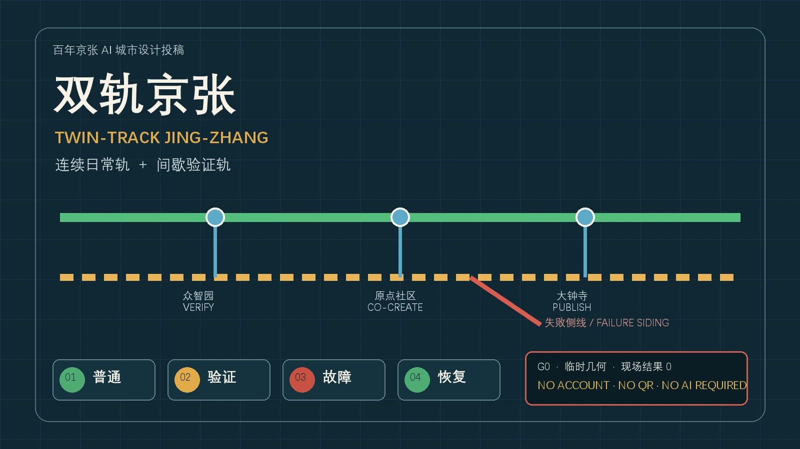
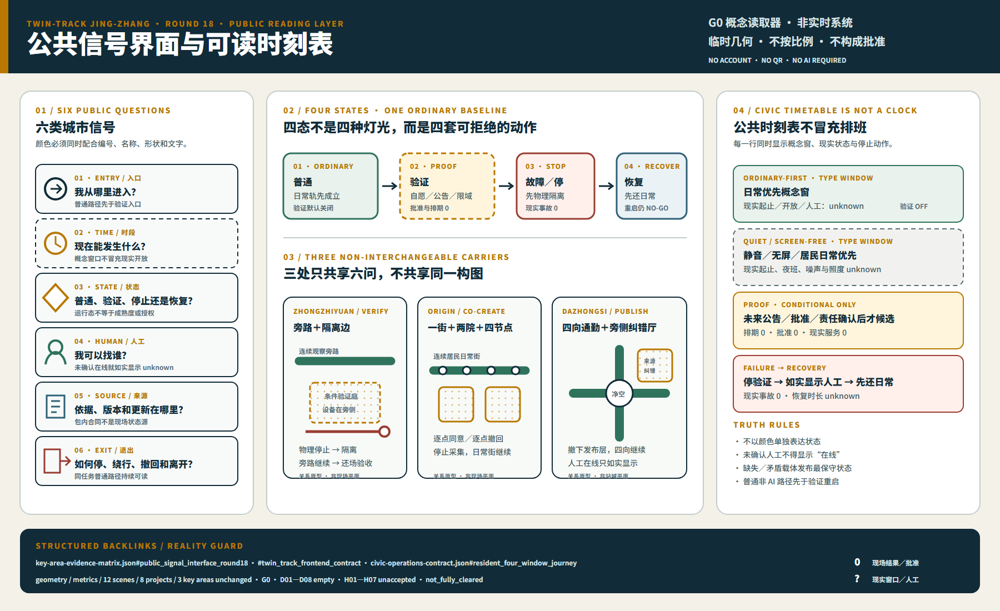
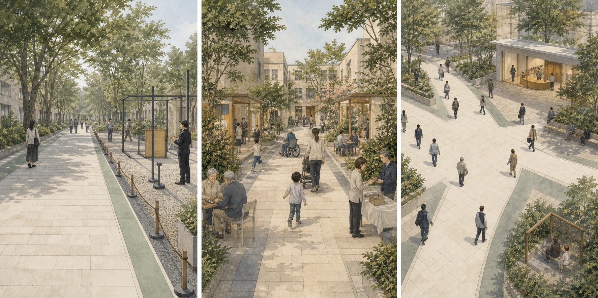
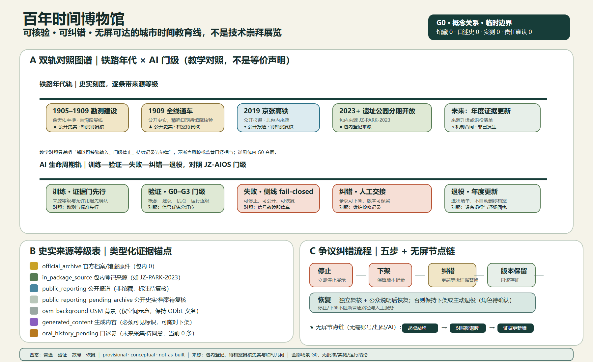
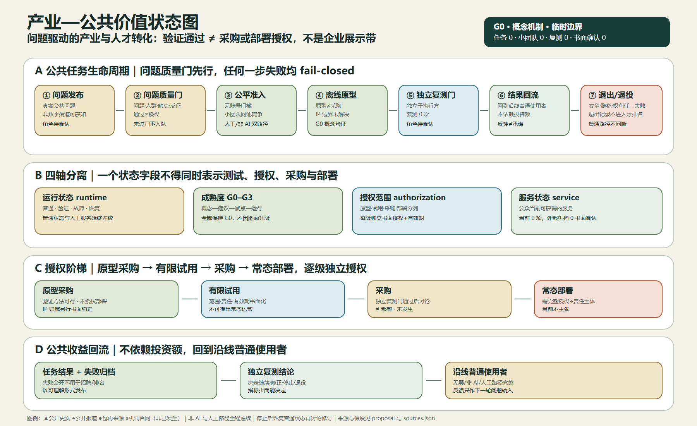
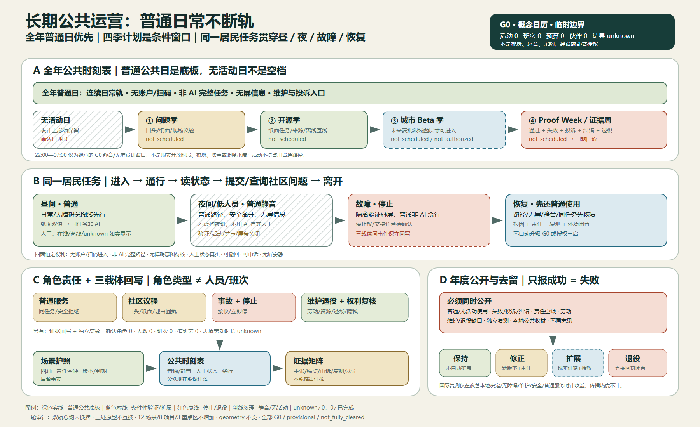
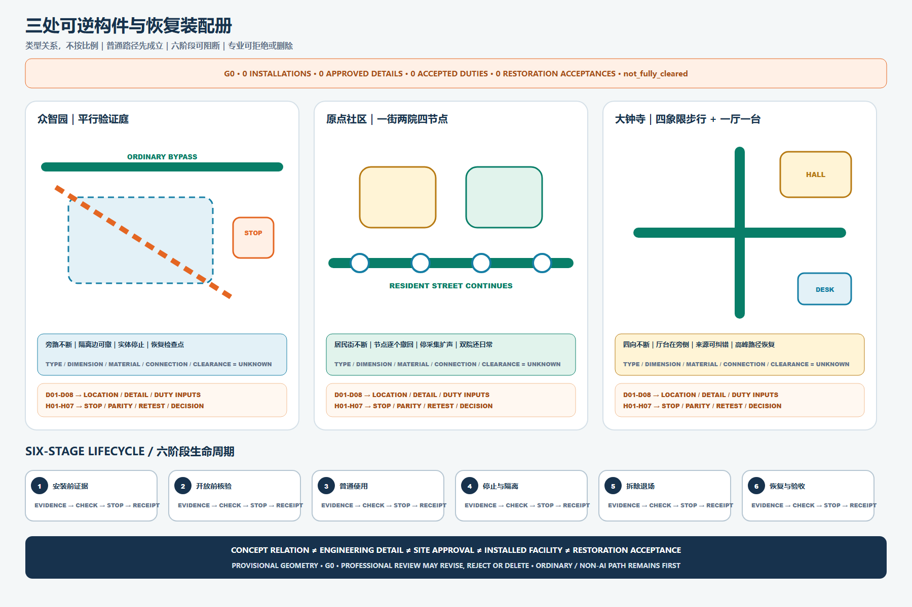
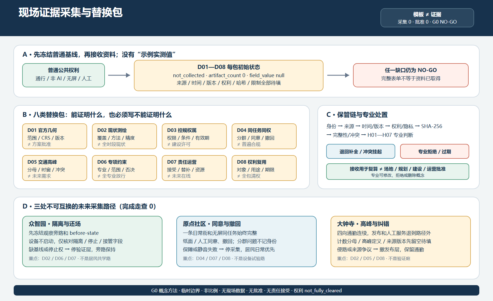

# 双轨京张

- 英文名称：TWIN-TRACK JING-ZHANG
- 核心系统：JZ-AIOS（Jing-Zhang Auditable Innovation Operating System，京张可验证场景操作系统）

> **一句话判断：** “双轨京张”以连续日常轨保证任何人不注册、不扫码、不使用 AI 也能完成完整普通任务，只把间歇验证轨作为自愿、公告、限域、可停止、可拆除的旁侧验证叠层。众智园、原点社区和大钟寺是三座不可互换的换轨场；全案仍为 G0 概念并基于临时几何，不构成现场条件、批准或运行的证据。

> **四态结论：** 普通任务先成立；可选验证只在全部前置条件满足后出现；故障仅停止验证叠层，连续日常轨、完整非 AI 路径、人工交接、撤回与申诉继续；恢复先还普通使用，但不等于授权、重启或 G1。48 秒只是普通—验证—故障—恢复的展示节奏（每态 12 秒），不是现场故障恢复时长。

## 30 秒 / 3 分钟 / 15 分钟阅读入口

| 阅读时长 | 只回答什么 | 建议入口 | 必须停止的误读 |
|---|---|---|---|
| 30 秒 | 一个概念：日常轨连续、验证轨间歇；三个原型：众智园验证、原点共创、大钟寺发布与人工服务；一个边界：全案仍为 G0。 | 图 01 总图与上方一句话判断。 | 铁路语法不是 Logo；验证轨不是连续占地；图面清楚不等于场地准确。 |
| 3 分钟 | 三个真实性框、同一普通任务的非 AI 完整旅程、普通—验证—故障—恢复四态，以及 D01—D08 / H01—H07 为什么仍挡住现实升级。 | 图 02—05、三处换轨场和证据门。 | 关系图不是现状平面；机器 PASS 不是内容质量、专业责任或批准。 |
| 15 分钟 | 逐对象核查场景、项目、重点区、权利、维护、资源、失败、气候、长期运营、来源与重算触发。 | 后续证据与专业交接层。 | 后台合同不能反向制造现场数据；任何缺口都不得靠更漂亮的图绕过。 |

**包内导航与评审交接索引。** 本包全部 141 个路径的评审定位统一见 `visual/assets/review-handoff-index.json`：七条阅读路线（30 秒／3 分钟／15 分钟、五步可访问漫游、全部 21 个章节阅读单元、D01—D08/H01—H07 交接、八问冷读）与逐文件登记（现行／历史快照／机器输入／冻结／临时五类状态、语言对、轮次来源与权利回链）。`round15-baseline.json` 是历史快照而非现行状态，`t02-g0-g1-replay-fixtures.json` 是合成回放机器输入，两者均不得被误读为当前证据。索引只负责定位，不生成新证据、不改变成熟度或权利状态 [data:visual/assets/review-handoff-index.json]。

图 01 刻意把三层分开：**A 背景定位**只把公开报道转成现场问题，不是测绘或竣工图；**B 临时设计容器**只用于概念组织和 intake 自检，不是官方红线；**C 设计关系**只表达任务接力、旁侧验证、人工交接、停止与还场，不表示坐标、距离或批准顺序。三层不得叠合成一张“看似真实”的场地图。既有 OSM 背景核查所记录的 0% 相交和约 412.5 米间距仍是未裁决的背景差异；`PROV-KEY-003` 仍未与大钟寺站、道路、地块或建筑锚定。geometry 因此保持原位，只把重算触发写清 [data:visual/assets/site-grounding-register.json#JZ-SITE-READING-R17] [assumption:A-SITE-READING-020]。

方案保留 12 个既有机器可读场景、8 个项目和 3 个重点区；页首 `scenarios` 仅使用仓库现行 6 个场景登记族作为检索元数据，不删除、不重编号也不升级任何 `SCENE-*` 对象。中英文正文、结构化证据、图件和离线入口共同表达同一结论：**文档完整既不能证明现场成熟，也不能构成批准。** [assumption:A-JURY-CONVERGENCE-019] [assumption:A-SITE-READING-020]

## 设计依据与资料清单

设计依据从当前场地事实边界出发：公开资料报告公园已开放，但本包没有官方红线、竣工测绘、完成的现场走查或获批试点；因此先判断既有日常如何不被打断，再判断可逆验证是否有净增益。既有 12 个场景、8 个项目、三处重点区和治理合同构成完整的可审计对象集；额外清单不能制造新证据 [depth:existing_conditions_diagnosis]。

### 2026 年 8 月 6 日之后的现实起点

公开报道显示，京张铁路遗址公园二期已于 2026 年 8 月 6 日开放，南段社区活力区和北段自然休闲区已形成约 9 公里的连续绿色廊道，并报告了社区连通、全龄活动、慢行与海绵设施等既有成果 [source:HAIDIAN-JZ-PHASE2-OPEN-2026]。这改变了方案的基本判断：JZ-AIOS 不再把“建成一条连续公园”当作自身成果，而只在既有公园之上提出可逆、低占用、可退出的公共服务与验证增量。下表是桌面研究形成的设计起点，不是现场踏勘、竣工图核验或法定红线确认；位置、运行状态和人群使用仍须逐项复核 [data:visual/assets/site-grounding-register.json#SG-001] [assumption:A-SITE-LOCATION-008]。

| 公开基线 | 本方案的设计增量 | 待现场核验 |
|---|---|---|
| 二期已开放；南段已报告服务周边社区并打开横向联系 | 六个空间接口降级为审计/服务界面类型，优先复用既有入口、人工服务和慢行节点，不预设新建地标 | 每个接口的准确位置、无障碍连续性、高峰绕行、产权与运维边界 |
| 北段已报告形成鱼骨慢行联系、滨水与公园网络 | 只叠加可暂停的场景护照、离线导视和公共复测接口，不重复建设基础绿道 | 步行、骑行、跑步冲突，夜间照明，雨洪与铁路安全条件 |
| 全龄活动、遗产再利用和海绵设施已被公开报道 | AI 必须证明对既有日常生活的净增益，不以设备数量、屏幕或活动流量替代公共价值 | 开园后 30 日使用观察、不同人群任务成功、噪声、投诉与维护负担 |

#### 已建公园增量协议 / Built-Park Delta Protocol（INNOV-006）

任何 G1/G2 试点须先完成“非 AI 现状基线—AI 增量假设—最小占地与时段—停止与恢复—独立复测”的同页记录。AI 必须证明相对人工、纸质、实体导视或既有服务的增量价值；不得造成无障碍公共空间或静音时段的净损失。若不能证明增量、恢复后不能回到不低于基线的状态，或独立复测失败，试点退回 G0 或退出。当前开园后 30 日现场审计完成数为 0，协议完整只代表设计字段覆盖，不代表现场有效 [data:visual/assets/innovation-register.json#INNOV-006] [assumption:A-POST-OPENING-007] [metric:completed_post_opening_field_audit_count]。

#### G1 预注册：先写失败条件，再申请现场

`visual/assets/g1-preregistration-register.json` 将 12 个现有场景逐一转成“可执行但尚未执行”的首测合同：测试前必须锁定非 AI 对照任务、唯一主指标及分母、受影响人群、采样框、时间窗、禁止伤害条件、停止与恢复、独立复测输入和版本。12/12 只表示必填字段已覆盖；已完成预注册、获批 G1 窗口、现场执行和已知结果仍全部为 **0**，因此任何场景都不能据此从 G0 升级 [data:visual/assets/g1-preregistration-register.json#G1-PREREG-001] [metric:g1_preregistration_required_field_coverage_ratio] [metric:completed_g1_preregistration_count]。

**评审路径（概念协议，不是审批或结果）**：已建公园基线 → 公共问题 → 同任务非 AI 对照 → G1 影子测试 → 停止/恢复 → 独立复测 → 升级或退出。所有节点当前仍为 G0；此路径不构成审批、现场执行或现场结果。

| 首批最小测试包 | 同任务非 AI 对照 | 唯一主指标 | 不得协商的停止条件 | 当前状态 |
|---|---|---|---|---|
| T-03 / SCENE-009 无障碍路径 | 同起终点的人工服务、纸质或实体导视 | 各共同测试人群的任务成功数 / 已同意任务数 | 出现关键障碍、过期路径状态或非 AI 路径不可用即停止并恢复 | 阈值待现场预注册；未执行 |
| T-02 / SCENE-011 企业服务 | 同一冻结问题集的人工窗口或可追溯静态指南 | 有来源且边界正确的回答数 / 冻结问题数 | 输出无来源结论、泄露禁采数据或人工接管不可用即停止 | 合成决策回放 10/10 精确匹配；现实阈值、责任主体、场地与服务均未执行；G0 |
| T-01 / SCENE-001 低速配送 | 相同任务的人工配送或静态路线 | 无碰撞、无越界且可急停的任务数 / 获批受控任务数 | 任一碰撞、越界、实体急停失败或接管链断裂即停止 | 安全红线固定；效率阈值待预注册；未执行 |

### 创新不是口号：可证伪登记表

可证伪登记补上一个仍然存在的缺口：方案已经提出验证线、四门制、可逆公共空间和失败公开，但“看起来新”仍不能证明“创新成立”。`visual/assets/innovation-register.json` 把六项核心创新逐一绑定到基线不足、新颖性主张、可证伪假设、最小证据、通过标准、失败信号和退出动作，其中 INNOV-006 专门检验方案对已开放公园是否产生可证明、可恢复的净增量；缺少失败信号或退出动作的主张不得登记为正式创新，尚未发生的运营结果继续保持 `unknown` [data:visual/assets/innovation-register.json#INNOV-001] [data:visual/assets/innovation-register.json#INNOV-006]。这使评审者不仅能问“新在哪里”，还可以直接判断“什么证据会证明它没有成立”。

依据分为四级，各级只承担与其权威程度相称的作用：

- 第一级是征集公告、智能体任务书和项目场地包，用于确认任务与提交边界 [source:DATA-SRC-OFFICIAL-ANNOUNCEMENT-20260509] [source:AGENT-TASKBOOK] [source:SITE-PACKAGE]。

- 第二级是仓库资料登记、标准索引和处理导航，用于定位证据及其用途限制 [source:SOURCE-REGISTRY] [source:PROCESSED-FACT-PACK]。

- 第三级是北京市关于原点社区、百年京张实景测试和“一核多点”创新街区的公开背景，只用于判断协同方向，不代表项目已批准或任何机构承诺参与 [source:BEIJING-AI-ORIGIN-2026] [source:BEIJING-AI-DISTRICTS-2026]。

- 第四级是国家数据、AI 内容标识和“人工智能+”政策，与六个全球案例一起用于机制启发和治理边界 [source:NATIONAL-DATA-INFRA-2025] [source:AI-CONTENT-LABEL-2025] [source:AI-PLUS-2025]。

### 证据不是一次性快照：失效必须向下游传播

`sources.json` 已记录 50 条来源及访问日期，但同一天访问不等于内容永久有效，也不能发现修订、替代、失联或临时边界被正式资料取代。`visual/assets/evidence-freshness-policy.json` 把来源分成项目资料、临时空间数据、城市背景、政策标准、案例参考和包内概念/方法材料六类，规定复核触发点、建议最长未核时间、责任角色和失效动作；来源变为 `review_due`、`superseded` 或 `unavailable` 时，受影响主张、矩阵项和场景门级必须同步降级或冻结。第 21 轮首次执行该机制：50 条来源逐条复核，48 条为 `verified_current`（包内/仓库内路径 SHA-256 或 HTTP 重取摘要），2 条为 `review_due`（CASE-22AT 证书校验失败、CASE-KINGS-CROSS 返回 403，均按访问未确认冻结升级、不删除陈述），逐条记录与摘要见 `refresh_records` [data:visual/assets/evidence-freshness-policy.json#refresh_records]。完成刷新审计数为 48，`review_due` 来源在下一门级推进前必须由责任角色重新复核，临时空间数据无论多新也仍然只是 `provisional_only` [data:visual/assets/evidence-freshness-policy.json#FRESH-01] [data:visual/assets/evidence-freshness-policy.json#FRESH-02] [data:visual/assets/evidence-freshness-policy.json#FRESH-06]。

专业响应按问题拆分，而不是把标准编号堆在一个结论后：

- 项目任务与智能体任务由征集公告和任务书约束 [standard:PROJECT-OFFICIAL-ANNOUNCEMENT] [standard:PROJECT-AGENT-OPEN-CALL-TASKBOOK]。

- 城市设计范围与控规程序边界分别由两项住建领域材料约束 [standard:MOHURD-URBAN-DESIGN-MEASURES] [standard:MOHURD-CONTROL-DETAILED-PLANNING]。

- 用地术语和建筑设计深度缺口分别登记，不把缺口记录冒充已核条文 [standard:MNR-LAND-USE-CLASSIFICATION-GUIDE] [standard:MOHURD-ARCH-DESIGN-DEPTH-2016]。

当前精确红线、现状建筑、权属、控规指标、市政、交通工程与文保控制仍未取得。`geometry/site_boundary.geojson` 和三处重点区继续使用仓库临时替代范围，只能支撑概念复核 [data:geometry/site_boundary.geojson#SITE-001] [source:DATA-SRC-PROVISIONAL-BOUNDARIES-20260605]。它们不得用于审批、征地、精确面积或工程实施，边界与控制条件假设保持显式 [assumption:A-BOUNDARY-001] [assumption:A-CONTROLS-001]。

主线最新边界依据还记录了一次独立背景核查：OSM 已测绘公园要素与 `PROV-SITE-001` 的相交覆盖率为 0%，最近距离约 412.5 米。该读数既可能受 OSM 不完整影响，也可能反映临时推定范围的偏差，**不能据此判定哪一方正确，更不能反向修改或升级成官方边界**；本方案因此保持临时几何不变，把正式 polygon、坐标系和版本核验列为全量重算的触发条件 [source:PROVISIONAL-BOUNDARY-BASIS]。

## 三层范围工作框架

三层范围采用不同问题、不同精度、同一证据链。约 43.6 平方公里统筹研究范围回答产业、科研、城市问题和外部创新节点怎样协同；约 11.4 平方公里总体设计范围回答百年京张怎样组织公共空间、慢行、功能与场景；三处临时重点区回答“共创—验证—发布”三种状态站怎样形成街坊、建筑、公共界面和运行门。面积只表达任务层级，不能反推法定边界 [metric:site_area_sqm] [metric:key_area_total_sqm] [depth:three_level_scope_framework]。

### 双轨京张：公共空间运行框架 / Twin-Track Jing-Zhang

**核心概念。** 双轨京张以五个空间要素组织公众可见的设计：**连续日常轨 / Continuous Civic Track**、**间歇验证轨 / Intermittent Proof Track**、**三座换轨场 / Three Switchyards**、**失败侧线 / Failure Siding** 和 **公共时刻表 / Civic Timetable**。日常轨是连续、开放、可独立完成普通任务的公共生活基线；验证轨是自愿、公告、有责任人、有时段和可拆除的间歇叠层，绝不画成连续占地或已建设施。JZ-AIOS、G0—G3、证据门和权利边界继续作为可追溯的治理内核 [data:visual/assets/key-area-evidence-matrix.json#twin_track_frontend_contract] [data:visual/assets/non-ai-parity-contract.json]。

**总体空间解释。** 三座换轨场采用不同角色而不是复制同一类 AI 园区：原点社区把公共问题接入共创、共学和评议；众智园把问题转为离线、低风险、可停止的验证；大钟寺把通过、失败和修正变成公共发布与人工服务。三者的顺序是可读的任务接力，不是对临时几何的重新排序或新的选址承诺。连续日常轨贯穿入口、步行、通勤、休憩、办事和离开；验证轨只在换轨场之间以短段出现。每个换轨场旁都保留人工站房、无屏节点和非 AI 完整路径；失败侧线负责停止、人工解释、绕行、申诉和恢复，不让一次故障阻断普通生活。

**六类城市信号与公共时刻表。** 入口、时段、状态、人工、来源、退出六类信号使用实体导视、纸面信息、口头说明、触觉/无障碍标识和可读版本共同表达。公共时刻表只定义“日常优先窗—静音/无屏窗—条件验证窗—停止/恢复窗”四种时段类型；真实起止时间、人工班次、批准和公告窗口均为 `unknown` 或 0，须由未来责任主体确认并满足现场条件。验证轨只能在公告、批准且责任人到位的限域时段出现；任意时段触发停止条件都进入“停止—人工接管—失败侧线—恢复日常”。公众无需注册、扫码或使用 AI，即可进入、询问、完成基本任务、离开或申诉 [data:visual/assets/key-area-evidence-matrix.json#twin_track_frontend_contract] [data:geometry/public_space.geojson#PUBLIC-004] [data:geometry/public_space.geojson#PUBLIC-009]。

| 可读使用旅程 | 普通状态 | 进入验证 | 故障与恢复 |
|---|---|---|---|
| 1. 进入 | 从既有入口进入连续日常轨，步行、通勤、休憩或办事 | 不需要技术账户或设备 | 任何人可停下找人工、绕行或离开 |
| 2. 判断 | 看入口、时段、状态、人工、来源、退出六类信号 | 只有自愿且公告的窗口可通过换轨场进入验证轨 | 停止信号把验证叠层隔离，不把故障变成日常阻断 |
| 3. 完成任务 | 纸面、口头、实体导视和人工路径可独立完成同一基本任务 | 验证轨仍保留日常轨和非 AI 对照 | 修正来源、责任交接和独立复测未完成前保持 G0/退出 |

#### 公共信号界面：六问 × 四态 × 三载体

公共信号界面把六类信号落实成 12 行可审阅合同，而不是新品牌：众智园使用“连续观察绕行 + 隔离验证边”，原点社区使用“一条日常街 + 两院 + 四个可分别撤回节点”，大钟寺使用“四向连续通勤 + 路外一厅一台”。每一载体都回答同样六问，但入口组织、停止范围和恢复对象不同，不能机械复制。颜色只作辅助，编号、文字、线型和静态表共同传达状态 [data:visual/assets/key-area-evidence-matrix.json#public_signal_interface_round18]。

公众先找到不依赖 AI 的普通入口与退出，再读时段、状态、人工和来源；只有自愿且全部前置条件满足时才进入旁侧验证。故障时先物理停止验证叠层，再显示人工接管、非 AI 绕行与申诉；恢复时先还原普通路径，缺少还场材料、维护关闭、居民确认或独立复核中的任何一项，均保持 NO-GO、关闭或退役。离线 visual 的选择器只读取同页静态表；禁用 JavaScript 后 12 行仍完整可读，且没有网络请求、账户、二维码、表单、跟踪器或 AI 依赖。当前人工在线、已确认时段、现场测试、批准、GO 和现实恢复均为 0，所有现场依赖参数保持 `unknown` [data:visual/assets/site-grounding-register.json#public_signal_interface_round18] [data:visual/assets/civic-operations-contract.json] [source:SOURCE-JZ-CIVIC-OPERATIONS-G0-V1]。

**双轨典型剖面与四态。** 总图在页首只负责三框场地读取；三处差异化关系剖面由后文 `key-area-sections` 图承担。剖面按“人工站房—无屏节点—连续日常空间—间歇验证叠层—恢复边”读图。四态是：①普通：日常轨开放、验证设备关闭；②验证：自愿进入公告时段，验证叠层限域且不占用日常通行；③故障：自动化停机，进入失败侧线并由人工接管；④恢复：完成纠错与独立复测后还原普通状态，否则保持 G0 或退出。图面只表达关系，不表达连续建设、准确位置、批准、运行结果或专业工程剖面 [data:visual/assets/key-area-evidence-matrix.json#twin_track_frontend_contract] [assumption:A-KEY-AREA-DETAIL-010]。

### 唯一核心机制

百年京张不是一条摆放 AI 产品的科技走廊，而是一条把城市问题转化为**可共创、可验证、可暂停、可复现、可向社会交付**的 AI 公共创新生产线。公众沿线完成“认知历史—提出问题—参与共测—看见失败—贡献留名”的知识旅程，但前台空间判断始终只有“双轨京张”：连续日常轨优先，间歇验证轨旁侧出现。英文叙事中的 **Proof** 同时指空间实证、技术验证和公共价值证明 [assumption:A-GOVERNANCE-001]。

总体结构从“一脊三锚六接口多点”升级为“一条验证线、三座状态站、两条供给翼、六个城市接口”。三座状态站不是三种同质园区：北京 AI 原点社区负责共创和公共评议，众智园负责技术、安全与治理验证，大钟寺负责公共发布、城市服务和成果转化；小月河场景赋能翼输入真实问题与体验反馈，中关村科技服务翼提供建议性的知识产权、合规、人才、资本和转化支撑。任何外部机构角色都是规划建议，不代表合作已经达成 [assumption:A-EXTERNAL-COLLAB-005] [depth:overall_spatial_structure]。

### 任务书定位与五大功能的可读映射

以下映射把任务书原词直接转成方案中的空间和运行机制，避免只在合规矩阵里形式勾选；它仍是供专业团队深化的概念响应，不产生法定功能、项目授权或机构承诺 [source:AGENT-TASKBOOK] [standard:PROJECT-AGENT-OPEN-CALL-TASKBOOK]。

| 任务书定位 / 功能 | 本方案的直接响应 | 不得越过的边界 |
|---|---|---|
| 百年京张文化带 | 铁路工程史—中关村创新史—AI 纠错史双螺旋，三处知识旅程地标 | 史实、文物、名称与载体待官方/馆藏和权利复核 |
| 都市 AI 生活体验带 | 六接口、九处日常优先公共节点、非 AI 等价与静音无屏模式 | 不把字段覆盖写成已开放服务或公众体验成绩 |
| AI 融合创新带 | “问题—共创—验证—发布/服务—转化—反馈”状态机和三区两翼 | 不虚构企业、伙伴、土地、资金或实施承诺 |
| AI 全栈自主创新体系 | 众智园承接离线、影子、限域申请、安全与独立复测门 | 不声称已有全栈平台、运营主体或获批测试场 |
| 世界级 AI 创新生态 | 原点社区共创接口、六个国际案例对照与两翼要素支持 | “世界级”是目标，不是排名、集聚度或合作事实 |
| AI+ 场景赋能新范式 | 12 个场景护照、三项先行测试协议和 G0—G3 不跨级门 | 当前全部 G0，批准、参与者、执行和结果均为 0 |
| 智能化 AI 活力城市 | 日常/学习/Beta/静音/离线五模式与人工服务并置 | 不以大屏、监控、活动热度或强制账户代表活力 |
| AI 治理全球话语权 | 来源可追溯、失败公开、暂停申诉、到期退役与复测包 | 只提出可讨论方法，不宣称形成国际规则或政府制度 |

空间接口按南北概念顺序定义为：I01 大钟寺传播接口、I02 城市服务接口、I03 小月河体验接口、I04 高校共创接口、I05 众智验证接口、I06 清河生态校准接口；对应 `geometry/public_space.geojson` 的 `PUBLIC-004`—`PUBLIC-009`。面向人类的空间叙事只使用 I01—I06；G0—G3 只表示场景成熟度。既有 GeoJSON 的 `GATE-01`—`GATE-06` 是保留的机器兼容标识，不是空间阶段或人类编号。六个接口均是待现场复核的审计/服务类型，不是已选址的新建地标；每类接口要求同时核对公共空间、横向慢行、海绵缝合、非 AI 通道、静音时段和场景接力，并优先复用已建入口与服务设施 [data:geometry/public_space.geojson#PUBLIC-004] [data:visual/assets/site-grounding-register.json#SG-003] [metric:gateway_count]。

Logo 方向采用两条不闭合轨线构成字母 **JZ**，中间的开放缺口形成“人工可介入的校验口”，六个短刻度对应六个空间接口。Logo 只使用几何线段和项目自有字标，不调用企业商标、人物肖像或受限字体。整体视觉为铁轨银、海淀蓝、开源绿、校验橙、钟声金；文化导视另用“里程—年份—来源”三行语法，避免把文化标识与整体 Logo 混为一套。

## 统筹研究范围产业与未来城市研究

### 三锚两翼产业状态机

产业不是按企业名单划地，而按任务状态配置空间和要素。小月河翼汇集居民、城市服务者和公共部门愿意公开的问题；原点社区把问题转为开源任务、用户旅程和对照基线；众智园在离线、影子和限域环境中完成模型、机器人、安全、伦理与互操作验证；大钟寺把通过的成果转成公众可理解的城市服务、企业服务和国际交流；中关村科技服务翼在每一环提供建议性的合规、知识产权、人才、算力和转化支持；投诉、事故、失败和公共价值结果回流下一年度。北京市公开资料提出以原点社区、北纬社区和百年京张开放城市治理与民生服务实景测试场景，为“验证带”而非普通展示带提供了现实接口，但本方案不把公开方向写成项目授权 [source:BEIJING-AI-ORIGIN-2026]。

八类要素采用“公共底座 + 有条件接入”：土地只提供可逆使用接口；空间提供共享实验室、公共客厅和限域测试面；产业由问题牵引而非供应商牵引；资金只提出多方评审和里程碑拨付机制，不编造额度；人才通过开发者、居民和专业人员共同测试；算力优先使用可审计的共享环境；数据遵循最小必要、源端保留和受控计算；场景必须持有护照并到期失效。国家数据基础设施指引对可信数据空间的共识规则、可信管控和可审计生命周期提供政策背景，但不等于本项目的数据系统已经获批 [source:NATIONAL-DATA-INFRA-2025]。

### 六个案例的“机制—本地动作—验证—禁区”

| 案例 | 可迁移机制 | 京张本地动作 | 建议验证 | 不可直接迁移 |
|---|---|---|---|---|
| Kendall Square | 科研、企业、住房和公共空间共同组织 | 原点社区的共创街与生活服务并置 | 跨机构共创和居民使用是否同时发生 | 土地制度、租金与企业密度 [source:CASE-KENDALL] |
| one-north | 分主题片区由共享设施和步行网络连接 | 三座状态站共用护照和复测包 | 跨站接力是否保留同一证据版本 | 开发制度和园区管理权 [source:CASE-ONE-NORTH] |
| Barcelona 22@ | 产业升级与街区更新、知识转移并行 | 六个空间接口优先修补日常公共界面 | 公共利益交付是否先于规模扩展 | 用地政策和财政工具 [source:CASE-22AT] |
| King’s Cross | 遗产再利用、无车公共空间与混合功能 | 铁路工程史与当代公共生活同线呈现 | 居民是否在非活动日持续使用 | 产权、保护等级和商业模型 [source:CASE-KINGS-CROSS] |
| STATION F | 实体空间依靠项目、导师和伙伴网络运营 | 四季运营协议与问题到 Proof 的漏斗 | 问题到限域原型的周期 | 单一大型园区和私人运营条件 [source:CASE-STATION-F] |
| MaRS | 实验室、办公、活动和社群服务耦合 | 大钟寺把发布、合规咨询和人工服务并置 | 人工转接和后续服务成功率 | 医疗、投资与机构体系 [source:CASE-MARS] |

区域协同采用“测试接力”而非泛泛结盟。建议由未来科学城承接基础科学或前沿装备复测、怀柔科学城承接科学设施相关验证、经开区承接制造和具身系统工程复测、其他首批创新街区承接其擅长的文化或产业场景，京津冀节点承接跨区域可复制性检查；每次接力只传递任务、协议、匿名结果和失败记录，不要求传递原始敏感数据。公开的“一核多点”格局只说明这种分工有讨论基础，不代表任何节点已同意参与 [source:BEIJING-AI-DISTRICTS-2026]。

## 总体设计范围城市更新与控规深度城市设计

总体范围以已开放公园的南北绿廊、已报告横向联系和全龄公共活动为公开基线，而非待本方案从零建设的对象 [source:HAIDIAN-JZ-PHASE2-OPEN-2026]。在此之上才组织“轨旁历史阅读层—既有慢行与蓝绿层—可逆创新服务层”三层剖面：铁路侧只建议低干预阅读，中部先保护日常步行、骑行和停留，街区侧以六类界面审计断点并叠加小尺度服务。任何跨铁路、跨河、跨城市道路、桥隧或地下空间动作都只是待核问题和设计方向，必须另行开展现场、交通、防洪、铁路安全和工程论证。

用地从 12 个大色块深化为 36 个不规则、拓扑闭合的概念单元，覆盖科研、教育、居住、社区服务、商业服务、文化、绿地、广场和弹性留白九类项目枚举。单元数量和类别可由 GeoJSON 复算 [metric:land_use_unit_count] [metric:land_use_category_count]；它们表达空间—产业功能包络，不是法定地块或已批用途 [data:geometry/land_use.geojson#LU-001] [depth:land_use_layout]。

六条横向接口线与南北主线形成“鱼骨式”可达网络：每个接口都将慢行、公共空间、雨洪缝合与一个可测试的城市问题绑定。九处公共空间不是把公园变成全天候试验场，而采用可逆时空规则：日常生活为默认，公共学习按预约，限域 Beta 仅在批准时段，22:00—07:00 进入静音，任何人始终可以选择非 AI 通道。设计的创新不在“城市适应 AI”，而在“AI 必须适应城市日常生活”。

建筑图层用体量原型表达优先干预容量，不模拟完整现状城市。每个原型标注保留评估、适应性改造候选或新建候选，但在测绘、权属、结构、文保和控规证据缺失时不得转成拆除或建设结论。容积率、总建筑面积、建筑高度、道路红线、停车和市政容量继续保持 `unknown` [assumption:A-SPATIAL-REPRESENTATION-002] [depth:development_intensity_controls] [depth:height_massing_character]。

## 重点区域详细设计

三处重点区使用同一套回答框架：场地矛盾、空间结构、核心项目、AI 场景、进入门与验收，并按重点区详细设计深度组织表达 [depth:three_key_area_detailed_design]。下述范围仍为临时替代，三处面积和体量覆盖只用于概念复核 [data:geometry/key_areas.geojson#PROV-KEY-001] [data:geometry/key_areas.geojson#PROV-KEY-002] [data:geometry/key_areas.geojson#PROV-KEY-003]。

### 重点区证据交叉矩阵

为避免“重点区—场景—验收”只在长文中隐含，`visual/assets/key-area-evidence-matrix.json` 将三处临时范围逐条交叉到状态站、公共锚点、I/GATE 接口、AI 服务区、场景节点和概念级验收包，并单列 G1 前必须取得的正式资料 [data:visual/assets/key-area-evidence-matrix.json] [metric:key_area_evidence_matrix_record_count]。矩阵字段覆盖率为 100% 只表示三条记录的交叉字段齐全，不表示现场覆盖、合作确认、审批、运行成绩或公共价值结果；三条记录的现场审计、责任主体确认、批准、测试执行和已知结果均为 0 [metric:key_area_evidence_matrix_field_coverage_ratio]。

| 临时重点区 | 状态站 / 概念空间响应 | 交叉的 AI 区与场景 | G1 前置证据 | 当前边界 |
| --- | --- | --- | --- | --- |
| `PROV-KEY-001` 众智园 | VERIFY；一园、一栈、两界面 | `AI-ZONE-001`；`SCENE-001`—`004` | 法定/业主场地、安全与急停、责任角色、非 AI 基线、独立复测包 | 临时范围、未获批、未测试 |
| `PROV-KEY-002` 原点社区 | CO-CREATE；一街、两院、四节点 | `AI-ZONE-002`；`SCENE-005`—`008` | 场地与保障、权利与同意、非技术参与、撤回机制、独立复测包 | 临时范围、无合作承诺、未测试 |
| `PROV-KEY-003` 大钟寺 | PUBLISH；四象限步行 + 一厅一台 | `AI-ZONE-003`；`SCENE-009`—`012` | 路线/服务权属、人工窗口、来源维护、同任务对照、独立复测包 | 临时范围、无批准服务点、未测试 |

剖面不再把三处画成同一种园区模板：众智园以“公众观察边—低风险测试花园环—验证栈/维护边”分开公众日常与设备测试；原点社区以“连续日常街—问题共创院—公共评议院—四个可撤节点”保护居民通行和退出；大钟寺以“四向步行—钟轨会客厅—人工服务台—静音休憩”让发布活动服从通勤、无屏休憩和人工办事。每处都只使用普通—验证—故障—恢复一套权威运行四态，形成 3 组差异化剖面、共 12 个 G0 概念状态；当前验证态仅指预约、限域且不主张现场绩效的 G0 活动，未来任何获批限域共测仍是进入验证态前的成熟度门，不另算第五态。图与矩阵共同记录谁先让位、故障如何隔离、如何还场以及何时不得重启 [data:visual/assets/key-area-evidence-matrix.json] [metric:key_area_reversible_mode_count]。

这份矩阵只增加可复核的设计映射，不把接口标识变成已选址地标，也不把公开桌面资料变成现状测绘、控规、权属或机构承诺 [data:visual/assets/key-area-evidence-matrix.json]。

### 三种空间原型的共同读法

两组图分工明确：`key-areas` 先画每处的**普通状态平面**，再叠加首层公共界面、人工交接、可拆构件和四步使用旅程；`key-area-sections` 把同一对象转成差异化关系剖面、普通—验证—故障—恢复四态和场所恢复验收。绿线是始终连续的非 AI / 无障碍意图线，蓝色虚线是可停止、可拆除的服务叠层，灰色虚线与原型体量只表示未知关系。图件不提供比例尺、准确落位、建筑现状或工程断面；其中无障碍连续性、净宽、坡度、转弯、触觉与休息条件都必须由测绘和共同测试补证 [assumption:A-KEY-AREA-SPATIAL-011]。

三处不可互换原型与共享保障共同构成当前设计：众智园采用平行验证庭与设备隔离；原点社区采用一街两院四节点与无屏撤回；大钟寺采用四象限步行与一厅一台。三处都保留连续非 AI / 无障碍路径、人工交接、可拆构件、夜间静音、四态切换、场所恢复验收和结构化证据回链。它们共享证据语法但不共享平面骨架，且均只使用现有 `PROV-KEY-001`—`003`、`AI-ZONE-001`—`003` 和 `SCENE-001`—`012` [data:visual/assets/key-area-evidence-matrix.json#round2_spatial_deepening]。

三个原型共同遵守 22:00—07:00 静音门：不得安排测试、扩声或活动优先权，普通路径、无屏信息与人工求助仍可用；这一时段是概念运行约束，确切场地开放条件仍待现场和运营主体确认。

### 众智园：验证站 / VERIFY

**普通任务。** 使用者先沿连续观察旁路通行、休憩、看实体状态或提出申诉；不注册、不扫码、不使用 AI，也不进入验证庭，就能完成普通任务并离开。旁路是必须保留的公共基线，不是设备故障后的临时绕行 [data:visual/assets/non-ai-parity-contract.json#place_service_contracts]。

**空间差异。** 众智园以“平行双带”回应设备验证风险：连续旁路与隔离验证庭并列，实体停止、设备维护和人工接管位于服务边；“一园、一栈、两界面”只承载 AI4S、安全治理和互操作的建议验证主题。设备隔离、实体停止和独立复测门不能复制成居民共创院或通勤发布厅 [data:visual/assets/key-area-evidence-matrix.json#KAE-001] [data:visual/assets/reversible-component-restoration-register.json#RCP-ZZY] [source:SOURCE-JZ-REVERSIBLE-REGISTER-R13]。

**可选验证。** 只有来源、责任角色、风险级和同任务非 AI 基线均经确认，实体急停回路闭合，且使用者读懂时段、状态和退出信号并自愿选择时，才可讨论旁侧、限域、离线验证。当前生态日常、预约验证、故障隔离和恢复均只是 G0 假设；未来获批限域共测只是前置证据门，不证明当前能力，不增加第五态，也不授权 G1 [data:geometry/constraints.geojson#AI-ZONE-001] [assumption:A-KEY-AREA-DETAIL-010]。

**人工交接。** 可见人工点负责解释、拒绝、接管、绕行和申诉，不把判断负担转给公众；若真实人员与停机责任尚未确认，界面必须如实显示不可用或待确认，而不能用角色类型冒充值守。当前责任接受与现场人员均为 0 [data:visual/assets/reversible-component-restoration-register.json#RCP-ZZY] [source:SOURCE-JZ-REVERSIBLE-FIGURE-R13]。

**故障与恢复。** 越界、碰撞、设备噪声、未经授权的数据处理、实体急停或人工接管失效时，只停止并物理隔离验证叠层，连续旁路继续。退场须撤除设备、围挡、线缆、固定和临时标识，先恢复旁路、地面、绿化、静音与人工说明，再由独立复测判断是否继续；恢复普通使用不等于重启授权或 G1，当前恢复验收为 `unknown / 未执行` [data:visual/assets/key-area-evidence-matrix.json#round2_spatial_deepening] [data:visual/assets/reversible-component-restoration-register.json#RCP-ZZY]。

**尚缺资料。** `PROV-KEY-001` 仍是临时概念范围；正式边界、准确场地、权属与容量、责任主体，以及铁路、消防、网络、数据、实体急停、无障碍、类型、尺寸、材料、连接、安装方式和恢复时长均待正式资料与专业判断。资料未闭合前不得推出准确落位、批准、平台伙伴、现场测试、安全结果或工程可行性 [data:geometry/key_areas.geojson#PROV-KEY-001] [assumption:A-KEY-AREA-DETAIL-010]。

### 北京 AI 原点社区：共创站 / CO-CREATE

**普通任务。** 居民先沿一条连续日常街通行、停留、看纸面信息、口头提问或直接离开；不注册、不扫码、不使用 AI，也不进入两院，就能完成基本学习、问询和退出。居民日常与无屏安静不是活动间隙，而是始终优先的普通基线 [data:visual/assets/non-ai-parity-contract.json#place_service_contracts]。

**空间差异。** “一街、两院、四节点”把问题院、评议院和四个可分别撤回的无屏节点放在日常街旁侧；活动工具、座椅、遮棚、标识、排队和采集不得侵入通行线。双院协商、逐点撤回、居民静音和未成年人保障只属于社区共创原型，不能改名复制为设备试验或高峰发布 [data:visual/assets/key-area-evidence-matrix.json#KAE-002] [data:visual/assets/reversible-component-restoration-register.json#RCP-ORIGIN]。

**可选验证。** 只有问题来自明确公共需求、纸面或人工说明完整、参与者单独自愿且可撤回、非技术路径可用且保障措施全部落实时，才可进入旁侧问题门诊或共学；推荐不得用于录用评价。当前社区日常、共学、故障撤回和恢复均为 G0；未来获批共创共测只是前置证据门，不证明社区、学校或场地方已经参与，也不授权 G1 [data:geometry/constraints.geojson#AI-ZONE-002] [assumption:A-KEY-AREA-DETAIL-010]。

**人工交接。** 纸面和口头交接位于日常街之外，人工负责说明、拒绝、处理撤回与纠错、落实保障并接收申诉；四个节点都允许退出，不要求回到数字界面。真实保障、责任角色、开放时段和人工能力未确认时，必须显示待确认，不能把志愿者或活动人员写成稳定责任主体 [data:visual/assets/non-ai-parity-contract.json#service_blueprint]。

**故障与恢复。** 撤回未兑现、保障缺口、显著群体差距、过度采集、扩声扰民或静音失效时，只停止受影响节点的匹配、采集与扩声，连续日常街和纸面/人工任务继续。节点故障退场只清除该节点的工具、屏幕、扩声、采集、临时固定和标识，完成同意与撤回记录的去向处置并恢复该节点；日常街与两院的普通使用始终持续，不作为该局部故障的“恢复对象”。只有项目整体退出时，才逐点撤除全部叠层并对两院和街道完成普通使用复核。恢复不等于重启授权或 G1，当前结果为 `unknown / 未执行` [data:visual/assets/key-area-evidence-matrix.json#round2_spatial_deepening] [data:visual/assets/reversible-component-restoration-register.json#RCP-ORIGIN]。

**尚缺资料。** 约 3 平方公里和“十分钟创新圈”仅为公开背景，不是本项目选址或合作证明。`PROV-KEY-002` 的准确场地、开放与静音时段、权属、学校/社区关系、保障与责任角色、内容权利、同意撤回、非技术参与、无障碍、材料尺寸和恢复时长均待正式资料与专业判断；不得推出伙伴承诺、居民同意、获批共测或学习成效 [source:HAIDIAN-AI-TRIAL-FIELD-2026] [data:geometry/key_areas.geojson#PROV-KEY-002] [assumption:A-KEY-AREA-DETAIL-010]。

### 大钟寺：发布站 / PUBLISH

**普通任务。** 通勤者先按实体导视沿四向连续路径通过、安静休息，或在真实确认开放时从双入口人工台完成同一基本任务；不注册、不扫码、不使用 AI，也不进入发布厅，就能通勤、问询、纠错、申诉和离开 [data:visual/assets/non-ai-parity-contract.json#place_service_contracts]。

**空间差异。** 大钟寺以“通勤十字 + 路外一厅一台”回应高流量条件：四条通勤臂和清空中心先成立，证据发布厅、双入口人工台、来源台账与静音休憩退到路径外。高峰连续、来源纠错和人工办事并置只属于发布原型，不能变成设备验证庭或居民双院 [data:visual/assets/key-area-evidence-matrix.json#KAE-003] [data:visual/assets/reversible-component-restoration-register.json#RCP-DZS]。

**可选验证。** 来源化导航和证据发布只可在未来公告、获准、有责任人的限域窗口旁侧出现，且不得形成排队、活动围挡或声光占路；通过、失败和修正都须可追溯。当前通勤休憩、预约发布、故障下线和来源恢复均为 G0；获批服务试用只是前置证据门，不证明当前服务，不增加第五态，也不授权 G1 [data:geometry/constraints.geojson#AI-ZONE-003] [assumption:A-KEY-AREA-DETAIL-010]。

**人工交接。** 双入口人工台承担同任务服务、来源说明、过期提示、纠错、投诉和安全拒绝，并与自动服务进入同一责任队列；真实人员、容量和时段未确认时只能显示待确认或不可用，不能用概念台位暗示已有窗口 [data:visual/assets/non-ai-parity-contract.json#service_blueprint]。

**故障与恢复。** 来源过期或冲突、诊断性输出、权利争议、人工转接失败、排队外溢或无障碍/高峰路径受阻时，只关闭路外发布厅与服务侧线中的自动化、屏幕、声光和队列，四向通勤与普通任务继续。恢复先检查四条普通通行臂，再撤除发布物料、纠正来源与版本链、关闭投诉交接并复测服务边；恢复不等于重启授权或 G1，当前现实恢复为 0 [data:visual/assets/key-area-evidence-matrix.json#round2_spatial_deepening] [data:visual/assets/reversible-component-restoration-register.json#RCP-DZS]。

**尚缺资料。** `PROV-KEY-003` 是按顺序和面积拟合的临时多边形，不证明与大钟寺站、铁路边界、道路、地块或建筑首层锚定。准确路线、场所与服务权属、现状障碍、无障碍与高峰条件、来源维护、人工容量，以及交通、铁路、消防、市政、类型尺寸材料和恢复时长均待正式资料与专业判断；不得推出服务点批准、部署、办事结果或现场绩效 [data:geometry/key_areas.geojson#PROV-KEY-003] [source:HAIDIAN-15FYP-2026] [assumption:A-KEY-AREA-DETAIL-010]。

三个朝圣地标被重新定义为同一知识旅程的三个章节：众智园“开源火种塔”记录可复验贡献，不展示个人排名；原点社区“算法里程碑”把京张工程史、中关村创新史与 AI 纠错史并排；大钟寺“钟轨会客厅”设置失败与修正档案。贡献者可选择实名、化名或匿名，荣誉只记录可验证的公共贡献，不与财富、流量、招聘或行政评价绑定。名称和形象均需完成版权、商标、肖像、史料和无障碍审查 [assumption:A-CULTURE-CONTENT-006]。

### 不能机械复制的组件与恢复门

#### 众智园 VERIFY

- **专属组件：** 平行验证庭、实体设备隔离带、维护/急停边、独立复测门。
- **普通基线：** 公众观察边、非 AI 通行与人工申诉必须保留。
- **恢复门：** 设备、围挡和线缆清零，表面、绿化与声光复核；当前状态 `unknown / 未执行`。

#### 原点社区 CO-CREATE

- **专属组件：** 一街两院的协商关系、四个撤回节点、无屏共学廊、居民静音门。
- **普通基线：** 居民穿行、无屏停留、纸面与人工退出必须保留。
- **恢复门：** 屏幕、扩声、采集与标识退出，同意撤回闭合；当前状态 `unknown / 未执行`。

#### 大钟寺 PUBLISH

- **专属组件：** 四向通勤十字、路径外证据会客厅、来源台账、人工办事并置。
- **普通基线：** 四向通过、静音休憩、实体导视与人工同任务服务必须保留。
- **恢复门：** 发布物料与声光退出，来源纠正、投诉交接和全量复测；当前状态 `unknown / 未执行`。

上述“恢复验收”是未来责任角色使用的概念检查表，不是场地批准、竣工验收或现状合格证明。三个原型共同要求可拆、可停、可绕行，但任何构件只有在准确场地、权属、消防、铁路保护、市政、无障碍和运营责任完成专业核验后才可落位 [assumption:A-KEY-AREA-SPATIAL-011] [data:visual/assets/key-area-evidence-matrix.json#round2_spatial_deepening]。

### 普通生活空间场景册：先看人怎样使用，再看系统怎样叠加

这张三联图不是给既有高密度系统图再加一层气氛，而是把同一条公共权利翻译成人尺度：**一个人先能走、能停、能问、能退出、能完成基本任务；AI 只在旁侧、可选、可停的叠层中出现。** 左幅众智园把普通旁路与平行验证庭分开；中幅原点社区让一条无屏居民街串联两院；右幅大钟寺把通勤主轴与安静人工服务放在活动旁侧。三幅均不要求账户、扫码、屏幕、网络或 AI，也不把验证、桌椅、平台、排队或线缆放进连续日常路径 [data:visual/assets/ordinary-life-media-register.json] [source:SOURCE-JZ-ORDINARY-LIFE-MEDIA-REGISTER-R12] [data:visual/assets/non-ai-parity-contract.json]。

[阅读中英文长描述、生成方法与权利限制](assets/media/ordinary-life-scenes.md)。图像由 OpenAI 图像生成工具于 2026-08-13 依据本包自编提示生成，未输入现场照片、地图截图、私人图像、可识别人物、Logo 或第三方视觉。选定输出只转换为 WebP，检查时不含 EXIF/GPS；人物均为不可识别的合成角色。该披露不构成模型输出条款审计或再利用许可，权利状态继续为 `not_fully_cleared` [source:SOURCE-ORDINARY-LIFE-MEDIA-R12]。

**普通—验证—故障—恢复。** 普通态先保持实体导向、连续无障碍意图、无屏停留和人工说明；验证态只允许未来经公布、获准、限时且有人负责的路径外可拆叠层，图中并不证明这些条件已经成立；故障态立即停止叠层、隔离设备、人工解释并保留绕行；恢复态先撤除叠层并恢复地面、绿化、静音与通行，独立复核未确认恢复合格时就保持 G0、继续停止或退役。三处共用这一顺序，但分别通过设备隔离、同意撤回和来源纠错实现，不能机械复制 [data:visual/assets/ordinary-life-media-register.json#four_state_reading] [source:SOURCE-ORDINARY-LIFE-PROPOSAL-R12] [data:visual/assets/key-area-evidence-matrix.json#round2_spatial_deepening]。

**图中能看见的权利，不等于现场已经具备。** 轮椅、老人、儿童、照护者和通勤者的出现只用于检验空间关系是否易懂，不代表真实参与、同意或调研样本；触觉导向、无台阶连续、净宽、坡度、转弯、休息、消防、铁路保护、市政和人工服务能力仍需测绘、共测和专业责任确认。当前真实照片、确认视点、现场观察、获批构件、运营交互、无障碍结果和恢复结果均为 0；图像不能推出位置、比例、尺寸、材料、班次、建设、运行或审批结论 [assumption:A-KEY-AREA-SPATIAL-011] [data:visual/assets/implementation-handoff-matrix.json]。

## AI 创新生态、人才画像与 AI+ 场景

### 七类共测画像

海淀最新公开要求聚焦顶尖科研人才、青年创新创业者和常住居民三类主要人群；本方案不另造一套画像，而将其映射到既有七类：顶尖科研人才主要对应开源开发者与高校师生，青年创新创业者对应创业团队并与企业服务团队相接，常住居民对应周边居民、老年人与行动不便者，同时保留游客与国际来访者作为传播和可读性校验者。三类政策人群是需求优先级，七类画像是共同测试与风险分解工具，两者都不代表已取得样本或完成调研 [source:HAIDIAN-JZ-MIDTERM-2026] [data:visual/assets/site-grounding-register.json#SG-006]。

| 画像 | 核心需要 | 可能受损 | 硬保护 |
|---|---|---|---|
| 开源开发者 | 算力、协议、复测和协作者 | 贡献被平台占有 | 可撤回、许可证清楚、贡献可携带 |
| 创业团队 | 低成本验证、合规和转化 | 被演示指标误导 | 失败公开、禁止暗示政府背书 |
| 企业服务团队 | 来源清楚的办事与市场信息 | 过期内容造成损失 | 来源时间、人工转接、责任边界 |
| 高校师生 | 学习、研究和成果转化 | 教育数据外泄 | 本地沙盒、教师复核、未成年人最小数据 |
| 周边居民 | 安静、可达、日常服务 | 噪声、拥挤、监控与排斥 | 日常优先、静音无屏、申诉与暂停权 |
| 老年人与行动不便者 | 连续无障碍和人工帮助 | 被数字门槛排除 | 非 AI 通道、共同测试、人工服务不撤销 |
| 游客与国际来访者 | 可信多语言文化内容 | 错误叙事和过度采集 | 来源标识、策展复核、无账户浏览 |

### 非 AI 优先公共城市：七项权利与同任务双路径

**核心原则。** 非 AI 不是 AI 故障后的备用按钮，而是连续日常轨上的第一类公共空间与服务基础设施。任何人应先能看见实体权利图例，沿连续非 AI / 无障碍意图线，以纸面、口头、实体导视或人工服务完成基本任务，再自愿选择有边界的 AI 帮助。两条路径不必使用相同界面，但必须抵达同一基本结果、资格、费用规则、责任队列、申诉纠正和停止恢复路径。这里的“永久”是未来任何服务窗口都不得删除的设计权利，不表示三处现在已有固定窗口、值班人员或获批服务 [data:visual/assets/non-ai-parity-contract.json] [assumption:A-NON-AI-FIRST-013]。

| 七项永久公共权利 | 空间与服务要求 | 不能接受的反例 |
|---|---|---|
| 1. 无需账户或扫码 | 进入、导引、基本任务、投诉和离开均不依赖账户、二维码、智能手机或个人设备 | “可进入”但办事、取号或申诉必须扫码 |
| 2. 完整非 AI 路径 | 纸面、口头、实体导视或人工渠道真正抵达同一基本结果 | 只放一张“可咨询人工”的牌，却没有可完成任务的交接链 |
| 3. 连续无障碍意图 | 普通路径和服务序列在图面上连续，活动、排队、线缆与设备不得侵占；现场合规仍待勘测、共测和专业复核 | 把一段绿色线当成现状无障碍合格证明 |
| 4. 人工服务与交接 | 未来服务开放时，可见或可呼叫的人工路径负责受理、解释、安全拒绝或转交同一任务 | 用志愿者或临时活动人员冒充稳定责任主体 |
| 5. 同意可撤回 | 通行和基本服务不以参加共测或数据处理为条件；可口头、纸面或通过人工撤回 | 只能回到数字界面撤回 |
| 6. 申诉与纠正 | 投诉、补充证据、纠正、暂停、查询和复核不分渠道进入同一责任队列 | 非 AI 请求降级排队或没有可保留的状态凭据 |
| 7. 无屏与安静 | 保留无屏等候、实体信息和安静休息；声光、排队与活动让位于普通通行和静音基线 | 以持续大屏、播报或活动热度替代公共服务 |

**双入口服务蓝图。** 共用入口先给出七项权利和六类城市信号。主路径是“纸面/口头提出任务 → 无屏等候与实体状态 → 双入口人工台 → 完成同一基本任务 → 纸面/口头投诉、撤回或纠正 → 不依赖技术离开”；可选 AI 路径只能在易懂披露与单独自愿同意后进入，并在同一人工台和同一责任队列汇合。任何硬性失败都停止自动化叠层，保留普通通行与非 AI 任务，或给出安全拒绝和人工转交；临时声光、屏幕、排队、采集与设备退出，独立复测完成且场所恢复获独立确认前不得讨论重启 [data:visual/assets/non-ai-parity-contract.json#service_blueprint]。

| 三处换轨场 | 连续普通路径与非 AI 入口 | 可选 AI 叠层 | 停止与恢复 |
|---|---|---|---|
| 众智园 VERIFY | 连续绕行与观察、实体状态牌、人工接管点、纸面停止或申诉 | 只在未来过门后出现的限域离线验证 | 越界、碰撞、绕行失效、扰民或接管失败即隔离设备；普通路径保持；设备、线缆、围挡、声光与排队退出后独立复核路径和场所 |
| 原点社区 CO-CREATE | 连续日常街、无屏等候、纸面或口头问题、人工说明与撤回 | 与通行和基本服务分离的自愿共学 | 撤回失效、保障缺口、显著群体差距、扩声扰民或静音失败即停止采集与匹配；纸面和人工服务保留，撤除数字与活动叠层并恢复居民日常 |
| 大钟寺 PUBLISH | 四向连续步行、实体来源状态、双入口人工台、纸面纠错或申诉 | 只在人工服务旁侧出现的来源化导航 | 来源过期/冲突、诊断性输出、转交失败、通勤受阻或申诉不等价即下线；保留人工与来源清单，纠正队列、清退活动物料并复测四向通行 |

**按群体分别验收，不用总体平均掩盖排斥。** 老年人需要完成“找到权利—口头询问—无屏等候—完成任务—纠正/撤回—无账户离开”；残障人士与行动不便者需要在所需沟通或移动支持下完成同一路线和服务序列，且不受活动侵占；低数字素养使用者需要在无人提示前发现非 AI 选择、理解下一步、完成任务并能查询和纠正；无账户或无智能设备使用者需要获得可持久保存的状态凭据，进入同一队列并拥有同等费用与复核权。每组分别记录完成/放弃、路线或沟通断点、非预期人工交接、等待与补件负担、权利理解、投诉/撤回/纠正结果；样本分母、阈值与结果均须在取得同意与现场基线后预注册，当前统一为 `unknown / not measured` [data:visual/assets/non-ai-parity-contract.json#group_acceptance]。

**现实成熟度自检。** 结构化合同现含 7 项权利、3 处场所服务合同、4 类群体验收和 6 条同任务旅程；这些是文件覆盖，不是现场表现。已确认运营主体 0、已确认服务人员 0、现实服务交互 0、已知群体结果 0、现实批准与运营 0；T-02 的 10 条合成决策回放只证明 G0 合同逻辑，不证明非 AI 路径可用。具体服务点、时段、人工容量、无障碍合规、群体样本、阈值、投诉与恢复表现均未知。全部场景保持 G0；临时边界、场景编号和权利状态不变 [metric:non_ai_permanent_public_right_count] [metric:non_ai_observed_real_service_interaction_count] [data:visual/assets/key-area-evidence-matrix.json#non_ai_first_public_city_contract]。

### 四门制与场景护照

JZ-AIOS 规定任何场景依次经过 G0 概念/离线、G1 影子比对、G2 限时限域 Beta、G3 经批准的公共运行；不得跨级。当前提交中的全部节点均为 **G0 概念状态**，没有任何场景正在运行或已获批准。每张护照必须包括版本、责任角色、风险级、数据最小集、地理与时段边界、可能受损人群、人工接管、申诉、非 AI 选项、进入条件、停止条件、复测包和到期日期 [assumption:A-SCENARIO-PROTOCOL-004]。

12 个场景在面向人类的叙事中分为三组：安全与可达（`SCENE-001`、`003`、`009`、`010`），可信公共服务（`SCENE-002`、`005`、`011`、`012`），以及公共学习与协作（`SCENE-004`、`006`、`007`、`008`）。机器记录仍保留全部 `SCENE-001`—`012` 护照及其字段，分组不代表部署、优先级或测试结果。十个服务场景卡如下；空间 Feature 只是概念落位，不代表部署：

| ID / 节点 | 场景与空间 | 最小输入 → 输出 | 责任与人工兜底 | 进入 / 停止 / 退役 |
|---|---|---|---|---|
| SC-01 / `SCENE-005` | 京张可信文化导览；原点—里程标路径 | 清权史料、主动语言选择 → 带来源内容 | 人工策展人；无账户纸质/音频替代 | 来源与 AI 标识完整；争议无法核实即下架；年度复审 |
| SC-02 / `SCENE-009` | 无障碍路径助手；大钟寺与 I01—I06 | 坡度、临时障碍、设施状态 → 建议路径 | 现场服务人员确认；实体导视保留 | 路测和共测通过；出现关键障碍即停推该路线；数据变化即失效 |
| SC-03 / `SCENE-010` | 慢行拥堵提示；公共绿道 | 分段匿名流量 → 绕行建议 | 管理人员发布，不自动管制 | 不使用人脸；误报影响通行即回退静态导视；活动结束失效 |
| SC-04 / `SCENE-001` | 低速配送沙盒；众智园授权面 | 车辆状态、围栏、障碍 → 低速任务 | 现场安全员、实体急停、人工牵引 | 离线和封闭场通过后才可申请 G2；碰撞/越界一次即停止；每次测试后退役配置 |
| SC-05 / `SCENE-011` | 企业服务智能体；大钟寺服务台 | 公开政策与用户主动问题 → 来源化导航 | 工作人员受理正式事项 | 来源与更新时间完整；错误影响办事即停；政策更新触发失效 |
| SC-06 / `SCENE-006` | 开源协作匹配；原点共创院 | 自愿公开技能与议题 → 团队建议 | 社区运营者处理撤回；不进入招聘评价 | 可撤回与许可证确认；歧视性匹配即停；项目结束清理 |
| SC-07 / `SCENE-002` | 公共空间能耗助手；众智园与 I01—I06 | 设备和环境数据 → 照明建议 | 运维人员保留优先权；人工开关可用 | 不采身份；影响安全照明即回退；季节参数到期重测 |
| SC-08 / `SCENE-012` | 社区健康导航；大钟寺人工服务旁 | 公开机构和主动咨询 → 科普与预约入口 | 不诊断；紧急情况转专业机构 | 边界提示清楚；出现诊断性输出即停；机构信息变化即失效 |
| SC-09 / `SCENE-007` | 教育体验工坊；原点社区 | 本地教学数据 → 偏差与编程练习 | 教师全程复核；未成年人数据不外传 | 家长/学校规则与本地沙盒齐全；数据外发即停；课程结束销毁临时数据 |
| SC-10 / `SCENE-003` | 安全事件辅助研判；众智园控制室 | 设备告警和人工报告 → 待核事件摘要 | 授权人员决定；不得自动执法 | 权限、日志、对照基线齐全；越权或误导处置即停；模型变更重审 |

另设两个公共治理节点：`SCENE-004`“失败与修正公开档案”记录暂停、纠错和主动退役；`SCENE-008`“气候与无障碍共同测试”让老年人、儿童和行动不便者在早期成为共同测试者，而非完工后的被动验收对象。节点和服务区数量可由机器数据核验 [metric:mapped_scenario_node_count] [metric:ai_service_zone_count]。护照与人工兜底的字段覆盖另行计数，不能被解释为现场效果 [metric:scenario_passport_coverage_ratio] [metric:manual_fallback_coverage_ratio]。

### 三项先行产业测试协议

- T-01 机器人安全毕业协议：G0 数字与封闭场基线 → G1 影子任务 → 申请 G2。建议硬门为实体急停在受控测试中全部成功、零碰撞、零越界、人工接管链完整；任何一次安全红线触发停止、复盘和重新从低门开始。数值是设计验收建议，不是已测结果。
- T-02 来源化企业服务协议：作为首个**离线可复现证据包**，它固定问题集、来源闭包、更新时间、拒答、停止恢复、人工转接和独立复测占位，以便他人按同一材料复核。零依赖 Node.js 22.x 回放器已对 10 个无个人信息的合成样例完成 1 次治理决策回放：10/10 与预期精确匹配，4/4 个不同的已声明停止事件均精确映射到各自恢复动作，13/13 负向变异控制对样例与冻结合同未知字段、枚举及回答模式漂移、完整来源闭包、禁采数据优先级、canonical RACI 闭包、现实服务授权和摘要计数篡改均按预期 fail-closed。该结果只证明 G0 合同的确定性与拒答优先级，不生成实质回答，也不调用模型、API 或现实服务；回答输出、模型调用、API 调用、现实服务交互、现场测试、已批准触发项、已确认责任主体、现实独立复测和 G1 结果均保持 0 或 unknown [data:visual/assets/g0-offline-enterprise-service-baseline.json] [assumption:A-G0-OFFLINE-009] [data:visual/assets/t02-g0-g1-replay-result.json] [metric:completed_g0_offline_replay_count]。只有来源覆盖、过期提示、人工接管、审批、责任主体与独立现实复测均达到预先公布阈值后，才可申请进入限域服务；错误影响正式办事即暂停。
- T-03 全民可达路径协议：作为空间与公共利益的**示例性测试**，由轮椅使用者、视障者、老年人、儿童照护者和普通步行者共同完成同一任务。任何关键断点未提供非 AI 替代路径即不毕业；它同样没有获批或现场结果，运行后才可继续比较群体间任务成功差距并公开改进。

毕业采用“技术成熟度 × 公共价值成熟度 × 治理成熟度”三维立方体，任一维不合格都只能修正或退役。国家“人工智能+”文件强调开放共享、安全可控和全民共享成果，本方案把这些方向转成公共价值门，但不替代具体法律、审批与专业责任 [source:AI-PLUS-2025] [depth:municipal_new_infrastructure]。

## 用地、建筑规模与拆改留方案

用地分类使用项目允许的 0701、0702、0802、0803、0804、05、1401、1403 和 16，36 个单元完整覆盖临时总体范围，不用调色图冒充法定用地。1403 表示适宜承担公共活动的功能包络；`PUBLIC_SPACE` 只记录九处已经直接设计的公共节点，因此两者面积不会相等，待正式地块与公共空间资料到位后再统一口径 [standard:MNR-LAND-USE-CLASSIFICATION-GUIDE] [assumption:A-PUBLIC-SPACE-SCOPE-003]。

建筑层由概念体量原型组成，数量、基底面积和总体表示比例可复算 [metric:building_count] [metric:building_footprint_area_sqm] [metric:building_representation_ratio]。重点区内原型数量和基底覆盖用于判断图纸是否真正深化三处状态站，不代表现状密度或法定建筑密度 [metric:key_area_building_count] [metric:key_area_building_footprint_ratio]。原型分为三类：`retain_for_assessment` 表示进入历史、结构和使用价值调查；`adaptive_reuse_candidate` 表示优先比较适应性改造；`new_build_candidate` 表示只在控规、权属、消防、日照、交通和市政均确认后才可能深化。当前没有“拆除”分类，因为没有足够证据作出该判断 [data:geometry/buildings.geojson#BLDG-001] [depth:retain_renovate_demolish]。

建筑形态原则服务于公共界面而非追求科技造型：轨旁降低首层压迫并增加通透界面；研发组团围绕共享庭院；原点社区优先小尺度、混合使用与生活服务；大钟寺确保人工服务、后勤和公众界面分开；历史和居住界面避免突兀体量。建筑高度、容积率、总建面、层数和建设规模均保持未知，A3/A0 中的体量只用于空间关系解释，不可用于投资估算或审批。

## 交通、轨道、市政与公共服务设施

交通证据分两层。现状道路、铁路和水系来自 OpenStreetMap，只用于方向识别并保留 ODbL 署名，不能建立道路红线、铁路保护区或水系蓝线 [source:OSM-CONTEXT] [assumption:A-OSM-001]。设计中心线是概念慢行、横向缝合、接驳和服务翼建议，可复算路线数量与长度 [metric:design_road_count] [metric:design_road_length_m]。路线图层和专业表达深度分别提供机器证据与人工复核入口 [data:geometry/roads.geojson#ROAD-001] [depth:traffic_rail_slow_parking]。

六个空间接口采用同一协议：先记录现状断点与绕行，再提出步行和无障碍最低连续线，再叠加骑行与公交接驳，最后才讨论跨路、跨河或轨道工程。每个接口必须配置日常非 AI 通道、清晰人工联系人、静音与无测试时段；机器人和测试车辆不得占用通勤、夜间安静或高峰公共通行。概念图上的道路宽度、转弯、桥梁、地下连接和站点接驳不能替代勘察与专项设计。

市政与新基建采用“边缘、最小、可替换、可降级”。三处服务区只记录功能，不声明设备容量：L0 正常状态提供经批准的数字服务，L1 降级状态关闭个性化与自动控制，L2 离线状态保留实体导视、人工服务、照明与急停。可信数据空间只交换任务、权限、匿名结果和审计证据，敏感原始数据尽可能留在源端；任何算力、能源、网络、消防、防洪和管线容量必须在正式工程资料取得后确认。

公共服务采用“外层十五分钟规划框架 + 内层五分钟支持单元”的嵌套逻辑：十五分钟层建议连接人才咨询、托育、健康、法律、会议、无障碍和社区活动；五分钟层规定共创或测试期间必须可步行到达人工求助、休息、卫生间、基础补给和无屏信息。五分钟要求来自海淀公开目标，但没有真实人口、设施容量、步行网络和服务半径数据时不声称“已经覆盖” [source:HAIDIAN-JZ-MIDTERM-2026]。所有智能服务必须与人工窗口、电话、纸质或实体导视并存；非 AI 通道覆盖由公共空间属性复算 [metric:non_ai_access_coverage_ratio]。

## 蓝绿空间、公共空间与城市风貌

蓝绿系统不再声称从零建设主绿脊。公开报道的约 9 公里绿色廊道、南北分段、鱼骨慢行和海绵设施作为待现场核验的既有基线；本方案的增量仅是六类横向界面的连续性审计、三处状态站的低风险学习接口，以及在不损害日常游憩前提下的可逆组件 [source:HAIDIAN-JZ-PHASE2-OPEN-2026] [data:visual/assets/site-grounding-register.json#SG-004]。绿地面积与数量仍由提交包设计几何复算 [metric:green_space_area_sqm] [metric:green_space_count]，不能用来声称竣工现状；比例使用临时边界作分母，置信度必须保持为低 [metric:green_ratio] [depth:blue_green_public_space]。

九处公共空间由三个朝圣地标客厅和六个空间接口组成，形成线—面—点网络。每处默认日常生活模式，只有在公示、授权、限时和可回滚条件齐全时才进入公共学习或限域 Beta；22:00—07:00 静音，默认设置无屏区，禁止把“高亮大屏、持续播报和密集摄像头”当成科技感。公共节点数量与面积可复算 [metric:public_space_node_count] [metric:public_space_area_sqm]。比例仍是低置信概念值，无屏默认与空间图层分别保留独立核验入口 [metric:public_space_ratio] [metric:screen_free_public_node_ratio] [data:geometry/public_space.geojson#PUBLIC-001]。

公共空间组件库包含六类可替换组件：双语/触觉里程标、离线地图与人工呼叫点、可关闭低位导光、移动共测桌、雨水花园与遮阴座椅、带实体急停的限域测试边界。每一组件都必须做到不依赖账户也能使用、失电后保留基本功能、维护责任可识别；桥隧、设备基础和管线条件另行论证。

文化采用“可信叙事双螺旋”。物理线讲铁路工程—城市生长—中关村创新，学习线讲提出问题—模型失败—人工修正—公共验证。北京市公开资料表明京张铁路遗址公园一期通过铁路遗存、绿色公共空间与功能织补连接高校、科研和居民生活；既有项目的公众参与与责任规划师机制也说明文化空间需要持续专业把关 [source:JZ-PARK-2023] [source:JZ-COCREATION-2021]。本方案不复制既有景观，而把“来源、纠错和失败”变成新的文化内容。

所有 AI 生成文字、图像、音频、视频或虚拟场景都同时设置公众可感知的显式标识和适用时的文件元数据标识；争议内容进入人工策展复核，无法核实则下架。该规则与 2025 年生成合成内容标识制度方向一致，但正式运营仍须法律审查 [source:AI-CONTENT-LABEL-2025]。国际传播语为 **“Build in public. Test with people. Keep the evidence.”**，强调公开建构、共同测试与证据留存，而不是宣称全球领先或已经落地。

## 更新项目清单、实施政策与分期计划

本节把阶段、试点、参与主体和可衡量指标放在同一实施框架中：每个项目先写前置条件，再写责任组合和验收指标；任何阶段都必须根据监测、居民反馈和专业评估决定继续、修正或退出。

### 维护型城市：从日常问题到普通基线 / Maintenance urbanism: from everyday issue to ordinary baseline

维护合同把既有 12 个 `SCENE-001`—`012` 与八个 `JZ-01`—`08` 归入五类**维护任务族**：无障碍修复（`accessibility_repair`）、气候舒适维护（`climate_comfort_upkeep`）、公共服务连续性（`public_service_continuity`）、遗产真实性纠错（`heritage_authenticity_correction`）与小微企业服务支持（`small_business_service_support`）。这些是面向用户目标的维护分类，不是新场景、项目编号或已承诺服务 [data:visual/assets/key-area-evidence-matrix.json#maintenance_urbanism_contract]。

| 维护任务族 | 既有场景 → 既有项目 | 维护焦点 |
|---|---|---|
| 无障碍修复 | `SCENE-009` → `JZ-01`/`JZ-05`；`SCENE-010` → `JZ-01`/`JZ-02` | 日常问题、无障碍共同测试、断点修复与非 AI 路径 |
| 气候舒适维护 | `SCENE-002` → `JZ-02`/`JZ-03`；`SCENE-008` → `JZ-01`/`JZ-02` | 舒适、能耗与环境条件的维护，不把传感或设备当效果 |
| 公共服务连续性 | `SCENE-003` → `JZ-03`/`JZ-07`；`SCENE-004` → `JZ-07`/`JZ-08`；`SCENE-007` → `JZ-04`；`SCENE-012` → `JZ-05` | 失败公开、人工交接、服务恢复与独立复核 |
| 遗产真实性纠错 | `SCENE-005` → `JZ-04`/`JZ-06` | 来源、叙事和更正记录的策展复核 |
| 小微企业服务支持 | `SCENE-001` → `JZ-03`；`SCENE-006` → `JZ-04`；`SCENE-011` → `JZ-05` | 问题门诊、人工服务和小微经营者可理解的支持 |

闭环从“问题进入”开始，但不得把它写成已收集的现实投诉：每一条仅是 `pending` 的问题记录壳，随后依次为工单壳、责任接受、计划/实际人工工时、既有设施检查、清洁/调整、修复、可维修组件替换、独立复核，以及继续/纠正/停止。采购只能在既有设施已检查、清洁或调整、修复和组件替换均不足后才被讨论；全寿命成本、可维修性、部件可得性、退役和恢复普通基线字段必须保留，但预算、采购、人员、工时、修复与效果均不被虚构 [metric:maintenance_real_complaint_count] [metric:maintenance_actual_human_hours]。

维护旅程必须让维修人员、保洁人员、有人值守服务人员、策展人员和无障碍共同测试者可见：他们可接收、拒绝或转交问题；责任未接受时不生成现实工单；独立复核失败、重复失败、无安全人工路径或无法恢复日常时进入停止，撤除临时层并回到普通基线。季度维护地图只是一张待填模板，用来按任务族、既有场景/项目、失败类型和退役决定复盘，不能显示现实投诉、预算或绩效。`maintenance_urbanism_contract` 以机器可审计形式保存上述字段、12 场景→既有项目映射与现实零/未知计数 [data:visual/assets/key-area-evidence-matrix.json#maintenance_urbanism_contract] [assumption:A-MAINTENANCE-URBANISM-012]。

### AI 城市代谢：十二场景、七类资源、完整退出 / AI urban metabolism: twelve scenes, seven resources, complete exit

资源合同为既有 `SCENE-001`—`012` 建立十二本 G0 资源护照，不增加场景、项目、几何或成熟度。每本护照同时登记算力、能源、设备与材料、数据、人工复核、供应商依赖、失败与退出成本七类资源，并把核算边界从服务器扩展到边缘与网络、公众或个人终端、传感/显示/固定件、人工与非 AI 基线，以及场所无障碍、安静和恢复。**七类字段齐全只表示设计覆盖，不表示节能、减碳、低成本、已采购或已运行** [data:visual/assets/urban-metabolism-ledger.json#resource_dimensions] [metric:urban_metabolism_scene_resource_passport_count]。

| 重点区 | 四个既有场景 | 必须看见的代谢负担 | 退出先问什么 |
|---|---|---|---|
| 众智园 | `SCENE-001`—`004` | 移动设备与电池、边缘/网络、事故资料、人工接管、长期档案 | 设备怎样隔离、返修或回收；最小事故记录如何保留；连续绕行怎样恢复 |
| 原点社区 | `SCENE-005`—`008` | 媒体与来源权利、共享设备、同意与撤回、保障/策展/共测人工、静音清场 | 资料怎样撤回删除；活动构件怎样清走；两院一街怎样先回到居民日常 |
| 大钟寺 | `SCENE-009`—`012` | 路线与权威来源更新、传感/终端、敏感推断禁区、人工窗口、四向通勤 | 自动层怎样下线；资料怎样导出纠正；人工同任务服务和四向步行怎样保持 |

任何强度或“更绿色”比较都必须先固定一个公众可理解的任务分母、普通非 AI 对照、纳入的完整系统组件、时间窗、完成/放弃口径及必要的群体拆分。当前有效项目分母为 0；能源、算力、人工分钟和设备寿命均为 `not_measured` [data:visual/assets/urban-metabolism-ledger.json#denominator_contract] [metric:urban_metabolism_measured_energy_scene_count]。供应商、设备生命周期与责任接受为 `external_confirmation_required`，数据和权利为 `not_fully_cleared` [metric:urban_metabolism_confirmed_vendor_scene_count] [assumption:A-URBAN-METABOLISM-014]。行业均值、设备铭牌、供应商材料、模拟值和传感器安装数量不得代替项目测量。

退出不是“关机”两个字，而是逐项决定：既有设施保留，现场维修/复用，异地再部署，供应商回收，合规回收处置，数据导出—删除—最小日志关闭，以及拆除线缆、固定件、标识、排队和临时设备后恢复普通场所与同任务人工/非 AI 服务。分母、来源、责任、供应商导出维修条款、组件去向、普通路径和独立复核任一未关闭即维持 `NO-GO / G0`；未来即使测试 `PASS`，也不等于部署授权、场地批准、采购批准、清权或环境收益 [data:visual/assets/urban-metabolism-ledger.json#public_decision_gate]。

### 反脆弱失败治理：停止要能回写，恢复不能冒充授权

失败治理合同直接使用既有失败侧线、普通—验证—故障—恢复四态、公共时刻表、场景护照和 T-02 合成回放，不另造治理品牌或重复侧线。既有 JZ-AIOS 要求同一次暂停、复核、恢复、撤回或退役同时准备**场景护照—公共时刻表—证据矩阵**三份原子回写。任一载体缺失、版本不一致或状态相互矛盾时，公众界面显示更保守的组合，普通/非 AI 路径优先，禁止重启；运行态、成熟度、授权态和服务态始终分开，恢复普通使用不会自动把 G0 升级，也不会产生部署授权 [data:visual/assets/failure-governance-register.json#three_carrier_writeback_contract] [data:visual/assets/key-area-evidence-matrix.json#antifragile_failure_governance_contract] [assumption:A-ANTIFRAGILE-GOVERNANCE-015]。

失败先按六类进入同一语法：安全与无障碍、权利/同意与禁采、来源/版本与可复现、服务与人工交接、证据与决策、场所恢复与退出。前两类立即硬停；来源和版本冻结输出并保留旧证据；人工路径缺失时停止自动化、保留同任务人工/非 AI 服务或给出安全拒绝；分母、证据或申诉未进入决策时暂停 go/no-go；构件、数据、服务或场所没有可负责的去向时维持停止或主动退役。公共记录只公开受影响任务、失败类、当前状态、纠正、证据版本、普通绕行和角色类型，不公开申诉人身份、敏感叙述或原始个人数据，也不做失败羞辱榜 [metric:failure_governance_failure_class_count] [metric:failure_governance_real_failure_event_count]。

| 载体 | 暂停时必须写什么 | 恢复或退役时必须写什么 | 缺失时的公众状态 |
|---|---|---|---|
| 场景护照 | 四轴状态、失败类、停止权限角色、前一版本、证据/申诉引用 | 新版本、独立复测、到期/撤回/退役、未解决责任 | `failure_stop / G0 / not_authorized` |
| 公共时刻表 | 公众运行态、普通/非 AI 路径、人工联系、开始时间、下次更新 | 普通使用恢复、可用服务、来源版本、绕行/退出 | 自动化不可用；普通路径或安全拒绝先行 |
| 证据矩阵 | 哪一条主张被暂停或缩小、证据锚点、范围与限制 | 追加纠正、保留旧证据、复测结果、go/no-go 及“不授权什么” | 主张保持暂停，禁止用旧 PASS 重启 |

可读使用旅程以 T-02 的 `STOP-STALE-SOURCE` 为合成示例：① 合成请求命中过期来源，不生成实质回答；② 冻结输出，保留纸面来源页与人工路径；③ 交给“来源包保管角色”，但角色目前仍待确认；④ 为同一事件准备三载体回写；⑤ 追加纠正版本并保留旧版本；⑥ 由独立复测角色按锁定条件完整重放，现实复测完成数仍为 0；⑦ 证据未闭合则继续停止或退役，闭合也只恢复普通使用。T-02 仍是 deterministic、无个人信息、无模型/API/现实服务调用、fail-closed 的合成治理回放，不是现实事故、服务成绩或现场恢复 [data:visual/assets/t02-g0-g1-replay-result.json#STOP-STALE-SOURCE] [metric:failure_governance_completed_real_independent_retest_count]。

公众可口头、纸面或经未来真实存在的人工窗口提出停止或申诉，无需账户、扫码或 AI；决策回执必须说明暂停、缩小范围、更正、复测、撤回、退役或“有理由不改变”中的一种影响。新证据采用追加式版本：新记录通过 `supersedes / superseded_by` 链接旧记录，旧证据仍可寻址，不能被版本更新覆盖。重复硬失败、没有责任明确的停止权限、普通/非 AI 路径无法恢复、权利事件无法闭合、独立复测不能复现主张或退出没有去向时，主动退役成为合法的 NO-GO 结果；退役回执逐项关闭服务与授权、组件去向、数据/日志、同任务服务、场所恢复、未解决责任和独立验收 [metric:failure_governance_appeal_decision_change_count] [metric:failure_governance_completed_real_retirement_count]。

**常驻授权边界：文件检查、合成回放、机器 PASS、独立复测或恢复验收，只对明确对象、判断主体、证据、有效范围和限制成立；均不授权试用、采购、建设、部署、成熟度升级、场地批准、专业批准、权利清除或现实成效主张。** 当前现实失败事件、确认停止权限、公开纠正、现实独立复测、主动退役和批准重启均为 0；停止到人工交接时间、普通使用恢复时间为 unknown，而不是空白或虚构数字 [metric:failure_governance_confirmed_stop_authority_count] [metric:failure_governance_stop_to_staffed_handoff_time] [metric:failure_governance_ordinary_use_recovery_time]。

### 气候韧性验证走廊：普通蓝绿基线先成立，提示增量必须可退出

气候韧性合同直接把维护工单、资源账本、失败侧线和权利约束应用到一条可读的空间关系，不另建气候治理品牌：**连续普通蓝绿路径—遮阴与可达休息意图—静态非 AI 提示—人工巡检交接—雨洪/生态维护净空**先构成完整日常基线；只有在未来获批、限域、有责任人的条件下，AI 辅助提示与小月河气候观察翼概念边才作为间歇、可拒绝、可停止、可拆除的叠层出现。图中观察翼是关系原型，不是河岸精确位置、现状建筑、退界、已建设施或工程结论 [data:visual/assets/climate-resilience-contract.json#cohesive_work_packages] [data:visual/assets/key-area-evidence-matrix.json#climate_resilience_corridor_contract] [assumption:A-CLIMATE-RESILIENCE-016]。

典型剖面把三个不能互相挤占的带画在一起：普通路径与遮阴休息保持连续；雨洪渗透、溢流、园林水务检修和生态过程形成设备不得进入的净空；可拆挂点、电源、网络、数据、标识和排队仅能位于服务边。任一叠层缩窄普通路径、妨碍休息、遮挡可读线索、阻断雨洪或生态维护、缺少人工确认，或在极端天气仍继续活动，就立即 fail-closed：停止可选层，撤除构件和固定件，隔离电源/网络，按获批规则关闭数据与服务，清除标识和排队，修复表面，并由未来独立角色验收普通场所恢复。传感器不能替代园林、水务、场地、应急、无障碍或社区判断；设备退出后，场所和同任务服务仍必须完整 [metric:climate_installed_sensor_or_interface_count] [metric:climate_completed_place_restoration_receipt_count]。

| 同一任务 | 静态非 AI 主路径 | 可选 AI 辅助支线 | 共同停止条件 |
|---|---|---|---|
| 获得可理解、经人工确认的气候安全行动，并选择继续普通通行、休息、寻求人工或离开 | 高对比实体提示使用获批公共来源与人工观察，写明来源/日期、行动、人工或纸面联系和退出；无需账户、扫码、屏幕、传感器、模型或网络 | 单独披露和自愿选择，只用未来获批的最小数据；同一人工责任人确认，输出同一行动词汇、普通路径、人工交接、申诉和退出 | 来源过期、两支线不一致、无人确认、输出不可达、能源/网络不可用、权利事件、普通路径或维护净空受损 |

两条路径比较的是**同一任务与同一群体结果**，不能把更快的数字提示建立在更弱的静态服务上。未来比较至少分别记录老年人、残障/行动不便者、低数字素养者和无设备/无账户者的完成、放弃、断点、等待、人工交接与权利实现；当前现实提示事件、误报漏报、响应时间、群体结果与确认运营主体均为 0 或 unknown。图件、模板完整或合成 PASS 均不能证明预警准确 [metric:climate_real_warning_event_count] [metric:climate_known_warning_performance_count]。

脆弱群体旅程保持四态而不改任务：① 普通态沿实体导视到遮阴/休息意图点，可口头或纸面求助并直接离开；② 可选辅助态先读静态提示，再选择或拒绝辅助支线，仍获得同一人工、申诉和退出；③ 极端天气停止态中活动和可选设备全部停止，以实体安全拒绝引向普通出口或人工交接；④ 恢复态先验收危险清除、雨洪/维护净空、普通路径、休息意图、实体提示、表面与人工巡检，可选层继续关闭。恢复普通使用不会自动升级 G0 或产生重启授权 [data:visual/assets/climate-resilience-contract.json#vulnerable_group_journey]。

未来实测采用“类型化锚点 + 分母 + 证明上限”，而不是用渲染精度补数据：连续遮阴待测长度需要测绘路径段与有日期的日照/观察记录；可达休息节点需要测绘节点与无障碍共测；人工巡检覆盖需要版本化路线日志与责任签署；预警误报漏报需要预注册同任务事件、参考来源和独立复测；雨洪维护完成需要官方设施清单、维护记录和验收；停止时间需要获批事件日志与核验时间戳；设备退出需要全组件登记及场所恢复回执。以上七项当前均为 `unknown`，现实现场测量为 0；绿地率只表达概念几何比例，现实测量计数只表达证据状态 [metric:green_ratio] [metric:climate_real_field_measurement_count]。连续遮阴与可达休息值仍待正式测绘和共测，临时边界、概念节点或传感器数量不能替代微气候、热舒适、雨洪能力、海绵绩效或无障碍结果 [metric:climate_continuous_shade_length] [metric:climate_reachable_rest_node_count]。

季节运营只写触发条件，不伪造年度班次：高温/日照关注时先检查普通遮阴与休息意图并发布人工确认的静态提示；降雨/雨洪关注时先保持流路、溢流、巡检和维护净空；生态维护窗口中维护优先，设备与公众活动退出工作区。极端天气、未知水文影响、维护冲突、无责任人员或普通场所无法恢复均要求停止。正式边界、现状测绘、微气候、雨洪/市政/生态条件、权属、开放时段、责任与停机权限、专业结论、阈值、设备和权利均列为外部待核，不把缺失资料包装成气候成绩。

八个项目形成空间、协议和运营一一对应的更新包 [depth:renewal_project_list]：

| 项目 | 主要内容与 Feature | 前置条件 | 建议责任组合 | 概念验收 |
|---|---|---|---|---|
| JZ-01 六接口无障碍缝合 | `PUBLIC-004`—`009` 与横向接口线 | 现状测绘、交通与无障碍审查 | 公共部门 + 交通/景观专业 + 社区 | I01—I06 均有非 AI 连续线、断点台账和回滚方案 |
| JZ-02 可逆时空公园 | 九处公共空间、主绿脊和海绵缝合 | 绿地、水务、铁路与运维条件 | 景观/生态专业 + 社区运营 | 日常、学习、Beta、静音、离线模式可切换 |
| JZ-03 众智验证公共栈 | `AI-ZONE-001` 与四节点 | 安全、网络、消防和责任主体 | 技术测试 + 安全/伦理 + 现场运营 | 可复测、可急停、失败可公开 |
| JZ-04 原点开源共创街 | `AI-ZONE-002` 与四节点 | 社区共创、教育和版权规则 | 高校/开发者 + 社区 + 策展 | 撤回、许可、非技术参与和共同测试可核验 |
| JZ-05 大钟寺城市服务门户 | `AI-ZONE-003` 与人工服务台 | 站城、交通、商业与公共服务条件 | 企业服务 + 人工窗口 + 运维 | 来源、过期提示、人工转接和安静无屏同时成立 |
| JZ-06 可信叙事双螺旋 | 三地标、里程标、失败档案 | 史料、版权、商标和无障碍审查 | 策展 + 文保/历史专业 + 公众 | 来源、AI 标识、纠错和替代媒介全覆盖 |
| JZ-07 场景护照与开放基准 | JZ-AIOS、复测包与年度失效 | 法律、安全、数据与专业审查 | 独立评测 + 责任运营 + 社区席位 | 护照字段、人工兜底和停止阈值完整 |
| JZ-08 四季运营与 Proof Week | 年度问题、开源、Beta 和证据发布 | 预算、场地、主体和活动审批 | 京张开放协作台建议主体 | 同时公开通过、失败、修正和主动退役 |

`visual/assets/pilot-readiness-register.json` 为 JZ-01—JZ-08 和 T-01—T-03 逐项补齐概念级 RACI、审批触发、禁止数据、事故与停机责任、社区共测、退出恢复、独立复测和 go/no-go 证据。这里的“覆盖”仅表示 8 个项目和 3 个试点都有字段，不表示责任主体已接受、审批已取得或试点已运行；当前状态统一保持 G0/`concept_only`，现场结果与恢复时间保持 `unknown` [data:visual/assets/pilot-readiness-register.json#JZ-01] [metric:pilot_readiness_protocol_coverage_ratio]。

为让这些既有要求能够真正交接，`readiness-closure-contract.json` 把每项压成九类必须归档的关闭材料：责任接受、审批范围、场地/时段与日常基线、禁采数据控制、停机权限、恢复演练、社区共测、独立复测和最终 go/no-go 纪要。规则是“全部关闭才可讨论 G1，任一缺失即 NO-GO，任何停止条件优先于旧授权”；当前 11 项共 99 个材料槽全部开放，已关闭为 0，11 项决定均为 NO-GO。这个数字只说明现实证据尚未交付，不把模板完整误写成可实施成绩 [data:visual/assets/readiness-closure-contract.json#JZ-READINESS-CLOSURE-V1]。

`implementation-handoff-matrix.json` 再把这 11 项与 12 个既有预注册场景逐一交叉：每项固定到当前 `PHASE-1`、空间对象、关闭记录和七组移交包，七组包完整覆盖九类关闭材料；每个场景至少回指一个既有项目或试点。当前 12/12 场景已完成“文档去向”映射，但 99 个稳定现实证据 ID 仍全部没有提交材料，获批项目、运行项目、现场测试、已知现实结果和 GO 决定仍均为 0。这项增强只减少专业团队接手时的解释损失，不提升实施成熟度 [data:visual/assets/implementation-handoff-matrix.json#JZ-IMPLEMENTATION-HANDOFF-V1] [source:SOURCE-JZ-REVIEW-HANDOFF-V1]。

专业团队接手时不需要重新解释 99 个槽，而是按七组既有移交包提交现实材料；一份材料可以同时进入复核包，但只有对应的九类关闭记录逐项完成后才能改变 NO-GO：

| 移交包 | 必交现实材料 | 关闭对象 | 当前状态 |
|---|---|---|---|
| H01 责任与停机链 | 真实责任主体接受、运行责任接受、可联络停机链与轮班覆盖 | 责任接受 | 未提交 / NO-GO |
| H02 审批与范围 | 审批台账、获批场地与时段、条件与到期日 | 审批范围 | 未提交 / NO-GO |
| H03 场地与日常基线 | 有日期的现场调查、日常使用基线、同任务非 AI 对照 | 场地/时段基线 | 未提交 / NO-GO |
| H04 数据与安全 | 禁采数据控制、最小数据清单、事件与留存程序 | 禁采数据控制 | 未提交 / NO-GO |
| H05 停止与恢复 | 实体或程序停机测试、具名重启权限、恢复演练与验收记录 | 停机权限 + 恢复演练 | 未提交 / NO-GO |
| H06 公共同权 | 社区共测、同任务非 AI 同权比较、申诉与退出记录 | 社区共测 | 未提交 / NO-GO |
| H07 复测与决定 | 独立复测包、版本化发现台账、签署的 go/no-go 纪要 | 独立复测 + 最终决定 | 未提交 / NO-GO |

分期采用“年份窗口 + 证据门”，年份从不自动赋予进入下一阶段的资格 [data:geometry/phasing.geojson#PHASE-1] [metric:phase_count] [depth:phasing_implementation]：

| 窗口 | 状态 | 进入门 | 毕业门 | 回滚 |
|---|---|---|---|---|
| 0—2 年 | G0 概念/离线与 G1 影子 | 来源、责任、风险、基线、人工兜底齐全 | 可安全回滚、公共价值门通过、复测包完整 | 任一重大安全、隐私、无障碍或公共价值失败 |
| 3—5 年 | 经批准的 G2 限域 Beta | 独立复测、社区评议、专业审查和场地许可 | 三维毕业立方体通过并发布证据 | 连续失败、申诉无响应、公共红利未交付 |
| 5 年后 | G3 申请、扩展、修正或退役 | 正式审批和运行资源明确 | 年度报告确认继续、改正或主动退役 | 边界、控制条件、技术或社会影响发生重大变化 |

年度运营采用四季协议。第一季度“问题季”由社区、高校和城市服务者发布可公开问题；第二季度“开源季”形成团队、协议和离线基线；第三季度“城市 Beta 季”只运行获批的限域测试；第四季度“Proof Week”发布通过、失败、投诉、修正和主动退役，并形成下一年问题。开发者转化漏斗为“公开问题 → 共创队伍 → 离线基线 → 限域申请 → 公开证据 → 人工服务/企业转化/外部复测”；任何环节都不得把参与写成招商、资金或政策承诺。活动品牌采用同一 Logo 的季节色，不额外制造与一带主品牌冲突的 IP。

运营建议设“京张开放协作台”，公共部门只在法定职责内明确规则，专业机构负责空间、数据、安全与无障碍审查，高校和企业提供可撤回的项目，社区代表拥有议题席位、申诉和暂停建议权。年度报告必须同时披露服务、公共红利、投诉、数据事件、人工接管、能耗、失败与改进；实测数据不存在时不得用目标值冒充成绩。

## 指标体系、面积复算与合规矩阵

指标仍分七类，但按可读问题拆开呈现：

- 场地与重点区规模：临时场地面积、重点区数量及总面积 [metric:site_area_sqm] [metric:key_area_count] [metric:key_area_total_sqm]。

- 用地结构：用地单元数量和类别数量 [metric:land_use_unit_count] [metric:land_use_category_count]。

- 建筑表达：体量原型数量、基底面积和总体表示比例 [metric:building_count] [metric:building_footprint_area_sqm] [metric:building_representation_ratio]。

- 重点区体量：重点区原型数量和基底覆盖 [metric:key_area_building_count] [metric:key_area_building_footprint_ratio]。

- 蓝绿系统：绿地面积、数量和比例 [metric:green_space_area_sqm] [metric:green_space_count] [metric:green_ratio]。

- 公共空间：公共空间面积、节点数量和比例 [metric:public_space_area_sqm] [metric:public_space_node_count] [metric:public_space_ratio]。

- 交通：设计路线数量和长度 [metric:design_road_count] [metric:design_road_length_m]。

必需面积指标族不再只报“单元数量”，而按可复算对象补齐，同时保持概念设计边界：

- 商业服务、居住与社区服务三类功能包络分别从用地图层复算；它们不是法定地块或供地规模 [metric:land_use_area_05_sqm] [metric:land_use_area_0701_sqm] [metric:land_use_area_0702_sqm]。

- 研发、文化与教育科研三类功能包络同样只表达当前设计几何，不生成容积率或建设规模 [metric:land_use_area_0802_sqm] [metric:land_use_area_0803_sqm] [metric:land_use_area_0804_sqm]。

- 绿地、广场/公共界面与弹性留白三类面积分别复算；其中 1403 功能包络不等于九处 `PUBLIC_SPACE` 直接干预范围 [metric:land_use_area_1401_sqm] [metric:land_use_area_1403_sqm] [metric:land_use_area_16_sqm]。

- 三个年份窗口的面积来自 `geometry/phasing.geojson`，只表达证据门覆盖范围，不是批准建设边界或自动实施时序 [metric:phase_1_area_sqm] [metric:phase_2_area_sqm] [metric:phase_3_area_sqm]。

- 三处重点区分别保留低置信的临时 polygon 复算面积；公告约面积与临时几何面积分栏保存，正式 polygon 面积仍为空 [metric:key_area_zhongzhiyuan_sqm] [metric:key_area_origin_community_sqm] [metric:key_area_dazhongsi_sqm]。

AI 与公共价值指标同样按核验问题拆开：

- 场景规模：服务场景、映射节点和服务区数量 [metric:scenario_count] [metric:mapped_scenario_node_count] [metric:ai_service_zone_count]。

- 运行接口：I01—I06 空间接口、护照字段覆盖和人工兜底字段覆盖 [metric:gateway_count] [metric:scenario_passport_coverage_ratio] [metric:manual_fallback_coverage_ratio]。

- 公共可达：非 AI 通道覆盖与无屏默认覆盖 [metric:non_ai_access_coverage_ratio] [metric:screen_free_public_node_ratio]。

- 实施：三个阶段门 [metric:phase_count]。

- 实地与交接准备：场地落地观察、八项目责任字段覆盖、三试点责任字段覆盖，以及仍为 0 的开园后现场审计 [metric:site_grounding_observation_count] [metric:pilot_readiness_project_coverage_ratio] [metric:completed_post_opening_field_audit_count]。

- 首测文档：12 个场景均有预注册记录，必填字段覆盖率为 100% [metric:g1_preregistration_record_count] [metric:g1_preregistration_required_field_coverage_ratio]。

- 首测现实证据：完成预注册和获批窗口均为 0 [metric:completed_g1_preregistration_count] [metric:approved_g1_test_window_count]；现场执行和已知独立复测结果也均为 0 [metric:g1_field_execution_count] [metric:known_g1_result_count]。

这些指标只证明提交包中“设计了什么”，不证明现实运行效果。

所有使用临时边界作分母的面积比例统一为 `low` 置信度；设计对象的数量和属性完整率可为 `high`；路线长度和体量面积为概念设计的 `medium` 或受边界影响的 `low`。容积率、总建面、建筑密度、平均高度、道路面积与道路比例、停车供给、实测恢复时间和单位有效服务能耗继续保持待正式资料或受控测试补齐，不以体量原型覆盖率或道路中心线代替 [metric:building_density] [metric:road_ratio]。证据链固定为“公开来源/明确假设 → GeoJSON → EPSG:4548 复算或属性计数 → `metrics.json` → 正文/图纸/HTML → 机器自检 → 人工专业判断” [depth:metrics_recalculation]。

`compliance_matrix.json` 将 23 项任务分别指向对应正文、Feature、指标、来源、假设与检查；`standard_matrix.json` 和 `design_depth_matrix.json` 对专业要求采用同样的逐项证据分配，均不使用重复的泛化证据包。

## 风险、版权与合规说明

- 边界与规划风险：官方 GIS/CAD、权属、控规、道路红线和工程条件缺失，任何空间结论都只是概念建议；正式资料到位后必须替换、差异比对和全量重算。
- 空间表达风险：36 个单元和体量原型是设计表达，不是现状调查；不得把表示比例解释为建筑密度或建设规模 [assumption:A-SPATIAL-REPRESENTATION-002]。
- 公共利益风险：测试可能造成噪声、拥堵、数字排斥或公共空间私有化；日常生活、非 AI 通道、静音无屏、共同测试和申诉暂停构成硬门。
- AI 与数据风险：偏差、幻觉、隐私泄露、越权自动化和供应商锁定通过最小数据、源端保留、日志、人工责任、复测、到期和退役控制；不得自动执法、诊断或替代正式审批。
- 安全与韧性风险：机器人、车辆和设备测试只在授权范围；实体急停、现场安全员、离线人工和 L0/L1/L2 降级必须可用。能源和恢复指标未实测时保持未知。
- 文化与历史风险：史实、人物、文物和工程资料需由官方/馆藏/清权来源复核；AI 生成内容显式与元数据标识，争议内容可纠错、下架和追溯 [assumption:A-CULTURE-CONTENT-006]。
- 版权与品牌风险：本次提交的最终文件集合为 manifest 中 141 个路径（其中 140 个为非 manifest 内容文件）；141 条逐文件资产记录与 50 条来源证据记录只证明披露和链接闭合，覆盖完整性只在 manifest 与权利状态台账从最终 Git blobs 刷新并通过校验后成立。当前独立逐文件清权审计完成数为 0，总体状态为 `not_fully_cleared`。`submission-use-rights-matrix.json` 已逐条记录公告 8.1、仓库评审、主办方项目内使用、投稿人对外展示、跨项目复用和第三方组件的当前决策，但本包未证明正式公告条款与本次 GitHub 开源 Agent 征集具有完全相同的适用关系；`COMMUNITY-DISPLAY-ONLY` 完整条款、书面同意、OSM ODbL 义务、PDF 字体、Node.js 运行时与生成工具条款以及 Logo/地标商标仍待复核，不能声称已经全部清权 [data:visual/assets/rights-clearance-ledger.json#RIGHTS-01] [data:visual/assets/submission-use-rights-matrix.json#JZ-SUBMISSION-USE-RIGHTS-V1]。
- 外部协同风险：未来科学城、怀柔科学城、经开区、其他创新街区和京津冀只作为可选复测角色，未经书面确认不得写成合作方、投资方或落地承诺 [assumption:A-EXTERNAL-COLLAB-005]。
- 运营与公平风险：活动热度不能替代居民满意、可达、公平与投诉闭环；贡献荣誉不得用于流量排名、就业筛选或行政评价。
- 工具与证据风险：机器检查只验证结构、拓扑、引用和一致性，不替代规划、建筑、交通、市政、景观、生态、消防、铁路、数据安全、无障碍、社区与法律专业判断 [depth:risk_missing_data]。
- 公开报道与现场差异风险：Firecrawl 桌面研究记录只保存公开页面的来源、日期、摘要和内容摘要值，用于引用与设计判断；未进行现场踏勘、竣工图核验或设施运行审计。凡涉及准确位置、已建状态、使用强度和无障碍表现的判断，均须在进入 G1 前现场复核 [data:visual/assets/site-grounding-register.json#SG-001]。

权利矩阵把“可在仓库内评审”与“可以公开或专业复用”严格分开；当前只有披露条件下的仓库内部代码审查可进行，其余用途不会因代码审查状态、机器 PASS 或文件公开可见而自动放行：

| 使用场景 | 当前决定 | 尚缺证据 |
|---|---|---|
| 仓库验证、问题讨论与代码审查 | 仅限披露条件下评审 | 无新增许可；必须保留作者、工具、来源和临时边界 |
| 主办方在本京张项目内使用或修改 | 待确认 | 条款适用关系、第三方授权审计 |
| 主办方印刷、出版、展览或传播 | 待确认 | 条款适用关系、署名形式、发布审计 |
| 投稿人对外媒体、出版或展览 | 阻断 | 书面同意、完整许可条款、独立逐文件审计 |
| 在其他设计项目中复用 | 阻断 | 权威权利结论或新的项目授权 |
| 翻译、衍生编辑或专业深化 | 阻断待范围确认 | 衍生/专业使用授权、完整可编辑源清单 |
| OSM、字体、Logo、软件及生成资产发布 | 阻断待组件审计 | ODbL、字体嵌入、商标和工具输出条款审计 |

当前全部 AI 场景处于 G0 概念状态，八个项目和四季活动均为建议，未获批准、未建设、未运行、无机构承诺。只有在法定审批、责任主体、专业审查、公众参与、资金运维和事故响应全部明确后，才可讨论进入更高运行门。
## 百年时间博物馆：可核验·可纠错·无屏可达的城市时间教育线

### 战略命题

把京张铁路的勘测、标准、信号、维护与公共记忆，同 AI 的训练、验证、失败、纠错和退役并置，形成一条不崇拜技术的城市时间教育线。

这一命题的核心不是展览，而是一条**可纠错的时间教育线**——每个史实、每个档案、每个生成内容都携带来源等级和允许用途；任何争议内容都有停止、下架、纠错、版本保留和恢复的明确流程；所有节点都不依赖账号、扫码、屏幕或 AI。合同、图件与教育方法来源见 `century-time-museum-contract.json` [source:SOURCE-JZ-TIME-MUSEUM-G0-V1] [source:SOURCE-CENTURY-TIMELINE-Figure] [source:SOURCE-PORTABLE-TEMPORAL-EDUCATION-PEDAGOGY]。

### 文化内容来源与权利边界

`century-time-museum-contract.json`（JZ-TIME-MUSEUM-G0-V1）组织以下内容：

- **百年时间轴**：五条史实对象（1905–1909 勘测建设、1909 全线通车、2019 京张高铁、2023+ 遗址公园分期开放、年度证据更新机制），每条标注来源等级、允许用途和未知项
- **史实来源等级表**：七级类型化证据锚点——official_archive / in_package_source / public_reporting / public_reporting_pending_archive / osm_background / generated_content / oral_history_pending
- **口述史同意模板**：采集前合同状态；同意可随时撤回，撤回后内容从公开侧下架，版本保留仅限内部最小化存证
- **争议纠错五步流**：停止→下架→纠错→版本保留→恢复；独立复核 + 公众说明后方可恢复，否则保持下架或主动退役
- **无屏节点链**：起点站牌 → 对照图谱牌 → 证据更新墙；全程无需账号、二维码、屏幕或 AI

### 指标与验收

十项文化指标全部保持 unknown 或 0，禁止用字段覆盖率冒充现实成效：

| 指标 | 设计期状态 | 分母 | 证明上限 |
|---|---|---|---|
| 史实来源可核验率 | unknown | 同任务同人群同时段 | 现场观察 + 独立复测 |
| 未清权内容数量 | unknown | 同任务同人群同时段 | 独立逐文件审计 |
| 生成内容标识覆盖 | unknown | 生成内容条目总数 | 人工检查 + 抽样审计 |
| 争议处理时间 | unknown | 无现实争议事件 | 过程日志 + 时间戳 |
| 口述史有效同意率 | 0（模板仅） | 口述史采集总数 | 同意记录 + 撤回记录 |
| 多语言概念一致性 | unknown | 概念对总数 | 双语对照 + 专业审核 |
| 无屏完成导览率 | unknown | 无屏路径使用者数 | 现场或受控测试 |
| 儿童理解度待测 | unknown | 学龄使用者样本 | 教育工作者评估 |
| 年度退役内容数 | 0 | 年度审核周期 | 退役清单 + 回执 |
| 独立史实复核状态 | unknown | 要求复核者数 | 独立审核员签署 |

### 三处重点区的差异化表达

| 重点区 | 原型角色 | 时间博物馆表达 |
|---|---|---|
| 众智园 VERIFY | 平行验证庭 | 设备隔离带 + 人工接管窗口可见于来源等级展示 |
| 原点社区 CO-CREATE | 一街两院四节点 | 无屏共学节点承载多语言站牌与口述史同意展示 |
| 大钟寺 PUBLISH | 四象限步行 + 一厅一台 | 一厅作为人工服务与信息纠错节点，非 AI 强制入口 |

### 风险预演与停止恢复

- **R01 把历史比喻当事实**：发现后立即 fail-closed，切换人工或普通使用，停止到恢复需独立复核
- **R02 使用未清权图片文字**：撤除临时设备，恢复普通路径，通知受影响人群，最小化保存事件证据
- **R03 生成内容伪装史料**：生成内容必须可见标识，可随时下架；下架后版本保留，不自动删除档案

### 图件交付

`century-timeline.{svg,png}` 双语时间图谱包含 A 双轨对照图谱 / B 来源等级表 / C 争议纠错流程，全部标注 G0 概念状态与 provisional geometry 边界。

### 冻结边界

geometry、既有 SCENE/JZ/T 编号、八个项目、全部 G0、临时边界和 `not_fully_cleared` 均不变。官方馆藏、明确责任主体、独立复测、批准或运行结果仍为 0。

## 公共任务经济：问题驱动的产业与人才转化

### 战略命题

不以虚构企业名单、投资额或招商承诺证明产业价值，而以真实公共问题、可复测任务、专业服务、独立复测和退出机制组织产业与人才转化。**验证通过不等于采购或部署授权**：文件检查、技术测试、证据门、有限试用、采购和常态部署分别记录范围、责任、有效期和不可推出事项。合同、图件与章节来源见 `mission-economy-contract.json` [source:SOURCE-JZ-MISSION-ECONOMY-G0-V1] [source:SOURCE-INDUSTRY-PUBLIC-VALUE-FIGURE] [source:SOURCE-MISSION-ECONOMY-PROPOSAL]。

### 机制合同与四轴分离

`mission-economy-contract.json`（JZ-MISSION-ECONOMY-G0-V1）组织以下内容：

- **公共任务生命周期**：问题发布 → 问题质量门 → 小团队公平准入 → 离线原型 → 独立复测门 → 结果回流 → 退出或退役；任何一步失败即 fail-closed，停止/退出不阻断普通公共路径与人工服务
- **准入与退出**：无账号门槛、不要求预付合规成本、同一任务存在人工或非 AI 路径；小团队与大机构同池竞争；退出记录不进入招聘或人才排名
- **采购与知识产权边界**：原型采购 ≠ 采购授权 ≠ 部署授权；原型、有限试用、采购、常态部署逐级独立书面授权；知识产权边界保持 not_cleared，不写成已解决
- **公共收益回流**：任务结果、失败归档与独立复测结论以可理解形式回到沿线普通使用者，不依赖投资额；反馈只作下一轮问题输入
- **四轴分离**：运行状态（普通/验证/故障/恢复）、成熟度（G0–G3）、授权范围、服务状态分列，一个状态字段不得同时表示测试、授权、采购与部署

### 指标与验收

十项决定指标全部保持 unknown 或 0，禁止用字段覆盖率、概念数量或机器 PASS 冒充现实成效：

| 指标 | 设计期状态 | 分母 | 证明上限 |
|---|---|---|---|
| 公共任务可验证度 | unknown | 同任务同人群同时段 | 现场观察 + 独立复测 |
| 小团队参与比例 | unknown | 同任务同人群同时段 | 现场观察 + 责任记录 |
| 独立复测覆盖 | unknown | 通过证据门的任务总数 | 独立复测记录 |
| 任务退出率 | 0 | 进入准入队列的任务总数 | 退出事件记录 |
| 专业服务可达性 | unknown | 需要专业服务的使用者数 | 现场或受控测试 |
| 公共收益交付状态 | unknown | 结果回流主张总数 | 交付责任记录 |
| 高校课程真实参与状态 | unknown（0 书面确认） | 宣称参与的高校课程数 | 书面确认文件 |
| 知识产权争议数 | 0 | 任务与原型条目总数 | 争议处理记录 |
| 失败项目公开率 | unknown | 已退出或退役任务数 | 责任角色确认 |
| 机构书面确认状态 | 0 | 被引用外部机构总数 | 书面确认文件 |

### 三处重点区的差异化表达

| 重点区 | 原型角色 | 公共任务经济表达 |
|---|---|---|
| 众智园 VERIFY | 平行验证庭 | 独立复测门与设备隔离区承载任务验证，不部署常态服务 |
| 原点社区 CO-CREATE | 一街两院四节点 | 公共收益回流板承载无屏反馈，不收集多余个人信息 |
| 大钟寺 PUBLISH | 四象限步行 + 一厅一台 | 一厅作为任务发布与人工服务节点，非 AI 强制入口 |

### 风险预演与停止恢复

- **R01 任务被大企业垄断**：发现后立即 fail-closed，活动热度与已投入成本不能覆盖停止条件；恢复普通路径与人工服务后再讨论修订
- **R02 公共问题沦为招商包装**：不美化图件掩盖问题；停止后核对空间或服务损伤，记录责任角色与需外部确认的材料
- **R05 知识产权边界不清**：停止使用未清权资产，恢复普通路径；独立逐文件审计（当前 0）完成前不写为已解决
- **R08 外部机构被写成已承诺**：撤回未确认表述；0 个书面确认前，企业、高校、服务商一律为建议角色或待确认角色

### 图件交付

`industry-public-value-state.{svg,png}` 双语产业—公共价值状态图包含四部分：A）公共任务生命周期，B）四轴分离，C）授权阶梯，D）公共收益回流；全部标注 G0 概念状态、外部机构 0 书面确认与 provisional geometry 边界。

### 冻结边界

geometry、既有 SCENE/JZ/T 编号、八个项目、全部 G0、临时边界和 `not_fully_cleared` 均不变。责任主体（发布、准入、复测、停止、恢复）均为角色待确认；现实任务、小团队、复测、退出事件和书面确认全部为 0。

## 长期公共共同体运营：普通日常不断轨

### 双语运营协议与全年公共时刻表

`civic-operations-contract.json`（`JZ-CIVIC-OPERATIONS-G0-V1`）把全年默认状态定为**普通公共日**：连续日常轨、无账户/无扫码入口、非 AI 完整任务、无屏信息、维护和投诉入口先成立；四个季节计划只是满足责任、场地、权利、预算、维护、退出和授权条件后才能叠加的限域窗口。未激活、暂停或到期时，空间回到普通使用 [data:visual/assets/civic-operations-contract.json#annual_calendar] [source:SOURCE-YEAR-ROUND-CIVIC-OPERATIONS-FIGURE]。

| 全年窗口 | 当前现实状态 | 普通公共价值 | 进入／退出合同 |
|---|---|---|---|
| 普通公共日 | 默认；具体开放时段 unknown | 通行、休憩、办事、学习、维护、投诉与安静停留 | 不因活动让位；人工在线只按未来真实确认显示 |
| 无活动日 | 设计上必须保留；已确认日期 0 | 检验方案脱离节庆后是否仍可用 | 任何活动不得永久占用连续日常轨 |
| 问题季 | `not_scheduled` | 以口头、纸面和现场方式接收居民问题 | 公开采纳、延后和拒绝理由；未解决问题回到普通服务维护 |
| 开源季 | `not_scheduled` | 形成纸面可读任务、来源包、离线基线和权利边界 | 权利、劳动、维护或退出责任未闭合即不进入下一步 |
| 城市 Beta 季 | `not_scheduled_not_authorized` | 只可能是未来获批的限域叠层 | 日常轨和同任务非 AI 路径不断；失败即停止、隔离、恢复和回写 |
| Proof Week／证据周 | `not_scheduled` | 同时公开通过、失败、投诉、修正、缺口和退役 | 形成保持／修正／扩展／退役建议，未回答问题回流下一轮 |

**时段边界。** 22:00—07:00 静音、低刺激、无屏优先只是一项 G0 设计约束，不是现实开放时间、人工夜班、法定噪声限值、照度或运营承诺。真实开放时段、人工在线、班次、人数、备份角色、预算、噪声、照度和客流全部保持 `unknown` 或 `not_measured`；概念时刻表不得冒充已确认排班。

### 同一居民任务的普通／验证／故障／恢复连续旅程

同一使用者、同一起终点和同一任务贯穿四态：一名沿线居民从既有公共入口进入，沿普通路径通行，阅读服务状态，提交或查询一个社区问题，然后离开。昼间、夜间、低人员和极端天气只是四态的条件标签，不替换运行状态。它不是新增场景；准确入口和路线仍受临时边界限制 [data:visual/assets/civic-operations-contract.json#resident_four_window_journey] [source:SOURCE-CIVIC-OPERATIONS-PROPOSAL] [assumption:A-LONG-TERM-CIVIC-OPERATIONS-017]。

| 状态 | 路径与服务 | 人工状态 | 验证叠层与回写 |
|---|---|---|---|
| S0 普通运行 | 日常／无障碍意图线优先；纸面双语信息指向同任务非 AI 路径。夜间或低人员条件下仍保留安全离开、无屏信息与居民静音优先 | 只能如实显示在线、离线或 unknown；当前 unknown，不虚构夜班 | 默认关闭；活动、扩声、屏幕和验证让位于普通生活 |
| S1 验证／可选辅助 | 同一普通任务和非 AI 对照路径继续，验证只在旁侧限域出现 | 未来责任人、接管和停止角色确认后方可显示在线 | 必须自愿、公告、可撤回、另行授权；同一事件准备三载体回写 |
| S2 故障停止 | 验证叠层隔离或退出；居民继续走普通非 AI 路径，或在未来已确认人工存在时得到安全拒绝 | 停止权与交接均只是待确认角色类型 | 场景护照、公共时刻表、证据矩阵记录同一保守事件 |
| S3 恢复 | 先恢复普通路径、无屏信息、静音条件和同一基本任务 | 恢复验收与公告角色仍待确认；现实完成 0 | 根因、责任、独立复测、场所恢复和三载体一致前保持关闭；不自动升级 G0 或授权 |

七项公共权利在四态中不消失：无账户/无扫码进入、非 AI 完整路径、连续无障碍意图、人工状态如实告知、同意可撤回、可纠错申诉、无屏安静选择。开放时段、班次、噪声、照度、客流、投诉闭环与恢复时长均为类型化未知，不用效果图补数。

### 静音、无屏与居民日常优先合同

活动准入必须同时检查：居民议程、普通和无障碍路径连续、无屏/非 AI 完整性、责任与停止权、付费/合同/社区参与/志愿劳动分类、维护退役预算、最小数据与撤回、场所恢复和三载体发布。任一条件不成立就不准入或停止，恢复普通使用后再讨论修正。志愿劳动必须自愿、披露、限时、有支持且可退出，不得填补连续服务、安全、事故值班或法定责任。

三处不能套用同一运营构图：

| 重点区 | 普通优先 | 条件性叠层 | 故障与恢复 | 不可复制组件 |
|---|---|---|---|---|
| 众智园 VERIFY | 公众观察边与普通通行 | 未来获批的平行验证庭 | 设备隔离、人工接管类型、构件退出和独立还场验收 | 设备隔离／复测边不能复制成居民院或通勤厅 |
| 原点社区 CO-CREATE | 一条日常街、居民生活与无屏共学 | 居民议程和撤回规则闭合后的问题门诊／共学 | 只停受影响节点的采集匹配并清除、恢复该节点；日常街与两院普通使用持续；整体退出才逐点清除全部叠层 | 双院同意／撤回序列不能移植成设备验证或通勤发布 |
| 大钟寺 PUBLISH | 四向通勤、安静休憩与已确认时才存在的人工服务 | 证据发布保持在连续通勤线之外 | 发布来源更正、保留旧版本、清除展陈叠层并恢复通勤 | 四向通勤和纠错厅不能改成验证庭或居民共学院 |

### 角色、事故值班与维护退役责任矩阵

角色矩阵只定义能力，不虚构机构、人员、人数或班次。普通服务、社区议程、事故值班、停止权、维护退役、证据回写、权利审查和独立复核八类角色，分别承担同任务服务、议题接收、事故触发、立即停止、构件/资源/场所退出、三载体同步、公共权利与劳动检查、年度复测建议。当前书面责任接受、人员编制、班次、事故值班表和替补角色均为 0 [data:visual/assets/civic-operations-contract.json#role_and_responsibility_matrix]。

| 动作 | 执行 R | 最终负责 A | 必须咨询 C | 必须告知 I |
|---|---|---|---|---|
| 发布普通／无活动状态 | 普通服务 | 证据回写 | 社区议程、权利审查 | 事故值班 |
| 准入条件性计划 | 社区议程 | 停止权 | 普通服务、维护退役、权利、独立复核 | 证据回写 |
| 接收投诉并停止 | 事故值班、停止权 | 停止权 | 普通服务、权利、维护退役 | 证据回写、社区议程 |
| 恢复场所与服务 | 维护退役、普通服务 | 停止权 | 权利、独立复核 | 证据回写 |
| 年度去留建议 | 独立复核 | 停止权 | 社区议程、权利、维护退役 | 普通服务、证据回写 |

### 三载体运营回写

三载体回写规则要求：计划准入/暂停、人工状态变化、投诉冻结、故障、纠错、恢复、撤回、退役和年度决定均作为追加式同一事件处理。场景护照回写运行/成熟度/授权/服务四轴与责任空缺；公共时刻表回写普通/无活动默认、条件计划、静音无屏、人工在线/离线/unknown、绕行和下一次更新；证据矩阵回写主张变化、锚点、限制、申诉影响、复测、年度决定与“不授权事项”。任一载体缺失或矛盾时，公众界面采用最保守状态，禁止验证重启 [data:visual/assets/civic-operations-contract.json#three_carrier_operations_integration] [data:visual/assets/failure-governance-register.json#three_carrier_writeback_contract]。

### 社区议程、失败公开、退役与国际复测边界

社区议程和投诉均支持口头、纸面、现场，以及未来真实确认后才存在的电话入口；不要求账户、扫码或 AI。公开记录只保留问题类别、受影响任务、决定、纠错和证据版本，不公开身份、敏感叙事、原始个人数据或羞辱排名。年度复盘必须同时公开：普通/无活动使用及挤占、计划准入/拒绝/停止、失败/投诉/纠错、权利与人群影响、责任空缺、劳动分类、维护退役缺口、独立复测、本地公共收益、保持/修正/扩展/退役建议；只报成功判定失败。

退役回执必须闭合对象与版本、决定权限、构件/材料/能源/数据/日志/账号去向、普通与无障碍路径、静音无屏和同任务服务、公开纠错与三载体回写、未清责任、独立验收及下一问题回流。退役对象不得静默进入另一场景或季节；现实退役回执仍为 0。

国际远程复测只能复现经过最小化和隐私处理的证据包，不能替代本地居民议程、专业判断、运营责任或法定授权。只有它改善了本地定义的决定、纠错、无障碍、维护、安全或普通服务问题，才可记为本地公共收益；传播热度、受众规模和伙伴声望不计。确认国际伙伴、现实远程复测和本地收益结果目前均为 0。

### 年度指标与保持／修正／扩展／退役

| 决策指标 | 当前状态 | 必需分母／证据上限 |
|---|---|---|
| 无活动日公共使用 | unknown | 同任务普通日基线 + 现场观察 |
| 静音时段兑现率 | unknown | 经确认静音窗口 + 现场/投诉/维护记录 |
| 社区议题采纳状态 | unknown | 合格议题总数 + 理由化回执 |
| 投诉闭环时间 | unknown | 预注册起止点 + 可验证时间戳；不虚构时长 |
| 运营角色空缺率 | unknown | 经确认必需角色槽 + 责任接受/替补记录 |
| 维护退役预算确认 | unknown | 需要预算项 + 书面确认；模板不证明资金 |
| 失败公开完整度 | unknown | 已核验事件 + 隐私安全年度记录 |
| 国际复测本地收益 | unknown | 已完成远程复测 + 本地决定证据；热度不计 |
| 志愿劳动披露 | unknown | 涉及志愿劳动的确认计划 + 同意/时长/退出记录 |
| 年度退役完成率 | unknown | 退役决定总数 + 五类闭合回执 |

**保持**只说明普通价值与权利仍成立，不自动扩展；**修正**要求新版本、责任和证据；**扩展**必须有独立现实证据、本地公共收益、确认资源和另行限域授权；**退役**适用于普通路径、权利、责任、预算、维护、公共收益、证据或恢复任一无法闭合。年份到达、媒体热度、机器 PASS 或文件/设计审查通过均不自动升级。

### 总体一致性审计

“双轨京张”是唯一的公众可见空间总纲，运营集成合同作为治理内核。众智园设备隔离、原点居民同意/静音、大钟寺通勤/纠错不可互换；方案只包含 12 个场景、8 个项目、3 个重点区和既有 geometry，全部对象保持 G0、临时边界与 `not_fully_cleared`。运营集成合同和审查图不构成新品牌、场景或现实服务。中英文 Markdown、HTML、SVG/PNG、PDF 和最终 manifest 必须保持同版本等价；这类文档一致性不能由本段文字自证，也不能推出现场授权 [data:visual/assets/civic-operations-contract.json#ten_round_consistency_audit]。

值得继续的只有外部证据闭合：官方几何与测绘、责任接受和人工在线、同任务非 AI/无障碍共测、真实维护投诉故障恢复退役记录、逐文件权利审计以及可撤回限域授权。应停止继续增加的方向包括：新品牌/场景/无依据精度、以活动热度驱动的节庆扩张、未记录的伙伴/采购/建设/运营/收益，以及不能关闭现实缺口的合同堆叠。

### 图件交付与边界

`year-round-civic-operations.{svg,png}` 双语图在同一审查面组织四部分：A）全年普通日与条件季节，B）同一居民四窗旅程，C）角色与三载体回写，D）年度失败公开和去留决策。图中“22:00—07:00”只标为 G0 设计窗口；确认排班、预算、活动、伙伴、投诉和成绩均为 0 或 unknown。

本节和图件不构成场地、建设、消防、铁路保护、市政、运营、采购或其他专项批准，不证明权利清除、现实服务、无障碍合规、公共价值、国际合作或部署授权。

## 评审收束与专业深化交接：冻结骨架，只替换现实缺口

### 四步判断式评审入口

评审从四个判断开始。第一问，普通生活是否在任何验证之前完整成立：连续日常轨、无账户/无扫码进入、非 AI 完整任务、无屏节点、人工交接和连续无障碍意图都必须可见。第二问，三处是否真正不可互换：众智园以设备隔离、实体停止和恢复验收为核心；原点社区以居民日常街、两院协商、四个撤回节点和静音为核心；大钟寺以四象限通勤、来源纠错、人工服务和安静停留为核心。第三问，治理系统能否在失败时停止、回写并退场：JZ-AIOS、四条状态轴、证据门、三载体和退出回执必须共同回答。第四问，哪些内容可以冻结，哪些必须等真实资料后替换、复算、复核或删除 [data:visual/assets/implementation-handoff-matrix.json#review_synthesis] [source:SOURCE-REVIEW-PROFESSIONAL-HANDOFF-FIGURE] [source:SOURCE-REVIEW-HANDOFF-PROPOSAL]。

这条评审路径只压缩阅读顺序，不压缩证据门。一个核心概念是“双轨京张”；三种原型是平行验证庭、一街两院四节点、四象限步行与一厅一台；一个后台内核是 JZ-AIOS + G0—G3 + 证据门 + 权利边界。文件检查、合成 PASS、证据门结果、恢复验收或设计审查通过均不能跨级推出现场试用、采购、建设、运营、部署或成熟度升级。

### 六项任务的评审问题与专业接手动作

| 任务书要求 | 评审只问一个核心问题 | 当前可读证据 | 专业团队下一动作 | 绝不能由此推断 |
|---|---|---|---|---|
| agent.1 总体概念与统筹 | 总纲是否成为真实的空间关系，而不是口号？ | 双轨总体图、三层范围、三区两翼与合规矩阵 | 保留双轨语法；取得权威边界和测绘后再替换临时几何并全量复算 | 官方红线、已批控规、道路工程或已建设施 |
| agent.2 创新生态 | 生态是否把空间、八类要素和公共价值连在一起？ | JZ-AIOS、案例—本地动作表、任务经济与资源账本 | 用有日期、有归属的需求、资源和价值证据复核；未确认伙伴与预算继续为 0/unknown | 企业承诺、投资额、采购或财政支持 |
| agent.3 AI+ 场景 | 每个场景能否人工复核、停止并回到普通服务？ | 12 个既有场景护照、G1 预注册、失败治理和 T-02 合成回放 | 只为受影响的既有场景关闭 H01—H07，不用新场景 ID 绕开证据缺口 | 现场就绪、隐私合规、获批测试或部署绩效 |
| agent.4 公共空间与地标 | 普通路径、非 AI、无障碍和人工服务是否先成立？ | 三处平面/剖面、非 AI 服务蓝图、可逆构件与恢复门 | 先测绘和共测日常路径，再定位任何可选叠层；专项条件可否决概念 | 现状建筑、无障碍合规、消防、铁路或文保结论 |
| agent.5 文化叙事 | 内容是否可核验、可纠错且无屏可达？ | 百年时间图谱、来源等级、纠错下架和无屏节点链 | 以清权的一手资料替换类型化占位，并保留争议、版本和恢复记录 | 档案权属、隐喻即史实、图像版权或已运营展览 |
| agent.6 长期运营 | 全年安排是否服务普通日常，而不是活动热度？ | 无活动日、四窗旅程、静音合同、三载体与年度去留 | 先确认责任、人工在线、静音窗口、预算、投诉和退役，再讨论排期 | 已确认活动、开放时间、排班、伙伴或运营成绩 |

六项任务继续由 `compliance_matrix.json` 作为完整覆盖台账；上表只提供评审入口，不替代原矩阵，也不构成第七项任务 [data:visual/assets/implementation-handoff-matrix.json#agent_task_review_crosswalk]。

### 八类官方数据替换：收到资料后不是“贴图”，而是触发重算

| 替换包 | 当前状态 | 必须补入的现实材料 | 触发动作 | 受影响输出 |
|---|---|---|---|---|
| D01 官方边界与重点区 | provisional_only | 有日期、坐标系、版本、授权和来源主体的官方 polygon | 差异比对 → 替换 → EPSG:4548 复算 | containment、面积指标、全部空间图、HTML、A3/A0 |
| D02 现状与竣工测绘 | not_measured | 地形、标高、出入口、铺装、植被、设施和开放条件 | 核实、修正或删除概念关系 | 日常路径、首层界面、剖面、恢复基线 |
| D03 控规与权属 | unknown / not_authorized | 有效控规、权属/使用权、四线和审批台账 | 专业冲突审查先于任何精确落位 | 用地、建筑/更新语言、构件位置和阶段声明 |
| D04 无障碍与同任务共测 | design_intent_only | 实测路线 + 分群、同意后的同任务共测 | 逐群复核并改图，不用总体平均 | 连续路径、人工交接、无屏完成和同权结果 |
| D05 交通与高峰连续性 | conceptual | 行人/骑行/公交、愿望线、站点接口、高峰冲突 | 复算并压力测试普通通行 | 六接口、大钟寺四向通行、活动避让和时段 |
| D06 专项约束 | not_specialist_verified | 铁路、文保、水务、生态、市政、消防、应急、结构、声光等意见 | 专项结论可以覆盖或删除概念 | 可拆构件、服务边、夜间静音和恢复验收 |
| D07 责任与运营 | role_types_only | 书面责任接受、停机/重启链、替补、预算、维护和退役 | 确认前不得排期或试用 | 公共时刻表、人工在线、事故值班和年度决定 |
| D08 权利与复用 | not_fully_cleared | 完整条款、书面同意、ODbL、字体/工具/媒体和逐文件审计 | 清权前不对外展示或专业复用 | 展示、翻译、专业深化、跨项目和第三方发布 |

任一新材料到位时，必须记录来源、版本、日期、空间/时间范围和使用权限；随后逐项判断“冻结、替换、复算、复核或退役”，同步更新正文、GeoJSON/JSON、图件、PDF、三载体、manifest 和权利台账。新资料若与概念冲突，优先保护普通公共权利并停止受影响的验证叠层，不能修改官方或锁定图层来迁就方案 [data:visual/assets/implementation-handoff-matrix.json#official_data_replacement_register]。

### 七专业交接与停止线

规划城市设计、景观/无障碍、交通、建筑/公共界面、铁路/文保/市政/消防等专项安全、数据/AI/权利、运营/社区七类专业分别接收与其判断相称的 D01—D08 材料；概念图不能代替规划判断，绿线不能代替无障碍合规，OSM 不能代替交通或边界，体量原型不能代替现状建筑，完整模板不能代替专项安全意见，合成 PASS 不能代替数据与服务表现，活动日历不能代替责任和预算 [data:visual/assets/implementation-handoff-matrix.json#professional_discipline_matrix]。

当前权威替换材料提交数 0、专业责任接受数 0、99 个现实关闭槽已提交数 0、获批项目 0、现场测试 0、GO 决定 0。专业接手的第一动作不是画得更精确，而是选择一个既有项目或场景，在 H01—H07 中提交可追踪材料；九类关闭记录全部完成后，才可讨论是否从 G0 进入另行授权的下一门。任一重大缺口继续 NO-GO。

### 双语评审总图与现实边界

`review-professional-handoff.{svg,png}` 在同一审查面组织四层：A）一概念/三原型/一内核，B）六项任务覆盖，C）八类官方数据替换，D）七专业接手与 NO-GO 停止线。图件是 G0 概念与专业交接索引，不是已取得数据、专业意见、责任接受、审批或实施成果。

方案只包含 12 个场景、8 个项目、3 个重点区以及既有 geometry 和 metrics；所有对象仍为 G0、临时边界与 `not_fully_cleared`。本节不构成正式规划、政府审定、场地、控规、建筑、交通、铁路、文保、市政、消防、无障碍、数据、运营、权利或部署授权。

## 三处可逆构件与恢复装配册 / Reversible assemblies and restoration

三处既有原型被写成可在安装前阻断、开放前复核、普通使用中退居旁侧、故障时停止隔离、退出时逐件清点、恢复后独立验收的类型关系。关系图不是工程详图、现状建筑、获批位置、采购清单或完成验收 [data:visual/assets/reversible-component-restoration-register.json]。

### 共同六阶段，但不共用一套构图

| 阶段 | 公共空间动作 | 必须闭合的现实证据 | 当前决定 |
|---|---|---|---|
| 安装前证据 | 先测绘普通路径、日常界面和恢复基线，再讨论位置 | D01—D03 + H01—H03 | 0 材料，NO-GO |
| 开放前核验 | 连续普通/非 AI 路径、无屏信息、人工状态、停止方式同时可读 | D04—D07 + H04—H06 | 0 核验，保持关闭 |
| 普通使用 | 可选叠层默认关闭；居民、通勤、观察和安静停留不为活动让位 | 真实普通日基线 | unknown，不冒充运营 |
| 停止与隔离 | 停自动化/采集/扩声/展示等适用叠层，保留同任务人工或安全拒绝 | H05 停止链与故障回写 | 0 事件，禁止自动重启 |
| 拆除退场 | 对构件、固定、线缆、标识、队列、数据/日志/账号去向逐项留证 | D06—D08 + 去向回执 | 0 拆除，不得静默转场 |
| 恢复与验收 | 先还普通路径、表面/绿化、静音、无屏信息和同任务服务，再独立复测 | H06—H07 + 场所恢复回执 | 0 完成，专业可拒绝/删除概念 |

### 三处使用旅程与不可复制构件

**众智园。** 使用者沿连续观察旁路到达；验证庭、隔离边和设备都在旁侧。未来即使满足授权，开放前也必须实测旁路、实体停止和人工接管。发生越界、碰撞风险、扰民或无人接管时，验证层停止并隔离，旁路不被取消。退场时清点设备、隔离边、固定、线缆和服务痕迹；路径、表面、绿化、声光和同任务服务独立验收后才可讨论复测。其“设备隔离—实体状态—人工接管—恢复检查点”不能复制为居民议事院或通勤发布厅。

**原点社区。** 居民先走完整的一条日常街，两院和四个无屏节点逐个旁置、逐个可撤。参与者可用纸面或人工方式学习、拒绝、撤回和纠错，不得以账户、扫码或 AI 换取进入。撤回、未成年人保障缺口、人群差异、扰民或静音失败时，停止匹配、采集和扩声，街道与纸面任务保留。退场须完成同意与撤回记录的去向处置，撤除套件、标识、采集、屏幕和临时固定，两院与街道先还居民日常。其“居民优先—无屏共学—同意撤回—静音边”不能移植成设备试验或高峰通勤构图。

**大钟寺。** 四向通勤十字先保持完整，中心不设活动物；来源纠错厅和双入口人工服务台只位于旁侧。来源争议、版本过期、权利问题、排队溢出或高峰路径受侵占时，撤下发布叠层并保留旧版本可追溯，人工服务只在真实确认在线时显示。退场清除展示、声光、队列和服务叠层，恢复四向通行、安静休憩和来源版本链。其“高峰连续—来源纠错—双入口人工服务—旁侧安静”不能变成验证庭或社区双院。

### 类型化未知与专业否决权

每个构件的 `TYPE / DIMENSION / MATERIAL / CONNECTION / SPECIALIST CLEARANCE / EXACT LOCATION / INSTALLATION METHOD / RESTORATION DURATION` 当前均为 `null / unknown`。D01—D08 决定真实边界、测绘、权属、无障碍共测、交通高峰、专项约束、职责和权利；H01—H07决定责任、批准范围、基线、数据安全、停止恢复、公共同任务和独立复测。专业结论与概念冲突时，先保护普通公共权利并停止验证叠层；专业团队可以修改、拒绝或删除构件概念，不得篡改官方资料迁就图面。安装、获批详图、责任接受、现场检查、真实拆除和恢复验收均为 0；全部对象仍为 G0、临时范围和 `not_fully_cleared`。

## 后台五步可访问证据漫游

这是 15 分钟追证入口，不是前台 3 分钟路径。从 `visual/index.html#accessible-review-walk` 按五步读取：双轨京张空间语法 → 三处不可互换原型 → 非 AI 普通任务 → 故障与恢复 → 真实资料替换和专业 NO-GO。页面完全离线，无账号、扫码、远程资源或 AI 依赖；禁用 JavaScript 时五步正文、限制与证据回链仍按文档顺序完整可读。五步合同来源见 `review-walkthrough.json` [source:SOURCE-JZ-REVIEW-WALK-R14]。键盘增强只提供直接定位、前后步和 Home/End 导航，打印模式展开全部内容；这些是可访问性意图与评审呈现，不是 WCAG 认证或新增证据。

方案只包含既有 12 场景、8 项目、3 重点区、99 个关闭槽以及既有 geometry；批准、现场测试、运营、专业责任接受和权利清除均为 **0**。G0、临时边界、D01—D08、H01—H07 与 `not_fully_cleared` 保持有效。专业团队可修改、拒绝或删除概念；重大资料、普通权利或权利缺口继续 NO-GO。

## 现场证据采集与替换包

### 不是“补数据”，而是规定真实资料如何进入、被退回或被否决

现场证据采集包当前不含任何现场观察、测量、访谈、批准、人员、机构、排班或运行成绩。`field-evidence-intake-contract.json` 把既有 D01—D08 替换缺口和 H01—H07 专业门转成八类空白资料包：每包当前都是 `not_collected`，材料数 0、现场值 `null`、接收用于复算 0、批准 0；来源主体、采集/签发时间、版本、范围、权利、隐私处理、SHA-256、专业复核和有效期均等待真实材料 [data:visual/assets/field-evidence-intake-contract.json#current_reality_state] [source:SOURCE-JZ-FIELD-INTAKE-CONTRACT-R15]。模板字段完整只说明“知道该问什么”，不能证明资料已取得、专业已接受或项目可从 G0 升级。

每件未来材料必须同时回答四组问题：它是谁签发或采集、何时何地以何种方法形成；原件、版本、哈希与保管人如何追踪；个人信息、同意撤回、公开级别、留存删除和复用权如何处理；它能证明什么、不能证明什么、何时过期。官方文件、测绘、照片/视频、测量、访谈/同意、运行记录、批准/授权和恢复回执各有最低质量门。照片不能推出尺寸或无风险，访谈不能推出总体支持，批准不能推出建成或运行成功，恢复回执也不能自动生成重启资格 [data:visual/assets/field-evidence-intake-contract.json#artifact_type_rules] [source:SOURCE-JZ-FIELD-INTAKE-FIGURE-R15] [assumption:A-FIELD-EVIDENCE-INTAKE-018]。

### D01—D08 空包与 H01—H07 专业处置

| 资料包 | 当前空白状态 | 最小进入条件 | 即使完整也不能证明 |
|---|---|---|---|
| D01 官方几何 | 0 材料 / `null` | 签发主体、依据、范围 ID、CRS、精度、版本、用途权限和与临时几何的差异报告 | 本方案获批、权属、可建性或现场表现 |
| D02 现状测绘 | 0 材料 / `null` | 覆盖、方法、日期、精度、标高/出入口/表面/设施和 before-state | 全时段现状、结构安全或普遍无障碍合规 |
| D03 控规权属 | 0 材料 / `null` | 有效控规、权利依据、四线、活动范围、条件、期限和冲突台账 | 本方案的场地、建设、消防或未来同意 |
| D04 同任务同权 | 0 材料 / `null` | 同一任务、路线实测、分群同意、撤回、非 AI 完成、人工兜底和人群差异 | 普遍合规、总体接受或未参与人群表现 |
| D05 交通高峰 | 0 材料 / `null` | 方式、分母、计数方法、愿望线、站点接口、高峰定义和侵路冲突 | 未来需求、道路红线、因果或活动容量 |
| D06 专项约束 | 0 材料 / `null` | 专业资质类型、适用范围、规则版本、结论、条件、否决/修改和未决冲突 | 全专业放行或施工批准 |
| D07 责任运营 | 0 材料 / `null` | 书面责任接受、可达联络、覆盖时窗、替补、停/启权、预算及维护退役责任 | 未来在线、志愿劳动充分、服务质量或采购 |
| D08 权利复用 | 0 材料 / `null` | 对象/版本、权利人依据、条款、同意、地域、期限、翻译/衍生权、撤回和独立审计 | 全包清权、内容真实或权利人背书 |

专业处置只允许七种状态：未提交、已收未核、退回补全、冲突挂起、专业拒绝、接收用于复算、过期。`accepted_for_recalculation` 只允许替换类型化占位并触发下游重算，不等于场地、规划、建设、运营、部署或 G1 批准。冲突时先保护普通公共权利并暂停受影响验证叠层；专业团队可以修改、拒绝或删除概念，不得修改官方证据迁就图面 [data:visual/assets/field-evidence-intake-contract.json#professional_disposition_contract]。

### 三条不可互换的未来现场路

**众智园：设备隔离与还场基线路。** 先冻结连续观察旁路和 before-state，设备不启动，只核对隔离、实体停止、人工接管和还场回执需要哪些材料。缺少旁路基线、停止权或专项意见即停在 NO-GO；这不是居民同意共学路线。

**原点社区：同意撤回与居民日常路。** 一条日常街和无屏同任务路径先完整存在，未来采集必须提供纸面/人工说明、可撤回同意、未成年人和脆弱人群保障，并只记录去身份化的人群差异。撤回失败、过度采集、静音或居民日常受损即停；这不是设备测试路线。

**大钟寺：高峰连续与来源纠错路。** 四向通勤先连续，人工服务和证据发布只在路径外。计数分母、高峰定义和来源版本在实际工作前保持空白，不能先写一个数字再找依据；侵路、排队溢出、来源过期或权利争议即撤下发布叠层。这不是验证庭 [data:visual/assets/field-evidence-intake-contract.json#three_differentiated_future_routes]。

### 来源受限的方法借用

来源记录 [source:SOURCE-JZ-COMMONS-LOOP-METHOD-R15] 仅提供一种可借鉴方法：让公众看得懂一项材料为何被保留、退回修改、暂停或归还。方案将其限定为既有语法下的“保留普通基线／退回证据包／NO-GO 冲突挂起／恢复普通使用或退役叠层”；不引入“京张共创环”品牌、一脊两翼三庭构图、来源方案的几何、指标、图件、媒体或任何临时/现实结论 [data:visual/assets/field-evidence-intake-contract.json#peer_method_lineage]。

合同覆盖既有 12 场景、8 项目、3 重点区、99 槽以及既有 geometry 与 metrics；全部对象仍为 G0、临时边界、NO-GO 和 `not_fully_cleared`。该合同不是现场任务书、采购单、调查结果、专业意见、审批记录或实施授权。

## 参考资料

项目主依据：[source:DATA-SRC-OFFICIAL-ANNOUNCEMENT-20260509] 北京市规划自然资源委征集公告；[source:AGENT-TASKBOOK] 仓库智能体任务书；[source:SITE-PACKAGE] 场地包；[source:SOURCE-REGISTRY] 资料登记；[source:PROCESSED-FACT-PACK] 处理导航。临时空间依据为 [source:DATA-SRC-PROVISIONAL-BOUNDARIES-20260605]，仅用于生成、展示和非正式复核。

仓库公开资料索引的直接入口为 `brief/public-brief.md`，公开边界与用途说明见 `brief/README.md`；两者只提供可公开的任务背景和数据边界，不能生成法定控制值。

本地专业资料包括 `brief/site-package/standards/standards.json` 及其 references：[source:STD-URBAN-DESIGN] 城市设计管理、[source:STD-CONTROL-PLAN] 控制性详细规划编制审批、[source:STD-LAND-USE] 国土空间用地用海分类，以及 [source:STD-ARCH-DEPTH-GAP] 建筑工程设计文件编制深度的资料缺口记录；引用这些材料是为了限定表达深度和风险边界，不代表本方案已经成为法定规划，缺口记录更不能被当作已核验条文。

近期政策与场地背景：[source:BEIJING-AI-ORIGIN-2026] 北京市发展改革委 2026 年原点社区与百年京张公开信息；[source:BEIJING-AI-DISTRICTS-2026] 北京首批 AI 创新街区“一核多点”背景；[source:HAIDIAN-JZ-PHASE2-OPEN-2026] 2026 年 8 月二期开放报道；[source:HAIDIAN-AI-TRIAL-FIELD-2026] 海淀 AI 试验场与原点社区背景；[source:HAIDIAN-JZ-MIDTERM-2026] 京张人工智能创新带中期成果与三类人群、五分钟生活支持目标；[source:HAIDIAN-15FYP-2026] 海淀“十五五”规划中的人工智能、城市更新与公共服务方向。后四项来自公开网页桌面研究，只用于形成现实基线、政策意向和待核验问题，不是现场调查、竣工证明、地块批准或机构承诺。

治理与方法背景还包括 [source:NATIONAL-DATA-INFRA-2025] 国家数据基础设施建设指引；[source:AI-CONTENT-LABEL-2025] 人工智能生成合成内容标识办法；[source:AI-PLUS-2025] 国务院“人工智能+”意见；[source:JZ-PARK-2023] 京张铁路遗址公园一期公开资料；[source:JZ-COCREATION-2021] 京张遗址公园公众共创与专业连续性资料。它们只支撑方向、方法和治理边界，不产生本项目审批、资金、伙伴或控制值。

创新片区机制对照包括 [source:CASE-KENDALL]、[source:CASE-ONE-NORTH] 与 [source:CASE-22AT]。遗产更新和运营机制另参考 [source:CASE-KINGS-CROSS]、[source:CASE-STATION-F] 与 [source:CASE-MARS]。现状方向背景为 [source:OSM-CONTEXT]，其 ODbL 数据只用于道路、铁路和水系识别，不能作为官方边界或工程依据。

生成方法：空间设计由公开临时边界、项目枚举、OSM 背景和确定性脚本派生；面积与长度在 EPSG:4548 中复算；场景护照、服务区、公共空间模式和阶段门以 GeoJSON 属性记录；PNG、A3/A0、离线 HTML 与用户启动的四态动态旅程是解释层，`geometry/*.geojson`、`metrics.json`、三类矩阵和 `self_check.json` 是证据层。`COMMUNITY-DISPLAY-ONLY` 仅作为当前许可标签记录，其完整条款未随包提供；逐文件状态、未完成事项与使用限制见 `visual/assets/rights-clearance-ledger.json` 和 `report/copyright_statement.md`。
