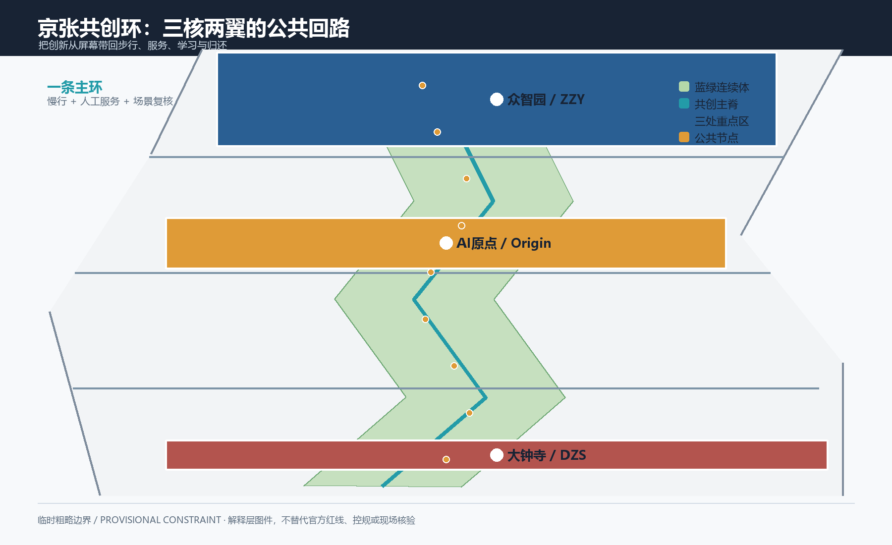
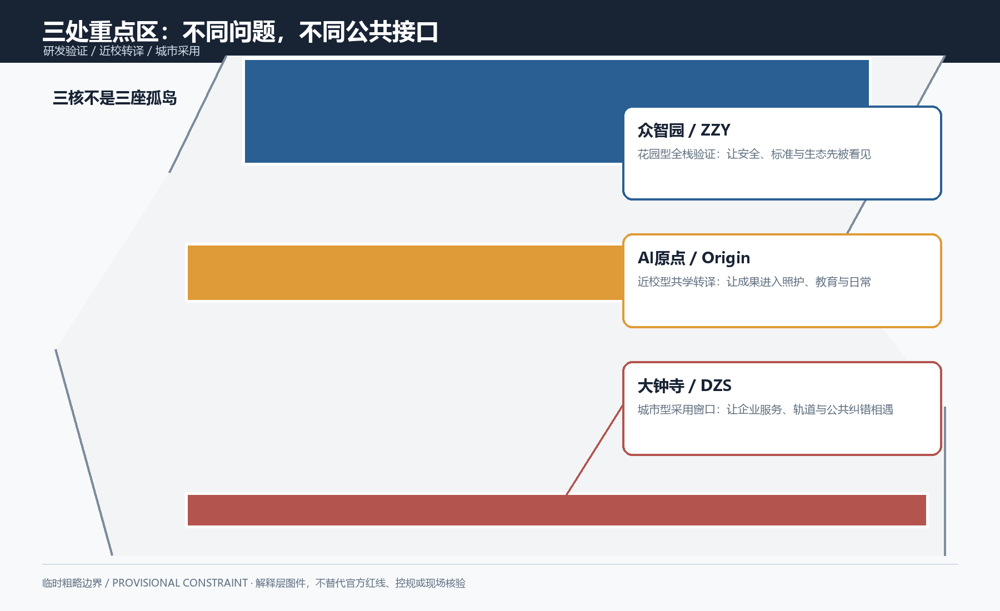
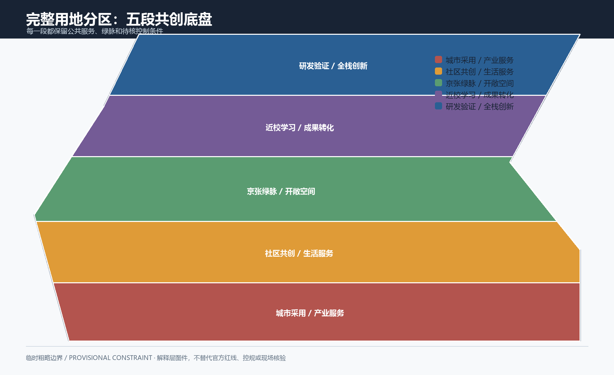
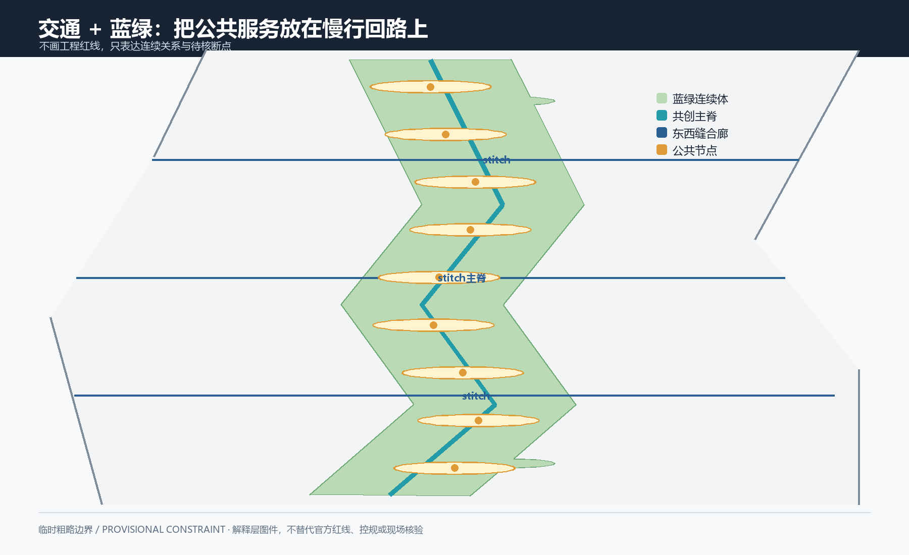
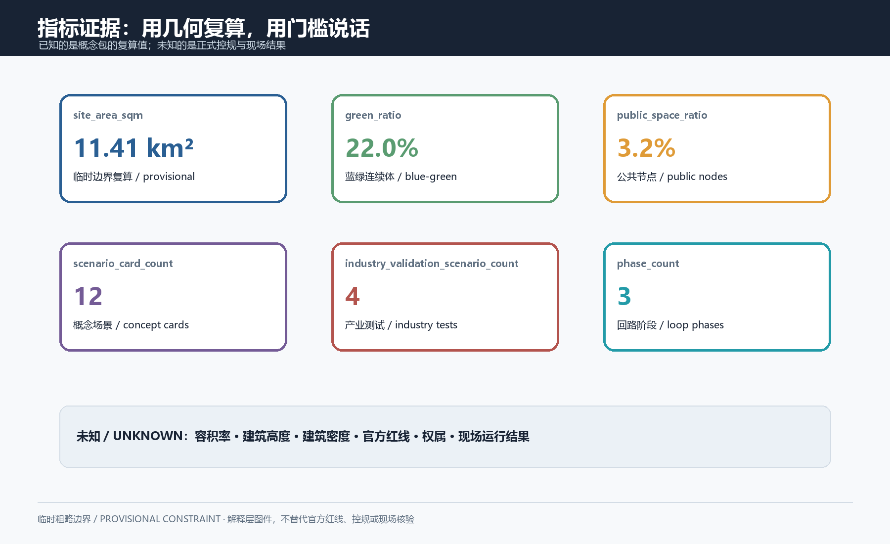

# 京张共创环——从遗产铁路到可验证生活带

本方案把“AI创新带”定义为一条可回到日常的共创环：人们在铁路记忆与公共空间中遇到问题，和研究者、企业、社区一起做出低风险原型；原型经过可理解的说明、人工兜底、隐私最小化和公开纠错，才允许进入下一轮讨论。它不把算法当作新的地标，也不把临时数据包装成法定事实。所有空间边界、建筑量体和分期都是待专业复核的概念表达。

图版索引（正文图版与 `report/proposal.html` 同步）：

## 设计依据与资料清单

公告给出百年京张AI创新带的任务语境、统筹研究范围、总体设计范围和三处重点区域；面向智能体任务书进一步提出三大定位、五大功能、六项智能体任务、场景卡、人物画像、朝圣节点和持续运营等表达要求 [source:OFFICIAL-ANNOUNCEMENT] [source:AGENT-TASKBOOK]。本包将 `brief/site-package/` 视为受控输入，利用登记表区分正式来源、背景来源和 provisional-only 资料 [source:SITE-PACKAGE] [source:SOURCE-REGISTRY] [source:PROCESSED-FACT-PACK]。

正式依据包括公告、任务书、城市设计管理相关规范、控规层级说明和国土空间用地分类术语。它们支撑的是任务范围、设计深度、公共空间和用地表达方法，不把外部案例的形态或指标移植为北京的控制条件 [standard:PROJECT-OFFICIAL-ANNOUNCEMENT] [standard:PROJECT-AGENT-OPEN-CALL-TASKBOOK] [standard:MOHURD-URBAN-DESIGN-MEASURES]。建筑设计深度条款的本地权威附件仍待维护者补齐，因此本包把它列为参照而非审批依据 [standard:MOHURD-ARCH-DESIGN-DEPTH-2016]。

资料缺口是方案的一部分：正式红线、三处重点区精确 polygon、道路红线、现状建筑与权属、遗产清单、市政管线、公共服务承载量和控规强度尚未进入当前公开场地包。缺口不会被插值成结论；它们在 `assumptions.json`、`geometry/constraints.geojson` 和风险章节中逐项记录。

## 三层范围工作框架

三层工作框架对应不同的证据强度。统筹研究范围约 4,360 公顷，用来观察产业、未来城市和跨片区协作；总体设计范围公告值约 1,140 公顷，用来组织更新、交通、蓝绿和公共服务关系；三处重点区合计约 368.4 公顷，用来表达概念性空间组件。当前提交边界由维护者提供的 provisional polygon 组织，面积可复算但不等于法定范围 [depth:three_level_scope_framework] [data:geometry/site_boundary.geojson#SITE-BOUNDARY-PROVISIONAL]。

每一层都使用“问题—原型—复核—去留”的同一循环：统筹层回答谁协作、总体层回答哪些公共骨架先被看见，重点层回答一个具体场所如何被试用。层级之间只传递关系，不传递未经核验的权利或工程结论；正式 polygon 替换后，空间、指标、图纸和可视化需一起重算 [source:BOUNDARY-SOURCE] [source:KEY-AREA-SOURCE]。

## 统筹研究范围产业与未来城市研究

统筹层形成“一条共创主脊、两翼服务网、三座转译庭、四道公共门”的结构。主脊沿京张铁路记忆和慢行联系串联问题采集、展示、测试和归还；中关村科技服务翼承接知识产权、融资、国际协作与人才服务；小月河场景赋能翼承接社区、健康、教育、蓝绿和照护。三座庭院分别是众智园“验证庭”、北京AI原点社区“转译庭”、大钟寺“采用庭”，四道门把地铁/公交、校园/社区、企业/开放空间和铁路记忆接入日常。

产业研究不以“聚集更多企业”为单一目标，而以问题链和回馈链连接算力、模型安全、知识产权、公共服务、教育和生活照护。每个参与团队在进入公共测试前必须交付清楚的服务对象、最小数据、人工接管点、停止条件和可复盘日志；没有这些信息的项目只停留在室内研讨。此结构响应城市设计应同时统筹平面、立体空间和城市特色的要求 [depth:overall_spatial_structure] [standard:MOHURD-URBAN-DESIGN-MEASURES]。

六个国际方法案例只作工作方法参照：one-north 的工作—生活—游憩—学习混合，STATION F 的一站式创业支持，赫尔辛基 International House 的新来者服务整合 [source:CASE-ONE-NORTH] [source:CASE-STATION-F] [source:CASE-HELSINKI-IHH]。空间混合、产业更新和跨学科转译另见 MIT Kendall Square、Barcelona 22@ 与 MIT InnovationHQ [source:CASE-KENDALL-SQUARE] [source:CASE-BARCELONA-22AT] [source:CASE-MIT-IMPACT]。案例不提供本场地红线、强度、交通或政策证据；本包仅记录出处、访问日期和可借鉴的方法边界。

## 总体设计范围城市更新与控规深度城市设计

总体层用“可见的公共骨架”替代“假定的开发量”。主脊是连续的慢行—公共空间关系，三座庭院是不同强度的活动节点，两翼是服务和运营网络；建筑、用地与交通都作为可替换图层写入 GeoJSON。用地表遵循分类术语的可读映射，代码只表达概念类别，不能被解读为地块法定性质 [depth:land_use_layout] [standard:MOHURD-CONTROL-DETAILED-PLANNING]。分类术语与图层位置另行登记 [standard:MNR-LAND-USE-CLASSIFICATION-GUIDE] [data:geometry/land_use.geojson#LU-01]。

空间强度暂不填入法定数值。建筑密度、容积率、高度、退界、停车和道路断面全部保持 unknown，量体仅用于对比公共空间、开敞界面和更新顺序 [depth:development_intensity_controls] [depth:height_massing_character]。法定数值缺口分别保留为 [metric:building_density] [metric:floor_area_ratio] [metric:building_height_m]。这让专业复核可以直接替换控制条件，而不必先拆除一组看似精确却没有来源的数字。

总体层的判断门槛是：任何新增空间都必须说明服务谁、与哪一处公共节点相连、是否有非 AI 路径，以及在正式权属和安全资料到位前如何保持可逆。`drawings/a3-booklet.pdf` 与 `drawings/a0-boards.pdf` 将这些关系放在同一组图例中，避免只展示漂亮的终态。

## 重点区域详细设计

三个重点区不是三个封闭园区，而是三个不同的“转译动作”。众智园把研究成果翻成可解释的模型安全、低碳和城市问题实验；北京AI原点社区把校园、社区和生活照护需求翻成学习、帮助和共编工具；大钟寺把创新服务翻成抵达、采用、反馈和再分配。三处均保留边界 provisional 属性，重点区面积由几何重新计算，不宣称已满足任何法定指标 [depth:three_key_area_detailed_design] [data:geometry/key_areas.geojson#KEY-AREA-001]。其余两个重点区的可替换数据对象分别为 [data:geometry/key_areas.geojson#KEY-AREA-002] [data:geometry/key_areas.geojson#KEY-AREA-003]。

众智园“验证庭”配置一条低速实验廊、可拆卸遮荫、公开的模型说明牌和安全评测桌；测试对象优先是步行可达性、环境感知和公共服务界面，不直接接触个人敏感信息。北京AI原点社区“转译庭”配置共享课堂、邻里帮助台、儿童/长者可读界面和可关闭的语音/文字入口；任何智能推荐旁边都给出人工咨询、纸面地图和无障碍替代。大钟寺“采用庭”配置交通换乘前室、企业服务窗口和“共创归还墙”，把测试结果公开成易懂的保留、修改、暂停或归还记录。

三处都有同一套空间标识：先说明问题，再说明数据，再说明谁能停止，最后说明如何反馈。节点数量和重点区数量属于设计对象 [metric:key_area_count] [metric:key_area_total_area_sqm]。公共节点与主脊连接长度也只用于关系检查 [metric:public_space_node_count] [metric:loop_spine_length_m]。它们都不是已建设数量。

## AI 创新生态、人才画像与 AI+ 场景

生态的核心不是把所有人变成“用户”，而是让不同角色在同一张场景卡上拥有可见的权利和退出方式。五类设计画像是：开放源代码学生/开发者、需要验证与服务连续性的创业团队、带儿童或照护长者的邻里居民、国际来访者/创意工作者、负责维护和投诉响应的现场运营人员。画像是设计工具，不是个人数据；场景需经过自愿参与、最小数据、可理解说明和人工兜底后才能讨论 [metric:persona_count] [depth:overall_spatial_structure]。

十二张场景卡覆盖四类产业验证和八类公共生活：

1. 慢行可达性审计（产业验证）：团队用匿名计数和人工走访检查主脊的连续性，结果只形成问题清单。
2. 无障碍路线助手（公共服务）：给出坡度、休息点和人工陪同入口，并保留纸面路径。
3. 健康导航人工兜底（公共服务）：只做机构与时间信息整理，不做诊断；紧急情形转人工。
4. 原点社区学习伴行（教育）：把课程、开放课堂和社区问题连成可查询的公共目录。
5. 企业服务协同台（产业验证）：把知识产权、测试、融资和人才咨询拆成可追踪的服务步骤。
6. 模型安全共测室（产业验证）：用合成/公开样例做偏差与可解释性演示，参会者可随时退出。
7. 低速配送沙盒（产业验证）：只在明确的低速时段和人工监管下讨论，优先检查人与车的冲突。
8. 铁路双语记忆导览（文化公共服务）：使用清权文字和抽象图形，不复刻未授权肖像或商标。
9. 公共空间维护信号（运营）：居民选择问题类别后生成匿名工单，运营人员公开处理状态。
10. 社区能耗与蓝绿看板（环境公共服务）：呈现聚合趋势和节水/遮荫建议，不展示住户明细。
11. 开放源代码贡献台（学习公共服务）：把提交、审阅、回退和致谢做成可阅读流程。
12. 全球活动与翻译路线（运营公共服务）：给出多语种路线、人工接待时段和安静空间信息。

每张卡都必须记录“对象—地点—最小数据—人工兜底—停止按钮—评价方式—是否进入下一轮”。场景卡计数和产业验证计数均只表示设计覆盖，不表示真实试点或效果 [metric:scenario_card_count] [metric:industry_validation_scenario_count] [source:AGENT-TASKBOOK]。

## 用地、建筑规模与拆改留方案

用地结构采用五种概念类别：铁路/交通相关的 05，科研教育 0802，公共管理与公共服务 0804，公园绿地 1401，商业服务 0702。`land_use.geojson` 用相邻纬度带保证拓扑连续，属性中同时写入“conceptual / provisional / pending professional confirmation”，以便未来替换正式地块。它表达的是公共骨架和功能混合的关系，不是地块出让或用途批准 [data:geometry/land_use.geojson#LU-01] [standard:MNR-LAND-USE-CLASSIFICATION-GUIDE] [depth:land_use_layout]。

拆改留采用“先留、再修、后谈新增”的顺序：能承载公共服务和记忆叙事的建筑先以可逆方式再利用；需要补足采光、无障碍、能源和消防条件的对象进入“改”清单；只有在权属、现状、结构和公共影响核实后，才把“拆/新建”作为专业复核议题。图层中的 15 个建筑对象是概念量体，`building_footprint_area_sqm` 是几何面积而非法定建筑密度 [depth:retain_renovate_demolish] [data:geometry/buildings.geojson#BLDG-01]。对象数量和概念面积另行核对 [metric:building_footprint_count] [metric:building_footprint_area_sqm]。

建筑风貌控制先写成可检验的语言：沿主脊保持小尺度可读界面，重点节点允许形成公共门廊但不以高耸体量制造唯一视觉中心；屋顶、首层、夜间照明和广告界面分开审查。高度、退线、容积率和消防间距不在当前包内虚构，待正式测绘、风貌和控规资料到位后再进入工程层。

## 交通、轨道、市政与公共服务设施

交通策略是“铁路记忆为线、慢行可读为面、换乘服务为门”。`ROAD-001` 是概念共创主脊，三条横向联系将三处重点区、社区和服务翼连接；道路图层仅为关系线，不替代道路红线、交通组织或施工图 [depth:traffic_rail_slow_parking] [data:geometry/roads.geojson#ROAD-001]。道路数量和长度是另外两项几何检查 [metric:road_feature_count] [metric:road_length_m]。

每个公共门都配置三种到达信息：普通文字、图形/色带、人工问询。公交和轨道接驳、步行过街、自行车停放、临时上下客、消防与救护通道须由交通、市政和安全专业复核。停车不做容量承诺，而是先记录冲突点与时段，再决定是否需要共享停车或接驳优化。

市政层按“先能服务、后做智能化”组织：饮水、厕所、休息、遮荫、无障碍、照明、网络和急救信息先以传统方式可用；AI 只辅助导航、翻译、维护和服务分流，并不成为唯一入口。地下管线、雨污、供电、消防、通信和运维权属缺失，故 `municipal_new_infrastructure` 只作为待核清单 [depth:municipal_new_infrastructure] [data:geometry/constraints.geojson#DATA-GAP-MUNICIPAL]。

## 蓝绿空间、公共空间与城市风貌

蓝绿网络由主脊旁的连续绿带、重点区的“验证庭/转译庭/采用庭”和若干休息、雨水、共享活动节点组成。`green_space.geojson` 以概念绿廊和节点房间表达可达性与生态连续性，`public_space.geojson` 以 9 个节点表达公共接口；二者均保持 provisional 描述 [depth:blue_green_public_space] [data:geometry/green_space.geojson#GREEN-LOOP-001] [data:geometry/public_space.geojson#PUBLIC-NODE-001]。绿地对象数量另有独立计数 [metric:green_space_feature_count]。

公共空间分为“看得懂、坐得下、能参与、可退出”四种体验。主脊设置连续导视、可停留边界和雨雪天气替代路线；节点内设置低刺激角落、人工服务台、可拆卸展陈和问题归还墙。蓝绿设计不承诺海绵、生态或微气候性能，当前指标只是概念几何的面积关系 [metric:green_space_area_sqm] [metric:green_ratio]。公共空间面积和比例另行登记，真实性能需由水文、园林、无障碍和运维资料重新计算 [metric:public_space_area_sqm] [metric:public_space_ratio]。

文化叙事围绕“修路—求知—共创—归还”四幕展开，避免用未核实的历史细节填充空白。三个公共朝圣/致敬节点是共同实验廊、铁路记忆庭、共创归还墙；它们是可阅读的公共空间组件，不是宗教设施，也不暗示任何权利、地标批准或已建成状态 [metric:pilgrimage_landmark_count] [source:AGENT-TASKBOOK]。

## 更新项目清单、实施政策与分期计划

更新项目以轻量、可逆、可停止为优先，形成八项概念项目：P1 共创主脊慢行识别；P2 三座转译庭的公共接口；P3 无障碍与人工陪同服务包；P4 铁路记忆清权导览；P5 企业服务协同台；P6 模型安全共测室；P7 蓝绿休息与雨雪替代节点；P8 全球活动和社区归还机制。每项都记录服务对象、前置资料、依赖部门、退出条件和证据产物，不给出工程造价或行政承诺 [depth:renewal_project_list] [source:PROJECT-AGENT-OPEN-CALL-TASKBOOK]。

实施政策采用“公开议题—小范围试用—独立复核—保留/修改/暂停/归还”的门槛。政府部门、企业、高校、社区、居民、维护者和外部评审共同构成参与主体，各自只对自己可确认的内容负责。传统服务与智能服务并列提供；收集的数据默认最小化、聚合化、定期删除；投诉、无障碍、儿童和长者服务保留人工通道。涉及权属、交通、安全、消防、遗产、个人信息、算法和公共空间的事项，需在正式程序中由相应主体重新确认，本包不替代任何审批。

三段式分期是讨论顺序而非建设时间表：G0（0—6 个月的议题和低风险原型）先建立公共说明、人工服务、清权内容和可回退日志；G1（6—18 个月的三庭联动）仅在资料、隐私、安全和服务容量条件满足时扩大测试；G2（18—36 个月的长期运营）以年度复盘决定继续、修改或结束。每一阶段都有“暂停和归还”出口，并用可衡量指标记录人工兜底覆盖、问题关闭、参与人数、无障碍反馈和场景退出次数；这些指标只用于评估协议质量，不承诺现实绩效 [depth:phasing_implementation] [data:geometry/phasing.geojson#PHASE-01]。阶段数量和几何面积分别记录 [metric:phase_count] [metric:phase_area_total_sqm]。

## 指标体系、面积复算与合规矩阵

当前包的面积指标均从提交几何重算。临时边界面积为 11,412,825.386 平方米 [metric:site_area_sqm]，公告的总体设计任务面积约 11,400,000 平方米 [metric:announced_overall_design_area_sqm]；两者差异是 provisional polygon 与公告概数的差异，不做校正性解释。绿地概念面积为 2,510,681.608 平方米 [metric:green_space_area_sqm]，绿地比为 0.219988 [metric:green_ratio]；公共空间概念面积为 366,057.532 平方米 [metric:public_space_area_sqm]，公共空间比为 0.032074 [metric:public_space_ratio]。

几何对象还包括 15 个建筑对象 [metric:building_footprint_count]、4 条道路关系线 [metric:road_feature_count]、9 个公共节点 [metric:public_space_node_count]、3 个重点区 [metric:key_area_count]、3 个分期单元 [metric:phase_count]，以及 9,344.774 米的主脊关系线 [metric:loop_spine_length_m]。重点区合计面积为 3,692,893.005 平方米 [metric:key_area_total_area_sqm]，分期几何合计为 11,412,836.616 平方米 [metric:phase_area_total_sqm]；后者存在约 11.23 平方米的 provisional 几何重叠/舍入差异，正式边界到位后必须由专业人员重算。

叙事覆盖 6 个方法参照案例 [metric:global_case_count]、5 类画像 [metric:persona_count]、12 张场景卡 [metric:scenario_card_count]、4 张产业验证场景卡 [metric:industry_validation_scenario_count] 和 3 个公共致敬节点 [metric:pilgrimage_landmark_count]。这五组数字是覆盖检查，不是实施绩效。

合规矩阵把 23 个公告/任务条目、6 个标准、15 个设计深度项连接到正文、GeoJSON、图纸、HTML 和自检。土地分类和控规条款分别以术语与层级方法响应，不把临时几何转成法定控制 [standard:MOHURD-CONTROL-DETAILED-PLANNING] [standard:MNR-LAND-USE-CLASSIFICATION-GUIDE] [depth:metrics_recalculation]。`metrics.json` 记录已知/未知状态、公式、来源文件和置信度；`self_check.json` 记录边界可信度、拓扑、视觉静态性和专业证据门槛。

## 风险、版权与合规说明

边界风险：当前站点和重点区是 provisional-only；正式红线、道路、铁路、水系、遗产、公共设施和控制条件缺失，任何面积、位置和关系都只能做概念复核。`constraints.geojson` 只画出资料缺口提示，不伪装成规划约束 [depth:risk_missing_data] [data:geometry/constraints.geojson#DATA-GAP-OFFICIAL-BOUNDARY] [source:BOUNDARY-SOURCE]。

权利风险：图形、图标、版式、代码和文字由本次 agent 在本地生成；外部案例仅保存公开页面的出处、方法摘要和访问日期，不复制图片、商标、建筑图纸或未授权文本。铁路文化内容采用抽象叙事，正式展示前仍需逐项清权。包内许可为 COMMUNITY-DISPLAY-ONLY，适用于开放调用的方案审阅，不授权将概念图层当作工程、规划或商业文件。

AI 与公共服务风险：不上传个人信息，不建立人脸或个体轨迹，不以模型输出做医疗、执法、资格或安全的单独决定。每张场景卡同时给出人工帮助、纸面/普通数字入口和停止方式；运行日志只记录必要的事件类别。任何试用前应由专业、运营和权利主体进行独立复核。上述边界也回应生成式 AI 公共服务、无障碍人工引导和长者智能服务资料中的适用条件，但这些背景资料不替代本地控规 [source:DATA-SRC-GENERATIVE-AI-INTERIM-MEASURES] [source:DATA-SRC-BARRIER-FREE-ENVIRONMENT-LAW] [source:DATA-SRC-ELDERLY-SMART-TECH-PLAN-2020-45]。

提交风险：manifest、图层、指标、双语显示、A3/A0 PDF 和 HTML 必须保持同一版本。自检完成后若修改任一文件，应重新刷新 manifest 并再次跑四道门；当前工作区只做本地 participant preflight 与 `git push --dry-run`，不在本次任务中上传或创建 PR。

## 参考资料

核心正式/受控来源见 `sources.json` 和 `data/source_registry.json`，包括公告、任务书、场地包、城市设计措施、控规说明和用地分类指南 [source:SOURCE-REGISTRY] [standard:PROJECT-OFFICIAL-ANNOUNCEMENT]。方法案例为公开网页参照，清单、链接、发布方、访问日期和不可替代边界均在 `sources.json` 中登记；peer work 仅作渐进式方法阅读记录，未下载或复制其图形资产。图纸、指标和图层的互相对应关系见 `compliance_matrix.json`、`standard_matrix.json` 和 `design_depth_matrix.json` [depth:risk_missing_data]。

本提案最后的判断不是“方案已经落地”，而是“证据链可以被继续替换和复核”：先换正式边界，再换控制条件，再重算指标、图纸和场景门槛，最后由人决定哪些原型值得留在公共生活里。
