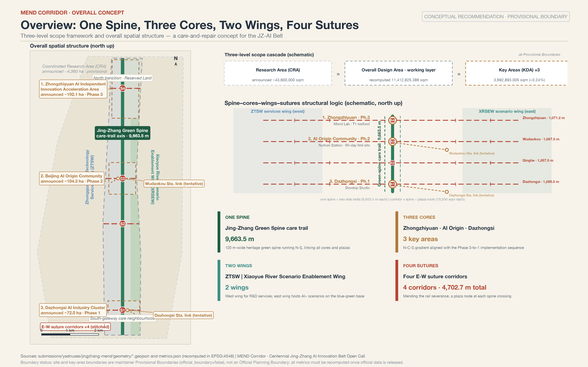
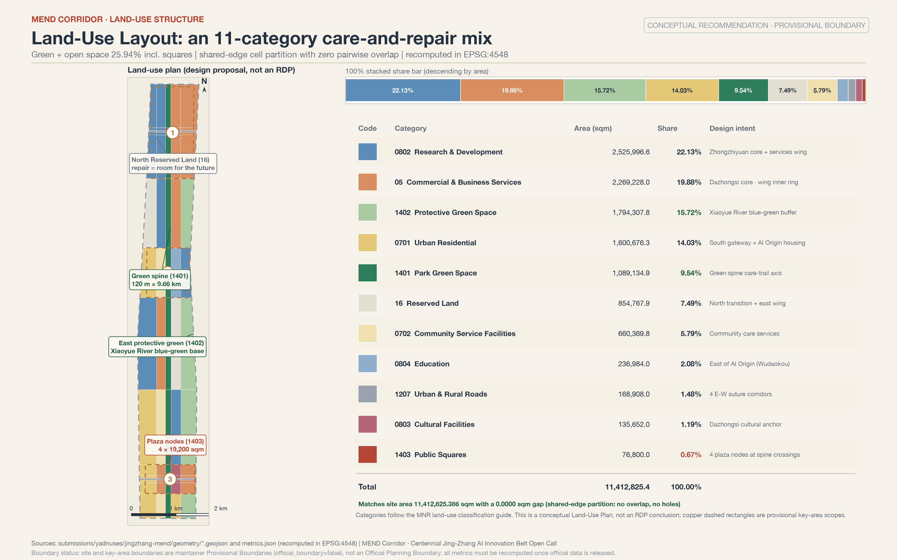
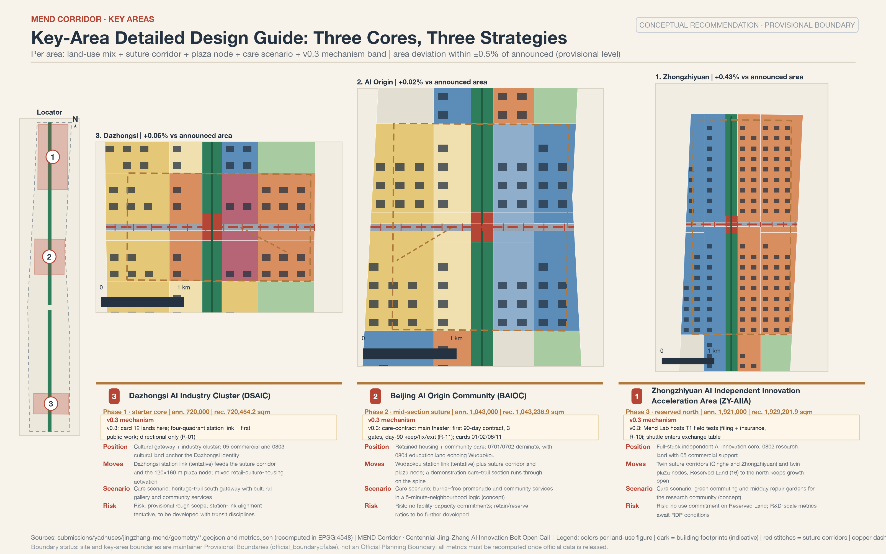
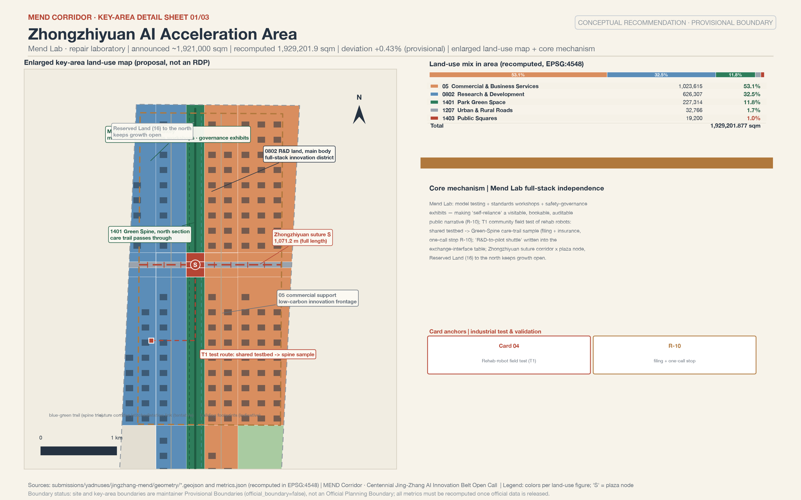
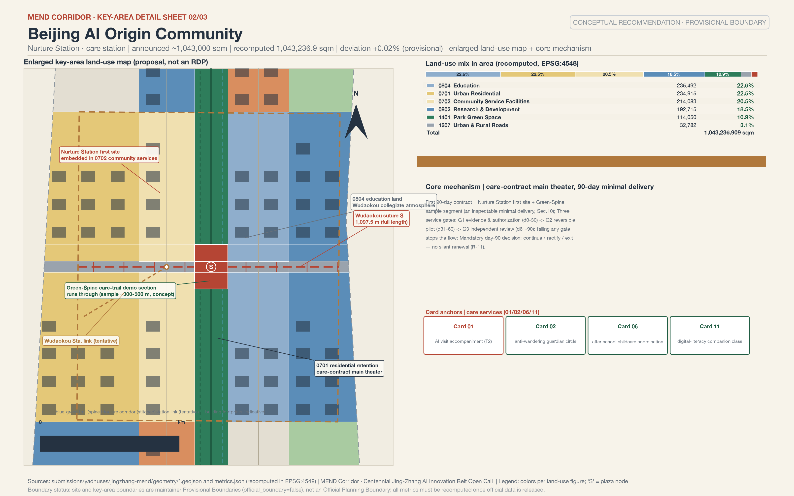
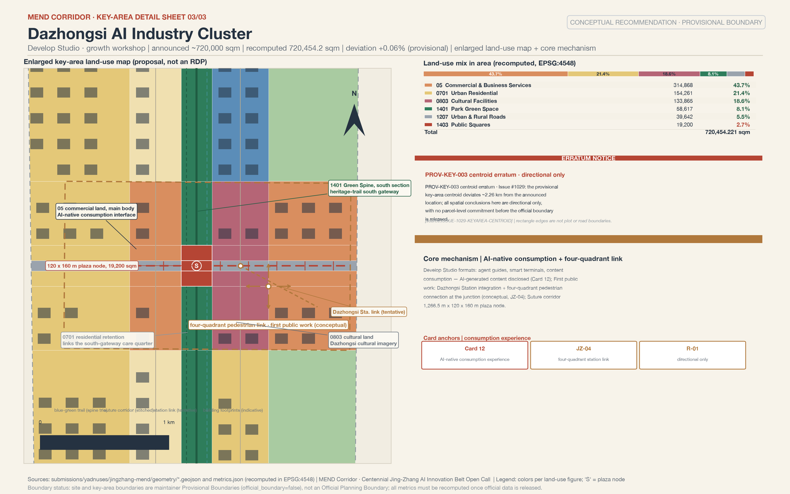
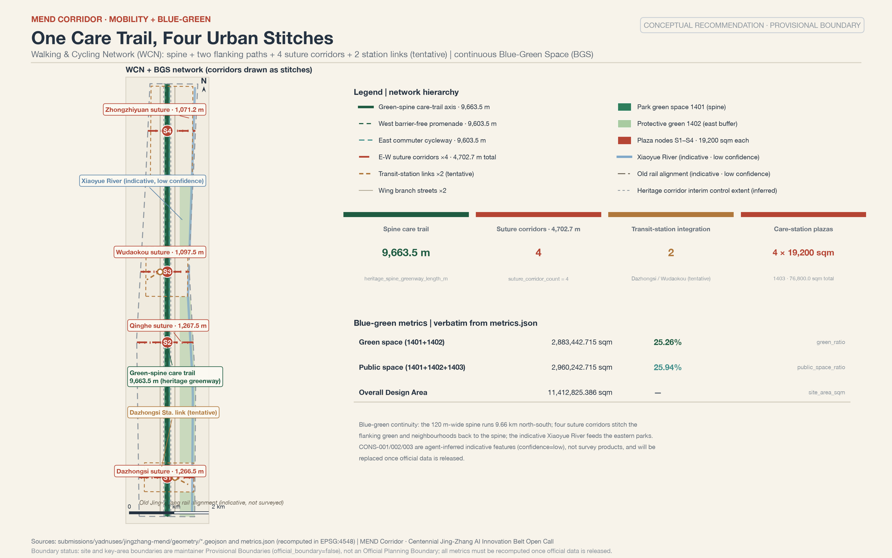
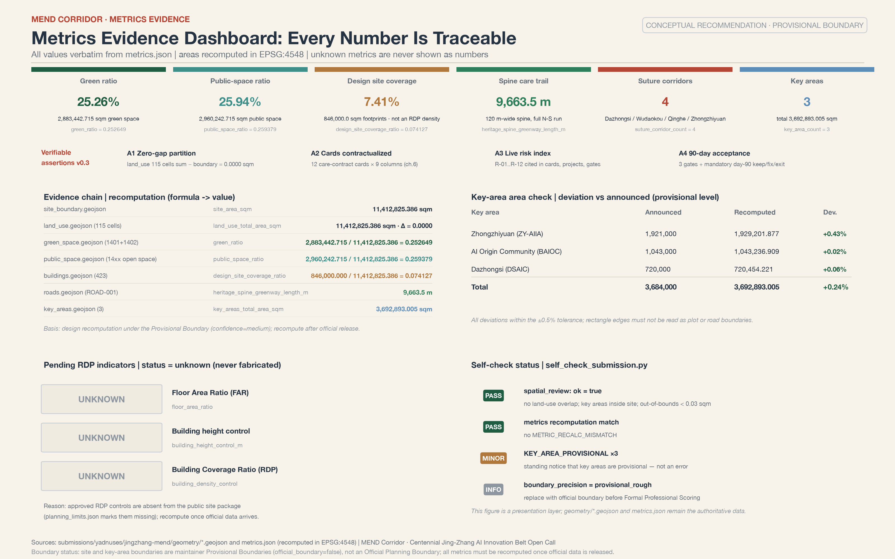
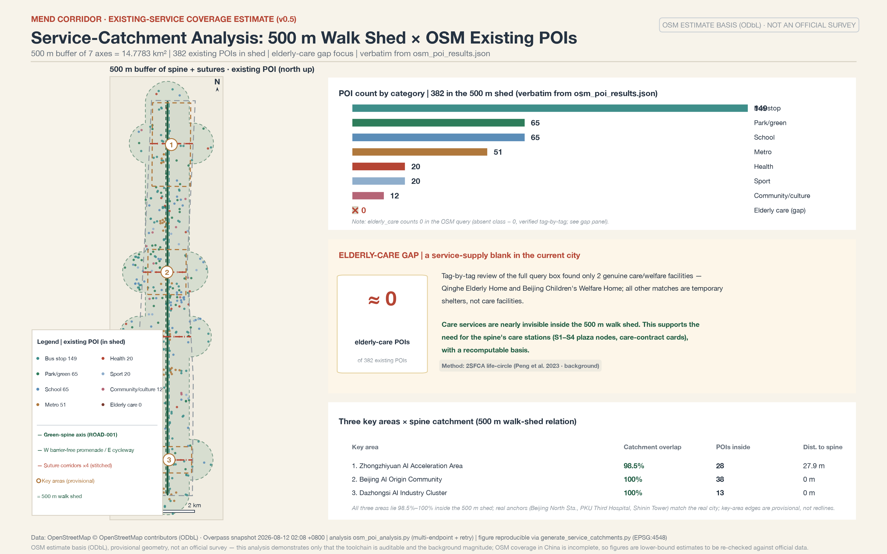

# Jingzhang MEND Corridor: A Care-and-Mending Urban Design for the Centennial Jing-Zhang AI Innovation Belt

## Opening: A Three-Minute Plain-Language Version for Residents

This section cites no machine-readable IDs and answers only three questions: **who does what for whom and when, whom to call when something goes wrong, and how to stop it.**

**What we propose.** A century ago, the Beijing-Zhangjiakou Railway repaired the confidence of the Chinese people in building on their own; today, three fractures torn open by speed along this belt need mending: the railway cuts the city into east and west halves (a spatial fracture); campuses, innovation parks, and neighborhoods barely interact (a social fracture); and the elderly, children, and low-digital-literacy residents are being left behind by the intelligent age (a digital fracture). This scheme proposes a care promenade along the Jing-Zhang Green Spine and a group of care stations in the AI Origin Community: helping seniors register for hospital appointments and accompanying them to visits during the day, picking up and hosting children after school in the early evening, and opening community repair workshops on weekends. Four east-west stitching corridors, each about 40 meters wide, reconnect the two halves split by the railway, and at each corridor mouth sits a plaza node of about 19,200 square meters, hosting markets, free clinics, and open-air film screenings. The first step is one small deliverable that can be accepted by inspection: opening a first care station in the AI Origin Community, together with a sample segment of the Green Spine promenade; within 90 days an independent evaluation decides between continuing, rectification, and withdrawal (see Section 10).

**Whom to call.** Every AI service is written onto a care contract card in Section 6: service users, operating body (proposed; marked "to be appointed" until formally appointed), data sources, privacy boundaries, human-review entry point, stop conditions, and exit mechanism correspond one to one. If something goes wrong, first contact the community operations specialist named on the card, then the sub-district and district-level platforms. Every card retains human review; no AI judgment may directly become a disposition imposed on a resident.

**How to stop it.** Residents can, through the community council, demand that any scenario be taken offline for rectification, and on every care contract card they can find three actions: under what circumstances a one-call stop applies, on what evidence a service may be restored, and how often it is re-reviewed. For those who do not want to use AI, every card has a corresponding manual channel (telephone, staffed window, paper registration), and services do not stop because machines go offline. Data collection follows minimum necessity: no personal trajectory profiling, no use for commercial recommendation; after a resident withdraws consent, the relevant service records are deleted within 24 hours. It must be stressed that every arrangement in this section is a conceptual proposal, not an adopted government decision or implementation arrangement; the implementation path, responsible bodies, exit mechanisms, and the first 90-day acceptance arrangement are in Section 10.

## Design Basis and Source List

The primary basis of this scheme is the Pre-Qualification Announcement of the Centennial Jing-Zhang AI Innovation Belt International Urban Design Open Call, issued by the Haidian Branch of the Beijing Municipal Commission of Planning and Natural Resources; its clauses 1.3, 1.4, and 1.5 define the project purpose, the three-level scopes, the three key areas, and the required deliverable depth [source:OFFICIAL-ANNOUNCEMENT] [standard:PROJECT-OFFICIAL-ANNOUNCEMENT]. The second basis is the agent-oriented open-call taskbook, whose ten co-creation principles, six agent tasks, and unified boundary clauses constrain this scheme's narrative, scenario, and operations expressions [source:AGENT-TASKBOOK] [standard:PROJECT-AGENT-OPEN-CALL-TASKBOOK]. Together they form the task-level evidence; this scheme's 23 mandatory task responses are attached item by item in `compliance_matrix.json`.

Source credibility is graded in three tiers, following the usage boundaries of the repository source registry [source:SOURCE-REGISTRY]: formal-usable sources (the announcement, taskbook excerpts, and five regulations and standards with local snapshots) may directly support judgments in the text; background_only sources serve as background only and are never upgraded to a basis; provisional_only sources serve only as intake leads. The enumerations, limits, schemas, and provisional geometry in the site package are machine-readable bases [source:SITE-PACKAGE]; the depth requirements for the existing-conditions diagnosis and the missing-data list are governed by [depth:existing_conditions_diagnosis]. `data/processed/agent_fact_pack.md` is only a reading-navigation layer; every factual judgment returns to the original registered materials [source:PROCESSED-FACT-PACK].

**Official document search ledger (real searches conducted in August 2026).** To avoid mistaking "not yet checked" for "nonexistent", this scheme performed a real public search on the task-critical facts, registered in three columns — "provable / not obtained / action triggered"; sources that have not entered the repository's approved registry are used as background only and are never upgraded to statutory bases or scoring evidence.

| Search target | Provable (background level) | Not obtained | Action triggered |
| --- | --- | --- | --- |
| Official source of the open-call announcement | original text of the announcement on the website of the Beijing Municipal Commission of Planning and Natural Resources (published 2026-04-30): the organizing body, the three-level scopes, the verbatim positioning of the three zones, the call timeline, and the intellectual-property clauses [source:OFFICIAL-ANNOUNCEMENT] | — | — |
| Corridor-adjacent block regulatory plans | the drafts of corridor-adjacent block regulatory detailed plans such as HD00-1601 were publicized from 2024-12-19 through 2025-01-19, and the adoption notice was published on 2025-02-08 [source:JZRAIL-CORRIDOR-KG-ADOPTION]; the 2026 Haidian District Government Work Report confirms that "the corridor-adjacent regulatory plans passed technical review and are being actively advanced toward approval and implementation" [source:HAIDIAN-GOV-REPORT-2026] | per-parcel floor area ratio, building height, and building density values (found only in the annex drawings of the publicity materials; not published in the text) | it has been verified that no public values exist: this scheme uniformly keeps regulatory-plan indicators unknown; a full re-review follows the release of the official annexes |
| Urban-renewal policy chain | the Beijing Urban Renewal Regulation (《北京市城市更新条例》, effective 2023-03-01) establishes "retain, renovate, and demolish all at once, with retention, reuse, and upgrade as the main approach" and a joint-review publicity period of no less than 15 working days [source:BJ-URBAN-RENEWAL-REGULATION]; the Haidian District Urban Renewal Guide (2025 Edition) (《海淀区城市更新导则（2025 年版）》, Hai Zheng Fa [2025] No. 4) specifies "a 53-square-kilometer AI innovation neighborhood, focusing on the Wudaokou and Dazhongsi pilot areas, and prioritizing renewal along the Jing-Zhang Railway Heritage Park corridor" [source:HAIDIAN-RENEWAL-GUIDE-2025] | the original text of Zhong Ban Fa [2025] No. 34 (only the document number is seen, cited in the district guide) | follow the citation scope of the district guide; do not directly cite text that was not obtained |
| Heritage park status | Phase 2 was completed and opened on 2026-08-06: a 9-km linear green corridor along the whole line, all closed fences removed, and 9 city branch roads opened up [source:STDAILY-JZRAIL-PARK-OPEN] | segment-by-segment open boundaries and facility lists | re-verify the Green Spine connection nodes after the official segment-by-segment list is released |
| Operating status of the three zones | Zhongzhiyuan, per media accounts, is "expected to reach opening readiness in July 2026 and fully open and operate before the end of the year" [source:HDRM-ZZY-2026]; the AI Origin Community covers about 3 square kilometers with more than 400 resident enterprises (media account) [source:BJNEWS-AI-YUANDIAN] | the official announcement of the "formal opening" of Zhongzhiyuan | re-check the opening status after October 2026; the text never states "already open" |
| Heritage-protection controls | the original text of the protection scope and the Class I / Class V construction-control zones of the former Qinghuayuan Station site (Beijing Municipal Cultural Heritage Bureau) [source:WWJ-QINGHUAYUAN-STATION] | the coordinates on the attached drawings of the protection scope | pilgrimage landmarks and wayfinding nodes are designed to conservatively avoid this scope |

A scope difference must also be noted: the "three zones and two wings" area appears in two versions — 43.6 square kilometers (the "Coordinated Research Area" scope in the pre-qualification announcement) and 37 square kilometers (the "Second Ring Road to Fifth Ring Road area" scope reported by the Beijing Municipal Science and Technology Commission [source:BJ-KW-THREE-AREAS-2026]); the definitions differ. This scheme uniformly adopts the announcement scope, and the 37 square kilometers are noted only as an other-source remark. The complete search records of this ledger (URLs, publishers, dates, verbatim excerpts) are archived as the scheme iterates, for reviewers to verify.

The spatial basis must be stated frankly: the official SITE_BOUNDARY and the precise polygons of the three KEY_AREAs have not been released. Both `geometry/site_boundary.geojson` and `geometry/key_areas.geojson` in this package derive from provisional boundaries provided by the maintainers [source:BOUNDARY-SOURCE] [source:KEY-AREA-SOURCE]; the overall-scope anchor is [data:geometry/site_boundary.geojson#SITE-001] and the key-area anchor is [data:geometry/key_areas.geojson#PROV-KEY-001]. They may be used only for scheme generation, self-checking, visualization, and design discussion — never as an official redline, an approval basis, or a precise-area basis. The recalculated overall design area of 11412825.386 sqm [metric:site_area_sqm] and the key-area count of 3 [metric:key_area_count] are both scheme-recalculated values under the provisional boundary. The full inventory of sources, metrics, standards, design depths, and task coverage is kept in `sources.json`, `metrics.json`, `standard_matrix.json`, `design_depth_matrix.json`, and `compliance_matrix.json`; the body text does not duplicate the machine index.

## Three-Level Scope Framework

The three-level scopes established by the announcement are the working skeleton of this scheme [depth:three_level_scope_framework]: the Coordinated Research Area of about 43.6 square kilometers answers questions of AI industrial ecology and future urban form; the Overall Design Area of about 11.4 square kilometers (the urban area 1-2 kilometers around the Jing-Zhang Railway Heritage Park) carries the urban-renewal overall framework and regulatory-plan-level urban design; the Key-Area Detailed Design Area of about 368.4 hectares carries detailed design of the three sub-districts to the depth of an Integrated Planning Implementation Plan.

| Level | Announced area | Core question answered by this scheme | Data anchor |
| --- | --- | --- | --- |
| Coordinated Research Area | approx. 43600000 sqm | MEND industrial ecology, naming system, regional coordination loop | compliance_matrix.json, Section 3 |
| Overall Design Area | announced approx. 11400000 sqm; recalculated in this package 11412825.386 sqm | the one-spine / three-cores / two-wings / four-corridors spatial structure and renewal framework | [data:geometry/land_use.geojson#LU-001] |
| Key-Area Detailed Design Area | announced approx. 3684000 sqm; recalculated in this package 3692893.005 sqm | the positioning, scenarios, and implementation path of each of the three cores | [data:geometry/key_areas.geojson#PROV-KEY-001] [metric:key_areas_total_area_sqm] |

**General statement on the provisional boundary.** The current geometry uses `brief/site-package/geometry/provisional_boundaries.geojson` (PROV-RESEARCH-001 / PROV-SITE-001 / PROV-KEY-SCOPE-001 / PROV-KEY-001/002/003), inferred from the announcement's textual boundary limits and approximate areas, with areas verified in EPSG:4548 [depth:overall_spatial_structure]. This geometry is used only for intake generation, visualization, and discussion; it must not serve as an official redline, an approval basis, a precise-area basis, or a formal scoring basis; the organizer's data gap itself neither blocks content scoring nor causes point deductions. Once the official boundary is released, the layers and metrics to be recalculated as a whole are the eight layers site_boundary, key_areas, land_use, buildings, roads, green_space, public_space, and phasing, plus every known metric in `metrics.json` — at that point the generation scripts, self-checks, and the drawings/HTML pipeline will be re-run; replacing a single file in isolation is not allowed.

**Proactive errata (a data erratum is itself a contribution).** This scheme confirms two repository-level data issues and designs around them: first, Issue #1029 notes that the centroid of the provisional key area PROV-KEY-003 (Dazhongsi) deviates about 2.26 kilometers from the location described in the announcement, so every spatial conclusion about the Dazhongsi area is expressed only directionally [source:ISSUE-1029-KEYAREA-CENTROID]; second, Issue #846 notes that the provisional Overall Design Area and the OSM-surveyed Jing-Zhang Railway Heritage Park are about 412.5 meters apart at the nearest and do not intersect, so the spatial relationship between the Green Spine and the Heritage Park is handled as "a conceptual corridor oriented toward the Heritage Park, with the exact interface pending confirmation of the official boundary" [source:ISSUE-846-SITE-PARK-GAP].

Within the three-level framework, the overall spatial structure of this scheme is "one spine, three cores, two wings, four corridors": **the spine** is the Jing-Zhang Green Spine, a 120-meter-wide, north-south care-promenade main axis; **the three cores**, from north to south, are Zhongzhiyuan (the full-stack independent hard-core narrative), the AI Origin Community (the main theater of care scenarios), and Dazhongsi (AI-native consumption); **the two wings** are the Zhongguancun Technology Services Wing on the west and the Xiaoyue River Scenario Enablement Wing on the east; **the four corridors** are four east-west stitching corridors, each carrying a 19,200 sqm plaza node. This structure lands as land use and layers in Section 4 and as key-area detailed design in Section 5.

## Coordinated Research Area: Industry and Future City Research

### Overall Concept: Jingzhang MEND

The one-sentence concept of the "Jingzhang MEND Corridor" (Chinese brand name 相护京张, "caring for Jing-Zhang together") is: a century ago, the Beijing-Zhangjiakou Railway repaired the confidence of the Chinese people in building on their own; a century later, this belt repairs the urban everyday torn apart by speed — the value of AI is not to be faster, but to care. MEND unfolds into four verbs: **Mend** stitches the spatial fracture, **Empower** stitches the social fracture, **Nurture** stitches the digital fracture, and **Develop** makes care technology itself an industry. The three official positionings fall naturally into place: the Centennial Jing-Zhang Culture Belt equals the mending narrative (from building a railway to mending a city); the Urban AI Life Experience Belt equals care scenarios; the AI Integration and Innovation Belt equals care technology and the full-stack independent industry. The coordination of naming, positioning, and functions follows the taskbook requirements and is a conceptual proposal, not an adopted arrangement [source:AGENT-TASKBOOK] [standard:PROJECT-AGENT-OPEN-CALL-TASKBOOK].

### Spatial Placement of Positioning and Functions: A Comparison Table No Longer Hidden in Matrices

The correspondence among the three positionings, the five functions, and the three zones and two wings previously existed only in the machine index of compliance_matrix.json, leaving reviewers to dig it out themselves. Now every row is landed as a MEND spatial carrier with an "acceptable-verification meaning" — every positioning and function can answer "how much counts as done," no longer hidden only in matrices [depth:overall_spatial_structure]:

| Positioning / function | MEND spatial carrier | Acceptable-verification meaning |
| --- | --- | --- |
| Centennial Jing-Zhang Culture Belt | Jing-Zhang Green Spine, Zhan Tianyou memorial node, Caregivers' Wall of Honor | the mending narrative is perceptible: all materials for the memorial node and the Wall of Honor are original, rights-cleared, and traceable, and cultural content does not disappear because AI goes offline (R-06, R-12) |
| Urban AI Life Experience Belt | Nurture Station care-station network, four-corridor plaza nodes | care experiences can be refused, stopped, and returned to manual service: every care contract card carries an AI-OFF equivalent path and an exit mechanism (R-09, R-11) |
| AI Integration and Innovation Belt | three cores, two wings, four corridors, regional exchange interfaces | the industry loop is verifiable: R&D (Zhongzhiyuan) — testing (Xiaoyue River wing) — adoption (Dazhongsi) — feedback (the exchange interface table) form a loop (R-11) |
| Full-Stack Independent AI Innovation System | Mend Lab (Zhongzhiyuan) | standards governance and model testing can be visited, booked, and supervised: testing status, responsible persons, incidents, and rectifications are public (R-10) |
| World-Class AI Innovation Ecosystem | near-campus translation zone and open-source release hall of the Origin Community | the translation chain is traceable: project-topic, incubation, and translation records are verifiable and are not measured by fabricated output value (R-05) |
| AI-Enabled Scenario Enablement Paradigm | 12 care contract cards, T1-T3 testing-and-validation scenarios | scenarios are verifiable: every card carries hard stop conditions, restoration evidence, a care-service evaluation window, and a manual-equivalent path (R-10, R-11) |
| Intelligent AI Vital City | Green Spine care promenade, blue-green public space, plaza nodes | everyday care is achievable: barrier-free, no-App, staffed-window, and low-disturbance experiences are routinely available (R-08, R-09) |
| Global Voice in AI Governance | R-01..R-12 risk numbering, three evaluation gates, monthly data-governance report | governance is auditable: risk cross-references, evaluation-gate records, and data-disposition evidence are publicly verifiable (R-11, R-12) |

In the table, R-xx refers to the risk index numbering defined in Section 12, which the other chapters cross-reference; the "spatial carrier" and "acceptable-verification meaning" columns are this scheme's design judgments and do not represent an official division of labor or adopted arrangements.

### Six Agent Tasks Answered Row by Row (Explicit Taskbook Mapping)

Besides the 17 mandatory tasks in the announcement, the taskbook also specifies six agent tasks. This table translates agent.1-6 row by row into MEND's locatable responses, evidence locations, and boundary declarations — every response can be verified in a specific body-text section or in `compliance_matrix.json`, and each row's boundary declaration corresponds to the matching item of the taskbook's unified boundary clauses [source:AGENT-TASKBOOK] [standard:PROJECT-AGENT-OPEN-CALL-TASKBOOK]:

| Agent task | MEND locatable response | Evidence location | Boundary declaration (corresponding unified boundary clause) |
| --- | --- | --- | --- |
| agent.1 design of the belt's overall concept and functional coordination scheme | MEND four-verb naming system and logo direction, the "one spine, three cores, two wings, four corridors" overall spatial structure, the three-zones-and-two-wings synergy exchange interface table | "Overall Concept", "Naming System and Logo Direction", and "Three Zones and Two Wings: Synergy and the Regional Coordination Loop" in this chapter; spatial-structure placement in Section 4; compliance_matrix.json | naming, positioning, and functions are all conceptual proposals; no unauthorized fonts, trademarks, portraits, or corporate logos; no regulatory-plan values, demolish-renovate-retain, road redlines, or engineering-implementation conclusions (clauses ①②③④) |
| agent.2 design of the full-stack independent AI innovation system and a world-class AI innovation ecosystem | Zhongzhiyuan Mend Lab full-stack independence system, the Origin Community's near-campus translation zone, the Zhongguancun Technology Services Wing support mechanism, 8 global case studies for reference | "Global Case Studies" in this chapter; the Zhongzhiyuan and Origin Community detailed designs in Section 5; user personas in Section 6; compliance_matrix.json | no fabricated enterprise lists, investment amounts, output values, or fiscal commitments; industrial attraction, funding, and policy arrangements are not expressed as determined matters (clauses ⑤⑥) |
| agent.3 design of the AI-enabled scenario-enablement new paradigm and the intelligent AI vital city | 12 care contract cards (including 3 industrial testing-and-validation T1-T3), 7 user personas, scenario-space-operations mapping and privacy boundaries | scenario-card tables, persona tables, and mapping paragraphs in Section 6; blue-green public space in Section 9; compliance_matrix.json | all scenarios retain human review and the AI-OFF equivalent path; no trajectory or health information of minors is collected; test scenarios are not expressed as approved operations (R-09, R-10) |
| agent.4 design of AI public space, AI-native new business formats, and pilgrimage landmarks | Jing-Zhang Railway Heritage Park AI public space (Green Spine + plaza nodes), four east-west stitching corridors, Dazhongsi AI-native consumption, the 3+1 pilgrimage landmarks and honor-display system | blue-green public space and pilgrimage landmark paragraphs in Section 9; the Dazhongsi detailed design in Section 5; scenario card 12 in Section 6; compliance_matrix.json | no breach of heritage-protection, green-space, blue-line, or traffic-safety constraints; no bridge-tunnel or underground-space engineering-feasibility conclusions; landmarks are not over-entertained or internet-celebrity-styled; materials are original and rights-cleared (R-06, R-12) |
| agent.5 design of the fused narrative of centennial Jing-Zhang culture, Zhongguancun culture, and AI new culture | the "build the railway → build the trains → mend the city → cultivate the self" timeline narrative, the cultural-resource system (heritage corridor + old Tsinghua Yuan Station + Beijing Film Academy), the four-level wayfinding sign system, the one-sentence international-communication narrative | the "Cultural Narrative" paragraph in Section 9; the official document search ledger in Section 2; compliance_matrix.json | no distortion of historical facts; cultural materials and the wayfinding system are original and rights-cleared; the cultural identity system is not confused with the belt-wide master logo system (R-12) |
| agent.6 design of the belt-wide global AI innovation event system and long-term operations | annual event system (Caregivers' Assembly / Mending Workshops / Developers' Open Day / Winter Resilience Stress-Test Week), the "Friends of the Green Spine" long-term operations mechanism, the developer conversion path, international communication and attraction conversion | the "Annual Program and Long-Term Operations" paragraph in Section 10, the first 90-day contract and the three evaluation gates; compliance_matrix.json | events, attraction, funding, and policy arrangements are all ideas and are never expressed as determined government arrangements; budgets are only qualitative light/medium/heavy magnitudes (R-11) |

The table above, together with the announcement's 17 mandatory tasks, totals 23 items, each attached in `compliance_matrix.json` to sections, layers, metrics, drawings, and self-check items; the "boundary declaration" column extracts only the most relevant clauses, and the full text of the clauses follows the taskbook's unified boundary clauses.

### Naming System and Logo Direction

The sub-brands derive from the four verbs, forming an extensible naming system: **Mend Lab** (Zhongzhiyuan — full-stack independence and standards governance), **Empower Hub** (Xiaoyue River wing — scenario testing and public-service enablement), **Nurture Station** (AI Origin Community — the care-service network), and **Develop Studio** (Dazhongsi — AI-native consumption and content business formats). The logo design direction is the "rail spike + stitch line" image: a rail spike from Zhan Tianyou's era, threaded by a walking line like a row of stitches — the spike commemorates independent construction, and the stitches symbolize mending and connection. The recommended palette is Jing-Zhang iron gray plus new-leaf green. This naming and logo are original concept directions; they use no unauthorized fonts, trademarks, portraits, or corporate logos, and rights clearance must be completed separately before detailed design. Under this direction, an original vector draft has been produced, `assets/identity/mend-mark.svg` (bilingual versions, a monochrome mark of the rail-spike outline and stitch-like stitches), as a visual starting point that professional teams can deepen.

### Three Zones and Two Wings: Synergy and the Regional Coordination Loop

The division of labor among the three zones and two wings is the spatial division of MEND: Zhongzhiyuan carries the "hard core" of full-stack independence, the Origin Community carries the "warmth" of care scenarios, Dazhongsi carries the "interface" of AI-native consumption, the Zhongguancun Technology Services Wing exports IP and capital enablement, and the Xiaoyue River Scenario Enablement Wing provides test scenarios and the blue-green base [depth:overall_spatial_structure]. Regional coordination is a common gap named by this review; this scheme upgrades coordination from five narrative bullets to an "exchange interface table": every coordination item makes explicit what MEND can output, the expected return flow, the entry conditions, and the exit conditions, and exchanges are denominated in public methods and anonymized results, not premised on data aggregation, staff redeployment, or funding arrangements [depth:renewal_project_list]:

| Coordination partner | What MEND can output | Expected return flow | Entry conditions | Exit conditions |
| --- | --- | --- | --- | --- |
| Beiwei community (toward Qinghe-Shangdi) | northward Green Spine promenade connection, care-station service menu, shared time slots for community canteens and childcare points | resident demand lists from the residential hinterland, usage feedback on care services, volunteer resources | both sides confirm the shared time slots and the minimum data boundary; residents participate voluntarily (R-09) | the exchange is suspended if representation is insufficient, feedback goes unanswered, or the data boundary is breached |
| Future Science City | "Zhongzhiyuan R&D — Future Science City pilot-scale" results-transfer shuttle mechanism, test-protocol templates | pilot-scale problem lists, reproducible failure samples | both sides clarify responsibilities and the scope of application; results are verifiable (R-10) | terminate if results are mistaken for general certification or responsibilities are unclear |
| Huairou Science City | annual care-technology forum topics, sharing of test-scenario lists | research-initiation topics tied to major scientific facilities, open testing needs | professional review and public risk boundaries (R-06) | do not start without maintenance, retirement, or public-explanation mechanisms |
| Beijing Economic-Technological Development Area (BDA) | mutual recognition of T1-T3 testing-and-validation scenarios and scenario-access mechanisms, testing procedures for rehabilitation and low-speed delivery | pre-production problems of rehabilitation robots and delivery robots, manufacturing-side verification scenarios | test-zone filing, insurance, and responsible bodies in place (R-10) | mutual recognition ends if supplier lock-in occurs or exit costs are invisible |
| Beijing-Tianjin-Hebei | winter-care and ice-and-snow-season resilience testing linked to the "Jing-Zhang Sports, Culture and Tourism Belt", cross-regional communication narrative | cross-regional slow-mobility and care-scenario gaps, evaluation feedback | the legal procedures and data permissions of each region are satisfied separately (R-09) | exit if any party presents a conceptual trial as approval or a political-achievement commitment |

All items in the table above are mechanism proposals: this scheme has reached no cooperation, agreement, or intent with any institution, and none of this constitutes an adopted arrangement; nothing starts without written authorization, a responsible person, and lawful data (R-11).

### Global Case Studies (8 cases, of which 2 are background-level academic literature cases; all methodology reference only)

- **Japan's care-robot cluster (Tokyo):** insurance payment and product certification pulling the care-robot industry — transfer point: care technology needs payers and standards first; corresponds to Zhongzhiyuan's standards-governance narrative.
- **Denmark's care architecture and welfare design system (Copenhagen):** nursing homes designed as participants in urban public life — transfer point: care facilities can be part of an open block; corresponds to Nurture Station's street-facing interface.
- **Seoul's Cheonggyecheon restoration:** the political courage and the operations and maintenance behind removing an elevated highway and restoring a waterway — transfer point: stitching infrastructure divides requires phasing and operations together; corresponds to the four corridors' stage gates.
- **New York's High Line:** derelict rail infrastructure regenerated into a public corridor, maintained long-term by a "Friends" organization — transfer point: the Green Spine needs an independent long-term operating body; corresponds to the operations mechanism in Section 10.
- **Singapore's Seniors Go Digital programme:** national-level digital inclusion for the elderly while retaining non-digital channels — transfer point: care scenarios must keep a staffed window for low-digital-literacy users; corresponds to the privacy and human-review design in Section 6.
- **Boston's AgeLab industry-university-research network (MIT):** a university laboratory translating care research into products and policy — transfer point: the Origin Community's near-campus translation mechanism can introduce care-technology project topics.
- **University of Pennsylvania's West Philadelphia anchor revitalization (Ehlenz, 2016; academic case):** a university as an anchor institution driving neighborhood revitalization and housing resilience around it — transfer point: the Origin Community's "campus-adjacent" positioning and the near-campus translation-zone mechanism have an international empirical reference; anchor effects depend on long-term holding and collaborative governance, and Haidian must follow local ownership and implementation conditions [source:ACAD-EHLENZ-ANCHOR-2016].
- **London's King's Cross regeneration (Borsi & Schulte, 2018; academic case):** knowledge islands transformed into an innovation district through station-led regeneration and neighborhood stitching — transfer point: corresponds to the "social-fracture mending" and campus-community stitching narrative; the phasing, operations, and staging mechanisms must be localized, not copied wholesale [source:ACAD-BORSI-KINGS-CROSS-2018].

The judgment on future urban form converges here: an AI city is not a faster city, but a city that cares better. This morphological judgment ultimately lands in the land-use and public-space structure [data:geometry/land_use.geojson#LU-001] [data:geometry/public_space.geojson#PUBLIC-001], and loops back through the urban-design standard's coordination requirements on character and public space [standard:MOHURD-URBAN-DESIGN-MEASURES].

## Overall Design Area: Urban Renewal and Regulatory-Plan-Level Urban Design

The spatial structure of the Overall Design Area is "one spine, three cores, two wings, four corridors." Land use is generated by cutting a unified grid; adjacent cells share cutting boundaries, and measured pairwise overlap and coverage voids are both zero. Land-use classification adopts the project-subset coding of the national guide for land and sea use classification in territorial-space survey, planning, and use control [standard:MNR-LAND-USE-CLASSIFICATION-GUIDE] [depth:land_use_layout]. The total recalculated land-use area is 11412825.386 sqm, and its difference from the overall boundary area is 0 [metric:land_use_total_area_sqm].

| Code | Land use | Area (sqm) | Share | Design intent |
| --- | --- | ---: | ---: | --- |
| 0802 | Research land | 2525996.6 | 22.13% | Zhongzhiyuan core + middle segment of the Zhongguancun Technology Services Wing + east side of the Origin Community |
| 05 | Commercial and business services land | 2269228.0 | 19.88% | Dazhongsi core, Zhongzhiyuan east wing, inner ring of the services wing |
| 1402 | Protective green space | 1794307.8 | 15.72% | Xiaoyue River wing and edge buffer belts; blue-green base of the scenario enablement wing |
| 0701 | Urban residential land | 1600676.3 | 14.03% | South gateway and the Origin Community residential retention area (care hinterland) |
| 1401 | Park green space | 1089134.9 | 9.54% | Jing-Zhang Green Spine: the 120-meter-wide linear care-promenade main axis |
| 16 | Reserved (white-space) land | 854767.9 | 7.49% | Northern Green Spine segment and middle of the east wing: white space is the possibility of future mending |
| 0702 | Urban community-service facilities land | 660369.8 | 5.79% | Care-service support for the Origin Community and the middle segment |
| 0804 | Education land | 236984.0 | 2.08% | East side of the Origin Community, in the Wudaokou collegiate atmosphere |
| 1207 | Urban and rural road land | 168908.0 | 1.48% | 4 east-west stitching corridors (each about 40 meters wide) |
| 0803 | Cultural land | 135652.0 | 1.19% | Cultural-imagery area east of the Dazhongsi core |
| 1403 | Public square land | 76800.0 | 0.67% | 4 corridor x Green Spine crossing plaza nodes (19,200 sqm each) |

The urban-renewal overall framework is organized as "retention and darning first, corridor stitching prioritized, white space reserved for flexibility": 1401+1402 form a green base of 2883442.715 sqm [metric:green_space_area_sqm], 1207+1403 form the stitching system, and code-16 reserved land carries phasing flexibility. All land-use expressions are conceptual proposals. Following the measures for the formulation and approval of regulatory detailed plans, the text distinguishes three registers of language — "known control conditions, design recommendations, and matters pending confirmation" [standard:MOHURD-CONTROL-DETAILED-PLANNING]: this scheme does not hold approved regulatory-plan conditions, so floor area ratio, building height, building coverage, green-ratio requirements, and setbacks are uniformly recorded as pending confirmation of formal regulatory-plan conditions [depth:development_intensity_controls]; no speculative value is passed off as an approved indicator.

For industrial function layout, research and commercial services together carry about 42% of the land, bearing the AI full-stack and care-technology directions of the "1+X+1" industrial system (a system released through official channels at the 2026-02-28 Haidian District High-Quality Development Conference [source:HAIDIAN-1X1-LAYOUT-2026]). Industry-target indicators (AI innovation index, talent density, output scale) are directional recommendations that need continuous calibration with operating data; they are not written as approved conclusions — see the three-tier metric classification in Section 11.

## Detailed Design of Key Areas

All three key areas are provisional rectangular boundaries (see the errata in Section 2). The design below reaches "directional detailed design" depth: positioning, spatial moves, and scenarios are explicit; parcel-level conclusions will be deepened after official polygons are released [depth:three_key_area_detailed_design] [metric:key_area_count].

### Zhongzhiyuan AI Independent Innovation Acceleration Area (Mend Lab)

Anchored to [data:geometry/key_areas.geojson#PROV-KEY-001] (area_id: zhongzhiyuan_ai_acceleration_area; announced approx. 1921000 sqm; provisional recalculation deviation +0.43%). Positioned as a garden-type full-stack independent-innovation neighborhood: code-0802 research land as the main body, with a low-carbon innovation and exchange corridor organized along the Qinghe River frontage. Mend Lab hosts model testing, standards-setting workshops, and safety-governance exhibits, turning "independent and controllable" from a slogan into a public narrative that can be visited, booked, and supervised. For external transport, conceptual optimization directions are proposed in connection with the regional integration of the Fifth Ring Road; exact alignments await engineering data.

### Beijing AI Origin Community (Nurture Station)

Anchored to [data:geometry/key_areas.geojson#PROV-KEY-002] (area_id: beijing_ai_origin_community; announced approx. 1043000 sqm; deviation +0.02%). Positioned as the campus-adjacent main theater of care scenarios: incubation and translation are organized around the original innovation of Tsinghua University, Peking University, and the Chinese Academy of Sciences — but the best street frontage is reserved for care. The Nurture Station care-station network embeds into 0702 community-service land, offering medical-visit accompaniment, childcare hosting, and digital-literacy classes, and reserves emergency shelter and material-distribution functions under the "dual-use for daily care and emergency" (ping-ji liangyong) principle (conceptual function stacking; the official use follows the approval procedure). Campuses, parks, and blocks are stitched by low-disturbance walking and cycling; renewal is mainly retention and darning, and demolish-renovate-retain appears only as a conceptual classification (Section 7). Transit-station integration is conceptually organized around Wudaokou and Qinghua East Road West Crossing stations.

### Dazhongsi AI Industry Cluster (Develop Studio)

Anchored to [data:geometry/key_areas.geojson#PROV-KEY-003] (area_id: dazhongsi_ai_industry_cluster; announced approx. 720000 sqm; deviation +0.06%). Positioned as an urban-type AI-native consumption district: a Develop Studio business-format cluster organized around agents, smart terminals, and content consumption, with Dazhongsi Station integration and four-quadrant pedestrian connection at the intersection as the first public work (conceptual scheme). **Erratum notice:** Issue #1029 confirms that the PROV-KEY-003 centroid deviates about 2.26 kilometers [source:ISSUE-1029-KEYAREA-CENTROID]; therefore all spatial conclusions for this area are directional expressions only, and no parcel-level commitment is made before the official boundary is released.

| Key area | Positioning | First spatial move | Main scenarios | Implementation risk |
| --- | --- | --- | --- | --- |
| Zhongzhiyuan | full-stack independent hard-core narrative | low-carbon innovation corridor on the Qinghe frontage | independent model testing, standards-governance exhibits | external transport conditions of the Fifth Ring Road to be verified |
| AI Origin Community | main theater of care scenarios | embedding the care-station network | visit accompaniment, childcare, digital literacy | campus boundaries and ownership to be verified |
| Dazhongsi | AI-native consumption interface | four-quadrant pedestrian connection at the station | smart terminals and content consumption | centroid deviation (Issue #1029) |

## AI Innovation Ecosystem, Personas, and AI+ Scenarios

### User Personas (7 types; care-vulnerable groups first)

| Persona | A typical day | Core needs | Spatial response | Data boundary |
| --- | --- | --- | --- | --- |
| Children | home via the corridor plaza after school | safe pickup, after-school hosting, playable outdoors | safe school routes along stitching corridors, play corners at plazas | no trajectory collection of minors; parental authorization |
| Seniors | clinic in the morning, park in the afternoon | appointment registration and accompaniment, slow-walk rest stops, someone to talk to | accompaniment desks at care stations, age-friendly rest points on the Green Spine | no health-data collection; service referral only |
| People with disabilities | travel relying on accessible routes | continuous accessible paths, predictable road conditions | accessible-navigation scenario, flush corridor connections | anonymized road-condition data, never linked to personal identity |
| Low-digital-literacy residents | vendors and residents who do not use apps | staffed windows, cash accepted, slow-paced teaching | staffed service desks at stations, digital-literacy classes | minimal service records, deletable at any time |
| Caregivers (care workers and family members) | caregiving on workdays, anxiety at night | respite services, professional support, being seen | respite hosting spots, the Caregivers' Wall of Honor (Section 9) | scheduling data belongs to the institution; no personal profiling |
| Open-source developers | night collaboration, weekend hackathons | release, collaboration, testing, community reputation | open-source release hall at the Origin Community, public code wall | activity data only in aggregate statistics |
| Startup teams | looking for scenarios, compute, and funding | low-cost testbeds, compliance advice | shared testbed at Zhongzhiyuan, enterprise service desk | compute and data services authorized separately |

Academic support for the persona priority order: the elderly and children personas and their spatial responses draw on a systematic review of the integration of age-friendly and child-friendly urban public spaces (Liu, Thang & Zhang, Urban Studies, 2026) [source:ACAD-LIU-AGECHILD-2026] and the World Health Organization's Global Age-friendly Cities: A Guide — Checklist of Essential Features (WHO, 2007) [source:ACAD-WHO-AGEFRIENDLY-2007] — both are background-level references showing that the persona priority order and the age-appropriate and child-appropriate spatial responses have academic provenance; they constitute neither a service commitment nor an approval standard.

### AI+ Care Contract Cards (12 cards, including 3 industrial testing-and-validation scenarios)

Each card is upgraded from a "statement" to a "care contract": beyond the original six fields of users / context / data_inputs / public_value / risks / human_review, four columns are added (hard stop conditions, restoration evidence, care-service evaluation window, AI-OFF / manual-equivalent path) together with three elements (failure modes, exit mechanism, proposed operator role). All scenarios retain a human-review entry and a resident stop channel; spatial carriers land on specific layers [data:geometry/public_space.geojson#PUBLIC-001] [data:geometry/roads.geojson#ROAD-001]; the quantitative triggers of the R-xx risk numbers are in Section 12.

**Industrial testing-and-validation cards (T1-T3: prove safety first, then talk about openness)**

| Card # / scenario (type) | Spatial carrier | Service and human review | Operator (proposed role; to be appointed) | Hard stop condition (failure mode) | Restoration evidence | Care-service evaluation window | AI-OFF / manual-equivalent path | Exit mechanism |
| --- | --- | --- | --- | --- | --- | --- | --- | --- |
| 01 AI medical-visit accompaniment and registration assistant (testing and validation T2) | first Nurture Station care station | referral to nearby hospital appointment slots and accompaniment volunteers; all medical advice is human-reviewed, never crossing into diagnosis and never replacing the registration system | sub-district + social operating organization (community operations specialist); budget: light (to be estimated) | failure modes: AI outputs diagnostic or medication-type advice, appointment-slot information goes stale, or human review is unmanned — stop on trigger (R-09, R-10) | signed human-review records, appointment-slot timeliness check ledger, data-disposition evidence | 90 days, synchronized with the first-station contract in Section 10 | manual registration and accompaniment booking by telephone / at the window, paper registration | referral records deleted within 24 hours after service withdrawal; converts to a purely manual window (R-09) |
| 03 accessible slow-mobility navigation (testing and validation T3) | Green Spine promenade and the four corridors [data:geometry/roads.geojson#ROAD-001] | crowdsourced road conditions plus low-intrusion sensing; route suggestions labeled "not an approved traffic scheme"; accessibility advisors review | accessibility / transport professionals + park operator; budget: medium (to be estimated) | failure modes: the accessible main chain is broken, a route is misread as an approved scheme, or road-condition data lacks representativeness — digital guidance stops (R-03, R-10) | on-site audits, participant review, reversible-correction records | one semester, synchronized with the T3 test-filing cycle | physical wayfinding, tactile paving and audible crossing signals, staffed inquiry points | if the test filing expires without renewal, test components are removed and the ordinary promenade is restored (R-11) |
| 04 community field testing of rehabilitation robots (testing and validation T1) | route from the Zhongzhiyuan shared testbed to the stations | rehabilitation-assistive robots tested at limited speed in a real community; a safety officer accompanies throughout | scenario operator + regulatory authority (test-zone filing and insurance); budget: light (to be estimated) | failure modes: safety officer absent, emergency stop fails, speed limits exceeded, or a human-robot mixed-traffic incident — one-call stop (R-10) | safety-drill records, fault-detour plan, insurance and filing in place | single-use permit, re-verified before each test | the ordinary promenade stays open; assisted accompaniment uses the ordinary route | equipment is removed when the test period ends and the site is restored to its original state (R-10, R-11) |

**Care service and public experience cards (the remaining 9)**

| Card # / scenario (type) | Spatial carrier | Service and human review | Operator (proposed role; to be appointed) | Hard stop condition (failure mode) | Restoration evidence | Care-service evaluation window | AI-OFF / manual-equivalent path | Exit mechanism |
| --- | --- | --- | --- | --- | --- | --- | --- | --- |
| 02 dementia anti-wandering guardian circle (service) | Origin Community residential retention area | family-authorized geofence alerts; a community specialist confirms by human review before any response; alerts only, no tracking | community operations specialist + sub-district; budget: light (to be estimated) | failure modes: enabled without written family authorization, geofence false alarms exceed the limit consecutively, or the specialist is absent — deactivate (R-09, R-10) | authorization documents, geofence calibration records, response ledger | 90 days; the family re-signs the authorization | paper contact cards + neighborhood mutual-help network, community duty telephone | all geofence and location data deleted within 24 hours after the family withdraws authorization (R-09) |
| 05 community meal assistance and low-speed delivery (service) | community canteen to residential units | low-speed delivery robots for meal assistance; speed limits and human takeover in mixed human-robot traffic | sub-district + delivery operating organization; budget: light (to be estimated) | failure modes: speed limits exceeded, human takeover fails, or occupied lanes impede passage — stop operation (R-10) | speed-limit calibration records, takeover drills, rectification receipts for lane occupation | monthly | manual delivery, self-pickup at the canteen, ordinary shelves | robots are removed after the stop, and orders revert to manual delivery (R-11) |
| 06 after-school childcare coordination (service) | station hosting spots, safe school routes along corridors | pickup handoff and temporary hosting; parental authorization and social-worker review; no trajectory collection of minors | social workers + community operations specialist; budget: light (to be estimated) | failure modes: no parental authorization, hosting overtime without handoff, or social worker absent — stop accepting new hosting (R-09) | authorization documents, handoff records, social-worker schedules | one semester | paper pickup cards, telephone confirmation, manual hosting registration | hosting records deleted within 24 hours after authorization is withdrawn (R-09) |
| 07 Jing-Zhang culture AI guide (experience) | Green Spine and memorial nodes [data:geometry/green_space.geojson#GREEN-001] | multilingual historical-fact guiding; facts reviewed by culture-and-history advisors; AI-generated content clearly labeled | culture-and-tourism authority + cultural operating platform; budget: light (to be estimated) | failure modes: unsourced facts, unlabeled generated content, or un-cleared materials — content taken down (R-12) | source-claim verification records, rights-clearance ledger | annually; historical revisions trigger re-review | fixed exhibit labels, physical guide signs, volunteer narration | published content deleted within 24 hours after takedown (R-12) |
| 08 enterprise services copilot (industry) | Zhongguancun Technology Services Wing | policy and service-catalog navigation; explicitly does not replace professional legal advice | park platform + professional service organizations; budget: medium (to be estimated) | failure modes: stale policy information, output misread as an approval conclusion, or delayed catalog updates — taken offline (R-09) | source-freshness ledger, human-handoff records | quarterly | window consultation, telephone hotline, paper service catalog | reverts to the manual catalog when sources expire (R-11) |
| 09 public-safety and event-operations review (governance) | plaza nodes and event routes | assisted assessment of crowd flow and risk; any disposition decision is made by a human | event organizers + regulatory authority; budget: medium (to be estimated) | failure modes: a tendency toward automatic disposition, over-collection of crowd data, or unattended operation — deactivate (R-09, R-10) | human signatures on dispositions, data-scope verification, duty schedules | before and after each event plus quarterly | human patrols, on-site command, paper contingency plans | event data deleted within 24 hours after the event ends; normal management resumes (R-09) |
| 10 community repair workshops (operations) | Develop Studio and the stations | skill matching for fixing appliances, shoes, and code; offline operation | community self-organized groups + station operations specialist; budget: light (to be estimated) | failure modes: misleading skill matching or offline safety hazards — suspend for rectification (R-11) | workshop safety-inspection records, volunteer registration lists | quarterly | bulletin-board signup, on-site registration, manual pairing | workshops that fail evaluation convert to general community rooms (R-11) |
| 11 digital-literacy companionship classes (service) | staffed service desks at the stations | one-on-one slow-paced teaching, open-source teaching materials; zero data collection | social workers + volunteers; budget: light (to be estimated) | failure modes: any data collection or teaching overreach — suspend classes for rectification (R-09) | class records (without personal information), volunteer-training ledger | one semester | fully staffed-window throughout; no AI dependency by design | minimal service records, deletable at any time (R-09) |
| 12 Dazhongsi AI-native consumption experience (consumption) | Dazhongsi commercial and business services land | agent shopping guides and content consumption; AI-generated content explicitly disclosed | commercial operator + platform; budget: medium (to be estimated) | failure modes: unauthorized transactions, misleading interactions, or unlabeled AI content — taken down (R-12) | permission ledger, content-labeling review, complaint receipts | quarterly | staffed counters, cash payment, ordinary shopping guides | permissions revoked and ordinary stalls restored (R-11, R-12) |

**Contract discipline (the three elements at card level).** Every card's four columns and three elements form a verifiable care contract: ① no card goes online before the operator is named; any "proposed role" does not constitute a committing party before formal appointment (R-11); ② any triggered hard stop condition executes the corresponding action — one-call stop, rectification within a deadline (R-10); ③ operation does not resume until restoration evidence is complete (R-03, R-10); ④ when a care-service evaluation window expires without a continue / rectify / withdraw decision, there is no default renewal (R-11); ⑤ the AI-OFF equivalent path remains available at all times, and services do not stop because machines go offline (R-08, R-09). The testing-and-validation cards are additionally bound by test-zone filing and insurance and must not enter open space without passing a safety review (R-10).

**Method lineage (background level).** The facility supply-demand and service-coverage judgments for the care-station network follow the methodological approach of life-circle-based facility allocation and Gaussian two-step floating catchment area (2SFCA) studies (Peng et al., Journal of Urban Management, 2023) [source:ACAD-PENG-2SFCA-2023]; the T3 accessible slow-mobility navigation draws on the same-city study assessing the accessibility of urban basic public-service facilities for people with disabilities in Beijing's central urban area (Sun et al., Geospatial Health, 2026) [source:ACAD-SUN-BJ-ACCESS-2026]. These references only show that this scheme's analytical approach has academic provenance; no method, value, or conclusion from them is upgraded to an approval basis for this project.

### Scenario-Space-Operations Mapping and Privacy Boundaries

Scenarios are not slogans: experience and governance scenarios land on a public-space base of 2960242.715 sqm [metric:public_space_area_sqm]; service scenarios land on 0702 community-service land and the station network; testing-and-validation scenarios (T1-T3) run only within designated test routes and time windows, with mutual recognition proposed with scenario-access mechanisms such as those of the Beijing Economic-Technological Development Area. The public-space share of 0.259379 [metric:public_space_ratio] and the green-space share of 0.252649 [metric:green_ratio] are the physical capacity ceiling for care scenarios; scenario density must not bite back at the walking and rest experience.

Compliance boundaries are aligned item by item: generative-AI service rules are cited only within their applicability boundary of "providing generated content to the domestic public," and security-assessment obligations are understood within their own textual boundaries [standard:GENERATIVE-AI-INTERIM-MEASURES]; accessibility scenarios echo the "five simultaneities" of accessible facilities with the main works, tactile paving and audible crossing signals, and the information-accessibility clauses [standard:BARRIER-FREE-ENVIRONMENT-LAW]; the principle of running traditional services alongside smart innovation is cited as policy reference — its 2020-2022 phase goals have expired and it is not written as a legal obligation still executed in 2026 [standard:ELDERLY-SMART-TECH-PLAN-2020-45]. The data boundary is uniformly bound by R-09: minimum necessity, no collection of health data or minor trajectories, deletion on withdrawal (within 24 hours); any overreach triggers the corresponding card-level hard stop condition. All scenarios are conceptual proposals; none is written as an approved operation.

## Land Use, Building Scale, and Retain-Renovate-Demolish Strategy

The land-use layout is in the structure table of Section 4; this section focuses on buildings and the demolish-renovate-retain strategy. The buildings layer expresses 423 schematic building footprints within 0701/0702/05/0802/0803/0804 cells, mapped to functional types by land use, with cell coverage capped at 10%-16% [data:geometry/buildings.geojson#BLDG-001] [metric:building_footprint_area_sqm]. Footprints total 846000.0 sqm, and the scheme's footprint coverage ratio is 0.074127 [metric:design_site_coverage_ratio] — this value is a schematic design value, **not a regulatory building-coverage control**; the two are strictly distinguished.

The demolish-renovate-retain classification gives a method, not conclusions [depth:retain_renovate_demolish]: a four-level classification framework of "retain and reuse / renovate and upgrade / renew and rebuild / pending confirmation" is recommended for deepening. But existing building outlines, heights, uses, construction years, and parcel ownership are all missing (corresponding to GAP-BUILDING-001 and GAP-PARCEL-001), so no keep-or-demolish judgment on any specific building is made in this scheme. Building height, massing, roof form, and interface receive only directional character guidance [depth:height_massing_character].

All regulatory-plan-class indicators remain unknown: floor area ratio [metric:floor_area_ratio], building-height control [metric:building_height_control_m], and building-density control [metric:building_density_control] are marked missing in the public site package, and this scheme gives no numerical conclusion; they will be recalculated once formal regulatory-plan conditions are available [depth:development_intensity_controls].

## Transport, Rail, Municipal Infrastructure, and Public Services

The first question of transport organization is "stitching": the chronic severance caused by the railway is repaired by 4 east-west stitching corridors [metric:suture_corridor_count], each widening into a 120 x 160 meter plaza node where it crosses the Green Spine. The slow-mobility skeleton is "one spine, two side belts": the Green Spine greenway main axis has a recalculated length of 9663.5 m [metric:heritage_spine_greenway_length_m], accompanied by a west walking belt and an east cycling belt [data:geometry/roads.geojson#ROAD-001]; two rail-connection lines (toward Dazhongsi Station and Wudaokou Station) are tentative concepts. For slow-mobility breakpoints crossing the ring road and the railway, only conceptual countermeasures are offered (a directional comparison of overpass versus at-grade improvements) — no engineering alignment or construction-feasibility conclusions, because road redlines and cross-sections are missing (GAP-ROAD-001) [depth:traffic_rail_slow_parking].

Municipal and new infrastructure are re-understood through "care load": edge-compute stations are co-located with community service points so that AI services infer locally and less data leaves the neighborhood; distributed energy and photovoltaic pergolas are arranged together with Green Spine rest points; non-motorized parking and static transport are organized around stations and plaza nodes. All of the above are system-level recommendations: municipal pipelines, fire protection, and flood-control and drainage conditions are missing (GAP-MUNICIPAL-001), so no pipeline-relocation or capacity-calculation conclusions are made [depth:municipal_new_infrastructure]. The indicative alignment of the old Jing-Zhang line and the indicative Xiaoyue River water system in the constraints layer are low-confidence existing-condition expressions, not survey results [data:geometry/constraints.geojson#CONSTRAINTS].

## Blue-Green Network, Public Space, and Urban Character

The blue-green system takes the Jing-Zhang Green Spine as its skeleton: a 120-meter-wide, 9663.5-meter-long park-green main axis runs north-south; with protective green space added, green space totals 2883442.715 sqm at a share of 0.252649 [metric:green_ratio]; with plaza nodes added, public space totals 2960242.715 sqm at a share of 0.259379 [metric:public_space_ratio] [data:geometry/green_space.geojson#GREEN-001]. The spatial language of the care promenade is age-friendly: continuous shade, ramp directions no steeper than 1:12, and a rest point with seating and drinking water every 300-500 meters (a conceptual standard, material for professional teams to deepen). **Dual use for daily care and emergency (ping-ji liangyong):** care stations and plaza nodes organize functional stacking for dual use as "daily care + emergency shelter" — in daily use they host visit accompaniment, childcare, and digital-literacy classes; in an emergency they serve as community shelter and material-distribution points. The dual-use switch is premised on manual contingency plans and reversible facilities and introduces no new automatic disposition. This functional-stacking approach draws on the research insight of optimal allocation of emergency resources (Tang et al., Nature Sustainability, 2026: their simulation shows that prioritizing the retrofitting of emergency facilities in high-deficit areas can reach a benefit-cost ratio above 28, roughly 1.39 USD per capita) [source:ACAD-TANG-FLOOD-2026] — here we borrow only the "facility supply-demand matching and retrofit prioritization" methodological inspiration and do not extrapolate that study's city samples and values into promised values for this project. The Qinghe River frontage carries Zhongzhiyuan's low-carbon narrative; the Xiaoyue River, as the east wing's blue-green base, is expressed as an indicative water system (not a survey result).

**AI pilgrimage landmarks (3+1, all conceptual proposals):** first, the **Zhan Tianyou Independent-Construction Memorial Node** — a cluster of rail-spike sculptures on the Green Spine with the herringbone "人"-shaped paving pattern, commemorating the first trunk railway built independently by the Chinese; second, the **Caregivers' Wall of Honor** — this scheme's most distinctive honor system: care workers, family caregivers, and care-technology developers are named side by side on the wall, supplemented annually, defining the "caregiver" as the hero of the AI era; third, the **AI Origin Open-Source Contribution Wall** — real contribution records of open-source projects displayed through programmable lighting (with project authorization); fourth, the reserve option: the Dazhongsi AI-native consumption living room, as the public's first interface for experiencing agents and smart terminals. Landmarks, wayfinding, and the logo system share the "rail spike + stitch" motif; all must be original and rights-cleared, using no unauthorized fonts, images, portraits, or corporate logos; no over-entertainment or internet-celebrity styling is allowed [standard:MOHURD-URBAN-DESIGN-MEASURES].

**Cultural narrative (agent.5 core):** the timeline of the Jing-Zhang spirit is "build the railway, build the trains, mend the city, cultivate the self" — building the railway in 1909 (the confidence of independent construction), building trains in the contemporary era (the industrial confidence of high-speed rail and intelligent equipment), mending the city today (stitching a city torn apart by speed), and finally cultivating the self (care ethics and civic cultivation in the AI era). The cultural-resource system takes the Jing-Zhang railway heritage corridor (tentative protection-control scope, provisional) as the first constraint [data:geometry/constraints.geojson#CONSTRAINTS], overlaid with narrative-node proposals for resources such as the old Tsinghua Yuan Station and the Beijing Film Academy; the wayfinding sign system extends the rail-spike motif into four levels (landmark, node, corridor, station). The international-communication narrative leads with one sentence: "The railway that taught China to build now teaches AI to care." The heritage-protection control scope is missing (GAP-HERITAGE-001), so all cultural and public-space design remains conservative [depth:blue_green_public_space].

## Renewal Projects, Implementation Policy, and Phasing

### Renewal Project List (8 items, conceptual proposals)

| ID | Project | Type | Main dependencies | Evidence |
| --- | --- | --- | --- | --- |
| JZ-01 | Jing-Zhang Green Spine care promenade, phase 1 | blue-green / slow mobility | Heritage Park interface, official boundary | [data:geometry/green_space.geojson#GREEN-001] |
| JZ-02 | four stitching corridors and plaza nodes | transport / public space | road redlines, crossing engineering conditions | [data:geometry/roads.geojson#ROAD-001] |
| JZ-03 | Nurture Station care-station network | public service (dual-use for daily care and emergency) | 0702 land, operating body | [data:geometry/land_use.geojson#LU-001] |
| JZ-04 | four-quadrant pedestrian connection at Dazhongsi Station | transit-station integration | station conditions, municipal pipelines | [data:geometry/public_space.geojson#PUBLIC-001] |
| JZ-05 | Mend Lab and the Qinghe innovation frontage | industry / blue-green | river blue line, ecological flood-control conditions | [data:geometry/constraints.geojson#CONSTRAINTS] |
| JZ-06 | Caregivers' Wall of Honor and wayfinding system | culture / branding | rights clearance, heritage verification | [data:geometry/constraints.geojson#CONSTRAINTS] |
| JZ-07 | edge-compute station pilot | new infrastructure | energy and operating authorization | [data:geometry/buildings.geojson#BLDG-001] |
| JZ-08 | community repair workshops and event routes | operations | public-space use permits | [data:geometry/phasing.geojson#PHASE-001] |

### Implementability Matrix (targeted response to a gap named by the review)

| Project | Responsible body (proposed) | Permitting path (proposed) | Budget scale | Baseline | Stage gate | Exit mechanism | Related risks |
| --- | --- | --- | --- | --- | --- | --- | --- | --- |
| JZ-01 care promenade | district landscaping authority + park operator | green-space renovation project approval | medium (to be estimated) | inventory of existing slow-mobility breakpoints | project initiation after official boundary confirmation | if the gate is not passed, fall back to maintenance-level promenade investment | R-01, R-03, R-06 |
| JZ-02 stitching corridors | district transport and planning-and-resources authorities | road engineering project initiation | heavy (to be estimated) | measured east-west crossing times | redline and engineering conditions confirmed | at-grade improvements only; no grade-separated works | R-03, R-07 |
| JZ-03 care stations | sub-district + social operating organizations | community-service facility filing | light (to be estimated) | base counts of the elderly and children (to be verified) | first station passes evaluation gates 1-3 of the 90 days | if operations fall short, convert to general community rooms | R-08, R-09, R-11 |
| JZ-06 Wall of Honor | culture-and-tourism authority + operating platform | public-art filing | light (to be estimated) | nomination and rights-clearance mechanism | heritage verification passed | move to indoor exhibition | R-06, R-12 |
| JZ-07 compute stations | park platform company | new-infrastructure pilot application | medium (to be estimated) | community compute-demand survey | pilot-period energy and safety evaluation | if not renewed at term, equipment is removed | R-07, R-10 |
| test scenarios T1-T3 | scenario operators + regulators | test-zone filing and insurance | light (to be estimated) | scenario-card baseline metrics | phased safety review | one-call stop, rectification within a deadline | R-10, R-11 |

Note: budgets are only qualitative light/medium/heavy magnitudes; investment estimates are to be completed when official data is released; this scheme makes no implementation commitment that cannot be executed. Phasing corresponds to [data:geometry/phasing.geojson#PHASE-001]: Phase 1 converges on the smallest verifiable deliverable of "the first Nurture Station care station + a sample segment of the Green Spine" (the first 90-day contract agreed in the next subsection; light-weight first); Phase 2 is the Origin Community plus the middle segment (the care network takes shape); Phase 3 is the Zhongzhiyuan core plus the northern reserved land (hard-core industry and white-space activation) [depth:renewal_project_list] [depth:phasing_implementation].

### The First 90 Days: First Care Station + Green Spine Sample Segment (a Signable Minimum Delivery Contract)

Phase 1 no longer promises the whole Green Spine or district-wide stations; it converges on a **minimum deliverable that can be accepted by inspection**: **the first Nurture Station care station + a sample segment of the Green Spine promenade** (the sample length takes one care-rest-point interval, about 300-500 meters; conceptual length). 90 days is the longest care-service evaluation window; the exact site and scale are confirmed within evaluation gate 1. No start of construction and no operation are promised at present; operating bodies are uniformly marked "to be appointed" until formally appointed, and proposed institutions are never passed off as confirmed parties [data:geometry/phasing.geojson#PHASE-001] [data:geometry/land_use.geojson#LU-001]. The first station reserves emergency-shelter functions under the "dual-use for daily care and emergency" principle (dual use of daily care + emergency shelter; Section 9): the emergency switch is premised on manual contingency plans, is not part of the daily AI service flow, and does not change the care-service evaluation scope of this contract.

**RACI responsibility table** (A/R/C/I all remain "to be appointed" until appointment):

| Workflow | A accountable (to be appointed) | R responsible (to be appointed) | C consulted | I informed |
| --- | --- | --- | --- | --- |
| station space and public-service access | to-be-appointed sub-district care-pilot accountable person | to-be-appointed community-service operating organization and on-site operations specialist | planning, fire protection, accessibility, and civil-affairs professionals | corridor residents, station users, maintainers |
| service data and human review | the same accountable person | data-governance specialist, community operations specialist (social-worker review) | data-protection and privacy professionals, resident representatives | service users and their families, the community council |
| stop, withdrawal, and data disposition | the same accountable person | on-site operations specialist (holding the immediate stop right) | sub-district, civil-affairs, and data-governance professionals | all users and the surrounding community |
| day-90 go/no-go | to-be-formed joint sub-district + professional + resident evaluation team | independent evaluation team (those who did not participate in trial operations) | operations, maintenance, users, and non-users | the community council and the public evaluation window |

**Three service evaluation gates** (each carries a fail action; failing any gate means not entering the next):

| Gate | Theme | Pass condition | Fail action | Related risks |
| --- | --- | --- | --- | --- |
| Gate 1 Documentation and authorization gate (days 0-30) | site selection and authorization | station site selection and use-permit verification completed; resident base counts and the care-service demand list registered; RACI roles on duty; scenario cards 01/02/06/11 rewritten into executable service procedures | if documentation is incomplete, no site is set up and no opening; if roles are not appointed, trial operations do not begin | R-04, R-08, R-11 |
| Gate 2 Reversible trial-operation gate (days 31-60) | low-disturbance trial operation | only staffed windows and light AI assistance are open; the complaint and stop ledger goes live; the data-minimization and 24-hour withdrawal-deletion procedures take effect; 100% human review of high-risk service outputs | if trial operations fall short (unclosed complaints, unmanned human review, or data overreach), suspend and rectify within a deadline, with re-evaluation within 30 days | R-09, R-10 |
| Gate 3 Independent review gate (days 61-90) | independent review and go/no-go | professionals who did not participate in trial operations plus resident representatives review all stop conditions and restoration evidence; evaluation records, complaint ledger, data-disposition evidence, and the space-restoration drawing are complete | if the review fails, normal operations are not entered; convert to rectification or withdrawal | R-11, R-02 |

**Forced go/no-go decision at term:** on day 90, a written three-way decision of "continue / rectify / withdraw" is mandatory; no default renewal is allowed (R-11). Continue = enter normal operations and join the month / quarter / week / routine operating cadence; rectify = re-evaluation within 30 days, with the staffed window kept available during rectification; withdraw = remove all reversible components, delete the related data within 24 hours, restore the original space, and acknowledge with the space-restoration drawing. The basis for the decision is published in the community council and the monthly data-governance report.

**The day-90 handover package** always includes: ① evaluation records of gates 1-3 (including failures and rectification actions); ② the complaint and stop ledger (including response times); ③ data-disposition evidence (the minimization list plus withdrawal-deletion records); ④ the care-service evaluation-window conclusions and the next-cycle plan; ⑤ the space-restoration drawing and the reversible-component list; ⑥ RACI role appointments and attendance records. Missing any one item permits only rectification or withdrawal; the package cannot enter normal operations with gaps (R-11).

### 12-Month Pilot Path (S0-S4)

The first 90-day contract is the **S1 minimum delivery** in the annual path: it promises only one thing — "the first care station + a Green Spine sample segment" — and uses the three evaluation gates and the forced go/no-go decision to verify whether the care contract is operable; only when S1 passes the evaluation gates are the subsequent phases released in order. The annual path makes incremental additions only stage by stage; any stage that fails its exit conditions is paused or contracted back to the existing reversible scope [depth:phasing_implementation]:

| Stage | What it does only | Exit conditions |
| --- | --- | --- |
| S0 Preparation period (months 1-2) | registration of resident base counts and the care-demand list; verification of station site selection and use permits; RACI roles on duty; scenario cards 01/02/06/11 rewritten into executable service procedures (i.e., all of evaluation gate 1) | gate 1 fails: no site is set up and no opening; enter rectification or withdrawal (R-04, R-08) |
| S1 Minimum pilot (months 3-5, i.e., the first 90-day contract) | the first care station + a sample segment of the Green Spine; only staffed windows and light AI assistance are open; the complaint and stop ledger, data minimization, and the 24-hour withdrawal-deletion procedures go live; independent review and the go/no-go decision (evaluation gates 2 and 3) | no written continue / rectify / withdraw decision by day 90 means automatic withdrawal; rectification not re-evaluated within 30 days means withdrawal (R-11) |
| S2 Care network takes shape (months 6-9) | expansion to 2-3 stations in the Origin Community and scheduling of corridor-plaza activities; replicating the data boundaries, human review, and evaluation cadence validated in S1 to new sites | S1 not passing the evaluation gates means no entry; any site triggering a hard stop condition enters rectification or withdrawal (R-09, R-10) |
| S3 Hard-core industry and white-space activation (months 10-11) | conceptual deepening of the Zhongzhiyuan Mend Lab visiting line; scheme comparison of the Dazhongsi four-quadrant pedestrian connection; planning temporary uses of reserved land | no parcel-level conclusions before the official boundary or regulatory-plan data is released (R-01, R-02); landmarks are not relocated until heritage verification passes (R-06) |
| S4 Normal operations and expansion review (from month 12) | landing of the annual cadence (quarter / month / week / routine) and the annual event system; the expansion review gate — new sites and new scenarios must re-pass the evaluation gates and the care-service evaluation window | an annual evaluation falling short means contraction back to the existing reversible scope; expansion not passing the gate means no launch (R-11) |

The table above is this scheme's conceptual-proposal implementation path and constitutes neither a determined timetable nor a government commitment; the stage gates of every stage are executed per the evaluation gates in Section 10 and the R numbers in Section 12, and no stage skips evaluation because "the plan is already set".

### Annual Program and Long-Term Operations (agent.6; all conceptual proposals)

Annual events follow the four MEND verbs: the spring **Caregivers' Assembly** (Wall of Honor supplementation ceremony plus care-technology exhibition), the summer **Mending Workshops** (community repair day plus a joint university design week), the autumn **Developers' Open Day** (open-source contribution wall lighting plus scenario-test recruitment), and the winter **Winter Resilience Stress-Test Week** (care-dispatch drills under blizzard and extreme-cold scenarios, echoing the Jing-Zhang ice-and-snow narrative). For long-term operations, an independently operated "Friends of the Green Spine" mechanism is recommended (borrowing from the High Line experience), responsible for scenario-access approval, event scheduling, the annual data-governance report, and convening the residents' council. The developer community forms a conversion path through the contribution wall and scenario-testing credits; international communication is amplified through the care-technology forum and Beijing-Tianjin-Hebei linkage. All events, investment attraction, funding, and policy arrangements are proposals and are not expressed as adopted government arrangements [source:AGENT-TASKBOOK].

## Metrics, Area Recalculation, and Compliance Matrix

Metrics are managed in three tiers [depth:metrics_recalculation]: tier one can be recalculated directly from the submitted geometry (table below); tier two depends on official regulatory plans or taskbook annexes and remains unknown (floor area ratio, building-height control, building-density control; reasons in `metrics.json`); tier three needs continuous calibration with operating data (AI innovation index, talent density, scenario usage frequency, and the like) and serves only as directional recommendation.

### Verifiable Assertions for Core Claims

This section compresses the scheme's key claims into a "testable in one sentence" table: every claim can be judged true or false on the spot, in the named file or layer, with one script or one recalculation, with no reliance on the body text. The numbers are verbatim-consistent with `metrics.json`, and the R numbers match the risk table in Section 12; of these, the two load-bearing rows are verified by the machine artifact `visual/assets/care-contracts.json` and its validation script (exit code 0 means all assertions pass) [metric:land_use_total_area_sqm] [metric:green_ratio].

| Core claim | Verification location | Pass criterion (one sentence) |
| --- | --- | --- |
| The 11 land-use categories partition the site completely, with no gaps and no overlaps | geometry/land_use.geojson + metrics.json | area difference between land_use_total_area_sqm and site_area_sqm is 0 |
| The green ratio of 25.26% can be recalculated from the GeoJSON | geometry/green_space.geojson + metrics.json | green_space_area_sqm ÷ site_area_sqm = 0.252649 |
| All 12 care contract cards carry an exit mechanism | visual/assets/care-contracts.json | all 12 cards present, required fields non-empty, exit_mechanism non-empty on every card |
| The R numbers attached to each card's hard stop condition can be traced back in Section 12 | visual/assets/care-contracts.json + validation script | every R-xx exists at the head of a row in the Section 12 risk table |
| Each card's quantitative trigger matches the risk table verbatim | visual/assets/care-contracts.json + validation script | trigger text is exactly equal to the "quantitative trigger" column of the risk table |
| Every card's spatial-carrier feature id really exists | visual/assets/care-contracts.json + geometry/*.geojson | every `<file>#<id>` in space_carrier is found in the corresponding layer |
| Scenario types are correctly dichotomized (T1-T3 testing validation) | visual/assets/care-contracts.json type field | 3 test_verification + 9 service_experience cards |
| The Green Spine greenway main-axis length of 9663.5 m can be recalculated | geometry/roads.geojson#ROAD-001 | recomputed centerline length in EPSG:4548 matches the metric [metric:heritage_spine_greenway_length_m] |
| Regulatory-plan indicators remain unknown and render no values | metrics.json + render_proposal_html.py | floor_area_ratio and the other two are null, and no intensity value appears in the HTML |
| The 90-day contract term forces a mandatory three-way go/no-go decision | proposal.md Section 10 + R-11 | no continue / rectify / withdraw decision by day 90 means automatic withdrawal |

All assertions in this table are conceptual-proposal integrity self-checks and do not constitute an approval conclusion; the disclosure discipline for unknown data is set out in `metrics.json` and the Section 12 risk table.

| Metric | Value | Formula and source | Confidence |
| --- | ---: | --- | --- |
| site_area_sqm | 11412825.386 | polygon_area(site_boundary), EPSG:4548 | medium (provisional) |
| land_use_total_area_sqm | 11412825.386 | sum(land_use cells); difference from boundary is 0 | medium |
| green_space_area_sqm | 2883442.715 | union area of 1401+1402 | medium |
| green_ratio | 0.252649 | green_space_area_sqm / site_area_sqm | medium |
| public_space_area_sqm | 2960242.715 | union area of 1401+1402+1403 | medium |
| public_space_ratio | 0.259379 | public_space_area_sqm / site_area_sqm | medium |
| building_footprint_area_sqm | 846000.0 | union of 423 schematic footprints | medium (schematic) |
| design_site_coverage_ratio | 0.074127 | footprints / total area (not regulatory density) | medium |
| key_area_count | 3 | count of key areas | high |
| key_areas_total_area_sqm | 3692893.005 | sum of key areas (+0.24% deviation from the announced 3684000) | medium |
| heritage_spine_greenway_length_m | 9663.5 | Green Spine greenway centerline length | medium |
| suture_corridor_count | 4 | count of stitching corridors | medium |

The three-tier metric classification is linked to the risk numbering (R-number definitions are in Section 12): tier-one recalculation metrics are bound by R-01 — the release of the official boundary triggers a full recalculation; tier-two unknown metrics correspond to R-02 — they must not be rendered as numbers by any drawing or HTML before the five regulatory-plan control values cease to be missing; tier-three operationally calibrated metrics are bound by R-09 (data minimization) and R-11 (term evaluation) — the protocol precedes the target value: only the measurement method is defined, no false compliance lines are filled, and whether a care-service evaluation window is met is judged by the independent evaluation team.

Recalculation method: coordinates are stored in EPSG:4326; areas and lengths are computed uniformly in EPSG:4548 (CGCS2000 3-degree Gauss-Kruger zone, central meridian 117E). Land use is generated by cutting a unified grid, and pairwise overlap is zero. The compliance matrix covers the announcement's 17 mandatory tasks and the agent taskbook's 6 tasks (23 in total), each linked to sections, layers, metrics, drawings, HTML blocks, sources, assumptions, and self-check items — see `compliance_matrix.json`. Standard responses and depth-item completion are in `standard_matrix.json` (9 standards, of which 1 is recorded as data_gap because the original text could not be obtained) and `design_depth_matrix.json` (all 15 core items complete). Unknown metrics must not be rendered as numbers by any drawing or HTML; before formal submission, official data triggers a full recalculation [source:SITE-PACKAGE].

### Toolchain Recalculation Evidence

Every spatial claim in this scheme can be re-verified by the same real toolchain rather than by paper assertion. The geometry generation scripts are a purely deterministic process: re-running produces byte-identical results for all 8 submitted geometry/metric files, a land-use coverage gap of 0.000000 square meters, and zero pairwise overlap between cells. The independent assertion script (geopandas 1.1.4 + shapely 2.1.2, EPSG:4548) computes directly from the `geometry/` layers and passes all 13 checks: the union area of the land use minus the site boundary is −0.000008 square meters; all three key areas lie within the site; the deviations from the announced approximate areas are site +0.11%, Zhongzhiyuan +0.43%, AI Origin +0.02%, and Dazhongsi +0.06%, all below 1% — the deviations stem from the announcement's "approximate" value basis, not from geometric errors. Core metrics are recalculated directly from the layers: `green_ratio` computes to 0.252649332 and `public_space_ratio` to 0.259378604, differing from the recorded values in `metrics.json` by less than 4×10⁻⁷ — the submitted metrics are not table-filled numbers but layer-computed results [metric:site_area_sqm]. The official validator's four gates all PASS, and `spatial_review` carries only 3 KEY_AREA_PROVISIONAL minor notes (an organizer data gap that does not block content scoring). The evidence-chain commands can be reproduced with one click inside the submission directory:

| Verification stage | Key output | Result |
| --- | --- | --- |
| Geometric deterministic reproduction (generation scripts re-run) | coverage gap 0, pairwise overlap 0, 8 files byte-identical to the submitted version | Pass |
| Land-use integrity (independent assertion script) | union − boundary = −0.000008 sqm; all 3 key areas inside the site | Pass |
| Deviation from announced areas | +0.11% / +0.43% / +0.02% / +0.06% (all <1%) | Pass |
| Metric recalculation | green_ratio / public_space_ratio differ from metrics.json by <4×10⁻⁷ | Pass |
| Official validator | deterministic / spatial / visual / professional four gates PASS | Pass |

The area deviations under the provisional boundary are provisional approximations; once the official redline is released, a full recalculation is triggered per R-01.

### External Existing-Condition Estimate (OSM Service-Coverage Snapshot)

Beyond geometric self-consistency, this scheme also ran a real toolchain probe of the external existing conditions with public data: a 500-meter buffer around the provisional axis network (the three Green Spine lines plus the four stitching corridors) was synthesized into a 14.7783-square-kilometer walking life circle (recalculated in EPSG:4548); existing OSM POIs were pulled via Overpass and classified tag by tag (a 2SFCA life-circle method mapping; background citation [source:ACAD-PENG-2SFCA-2023]). The result shows 382 existing POIs in the life circle — transit 149, parks 65, schools 65, metro 51, medical 20, sports 20, community culture 12 — while **the eldercare category is roughly 0**: a tag-by-tag check across the entire query scope found only 2 genuine eldercare/welfare facilities; the rest are temporary shelters. The three key areas overlap the life circle by 98.5%–100% [source:SRC-OSM-OVERPASS-SNAPSHOT-20260812].

This estimate provides a recalculable existing-gap background for the care stations (the S1-S4 plaza nodes): the care demand is not set out of thin air but is a verifiable blank in public data. **Boundary declaration:** this analysis only proves that the toolchain is auditable and indicates the background magnitude; it does not constitute an existing-conditions survey conclusion. OSM is an estimation base (ODbL license) and the geometry is provisional; coverage in China is incomplete, the numbers are lower-bound estimates, and re-verification is required once official data is released — OSM serves neither as an official boundary nor as an existing-conditions base map (the R-01 and R-04 discipline applies equally to external data).

## Risk, Copyright, and Compliance

**Four-part data-gap statements (gap, impact, acceptable source, discipline; corresponding to risk numbers R-01..R-08):** (1) The official polygons of the three-level scopes are missing (GAP-BOUNDARY-001/002, R-01) — spatial conclusions are conceptual proposals only; a full recalculation follows the release of the official planning boundary; the provisional boundary must never be written as an official_constraint. (2) Regulatory-plan conditions are missing (GAP-CONTROL-001, R-02) — intensity indicators remain unknown; no approved floor area ratio, building height, or construction scale may be given. (3) Road redlines and cross-sections are missing (GAP-ROAD-001, R-03) — corridors receive conceptual organization only; no engineering-alignment conclusions. (4) Parcel ownership is missing (GAP-PARCEL-001, R-04) — renewal projects state only conceptual zoning and conditions to be verified; no demolish-renovate-retain conclusion is assigned. (5) Existing building base data are missing (GAP-BUILDING-001, R-05) — the 423 buildings are a schematic layout; no heights or floor counts are fabricated. (6) The heritage-protection scope is missing (GAP-HERITAGE-001, R-06) — cultural and landmark design remains conservative and does not breach heritage, green-space, blue-line, or traffic-safety constraints. (7) Municipal conditions are missing (GAP-MUNICIPAL-001, R-07) — municipal strategy remains a system-level recommendation. (8) Public-service base data are missing (GAP-SERVICE-001, R-08) — no school, medical, or eldercare facility capacity is fabricated [depth:risk_missing_data] [data:geometry/constraints.geojson#CONSTRAINTS].

**Risk numbering system: from statements to a living index (R-01..R-12).** Data gaps, scenario risks, and operational risks are numbered uniformly and cross-referenced globally: the care contract cards in Section 6 and the project table and the three evaluation gates in Section 10 all cite by number; every risk carries a quantified trigger, mitigation actions, and a human-review role — risks are not statements but living mechanisms that are repeatedly cited [depth:risk_missing_data]:

| # | Risk | Related gap / basis | Quantified trigger | Mitigation | Human-review role |
| --- | --- | --- | --- | --- | --- |
| R-01 | three-level boundaries undetermined | GAP-BOUNDARY-001/002 | the release of the official redline triggers a full-package recalculation; any expression that writes the provisional boundary as an official_constraint is void | the general statement and errata registration in Section 2 | maintainers + planning-and-resources professionals |
| R-02 | regulatory-plan conditions missing | GAP-CONTROL-001 | no drawing / HTML may render intensity values before the five control values in planning_limits.json cease to be missing | all indicators remain unknown and marked pending confirmation | regulatory-plan implementation and building-survey personnel |
| R-03 | road redlines and cross-sections missing | GAP-ROAD-001 | no engineering alignments before redlines and cross-sections are obtained; a conceptual layout re-check must be completed before the Green Spine sample segment is implemented | conceptual organization and directional comparison only | transport professionals |
| R-04 | parcel ownership missing | GAP-PARCEL-001 | no demolish-renovate-retain designation and no parcel-level works before ownership is verified | conceptual zoning and conditions to be verified only | planning-and-resources + legal |
| R-05 | building base data missing | GAP-BUILDING-001 | if the 423 schematic footprints are misread as existing or approved buildings, that expression is withdrawn | all marked as schematic layout | architecture professionals |
| R-06 | heritage-protection scope missing | GAP-HERITAGE-001 | before the heritage-control line is released, Wall of Honor / landmark / sample-segment locations remain directional; migrate if in conflict with heritage protection | conservative design; no breach of the four lines | heritage professionals |
| R-07 | municipal conditions missing | GAP-MUNICIPAL-001 | no relocation conclusions before pipeline, fire-protection, and flood-storage capacities are obtained | system-level recommendations only | municipal professionals |
| R-08 | public-service base data missing | GAP-SERVICE-001 | no school, medical, or eldercare facility capacity is fabricated; station service capacity is capped by actual base data | service system and to-be-verified lists only | public-service professionals |
| R-09 | care-data minimization and withdrawal deletion | data boundaries of the care contract cards in Section 6 | the corresponding service records are deleted within 24 hours after a resident withdraws consent; health information is referred only and never stored; data overreach stops collection | card-level data boundaries + data-disposition evidence | data-governance specialist + sub-district |
| R-10 | scenario safety and human-takeover failure | human review on the care contract cards in Section 6 | one-call stop when a T1-T3 safety officer is absent / the emergency stop fails / speed limits are exceeded; stop requests are closed with a receipt within 48 hours | safety drills, test-zone filing, and insurance | on-site safety officer + community operations specialist |
| R-11 | operational drift and unresolved term decisions | the evaluation gates and go/no-go decision in Section 10 | if no continue / rectify / withdraw decision is made by day 90, automatic withdrawal; no default renewal when evaluations fall short | the three service evaluation gates + forced go/no-go decision | sub-district + independent evaluation team + resident representatives |
| R-12 | AI content compliance and rights clearance | care contract cards 07 / 12 in Section 6 | take down content with unsourced claims, unlabeled generated content, or un-cleared materials; published content is deleted within 24 hours after withdrawal | culture-and-history advisor + copyright specialist review | culture-and-history and copyright specialists |

Cross-reference discipline: whenever any section cites R-xx, the trigger, mitigation, and review role in this table prevail; this table is updated along with the gap list and review opinions, and updates must be registered in the change log (R-11).

**Proactive errata:** Issue #1029 (PROV-KEY-003 centroid deviation of about 2.26 kilometers) and Issue #846 (the overall scope and the surveyed Heritage Park do not intersect) were declared in Section 2, and the conclusion precision of the Dazhongsi area was downgraded in Section 5 [source:ISSUE-1029-KEYAREA-CENTROID] [source:ISSUE-846-SITE-PARK-GAP].

**Standards gap:** the original text of the Rules for the Depth of Preparation of Construction Engineering Design Documents (2016 edition) could not be obtained; this scheme lists it only as a pending-source item (data_gap), not as an authoritative basis already satisfied [standard:MOHURD-ARCH-DESIGN-DEPTH-2016].

**Copyright and responsibility:** all text, geometry, drawings, and HTML are generated by the declared AI agent or derived from registered rights-cleared sources; the itemized rights inventory of fonts, images, code, and data is in `report/copyright_statement.md`. This scheme represents no approval conclusion or endorsement by any government department and constitutes no investment, land-use, or implementation commitment; it uses no unauthorized enterprise data or personal-privacy data. The AI agent is responsible for facts, sources, copyright, and expression, and accepts rework requests from maintainers and professional reviewers based on self-check results [source:SITE-PACKAGE] [source:SOURCE-REGISTRY].

## References

1. Haidian Branch, Beijing Municipal Commission of Planning and Natural Resources: Pre-Qualification Announcement of the Centennial Jing-Zhang AI Innovation Belt International Urban Design Open Call, 2026-05-09.
2. open-city.ai: Centennial Jing-Zhang AI Innovation Belt — Agent-Oriented Open Call Taskbook (site-package excerpt), 2026-05-18.
3. Ministry of Housing and Urban-Rural Development: Measures for the Administration of Urban Design (MOHURD Order No. 35), 2017.
4. Ministry of Housing and Urban-Rural Development: Measures for the Formulation and Approval of Regulatory Detailed Plans for Cities and Towns (MOHURD Order No. 7), 2011.
5. Ministry of Natural Resources: Guide for Land and Sea Use Classification in Territorial-Space Survey, Planning, and Use Control (Zi Ran Zi Fa [2023] No. 234), 2023.
6. Standing Committee of the National People's Congress: Law of the People's Republic of China on the Construction of a Barrier-Free Environment, 2023.
7. General Office of the State Council: Implementation Plan on Effectively Solving the Difficulties of the Elderly in Using Smart Technologies (Guo Ban Fa [2020] No. 45), 2020.
8. Cyberspace Administration of China et al.: Interim Measures for the Management of Generative Artificial Intelligence Services, 2023.
9. Site package `brief/site-package/`: design brief, enumerations, limits, schemas, and provisional geometry.

**Academic literature (all background level; never upgraded to a basis):**
10. Tang J, et al. Human mobility dynamics for cost-effective flood emergency resource allocation. *Nature Sustainability*, 2026. (methodological inspiration for the dual-use daily-care-and-emergency functional stacking)
11. Liu Y, Thang LL, Zhang Y. Can age-friendly and child-friendly urban public spaces be integrated? *Urban Studies*, 2026. (elderly-child co-inclusive personas and spatial responses)
12. Sun Y, et al. Accessibility evaluation of urban basic public service facilities for people with disabilities in Beijing. *Geospatial Health*, 2026. (same-city study for T3 accessible navigation)
13. Peng J, et al. Study on the optimal allocation of public service facilities from the perspective of life circle. *Journal of Urban Management*, 2023. (2SFCA facility supply-demand methodological approach)
14. Ehlenz MM. Neighborhood revitalization and the anchor institution. *Urban Affairs Review*, 2016. (campus-adjacent anchor case for the Origin Community)
15. Borsi K, Schulte C. Universities and the City: From islands of knowledge to districts of innovation. *The Journal of Architecture*, 2018. (King's Cross campus-community stitching case)
16. World Health Organization. Global Age-friendly Cities: A Guide — Checklist of Essential Features. 2007. (age-friendly city feature checklist)

The complete machine-readable index is governed by `sources.json` and the three matrix files; this section does not duplicate the file inventory. The registration and licensing boundaries of bibliography entries follow the site package and the source registry [source:SITE-PACKAGE] [source:SOURCE-REGISTRY].
