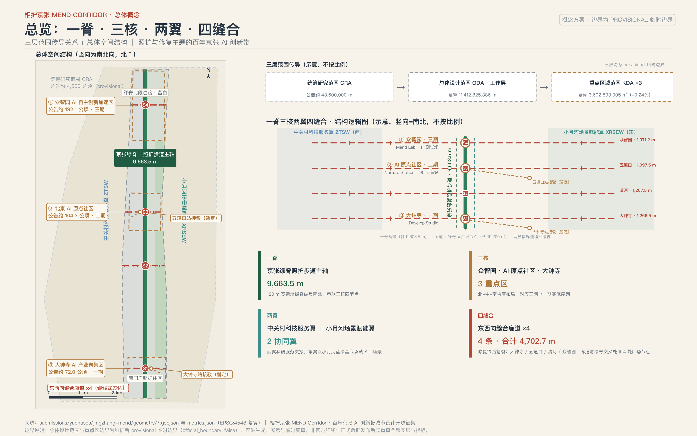
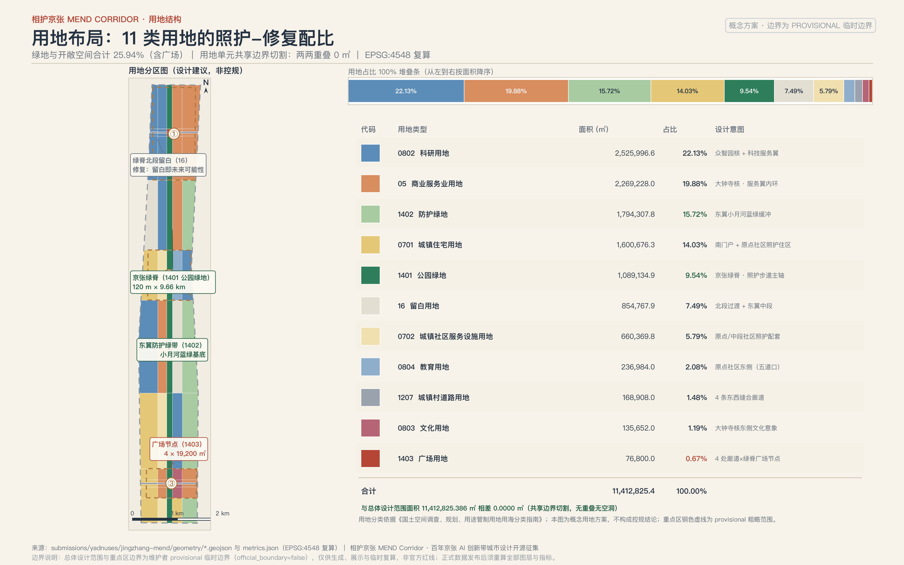
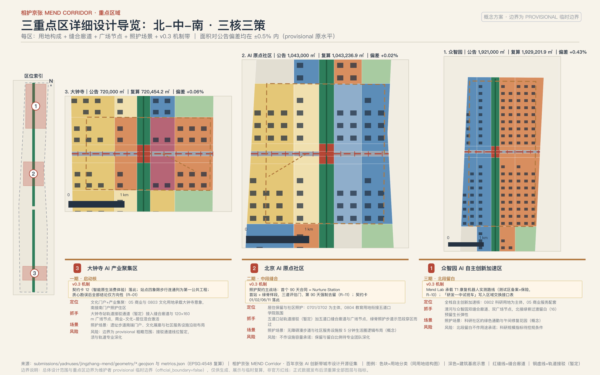
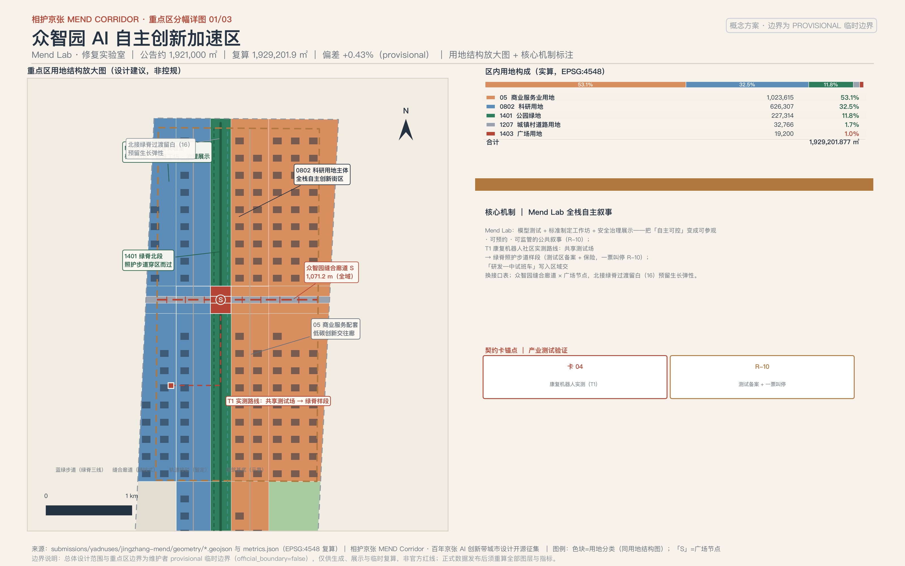
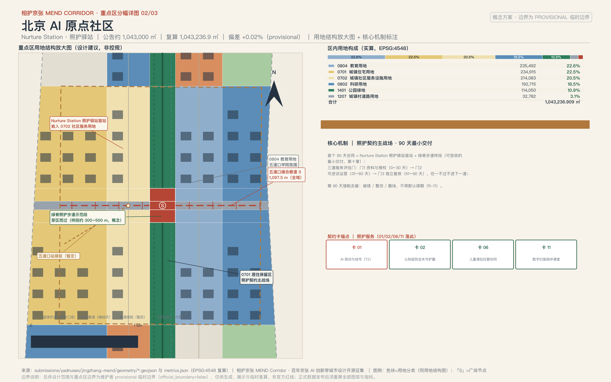
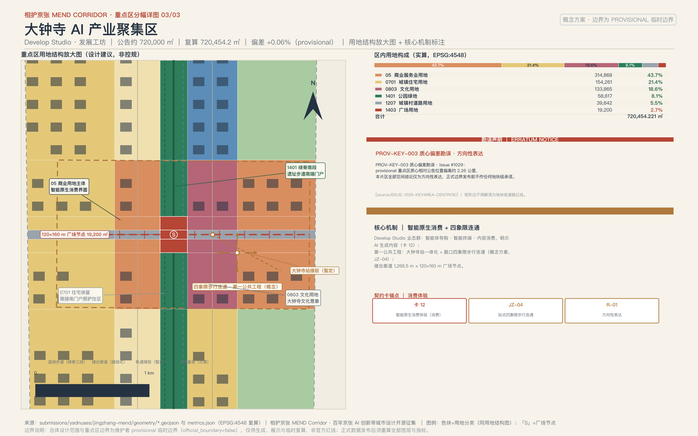
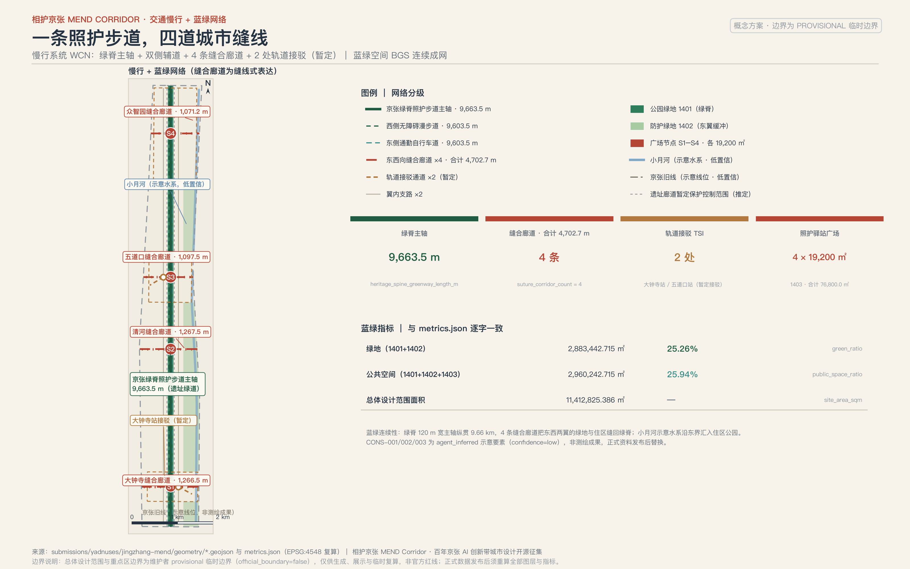
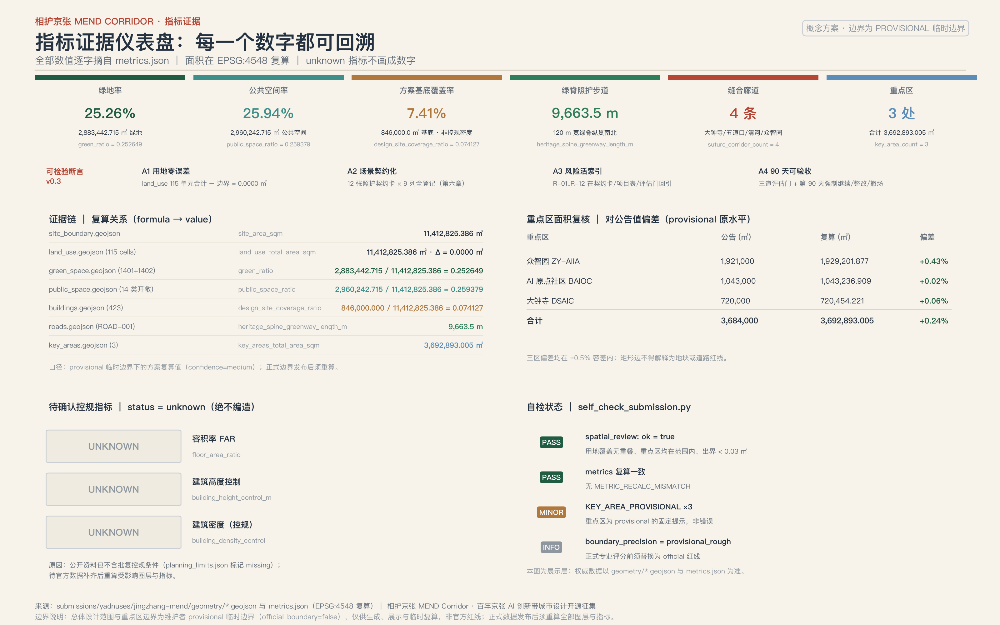
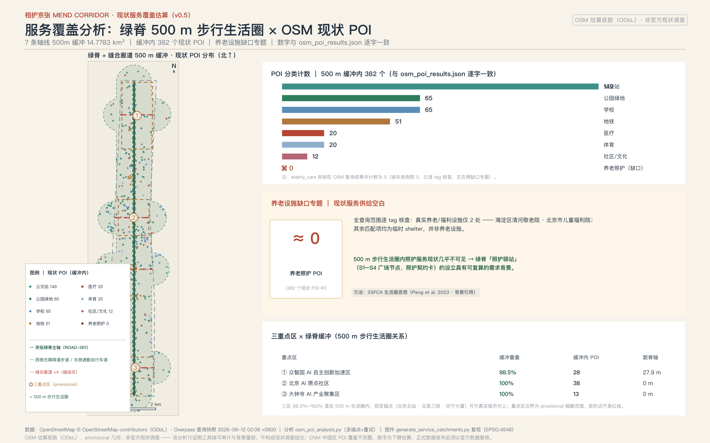

# 相护京张 MEND Corridor：照护与修复的百年京张AI创新带城市设计

## 开篇：给沿线居民的三分钟白话版

这一节不引用任何机器编号，只回答三件事：**谁在什么时候为谁做什么、出问题找谁、怎么叫停。**

**做什么。** 一百年前，京张铁路修复了中国人自主建造的信心；今天，这条带上被速度撕开的三种裂痕需要被修复：铁路把城市切成东西两半（空间裂痕），校区、园区、社区互不来往（社会裂痕），老人、儿童和低数字素养者被智能时代甩下（数字裂痕）。本方案建议沿京张绿脊建一条照护步道，在 AI 原点社区布一组照护驿站：白天帮老人挂号陪诊、傍晚接娃托管、周末开张社区共修工坊；四条约 40 米宽的东西向缝合廊道把被铁路分开的两半重新连起来，每个廊道口各有一处约 19200 平方米的广场节点，做市集、义诊和露天放映。第一步只做一件可以被验收的小事：在 AI 原点社区开张一个照护驿站首站，连同一段绿脊步道样段，90 天内由独立评估决定继续、整改还是撤场（详见第十章）。

**找谁。** 每一项 AI 服务都写在第六章的「照护契约卡」里：服务对象、运营主体（建议，正式任命前标「待任命」）、数据来源、隐私边界、人工复核入口、停止条件与退出机制一一对应。出了问题，先找卡片上写明的社区运营专员，再找街道与区级平台；每张卡都保留人工复核，任何 AI 判断都不能直接变成对居民的处置。

**怎么叫停。** 居民可以通过社区议事会要求任何场景下线整改，也可以在每张照护契约卡上找到三种动作：什么情况下一票叫停、凭什么恢复、多久复审一次；不想用 AI 时，每张卡都有对应的人工通道（电话、窗口、纸质登记），服务不会因为机器离线而中断。数据采集坚持最小必要，不做个人轨迹画像，不用于商业推荐；居民撤回同意后，相关服务记录会在 24 小时内删除。需要强调的是：本节所有安排都是概念建议，不是已经确定的政府决策或实施安排，落地路径、责任主体、退出机制与首个 90 天的验收安排见第十章。

## 设计依据与资料清单

本方案的第一依据是北京市规划和自然资源委员会海淀分局发布的《百年京张AI创新带城市设计国际方案征集资格预审公告》，其 1.3、1.4、1.5 条确定了项目目的、三层范围、三处重点区域和成果深度 [source:OFFICIAL-ANNOUNCEMENT] [standard:PROJECT-OFFICIAL-ANNOUNCEMENT]。第二依据是面向智能体的开源征集任务书，其十条共创原则、六项 agent 任务和统一边界条款约束本方案的叙事、场景与运营表达 [source:AGENT-TASKBOOK] [standard:PROJECT-AGENT-OPEN-CALL-TASKBOOK]。两者共同构成任务层证据，本方案的 23 条必选任务响应在 `compliance_matrix.json` 中逐条挂接。

资料可信度按三级区分，依据仓库资料登记表的用途边界执行 [source:SOURCE-REGISTRY]：formal 可用资料（公告、任务书摘录、五部有本地快照的法规标准）可直接支撑正文判断；background_only 资料只作背景，不升级为依据；provisional_only 资料只作 intake 线索。场地包中的枚举、限值、schema 与 provisional 几何是机器可读依据 [source:SITE-PACKAGE]，现状诊断与缺资料清单的深度要求由 [depth:existing_conditions_diagnosis] 约束。`data/processed/agent_fact_pack.md` 只是阅读导航层，事实判断一律回到原始登记材料 [source:PROCESSED-FACT-PACK]。

**官方文件检索台账（2026 年 8 月真实检索）。** 为避免把「没查过」误当「不存在」，本方案对任务关键事实做了真实公开检索，按「能证明／未获取／触发动作」三栏登记；未进入仓库 approved 登记表的来源一律只作背景，不升级为法定依据或评分证据。

| 检索目标 | 能证明（背景级） | 未获取 | 触发动作 |
| --- | --- | --- | --- |
| 征集公告官方出处 | 北京市规自委官网公告原文（2026-04-30 发布）：主办单位、三层范围、三区定位原文、征集时间线、知识产权条款 [source:OFFICIAL-ANNOUNCEMENT] | — | — |
| 沿线街区控规 | HD00-1601 等街区控规（草案）2024-12-19 至 2025-01-19 公示、2025-02-08 采信通告已发布 [source:JZRAIL-CORRIDOR-KG-ADOPTION]；2026 年海淀区政府工作报告确认「沿线街区控规通过技术审查、积极推进获批实施」 [source:HAIDIAN-GOV-REPORT-2026] | 逐地块容积率、建筑高度、建筑密度数值（仅见于公示附件图件，正文未公开） | 已查证确无公开数值：本方案对控规指标一律保持 unknown；正式附件发布后全量复核 |
| 城市更新政策链 | 《北京市城市更新条例》（2023-03-01 施行）确立「留改拆并举、以保留利用提升为主」与联合审查公示不少于 15 个工作日 [source:BJ-URBAN-RENEWAL-REGULATION]；《海淀区城市更新导则（2025 年版）》（海政发〔2025〕4 号）明确「53 平方公里人工智能创新街区、重点聚焦五道口和大钟寺先导区、重点围绕京张铁路遗址公园沿线更新」 [source:HAIDIAN-RENEWAL-GUIDE-2025] | 中办发〔2025〕34 号原文（仅见区导则引用文号） | 以区导则引用口径为准，不直接引用未获取文本 |
| 遗址公园现状 | 二期已于 2026-08-06 竣工开放：全线 9 公里带状绿廊、拆除全部封闭围挡、打通 9 条城市支路 [source:STDAILY-JZRAIL-PARK-OPEN] | 逐段开放边界与设施清单 | 官方逐段清单发布后复核绿脊衔接节点 |
| 三区运营状态 | 众智园媒体口径为「预计 2026 年 7 月具备开园条件、年底前全面开园运营」 [source:HDRM-ZZY-2026]；AI 原点社区约 3 平方公里、入驻企业超 400 家（媒体口径） [source:BJNEWS-AI-YUANDIAN] | 众智园「正式开园」官方公告 | 2026 年 10 月后复查开园状态；正文不写「已开园」 |
| 文保控制 | 清华园车站旧址保护范围与Ⅰ类/Ⅴ类建设控制地带原文（北京市文物局） [source:WWJ-QINGHUAYUAN-STATION] | 保护范围附图坐标 | 朝圣地标与导视节点设计对该范围保守避让 |

另需说明口径差异：「三区两翼」面积存在 43.6 平方公里（资格预审公告「统筹研究范围」口径）与 37 平方公里（市科委报道「二环至五环区域」口径 [source:BJ-KW-THREE-AREAS-2026]）两种表述，定义不同；本方案统一采用公告口径，37 平方公里仅作他源备注。本台账的完整检索记录（URL、发布方、日期、原文摘录）随方案迭代存档，供评审复核。

空间依据的现状必须坦白：官方 SITE_BOUNDARY 与三处 KEY_AREA 的精确 polygon 尚未发布，本包 `geometry/site_boundary.geojson` 与 `geometry/key_areas.geojson` 均来自维护者提供的 provisional 边界 [source:BOUNDARY-SOURCE] [source:KEY-AREA-SOURCE]，总体范围锚点为 [data:geometry/site_boundary.geojson#SITE-001]、重点区锚点为 [data:geometry/key_areas.geojson#PROV-KEY-001]。它们只能用于方案生成、自检、可视化与设计讨论，不能作为 official redline、审批依据或精确面积依据；总体设计范围复算面积 11412825.386 平方米 [metric:site_area_sqm]、重点区数量 3 处 [metric:key_area_count] 均为临时边界下的方案复算值。完整的来源、指标、标准、设计深度与任务覆盖保存在 `sources.json`、`metrics.json`、`standard_matrix.json`、`design_depth_matrix.json` 与 `compliance_matrix.json`，正文不复制机器索引。

## 三层范围工作框架

公告确立的三层范围是本方案的工作骨架 [depth:three_level_scope_framework]：统筹研究范围约 43.6 平方公里，回答 AI 产业生态与未来城市形态；总体设计范围约 11.4 平方公里（京张遗址公园周边 1-2 公里），落实城市更新总体框架与控规深度城市设计；重点区域范围约 368.4 公顷，对三处片区做规划综合实施方案深度的详细设计。

| 层级 | 公告面积 | 本方案回答的核心问题 | 数据落点 |
| --- | --- | --- | --- |
| 统筹研究范围 | 约 43600000 平方米 | MEND 产业生态、命名体系、区域协同回路 | compliance_matrix.json、第三章 |
| 总体设计范围 | 公告约 11400000 平方米，本包复算 11412825.386 平方米 | 一脊三核两翼四廊道的空间结构与更新框架 | [data:geometry/land_use.geojson#LU-001] |
| 重点区域范围 | 公告约 3684000 平方米，本包复算 3692893.005 平方米 | 三核各自的定位、场景与实施路径 | [data:geometry/key_areas.geojson#PROV-KEY-001] [metric:key_areas_total_area_sqm] |

**provisional 边界总声明。** 当前使用 `brief/site-package/geometry/provisional_boundaries.geojson`（PROV-RESEARCH-001 / PROV-SITE-001 / PROV-KEY-SCOPE-001 / PROV-KEY-001/002/003），按公告文字四至与约面积推定，面积以 EPSG:4548 复核 [depth:overall_spatial_structure]。该几何仅用于 intake 生成、可视化和讨论，不得作为 official redline、审批依据、精确面积依据或正式评分依据；组织方数据缺口本身不阻断内容评分、不导致扣分。官方边界发布后须整体重算的图层与指标为：site_boundary、key_areas、land_use、buildings、roads、green_space、public_space、phasing 八个图层，以及 `metrics.json` 全部 known 指标——届时重跑生成脚本、自检与图纸/HTML 流水线，不允许只替换单个文件。

**主动勘误（数据勘误即贡献）。** 本方案确认两处仓库级数据问题并在设计中规避：其一，Issue #1029 指出 provisional 重点区 PROV-KEY-003（大钟寺）质心相对公告描述位置偏离约 2.26 公里，因此本方案对大钟寺片区的一切空间结论只作方向性表达 [source:ISSUE-1029-KEYAREA-CENTROID]；其二，Issue #846 指出 provisional 总体设计范围与 OSM 实测的京张遗址公园最近距离约 412.5 米、并不相交，因此绿脊与遗址公园的空间关系按「概念廊道朝向遗址公园、具体衔接待 official 边界确认」处理 [source:ISSUE-846-SITE-PARK-GAP]。

在三层框架内，本方案的总体空间结构为「一脊、三核、两翼、四廊道」：**一脊**即京张绿脊，120 米宽、纵贯南北的照护步道主轴；**三核**自北向南为众智园（全栈自主硬核叙事）、AI 原点社区（照护场景主战场）、大钟寺（智能原生消费）；**两翼**为西侧中关村科技服务翼与东侧小月河场景赋能翼；**四廊道**为四条东西向缝合廊道，各带一处 19,200 平方米广场节点。该结构在第四章落为用地与图层，在第五章落为重点区详细设计。

## 统筹研究范围产业与未来城市研究

### 总体概念：相护京张 MEND

「相护京张 MEND Corridor」的一句话概念是：一百年前，京张铁路修复了中国人自主建造的信心；一百年后，这条带修复被速度撕裂的城市日常——AI 的价值不是更快，而是照护。MEND 拆为四个动词：**Mend（修复）** 缝合空间裂痕，**Empower（赋能）** 缝合社会裂痕，**Nurture（照护）** 缝合数字裂痕，**Develop（发展）** 让照护科技本身成为产业。三大定位由此自然落位：百年京张文化带 = 修复叙事（从修路到修城），都市 AI 生活体验带 = 照护场景，AI 融合创新带 = 照护科技与全栈自主产业。命名、定位与功能的统筹依据任务书要求展开，属于概念建议而非既定安排 [source:AGENT-TASKBOOK] [standard:PROJECT-AGENT-OPEN-CALL-TASKBOOK]。

### 定位与功能的空间落位：一张对照表，不再只藏在矩阵中

三大定位、五大功能与三区两翼的对应关系，此前只存在于 compliance_matrix.json 的机器索引里，评审要自己挖。现在把每一行落成 MEND 空间载体与「可验收含义」——每个定位与功能都能回答「做到什么程度算数」，不再只藏在矩阵中 [depth:overall_spatial_structure]：

| 定位 / 功能 | MEND 空间载体 | 可验收含义 |
| --- | --- | --- |
| 百年京张文化带 | 京张绿脊、詹天佑纪念节点、照护者荣誉墙 | 修复叙事可感知：纪念节点与荣誉墙素材全部原创清权、可追溯，文化内容不因 AI 下线而消失（R-06、R-12） |
| 都市 AI 生活体验带 | Nurture Station 照护驿站网络、四廊道广场节点 | 照护体验可拒绝、可叫停、可退回人工：每张照护契约卡都带 AI-OFF 等价路径与退出机制（R-09、R-11） |
| AI 融合创新带 | 三核两翼、四廊道、区域交换接口 | 产业闭环可复核：研发（众智园）—测试（小月河翼）—采用（大钟寺）—回流（交换接口表）形成回路（R-11） |
| AI 全栈自主创新体系 | Mend Lab 修复实验室（众智园） | 标准治理与模型测试可参观、可预约、可监管：测试状态、责任人、事故与整改公开（R-10） |
| 世界级 AI 创新生态 | 原点社区近校转化区、开源发布厅 | 转化链路可跟踪：课题制、孵化与转化记录可复核，不以虚构产值衡量（R-05） |
| AI+ 场景赋能新范式 | 12 张照护契约卡、T1-T3 测试验证场景 | 场景可验收：每卡带硬停止条件、恢复证据、照护服务评估窗与人工等价路径（R-10、R-11） |
| 智能化 AI 活力城市 | 绿脊照护步道、蓝绿公共空间、广场节点 | 日常照护可完成：无障碍、无 App、人工窗口与低扰动体验常态化可用（R-08、R-09） |
| AI 治理全球话语权 | R-01..R-12 风险编号、三道评估门、数据治理月报 | 治理可审计：风险回引、评估门记录与数据处置证明公开可查（R-11、R-12） |

表中 R-xx 为第十二章定义的风险索引编号，正文各章据此回引；表中「空间载体」「可验收含义」均为本方案的设计判断，不代表官方分工或既定安排。

### 六项 agent 任务的逐行应答（任务书显式映射）

任务书除公告 17 条必选任务外，还规定六项 agent 任务。本表把 agent.1-6 逐行翻译为 MEND 的可定位应答、证据位置与边界声明——每个应答都能在正文具体章节或 `compliance_matrix.json` 中查证，每行边界声明对应任务书统一边界条款的对应项 [source:AGENT-TASKBOOK] [standard:PROJECT-AGENT-OPEN-CALL-TASKBOOK]：

| agent 任务 | MEND 可定位应答 | 证据位置 | 边界声明（对应统一边界条款） |
| --- | --- | --- | --- |
| agent.1 一带总体概念与功能统筹方案设计 | MEND 四动词命名体系与 Logo 方向、「一脊三核两翼四廊道」总体空间结构、三区两翼协同交换接口表 | 本章「总体概念」「命名体系与 Logo 方向」「三区两翼协同与区域协同回路」；第四章空间结构落位；compliance_matrix.json | 命名、定位与功能均为概念建议；不使用未授权字体、商标、肖像与企业标识；不给控规数值、拆改留、道路红线与工程实施结论（条款①②③④） |
| agent.2 AI全栈自主创新体系与世界级AI创新生态设计 | 众智园 Mend Lab 全栈自主体系、原点社区近校转化区、中关村科技服务翼支撑机制、8 例全球案例镜鉴 | 本章「全球案例镜鉴」；第五章众智园与原点社区详设；第六章用户画像；compliance_matrix.json | 不编造企业名单、投资额、产值与财政承诺；产业招商、资金与政策安排不表述为已确定事项（条款⑤⑥） |
| agent.3 AI+场景赋能新范式与智能化AI活力城市设计 | 12 张照护契约卡（含 3 张产业测试验证 T1-T3）、7 类用户画像、场景-空间-运营映射与隐私边界 | 第六章场景卡表、画像表、映射段；第九章蓝绿公共空间；compliance_matrix.json | 全部场景保留人工复核与 AI-OFF 等价路径；不采集未成年人轨迹与健康信息；测试场景不表述为已批准运营（R-09、R-10） |
| agent.4 AI公共空间、智能原生新业态与朝圣地标设计 | 京张遗址公园 AI 公共空间（绿脊+广场节点）、四廊道东西缝合、大钟寺智能原生消费、3+1 处朝圣地标与荣誉展示体系 | 第九章蓝绿公共空间与朝圣地标段；第五章大钟寺详设；第六章场景卡 12；compliance_matrix.json | 不突破文保、绿地、蓝线与交通安全约束；不给桥隧与地下空间工程可行性结论；地标不娱乐化、不网红化；素材原创清权（R-06、R-12） |
| agent.5 百年京张文化、中关村文化与AI新文化融合叙事设计 | 「修路→修车→修城→修身」时间线叙事、文化资源系统（遗址廊道+清华园车站+北影）、四级导视符号系统、国际传播一句话叙事 | 第九章「文化叙事」段；第二章官方文件检索台账；compliance_matrix.json | 不歪曲历史事实；文化素材与导视系统原创清权；不混淆文化标识系统与一带总 Logo 系统（R-12） |
| agent.6 一带全球AI创新活动体系与长期运营设计 | 年度活动体系（照护者大会/修复工作坊/开发者开放日/过冬压力测试周）、「绿脊之友」长期运营机制、开发者转化路径、国际传播与招引转化 | 第十章「年度活动体系与长期运营」段、首个 90 天合同与三道评估门；compliance_matrix.json | 活动、招商、资金与政策安排均为设想，不表述为已确定的政府安排；预算只作轻/中/重定性量级（R-11） |

上表与公告 17 条必选任务合计 23 条，在 `compliance_matrix.json` 中逐条挂接章节、图层、指标、图纸与自检项；表中「边界声明」列只摘最相关条款，条款全文以任务书统一边界条款为准。

### 命名体系与 Logo 方向

子品牌由四个动词衍生，形成可扩展的命名系统：**Mend Lab 修复实验室**（众智园，全栈自主与标准治理）、**Empower Hub 赋能站**（小月河翼，场景测试与公共服务赋能）、**Nurture Station 照护驿站**（AI 原点社区，照护服务网络）、**Develop Studio 发展工坊**（大钟寺，智能原生消费与内容业态）。Logo 设计方向为「道钉 + 缝线」意象：一枚詹天佑时代的道钉，被一行缝线般的步道线穿过——道钉纪念自主营造，缝线象征修复与连接；色彩建议京张铁灰 + 新叶绿。本命名与 Logo 均为原创概念方向，不使用任何未经授权的字体、商标、人物肖像或企业标识，深化设计须另行清权。在此方向下已产出原创矢量初稿 `assets/identity/mend-mark.svg`（中英双版，道钉轮廓与缝线针脚的单色 mark），作为可供专业团队深化的视觉起点。

### 三区两翼协同与区域协同回路

三区两翼的分工即 MEND 的空间分工：众智园承担全栈自主的「硬核」，原点社区承担照护场景的「温度」，大钟寺承担智能原生消费的「界面」，中关村科技服务翼输出 IP 与资本赋能，小月河场景赋能翼提供测试场景与蓝绿基底 [depth:overall_spatial_structure]。区域协同是本次评审点名的普遍缺口，本方案把协同从五条叙事 bullet 升级为「交换接口表」：每一项协同都明确 MEND 可输出、期望回流、进入条件与退出条件，交换以公开方法与匿名化结果为单位，不以数据归集、人员调配或资金安排为前提 [depth:renewal_project_list]：

| 协同对象 | MEND 可输出 | 期望回流 | 进入条件 | 退出条件 |
| --- | --- | --- | --- | --- |
| 北纬社区（清河-上地方向） | 绿脊北延步道联系、照护驿站服务清单、社区食堂与托育点共享时段 | 居住腹地居民需求清单、照护服务使用反馈、志愿者资源 | 双方确认共享时段与最小数据边界；居民自愿参与（R-09） | 代表性不足、反馈无回应或数据边界被突破即暂停交换 |
| 未来科学城 | 「众智园研发—未来科学城中试」成果转化班车机制、测试协议模板 | 中试问题清单、可复现失败样本 | 双方明确责任与适用范围，结果可复核（R-10） | 结果被误作通用认证或责任不清即终止 |
| 怀柔科学城 | 年度照护科技论坛议题、测试场景清单共享 | 大科学装置相关科研策源课题、开放测试需求 | 专业审查与公开风险边界（R-06） | 无维护、退役或公众解释机制即不启动 |
| 北京经开区 | T1-T3 测试验证场景与场景开放机制互认、康复与低速配送测试规程 | 康复机器人、配送机器人量产前问题与制造侧验证场景 | 测试区备案、保险与责任主体齐备（R-10） | 供应商锁定或退出成本不可见即终止互认 |
| 京津冀 | 「京张体育文化旅游带」冬季照护与冰雪季韧性测试联动、跨区域传播叙事 | 跨区域慢行与照护场景缺口、评价反馈 | 各地法定程序与数据许可分别满足（R-09） | 任何一方把概念试验表述为审批或政绩承诺即退出 |

上表全部为机制建议：本方案未与任何机构达成合作、协议或意向，不构成已确定安排；无书面授权、无责任人、无合法数据时不启动（R-11）。

### 全球案例镜鉴（8 例，其中 2 例为背景级学术文献案例，均仅作方法论参考）

- **日本介护机器人集群（东京）**：以保险支付与产品认证牵引照护机器人产业——转化要点：照护科技需要支付方与标准先行，对应众智园的标准治理叙事。
- **丹麦照护建筑与福利设计体系（哥本哈根）**：把养老院设计成城市公共生活的参与者——转化要点：照护设施可以是开放街区的一部分，对应 Nurture Station 的临街界面。
- **首尔清溪川修复**：拆除高架、恢复水系的政治勇气与运营维护——转化要点：缝合基建割裂需要分期与运营并重，对应四廊道的阶段闸门。
- **纽约高线公园**：废弃铁路基础设施再生为公共廊道，以「运营之友」组织长期维护——转化要点：绿脊需要独立的长期运营主体，对应第十章运营机制。
- **新加坡乐龄数码计划**：国家层面推动老年人数字包容，保留非数字通道——转化要点：照护场景必须为低数字素养者保留人工窗口，对应第六章隐私与人工复核设计。
- **波士顿 AgeLab 产学研网络**：高校实验室把照护研究转译为产品与政策——转化要点：原点社区的近校转化机制可引入照护科技课题制。
- **宾夕法尼亚大学西费城锚定更新（Ehlenz, 2016，学术案例）**：高校作为锚定机构带动周边街区更新与住房韧性——转化要点：原点社区「近校型」定位与近校转化区机制有国际实证参考；锚定效应依赖长期持有与协同治理，海淀须以本地权属与实施条件为准 [source:ACAD-EHLENZ-ANCHOR-2016]。
- **伦敦 King's Cross 更新（Borsi & Schulte, 2018，学术案例）**：知识孤岛经站点更新与街区缝合转型为创新街区——转化要点：对应「社会裂痕修复」与校区-社区缝合叙事；更新时序、运营与分期机制须本地化，不照搬 [source:ACAD-BORSI-KINGS-CROSS-2018]。

未来城市形态的判断由此收束：AI 城市不是更快的城市，而是更会照护的城市；这一形态判断最终落到用地与公共空间结构 [data:geometry/land_use.geojson#LU-001] [data:geometry/public_space.geojson#PUBLIC-001]，并由城市设计标准对风貌与公共空间的统筹要求回接 [standard:MOHURD-URBAN-DESIGN-MEASURES]。

## 总体设计范围城市更新与控规深度城市设计

总体设计范围的空间结构为「一脊三核两翼四廊道」。用地以统一网格切割生成，相邻单元共享切割边界，两两重叠与覆盖空洞实测为零；用地分类采用国土空间用途管制分类指南的项目子集编码 [standard:MNR-LAND-USE-CLASSIFICATION-GUIDE] [depth:land_use_layout]。用地总复算面积 11412825.386 平方米，与总体范围边界面积差为 0 [metric:land_use_total_area_sqm]。

| 编码 | 用地 | 面积（平方米） | 占比 | 设计意图 |
| --- | --- | ---: | ---: | --- |
| 0802 | 科研用地 | 2525996.6 | 22.13% | 众智园核 + 中关村科技服务翼中段 + 原点社区东侧 |
| 05 | 商业服务业用地 | 2269228.0 | 19.88% | 大钟寺核、众智园东翼、服务翼内环 |
| 1402 | 防护绿地 | 1794307.8 | 15.72% | 小月河翼与边缘缓冲带，场景赋能翼蓝绿基底 |
| 0701 | 城镇住宅用地 | 1600676.3 | 14.03% | 南门户与原点社区居住保留区（照护腹地） |
| 1401 | 公园绿地 | 1089134.9 | 9.54% | 京张绿脊：120 米带状照护步道主轴 |
| 16 | 留白用地 | 854767.9 | 7.49% | 绿脊北段与东翼中段：留白即未来修复的可能性 |
| 0702 | 城镇社区服务设施用地 | 660369.8 | 5.79% | 原点社区与中段照护服务配套 |
| 0804 | 教育用地 | 236984.0 | 2.08% | 原点社区东侧，五道口学院氛围 |
| 1207 | 城镇村道路用地 | 168908.0 | 1.48% | 4 条东西向缝合廊道（各约 40 米宽） |
| 0803 | 文化用地 | 135652.0 | 1.19% | 大钟寺核东侧文化意象区 |
| 1403 | 广场用地 | 76800.0 | 0.67% | 4 个廊道×绿脊交叉广场节点（每处 19200 平方米） |

城市更新总体框架按「保留织补为主、廊道缝合优先、留白预留弹性」组织：1401+1402 构成 2883442.715 平方米的绿地基底 [metric:green_space_area_sqm]，1207+1403 构成缝合系统，16 留白用地承载分期弹性。所有用地表达均为概念建议；依据控规编制审批办法区分「已知控制条件、设计建议、待确认事项」三类语言 [standard:MOHURD-CONTROL-DETAILED-PLANNING]：本方案不掌握审定控规条件，容积率、建筑高度、建筑密度、绿地率、退线等一律记为待正式控规条件确认 [depth:development_intensity_controls]，不以推测值冒充审定指标。

产业功能布局上，科研与商业服务合计约 42% 的用地承载「1+X+1」产业体系的 AI 全栈与照护科技方向（该体系为 2026-02-28 海淀区高质量发展大会官方发布口径 [source:HAIDIAN-1X1-LAYOUT-2026]）；产业目标类指标（AI 创新指数、人才密度、产值规模）属于需要运营数据持续校准的建议方向，不写入审定结论，详见第十一章指标三分类。

## 重点区域详细设计

三处重点区均为 provisional 矩形边界（详见第二章勘误），以下设计达到「方向性详细设计」深度：定位、空间动作与场景明确，具体地块结论待 official polygon 补齐后深化 [depth:three_key_area_detailed_design] [metric:key_area_count]。

### 众智园 AI 自主创新加速区（Mend Lab 修复实验室）

锚定 [data:geometry/key_areas.geojson#PROV-KEY-001]（area_id: zhongzhiyuan_ai_acceleration_area，公告约 1921000 平方米，provisional 复算偏差 +0.43%）。定位为花园型全栈自主创新街区：以 0802 科研用地为主体，沿清河界面组织低碳创新交往廊；Mend Lab 承载模型测试、标准制定工作坊与安全治理展示，把「自主可控」从口号变成可参观、可预约、可监管的公共叙事。对外交通结合五环路区域一体化提出概念优化方向，具体线位待工程资料补齐。

### 北京 AI 原点社区（Nurture Station 照护驿站）

锚定 [data:geometry/key_areas.geojson#PROV-KEY-002]（area_id: beijing_ai_origin_community，公告约 1043000 平方米，偏差 +0.02%）。定位为近校型照护场景主战场：围绕清华、北大、中科院的原始创新组织孵化与转化，但把最好的沿街界面留给照护——Nurture Station 照护驿站网络嵌入 0702 社区服务用地，提供陪诊协助、儿童托管、数字扫盲课堂，并按「平急两用」预留应急庇护与物资分发功能（概念功能叠加，正式用途以批准程序为准）；校区、园区、街区之间以低扰动慢行缝合，更新方式以保留织补为主，拆改留仅作概念分类（第七章）。轨道站点一体化围绕五道口、清华东路西口提出概念组织。

### 大钟寺 AI 产业聚集区（Develop Studio 发展工坊）

锚定 [data:geometry/key_areas.geojson#PROV-KEY-003]（area_id: dazhongsi_ai_industry_cluster，公告约 720000 平方米，偏差 +0.06%）。定位为城市型智能原生消费街区：围绕智能体、智能终端与内容消费组织 Develop Studio 业态群，以大钟寺站一体化与路口四象限步行连通为第一公共工程（概念方案）。**勘误声明**：Issue #1029 确认 PROV-KEY-003 质心偏离约 2.26 公里 [source:ISSUE-1029-KEYAREA-CENTROID]，故本片区全部空间结论仅为方向性表达，正式边界发布前不作任何地块级承诺。

| 重点区 | 定位 | 第一空间动作 | 主场景 | 实施风险 |
| --- | --- | --- | --- | --- |
| 众智园 | 全栈自主硬核叙事 | 清河界面低碳创新廊 | 自主模型测试、标准治理展示 | 五环对外交通条件待核 |
| AI 原点社区 | 照护场景主战场 | 照护驿站网络嵌入 | 陪诊、托管、数字扫盲 | 校区边界与权属待核 |
| 大钟寺 | 智能原生消费界面 | 站点四象限步行连通 | 智能终端与内容消费 | 质心偏差（Issue #1029） |

## AI 创新生态、人才画像与 AI+ 场景

### 用户画像（7 类，照护弱势群体优先）

| 画像 | 典型一天 | 核心需求 | 空间响应 | 数据边界 |
| --- | --- | --- | --- | --- |
| 儿童 | 放学后经廊道广场回家 | 安全接送、课后托管、可玩的户外 | 缝合廊道安全通学径、广场游戏角 | 不采集未成年人轨迹；家长授权制 |
| 老人 | 上午看病、下午公园 | 挂号陪诊、慢行歇脚、有人说话 | 照护驿站陪诊台、绿脊适老休憩点 | 健康信息不采集，只做服务转介 |
| 残障人士 | 依赖无障碍动线出行 | 连续无障碍路径、可预判的路况 | 无障碍导航场景、廊道平顺接驳 | 匿名化路况数据，不关联个人身份 |
| 低数字素养居民 | 不会用 App 的摊贩与住户 | 人工窗口、现金可用、慢教学 | 驿站人工服务台、数字扫盲课堂 | 服务记录最小化，可随时删除 |
| 照护者（护工与家属） | 工作日照护、夜间焦虑 | 喘息服务、专业支持、被看见 | 喘息托管点、照护者荣誉墙（第九章） | 排班数据归机构，不做个人画像 |
| 开源开发者 | 夜间协作、周末黑客松 | 发布、协作、测试、社区声誉 | 原点社区开源发布厅、公共代码墙 | 活动数据只做聚合统计 |
| 初创团队 | 找场景、找算力、找钱 | 低成本试验场、合规咨询 | 众智园共享测试场、企业服务台 | 算力与数据服务另行授权 |

画像优先次序的学术支撑：老人与儿童画像及其空间响应参考「老幼共融」公共空间整合的系统综述（Liu, Thang & Zhang, Urban Studies, 2026）[source:ACAD-LIU-AGECHILD-2026] 与世界卫生组织《老年友好城市全球指南：特征清单》（WHO, 2007）[source:ACAD-WHO-AGEFRIENDLY-2007]——两者均为背景级参考，说明画像次序与适老适幼空间响应有学术出处，不构成服务承诺或审定标准。

### AI+ 照护契约卡（12 张，其中 3 张产业测试验证场景）

每张卡从「声明」升级为「照护契约」：在原有 users / context / data_inputs / public_value / risks / human_review 六字段之外，补齐四列（硬停止条件、恢复证据、照护服务评估窗、AI-OFF/人工等价路径）与三要素（失败模式、退出机制、运营方建议角色）。所有场景保留人工复核入口与居民叫停通道，空间载体落在具体图层 [data:geometry/public_space.geojson#PUBLIC-001] [data:geometry/roads.geojson#ROAD-001]；风险编号 R-xx 的量化触发器见第十二章。

**产业测试验证卡（T1-T3，先证安全再谈开放）**

| 卡号 / 场景（类型） | 空间载体 | 服务与人工复核 | 运营方（建议角色，待任命） | 硬停止条件（失败模式） | 恢复证据 | 照护服务评估窗 | AI-OFF / 人工等价路径 | 退出机制 |
| --- | --- | --- | --- | --- | --- | --- | --- | --- |
| 01 AI 陪诊与挂号助手（测试验证 T2） | Nurture Station 照护驿站首站 | 转介周边医院号源与陪诊志愿者；医疗建议一律人工复核，不越界诊断、不替代挂号系统 | 街道 + 社会运营机构（社区运营专员）；预算：轻量（待测算） | 失败模式：AI 输出诊断或用药类建议、号源信息过期、人工复核缺岗——触发即停（R-09、R-10） | 人工复核签字记录、号源时效核对台账、数据处置证明 | 90 天，与第十章首站合同同步 | 电话 / 窗口人工挂号与陪诊预约、纸质登记 | 服务撤回后 24 小时内删除转介记录，转为纯人工窗口（R-09） |
| 03 无障碍慢行导航（测试验证 T3） | 绿脊步道与四廊道 [data:geometry/roads.geojson#ROAD-001] | 路况众包 + 低侵入传感；路线建议标注「非审定交通方案」；无障碍顾问复核 | 无障碍 / 交通专业 + 公园运营方；预算：中等（待测算） | 失败模式：无障碍主链断裂、路线被误读为审定方案、路况数据代表性不足——停数字引导（R-03、R-10） | 现场审计、参与者复核、可逆修正记录 | 学期，与 T3 测试备案周期同步 | 实体导视、盲道与过街音响、人工问询点 | 测试备案到期未续即撤除测试组件，恢复普通步道（R-11） |
| 04 康复机器人社区实测（测试验证 T1） | 众智园共享测试场至驿站路线 | 康复辅具机器人在真实社区限速实测；安全员全程陪同 | 场景运营方 + 监管部门（测试区备案与保险）；预算：轻量（待测算） | 失败模式：安全员缺岗、急停失效、限速被突破、人机混行事故——一票叫停（R-10） | 安全演练记录、故障绕行方案、保险与备案齐备 | 单次许可，每场测试前复核 | 普通步道保持开放，人工陪护走普通路线 | 测试期结束设备撤场，恢复原状（R-10、R-11） |

**照护服务与公共体验卡（其余 9 张）**

| 卡号 / 场景（类型） | 空间载体 | 服务与人工复核 | 运营方（建议角色，待任命） | 硬停止条件（失败模式） | 恢复证据 | 照护服务评估窗 | AI-OFF / 人工等价路径 | 退出机制 |
| --- | --- | --- | --- | --- | --- | --- | --- | --- |
| 02 认知症防走失守护圈（服务） | 原点社区居住保留区 | 家属授权的电子围栏提醒；社区专员人工确认后响应；仅提醒不跟踪 | 社区运营专员 + 街道；预算：轻量（待测算） | 失败模式：未经家属书面授权启用、围栏误报连续超限、专员缺岗——停用（R-09、R-10） | 授权文件、围栏校准记录、响应台账 | 90 天，家属续签授权 | 纸质联系卡 + 邻里互助网络、社区值班电话 | 家属撤回授权后 24 小时内删除全部围栏与位置数据（R-09） |
| 05 社区助餐与低速配送（服务） | 社区食堂—居住单元 | 低速配送机器人助餐；人机混行限速与人工接管 | 街道 + 配送运营机构；预算：轻量（待测算） | 失败模式：限速被突破、人工接管失效、占道影响通行——停运（R-10） | 限速校准记录、接管演练、占道整改回执 | 每月 | 人工配送、食堂自取、普通货架 | 停运后机器人撤场，订单转人工配送（R-11） |
| 06 儿童课后托管协同（服务） | 驿站托管点、廊道安全通学径 | 接送对接与临时托管；家长授权、社工复核；不采集未成年人轨迹 | 社工 + 社区运营专员；预算：轻量（待测算） | 失败模式：未经家长授权、托管超时未对接、社工缺岗——停止接收新托管（R-09） | 授权文件、对接记录、社工排班表 | 学期 | 纸质接送卡、电话确认、人工托管登记 | 授权撤回后 24 小时内删除托管记录（R-09） |
| 07 京张文化 AI 导览（体验） | 绿脊与纪念节点 [data:geometry/green_space.geojson#GREEN-001] | 多语种史实导览；史实经文史顾问复核，AI 生成内容明确标注 | 文旅部门 + 文化运营平台；预算：轻量（待测算） | 失败模式：无来源史实、生成内容未标注、素材未清权——下架内容（R-12） | 来源—主张核对记录、清权台账 | 年度，史料修订时触发重审 | 固定展签、实体导览牌、志愿者讲解 | 下架后 24 小时内删除已发布内容（R-12） |
| 08 企业服务 Copilot（产业） | 中关村科技服务翼 | 政策与服务目录导航；明确不替代专业法律意见 | 园区平台 + 专业服务机构；预算：中等（待测算） | 失败模式：政策信息过期、输出被误读为审批结论、目录更新滞后——下线（R-09） | 来源新鲜度台账、人工移交记录 | 季度 | 窗口咨询、电话热线、纸质服务目录 | 来源过期即退回人工目录（R-11） |
| 09 公共安全与活动运营复核（治理） | 广场节点与活动路线 | 人流与风险辅助研判；任何处置决定由人作出 | 活动主办方 + 监管部门；预算：中等（待测算） | 失败模式：自动处置倾向、人流数据过度采集、无人值守——停用（R-09、R-10） | 处置人工签字、数据范围核验、值守排班 | 每次活动前后 + 季度 | 人工巡查、现场指挥、纸质预案 | 活动结束 24 小时内删除活动数据，恢复常态管理（R-09） |
| 10 社区共修工坊（运营） | Develop Studio 与驿站 | 修家电、修鞋、修代码的技能匹配；线下运营 | 社区自组织 + 驿站运营专员；预算：轻量（待测算） | 失败模式：技能匹配误导、线下安全隐患——停办整改（R-11） | 工坊安全检查记录、志愿者登记表 | 季度 | 公告栏报名、现场登记、人工配对 | 工坊评估不达标转通用社区用房（R-11） |
| 11 数字扫盲陪伴课堂（服务） | 驿站人工服务台 | 一对一慢教学，教材开源；零数据采集 | 社工 + 志愿者；预算：轻量（待测算） | 失败模式：出现任何数据采集、教学越界——停课整改（R-09） | 课程记录（不含个人信息）、志愿者培训台账 | 学期 | 全程人工窗口，本就无 AI 依赖 | 服务记录最小化，可随时删除（R-09） |
| 12 大钟寺智能原生消费体验（消费） | 大钟寺商业服务业用地 | 智能体导购与内容消费；明示 AI 生成内容 | 商业运营方 + 平台；预算：中等（待测算） | 失败模式：未授权交易、误导性交互、AI 内容未标注——下架（R-12） | 权限台账、内容标注复核、投诉回执 | 季度 | 人工柜台、现金支付、普通导购 | 撤销权限恢复普通摊位（R-11、R-12） |

**契约纪律（三要素卡级化）**。每张卡的四列与三要素构成可验收的照护契约：①运营方未具名前不得上线，任何「建议角色」在正式任命前不构成承诺主体（R-11）；②硬停止条件任一触发即执行对应动作，一票叫停、限期整改（R-10）；③恢复证据不齐不得恢复运行（R-03、R-10）；④照护服务评估窗到期未作继续/整改/撤场决定，不得默认续期（R-11）；⑤AI-OFF 等价路径在任何时候保持可用，服务不因机器离线而中断（R-08、R-09）。测试验证卡另受测试区备案与保险约束，未过安全评审不得进入开放空间（R-10）。

**方法谱系（背景级）**。照护驿站网络的设施供需与服务覆盖判断，方法思路参照生活圈视角的设施配置与高斯两步移动搜寻法（2SFCA）研究（Peng et al., Journal of Urban Management, 2023）[source:ACAD-PENG-2SFCA-2023]；T3 无障碍慢行导航参考北京中心城区残障人士公共设施可达性评估的同城研究（Sun et al., Geospatial Health, 2026）[source:ACAD-SUN-BJ-ACCESS-2026]。上述文献仅说明本方案分析思路有学术出处，不把任何方法、数值或结论升级为本项目的审定依据。

### 场景—空间—运营映射与隐私边界

场景不是口号：体验与治理类场景落在 2960242.715 平方米的公共空间基底上 [metric:public_space_area_sqm]，服务类场景落在 0702 社区服务用地与驿站网络，测试验证类场景（T1-T3）只在划定的测试路线与时段内运行，并建议与北京经开区等场景开放机制互认。开放空间占比 0.259379 [metric:public_space_ratio] 与绿地占比 0.252649 [metric:green_ratio] 是照护场景的物理容量上限，场景密度不得反噬慢行与休憩体验。

合规边界逐条对齐：生成式 AI 服务仅在「向境内公众提供生成内容」的适用边界内引用相关管理要求，安全评估义务亦按其条文边界理解 [standard:GENERATIVE-AI-INTERIM-MEASURES]；无障碍场景呼应无障碍设施与主体工程「五同步」、盲道与过街音响、信息无障碍条款 [standard:BARRIER-FREE-ENVIRONMENT-LAW]；传统服务与智能创新并行的原则作为政策参照，其 2020-2022 阶段目标已到期，不写作 2026 年仍执行的法律义务 [standard:ELDERLY-SMART-TECH-PLAN-2020-45]。数据边界统一由 R-09 约束：最小必要、不采集健康与未成年人轨迹、撤回即删（24 小时内），任何越界行为触发对应卡级硬停止条件；所有场景均为概念建议，未写成已批准运营。

## 用地、建筑规模与拆改留方案

用地布局见第四章结构表，本节聚焦建筑与拆改留。建筑图层表达 423 栋示意建筑基底，落在 0701/0702/05/0802/0803/0804 单元内，按用地映射功能类型，单元覆盖率封顶 10%-16% [data:geometry/buildings.geojson#BLDG-001] [metric:building_footprint_area_sqm]；基底合计 846000.0 平方米，方案基底覆盖率 0.074127 [metric:design_site_coverage_ratio]——该值是方案示意值，**不是控规建筑密度**，两者严格区分。

拆改留分类只给方法、不给结论 [depth:retain_renovate_demolish]：建议按「保留利用 / 改造提升 / 更新重建 / 待确认」四级分类框架深化，但现状建筑轮廓、高度、用途、建成年代与宗地权属均缺失（对应 GAP-BUILDING-001、GAP-PARCEL-001），任何具体建筑的保留或拆除判断都不得在本方案中作出。建筑高度、体量、屋顶形态与界面只作风貌方向性引导 [depth:height_massing_character]。

控规类指标全部保持 unknown：容积率 [metric:floor_area_ratio]、建筑高度控制 [metric:building_height_control_m]、建筑密度控制 [metric:building_density_control] 在公开场地包中标记为 missing，本方案不给数值结论；待正式控规条件补齐后重算 [depth:development_intensity_controls]。

## 交通、轨道、市政与公共服务设施

交通组织的第一命题是「缝合」：铁路造成的慢性割裂由 4 条东西向缝合廊道修复 [metric:suture_corridor_count]，每条廊道在与绿脊交叉处放大为 120×160 米的广场节点。慢行骨架为「一脊两带」：绿脊绿道主轴复算长度 9663.5 米 [metric:heritage_spine_greenway_length_m]，西侧步行带与东侧骑行带伴行 [data:geometry/roads.geojson#ROAD-001]；两条轨道接驳线（大钟寺站、五道口站方向）为暂定概念。跨环路、跨铁路的慢行断点只提概念对策（上跨或平交口改善的方向比选），不给工程线位与施工可行性结论——道路红线与断面缺失（GAP-ROAD-001） [depth:traffic_rail_slow_parking]。

市政与新型基础设施按「照护负载」重新理解：端侧算力驿站与社区服务点合设，让 AI 服务在本地完成推理、减少数据出门；分布式能源与光伏廊架结合绿脊休憩点布置；非机动车停放与静态交通围绕站点与广场节点组织。以上均为体系建议：市政管线、消防、防洪排涝条件缺失（GAP-MUNICIPAL-001），不做管线迁改或容量测算结论 [depth:municipal_new_infrastructure]。约束图层中的京张旧线示意线位与小月河示意水系仅为低置信度现状表达，非测绘成果 [data:geometry/constraints.geojson#CONSTRAINTS]。

## 蓝绿空间、公共空间与城市风貌

蓝绿系统以京张绿脊为骨架：120 米宽、9663.5 米长的公园绿地主轴贯穿南北，叠加防护绿地后绿地合计 2883442.715 平方米、绿地占比 0.252649 [metric:green_ratio]；加上广场节点后公共空间合计 2960242.715 平方米、占比 0.259379 [metric:public_space_ratio] [data:geometry/green_space.geojson#GREEN-001]。照护步道的空间语言是适老化的：连续遮荫、不大于 1:12 的坡道方向、每 300-500 米一处带座椅与直饮水的休憩点（概念标准，供专业团队深化）。**平急两用**：照护驿站与广场节点按「日常照护+应急庇护」双用组织功能叠加——日常承担陪诊、托管与数字扫盲，应急时作为社区庇护与物资分发点，双用切换以人工预案与可逆设施为前提，不引入新的自动处置。该功能叠加的思路参考应急资源优化配置的研究启示（Tang et al., Nature Sustainability, 2026：其模拟显示优先改造高赤字区应急设施的效益成本比可超 28、折合人均成本约 1.39 美元）[source:ACAD-TANG-FLOOD-2026]——此处仅借其「设施供需匹配、改造优先序」的方法启示，不把该研究的城市样本与数值外推为本项目的承诺值。清河界面承载众智园的低碳叙事，小月河作为东翼蓝绿基底以示意水系表达（非测绘成果）。

**AI 朝圣地标（3+1，均为概念建议）**：①**詹天佑自主营造纪念节点**——绿脊上的道钉雕塑群与「人」字形铺地，纪念中国人自主修建的第一条干线铁路；②**照护者荣誉墙**——本方案最独特的荣誉体系：护工、家属照护者与照护科技开发者的名字并列上墙，每年增补，把「照护者」定义为 AI 时代的英雄；③**AI 原点开源贡献墙**——以可编程灯光展示开源项目的真实贡献记录（经项目方授权）；④备选：大钟寺智能原生消费客厅，作为公众体验智能体与智能终端的第一界面。地标、导视与 Logo 系统共用「道钉+缝线」母题，全部须原创清权，不使用未经授权的字体、图像、肖像与企业标识；不得娱乐化、网红化 [standard:MOHURD-URBAN-DESIGN-MEASURES]。

**文化叙事（agent.5 核心）**：京张精神的时间线是「修路→修车→修城→修身」——1909 年修路（自主营造的信心）、当代修车（高铁与智能装备的产业自信）、今天修城（缝合被速度撕裂的城市）、最终修身（AI 时代的照护伦理与公民修养）。文化资源系统以京张铁路遗址廊道（暂定保护控制范围，provisional）为第一约束 [data:geometry/constraints.geojson#CONSTRAINTS]，叠加清华园火车站、北影等资源的叙事节点建议；导视标识符号系统从道钉母题延展为四级导视（地标—节点—廊道—驿站）。国际传播叙事主打一句话：「The railway that taught China to build now teaches AI to care.」文保控制范围缺失（GAP-HERITAGE-001），一切文化与公共空间设计保持保守 [depth:blue_green_public_space]。

## 更新项目清单、实施政策与分期计划

### 更新项目清单（8 项，概念建议）

| 编号 | 项目 | 类型 | 主要依赖 | 证据 |
| --- | --- | --- | --- | --- |
| JZ-01 | 京张绿脊照护步道一期 | 蓝绿/慢行 | 遗址公园衔接、official 边界 | [data:geometry/green_space.geojson#GREEN-001] |
| JZ-02 | 四条缝合廊道与广场节点 | 交通/公共空间 | 道路红线、跨线工程条件 | [data:geometry/roads.geojson#ROAD-001] |
| JZ-03 | Nurture Station 照护驿站网络 | 公共服务（平急两用） | 0702 用地、运营主体 | [data:geometry/land_use.geojson#LU-001] |
| JZ-04 | 大钟寺站四象限步行连通 | 轨道一体化 | 站点条件、市政管线 | [data:geometry/public_space.geojson#PUBLIC-001] |
| JZ-05 | Mend Lab 与清河创新界面 | 产业/蓝绿 | 河道蓝线、生态防洪条件 | [data:geometry/constraints.geojson#CONSTRAINTS] |
| JZ-06 | 照护者荣誉墙与导视系统 | 文化/品牌 | 清权、文保核实 | [data:geometry/constraints.geojson#CONSTRAINTS] |
| JZ-07 | 端侧算力驿站试点 | 新基建 | 能源与运营授权 | [data:geometry/buildings.geojson#BLDG-001] |
| JZ-08 | 社区共修工坊与活动路线 | 运营 | 公共空间使用许可 | [data:geometry/phasing.geojson#PHASE-001] |

### 可实施性矩阵（评审点名缺口专项回应）

| 项目 | 责任主体（建议） | 许可路径（建议） | 预算量级 | 基线 | 阶段闸门 | 退出机制 | 关联风险 |
| --- | --- | --- | --- | --- | --- | --- | --- | --- |
| JZ-01 照护步道 | 区园林绿化部门+公园运营方 | 绿地改造项目审批 | 中（待测算） | 现状慢行断点清单 | 官方边界确认后立项 | 未过闸门则退回步道维护级投入 | R-01、R-03、R-06 |
| JZ-02 缝合廊道 | 区交通与规自部门 | 道路工程立项 | 重（待测算） | 东西向过街耗时实测 | 红线与工程条件确认 | 只做平面改善，不做立体工程 | R-03、R-07 |
| JZ-03 照护驿站 | 街道+社会运营机构 | 社区服务设施备案 | 轻（待测算） | 老人儿童底数（待核） | 首站 90 天评估门 1-3 | 评估不达标则转为通用社区用房 | R-08、R-09、R-11 |
| JZ-06 荣誉墙 | 文旅部门+运营平台 | 公共艺术备案 | 轻（待测算） | 提名与清权机制 | 文保核实通过 | 移至室内展陈 | R-06、R-12 |
| JZ-07 算力驿站 | 园区平台公司 | 新型基础设施试点申报 | 中（待测算） | 社区算力需求调研 | 试点期能耗与安全评估 | 到期未续则设备撤场 | R-07、R-10 |
| 测试场景 T1-T3 | 场景运营方+监管部门 | 测试区备案与保险 | 轻（待测算） | 场景卡基线指标 | 阶段安全评审 | 一票叫停、限期整改 | R-10、R-11 |

注：预算只作轻/中/重定性量级，投资测算待正式数据补齐；任何不可执行的实施承诺，本方案一律不作。分期与 [data:geometry/phasing.geojson#PHASE-001] 对应：一期收敛为「Nurture Station 照护驿站首站 + 一段绿脊样段」的最小可验收交付（即下一小节约定的首个 90 天合同，轻量先行），二期原点社区+中段（照护网络成形），三期众智园核+北段留白（硬核产业与留白激活） [depth:renewal_project_list] [depth:phasing_implementation]。

### 首个 90 天：照护驿站首站 + 绿脊样段（可签收的最小交付合同）

一期不再承诺整段绿脊或全区驿站，而是收敛为一个**可以被验收的最小交付**：**Nurture Station 照护驿站首站 + 一段绿脊步道样段**（样段长度取一个照护休憩点间距，约 300-500 米，概念长度）。90 天是最长照护服务评估窗口；准确选址与规模在评估门 1 内核定，当前不承诺开工、不承诺运营，运营主体在正式任命前一律标「待任命」，不把建议机构冒充为已确定主体 [data:geometry/phasing.geojson#PHASE-001] [data:geometry/land_use.geojson#LU-001]。首站按「平急两用」预留应急庇护功能（日常照护+应急庇护双用，第九章）：应急切换以人工预案为前提，不纳入日常 AI 服务流程，不改变本合同的照护服务评估范围。

**RACI 责任表**（A/R/C/I 在任命前全部保持「待任命」）：

| 工作流 | A 问责（待任命） | R 执行（待任命） | C 征询 | I 告知 |
| --- | --- | --- | --- | --- |
| 驿站空间与公共服务准入 | 待任命街道照护试点问责人 | 待任命社区服务运营机构、现场运营专员 | 规划、消防、无障碍、民政专业 | 沿线居民、驿站使用者、维护者 |
| 服务数据与人工复核 | 同一问责人 | 数据治理专员、社区运营专员（社工复核） | 数据保护、隐私专业、居民代表 | 服务对象与家属、社区议事会 |
| 叫停、撤场与数据处置 | 同一问责人 | 现场运营专员（拥有即时叫停权） | 街道、民政、数据治理专业 | 全体使用者与附近社区 |
| 第 90 天去留 | 待组建街道 + 专业 + 居民联合评估组 | 独立评估团队（未参与试运营者） | 运营、维护、使用者与非使用者 | 社区议事会与公开评估窗 |

**三道服务评估门**（每道都带不通过动作，任何一道不过都不进入下一道）：

| 评估门 | 主题 | 通过条件 | 不通过动作 | 关联风险 |
| --- | --- | --- | --- | --- |
| 门 1 资料与授权门（第 0-30 天） | 选址与授权 | 驿站选址与使用许可核验完成；居民底数与照护服务需求清单登记；RACI 角色到岗；场景卡 01/02/06/11 改写为可执行服务规程 | 资料不全不设点、不开业；角色未任命不进入试运营 | R-04、R-08、R-11 |
| 门 2 可逆试运营门（第 31-60 天） | 低扰动试运营 | 只开放人工窗口与轻量 AI 辅助；投诉与叫停台账上线；数据最小化与撤回 24 小时删除规程生效；高风险服务输出 100% 人工复核 | 试运营不达标（投诉未闭合、人工复核缺岗、数据越界）即暂停并限期整改，30 天内复评 | R-09、R-10 |
| 门 3 独立复核门（第 61-90 天） | 独立复核与去留 | 未参与试运营的专业人员 + 居民代表复核全部停止条件与恢复证据；评估记录、投诉台账、数据处置证明、空间恢复图齐备 | 复核不通过不进入常态运营，转入整改或撤场 | R-11、R-02 |

**到期强制去留决定**：第 90 天必须作出「继续 / 整改 / 撤场」三选一的书面决定，不得默认续期（R-11）。继续＝进入常态运营并纳入季/月/周/常态运营节律；整改＝限期 30 天内复评，期间保持人工窗口可用；撤场＝拆除全部可逆构件、24 小时内删除相关数据、恢复原空间并以空间恢复图回执。决定依据在社区议事会与数据治理月报中公开。

**第 90 天交接包**固定包含：①门 1-门 3 评估记录（含不通过与整改动作）；②投诉与叫停台账（含响应时间）；③数据处置证明（最小化清单 + 撤回删除记录）；④照护服务评估窗结论与下一周期计划；⑤空间恢复图与可逆构件清单；⑥RACI 角色任命与到岗记录。缺任一项只能整改或撤场，不能带缺口进入常态运营（R-11）。

### 12 个月试点路径（S0-S4）

首个 90 天合同是全年路径中的 **S1 最小交付**：它只承诺「照护驿站首站 + 绿脊样段」一件事，用三道评估门与强制去留决定验证照护契约是否可运行；只有 S1 通过评估门，后续阶段才按序放行。全年路径按阶段只做增量，任何阶段未过退出条件即暂停或收缩到既有可逆范围 [depth:phasing_implementation]：

| 阶段 | 只做什么 | 退出条件 |
| --- | --- | --- |
| S0 准备期（第 1-2 月） | 居民底数与照护需求清单登记；驿站选址与使用许可核验；RACI 角色到岗；场景卡 01/02/06/11 改写为可执行服务规程（即评估门 1 的全部内容） | 门 1 未通过：不设点、不开业，进入整改或撤场（R-04、R-08） |
| S1 最小试点（第 3-5 月，即首个 90 天合同） | 照护驿站首站 + 一段绿脊样段；只开放人工窗口与轻量 AI 辅助；投诉与叫停台账、数据最小化与撤回 24 小时删除规程上线；独立复核与去留决定（评估门 2、3） | 第 90 天未作继续 / 整改 / 撤场三选一书面决定即自动撤场；整改 30 天内不复评即撤场（R-11） |
| S2 照护网络成形（第 6-9 月） | 原点社区 2-3 处驿站扩展与廊道广场活动排期；把 S1 验证过的数据边界、人工复核与评估节律复制到新站点 | S1 未过评估门不进入；任一站点触发硬停止条件即整改或撤场（R-09、R-10） |
| S3 硬核产业与留白激活（第 10-11 月） | 众智园 Mend Lab 参观线概念深化；大钟寺四象限步行连通方案比选；留白用地临时使用策划 | official 边界或控规数据未发布前不落地块级结论（R-01、R-02）；文保核实未过不移位地标（R-06） |
| S4 常态运营与扩容复核（第 12 月起） | 全年节律（季 / 月 / 周 / 常态）与年度活动体系落地；扩容复核门——新站点、新场景须重新通过评估门与照护服务评估窗 | 年度评估不达标即收缩至既有可逆范围；扩容未过门即不启动（R-11） |

上表为本方案的概念建议实施路径，不构成已确定的时间表或政府承诺；各阶段闸门以第十章评估门与第十二章 R 编号为执行依据，任何阶段都不因「规划已定」而跳过评估。

### 年度活动体系与长期运营（agent.6，均为概念建议）

年度活动按 MEND 四动词排布：春季**照护者大会**（荣誉墙增补仪式+照护科技展）、夏季**修复工作坊**（社区共修日与高校联合设计周）、秋季**开发者开放日**（开源贡献墙点亮+场景测试招募）、冬季**过冬压力测试周**（暴雪极寒情景下的照护调度演练，呼应京张-冰雪叙事）。长期运营建议设立独立运营的「绿脊之友」机制（借鉴高线公园经验），负责场景开放审批、活动排期、数据治理年报与居民议事会召集；开发者社区以贡献墙与场景测试积分形成转化路径；国际传播通过照护科技论坛与京津冀联动放大。所有活动、招商、资金与政策安排均为设想，不表述为已确定的政府安排 [source:AGENT-TASKBOOK]。

## 指标体系、面积复算与合规矩阵

指标分三类管理 [depth:metrics_recalculation]：第一类可由提交几何直接复算（下表）；第二类依赖官方控规或任务书附件，保持 unknown（容积率、建筑高度控制、建筑密度控制，reason 见 `metrics.json`）；第三类需运营数据持续校准（AI 创新指数、人才密度、场景使用频次等），只作方向建议。

### 核心主张的可检验断言

本节把方案的关键主张压成一张「一句话可检验」表：每条主张都能在指定文件或图层上用一段脚本或一次复算当场判真假，不依赖正文表述。数字与 `metrics.json` 逐字一致，R 编号与第十二章风险表一致；其中承重两行由机器工件 `visual/assets/care-contracts.json` 及其校验脚本（退出码 0 即全部断言通过）执行验证 [metric:land_use_total_area_sqm] [metric:green_ratio]。

| 核心主张 | 验证位置 | 通过判据（一句话） |
| --- | --- | --- |
| 用地 11 类完整分割、无空洞无重叠 | geometry/land_use.geojson + metrics.json | land_use_total_area_sqm 与 site_area_sqm 面积差为 0 |
| 绿地率 25.26% 可从 GeoJSON 复算 | geometry/green_space.geojson + metrics.json | green_space_area_sqm ÷ site_area_sqm = 0.252649 |
| 12 张照护契约卡全部含退出机制 | visual/assets/care-contracts.json | 12 卡齐全、必填字段非空、每卡 exit_mechanism 非空 |
| 每卡硬停止条件关联的 R 编号可在第十二章回引 | visual/assets/care-contracts.json + 校验脚本 | 全部 R-xx 均存在于第十二章风险表行首 |
| 每卡量化触发器与风险表逐字一致 | visual/assets/care-contracts.json + 校验脚本 | 触发器文本与风险表「量化触发器」列完全相等 |
| 每卡空间载体 feature id 真实存在 | visual/assets/care-contracts.json + geometry/*.geojson | space_carrier 的 `<file>#<id>` 均能在对应图层查到 |
| 场景类型二分正确（T1-T3 测试验证） | visual/assets/care-contracts.json type 字段 | 3 张 test_verification + 9 张 service_experience |
| 绿脊步道主轴长度 9663.5 米可复算 | geometry/roads.geojson#ROAD-001 | 中心线在 EPSG:4548 下复算长度与指标一致 [metric:heritage_spine_greenway_length_m] |
| 控规类指标保持 unknown 不渲染数值 | metrics.json + render_proposal_html.py | floor_area_ratio 等三项为 null，HTML 不出现强度数值 |
| 90 天合同到期强制三选一去留 | proposal.md 第十章 + R-11 | 第 90 天未作继续 / 整改 / 撤场决定即自动撤场 |

上表全部为概念建议的完整性自检，不构成审批结论；未知数据的披露纪律见 `metrics.json` 与第十二章风险表。

| 指标 | 数值 | 公式与来源 | 置信度 |
| --- | ---: | --- | --- |
| site_area_sqm | 11412825.386 | polygon_area(site_boundary)，EPSG:4548 | medium（provisional） |
| land_use_total_area_sqm | 11412825.386 | sum(land_use cells)，与边界差 0 | medium |
| green_space_area_sqm | 2883442.715 | 1401+1402 并集面积 | medium |
| green_ratio | 0.252649 | green_space_area_sqm / site_area_sqm | medium |
| public_space_area_sqm | 2960242.715 | 1401+1402+1403 并集面积 | medium |
| public_space_ratio | 0.259379 | public_space_area_sqm / site_area_sqm | medium |
| building_footprint_area_sqm | 846000.0 | 423 栋示意基底并集 | medium（示意） |
| design_site_coverage_ratio | 0.074127 | 基底/总面积（非控规密度） | medium |
| key_area_count | 3 | 重点区计数 | high |
| key_areas_total_area_sqm | 3692893.005 | 重点区面积和（对公告 3684000 偏差 +0.24%） | medium |
| heritage_spine_greenway_length_m | 9663.5 | 绿脊绿道中心线长度 | medium |
| suture_corridor_count | 4 | 缝合廊道计数 | medium |

指标三分类与风险编号联动（R 编号定义见第十二章）：第一类复算指标受 R-01 约束，official 边界发布即触发整体重算；第二类 unknown 指标对应 R-02，在控规五项控制值解除 missing 前不得被任何图件或 HTML 渲染为数值；第三类运营校准指标由 R-09（数据最小化）与 R-11（到期评估）约束，协议先于目标值——只定义测量方法，不填虚假达标线，照护服务评估窗的达成与否由独立评估组判断。

复算方法：坐标存储 EPSG:4326，面积与长度统一在 EPSG:4548（CGCS2000 三度带，中央经线 117E）下计算；用地由统一网格切割生成，两两重叠为零。合规矩阵覆盖公告 17 条必选任务与 agent 任务书 6 条任务（合计 23 条），每条挂接章节、图层、指标、图纸、HTML 区块、来源、假设与自检项，见 `compliance_matrix.json`；标准响应与深度项完成状态分别见 `standard_matrix.json`（9 条标准，其中 1 条因原文缺失记为 data_gap）与 `design_depth_matrix.json`（15 个核心项全部 complete）。unknown 指标不得被任何图件或 HTML 渲染为数值，正式提交前以 official 数据触发整体重算 [source:SITE-PACKAGE]。

### 工具链复算证据

本方案的每一条空间主张都可被同一套真实工具链复核，而非纸面宣称。几何生成脚本为纯确定性流程：重跑结果与提交的 8 个几何/指标文件逐字节一致，用地覆盖缺口 0.000000 平方米、单元两两重叠 0 平方米。独立断言脚本（geopandas 1.1.4 + shapely 2.1.2，EPSG:4548）从 `geometry/` 图层实算并通过全部 13 项检查：用地并集面积与场地边界差 −0.000008 平方米；三个重点片区全部位于场地内；与公告约面积的偏差为场地 +0.11%、众智园 +0.43%、AI 原点 +0.02%、大钟寺 +0.06%，均小于 1%，偏差源于公告"约"值口径而非几何错误。核心指标由图层直接复算：`green_ratio` 实算 0.252649332、`public_space_ratio` 实算 0.259378604，与 `metrics.json` 记录值差异小于 4×10⁻⁷——提交的指标不是填表数字，而是图层实算结果 [metric:site_area_sqm]。官方校验器四道关卡全部 PASS，`spatial_review` 仅 3 条 KEY_AREA_PROVISIONAL minor 备注（组织方数据缺口，不阻断内容计分）。证据链命令可在提交目录内一键复现：

| 验证环节 | 关键输出 | 结果 |
| --- | --- | --- |
| 几何确定性复现（生成脚本重跑） | 覆盖缺口 0、两两重叠 0、8 文件与提交版逐字节一致 | 通过 |
| 用地完整性（独立断言脚本） | 并集−边界 = −0.000008 平方米；3 片区全部位于场地内 | 通过 |
| 公告面积偏差 | +0.11% / +0.43% / +0.02% / +0.06%（均 <1%） | 通过 |
| 指标复算 | green_ratio / public_space_ratio 与 metrics.json 差 <4×10⁻⁷ | 通过 |
| 官方校验器 | deterministic / spatial / visual / professional 四关卡 PASS | 通过 |

临时边界下的面积偏差属 provisional 近似，正式红线发布后按 R-01 触发整体重算。

### 外部现状估算（OSM 服务覆盖快照）

除几何自洽性外，本方案用公开数据对外部现状做了一次真实工具链探查：以 provisional 轴网（绿脊三线 + 四缝合廊道）为轴作 500 米缓冲，合成 14.7783 平方公里步行生活圈（EPSG:4548 复算），经 Overpass 拉取 OSM 现状 POI 逐 tag 分类（2SFCA 生活圈方法映射，背景引用 [source:ACAD-PENG-2SFCA-2023]）。结果显示生活圈内共 382 个现状 POI——公交 149、公园 65、学校 65、地铁 51、医疗 20、体育 20、社区文化 12，而**养老照护类约为 0**：全查询范围逐 tag 核查，真实养老/福利设施仅 2 处，余者均为临时 shelter。三重点区与生活圈重叠 98.5%–100% [source:SRC-OSM-OVERPASS-SNAPSHOT-20260812]。

该估算为照护驿站（S1–S4 广场节点）提供了可复算的现状缺口背景：照护需求不是凭空设定，而是公开数据可核的空白。**边界声明**：该分析只证明工具链可审计与背景量级，不构成现状调查结论；OSM 为估算底数（ODbL 许可）、几何为 provisional，中国区覆盖不完整，数字为下限估算，正式数据发布后须复核——OSM 不作 official boundary、不作现状底图（R-01、R-04 纪律同样适用于外部数据）。

## 风险、版权与合规说明

**数据缺口四句法声明**（缺口→影响→可接受来源→纪律，对应 R-01..R-08 编号）：①三层范围 official polygon 缺失（GAP-BOUNDARY-001/002，R-01）——空间结论仅为概念建议，待官方红线发布后整体重算，不得把 provisional 边界写成 official_constraint；②控规条件缺失（GAP-CONTROL-001，R-02）——强度指标保持 unknown，不得给出审定容积率、建筑高度或建设规模；③道路红线断面缺失（GAP-ROAD-001，R-03）——廊道只做概念组织，不给工程线位结论；④宗地权属缺失（GAP-PARCEL-001，R-04）——更新项目只写概念分区，不指定拆改留结论；⑤现状建筑底数缺失（GAP-BUILDING-001，R-05）——423 栋为示意布局，不编造高度层数；⑥文保范围缺失（GAP-HERITAGE-001，R-06）——文化与地标设计保持保守，不突破文保、绿地、蓝线与交通安全约束；⑦市政条件缺失（GAP-MUNICIPAL-001，R-07）——市政策略只作体系建议；⑧公服底数缺失（GAP-SERVICE-001，R-08）——不编造学校、医疗、养老设施容量 [depth:risk_missing_data] [data:geometry/constraints.geojson#CONSTRAINTS]。

**风险编号体系：从声明到活索引（R-01..R-12）**。数据缺口、场景风险与运营风险统一编号并全局回引：第六章照护契约卡、第十章项目表与三道评估门均按编号引用；每条风险带量化触发器、缓解动作与人工复核角色——风险不是声明，而是被反复引用的活机制 [depth:risk_missing_data]：

| 编号 | 风险 | 关联缺口 / 依据 | 量化触发器 | 缓解动作 | 人工复核角色 |
| --- | --- | --- | --- | --- | --- |
| R-01 | 三层边界未定 | GAP-BOUNDARY-001/002 | official redline 发布即触发全包重算；任何将 provisional 边界写成 official_constraint 的表述作废 | 第二章总声明与勘误登记 | 维护者 + 规自专业 |
| R-02 | 控规条件缺失 | GAP-CONTROL-001 | planning_limits.json 五项控制值解除 missing 前，任何图件 / HTML 不得渲染强度数值 | 全部指标保持 unknown 并标注待确认 | 控规实施与建筑测绘人员 |
| R-03 | 道路红线断面缺失 | GAP-ROAD-001 | 未取得红线与断面前不得给工程线位；绿脊样段实施前须完成概念放线复核 | 只做概念组织与方向比选 | 交通专业 |
| R-04 | 宗地权属缺失 | GAP-PARCEL-001 | 未核权属前不得指定拆改留、不得进入地块级工程 | 只做概念分区与待核条件 | 规自 + 法务 |
| R-05 | 建筑底数缺失 | GAP-BUILDING-001 | 423 栋示意基底被误读为现状或审定建筑即撤回该表达 | 全部标注示意布局 | 建筑专业 |
| R-06 | 文保范围缺失 | GAP-HERITAGE-001 | 文保控制线发布前，荣誉墙 / 地标 / 样段落点保持方向性；与文保冲突即迁移 | 保守设计，不突破四线 | 文保专业 |
| R-07 | 市政条件缺失 | GAP-MUNICIPAL-001 | 管线、消防、防洪容量未取得前不做迁改结论 | 只做体系建议 | 市政专业 |
| R-08 | 公服底数缺失 | GAP-SERVICE-001 | 不编造学校、医疗、养老设施容量；驿站服务容量以实际底数为上限 | 只提服务体系与待核清单 | 公共服务专业 |
| R-09 | 照护数据最小化与撤回删除 | 第六章照护契约卡数据边界 | 居民撤回同意后 24 小时内删除对应服务记录；健康信息只转介不落库；数据越界即停采 | 卡级数据边界 + 数据处置证明 | 数据治理专员 + 街道 |
| R-10 | 场景安全与人工接管失效 | 第六章照护契约卡人工复核 | T1-T3 安全员缺岗 / 急停失效 / 限速被突破即一票叫停；叫停请求 48 小时内回执闭合 | 安全演练、测试区备案与保险 | 现场安全员 + 社区运营专员 |
| R-11 | 运营漂移与到期未决 | 第十章评估门与去留决定 | 90 天到期未作继续 / 整改 / 撤场决定即自动撤场；评估不达标不得默认续期 | 三道服务评估门 + 强制去留决定 | 街道 + 独立评估组 + 居民代表 |
| R-12 | AI 内容合规与清权 | 第六章照护契约卡 07 / 12 | 无来源主张、生成内容未标注、素材未清权即下架；撤回后 24 小时内删除已发布内容 | 文史顾问 + 版权专员复核 | 文史与版权专员 |

编号回引纪律：任何章节引用 R-xx 时，触发条件、缓解动作与复核角色以本表为准；本表随缺口清单与评审意见更新，更新须在变更说明中登记（R-11）。

**主动勘误**：Issue #1029（PROV-KEY-003 质心偏差约 2.26 公里）与 Issue #846（总体范围与实测遗址公园不相交）已在第二章声明并在第五章降级大钟寺片区结论精度 [source:ISSUE-1029-KEYAREA-CENTROID] [source:ISSUE-846-SITE-PARK-GAP]。

**标准缺口**：《建筑工程设计文件编制深度规定（2016 年版）》原文未能取得，本方案仅将其列为待补资料项（data_gap），不作为已满足的权威依据 [standard:MOHURD-ARCH-DESIGN-DEPTH-2016]。

**版权与责任**：全部文本、几何、图件、HTML 由声明的 AI 智能体生成或派生自已登记的清权来源；字体、图像、代码与数据逐项权利清册见 `report/copyright_statement.md`。本方案不代表任何政府部门的审批结论或背书，不构成投资、用地与实施承诺；不使用任何未获授权的企业数据与个人隐私数据；AI 智能体对事实、来源、版权与表达负责，接受维护者与专业评审依据自检结果要求返修 [source:SITE-PACKAGE] [source:SOURCE-REGISTRY]。

## 参考资料

1. 北京市规划和自然资源委员会海淀分局：《百年京张AI创新带城市设计国际方案征集资格预审公告》，2026-05-09。
2. open-city.ai：《百年京张AI创新带 · 面向智能体开源征集任务书》（场地包摘录），2026-05-18。
3. 住房和城乡建设部：《城市设计管理办法》（住建部令第 35 号），2017。
4. 住房和城乡建设部：《城市、镇控制性详细规划编制审批办法》（住建部令第 7 号），2011。
5. 自然资源部：《国土空间调查、规划、用途管制用地用海分类指南》（自然资发〔2023〕234 号），2023。
6. 全国人民代表大会常务委员会：《中华人民共和国无障碍环境建设法》，2023。
7. 国务院办公厅：《关于切实解决老年人运用智能技术困难的实施方案》（国办发〔2020〕45 号），2020。
8. 国家网信办等：《生成式人工智能服务管理暂行办法》，2023。
9. 场地资料包 `brief/site-package/`：设计任务书、枚举、限值、schema 与 provisional 几何。

**学术文献（全部背景级，不升级为依据）**：
10. Tang J, et al. Human mobility dynamics for cost-effective flood emergency resource allocation. *Nature Sustainability*, 2026.（平急两用功能叠加的方法启示）
11. Liu Y, Thang LL, Zhang Y. Can age-friendly and child-friendly urban public spaces be integrated? *Urban Studies*, 2026.（老幼共融画像与空间响应）
12. Sun Y, et al. Accessibility evaluation of urban basic public service facilities for people with disabilities in Beijing. *Geospatial Health*, 2026.（T3 无障碍导航同城研究）
13. Peng J, et al. Study on the optimal allocation of public service facilities from the perspective of life circle. *Journal of Urban Management*, 2023.（2SFCA 设施供需方法思路）
14. Ehlenz MM. Neighborhood revitalization and the anchor institution. *Urban Affairs Review*, 2016.（原点社区近校型锚定案例）
15. Borsi K, Schulte C. Universities and the City: From islands of knowledge to districts of innovation. *The Journal of Architecture*, 2018.（King's Cross 校区-社区缝合案例）
16. World Health Organization. Global Age-friendly Cities: A Guide — Checklist of Essential Features. 2007.（老年友好城市特征清单）

完整机器可读索引以 `sources.json` 与三个矩阵文件为准，本节不复制文件清单；书目入口的登记与许可边界以场地包与资料登记表为准 [source:SITE-PACKAGE] [source:SOURCE-REGISTRY]。
