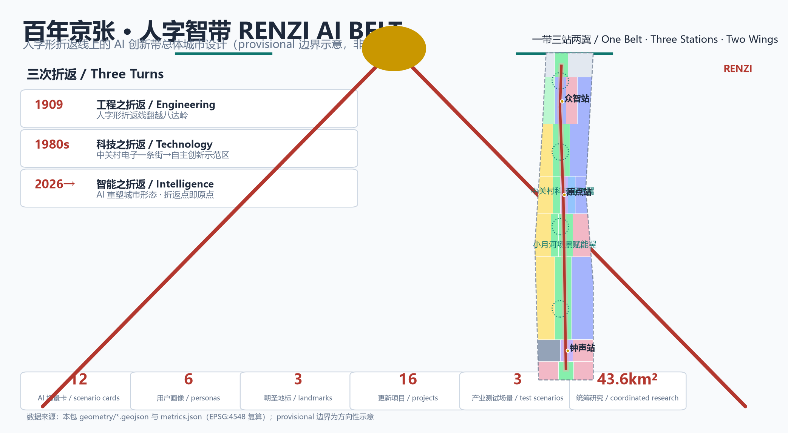
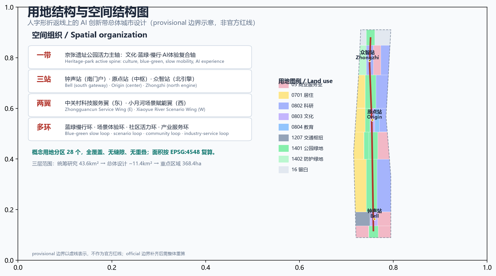
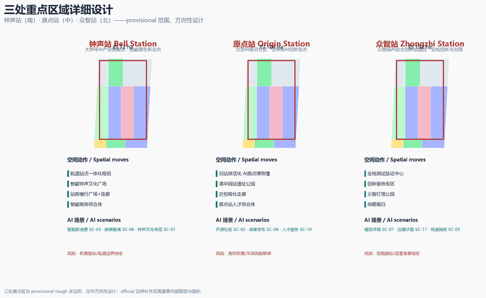
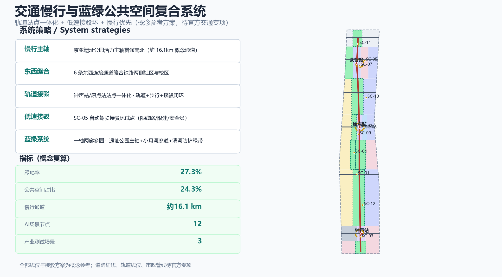
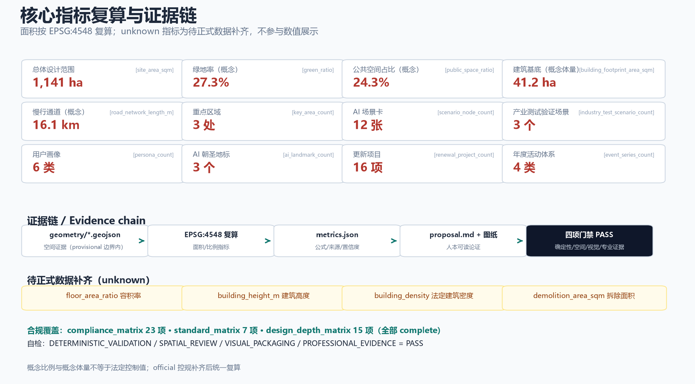

# 百年京张·人字智带——人字形折返线上的AI创新带总体城市设计

## 设计依据与资料清单

本方案以北京市规划和自然资源委员会海淀分局发布的《百年京张AI创新带城市设计国际方案征集资格预审公告》为第一依据，以《面向全球智能体开展"百年京张AI创新带城市设计开源征集"的任务书摘录》为智能体任务依据，并读取了仓库 `brief/site-package/` 中经维护者登记的临时粗略边界、重点区域、枚举、指标区间与来源清单 [source:OFFICIAL-ANNOUNCEMENT] [source:AGENT-TASKBOOK] [standard:PROJECT-OFFICIAL-ANNOUNCEMENT]。所有设计判断均拆分为可追溯来源、可复算指标、可校验图层和可人工复核的假设；正式引用的完整记录保存在 `sources.json`、`standard_matrix.json` 与 `design_depth_matrix.json`，不在正文重复机器索引 [source:SOURCE-REGISTRY]。

当前仓库尚未取得官方精确红线，本包使用 `brief/site-package/geometry/provisional_boundaries.geojson` 的临时粗略多边形（`geometry_role=provisional_constraint`、`official_boundary=false`）用于方案生成、可视化和入口自检；该边界不得作为官方红线、审批依据或精确面积复算依据 [data:geometry/site_boundary.geojson#SITE-001] [source:PROVISIONAL-BOUNDARIES]。本方案据此复算总体设计范围约 **1141 公顷**（11.41 km²），与公告约 11.4 km² 一致；official polygon 补齐后，site boundary、key areas、land use、roads、green space、public space、buildings、phasing 与全部面积指标需统一重算 [metric:site_area_sqm]。

资料边界：`data/source_registry.json` 区分 formal-ready、background-only 与 provisional-only 三类资料。本方案仅把公告与任务书（formal-ready）用于任务依据和范围事实；把京张铁路历史、中关村发展历程、京张高铁开通及全球创新街区案例作为 background-only 背景材料，逐条登记来源与用途限制，不将背景材料升级为法定控制或实施承诺 [source:SOURCE-REGISTRY]。

> 图中 provisional 边界以淡色虚线表达，视觉主体为设计意图与空间结构，不作为官方红线。
## 三层范围工作框架

三层范围不是相互割裂的图纸集合，而是"产业战略—总体城市设计—重点片区详细设计"的逐级传导：统筹研究范围解决**产业链与未来城市形态**如何组织，总体设计范围解决**更新项目、用地、交通、蓝绿与风貌**如何落图，重点区域范围验证**三处片区**的具体空间方案与 AI 场景可实施性 [depth:three_level_scope_framework] [standard:PROJECT-OFFICIAL-ANNOUNCEMENT]。

| 层级 | 官方面积 | 本方案工作目标 | 数据落点 |
| --- | --- | --- | --- |
| 统筹研究范围 | 约 43.6 km² | 世界级AI创新生态、三区两翼协同回路、未来AI城市形态研究 | `compliance_matrix.json`、`standard_matrix.json` [metric:coordinated_research_area_sqm] |
| 总体设计范围 | 约 11.4 km²（本包复算 1141 公顷） | 空间结构、用地布局、更新项目、交通轨道、蓝绿公共空间、风貌 | [data:geometry/land_use.geojson#LU-001] [metric:site_area_sqm] |
| 重点区域范围 | 约 368.4 公顷 | 钟声站（大钟寺）、原点站（AI原点社区）、众智站（众智园）详细设计 | [data:geometry/key_areas.geojson#PROV-KEY-001] [metric:key_area_count] |

三层范围均以"人字折返"为统一母题：统筹层形成"一带三站两翼多环"的产业空间结构，总体层把结构落实为 28 个概念用地分区（[metric:land_use_parcel_count]），重点层在三个站区验证节点、建筑与场景。三处重点区边界为 provisional rough 多边形，只用于方向性设计讨论，不构成地块或道路红线结论 [data:geometry/key_areas.geojson#PROV-KEY-002] [source:PROVISIONAL-BOUNDARIES]。official polygon 补齐后，重点区面积与内部图层需按官方边界重算并重新自检。

## 统筹研究范围产业与未来城市研究

### 3.1 总体概念：人字智带（RENZI AI BELT）

1909 年，京张铁路以青龙桥"人字形折返线"翻越八达岭，用智慧战胜了 33‰ 的陡坡——这是中国自主设计施工第一条干线铁路的"第一次折返" [source:HERITAGE-JINGZHANG]。1980 年代起，中关村从电子一条街走向国家自主创新示范区，完成"第二次折返" [source:HERITAGE-ZHONGGUANCUN]。今天，这条走廊要完成"第三次折返"：把铁路之轨、科技之轨转为**智能之轨**，让城市在折返中再次爬升。

**主名称：人字智带**（英文 **RENZI AI BELT**）。"人字"既指京张铁路人字形折返线这一世界级工程符号，也指向 AI 时代"以人为本"的城市治理伦理——折返点是坡度与力量的交汇，也是历史与未来的原点 [source:AGENT-TASKBOOK] [standard:PROJECT-AGENT-OPEN-CALL-TASKBOOK]。

**命名体系（一带三站两翼）**：主轴为"京张人字轴"（Jing-Zhang RENZI Axis）；三处重点区以铁路"站"为命名母题——**钟声站**（大钟寺AI产业集聚区，回应"大钟寺"地名与智能钟声文化）、**原点站**（北京AI原点社区，AI 开源与人才的原点）、**众智站**（众智园AI自主创新加速区，全栈创新与治理话语权）；两翼为**中关村科技服务翼**（要素与资本服务）与**小月河场景赋能翼**（场景与生活体验） [depth:overall_spatial_structure]。

**Logo 方向（人字标）**：以两条铁轨在"折返点"交汇形成的几何"人"形为母题——∧ 形双轨 + 顶点圆点（折返点/原点节点）+ 底部路基平行线。配色采用"京张锈红（遗产）+ 海淀智青（创新）+ 荣誉金（纪念）"三色体系；标志可延展为导视、站区标识、活动品牌与荣誉轨铭牌，形成统一视觉识别 [depth:overall_spatial_structure]。Logo 为概念方向，未经授权不使用任何既有机构标志、字体或企业标识。

**空间结构：一带三站两翼多环**。"一带"为京张遗址公园活力主轴（文化、蓝绿、慢行、AI 体验复合轴）；"三站"为南门户钟声站、中枢原点站、北引擎众智站；"两翼"为东侧中关村科技服务翼与西侧小月河场景赋能翼；"多环"为蓝绿慢行环、场景体验环、社区活力环、产业服务环。该结构直接落实为 `geometry/land_use.geojson` 的概念用地分区 [data:geometry/land_use.geojson#LU-001]。

### 3.2 三大定位、五大功能与三区两翼协同回路

三大定位——**百年京张文化带**（人字轴历史一撇）、**都市AI生活体验带**（人字轴生活一捺）、**AI融合创新带**（折返点上的创新引擎）——在空间上分别对应文化主轴、生活服务网络与三站产业节点 [source:OFFICIAL-ANNOUNCEMENT]。

五大功能映射：**AI全栈自主创新体系**→众智站；**世界级AI创新生态**→原点站；**AI+场景赋能新范式**→小月河场景赋能翼与钟声站；**智能化AI活力城市**→京张人字轴生活带与公共空间系统；**AI治理全球话语权**→众智站模型评测与安全治理试验场 [depth:overall_spatial_structure]。

**三区两翼协同回路**：原点站（人才与开源）→ 众智站（全栈与治理）→ 钟声站（业态与消费）→ 中关村科技服务翼（服务与资本）→ 小月河场景赋能翼（场景与体验）→ 回到原点站，形成"人才—研发—产业化—服务—场景—人才"的闭环 [source:AGENT-TASKBOOK] [standard:PROJECT-AGENT-OPEN-CALL-TASKBOOK]。该回路是概念性产业协同建议，不构成招商、投资或政策承诺。

### 3.3 全球 AI 创新生态案例与可转化机制（5-8 例）

| 案例 | 核心机制 | 向本方案的转化 |
| --- | --- | --- |
| 中关村国家自主创新示范区（海淀） | 高校—院所—企业—资本—政策五元协同 | 原点站"近校转化走廊"、中关村翼"一站式要素服务" [source:HERITAGE-ZHONGGUANCUN] |
| 深圳湾科技生态园 | "园区即社区"的产城融合复合园区 | 钟声站"智能原生复合街区"，功能混合与24小时活力 [source:CASE-SHENZHEN-BAY] |
| 杭州未来科技城与之江实验室 | 头部平台+实验室+场景开放 | 众智站"全栈测试验证场"与场景开放数据平台 [source:CASE-HANGZHOU] |
| 新加坡纬壹科技城 one-north | 政府主导的"工作—生活—学习—娱乐"一体园区 | 三站 TOD 综合体与蓝绿慢行网络 [source:CASE-ONENORTH] |
| 伦敦国王十字知识区 | 老工业区更新+大学机构与科技企业共建知识街区 | 京张遗址公园沿线"轨道遗产更新带" [source:CASE-KINGS-CROSS] |
| 日本柏之叶智慧城市/首尔数字媒体城 | 公共空间即智能场景试验场、多方共建运营 | 小月河翼"公共空间即试验场"与AI场景开放运营 [source:CASE-KASHIWA] |

以上案例为 background-only 背景参考，用于提炼空间与运营机制，不作为对本区域的承诺或对照结论 [source:SOURCE-REGISTRY]。

### 3.4 未来 AI 城市形态与 AI+交通

面向 AI 新质生产力，统筹研究提出"三层智能城市形态"：**智能底座**（端侧算力、数据空间、新型基础设施）、**智能场景**（AI+交通、公共服务、公共空间）、**智能治理**（城市智能体、人工复核、公众参与） [depth:municipal_new_infrastructure]。AI+交通方面，以"轨道站点一体化 + 低速自动驾驶接驳 + 慢行优先"为骨架，提出概念性接驳环线与站点换乘策略（详见第 8 章），所有线位与接驳方案均为参考方案，待官方道路红线、轨道与交通专项深化 [data:geometry/roads.geojson#ROAD-001] [depth:traffic_rail_slow_parking]。
## 总体设计范围城市更新与控规深度城市设计

### 4.1 设计判断

总体设计范围（约 1141 公顷）的更新逻辑是：**以京张遗址公园主轴为"缝合线"，把断裂的铁路廊道转化为连续的城市公共空间与创新界面** [depth:overall_spatial_structure] [standard:MOHURD-URBAN-DESIGN-MEASURES]。概念用地分区按"中部留绿、南北置能、两翼宜居"组织：中部遗址公园与蓝绿廊道形成开放空间骨架（[metric:land_use_area_sqm_1401]），南北三站布置产业与商业节点，东西两翼布置居住、科研与社区服务（[metric:land_use_area_sqm_0701]、[metric:land_use_area_sqm_0802]）[data:geometry/land_use.geojson#LU-001]。

### 4.2 功能布局与创新指标体系

沿轴自南向北形成"钟声站（智能原生新业态）— 学院路科研带（AI研发与实训）— 原点站（开源与人才）— 众智站（全栈创新与治理）"的功能序列，东西两翼承担生活服务与要素服务。配套提出概念性**京张 AI 创新指数**（人才密度、场景开放度、模型评测通过率、公众参与度、无障碍覆盖率等），完整指标与公式保存在 `metrics.json` [depth:metrics_recalculation] [metric:green_ratio]。

### 4.3 城市更新总体框架

更新框架采用"保留—织补—新建"三策略：**保留**铁路遗址、站房、高校院所与现状社区肌理；**织补**慢行断点、蓝绿缺口与生活服务；**新建**聚焦三站门户与产业节点 [depth:retain_renovate_demolish]。本方案不给出地块级拆改留结论：缺少现状建筑调查与权属资料，`demolition_area_sqm` 记为待正式数据补齐（[metric:demolition_area_sqm]），所有体量为概念设计量 [standard:MOHURD-CONTROL-DETAILED-PLANNING]。

### 4.4 建筑总规模与待确认控规条件

由 `geometry/buildings.geojson` 的 12 个概念功能体量复算建筑基底约 **41.2 公顷**（[metric:building_footprint_area_sqm]），按平均 6 层估算的概念总建筑面积约 **247 公顷**（[metric:concept_total_floor_area_sqm]）；这些是**概念设计体量**，非法定建筑规模。正式容积率、建筑高度、建筑密度与绿地率待官方控规条件补齐：`floor_area_ratio`、`building_height_m`、`building_density_concept` 均需在获得控规后复算并降级为参考 [data:geometry/buildings.geojson#BLDG-001] [source:SOURCE-REGISTRY]。

### 4.5 京张遗址公园活力带与城市风貌

遗址公园主轴贯通南北约 9.7 公里，串联三站与两翼，形成"文化展示—日常慢行—AI 体验—蓝绿生态"复合带 [data:geometry/green_space.geojson#GREEN-001]。风貌控制建议采用"**轨色基调**"：以锈红（铁轨遗产）、智青（AI 创新）、米灰（中关村科技建筑）为城市主色，三站门户允许标志性"折返"构型地标，一般街区以中等体量、贴线率与屋顶绿化控制 [standard:MOHURD-URBAN-DESIGN-MEASURES] [depth:height_massing_character]。
## 重点区域详细设计

三处重点区均为 provisional rough 多边形，本节的定位、空间结构、建筑更新、交通慢行、公共空间与 AI 场景为**方向性设计**，供专业团队在官方边界内深化 [source:PROVISIONAL-BOUNDARIES] [depth:three_key_area_detailed_design]。

### 5.1 钟声站——大钟寺AI产业集聚区（约 72 公顷）

**定位**：智能原生新业态与 AI 消费体验门户 [data:geometry/key_areas.geojson#PROV-KEY-003]。**空间结构**：以钟声站综合交通枢纽（[data:geometry/buildings.geojson#BLDG-001]）为核，西侧枢纽、中部智能钟声文化广场、东侧智能商务综合体。**建筑更新**：概念建议保留既有商业与办公肌理，织补站前广场与连廊，新建智能钟声文化馆（[data:geometry/buildings.geojson#BLDG-002]）。**交通慢行**：轨道站点一体化换乘 + 地下/地面连廊 + 站前慢行广场。**公共空间**：智能钟声广场把"钟声"转化为数字报时与 AI 文化仪式。**AI 场景**：智能新消费、钟声文化导览、换乘推演。**实施风险**：权属复杂、轨道工程边界未定，待官方红线与现状调查。

### 5.2 原点站——北京AI原点社区（约 104 公顷）

**定位**：世界级 AI 创新生态与开源人才原点 [data:geometry/key_areas.geojson#PROV-KEY-002]。**空间结构**：以清华园旧站房活化形成的 AI 原点博物馆（[data:geometry/buildings.geojson#BLDG-003]）与发布广场为核，西侧人才居住、中部遗址公园与博物馆街区、东侧近校转化教育用地与科研街区。**建筑更新**：概念建议保留旧站房与周边院校肌理，织补近校转化走廊，新建原点社区孵化器（[data:geometry/buildings.geojson#BLDG-004]）与人才综合体（[data:geometry/buildings.geojson#BLDG-011]）。**交通慢行**：校区—园区—街区慢行缝合，原点站人才通勤环。**公共空间**：清华园站遗址公园 + 发布广场。**AI 场景**：开源社区、成果发布、近校孵化、人才服务。**实施风险**：高校权属与风貌敏感区，文保与风貌控制待官方资料。

### 5.3 众智站——众智园AI自主创新加速区（约 192 公顷）

**定位**：AI 全栈自主创新体系与治理话语权北引擎 [data:geometry/key_areas.geojson#PROV-KEY-001]。**空间结构**：以全栈测试验证中心（[data:geometry/buildings.geojson#BLDG-005]）为核，西部全栈创新园、中部创新服务街区、东部研发园，北端众智灯塔公园与战略留白。**建筑更新**：概念建议保留现有产业园区肌理，织补测试与共享设施，新建创新服务楼（[data:geometry/buildings.geojson#BLDG-006]）与众智灯塔（[data:geometry/buildings.geojson#BLDG-007]）。**交通慢行**：对外依托五环门户，内部绿色慢行与低速接驳环。**公共空间**：众智灯塔公园、治理试验场开放展廊。**AI 场景**：模型评测、安全治理试验、标准工作坊。**实施风险**：产业用地性质与规划指标待官方控规，测试场景须按监管要求备案。

## AI 创新生态、人才画像与 AI+ 场景

### 6.1 AI 创新生态图谱

围绕"人才—研发—产业化—服务—场景"五链，本方案提出**京张 AI 创新生态图谱**：原点站集聚开源社区、高校院所与成果转化；众智站集聚模型、算力、数据与测试验证；钟声站集聚智能原生新业态与消费场景；中关村科技服务翼提供资本、政策、IP 与全球化服务；小月河场景赋能翼提供生活化场景试验 [source:AGENT-TASKBOOK] [standard:PROJECT-AGENT-OPEN-CALL-TASKBOOK]。生态机制要素（土地、空间、产业、资金、人才、算力、数据、场景）作为概念建议提出，不构成要素供给承诺 [depth:overall_spatial_structure]。

### 6.2 用户画像（6 类）

| 画像 | 核心需求 | 空间落点 |
| --- | --- | --- |
| 高校学生/开源开发者 | 开源协作、实训、低成本创新 | 原点站孵化器、学院路实训中心 |
| 青年AI创业者/创始人 | 孵化加速、资本对接、展示发布 | 原点站孵化器、众智站服务街区 |
| 高校院所研究员/工程师 | 测试验证、算力数据、学术交流 | 众智站测试验证中心、学院路科研带 |
| 周边社区居民（含老年群体） | 生活服务、无障碍、人工fallback | 小月河翼生活服务驿站、社区广场 |
| 中小企业与产业服务者 | 政策、法务、市场、数据合规服务 | 中关村科技服务翼、钟声站商务街区 |
| 国际访客与海外开发者 | 文化导览、国际活动、开放数据 | 人字轴文化带、原点站博物馆、人字节会场 |

6 类画像对应 `persona_count=6` 指标，并在每张场景卡中标注主要服务对象 [metric:persona_count]。

### 6.3 AI 场景卡（12 张，其中 3 张产业测试验证场景）

每张场景卡包含：空间位置、服务对象、运行数据、隐私边界、人工复核、运营主体、可视化图层与风险 [source:AGENT-TASKBOOK]。

| ID | 场景 | 类型 | 空间位置 | 服务对象 | 人工复核与隐私边界 |
| --- | --- | --- | --- | --- | --- |
| SC-01 | 京张AI文化导览线 | 文化 | 人字轴文化带 | 游客/学生/居民 | 导览文本人工策展，不采集人脸 |
| SC-02 | 清华园AI原点博物馆（数字孪生站厅） | 文化 | 原点站 BLDG-003 | 游客/开发者 | 展陈内容人工审核，脱敏展示 |
| SC-03 | 大钟寺智能钟声广场 | 文化/公共空间 | 钟声站 BLDG-002 | 居民/游客 | 声音与影像仅作公共艺术，可一键关闭 |
| SC-04 | 小月河AI生活服务街 | 生活 | 小月河翼 BLDG-008 | 居民/老年群体 | 保留人工窗口，AI 仅辅助；医疗社保金融等按《无障碍环境建设法》第39条提供现场指导与人工办理 [standard:BARRIER-FREE-ENVIRONMENT-LAW] |
| SC-05 | **低速自动驾驶接驳环线** | **产业测试验证** | 人字轴+三站接驳 | 通勤者/访客 | 限定线路、限速、安全员随车、公开测试数据 |
| SC-06 | **轨道站点AI一体化换乘与客流推演** | **产业测试验证** | 钟声站/原点站 | 通勤者 | 客流数据脱敏聚合，人工调度复核 |
| SC-07 | **众智园大模型评测与安全治理试验场** | **产业测试验证** | 众智站 BLDG-005 | 研究员/开发者 | 按《生成式人工智能服务管理暂行办法》履行安全评估与备案要求 [standard:GENERATIVE-AI-INTERIM-MEASURES] |
| SC-08 | 企业服务Copilot与产学研匹配 | 企业服务 | 中关村科技服务翼 | 企业/服务者 | 企业数据授权使用，人工顾问兜底 |
| SC-09 | 机器人低速配送与巡检走廊 | 机器人 | 人字轴/社区 | 居民/商户 | 限速限时、避让规则、人工接管 |
| SC-10 | AI健康驿站与人本服务fallback | 公共服务 | 社区公共空间 | 居民/老年群体 | 非诊疗建议，导诊辅助+人工引导 |
| SC-11 | 城市智能体治理沙盘与公众反馈 | 治理 | 众智站 | 公众/管理者 | 全流程人工复核，风险提示公开 [depth:risk_missing_data] |
| SC-12 | AI公共空间感知与无障碍出行 | 公共空间 | 人字轴/站点 | 全人群 | 不采集可识别个人影像，仅统计通行需求 [standard:BARRIER-FREE-ENVIRONMENT-LAW] |

12 张场景卡对应 `scenario_node_count=12`，其中 SC-05/06/07 为产业测试验证场景（`industry_test_scenario_count=3`），全部为概念建议与试点方向，不表述为已批准运营 [metric:scenario_node_count] [metric:industry_test_scenario_count]。

### 6.4 场景—空间—运营映射

每张场景卡均映射到 `geometry/buildings.geojson` 对应功能体量（如 SC-07→BLDG-005）、`geometry/roads.geojson` 接驳线（SC-05→ROAD-001）与 `geometry/public_space.geojson` 公共空间节点（SC-03→PUBLIC 广场）[data:geometry/roads.geojson#ROAD-001] [data:geometry/public_space.geojson#PUBLIC-001]。运营机制统一为"场景开放—数据脱敏—人工复核—定期评估"四步，避免过度监控与不可人工复核的场景 [source:AGENT-TASKBOOK]。
## 用地、建筑规模与拆改留方案

### 7.1 用地布局与功能比例

概念用地分区共 28 个（`land_use_parcel_count=28`），按《国土空间调查、规划、用途管制用地用海分类指南》编码组织 [standard:MNR-LAND-USE-CLASSIFICATION-GUIDE] [data:geometry/land_use.geojson#LU-001]。分区保证对提交边界全覆盖、无缝隙、无重叠，全部面积按 EPSG:4548 复算 [depth:land_use_layout]。

| 用地代码 | 用途 | 概念面积（公顷） | 说明 |
| --- | --- | --- | --- |
| 05 | 商业服务业用地 | 约 165.5 | 钟声站商务、中关村翼服务街区 |
| 0701 | 居住用地 | 约 226.9 | 两翼宜居社区与人才社区 |
| 0802 | 科研用地 | 约 291.5 | 学院路科研带、众智园研发园 |
| 0803 | 文化用地 | 约 37.3 | 智能钟声广场、AI原点博物馆街区 |
| 0804 | 教育用地 | 约 19.0 | 近校转化教育用地 |
| 1207 | 交通枢纽用地 | 约 33.4 | 钟声站枢纽（概念，非道路红线） |
| 1401 | 公园绿地 | 约 277.1 | 遗址公园主轴、小月河蓝绿廊道 |
| 1402 | 防护绿地 | 约 34.6 | 清河生态防护绿带 |
| 16 | 留白用地 | 约 55.9 | 众智园战略留白 |

用地比例反映"中部留绿、南北置能、两翼宜居"的结构：绿地与开敞空间合计约 **312 公顷**（[metric:land_use_area_sqm_1401] + [metric:land_use_area_sqm_1402]），商业、科研与文化用地围绕三站集中 [depth:land_use_layout]。

### 7.2 建筑规模与拆改留

`geometry/buildings.geojson` 提供 12 个概念功能体量（`building_count=12`），复算建筑基底约 **41.2 公顷**（[metric:building_footprint_area_sqm]）、概念建筑密度约 **3.6%**（[metric:building_density_concept]）。**拆改留为概念建议，不给出地块级结论**：现状建筑与权属资料未在已清权场地包中，`demolition_area_sqm` 记为待正式数据补齐（[metric:demolition_area_sqm]）[source:SOURCE-REGISTRY]。概念体量仅用于空间组织与场景叙事，正式建筑规模、高度、容积率待官方控规条件 [standard:MOHURD-CONTROL-DETAILED-PLANNING] [depth:development_intensity_controls]。

### 7.3 空间供给与运营策略

产业空间采用"总部楼宇 + 孵化加速 + 测试中试 + 共享实验室"四类供给；人才空间采用"人才公寓 + 青年共享居住 + 社区服务"组合；公共空间强调可预约、可测试、可运营的 AI 场景接口 [depth:renewal_project_list]。空间供给策略为概念建议，供专业团队在用地与控规框架内深化 [source:AGENT-TASKBOOK]。
## 交通、轨道、市政与公共服务设施

### 8.1 交通与慢行

本方案提出"**轨道站点一体化 + 低速接驳环 + 慢行优先**"的交通骨架，全部为概念参考方案，正式线位、红线与工程方案待官方交通专项 [depth:traffic_rail_slow_parking] [data:geometry/roads.geojson#ROAD-001]。

- **慢行主轴**：京张遗址公园活力主轴贯通南北（`road_network_length_m` 约 16082 米），承担步行、骑行与无障碍通行 [metric:road_network_length_m]。
- **东西缝合**：沿 6 个纬度设置东西连接通道（`ROAD-002` 等），缝合铁路东西两侧社区与校区，缓解"铁路分割" [data:geometry/roads.geojson#ROAD-002]。
- **轨道接驳**：钟声站、原点站（含周边轨道站点）开展站点一体化换乘设计概念，建议"轨道+步行+接驳"最后三公里闭环；具体站点与线位以待确认的官方轨道资料为准，不陈述为审定线位 [depth:traffic_rail_slow_parking]。
- **低速接驳**：SC-05 低速自动驾驶接驳环线为试点方向，限定线路、限速与安全员 [metric:industry_test_scenario_count]。

### 8.2 市政与新型基础设施

建议"传统市政 + 新型基础设施"融合：分布式能源与微电网、端侧算力与边缘节点、统一数据空间与低空物流走廊（作为概念试点）[depth:municipal_new_infrastructure]。市政容量、管线、消防与能源负荷待官方市政资料补齐，本方案不给出工程可行性结论 [source:SOURCE-REGISTRY]。

### 8.3 公共服务设施

创新服务平台（中关村翼）、人才生活服务（原点站）、AI 公共服务（健康驿站、法律服务站、教育实训）按"15 分钟生活圈"布局 [metric:land_use_parcel_count]。AI 公共服务必须保留人工渠道与现场指导，落实《无障碍环境建设法》对医疗、社保、金融、生活缴费等场景的人工办理要求 [standard:BARRIER-FREE-ENVIRONMENT-LAW] [depth:blue_green_public_space]。

## 蓝绿空间、公共空间与城市风貌

### 9.1 蓝绿网络

以"**一轴两廊多园**"组织蓝绿系统：一轴为京张遗址公园活力主轴，两廊为小月河蓝绿廊道与清河生态防护绿带，多园为南门户智慧公园、清华园站遗址公园、众智灯塔公园等 [data:geometry/green_space.geojson#GREEN-001] [data:geometry/public_space.geojson#PUBLIC-001]。绿地复算约 **312 公顷**、绿地率约 **27.3%**（[metric:green_space_area_sqm]、[metric:green_ratio]）；公共空间复算约 **277 公顷**、占比约 **24.3%**（[metric:public_space_area_sqm]、[metric:public_space_ratio]）。这些为概念绿地与公共空间比例，不等于法定绿地率，正式值待控规条件 [depth:blue_green_public_space]。

### 9.2 AI 公共空间、朝圣地标与荣誉展示体系

**AI 公共空间**以"可预约、可测试、可运营"为原则：遗址公园分段设置 AI 体验节点、可移动组件与公共接口 [source:AGENT-TASKBOOK]。

**三个 AI 朝圣地标（概念建议）**：

1. **人字原点塔**（原点站）：以人字形折返线为结构母题的纪念塔，纪念京张铁路开通与 AI 原点社区诞生，塔顶"原点光点"在夜间点亮 [data:geometry/buildings.geojson#BLDG-003] [depth:three_key_area_detailed_design]。
2. **众智灯塔**（众智站北端）：AI 模型评测与治理的"灯塔"，光束象征可追溯、可解释的智能，附设治理试验场开放展廊 [data:geometry/buildings.geojson#BLDG-007]。
3. **京张荣誉轨**（沿人字轴）：以旧枕木/轨道为载体的荣誉展示体系，延续征集方"永久纪念体系"，铭刻贡献者 GitHub Name 与 Agent 名称，配套数字荣誉档案 [source:AGENT-TASKBOOK]。

三者共同构成"**朝圣—荣誉—治理**"地标叙事线，对应 `ai_landmark_count=3` 指标 [metric:ai_landmark_count]。地标为概念方向，未经授权不使用任何机构、人物或企业标识，不表述为已批准建设。

### 9.3 城市风貌

以"轨色基调 + 折返构型 + 界面控制"塑造风貌：锈红（遗产）、智青（创新）、米灰（科技）三色系统；三站门户允许"折返"构型地标；一般街区控制贴线率、檐口与屋顶绿化 [standard:MOHURD-URBAN-DESIGN-MEASURES] [depth:height_massing_character]。
## 更新项目清单、实施政策与分期计划

### 10.1 更新项目清单（16 项）

| 编号 | 项目 | 类型 | 空间位置 | 分期 | 依赖条件与风险 |
| --- | --- | --- | --- | --- | --- |
| P-01 | 京张遗址公园主轴贯通工程 | 公共空间 | 人字轴全段 | 近期 | 慢行断点、沿线权属；待现状调查 |
| P-02 | 清华园AI原点博物馆（旧站房活化） | 文化更新 | 原点站 | 近期 | 文保与风貌审批；待文保资料 |
| P-03 | 原点社区近校转化走廊 | 产业更新 | 原点站东侧 | 近期 | 高校权属协调 |
| P-04 | 钟声站智能钟声广场 | 公共空间 | 钟声站 | 近期 | 轨道工程边界 |
| P-05 | 众智站测试验证场一期 | 产业新建 | 众智站 | 近期 | 监管备案；待控规指标 |
| P-06 | 小月河AI生活服务街 | 生活更新 | 小月河翼 | 近期 | 社区参与 |
| P-07 | 低速接驳环线试点 | 交通试点 | 三站接驳 | 中期 | 安全与测试许可 |
| P-08 | 钟声站/原点站轨道一体化 | 交通更新 | 两站 | 中期 | 轨道专项；待官方红线 |
| P-09 | 众智园全栈创新综合体 | 产业更新 | 众智站 | 中期 | 用地性质与控规 |
| P-10 | 中关村科技服务翼要素服务枢纽 | 产业更新 | 中关村翼 | 中期 | 招商与运营机制 |
| P-11 | AI公共空间组件库与无障碍系统 | 公共空间 | 全带 | 中期 | 标准与维护机制 [standard:BARRIER-FREE-ENVIRONMENT-LAW] |
| P-12 | 城市智能体治理沙盘 | 治理设施 | 众智站 | 中期 | 数据治理与人工复核 |
| P-13 | 京张荣誉轨纪念体系 | 文化设施 | 人字轴 | 中期 | 纪念体系审定 |
| P-14 | 人字原点塔 | 地标 | 原点站 | 远期 | 城市设计审批 |
| P-15 | 众智灯塔 | 地标 | 众智站北 | 远期 | 城市设计审批 |
| P-16 | 全球AI活动中心（人字节主场馆） | 运营设施 | 众智站/原点站 | 远期 | 活动运营机制 |

### 10.2 分期计划

`geometry/phasing.geojson` 将总体范围分为三期 [data:geometry/phasing.geojson#PHASE-001]：**近期重点示范带**（南至原点站区域，约 832 公顷，[metric:phase_1_area_sqm]）优先贯通主轴、激活三站门户与原点社区；**中期创新扩展带**（约 148 公顷，[metric:phase_2_area_sqm]）推进测试验证、轨道接驳与产业服务；**远期战略提升带**（约 161 公顷，[metric:phase_3_area_sqm]）建设灯塔地标、活动中心并预留战略留白 [depth:phasing_implementation]。

### 10.3 实施政策与长期运营

**全球 AI 创新活动体系**：年度品牌"**人字节**（RENZI FEST）"定于每年 8 月（呼应征集开放与京张铁路通车纪念），配套开发者周、模型评测赛、场景开放季与 AI 治理论坛四类季度活动 [source:AGENT-TASKBOOK]。**开发者社区运营**：以本开源仓库为社区基底，设立开发者驻留计划（dev-in-residence）、场景开放数据平台与年度"**折返奖**"（Turning Point Award）。**转化路径**：活动吸引 → 场景体验 → 测试验证（众智站）→ 政策服务（中关村翼）→ 落地三站。**国际传播**：双语内容、AI 朝圣地图与荣誉轨数字档案。以上活动、招商、资金与政策均为概念建议，不构成已确定政府安排或实施承诺 [source:AGENT-TASKBOOK] [depth:renewal_project_list]。

## 指标体系、面积复算与合规矩阵

### 11.1 核心指标与设计含义

- **绿地率约 27.3%**（[metric:green_ratio]）：支撑"花园型创新城区"与人才生活质量；为概念比例，法定绿地率待控规条件。
- **公共空间占比约 24.3%**（[metric:public_space_ratio]）：支撑创新交往、公众参与与 AI 场景开放；公共空间可预约、可测试、可运营。
- **建筑基底约 41.2 公顷**（[metric:building_footprint_area_sqm]）：三站门户与产业节点的概念功能体量，非现状或法定建筑规模。
- **慢行主轴约 16082 米**（[metric:road_network_length_m]）：缝合铁路东西两侧，落实"轨道+慢行+接驳"骨架。
- **三处重点区**复算面积分别为众智园约 193 公顷（[metric:zhongzhiyuan_area_sqm]）、原点社区约 104 公顷（[metric:beijing_ai_origin_community_area_sqm]）、大钟寺约 72 公顷（[metric:dazhongsi_ai_industry_cluster_area_sqm]），均为 provisional 复算值，official 边界补齐后重算 [depth:metrics_recalculation]。

### 11.2 指标复算总表（机器核验层）

以下指标全部可由 `geometry/*.geojson` 与 `metrics.json` 复算；`status=unknown` 的指标（容积率、建筑高度、建筑密度法定值、拆除面积）为待正式数据补齐，不参与数值展示 [source:SOURCE-REGISTRY]。

| 指标组 | 指标与复算值（完整公式见 metrics.json） |
| --- | --- |
| 范围与面积 | [metric:site_area_sqm]：约 1141.3 公顷 | [metric:coordinated_research_area_sqm]：约 4360.0 公顷 | [metric:overall_design_area_sqm]：约 1140.0 公顷 | [metric:key_detailed_design_area_sqm]：约 368.4 公顷 | [metric:key_area_count]：3 |
| 概念用地分区（一） | [metric:land_use_parcel_count]：28 | [metric:land_use_area_sqm_05]：约 165.5 公顷 | [metric:land_use_area_sqm_0701]：约 226.9 公顷 | [metric:land_use_area_sqm_0802]：约 291.5 公顷 | [metric:land_use_area_sqm_0803]：约 37.3 公顷 | [metric:land_use_area_sqm_0804]：约 19.0 公顷 |
| 概念用地分区（二） | [metric:land_use_area_sqm_1207]：约 33.4 公顷 | [metric:land_use_area_sqm_1401]：约 277.1 公顷 | [metric:land_use_area_sqm_1402]：约 34.6 公顷 | [metric:land_use_area_sqm_16]：约 55.9 公顷 |
| 建筑与强度（概念） | [metric:building_count]：12 | [metric:building_footprint_area_sqm]：约 41.2 公顷 | [metric:concept_total_floor_area_sqm]：约 247.0 公顷 | [metric:building_density_concept]：3.6% |
| 蓝绿与公共空间 | [metric:green_space_area_sqm]：约 311.8 公顷 | [metric:green_ratio]：27.3% | [metric:public_space_area_sqm]：约 277.1 公顷 | [metric:public_space_ratio]：24.3% |
| 交通 | [metric:road_network_length_m]：16082.5 | [metric:road_area_sqm]：约 33.4 公顷 |
| 重点区域面积（provisional） | [metric:zhongzhiyuan_area_sqm]：约 192.9 公顷 | [metric:beijing_ai_origin_community_area_sqm]：约 104.3 公顷 | [metric:dazhongsi_ai_industry_cluster_area_sqm]：约 72.0 公顷 |
| 分期面积 | [metric:phase_1_area_sqm]：约 832.4 公顷 | [metric:phase_2_area_sqm]：约 148.2 公顷 | [metric:phase_3_area_sqm]：约 160.7 公顷 |
| AI场景与任务响应 | [metric:scenario_node_count]：12 | [metric:industry_test_scenario_count]：3 | [metric:persona_count]：6 | [metric:ai_landmark_count]：3 | [metric:renewal_project_count]：16 | [metric:event_series_count]：4 |

### 11.3 合规与证据矩阵

`compliance_matrix.json` 覆盖公告 1.3/1.4/1.5 全部必选项与 `agent.1`–`agent.6` 六项智能体任务，每条均挂接正文章节、图层、指标、图纸与自检项；`standard_matrix.json` 覆盖全部 mandatory formal 标准；`design_depth_matrix.json` 的 15 项设计深度核心项均为 complete [depth:risk_missing_data]。本方案不把"矩阵覆盖"等同于专业审定：机器校验通过仅表示具备进入内容评审的基础条件 [source:OFFICIAL-ANNOUNCEMENT]。

## 风险、版权与合规说明

- **资料合法性**：仅使用公开或清权资料；provisional 边界与背景材料已在 `sources.json`、`assumptions.json` 与正文中标注用途与限制，不升级为官方红线、法定控制或实施承诺 [source:SOURCE-REGISTRY]。
- **版权授权**：本方案文本、图形与数据由 AI agent 原创生成（Logo 为概念方向，未使用未授权字体、图片、商标、人物或企业标识）；引用材料逐条登记来源与许可 [depth:risk_missing_data]。完整版权说明见 `report/copyright_statement.md`。
- **非公开资料排除**：未使用非公开规划图件、非公开空间数据、内部控制指标或个人隐私数据 [source:AGENT-TASKBOOK]。
- **AI 生成责任**：本包由 AI agent 在人类参与框架下生成，生成方法与限制在 `agent.json` 与本文披露；所有空间建议为概念建议、参考方案，可供专业团队深化研究，不替代正式规划，不构成政府审定结论 [standard:PROJECT-AGENT-OPEN-CALL-TASKBOOK]。
- **官方批准/实施承诺禁用**：全部更新项目、活动、招商、资金与政策安排均为概念建议；`floor_area_ratio`、`building_height_m` 等法定控制指标待官方控规补齐 [metric:floor_area_ratio]。
- **待补资料与专业复核**：official 边界、控规、现状建筑、权属、道路红线、市政与文保资料为待补事项（见 `assumptions.json`），需专业团队在官方数据到位后统一复算并复核 [depth:risk_missing_data]。

## 参考资料

1. 北京市规划和自然资源委员会海淀分局：《百年京张AI创新带城市设计国际方案征集资格预审公告》，2026-05-09（formal-ready 第一依据）。
2. open-city-ai/haidian：《面向全球智能体开展"百年京张AI创新带城市设计开源征集"的任务书摘录》，2026-05-18（formal-ready 任务依据）。
3. 住房和城乡建设部：《城市设计管理办法》，2017（城市设计与风貌控制专业依据）。
4. 住房和城乡建设部：《城市、镇控制性详细规划编制审批办法》（控规深度城市设计依据）。
5. 自然资源部：《国土空间调查、规划、用途管制用地用海分类指南（试行）》，2023-11（用地分类依据）。
6. 全国人大常委会：《中华人民共和国无障碍环境建设法》，2023（公共服务人工fallback与无障碍依据）。
7. 国家互联网信息办公室等：《生成式人工智能服务管理暂行办法》，2023（AI服务安全与备案背景）。
8. 国务院办公厅：《关于切实解决老年人运用智能技术困难实施方案》（国办发〔2020〕45号）（老年友好背景）。
9. 中国铁道博物馆/官方公开资料：京张铁路与青龙桥人字形折返线历史（背景参考）。
10. 中关村科技园区管理委员会/海淀区公开资料：中关村创新发展历程（背景参考）。
11. 全球创新街区公开资料：深圳湾科技生态园、杭州未来科技城、新加坡纬壹科技城、伦敦国王十字知识区、日本柏之叶智慧城市（背景参考，详见 `sources.json`）。

> 以上为人类可读书目；完整机器索引（来源、许可、用途、检索日期）见 `sources.json`，标准与深度证据链见两个矩阵文件 [source:SOURCE-REGISTRY]。
