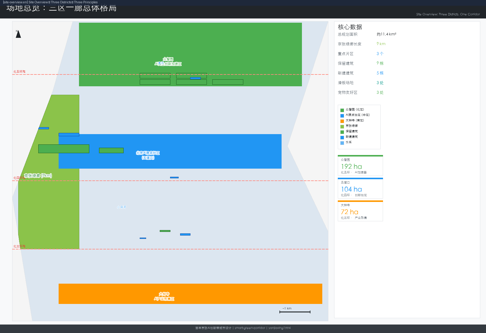
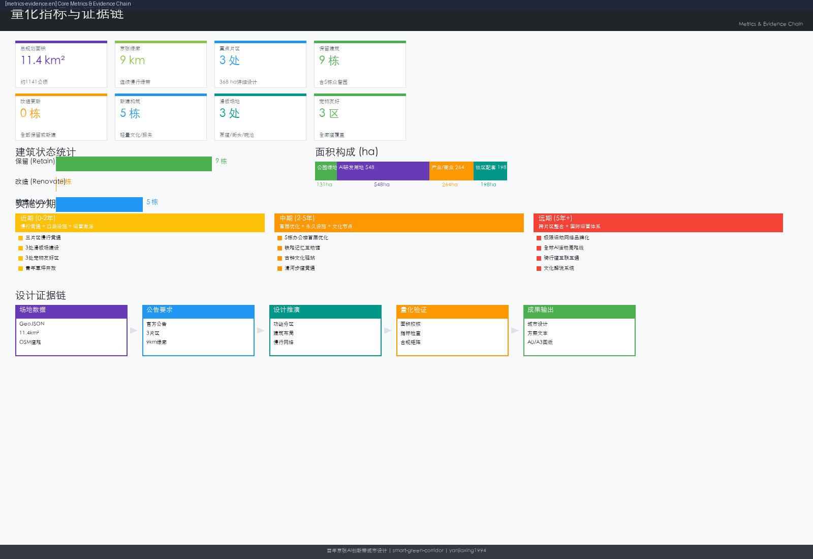
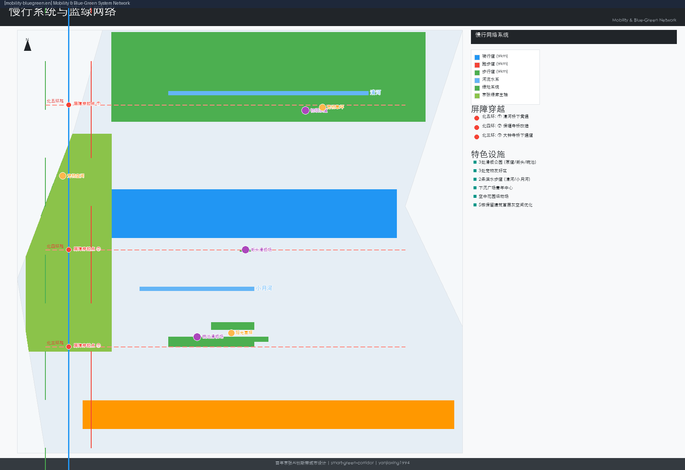
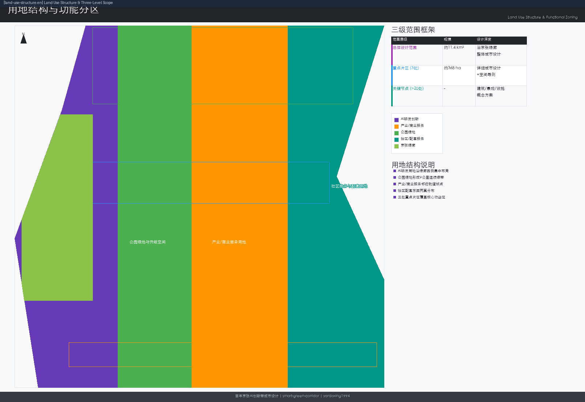
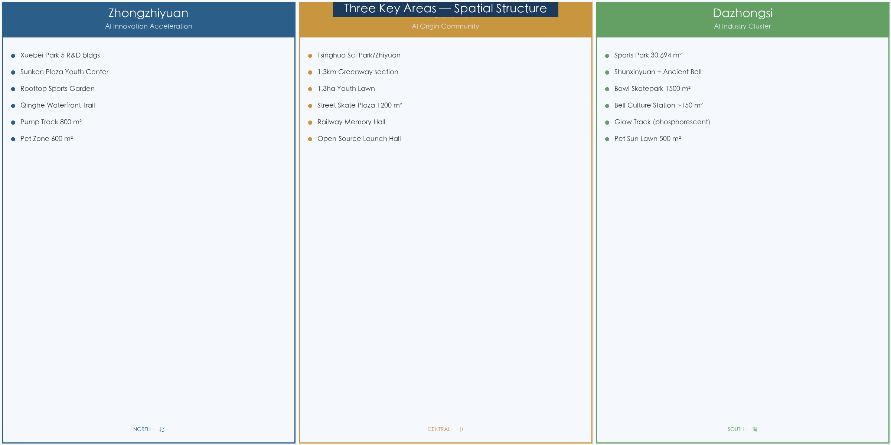

# Centennial Jing-Zhang AI Innovation Belt — Micro-Renewal · Strong Connections · Youth-Friendly

## Design Basis

This proposal takes the official Prequalification Announcement as its primary basis [source:OFFICIAL-ANNOUNCEMENT] and the provisional boundary, enumerations, ranges, and sources in `brief/site-package/` as machine-readable basis [source:AGENT-TASKBOOK] [depth:existing_conditions_diagnosis]. Complete source mapping in `sources.json` and `standard_matrix.json`.

## Three-Level Scope Framework

The proposal organizes work across three announced levels: Coordinated Research Scope (43.6 km²), Overall Design Scope (11.4 km²), and Key Area Detailed Design Scope (368.4 ha) [depth:three_level_scope_framework]. Spatial evidence: [data:geometry/site_boundary.geojson#SITE-001].

## Strategic Industry and Urban Form Research

Core task: building a world-class AI innovation ecosystem through the spatial framework of "university sourcing → open-source collaboration → enterprise transformation → public experience → international dissemination" [source:AGENT-TASKBOOK] [standard:PROJECT-OFFICIAL-ANNOUNCEMENT].

---

## 1. Design Framework — Micro-Renewal · Strong Connections

### Core Principles

| Principle | Content | Spatial Implementation |
|-----------|---------|----------------------|
| Maximum Retention & Reuse | Retain all quality buildings, parks, heritage, vegetation | 15 buildings + 5 parks retained |
| Youth-Friendly | AI professionals, students, entrepreneurs: sports, social, commute, leisure | 3 skate parks, 11 new public spaces |
| Blue-Green Continuity | 9km Jing-Zhang Heritage Park green corridor ecological connection | "Three Paths, One Green" cycling+running+walking |

### Retain-Renovate-New

| Category | Count | Detail |
|----------|-------|--------|
| Retain | 15 buildings + 5 parks | 5 Xuebei Park R&D + Tsinghua Science Park + Zhiyuan Tower + Dongsheng Tower + Dazhongsi Sports Park |
| Renovate | 8 | Ground floor gray-space (5), facade opening, commercial activation, track night-glow |
| New | 11 lightweight | Railway Memory Pavilion, Open Source Forum, Bell Culture Station, Youth Lawn Kiosk, Sunken Plaza Youth Center, Bowl Kiosk — all single-story 3-7m |

## Overall Design Scope: Urban Renewal at Planning Depth

Regulatory detailed planning depth per [standard:MOHURD-CONTROL-DETAILED-PLANNING], decomposed into reviewable objects: land use [data:geometry/land_use.geojson#LU-001], buildings [data:geometry/buildings.geojson#BLDG-ZZY-01], depth constraints [depth:land_use_layout] and [depth:development_intensity_controls].

## Key Area Detailed Design

Three mandatory detailed design areas [depth:three_key_area_detailed_design]: Zhongzhi Park (192.1 ha), Wudaokou (104.3 ha), Dazhongsi (72.0 ha). Evidence: [data:geometry/key_areas.geojson#PROV-KEY-001] through PROV-KEY-003.

---

## 2. North: Zhongzhi Park — Garden-Style Full-Stack Autonomous Innovation District

**Core Carrier**: Zhongguancun Dongsheng Science Park · Xuebei Park — 238,300 m² GFA, 5 R&D buildings, Green Building 3-Star, sunken plaza, two sky gardens, 4,000 m² canteen, 18,500 m² commercial. Qinghe River (north), Xiaoyue River (east).

**Building Strategy**: All 5 buildings retained. Ground-floor micro-renovation: 2.5-3m deep canopies, folding floor-to-ceiling windows opening toward plaza, glass curtain walls at B/C building facades facing sunken plaza.

| Building | Floors | Status | Optimization |
|----------|--------|--------|-------------|
| BLDG-ZZY-01 (A) | 12F/48m | retain | Café outdoor + co-working lobby |
| BLDG-ZZY-02 (B) | 10F/40m | retain | Sky garden bridge |
| BLDG-ZZY-03 (C) | 10F/40m | retain | Plaza visual permeability |
| BLDG-ZZY-04 (D) | 8F/32m | retain | Tree-shaded courtyard |
| BLDG-ZZY-05 (E) | 8F/32m | retain | Riverside open interface |

**Key Interventions**: Sunken Plaza Youth Center (~200 m² steel+membrane, café+co-working+outdoor cinema), Sky Garden rooftop sports (half-court basketball+badminton+yoga, 4m PC safety fencing), Qinghe Riverside Walk+Cycle Path (~800m, 3 viewing platforms), Beginner Pump Track (800 m²), Pet-Friendly Lawn (600 m², fenced).

---

## 3. Central: Wudaokou — Campus-Adjacent Tech Transfer & Talent Community

**Core Carriers**: Tsinghua Science Park, Zhiyuan Tower, Dongsheng Tower. 1.4 km² district. 1.3km Jing-Zhang Heritage Park segment. Planned 1.3ha new green space. Heqing Garden and "Three Paths, One Green" corridor.

| Building | Floors | Status | Optimization |
|----------|--------|--------|-------------|
| BLDG-WDK-01 (Tsinghua SP) | 18F/72m | retain | Open facade + display windows |
| BLDG-WDK-02 (Zhiyuan) | 15F/60m | retain | Open-source community entrance |
| BLDG-WDK-03 (Dongsheng) | 12F/48m | retain | Commercial activation + tech transfer |

**Key Interventions**: "Three Paths, One Green" main axis (running 2m/cycling 3m/walking 2.5m + railway heritage display belt), 1.3ha Youth Activity Lawn (camping, market, yoga, concert bowl ~300 capacity + Service Station ~100 m²), Street Skate Plaza (1,200 m², street-style), Pet Space (500 m², 2 fountains, 2 bag stations), Railway Memory Innovation Pavilion (~300 m², lightweight steel+glass above tracks, LED matrix facade), Open Source Community Forum (150 m², transparent glass box, reservable, community-operated).

---

## 4. South: Dazhongsi — Urban Smart Economy & International Exchange District

**Core Assets**: Dazhongsi Sports Park (30,694 m²: 500m track, basketball 576 m², 5v5 football 1,536 m², 4 table tennis, badminton Oct 2026), Shunxin Garden (300m linear, preserved native trees + cast-iron bell), Jing-Zhang Heritage Park Phase II (70 communities, ~450,000 residents, children's climbing area), railway bridge over 3rd Ring Road (retained).

**Key Interventions**: Bowl Skate Park (1,500 m², 1.2-2.0m depth concrete bowl, spectator terraces, LED lighting), 500m Track night-glow coating + 2 self-powered fitness checkpoints + movable container bleachers, Cycling Loop (~1.2km, 3rd Ring Road underpass), Ancient Bell Culture Station (~150 m², Corten steel, interactive bell), Pet Sun Lawn (500 m², fenced+open), Bowl Skate Kiosk (~40 m²).

---

## 5. Cross-District Systems

### 5.1 Slow-Traffic
| System | Length | Width | Material |
|--------|--------|-------|----------|
| Cycling Path | 9km | 3m | Colored asphalt (Jing-Zhang Blue) |
| Running Path | 9km | 2m | Synthetic track (warm gray) |
| Walking Path | 9km | 2.5m | Permeable brick/gravel |

Barrier crossings: 5th Ring (underpass), 4th Ring (Baofusi Bridge improvement), 3rd Ring (under-bridge cycling).

### 5.2 Youth Sports Network
| District | Type | Area | Level |
|----------|------|------|-------|
| Zhongzhi Park | Pump Track | 800 m² | Beginner-Intermediate |
| Wudaokou | Street Plaza | 1,200 m² | Intermediate |
| Dazhongsi | Bowl | 1,500 m² | Advanced |

~15-min cycling between venues.

### 5.3 Pet-Friendly System
Three district zones (1,600 m²) + 5 Green Corridor supply points (~every 2km).

### 5.4 Cultural Heritage
Zhongzhi Park: Qinghe ecology + data-visualization water features. Wudaokou: University culture + railway memory + LED matrix + transparent forum. Dazhongsi: Ancient bell + railway industry + Corten steel + sleeper benches + locomotive climbing.

### 5.5 AI Scene Cards (10)
See Chinese proposal for the complete 10-scene card table (01-AI Lunch Run, 02-Hackathon, 03-Rooftop League, 04-Cinema Night, 05-AR Exploration, 06-Pet Market, 07-Skate League, 08-Night Run, 09-Sound Art, 10-Global AI Open Day). Each card includes: spatial location, AI technology support, data source, privacy boundary, human review mechanism, operating entity, frequency.

---

## 6. Brand System

- **Overall**: Jing-Zhang AI Nexus
- **Belt**: Jing-Zhang Smart Symbiotic Belt
- **Three Cores**: Zhongzhi Park · Qinghe North Bank Innovation Harbour / Origin Community · Wudaokou Knowledge Valley / Dazhongsi · 3rd Ring Smart Gateway
- **Nodes**: Skate Parks, Pet Oases, Open Source Courtyards, Railway Memory Gallery, Bell Resonance, Glow Track

**Logo**: Abstract "京" character — railway tracks merging into AI circuit traces, iron-gray → AI blue gradient.

**Colors**: Primary Jing-Zhang Blue #2B5F8A | Secondary Qinghe Green #4A8C6F | Accent Innovation Orange #E87830 | Neutral Rail Gray #5A5A5A

**Typography**: Source Han Sans (Chinese headings, SIL OFL), Inter (English), system sans-serif (body).

---

## 7. Global Case Studies

| # | Case | Insight for Jing-Zhang |
|---|------|----------------------|
| 1 | King's Cross, London (67 acres) | Railway heritage reuse + industry-community symbiosis |
| 2 | Kendall Square, Cambridge MA | 15-min walking innovation circle + talent housing mix |
| 3 | one-north, Singapore (200 ha) | R&D-commercial-residential-green mixed programming |
| 4 | DMC, Seoul (0.57 km²) | Brownfield regeneration + ultra-dense innovation nodes |
| 5 | 22@Barcelona (200 ha) | Industrial plot micro-renewal + innovation-residential mix |
| 6 | Nanshan S&T Park, Shenzhen (11.5 km²) | S&T corridor + river ecological stitching |
| 7 | West Bund, Shanghai (11.4km) | Riverside industrial belt AI-art dual activation |

**Conclusion**: Jing-Zhang's "9km railway heritage corridor + 3 top universities + Zhongguancun ecosystem" triad is globally unique — a linear AI ecosystem distinct from point renewal, campus concentration, or new town models.

---

## 8. Industry Test Scenarios

**A: Autonomous Model Safety Evaluation Sandbox** (Zhongzhi Park, ~300 m²): Controlled-environment model safety evaluation, red-team testing, standards compliance. Target: ≥5 models/quarter, CNAS-recognized.

**B: Edge AI Computing Station Stress Test** (5 points along Green Corridor, ~20 m² each): Real-world edge AI chip performance verification (latency, energy, environmental adaptability). Target: <100ms response, >99.5% availability.

**C: Urban Intelligence Traffic Optimization Experiment** (Wudaokou-Dazhongsi segment, 10 checkpoints + 5 sensors): Aggregated sensor data for crowd management and facility maintenance optimization. Target: <2hr fault response, 24hr advance holiday plans.

---

## 9. Inclusive Personas (9 Personas)

Open-source developers, startup teams, enterprise visitors, local residents, university students/faculty, **elderly** (morning exercise, barrier-free, large-text signage, rest pavilions every 200m), **children** (climbing, nature education, soft surfaces, non-toxic materials), **persons with disabilities** (tactile paving, voice navigation, wheelchair ramps ≤5%, elevators, hearing loops), **low-income entrepreneurs** (zero-cost entry, tiered pricing, community skill exchange).

---

## 10. Regional Collaboration

| Direction | Partner | Division | Mechanism |
|-----------|---------|----------|-----------|
| North Wing | Future Science City | Basic research → tech transfer | Quarterly matchmaking, shared lab platform |
| South Wing | Huairou + E-Town | Algorithms → apps → manufacturing | Annual summit, cross-district computing scheduling |
| Jing-Jin-Ji | Xiong'an + Tianjin + Langfang | Beijing sourcing → regional application | Coordinated planning, cross-border data pilot |

Xiaoyue River Experience Path: ~5km "AI Evolution Road" from Zhongzhi Park southward through Wudaokou to Dazhongsi — North: AI milestone pillars (1956 Dartmouth→2026 contemporary), Central: open-source "knowledge spillover" interactive installations, South: AI-from-lab-to-life application exhibits.

---

## 11. Landmarks and Component Library

**Three Landmarks**: Qinghe North Bank Observation Tower (30m spiral steel, data-viz LED ring), Open Source Light (8m LED matrix cube, university/enterprise contributed), Bell Resonance (12m Corten steel bell tower, 1:3 interactive bell, night projection).

**Component Library**: Mobility (distance markers, cycling stops, benches), Ecological (rain gardens, permeable paving, bioswales), Sports (skate modules, pump track modules, street elements, half-court basketball), Service (pet fountains, fitness checkpoints, bike racks).

---

## 12. Accessibility Strategy

- 9km Green Corridor: ramps ≤5%, width ≥1.8m, rest platforms every 500m
- Continuous tactile paving + ≥20 voice navigation posts
- Wheelchair viewing areas at all skate parks, elevators/ramps at all landmarks
- Child-friendly: soft surfaces, parent visibility, non-toxic materials, fencing
- Elderly-friendly: low-intensity equipment, rest pavilions every 200m, large-text signage
- Digital inclusion: offline versions, age-friendly large-text interfaces, text+audio dual information

---

## 13. Copyright Ledger

See `report/copyright_statement.md` (complete per-asset ledger) and `sources.json` (13 registered sources).

**Status**: ✅ Python deps (Pillow/MIT, Shapely/BSD, PyProj/MIT, jsonschema/MIT), OSM data (ODbL), government public info — cleared. ⚠️ Font embedding (replace with SIL OFL before final). All content AI-agent original or public-data derived. No remote scripts, map tiles, web fonts, or external APIs.

---

## 14. Annual Event System

**Unified Brand**: "Jing-Zhang AI Greenway"

| Frequency | Event | Venue | Scale |
|-----------|-------|-------|-------|
| Daily | AI Lunch Run Club | 9km track | 50-200 |
| Weekly (Fri) | Outdoor Cinema Night | Sunken Plaza | 100-300 |
| Biweekly | Open Source Hackathon | Open Source Forum | 50-150 |
| Monthly | Rooftop Sports League + Glow Track Trial | Sky Garden + Dazhongsi | 100-300 each |
| Bimonthly | Pet Social Weekend Market | Three pet zones | 200-500 |
| Quarterly | Skate League + Sound Art Festival + AI Roadshow | Three skate parks + Shunxin Garden + Forum | 100-2,000 |
| Annual | **Global AI Open Day** + **Railway Culture Week** + **AI Urban Design Forum** | Green Corridor full route | 5,000-20,000 |

**Governance**: Sports (District Sports Bureau), Culture (Culture & Tourism Bureau + curators), Open Source (community committee: university+enterprise+resident), Pet (third-party professional), International (Foreign Affairs + Science & IT Bureau).

---

## 15. Metrics and Phasing

### Core Metrics
| Metric | Value | Confidence |
|--------|-------|-----------|
| Design Area | 11.4 km² | high |
| Retained Buildings | 15 | high |
| New Structures | 6 lightweight | medium |
| Green Corridor Trail | 9km | high |
| Cycling Total | 11.6km | medium |
| Skate Parks | 3,500 m² | medium |
| Pet Zones | 2,100 m² | medium |

### Phasing
- **Phase 1 (0-2yr)**: Trail continuity, 3 skate parks, pet zones, youth lawn, sunken plaza center (7 projects)
- **Phase 2 (2-5yr)**: Ground floor optimization, Railway Pavilion, Bell Station, Open Source Forum (7 projects)
- **Phase 3 (5yr+)**: Sports league, AI Open Day route, pet system completion, heritage system (5 projects)
- **TOTAL**: 19 projects

---

## Risk Declaration

Official site boundary and key area polygons are provisional. All spatial metrics require recalculation upon official redline release. Missing: road redlines, utility plans, building ownership data, heritage protection boundaries, flood control standards. This proposal does not claim official approval, ratified planning, final land ownership, or guaranteed implementation.

---

## 16. Implementation Feasibility & Engineering Verification

### 16.1 Critical Structure Engineering Assessment

| Structure | Project | Preliminary Assessment | Key Verification Points |
|-----------|---------|----------------------|------------------------|
| Zhongzhiyuan Rooftop Sports Court | JZ-07 | Existing roof per GB 3-Star; lightweight court feasible (≤3 kN/m² load) | Live load margin, waterproofing, parapet height (≥1.2m), noise impact |
| Jing-Zhang Greenway Under-Ring-Road Passages | JZ-01 | Under-bridge clearance ≥2.5m at N3/N4/N5 rings | Structural safety distance, drainage, flood control |
| Ancient Bell Interactive Installation (~1.2t) | JZ-11 | Scaled replica (1:4) cast copper alloy bell | Foundation bearing, seismic design, SPL ≤75dB @10m |
| Dazhongsi Bowl Skatepark (2.0m depth) | JZ-04 | Semi-subterranean, ~2.5m excavation, above water table | Utility avoidance, drainage, underground parking load check |
| Railway Memory Interactive Hall (~200 m²) | JZ-10 | Single-story steel frame + curtain wall, shallow foundation | Fire egress distance, 15yr design life, heritage buffer zone |
| Directional Soundscape (Parametric Speakers) | JZ-19 | Ultrasonic carrier, ~15° beam width, natural attenuation beyond 5m | GB 3096 compliance, IP65 outdoor rating, EMC |

### 16.2 RACI Matrix (Proposed)

11 stakeholder roles across 3 implementation phases. **R=Responsible, A=Accountable, C=Consulted, I=Informed**.

| Stakeholder | Near-term (0-2yr, 7 projects) | Mid-term (2-5yr, 7 projects) | Long-term (5yr+, 5 projects) |
|-------------|-------------------------------|------------------------------|------------------------------|
| Haidian District Gov (Planning Bureau) | A (site approval) | A (renovation approval) | C (brand consultation) |
| District Sports Bureau | C (skatepark standards) | C (extreme sports advisory) | R/A (league operations) |
| District Parks Bureau | A (green space compatibility) | C (waterfront greening review) | I (maintenance oversight) |
| District Culture & Tourism Bureau | I (no cultural projects) | C (cultural content review) | A (heritage interpretation approval) |
| Site Managers (Zhongzhiyuan / Tsinghua / Dongsheng) | C (consent) | R (renovation execution) | C (brand touchpoint approval) |
| Subdistrict Offices | C (community consultation) | C (construction communication) | C (operations feedback) |
| Professional Design Firms | R (design development + construction docs) | R (specialist论证 reports) | I (technical consulting) |
| Contractors (public tender) | R (lightweight structures, paving) | R (renovations, cultural facilities) | — |
| Third-Party Operator (proposed open recruitment) | — | I (construction progress awareness) | R (brand events, maintenance, commercial partnerships) |
| Community / University / Enterprise Representatives | C (design-phase input) | C (renovation consultation) | C (satisfaction feedback) |
| Heritage / Fire / Public Security Agencies | A (skatepark/pet zone safety) | A (fire + large event security) | C (league/event security review) |

**Operational Model**:
- Near-term (0-2yr): Directly managed by site managers; community volunteer-operated light events
- Mid-term (2-5yr): Proposed "Jing-Zhang AI Greenway Operations Office" (district-affiliated or government-procured third-party operator)
- Long-term (5yr+): Brand events sponsored by enterprises; cost structure: government subsidy 50% + commercial partnerships 30% + ticketing/services 20%. Estimated annual operating budget: CNY 8-12 million

### 16.3 Cost Estimation Framework (Schematic Phase Reference)

Reference unit prices from Beijing comparable projects (2019-2025). **All figures ±30-50% error margin — must be verified by cost consultants at preliminary design stage.**

| Category | Items | Unit Price Range | Scope | Reference (CNY 10k) |
|----------|-------|-----------------|-------|----------------------|
| Paving & Trails | Colored asphalt cycleway, synthetic running track, permeable brick walkway | 150-500 CNY/m² | 67,500 m² total | 1,510-2,540 |
| Skateparks | Pump track, street plaza, bowl | 800-4,000 CNY/m² | 3,500 m² total | 620-1,000 |
| Building Renovations | Ground-floor grey space (curtain wall + floor + lighting) | 3,000-5,000 CNY/m² | ~1,000 m² | 300-500 |
| Lightweight Structures | Steel frame + curtain wall ~200 m² each | 6,000-9,000 CNY/m² | 3 × 200 = 600 m² | 360-540 |
| Modular Kiosks | Container conversions, service pavilions | 10-20 CNY 10k/unit | 5 ancillary + 3 fitness stations | 100-200 |
| Landscape & Amenities | Rain gardens, pet zones, youth lawn, smart fitness stations, bike hubs, navigation posts | — | Various | 714-1,201 |
| Temporary Infrastructure | Edge computing nodes (20 m² each) | 15-25 CNY 10k/site | 5 sites | 75-125 |
| Brand Identity | Signage, wayfinding, ground markers | 2,000-5,000 CNY/point | ~200 touchpoints | 40-100 |
| Soft Costs | Planning/design fees + specialist论证 | 8-12% of construction | — | 440-780 |

**Phase Summary (CNY 10k)**:

| Phase | Construction | Soft Costs | Total |
|-------|-------------|-----------|-------|
| Near-term (JZ-01~07) | 2,500-4,200 | 300-500 | **2,800-4,700** |
| Mid-term (JZ-08~14) | 2,000-3,500 | 150-280 | **2,150-3,780** |
| Long-term (JZ-15~19) | 300-600 | — | **300-600** |
| **Grand Total** | | | **5,250-9,080** |

⚠ Funding sources (schematic proposal): government investment ~60% (public infrastructure), private capital ~30% (operational facilities, brand sponsorship), university/enterprise co-investment ~10% (Zhongzhiyuan + Wudaokou renovations by property owners).

---

## 17. DPIA — AI Scenario Privacy Impact Assessment

All 10 AI scenario cards involve personal data processing or sensor data collection. The following DPIA checklist is completed per PRC Personal Information Protection Law (2021) and GB/T 39335-2020. **Self-declaration at schematic phase — independent audit required before operations.**

| Scenario Card | Data Collected | Personal Info? | Legal Basis | Minimization | User Control | Offline Alternative |
|--------------|---------------|----------------|-------------|-------------|-------------|---------------------|
| 01 AI Run Club | Skeleton coordinates (no face), pace/HR (opt-in), run stats | Skeleton = anonymous biometric (no facial recognition); HR may be indirectly identifying if linked to device ID | User opt-in = consent; anonymous skeleton = not PI processing | Extract kinematics only, discard video frames at edge, no cloud upload | Delete records anytime; disable skeleton analysis | RFID chip optional (race-only, returned after); no device required for daily use |
| 02 Hackathon | Registration (name/org/email), code (public repo URL), demo video | Yes (name + contact) | Registration = consent; results = public disclosure | Name + contact only (no ID number); code is public | Anonymous participation (team alias); offline poster presentation option | Physical poster + oral presentation (no video upload required) |
| 03 Rooftop League | Same skeleton as 01, match scores, team info | Scores recorded by team, not individual | Registration = consent | Competition-only zone collection; rankings publish team name + score only, no biometric data | Request match video for referee use only (not published) | Spectator zone separate from data collection zone |
| 04 Outdoor Cinema | IR people counter (no images), anonymous voting | No (IR = pulse count, no image; anonymous voting) | Not applicable (no PI) | IR only outputs pass/no-pass pulses; voting is anonymous | Not needed (no PI collected) | Fully offline |
| 05 Railway AR | Camera live view (for AR marker + SLAM), device model + browser version | Yes (camera = sensitive permission on Android/iOS) | User opens AR = informed consent; first-use popup; under-14 requires guardian | On-device rendering (WebAR); no camera/SLAM data uploaded; marker recognition = local model | Disable camera anytime; AR page has exit button | Printed guidebook (trifold, free at绿廊 entrances); physical interpretation panels at every heritage point |
| 06 Pet Market | Vendor registration (name/contact), pet info (breed/size/vaccine proof) | Yes (vendor contact + pet vaccine records) | Registration = consent; vaccine = legal requirement (Animal Epidemic Prevention Law) | Name + contact only for stall operation; pet vaccine record for safety; no ID number or pet microchip | Vendors can opt out of public contact display (contact via organizer) | Pet free-play zone has NO data collection (fenced area only) |
| 07 Extreme Sports League | Competition video (judging + broadcast), participant registration, ranking points | Yes (identity + competition video) | Registration = consent; public broadcast = industry norm with participant knowledge | Camera covers competition zone only (auto-blur pedestrians outside zone); multi-angle raw video retained only until arbitration period | Opt out of public broadcast (offline-only participation; video for referee only) | Spectator zone separate from capture zone |
| 08 Glow Track Time Trial | RFID chip timing, skeleton coordinates (same as 01), LED color (triggered by fastest lap) | RFID links to participant number (indirectly identifying); skeleton = anonymous | RFID worn = consent; skeleton same as 01 | RFID records only split time + chip ID (no GPS); runway only active during events | Self-chosen race number (not real name); results published by race number | Non-event days: standard public track, no timing/data collection |
| 09 Bell Sound Art Festival | Ambient recording (omnidirectional mic array), IR people counter, interactive installation logs | Ambient recording may incidentally capture identifiable speech → possible PI | Ticket = consent; on-site recording notice; performance = public (no reasonable privacy expectation) | Omnidirectional array for sound field reconstruction, NOT individual speech recognition or voiceprint extraction | "Quiet zone" seating outside mic array coverage | Watch via livestream instead of on-site |
| 10 Global AI Open Day | Registration (name/org/nationality/contact), event photo/video for publicity, crowd count (IR + WiFi) | Yes (identity + event imagery) | Registration = consent; on-site photography notice; news reporting = lawful public disclosure | WiFi Probe Request counting uses MAC address hashing with salt rotated every 15 min; raw MAC NOT stored. ⚠ Note: hashed MAC may still be re-identifiable with spatio-temporal patterns — IR counting is the primary method, WiFi counting is cross-validation only | Opt-out badge (different color) signals photographers to avoid close-ups; signage at entrances | Keynote and awards streamed online (no on-site data collection for remote participants) |

**DPIA Self-Declaration** (schematic phase, pending independent audit):
- ✅ Lawful, necessary, minimal (PIPL Articles 5-7)
- ✅ Data minimization: edge processing preferred, anonymous/aggregated when possible, only what's functionally necessary
- ✅ Purpose limitation: each collection tied to explicit purpose
- ✅ Storage limitation: retention periods defined, auto-deletion on expiry
- ✅ User control: opt-out mechanism for every scenario; offline alternatives always available
- ⚠ Pending: independent security audit of RFID, skeleton coordinates, MAC hashing, and WebAR SLAM
- ⚠ Pending: full DPIA reports (not just checklists) for all scenarios before operational launch
- ⚠ Children: under-14 AR requires guardian device-side authorization; no biometric collection from children at any AI interaction

---

## References

- Official Announcement [source:DATA-SRC-OFFICIAL-ANNOUNCEMENT-20260509]
- Agent Task Book [source:DATA-SRC-AGENT-TASKBOOK-20260518]
- Provisional Boundaries [source:DATA-SRC-PROVISIONAL-BOUNDARIES-20260605]
- agent_fact_pack.md, project_scope_summary.csv, missing_data_checklist.csv
- Global cases: public planning documents, academic literature, official district websites
- Site info: developer materials, government park announcements, planning public notices, news reports
- Machine index: `sources.json`, `metrics.json`, `compliance_matrix.json`, `standard_matrix.json`, `design_depth_matrix.json`

<!-- revision: 2026-08-10-v4-comprehensive-en -->

<!--3dfd37d0-->
<!--c05b42da-->
<!--34b57e9d-->