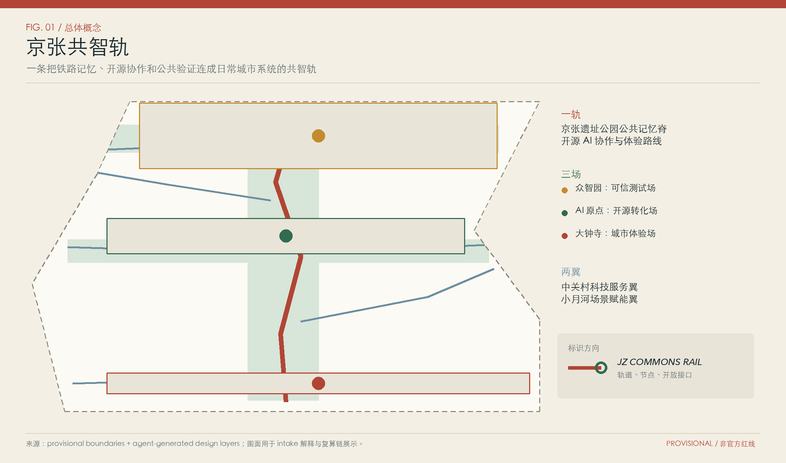
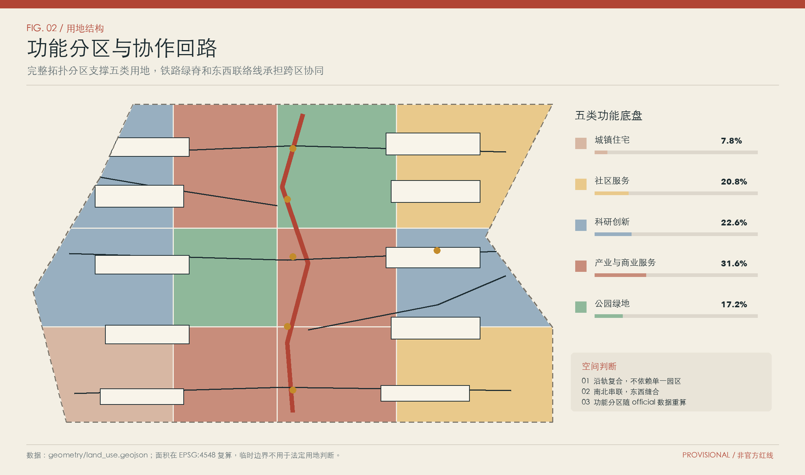
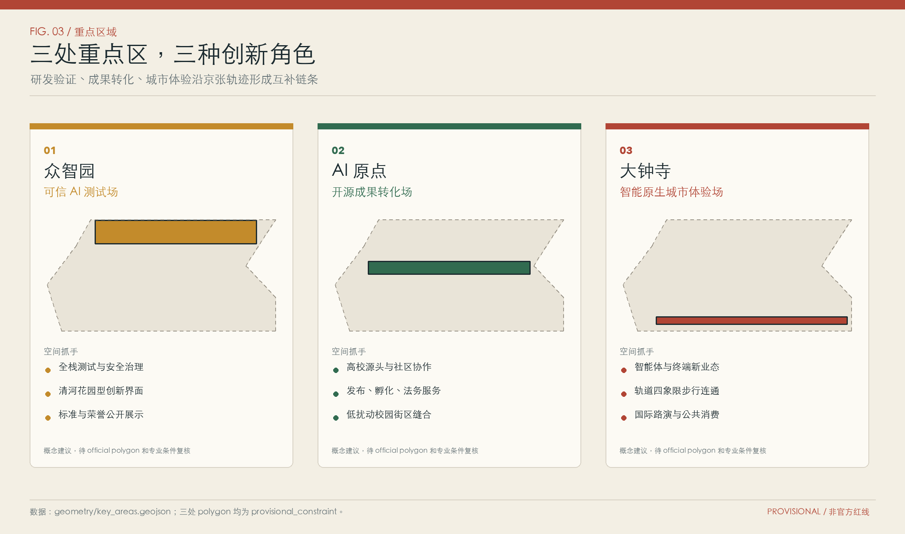
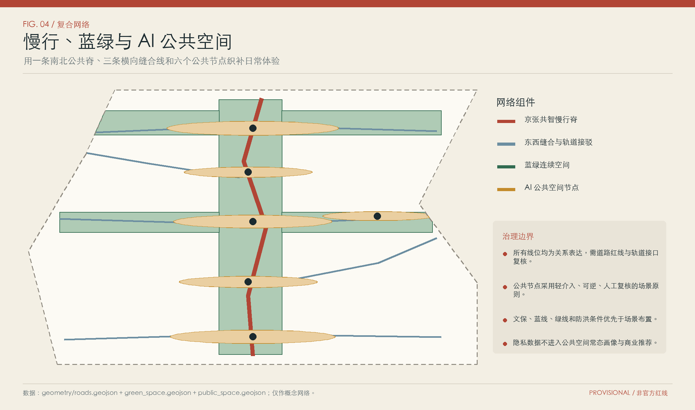
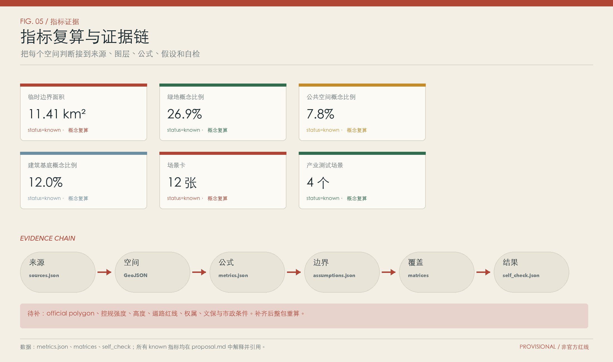

# Jing-Zhang Co-Intelligence Track: A Verifiable Update Framework for Open Source AI Urban Commons

The English name for the Jing-Zhang Common Rail is **Jing-Zhang Commons Rail**, abbreviated as **JZ Commons Rail**. The identifying graphic consists of a rail line and an open ring, where the rail line represents the public memory of the century-old Jing-Zhang railway, and the ring symbolizes the continuous openness of code, data, scenarios, and evaluation interfaces. The proposal adopts an overall structure of "one rail with three fields and two wings": the Jing-Zhang Heritage Park Public Memory Axis connects Zhongzhiyuan's Trustworthy AI Testing Field, Beijing AI Origin's Open Source Transformation Field, and Dazhongsi's Intelligent Nativelife Urban Experience Field. The Zhongguancun Technology Services Wing and the Xiaoyue River Scenario Enablement Wing extend outward to the surrounding areas. All spatial values are derived from the current Provisional Boundary under the concept recalculation; after the Official Boundary, control plan conditions, and on-site investigation data are supplemented, a full recalculation is required.

## Design Basis and Source List

The proposal reads the call for submissions, the open task statement for intelligent agents, the repository registration form, and the processed facts package. The call provides a three-tier research scope, three key areas, and professional outcome requirements. The task statement supplements the AI Innovation Ecosystem, talent profiles, scenario cards, named identifiers, cultural narratives, and long-term operational tasks. Urban Design management, Regulatory Detailed Planning, land use classification in the territorial spatial plan, and architectural design depth documents are used to constrain the expression of outcomes. Corresponding evidence includes [source:DATA-SRC-OFFICIAL-ANNOUNCEMENT-20260509], [source:DATA-SRC-AGENT-TASKBOOK-20260518], [source:DATA-SRC-MOHURD-URBAN-DESIGN-MEASURES], [source:DATA-SRC-MOHURD-CONTROL-DETAILED-PLANNING], [source:DATA-SRC-MNR-LAND-USE-CLASSIFICATION-202311], [source:SOURCE-REGISTRY], [source:PROCESSED-FACT-PACK] and [standard:PROJECT-OFFICIAL-ANNOUNCEMENT], [standard:PROJECT-AGENT-OPEN-CALL-TASKBOOK]. [standard:MOHURD-URBAN-DESIGN-MEASURES], [standard:MOHURD-CONTROL-DETAILED-PLANNING], [standard:MNR-LAND-USE-CLASSIFICATION-GUIDE], [standard:MOHURD-ARCH-DESIGN-DEPTH-2016].

The warehouse has not provided the statutory overall boundary, formal polygons for three key areas, current building blocks, ownership, road right-of-way, rail interface, pipeline capacity, cultural heritage control lines, and control plan intensity. This submission uses the warehouse-registered provisional polygons [source:DATA-SRC-PROVISIONAL-BOUNDARIES-20260605], with the site boundary layer clearly recording `official_boundary=false`. The current diagnosis writes the gaps into `assumptions.json` and the constraint layer [data:geometry/constraints.geojson#CONSTRAINT-001], managed by [depth:existing_conditions_diagnosis]. This layer serves as a spatial index for data gaps and does not constitute administrative boundaries, planning red lines, or engineering conditions. The sequence of actions upon formal documentation becoming available will be to replace the boundaries, clip all design layers, recalculate areas and ratios, review the technical matrix, redraw the plans, and re-run the self-check.

The documentation for this scheme is divided into formal references, background cases, and temporary constraints. Six international cases only support the organizational mechanisms and operational methods, and cannot be used to derive the construction scale, land use control, or investment arrangements for Haidian. All planning actions are marked as Conceptual Recommendations, reference schemes, or pending in-depth research by professional teams. The implementation entity, fiscal budget, approval procedures, and construction timeline are left to be confirmed by the organizers and relevant professional teams.

## Three-Level Scope Framework

The Coordinated Research Area covers approximately 43.6 square kilometers and is suitable for discussions on the innovation chain of artificial intelligence, talent chain, urban service chain, and global collaboration networks; the Overall Design Area covers about 11.4 square kilometers and is suitable for organizing updates to structure, land use, buildings, transportation, utilities, Blue-Green Space, and project phasing; the key focus areas cover a total area of approximately 368.4 hectares and are suitable for validating functional typologies, spatial forms, the demolish–renovate–retain strategy, pedestrian connectivity, and AI scenarios. The current recalculated temporary overall boundary area is 11.4128 square kilometers [metric:site_area_sqm], three temporary key focus areas [metric:key_area_count], and the announced total area of these three areas is 3,684,000 square meters [metric:announced_key_area_total_sqm]. The two sets of area metrics are retained separately to avoid temporary geometric coverage of the announced numbers. (Demolish–Renovate–Retain Strategy)

Three levels of work share a single Evidence Chain. The overarching level outlines the positioning and mechanisms, which are then incorporated into a comprehensive coverage of land use, Public Space, and transportation networks by the overall level. The focus level tests these conditions through three detailed design areas. Spatial indices are derived from [data:geometry/site_boundary.geojson#SITE-001] and [data:geometry/key_areas.geojson#PROV-KEY-001], with task depth managed by [depth:three_level_scope_framework]. Changes to the Provisional Boundary affect all land class areas, Building Footprints, green spaces, public spaces, road lengths, and phased ranges, thus binding each known metric to its source, layer, formula, and assumptions.

"One track" will carry cultural memory, slow travel connections, public display, and open-source contribution records; "three fields" will respectively handle trusted testing, open-source transformation, and urban experience; "two wings" will integrate technological services with living scenarios into the adjacent communities. The three layers will use the same set of identifiers and scenario language, with the spatial control depth increasing progressively with the layer. The current graphical representation is a reference scheme; upon the official polygon release, this set of relationships can be updated without rewriting the conceptual logic.

## Coordinated Research Area: Industry and Future City Research

"The Jing-Zhang Co-Intelligence Track" integrates five types of functions into the daily urban network: original research and open-source collaboration, trustworthy testing and standard co-research, enterprise incubation and technology transfer, public services and living experiences, and international dissemination and talent exchange. The three zones correspond to Zhongzhiyuan, Beijing AI Origin, and Dazhongsi, while the two wings correspond to the technological service resources of Zhongguancun and the community scenarios along Xiaoyuehe River. The public memory spine is responsible for cross-zone identification, with open interfaces allowing universities, enterprises, residents, and professional institutions to participate according to their permissions. The overall spatial structure is managed by [depth:overall_spatial_structure], with the network suggested to be located in [data:geometry/public_space.geojson#PUBLIC-001] and [data:geometry/roads.geojson#ROAD-001].

Six global cases provide references for the operational mechanisms, totaling 6 [metric:ecosystem_case_count]. Vector Institute connects research, industry, and talent, translating this into joint research projects, talent hubs, and open demonstration days [source:CASE-VECTOR-INSTITUTE]. Mila's Community of Practice offers ongoing academic and industry exchange, translating this into monthly cross-disciplinary workshops [source:CASE-MILA-COMMUNITY]. AI Singapore's 100 Experiments organizes problem definition, prototype development, and handover into a continuous process, translating this into a testing mechanism for "request registration, controlled prototype, human validation, and deliverable handover" [source:CASE-AI-SINGAPORE-100E].

MIT's study on the innovation ecosystem of Kendall Square emphasizes the involvement of multiple stakeholders such as entrepreneurs, capital, large corporations, government, and universities. This scheme is based on setting up joint topics among these five parties [source:CASE-MIT-KENDALL-SQUARE]. The London Knowledge Quarter integrates the connections between institutions around the railway portal, knowledge exchange, and public openness. This scheme is used to link along-line brands and public knowledge events [source:CASE-LONDON-KNOWLEDGE-QUARTER]. STATION F's model of co-locating multiple projects and sharing service systems inspires open-source teams, businesses, and urban services to use a common infrastructure for their projects [source:CASE-STATION-F]. The cases only support the mechanism selection, and the spatial scale and professional indicators of Haidian continue to be based on local formal documentation.

Brand activities are suggested to form a seasonal rhythm. In the spring, the Open Contribution Week releases model cards, data cards, and a list of urban issues; in the summer, the Trustworthy Testing Season opens controlled scenarios; in the autumn, the Jing-Zhang Global AI Open Week connects three key venues; and in the winter, the Urban Agent governance review discloses public records of faults, appeals, and adjustments. The names of the activities, the organizing entities, resource inputs, and the dates of hosting all need to be confirmed separately. The public brand can continuously accumulate records of open contributions, with the Jing-Zhang Railway cultural content supported by historical documentation verification and professional curation.

## Overall Design Area: Urban Renewal and Regulatory-Plan-Level Urban Design

Overall space adopts the layout of "one track, three fields, two wings, six lines, four rings, and multiple nodes." The one track organizes public memory and a slow-moving route along the Jing-Zhang Heritage Park. The three fields form northern, central, and southern functional anchor points. The two wings connect to the Zhongguancun technology service and Xiao Yuehe living scenarios. Six conceptual central lines express the railway public spine, east-west slow-moving routes, community connections, and waterfront links. Four types of rings serve daily commuting, green leisure, open-source activities, and internal pedestrian movement within key areas. The concept of the road centerline is a total length of 15,308.776 meters [metric:road_centerline_length_m], with the line positions used for network relationship and pedestrian continuity studies. Formal road red lines, sections, and traffic capacity are still pending confirmation from the transportation specialty.

The update structure is expressed by a complete land-use zoning, ten groups of conceptual building prototypes, three green spaces, six public nodes, and three phases of implementation. The Land-Use Layout is managed by [depth:land_use_layout], development intensity is controlled by [depth:development_intensity_controls], and building massing and character are managed by [depth:height_massing_character]. Evidence is located at [data:geometry/land_use.geojson#LU-001], [data:geometry/buildings.geojson#BLDG-001], [data:geometry/green_space.geojson#GREEN-001], [data:geometry/public_space.geojson#PUBLIC-001], and [data:geometry/phasing.geojson#PHASE-001]. All buildings are prototype capacity testing models and no decisions regarding specific demolition or new construction have been made until the current surveying and title verification are completed.

Overall design forms fourrollable project packages: Public Memory Spine and Pedestrian Continuity, Three Key Site Public Interfaces, Open Source Collaboration and Trustworthy Testing Facilities, and Blue-Green and New Infrastructure. Each project package is set with launch conditions, data requirements, Human Review, and exit mechanisms. The conceptual phase prioritizes low-risk, reversible, and publicly visible signage, temporary events, open interfaces, and pedestrian interruptions; projects involving construction intensity, building demolition, road works, municipal relocation, and cultural heritage impacts enter professional argumentation.

## Detailed Design of Key Areas

Three key sites are evaluated through a common set of design questions: industrial positioning, Public Space, building renewal, traffic connectivity, test scenarios, data governance, and operational entities. The total temporary areas of the three zones differ from the announced scope, with zone values only used for conceptual recalculation. The provisional area of Zhongzhiyuan is 1,929,201.877 square meters [metric:zhongzhiyuan_ai_acceleration_area_provisional_area_sqm], the provisional area of Beijing AI Origin is 1,043,236.909 square meters [metric:beijing_ai_origin_community_provisional_area_sqm], and the provisional area of Dazhongsi is 720,454.219 square meters [metric:dazhongsi_ai_industry_cluster_provisional_area_sqm]. The detailed design depth is managed by [depth:three_key_area_detailed_design].

| Key Site | Main Positioning | Space and Architectural Actions | Transportation and Public Space | Testing and Operations |
| --- | --- | --- | --- | --- |
| Zhongzhiyuan Trustworthy AI Testing Field | Full-stack Autonomous Innovation, Standard Co-research, and Security Governance | Preserves reusable R&D carriers, sets reversible test boxes, evaluation corridors, and low-carbon computing service nodes | Continues the Qinghe Green Interface, organizes park access, walking, cycling, and visitor flow | Trustworthy AI Sandbox, park logistics collaboration, standard workshops, with sensitive data remaining in authorized environments |
| Beijing AI Origin | Near School Open Collaboration, Technology Transfer, and Talent Community | Comprises a combination of release, incubation, legal, and talent services through open first-floor spaces, shared courtyards, and small-scale additions | Weaves the campus, park, and transit station into an open-source street with a diurnal hierarchy | Open-source releases, urban service prototypes, human-machine collaboration classrooms, with retained licenses and source records |
| Dazhongsi Smart Native Urban Experience Venue | Smart Body, Smart Terminal, Content Consumption, and International Exchange | Activate the ground floor and existing commercial interfaces of the station-city, configuring urban living rooms, demonstration halls, and public experience units | Study station-city integration and quadrants of pedestrian connectivity, supplementing shaded areas, waiting spaces, and accessible spaces | Station-city navigation, enterprise service assistant, content experience, with public decision-making retaining manual confirmation and appeal entry points |

Zhongzhiyuan uses open green spaces as the outer layer interface for safety testing, with core evaluations remaining within controlled indoor environments. Beijing AI Origin places the records of open-source contributions and conversion services for these contributions on the accessible ground floor, maintaining clear boundaries between residential and quiet zones. Dazhongsi connects the rail portal, commercial interfaces, and international exchange spaces, providing public experiences in visitor and resident modes. The three areas correspond to [data:geometry/key_areas.geojson#PROV-KEY-001], [data:geometry/key_areas.geojson#PROV-KEY-002], and [data:geometry/key_areas.geojson#PROV-KEY-003]. The forms of the areas will be re-cut and verified after the official boundaries are released. (Official Boundary)

## AI Innovation Ecosystem, Personas, and AI+ Scenarios

Six user personas are covered, including open-source developers, AI startup teams, university students and faculty members and researchers, corporate visitors and operational personnel, nearby residents, and urban governance and professional review personnel, totaling six categories [metric:persona_count]. Developers need to publish, collaborate, test, and maintain reputation records; startup teams require low-cost spaces, compliant data, and access to computational power; university personnel need on-campus conversion and cross-institutional communication; corporate visitors need showcases, recruitment, and business services; residents are concerned with commuting, leisure, low-impact updates, and appeal channels; review personnel need traceability of sources, assumptions, metrics, and layers. The personas only describe service tasks and do not establish personal tracking profiles.

The proposal generated 12 scenario cards [metric:scenario_card_count], among which 4 belong to industrial Testing and Validation Scenarios [metric:industrial_test_scenario_count]. Each card includes the service target, spatial carrier, input data, privacy boundaries, Human Review, concept of operating subject, and the degradation approach in case of failure.

| Number | Scene and Location | Data and Human Boundaries | Type |
| --- | --- | --- | --- |
| 01 | Zhongzhiyuan Trustworthy AI Evaluation Sandbox | Authorized samples run in isolated environments, with conclusions signed by evaluators | Industrial Testing |
| 02 | Zhongzhiyuan Campus Logistics Coordination | Utilize desensitized orders and equipment status; revert to manual scheduling during anomalies | Industrial Testing |
| 03 | Origin Open Source Release and License Assistant | Public read-only repositories and licensed materials, confirmed by contributors before release | Industrial Testing |
| 04 | Dazhongsi Business Service Assistant | Process business-proactively submitted issues, with policy explanations verified by service personnel | Industrial Testing |
| 05 | Jing-Zhang Slow Travel Accessible Navigation | Utilize public road network and on-site verification data, retaining manual error reporting entry | Urban Services |
| 06 | Park Activity Passenger Flow Alert | Only publish zone-level aggregated information, with on-site managers deciding on crowd control | Urban Services |
| 07 | Blue-Green Facility Inspection in Qinghe | Identify maintenance leads for facilities, with work orders verified by professionals | Urban Services |
| 08 | On-Campus Conversion of Research Outcomes | Use a team-authorized brief description of the outcomes; legal and investment advice are provided by professionals | Industrial Services |
| 09 | Urban Agent Booking | Collect the minimum information required to complete the service, support cancellation and deletion | Life Services |
| 10 | Multilingual Public Guiding | Content from Qing Quan database, cultural facts verified by curators | Public Culture |
| 11 | Community Public Issue Aggregation | Aggregate themes from public opinions, ensuring original comments and minority views are traceable | Community Collaboration |
| 12 | Urban Operation Simulation Platform | Utilize synthetic or desensitized data; any disposal recommendations confirmed by responsible personnel | Governance Drills |

Scene nodes are distributed in Public Spaces, green spaces, and the slow-moving network, corresponding to [data:geometry/public_space.geojson#PUBLIC-001], [data:geometry/green_space.geojson#GREEN-001], and [data:geometry/roads.geojson#ROAD-001]. All high-impact recommendations are subject to Human Review, logs, appeals, and closure switches. Formal operation requires the completion of a data protection impact assessment, cybersecurity review, accessibility testing, confirmation of the responsible party, and a small-scale pilot run.

## Land Use, Building Scale, and Retain-Renovate-Demolish Strategy

The five categories of land uses fully cover and do not overlap within the Provisional Boundary: code 05 commercial and service industry land covering approximately 3,603,465.831 square meters [metric:land_use_05_area_sqm], code 0701 urban residential land covering approximately 890,856.157 square meters [metric:land_use_0701_area_sqm], code 0702 urban community service facilities land covering approximately 2,377,305.049 square meters [metric:land_use_0702_area_sqm], code 0802 research and development land covering approximately 2,577,595.042 square meters [metric:land_use_0802_area_sqm], and code 1401 park and green space covering approximately 1,963,612.349 square meters [metric:land_use_1401_area_sqm]. Classification criteria and limitations are documented in [standard:MNR-LAND-USE-CLASSIFICATION-GUIDE], with specific zoning details found in [data:geometry/land_use.geojson#LU-001].

Conceptual Building Footprint area is approximately 1,366,845.151 square meters [metric:building_footprint_area_sqm], and the conceptual total gross floor area is approximately 5,997,967.069 square meters [metric:conceptual_total_floor_area_sqm]. The conceptual Building Coverage Ratio is 0.119764 [metric:conceptual_building_density], and the conceptual Floor Area Ratio is 0.525546 [metric:conceptual_floor_area_ratio]. These values are derived from ten sets of abstract architectural prototypes and provisional boundaries, primarily for the purpose of testing Public Space, land use coverage, and capacity calculations. The formal floor area ratio [metric:floor_area_ratio] and Building Height [metric:building_height_m] remain unknown and await the planning control, solar access, fire safety, cultural heritage, aviation, and Urban Design conditions. (Provisional Boundary)

The Demolish–Renovate–Retain Strategy employs a survey-driven four-tier approach managed by [depth:retain_renovate_demolish]. Buildings with historical, industrial memory, structural adaptability, and community use value enter the retention verification; structurally viable, first-floor enclosed, or high-energy-consuming buildings enter the renovation verification; small-scale reversible additions are used to supplement public services, shared meeting, and testing spaces; and demolition candidates require an assessment of ownership, structure, historical value, relocation, carbon emissions, and scheme comparison. Currently, [data:geometry/buildings.geojson#BLDG-001] only expresses the new and old volume relationships and capacity testing; no specific demolition–renovation–retention conclusions are assigned to buildings until the on-site survey is completed.

## Transport, Rail, Municipal Infrastructure, and Public Services

Traffic infrastructure prioritizes walking, cycling, rail connections, and internal micro-circulation within key sites. Six conceptual central lines connect the Jing-Zhang Public Memory Spine, three key sites, east-west communities, and waterfront spaces, with the network managed by [depth:traffic_rail_slow_parking]. Surrounding the stations, continuous shaded pedestrian paths, barrier-free crossings, cycling parking, shared shuttle services, visitor drop-off, and time-sensitive logistics are studied; the four quadrants connectivity, road sections, signal phasing, parking supply, and rail interfaces will be refined after obtaining formal traffic data. Road area [metric:road_area_sqm] and road ratio [metric:road_ratio] are kept unknown, with only the central line lengths reported currently.

Municipal services and New Infrastructure adopt distributed service nodes. Zhongzhiyuan is equipped with controlled computational power and evaluation nodes, while the original community is configured with open-source collaboration, intellectual property, and results release services. Dazhongsi is set up for station-city information, enterprise services, and multilingual navigation interfaces. On the energy side, it is recommended to evaluate the combination of photovoltaics, energy storage, waste heat, and demand response. On the water side, sponge facilities and maintenance monitoring are assessed. On the data side, local processing, tiered authorization, log auditing, and manual degradation are retained. Specific capacities, equipment, pipeline routing, fire safety, and flood control measures require specialized calculations, [depth:municipal_new_infrastructure] recording the current depth and pending information.

Public service facilities utilize a daily sharing and activity switching mechanism. Community services, talent services, legal and intellectual property services, educational experiences, public health, accessibility support, and international exchanges can share reservable spaces. The service targets and opening hours are publicly disclosed by the operators. Peak activities use temporary facilities and zone-based reservations, while the daily phase maintains resident passage and a quiet interface. AI scenarios for medical, educational, and legal purposes provide only auxiliary information and process navigation; professional decisions continue to be made by the relevant responsible personnel.

## Blue-Green Network, Public Space, and Urban Character

Conceptual green space covers an area of approximately 3,074,769.676 square meters [metric:green_space_area_sqm], accounting for 26.9414% [metric:green_ratio] of the Provisional Boundary; the conceptual Public Space covers an area of approximately 894,473.716 square meters [metric:public_space_area_sqm], accounting for 7.8374% [metric:public_space_ratio]. The green space values include the park and specialized green spaces within complete land categories, while the public space is an overlay layer, with different uses and thus cannot be directly added. The blue-green and public space depth are managed by [depth:blue_green_public_space]; after the official water systems, green lines, sponge city, and cultural heritage protection control conditions are supplemented, a re-calculation will be performed.

Four conceptual landmarks correspond to four locations [metric:landmark_count]. The Beijing AI Origin will set up an "Open Source Milestone," using an updatable contribution annulus to record the project, license, and maintenance status; the Zhongzhiyuan will set up a "Trusted AI Experiment Garden," placing public scientific and technological popularization outside of secure testing zones; the Dazhongsi will set up an "Intelligent Nativized City Living Room," connecting track portals, corporate displays, and resident services; and the midsection of the Jing-Zhang Public Memory Spine will set up a "Jing-Zhang Open Source Honor Station," showcasing verified railway history and contemporary open source contributions. The landmarks will adopt light interventions that are reversible and maintainable, with specific locations needing to avoid cultural preservation, ecological, fire safety, and municipal conditions.

Urban Character adopts the design language of "Railway Survey Books." A warm white base conveys the historical paper texture, with black ink used for information, burnt sienna corresponding to railway lines and key actions, park green for Public Spaces, and blue-gray for traffic and data. The ground floor of the buildings emphasizes open interfaces, shading, seating, and nighttime safety, with the added volume controlling the oppressive feeling towards the heritage park. Roofs prioritize serving low-carbon facilities and public activities. The cultural narrative unfolds along the themes of "steam railways, knowledge networks, and open-source collaboration," with historical facts using only clear rights materials, and the curatorial text needing verification by historians and cultural heritage professionals.

## Renewal Projects, Implementation Policy, and Phasing

The project package consists of eight conceptual packages: Jing-Zhang Public Memory Spine Continuity Project, three key site first-floor opening projects, an open-source conversion service station, a trustworthy AI testing and governance center, station-city pedestrian and barrier-free connectivity, blue-green facility and maintenance systems, distributed computing energy service nodes, and the global AI Open Week operation system. Each package is managed by [depth:renewal_project_list], requiring the addition of a responsible party, formal boundaries, current ownership, investment estimate, approval path, engineering conditions, and public participation records. Spatial phasing is seen in [data:geometry/phasing.geojson#PHASE-001].

In the near term, it is recommended to conduct data supplementation, a current condition survey, replacement of official boundaries, diagnosis of pedestrian discontinuities, temporary wayfinding, open-source activities, and small-scale controlled testing. In the medium term, efforts can be directed towards updating the ground floor of key sites, integrating station-city connections, enhancing shared service facilities, connecting green spaces, and piloting New Infrastructure. In the long term, the scale of construction can be adjusted based on monitoring results, resident feedback, industrial needs, and professional evaluations, gradually forming a collaborative network along the line. Phasing will be managed by [depth:phasing_implementation], with dates, investments, and construction commitments to be determined by the implementing entity. (Official Boundary)

Long-term operation follows a cycle of "issue list, controlled prototype, public evaluation, human acceptance, and version record." Urban issues are proposed by residents, businesses, universities, and operational personnel. Interdisciplinary teams confirm data and risks, prototypes are tested in designated spaces, results are made publicly verifiable, and responsible personnel decide whether to go live, modify, or close. Space resources can be reserved in three modes: daily use, events, and testing. Resident basic passage and public services are continuously retained. Annual reports disclose the usage scenarios, faults, complaints, energy, water usage, and maintenance of Public Spaces.

Policy recommendations include Public Space open agreements, temporary use permits, open-source outcome licenses and attribution guidelines, controlled data sandboxes, cross-institutional facility booking, a single entry point for business services, resident appeals, and independent evaluation. All recommendations are intended as a reference framework for professional teams to build upon, and when involving administrative permits, fiscal investment, land supply, and regulatory responsibilities, they should align with current laws, plans, and departmental roles.

## Metrics, Area Recalculation, and Compliance Matrix

The metrics recalculation chain is for `sources.json`, GeoJSON, `metrics.json`, assumptions, and three-category matrices, then entering the self-inspection report. Land use zoning uses topological operations under the same projection, with building, green space, Public Space, and key area areas calculated geometrically, with proportions uniformly divided by the Provisional Boundary area. Professional depth is managed by [depth:metrics_recalculation]. The metrics diagram displays known values, unknown values, and complementary conditions, facilitating the updating of each item once the official polygon is in place.

| Indicator Group | Current Conceptual Result | Recalculation Purpose |
| --- | --- | --- |
| Boundaries and Key Sites | 11.4128 square kilometers, 3 temporary key sites, announced total area 368.4 hectares | Check for differences in the three-layer scope and caliber |
| Conceptual Building | Base area of 136.68 million square meters, total building area of 599.80 million square meters, conceptual density of 12.0%, conceptual Floor Area Ratio of 0.526 | Capacity Testing and Public Space Relationship Check |
| Blue-Green Public Space | Green spaces cover 307.48 million square meters, with a conceptual proportion of 26.9%; public spaces cover 89.45 million square meters, with a conceptual proportion of 7.8% | Check continuity, public nature, and overlay relationships |
| Transportation | Conceptual Centerline: 15.31 km | Check Node Connections, Calculate Road Area Upon Formal Redline Availability |
| AI Ecology | 6 Cases, 6 Types of Portraits, 12 Scene Cards, 4 Industrial Testing Scenarios, 4 Landmarks | Check the Coverage of the Task Book Content |

The matrix connects the announcement items, professional depth, standards, text, layers, indicators, drawings, and self-inspection. Known indicators simultaneously reference land categories and key site areas, while unknown indicators retain their reasons and required data. The spatial sources of the indicator results include [data:geometry/site_boundary.geojson#SITE-001], [data:geometry/land_use.geojson#LU-001], [data:geometry/buildings.geojson#BLDG-001], [data:geometry/roads.geojson#ROAD-001], [data:geometry/green_space.geojson#GREEN-001], [data:geometry/public_space.geojson#PUBLIC-001], and [data:geometry/phasing.geojson#PHASE-001]. Area, proportions, and quantities can be recalculated in their entirety after replacing the official data, while historical versions continue to retain their sources and hash records.

## Risk, Copyright, and Compliance

Main risks are managed by the [depth:risk_missing_data] strategy. Boundary risks affect all areas and project locations; control plan risks affect use, intensity, height, setbacks, and facility scale; current condition risks affect the Demolish–Renovate–Retain strategy, ownership, and resettlement; traffic and municipal risks affect roads, tracks, pipelines, fire safety, flood control, and energy; cultural and ecological preservation risks affect landmarks, lighting, events, and construction methods; operational risks affect data permissions, algorithm responsibility, maintenance funding, and long-term stakeholders. Each category of risk is set with status and impact in `assumptions.json`, and temporary plans will not be upgraded to approval conclusions. (Demolish–Renovate–Retain Strategy)

The recalculation procedure, once formal data is in place, is fixed at six steps: verify coordinate references and topology; replace overall and focal field polygons; clip or reconstruct land, buildings, roads, green spaces, Public Spaces, and phases; recalculate all known metrics; review professional depth, standards, and announcement matrices; redraw A3, A0, offline web pages, and run self-checks. Any published versions will continue to retain their original sources, assumptions, and calculation states, avoiding the mixing of new and old metrics.

This submission is licensed under the `COMMUNITY-DISPLAY-ONLY` license, with the copyright statement found in `report/copyright_statement.md`. Original text, graphics, structured data, and drawings in the proposal may be used for display in this open-source call for entries according to the repository rules. Official documentation and external case studies are copyrighted by their respective owners and are cited only to illustrate references and background. No remote fonts, commercial maps, third-party photographs, or unlicensed logos have been used in the graphics. Brand names and logos are conceptual proposals and require trademark, name, and cultural expression reviews before formal use.

AI governance follows the principles of minimal data, authorized use, transparent records, Human Review, grievance mechanisms, and the ability to be turned off. System outputs cannot replace planning approvals, professional diagnoses, enforcement decisions, legal determinations in medical education, or command decisions for public safety. High-impact scenarios should undergo professional evaluation, stakeholder engagement, pilot testing, and independent review before going live, with failure and correction records included in annual operational reports.

## References

- Centennial Jing-Zhang AI Innovation Belt Urban Design International Scheme Call for Qualification Pre-Review Announcement, [source:DATA-SRC-OFFICIAL-ANNOUNCEMENT-20260509].
- Centennial Jing-Zhang AI Innovation Belt Urban Design Agent Open Source Task Book, [source:DATA-SRC-AGENT-TASKBOOK-20260518].
- Urban Design management, Regulatory Detailed Planning, land use classification, and architectural design depth materials [source:DATA-SRC-MOHURD-URBAN-DESIGN-MEASURES], [source:DATA-SRC-MOHURD-CONTROL-DETAILED-PLANNING], [source:DATA-SRC-MNR-LAND-USE-CLASSIFICATION-202311].
- Provisional Boundary, documentation registration form, and processing fact package, [source:DATA-SRC-PROVISIONAL-BOUNDARIES-20260605], [source:SOURCE-REGISTRY], [source:PROCESSED-FACT-PACK].
- Vector Institute, Mila Community of Practice, and AI Singapore 100 Experiments, [source:CASE-VECTOR-INSTITUTE], [source:CASE-MILA-COMMUNITY], [source:CASE-AI-SINGAPORE-100E].
- MIT Kendall Square, Knowledge Quarter London, and STATION F, [source:CASE-MIT-KENDALL-SQUARE], [source:CASE-LONDON-KNOWLEDGE-QUARTER], [source:CASE-STATION-F].
- Design Depth Index: [depth:existing_conditions_diagnosis], [depth:three_level_scope_framework], [depth:overall_spatial_structure], [depth:land_use_layout], [depth:development_intensity_controls], [depth:height_massing_character], [depth:retain_renovate_demolish], [depth:traffic_rail_slow_parking], [depth:municipal_new_infrastructure], [depth:blue_green_public_space], [depth:three_key_area_detailed_design], [depth:renewal_project_list] [depth:phasing_implementation], [depth:metrics_recalculation], [depth:risk_missing_data].

This proposal forms a reviewable conceptual package under the current documentation conditions. Once the official boundaries, control plans, current conditions, roads, tracks, utilities, ownership, cultural heritage, and ecological conditions are completed, the professional team can further deepen and recalculate along the existing Evidence Chain. (Official Boundary)
