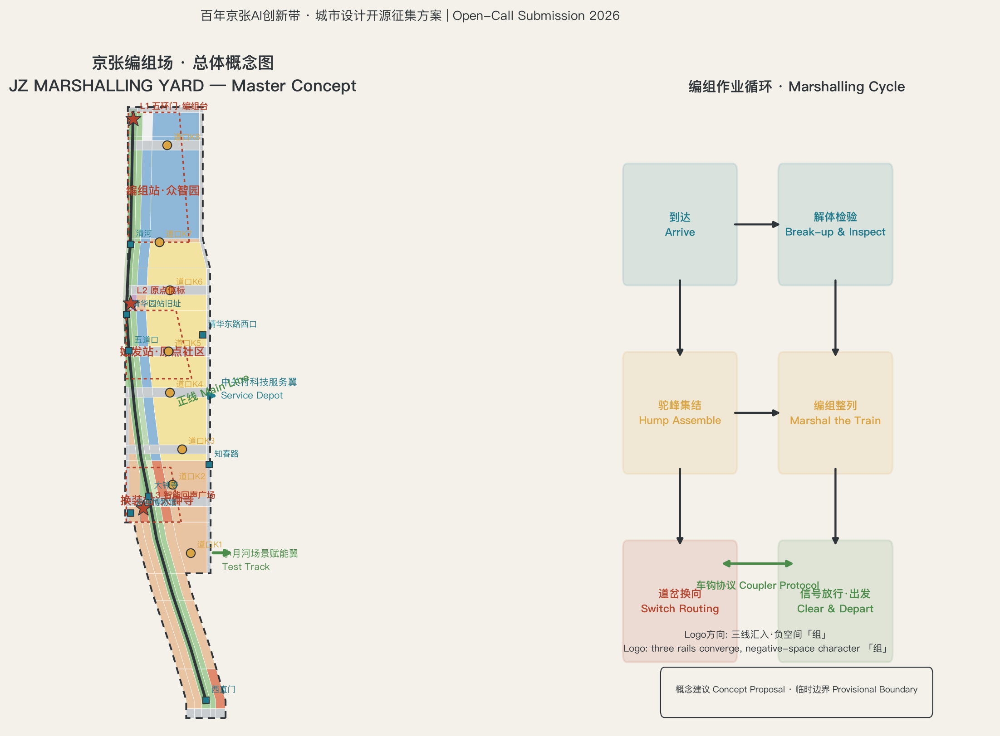
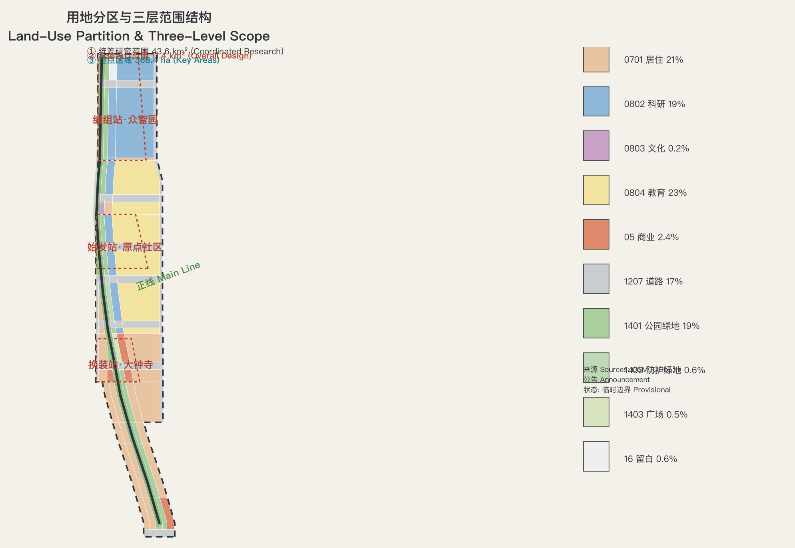
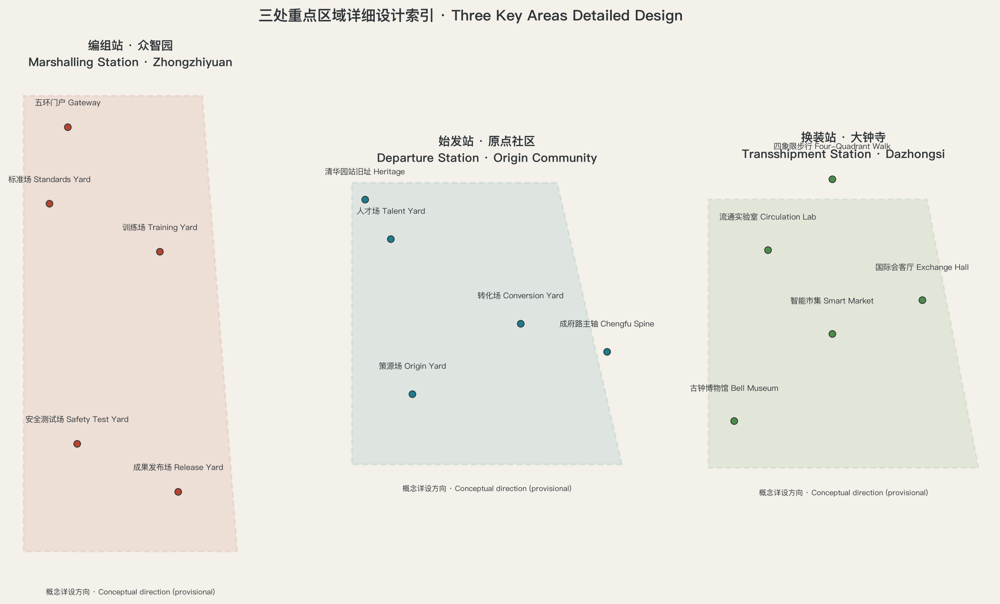
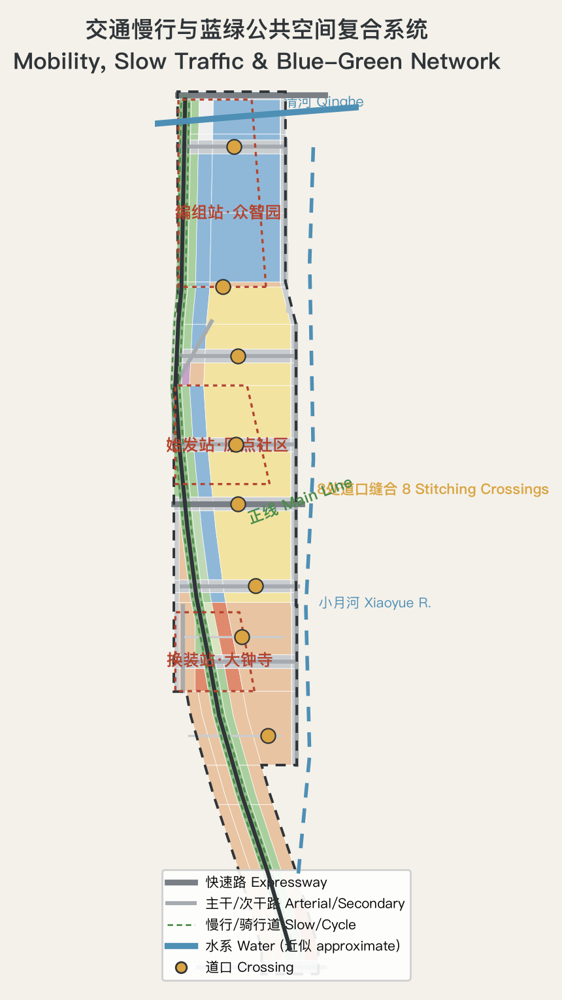
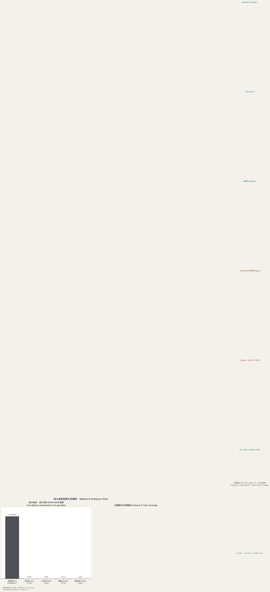

# JZ MARSHALLING YARD 京张编组场: An AI Innovation Orchestration Belt of One Line, Three Stations and Two Wings

> **JZ MARSHALLING YARD**｜In 1909, the Jing-Zhang Railway engineered by Zhan Tianyou first marshalled "self-reliant engineering" into a trunk line; more than a century later, what this corridor must move has changed to AI innovation factors — talent, data, compute, models and scenarios. This proposal reads the 11.4 km² overall design area as an **AI Innovation Marshalling Yard**: factors arrive from all directions, are broken up, inspected, assembled and marshalled in the yard, then depart as whole trains. A railway marshalling yard solves "how to turn single cars into a train"; the AI innovation belt must solve "how to turn scattered innovations into an industry train". The yard's operating discipline — first-in first-marshalled, break-up inspection, hump assembly, switch routing, signal clearance — is exactly the order an AI-age city needs: verifiable, reversible, clearable.

All spatial, event, policy, investment-attraction and phasing content in this proposal is **open co-creation concept material, a reference scheme, or material for professional teams to deepen**; it does not replace statutory planning, does not constitute a government-approved conclusion, and contains no parcel-level retain/renovate/demolish, road redline, rail alignment or engineering conclusion [source:SRC-AGENT-TASKBOOK-20260518]. While the official precise boundary is not public, this package generates all geometry on a **self-derived, street-aligned provisional boundary calibrated to the announced area**; every polygon is an `official_boundary=false` provisional constraint used only for generation, display, discussion and in-package self-check [source:SRC-PROVISIONAL-BOUNDARIES-20260605]. When the official polygon is released, the whole chain — land use, buildings, roads, blue-green, phasing, metrics, figures, HTML and PDFs — must be recomputed.

> **Executive Summary (seven lines)**
> 1. Core proposition: the century-old mission of the Jing-Zhang corridor is "to marshal scattered self-reliant capabilities into whole departures". Today it must marshal AI innovation factors.
> 2. Spatial structure: one line, three stations, two wings — the heritage park main line (≈9.7 km concept green spine), the Origin departure station, the Zhongzhiyuan marshalling station, the Dazhongsi transshipment station, plus the Zhongguancun service depot and the Xiaoyue River test track wings.
> 3. Institutional core: the "Coupler Protocol" — coupling and decoupling rules among industry, academia, government and developers; the "Timetable" — turning scenarios, events and space into executable departures.
> 4. Scenario system: 12 AI scenario cards (including 3 industry test & validation scenarios), 5 user personas, 8 switch/stitching nodes, 3 AI pilgrimage landmarks.
> 5. Boundary evidence: the package boundary is derived from the announced textual four-至 and OSM street centerlines and calibrated in EPSG:4548 to the announced ≈11.4 km² (recomputed 11,400,000 m²); the three key areas are calibrated to 192.1/104.3/72.0 ha; every spatial metric is recomputable from the in-package geometry.
> 6. Key disclosure: the repository's registered provisional boundary does not intersect the OSM-mapped heritage park (community Issue #846 recomputes a ≈412 m nearest distance); this package therefore uses a street-aligned boundary and registers the assumption; the difference requires the official polygon to adjudicate.
> 7. Decision boundary: all conclusions are conceptual; statutory FAR, building height, density, green ratio and setback conditions are not public and are registered as pending, never disguised as approved figures.

> **Thesis of the era (v0.2)**: "Though Zhou was an ancient state, its mandate was renewal." In 1909 Zhan Tianyou built China's first self-reliant trunk railway "contributing what we have learned, knowing what we know"; in 2019 the smart Beijing-Zhangjiakou HSR opened on the same corridor — the corridor has enacted the three acts of Chinese modernization in a century: building the line ourselves, driving it intelligently, and now the AI innovation belt (learning, autonomy, creation). This proposal's answer: **inheritance is taking hold, development is spreading out, breakthrough is laying track where no one has laid it** — progress does not discard the old rail but lets it run beside the new; our generation's task is not to finish the monument, but to hand its last tile, deliberately, to the future. What China offers the AI age is not only a faster instrument, but an attitude and an institutional imagination about how humans and intelligence can coexist: **instruments may globalize; the Way must keep its root** [source:SRC-CLASSICAL-TEXTS-2026].

## Design Basis and Source List

This formal package takes the Pre-qualification Announcement of the Centennial Jing-Zhang AI Innovation Belt International Urban Design Open Call issued by the Haidian Branch of the Beijing Municipal Commission of Planning and Natural Resources as its primary basis [standard:PROJECT-OFFICIAL-ANNOUNCEMENT] [source:SRC-OFFICIAL-ANNOUNCEMENT-20260509], the excerpted open-call taskbook for AI agents as its secondary basis [standard:PROJECT-AGENT-OPEN-CALL-TASKBOOK] [source:SRC-AGENT-TASKBOOK-20260518], and the allowed design space, enums, limits, standard snapshots and schemas registered in `brief/site-package/` as machine-readable bases. The public source registry `data/source_registry.json` distinguishes formal-ready, background-only and provisional-only material [source:SRC-PROVISIONAL-BOUNDARIES-20260605]; processed material serves only as a reading aid and is not a new authoritative source.

Beyond the repository, this package adds verified public background material, all registered in `sources.json` with background-only limitations: existing roads, rail, stations, water and heritage points from OpenStreetMap (ODbL 1.0, fetched 2026-08-10) [source:SRC-OSM-CONTEXT-20260810]; the 2019 opening of the Beijing-Zhangjiakou HSR and the Qinghuayuan Tunnel passing directly beneath the heritage park (publicly reported total length ≈6,020 m) [source:SRC-PUBLIC-REPORTS-JZ-HSR-2026]; the park's phase-1 opening of ≈2.4 km in 2023 and full ≈9 km through-connection in 2025 (public reporting synthesis) [source:SRC-PUBLIC-REPORTS-JZ-PARK-2026]; and Qinghuayuan Station built in 1910 with a station name inscribed by Zhan Tianyou, listed as a Beijing municipal cultural heritage unit in 2023 (public reporting synthesis) [source:SRC-PUBLIC-REPORTS-QHY-STATION-2023]. These materials support narrative and mechanism design only; they are not upgraded to boundary, control or scoring evidence. Original page URLs of the public reporting syntheses are registered as pending in `assumptions.json`.

The authority order of this package is: GeoJSON → metrics → the three matrices → manifest/sources/assumptions/self_check → proposal.md → figures → HTML → PDF. Every spatial judgment in the text returns to layers and metrics: scope via [data:geometry/site_boundary.geojson#SITE-001], key areas via [data:geometry/key_areas.geojson#PROV-KEY-001], existing constraints via [data:geometry/constraints.geojson#EX-RAIL-001]. Regulatory-depth and land-use classification follow the MOHURD and MNR codes [standard:MOHURD-CONTROL-DETAILED-PLANNING] [standard:MNR-LAND-USE-CLASSIFICATION-GUIDE]; public-space and city-character controls follow the Urban Design Administration Measures [standard:MOHURD-URBAN-DESIGN-MEASURES].

## Three-Level Scope Framework

The **coordinated research area (≈43.6 km²)** carries the strategic layer: it answers how the "three areas and two wings" coordinate with the Jing-Zhang corridor and the Beijing-Tianjin-Hebei innovation network, and outputs the industrial ecosystem, the future-city form and the naming/brand direction [metric:site_area_km2]. The **overall design area (≈11.4 km²)** carries regulatory-plan-depth urban design: land-use layout, renewal framework, transport and municipal support, the heritage park vitality belt and character controls [metric:site_area_sqm]. The **key detailed design area (≈368.4 ha)** delivers integrated-implementation-plan depth for Zhongzhiyuan, the Origin Community and Dazhongsi [metric:key_area_total_sqm] [metric:key_area_count]. The three layers transmit downward: corridor strategy sets the position, overall design sets the structure, key areas set the implementation [depth:three_level_scope_framework].

One boundary decision must be disclosed. The repository's registered provisional boundary `PROV-SITE-001` was inferred from the announcement's textual four-至, but community Issue #846 independently verified with OSM that it does not intersect the OSM-mapped Jing-Zhang heritage park, with a nearest distance of ≈412 m; key anchors such as Wudaokou Station (OSM: 116.3317, 39.9916), the Qinghuayuan Station heritage site and the Dazhongsi Bell Museum all fall outside the registered boundary. This package therefore adopts a **self-derived, street-aligned provisional boundary**: the OSM centerlines of the announced bounding streets (west: Dazhongsi East Road, Heqing Road; east: Xitucheng Road, Xueyuan Road, Xueqing Road; south: Xizhimen Outer Street; north: North 5th Ring Road) form the east-west edges, with a local westward expansion at Juesheng Temple (Dazhongsi Bell Museum) to include the heritage anchor, and the area is calibrated in EPSG:4548 to the announced ≈11.4 km² (recomputed 11,400,000 m²) [data:geometry/site_boundary.geojson#SITE-001]. The three key areas are re-anchored at Wudaokou, Qinghuadonglu-Xikou, Dazhongsi and Zhichunlu stations and heritage anchors, calibrated to the announced 192.1, 104.3 and 72.0 ha [metric:key_area_zhongzhiyuan_sqm] [metric:key_area_origin_sqm] [metric:key_area_dazhongsi_sqm]. Two points must be stressed: first, this package's boundary and the registered boundary are **equally provisional rough extents** — neither is an official redline and neither may be used for approval, ownership or precise-area claims [depth:risk_missing_data]; second, if maintainers update the registered boundary or the official polygon is released, this package will recompute the whole chain.

| Level | Design question | Answer of this scheme | Data anchor |
| --- | --- | --- | --- |
| Coordinated research area | How to organize the AI ecosystem and future-city form | The marshalling-yard proposition: an arrive-break-up-assemble-marshal-depart full-factor innovation chain; three-areas-two-wings synergy loop | compliance_matrix.json, standard_matrix.json |
| Overall design area | How to map industry, renewal, transport, municipal and character | One-line-three-stations-two-wings structure, 9-category land-use partition, phasing | [data:geometry/land_use.geojson#LU-001], [data:geometry/roads.geojson#ROAD-014] |
| Key area scope | How to reach detailed design depth in three areas | Three detailed schemes: departure / marshalling / transshipment stations | [data:geometry/key_areas.geojson#PROV-KEY-001], [data:geometry/key_areas.geojson#PROV-KEY-002], [data:geometry/key_areas.geojson#PROV-KEY-003] |

## Coordinated Research Area: Industry and Future City Research

### 3.0 Thesis of the Era and the Thought Core: Inherit, Develop, Break Through (v0.2)

**Thesis**: in a century, the Jing-Zhang corridor has enacted the three acts of Chinese modernization — building the line ourselves (1909), driving it intelligently (2019), and now the AI innovation belt (2026): learning, autonomy, creation. Our generations' role is not a three-way choice: **inheritance is taking hold, development is spreading out, breakthrough is laying track where no one has laid it**; breakthrough is not a broken rail but the extension of the main line — we stand at the switch after taking hold and spreading out, where the track runs toward the unclaimed [source:SRC-CLASSICAL-TEXTS-2026].

**Thought—metaphor—space mappings** (conceptual suggestions; each carries three layers — historical fact / thought dialogue / design interpretation — see the citation norms at the end of this section) [depth:overall_spatial_structure]:

| Thought (source) | Railway/AI metaphor | Spatial or ritual expression |
| --- | --- | --- |
| An old state, renewed mandate (Shijing, Da Ya, Wen Wang) | Heritage = old state; innovation belt = renewed mandate; old and new rails in parallel | Keep the original rails and ballast as the central axis, new labs grow on both sides; the "Old Key, New Door" rite: every Apr 26, new resident teams take a replica 1909 key from the Qinghuayuan station house to open the new lab |
| The Way and the instrument (Yijing, Xici) | AI = instrument; governance wisdom = the Way; "track" means both road and principle | The old Qinghuayuan station house becomes the "Hall of Way and Tools": instruments below, principles above, joined by the stairs; the annual AI-governance white paper is launched mid-stairs |
| Heaven and Earth co-established; daily renewal (Yijing / Daxue) | Train = Heaven (self-strengthening); ballast bed = Earth (bearing) | "Carrying Plaza": recovered ballast stones engraved with contributors, added yearly; at open-source launch a named stone is cast into the plaza |
| Emulating nature / herringbone line (Laozi; historically an engineering optimization under time and budget) | AI has both "forcing" and "following the grain" | "Herringbone Walk": accessible replica of the switchback; the "Yielding Rite": AI shuttles must slow and yield to pedestrians, data published — writing benevolence as traffic rules |
| Life-giving change; keeping pace with the times (Yijing) | Old line and HSR in parallel = old and new running together | "Parallel Vista": one line, two eras; AR time-station overlaying the 1909 train on today's track |
| The people are the root (Shangshu) | AI infrastructure as a public good | "People's Stops": free community shuttles, seniors/children/visually impaired first; "native-voice boards" with AI guides in Beijing and Zhangjiakou dialect |
| Harmony without sameness; beauty in diversity (Lunyu / Fei Xiaotong) | Co-railing = diversity under common rules; governance schedules difference instead of erasing it | "Co-Rail Hall": ring-rail conference table; the forum agenda follows Fei Xiaotong's sixteen-character four-step procedure; a "mutual-text covenant wall" juxtaposes governance texts with a blank for the future |
| Unity of knowing and doing (Wang Yangming) | Governance is a test run; ethics must pass real operation | "Test-Run Lab": governance sandbox runs AI in 'test-run' state before 'opening'; an "operations log wall" publishes key decisions — the traces of knowing and doing are both verifiable |

**Golden lines**: "The herringbone railway wrote the character 'human' into the mountains; today we write it into intelligence." / "AI is the instrument, governance is the Way: the instrument carries the Way forward, and the Way renews itself through the instrument."

**Citation and honesty norms**: all quotations are public-domain classical texts cited with their original chapters; historical facts follow academic convention, distinguishing "historical fact / thought dialogue / design interpretation"; no "the ancients knew AI" comparisons, no implication that machines have consciousness, no claim that any thought is unique or superior; in international communication the strong versions of "all-under-heaven / great harmony" are weakened to internationally translatable terms such as "a global public good / no one left behind" [source:SRC-CLASSICAL-TEXTS-2026] [depth:risk_missing_data].

### 3.1 Master Concept: Reading the Jing-Zhang as a Marshalling Yard (agent.1)

The 1909 opening of the Jing-Zhang Railway was the first time Chinese engineers marshalled surveying, construction and operations self-reliance "into a whole train"; in 2019 the Beijing-Zhangjiakou HSR opened, and the Qinghuayuan Tunnel passes directly beneath the heritage park, connecting the green power and compute of the Beijing-Tianjin-Hebei region into the Zhongguancun hinterland (public reporting synthesis) [source:SRC-PUBLIC-REPORTS-JZ-HSR-2026]. The master-concept judgment of this proposal: **the century-old mission of the Jing-Zhang corridor has always been "marshalling" — turning scattered self-reliant capability into whole departures; what must be marshalled today is AI innovation factors**. Haidian does not lack single cars (universities, enterprises, talent, compute, data); it lacks a yard — a spatial and institutional system in which scattered innovations pass inspection, assembly and marshalling and then depart as whole trains. The "marshalling yard" is simultaneously a railway operating entity and a homomorphic metaphor for agent orchestration — orchestration being the most central governance grammar of the AI age.

**Naming system**: primary name 「京张编组场」; English name JZ MARSHALLING YARD; tagline "In arrives the single car, out departs the full train". The naming system is drawn entirely from railway marshalling vocabulary: the heritage park spine is the **main line** (≈9.7 km concept green spine with walking and cycling paths [metric:greenway_length_m]); the three key areas are the **departure station (Beijing AI Origin Community), the marshalling station (Zhongzhiyuan AI Autonomous Innovation Acceleration Area) and the transshipment station (Dazhongsi AI Industry Cluster)**; the Zhongguancun technology-service wing is the **service depot** (maintenance and supply: capital, IP, legal, compute contracts) and the Xiaoyue River scenario-empowerment wing is the **test track** (small-scale trials before new scenarios go live); the eight east-west stitching nodes are **crossings** (the public-space form of switches); AI scenario deployments are **departures** and their annual schedule is the **timetable**; the coupling rules among industry, academia, government and developers are the **coupler protocol**; the gravity mechanism assembling policy, capital and talent is the **hump**. The logo direction is "three lines converging": three rails from the north and south converge into the central main line, with the negative space implying the character 「组」(to assemble), in station-house brick red, track dark grey and AI cyan with signal-green accents; typography follows an open-source station-board gothic direction — no unauthorized fonts, trademarks or corporate marks are used [depth:overall_spatial_structure]. Naming and graphics are directional suggestions; the final visual system awaits professional design deepening.

**Three positionings, five functions and the three-areas-two-wings loop**: under the marshalling grammar, the three positionings are mutually constitutive — the centennial Jing-Zhang culture belt is the **main line and station buildings** (tangible time and heritage), the urban AI-life experience belt is the **station plazas and crossings** (a public interface where everyone can board), and the AI-integration innovation belt is the **marshalling operation itself** (the order of factors coming and going) [source:SRC-AGENT-TASKBOOK-20260518]. The five functions land as: the AI full-stack autonomous innovation system and global AI-governance discourse mainly at the **marshalling station (Zhongzhiyuan)**; the world-class AI innovation ecosystem mainly at the **departure station (Origin Community)**; the AI+ scenario-empowerment paradigm along the **test track (Xiaoyue River wing) and crossings**; the intelligent AI-vital city carried by the **main line and station-front system**; and the synergy loop is a complete "marshalling cycle": the service depot (Zhongguancun wing) supplies capital, IP and compute contracts; the departure and marshalling stations produce models and products; the test track runs first validation in campus and community scenarios; validated products face the market and content consumption at the transshipment station (Dazhongsi); mature departures leave the corridor; green power and compute flow back upstream. Every ring of the loop corresponds to spatial layers and metrics in this package [depth:overall_spatial_structure].

### 3.2 Global AI Ecosystem Case Studies and Ecosystem Map (agent.2, seven cases)

Seven cases are selected for transferable mechanisms rather than fame [metric:case_study_count]:

| Case | One-line portrait | Transferable mechanism |
| --- | --- | --- |
| King's Cross, London | Railway-yard renewal grows an AI-headquarters district | Heritage station-yard as the face of the innovation district; development bundled with public space |
| Kendall Square, Cambridge | "The most innovative square mile", a campus-gate conversion zone | Campus-park zero distance; vertical mixing of labs and street commerce |
| Station F, Paris | World's largest single-site incubator in an old freight station | One large space aggregating thousands of teams; the operator is the brand |
| one-north, Singapore | Government-led twenty-year rolling science city | Long-cycle phasing and reserves; public labs anchor industry clusters |
| Zhangjiang Science City, Shanghai | Comprehensive science city driven by grand science facilities | Grand facilities as "heavy anchors"; housing and services catch up with industry |
| Yuehai Street, Nanshan, Shenzhen | High-density spontaneous innovation block | Building-level mixed use; enterprise iteration in sync with block renewal |
| Quayside, Toronto | Star project terminated in 2020 over a data-trust crisis | **Cautionary tale**: without public reversibility and data-governance consensus, even good technology is rejected by the city |

Three takeaways for Haidian: **use the heritage station-yard as the face** (main line and Qinghuayuan Station heritage site), **use the campus gate as the conversion zone** (departure station), and **make reversibility a precondition** (coupler protocol and test track). All cases are qualitative summaries of public knowledge; no unverified investment or output figures are cited [depth:existing_conditions_diagnosis].

**Ecosystem map**: the AI innovation ecosystem map is organized in three layers — factors (talent, data, compute, capital, scenarios, standards), stages (origin-conversion-incubation-acceleration-industrialization-globalization) and carriers (universities, open-source communities, incubators, accelerators, headquarters, test fields, public labs). The industry-space mapping of the three areas and two wings is detailed in Chapters 4–5 and the industry-space mapping depth item of `design_depth_matrix.json`.

### 3.3 Future-City Form Fit for AI

Three landable propositions for the AI-era city form: **first, compute sinks to block-level infrastructure** — edge compute pods enter blocks like transformer cabinets, with their cooling and energy needs coupled to distributed energy and blue-green systems, making "the temperature of computation" a perceptible urban phenomenon; **second, space supply shifts from whole buildings to departures** — scenarios book public space and test sections on the timetable, shrinking the minimum unit of space supply from "parcel" to "time-slot × road-section"; **third, reserves become switch reserves** — the northern reserve land is left unprogrammed as margin for technology-route changes [data:geometry/land_use.geojson#LU-129]. AI culture and AI society narratives are carried by the cultural system in Chapter 9; the international working-and-living atmosphere rests on a 24-hour exchange system at "campus gates + station fronts" and the experience path along the test track.

## Overall Design Area: Urban Renewal and Regulatory-Plan-Level Urban Design

### 4.1 Industry Goals, Functional Layout and Indicator System

The overall design area continues the "three-station" division of labor: the northern marshalling station carries full-stack training, standard-setting and safety governance; the middle departure station carries original-innovation conversion and open-source communities; the southern transshipment station carries the market-facing interface of agent applications, smart devices and content consumption. Functional proportions follow land-use recomputation: research land ≈1.87 million m², residential ≈2.36 million m², education ≈2.65 million m², commercial ≈0.27 million m², roads ≈1.96 million m², green and plazas combined ≈1.93 million m² (see the land-use table in Chapter 7) [metric:land_use_0802_sqm] [metric:land_use_0701_sqm] [metric:land_use_1207_sqm]. The indicator system proposes a "Marshalling Index" framework: the upstream side monitors factor arrival rates (talent, compute, data, capital), the marshalling side monitors conversion rates (incubation-acceleration-industrialization) and departure punctuality (scenario launch-validation-promotion cycles), and the downstream side monitors public-return rates (scenario retention, employment and public experience); baselines require authoritative statistics and are honestly registered as pending — no fabricated numbers [depth:metrics_recalculation].

### 4.2 Overall Urban Renewal Framework

The renewal framework is summarized as "**one line pulling, two belts renewing, multiple nodes progressing**": the through-line of the main line is the renewal engine (public reporting: park phase 1 ≈2.4 km opened 2023, phase 2 through-connected ≈9 km in 2025) [source:SRC-PUBLIC-REPORTS-JZ-PARK-2026], extended by this scheme north-south to an ≈9.7 km concept green spine [metric:greenway_length_m]; the Xueyuan Road renewal belt between Zhichun Road and the North 4th Ring and the Heqing Road-Tayuan renewal belt are the two main renewal belts; the rest proceeds incrementally at crossings, station plazas and other nodes. The selection principle for renewal targets is "**breaks first, parcels second**": first stitch public-space breaks (small investment, immediate public benefit), then push block-group renewal. The concept total floor area is ≈6.42 million m² (inferred from building footprints and type floors; a massing reference only, not a regulatory figure) [metric:concept_total_floor_area_sqm]; post-renewal AI industry space concentrates in [metric:building_count] concept building clusters [data:geometry/buildings.geojson#BLDG-001]. The jobs-housing-commerce balance embeds talent apartments and community services within the 800 m catchment of the three stations to avoid mono-polar industry [depth:retain_renovate_demolish]. A **reserve covenant** is suggested for the northern reserve land: a stele reading "Reserve for later writing", governed by "what is, is for use; what is not, is for use" (Laozi) so the land is never pre-programmed (a concept institution, not a statutory control) [source:SRC-CLASSICAL-TEXTS-2026].

### 4.3 Transport, Rail, Municipal Infrastructure and Supporting Facilities

**Rail-station integration**: all six rail nodes along the corridor (Xizhimen/Beijing North, Dazhongsi, Zhichunlu, Wudaokou, Qinghuadonglu-Xikou, Qinghe) are recommended for station-city integration concept studies [metric:station_node_count]; the four-quadrant pedestrian connection at the Dazhongsi intersection and the Wudaokou crossing plaza are near-term priorities. **Road micro-circulation**: Xueyuan Road, Xitucheng Road and Xueqing Road form the eastern arterial edge; Dazhongsi East Road and Heqing Road the western secondary edge; the North 3rd Ring, North 4th Ring, Zhichun Road, Chengfu Road, Qinghua East Road and Qinghe Road are the stitching corridors crossing the main line [data:geometry/roads.geojson#ROAD-008]; eight crossings are recommended for east-west pedestrian and cycling connections to repair slow-traffic breaks. **Parking and non-motorized traffic**: P+R and shared-bike exchange facilities around rail stations, with a walk-first 300 m catchment. **New infrastructure**: edge-compute pods, distributed energy with microgrids, and compute-heat cogeneration are explored as concept directions for integrating AI-industry new service facilities with the traditional municipal trio (no engineering-feasibility conclusions) [depth:municipal_new_infrastructure]. **Public service facilities**: AI industry services (public labs, test beds, data spaces), innovation platforms (open-source community centers, compute service counters, IP and legal stations) and talent-life services (talent apartments, childcare, international schools, sports facilities) are laid out around the three stations [depth:traffic_rail_slow_parking].

### 4.4 Heritage Park Vitality Belt and Urban Character

**Vitality belt**: the main line is organized in three sections — "community vitality in the south, cultural exchange in the middle, natural leisure in the north" — preserving railway industrial heritage vocabulary (old rails, station boards, milestones) with ginkgo corridors, sports fields, children's areas and railway-themed museum nodes (public reporting: museum facilities already exist along the line) [source:SRC-PUBLIC-REPORTS-JZ-PARK-2026]. **Character control**: the urban keynote is "centennial station house × AI laboratory" — a brick-red, dark-grey and cyan system runs through station buildings, boards and crossing installations; for areas with renewal potential, height, intensity, style, roof form and massing guidance follow a conceptual "station-yard height ring" framework (inside-out: low-rise high-density station-front open areas, mid-rise clusters in marshalling zones, multi-storey residential in the periphery); concrete control values await regulatory conditions [depth:height_massing_character].

## Detailed Design of Key Areas

All three key areas use provisional polygons calibrated to the announced areas [data:geometry/key_areas.geojson#PROV-KEY-001] [data:geometry/key_areas.geojson#PROV-KEY-002] [data:geometry/key_areas.geojson#PROV-KEY-003], drawn as low-contrast dashed constraints with design intent as the visual subject; all conclusions below are directional designs to be recomputed when official boundaries and regulatory conditions arrive [depth:three_key_area_detailed_design].

### 5.1 Marshalling Station: Zhongzhiyuan AI Autonomous Innovation Acceleration Area (≈192.1 ha)

**Positioning**: the "final assembly shop" of the AI full-stack autonomous innovation system and global AI-governance discourse. **Spatial structure**: a "marshalling operations belt" — with the Qinghe waterfront as the northern edge, organizing a four-yard sequence of "standards yard-training yard-safety test yard-achievement release yard" along the northern main line, full-stack industry clusters on the east and a garden-style innovation block on the west, with an outbound-traffic hub concept node at the 5th-Ring gateway (optimization directions proposed in the context of integrated 5th-Ring planning; no engineering conclusion) [standard:PROJECT-OFFICIAL-ANNOUNCEMENT]. **Building renewal**: retain the skeleton of existing industry buildings and insert full-stack R&D, public labs and standards centers; potential land is laid out in "yard-group" minimum renewal units. **Public space**: excavate and display Qinghe culture with a waterfront marshalling plaza and wetland meadow; green space serves AI function scenarios (outdoor testing, drone corridors, environmental-perception experiment fields). **AI scenarios**: full-stack validation (scenario cards S2–S3 in Chapter 6) and the 5th-Ring gateway landmark (L1 in Chapter 9). **Implementation risks**: the switch-reserve nature of the northern reserve land needs official confirmation; outbound-traffic optimization involves 5th-Ring integration and is a major engineering matter requiring professional deepening.

### 5.2 Departure Station: Beijing AI Origin Community (≈104.3 ha)

**Positioning**: a campus-adjacent AI innovation block and the departure station of "original-innovation origin-conversion". **Spatial structure**: with Wudaokou Station and the Qinghuayuan Station heritage site as twin anchors, organizing a three-yard sequence of "origin yard-conversion yard-talent yard"; Chengfu Road is the innovation-commerce spine and the Shuangqing Road direction is the campus-park slow-traffic stitching corridor (public reporting: the Origin Community radiates ≈3 km² around the Origin Tower, aggregating ≈400 enterprises and ≈13,000 AI professionals; this scheme takes the renewal-district scope as a conceptual reference) [source:SRC-PUBLIC-REPORTS-ORIGIN-COMMUNITY-2026]. **Building renewal**: low-disturbance, organic renewal — preserve block fabric and existing buildings, release innovation space through interior retrofit, rooftop additions and courtyard connection; integrate the design around the Wudaokou and Qinghuadonglu-Xikou rail stations. **Public space**: the Qinghuayuan Station heritage plaza and railway-culture display node (a heritage-protection unit; display and use must comply with protection rules) [source:SRC-PUBLIC-REPORTS-QHY-STATION-2023]; the Wudaokou crossing plaza as "a platform where everyone can board". The central plaza of the Origin Community is suggested to be named the "**Tianyuan Plaza**" — the origin point of the go board is the origin of AI (concept naming). **AI scenarios**: campus-city conversion, open-source community and talent-life scenarios (S4–S6 in Chapter 6). **Implementation risks**: heritage and campus ownership boundaries are sensitive; all retrofits require professional deepening and compliance review first.

### 5.3 Transshipment Station: Dazhongsi AI Industry Cluster (≈72 ha)

**Positioning**: the "arrival-departure yard" of agent, smart-device and content-consumption AI-native and AI+ fusion business forms — the trade interface of a world-class intelligent-economy ecosystem. **Spatial structure**: with Dazhongsi Station and the Bell Museum (Juesheng Temple, registered in OSM historic) as twin anchors, organizing a three-yard sequence of "intelligent-economy market-data-factor circulation lab-international exchange hall" [data:geometry/constraints.geojson#HER-002]; planned green land is designed for composite use. **Building renewal**: study potential parcels and surrounding campus renewal directions, build efficient industrial-agglomeration carriers, and upgrade public environment and commerce around key enterprises. **Transport organization**: four-quadrant pedestrian connectivity at the Dazhongsi intersection (per the announcement) and improved static traffic organization including non-motorized parking [depth:traffic_rail_slow_parking]. **AI scenarios**: a smart-device experience street, a content-livestream cluster and a data-factor circulation test (S8–S10 in Chapter 6). The station-front plaza is suggested to host a "**Three Strikes of the Bell**" concept: thrice daily, a digitally sampled Yongle Bell sound relays along the main line (requires acoustic assessment and community consensus; concept direction). **Implementation risks**: construction around the Bell Museum is subject to heritage construction-control zones; data-factor circulation involves policy innovation requiring coordinated deepening with regulators.

## AI Innovation Ecosystem, Personas and AI+ Scenarios

### 6.1 User Personas (five)

| Persona | Traits | Spatial needs | Service scenarios |
| --- | --- | --- | --- |
| P1 Algorithm researcher | Young scientists at universities/institutes, flexible hours | Public labs, 24h study spaces and coffee, affordable housing | Full-stack validation, academic release |
| P2 Developer & founder | Open-source contributors, early teams, mobile across campuses and firms | Incubators, open-source community centers, pitch stages, talent apartments | Open-source collaboration, funding pitches |
| P3 Key-enterprise employee | Engineers and PMs of LLM/device/content firms | HQ buildings, test beds, health and childcare | Industry testing, content creation |
| P4 Resident & visitor | Residents of ≈70 communities along the line, experience-seeking visitors | Parks, station plazas, experiential retail, cultural events | Public experience, AI life services |
| P5 International visitor & developer | Overseas developers, conference attendees | International exchange spaces, bilingual wayfinding, visa and admin services | International events, attraction conversion |

### 6.2 AI Scenario Cards (12, including 3 industry test & validation scenarios)

The scenario cards cover AI+software, AI+healthcare, AI+education, AI+legal, AI+life services, AI+transport and AI+public space; each card maps spatial anchor, service object, operating data, privacy boundary, human review, operating entity and visualization layer (full fields in `compliance_matrix.json` and `visual/index.html`) [metric:scenario_card_count]:

| ID | Scenario card | Domain | Spatial anchor | Type |
| --- | --- | --- | --- | --- |
| S1 | Marshalling console: compute-data-scenario matching terminal | AI+software | Zhongzhiyuan marshalling plaza | Public service |
| S2 | Standards & safety test bed: full-stack autonomy validation | AI+software | Zhongzhiyuan standards yard | **Industry test** |
| S3 | Outdoor robot validation corridor: low-speed logistics and inspection | Robotics/transport | Test track, northern main line | **Industry test** |
| S4 | Campus-city conversion hall: achievement release and pitching | AI+software | Origin Community origin yard | Public service |
| S5 | Open-source community center: code collaboration and hackathons | AI+software | Origin Community conversion yard | Public service |
| S6 | Talent post: apartments + childcare + health integrated | AI+life services | Origin Community talent yard | Life service |
| S7 | AI culture guide: bilingual heritage-park narrative tour | Culture | Full main line | Public experience |
| S8 | Smart-device experience street: consumer AI product experience | AI+commerce | Dazhongsi intelligent market | Commercial experience |
| S9 | Content-livestream cluster: AI content creation workshop | AI+content | Dazhongsi content yard | **Industry test** |
| S10 | Data-factor circulation lab: auditable data-trading sandbox | AI+legal | Dazhongsi circulation lab | Public service |
| S11 | Healthcare AI clinic: assisted diagnosis and health-management demo | AI+healthcare | Xueyuan Road healthcare belt (concept) | Public service |
| S12 | Crossing safety & shared mobility: AI traffic-signal experience | AI+transport | Eight crossings | Public experience |

**Privacy and human-review boundary**: all personal-data scenarios (S6, S11 etc.) must follow "minimal necessity + user consent + human review"; generative-AI services facing the domestic public comply with the scope and content-handling requirements of the Interim Measures for the Management of Generative AI Services [standard:GENERATIVE-AI-INTERIM-MEASURES]; the human-service boundary of medical scenarios follows Article 39 of the Barrier-Free Environment Law for the enumerated public-service matters [standard:BARRIER-FREE-ENVIRONMENT-LAW]; high-frequency elderly scenarios follow the principle of running traditional and smart service channels in parallel [source:SRC-GOV-ELDERLY-TECH-20201124]. No scenario may present immature technology as fully deployed, and no test scenario may be presented as approved operation [depth:risk_missing_data].

**Test-track release mechanisms (conceptual upgrade of scenario-open operations, v0.2)**: ① **Reversibility Gate** — before release, every scenario files a rollback plan (human takeover points, data snapshots, impact radius) with its filing; runtime baseline drift beyond tolerance shows yellow, a red line triggers one-key rollback to the snapshot with a full audit trail, responding to the emergency-handling and traceability requirements of the Interim Measures for the Management of Generative AI Services [standard:GENERATIVE-AI-INTERIM-MEASURES]; ② **Inspector's Hammer: dual-sign release** — AI decisions touching personal data need a certified "reviewer's" e-hammer signature plus AI confidence (dual sign) before release, making the reviewer a certified park role; ③ **Break-up Line: data retirement** — on scenario retirement, data is returned, anonymized-archived or destroyed, with residual value registered, de-identified and reused in the data-factor circulation lab; ④ **Day-Night Tide: public first/last runs** — night-time off-peak compute runs free community AI education and Q&A (templates first, human review), with developers earning rotation credits [depth:risk_missing_data].

## Land Use, Building Scale, and Retain-Renovate-Demolish Strategy

**Land-use layout**: the land-use partition is driven by the "main line-three stations-two wings" structure, expressed in 9 national spatial land-use codes, covering the whole extent seamlessly and without overlap (recomputed area consistent with the boundary) [data:geometry/land_use.geojson#LU-001] [metric:land_use_area_sqm]. Partition logic: the park core belt (1401, ≈19%) runs ≈70 m on each side of the main line with 160 m side wings; 60 m road belts (1207) on the east and west edges; inner rings dominated by residential (0701, ≈21%) and research (0802, ≈19%); education (0804, ≈23%) corresponds to the in-boundary campuses of Tsinghua, Beihang, USTB, CUMTB, BFU and BLCCU; commercial (05, ≈2%) concentrates at the three station fronts and Chengfu Road; the reserve (16) sits east of Zhongzhiyuan in the north as switch reserve [depth:land_use_layout].

**Building scale**: concept building footprints ≈1.48 million m² (126 concept clusters [metric:building_count]), building density ≈11.6% [metric:building_density]; concept total floor area ≈6.42 million m² inferred by type floors [metric:concept_total_floor_area_sqm], with a concept FAR ≈0.56 (whole-belt scope, massing reference only). **Retain-renovate-demolish classification**: expressed as a three-category logic — education, heritage and major public buildings are primarily retained; industry and residential renewal areas are primarily renovated (low-disturbance, organic); station-front and potential parcels are primarily new-build; the northern reserve is not pre-judged. All classifications are conceptual and constitute no parcel conclusion [depth:retain_renovate_demolish]; statutory FAR, height, density, green ratio and setback values are not public and are registered as pending [metric:far_official_control].

## Transport, Rail, Municipal Infrastructure, and Public Services

**Road micro-circulation**: a "three horizontals, eight verticals" concept — the three horizontals are the North 3rd Ring, North 4th Ring and the Chengfu Road-Qinghua East Road stitching corridor; the eight verticals are the crossing connector lines on both sides of the main line; branch and block roads are recommended to complete micro-circulation and relieve peak pressure on Xueyuan and Xitucheng Roads [data:geometry/roads.geojson#ROAD-017]. **Rail-station integration**: the six nodes are tiered — hub level (Xizhimen/Beijing North, Qinghe) and district level (Dazhongsi, Zhichunlu, Wudaokou, Qinghuadonglu-Xikou); district-level stations prioritize AI industry services and talent-life facilities within a 300 m catchment [metric:station_node_count]. **Slow traffic**: the main-line walking and cycling paths total ≈9.7 km (recomputed [metric:greenway_length_m]) with eight crossing stitches, forming a continuous, unbounded slow and green network [data:geometry/roads.geojson#ROAD-014]. Three experiential details are suggested (concept): **Model Milestones: the training curve** — a stele per kilometre with railway mileage on one face and training steps (1k→1M) on the other, a shallow loss curve between, from an "epoch 1" start stone to a "converged" end stone; **Two-Century Timeline** — a small milestone every 100 m, railway history on the left and AI history on the right, merging at Qinghuayuan; **Sleeper-Texture Tactile Path** — tactile paving with sleeper-and-spike textures so visually impaired walkers feel "on the railway" by foot. **Municipal and new infrastructure**: concept directions such as edge-compute pods coupled with distributed energy, compute-heat coupling with blue-green space, and AI-inspection synergy with municipal operations are explored (no engineering-feasibility conclusions) [depth:municipal_new_infrastructure].

## Blue-Green Network, Public Space, and Urban Character

**Blue-green system**: with the main-line green spine as the axis, linking the Qinghe waterfront green belt (north), the Xiaoyue River blue-green corridor (eastern wing corridor; approximate alignment registered in the constraints layer [data:geometry/constraints.geojson#EX-WATER-002]) and the Yuan Dadu city-wall heritage belt (southern background), forming a "one spine, two rivers" continuous, unbounded green system; green and open space totals ≈1.93 million m² with a green ratio of ≈17% [metric:green_ratio], and public space ≈0.22 million m² at ≈2.0% [metric:public_space_ratio]. **AI public space and pilgrimage landmarks (agent.4)**: three AI pilgrimage landmark or honor-display nodes are proposed [metric:landmark_count]: **L1 the 5th-Ring Gate·Marshalling Platform** (at the northern end of Zhongzhiyuan, an AI achievement-release landmark facing the 5th Ring), **L2 Qinghuayuan Station·Origin Beacon** (beside the Qinghuayuan Station heritage site, a developers' and AI-pioneers' honor wall, subject to heritage display rules) and **L3 Dazhongsi·Intelligent Echo Plaza** (opposite the Bell Museum, a dialogue node between AI sound art and bell culture). The honor-display system is proposed in four carrier types — "developers' honor wall, agent-contributor honor steles, open-source milestones, global developer directory" — embedded in a public-space component library of five modular families ("station board, crossing, seating, lighting, paving") for reuse across the belt [depth:blue_green_public_space].

**Culture system: welding three layers of culture (v0.2)**: ① **Red-Yellow-Green Honesty System** — one three-colour signal language for park wayfinding and AI guides: green = archive-backed, yellow = verify before believing, red = "I don't know, I won't fabricate"; AI guides show the light before answering, turning the compliance requirement "do not distort history" into the park's most distinctive narrative device (colour-blind friendly: colour plus shape); ② **Crew Names for Agents** — park AI agents take railway crew names: Switchman (routing), Signalman (fact-checking; shows yellow when unsure), Inspector (QA), Dispatcher, Flagman (host) — roles, not personas; ③ **6020 Folded Section** — a well-section installation showing the heritage line, Metro 13 and the Qinghuayuan HSR tunnel (publicly reported ≈6,020 m) with live train position [source:SRC-PUBLIC-REPORTS-JZ-HSR-2026]; ④ **Handover & Alignment Rite** — an annual three-party handover (railway workers and their descendants × Zhongguancun programmers × AI practitioners) following roll-call, repeat-back, sign, hand-over-keys, with the handover sheet reading "pass on accuracy; mark uncertainty as uncertain" (artistic re-enactment with consent and verified facts); ⑤ **micro cultural facilities** — "Water-Crane" drinking points (the steam-age water crane reborn as city refill points) and the "Sleeper Ring Chrono-Path" (120 recovered sleepers, one step one year: 1905 groundbreaking → 1910 Qinghuayuan → 1956 Dartmouth → 2016 crossing closure → 2026 today) [depth:blue_green_public_space]. **Urban character**: the keynote is "centennial station house × AI laboratory", with concept height rings and color systems for station-front open areas, marshalling zones and peripheral residential areas (see 4.4); landmarks and wayfinding comply with heritage and clearance requirements and must not be over-entertained [standard:MOHURD-URBAN-DESIGN-MEASURES].

## Renewal Projects, Implementation Policy, and Phasing

**Renewal project list (24 concept projects)**: organized in four categories — "main-line connection, three-station renewal, two-wing infill, eight-crossing stitching": main-line projects (north-south extension, railway museum cluster, ginkgo corridors etc., 6 items); three-station projects (Origin Community organic-renewal groups, Zhongzhiyuan yard groups, Dazhongsi intelligent market etc., 9 items); two-wing projects (depot service facilities, test-track sections etc., 4 items); crossing projects (8 crossings stitched as 5 packaged items) [metric:renewal_project_count]. Each item carries location, type, dependencies and suggested implementation entity — see `compliance_matrix.json` and the visual page. **Implementation policy suggestions**: flexible mixed-use supply, scenario-open filing, corporate adoption of public space, data-sandbox regulatory coordination, talent housing guarantees and a "breaks first, parcels second" gradual renewal sequence (all policy suggestions, not confirmed arrangements). **Phasing**: near-term (2026–2028) main-line core connection and three-station node launch [metric:phase1_area_sqm]; mid-term (2029–2032) southern renewal plus Xueqing Road belt and two-wing infill [metric:phase2_area_sqm]; long-term (2033–2037) Xizhimen gateway and northern reserve [metric:phase3_area_sqm], corresponding to `geometry/phasing.geojson` [data:geometry/phasing.geojson#PHASE-001].

**Global AI event system and long-term operations (agent.6)**: the **annual event system** is scheduled as a "timetable" of four seasons and four themes — Spring·Open-Source Season (hackathons and the open-source community conference), Summer·Validation Season (test-track open testing and scenario competitions), Autumn·Release Season (achievement release and the global developer conference), Winter·Sedimentation Season (honor-wall update and the annual white paper); the **event brand IP** and communication visual system continue the logo system (brick red × dark grey × cyan × signal green); **developer-community operations** propose a standing operator running the "coupler protocol" matchmaking platform and a developer points-honor system; **scenario-open operations** center on test-track filing, with public experience and landmark operations entrusted to professional agencies; **international communication and attraction conversion** build a four-level "attend-inspect-settle-land" path on the seasonal events, with bilingual wayfinding and an international service menu. All events, investment attraction, funding and policy arrangements are concept suggestions or deepening directions and must not be presented as confirmed government arrangements [source:SRC-AGENT-TASKBOOK-20260518].

**Ritual and honour details (v0.2, all conceptual)**: ① **Dual-Check Model Release** — for major model releases, a human maintainer and the community AI perform the railway's dual-check release together: AI drafts the release order, the human seals it, the signal turns from red to green, and orders are archived by serial number into the timetable archive (human final review; AI only assists in drafting); ② **Dazhongsi New Year Code Vigil** — every Dec 31 developers bring the year's last commit to Dazhongsi and submit as the New Year bell rings, with time zones relaying "last commits" for 24 hours; ③ **Solar-Term Open-Source Calendar** — the year's project rhythm maps onto the 24 solar terms (start in Lichun, hatch in Jingzhe, sow in Guyu, sprint in Mangzhong, harvest in Qiufen, review in Dongzhi), published as scroll plus API calendar; ④ **Zhongzhi Honor Gallery** — annual honor plaques are written by the NEXT year's newcomers (the new honor the old), with a digital merit stele keeping every name; ⑤ **Weekend Open-Source Fair** — one weekend a month the corridor hosts a fair (project stalls, pair-programming, hardware drifting, open-source crafts); ⑥ **Developer Lifetime Ticket** — a first accepted contribution earns a digital ticket; annual stamps accumulate into a lifetime ticket bound to the global developer directory; ⑦ **Global Relay Departure** — during Spring Open-Source Season, a relay runs across UTC time zones, each merged PR a station arrival, on a live world timetable.

**Intergenerational rites and the blank (v0.2)**: ① **JZ Clock: one train to 2059** — a giant mechanical flap timetable at the origin station, always one train: 1909 opening / 1949 / 2019 smart HSR / 2029 / 2035 basic modernization / 2049 modern power / 2059 the 150th year; the board flips once a year on Oct 2 with era soundscapes, and the next station's name is chosen by public vote; ② **Five Named Trains: from Zhengqi to Qiangguo** — Zhengqi (1909) / Jiefang (1949) / Gaige (1978) / Fuxing (2019) / Qiangguo (2049 — no train yet, only a name and a departure time: the blank), as the time axis of the naming system; ③ **Reserved Rail** — a real rail with a gap at the marshalling station, into which a trio of "veteran rail worker + teenager + AI engineer" drives one dated spike each year (2026→2059), completing in 2059 — every generation leaves a blank for the next [source:SRC-CLASSICAL-TEXTS-2026] [depth:phasing_implementation].

## Metrics, Area Recalculation, and Compliance Matrix

Core metrics are either recomputable from the in-package geometry or registered as pending: site area 11,400,000 m² (recomputed in EPSG:4548) [metric:site_area_sqm]; the three key areas at 192.1/104.3/72.0 ha (calibrated to the announced values) [metric:key_area_zhongzhiyuan_sqm] [metric:key_area_origin_sqm] [metric:key_area_dazhongsi_sqm]; green ratio ≈17%, public-space share ≈2.0%, road share ≈17%, building density ≈11.6% [metric:green_ratio] [metric:public_space_ratio] [metric:road_ratio] [metric:building_density]; main-line green spine ≈9.7 km [metric:greenway_length_m]; road centerlines ≈53.5 km [metric:road_centerline_length_m]; 12 scenario cards, 3 test scenarios, 5 personas, 7 cases, 3 landmarks, 24 renewal projects [metric:scenario_node_count] [metric:test_scenario_count] [metric:persona_count]. The **Marshalling Index** (AI innovation index framework) comprises factor arrival, marshalling conversion, departure punctuality and public return; baselines await authoritative calibration [depth:metrics_recalculation].

Compliance coverage: all mandatory announcement tasks 1.3/1.4/1.5 (17 items) and taskbook tasks agent.1–agent.6 (6 items) are mapped item by item to chapters, layers, metrics, drawings and visual sections (`compliance_matrix.json`); all five mandatory professional standards are addressed (`standard_matrix.json`); all 15 required formal design-depth items are complete (`design_depth_matrix.json`). The matrices and metrics are authoritative in their structured files; this section omits the machine index [depth:metrics_recalculation].

## Risk, Copyright, and Compliance

**Material legality**: this package uses only the announcement, taskbook, standard snapshots, site package, OSM (ODbL 1.0, attribution registered) and public-reporting syntheses; no non-public planning drawings, internal indicators or unauthorized data are used [source:SRC-OSM-CONTEXT-20260810]. **Copyright clearance**: no unauthorized fonts, images, trademarks, persons or corporate marks are used; the logo direction is a textual description using no protected graphics. **Privacy protection**: scenario design follows minimal necessity and human review (see 6.2). **AI-generation responsibility**: this package is generated by an AI agent; the author is responsible for facts, citations, copyright and final expression; generation method and limitations are registered in `agent.json` and `sources.json`. **Prohibited statements**: this package constitutes no official approval, approved plan, implementation commitment or engineering-feasibility conclusion; all spatial suggestions are "concept suggestions / reference schemes / material for professional teams to deepen" [source:SRC-AGENT-TASKBOOK-20260518]. **Provisional boundary**: the package boundary and key areas are provisional geometry (`official_boundary=false`), prominently disclosed in this text, `sources.json`, `assumptions.json`, `self_check.json` and the visual page; they may not serve as an official redline or precise-area basis; the whole chain is recomputed when the official polygon arrives [depth:risk_missing_data]. **Pending material**: official boundary, regulatory conditions, existing buildings and ownership, the complete heritage inventory, and original URLs of public reporting syntheses are registered as pending (`assumptions.json`, `metrics.json`). Copyright and compliance details are in `report/copyright_statement.md`.

## Appendix: Highlight Catalog (v0.2, concept detail master list)

The following 32 highlight details are organized in three layers — Way (thought), System (institutions & rituals), Tool (space & objects) — for professional teams to select and deepen; all are conceptual suggestions subject to compliance review where heritage, safety, data or policy are involved [source:SRC-CLASSICAL-TEXTS-2026] [depth:risk_missing_data].

| No. | Highlight | Layer | One-line mechanism | Location |
| --- | --- | --- | --- | --- |
| C01 | JZ Clock: one train to 2059 | Way·Era | A giant mechanical flap timetable at the origin station, always one train (1909→2049→2059); the board flips once a year on Oct 2 with era soundscapes | Origin Community entry |
| C02 | Reserved Rail: one spike a year | Way·Era | A real rail with a gap; each year a trio (veteran rail worker, teenager, AI engineer) drives in a dated spike (NFC memory), completing in 2059 | Zhongzhiyuan |
| C03 | Old Key, New Door | Way·Inheritance | Every Apr 26 (Zhan Tianyou's birthday), the year's new resident teams take a replica 1909 key from the Qinghuayuan station house to open the new lab | Qinghuayuan heritage side |
| C04 | The Hall of Way and Tools | Way·Thought | The old Qinghuayuan station house: ground floor instruments, upper floor principles, joined by the stairs; annual AI-governance white paper launched mid-stairs | Qinghuayuan station house |
| C05 | Carrying Plaza & Track-in Rite | Way·Thought | Recovered ballast stones engraved with contributors and projects, added yearly; at open-source launch, a named stone is cast into the plaza | Zhongzhiyuan marshalling plaza |
| C06 | Herringbone Walk & Yielding Rite | Way·Ethics | An accessible replica of the herringbone switchback; AI shuttles must slow and yield to pedestrians, with yielding data published | Mid main line |
| C07 | Parallel Vista: one line, two eras | Way·Time | A vista where the heritage line and the HSR can be seen together, plus an AR time-station overlaying the 1909 train on today's track | Zhichunlu–Wudaokou section |
| C08 | Native-Voice Boards & People's Stops | Way·People | AI voice guides speak Beijing and Zhangjiakou dialect; free community shuttles prioritize seniors/children/visually impaired; monthly open-day departures | Three-station life wings |
| C09 | Co-Rail Hall & Sixteen-Character Agenda | Way·Harmony | An international AI-governance dialogue hall with a ring-rail table; forum agenda follows Fei Xiaotong's sixteen-character four-step procedure | Dazhongsi exchange hall |
| C10 | Test-Run Lab & Operations Log Wall | Way·Know-Do | A governance sandbox runs AI apps in 'test-run' state before 'opening'; key decisions are published on the log wall | Service-depot wing |
| C11 | Red-Yellow-Green Honesty System | System·Culture | One three-colour signal language for wayfinding and AI guides: green=archived, yellow=verify, red='I don't know, I won't fabricate'; guides show the light before answering | Full main line |
| C12 | Crew Names for Agents | System·Culture | Park AI agents take railway crew names: Switchman (routing), Signalman (fact-check, shows yellow), Inspector (QA), Dispatcher, Flagman (host) | Wayfinding system |
| C13 | 6020 Folded Section | System·Culture | A well-section installation showing heritage line / Metro 13 / the 6,020 m Qinghuayuan HSR tunnel, with live train position and the century's speed leap | Wudaokou–Qinghuayuan section |
| C14 | Handover & Alignment Rite | System·Culture | An annual three-party handover (railway workers & descendants × Zhongguancun programmers × AI practitioners): 'pass on accuracy; mark uncertainty as uncertain' | Origin Community |
| C15 | Reversibility Gate | System·Governance | Before release, every scenario files a rollback plan; runtime baseline drift shows yellow, red-line triggers one-key rollback with full audit trail | Test-track precondition |
| C16 | Inspector's Hammer: dual-sign release | System·Governance | AI decisions touching personal data need a certified reviewer's e-hammer signature plus AI confidence (dual sign) before release; reviewer becomes a certified role | Three-station service counters |
| C17 | Break-up Line: data retirement | System·Governance | On scenario retirement, data is returned, anonymized-archived or destroyed; residual value, registered and de-identified, flows to the circulation lab | Dazhongsi circulation lab |
| C18 | Day-Night Tide: public first/last runs | System·Governance | Night-time off-peak compute runs free community AI education and Q&A (templates first, human review); developers earn rotation credits | Three-station life wings |
| C19 | Dual-Check Model Release | System·Ritual | Human maintainer and community AI perform the railway's dual-check release: AI drafts the release order, the human seals it, the signal turns green; orders archived by serial | Zhongzhiyuan release yard |
| C20 | Dazhongsi New Year Code Vigil | System·Ritual | On Dec 31 developers bring the year's last commit to Dazhongsi and submit as the New Year bell rings; time zones relay 'last commits' for 24 hours | Dazhongsi + Origin Community |
| C21 | Solar-Term Open-Source Calendar | System·Ritual | The year's project rhythm maps onto the 24 solar terms (start in Lichun, sow in Guyu, harvest in Qiufen, review in Dongzhi), as scroll plus API calendar | Operations system |
| C22 | Zhongzhi Honor Gallery | System·Honor | Annual honor plaques hung in the gallery are written by the NEXT year's newcomers; a digital merit stele keeps every name | Zhongzhiyuan |
| C23 | Weekend Open-Source Fair | System·Community | One weekend a month the corridor hosts a fair: project stalls, pair-programming, hardware drifting, open-source crafts; harvest and New-Year editions | Along the main line |
| C24 | Developer Lifetime Ticket | System·Honor | A first accepted contribution earns a digital ticket; annual stamps accumulate into a lifetime ticket bound to the global developer directory | Origin post station |
| C25 | First Departure & Signal Release | System·Ritual | Each Autumn Release Season opens with a countdown, departure bell and red-to-green signal releasing the year's first model/commit with a unique first-departure number | Zhongzhiyuan release yard |
| C26 | Model Milestones: the training curve | Tool·Space | A stele per kilometre: railway mileage on one face, training steps (1k→1M) on the other, a shallow loss curve between; 'epoch 1' to 'converged' | Full main line |
| C27 | Two-Century Timeline | Tool·Space | A small milestone every 100 m: railway history on the left, AI history on the right, merging at Qinghuayuan | Qinghuayuan section |
| C28 | Sleeper Ring Chrono-Path | Tool·Space | 120 recovered sleepers, one step one year: 1905 groundbreaking, 1910 Qinghuayuan, 1956 Dartmouth, 2016 crossing closure, 2026 today | Qinghuayuan green side |
| C29 | Water-Crane Drinking Points | Tool·Micro | The steam-age water crane returns as drinking/hot-water points: from watering engines to watering the city | Along the main line |
| C30 | Sleeper-Texture Tactile Path | Tool·Accessibility | Tactile paving carries sleeper-and-spike textures so visually impaired walkers feel 'on the railway' by foot | Full main line |
| C31 | Punctuality Bell: Wudaokou | Tool·Time | A clock of old signal post and rail slices strikes once on the hour; a relief freezes the last crossing day of 2016 | Wudaokou crossing plaza |
| C32 | Five Named Trains: Qiangguo blank | Way·Era | Zhengqi 1909 / Jiefang 1949 / Gaige 1978 / Fuxing 2019 / Qiangguo 2049 — no train yet, only a name and a departure time: the blank | Naming system, time axis |

## References

1. Pre-qualification Announcement of the Centennial Jing-Zhang AI Innovation Belt International Urban Design Open Call (Haidian Branch, Beijing Municipal Commission of Planning and Natural Resources, 2026-05-09)
2. Excerpted Open-Call Taskbook for Global AI Agents on the Centennial Jing-Zhang AI Innovation Belt (user-provided cleared document, 2026-05-18)
3. Jing-Zhang Railway Heritage Park construction and opening (public reporting synthesis, 2023–2025)
4. Qinghuayuan Station heritage listing, restoration and opening (public reporting synthesis, 2023)
5. Beijing-Zhangjiakou HSR opening and Qinghuayuan Tunnel construction (public reporting synthesis, 2016–2019)
6. Beijing AI Origin Community progress (public reporting synthesis, 2026)
7. Urban Design Administration Measures (MOHURD, 2017)
8. Measures for the Compilation and Approval of Regulatory Detailed Plans for Cities and Towns (MOHURD)
9. Guide to Land-Use Classification for Territorial Spatial Survey, Planning and Use Control (MNR, 2023)
10. OpenStreetMap data (ODbL 1.0, fetched 2026-08-10)
11. Interim Measures for the Management of Generative AI Services (CAC et al., 2023)
12. Barrier-Free Environment Law of the People's Republic of China (2023)
13. Chinese classical texts (public domain): Shijing (Da Ya, Wen Wang), Yijing (Xici), Daxue, Lunyu, Shangshu (Wu Zi Zhi Ge), Laozi, Zhuangzi, Liji, Chuanxilu, Zhang Zai's collected works, and related essays of Fei Xiaotong (cited with original chapters; citation norms in 3.0)
14. Highlight catalog and brainstorm record (this appendix and `highlights-catalog.md`, 2026-08-10)
