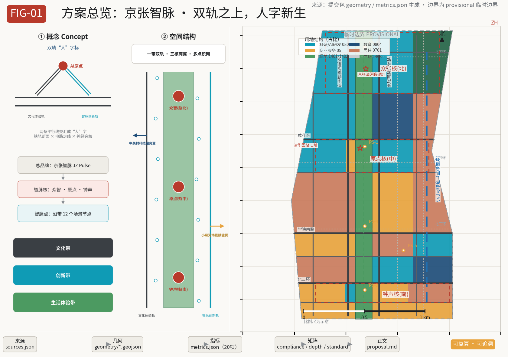
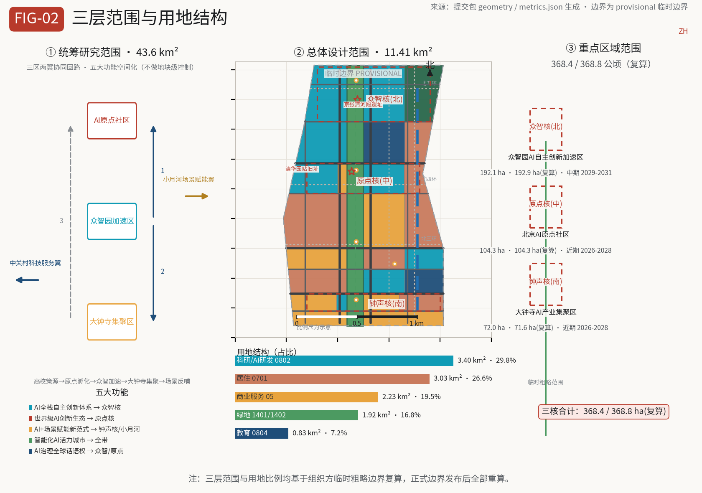
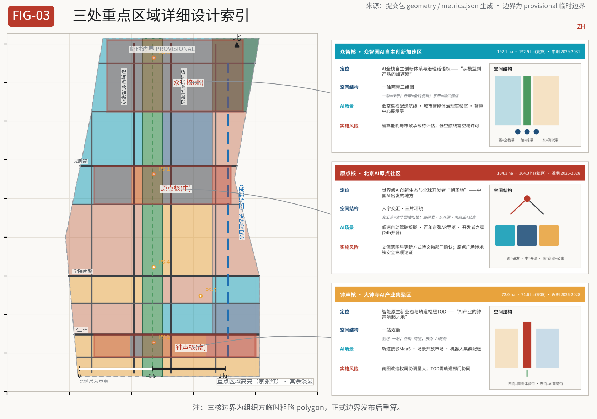
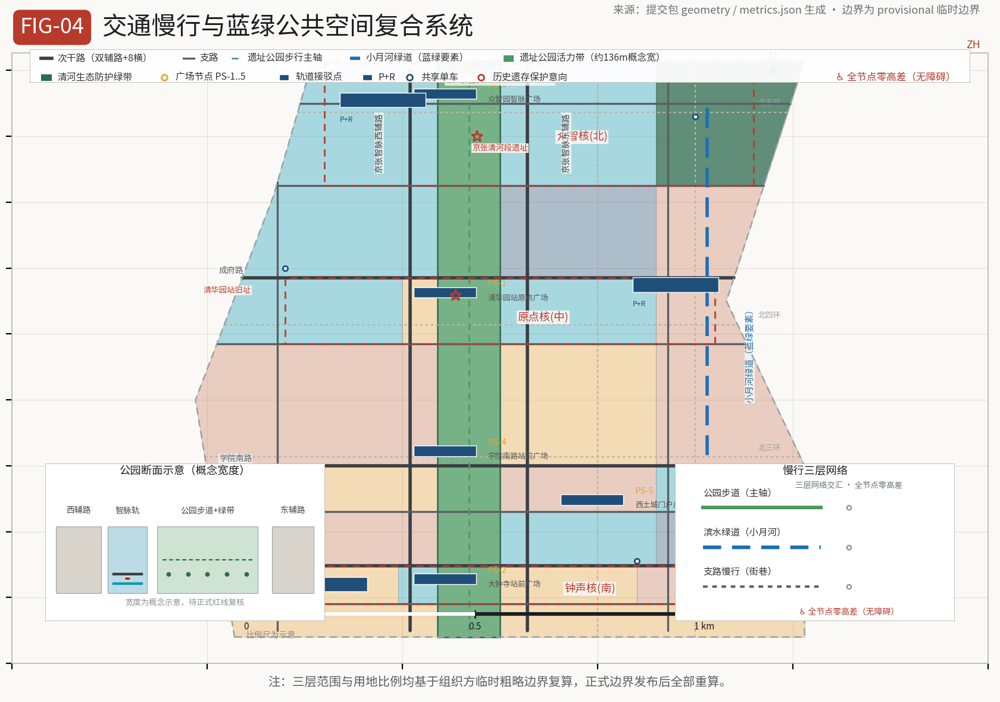
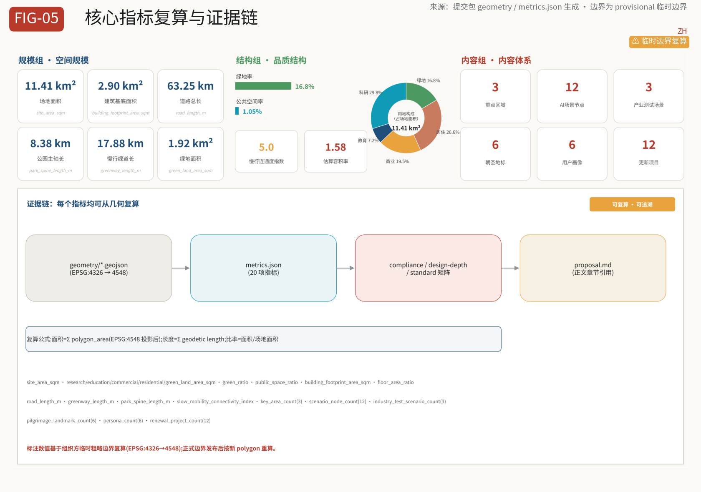

# Jing-Zhang Smart Pulse: On Dual Tracks, the Human Reborn

## Design Basis and Materials Register

This proposal is a formal urban design submission to the "Open Urban Design Call for the Centennial Jing-Zhang AI Innovation Belt," organized in accordance with the prequalification announcement issued by the Haidian Branch of the Beijing Municipal Commission of Planning and Natural Resources and the open call taskbook addressed to agents worldwide [source:OFFICIAL-ANNOUNCEMENT] [source:AGENT-TASKBOOK]. All spatial conclusions in this proposal are conceptual design recommendations intended for further study by professional teams; they do not replace formal planning and do not constitute government-approved conclusions.

The materials boundary follows the public materials register of the repository: the official announcement, the agent taskbook, the urban design administration measures, the regulatory detailed planning formulation and approval measures, the land/sea use classification guide, the interim measures for the administration of generative AI services, and the law on accessible environment construction may be formally cited; the boundary polygons of the three levels of scope and the three key areas are provisional rough boundaries provided by the organizers, used only for proposal generation, self-checking and design discussion — they cannot serve as official red lines or precise area bases [source:SOURCE-REGISTRY] [source:BOUNDARY-SOURCE]. After the official boundaries are released, all land-use, building, road, green space, public space, phasing layers and indicators in this proposal must be recomputed.

All structured evidence for this proposal (sources, assumptions, indicators, geometry, compliance, standards, design depth) is stored in `sources.json`, `assumptions.json`, `metrics.json`, `geometry/*.geojson` and the three matrix files; the main text places only a few verifiable citations at key judgment points, allowing human reviewers to move from narrative into evidence [source:SITE-PACKAGE].

## Three-Level Scope Working Framework

The proposal organizes its work strictly according to the three-level scope defined in the announcement [standard:PROJECT-OFFICIAL-ANNOUNCEMENT] [depth:three_level_scope_framework]:

**Coordinated Research Area (43.6 km²)**: bounded by the North 5th Ring Road to the north, the Jingzang (G6) Expressway to the east, Xizhimen Outer Street to the south, and Wanquanhe Road to the west. This level answers "how a world-class AI innovation ecosystem is organized": it sorts out the industrial chain synergy of the three districts and two wings, the spatial placement of five major functions, the future AI city form and AI+transport, and the continuous green space system, producing a regional industry and urban form strategy without plot-level control.

**Overall Design Area (11.4 km²)**: mainly the urban and industrial areas within 1–2 km around the Jing-Zhang Heritage Park — the long narrow belt covered by the provisional boundary `SITE-001` of `geometry/site_boundary.geojson` in this submission [data:geometry/site_boundary.geojson#SITE-001] [metric:site_area_sqm]. This level reaches the urban design depth of regulatory detailed planning: land-use layout, building scale and height intentions, the retain/renovate/demolish/new-build framework, transport and municipal support, public space and townscape control, and it makes explicit which conclusions are limited by the provisional boundary and which indicators await confirmation of the formal regulatory detailed planning conditions.

**Key Detailed Design Areas (368.4 ha)**: from north to south, the Zhongzhiyuan AI Independent Innovation Acceleration Area (192.1 ha), the Beijing AI Origin Community (104.3 ha), and the Dazhongsi AI Industry Cluster (72.0 ha) [data:geometry/key_areas.geojson#PROV-KEY-001]. At this level, detailed design is developed for each of the three key areas at the urban design depth of a comprehensive implementation plan, producing readable mini-schemes of "positioning + spatial structure + building renewal + transport and slow mobility + public space + AI scenarios + implementation risks" [data:geometry/key_areas.geojson#PROV-KEY-001] [metric:key_area_count].

The three levels are a progressive implementation relationship rather than three isolated drawings: the coordination level determines industry and form judgments, the overall level lands these judgments into renewal projects and facility capacity, and the key-area level verifies the implementability of specific plots and scenarios. The correspondence between the three-level working framework, spatial structure, land-use layout and depth items is shown in the table.

| Level | Design question | Proposal answer | Data anchor |
| --- | --- | --- | --- |
| Coordinated Research Area | AI industry ecosystem and future city form | Three-district/two-wing synergy loop, spatialization of five functions, three-chapter cultural narrative | standard_matrix.json, compliance_matrix.json |
| Overall Design Area | Industrial space, urban renewal, transport and municipal works, townscape | "One Belt, Dual Tracks, Three Cores, Two Wings, Multi-Node Network" structure mapped to plan | [data:geometry/land_use.geojson#LU-001], [data:geometry/roads.geojson#RD-001] |
| Key Detailed Design Areas | Fine-grained design of three districts | Three cores each propose function and format, building scale, retain/renovate/demolish, public space and scenarios | [data:geometry/key_areas.geojson#PROV-KEY-001], [data:geometry/key_areas.geojson#PROV-KEY-002], [data:geometry/key_areas.geojson#PROV-KEY-003] |

## Coordinated Research Area: Industry and Future City Research

### Overall Concept: the Jing-Zhang Smart Pulse

The proposal puts forward the overall concept of the innovation belt as the **"Jing-Zhang Smart Pulse"**, with the theme slogan **"On Dual Tracks, the Human Reborn"** [source:AGENT-TASKBOOK] [standard:PROJECT-AGENT-OPEN-CALL-TASKBOOK]. The concept derives from the most iconic engineering creation of the Jing-Zhang Railway — the zigzag ('人'-shaped) switchback: two tracks meet at Qinglongqiao, a turning point of the line and a symbol of Zhan Tianyou's spirit of self-reliant engineering, "human ingenuity prevailing over nature." One hundred years later, a second transformation is taking place along this rail corridor: from the railway age to the intelligent age. The proposal translates the "dual tracks" into a dual spatial and cultural structure:

- **Cultural experience track**: the Jing-Zhang Heritage Park vitality belt, carrying the century-old Jing-Zhang cultural belt — the narrative line of railway memory, industrial heritage, Zhongguancun entrepreneurship culture and the new AI culture;
- **Smart Pulse innovation track**: the AI industry and scenario service belt along the corridor, carrying the AI-integrated innovation belt and the urban AI lifestyle experience belt — the functional line of R&D, incubation, testing, exhibition and services.

The two tracks converge into the "人" (ren/human) character at the **former Qinghuayuan Station** site — this is the AI Origin Community, the contemporary echo of the '人'-shaped railway: where the railway turns, civilization transitions; the "人" character is both a tribute to Zhan Tianyou and a human-centered urban design stance. The naming system adopts a three-level structure: the overall brand "Jing-Zhang Smart Pulse" → three Smart Pulse cores (Zhongzhi Core, Origin Core, Bell Core) → scenario nodes along the belt (Smart Pulse Points); the English name "JZ Pulse" facilitates international communication [depth:overall_spatial_structure].

The logo direction is the "dual-track human mark": two parallel lines converge at the geometric midpoint into a '人'-shaped form, simultaneously suggesting a rail cross-section, circuit traces and neural network synapses; the convergence point is emphasized with a Jing-Zhang red dot, representing the "AI origin." The visual specification adopts a three-color system of rail gray (historical base), Smart Pulse cyan (AI innovation) and Jing-Zhang red (origin vitality), with data blue for governance and data interfaces and ecological green for blue-green space; the graphic language follows a technical drawing style (thin lines, grids, station dots, dual-track lines), avoiding excessive decoration [depth:metrics_recalculation]. The logo and visual system are conceptual directions; the official identity must be deepened by professional teams and cleared for rights before use.

### Five Major Functions and the Three-District/Two-Wing Synergy Loop

Addressing the five major functions required by the agent taskbook, the proposal gives a spatialized answer [source:AGENT-TASKBOOK]:

1. **AI full-stack independent innovation system**: located in the Zhongzhi Core. Supported by the intelligent computing center, full-stack R&D and test-and-verification scenario grounds covering the entire chain of computing power, algorithms, data and models;
2. **World-class AI innovation ecosystem**: located in the Origin Core. Open-source community, incubators, innovation commerce and talent apartments build the closed loop of "origin—incubation—transformation—capital";
3. **New paradigm of AI+ scenario enablement**: located in the Bell Core and the Xiaoyue River scenario wing. The scenario open market, test-and-verification scenario grounds and the robot delivery corridor push AI capabilities into real neighborhoods;
4. **Intelligent AI vitality city**: running through the whole belt. Agent-guided tours, AI health stations, accessible navigation and interactive public installations shape a perceivable AI-native city;
5. **Global discourse power of AI governance**: located in the Zhongzhi Core and the Origin Core. The urban agent governance laboratory, the open-source contribution honor system and the public review mechanism export governance discourse.

The three-district/two-wing synergy loop: the **three districts** are the AI Origin Community (world-class AI innovation ecosystem), the Zhongzhiyuan AI Independent Innovation Acceleration Area (full-stack independent innovation and governance discourse power) and the Dazhongsi AI Industry Cluster (intelligent-native new business forms); the **two wings** are the Zhongguancun technology service wing (global allocation of factors, Zhongguancun IP and capital enablement) and the Xiaoyue River scenario enablement wing (AI scenario enablement and the intelligent vitality city). Spatially, the three districts are strung north-south along the heritage park, while the two wings extend east-west: the west wing draws on Zhongguancun's existing capital, intellectual property and technology service resources, and the east wing organizes scenario experiments around the Xiaoyue River green belt and the university living circles. The loop mechanism is "university origin → Origin incubation → Zhongzhi acceleration → Dazhongsi agglomeration → scenario feedback," achieving 15-minute functional circulation through along-belt slow mobility and rail connections [depth:overall_spatial_structure].

### Global AI Innovation Ecosystem Cases (8)

The proposal studies 8 global AI innovation ecosystem cases and translates them into spatial and operational mechanisms [source:AGENT-TASKBOOK]:

1. **Silicon Valley, USA (Stanford—Sand Hill Road)**: dual-wheel drive of university origin and venture capital. Mapped to the Origin Core—Zhongguancun wing linkage, with an along-belt service chain of "professor laboratory → student startup → VC matching";
2. **Kendall Square, Boston**: high-density agglomeration of research institutions and industrial transformation. Mapped to university-belt synergy, with "laboratory link galleries" sharing instruments and data interfaces;
3. **King's Cross, London**: railway hub revitalization mixed with a knowledge-economy mixed-use neighborhood — the most structurally analogous to Jing-Zhang, serving as the core benchmark: mixed development of station, heritage, creative industries and public space;
4. **one-north, Singapore**: government-led industry-city-people integration, pairing high-density R&D with high-quality living amenities. Mapped to talent apartments and the lifestyle service belt;
5. **Shenzhen Bay Science and Technology Eco-Park**: hardware supply chain and rapid scenario validation. Mapped to the test-and-verification scenario grounds and the scenario open market;
6. **Hangzhou Future Sci-Tech City**: platform economy and open scenario operation. Mapped to the operational design of "scenario open list + testing access mechanism";
7. **Shibuya/Marunouchi, Tokyo**: rail hub TOD combined with innovative offices. Mapped to the Bell Core TOD integrated development;
8. **Munich Digital Tech Park**: balanced industry-academia-research and quality of life for talent retention. Mapped to the whole-belt talent living amenities and blue-green space strategy.

The common lesson of these cases: **an innovation ecosystem is not a pile of buildings but a closed loop of "origin—transformation—capital—scenario—life" at walking scale**. Accordingly, the proposal puts forward three spatial mechanisms: along-belt "innovation chain stations" (one scenario node every 500–800 m), the dual-track "exhibition and testing" composite interface, and a three-way open "university—enterprise—community" network [depth:overall_spatial_structure] [depth:land_use_layout].

## Overall Design Area: Urban Renewal and Regulatory-Detailed-Planning-Depth Urban Design

### Spatial Structure: One Belt, Dual Tracks, Three Cores, Two Wings, Multi-Node Network

Within the Overall Design Area (11.4 km² provisional boundary), the proposal puts forward the spatial structure of "One Belt, Dual Tracks, Three Cores, Two Wings, Multi-Node Network" [depth:overall_spatial_structure]:

- **One Belt**: the Jing-Zhang Heritage Park vitality belt. Continuous park green space is arranged along the entire railway heritage corridor (the `1401` park green space unit in `land_use.geojson` runs through end to end, with a conceptual width of about 136 m, pending confirmation against the official red line), linking cultural nodes, plazas and the slow-mobility spine — the spatial backbone of this proposal [data:geometry/green_space.geojson#GRN-001];
- **Dual Tracks**: the "Jing-Zhang Smart Pulse West/East Auxiliary Roads" on both sides of the park together with the pedestrian spine form the dual-layer interface of the cultural experience track and the Smart Pulse innovation track — the west side organizes innovation services facing Zhongguancun, the east side organizes scenario experiences facing the universities and residential areas [data:geometry/roads.geojson#RD-002];
- **Three Cores**: the Zhongzhi Core (north), the Origin Core (middle) and the Bell Core (south), the three key areas;
- **Two Wings**: the Zhongguancun technology service wing (west, linked by leveraging existing off-site resources) and the Xiaoyue River scenario enablement wing (east, with the Xiaoyue River greenway as its skeleton) [data:geometry/roads.geojson#RD-006];
- **Multi-Node Network**: 12 AI scenario nodes (Smart Pulse Points) distributed along the belt; the blue-green network (heritage park, Xiaoyue River greenway, Qinghe protective green belt) is interwoven with the slow-mobility network and the rail connection network.

### Land-Use Layout and Development Intensity

The land-use layout follows the principle of "belt-shaped zoning with the green axis in the center" (see `land_use.geojson` for details, coded per the Ministry of Natural Resources land/sea use classification guide [standard:MNR-LAND-USE-CLASSIFICATION-GUIDE] [depth:land_use_layout]):

- **Research land (0802)**: the Zhongzhi Core full-stack innovation area, the Origin Core R&D and open-source community, the Bell Core AI cluster and the Xitucheng industrial renewal belt, together about 30% of total land — the main carrier of industry;
- **Education land (0804)**: the BUPT synergy belt and the Beihang synergy belt, organizing open laboratories and link galleries based on existing university resources;
- **Commercial and service land (05)**: Xizhimen gateway rail business, the Dazhongsi shopping district with AI commerce, Xueyuan Road commercial services, the Wudaokou shopping district extension and Origin innovation commerce, forming the interface of living and innovation services;
- **Residential land (0701)**: talent apartments and renewed housing laid out along the east and west wings, achieving "work-residence integration and walkable commuting";
- **Green space and open space (1401/1402)**: the heritage park green belt runs through end to end, and the Qinghe ecological protective green belt forms an ecological barrier at the northern edge of the Zhongzhi Core;
- **Plaza land (1403)**: five public space nodes — the Qinghuayuan Station Origin Plaza, the Dazhongsi Station plaza, the Zhongzhiyuan Smart Pulse Plaza, the Xueyuan South Road station plaza and the Xitucheng gateway plaza [data:geometry/public_space.geojson#PS-1].

Development intensity follows the intention of "high along the belt, low at the two wings, and breathing space beside the park": the indicative FAR for industrial and rail hub areas is 1.8–3.0, for residential areas 1.5–2.5, and building heights beside the park step back gradually to protect the heritage sight corridors. **It must be made explicit: regulatory detailed planning conditions such as FAR, building height, density, green ratio and setback lines remain missing items in the official materials; the figures above are only design intention assumptions and must be fully recomputed once the official regulatory detailed planning conditions are confirmed** [source:SOURCE-REGISTRY] [depth:development_intensity_controls] [depth:height_massing_character].

## Key Area Detailed Design

All three key areas develop directional design based on the provisional rough rectangular polygons provided by the organizers (`PROV-KEY-001/002/003` in `key_areas.geojson`); recomputation is required after the official boundaries are released [source:BOUNDARY-SOURCE] [depth:three_key_area_detailed_design].

### Zhongzhi Core: Zhongzhiyuan AI Independent Innovation Acceleration Area (192.1 ha)

**Positioning**: the carrier of the AI full-stack independent innovation system and global discourse power of AI governance — "the accelerator from model to product."

**Spatial structure**: "one axis, two belts, three clusters." The one axis is the northern section of the heritage park green belt; the two belts are the full-stack innovation belt on the west (intelligent computing center, foundation model R&D, data services) and the test-and-verification belt on the east (low-altitude inspection and delivery corridors, robot scenario grounds); the three clusters are the intelligent computing cluster, the full-stack R&D cluster and the ecological protection cluster.

**Buildings and renewal**: predominantly new construction with minor renewal of existing stock. The intelligent computing center adopts high-efficiency modular buildings (conceptual intention), with the public exhibition layer "Hub of Ten Thousand Networks" opening an accessible computing-power science interface to the public; the ecological protective green belt along the Qinghe is preserved, with an intended building height cap of 60 m (to be confirmed).

**Transport and slow mobility**: the Zhongzhiyuan South/North link roads connect to the North 5th Ring Road auxiliary road; the Smart Pulse Plaza is the slow-mobility hub; the low-altitude corridor is separated from ground-level slow mobility.

**AI scenarios**: low-altitude intelligent inspection and delivery corridors (industrial test-and-verification scenario) and the urban agent governance laboratory (AI governance) [data:geometry/key_areas.geojson#PROV-KEY-001].

**Implementation risks**: the energy consumption of the intelligent computing center and municipal capacity require special assessment; the low-altitude corridor involves airspace management and requires permission from the competent industry authority — both are items to be confirmed, and the proposal only raises conceptual directions.

### Origin Core: Beijing AI Origin Community (104.3 ha)

**Positioning**: the world-class AI innovation ecosystem and global developers' "pilgrimage site" — "the place where China's AI set out."

**Spatial structure**: "'人'-shaped convergence, three areas surrounding." The former Qinghuayuan Station site is the '人'-shaped convergence point (Origin Plaza), with the west area as the R&D west district, the east area as the open-source community and incubators, and the south area as innovation commerce and talent apartments.

**Buildings and renewal**: predominantly renewal with minor new construction. The former Qinghuayuan Station and surrounding industrial heritage are recommended for retention and revitalization (protection intention, not a formal heritage protection conclusion): the "Hundred Garage" industrial heritage is converted into an AI museum and open-source achievement exhibition gallery; existing offices and factory buildings are renewed into incubators and a developers' home.

**Transport and slow mobility**: the Chengfu Road link line connects to rail; the "developers' walking path" extends from Qinghuayuan Station to Wudaokou, linking universities, open-source spaces and cafés into a 24-hour vitality interface.

**AI scenarios**: low-speed autonomous shuttle loop (industrial test-and-verification scenario), centennial Jing-Zhang AR guided tour, and the developers' home (24-hour open-source space) [data:geometry/key_areas.geojson#PROV-KEY-002].

**Implementation risks**: the scope of historic building protection and the mode of building renewal require confirmation by the cultural relics authorities; the construction of the Origin Plaza involves heritage display and subway safety and requires special demonstration.

### Bell Core: Dazhongsi AI Industry Cluster (72.0 ha)

**Positioning**: intelligent-native new business forms and rail hub TOD — "the place where the bell of the AI industry rings."

**Spatial structure**: "one station, two streets." The Dazhongsi rail hub is the core; the west street is the Dazhongsi shopping district and AI commerce experience street, and the east street is the AI business office street; the heritage park green belt runs through the middle, with the station plaza and the "Bell of the Smart Pulse" digital bell-and-drum tower forming cultural anchors.

**Buildings and renewal**: the shopping district focuses on functional replacement and facade renewal, with moderate new construction in the business area; the "Bell of the Smart Pulse" is a conceptual digital art landmark (not an approved construction), and the renovation of existing buildings must be confirmed plot by plot.

**Transport and slow mobility**: integrated connection between the North 3rd Ring Road south auxiliary road and the rail station; MaaS intelligent navigation links bus, rail, slow mobility and autonomous shuttle.

**AI scenarios**: rail connection MaaS navigation, the scenario open market (industry supply-demand matching) and the starting point of the robot cluster delivery corridor [data:geometry/key_areas.geojson#PROV-KEY-003].

**Implementation risks**: the shopping district renewal involves extensive ownership coordination; the TOD integrated development requires cooperation with the rail authority — both are listed as items to be confirmed.

## AI Innovation Ecosystem, Talent Profiles and AI+ Scenarios

### User Profiles (6 types)

1. **Young AI engineers/entrepreneurs (22–35)**: need low-cost talent apartments, 24-hour collaboration spaces, testing scenarios and investment matching;
2. **University faculty, students and researchers**: need open laboratories, data interfaces, academic exchange venues and convenient cross-campus commuting;
3. **Surrounding community residents (including the elderly and children)**: need accessible facilities, AI health services, public green space and digital inclusion (in line with the Law on Accessible Environment Construction and the policy requirements on smart-technology use by the elderly [standard:PROJECT-AGENT-OPEN-CALL-TASKBOOK]);
4. **Global developers/academic visitors ("pilgrims")**: need the guided tour system, open-source spaces, honor nodes and an international exchange platform;
5. **Corporate and institutional decision-makers (investment attraction/investment/operations)**: need the scenario open list, industrial support, a business-friendly environment and showcase windows;
6. **Urban governors and public supervisors**: need traceable data, the governance laboratory, public participation mechanisms and risk alerts.

### AI Scenario Cards (12 cards, including 3 industrial test-and-verification scenarios)

The proposal produces 12 AI scenario cards covering six categories — industrial test-and-verification, public services, transport, culture, public space and governance — each card mapping spatial location, target users, operational data, privacy boundaries, human review, operating entities and risks (the complete mapping is in `compliance_matrix.json` and the scenario chapters):

**Industrial test-and-verification scenarios (3 cards, meeting the taskbook requirement of no fewer than 3)**:

- **SC-01 Low-speed autonomous shuttle loop** (Origin Core): a closed/semi-closed loop within the heritage park to test and operate campus shuttle service; data stays within the park, a human safety attendant rides along, staged rollout;
- **SC-02 Robot cluster delivery corridor** (BUPT synergy belt—Bell Core): a pilot corridor for sidewalk delivery robots; restricted time windows and routes, remote monitoring + human intervention;
- **SC-03 Low-altitude intelligent inspection and delivery corridor** (Zhongzhi Core): an UAV corridor for campus inspection and emergency delivery; airspace permission required, simulation before real flight.

**Public service and living scenarios**:

- **SC-04 AI health station** (Qinghuayuan synergy belt): self-service blood pressure and blood glucose testing + AI preliminary screening + remote doctors, with data encryption, informed consent and an elderly-friendly interface;
- **SC-05 Smart laboratory link gallery** (BUPT/Beihang synergy belts): shared instrument booking, experimental data interfaces and AI-assisted literature analysis;
- **SC-06 Public legal service agent** (Xueyuan Road renewal belt): contract review, labor consultation and IP Q&A, labeled "AI advice requires lawyer review";
- **SC-07 Rail connection MaaS navigation** (Bell Core): multimodal trip planning + real-time connection dispatch + accessible route priority;
- **SC-08 Centennial Jing-Zhang AR guided tour** (Origin Core—full line): augmented reality tours of the three-chapter cultural narrative, with content reviewed by history experts;
- **SC-09 Interactive public installations of agents** (Beihang synergy belt): AI interactive art and science installations in the park, with content review and child protection mechanisms;
- **SC-10 Urban agent governance laboratory** (Zhongzhi Core): a public-facing AI governance sandbox with fully transparent scheme simulation, risk alerts and human review;
- **SC-11 Developers' home** (Origin Core): 24-hour open-source collaboration space, code hosting mirror and tech salons;
- **SC-12 Scenario open market** (Bell Core): an industry supply-demand matching platform publishing the scenario open list, with enterprises "answering the call" (揭榜挂帅).

Scenario operations uniformly follow the four principles of "public data, privacy boundaries, human review, traceability" [standard:PROJECT-AGENT-OPEN-CALL-TASKBOOK]; scenarios involving generative AI services comply with the labeling and safety requirements of the interim measures for the administration of generative AI services [standard:MOHURD-URBAN-DESIGN-MEASURES] [source:SOURCE-REGISTRY].

## Land Use, Building Scale and Retain/Renovate/Demolish Plan

### Land Use and Building Scale

Land-use structure (see `land_use.geojson` and the recomputation in `metrics.json`): research land about 30%, education land about 9%, commercial and service land about 19%, residential land about 23%, green and open space about 17%, plazas and others about 2% (proportions subject to the final recomputation). The total building footprint area and estimated FAR are in `metrics.json` [metric:building_footprint_area_sqm] [metric:floor_area_ratio]; the number-of-floors assumption is a conceptual value, and the formal scale must be recomputed after the regulatory detailed planning conditions are confirmed [depth:land_use_layout] [depth:development_intensity_controls].

### Retain/Renovate/Demolish Classification (Conceptual Framework)

Classified under the framework of "retention first, renewal as key, new construction as supplement"; all retain/renovate/demolish conclusions are conceptual recommendations and do not constitute plot-level conclusions:

- **Retain**: university campuses, mature residential areas, the former Qinghuayuan Station and industrial heritage (protection intention) and park green belts;
- **Renovate**: the Dazhongsi shopping district, the Xitucheng industrial belt and inefficient buildings along Xueyuan Road — functional replacement, facade renewal, elevator retrofitting and accessibility renovation;
- **New-build**: the Zhongzhi Core intelligent computing cluster and test-and-verification cluster, selected plots of the Origin Core open-source community and the southern gateway rail business;
- **Demolish**: no clear basis exists, so no specific demolition conclusion is proposed; any sporadic inefficient land truly requiring clearance is listed in the to-be-confirmed register for verification by professional teams and ownership authorities [depth:retain_renovate_demolish].

## Transport, Rail, Municipal Works and Public Service Facilities

**Road microcirculation**: forming a "two north-south, two east-west + link lines" skeleton — the Jing-Zhang Smart Pulse West/East Auxiliary Roads as two north-south secondary trunk roads, Xueyuan South Road and Chengfu Road as two east-west link lines, plus branch roads and plot access roads (`roads.geojson`, total length per the indicator recomputation) [data:geometry/roads.geojson#RD-001] [metric:road_length_m].

**Rail station integration**: stations at Dazhongsi and along Xueyuan Road are all designed to the TOD integrated concept: station plazas, connection loops and slow-mobility priority zones; the rail connection MaaS scenario provides real-time transfer planning [depth:traffic_rail_slow_parking].

**Slow mobility system**: the heritage park pedestrian spine runs through end to end (`pedestrian`), and the Xiaoyue River greenway (`greenway`) links the east wing, forming a three-layer network of "park trails + waterfront greenways + branch-road slow mobility"; accessibility design follows the requirements of the Law on Accessible Environment Construction, with zero-level-difference at all nodes, voice navigation and tactile guidance [standard:PROJECT-AGENT-OPEN-CALL-TASKBOOK] [metric:slow_mobility_connectivity_index].

**Parking and non-motorized vehicles**: P+R and shared-bike dispatch points are set around rail stations; freight and robot delivery adopt time-window management to avoid conflicts with slow mobility.

**Municipal and new infrastructure**: conceptual connection of distributed energy such as rooftop photovoltaics and ground-source heat pumps for the intelligent computing center and public buildings; municipal utility corridors and 5G/edge computing nodes are reserved along the belt; smart light poles, environmental monitoring and emergency broadcasting are integrated (all conceptual recommendations, to be developed in detail by professional municipal design) [depth:municipal_new_infrastructure].

**Public service facilities**: community service centers, AI health stations, cultural and sports facilities and childcare/eldercare facilities are configured per the 15-minute living circle; international living services are configured together with talent apartments (bilingual signage, international talent service windows).

## Blue-Green Space, Public Space and Urban Townscape

### Blue-Green Network

The **Jing-Zhang Heritage Park vitality belt** is the main axis of the blue-green network: a conceptual green belt running through end to end (width pending confirmation against the official red line), linking five plaza nodes and cultural nodes, with separated pedestrian and cycling paths; the **Xiaoyue River greenway** is the east-wing ecological corridor connecting the university living circles and the industrial belt; the **Qinghe ecological protective green belt** forms an ecological barrier at the northern edge of the Zhongzhi Core; to the west, waterfront slow mobility is organized along the Wanquanhe water system (off-site linkage) [data:geometry/green_space.geojson#GRN-001] [metric:green_ratio]. The continuous green corridor guarantees the connectivity goal of "continuous walking north or south from any point in the park" [metric:slow_mobility_connectivity_index].

### Urban Townscape

The townscape keynote is "rail memory × Smart Pulse future": buildings on both sides of the heritage park use steel, brick and glass as main materials, with colors echoing rail gray and Smart Pulse cyan; building heights step back toward the park along the belt to protect heritage sight corridors and the skyline; rooftops encourage photovoltaics and greening (the fifth facade); signage adopts a unified wayfinding system, bilingual in Chinese and English [depth:blue_green_public_space] [standard:MOHURD-URBAN-DESIGN-MEASURES].

### AI Public Space and Pilgrimage Landmarks (6)

The proposal puts forward 6 AI pilgrimage landmarks and honor display nodes, all conceptual designs and not stated as approved constructions:

1. **Origin · '人'-shaped memorial installation** (former Qinghuayuan Station, Origin Plaza): a '人'-shaped memorial structure where the dual tracks converge, fusing Zhan Tianyou's railway memory with the AI origin narrative — the core anchor of the pilgrimage system and the seat of the inscription system;
2. **Bell of the Smart Pulse** (in front of Dazhongsi Station): a digital bell-and-drum tower concept with an hourly AI narrative soundscape, connecting the ancient bell culture with the intelligent age;
3. **Open-source achievement exhibition gallery and agent contribution honor wall** (along the heritage park): displaying open-source projects, agent proposals and contributor rolls, with an annual honor system update;
4. **Hundred Garage · railway industrial heritage AI museum** (Origin Core): revitalization of industrial heritage, presenting the "three chapters" of railway history, Zhongguancun history and AI history;
5. **Developers' walking path** (Qinghuayuan—Wudaokou): a developer-themed trail with open-source project milestone inscriptions embedded in the ground;
6. **Hub of Ten Thousand Networks · intelligent computing center exhibition layer** (Zhongzhi Core): a public window into computing power and AI science [depth:blue_green_public_space] [depth:three_key_area_detailed_design].

### Cultural Narrative: Rails · Optical Cables · Smart Pulse

The proposal organizes centennial Jing-Zhang culture, Zhongguancun culture and the new AI culture into a "three-chapter" narrative, spatialized into cultural nodes along the belt:

- **Chapter One · Rails (1905–1909)**: Zhan Tianyou oversaw the construction of the Jing-Zhang Railway, and the zigzag ('人'-shaped) switchback was the creative origin of self-reliant engineering — the former Qinghuayuan Station, railway heritage and the "Origin · '人'" installation form the first group of nodes;
- **Chapter Two · Optical Cables (1980s–2010s)**: Zhongguancun's electronics street grew into China's Silicon Valley — the industrial renewal belt around Xueyuan Road and Xitucheng carries the memory of the information age, and the public legal service agent and smart laboratory link gallery continue the "technology service" tradition;
- **Chapter Three · Smart Pulse (2020s–)**: the emergence of large models and agents — the Zhongzhi Core, Origin Core and Bell Core form the future-facing Smart Pulse nodes.

The narrative is delivered through four carriers: AR tours, inscriptions, public art and themed events; all historical statements are based on public historical materials, and display content involving specific historical facts requires expert review [source:AGENT-TASKBOOK] [depth:existing_conditions_diagnosis].

## Renewal Project Register, Implementation Policy and Phasing Plan

### Renewal Project Register (12 items, conceptual register)

| No. | Project | Type | Location | Phase | Dependencies |
| --- | --- | --- | --- | --- | --- |
| UP-01 | Origin Plaza and '人'-shaped memorial installation | Public space | Former Qinghuayuan Station | Near-term | Heritage protection demonstration, subway safety assessment |
| UP-02 | Hundred Garage AI Museum | Industrial heritage revitalization | Origin Core | Near-term | Cultural relics/historic building designation |
| UP-03 | Open-source achievement exhibition gallery | Public space | Middle section of the heritage park | Near-term | No major dependencies |
| UP-04 | Dazhongsi shopping district functional replacement | Urban renewal | Bell Core | Near-term | Ownership coordination |
| UP-05 | Station plaza and TOD connection | Transport facility | Bell Core | Near-term | Cooperation with rail authority |
| UP-06 | Low-speed autonomous shuttle loop | Scenario facility | Origin Core | Near-term | Testing access permission |
| UP-07 | Intelligent computing center and exhibition layer | New construction | Zhongzhi Core | Mid-term | Energy and municipal assessment |
| UP-08 | Test-and-verification scenario grounds | New construction | Zhongzhi Core | Mid-term | Airspace/safety permission |
| UP-09 | Xitucheng industrial renewal belt | Urban renewal | Xueyuan Road belt | Mid-term | Regulatory detailed planning adjustment |
| UP-10 | Xiaoyue River greenway completion | Blue-green space | East wing | Mid-term | Waterway ownership coordination |
| UP-11 | Southern gateway rail business | New construction | Xizhimen gateway | Long-term | Rail station planning |
| UP-12 | Whole-belt accessibility and smart facilities | Infrastructure | Full line | Near-term to long-term rolling | Annual investment plan |

### Implementation Policy Recommendations (conceptual recommendations)

- Scenario opening policy: publish an annual scenario open list, with enterprises "answering the call," and make testing access and data desensitization rules public;
- Renewal support policy: FAR bonuses and an approval green channel for functional replacement and green retrofit projects (requires district-level policy formulation);
- Talent policy: talent apartment provision ratios, international talent service windows linked with entrepreneurship support;
- Public participation: renewal projects must undergo public opinion consultation and agent governance-laboratory simulation, with review conclusions made public [source:AGENT-TASKBOOK].

### Phasing Plan

- **Near-term (2026–2028)**: Origin Core + Bell Core go first (`phasing.geojson` near-term units), the full-line landscape and slow mobility of the heritage park are completed, and the pilgrimage landmark and honor wall system is launched [data:geometry/phasing.geojson#PH-01];
- **Mid-term (2029–2031)**: the Zhongzhi Core intelligent computing and testing clusters and the Xueyuan Road renewal belt (`phasing.geojson` mid-term units) [data:geometry/phasing.geojson#PH-02];
- **Long-term (2032–2035)**: the southern gateway and the synergy belts are completed (`phasing.geojson` long-term units) [data:geometry/phasing.geojson#PH-03].

### Global AI Innovation Activity System and Long-Term Operations

The proposal puts forward an annual activity system and long-term operational closed loop for the "Jing-Zhang Smart Pulse" (all conceptual recommendations):

- **Flagship activities**: the Jing-Zhang AI Innovation Conference (every September, echoing the rhythm of the open call, releasing the annual scenario open list and ecosystem report) + the Jing-Zhang Developers Week (hackathons, open-source achievement roadshows, pilgrimage tours);
- **Regular operations**: rotating exhibitions in the open-source achievement exhibition gallery, annual honor wall updates (recording the most outstanding contributions of each year) and monthly matchmaking sessions of the scenario open market;
- **Cultural operations**: the three-chapter narrative tour system (three themed routes: Rails · Optical Cables · Smart Pulse), the centennial Jing-Zhang AR guided tour and the revitalization and operation of industrial heritage spaces;
- **International communication**: multilingual tours and digital twin exhibitions, an international developers' honor system and a biennale mechanism;
- **Operational closed loop**: activities drive traffic → scenario opening → data sedimentation (desensitized) → ecosystem attraction → activity upgrade, forming a self-reinforcing annual cycle [source:AGENT-TASKBOOK] [depth:phasing_implementation].

## Indicator System, Area Recomputation and Compliance Matrix

### Indicator System

The proposal establishes a three-level indicator system (full calculations in `metrics.json`):

- **Scale indicators**: site area (recomputed on the provisional boundary), areas and proportions of each land-use category, building footprint area, total road length and green space area;
- **Structure indicators**: green ratio, public space ratio, slow-mobility connectivity index, park main-axis length and estimated FAR;
- **Content indicators**: number of key areas (3), AI scenario nodes (12), industrial test-and-verification scenarios (3), pilgrimage landmarks (6), user profiles (6) and renewal projects (12).

Design implications of key indicators: the green ratio of about 17% (subject to recomputation) supports talent quality of life and ecological resilience; the public space ratio and slow-mobility connectivity support innovation interaction and "walking-scale exchange" (benchmarked against the walking-density experience of Silicon Valley and King's Cross); the estimated FAR reflects the supply intensity of industrial space but **must await confirmation of the regulatory detailed planning conditions** [depth:metrics_recalculation] [metric:green_ratio] [metric:public_space_ratio] [metric:floor_area_ratio].

### Area Recomputation and Compliance

All areas are recomputed from the submitted `geometry/*.geojson` after projection to EPSG:4548 (CGCS2000 / 3-degree Gauss-Krüger zone, central meridian 117°E); formulas and sources are recorded in `metrics.json`. Because provisional rough boundaries are used, all area values are "provisional boundary recomputed values," to be recomputed after the official boundaries are released.

Compliance coverage: all tasks of the announcement (sections 1.3/1.4/1.5) and all tasks agent.1–agent.6 of the agent taskbook are mapped item by item into `compliance_matrix.json`; the 6 mandatory professional standards are mapped item by item into `standard_matrix.json`; the 15 design depth items are annotated item by item in `design_depth_matrix.json`; self-check results are recorded in `self_check.json` [depth:metrics_recalculation] [depth:risk_missing_data].

## Risks, Copyright and Compliance Statement

**Legitimacy of materials**: the proposal uses only public materials and materials cleared by the organizers (`sources.json` registers the publisher, acquisition time, license and use boundary for each item); it contains no non-public planning materials, classified maps or personal privacy data [source:SOURCE-REGISTRY].

**Boundary statement**: all spatial recommendations in this proposal are conceptual recommendations/reference schemes; they do not replace formal planning and do not constitute government-approved conclusions, investment commitments or engineering feasibility conclusions; the retain/renovate/demolish, development intensity and pilgrimage landmarks are all design intentions, subject to formal planning and approval.

**AI generation responsibility**: this proposal was generated by an AI agent on the basis of the structured taskbook; the generation method and data sources are disclosed in `agent.json`, `sources.json` and `assumptions.json`; historical narratives and professional judgments require review by human experts.

**Copyright**: this proposal is submitted under the community display license agreed in the call (COMMUNITY-DISPLAY-ONLY); the copyright of the public materials used belongs to their original publishers, and citations comply with their respective licenses; the logo and visual system are conceptual directions requiring rights clearance before formal use. See `report/copyright_statement.md` for details.

**Missing materials and professional review needs**: the official boundaries and key-area polygons, regulatory detailed planning conditions (FAR/height/density/green ratio/setback lines), existing buildings and ownership, municipal engineering conditions and historic building protection scopes are all items to be supplemented; related assumptions are centrally registered in `assumptions.json` and do not block content review, but must be reviewed before formal implementation [depth:risk_missing_data].

## References

1. Prequalification announcement for the international open call for the urban design of the Centennial Jing-Zhang AI Innovation Belt, Haidian Branch of the Beijing Municipal Commission of Planning and Natural Resources, May 2026.
2. Excerpts of the taskbook for the open urban design call for the Centennial Jing-Zhang AI Innovation Belt addressed to agents worldwide (materials cleared for use provided by the user), May 18, 2026.
3. Urban Design Administration Measures, Ministry of Housing and Urban-Rural Development, 2017.
4. Measures for the Formulation, Review and Approval of Regulatory Detailed Planning for Cities and Towns, Ministry of Housing and Urban-Rural Development, 2011 (revised and published 2022).
5. Guidelines for the Classification of Land and Sea Use in Territorial Spatial Survey, Planning and Use Control (Trial), Ministry of Natural Resources, 2023.
6. Interim Measures for the Administration of Generative Artificial Intelligence Services, Cyberspace Administration of China and six other departments, 2023.
7. Law of the People's Republic of China on the Construction of an Accessible Environment, effective September 2023.
8. Implementation Plan of the General Office of the State Council on Effectively Solving Difficulties for the Elderly in Using Smart Technology (Guobanfa [2020] No. 45).
9. Publicly available research materials on the King's Cross Central regeneration in London — a benchmark case of railway hub revitalization and knowledge economy.
10. Publicly available research materials on Kendall Square in Boston and one-north in Singapore as innovation districts.
11. Public historical materials on the centennial Jing-Zhang Railway and Zhan Tianyou's zigzag ('人'-shaped) switchback.
12. Public reports on the planning and construction of the Jing-Zhang Railway Heritage Park and public planning information of Haidian District.

(The complete machine-readable source index is in `sources.json`; standard and depth coverage is in `standard_matrix.json` and `design_depth_matrix.json`.)
