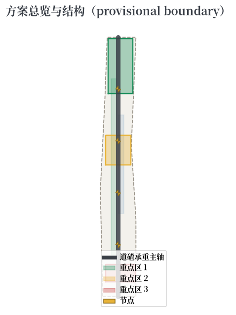
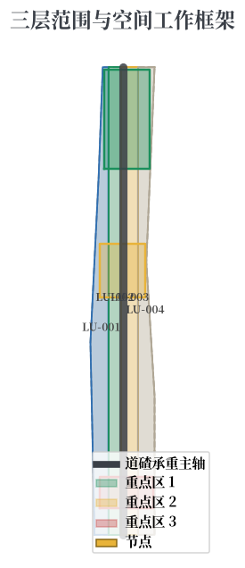
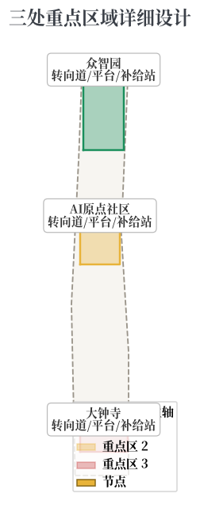
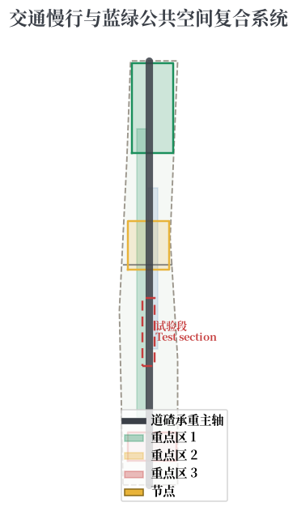
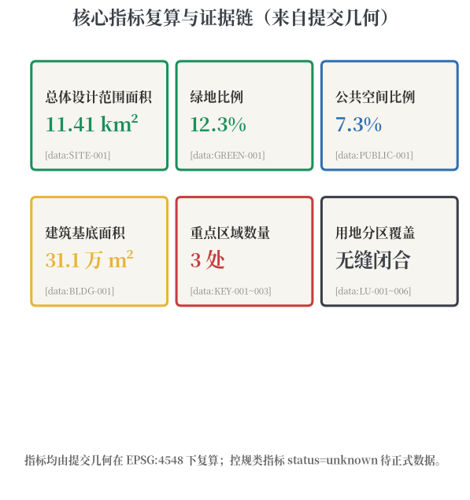

# JINGZHANG SWITCHBACK LINE: Give Urban AI Signals, Switches, and Room to Turn Around

## Design Basis and Source Inventory

This formal proposal takes as its primary basis the "Centennial Jingzhang AI Innovation Belt International Urban Design Solicitation Prequalification Announcement" published by the Haidian Branch of the Beijing Municipal Commission of Planning and Natural Resources, together with the machine-readable provisional boundaries, key areas, enums, metrics, and source inventory registered by maintainers under `brief/site-package/`. Before generation, the agent read `design_brief.json`, `allowed_design_space.json`, `sources.json`, `enums/`, `ranges/`, `schemas/`, and `data/source_registry.json`, and decomposed every design judgment into traceable sources, recomputable metrics, checkable layers, and human-reviewable assumptions [source:OFFICIAL-ANNOUNCEMENT] [source:AGENT-TASKBOOK].

Source-use boundaries follow the registry [source:SOURCE-REGISTRY]:

- The official announcement, the agent-facing taskbook, and urban design measures are formal-ready sources;
- provisional-only materials are used solely for generation, self-check, visualization, and design discussion;
- no background-only or provisional-only material is upgraded into an official boundary, statutory control, formal scoring evidence, or government implementation commitment.

Until official `SITE_BOUNDARY` or `KEY_AREA` polygons are published, this package uses `brief/site-package/geometry/provisional_boundaries.geojson`. The submitted `geometry/site_boundary.geojson` and `geometry/key_areas.geojson` are marked `provisional_constraint`, `official_boundary=false`, and are suitable only for generation, self-check, visualization, and design discussion — not for official redlines, approval, precise-area claims, or statutory conclusions [data:geometry/site_boundary.geojson#SITE-001] [metric:site_area_sqm]. The organizer data gap itself does not block content scoring; when official polygons arrive, all layers and metrics must be recomputed.

## Three-Level Scope Framework

The proposal follows the three levels defined by the announcement: the coordinated research area (43.6 km²) for AI industry ecosystem and future-city form; the overall design area (11.4 km²) covering 1-2 km around the Jingzhang Heritage Park; and the key detailed design area (368.4 ha) covering three districts [source:OFFICIAL-ANNOUNCEMENT] [depth:three_level_scope_framework].

| Level | Design question | Proposal answer | Data anchor |
| --- | --- | --- | --- |
| Coordinated research | How to organize AI ecosystem and future city form | A signal-switch-switchback innovation operating system covering the full chain of university incubation, open-source collaboration, enterprise transformation, public experience, and global communication | compliance_matrix.json, standard_matrix.json |
| Overall design | How to map renewal, transport, and character | Main Line + Three Stations + Two Wings + Switchback Hubs signal-system spatial structure | [data:geometry/land_use.geojson#LU-001], [data:geometry/roads.geojson#ROAD-001] |
| Key detailed design | How to reach detailed design depth in three districts | Differentiated detailed design of Marshalling Yard, Departure Station, and Terminal Station | [data:geometry/key_areas.geojson#PROV-KEY-001], [data:geometry/key_areas.geojson#PROV-KEY-002], [data:geometry/key_areas.geojson#PROV-KEY-003] |

The overall concept is the **Jingzhang Ballast**: The overall concept is the **Jingzhang Ballast**: railway ballast is the crushed-stone layer between sleepers and rails — invisible yet bearing the full load of dispersing train pressure, drainage, damping, and frost resistance, the precondition of stable rail operation. This metaphor holds for the AI innovation belt:

1. **Load-bearing layer**: AI innovation needs invisible yet solid public infrastructure — compute networks, energy systems, data basements, municipal services. They are the innovation's 'ballast,' determining how fast and how far the innovation train runs;
2. **Drainage and damping**: the infrastructure layer must provide 'drainage' (risk clearing, failure absorption) and 'damping' (fluctuation buffering, resilience redundancy) so innovation does not derail amid volatility;
3. **Maintainability**: ballast needs periodic screening, replenishment, and replacement — urban infrastructure likewise needs visible maintenance nodes, inspection mechanisms, and renewal cycles to keep the load-bearing layer sustainable.

The spatial 'ballast system' has three layers:

1. **Ballast load-bearing layer**: beneath the visible Jingzhang Heritage Park vitality corridor, organizing the public infrastructure layer of compute, energy, data, and municipal services;
2. **Three foundation platforms**: Zhongzhiyuan = compute and testing foundation platform; AI Origin Community = data and open-source foundation platform; Dazhongsi = market and scenario foundation platform;
3. **Two wings as access branch lines**: the Zhongguancun Technology Service Wing (capital and factors) and the Xiaoyuehe Scenario Empowerment Wing (testing and daily life) connect as infrastructure access branch lines.

The two wings (Zhongguancun Technology Service Wing and Xiaoyuehe Scenario Empowerment Wing) connect to the Main Line as branch lines for factor allocation and scenario testing [source:AGENT-TASKBOOK].

## Coordinated Research Area: Industry and Future City

The coordinated research area builds a world-class AI innovation ecosystem and carries the five functions — full-stack autonomous innovation, world-class AI ecosystem, AI+ scenario empowerment, intelligent vibrant city, and global voice in AI governance — through a perceivable urban signal system [source:AGENT-TASKBOOK] [standard:PROJECT-AGENT-OPEN-CALL-TASKBOOK].

### Naming and Visual Identity (conceptual suggestion)

- **Name**: Jingzhang Turntable
- **Logo direction**: a zigzag switch + three-color signal light motif — the zigzag from Qinglongqiao, the three colors standing for green (running) / yellow (degraded) / red (stopped) AI service states; the motif extends into wayfinding, paving patterns, and public art
- **Identity colors**: rail grey (heritage), signal green (running), warning yellow (degraded), stop red (human takeover)
- The naming and identity are conceptual suggestions for professional teams to deepen, not an official endorsement [source:AGENT-TASKBOOK]

### Global AI Ecosystem Benchmarks (6)

| Case | City | Core mechanism | Implication for Jingzhang |
| --- | --- | --- | --- |
| one-north | Singapore | Government-led research-industry-living campus with green slow-mobility network | Organization model for Zhongzhiyuan "Marshalling Yard" |
| Kendall Square | Boston | MIT-driven university-industry symbiosis: labs-incubators-VC-public services | Near-campus transformation model for the AI Origin "Departure Station" |
| Digital Media City | Seoul | Digital content renewal district + event operations | Application and global communication path for Dazhongsi "Terminal Station" |
| King's Cross | London | Railway heritage renewal + knowledge agglomeration + public space operations | Renewal logic for the Jingzhang Main Line "heritage-innovation-public space" |
| Future Sci-Tech City | Hangzhou | Low-cost startup space + open scenarios + entrepreneurship events | Space-operation mechanism for switchback hubs and startup services |
| Nanshan High-Tech Park | Shenzhen | Dense symbiosis of lead enterprises, SMEs, and public platforms | Cluster organization for service mix and AI-native new business forms |

Benchmark conclusion (conceptual): the Switchback Line should build a perceivable three-layer synergy between the railway heritage culture belt and the Zhongguancun innovation source — narrative layer (Main Line), innovation operating layer (Three Stations), and event layer (Two Wings and switchback hubs) — translating signal, switch, and speed-limit language into an AI governance interface in public space [source:SRC-CASE-ONE-NORTH] [source:SRC-CASE-KENDALL-SQUARE].

## Overall Design Area: Urban Renewal at Regulatory Detailed Planning Depth

The overall design area organizes urban renewal through the Main Line + Three Stations + Switchback Hubs signal system, at the urban design depth of regulatory detailed planning. `geometry/land_use.geojson` fully covers the boundary without gaps or overlaps; `geometry/buildings.geojson` expresses renewal building footprints; `geometry/roads.geojson` expresses micro-circulation, slow mobility, and rail connections; `metrics.json` recomputes core areas, ratios, and layer counts [depth:land_use_layout] [data:geometry/land_use.geojson#LU-001].

**Spatial translation of the signal system**:

- **Signal-light public interface**: at key nodes (station exits, park entrances, front plazas of key buildings), "urban AI signal lights" — three-state public information devices using traffic-light typology — display the running state, data-use boundaries, and human-review channels of nearby AI services, making "global voice in AI governance" a daily perceivable element of public space [depth:civic_agent_governance];
- **Switch mechanism**: every AI scenario has a "switch right" — the control to toggle between human and automatic modes always remains with people and public governance bodies; switch devices in public space are the physical expression of this right;
- **Speed-restricted test sections**: within key districts, "test sections" for AI scenarios run at limited speed (small-scale pilots) and expand only after passing thresholds, forming a city-level staging mechanism [source:AGENT-TASKBOOK].

Where official conditions for building height, development intensity, road redlines, setbacks, or facility standards are absent, they are written as "pending official regulatory conditions" rather than inferred values presented as approved indicators [depth:development_intensity_controls].

## Key Detailed Design Areas

The three key areas enter the signal system as Marshalling Yard, Departure Station, and Terminal Station, all referencing the provisional polygons in `geometry/key_areas.geojson` [data:geometry/key_areas.geojson#PROV-KEY-001] [data:geometry/key_areas.geojson#PROV-KEY-002] [data:geometry/key_areas.geojson#PROV-KEY-003].

| Key area | Turntable/Ballast/Crane role | Design positioning | Spatial moves | AI industry and operation scenarios |
| --- | --- | --- | --- | --- |
| Zhongzhiyuan AI Acceleration Area | Compute and Testing Foundation Platform | Garden-style full-stack autonomous innovation district | Strengthen Qinghe waterfront, industry display, low-carbon innovation exchange; designate 'compute load-bearing display zone' and testing foundation platform | Model red-team testing, standards workshops, safety-governance display, low-carbon compute experience |
| Beijing AI Origin Community | Data and Open-Source Foundation Platform | Near-campus transformation and talent community | Sew campus-district-block slow mobility; provide 'data open-source basement' — outcome release, talent services, open-source collaboration | Open-source community, outcome release, talent-zone services, near-campus incubation |
| Dazhongsi AI Industry Cluster | Market and Scenario Foundation Platform | Urban intelligent economy and international exchange district | Around Dazhongsi station integration, four-quadrant walking, commerce, and public-environment renewal of key enterprises | Agent and smart-device display, content consumption, data elements, international roadshows |

All three key-area polygons are `provisional_constraint`; the narrative and `assumptions.json` state they cannot serve as scoring or approval basis. Functional mix, building scale, retain/renovate/demolish classification, public space system, transport organization, slow-mobility connectivity, and implementation projects are mapped to announcement clauses 1.5.3.1, 1.5.3.2, and 1.5.3.3 in `compliance_matrix.json` [depth:three_key_area_detailed_design].

## AI Innovation Ecosystem, Personas, and AI+ Scenarios

The proposal builds spatial demand personas for AI talent and enterprises, and uses the signal-light three states as the public governance boundary of every AI scenario — data source, human review, and exit mechanism are declared item by item in the scenario cards [source:AGENT-TASKBOOK] [depth:ai_native_scenarios].

### User Personas (5)

| Persona | Typical needs | Spatial response | Governance boundary |
| --- | --- | --- | --- |
| Open-source developers | Release, collaborate, test, reputation | Origin community release hall, public code wall, night collaboration space, switchback-hub hackathons | No personal behavior tracking; event data aggregated only |
| Startup teams | Low-cost office, compute access, product testing | Zhongzhiyuan shared test field, edge-compute service points, standards consultation | Compute and data services require separate authorization |
| Lead-enterprise visitors | Display, business, international reception, recruiting | Dazhongsi international roadshow hall, station connection, enterprise public space | Enterprise marks and cases must be rights-cleared |
| Nearby residents | Commuting, leisure, community services, low-disruption renewal | Main Line slow loop, embedded community services, graded night lighting and events | No resident profiling for commercial recommendation |
| University students and faculty | Transformation, cross-campus collaboration, daily walking | Campus-district slow sewing, transformation hubs, AI education experience points | Campus data and research outcomes require authorization |

### Scenario Cards (12, including 4 industry test/validation scenarios)

| Card | Spatial carrier | Signal-state mechanism | Design note |
| --- | --- | --- | --- |
| 01 Open-source release hall | AI Origin Community | Green/yellow/red state screen | Release, code-contribution display, and small roadshows for universities, communities, and startups |
| 02 Marshalling-yard test field (validation) | Zhongzhiyuan | Speed-limited test section | Model red-team testing, standards, and safety evaluation as visitable, bookable, supervised nodes |
| 03 Edge-compute hub | Overall design nodes | Real-time load light | New-infrastructure prototype combined with public services, enterprise services, and low-carbon energy |
| 04 AI signal-light bus stop (validation) | Main Line | Three-state signal | Explainable wayfinding and low-intrusion sensing for slow-mobility gaps, congestion, and accessibility |
| 05 Dazhongsi international roadshow hall | Dazhongsi Terminal | Event state light | Display, negotiation, media release, and international exchange for agents, devices, and content firms |
| 06 Qinghe low-carbon innovation corridor | Zhongzhiyuan waterfront | Environmental sensing light | Green space, stormwater, walking/cycling, and AI display as the district's public living room |
| 07 Near-campus transformation street | AI Origin Community | Transformation progress light | Incubation, display, legal, IP, and investment services for university outcomes |
| 08 Data-element living room | Dazhongsi | Compliance state light | Compliant, authorized, auditable interface for data elements and digital assets |
| 09 AI daily-life services street | Community-commerce junction | Service availability light | Medical, education, legal, and life services in operable small-block spaces |
| 10 Global AI week route | Belt public space system | Event signal light | Walkable, shareable experience route from heritage culture to open source, industry, and roadshows |
| 11 Autonomous-driving speed-limited test section (validation) | Xiaoyuehe wing | Speed-limit signal | Closed/semi-closed autonomous driving and robot-delivery trials, expanding after thresholds |
| 12 Civic-agent dispatch console (validation) | Main Line core node | Master dispatch screen | Public interface of digital-twin + human master dispatch, disclosing operating state and review records |

All AI scenario nodes enter structured layers and the compliance matrix, following data minimization, public sources, explainability, and human review; civic agents may assist in identifying slow-mobility gaps, public-space heat, facility maintenance, enterprise-service needs, and event safety risks, but cannot replace planning approval, output unauthorized personal profiles, or claim official implementation commitment [source:AGENT-TASKBOOK].

## Land Use, Building Scale, and Retain/Renovate/Demolish

Land use follows [standard:MNR-LAND-USE-CLASSIFICATION-GUIDE], forming a complete, closed, seamless partition [data:geometry/land_use.geojson#LU-001]. The building plan distinguishes retained, renovated, renewed, new, or pending-confirmation objects, with recommended levels for footprint, function, scale, character, roof, massing, and height [data:geometry/buildings.geojson#BLDG-001] [metric:building_footprint_area_sqm] [depth:retain_renovate_demolish].

Building scale and intensity indicators are consistent with `metrics.json` and the layers. Where official conditions for total building scale, FAR, height, density, green ratio, setbacks, and building control lines are absent, they are uniformly `status=unknown` with reasons and recomputation paths in `assumptions.json` — never fabricated precise values [depth:height_massing_character].

## Transport, Rail, Municipal, and Public Services

The transport plan responds to the announcement's requirements on station integration, road micro-circulation, slow-mobility gaps, external access, parking, non-motorized parking, and green transport, covering the North 5th Ring Road, Jingzhang Heritage Park crossing nodes, Wudaokou, Qinghua East Road West, Dazhongsi station, and key-enterprise access [depth:traffic_rail_slow_parking] [data:geometry/roads.geojson#ROAD-001].

The signal system and the transport system are deeply integrated: the infrastructure section interfaces, maintenance nodes, and drainage-damping protocols are placed first at station and slow-mobility intersections, sharing sensing facilities with traffic and resilience management; the civic dispatch console exchanges data with the traffic command center but keeps permissions separate [depth:civic_agent_governance].

Municipal and public service facilities cover AI industry services, innovation platforms, talent life services, new infrastructure, distributed energy, edge compute, and traditional municipal integration [depth:municipal_new_infrastructure]. Missing pipeline, energy, drainage, flood, and fire-engineering data are listed as preconditions for formal deepening.

## Blue-Green Space, Public Space, and Urban Character

The blue-green plan takes the Jingzhang Heritage Park vitality corridor (Main Line) as its backbone, coordinating the Qinghe and Xiaoyuehe rivers and the mobility needs of universities, enterprises, and communities, proposing a north-south through and east-west connected network of trails and cycleways; it identifies slow-mobility gaps, ring-road crossing nodes, and landscape nodes at the park's south and north ends [data:geometry/green_space.geojson#GREEN-001] [metric:green_ratio] [depth:blue_green_public_space].

**AI pilgrimage landmarks (3, conceptual suggestions)**:

1. **Ballast Memorial Section**: A ballast-form memorial section at the main-axis core, inscribing the engineering wisdom of the Jingzhang Railway and the names of the first Agent contributors — expressing 'foundation is honor' through layered sections;
2. **Load-Bearing Signal Tower**: A digital-twin observation tower on the main axis whose layered light bands read infrastructure operating states, topped by the civic infrastructure dispatch console display;
3. **Open-source Achievement Gallery and Agent Honor Wall**: A gallery along the main axis continuously presenting open-source outcomes, Agent iteration records, and honor lists, updating with the memorial system;

The urban character plan fuses Jingzhang railway heritage, Zhongguancun innovation culture, and AI culture, proposing urban tone, building character, roof forms, massing, interfaces, and public-art guidance; character control distinguishes official control, design suggestion, and pending confirmation, and never draws pseudo-precise control lines without heritage or regulatory basis [standard:MOHURD-URBAN-DESIGN-MEASURES].

## Renewal Project List, Policy, and Phasing

The implementation plan forms an auditable renewal project list [data:geometry/phasing.geojson#PHASE-001] [depth:renewal_project_list]:

| ID | Project | Type | Key dependencies | Phase |
| --- | --- | --- | --- | --- |
| JZ-01 | Main axis slow-mobility gap stitching | Public space/transport | Road redlines, under-bridge space, traffic review | Near-term pilot |
| JZ-02 | Zhongzhiyuan Qinghe compute load-bearing display zone | Blue-green/industry display | River blue line, ecology, flood conditions | Near-term pilot |
| JZ-03 | Origin community data open-source basement | Renewal/industry service | Campus boundary, ownership, ground-floor uses | Near-term pilot |
| JZ-04 | Dazhongsi four-quadrant walking connectivity | Station integration/slow mobility | Station, intersections, municipal pipelines | Mid-term renewal |
| JZ-05 | Infrastructure section station demo belt | New infrastructure/public service | Energy, compute, safety, operator | Near-term pilot |
| JZ-06 | Civic infrastructure dispatch console | New infrastructure/governance | Data permissions, human review, operator | Mid-term renewal |
| JZ-07 | Maintenance node network (5 along the belt) | Renewal/operations | Public-space permits, event safety, rights | Mid-long term |
| JZ-08 | Global AI week public route | Operations/brand | Public-space permits, event safety, rights | Annual operation |

Phasing is distinguished from the 100-day solicitation window: near-term pilots start with light facilities, operation activities, and service platforms; mid-term renewal waits for official regulatory, municipal, transport, and ownership conditions; the long-term governance framework keeps iterating. The annual event system, developer-community operations, scenario open days, public experience routes, and international communication mechanisms state their operation objects, frequency, responsibility boundaries, conversion paths, and risks [depth:phasing_implementation].

## Indicators, Area Recalculation, and Compliance Matrix

The indicator system covers overall design area, key-area area, green and public-space ratios, building footprint, renewal project count, AI scenario nodes, slow-mobility connectivity, industry-space indicators, talent-service indicators, and self-check status [depth:metrics_recalculation] [metric:site_area_sqm] [data:geometry/green_space.geojson#GREEN-001].

For formal deepening, indicators are split into three classes: (1) spatial indicators directly recomputed from submitted geometry (boundary area, green ratio, public-space ratio, building footprint, phasing area); (2) control indicators requiring official regulatory conditions or brief attachments (FAR, height, density, setbacks, road redlines, facility standards); (3) performance indicators requiring ongoing operational or industry data (AI innovation index, talent density, slow-mobility accessibility, event participation, scenario usage, infrastructure resilience index). The three classes enter `metrics.json`, `assumptions.json`, and `compliance_matrix.json` respectively [standard:PROJECT-OFFICIAL-ANNOUNCEMENT].

The compliance matrix covers all announcement tasks 1.3, 1.4, 1.5 and the six agent tasks agent.1-agent.6, mapping each to report sections, layers, metrics, drawings, HTML pages, sources, assumptions, and self-check items [source:AGENT-TASKBOOK].

## Risk, Copyright, and Compliance

**Bilingual contract**: the primary file is Chinese; `proposal.en.md` provides the complete counterpart; A3/A0, HTML, and text-bearing figures all have corresponding language copies [bilingual:proposal.en.md].

This proposal does not claim official approval, approved regulatory plans, final land ownership, final construction scale, or guaranteed implementation. All spatial conclusions are based on provisional boundaries and are conceptual suggestions/reference schemes for professional teams to deepen, not substitutes for statutory planning and government review [depth:risk_missing_data] [data:geometry/constraints.geojson#CONSTRAINTS].

Terms such as 'ballast,' 'load-bearing layer,' 'drainage and damping,' and 'maintenance nodes' are spatial and governance metaphors for public-infrastructure support, resilience, and sustainable maintenance; they do not constitute commitments to or standards for any specific technology.

The AI agent is responsible for facts, sources, copyright, spatial data, indicators, and expression; maintainers and professional reviewers may require revision or rejection based on self-check results, spatial review, and the compliance matrix.

## References

- brief/public-brief.md [source:SITE-PACKAGE]
- brief/site-package/design_brief.json [source:SITE-PACKAGE]
- brief/site-package/allowed_design_space.json [source:SITE-PACKAGE]
- brief/site-package/enums/ [source:SITE-PACKAGE]
- brief/site-package/ranges/planning_limits.json [source:SITE-PACKAGE]
- data/processed/agent_fact_pack.md [source:PROCESSED-FACT-PACK]
- Full machine indexes: see `sources.json`, `metrics.json`, `compliance_matrix.json`, `standard_matrix.json`, and `design_depth_matrix.json` [source:SOURCE-REGISTRY]
