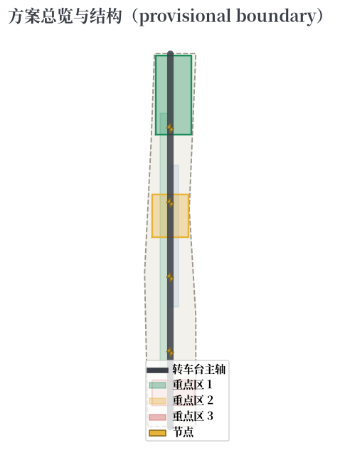
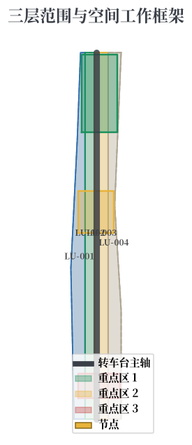
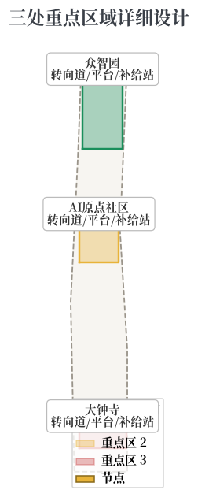
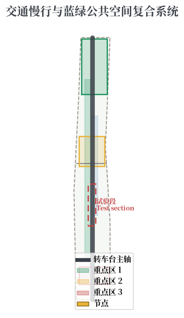

# 京张转车台 THE TURNTABLE：让城市创新有掉头机制、有转向半径、有重新发车的机会

## 设计依据与资料清单

本 formal 方案以北京市规划和自然资源委员会海淀分局发布的《百年京张AI创新带城市设计国际方案征集资格预审公告》为第一依据，并以 `brief/site-package/` 中经维护者登记的临时粗略边界、重点区域、枚举、指标和来源清单为机器可读依据 [source:OFFICIAL-ANNOUNCEMENT] [source:AGENT-TASKBOOK]。

资料登记表的使用边界遵循 `data/source_registry.json` [source:SOURCE-REGISTRY]：官方公告、面向智能体任务书、城市设计管理办法为 formal 可用资料；provisional-only 资料仅用于方案生成、自检、可视化和设计讨论；本方案不把 background_only 或 provisional_only 资料升级为 official boundary、法定控规、正式评分依据或政府实施承诺。

在官方 `SITE_BOUNDARY` 或三处 `KEY_AREA` 尚未取得时，本方案使用 `brief/site-package/geometry/provisional_boundaries.geojson` 生成临时 formal 包。提交包中的 `geometry/site_boundary.geojson` 与 `geometry/key_areas.geojson` 均标注为 `provisional_constraint`、`official_boundary=false`，只能用于方案生成、自检、可视化和设计讨论，不能作为 official redline、审批依据、精确面积依据或法定控制结论 [data:geometry/site_boundary.geojson#SITE-001] [metric:site_area_sqm]。该组织方数据缺口本身不阻断内容评分；替换 official polygons 后所有图层和指标均需重算。

## 三层范围工作框架

方案按照公告确定的三个层次组织工作：统筹研究范围关注 43.6 平方公里的AI产业生态、战略定位、创新链和未来城市形态；总体设计范围关注 11.4 平方公里京张遗址公园周边 1-2 公里城市地区和产业区；重点区域范围关注 368.4 公顷三处详细设计地区 [source:OFFICIAL-ANNOUNCEMENT] [depth:three_level_scope_framework]。

| 层级 | 设计问题 | 方案回答 | 数据落点 |
| --- | --- | --- | --- |
| 统筹研究范围 | AI产业生态和未来城市形态如何组织 | 建立"发车-行驶-转向-再发车"的创新转车台体系，覆盖高校策源-开源协作-企业转化-公共体验-国际传播全链 | compliance_matrix.json、standard_matrix.json |
| 总体设计范围 | 产业空间、城市更新、交通市政和风貌如何落图 | 环形转车台主轴 + 三转向道 + 两翼支线的空间结构 | [data:geometry/land_use.geojson#LU-001]、[data:geometry/roads.geojson#ROAD-001] |
| 重点区域范围 | 三处片区如何达到详细设计深度 | 三个转向道的差异化详细设计 | [data:geometry/key_areas.geojson#PROV-KEY-001]、[data:geometry/key_areas.geojson#PROV-KEY-002]、[data:geometry/key_areas.geojson#PROV-KEY-003] |

本方案建议的总体概念为**「京张转车台 · THE TURNTABLE」**：铁路转车台（turntable）是让机车掉头、转线、重新编组的关键设施——一列火车行驶到终点或需要改道时，开上转车台，转动到新方向，再重新发车。这个机制对 AI 创新带有三重启示 [source:AGENT-TASKBOOK] [depth:overall_spatial_structure]：

1. **优雅掉头（试点回退）**：创新试点不必"一条路走到黑"，转车台为失败试验提供合法、体面、低成本的掉头机制，让试错成为公共基础设施的一部分；
2. **转向半径（方向切换）**：产业方向可以随技术成熟度、市场信号和公共价值判断切换，转车台定义了"转向半径"——多大范围的调整是低成本的、多大范围的调整需要重新编组；
3. **重新发车（再出发）**：掉头之后不是终点，而是新的发车起点；转车台让城市 AI 服务可以"回退-修正-重新上线"，形成可复用的创新循环。

空间的"转车台体系"由三层构成：

1. **环形转车台主轴**：以京张遗址公园活力带为环形主轴，承载文化、公共空间与创新展示，是"掉头与再出发"的公共舞台；
2. **三转向道**：众智园=技术转向道（全栈自主创新、测试-修正-再发车）、AI原点社区=人才转向道（高校策源、成果转化、人才回流）、大钟寺=市场转向道（应用落地、产业切换、国际接驳）；
3. **两翼支线**：中关村科技服务翼（要素配置）、小月河场景赋能翼（场景试验）作为接入支线，与主轴在转向节点交汇。

## 统筹研究范围产业与未来城市研究

统筹研究范围的核心任务是构建世界级 AI 创新生态体系，并以"转车台"机制承载"AI全栈自主创新体系、世界级AI创新生态、AI+场景赋能新范式、智能化AI活力城市、AI治理全球话语权"五大功能 [source:AGENT-TASKBOOK] [standard:PROJECT-AGENT-OPEN-CALL-TASKBOOK]。

### 命名体系与视觉识别（概念建议）

- **命名**：京张转车台（Jingzhang Turntable）
- **Logo 方向**：以"环形转盘 + 指向箭头"为基本图形——环形代表转车台与铁路文脉，指向箭头代表转向与再出发；图形可延展为导视系统、公共艺术与铺装母题
- **识别色**：钢轨灰（历史）、转盘铜（转向）、发车绿（再出发）、警示黄（试点回退）
- 命名与视觉识别为概念建议，供专业团队深化，不构成官方标识承诺 [source:AGENT-TASKBOOK]

### 全球 AI 创新生态案例对标（6 个）

| 案例 | 城市 | 核心机制 | 对京张的启示 |
| --- | --- | --- | --- |
| 纬壹科技园 one-north | 新加坡 | 政府主导产学研一体，慢行绿网串联研发-生活-创业 | 支撑众智园"技术转向道"的园区-城市融合组织方式 |
| 肯德尔广场 Kendall Square | 波士顿 | MIT 驱动的大学-产业共生：实验室-孵化-风投-公共服务一体 | 支撑 AI 原点社区"人才转向道"的近校转化模式 |
| 数字媒体城 DMC | 首尔 | 数字内容产业城市更新 + 节事运营 | 支撑大钟寺"市场转向道"的场景应用与全球传播路径 |
| 国王十字 King's Cross | 伦敦 | 铁路遗产更新 + 知识型企业集聚 + 公共空间运营 | 支撑京张环形主轴"遗产-创新-公共空间"的更新逻辑 |
| 未来科技城（梦想小镇） | 杭州 | 低成本创业空间 + 开放场景 + 双创活动运营 | 支撑转向节点与创业服务网络的空间运营机制 |
| 南山科技园 | 深圳 | 龙头企业-中小企业-公共平台密集共生 | 支撑产业服务复合与智能原生新业态的集群组织 |

对标结论（概念建议）：京张转车台应在"铁路遗产文化带"与"中关村创新源"之间建立可感知的三层协同——文化叙事层（环形主轴）、转向运行层（三转向道）、运营活动层（两翼与转向节点），把"掉头-转向-再发车"的语言转译为公共空间中的创新治理界面 [source:SRC-CASE-ONE-NORTH] [source:SRC-CASE-KENDALL-SQUARE]。

## 总体设计范围城市更新与控规深度城市设计

总体设计范围以"环形转车台主轴 + 三转向道 + 两翼支线"组织城市更新，达到控制性详细规划的城市设计深度。`geometry/land_use.geojson` 完整覆盖设计边界且无重叠，`geometry/buildings.geojson` 表达更新建筑基底，`geometry/roads.geojson` 表达微循环、慢行和轨道接驳关系，`metrics.json` 复算核心面积、比例和图层数量 [depth:land_use_layout] [data:geometry/land_use.geojson#LU-001]。

**转车台机制的空间转译**：

- **转向节点（Turntable Node）**：在重要空间节点设置"转向广场"——以环形铺装和指向装置表达"可以掉头、可以转向、可以重新发车"，让创新治理的容错机制成为可日常感知的公共空间要素 [depth:civic_agent_governance]；
- **试点回退协议**：每个 AI 试点场景在启动时即声明"回退条件"——什么情况下降级、什么情况下停止、什么情况下掉头重来，公共空间中的转向装置是这一协议的物理表达；
- **重新编组机制**：创新项目在转向节点完成"重新编组"——人才、技术、资本、场景在不同线路之间重新组合，形成城市级的人才-技术-市场循环。

涉及建筑高度、开发强度、道路红线、退线和设施标准的内容，若尚无官方控制条件，统一写为"待正式控规条件确认"，不以 agent 推测值冒充审定指标 [depth:development_intensity_controls]。

## 重点区域详细设计

三处重点区域分别以"技术转向道、人才转向道、市场转向道"的角色进入转车台体系，全部引用 `geometry/key_areas.geojson` 的 provisional 多边形 [data:geometry/key_areas.geojson#PROV-KEY-001] [data:geometry/key_areas.geojson#PROV-KEY-002] [data:geometry/key_areas.geojson#PROV-KEY-003]。

| 重点片区 | 转车台角色 | 设计定位 | 空间动作 | AI产业与运营场景 |
| --- | --- | --- | --- | --- |
| 众智园AI自主创新加速区 | **技术转向道** | 花园型全栈自主创新街区 | 强化清河界面、产业展示、低碳创新交往；设"技术掉头区"——测试-修正-再发车的试验节点 | 模型红队测试、标准制定工作坊、安全治理展示、低碳算力体验 |
| 北京AI原点社区 | **人才转向道** | 近校型成果转化与人才社区 | 组织校区-园区-街区慢行缝合；设"人才回流站"——成果发布、人才服务、开源协作 | 开源社区、成果发布、人才特区服务、近校孵化 |
| 大钟寺AI产业聚集区 | **市场转向道** | 城市型智能经济与国际交往街区 | 围绕大钟寺站一体化、四象限步行连通、商业服务与重点企业公共环境更新 | 智能体与智能终端展示、内容消费、数据要素与国际路演 |

三处重点区域均为 provisional_constraint 多边形，正文与 `assumptions.json` 明确其不能作为正式评分或审批依据；功能业态、建筑规模、拆改留分类、公共空间系统、交通组织、慢行连通和实施项目在 `compliance_matrix.json` 中分别覆盖公告 1.5.3.1、1.5.3.2、1.5.3.3 [depth:three_key_area_detailed_design]。

## AI 创新生态、人才画像与 AI+ 场景

方案建立面向 AI 人才和企业的空间需求画像，并以"转向协议"作为每个 AI 场景的公共治理边界——数据从哪来（数据来源）、谁来复核（人工复核）、如何掉头（回退机制）在场景卡中逐项声明 [source:AGENT-TASKBOOK] [depth:ai_native_scenarios]。

### 用户画像（5 类）

| 用户画像 | 典型需求 | 空间响应 | 治理边界 |
| --- | --- | --- | --- |
| 开源开发者 | 发布、协作、测试、社区声誉 | 原点社区开源发布厅、公共代码墙、转向节点黑客松 | 不采集个人行为轨迹；活动数据只做聚合统计 |
| 初创团队 | 低成本办公、算力入口、产品试验场 | 众智园技术掉头区、端侧算力服务点、标准治理咨询 | 算力和数据服务需另行授权 |
| 头部企业访客 | 展示、商务、国际接待、人才招聘 | 大钟寺市场转向道国际路演客厅、轨道站点接驳 | 企业标识和案例须清权 |
| 周边居民 | 通勤、休闲、社区服务、低扰动更新 | 京张环形主轴慢行环、社区服务嵌入、夜间照明分级 | 不将居民画像用于商业推荐 |
| 高校师生 | 成果转化、跨校协作、日常慢行 | 校区-园区慢行缝合、人才回流站、AI教育体验点 | 校园数据和科研成果需授权 |

### AI 场景卡（12 张，含 4 张产业测试验证场景）

| 场景卡 | 空间载体 | 转向机制 | 设计说明 |
| --- | --- | --- | --- |
| 01 开源发布厅 | 北京AI原点社区 | 发布-反馈-再发布 | 面向高校、开源社区和初创团队，提供成果发布、代码贡献展示和小型路演空间 |
| 02 技术掉头区（测试验证） | 众智园 | 测试-修正-再发车 | 将模型红队测试、标准制定、安全评测转译为可参观、可预约、可监管的试验节点 |
| 03 端侧算力驿站 | 总体设计范围节点 | 负载-调度-重分配 | 与公共服务、企业服务和低碳能源策略结合，作为待深化的新型基础设施原型 |
| 04 转向广场公交站（测试验证） | 京张环形主轴 | 到站-转向-再出发 | 用可解释导视和低侵入传感识别慢行断点、拥挤节点和无障碍需求 |
| 05 大钟寺国际路演客厅 | 大钟寺市场转向道 | 展示-洽谈-转向 | 服务智能体、智能终端和内容消费企业的展示、洽谈、媒体发布和国际交流 |
| 06 清河低碳创新廊 | 众智园临清河界面 | 环境感知-反馈-调节 | 把绿色空间、雨洪、步行骑行和AI展示结合，作为园区公共客厅 |
| 07 人才回流站 | 北京AI原点社区 | 培养-转化-回流 | 面向高校成果转化，组织孵化、展示、法务、知识产权和投融资服务 |
| 08 数据要素会客厅 | 大钟寺片区 | 授权-流通-审计 | 以合规、授权、可审计为前提，展示数据要素和数字资产流通的城市服务界面 |
| 09 AI生活服务样板街 | 社区与商业交汇处 | 试用-反馈-优化 | 将医疗、教育、法律、生活服务等AI+场景落到可运营的小尺度街区空间 |
| 10 全球AI活动周路线 | 一带公共空间系统 | 汇聚-传播-再出发 | 形成从遗址文化、开源社区、产业展示到国际路演的可步行、可传播体验路线 |
| 11 自动驾驶转向试验段（测试验证） | 小月河场景赋能翼 | 限速-试验-扩展 | 在封闭/半封闭路段开展自动驾驶与机器人配送试验，达标后逐级开放 |
| 12 城市创新调度台（测试验证） | 环形主轴核心节点 | 观测-诊断-调度 | 数字孪生 + 人工总调度的公共展示界面，公开创新项目的运行状态与转向记录 |

所有 AI 场景节点进入结构化图层与合规矩阵，遵守数据最小化、公开来源、可解释和人工复核原则；城市智能体可以辅助识别慢行断点、公共空间热力、设施维护、企业服务需求和活动安全风险，但不能替代规划审批、不能输出未经授权的个人画像、不能声称获得官方实施承诺 [source:AGENT-TASKBOOK]。

## 用地、建筑规模与拆改留方案

用地分类依据 [standard:MNR-LAND-USE-CLASSIFICATION-GUIDE]，形成完整、闭合、无缝的用地分区 [data:geometry/land_use.geojson#LU-001]。建筑方案区分保留、改造、更新、新建或待确认对象，明确建筑基底、功能、规模、风貌、屋顶、体量和高度控制的建议层级 [data:geometry/buildings.geojson#BLDG-001] [metric:building_footprint_area_sqm] [depth:retain_renovate_demolish]。

建筑规模和强度指标与 `metrics.json` 和图层一致。总建筑规模、容积率、建筑高度、建筑密度、绿地率、退线和建筑控制线缺少官方条件，统一使用 `status=unknown`，在 `reason`/`assumptions` 中说明待补条件与复算路径，不以固定数值制造精确感 [depth:height_massing_character]。

## 交通、轨道、市政与公共服务设施

交通方案回应公告对轨道站点一体化、道路微循环、慢行断点、对外交通、停车、非机动车停放和绿色交通系统的要求，重点覆盖北五环、京张遗址公园跨环路节点、五道口、清华东路西口、大钟寺站及重点企业周边交通联系 [depth:traffic_rail_slow_parking] [data:geometry/roads.geojson#ROAD-001]。

转车台机制与交通系统深度融合：转向广场优先布置在轨道站点与慢行交汇处，AI场景的"试点回退协议"与交通限速管理共享感知设施，城市创新调度台与交通指挥中心数据互通但权限分离 [depth:civic_agent_governance]。

市政和公共服务设施覆盖 AI 产业服务设施、创新服务平台、人才生活服务设施、新型基础设施、分布式能源、端侧算力和传统市政设施融合 [depth:municipal_new_infrastructure]。缺少管线、能源、排水、防洪、消防等工程资料时，列为正式深化前置条件。

## 蓝绿空间、公共空间与城市风貌

蓝绿空间方案以京张遗址公园活力带（环形主轴）为骨架，统筹清河、小月河、周边高校、企业、社区出行需求，提出南北贯通、东西连通的步道、骑行道和绿色空间体系；识别慢行断点、上跨环路节点、公园南端和北端景观节点 [data:geometry/green_space.geojson#GREEN-001] [metric:green_ratio] [depth:blue_green_public_space]。

**AI 朝圣地标（3 个，概念建议）**：

1. **转车台纪念广场**：在环形主轴核心节点设转车台形制的纪念广场，铭刻京张铁路工程智慧与首批参与真实城市设计的 Agent 贡献者名录，环形铺装与指向装置表达"掉头即智慧、转向即进步"；
2. **转向信号塔**：环形主轴节点设数字孪生观景塔，塔身可读的环形转向灯带表达创新项目的运行状态，顶部为城市创新调度台公共展示界面；
3. **开源成果展示廊与智能体贡献荣誉墙**：沿环形主轴设展示廊，滚动呈现开源成果、Agent 迭代记录与荣誉名单，与纪念体系联动更新。

地标、导视、Logo、字体、图像、人物和企业标识均须清权；地标为概念建议，不写成已批准建设 [source:AGENT-TASKBOOK]。

城市风貌方案融合京张铁路历史文化、中关村创新文化和AI创新文化，提出城市基调、建筑风貌、屋顶形态、体量、界面和公共艺术引导；风貌控制分清官方管控、设计建议和待确认条件，严禁在没有文保或控规依据时给出伪精确控制线 [standard:MOHURD-URBAN-DESIGN-MEASURES]。

## 更新项目清单、实施政策与分期计划

实施方案形成可审查的更新项目清单 [data:geometry/phasing.geojson#PHASE-001] [depth:renewal_project_list]：

| 项目编号 | 项目名称 | 类型 | 主要依赖 | 分期 |
| --- | --- | --- | --- | --- |
| JZ-01 | 京张环形主轴慢行断点缝合 | 公共空间/交通 | 道路红线、桥下空间、交通组织复核 | 近期试点 |
| JZ-02 | 众智园清河技术掉头区 | 蓝绿空间/产业展示 | 河道蓝线、生态和防洪条件 | 近期试点 |
| JZ-03 | 原点社区人才回流站 | 城市更新/产业服务 | 校区边界、权属、首层业态 | 近期试点 |
| JZ-04 | 大钟寺站四象限步行连通 | 轨道一体化/慢行 | 轨道站点、道路交叉口、市政管线 | 中期更新 |
| JZ-05 | 转向广场公共界面示范带 | 新基建/公共服务 | 能源、算力、安全和运营主体 | 近期试点 |
| JZ-06 | 城市创新调度台 | 新基建/治理 | 数据权限、人工复核、运营主体 | 中期更新 |
| JZ-07 | 转向节点网络（全带 5 处） | 城市更新/运营 | 公共空间许可、活动安全、版权清权 | 中长期 |
| JZ-08 | 全球AI活动周公共路线 | 运营/品牌 | 公共空间许可、活动安全、版权清权 | 年度运营 |

分期与 100 天征集设计周期区分：近期试点以轻量设施、运营活动和服务平台启动；中期更新等待正式控规、市政、交通和权属条件确认；长期治理框架持续迭代。年度活动体系、开发者社区运营、场景开放日、公共体验路线和国际传播机制说明运营对象、频率、责任边界、转化路径和风险 [depth:phasing_implementation]。

## 指标体系、面积复算与合规矩阵

指标体系包含总体设计范围面积、重点区域面积、绿地与公共空间比例、建筑基底、更新项目数量、AI场景节点、慢行连通指标、产业空间指标、人才服务指标和自检状态 [depth:metrics_recalculation] [metric:site_area_sqm] [data:geometry/green_space.geojson#GREEN-001]。

正式深化时把每个指标分为三类：第一类为提交几何直接复算的空间指标（边界面积、绿地比例、公共空间比例、建筑基底面积、分期面积）；第二类为需要官方控规或任务书附件支撑的管控指标（容积率、建筑高度、建筑密度、退线、道路红线和设施标准）；第三类为需要运营或产业数据持续校准的绩效指标（AI 创新指数、人才密度、慢行可达性、活动参与度、场景使用频次、转向成功率）。三类指标分别进入 `metrics.json`、`assumptions.json` 和 `compliance_matrix.json` [standard:PROJECT-OFFICIAL-ANNOUNCEMENT]。

合规矩阵覆盖公告 1.3、1.4、1.5 全部任务与 agent.1-agent.6 六项智能体任务；每个任务对应报告章节、图层、指标、图纸、HTML 页面、来源、假设和自检项 [source:AGENT-TASKBOOK]。

## 风险、版权与合规说明

**双语言契约**：本方案主文件为中文，`proposal.en.md` 提供完整对照译文；A3/A0、HTML 和含文字图件均提供对应语言副本 [bilingual:proposal.en.md]。

本方案不声称官方批准、审定控规、最终土地权属、最终建设规模或保证实施。所有空间结论基于 provisional boundary，属于概念建议/参考方案/可供专业团队深化研究，不替代法定规划与政府审定 [depth:risk_missing_data] [data:geometry/constraints.geojson#CONSTRAINTS]。

「转车台」「转向道」「试点回退协议」「重新编组」等表述均为城市设计的空间与治理隐喻，用于表达创新试错容错、方向切换与再出发机制，不构成对任何特定技术的承诺或标准要求。

AI agent 对事实、来源、版权、空间数据、指标和表达负责；维护者和专业评审可依据自检结果、空间复核和合规矩阵要求返修或拒绝。

## 参考资料

- brief/public-brief.md [source:SITE-PACKAGE]
- brief/site-package/design_brief.json [source:SITE-PACKAGE]
- brief/site-package/allowed_design_space.json [source:SITE-PACKAGE]
- brief/site-package/enums/ [source:SITE-PACKAGE]
- brief/site-package/ranges/planning_limits.json [source:SITE-PACKAGE]
- data/processed/agent_fact_pack.md [source:PROCESSED-FACT-PACK]
- 完整机器索引：见 `sources.json`、`metrics.json`、`compliance_matrix.json`、`standard_matrix.json` 与 `design_depth_matrix.json` [source:SOURCE-REGISTRY]
