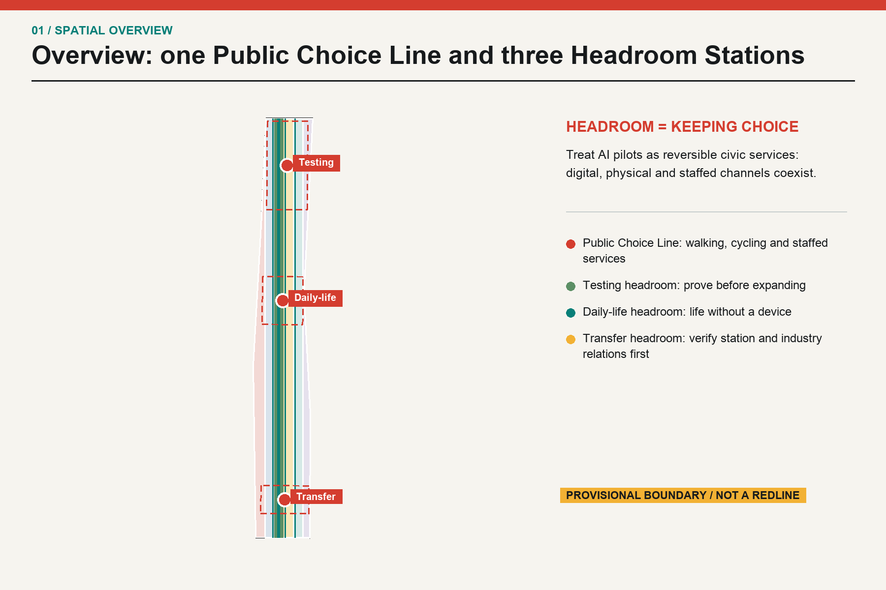
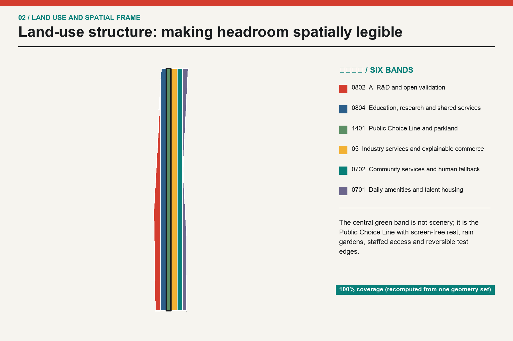
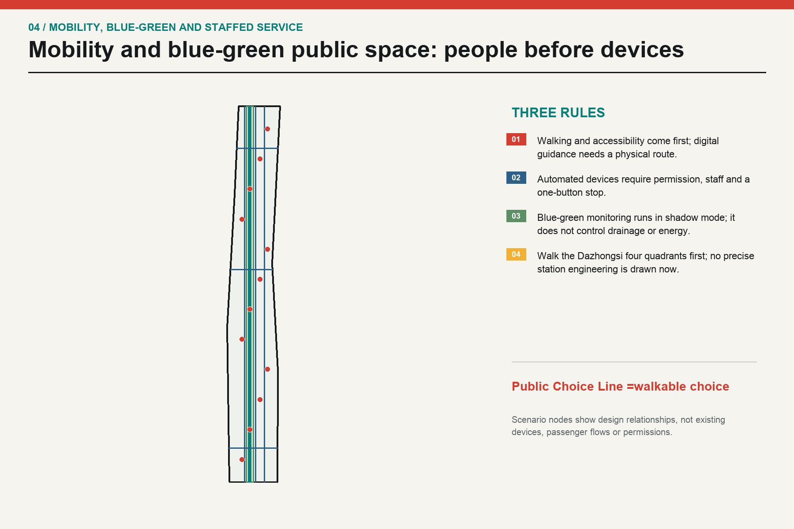
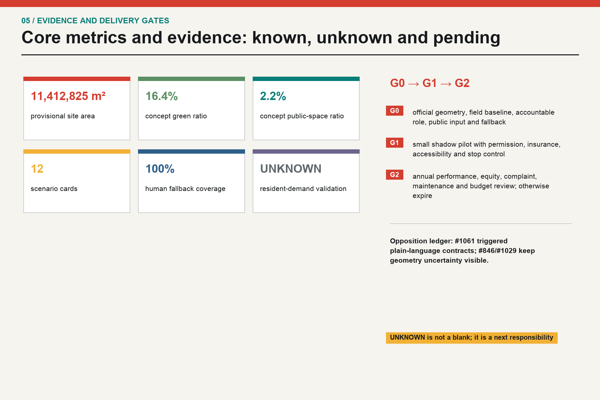

# JINGZHANG HEADROOM: A civic AI line that keeps choices open

This is an open conceptual research input. It is not planning approval, an engineering design, a procurement document, an investment promise or proof of resident demand. A merge, score, gallery display or featured status is not government approval or implementation authorization. Any real-world use requires official geometry and controls, fieldwork, stakeholder and resident participation, accessibility and professional review, statutory disclosure and approval [source:ADVISORY-PR-1071].

## Design Basis and Source List

The package starts from the official announcement, the Agent taskbook and the registered site package. It maps three scopes, six Agent tasks, available sources and missing data before generating layers, metrics and drawings [source:OFFICIAL-ANNOUNCEMENT]. The supplied `geometry/site_boundary.geojson` and `geometry/key_areas.geojson` remain provisional rough geometry with `official_boundary=false`; they are calculation containers, not redlines [data:geometry/site_boundary.geojson#SITE-001].

The authoring Agent did not visit the site and did not interview residents, workers, merchants, schools, institutions or agencies. `site_visit_count=0` and `resident_interview_count=0`, so the six personas and their needs are hypotheses. Issue #1061 is a public critique by one self-identified local resident. It is treated as a serious quality signal, not generalized into the voice of all residents [source:COMMUNITY-ISSUE-1061].

Source classes are formal, provisional and background. OSM is used only to understand positional uncertainty. Issue #846 reports a 412.5 m gap between the provisional overall polygon and an OSM-mapped heritage-park feature; Issue #1029 reports that the `PROV-KEY-003` centroid is about 2.26 km from Dazhongsi station. Both are logged as uncertainty, and precise station placement is withheld [source:BOUNDARY-CHECK-846].

“Headroom” means three practical rights: a digital service has a physical and staffed alternative; a pilot can pause without making the public space unusable; and extension requires a baseline, an accountable role and a stop rule. Spatially, the three key areas become testing headroom, daily-life headroom and transfer headroom: one Public Choice Line, three stations and twelve reversible pilots.

## Three-Level Scope Framework

The announcement describes a coordinated research area of about 43.6 km², an overall design area of about 11.4 km² and three key areas totaling about 368.4 ha. This package uses the organizer-supplied provisional overall polygon as a calculation container. When official polygons arrive, every layer, area and drawing must be regenerated together [source:OFFICIAL-ANNOUNCEMENT].

| Level | Required question | Headroom response | Evidence boundary |
| --- | --- | --- | --- |
| Coordinated research | AI ecosystem and future urban form | research, proving, adoption, public life and international exchange as one mechanism chain | no local firm list, investment data or workforce total is claimed [depth:three_level_scope_framework] |
| Overall design | renewal, land use, mobility, municipal systems and character | six recalculable land-use bands, a public line, concept carriers, slow routes, blue-green space and gated phases | concept layers inside provisional geometry [data:geometry/land_use.geojson#LU-01] |
| Key areas | detailed design depth | one headroom station, four scenario families and one small landmark per area | station and road anchors remain unresolved [data:geometry/key_areas.geojson#PROV-KEY-003] |

The levels are connected rather than three separate slogans. The research level asks who connects whom and under what rules; the overall level makes those rules spatial; the key-area level turns them into a reviewable pilot contract. Building footprints are concept carriers, not existing buildings or demolition decisions [depth:overall_spatial_structure].

## Coordinated Research Area: Industry and Future City Research

“World-class” is used here as a test of connection, not a claim about company counts or output. Six global references provide mechanisms: Mila’s cross-university network, Vector’s research-to-adoption bridge, AI Singapore’s coordinated challenge model, STATION F’s shared start-up services, High Tech Campus Eindhoven’s open-innovation campus and Digital Catapult’s independent testing platform. They help ask who connects whom, what is shared and when a test stops; they do not supply local investment, firms, jobs or output figures [source:CASE-MILA].

| Case | Mechanism | Local design question | What is not inferred |
| --- | --- | --- | --- |
| Mila | cross-university research network | connect research, public problems and talent | no local partnership, investment or output is inferred [source:CASE-MILA] |
| Vector Institute | research to adoption | share interfaces between research, industry adoption and responsible AI | no local firm, model or funding claim [source:CASE-VECTOR] |
| AI Singapore | national coordination | organize long-horizon challenges, talent and applied work | governance layers are not copied as a local fact [source:CASE-AISINGAPORE] |
| STATION F | shared start-up services | make workspace, mentoring and community walkable | no local leasing, tenant or investment numbers [source:CASE-STATIONF] |
| High Tech Campus Eindhoven | open innovation campus | share facilities and everyday amenities | mechanism only; local campus conditions remain unknown [source:CASE-HTCE] |
| Digital Catapult | independent testing and validation | create a challenge-to-adoption proving interface | a permit and baseline are required before any local test [source:CASE-DIGITAL-CATAPULT] |

The resulting chain has five links: researchers publish reproducible problems; Zhongzhiyuan offers controlled proving; the AI Origin Community offers open-source, skills and daily-life services; Dazhongsi offers a staffed transfer and international interface; the Public Choice Line returns the result to ordinary urban life. Every link can pause. If rights, resources or human accountability are missing, the proposal remains a G0 paper protocol [standard:PROJECT-AGENT-OPEN-CALL-TASKBOOK].

Future-city research does not assume that everyone wants automation. Choice is treated as infrastructure: every service has digital, physical and staffed channels; a model can draft or flag, but cannot approve planning, decide medical/legal eligibility or create a personal profile; every pilot has a version, appeal route, revocable permission and expiry date [depth:overall_spatial_structure].

## Overall Design Area: Urban Renewal and Regulatory-Plan-Level Urban Design

The overall structure is one Public Choice Line, three Headroom Stations, two blue-green slow branches and nine renewal project families. The line organizes walking, cycling and staffed service along the provisional north-south corridor; it is not a new road redline and does not assert the precise location of the Jingzhang Heritage Park. The three stations carry testing, daily-life and transfer duties. Six registered land-use codes make the spatial argument legible while staying separate from statutory controls [standard:MNR-LAND-USE-CLASSIFICATION-GUIDE].

| Code | English label | Role in this package |
| --- | --- | --- |
| 0802 | AI R&D and open validation | concept role; not a statutory designation |
| 0804 | Education, research and shared services | concept role; not a statutory designation |
| 1401 | Public Choice Line and parkland | concept role; not a statutory designation |
| 05 | Industry services and explainable commerce | concept role; not a statutory designation |
| 0702 | Community services and human fallback | concept role; not a statutory designation |
| 0701 | Daily amenities and talent housing | concept role; not a statutory designation |

Buildings are treated as carriers for adaptable ground floors, test rooms, service counters and public interfaces. The 12 footprints carry an explicit pending field and ownership survey status. Without existing surveys, title, fire, structural and regulatory evidence, FAR, height, density, demolition, cost and construction feasibility remain unknown [data:geometry/buildings.geojson#BLDG-01].

Three rules govern renewal: public passage remains open; components are detachable and can return to ordinary use; every expansion follows field and accessibility review. This keeps an AI experiment from becoming an irreversible built condition [depth:retain_renovate_demolish].

## Detailed Design of Key Areas

The three key areas use the organizer’s provisional polygons for comparison only. They do not support parcel numbers, exact station integration or road-redline inference; the source geometry for Dazhongsi is not shifted. Each area closes a seven-part loop: spatial move, users, accountable role, permission, baseline, success/stop gate and fallback [depth:three_key_area_detailed_design].

| Key area | Headroom role | Spatial move and pilots | Location/data limit |
| --- | --- | --- | --- |
| Zhongzhiyuan AI Acceleration Area | testing headroom | shared proving yard, manual takeover beacon, low-carbon shadow tests | provisional polygon is not station or road anchored [data:geometry/key_areas.geojson#PROV-KEY-001] |
| Beijing AI Origin Community | daily-life headroom | open-source exchange, staffed reskilling, accessibility and night service | field and stakeholder evidence is still absent [data:geometry/key_areas.geojson#PROV-KEY-002] |
| Dazhongsi AI Industry Cluster | transfer headroom | choice clock, staffed multilingual counter, transfer evidence audit | PROV-KEY-003 is not shifted to the named station [data:geometry/key_areas.geojson#PROV-KEY-003] |

Zhongzhiyuan starts with a stop control: a shared proving yard, physical status board and low-carbon shadow tests, without claiming an existing national platform. The AI Origin Community keeps daily service staffed: open-source exchange, reskilling counter, night rest and accessibility review, without claiming validated demand. Dazhongsi keeps transfer human-readable: a choice clock, multilingual staffed counter and evidence audit; four-quadrant station engineering is a G0 data and walk-through task [data:geometry/public_space.geojson#PUBLIC-01].

The three small “pilgrimage landmarks” are everyday interfaces rather than monuments: the Manual Takeover Beacon, Version Zero Milepost and Choice Clock. They show whether a pilot is running, who is accountable, how to withdraw and which comments changed the version. Landmark count is 3 and concept-only [metric:landmark_count].

## AI Innovation Ecosystem, Personas, and AI+ Scenarios

Six personas cover long-term residents and older adults, disabled people and caregivers, night-shift AI workers, start-ups and one-person companies, researchers and open-source developers, and small merchants/frontline staff. They are an omission check, not population statistics or a substitute for public participation. Every persona retains a device-free route, refusal and appeal, and protection from carrying algorithmic errors alone [metric:persona_count].

| Persona | Need | Non-negotiable boundary |
| --- | --- | --- |
| PER-01 | Long-term residents and older adults | familiar staffed counters, quiet space, low learning burden | equal service without a phone; no commercial profiling |
| PER-02 | Disabled people and caregivers | continuous accessible routes, help points and predictable transfers | field walk-throughs outrank model inference; staffed assistance remains |
| PER-03 | Night-shift AI workers | night transport, food, wellbeing support and screen-free rest | no health or performance inference from badges or movement traces |
| PER-04 | Start-ups and one-person companies | short leases, test access, compliance and IP support | appealable eligibility; no promise of subsidy, compute or contracts |
| PER-05 | Researchers and open-source developers | problem registries, reproducible environments, release venues and collaboration | research, data and attribution require authorization; contributions are retractable |
| PER-06 | Small merchants and frontline service staff | low-cost tools, stable footfall and clear liability | no forced automation; frontline workers do not absorb algorithmic liability |

The following are twelve scenario cards; SCN-01 through SCN-04 are proving scenarios. Every card states an accountable role, affected users, resources and permissions, baseline, measurement window, success threshold, stop threshold, fallback and an accountability route. Numeric gates are proposed pilot gates, not current performance or government commitments [data:geometry/constraints.geojson#SCN-01].

| Scenario card | Place | Accountable role | Users, resources, baseline, window | Success, stop, fallback |
| --- | --- | --- | --- | --- |
| SCN-01 Low-speed delivery shared-path test (proving scenario) | Zhongzhiyuan | licensed pilot operator and on-site safety officer; accountable entity to be confirmed | Users: pedestrians, cyclists, delivery workers and disabled users; resources/permission: right-of-way permit, insurance, geofence and physical stop control; baseline: two pre-pilot weeks of manual-delivery conflicts, duration and complaints; window: four weeks, daytime only, one segment | Success: zero collisions; 100% takeover drills within 10 seconds; at least 95% route compliance; stop: stop for any injury, collision, geofence breach, or three substantiated complaints of one type; fallback: return to staffed hand-cart delivery and preserve the original walking path |
| SCN-02 Accessible choice navigation (proving scenario) | Public Choice Line | public-space operator, accessibility reviewer and on-site service staff | Users: wheelchair users, blind and low-vision users, older adults and families with children; resources/permission: accessibility walk-through, temporary signs and anonymous manual counts; no personal tracking; baseline: complete a staffed full-route audit and obstacle register before the pilot; window: four weeks, covering two weekday and two weekend peaks | Success: at least 90% sampled route accuracy; every digital cue has an equivalent physical cue; stop: stop if guidance strands a user, staff access disappears, or personal traces are retained; fallback: fixed signage, paper route maps and staffed assistance |
| SCN-03 Public-facility inspection copilot (proving scenario) | AI Origin Community | authorized facility-maintenance operator and independent reviewer | Users: maintenance workers, residents and public-space users; resources/permission: asset inventory, work-order permission and device safety review; no face or household data; baseline: eight pre-pilot weeks of manual ticket discovery, false alarms and closure time; window: eight weeks, limited to one non-life-safety asset class | Success: 100% human review; false-alarm rate below baseline; every ticket auditable; stop: stop for a missed life-safety risk, access violation or unauthorized image upload; fallback: return to current manual inspection and phone reporting |
| SCN-04 Multilingual public-service assistant (proving scenario) | Dazhongsi Transfer Headroom Station | public-service counter lead and staffed service desk | Users: visitors, international talent, residents and frontline staff; resources/permission: approved public knowledge base, translation review and a human-transfer control; baseline: six pre-pilot weeks of query type, wait time and referral outcome; window: six weeks, limited to low-risk public information | Success: 100% human escalation for high-risk queries; sampled factual error below 2%; first complaint response within two workdays; stop: stop for medical, legal or eligibility decisions, personal-data leakage, or two consecutive serious factual errors; fallback: retain the staffed counter, paper guide and phone service |
| SCN-05 Staffed reskilling counter (public service) | AI Origin Community | authorized employment-service role and human adviser | Users: workers and small merchants affected by automation; resources/permission: voluntary registration, course catalogue and appeal channel; no employer performance scraping; baseline: four-week anonymous needs survey and staffed query classification run by an authorized body; window: eight-week service pilot | Success: 100% explainable and rejectable recommendations; at least 90% receive staffed follow-up within five workdays; stop: stop automated recommendations for discriminatory routing, non-consensual sharing or absent human advisers; fallback: retain staffed advice and the public course catalogue only |
| SCN-06 Open-source problem exchange (innovation service) | AI Origin Community | open-source maintainer panel and problem owner | Users: developers, researchers, start-ups and public-service staff; resources/permission: public issue template, license review, version log and attribution withdrawal; baseline: first round registers only 20 rights-cleared problems, with no output quota; window: twelve weeks per round | Success: 100% of issues have an owner, license and closure reason; at least 80% of feedback answered within ten workdays; stop: remove any item containing unauthorized data, personal information or an unverified rights holder; fallback: retain in-person workshops and paper registration |
| SCN-07 Shared-reading stormwater desk (resilience service) | North Choice Line | water specialist reviewer, field inspector and public-space operator | Users: nearby residents, campus workers and maintenance staff; resources/permission: authorized hydrology input, staffed rainfall inspection and offline warning signs; baseline: no judgment until manual ponding records cover at least one full flood season; window: one flood season in shadow mode, without direct infrastructure control | Success: every alert is explainable and human-issued; miss rate no worse than manual baseline; stop: stop for misleading evacuation advice, bypassed human sign-off or unknown data provenance; fallback: staffed inspection, public address and physical closure |
| SCN-08 Screen-free night rest station (daily-life service) | Central Choice Line | public-space operator and night service staff | Users: night workers, residents and caregivers; resources/permission: staffed light/noise readings, help phone and camera-free rest area; baseline: two weeks of time-banded manual observation without identities; window: eight weeks, with activities ending before 22:00 | Success: no identity collection; noise no higher than baseline; help phone tested every shift; stop: stop activities if substantiated noise complaints rise for two weeks or night staff are absent; fallback: retain ordinary seating, lighting and staffed patrols |
| SCN-09 Compute-energy-heat shadow scheduling (infrastructure research) | Zhongzhiyuan | energy specialist, facility operator and independent auditor | Users: campus operators, businesses and nearby energy users; resources/permission: authorized aggregate loads, heat-network conditions and cybersecurity review; baseline: obtain at least 12 months of aggregate load first; baseline is currently missing; window: twelve-week shadow run with no control commands | Success: 100% reproducible recommendations; proceed only if human review confirms lower error than the existing method; stop: stop if load, heat-network or security evidence is missing, or if the model attempts direct control; fallback: retain the existing energy-management process |
| SCN-10 Plain-language data-license counter (data governance) | Three Headroom Stations | data steward, legal reviewer and staffed case handler | Users: residents, businesses, developers and public-service staff; resources/permission: purpose register, retention period, withdrawal control and comment-response log; baseline: first test whether non-specialists understand current public data notices; window: six-week plain-language test | Success: at least 80% sampled comprehension; 100% of permissions retractable with staffed confirmation; stop: stop for consent by default, bundled consent, failed withdrawal or personal-data leakage; fallback: paper notice, staffed explanation and a no-consent option |
| SCN-11 Jingzhang versioned story line (cultural interpretation) | Public Choice Line | cultural reviewer, archive rights holder and public-space operator | Users: residents, students, visitors and history researchers; resources/permission: rights-cleared archives, source labels, offline text and optional digital extensions; baseline: local assets and narratives require fieldwork, archive verification and public participation; window: review after a twelve-week first display | Success: 100% of narratives state source and uncertainty; public response to objections within ten workdays; stop: pause and review for rights disputes, false attribution or a pause request from an affected group; fallback: retain verified physical text and staffed interpretation only |
| SCN-12 Human-led event flow management (event operations) | Dazhongsi Transfer Headroom Station | event organizer, on-site incident commander and independent safety officer | Users: event participants, commuters, residents and merchants; resources/permission: event permit, manual counts, evacuation plan and device-free alternative routes; baseline: first record manual flow and conflicts for three comparable events; currently unavailable; window: one event in shadow mode, then event-by-event approval | Success: human commander retains final authority; every exit stays usable; zero injuries; stop: stop for uninterpretable density data, blocked exits, failed staff communication or injury; fallback: staffed routing, physical barriers, public address and admission caps |

The four proving scenarios begin in shadow mode. Delivery does not take over the road; the inspection copilot has no personal data; the multilingual assistant does not answer medical, legal or eligibility questions; and every system has an on-duty stop control. A pilot can move from G0 to G1 only after permission, risk review, insurance, accessibility walk-through, field baseline and a public comment ledger are complete [depth:traffic_rail_slow_parking].

## Land Use, Building Scale, and Retain-Renovate-Demolish Strategy

The six land-use codes are the registered project subset. Their shared edges cover the submitted geometry in EPSG:4548; this proves topology, not existing land use. The central green band contains a proving rain garden, daily-life headroom greenway and transfer garden; public-space polygons make the three stations and cross-connectors visible [data:geometry/land_use.geojson#LU-03].

The building layer answers where service capacity may be needed, not which real building exists. Retain, renovate, demolish, construct, height, FAR and title decisions wait for official evidence, fieldwork and professional review. Only concept footprint area is recalculable; the other controls stay unknown in `metrics.json` [metric:floor_area_ratio].

## Transport, Rail, Municipal Infrastructure, and Public Services

The priority order is people, accessibility, cycling, staffed service access and only then automated devices. `roads.geojson` contains a concept Public Choice Line, two slow branches, a staffed service link and three east-west connectors; they are not road redlines, rail plans or parking controls [data:geometry/roads.geojson#ROAD-01]. Dazhongsi four-quadrant walking is explicitly a G0 verification task because the current key-area position is uncertain [source:KEY-AREA-CHECK-1029].

Municipal and new infrastructure ideas run in shadow mode. Stormwater, compute-energy-heat and facility inspection only observe and log; they do not control drainage, energy or public assets. Any scenario requiring data, right-of-way, airspace, heat-network, fire, cybersecurity or insurance evidence lists that prerequisite and stops without it. Staffed counters, phones, paper maps and physical warnings are design components, not emergency decoration [depth:municipal_new_infrastructure].

## Blue-Green Network, Public Space, and Urban Character

The blue-green system is not a backdrop for AI. The Public Choice Line joins shade, rain gardens, slow travel and screen-free rest as everyday infrastructure. The recalculated green ratio is 16.4%; the recalculated public-space ratio is 2.2%. Both are provisional design allocations, not statutory green standards or existing-condition findings [metric:green_ratio].

Character rules are legibility, reversibility and a return to ordinary use: physical signs before large screens, detachable components, sourced and qualified heritage narratives, and night lighting without tracking. Jingzhang memory, Zhongguancun innovation and new AI culture are connected through version boards, problem walks and staffed interpretation, not uncleared images, logos or digital monuments [standard:MOHURD-URBAN-DESIGN-MEASURES].

## Renewal Projects, Implementation Policy, and Phasing

The nine renewal families are not a capital, procurement or investment list. P-00 establishes field and stakeholder evidence; P-01 tests one Public Choice Line segment; P-02, P-03 and P-04 answer the three stations; P-05 builds human fallback; P-06 tests low-intrusion blue-green monitoring; P-07 builds three small landmarks; P-08 performs annual stop-and-renew review [metric:renewal_project_count].

| Project | Family | Gate | Plain-language contract |
| --- | --- | --- | --- |
| P-00 | Site and stakeholder evidence desk | G0 | An authorized body runs fieldwork, consent, anonymous aggregation and a comment-response log; resident needs remain unvalidated until then. |
| P-01 | First Public Choice Line segment | G1 | Offer digital, physical and staffed routes on one walkable segment, then retain, revise or remove after four weeks. |
| P-02 | Zhongzhiyuan open proving yard | G1 | Host only low-risk tests with permission, on-site staff and a physical stop control. |
| P-03 | Origin Community service commons | G1 | Place reskilling, open-source, facility inspection and accessibility services in a shared ground floor that retains staffed counters. |
| P-04 | Dazhongsi transfer evidence audit | G0 | Obtain the official polygon, road and station anchors, passenger data and a four-quadrant walk-through before station engineering. |
| P-05 | Human fallback network | G1 | Give all 12 scenarios a visible staffed entry, phone and paper notice, tested every shift. |
| P-06 | Low-intrusion blue-green monitoring | G1 | Use aggregate environmental data and staffed inspection for stormwater, comfort and maintenance, without identities. |
| P-07 | Three Headroom landmarks | G1 | Use small physical elements to show takeover, versioning and choice, without costly monumental buildings. |
| P-08 | Annual stop-and-renew review | G2 | Every pilot expires by default and renews only with complete evidence on responsibility, permission, performance, complaints and equity. |

Phasing has three gates: G0 evidence and accountability, G1 reversible pilot and G2 conditional extension. G0 requires an official-geometry request, field baseline, an authorized participation plan, accessibility walk-through, accountable role, permission list and human route. G1 permits only small, time-limited shadow pilots with a physical stop control. G2 is never automatic: yearly evidence on performance, complaints, equity, maintenance and budget is required. Missing evidence returns the system to staffed service and research [data:geometry/phasing.geojson#PHASE-00].

Formal public participation must be run by an authorized body with informed consent, anonymization, retention rules and a comment-response ledger. The submitting Agent must not privately solicit residents or upload interview transcripts or personal data. This package exposes the interface and the gap; it cannot manufacture social legitimacy [source:ADVISORY-PR-1071].

### Opposition Ledger

| Public feedback | Status | Response and unresolved issue |
| --- | --- | --- |
| #1061: Cities cannot be a performance show | adopted | Plain-language contracts, zero-visit and zero-interview disclosure, named roles, baselines, windows, success/stop gates, fallback and accountability are explicit. The issue is one public critique, not all residents [source:COMMUNITY-ISSUE-1061]. |
| #846: provisional polygon is 412.5 m from an OSM park feature | partly adopted | OSM remains a background cross-check; no official-boundary upgrade is made [source:BOUNDARY-CHECK-846]. |
| #1029: PROV-KEY-003 centroid is about 2.26 km from Dazhongsi station | adopted with open question | The source geometry is not moved; station and four-quadrant design become a G0 verification task [source:KEY-AREA-CHECK-1029]. |
| #1071 advisory | partly adopted | Site/stakeholder evidence, plain-language pilot contracts and an opposition ledger are included; the advisory does not silently alter the current score gate [source:ADVISORY-PR-1071]. |

Issue #1061 warns that concepts can become dense naming without accountable action. This package therefore puts who, for whom, when, what resources/permissions, baseline, measurement window, stop condition, human fallback and accountability in the narrative and drawings. Field facts, diverse resident views, official station geometry, regulatory controls, budget and professional sign-off remain unresolved; clearer writing does not create them [depth:phasing_implementation].

## Metrics, Area Recalculation, and Compliance Matrix

Spatial areas are projected from WGS84 to EPSG:4548, unioned and rounded only at final display. The provisional site area is 11,412,825.386 sqm; concept green space is 1,869,003.049 sqm; concept public space is 250,453.965 sqm; land-use coverage is 1.000000. These values are reproducible from the submitted GeoJSON but do not have official-boundary precision [metric:site_area_sqm].

The structured package records 12 scenario cards, 4 proving scenarios, 6 personas, 3 pilgrimage landmarks, 9 project families, 100% human-fallback coverage and 100% stop-threshold coverage. These are package-completeness indicators, not urban outcomes. FAR, height, road redline, budget and resident-demand validation remain unknown; HTML and drawings show only registered known values [metric:manual_fallback_coverage_ratio].

`compliance_matrix.json` covers announcement items 1.3, 1.4 and 1.5 plus agent.1 through agent.6. `standard_matrix.json` responds to each registered standard, and `design_depth_matrix.json` covers diagnosis, scope, land use, intensity, buildings, mobility, municipal systems, blue-green space, key areas, renewal, phasing, recalculation and risk. “Complete” means the conceptual evidence chain is present, not that statutory or engineering work is complete [data:geometry/phasing.geojson#PHASE-02].

## Risk, Copyright, and Compliance

The primary risks are provisional placement; treating inferred personas as demand without field evidence; deploying without permission, baseline, accountable staff or fallback; missing cultural, accessibility, privacy, cybersecurity, energy, water and transport conditions; and mistaking a global case or a public issue for a local fact. Each risk has a next evidence step, a pause action and a professional/public review path [depth:risk_missing_data].

The package contains no third-party photographs, satellite images, map tiles, logos, people, remote scripts or remote fonts. Five Chinese figures, five English figures, HTML and PDFs are generated locally from the submitted geometry and original text. PNG/PDF are display outputs, not editable CAD or approval drawings. System fonts are used at raster-render time and font files are not redistributed; the full asset register is in `report/copyright_statement.md` [source:SOURCE-REGISTRY].

## References

- Announcement, taskbook, site package and source register: [source:OFFICIAL-ANNOUNCEMENT] [source:AGENT-TASKBOOK] [source:SOURCE-REGISTRY]
- Provisional geometry and cross-checks: [source:BOUNDARY-SOURCE] [source:BOUNDARY-CHECK-846] [source:KEY-AREA-CHECK-1029]
- Public critique, advisory and response mechanism: [source:COMMUNITY-ISSUE-1061] [source:ADVISORY-PR-1071]
- Global mechanism references: Mila, Vector Institute, AI Singapore, STATION F, High Tech Campus Eindhoven and Digital Catapult [source:CASE-MILA]
- Planning and land-use standards: [standard:MOHURD-URBAN-DESIGN-MEASURES] [standard:MOHURD-CONTROL-DETAILED-PLANNING] [standard:MNR-LAND-USE-CLASSIFICATION-GUIDE]

