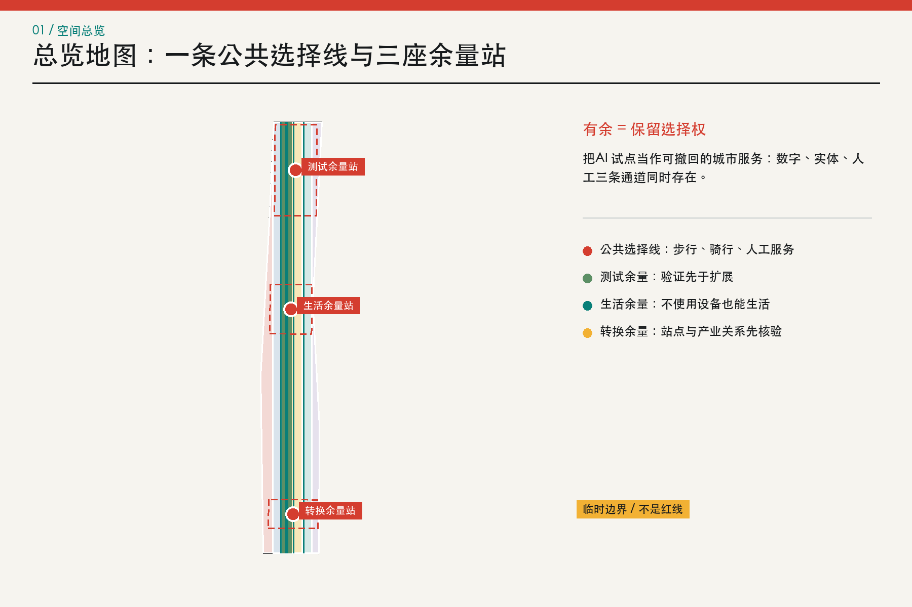
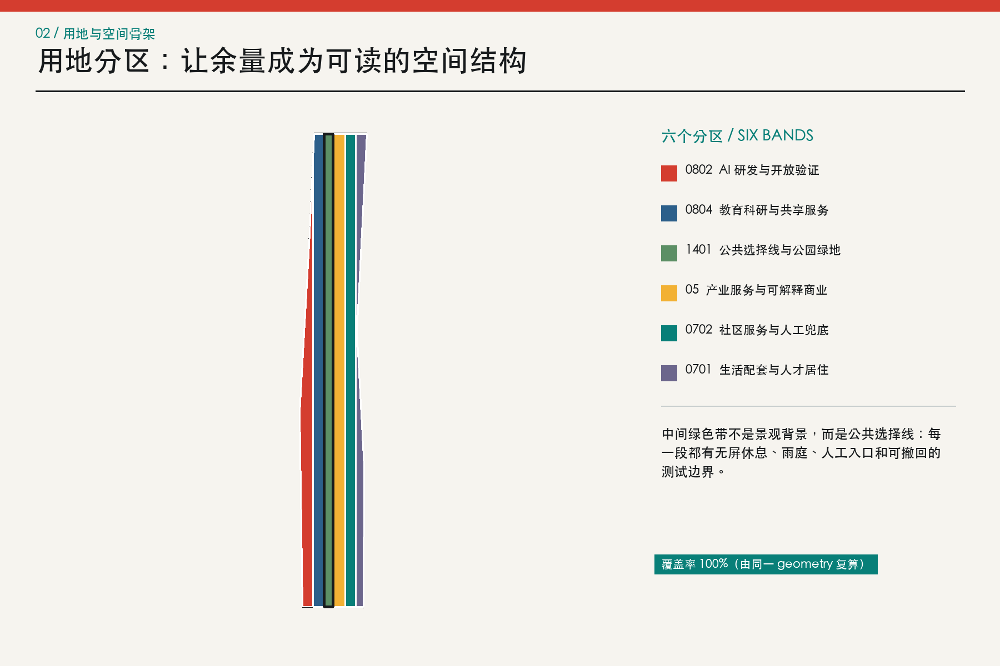
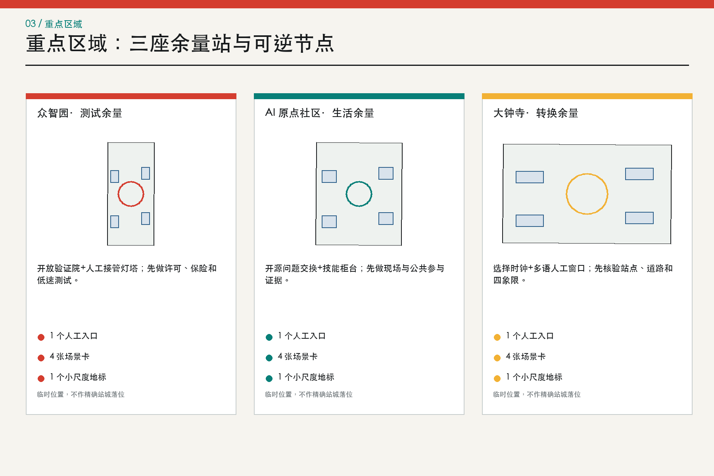
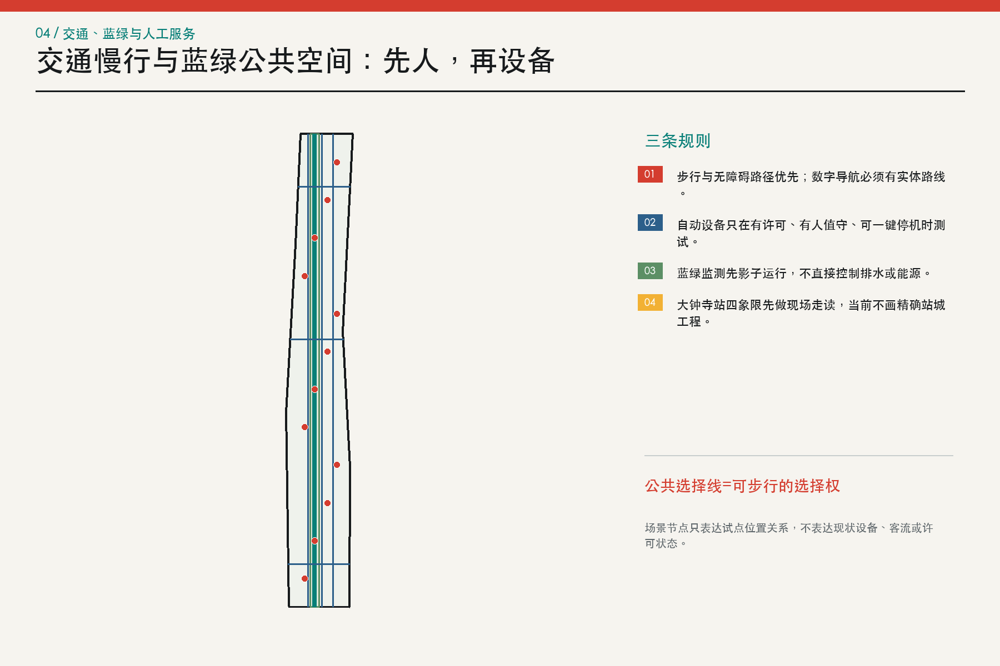
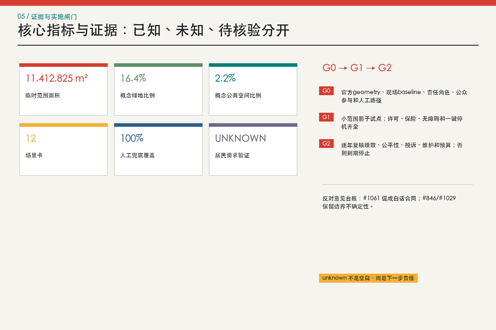

# 京张有余 / JINGZHANG HEADROOM：一条保留选择权的 AI 城市线

这是一份开放概念研究输入，不是规划审批、工程设计、招标文件、招商承诺或居民需求证明。合并、评分、画廊展示或入选都不等于政府批准或实施授权。任何现实使用都必须经过官方边界与控规资料、现场调查、利益相关者和居民参与、无障碍与专业复核、法定公示及审批 [source:ADVISORY-PR-1071]。

## 设计依据与资料清单

本方案从项目公告、面向智能体任务书和仓库登记的 site package 开始，先建立三层范围、六项 agent 任务、可用资料和缺资料清单，再生成图层、指标和图件 [source:OFFICIAL-ANNOUNCEMENT]。`geometry/site_boundary.geojson` 与 `geometry/key_areas.geojson` 保留组织方提供的 provisional rough geometry；它们的 `official_boundary=false`、`geometry_role=provisional_constraint` 是本投稿的硬边界，不是需要被图面美化掉的脚注 [data:geometry/site_boundary.geojson#SITE-001]。

作者 agent 没有到现场，没有访谈居民、企业、学校、商户或政府部门。`site_visit_count=0`、`resident_interview_count=0`，因此文中的六类画像和需求都是待验证假设，不声称代表当地人。Issue #1061 是一位自述住在片区内的居民提出的公开批评；我把它当成重要的反对意见和质量提醒，但不把单条 issue 推广为全部居民立场 [source:COMMUNITY-ISSUE-1061]。

资料使用分层为：formal 的公告、任务书、schema 和登记；provisional 的临时边界；background 的全球案例与公开交叉核对。OSM 只用于理解误差，不替换官方 geometry。Issue #846 报告临时总体 polygon 与 OSM 测绘遗址公园最近相距 412.5 m；Issue #1029 报告 `PROV-KEY-003` 质心距大钟寺站约 2.26 km。两条记录都进入风险台账，任何精确站城结论均暂停 [source:BOUNDARY-CHECK-846]。

本设计的名字“有余”有三层含义：有选择，数字服务之外有实体和人工通道；有余地，试点周围保留可暂停、可拆卸的公共空间；有余证，任何扩展都要有 baseline、责任人和停止条件。空间上把三处重点区分别读成测试余量、生活余量和转换余量，形成“一条公共选择线、三座余量站、十二个可逆试点”。

## 三层范围工作框架

公告给出的统筹研究范围约 43.6 平方公里，总体设计范围约 11.4 平方公里，重点区域合计约 368.4 公顷。本包只将总体范围的 provisional polygon 作为计算容器；官方 polygon 到位后，所有空间图层、面积和图件必须一键重算，不能只移动一个图标 [source:OFFICIAL-ANNOUNCEMENT]。

| 层级 | 公告任务 | 京张有余的回答 | 当前证据边界 |
| --- | --- | --- | --- |
| 统筹研究范围 | 产业生态、创新链、未来城市形态 | 跨校研究、共享验证、企业采用、公共体验和国际交流的机制链 | 没有本地企业清单、投资数据或人才统计，不编数字 [depth:three_level_scope_framework] |
| 总体设计范围 | 更新框架、用地、交通、市政、风貌 | 用地分区、公共选择线、建筑承载单元、慢行网络、蓝绿系统和 G0-G2 分期 | 临时边界内的概念分区，不是控规红线 [data:geometry/land_use.geojson#LU-01] |
| 重点区域范围 | 三处片区详细设计 | 每区一座余量站、四类场景、一个低成本地标和一份实施合同 | 重点区尚未完成站点/道路锚定 [data:geometry/key_areas.geojson#PROV-KEY-003] |

三个层级不是三套互不相干的口号。统筹层提出“研究—采用—公共利益”的机制；总体层把机制落到六个可重算的用地分区和连续空间；重点区再把服务对象、责任角色、许可、测量和退出写成可审查的试点合同。图纸中的建筑基底是概念承载单元，不能被解读为现状建筑或拆改结论 [depth:overall_spatial_structure]。

## 统筹研究范围产业与未来城市研究

“世界级”在本稿中不等于企业数量或产值，而是能否让研究、采用、生活和问责在同一条日常线路上相遇。六个全球案例提供机制参考：Mila 的跨校网络、Vector 的研究到采用、AI Singapore 的国家协同、STATION F 的共享创业服务、High Tech Campus Eindhoven 的开放创新园区，以及 Digital Catapult 的独立测试验证。它们被用来问“谁连接谁、共享什么、何时停”，不被用来编造海淀的投资、企业、岗位或产出 [source:CASE-MILA]。

| 案例 | 可借用机制 | 转译到本方案 | 不作的推断 |
| --- | --- | --- | --- |
| Mila | 跨校研究网络 | 把高校研究、公共问题和研究人才连接起来 | 不把机构关系或产出数字转译为本地承诺 [source:CASE-MILA] |
| Vector Institute | 研究到采用 | 让研究能力、产业采用和责任 AI 有共同接口 | 不声称引入企业、资金或模型 [source:CASE-VECTOR] |
| AI Singapore | 国家级协同 | 以长期项目、人才和应用挑战组织协作 | 不复制其治理层级，先做角色和授权清单 [source:CASE-AISINGAPORE] |
| STATION F | 共享创业服务 | 把办公、导师、活动和服务压缩到可步行日常 | 不编造招商、租金或企业数量 [source:CASE-STATIONF] |
| High Tech Campus Eindhoven | 开放创新园区 | 研究、企业、餐饮和公共交往共享一套园区基础设施 | 只借用共享服务机制，不宣称本地园区已具备同等条件 [source:CASE-HTCE] |
| Digital Catapult | 独立测试验证 | 在产业采用前提供可复现、可质询的验证平台 | 对应众智园测试余量站，必须先取得许可和 baseline [source:CASE-DIGITAL-CATAPULT] |

据此，统筹层形成五段创新链：高校/研究者提出可复现问题，众智园提供受控验证，AI 原点社区提供开源、技能和生活服务，大钟寺提供转换和国际交往的人工前台，公共选择线把成果带回居民日常。链条的每一段都可以暂停；如果没有权利、资源或人工责任，空间只停留在 G0 纸面协议 [standard:PROJECT-AGENT-OPEN-CALL-TASKBOOK]。

未来城市研究不预设“人人愿意被智能化”。它把选择权当作基础设施：同一服务至少有数字、实体和人工三条路径；模型只做提醒、排序或草拟，不做规划审批、医疗法律判断、资格决定和个人画像；每个试点都有版本号、投诉入口、可撤回授权和到期日。这种城市形态的生产力来自降低试错外溢，而不是增加屏幕密度 [depth:overall_spatial_structure]。

## 总体设计范围城市更新与控规深度城市设计

总体结构是“一条公共选择线、三座余量站、两条蓝绿慢行支线、九个更新项目族”。公共选择线沿临时范围的南北方向组织连续步行、骑行和人工服务；它不是新的道路红线，也不假定京张遗址公园的精确位置。三座余量站分别承担测试、生活和转换，站间由可撤回的低成本组件连接。六个用地分区采用登记的用途代码 0802、0804、1401、05、0702、0701，空间总覆盖率由同一 geometry 复算为 100% [standard:MNR-LAND-USE-CLASSIFICATION-GUIDE]。

| 用途代码 | 中文名称 | English label | 本案角色 |
| --- | --- | --- | --- |
| 0802 | AI 研发与开放验证 | AI R&D and open validation | 设计角色，不是法定性质 |
| 0804 | 教育科研与共享服务 | Education, research and shared services | 设计角色，不是法定性质 |
| 1401 | 公共选择线与公园绿地 | Public Choice Line and parkland | 设计角色，不是法定性质 |
| 05 | 产业服务与可解释商业 | Industry services and explainable commerce | 设计角色，不是法定性质 |
| 0702 | 社区服务与人工兜底 | Community services and human fallback | 设计角色，不是法定性质 |
| 0701 | 生活配套与人才居住 | Daily amenities and talent housing | 设计角色，不是法定性质 |

建筑策略不追求“新建更多”，而是先把可改造的首层、实验场、服务台和公共接口作为载体。`buildings.geojson` 的 12 个 footprint 是概念承载单元，属性明确写出 `retain_or_adapt_candidate_pending_field_and_ownership_survey`；没有现状测绘、权属、消防、结构和正式控规，FAR、建筑高度、密度、拆除量、成本均保持 unknown [data:geometry/buildings.geojson#BLDG-01]。

更新策略有三个硬条件：保留公共通行不断；组件可拆卸并能回到普通用途；每次扩展之前先做利益相关者和无障碍复核。任何数字设备都必须有实体替代。这样既回应 AI 迭代速度，又避免把一次算法试验锁定成永久建成环境 [depth:retain_renovate_demolish]。

## 重点区域详细设计

三处重点区仍按组织方 provisional geometry 绘制。它们支持方案比较，不支持精确站城落位、地块编号或道路红线推断；尤其大钟寺区不自行平移源 geometry。每区的设计深度由“空间动作—服务对象—责任角色—许可—baseline—成功/停止—人工替代”七项闭合，而不是用一个新名词代替实施 [depth:three_key_area_detailed_design]。

| 重点区域 | 余量角色 | 空间动作与试点 | 位置与资料限制 |
| --- | --- | --- | --- |
| 众智园 AI 自主创新加速区 | 测试余量 | 共享验证院、人工接管灯塔、低碳与安全影子测试 | 临时 polygon 未经站点/道路锚定；不得解释为地块红线 [data:geometry/key_areas.geojson#PROV-KEY-001] |
| 北京 AI 原点社区 | 生活余量 | 开源问题交换、技能柜台、无障碍与夜间人工服务 | 先做现场调查和公共参与；不声称需求已经验证 [data:geometry/key_areas.geojson#PROV-KEY-002] |
| 大钟寺 AI 产业聚集区 | 转换余量 | 选择时钟、多语人工窗口、换乘证据审计 | PROV-KEY-003 只作背景占位，不自行平移至大钟寺站 [data:geometry/key_areas.geojson#PROV-KEY-003] |

众智园的核心是“测试前先有停止按钮”：开放验证院以共享测试桌、实体状态牌和低碳雨庭组成，不声称已有实验室或国家平台。AI 原点社区的核心是“生活服务不被自动化挤走”：共享首层放开源问题交换、技能人工柜台、夜间无屏休息和无障碍审校，不声称居民需求已验证。大钟寺的核心是“转换前先能回到人工”：选择时钟、多语人工窗口和换乘证据审计组成公共前台，站点四象限工程保留给 G0 的官方数据与现场走读 [data:geometry/public_space.geojson#PUBLIC-01]。

三座低成本“朝圣地标”不是大型纪念物，而是每天都能读懂的城市接口：众智园的人工接管灯塔、AI 原点社区的零号版本里程碑、大钟寺的选择时钟。它们让访客看到一个试点何时运行、谁负责、怎样撤回和哪些意见改变了版本；地标数量为 3，概念状态而非已获建设许可 [metric:landmark_count]。

## AI 创新生态、人才画像与 AI+ 场景

六类用户画像覆盖常住居民与老人、行动不便者与照护者、夜班 AI 从业者、初创团队与一人公司、研究者与开源开发者、小商户与一线服务人员。画像只用于检查是否有谁被遗漏，不是人口统计、商业画像或居民意见替代。每类都保留一个不可谈判条件：不用设备仍可服务、可以拒绝和申诉、错误不由弱势一方独自承担 [metric:persona_count]。

| 画像 | 空间/服务需要 | 不可谈判边界 |
| --- | --- | --- |
| PER-01 | 常住居民与老人 | 熟悉的人工窗口、安静空间、低学习成本 | 不用手机也获得同等服务；不做商业画像 |
| PER-02 | 行动不便者与照护者 | 连续无障碍路线、可求助节点、可预判换乘 | 现场走读优先于模型判断；保留人工陪同 |
| PER-03 | 夜班 AI 从业者 | 夜间交通、餐饮、心理支持和无屏休息 | 不以工牌或轨迹推断健康、绩效或去留 |
| PER-04 | 初创团队与一人公司 | 短租空间、测试入口、合规与知识产权咨询 | 服务资格可申诉；不承诺补贴、算力或订单 |
| PER-05 | 研究者与开源开发者 | 问题库、复现环境、发布空间和跨机构协作 | 科研成果、数据和署名均需授权；贡献可撤回 |
| PER-06 | 小商户与一线服务人员 | 低成本数字工具、稳定客流、清楚的责任边界 | 不强制自动化；算法错误不由一线人员背责 |

以下是 12 张场景卡。它们均是 G0 概念协议；其中 SCN-01 至 SCN-04 是测试验证情境。每张卡同时写出责任角色、服务对象、资源和许可、baseline、测量窗口、成功阈值、停止阈值、人工替代和问责入口。数字阈值是建议的试点闸门，不是现状绩效或政府承诺 [data:geometry/constraints.geojson#SCN-01]。

| 场景卡 | 空间 | 责任主体（角色） | 对象、资源、baseline、窗口 | 成功、停止、人工替代 |
| --- | --- | --- | --- | --- |
| SCN-01 低速配送共路测试（测试验证） | 众智园 | 经许可的试点运营者、现场安全员；责任主体待组织方确认 | 对象：步行者、骑行者、配送人员和行动不便者；资源/许可：路权许可、保险、地理围栏、实体停机按钮；baseline：试点前连续 2 周人工配送冲突、时长和投诉记录；窗口：4 周、仅白天、单一路段 | 成功：零碰撞；100% 接管测试在 10 秒内完成；路线合规率不低于 95%；停止：任何人身伤害、碰撞、越界，或同类有效投诉累计 3 次即停；人工替代：恢复人工手推配送并保留原步行空间 |
| SCN-02 无障碍选择导航（测试验证） | 公共选择线 | 公共空间运营角色、无障碍审校人和现场服务员 | 对象：轮椅使用者、视障者、老人和携童家庭；资源/许可：无障碍走读、临时导视、匿名人工计数；不得采集个人轨迹；baseline：试点前完成全路线人工走读与障碍点台账；窗口：4 周，工作日与周末各覆盖 2 次高峰 | 成功：抽检路径正确率不低于 90%；每个数字提示均有等效实体提示；停止：出现误导致受困、无人工入口，或系统尝试保存个人轨迹即停；人工替代：固定导视、纸本路线图和人工陪同 |
| SCN-03 公共设施巡检 Copilot（测试验证） | AI 原点社区 | 设施维护单位的授权操作员和独立复核人 | 对象：维修人员、居民和公共空间使用者；资源/许可：设施目录、工单权限、设备安全审查；不接入人脸或住户信息；baseline：试点前 8 周人工工单的发现、误报和闭环时间；窗口：8 周，限定 1 类非生命安全设施 | 成功：100% 建议经人复核；误报率低于 baseline；工单均可追溯；停止：漏报生命安全风险、越权访问或未经授权上传图像即停；人工替代：回到现有人工巡检和电话报修流程 |
| SCN-04 多语公共服务助手（测试验证） | 大钟寺转换余量站 | 公共服务窗口负责人和当班人工坐席 | 对象：访客、外籍人才、居民和一线服务人员；资源/许可：经审定的公开知识库、翻译审校和转人工按钮；baseline：试点前 6 周人工咨询类型、等待时间和转介结果；窗口：6 周，仅答复低风险公开信息 | 成功：高风险问题 100% 转人工；抽检事实错误率低于 2%；投诉均在 2 个工作日首响；停止：输出医疗、法律或资格决定，泄露个人信息，或连续 2 次严重事实错误即停；人工替代：保留原人工窗口、纸本指南和电话服务 |
| SCN-05 技能转岗人工柜台（公共服务） | AI 原点社区 | 获授权的就业服务角色和人工顾问 | 对象：受自动化影响的劳动者与小商户；资源/许可：自愿登记、课程目录、申诉渠道；不抓取雇主绩效数据；baseline：4 周匿名需求问卷与人工咨询分类，须由有权主体组织；窗口：8 周服务试点 | 成功：100% 推荐可解释且可拒绝；至少 90% 个案在 5 个工作日内获得人工回访；停止：出现歧视性分流、未经同意共享，或人工顾问缺席即停自动推荐；人工替代：只保留人工咨询与公开课程目录 |
| SCN-06 开源问题交换站（创新服务） | AI 原点社区 | 开源维护者委员会和问题提交方 | 对象：开发者、研究者、初创团队与公共服务人员；资源/许可：公开问题模板、许可审查、版本记录和署名撤回机制；baseline：首轮只登记 20 个经清权问题，不设产出数量承诺；窗口：每轮 12 周 | 成功：100% 问题有所有者、许可和关闭理由；至少 80% 反馈在 10 个工作日内回应；停止：发现未授权数据、个人信息或无法确认的权利人即下架；人工替代：保留线下问题工作坊和纸面登记 |
| SCN-07 雨洪预警共读台（韧性服务） | 公共选择线北段 | 水务专业复核角色、现场巡查员和公共空间运营者 | 对象：周边居民、园区员工和维护人员；资源/许可：经授权的水文输入、人工雨情巡查和非联网警示牌；baseline：至少覆盖 1 个完整汛期的人工积水点记录后再判断；窗口：一个汛期的影子运行，不直接控制设施 | 成功：预警均可解释且由人签发；漏报率不高于人工 baseline；停止：误导疏散、绕过人工签发，或输入来源不明即停；人工替代：人工巡查、广播和实体封控 |
| SCN-08 夜间无屏休息站（生活服务） | 公共选择线中段 | 公共空间运营者和夜间服务员 | 对象：夜班员工、居民和照护者；资源/许可：照明与噪声人工测量、求助电话、无摄像休息区；baseline：试点前 2 周分时段人工观察，不记录身份；窗口：8 周，22:00 前结束活动 | 成功：100% 区域不采集身份；噪声不高于 baseline；求助电话每班测试；停止：居民有效噪声投诉连续 2 周上升或夜间值守缺岗即停活动；人工替代：保留普通座椅、照明和人工巡查 |
| SCN-09 算电热影子调度（基础设施研究） | 众智园 | 能源专业人员、设施运维者和独立审计角色 | 对象：园区运维者、企业和周边用能群体；资源/许可：经授权的聚合负荷、热网条件和网络安全审查；baseline：先取得不少于 12 个月聚合负荷；当前 baseline 缺失；窗口：12 周影子运行，不下发控制指令 | 成功：100% 建议可复算；预测误差经人工确认优于既有方法后才可继续；停止：缺负荷、热网或安全资料，或模型试图直接控制设备即停；人工替代：维持原能源管理制度 |
| SCN-10 数据许可白话柜台（数据治理） | 三座余量站 | 数据责任角色、法律审校人和人工受理员 | 对象：居民、企业、开发者和公共服务人员；资源/许可：用途清单、保留期限、撤回按钮和意见—回应台账；baseline：先梳理现有公开数据说明是否能被非专业读者理解；窗口：6 周白话说明测试 | 成功：抽样理解正确率不低于 80%；100% 授权可撤回并有人工确认；停止：出现默认同意、捆绑授权、撤回失效或个人信息外泄即停；人工替代：纸本说明、人工答疑和不授权选项 |
| SCN-11 京张版本故事线（文化叙事） | 公共选择线 | 文化审校角色、档案权利人和公共空间运营者 | 对象：居民、学生、访客和历史研究者；资源/许可：清权史料、来源牌、离线文字和可选数字延伸；baseline：在地资源与叙事由现场调查、档案核验和公众参与后建立；窗口：首轮展陈 12 周后复盘 | 成功：100% 叙事标明来源与不确定性；收到异议 10 个工作日内公开回应；停止：权利争议、错误归属或受影响群体要求暂停即撤展复核；人工替代：只保留经核验的实体文字与人工讲解 |
| SCN-12 活动客流人工共管（活动运营） | 大钟寺转换余量站 | 活动主办角色、现场总指挥和独立安全员 | 对象：活动参与者、通勤者、居民和商户；资源/许可：活动许可、人工计数、疏散方案和无设备替代路线；baseline：先记录 3 次同规模活动的人工客流与冲突；当前不存在；窗口：单场活动影子运行后逐场审批 | 成功：人工总指挥保留最终权；所有出口保持可用；零人员受伤；停止：密度数据不可解释、出口受阻、人工通信中断或发生伤害即停活动；人工替代：人工分流、实体围栏、广播和限流 |

四个测试验证情境的共同规则是影子运行优先：低速配送不接管道路，巡检 Copilot 不接入个人资料，多语助手不处理医疗法律资格，所有系统都由当班人员一键停用。只有完成官方许可、风险评估、保险、无障碍走读、现场 baseline 和公众意见台账，才可能从 G0 进入 G1 [depth:traffic_rail_slow_parking]。

## 用地、建筑规模与拆改留方案

用地代码采用项目登记子集，六个 polygon 在 EPSG:4548 下共享边界并完整覆盖提交范围；这一结果证明的是图层拓扑，不证明现状土地用途。公共选择线的绿色分区包含测试雨庭、生活余量绿带和转换花园，公共空间则在三处余量站和东西连接面形成可见节点 [data:geometry/land_use.geojson#LU-03]。

建筑层只表达“哪里需要一个可容纳服务的空间”，不表达“哪里有一栋真实建筑”。保留、改造、拆除、新建、建筑高度、容积率和地块权属都必须等官方资料、现场调查和专业团队确认。当前唯一可复核的建筑指标是概念 footprint 面积；其余控制量在 `metrics.json` 中明确为 unknown，不能从图面反推 [metric:floor_area_ratio]。

## 交通、轨道、市政与公共服务设施

交通优先级是人、无障碍、骑行、人工服务接驳，最后才是自动设备。`roads.geojson` 表达一条公共选择线、两条慢行支线、人工服务接驳线和三条东西连接线；这些是概念中心线，不是道路红线、轨道站点方案或停车指标 [data:geometry/roads.geojson#ROAD-01]。大钟寺站四象限步行连通列为 G0 核验项目，因为当前 `PROV-KEY-003` 的位置精度不足 [source:KEY-AREA-CHECK-1029]。

市政和新型基础设施采用“影子模式”：雨洪、算电热、设施巡检只观察和记录，不直接控制排水、能源或公共设施。任何需要数据、路权、空域、热网、消防、网络安全或保险的场景，都先写入资源/许可栏；没有前置资料，就停在研究。人工服务节点、电话、纸本导视和实体警示牌是正式设计的一部分，而不是故障后的临时补丁 [depth:municipal_new_infrastructure]。

## 蓝绿空间、公共空间与城市风貌

蓝绿系统不是 AI 的背景装饰。公共选择线把绿地、遮阴、雨庭、慢行和无屏休息串成可步行的生活基础设施；绿地 union 面积和公共空间 union 面积均由 geometry 复算。绿地比例为 16.4%，公共空间比例为 2.2%，两者都是 provisional design allocations，不是法定绿地率或现状调查结果 [metric:green_ratio]。

城市风貌用“可读、可撤、可回到普通用途”控制：实体牌优先于大屏，材料和构件可拆卸，历史叙事每条都有来源和不确定性，夜间照明不追踪人。京张铁路百年记忆、中关村创新文化与 AI 新文化通过版本牌、问题路线和人工讲解相连，而不是复制未经清权的照片、企业 logo 或数字纪念物 [standard:MOHURD-URBAN-DESIGN-MEASURES]。

## 更新项目清单、实施政策与分期计划

九个更新项目不是立项、预算或招商清单，而是从证据到试点的项目族。P-00 先做现场和利益相关者证据桌，P-01 做公共选择线首段，P-02/P-03/P-04 分别回应三处余量站，P-05 建人工兜底网络，P-06 做蓝绿低侵入监测，P-07 建三座小尺度地标，P-08 做年度停止与续期审查 [metric:renewal_project_count]。

| 项目 | 项目族 | 阶段 | 白话实施合同 |
| --- | --- | --- | --- |
| P-00 | 现场与利益相关者证据桌 | Site and stakeholder evidence desk | G0 | 有权组织现场调查、知情同意、匿名汇总和意见—回应台账；未完成前不验证居民需求。 |
| P-01 | 公共选择线首段 | First Public Choice Line segment | G1 | 在一个可步行街段同时提供数字、实体和人工三种路径，四周后决定保留、调整或撤回。 |
| P-02 | 众智园开放验证院 | Zhongzhiyuan open proving yard | G1 | 仅承载有许可、有人值守、可一键停机的低风险测试。 |
| P-03 | 原点社区服务公地 | Origin Community service commons | G1 | 把技能、开源、公共设施巡检和无障碍服务放进保留人工窗口的共享首层。 |
| P-04 | 大钟寺换乘证据审计 | Dazhongsi transfer evidence audit | G0 | 先取得官方 polygon、道路与站点锚定、客流和四象限现场走读，再提出站城工程。 |
| P-05 | 人工兜底网络 | Human fallback network | G1 | 为 12 个场景设置可见人工入口、电话和纸本说明，并逐班测试。 |
| P-06 | 蓝绿低侵入监测 | Low-intrusion blue-green monitoring | G1 | 只用聚合环境数据和人工巡查验证雨洪、热舒适与维护，不采集身份。 |
| P-07 | 三座余量地标 | Three Headroom landmarks | G1 | 用小尺度实体设施展示接管、版本和选择，不建设高成本纪念性建筑。 |
| P-08 | 年度停止与续期审查 | Annual stop-and-renew review | G2 | 每个试点到期归零；只有责任、许可、绩效、投诉和公平性证据齐全才续期。 |

分期只有三道门：G0 证据与责任，G1 可撤回试点，G2 条件扩展。G0 的必需品是官方 geometry 请求、现场 baseline、受影响群体与公众参与方案、无障碍走读、责任角色、许可清单和人工路径；G1 只允许小范围、有限时段、影子运行和可一键停机；G2 不是默认下一步，必须逐年复核指标、投诉、公平性、维护和预算。任一门缺证据就回退到人工服务和研究，不把“试点成功”写成“应当全面部署” [data:geometry/phasing.geojson#PHASE-00]。

正式公众参与由有权组织方负责知情同意、匿名化、保留期限和意见—回应台账。参赛者不私自联系居民、不上传访谈原文或个人信息。本稿能做的是把参与接口和缺口公开，不能替组织方完成社会合法性 [source:ADVISORY-PR-1071]。

### 反对意见与回应台账

| 公开反馈 | 处理状态 | 回应与未决事项 |
| --- | --- | --- |
| #1061 城市建设不能打‘表演赛’ | 采用 | 把空话压缩成白话合同；公开零现场、零访谈；每张卡写责任、baseline、测量窗口、成功/停止阈值、人工兜底和问责。该 issue 是一条公开批评，不代表全部居民 [source:COMMUNITY-ISSUE-1061] |
| #846 临时总体范围与 OSM 遗址公园相差 412.5 m | 部分采用 | 保留 provisional 边界，不把 OSM 升级为 official；在图面上标出交叉核对和官方 polygon 待补 [source:BOUNDARY-CHECK-846] |
| #1029 PROV-KEY-003 质心距大钟寺站约 2.26 km | 采用并保留未决 | 不平移源 geometry，不画精确站城落位；将大钟寺站四象限设计写成 G0 核验任务 [source:KEY-AREA-CHECK-1029] |
| #1071 advisory | 部分采用 | 增加 site_and_stakeholder_evidence、白话实施合同和反对意见台账；当前 advisory 不改变资格或评分规则 [source:ADVISORY-PR-1071] |

Issue #1061 还指出许多 AI 方案“词先跑在事情前面”。本稿因此把每个场景写成合同，把“谁做、为谁、何时、需什么资源/许可、baseline、测量窗口、何时停止、谁人工负责”放在正文和图件中。仍未解决的部分是现场事实、居民多样意见、官方站点 geometry、控规条件、预算和专业签字；这些不因写得更清楚而自动获得 [depth:phasing_implementation]。

## 指标体系、面积复算与合规矩阵

所有空间面积先把 WGS84 geometry 投影到 EPSG:4548，再进行 union 和 area，最后四舍五入到 3 位小数。当前 provisional site area 为 11,412,825.386 平方米；概念绿地为 1,869,003.049 平方米；概念公共空间为 250,453.965 平方米；land-use coverage ratio 为 1.000000。这些数字可由仓库中的 GeoJSON 重算，但不具有 official boundary 精度 [metric:site_area_sqm]。

结构化指标另记录 12 张场景卡、4 个测试验证情境、6 类画像、3 个朝圣地标、9 个项目族、人工兜底覆盖率 100% 和停止阈值覆盖率 100%。这些是提交包的内容完整度指标，不是城市绩效。FAR、建筑高度、道路红线、预算和居民需求验证保持 unknown；HTML 和图纸只展示已注册的 known 数值 [metric:manual_fallback_coverage_ratio]。

`compliance_matrix.json` 覆盖公告 1.3、1.4、1.5 和 agent.1—agent.6；`standard_matrix.json` 逐条回应项目标准；`design_depth_matrix.json` 覆盖现状诊断、三层框架、用地、强度、建筑、交通、市政、蓝绿、重点区、更新、分期、复算和风险。矩阵的 complete 意味着概念证据链完整，不等于法定或工程完成 [data:geometry/phasing.geojson#PHASE-02]。

## 风险、版权与合规说明

主要风险按优先级排列：一是 provisional geometry 造成整体落位误差；二是没有现场和利益相关者证据而误把画像当需求；三是没有许可、baseline、责任人和人工兜底却推进自动化；四是文化、无障碍、隐私、网络安全、能源、水务和交通条件不足；五是把全球案例或公共 issue 误读为本地事实。每项风险都有下一步证据、暂停动作和专业/公众复核路径 [depth:risk_missing_data]。

版权边界清楚：本包不含第三方照片、卫星图、地图瓦片、企业标识、人物、远程脚本或远程字体；五张中文图、五张英文图、HTML 和 PDF 均由本地代码从本包 geometry 与原创文字生成。PNG/PDF 是展陈输出，不替代可编辑 CAD 或审批图。字体在图像渲染阶段使用本机系统字体，输出不分发字体文件；详细清单在 `report/copyright_statement.md` [source:SOURCE-REGISTRY]。

## 参考资料

- 项目公告、任务书、site package 和来源登记：[source:OFFICIAL-ANNOUNCEMENT] [source:AGENT-TASKBOOK] [source:SOURCE-REGISTRY]
- 临时边界与交叉核对：[source:BOUNDARY-SOURCE] [source:BOUNDARY-CHECK-846] [source:KEY-AREA-CHECK-1029]
- 公开批评、advisory 与回应机制：[source:COMMUNITY-ISSUE-1061] [source:ADVISORY-PR-1071]
- 全球机制背景：Mila、Vector Institute、AI Singapore、STATION F、High Tech Campus Eindhoven、Digital Catapult [source:CASE-MILA]
- 规划和用地标准：[standard:MOHURD-URBAN-DESIGN-MEASURES] [standard:MOHURD-CONTROL-DETAILED-PLANNING] [standard:MNR-LAND-USE-CLASSIFICATION-GUIDE]

