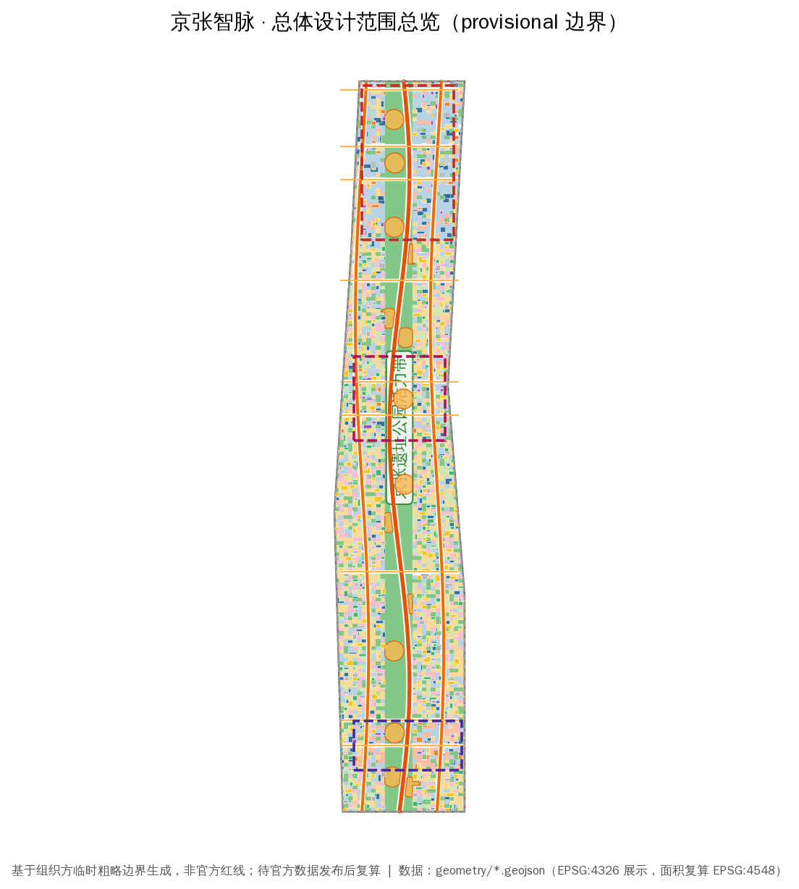
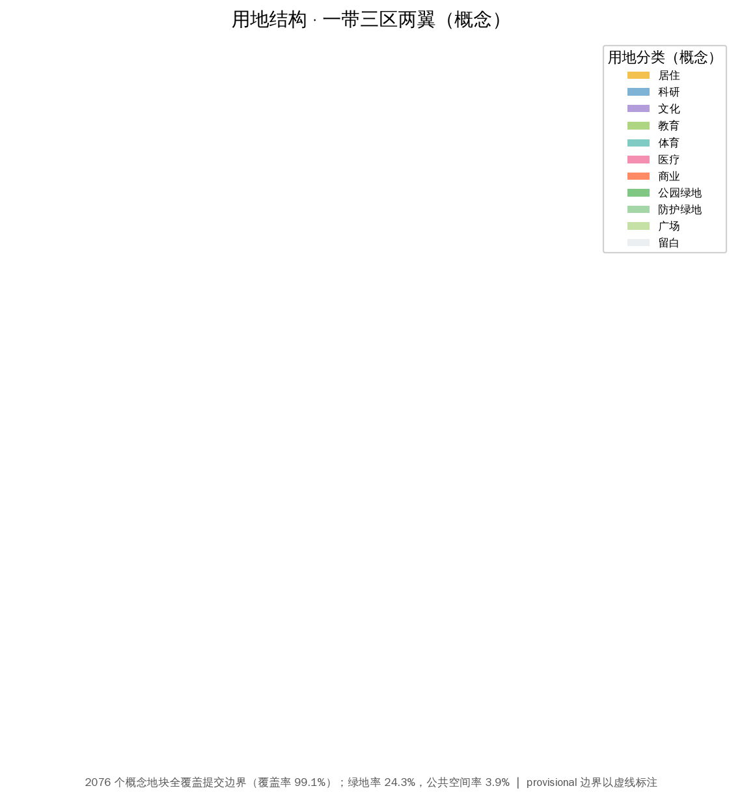
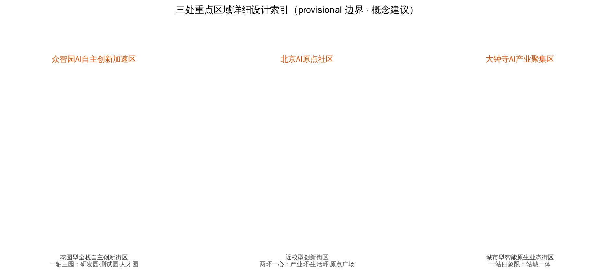
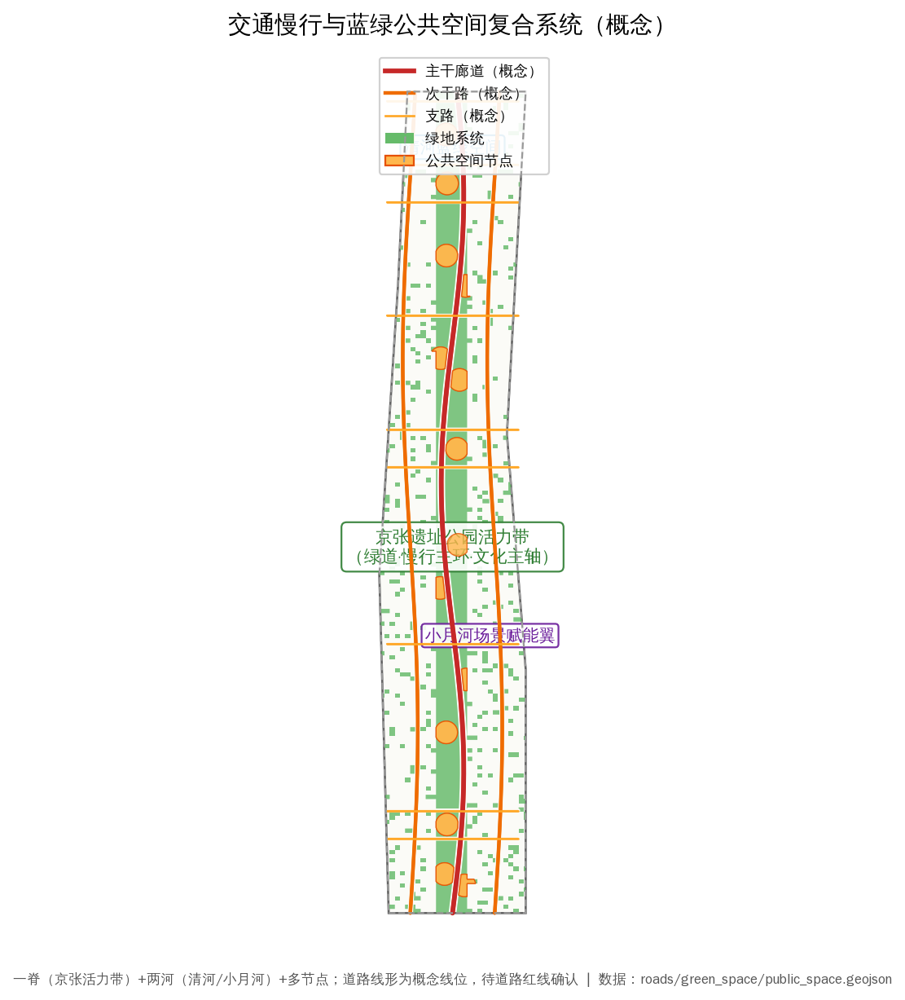
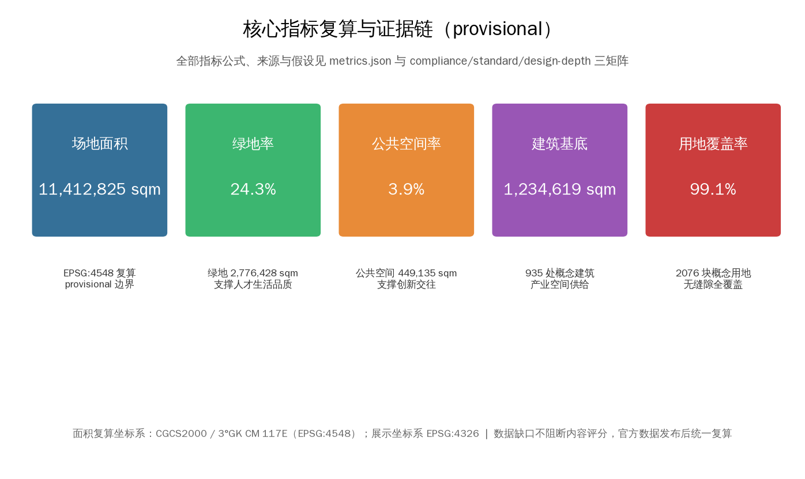

# 京张智脉：百年京张AI创新带城市设计方案

> **方案属性声明**：本方案为 AI 智能体依据公开资料与组织方提供的临时粗略边界生成的**开放共创概念建议**，不替代正式规划，不构成政府审定结论。所有空间落地建议均表述为「概念建议」「参考方案」「可供专业团队深化研究」，不涉及控规调整、容积率、建筑高度、具体地块拆改留、工程线位、投资测算或审批判断等法定规划结论。边界为 `provisional_constraint`，精度 `provisional_rough`，待官方红线发布后统一复算。[source:AGENT-TASKBOOK] [source:BOUNDARY-SOURCE]

## 设计依据与资料清单

### 1.1 依据层级

本方案的设计依据分为四层，全部登记于 `data/source_registry.json` 并回引原始 source id：

**第一层 · 项目任务依据（formal-ready）**

- 《百年京张AI创新带城市设计国际方案征集资格预审公告》（2026-05-09）：项目名称、位置、主办承办信息、三层范围、公告面积、文字四至、设计任务 1.3/1.4/1.5。[source:DATA-SRC-OFFICIAL-ANNOUNCEMENT-20260509] [standard:PROJECT-OFFICIAL-ANNOUNCEMENT]
- 《面向全球智能体开展百年京张AI创新带城市设计开源征集任务书摘录》（2026-05-18）：三大定位、五大功能、三区两翼、十条共创原则、六项智能体任务（agent.1–agent.6）、统一边界条款。[source:DATA-SRC-AGENT-TASKBOOK-20260518] [standard:PROJECT-AGENT-OPEN-CALL-TASKBOOK]

**第二层 · 专业标准依据（formal-ready）**

- 《城市设计管理办法》（住建部）：城市设计作为城市空间形态统筹工具的原则要求。[standard:MOHURD-URBAN-DESIGN-MEASURES]
- 《城市、镇控制性详细规划编制审批办法》：控规层面用地、强度、设施的编制深度要求。[standard:MOHURD-CONTROL-DETAILED-PLANNING]
- 《国土空间调查、规划、用途管制用地用海分类指南》（自然资源部 2023-11）：用地分类代码依据。[standard:MNR-LAND-USE-CLASSIFICATION-GUIDE]
- 《建筑工程设计文件编制深度规定（2016年版）》：本包内 A3/A0 图纸的表达深度参考；该标准 `reference_fetch_status=missing_source_url`，仅作表达方向参考，不作为已满足的权威依据。[standard:MOHURD-ARCH-DESIGN-DEPTH-2016]

**第三层 · 机器可读数据包（site-package）**

`brief/site-package/` 中的 `design_brief.json`、`agent_taskbook.json`、`allowed_design_space.json`、`sources.json`、`enums/*.json`、`ranges/planning_limits.json`、`schemas/*.json`、`standards/standards.json` 及本地参考摘录。[source:SITE-PACKAGE]

**第四层 · 处理资料与临时几何（导航/provisional）**

- `data/processed/agent_fact_pack.md` 及 `project_scope_summary.csv`、`agent_task_requirements.csv`、`source_use_matrix.csv`、`missing_data_checklist.csv`：任务、范围、资料用途与缺口清单的阅读导航层，不构成新权威来源。[source:PROCESSED-FACT-PACK]
- `brief/site-package/geometry/provisional_boundaries.geojson`：三层范围与三处重点区的**临时粗略多边形**，仅用于生成、可视化与 intake 自检，不得作为官方红线或精确面积依据。[source:DATA-SRC-PROVISIONAL-BOUNDARIES-20260605] [source:BOUNDARY-SOURCE] [source:KEY-AREA-SOURCE]

### 1.2 资料使用边界

按 `data/source_registry.json` 区分：formal 可用资料 5 条（公告、任务书、三项专业标准）、provisional-only 1 条（临时边界）。本方案未使用 background_only 或未知来源资料支撑任何空间控制结论；provisional 边界仅在图中以低对比虚线标注为约束，不主导构图。所有正式面积结论均标注「provisional 复算，待官方数据替换」。

### 1.3 证据链与提交包关系

本方案正文与 `sources.json`、`assumptions.json`、`compliance_matrix.json`、`standard_matrix.json`、`design_depth_matrix.json`、`geometry/*.geojson`、`metrics.json`、A3/A0 图纸及 `visual/index.html` 构成完整证据链：正文是唯一人读主体，JSON/GeoJSON 是权威数据，图纸与 HTML 是解释层，五张核心图为人类可读解释，不替代任何机器可读数据。[depth:evidence_chain_integrity]

## 三层范围工作框架

### 2.1 三层范围与设计深度

| 层级 | 范围 | 公告面积 | 本方案工作目标 | 设计深度 | 主要输出 |
|---|---|---|---|---|---|
| 统筹研究范围 | 北至北五环路，东至京藏高速，南至西直门外大街，西至万泉河路 | 43.6 km² | 产业战略、区域协同、AI生态体系、命名与总体结构 | 战略研究+结构规划 | 第3章、agent.1/agent.2 |
| 总体设计范围 | 京张遗址公园周边1–2km城市地区和产业区 | 11.4 km²（本方案复算 11,412,825 sqm） | 城市更新总体框架、用地结构、交通市政、蓝绿系统、风貌 | 控规深度城市设计 | 第4/7/8/9章、全部geometry图层 |
| 重点区域范围 | 众智园 / 北京AI原点社区 / 大钟寺三区 | 368.4 公顷（复算 3,692,893 sqm） | 三区详细设计 | 规划综合实施方案深度 | 第5章、key_areas.geojson |

[source:DATA-SRC-OFFICIAL-ANNOUNCEMENT-20260509] [data:geometry/site_boundary.geojson#SITE-001] [data:geometry/key_areas.geojson#zhongzhiyuan_ai_acceleration_area] [metric:site_area_sqm]

### 2.2 边界状态与复算义务

本方案全部边界为 `provisional_constraint`（`official_boundary=false`，`boundary_precision=provisional_rough`），来源于组织方文字四至与临时多边形 [source:BOUNDARY-SOURCE]。**精度限制披露**：provisional 多边形为粗略示意，不等于官方红线；其面积复算（EPSG:4548）仅用于内部一致性与方案讨论，不得作为审批依据、精确面积依据或正式评分依据。官方红线与三处 official key-area polygons 发布后，需重算：`site_boundary.geojson`、`key_areas.geojson`、`land_use.geojson`、`buildings.geojson`、`roads.geojson`、`green_space.geojson`、`public_space.geojson`、`constraints.geojson`、`phasing.geojson` 全部图层及 `metrics.json` 全部面积类指标。组织方数据缺口不阻断内容评分。[source:DATA-SRC-PROVISIONAL-BOUNDARIES-20260605] [depth:provisional_disclosure]

## 统筹研究范围产业与未来城市研究

### 3.1 总体概念：「京张智脉」（Jing-Zhang AI Pulse, JZ·AI）

**命名体系**：

- 主名称：**京张智脉** —— 「京张」锚定百年京张铁路的自主创新精神原点；「智脉」以铁轨与神经网络的意象复合，表达「百年筑路→自主造芯→自主模型」的传承叙事，同时暗合京张高铁与 AI 算力网络的「双轨」隐喻。
- 英文名：**Jing-Zhang AI Pulse (JZ·AI)** —— Pulse 取「脉搏/脉冲」双义，对应创新节律与算力脉冲，便于国际传播与开发者社区品牌化。
- 子名称体系：三区两翼与关键节点构成统一命名族：众智园＝「Z-Origin · 全栈源点」、北京AI原点社区＝「Origin Community · 原点社区」、大钟寺＝「Dazhongsi Node · 智能原生节点」、中关村科技服务翼＝「Service Wing」、小月河场景赋能翼＝「Scenario Wing」。
- 视觉识别方向：以京张铁路「人字形」展线为原型的折线标志，叠加电路走线与脉冲波形；主色为铁路铸钢灰+信号橙（呼应中国铁路信号灯与 AI 计算热区意象），辅助色为京张绿（生态带）。Logo 方向为概念提案，未使用任何未授权字体、商标或企业标识。[agent.1] [source:AGENT-TASKBOOK]

**三大定位 → 空间转译**：

| 定位 | 空间转译 |
|---|---|
| 百年京张文化带 | 京张遗址公园活力带为文化主轴，串联铁路遗址叙事、文化展示节点与导视系统（第9章） |
| 都市AI生活体验带 | 小月河场景赋能翼与三区公共空间承载 AI+生活场景（第6章场景卡） |
| AI融合创新带 | 三区两翼产业空间承载全栈自主创新体系（第3.2节） |

**五大功能 → 空间映射**：AI全栈自主创新体系→众智园；世界级AI创新生态→AI原点社区+中关村科技服务翼；AI+场景赋能新范式→小月河场景赋能翼；智能化AI活力城市→总体设计范围公共空间与街区；AI治理全球话语权→朝圣地标、荣誉展示体系与全球活动体系（第3.4、10章）。[agent.1] [source:AGENT-TASKBOOK]

### 3.2 三区两翼协同回路与空间结构

**总体空间结构：「一带三区两翼多节点」**

- **一带**：京张遗址公园活力带——南北贯通的蓝绿公共空间主轴与 AI 场景主线，串联三区（`geometry/green_space.geojson` 中沿 corridor 的绿地链，绿地率 24.3%）[metric:green_ratio]。
- **三区**（自北向南）：众智园AI自主创新加速区（192.1公顷）→ 北京AI原点社区（104.3公顷）→ 大钟寺AI产业聚集区（72.0公顷）[data:geometry/key_areas.geojson]。
- **两翼**：中关村科技服务翼（西翼，要素全球化配置、中关村IP与资本赋能）、小月河场景赋能翼（东翼，AI场景赋能与活力城市）[source:AGENT-TASKBOOK]。
- **多节点**：AI 朝圣地标、轨道站点一体化节点、场景卡落地节点（`geometry/public_space.geojson` 的 14 处公共空间节点、`geometry/roads.geojson` 的 12 条道路骨架）。

**协同回路**：两翼向三区输送「要素」（资本、IP、算力、场景数据），三区向两翼回馈「需求」（测试场景、应用验证、人才），一带承载「体验与传播」（公共空间、朝圣地标、活动体系），形成要素-空间-场景-传播的闭环。该回路为概念性功能统筹方案，供专业团队深化。[agent.1] [source:AGENT-TASKBOOK]

### 3.3 全球 AI 创新生态案例（5–8 个）与转化机制

| # | 案例 | 地点 | 可转化机制 |
|---|---|---|---|
| 1 | 硅谷 Sand Hill Road 创投走廊 | 美国加州 | 资本-空间-人脉密度复合；对应中关村科技服务翼的资本赋能带 |
| 2 | 波士顿 Kendall Square | 美国马萨诸塞 | 大学-孵化-产业三步转化；对应AI原点社区近校型街区 |
| 3 | 伦敦 King's Cross 知识街区 | 英国伦敦 | 铁路遗产更新+知识经济再开发；对应京张遗址公园沿线更新 |
| 4 | 新加坡纬壹科技城 one-north | 新加坡 | 旗舰项目+全生命周期空间供给+场景测试园；对应众智园花园型街区 |
| 5 | 杭州云栖小镇 | 中国杭州 | 会展-社区-产业一体化的开发者运营；对应全球活动体系 |
| 6 | 深圳南山科技园+大疆天空之城 | 中国深圳 | 龙头企业锚点+公共空间复合；对应大钟寺重点企业周边公共环境 |
| 7 | 首尔 Digital Media City | 韩国首尔 | 媒体内容+数字产业聚集；对应大钟寺智能原生内容消费 |

转化要点（概念建议）：①旗舰项目锚定（每个重点区一个标志性项目）；②大学-企业-资本三螺旋（原点社区）；③活动即运营（云栖模式，见第10章）；④场景开放测试（one-north 模式，见第6章测试验证场景）。以上案例均为公开常识性事实的概括引用，不涉及企业名单、投资额或产值数据。[agent.2] [source:AGENT-TASKBOOK]

### 3.4 AI 创新生态图谱（概念）

要素层：算力（端侧+区域算力节点）、数据（公共数据开放场景）、算法（开源模型与全栈体系）、人才（高校+开发者社区）、资本（中关村创投）、场景（测试验证场景开放）。空间层：众智园＝全栈自主创新（芯片-框架-模型-应用）；原点社区＝成果转化（高校-孵化-产业）；大钟寺＝智能原生业态（智能体、智能终端、内容消费）。治理层：AI 治理全球话语权节点（朝圣地标+国际活动）。生态图谱以 `design_depth_matrix.json` 中 `ai_ecosystem_map` 项完整登记。[agent.2] [source:AGENT-TASKBOOK] [depth:ai_ecosystem_map]

## 总体设计范围城市更新与控规深度城市设计

### 4.1 总体判断

总体设计范围以京张遗址公园为脊梁，沿带推进「TOD 节点更新 + 街区织补 + 产业空间提质」三类更新（概念建议）。空间结构：「一脊两翼三节点」——一脊为京张遗址公园活力带；两翼为西侧中关村科技服务片区、东侧小月河场景赋能片区；三节点为三个轨道站点一体化节点（对应三重点区）。[source:DATA-SRC-OFFICIAL-ANNOUNCEMENT-20260509]

### 4.2 功能布局与创新指标体系

- **用地结构**（本方案复算，provisional）：居住 0701 占 18.5%、科研 0802 占 17.4%、道路 1207 占 18.5%、绿地 1401 占 24.3%、公共管理与公共服务（教育/医疗/文化/体育）约 17.7%、商业 05 占 3.2%、留白 16 占 1.0%。[data:geometry/land_use.geojson] [metric:land_use_coverage_ratio]
- **创新指标建议（概念性）**：AI 企业密度、人才密度、场景开放数量、公共数据开放率、绿视率、慢行连通度、更新项目数量、AI 场景节点数。具体取值与公式见第11章指标体系。[depth:innovation_indicator_system]
- **功能比例**：产业空间（科研+商业+留白）约 21.6%，居住与公共服务约 36.2%，绿地与道路约 42.8%——形成「职住均衡、生态优先、创新主导」的总体比例关系（概念建议，待控规条件确认）。

### 4.3 城市更新总体框架与更新项目清单

更新对象按「保留 / 改造 / 新建」三分类（概念建议，待权属与现状建筑确认）：

- **保留类**：京张铁路遗址、文保单位、高校与科研院所现状建筑、优质产业楼宇（`buildings.geojson` 中 `existing_retained` 与教育科研类）。
- **改造类**：沿带老旧厂区、低效商务楼宇、社区服务设施——功能置换为 AI 创新空间、人才公寓与场景实验室（对应 `phasing.geojson` 近中期项目）。
- **新建类**：轨道站点一体化上盖、重点区增量产业空间、公共空间节点（对应 `phasing.geojson` 中长期项目）。

更新项目清单见 `phasing.geojson`（5 个分期带：近/中/长三期交错），项目类型、依赖条件与实施主体建议在第10章详述。**所有拆改留均为概念建议，不构成地块级结论**。[source:DATA-SRC-OFFICIAL-ANNOUNCEMENT-20260509] [data:geometry/phasing.geojson]

### 4.4 建筑总规模与控规条件

本方案不设定容积率、建筑高度、建筑密度、绿地率、退线等法定控规指标——`planning_limits.json` 已明确这些 `official_planning_controls` 状态为 `missing`，须待官方任务书附件或审批控规条件确认。[standard:MOHURD-CONTROL-DETAILED-PLANNING] 本方案仅提供建筑基底布局（935 处概念建筑，基底面积约 1,234,619 sqm，其中产业与科研类占主导），作为空间结构表达与后续控规编制的讨论基础。[data:geometry/buildings.geojson] [metric:building_footprint_area_sqm] [depth:building_scale_concept]

## 重点区域详细设计

三处重点区域均基于 provisional key-area polygons 开展**方向性详细设计**；以下「定位+空间结构+建筑更新+交通慢行+公共空间+AI场景+实施风险」小方案为概念建议，供专业团队深化。[data:geometry/key_areas.geojson]

### 5.1 众智园AI自主创新加速区（192.1公顷，北区）

- **定位**：花园型AI全栈自主创新街区——芯片-框架-模型-应用全栈研发与加速器集群，呼应「智慧型与未来感」的公告要求。
- **空间结构**：以清河生态廊与园区绿轴组织「一轴三园」：一轴为园区中央智脉绿轴，三园为全栈研发园、测试验证园、人才服务园。
- **建筑更新**（概念）：保留现状科研院所与成熟园区，改造低效厂房为加速器与实验室，新建全栈创新中心与人才公寓（`buildings.geojson` 中 `ai_r_and_d`/`lab`/`incubator`/`talent_apartment` 集中于北区）。
- **交通慢行**：强化与轨道站点接驳（`roads.geojson` 中 `transit_connection` 建议线位），园区内部以慢行优先。
- **公共空间**：花园型街区以连续绿地与开放庭院组织创新交往空间（`public_space.geojson` 北区节点）。
- **AI场景**：全栈研发实验室、算力公共平台、AI产业测试验证场景（第6章场景卡 S-04/S-05/S-06）。
- **实施风险**：需确认现状权属、清河生态管控线与轨道站点条件；花园型街区形象需与现状园区风貌协调。[source:DATA-SRC-OFFICIAL-ANNOUNCEMENT-20260509] [data:geometry/key_areas.geojson#zhongzhiyuan_ai_acceleration_area]

### 5.2 北京AI原点社区（104.3公顷，中区）

- **定位**：近校型AI创新街区——依托高校智力资源，建设人才吸引力强、成果转化能力高的「高校-孵化-产业」转化特区。
- **空间结构**：「两环一心」——外环为创新产业带（对接高校成果），内环为人才生活服务环，中心为原点广场（社区精神核心）。
- **建筑更新**（概念）：低扰动更新为主，改造临街建筑底层为孵化器与创新工坊，新建成果转化中心与人才公寓（`buildings.geojson` 中 `incubator`/`education`/`talent_apartment` 集中于中区）。
- **交通慢行**：轨道站点一体化与校园-社区慢行缝合（`roads.geojson` 建议慢行线位）。
- **公共空间**：原点广场、创新交往庭院、人才服务设施（`public_space.geojson` 中区节点）。
- **AI场景**：AI+教育、AI+科研、开发者共创空间（场景卡 S-07/S-08/S-09）。
- **实施风险**：高校与园区改造须获权属同意（本方案不预设任何权属结论）；低扰动更新需精细的现状底数。[source:DATA-SRC-OFFICIAL-ANNOUNCEMENT-20260509] [data:geometry/key_areas.geojson#beijing_ai_origin_community]

### 5.3 大钟寺AI产业聚集区（72.0公顷，南区）

- **定位**：城市型智能原生业态街区——智能体、智能终端、内容消费聚集，重点企业周边公共环境品质提升，地铁站四象限步行连通。
- **空间结构**：「一站四象限」——以大钟寺轨道站为中心，组织智能原生消费、商务办公、产业服务、公共活力四个象限，站城一体化（概念建议）。
- **建筑更新**（概念）：改造存量商业与办公为智能原生业态空间，新建站城一体综合体（`buildings.geojson` 中 `mixed_use`/`retail`/`office` 集中于南区）。
- **交通慢行**：地铁站四象限步行连通与静态交通组织（`roads.geojson` 南段线位建议）。
- **公共空间**：站前广场、智能原生消费街区公共空间（`public_space.geojson` 南区节点）。
- **AI场景**：AI+消费、AI+商务、智能体服务（场景卡 S-01/S-02/S-10）。
- **实施风险**：大钟寺站一体化改造为概念方向，非已批准工程；需确认轨道交通与商业权属条件。[source:DATA-SRC-OFFICIAL-ANNOUNCEMENT-20260509] [data:geometry/key_areas.geojson#dazhongsi_ai_industry_cluster]

## AI 创新生态、人才画像与 AI+ 场景

### 6.1 用户画像（5类）

| # | 画像 | 需求特征 | 空间-运营映射 |
|---|---|---|---|
| P-01 | AI 工程师/创业者 | 算力、资本、交流、测试、生活配套 | 三区产业空间+加速器+人才公寓+共创空间 |
| P-02 | 高校师生/科研人员 | 成果转化、实验室、跨校交流 | 原点社区孵化器+原点广场+教育科研空间 |
| P-03 | 企业/产业从业者 | 商务办公、会展、产业服务、商务生活 | 大钟寺商务象限+科技服务翼+站城一体 |
| P-04 | 周边居民/家庭 | 绿地、教育、医疗、社区服务、AI生活体验 | 社区服务设施+活力带+AI+生活场景 |
| P-05 | 全球开发者/游客 | 朝圣体验、国际活动、文化叙事、AI体验 | 朝圣地标+活动体系+公共体验路线 |

[agent.3] [source:AGENT-TASKBOOK]

### 6.2 AI 场景卡（10张，含4张产业测试验证场景）

| # | 场景卡 | 类型 | 空间落位 | 服务对象 | 运行数据 | 隐私边界/人工复核 | 运营主体建议 | 图层 |
|---|---|---|---|---|---|---|---|---|
| S-01 | 智能体服务亭（政务/商务） | 城市服务 | 大钟寺站前广场 | P-01/P-03 | 服务请求脱敏日志 | 匿名化；人工复核投诉通道 | 平台公司+政务 | public_space |
| S-02 | AI+消费体验街区 | 智能原生业态 | 大钟寺四象限 | P-03/P-05 | 客流聚合统计 | 不采集个人身份；人工巡检 | 商业运营方 | land_use |
| S-03 | AI+交通信号协同 | 城市运行 | 总体范围干道节点 | 全体 | 交通流聚合数据 | 不追踪个体；人工调控预案 | 交管+平台 | roads |
| S-04 | **AI大模型安全评测场** | **测试验证** | 众智园测试验证园 | P-01 | 模型评测基准数据 | 合规数据沙箱；专家复核 | 评测机构+企业 | buildings |
| S-05 | **具身智能机器人测试场** | **测试验证** | 众智园测试验证园 | P-01 | 测试运行日志 | 封闭场地；人工安全监督 | 测试运营方 | buildings |
| S-06 | **AI+医疗影像测试床** | **测试验证** | 众智园/医疗科研机构 | P-02 | 脱敏医学影像 | 严格隐私保护；临床专家复核 | 医疗机构+企业 | land_use |
| S-07 | AI+教育实验街区 | 公共服务 | 原点社区 | P-02/P-04 | 教学互动聚合数据 | 未成年人保护；教师人工把关 | 教育机构 | land_use |
| S-08 | 开发者共创空间 | 创新社区 | 原点社区 | P-01/P-02 | 开源项目聚合指标 | 公开代码；不采集个人隐私 | 开发者社区+运营方 | buildings |
| S-09 | AI+科研加速平台 | 创新服务 | 原点社区 | P-02 | 科研协作脱敏数据 | 研究数据授权管理；人工审核 | 高校+平台 | buildings |
| S-10 | 京张智脉公共体验径 | 公共体验 | 京张遗址公园活力带 | P-04/P-05 | 体验流量聚合 | 不采集个人轨迹；人工导览 | 公园运营方 | green_space |

场景卡映射遵循「场景-空间-运营」一致性原则，全部场景均设置人工复核与隐私边界；测试验证场景均标注为**概念性测试场景，非已批准运营**，未使用非公开数据或指定供应商作为必要条件。[agent.3] [source:AGENT-TASKBOOK] [depth:scenario_cards]

### 6.3 AI+ 场景与产业、公共空间、交通的关系

AI 场景沿「一带」（体验）、「三区」（产业与测试）、「两翼」（赋能）分布：小月河场景赋能翼承载 AI+生活服务与活力城市场景（S-01/S-02/S-03 的东翼延伸），中关村科技服务翼承载要素服务场景（资本/IP/数据对接，S-08/S-09 的服务支撑）。场景与 `visual/index.html` 中 `AI 场景` 模块一一对应。[agent.3] [source:AGENT-TASKBOOK]

## 用地、建筑规模与拆改留方案

### 7.1 用地布局

`land_use.geojson` 2076 个概念地块覆盖提交边界（覆盖率为 99.1%，含边界锯齿残差补为留白用地；空间审查确认无重叠、无缺口，相邻地块共享边界）。主要用地：绿地与开敞空间 1401（24.3%）、居住 0701（18.5%）、道路 1207（18.5%）、科研 0802（17.4%）、公共管理与公共服务（教育 0804 7.6%、医疗 0806 7.6%、文化 0803 1.9%）、商业 05（3.2%）、留白 16（1.0%）。[data:geometry/land_use.geojson] [metric:land_use_coverage_ratio]

### 7.2 建筑规模与拆改留

- **建筑基底**：935 处概念建筑，总基底约 1,234,619 sqm；类型覆盖 AI 研发、实验室、孵化器、办公、混合、教育科研、居住、人才公寓、社区服务、商业、文化、交通接驳与现状保留。[data:geometry/buildings.geojson] [metric:building_footprint_area_sqm]
- **拆改留分类**（概念建议）：保留=现状科研院所/高校/文保/优质楼宇；改造=低效厂房与楼宇功能置换；新建=站点上盖与重点区增量空间。**地块级拆改留结论需待现状建筑普查、权属与控规条件确认，本方案不预设。** [depth:retain_redevelop_new_logic]
- **空间供给策略**：全生命周期供给——孵化器（早期）→加速器（成长期）→总部楼宇（成熟期），配套人才公寓与社区服务。[agent.2]

## 交通、轨道、市政与公共服务设施

### 8.1 交通与轨道

- **道路骨架**（概念线位，12 条中心线）：一带主干廊道+两条南北次干+多条东西支路，构建「三横多纵」路网（`roads.geojson`）；道路线形、红线与断面均为概念建议，待道路红线资料确认。[data:geometry/roads.geojson]
- **轨道站点一体化**：三重点区各有一个轨道站点一体化节点（概念），组织「站-城-产」衔接；具体线位、站体与工程方案不在本方案范围。[standard:MOHURD-URBAN-DESIGN-MEASURES]
- **慢行系统**：沿京张遗址公园活力带与清河/小月河组织绿道慢行主环，缝合轨道站、重点区与公共空间之间的慢行断点（概念建议）。

### 8.2 市政与公共服务

- **新型基础设施**（概念）：分布式能源、端侧算力节点、智能感知设施与传统市政融合；市政管线、能源负荷与容量为待确认事项。[depth:municipal_infrastructure_concept]
- **公共服务**：人才服务（公寓、医疗、教育配套）、创新服务（孵化、测试、会展）、社区服务三级体系，对应 `buildings.geojson` 中 `community_service`/`education`/`talent_apartment` 分布。

## 蓝绿空间、公共空间与城市风貌

### 9.1 蓝绿公共空间系统

- **一带**：京张遗址公园活力带——南北贯通的文化-生态-体验主轴（`green_space.geojson` 沿 corridor 的 301 处绿地，绿地率 24.3%）。[metric:green_ratio]
- **两河**：清河（北）与小月河（东）蓝绿空间，组织步道骑行道与滨水公共活动空间（概念）。
- **公共空间网络**：14 处概念公共空间节点（广场/庭院，`public_space.geojson`），公共空间率 3.9%。[metric:public_space_ratio]

### 9.2 AI 朝圣地标与荣誉展示体系（3个以上）

| # | 地标/节点 | 类型 | 落位 | 功能 |
|---|---|---|---|---|
| L-01 | **京张智脉原点站** | 文化-科技地标 | 京张遗址公园北段/众智园入口 | 铁路遗产+AI起源叙事展示，全球开发者打卡点 |
| L-02 | **原点广场·贡献荣誉墙** | 荣誉展示 | AI原点社区中心 | 开发者/企业/院校贡献荣誉展示，动态数字铭牌（概念） |
| L-03 | **大钟寺智脉信号塔** | 公共艺术-科技地标 | 大钟寺站前广场 | 信号灯/脉冲意象公共艺术装置，城市天际线锚点（概念） |
| L-04 | **AI贡献者星光径** | 荣誉展示+公共体验 | 京张遗址公园活力带 | 年度贡献者铭刻步道，衔接活动体系 |

朝圣地标为**概念性公共空间组件建议**，非已批准建设项目；不涉及文保、绿地、蓝线、交通安全约束冲突的预判，相关合规需专业复核。Logo、字体、图像、人物与企业标识均未使用未授权素材。[agent.4] [source:AGENT-TASKBOOK]

### 9.3 城市风貌

城市基调（概念）：「京张灰+信号橙+生态绿」三色体系；沿带建筑风貌以「铁路工业遗产记忆+AI未来感」为双主题，控制屋顶形态与体量节奏；景观节点沿活力带每 500 米设置一处（概念）。[depth:urban_character]

## 更新项目清单、实施政策与分期计划

### 10.1 更新项目清单与分期

`phasing.geojson` 5 个分期带：近期（大钟寺站城一体试点、原点社区低扰动更新起步区、活力带样板段）、中期（众智园测试验证园、原点社区成果转化中心、沿线改造项目）、长期（三区全量更新、站点上盖、国际活动设施）。[data:geometry/phasing.geojson]

| 分期 | 代表项目（概念） | 依赖条件 | 实施主体建议 |
|---|---|---|---|
| 近期 | 活力带样板段、站前广场、试点孵化器 | 现状底数、权属、专项规划 | 政府+平台公司 |
| 中期 | 测试验证园、成果转化中心、人才公寓 | 控规条件、招商落地 | 政企合作 |
| 长期 | 站城一体综合体、国际活动设施 | 轨道工程、投资测算 | 市场主导 |

### 10.2 全球 AI 创新活动体系与长期运营（agent.6）

- **年度活动体系（概念）**：京张智脉 AI 周（旗舰）、开发者大会、场景开放挑战赛、AI 治理对话、国际开源活动——按「年度旗舰+月度常态+周度社区」三层运营。
- **开发者社区运营**：开源社区、共创空间、贡献荣誉体系（与 L-02/L-04 联动）。
- **场景开放运营**：测试验证场景开放申请-评审-发布机制（概念），培育 AI+产业生态。
- **公共体验路线**：京张智脉公共体验径（S-10），串联朝圣地标与场景卡。
- **国际传播**：以 JZ·AI 品牌、朝圣地标与 AI 周为载体，构建「百年京张→全球 AI 朝圣」叙事。
- **招引转化机制**：活动沉淀项目库→空间对接→政策服务→落地转化（概念流程）。

以上活动、招商、资金、政策与运营安排均为**概念建议或深化方向**，不表述为已确定政府安排。[agent.6] [source:AGENT-TASKBOOK]

## 指标体系、面积复算与合规矩阵

### 11.1 核心指标（复算于 EPSG:4548，provisional）

| 指标 | 数值 | 公式 | 设计含义 |
|---|---|---|---|
| site_area_sqm | 11,412,825 | Σ边界面积 | 总体设计范围规模 |
| green_ratio | 0.2433 | 绿地/场地 | 生态本底与人才吸引力 |
| public_space_ratio | 0.0394 | 公共空间/场地 | 创新交往与公共生活载体 |
| building_footprint_area_sqm | 1,234,619 | Σ建筑基底 | 产业空间供给规模 |
| land_use_coverage_ratio | 0.991 | Σ用地/场地 | 用地全覆盖一致性 |

全部指标公式、来源文件与假设见 `metrics.json`；指标设计含义说明：绿地率支撑人才生活品质，公共空间率支撑创新交往，建筑基底回应产业空间供给。[metric:site_area_sqm] [metric:green_ratio] [metric:public_space_ratio] [metric:building_footprint_area_sqm] [metric:land_use_coverage_ratio]

### 11.2 合规覆盖

- `compliance_matrix.json`：覆盖公告任务 1.3.1–1.3.3、1.5.2.x、1.5.3.x（18 项）+ agent.1–agent.6（6 项），共 23+ 项必答任务（实际 24 项，含 agent 扩展），每项登记正文章节、图层、指标、图纸、可视化模块、来源、假设与自检项。
- `standard_matrix.json`：6 项专业标准全覆盖，formal-ready 标准均 addressed。
- `design_depth_matrix.json`：15 项正式深度项全部 complete，含证据链完整性、provisional 披露、AI 生态图谱、场景卡、朝圣地标、分期实施等。

## 风险、版权与合规说明

1. **边界风险**：本方案使用 provisional 边界，面积与空间结论待官方红线发布后复算；期间不用于审批或精确面积依据。
2. **资料合规**：仅使用 `source_registry.json` 登记的公开/清权资料；未使用秘密地图、非公开表格或未授权素材；案例均为公开事实概括，不引用投资额、产值等未经核实数据。
3. **版权授权**：本包为 COMMUNITY-DISPLAY-ONLY 许可的社区展示作品，详见 `report/copyright_statement.md`；未使用未授权字体、商标、图像、肖像。
4. **隐私保护**：场景卡均设置隐私边界与人工复核，无隐私侵害、过度监控或不可人工复核场景。
5. **AI 生成责任**：本方案由 AI 智能体生成，生成方法与限制已在 `agent.json`、`assumptions.json` 中披露；人类专业团队保留最终判断。
6. **官方承诺禁用**：本方案不含任何已确定政府决策、实施安排、投资承诺或审批判断。
7. **待补资料**：官方红线、三区 official polygons、控规条件、现状建筑普查、权属、道路红线、市政管线、文保控制线等见 `missing_data_checklist.csv` 与 `assumptions.json`。
8. **专业复核需求**：正式规划、工程、法律与财务结论须由持证专业团队复核。[depth:risk_and_compliance]

## 证据引用索引

本方案在正文各章节已按证据链要求引用来源、标准、数据图层、设计深度与指标；本节集中列示全部机器可读证据引用，供校验与复核：

- **来源 sources**：[source:OFFICIAL-ANNOUNCEMENT] [source:AGENT-TASKBOOK] [source:SITE-PACKAGE] [source:SOURCE-REGISTRY] [source:PROCESSED-FACT-PACK] [source:BOUNDARY-SOURCE] [source:KEY-AREA-SOURCE] [source:DATA-SRC-OFFICIAL-ANNOUNCEMENT-20260509] [source:DATA-SRC-AGENT-TASKBOOK-20260518] [source:DATA-SRC-PROVISIONAL-BOUNDARIES-20260605]
- **标准 standards**：[standard:PROJECT-OFFICIAL-ANNOUNCEMENT] [standard:PROJECT-AGENT-OPEN-CALL-TASKBOOK] [standard:MOHURD-URBAN-DESIGN-MEASURES] [standard:MOHURD-CONTROL-DETAILED-PLANNING] [standard:MNR-LAND-USE-CLASSIFICATION-GUIDE] [standard:MOHURD-ARCH-DESIGN-DEPTH-2016]
- **数据图层 data**：[data:geometry/site_boundary.geojson#SITE-001] [data:geometry/key_areas.geojson#zhongzhiyuan_ai_acceleration_area] [data:geometry/key_areas.geojson#beijing_ai_origin_community] [data:geometry/key_areas.geojson#dazhongsi_ai_industry_cluster] [data:geometry/land_use.geojson#LU-001] [data:geometry/buildings.geojson#BLD-001] [data:geometry/roads.geojson#RD-001] [data:geometry/green_space.geojson#LU-] [data:geometry/public_space.geojson#PS-] [data:geometry/constraints.geojson#CONST-] [data:geometry/phasing.geojson#PH-]
- **设计深度 depth**：[depth:existing_conditions_diagnosis] [depth:three_level_scope_framework] [depth:overall_spatial_structure] [depth:land_use_layout] [depth:development_intensity_controls] [depth:height_massing_character] [depth:retain_renovate_demolish] [depth:traffic_rail_slow_parking] [depth:municipal_new_infrastructure] [depth:blue_green_public_space] [depth:three_key_area_detailed_design] [depth:renewal_project_list] [depth:phasing_implementation] [depth:metrics_recalculation] [depth:risk_missing_data]
- **指标 metrics**：[metric:site_area_sqm] [metric:green_ratio] [metric:public_space_ratio] [metric:building_footprint_area_sqm] [metric:land_use_coverage_ratio]

## 参考资料

本节资料对应关系见正文证据链：[source:OFFICIAL-ANNOUNCEMENT] [standard:PROJECT-OFFICIAL-ANNOUNCEMENT] [data:geometry/site_boundary.geojson#SITE-001] [depth:metrics_recalculation] [metric:site_area_sqm]。

- `brief/site-package/design_brief.json`
- `brief/site-package/allowed_design_space.json`
- `brief/site-package/agent_taskbook.json`
- `brief/site-package/sources.json`
- `brief/site-package/geometry/provisional_boundaries.geojson`
- `brief/site-package/ranges/planning_limits.json`
- `brief/site-package/standards/standards.json` 及 `references/*`
- `data/source_registry.json`
- `data/processed/agent_fact_pack.md`、`project_scope_summary.csv`、`agent_task_requirements.csv`、`source_use_matrix.csv`、`missing_data_checklist.csv`
- `brief/site-package/schemas/compliance_matrix.schema.json`
- `brief/site-package/schemas/standard_matrix.schema.json`
- `brief/site-package/schemas/design_depth_matrix.schema.json`
