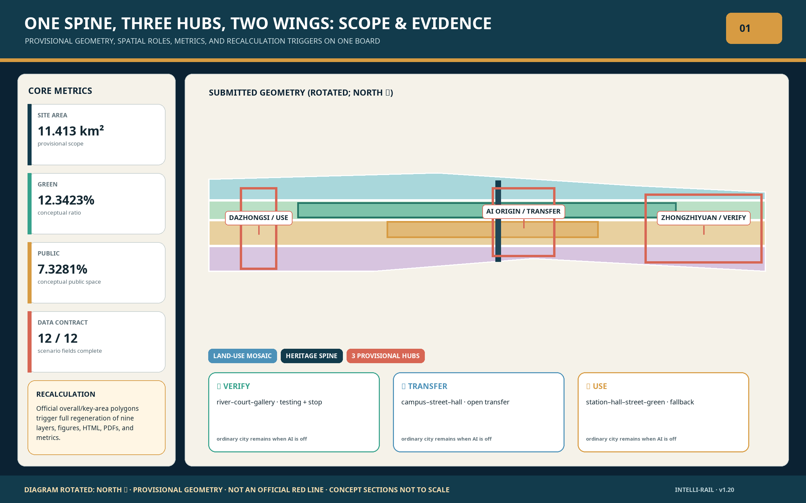
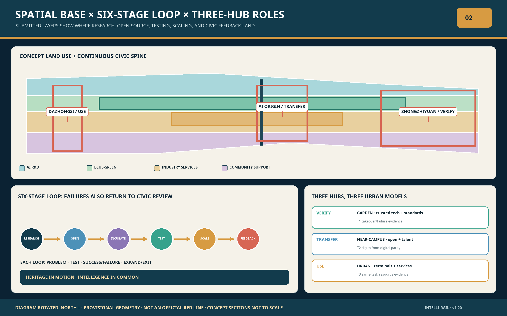
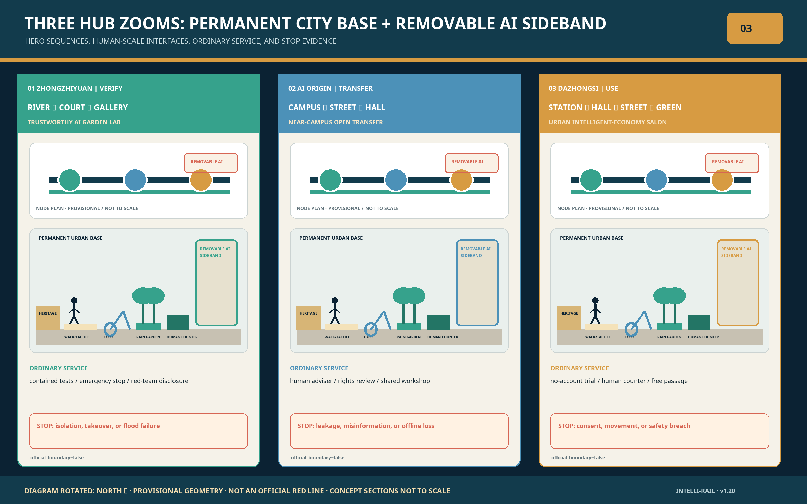
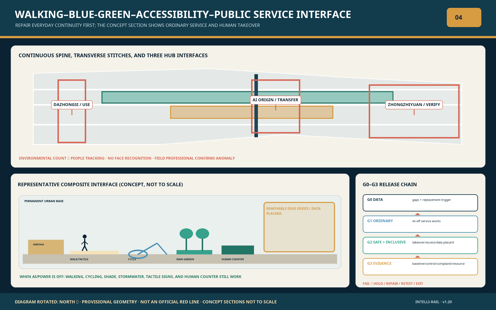
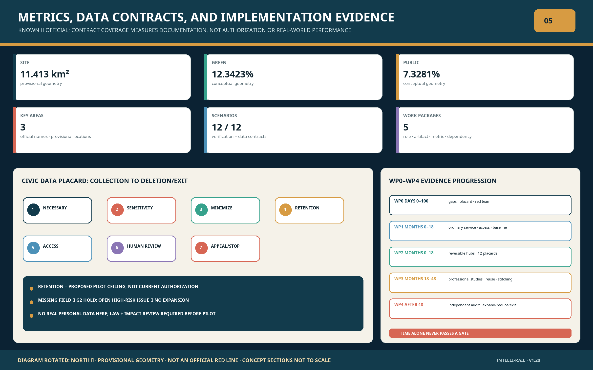

# Jing-Zhang Intelli-Rail

**Centennial Jing-Zhang AI Innovation Belt Urban Design / Heritage in Motion, Intelligence in Common**

Jing-Zhang Intelli-Rail is not a technology showroom arranged along a park. It is a civic innovation operating system whose base layer is public space. The railway legacy supplies continuity through time; three hubs provide distinct industry and daily-life anchors; two transverse service wings connect universities, companies, neighbourhoods, and waterways; twelve scenarios operate only when they are reversible, auditable, and supervised by people. The central proposition is that an AI district succeeds when knowledge reaches the street, technology accepts public scrutiny, and residents share the value of renewal.

## Design Basis and Source List

The official qualification announcement is the primary source for scope and professional tasks. The repository agent_taskbook.json defines the open Agent call, while enums, standards, missing-data registers, and provisional geometry provide the machine-checkable contract. The announcement defines a coordinated research area of approximately 43.6 sq km (bounded by the North Fifth Ring Road, the Jingzang Expressway, Xizhimenwai Street, and Wanquanhe Road); an overall design area of approximately 11.4 sq km covering the urban and industrial districts within 1–2 km of the Jing-Zhang Railway Heritage Park; and 368.4 ha of key areas comprising, from north to south, Zhongzhiyuan AI Independent Innovation Acceleration Area (approx. 192.1 ha), Beijing AI Origin Community (approx. 104.3 ha), and Dazhongsi AI Industry Cluster (approx. 72.0 ha). These announced scales describe the three levels of work; they are not recast as surveyed legal boundaries.[source:OFFICIAL-ANNOUNCEMENT]

Evidence is separated into four levels: official sources and standards; processed navigation; replaceable provisional constraints; and international references. sources.json and assumptions.json prevent a lower level from silently becoming an official control. All maps and metrics read the submitted GeoJSON. When official polygons arrive, all nine geometry layers, every spatial metric, five figures, bilingual HTML, and four PDFs must be regenerated together.[source:SOURCE-REGISTRY]

SITE-001 and PROV-KEY-001/002/003 are provisional_constraint features with official_boundary=false. A public repository audit records a 412.5 m nearest distance between the provisional overall polygon and the OSM-mapped heritage park; that background comparison cannot adjudicate the legal boundary. The Dazhongsi provisional key area may also be materially displaced from its real anchor. The package therefore claims reviewable design content, not statutory location or approval.[data:geometry/site_boundary.geojson#SITE-001]

This pull request belongs to the open Agent contribution route. It does not replace legal-entity qualification, prequalification, consortium, or offline delivery requirements in the professional competition.[standard:PROJECT-OFFICIAL-ANNOUNCEMENT]

Structural statements from the announcement and taskbook are matched section by section. The three positioning statements—the Centennial Jing-Zhang Cultural Belt, the Urban AI Life Experience Belt, and the AI Convergence Innovation Belt—are carried by the cultural-narrative, scenario-and-public-space, and industry-ecosystem chapters respectively. The five functions, the three zones and two wings, and the "two districts, one belt" industrial linkage are indexed below; the item-level mapping for agent.1–agent.6 is registered in compliance_matrix.json.[source:AGENT-TASKBOOK]

| Taskbook element | Official statement | Where this proposal responds |
| --- | --- | --- |
| Positioning 1 | Centennial Jing-Zhang Cultural Belt | Heritage-spine continuity, Jing-Zhang Memory Route, Centennial Zero Kilometre landmark |
| Positioning 2 | Urban AI Life Experience Belt | Twelve AI-enabled scenarios, three-tier public-space programming, accessible loop |
| Positioning 3 | AI Convergence Innovation Belt | Six-stage innovation loop, three-hub industrial division, three validation sandboxes |
| Function 1 | Full-Stack Independent AI Innovation System | Trustworthy-technology testing, standards collaboration hall, safety-governance gallery at Zhongzhiyuan |
| Function 2 | World-Class AI Innovation Ecosystem | Near-campus transfer, open-source release hall, global case studies at the Origin Community |
| Function 3 | AI-Enabled Scenario Paradigm | Xiaoyue River Scenario Enablement Wing, twelve scenario cards, scenario exit-valve mechanism |
| Function 4 | Intelligent and Vibrant AI City | Walking-and-cycling spine, Civic Loop Theatre, intelligent-terminal street |
| Function 5 | Global Voice in AI Governance | Data-compliance salon, model-card displays, public appeals and independent audit |
| Spatial structure | Three Zones and Two Wings | One spine, three hubs, two wings, multiple nodes (mapped in the next chapter) |
| Industrial linkage | "Two districts, one belt" coordination | Differentiated three-hub division and transverse wing stitching |

Every promise in the prose maps to a file in this package:

| Deliverable | Package files |
| --- | --- |
| Bilingual proposal text | proposal.md, proposal.en.md |
| Rendered reading edition (bilingual) | report/proposal.html, report/proposal.en.html |
| Nine spatial layers | geometry/*.geojson |
| Core metrics and recalculation basis | metrics.json |
| Compliance, standards, and design-depth matrices | compliance_matrix.json, standard_matrix.json, design_depth_matrix.json |
| Source grading and assumption records | sources.json, assumptions.json |
| Four-gate self-check report | self_check.json |
| Five figures (zh and en) | assets/figures/*.png |
| A3 booklet and A0 boards (zh and en) | drawings/*.pdf |
| Offline visual page (bilingual) | visual/index.html, visual/index.en.html |
| Iteration record | changelog.md |

## Three-Level Scope Framework

The three levels form a strategy-to-structure-to-project chain, with operational evidence feeding back in the opposite direction. The coordinated research area frames innovation, talent, and culture; the overall design area frames renewal, land use, blue-green mobility, and services; the three key areas frame programmes, ground-floor interfaces, transport links, and test projects. Each level is tied to a report section, spatial object, metric, and implementation trigger.[depth:three_level_scope_framework]

| Level | Question | Intelli-Rail response | Verifiable evidence |
| --- | --- | --- | --- |
| Coordinated research | How can an AI ecosystem benefit urban life? | Research, open source, incubation, testing, scaling, and civic feedback form a six-part loop | sources.json and compliance_matrix.json |
| Overall design | How can 11.4 sq km become connected without becoming generic? | One spine, three hubs, two wings, and multiple civic nodes | land_use.geojson and roads.geojson |
| Key areas | How do three hubs avoid duplication? | Trustworthy technology at Zhongzhiyuan, near-campus transfer at Origin Community, and urban application at Dazhongsi | key_areas.geojson and A0 boards |

The structure is one spine, three hubs, two wings, and multiple civic nodes. The three hubs and two wings directly inherit the taskbook spatial structure and keep its official division of roles: Zhongzhiyuan carries the full-stack independent AI innovation system and global voice in AI governance; the Origin Community carries the world-class AI innovation ecosystem; Dazhongsi carries intelligent-native new business. The Zhongguancun Technology Services Wing provides global factor allocation with Zhongguancun IP and capital enablement; the Xiaoyue River Scenario Enablement Wing provides scenario enablement and intelligent urban vitality. The spine and the nodes form the public-space layer added on top: the spine combines railway heritage, parkland, walking, cycling, and civic activity, while the nodes comprise twelve AI-enabled scenarios, four cultural landmarks, and ten renewal projects. This is a relational rule, not a new red line.[data:geometry/roads.geojson#ROAD-001]

## Coordinated Research Area: Industry and Future City Research

The ecosystem is organised as six connected stages aligned with Haidian's "1+X+1" industry system: research creates knowledge; open-source communities make it collaborative; incubation and professional services reduce the cost of company formation; bounded urban testbeds produce evidence; anchor firms and procurement enable scaling; public evaluation and maintenance data return to research. Every stage receives at least one publicly legible interface so that innovation is not confined to closed campuses.[source:AGENT-TASKBOOK]

Seven primary-source cases inform mechanisms rather than targets. Kendall Square links innovation to housing, transit, active ground floors, and public space. one-north places research, enterprises, incubators, and daily services within a walkable network. 22@Barcelona coordinates industrial renewal, infrastructure, and mixed use. Paris-Saclay demonstrates multi-institution testing and ecological evaluation. Seoul DMC links digital industries, culture, and public place. Kalasatama starts with daily benefit and carbon neutrality. Quayside demonstrates democratic accountability, design review, and stakeholder participation for digital systems.

| Case | Transferable mechanism | Local application | Not transferred |
| --- | --- | --- | --- |
| Kendall Square | Mixed use, transit, innovation space | Dazhongsi ground floors and small-firm space | Development intensity |
| one-north | Research-to-enterprise proximity | Shared testing, release, and talent services | Estate size and lease policy |
| 22@Barcelona | Heritage, infrastructure, and mixed renewal | Railway reuse and phased project bank | Land law and statutory ratios |
| Paris-Saclay | Joint experiments and evaluation | Three controlled testbed types | Regional statistics |
| Seoul DMC | Digital content plus public realm | Dazhongsi terminal and content interfaces | Industry quotas |
| Kalasatama | Resident participation and low-carbon pilots | Community services in the Xiaoyue River wing | Population targets |
| Quayside | Digital accountability and review | Data cards, appeals, and exit mechanisms | Previous technology proposal |

Future-city performance is measured by walkability, public-space continuity, access to low-cost innovation space, visible resident benefit, data minimisation, human-review response, universal access, and carbon impact—not by screen count.[depth:overall_spatial_structure]

## Overall Design Area: Urban Renewal and Regulatory-Plan-Level Urban Design

The heritage spine is the civic base layer. Four conceptual land-use zones fully cover the provisional boundary: AI research and innovation; blue-green and open space; industry and commercial services; and community services. The spine prioritises continuous walking and cycling, stormwater, heritage interpretation, and open activity. Transverse links connect rail stations, campuses, neighbourhoods, and waterways. Renewal concentrates on already built areas rather than consuming the continuous green system.[data:geometry/land_use.geojson#LU-001]

The identity is JING-ZHANG INTELLI-RAIL. A double-line graphic language pairs deep navy for engineering history, jade green for open ecology, and warm brass nodes for knowledge entering public life. Linear wayfinding, kilometre markers, tactile ground bands, and low night lighting create continuity without using corporate logos or portraits.

Renewal uses five categories: retain, repair, adaptive reuse, add, and verify. Heritage structures and places of public memory are retained subject to heritage review. Reusable industrial or inefficient ground floors become workshops, exhibitions, community services, and small-firm space. New volume proceeds only after ownership, fire, structure, and statutory controls are confirmed. The building layer is a design footprint sample, not an existing-building survey.[depth:retain_renovate_demolish]

Ten projects make the framework actionable: heritage-spine continuity; North Fifth Ring walking connection; Qinghe innovation bank; Origin transfer street; Dazhongsi four-quadrant link; shared service stations; low-carbon edge-compute stops; an accessible loop; open-scenario nodes; and a Jing-Zhang digital archive. FAR, height, density, road red lines, setbacks, and capacity await official controls (see the metrics chapter).[standard:MOHURD-CONTROL-DETAILED-PLANNING]

## Detailed Design of Key Areas

Each hub has a distinct public value, industry task, spatial action, and validation threshold; positional accuracy is subject to the provisional-geometry limits stated in the Design Basis chapter, and building-scale and demolish–renovate–retain decisions await official mapping.[data:geometry/key_areas.geojson#PROV-KEY-001]

### Zhongzhiyuan AI Independent Innovation Acceleration Area

A garden-type trustworthy AI laboratory. The hub answers the announcement's call for "a garden-type AI innovation block that is smarter and more future-facing": intelligence and future character come from garden-type block design, not from stacks of devices. The public value turns standards, safety, and independent technology from closed testing into legible public knowledge, following the announcement's path of seizing the national AI platform opportunity and advancing standards-setting and safety governance. A Qinghe-facing low-carbon interface links shared test courts, standards collaboration, safety-governance displays, and small meeting spaces; external transport connects to the announced Fifth Ring area integration planning, and buildings, green space, and water systems are organised as one design. Flood control, transport, ownership, and test safety are prerequisites, and any system without a safe takeover procedure is excluded from public operation.

### Beijing AI Origin Community

A near-campus open transfer neighbourhood. The hub answers the announcement's call for "a near-campus AI innovation block with stronger talent attraction, innovation vitality, and technology-transfer capacity." The public value shortens the distance from research results to entrepreneurship, employment, and community services: incubation and transfer zones organised around the original-innovation output of Tsinghua University, Peking University, and the Chinese Academy of Sciences, connected to the announced talent special zone, technology transfer, open-source system, and brand-event programmes. A transfer street connects open-source release, IP and legal services, prototyping, talent services, and short-stay housing. Walking and cycling stitch campus, park, community, and rail. Before campus interfaces, fire safety, research permissions, and housing conditions are confirmed, only civic events and service prototypes proceed.

### Dazhongsi AI Industry Cluster

An urban intelligent-economy salon. The hub answers the announcement's call for "an urban-type AI innovation block with stronger world influence and urban vitality." The public value turns agents, intelligent terminals, content consumption, and data governance into an accessible, supervisable city ground floor: it follows the announced lead-enterprise pull, cultivates AI-native and AI-plus business forms such as agents, terminals, and content consumption, and explores data-element and digital-asset circulation mechanisms. Transit integration and four-quadrant pedestrian continuity support an international release hall, terminal-experience street, data-compliance salon, and public green facilities (answering the announced mixed use of planned green space). The current provisional key area may be far from the real Dazhongsi anchor, so every location statement remains a recalculation hypothesis.

The hubs share booking, data-card, risk-tier, and appeal protocols but not a generic spatial template. Public, non-commercial programming is protected through future operating charters.[depth:three_key_area_detailed_design]

## AI Innovation Ecosystem, Personas, and AI+ Scenarios

Six personas are used as design and governance tests rather than advertising profiles: open-source maintainers need low-cost collaboration and accountable credit; start-ups need flexible space, compute, and professional services; researchers need permissions and cross-institution evaluation; anchor firms and international visitors need legible cooperation and compliance; residents need quiet, accessible daily life without tracking; operators need explainable alerts, manual action, and clear handover.[source:AGENT-TASKBOOK]

Twelve scenario cards define a carrier, benefit, data boundary, human review, and operator. They are: S01 Open-Source Release Hall; S02 Trustworthy AI Sandbox; S03 Edge-Compute Stop; S04 Walking-Gap Diagnosis; S05 Accessible Companion; S06 Qinghe Low-Carbon Corridor; S07 Research Transfer Street; S08 Talent Daily-Life Steward; S09 Intelligent-Terminal Street; S10 Data-Compliance Salon; S11 Jing-Zhang Memory Route; and S12 Global AI Week Route. None requires continuous individual tracking.[data:geometry/public_space.geojson#PUBLIC-001]

### Scenario depth: three sample journeys

**S02 Trustworthy AI Sandbox — a red-team testing day.** Journey: in the morning the evaluation body loads the candidate model and its test data card into an isolated environment; in the afternoon developers observe the automated evaluation while a safety officer holds the stop control; by evening the success, failure, and bias record is published, and systems below threshold leave the public-operation candidate list on the spot. Spatial interfaces: the test-court console, the standards-hall review bench, and the gallery's same-day results wall. Failure mode: an isolation breach or a takeover timeout pauses the whole court; a data-card violation terminates the test and triggers a thirty-day record review. Metrics: red-team case coverage, takeover response time, same-day publication rate.

**S05 Accessible Companion — a station-to-destination route.** Journey: a wheelchair user leaving the station receives three selectable routes (step-free, shaded, quiet); only aggregated guidance is shown, no face recognition is used, and the service exits on arrival. Spatial interfaces: the tactile exit band, rest-point help buttons, and a voice-guidance post that can be switched off. Failure mode: positioning drift beyond threshold degrades to a paper map and human guidance; once switched off, the route never re-prompts. Metrics: route completion rate, rest-point use frequency, switch-off rate, and appeal response time.

**S11 Jing-Zhang Memory Route — a one-hour railway walk.** Journey: starting from the Qinghuayuan Station imprint, the walk follows spine kilometre markers to the Centennial Zero Kilometre; each node offers a fact card, orally narrated audio with revocable authorisation, and a tactile map, ending at the Civic Loop Theatre with one public question. Spatial interfaces: kilometre markers, tactile maps, oral-history booths, and the theatre question wall. Failure mode: doubtful historical material is marked "under verification" and its audio withdrawn; revoked authorisation removes the content automatically. Metrics: dwell time per node, audio plays, and public questions added per year.

Three industrial testbeds make failure publishable. T1 tests navigation and micro-mobility only in controlled or low-risk settings with a safety operator able to take over. T2 asks residents, older adults, and disabled users to evaluate service access; misleading performance or complaint thresholds trigger shutdown. T3 discloses task energy, utilisation, and heat management; expansion requires independent confirmation of carbon benefit. Each test publishes success, failure, bias, and stop records.[depth:ai_scenarios_testbeds]

Scenarios are evaluated across public value, industrial value, risk, and reversibility. A proposal without an operator, appeal channel, deletion period, and removal plan cannot occupy public space.

Three original mechanisms run through the whole proposal and are named here. **Scenario Exit Valve**: every public scenario embeds a four-step threshold–pause–review–exit sequence; a breached metric triggers automatic degradation, a failed review triggers removal, and removal cost is assessed at design stage. **Civic Data Placard**: each scenario exposes exactly one standardised data statement—collection scope, retention period, purpose boundary, and appeal entry; no placard, no operation, and the placard is retired with the scenario. **Double-Track Identity**: a deep-navy line and a jade-green line run through every sign, kilometre marker, and interface in the belt, keeping engineering heritage and open ecology present at every touchpoint, with hub accent colours used only for layering, never for brand fragmentation.

## Land Use, Building Scale, and the Demolish–Renovate–Retain Strategy

land_use.geojson covers the provisional overall area with four conceptual categories. AI research zones support core R&D and shared laboratories; parks and open space protect ecological and civic continuity; industry and commercial service zones support transfer, events, and daily consumption; community zones add health, education, housing support, and local services. These are design relationships, not statutory land approvals.[standard:MNR-LAND-USE-CLASSIFICATION-GUIDE]

The submitted geometry recalculates to 11,412,825.386 sq m, a green ratio of 0.123423, a public-space ratio of 0.073281, and 310,807.184 sq m of design building footprint. Decimal precision is retained only to verify file consistency. In reader-facing terms these are approximately 11.41 sq km, 12.34 percent green space, 7.33 percent public space, and about 310,800 sq m of building footprint, all stated as provisional or conceptual.[metric:site_area_sqm]

Building control begins with safeguards rather than form. Retained assets are checked for heritage, structural, and use value; repaired assets improve safety, energy, and ground-floor access; adaptive reuse receives workshops, exhibitions, services, and small firms; additions require verified massing, daylight, fire, traffic, and ownership. FAR, total floor area, height, density, and setbacks await official data.[metric:building_footprint_area_sqm]

Materials are durable, repairable, and low carbon. Historic steel and masonry remain materially honest; new civic structures favour demountable timber-steel systems, shade, and low-level lighting. “Future” character must not depend on excessive screens, glow, noise, or displacement.

## Transport, Rail, Municipal Infrastructure, and Public Services

The network combines one continuous walking-and-cycling spine (the belt's Walking and Cycling Network), three types of transverse stitching, and multiple station interfaces. The spine separates walking, cycling, accessible movement, and maintenance where space permits. Transverse links connect campuses and parks, communities and services, and waterways and streets. Station work starts with direct walking paths, bicycle parking, ground-floor legibility, and safe night conditions. ROAD-001 is a design relation, not a road red line.[data:geometry/roads.geojson#ROAD-001]

Large roads, especially the North Fifth Ring, are continuity risks. The order of work is to improve existing crossings and wayfinding, test bridge-under spaces and light interventions, and only then compare new bridge or tunnel works. Any major crossing requires transport, structural, utility, fire, and accessibility studies.

Municipal design uses shared interfaces, district resilience, and measurable operations. Standard energy, communications, compute, and emergency interfaces serve the hubs; rain gardens, permeable surfaces, and shade accompany park renewal; edge compute prioritises existing rooms and recoverable heat. Utility, flood, fire, and power data are missing, so constraints.geojson remains empty rather than inventing lines.[depth:municipal_new_infrastructure]

Public services place daily needs first: community health, childcare, learning, sport, culture, and talent support should be walkable and share facilities off peak. International services add bilingual access without creating an enclave.

## Blue-Green Network, Public Space, and Urban Character

The blue-green system links railway heritage, Qinghe, Xiaoyuehe, campus edges, and neighbourhood open spaces as a spine, transverse corridors, and pocket nodes. Green space is not leftover between innovation buildings; it jointly supports thermal comfort, stormwater, biodiversity, everyday exercise, and informal exchange. Green and public-space ratios are recomputed from separate layers, even where functions overlap.[metric:green_ratio]

Four pilgrimage landmarks reject monumental spectacle. L1 Centennial Zero Kilometre combines engineering history with a tactile map. L2 Open-Source Contribution Wall records authorised projects, maintainers, and civic problems. L3 Trustworthy AI Beacon makes model cards, energy, risks, and stop records public. L4 Civic Loop Theatre holds annual discussions of scenario outcomes, resident feedback, and failures. Each landmark is low carbon, maintainable, updateable, accessible, and able to close quietly at night.[depth:blue_green_public_space]

Three timelines interweave: the Jing-Zhang Railway represents modern engineering and independent construction; Zhongguancun represents research and enterprise culture; new AI culture represents open collaboration, responsible innovation, and participation. Historic material is never reduced to a technology backdrop. Exact links to Qinghuayuan Station and Dazhongsi await official boundaries and heritage data.

Public-space programming follows a hierarchy: quiet daily use; community markets, lessons, and small events; then citywide developer and international events. Attendance, noise, security, transport, and removal plans scale with the programme level.[standard:MOHURD-URBAN-DESIGN-MEASURES]

## Renewal Projects, Implementation Policy, and Phasing

Renewal advances through a project bank, not an all-at-once masterplan. The phase_1 geometry is a discussion container rather than a capital commitment. Each project carries dependencies, verification, and exit conditions; before official boundaries, ownership, planning, or engineering are confirmed, only research, co-design, and removable prototypes proceed.[data:geometry/phasing.geojson#PHASE-001]

The ten projects are JZ-01 heritage-spine continuity; JZ-02 North Fifth Ring walking connection; JZ-03 Qinghe innovation bank; JZ-04 Origin transfer street; JZ-05 Dazhongsi four-quadrant link; JZ-06 shared service stations; JZ-07 low-carbon compute stops; JZ-08 all-age accessible loop; JZ-09 open-scenario network; and JZ-10 Centennial Jing-Zhang Digital Archive. Each has an explicit prerequisite and a reason to stop.

Suggested sequencing is 0–18 months for validation, 18–48 months for renewal, and later network governance. The numbers express dependency, not a promise. Early work is low risk, removable, and visibly public; medium-term work includes adaptive reuse and transport; intensity change and major transit engineering come only after formal evidence.[depth:phasing_implementation]

The start-up phase is packaged as "six deliverables in one hundred days": the JZ-01 gap list and wayfinding, the first JZ-04 transfer-street prototype, the JZ-06 shared-service counter, the JZ-08 co-tested route, the first S02 sandbox red-team day, and version one of the Civic Data Placard specification. The shared acceptance criterion: each item ends the hundred days with one publicly checkable artifact—list, prototype, counter, route, test report, or specification—published under the operator's name; anything missed goes to review rather than rolling over.

Long-term operations use a joint council, professional committees, a community observatory, and independent audit. The joint council—public departments, parks, universities, companies, and the community—holds decision rights over scenario entry, expansion, and removal, meeting quarterly. Professional committees review planning, transport, data, safety, and culture, issue monthly review opinions, and refer disputes to the council. The community observatory keeps agenda-setting and service-review seats; a joint motion must enter the next council agenda. Independent audit publishes an annual full-disclosure report on scenario outcomes, complaints, shutdowns, energy, and public benefit. Funding combines public-space maintenance budgets, corporate membership, event income, research partnerships, and dedicated funds; commercial sponsorship may never buy public data or exclusive naming, and the annual budget and spending summary are published with the public-value audit.

Annual programmes include an open-source maintenance week, urban sandbox open days, Global AI Week, and a public-value audit. Activities are iteration gates: publish a problem, recruit collaborators, test in place, report results, and decide whether to extend or stop.[source:AGENT-TASKBOOK]

## Metrics, Area Recalculation, and Compliance Matrix

Metrics are separated into three types. Spatial values reproducible from this package are known but provisional or conceptual. Statutory controls such as FAR and height remain unknown until official plans and surveys arrive. Operational performance is not given a target before a baseline, sampling error, definition, and responsible party are published.[depth:metrics_recalculation]

| Metric | Current status | Recalculation | Boundary |
| --- | --- | --- | --- |
| site_area_sqm | 11,412,825.386, known/provisional | SITE-001 area in EPSG:4548 | Package consistency only |
| green_ratio | 0.123423, known/conceptual | GREEN-001 / SITE-001 | Recalculate with official geometry |
| public_space_ratio | 0.073281, known/conceptual | PUBLIC-001 / SITE-001 | Design public interface |
| building_footprint_area_sqm | 310,807.184, known/conceptual | BLDG-001 area | Not an existing survey |
| floor_area_ratio | unknown | floor area / official area | Needs statutory and building data |
| key_area_count | 3, known/provisional | feature count | Names fixed; locations unverified |

Future operations should track the three planning-indicator families named by the announcement—an AI innovation index, talent density, and output value—together with closed walking gaps, accessible continuity, non-commercial public-space hours, test-to-procurement conversion, open-source retention, appeal response, manual takeover, timely deletion, task energy, and resident benefit. Announcement-level indicators receive no values until an official methodology is published; every indicator must first release its definition, baseline, sampling error, and responsible party. Composite scores cannot conceal failure. The first five operational metrics are defined below; sampling error is published with each baseline:

| Operational metric | Definition | Baseline | Responsible party |
| --- | --- | --- | --- |
| Closed walking gaps | eliminated gaps ÷ total gaps on the spine list | first full-corridor survey | district transport and park operators |
| Appeal response | time from placard appeal receipt to first reply | first-quarter ticket statistics | each scenario operator |
| Manual takeovers | human takeovers or emergency stops during operation | first sandbox red-team day | safety evaluation body |
| Timely deletion | share of expired personal data deleted on schedule | placard specification pilot | independent auditor |
| Resident-perceived benefit | share of residents reporting clear benefit in the annual survey | first public-value audit | community observatory |

compliance_matrix.json covers announcement tasks 1.3, 1.4, 1.5 and agent.1–agent.6. standard_matrix.json, design_depth_matrix.json, and self_check.json connect standards, fifteen depth items, and four review gates.[metric:public_space_ratio]

## Risk, Copyright, and Compliance

Boundary uncertainty is the first risk: while official polygons are absent, spatial conclusions remain in the recalculation-on-official-data state described in the Design Basis chapter, and publication of official geometry triggers full regeneration with a recorded change set. A second risk is missing statutory, ownership, heritage, utility, fire, and transport evidence; the related scale and engineering conclusions await official data.[depth:risk_missing_data]

AI scenarios manage data, model, operational, and equity risk. Data is minimised, purpose-limited, deleted on schedule, and revocable, with the Civic Data Placard as the uniform carrier. Model cards disclose scope and error. Operations provide takeover, safe degradation, and stop controls, with the Scenario Exit Valve applying to all twelve scenarios. Diverse users participate in equity tests. High-risk civic decisions are not fully automated, and every service has a non-digital alternative and an appeal channel.

The bilingual text, figures, HTML, and PDFs are original works of this submission. Spatial figures are redrawn from the repository's public provisional geometry. International cases use institutional pages for analytic reference and do not copy imagery. The offline visual loads no remote scripts, tiles, fonts, frames, forms, or tracking. Necessary model provenance appears in agent.json, manifest.json, and the copyright statement; public deliverables retain only final design material and the provenance required by the repository contract.[source:OPEN-CALL-SKILL]

The package uses COMMUNITY-DISPLAY-ONLY. Official announcements, institutional sites, and repository rules retain their respective rights. Implementation requires review by the relevant professionals, rights holders, and authorities.

## References

- OFFICIAL-ANNOUNCEMENT: Beijing Municipal Commission of Planning and Natural Resources, Haidian Branch, qualification announcement.
- AGENT-TASKBOOK: brief/site-package/agent_taskbook.json, six open-call tasks and boundary clause.
- OPEN-CALL-SKILL: skills/urban-design-ai-submission/SKILL.md, package, bilingual, and validation contract.
- SOURCE-REGISTRY and PROCESSED-FACT-PACK: repository source grading, scope, task, and missing-data navigation.
- CASE-KENDALL: City of Cambridge, Kendall Square planning resources.
- CASE-ONE-NORTH: JTC Singapore, one-north estate and innovation ecosystem.
- CASE-22BARCELONA: Ajuntament de Barcelona, 22@ innovation district.
- CASE-PARIS-SACLAY: Paris-Saclay agglomeration, innovation ecosystem and Urban IA.
- CASE-SEOUL-DMC: Seoul Metropolitan Government, Digital Media City policy archive.
- CASE-KALASATAMA: City of Helsinki, Kalasatama urban development.
- CASE-QUAYSIDE: Waterfront Toronto, public realm, ecology, and digital accountability.

Full URLs, use limits, and local evidence paths are recorded in sources.json. Assumptions, triggers, and impacts are recorded in assumptions.json.[source:SITE-PACKAGE]
