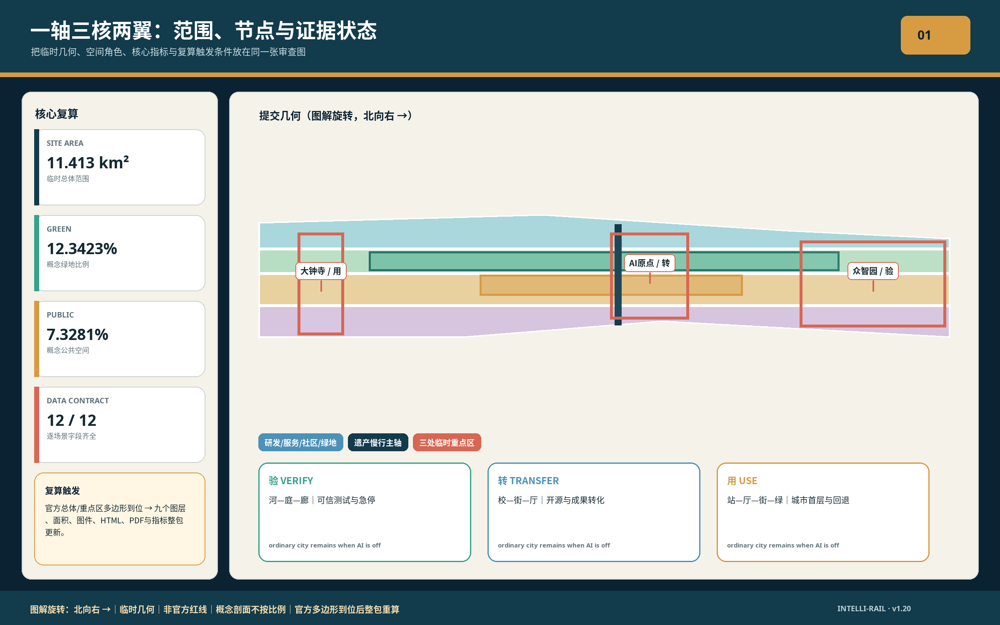
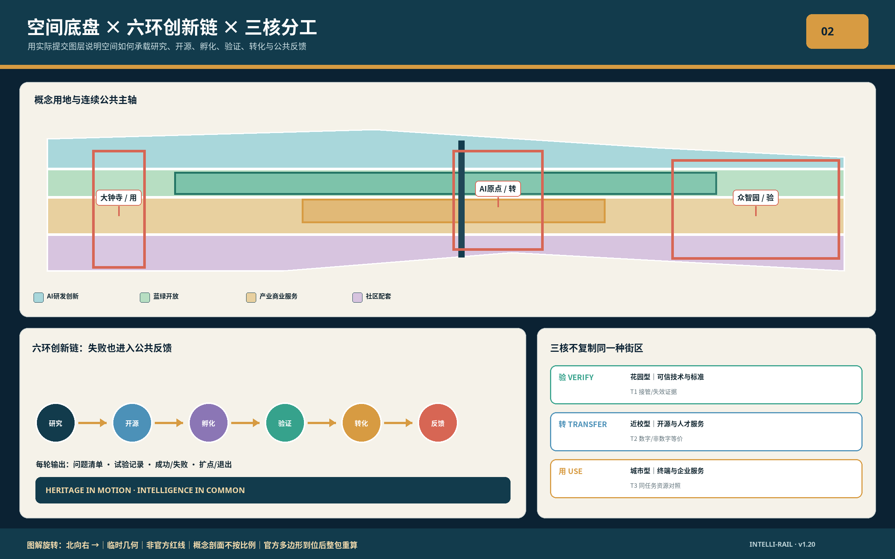
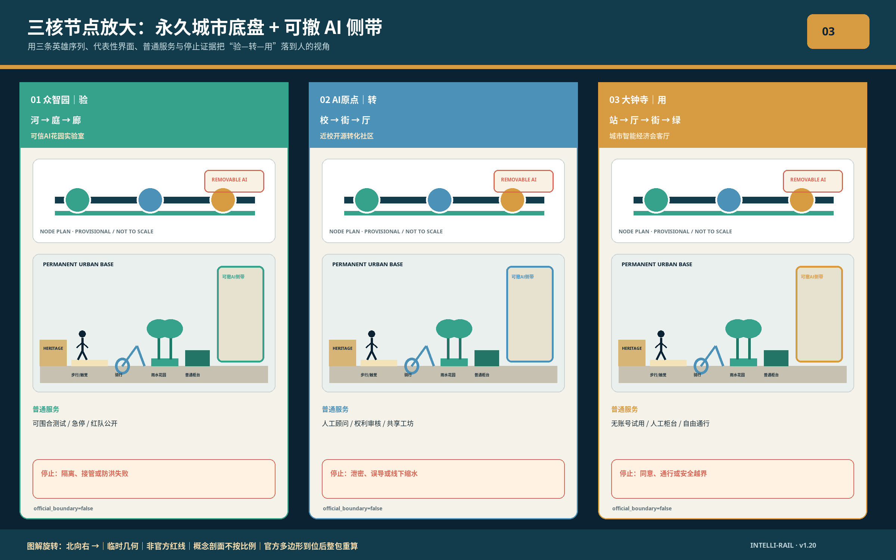
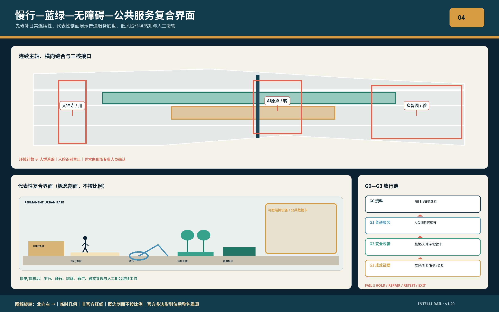
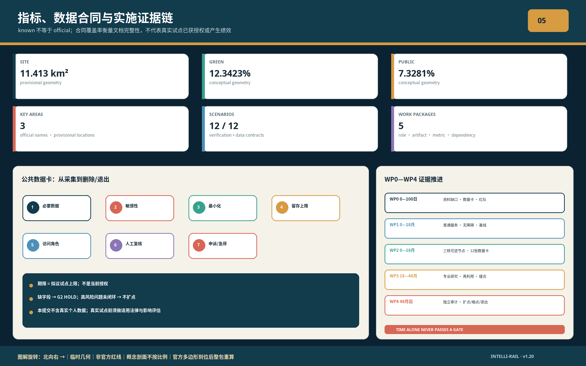

# 京张智轨：百年京张AI创新带城市设计

**JING-ZHANG INTELLI-RAIL / Heritage in Motion, Intelligence in Common**

京张智轨不是一条以技术装置为中心的展示走廊，而是一套以公共空间为底盘的城市创新操作系统：百年铁路遗产提供连续的时间轴，三处重点片区提供产业与生活锚点，两条横向服务翼把高校、企业、社区与水绿网络接入，十二类场景在可退出、可审计、有人复核的条件下逐步运行。设计的核心判断是：AI创新带的竞争力不只来自实验室密度，更来自知识如何走到街道、技术如何接受公共检验、居民如何分享更新收益。

## 设计依据与资料清单

方案以北京市规划和自然资源委员会海淀分局发布的资格预审公告为项目范围与专业任务的第一依据，以仓库 agent_taskbook.json 为开源征集的任务依据，以 site-package 中的枚举、标准、缺失资料清单和临时几何为结构化校验依据。公告给出约43.6平方公里统筹研究范围（北至北五环路，东至京藏高速，南至西直门外大街，西至万泉河路）、约11.4平方公里总体设计范围（京张遗址公园周边1—2公里城市地区与产业区，北至北五环路，东至学院路、西土城路，南至西直门外大街，西至大钟寺东路、荷清路）和约368.4公顷三处重点区域（自北向南为众智园AI自主创新加速区约192.1公顷、北京AI原点社区约104.3公顷、大钟寺AI产业聚集区约72.0公顷）；这些公告面积用于理解任务尺度，不被改写为本次临时多边形的官方精确红线。[source:OFFICIAL-ANNOUNCEMENT]

证据按四级管理：官方公告和正式标准属于依据层；仓库加工的 fact pack 属于导航层；临时边界属于可替换约束层；全球案例属于策略参照层。任何跨层使用都在 sources.json 和 assumptions.json 中降级说明。图件、HTML 与指标只读取本提交的 GeoJSON；正式边界到位后，九个空间图层、全部面积比例、五张图、双语HTML和两套PDF必须整体重算，而不是局部替图。[source:SOURCE-REGISTRY]

当前 SITE-001、PROV-KEY-001/002/003 均为 provisional_constraint，official_boundary=false。仓库公开审计记录显示，临时总体范围与OSM已测绘的遗址公园多边形不相交、最近约412.5米；该读数和OSM本身都只是背景核验，不能裁决红线。另有公开讨论指出大钟寺临时重点区与现实锚点可能存在显著偏差。本方案因此只主张“方案内容可审、空间结论待官方多边形复算”，不主张法定位置或审批效力。[data:geometry/site_boundary.geojson#SITE-001]

本包提交的是开源 Agent 征集成果，不替代专业竞赛中法人资格、资格预审、联合体或线下报送要求。正文中没有政府实施承诺、审定控规结论、个人数据或未清权素材；专业控制条件缺失时统一标记为待确认。[standard:PROJECT-OFFICIAL-ANNOUNCEMENT]

公告与任务书的结构性表述在正文中逐条对词。三大定位——百年京张文化带、都市AI生活体验带、AI融合创新带——分别由文化叙事、场景与公共空间、产业生态三组章节承载；五大功能、三区两翼与“两区一带”产业协同的响应位置索引如下，agent.1—agent.6 的条目级对应登记于 compliance_matrix.json。[source:AGENT-TASKBOOK]

| 任务书要素 | 官方表述 | 本方案响应位置 |
| --- | --- | --- |
| 定位一 | 百年京张文化带 | 遗产主轴连续化、京张记忆线路、百年零公里地标 |
| 定位二 | 都市AI生活体验带 | 十二类AI+场景、公共空间三级活动分级、无障碍连续环 |
| 定位三 | AI融合创新带 | 六环创新链、三核产业分工、三类验证沙盒 |
| 功能一 | AI全栈自主创新体系 | 众智园可信技术验证、标准协作厅、安全治理展廊 |
| 功能二 | 世界级AI创新生态 | 原点社区近校转化、开源发布厅、全球案例研究 |
| 功能三 | AI+场景赋能新范式 | 小月河场景赋能翼、十二张场景卡、场景退出阀机制 |
| 功能四 | 智能化AI活力城市 | 慢行主轴、城市回路剧场、智能终端体验街 |
| 功能五 | AI治理全球话语权 | 数据合规会客厅、模型卡展陈、公共申诉与独立审计 |
| 空间结构 | 三区两翼 | 一轴三核两翼多点（对应关系见下章） |
| 产业协同 | 联动“两区一带” | 三核差异化分工、两翼横向缝合与区域协同节 |

正文承诺与本包交付一一对应，检索路径如下：

| 交付内容 | 本包文件 |
| --- | --- |
| 双语方案正文 | proposal.md、proposal.en.md |
| 渲染阅读版（双语） | report/proposal.html、report/proposal.en.html |
| 九个空间图层 | geometry/*.geojson |
| 核心指标与复算口径 | metrics.json |
| 合规、标准与设计深度矩阵 | compliance_matrix.json、standard_matrix.json、design_depth_matrix.json |
| 来源分级与假设记录 | sources.json、assumptions.json |
| 四门自检报告 | self_check.json |
| 五张图件（中英各一） | assets/figures/*.png |
| A3 册页与 A0 展板（中英各一） | drawings/*.pdf |
| 离线视觉页（双语） | visual/index.html、visual/index.en.html |
| 迭代记录 | changelog.md |

## 三层范围工作框架

三层范围通过“战略—结构—项目”单向传导，再由运营数据反向校正。统筹研究范围回答创新链、人才链与文化传播；总体设计范围回答城市更新、用地、蓝绿慢行和设施承载；重点区域回答具体功能、首层界面、交通接口和试点项目。每一层都有对应的报告章节、空间对象、指标与实施触发条件，避免把战略口号直接压到地块。[depth:three_level_scope_framework]

| 层级 | 核心问题 | 京张智轨的回答 | 可核验落点 |
| --- | --- | --- | --- |
| 统筹研究范围 | 世界级AI生态怎样与城市生活相互增益 | 建立“研究—开源—孵化—验证—规模化—城市反馈”六环创新链 | sources.json、compliance_matrix.json |
| 总体设计范围 | 11.4平方公里如何形成连续而不过度同质化的创新带 | 一轴三核两翼多点；遗产主轴保持公共性，横向两翼补齐服务与场景 | geometry/land_use.geojson、geometry/roads.geojson |
| 重点区域 | 三个片区如何分工而非复制 | 众智园做可信技术验证，原点社区做近校转化，大钟寺做城市化应用与国际交往 | geometry/key_areas.geojson、A0展板 |

总体结构为“一轴三核两翼多点”，其中三核两翼直接承接任务书的空间结构并保持其官方分工：众智园对应“AI全栈自主创新体系与AI治理全球话语权”，原点社区对应“世界级AI创新生态”，大钟寺对应“智能原生新业态”；中关村科技服务翼承担要素全球化配置、中关村IP与资本赋能，小月河场景赋能翼承担AI场景赋能与智能化活力城市建设。一轴与多点是叠加其上的公共空间承载层：一轴是京张铁路遗产与蓝绿公共空间复合主轴；多点由十二个AI+场景、四个文化地标与十个更新项目构成。[data:geometry/roads.geojson#ROAD-001]

这一结构不是新增红线，而是一套在正式边界替换后仍可保持的关系规则：主轴连续、三核差异化、横向缝合优先、公共空间先行、试点可退出。

## 统筹研究范围产业与未来城市研究

京张智轨把AI产业生态理解为六个连续环节，并与海淀“1+X+1”产业体系相衔接：高校和研究机构形成源头知识；开源社区把成果转为可协作资产；孵化与专业服务降低企业化门槛；城市沙盒提供可控验证；龙头企业和采购场景推动规模化；公共评价与运维数据再反馈到研究。空间上，每一环至少拥有一个公共可见界面，避免创新只发生在封闭园区。[source:AGENT-TASKBOOK]

七个全球案例用于提炼机制，不用于套用指标。剑桥Kendall Square提示创新区必须同时提供住房、首层活力、公共空间与轨道可达；新加坡one-north提示研究机构、企业、孵化器和生活服务需要步行邻近；Barcelona 22@提示旧工业区更新应以基础设施和混合功能同步推进；Paris-Saclay提示跨机构协作需要共享试验与场景评估；Seoul DMC提示数字产业与文化消费可共同塑造公共界面；Helsinki Kalasatama提示智慧城区应从居民日常收益和碳中和出发；Toronto Quayside提示数字治理必须接受民主问责、设计审查和利益相关者参与。

| 案例 | 可转译机制 | 京张应用 | 不照搬内容 |
| --- | --- | --- | --- |
| Kendall Square | 混合用途、轨道节点、公共创新空间 | 大钟寺站周边的首层公共界面与创新小企业空间 | 开发强度和房地产模型 |
| one-north | 研究—孵化—企业—生活的近距离网络 | 众智园与原点社区的共享测试、路演和人才服务 | 园区规模与租赁政策 |
| 22@Barcelona | 工业遗产、基础设施与混合街区协同更新 | 铁路遗产再利用与分期更新项目库 | 土地制度和法定指标 |
| Paris-Saclay | 多机构联合试验与生态转型评估 | 三类场景沙盒的共同评审机制 | 区域科研统计 |
| Seoul DMC | 数字内容产业与公共场所融合 | 大钟寺的终端、内容与国际发布界面 | 媒体产业比例 |
| Kalasatama | 居民参与、日常便利、低碳试点 | 小月河翼的社区服务和运维场景 | 人口与建设规模 |
| Quayside | 数字问责、公共领域与设计审查 | 城市智能体的数据卡、退出机制和公众申诉 | 原项目技术方案 |

产业空间采用“核心能力集中、通用服务共享、公共场景开放”的分工。众智园集中可信模型、全栈自主创新、安全治理与标准协作；原点社区集中高校成果转化、开源协作、早期创业与人才服务；大钟寺集中智能终端、内容消费、企业总部服务与国际发布。两翼共享算力入口、法务知识产权、投融资、会展、教育和生活服务，减少三个核心各自重复建设。[depth:overall_spatial_structure]

未来城市形态不以屏幕数量衡量。评估维度包括15分钟步行可达、公共空间连续性、低门槛创新空间供给、居民可感知收益、数据最小化、人工复核时效、无障碍通行和碳排影响。算法只在明确任务和边界内运行，城市设计仍由可见的街道、建筑、绿地和运营制度承担。

## 总体设计范围城市更新与控规深度城市设计

总体设计以遗产主轴为公共底盘。四类概念用地在临时边界内形成完整覆盖：AI研发创新、蓝绿与开敞空间、产业及商业服务、社区服务与配套。主轴优先保障连续步行骑行、雨洪调蓄、遗产展示和开放活动；横向通廊连接轨道站、高校、社区和水系；建筑更新集中在既有建设空间，不以侵占连续绿地换取展示性体量。[data:geometry/land_use.geojson#LU-001]

“京张智轨”是方案总名，英文名为 JING-ZHANG INTELLI-RAIL。识别系统以“双轨”构图：深蓝线代表百年工程理性，玉绿色代表开放生态，暖铜色节点代表知识进入公共生活。标识不依赖企业商标或人物肖像；线性导视、里程标、地面触觉带和夜间低位照明形成统一系统，同时允许三核使用不同的辅助色与内容主题。

城市更新分为保留、修缮、适应性再利用、增补和待核五类。铁路遗存、历史站房及具有公共记忆的结构优先保留并经文保核定；可转化的厂房和低效首层优先适应性再利用；新增体量只在权属、消防、结构和控规条件核定后进入地块深化。当前 buildings.geojson 仅表达设计建筑基底样例，不代表现状建筑普查或拆除决定。[depth:retain_renovate_demolish]

十个更新项目共同构成空间实施骨架：遗产主轴连续化、北五环慢行缝合、清河创新岸线、原点成果转化街、大钟寺四象限连接、三核共享服务站、低碳算力驿站、无障碍连续环、开放场景节点、百年京张数字档案馆。项目通过 phasing.geojson 组织近期验证、中期更新与长期治理；项目编号、依赖与退出条件在第十章给出。

控制性详细规划层面的容积率、建筑高度、建筑密度、道路红线、退线和设施容量目前缺少官方条件，统一待正式数据补齐（见指标章）。方案提供的是空间关系、功能组合、公共界面、更新方法和复算路径。[standard:MOHURD-CONTROL-DETAILED-PLANNING]

## 重点区域详细设计

三处重点区采用不同的“首要公共价值—产业任务—空间动作—验证门槛”，位置精度受第二章所述临时几何限制，建筑规模与拆改留决定待官方图件校正后建立。[data:geometry/key_areas.geojson#PROV-KEY-001]

### 众智园AI自主创新加速区

定位为“可信AI花园实验室”，对应公告“更具智慧型与未来感的花园型人工智能创新街区”：以花园型街区组织智慧感与未来感，而非以装置堆砌。公共价值是让标准、安全和自主技术从封闭测试转为可理解的公共知识，呼应公告“抓好国家人工智能平台建设契机，推进标准制定与安全治理等关键领域建设”的路径。沿清河方向组织低碳创新界面，内部形成共享测试庭院、标准协作厅、安全治理展廊和小尺度交往空间；对外交通衔接公告提出的五环路区域一体化规划，建筑、绿地、水系按一体化设计组织。对外交通、河道蓝线、防洪和园区权属是深化前置。首期只布置可撤除的展示与测试设施，未通过安全评估的系统不得接管公共运行。

### 北京AI原点社区

定位为“近校开源转化社区”，对应公告“更具人才吸引力、创新活力、科技成果转化能力的近校型人工智能创新街区”。公共价值是缩短从科研成果到创业、就业和社区服务的距离：面向清华、北大、中科院等高校的原始创新策源成果组织孵化区与转化区，衔接公告提出的人才特区、成果转化、开源体系与品牌活动建设。以成果转化街串联开源发布厅、知识产权与法务、共享原型工坊、人才服务和可负担的短期居住；以步行骑行缝合高校、园区、社区及轨道站。校园边界、科研成果授权、居住供给和消防疏散条件未经确认前，只实施公共活动与服务原型。

### 大钟寺AI产业聚集区

定位为“城市智能经济会客厅”，对应公告“更具世界影响力、城市发展活力的城市型人工智能创新街区”。公共价值是把智能体、智能终端、内容消费和数据治理转为可进入、可监督的城市首层：发挥公告所述领军企业牵引优势，培育智能体、智能终端、内容消费等AI原生与AI+融合新业态，并探索数据要素与数字资产流通机制。围绕轨道站点一体化和四象限步行连续，布置国际路演厅、终端体验街、数据合规会客厅和公共绿地复合设施（对应公告的规划绿地复合利用）。现有临时重点区与大钟寺现实锚点可能存在较大偏差，因此本区所有位置关系均为待复算命题，不声称已落位。

| 重点区 | 官方街区类型 | 核心空间动作 | 关键运营者 | 进入下一阶段的门槛 |
| --- | --- | --- | --- | --- |
| 众智园 | 花园型创新街区 | 清河界面、测试庭院、可信AI展廊 | 园区运营方、科研机构、标准与安全机构 | 防洪、交通、测试安全和权属确认 |
| 原点社区 | 近校型创新街区 | 近校转化街、开源发布厅、人才服务环 | 高校转化平台、开源社区、街道与企业服务机构 | 校园接口、消防、成果授权和居住条件确认 |
| 大钟寺 | 城市型创新街区 | 站城四象限、国际会客厅、终端与内容首层 | 轨道及属地机构、领军企业、文化与商业运营方 | 官方边界、站点工程、市政和商业可行性确认 |

三区共享一套预约、数据卡、风险分级和公众申诉机制，但不共享单一空间模板。每区至少保留30%的可变活动时段给非商业公共项目，具体比例属于运营建议，需由未来运营章程确认。[depth:three_key_area_detailed_design]

## AI 创新生态、人才画像与 AI+ 场景

六类核心人物不是营销画像，而是空间与治理测试对象：开源开发者需要低门槛协作和声誉记录；初创团队需要弹性空间、算力入口与专业服务；科研人员需要成果授权和跨机构验证；头部企业及国际访客需要展示、合作与清晰的合规入口；周边居民需要安静、便利、无障碍且不被追踪的日常环境；城市运维人员需要可解释告警、人工处置和责任交接。[source:AGENT-TASKBOOK]

| 人物 | 一天中的关键任务 | 空间响应 | 不采集或不推断 |
| --- | --- | --- | --- |
| 开源开发者 | 协作、测试、发布、社区活动 | 原点开源厅、夜间协作区、公共贡献墙 | 个体移动轨迹、私人代码 |
| 初创团队 | 原型、融资、合规、客户验证 | 众智测试庭院、共享服务站、弹性工位 | 商业敏感信息、未经授权客户数据 |
| 科研人员 | 成果转化、跨学科评测、教学展示 | 近校转化街、共同实验室、公开讲堂 | 未公开论文与科研数据 |
| 企业与国际访客 | 展示、洽谈、招聘、发布 | 大钟寺会客厅、轨道接驳、双语导视 | 人脸身份和关系网络 |
| 周边居民 | 通勤、休闲、教育、社区服务 | 无障碍慢行环、社区服务节点、静音时段 | 商业画像、健康推断 |
| 城市运维人员 | 巡检、派单、复核、应急 | 运维工作台、现场确认点、责任日志 | 自动处分或无人工复核的决策 |

十二张场景卡均包含载体、数据边界、人工复核与运营者。场景默认“最小可用”，不是一次性铺设全域传感器。[data:geometry/public_space.geojson#PUBLIC-001]

### 场景深化：三张样卡的完整旅程

**S02 可信AI沙盒 · 一次红队测试日。** 旅程：上午评测机构在隔离环境载入参测模型与测试数据卡，午后开发者旁听自动评测、安全员持停止按钮值守，傍晚发布成功、失败与偏差记录，未达标系统当场移出公共运行候选。空间接口：测试庭院操作面、标准协作厅评审席、展廊当日结果墙。失效模式：环境隔离失效或接管超时即全场暂停；数据卡越界即终止并复检近三十天记录。指标：红队用例覆盖数、接管响应时长、结果当日公开率。

**S05 无障碍伴行 · 一段从车站到节点的路线。** 旅程：一位轮椅使用者出站后获得三条可选路线（无台阶、遮荫、安静），全程只呈现聚合提示、不做人脸识别，抵达目的地后服务自动退出。空间接口：出站触觉带、休息点求助按钮、可关闭的语音提示柱。失效模式：定位漂移超阈值即降级为纸质地图与人工指引；用户关闭后本路线不再重启提示。指标：路线完成率、休息点使用频次、关闭率与投诉响应时长。

**S11 京张记忆线路 · 一小时铁路史步行。** 旅程：从清华园站旧址印记出发，沿主轴里程标读到百年零公里，每个节点提供史实卡、可撤回授权的口述音频与触觉图，结尾在城市回路剧场留下一条公共问题。空间接口：里程标、触觉地图、口述亭、剧场议题墙。失效模式：史料存疑即标注“待考”并下线对应音频；授权撤回后节点自动移除该内容。指标：节点停留时长、口述收听量、议题墙年新增问题数。

| 编号与场景 | 空间载体与价值 | 数据边界与人工复核 | 建议运营者 |
| --- | --- | --- | --- |
| S01 开源发布厅 | 原点社区；发布、评测、协作 | 只展示授权成果；发布前权利审核 | 开源社区与高校转化平台 |
| S02 可信AI沙盒 | 众智园；模型安全、标准与红队验证 | 隔离环境、测试数据卡、人工准入和停止按钮 | 安全评测机构与园区 |
| S03 端侧算力驿站 | 三核共享节点；降低小团队试验门槛 | 任务级日志、能耗可见、不保留内容数据 | 公共技术平台 |
| S04 慢行断点诊断 | 遗产主轴；提升步行、骑行和无障碍连续性 | 只用聚合流量与现场踏勘，方案由交通专业复核 | 属地交通与公园运维 |
| S05 无障碍伴行 | 车站至公共节点；提供可选择的路径提示 | 不做人脸识别，不建立健康画像，用户可关闭 | 无障碍服务组织与运营方 |
| S06 清河低碳廊 | 众智园河岸；雨洪、热舒适和活动协同 | 环境数据公开，异常由工程人员复核 | 河道、公园与园区运营方 |
| S07 成果转化街 | 原点社区；把法务、知识产权、投融资嵌入首层 | 企业自愿提交，分级保密，人工顾问签字 | 企业服务联合体 |
| S08 人才生活管家 | 社区服务节点；连接居住、教育、运动与文化 | 不做隐性排序，不出售画像，服务结果可申诉 | 街道与人才服务机构 |
| S09 智能终端体验街 | 大钟寺；产品试用、内容消费和适老评测 | 明示采集、匿名统计、未成年人保护 | 商业运营方与消费者组织 |
| S10 数据合规会客厅 | 大钟寺；解释授权、流通和审计 | 不交易原始个人数据，法律与安全双复核 | 合规机构与行业协会 |
| S11 京张记忆线路 | 遗产主轴；铁路史、创新史与社区记忆共读 | 史料注明出处，居民口述可撤回授权 | 文化机构与社区档案团队 |
| S12 全球AI活动周路线 | 一轴三核；连接开发者节、展览和城市体验 | 活动级安全评估，不长期跟踪参与者 | 联合运营理事会 |

三类产业测试验证沙盒把“可失败”写进制度。T1可信出行沙盒先在封闭或低风险路段测试导航与微交通，只在安全员可即时接管时运行；T2普惠服务沙盒由居民、老年人、残障人士共同测试服务可达性，若投诉率或误导风险超过阈值则下线；T3低碳算力沙盒公开任务能耗、设备利用率与热管理，只有节能收益经独立复核后才扩展。每次测试同时发布成功、失败、偏差和停止记录。[depth:ai_scenarios_testbeds]

场景成效按公共价值、产业价值、风险和可逆性四维评估。没有明确运营主体、申诉窗口、数据删除周期或撤场方案的场景，不进入公共空间。

三个贯穿全案的原创机制在此命名。**场景退出阀**：每个公共场景内嵌“阈值—暂停—复盘—退出”四步，指标越限即自动降级，复盘未通过即撤场，撤场成本在方案设计阶段即被评估。**公共数据卡**：每个场景对外只暴露一张标准化数据说明——采集范围、保存期限、用途边界、申诉入口；无卡不运行，卡随场景撤场而注销。**双轨识别系统**：深蓝与玉绿双线贯穿带内全部导视、里程标与界面，百年工程理性与开放生态在每个触点同时在场，三核辅色只作分层提示、不作品牌分裂。

## 用地、建筑规模与拆改留方案

land_use.geojson 以四类概念用地完整覆盖临时总体范围。分类是对功能关系的设计表达，不是法定用地审批：AI研发创新区承载核心研发与共享实验；公园绿地和开敞空间保障连续生态与公共活动；产业及商业服务区提供转化、会展和生活消费；社区服务及配套区补齐教育、健康、人才居住与日常服务。[standard:MNR-LAND-USE-CLASSIFICATION-GUIDE]

当前可复算的提交边界面积为11,412,825.386平方米，绿地比例为0.123423，公共空间比例为0.073281，设计建筑基底为310,807.184平方米。它们均从临时几何复算，精确小数只用于文件一致性校验，不表示真实测绘精度；面向读者分别表述为约11.41平方公里、约12.34%、约7.33%和约31.08万平方米。[metric:site_area_sqm]

建筑控制采用“底线先于造型”。保留类核验历史、结构与使用价值；修缮类优先改善安全、节能和首层开放；适应性再利用类引入开源工坊、展览、社区服务与小企业空间；增补类控制体量、风貌、日照、消防和交通；待核类在权属或文保不清时不作拆建判断。总建筑规模、容积率、高度、密度和退线待官方控规和现状测绘补齐。[metric:building_footprint_area_sqm]

材料与风貌强调耐久、可维护和低碳：铁路钢构与砖石遗存以真实材料修缮，新增公共构筑物采用可拆装木钢混合体系和遮阳雨棚，夜景以低位、低色温和分区关闭为原则。任何“未来感”都不得以过度发光、屏幕侵占或噪声扰民换取。

## 交通、轨道、市政与公共服务设施

交通结构为“一条连续慢行主轴、三类横向缝合、多个站点接口”。主轴提供步行、骑行、无障碍和维护通道的分层组织；横向缝合分别连接高校与园区、社区与公园、水系与城市道路；站点接口优先解决换乘步行、非机动车停放、首层识别和夜间安全。roads.geojson 中的 ROAD-001 只代表设计廊道关系，不是道路红线。[data:geometry/roads.geojson#ROAD-001]

北五环及其他大型道路是连续性的关键风险点。策略顺序为：先改善既有过街和导视，再评估桥下空间与慢行设施，最后才论证新建跨越工程。任何涉及桥梁、隧道或站城工程的方案都需交通组织、结构、市政、消防和无障碍专项论证，不以概念图替代工程可行性。

市政系统采用“共享接口、分区韧性、可量测运维”。三核设置标准化能源、通信、算力与应急接口；雨洪花园、透水铺装和树荫系统与公园更新同步；端侧算力优先利用既有机房和可回收余热，扩容前公开能耗与碳影响。管线、防洪、消防、水务和电力资料当前缺失，constraints.geojson 保持空图层并在 assumptions.json 明确缺口，而不是虚构约束线。[depth:municipal_new_infrastructure]

公共服务按日常优先：15分钟步行范围内组合社区健康、托育、学习、运动、文化和人才服务；国际化服务采用双语导视和预约协助，但不形成与本地居民隔离的专属系统。公共设施在非高峰时段向社区开放，商业活动收益的一部分建议回补公共空间维护，具体机制须由运营协议确定。

## 蓝绿空间、公共空间与城市风貌

蓝绿系统以连续公园绿地为骨架，把清河、小月河、铁路遗产、校园边缘和社区开敞空间组织成“主轴—横廊—口袋节点”。绿地不是创新建筑之间的余量，而是热环境、雨洪、生物多样性、日常运动和非正式交流的共同基础。green_space.geojson 与 public_space.geojson 分别复算绿地和公共活动界面，两者可重叠承担复合功能，但指标按各自图层独立计算。[metric:green_ratio]

四个“AI朝圣地标”拒绝大型纪念碑逻辑。L1百年零公里以铁路里程、工程史和无障碍触觉地图建立共同起点；L2开源贡献墙以经授权的项目、维护者和公共问题记录持续更新；L3可信AI灯塔把模型卡、能耗、风险和停止记录转为公众可读展陈；L4城市回路剧场把年度场景成效、居民反馈和失败案例公开讨论。四个地标都应低碳、可维护、内容可更新，并给出夜间关闭和无障碍模式。[depth:blue_green_public_space]

文化叙事由三条时间线交织：京张铁路代表近代工程与自主建造，中关村代表改革开放以来的科研和创业文化，AI新文化代表开源协作、责任创新与公共参与。展陈避免把历史变成科技布景；史料、旧构件、口述历史和新媒体内容分别登记来源与授权。清华园车站旧址、大钟寺等具体文化资源的空间关系在官方边界与文保资料到位后再精确落图。

公共空间采用“安静日常优先、活动分级进入”。日常层提供树荫、座椅、饮水、厕所、运动与通勤；社区层容纳市集、课堂和小型展演；城市层承载开发者节和国际活动。活动层级对应人数、噪声、安保、交通和撤场要求，居民可通过公开日历与申诉窗口参与调整。[standard:MOHURD-URBAN-DESIGN-MEASURES]

## 更新项目清单、实施政策与分期计划

更新以项目库而非一次性总平面推进。phase_1 表达可讨论的先导范围，不代表财政立项或建设承诺。每个项目都有依赖、验证和退出条件；未满足官方边界、权属、规划或工程条件时，只开展研究、共创和可撤除原型。[data:geometry/phasing.geojson#PHASE-001]

| 编号 | 项目 | 阶段 | 先行成果 | 关键依赖与退出条件 |
| --- | --- | --- | --- | --- |
| JZ-01 | 京张遗产主轴连续化 | 近期 | 断点清单、导视和可逆铺装 | 文保与公园范围；破坏遗存则停止 |
| JZ-02 | 北五环慢行缝合 | 近期研究/中期工程 | 现状过街优化和工程比选 | 交通、结构、市政审批；安全不达标则不建 |
| JZ-03 | 清河创新岸线 | 近期 | 雨洪花园与低扰动活动原型 | 河道蓝线、防洪和生态评估 |
| JZ-04 | 原点成果转化街 | 近期 | 开源发布、法务和原型服务 | 权属、消防、校区接口和成果授权 |
| JZ-05 | 大钟寺四象限连接 | 中期 | 站点步行审计与临时导视 | 官方重点区、轨道和道路工程条件 |
| JZ-06 | 三核共享服务站 | 近期 | 企业服务预约与公共柜台 | 运营主体、公共服务采购和数据协议 |
| JZ-07 | 低碳算力驿站 | 近期验证 | 任务能耗公开与端侧试验 | 能源容量、安全评估；无节能收益则退出 |
| JZ-08 | 全龄无障碍连续环 | 近期 | 共测路线、休息点和触觉导视 | 无障碍专业复核与持续维护预算 |
| JZ-09 | 开放场景节点网络 | 近期至中期 | 三类沙盒和十二张数据卡 | 伦理、安全、申诉和撤场机制齐备 |
| JZ-10 | 百年京张数字档案馆 | 中长期 | 权利清晰的史料目录与线下展陈 | 文博合作、版权与长期保存责任 |

分期建议为0—18个月验证、18—48个月更新、48个月以后网络化治理，时间仅表示依赖顺序。近期优先低风险、可撤除、公共收益可见的项目；中期进入建筑再利用和交通工程；长期才讨论强度调整、重大站城工程和区域扩展。[depth:phasing_implementation]

启动期建议打包为“百日六件事”：JZ-01 断点清单与导视、JZ-04 首段转化街原型、JZ-06 共享服务站柜台、JZ-08 共测路线、S02 沙盒首期红队日、公共数据卡第一版规范。六件事共同的交付判据是：每件在百日结束时都有一个可查验的公开产物——清单、原型、柜台、路线、测试报告或规范文本，由运营主体署名发布；未达成的进入复盘而不是顺延。

长期运营建立“联合理事会—专业委员会—社区观察团—独立审计”四层机制。联合理事会协调公共部门、园区、高校、企业和社区，对场景准入、扩场与撤场行使决定权，季度例会；专业委员会审查规划、交通、数据、安全与文化，月度出具审查意见，异议提交理事会裁决；社区观察团保留议题提出和服务复核席位，联名动议必须进入下一次理事会议程；独立审计每年发布场景效果、投诉、停用、能耗与公共收益报告，全文公开。资金由公共空间维护预算、企业会员、活动收入、研究合作和专项资金组合，商业赞助不得换取公共数据或排他命名；年度预算与支出摘要随公共价值审计一并公开。

年度运营包括春季开源维护周、夏季城市沙盒开放日、秋季全球AI活动周、冬季公共价值审计。活动不是独立节庆，而是项目迭代节点：公开问题、招募协作、现场验证、发布结果、决定扩展或退出。[source:AGENT-TASKBOOK]

## 指标体系、面积复算与合规矩阵

指标分三类。第一类是本包可复算的空间指标；第二类是等待官方控规与现状资料的控制指标；第三类是实施后才可观测的运营指标。三类不得混写。metrics.json 只对第一类给出 known 值，对容积率等第二类保持 unknown；运营指标在未来基线建立前不承诺目标值。[depth:metrics_recalculation]

| 指标 | 当前值与状态 | 复算路径 | 解释边界 |
| --- | --- | --- | --- |
| site_area_sqm | 11,412,825.386，known/provisional | SITE-001 在EPSG:4548下的多边形面积 | 仅供提交一致性，不是官方实测 |
| green_ratio | 0.123423，known/conceptual | GREEN-001面积 ÷ SITE-001面积 | 设计比例，边界替换后重算 |
| public_space_ratio | 0.073281，known/conceptual | PUBLIC-001面积 ÷ SITE-001面积 | 公共界面设计比例 |
| building_footprint_area_sqm | 310,807.184，known/conceptual | BLDG-001多边形面积 | 设计样例，不是现状普查 |
| floor_area_ratio | unknown | 总建筑面积 ÷ 官方范围面积 | 等待控规和建筑数据 |
| key_area_count | 3，known/provisional | key_areas.geojson要素数 | 名称和数量确定，位置待校正 |

运营期建议追踪公告提示的AI创新指数、人才密度、产值规模三类规划指标口径，以及慢行断点关闭率、无障碍连续率、公共空间非商业时段、初创团队从测试到采购的转化、开源贡献留存、场景投诉响应、人工接管次数、数据删除准时率、单位任务能耗和居民可感知收益。公告类指标在官方口径发布前不填数值；每项必须先发布定义、基线、采样误差和责任人，不能用复合指数掩盖失败。五项首批运营指标的定义、基线建立方式与责任如下，采样误差随基线一并发布：

| 运营指标 | 定义 | 基线建立 | 责任人 |
| --- | --- | --- | --- |
| 慢行断点关闭率 | 主轴已消除断点数÷断点清单总数 | 首次全线踏勘清单 | 属地交通与公园运维 |
| 场景投诉响应 | 公共数据卡申诉从受理到首次答复的时长 | 上线首季度工单统计 | 各场景运营主体 |
| 人工接管次数 | 场景运行中人工接管或紧急停止的次数 | 沙盒首期红队日记录 | 安全评测机构 |
| 数据删除准时率 | 到期个人相关数据按时删除的比例 | 公共数据卡规范试点 | 独立审计方 |
| 居民可感知收益 | 年度抽样中报告明确受益的居民比例 | 首次公共价值审计 | 社区观察团 |

compliance_matrix.json 覆盖公告1.3、1.4、1.5及 agent.1—agent.6；standard_matrix.json 连接项目依据与专业标准；design_depth_matrix.json 连接十五项设计深度；self_check.json 保存四门自检。[metric:public_space_ratio]

## 风险、版权与合规说明

首要风险是边界不确定：官方多边形缺失时，空间结论保持第二章所述的待复算状态，官方数据发布即触发整包重算并保留变更记录。第二类风险是控规、权属、文保、市政、消防和交通资料不足，相关规模与工程结论保持待正式数据补齐。[depth:risk_missing_data]

AI场景风险按数据、模型、运行和公平四层管理。数据层执行最小化、用途限定、删除期限和授权撤回，以公共数据卡为统一载体；模型层发布模型卡、误差和适用范围；运行层提供人工接管、故障降级和停止按钮，场景退出阀适用于全部十二类场景；公平层由不同年龄、能力与职业的使用者共同测试。高风险公共决策不交由模型自动完成，任何服务都提供非数字替代和申诉渠道。

正文、英文译稿、图件、HTML和PDF是本提交的原创成果；空间图基于仓库公开的临时几何和结构化数据绘制；全球案例仅引用其官方机构网页中的机制性信息，不复制图片；字体使用本机许可字体并在PDF中嵌入或转曲。visual/index.html 不加载远程脚本、地图瓦片、字体、iframe、表单或追踪代码。模型身份与生成方式的必要披露见 agent.json、manifest.json 与版权声明；公开成果仅保留最终设计与规范要求的来源信息。[source:OPEN-CALL-SKILL]

方案许可为 COMMUNITY-DISPLAY-ONLY。官方公告、政府网页和仓库规则仍归原权利人；案例名称仅用于评论和研究。所有具体实施均需由相应专业团队、权利主体和主管部门复核。版权细目见 report/copyright_statement.md。

## 参考资料

- OFFICIAL-ANNOUNCEMENT：北京市规划和自然资源委员会海淀分局资格预审公告，项目范围与专业任务依据。
- AGENT-TASKBOOK：brief/site-package/agent_taskbook.json，六项开源征集任务与边界条款。
- OPEN-CALL-SKILL：skills/urban-design-ai-submission/SKILL.md，提交结构、双语和校验流程。
- SOURCE-REGISTRY：data/source_registry.json，公开、清权、背景和临时资料的用途分级。
- PROCESSED-FACT-PACK：data/processed/agent_fact_pack.md，范围、任务和缺口的导航索引。
- CASE-KENDALL：City of Cambridge，Kendall Square 规划与创新区资料。
- CASE-ONE-NORTH：JTC Singapore，one-north 园区、研究机构、企业与生活服务资料。
- CASE-22BARCELONA：Ajuntament de Barcelona，22@ innovation district 公开资料。
- CASE-PARIS-SACLAY：Communauté d’agglomération Paris-Saclay，创新生态与Urban IA资料。
- CASE-SEOUL-DMC：Seoul Metropolitan Government，Digital Media City 政策档案。
- CASE-KALASATAMA：City of Helsinki，Kalasatama 更新与智慧城区资料。
- CASE-QUAYSIDE：Waterfront Toronto，Quayside公共空间、生态与数字问责资料。

完整URL、用途、许可边界和本地证据路径见 sources.json；假设、触发条件与影响见 assumptions.json。[source:SITE-PACKAGE]
