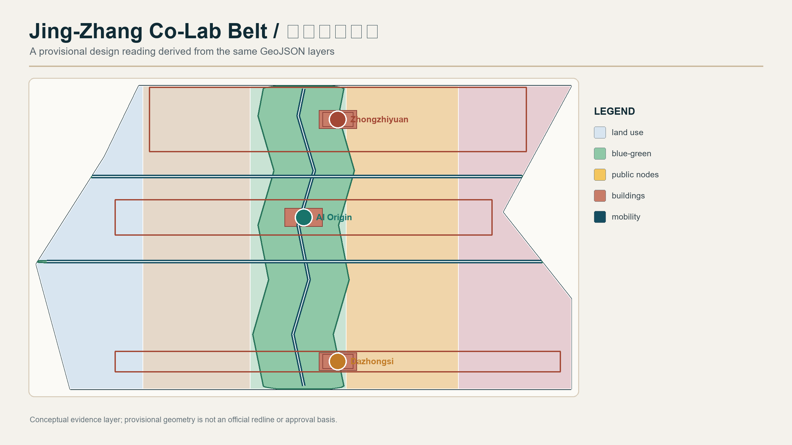
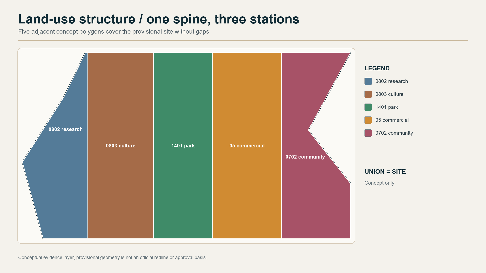
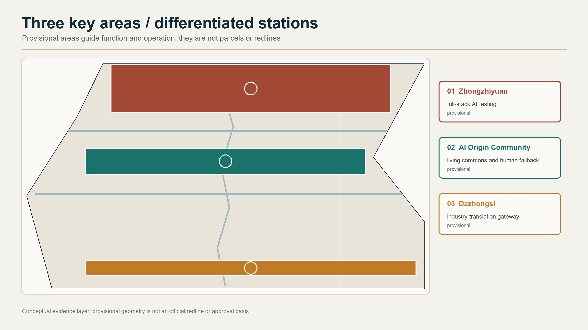
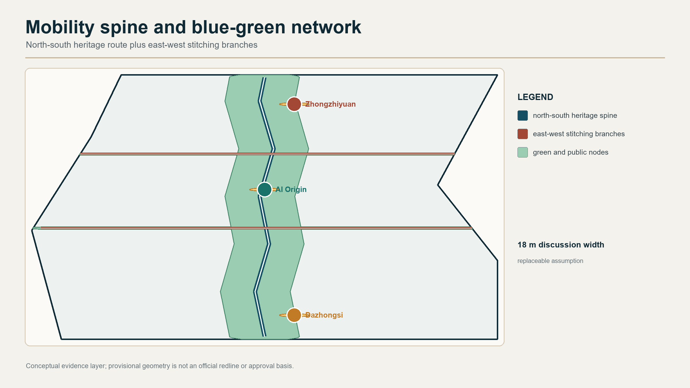
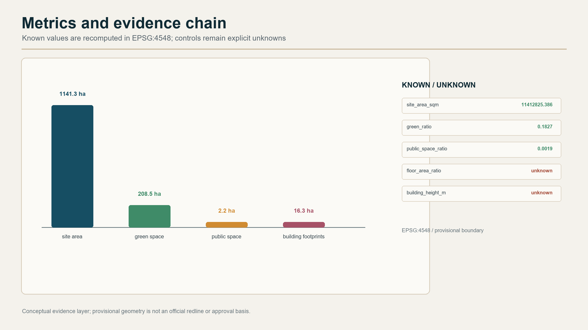

# Jing-Zhang Co-Lab Belt: An Open AI City of Heritage, Innovation, and Community

## Design Basis and Source List

This proposal defines the Jing-Zhang Co-Lab Belt as a conceptual recommendation for professional teams to deepen. Spatially, a Jing-Zhang Active Spine links three key areas; operationally, public data, explainable AI services, and human review bring innovation into ordinary life. The basis includes the official call, the cleared agent taskbook extract, the repository site package, the public source registry, and the provisional rough boundary. Announced areas and tasks are used as facts; the provisional polygon is used only for generation, display, and intake checks [source:OFFICIAL-ANNOUNCEMENT] [source:AGENT-TASKBOOK] [source:SOURCE-REGISTRY].

The public site package does not yet contain an official, coordinate-verified redline or precise polygons for the three key areas. The package therefore preserves the repository-locked provisional boundary and labels it as a provisional constraint. Areas, buildings, roads, and phasing do not replace statutory boundaries, regulatory controls, ownership records, or engineering review [source:BOUNDARY-SOURCE] [data:geometry/site_boundary.geojson#SITE-001]. When cleared official CAD/GIS or formal drawings become available, the boundary, design layers, metrics, drawings, and bilingual HTML must be regenerated as one chain rather than replacing one image.

Source use follows three levels: formal-ready sources support factual claims; background-only sources support context; provisional-only sources support temporary generation and discussion. Case studies are mechanism comparisons, not claims about current Haidian tenants. Text, diagrams, pages, and drawings are generated by the declared AI workflow or use cleared repository material. No external image, trademark, portrait, or commercial basemap is embedded. The design responds to the official urban-design, regulatory-planning, land-use-classification, and public-compliance references [standard:PROJECT-OFFICIAL-ANNOUNCEMENT] [standard:PROJECT-AGENT-OPEN-CALL-TASKBOOK] [standard:MOHURD-URBAN-DESIGN-MEASURES].

The existing-condition diagnosis does not invent a survey. It records four verification needs: boundary precision, regulatory controls, ownership and engineering conditions, and AI-service risks. This gives later professional survey, ownership, transport, municipal, heritage, and public-participation work a traceable starting point [depth:existing_conditions_diagnosis].

## Three-Level Scope Framework

The three levels progress from regional innovation coordination to urban design and then to detailed key-area design. The coordinated research area is understood as approximately 43.6 km², the overall design area as approximately 11.4 km², and the three key areas together as approximately 3.684 km². The announced values are recorded as 43,600,000 m², 11,400,000 m², and 3,684,000 m² [metric:coordinated_research_area_announced_sqm] [metric:overall_design_area_announced_sqm] [metric:key_detailed_design_area_announced_sqm].

The spatial proposition is “one spine, three stations, two wings, and four open protocols.” The spine is a north-south slow-mobility and cultural route along the Jing-Zhang heritage park; the stations are Zhongzhiyuan, Beijing AI Origin Community, and Dazhongsi; the wings are the Zhongguancun Technology Service Wing and Xiaoyuehe Scenario Empowerment Wing. The protocols are traceable data, bookable scenarios, reviewable outputs, and returned public knowledge. The provisional overall geometry calculates to approximately 11,412,825.386 m², but this is only a reading of the current rough geometry [metric:site_area_sqm] [data:geometry/key_areas.geojson#PROV-KEY-001].

The levels do not impersonate one another. The regional level proposes innovation coordination; the overall level proposes structure, land-use roles, walking and cycling, blue-green public space, and renewal types; the key-area level proposes nodes, interfaces, scenarios, and operating hooks. The same task matrix, metric formulas, and drawings cross-check all three levels [depth:three_level_scope_framework] [depth:overall_spatial_structure].

## Coordinated Research Area: Industry and Future City Research

The three positions become three urban narratives. The Centennial Jing-Zhang Culture Belt turns railway heritage and engineering memory into a continuous learning route. The Urban AI Life Experience Belt makes AI legible through optional, explainable, and human-supported services. The AI Integrated Innovation Belt organizes companies, universities, communities, computing, data, and real scenarios as an open collaboration network. The five functions become five work layers: research, ecosystem, scenarios, urban vitality, and governance.

| Unit | Role | Spatial and operational translation |
| --- | --- | --- |
| Zhongzhiyuan AI Acceleration Area | Full-stack innovation and governance testing | Bookable model evaluation, data clinics, and developer interfaces; no invented company or investment list |
| Beijing AI Origin Community | World-class AI ecosystem | A mixed community living room for services, talent life, co-creation, and public experience |
| Dazhongsi AI Industry Cluster | Intelligent-native business translation | A station-facing gateway for industry display, business services, and low-speed delivery testing |
| Zhongguancun Technology Service Wing | Global factor configuration | A cooperation channel for universities, professional services, capital, and IP advice; partners remain to be confirmed |
| Xiaoyuehe Scenario Empowerment Wing | AI-enabled scenarios and urban vitality | Water, walking, community services, and events become bookable test interfaces without altering water or blue-line controls |

The case set uses only public, reviewable mechanisms and does not copy promotional statistics. Six comparisons are: Mila in Montreal for research-talent-startup connections; the Vector Institute in Toronto for research-industry collaboration; AI Singapore for research-to-application translation; one-north in Singapore for mixed innovation space; Barcelona 22@ for industrial-area innovation translation; and the King’s Cross area in London for public-space and knowledge organization. They offer transferable mechanisms in research access, talent community, testbeds, adaptive reuse, heritage interpretation, and public-space operation [source:EXT-CASE-MILA] [source:EXT-CASE-VECTOR] [source:EXT-CASE-AISINGAPORE].

The proposal does not invent Haidian companies, investment, output, or fiscal commitments from these cases. The comparison table and ecosystem map answer how a mechanism could be translated, not who has already moved in. Professional teams and organizers should verify any future partner, ownership, operation, and investment information from formal materials [source:EXT-CASE-ONENORTH] [source:EXT-CASE-22AT] [source:EXT-CASE-KINGSCROSS].

## Overall Design Area: Urban Renewal and Regulatory-Plan-Level Urban Design

The overall structure uses the Jing-Zhang Active Spine as the primary route, three differentiated stations as anchors, and east-west stitching branches plus the Xiaoyuehe wing as complementary connections. The spine carries heritage wayfinding, walking and cycling, open exhibitions, and low-threshold AI services. The branches connect communities to stations and link industry services to booked tests. The road layer expresses conceptual slow-mobility and service corridors, not road redlines or engineering alignments [data:geometry/roads.geojson#ROAD-NS-001] [standard:MOHURD-URBAN-DESIGN-MEASURES].

Five auditable land-use codes organize the proposal: research land (0802), cultural land (0803), park green space (1401), commercial and service land (05), and urban community-service facilities (0702). They carry full-stack research, Jing-Zhang interpretation, blue-green continuity, industry translation, and everyday community support respectively [data:geometry/land_use.geojson#LU-001] [standard:MNR-LAND-USE-CLASSIFICATION-GUIDE]. These are spatial roles for the concept, not a regulatory-plan amendment.

Building expression follows retain, adaptive renovation, and conceptual new-build categories. Retention protects heritage, community, and public-service value when ownership or survey evidence is incomplete. Renovation is subject to ownership, structure, fire, energy, and operating checks. New-build is expressed only as spatial types for public service, shared research, display, and mobility support, without parcel approvals, FAR, height, density, or setback conclusions. The footprint layer shows a conceptual supply relationship and is recalculated as [data:geometry/buildings.geojson#BLDG-N01] [depth:land_use_layout] [depth:development_intensity_controls]; building height and character are reviewed separately with [depth:height_massing_character] and [standard:MOHURD-CONTROL-DETAILED-PLANNING].

Character control uses review questions instead of invented numbers: does the interface preserve railway memory, provide a public ground floor, retain accessible and human service, and keep AI equipment replaceable and explainable? Formal controls, heritage, fire, transport, and municipal conditions must be supplied before architectural deepening [depth:retain_renovate_demolish].

## Detailed Design of Key Areas

Each key-area concept uses the same six-part structure: role, spatial structure, building renewal, walking and public space, AI scenario, and implementation risk. The three polygons are provisional rough geometry. Their announced areas support orientation only; their rectangles do not mean parcels or road boundaries [data:geometry/key_areas.geojson#PROV-KEY-001] [data:geometry/key_areas.geojson#PROV-KEY-002] [data:geometry/key_areas.geojson#PROV-KEY-003]; key-area depth is reviewed with [depth:three_key_area_detailed_design].

**Zhongzhiyuan AI Acceleration Area: the full-stack test field.** Organize the sequence data, model, tool, evaluation, and governance as an open chain. A bookable model-evaluation living room, data-governance clinic, and low-impact developer interface are conceptual program types. Public ground-floor access and adaptive use should be studied before any new construction. The northern node joins the main spine and makes AI governance legible through a public rules interface. Testing uses open, synthetic, or cleared data; professional reviewers can correct or stop an experiment. No tenant, investment, or recruitment promise is made.

**Beijing AI Origin Community: the living co-creation room.** Build a loop of everyday services, talent life, and community co-creation. Community support, shared learning, public events, and human consultation should meet the spine at an accessible public interface. Residential and talent-support functions are directions rather than claims about ownership or demographics. The community prioritizes accessible wayfinding, parallel human service for older adults, care support, and multilingual cultural guidance so that AI augments people rather than replacing staff.

**Dazhongsi AI Industry Cluster: the translation gateway.** Combine station arrival, business services, intelligent-native consumption, and low-speed delivery testing as a southern gateway. Public-facing, replaceable displays can explain products, developer meetings, and urban questions without replacing enterprise identity or altering a privately controlled building. Transit links indicate walking relationships and service nodes only; final placement needs official boundaries, traffic organization, and an operating entity.

Together the three areas form a gradient: deeper technology and governance in the north, closer life and talent in the middle, and stronger industry translation and public communication in the south. They are not isolated campuses; shared protocols, booking, and public displays move knowledge along the spine. If official polygons change, the relationship can remain while all areas, layers, metrics, and drawings are recalculated.

## AI Innovation Ecosystem, Personas, and AI+ Scenarios

The ecosystem uses five loops: resources, spaces, scenarios, governance, and return. Resources are open knowledge, cleared data, computing, and professional services. Spaces are labs, community rooms, displays, and slow-mobility nodes. Scenarios cover mobility, culture, health, education, community service, and industry testing. Governance includes data minimization, explainable prompts, complaints, human review, and withdrawal. Return means open methods, anonymized findings, issue logs, and the next test cycle [source:SOURCE-REGISTRY].

Six user personas are an international researcher, an early-career developer, a resident or caregiver, a wheelchair or sensory-impaired user, a small business operator, and a public-sector or professional reviewer. These are service-test roles, not local demographic claims.

The 12 scenario cards connect space, operation, and risk:

| Card | Spatial anchor | Operation and human-review boundary |
| --- | --- | --- |
| 01 Jing-Zhang memory walk | Cultural nodes on the spine | Public history only; a guide can correct and a visitor can exit |
| 02 Railway memory co-creation desk | AI Origin Community living room | Voluntary contributions; people check rights and historical accuracy |
| 03 Blue-green microclimate guide | Heritage park and Xiaoyuehe wing | Environmental guidance only, never a medical or safety guarantee |
| 04 Accessible station-to-spine wayfinding | Transit interface | On-site questions and paper routes remain available |
| 05 Multilingual public-service desk | Community service frontage | Machine translation is checked; sensitive matters are not decided automatically |
| 06 Older-adult life assistant | AI Origin Community | Smart and human service run in parallel; no personal-health inference |
| 07 Community issue co-governance board | Public-space node | Public issues only; no personal data; responsible people confirm conclusions |
| 08 Developer open-data clinic | Zhongzhiyuan | Cleared or synthetic data first; outputs remain replayable |
| 09 Model evaluation street | Zhongzhiyuan test interface | **Industry testing** with indicators, samples, human review, and stop rules |
| 10 Low-speed delivery safety test | Dazhongsi public edge | **Industry testing** with limited hours, speed, and an on-site stop role |
| 11 Privacy-preserving sensor audit | Shared protocol nodes | **Industry testing** without identity trajectories; experts review results |
| 12 Urban-service collaboration desk | Zhongguancun service wing | Developers, communities, and professionals review rights and risks before release |

Cards 09–11 are conceptual industry testing and validation scenarios, not approved operations. Every card requires informed participation, data minimization, human review, withdrawal, and traceability. Public displays show methods and findings, not personal, internal corporate, or uncleared data [metric:scenario_card_count] [metric:test_scenario_count] [metric:persona_count]; the open-testing standard is reviewed with [standard:PROJECT-AGENT-OPEN-CALL-TASKBOOK].

## Land Use, Building Scale, and Retain-Renovate-Demolish Strategy

The land-use layer is generated by clipping one shared set of vertical cut lines against the overall site polygon. Adjacent polygons share coordinates and their union covers the submitted boundary. The provisional geometry is a reproducible intake layer, not a precise planning basis. Areas are recorded by code:

| Code | Conceptual role | Recomputed metric |
| --- | --- | --- |
| 0802 Research | Full-stack research, evaluation, and developer collaboration | [metric:land_use_0802_area_sqm] |
| 0803 Culture | Jing-Zhang narrative, exhibitions, and urban learning | [metric:land_use_0803_area_sqm] |
| 1401 Park green space | Heritage park, blue-green spine, and resting interfaces | [metric:land_use_1401_area_sqm] |
| 05 Commercial and service | Industry translation, public frontage, and everyday services | [metric:land_use_05_area_sqm] |
| 0702 Community service | AI Origin Community life support and human service | [metric:land_use_0702_area_sqm] |

Building footprints represent supply relationships, not an existing-building survey. Retention applies to historic, community, and public-service value when evidence is incomplete; renovation follows ownership, structure, fire, energy, and operating checks; new-build remains a conceptual type for experiments, public service, display, and mobility support. The footprint union is [metric:building_footprint_area_sqm] and is not a statutory coverage ratio. FAR, height, density, setback, parking, and municipal capacity remain pending official data [metric:floor_area_ratio] [metric:building_density] [metric:building_height_m]; building strategy is reviewed with [depth:retain_renovate_demolish].

Character review asks whether a design protects railway memory, creates public ground floors, keeps accessible and human service, and makes AI equipment maintainable, replaceable, and explainable. No building or parcel is described as a final demolition, renovation, or construction decision.

## Transport, Rail, Municipal Infrastructure, and Public Services

The transport proposition is slow-mobility first, legible station access, branch accessibility, and pending motor-vehicle conditions. The Jing-Zhang Active Spine is a conceptual greenway/waterfront route. Walking and cycling links connect the three key areas with stations, community services, and public nodes; the road layer stores centerlines and relationships rather than road redlines, bridges, tunnels, underground works, or rail alignments [data:geometry/roads.geojson#ROAD-NS-001] [depth:traffic_rail_slow_parking]. The current centerline length is approximately [metric:active_mobility_length_m]; official geometry or a transport study would require recomputation.

The last kilometre is treated as a public experience: continuous signs, shade and rest, accessible alternatives, on-site questions, and replaceable digital information. Parking, fire access, emergency response, freight, and peak traffic require a professional transport review. High-responsibility public services keep human guidance and processing alongside AI; the model never becomes the decision-maker.

New infrastructure is expressed as interfaces: a public data catalogue, replaceable edge-computing locations, equipment energy and maintenance logs, and one repair channel for traditional municipal and digital services. Computing, power, communications, rainwater, and utility capacity remain pending conditions; no engineering load is calculated [depth:municipal_new_infrastructure] [standard:MOHURD-CONTROL-DETAILED-PLANNING].

## Blue-Green Network, Public Space, and Urban Character

The Jing-Zhang heritage park vitality belt is an open interface that links history, walking and cycling, public learning, community services, and test scenarios. The green-space layer joins a main-spine buffer and node connections; the public-space layer expresses memory nodes, community rooms, test interfaces, and station gateways. Areas are recomputed from geometric unions [data:geometry/green_space.geojson#GREEN-001] [data:geometry/public_space.geojson#PUBLIC-01]; the area metrics are reviewed with [metric:green_space_area_sqm] and [metric:public_space_area_sqm].

Four AI pilgrimage landmarks are public learning nodes, not viral architecture: the Jing-Zhang Memory Signal Yard for railway history; the Open Model Gate for evaluation methods and review logs; the Living AI Commons for community contribution and accessible service; and the Dazhongsi Translation Desk for industry questions and developer exchange. They can use replaceable display, sign, and furniture components while respecting heritage, green, water, traffic, and ownership conditions [metric:ai_landmark_count].

The cultural sequence is “crossing, collaborating, returning to daily life.” Jing-Zhang represents engineering innovation under constraint; Zhongguancun represents knowledge, talent, and open collaboration; AI culture emphasizes explainability, reviewability, and human capability. A continuous J–Z line and numbered nodes form the sign system. Colour is supporting information only; no corporate logo or unlicensed typeface is copied. Chinese, English, tactile, and human guidance form the international communication interface [standard:MOHURD-URBAN-DESIGN-MEASURES].

## Renewal Projects, Implementation Policy, and Phasing

The renewal list follows “build public capability first, expand scenarios second, retain brand knowledge third.” Twelve conceptual hooks are: 1 data and boundary replacement; 2 Jing-Zhang spine wayfinding and mobility service; 3 Memory Signal Yard; 4 AI Origin Community living room; 5 accessible multilingual service desk; 6 Zhongzhiyuan data-governance clinic; 7 model evaluation street; 8 developer shared interface; 9 Dazhongsi Translation Desk; 10 low-speed delivery safety test; 11 Xiaoyuehe blue-green scenario opening; 12 annual global AI public events and open archive. The count is [metric:renewal_project_count].

Phase 1 (approximately 0–2 years) prioritizes official-data replacement, the public spine, human service, and small scenario tests. Phase 2 (approximately 2–5 years) expands protocols among the three stations, case translation, and the developer community. Phase 3 (approximately 5–10 years) develops international events and a cross-regional knowledge network only after professional review and operating feedback. The phase bands are non-overlapping parts of the same site geometry; their count is [metric:phase_count] and the layer is [data:geometry/phasing.geojson#PHASE-01].

Policy recommendations put open rules before investment commitments: scenario booking and withdrawal, public and cleared-data catalogues, human-review roles, maintenance responsibility, feedback, and stop procedures. Organizers, professionals, communities, operators, and data/safety advisers decide whether a test advances. A possible annual rhythm is a spring open-data week, summer city-scenario tests, an autumn Jing-Zhang AI public exhibition, and winter review and method release. These are conceptual mechanisms, not confirmed government arrangements.

## Metrics, Area Recalculation, and Compliance Matrix

Metrics are grouped into announced facts, provisional geometry recomputation, and content counts. The first group records the official text areas. The second calculates site, green space, public space, building footprints, land-use partition, conceptual road area, and phase coverage. The third counts scenario cards, test scenarios, personas, landmarks, and renewal hooks. Until official polygons arrive, group two is a reproducible provisional reading and cannot be used as a statutory or approval basis.

The overall geometry recalculates as [metric:site_area_sqm]. Green ratio is [metric:green_ratio] and public-space ratio is [metric:public_space_ratio]. Green and public space use feature unions divided by site area; building footprints use a union to prevent double counting. Conceptual road area uses centerline length multiplied by an explicitly replaceable 18 m discussion width, not a road redline or statutory land-use indicator [metric:road_area_sqm] [metric:road_area_ratio].

The task matrix connects announcement sections 1.3, 1.4, and 1.5 with agent.1–agent.6. The professional-standard matrix connects local reference snapshots; the design-depth matrix connects sections, layers, metrics, drawings, and checks. These matrices make evidence traceable but do not replace the narrative. The same GeoJSON and metrics generate five paired figures, two offline reports, two offline visual pages, and bilingual drawings before deterministic validation [depth:metrics_recalculation] [standard:MOHURD-ARCH-DESIGN-DEPTH-2016].

## Risk, Copyright, and Compliance

The largest spatial risk is the missing official polygon and control conditions. The package keeps the provisional warning everywhere and never treats a rough rectangle as a formal planning composition. Once official data arrives, boundary, land use, buildings, roads, green space, public space, phasing, metrics, drawings, and bilingual pages must be regenerated. FAR, height, density, setback, parking, utilities, ownership, and heritage limits remain pending [data:geometry/constraints.geojson#pending-official-controls] [depth:risk_missing_data].

AI risks include historical misreading, translation error, bias, privacy leakage, poor accessibility, excessive monitoring, and operating cost. Controls are public or cleared inputs, data minimization, anonymized or synthetic data, no approval or high-responsibility decisions by a model, human review, complaints, rollback, and stop procedures. Older adults, disabled users, and people who do not use smart devices retain on-site human and paper routes [source:SOURCE-REGISTRY] [standard:PROJECT-AGENT-OPEN-CALL-TASKBOOK].

Text, GeoJSON, diagrams, pages, and PDFs in this package are original interpretation artifacts generated by the declared AI workflow or use cleared repository materials. Case studies retain source, link, access date, and mechanism summary; no external image or enterprise logo is copied. This package is eligible for machine checks and content review but is not selected, approved, implemented, or officially endorsed. Final judgement remains with people and professional teams [source:AGENT-TASKBOOK].

## References

Primary references are the Haidian Branch public announcement, the repository site package and provisional-boundary note, the cleared agent taskbook extract, the public source registry, Ministry of Housing and Urban-Rural Development urban-design and regulatory-planning references, the Ministry of Natural Resources land-use classification guide, and public generative-AI and accessibility policies. Case mechanisms additionally reference public pages for Mila, the Vector Institute, AI Singapore, one-north, Barcelona 22@, and King’s Cross. They are background comparisons only; full source, rights, access dates, and limitations are recorded in the source file [source:SITE-PACKAGE] [source:OFFICIAL-ANNOUNCEMENT] [source:SOURCE-REGISTRY].
