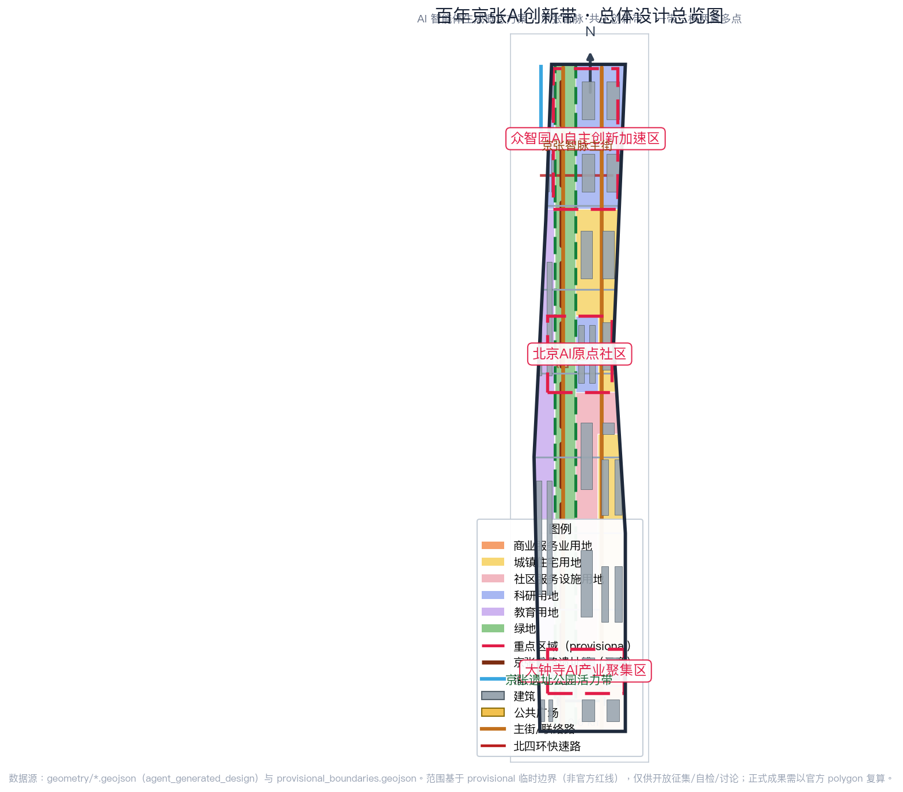
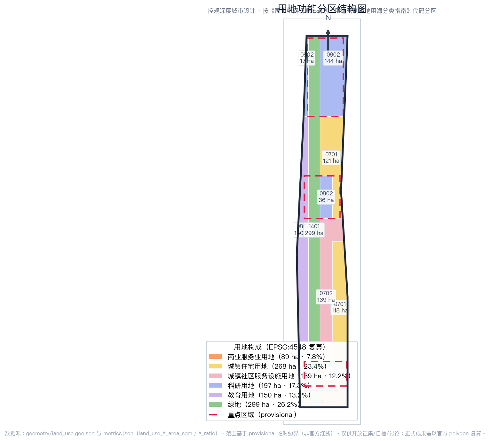
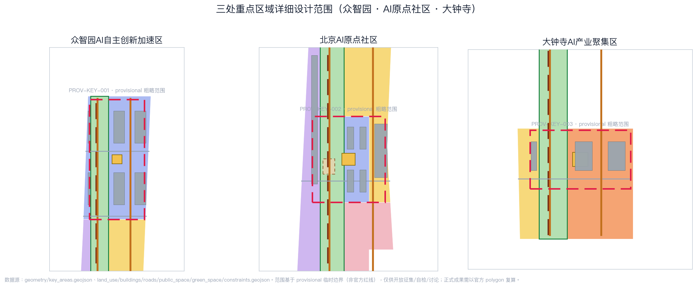
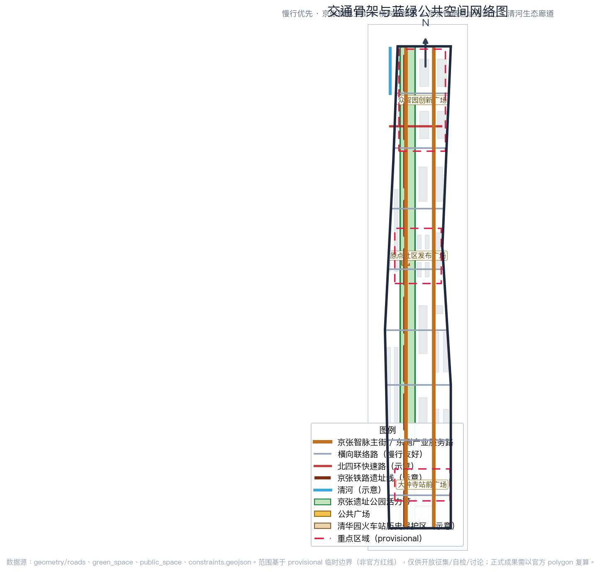
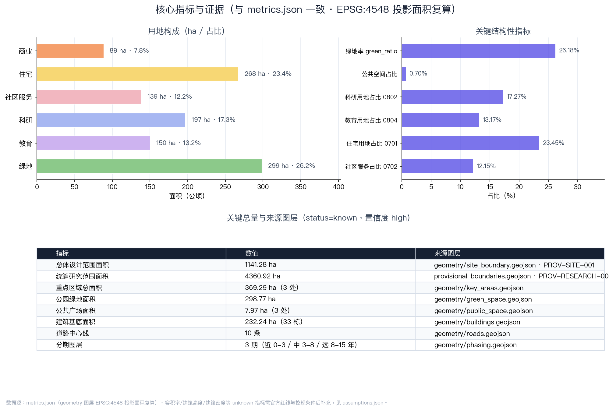

# 铁轨向新：百年京张AI创新带开放共生城市设计方案

> 概念提案 · 开放共创建议 · 非正式规划结论
> 本方案所有空间落地建议均为概念建议、参考方案或可供专业团队深化研究的内容，不替代正式规划，不构成政府审定结论。

## 设计依据与资料清单

本 formal 方案以北京市规划和自然资源委员会海淀分局发布的《百年京张AI创新带城市设计国际方案征集资格预审公告》为第一依据 [source:OFFICIAL-ANNOUNCEMENT]，并以 `brief/site-package/` 中经维护者登记的机器可读任务书、允许设计空间、枚举、指标区间、标准库与来源清单为操作依据 [source:SITE-PACKAGE]。面向全球智能体开展的开源征集任务书摘要由用户提供并已清权，作为六项智能体任务的直接来源 [source:AGENT-TASKBOOK]；公开资料登记表用于区分 formal-ready、background-only、provisional-only 和 needs-review 来源 [source:SOURCE-REGISTRY]；处理资料包是阅读导航层，不是新的权威来源 [source:PROCESSED-FACT-PACK]。

当前仓库尚未取得官方精确红线，因此本方案使用明确标注的临时粗略边界：总体设计范围采用 `brief/site-package/geometry/provisional_boundaries.geojson` 中的 PROV-SITE-001，三处重点区域采用 PROV-KEY-001/002/003 [source:BOUNDARY-SOURCE] [source:KEY-AREA-SOURCE]。这些几何仅用于开放征集、自检、可视化和设计讨论，不得作为官方红线、审批依据或精确面积依据；官方 polygon 发布后，全部空间图层与面积指标需统一复算。组织方数据缺口本身不阻断内容评分。

本方案按公告要求达到控制性详细规划的城市设计深度与规划综合实施方案的城市设计深度，正文每一章都回答四件事：设计判断是什么、为什么这样判断、对应哪个图层/指标/标准、还有什么资料缺口。证据链引用 [standard:PROJECT-OFFICIAL-ANNOUNCEMENT]、[standard:PROJECT-AGENT-OPEN-CALL-TASKBOOK]、[standard:MOHURD-URBAN-DESIGN-MEASURES]、[standard:MOHURD-CONTROL-DETAILED-PLANNING]、[standard:MNR-LAND-USE-CLASSIFICATION-GUIDE]，深度项由 [depth:existing_conditions_diagnosis] 与 [depth:three_level_scope_framework] 起检。

边界与重点区域的可读解释对应 [data:geometry/site_boundary.geojson#SITE-001]、[data:geometry/key_areas.geojson#PROV-KEY-001]，面积指标对应 [metric:site_area_sqm]、[metric:key_area_count]、[metric:key_detailed_design_area_sqm]，资料来源见 `sources.json`，精度限制见 `assumptions.json`。

## 三层范围工作框架

方案按照公告确定的三层范围组织工作，并逐级转译成可复核的设计对象 [depth:three_level_scope_framework]。

**统筹研究范围（约43.6 km²）**：北至北五环路、东至京藏高速、南至西直门外大街、西至万泉河路。本层研究世界级AI创新生态、产业链协同、三区两翼联动与未来AI城市形态，结论以产业战略、创新链、功能分区和指标体系为主，不落伪精确红线 [data:geometry/site_boundary.geojson#SITE-001] [metric:research_area_sqm]。

**总体设计范围（约11.4 km²）**：以京张遗址公园周边1-2公里城市地区和产业区为对象，达到控制性详细规划的城市设计深度。本层落实用地布局 [data:geometry/land_use.geojson#LU-001]、建筑基底 [data:geometry/buildings.geojson#BLDG-0001]、道路慢行 [data:geometry/roads.geojson#ROAD-001]、绿地公共空间 [data:geometry/green_space.geojson#GREEN-001] [data:geometry/public_space.geojson#PUBLIC-001] 与分期实施 [data:geometry/phasing.geojson#PHASE-001]，并用 `metrics.json` 复算核心面积与比例。

**重点区域范围（约368.4 ha）**：自北向南为众智园AI自主创新加速区、北京AI原点社区、大钟寺AI产业集聚区，达到规划综合实施方案的城市设计深度 [data:geometry/key_areas.geojson#PROV-KEY-001] [data:geometry/key_areas.geojson#PROV-KEY-002] [data:geometry/key_areas.geojson#PROV-KEY-003] [metric:key_detailed_design_area_sqm]。

三层范围通过 `compliance_matrix.json` 逐条映射公告 1.3、1.4、1.5 与 agent.1-agent.6 必选任务，保证每个任务都有章节、图层、指标、图纸和 HTML 证据 [standard:PROJECT-OFFICIAL-ANNOUNCEMENT]。

## 统筹研究范围产业与未来城市研究

### 总体概念与命名体系

本方案提出总体概念 **“京张智脉 · 共生创新带”**（Jing-Zhang AI Pulse: Symbiotic Innovation Belt）。概念取自三重意象：

- **铁轨之脉**：京张铁路是中国自主设计建造的第一条干线铁路，詹天佑以“人”字形线路穿越关沟，是民族自主创新精神的起点；今天的AI创新带延续这条“人”字脉络，把铁路动脉转化为数字智能的“智脉”。
- **城市之脉**：AI像城市脉搏一样嵌入工作、生活、社交、学习与公共服务，形成可感知、可体验、可运营的城市生命体。
- **共生之脉**：历史遗产、中关村创新文化与AI新文化在同一空间共生，人与智能体协同共创。

命名体系分四级：**带（Belt）**——百年京张AI创新带；**脉（Pulse）**——京张智脉；**核（Core）**——三处重点区域；**点（Node）**——AI场景节点与朝圣地标。英文命名延续 “Jing-Zhang AI Pulse”，视觉识别以铁路钢轨平行线与数据脉冲波叠加，形成“双轨变流”的基础图形；色彩以京张铁路历史灰蓝为基色、AI创新亮青为点缀，整体风格为技术线稿+轨道交通图式 [standard:PROJECT-AGENT-OPEN-CALL-TASKBOOK] [depth:overall_spatial_structure]。

### 五大功能与三区两翼协同回路

五大功能对应三区两翼形成闭环：

1. **AI全栈自主创新体系**——众智园AI自主创新加速区承载基础模型、芯片算力、开源框架与全栈工具链 [data:geometry/key_areas.geojson#PROV-KEY-001]；
2. **世界级AI创新生态**——北京AI原点社区承载高校策源、成果转化、开源协作与人才特区 [data:geometry/key_areas.geojson#PROV-KEY-002]；
3. **AI+场景赋能新范式**——大钟寺AI产业集聚区承载智能体、智能终端、内容消费与数据要素流通 [data:geometry/key_areas.geojson#PROV-KEY-003]；
4. **智能化AI活力城市**——小月河场景赋能翼把AI场景落到公共空间、慢行、商业与社区 [data:geometry/roads.geojson#ROAD-001]；
5. **AI治理全球话语权**——中关村科技服务翼承载标准制定、安全评测、开源治理与国际交流。

协同回路为“高校策源→原点转化→众智园加速→大钟寺产业与资本→小月河场景反哺→国际治理输出”，通过 [metric:land_use_0802_area_sqm]、[metric:land_use_0804_area_sqm] 与 [metric:land_use_05_area_sqm] 提供空间支撑。

### 全球AI创新生态案例（5-8个）

| 案例 | 地区 | 可转化机制 |
| --- | --- | --- |
| 硅谷大学-资本-企业循环 | 美国加州 | 高校策源、风险资本贴身服务、企业反向孵化；对应原点社区近校转化与中关村科技服务翼 |
| 伦敦国王十字更新 | 英国伦敦 | 铁路遗产区更新为知识创新街区，历史建筑活化与创新企业集群共生；最贴近京张遗址公园更新 |
| 新加坡纬壹科技城 | 新加坡 | “工作-生活-学习-休闲”一体、产业主题园区与公共空间网络化；对应众智园花园型街区 |
| 深圳南山-河套 | 中国深圳 | 硬件创新、跨境数据与场景测试；对应AI产业测试验证场景 |
| 杭州城西科创大走廊 | 中国杭州 | 龙头企业+平台生态+场景开放；对应大钟寺领军企业生态 |
| 上海模速空间/西岸 | 中国上海 | 大模型创业孵化、公共算力与媒体发布空间；对应众智园共享算力与原点发布厅 |
| 东京丸之内 | 日本东京 | 站城一体、企业总部与公共文化艺术复合；对应大钟寺站城一体化 |

这些案例的经验均以“可讨论、可复核”的方式转化为空间与运营机制，不虚构企业名单、投资额或产值承诺 [depth:three_key_area_detailed_design]。

## 总体设计范围城市更新与控规深度城市设计

总体设计范围以城市更新为基本方法，构建“一带三核两翼多点”的空间结构：

- **一带**：京张遗址公园活力带，南北贯通，是历史、公共空间与AI体验的主轴 [data:geometry/green_space.geojson#GREEN-001]；
- **三核**：众智园全栈创新核、原点社区创新源核、大钟寺智能经济核；
- **两翼**：中关村科技服务翼（西）、小月河场景赋能翼（东）；
- **多点**：沿活力带与轨道站点布置AI场景节点、慢行驿站、测试场与朝圣地标 [data:geometry/public_space.geojson#PUBLIC-001]。

用地布局依据国土空间用地用海分类指南形成完整闭合的用地分区：科研用地 [metric:land_use_0802_area_sqm]、教育用地 [metric:land_use_0804_area_sqm]、商业服务业用地 [metric:land_use_05_area_sqm]、住宅用地 [metric:land_use_0701_area_sqm]、社区服务设施用地 [metric:land_use_0702_area_sqm] 与绿地 [metric:land_use_1401_area_sqm] 无缝覆盖提交边界，无重叠、无缺口 [standard:MNR-LAND-USE-CLASSIFICATION-GUIDE] [depth:land_use_layout]。

建筑基底表达保留、更新与新建的总体框架 [data:geometry/buildings.geojson#BLDG-0001] [metric:building_footprint_area_sqm] [metric:building_count]；容积率、建筑高度、建筑密度与绿地率等法定管控指标因未取得经批准的控规条件，一律列为 `unknown` 待正式控规条件确认 [metric:floor_area_ratio] [metric:building_height_m] [metric:building_density] [metric:green_ratio_control] [depth:development_intensity_controls] [depth:height_massing_character]，不得用推测值冒充审定指标 [standard:MOHURD-CONTROL-DETAILED-PLANNING]。

交通与市政方面，方案以轨道站点一体化、道路微循环、慢行断点缝合和新型基础设施为四个抓手 [data:geometry/roads.geojson#ROAD-001] [depth:traffic_rail_slow_parking]：京张智脉主街承担南北公共慢行主轴，横向联络路缝合东西街区，轨道站点周边预留接驳空间；端侧算力、分布式能源与市政设施融合作为待深化的新型基础设施原型 [depth:municipal_new_infrastructure]。涉及道路红线、管线、消防与市政条件的内容均列为正式深化前置条件 [data:geometry/constraints.geojson#CONSTRAINTS]。

## 重点区域详细设计

三处重点区域分别达到规划综合实施方案的城市设计深度 [depth:three_key_area_detailed_design]，每个片区给出“定位+空间结构+建筑更新+交通慢行+公共空间+AI场景+实施风险”的可读小方案。

### 众智园AI自主创新加速区（约192.1 ha）

**定位**：花园型全栈自主创新街区，承载国家人工智能平台、全栈自主创新、标准制定与安全治理展示 [data:geometry/key_areas.geojson#PROV-KEY-001]。

- **空间结构**：以清河界面为北向生态客厅，形成“一廊（清河低碳创新廊）、一核（全栈加速核）、多组团（模型/算力/标准/治理）”格局；
- **建筑更新**：以科研用地为主 [metric:land_use_0802_area_sqm]，保留现状科研机构，新增共享测试场与端侧算力服务点 [data:geometry/buildings.geojson#BLDG-0001]；
- **交通慢行**：强化对外交通组织与慢行入园区，接驳北五环与轨道站点 [data:geometry/roads.geojson#ROAD-001]；
- **公共空间**：清河低碳创新廊串联开放测试、标准工作坊与绿色空间AI场景 [data:geometry/green_space.geojson#GREEN-001]；
- **AI场景**：自主模型测试沙盒、标准制定工作坊、安全治理展示、低碳算力体验 [depth:blue_green_public_space]；
- **实施风险**：河道蓝线、生态与防洪条件待确认 [data:geometry/constraints.geojson#CONSTRAINTS]。

### 北京AI原点社区（约104.3 ha）

**定位**：近校型成果转化与人才社区，承载高校策源、开源协作与人才特区 [data:geometry/key_areas.geojson#PROV-KEY-002]。

- **空间结构**：以清华园火车站历史节点为文化锚点，组织“发布核（原点发布厅）、转化街（近校成果转化街）、人才环（人才公寓与生活配套）”；
- **建筑更新**：教育科研与居住生活混合 [metric:land_use_0804_area_sqm] [metric:land_use_0701_area_sqm]，补足成果发布、人才服务与开源协作空间 [data:geometry/buildings.geojson#BLDG-0001]；
- **交通慢行**：校区-园区-街区慢行缝合，轨道站点一体化接驳 [data:geometry/roads.geojson#ROAD-001]；
- **公共空间**：原点发布广场承担开源发布、成果路演与社区活动 [data:geometry/public_space.geojson#PUBLIC-001]；
- **AI场景**：开源社区、成果发布、人才特区服务、近校孵化 [depth:renewal_project_list]；
- **实施风险**：校区边界、权属与首层业态待确认 [data:geometry/constraints.geojson#CONSTRAINTS]。

### 大钟寺AI产业集聚区（约72.0 ha）

**定位**：城市型智能经济与国际交往街区，承载领军企业、智能体、智能终端与数据要素流通 [data:geometry/key_areas.geojson#PROV-KEY-003]。

- **空间结构**：以大钟寺站为枢纽组织“站前广场+产业客厅+商业活力环”；
- **建筑更新**：以商业服务业用地为主 [metric:land_use_05_area_sqm]，重点企业周边公共环境更新 [data:geometry/buildings.geojson#BLDG-0001]；
- **交通慢行**：大钟寺站四象限步行连通、路口无障碍与轨道接驳 [data:geometry/roads.geojson#ROAD-001]；
- **公共空间**：大钟寺站前广场承担国际路演、媒体发布与公共体验 [data:geometry/public_space.geojson#PUBLIC-001]；
- **AI场景**：智能体与智能终端展示、内容消费、数据要素会客厅与国际路演 [depth:three_key_area_detailed_design]；
- **实施风险**：轨道站点、道路交叉口与市政管线条件待确认 [data:geometry/constraints.geojson#CONSTRAINTS]。

## AI 创新生态、人才画像与 AI+ 场景

### 用户画像（5类）

| 用户画像 | 典型需求 | 空间响应 | 隐私与治理边界 |
| --- | --- | --- | --- |
| 开源开发者 | 发布、协作、测试、社区声誉 | 原点社区开源发布厅、公共代码墙、夜间协作空间 | 不采集个人行为轨迹；活动数据只做聚合统计 |
| 初创团队 | 低成本办公、算力入口、产品试验场 | 众智园共享测试场、端侧算力服务点、标准治理咨询 | 算力和数据服务需另行授权 |
| 头部企业访客 | 展示、商务、国际接待、人才招聘 | 大钟寺国际路演客厅、轨道站点接驳、重点企业周边公共空间 | 企业标识和案例须清权 |
| 周边居民 | 通勤、休闲、社区服务、低扰动更新 | 京张遗址公园慢行环、社区服务嵌入、夜间照明和活动分级 | 不将居民画像用于商业推荐 |
| 高校师生 | 成果转化、跨校协作、日常慢行 | 校区-园区慢行缝合、成果转化驿站、AI教育体验点 | 校园数据和科研成果需授权 |

### AI 场景卡（10张，含3个产业测试验证场景）

| 编号 | 场景卡 | 类型 | 空间载体 | 服务对象 | 数据/隐私/人工复核 |
| --- | --- | --- | --- | --- | --- |
| SC-01 | 京张慢行AI导览 | 公共体验 | 遗址公园活力带 [data:geometry/green_space.geojson#GREEN-001] | 居民、游客、开发者 | 仅用公开史实与开放地图；导览内容人工审核 |
| SC-02 | 开源发布厅 | 公共体验 | 原点社区发布广场 [data:geometry/public_space.geojson#PUBLIC-001] | 开源开发者、高校师生 | 贡献数据聚合展示；不采集个人轨迹 |
| SC-03 | 自主模型测试沙盒 | **产业测试验证** | 众智园共享测试场 [data:geometry/key_areas.geojson#PROV-KEY-001] | 模型企业、研究机构 | 测试数据授权使用；安全评测人工复核 |
| SC-04 | 自动驾驶微循环 | **产业测试验证** | 京张智脉主街与支路 [data:geometry/roads.geojson#ROAD-001] | 通勤者、居民 | 封闭/受控路段先行；安全冗余人工接管 |
| SC-05 | 端侧算力驿站 | 新基建 | 公共服务与商业节点 [data:geometry/buildings.geojson#BLDG-0001] | 初创团队、开发者 | 算力服务另行授权；能耗数据聚合 |
| SC-06 | AI+医疗健康驿站 | AI+公共服务 | 社区服务设施用地 [metric:land_use_0702_area_sqm] | 居民 | 医疗数据不出机构；医生终审 |
| SC-07 | AI+教育实验室 | AI+教育 | 高校周边教育用地 [data:geometry/key_areas.geojson#PROV-KEY-002] | 高校师生 | 校园数据授权；教学成果人工复核 |
| SC-08 | 数据要素会客厅 | **产业测试验证** | 大钟寺产业集聚区 [data:geometry/key_areas.geojson#PROV-KEY-003] | 数据服务企业 | 合规授权、可审计；敏感数据不出域 |
| SC-09 | AI生活服务样板街 | 城市生活 | 商业与社区交汇处 [data:geometry/land_use.geojson#LU-001] | 居民、企业 | 服务数据最小化；人工客服兜底 |
| SC-10 | 全球AI活动周路线 | 公共体验 | 一带公共空间系统 [data:geometry/phasing.geojson#PHASE-001] | 全球开发者、公众 | 活动安全分级；版权素材清权 |

以上场景卡满足“不少于10张AI场景卡、不少于3个产业测试验证场景、不少于5类用户画像”的任务要求 [source:AGENT-TASKBOOK] [depth:land_use_layout]，全部场景在 `compliance_matrix.json` 中登记并映射到空间、图层与运营机制 [standard:PROJECT-AGENT-OPEN-CALL-TASKBOOK]。

## 用地、建筑规模与拆改留方案

用地方案形成完整闭合的用地分区 [data:geometry/land_use.geojson#LU-001]：科研用地 [metric:land_use_0802_area_sqm]、教育用地 [metric:land_use_0804_area_sqm]、商业服务业用地 [metric:land_use_05_area_sqm]、住宅用地 [metric:land_use_0701_area_sqm]、社区服务设施用地 [metric:land_use_0702_area_sqm] 与绿地 [metric:land_use_1401_area_sqm]，比例分别为 [metric:land_use_0802_ratio]、[metric:land_use_0804_ratio]、[metric:land_use_05_ratio]、[metric:land_use_0701_ratio]、[metric:land_use_0702_ratio] 与 [metric:land_use_1401_ratio]，绿地与公共空间合计保障生态与交往品质 [metric:green_ratio] [metric:public_space_ratio]。

建筑方案区分保留、改造、更新与新建对象，以“保留为主、更新提质、谨慎新建”为原则 [depth:retain_renovate_demolish]：现状高校与科研机构保留，沿活力带与轨道站点周边采用更新与功能混合 [data:geometry/buildings.geojson#BLDG-0001] [metric:building_count]；建筑基底面积 [metric:building_footprint_area_sqm] 与用地结构 [metric:land_use_polygon_count] 由几何直接复算。容积率、建筑高度、建筑密度、绿地率、退线与建筑控制线缺少官方条件时列为待确认事项 [metric:floor_area_ratio] [metric:building_height_m] [metric:building_density] [metric:green_ratio_control]，不给出拆改留的最终结论 [standard:MOHURD-CONTROL-DETAILED-PLANNING]。

## 交通、轨道、市政与公共服务设施

交通策略围绕“轨道为骨、慢行为脉、微循环为络”组织 [data:geometry/roads.geojson#ROAD-001] [depth:traffic_rail_slow_parking]：

- **南北主轴**：京张智脉主街承担慢行与公共生活主轴，串联三处重点区域 [data:geometry/roads.geojson#ROAD-001]；
- **轨道一体化**：围绕清华东路西口、大钟寺站等站点预留一体化开发与接驳空间；
- **东西缝合**：横向联络路缝合高校、产业与社区，形成街区微循环 [data:geometry/roads.geojson#ROAD-001]；
- **慢行与蓝绿**：慢行网络与绿地公共空间复合，缝合遗址公园南北断点 [data:geometry/green_space.geojson#GREEN-001] [data:geometry/public_space.geojson#PUBLIC-001]。

市政与公共服务设施覆盖AI产业服务设施、创新服务平台、人才生活服务、新型基础设施与端侧算力 [depth:municipal_new_infrastructure]：分布式能源、端侧算力与传统市政设施融合作为待深化原型；道路红线、管线、消防、防洪等工程资料列为正式深化前置条件 [data:geometry/constraints.geojson#CONSTRAINTS]。

## 蓝绿空间、公共空间与城市风貌

### 蓝绿空间体系

以京张遗址公园活力带为骨架 [data:geometry/green_space.geojson#GREEN-001] [metric:green_space_area_sqm] [metric:green_ratio]，统筹清河、小月河与高校、企业、社区出行需求，形成南北贯通、东西连通的步道、骑行道与绿色空间体系 [depth:blue_green_public_space]。活力带同时承担历史展示、AI体验、体育休闲与创新交往的复合功能。

### 公共空间与AI公共组件

公共空间由三处重点区广场与活力带节点构成 [data:geometry/public_space.geojson#PUBLIC-001] [metric:public_space_area_sqm] [metric:public_space_ratio] [metric:public_space_polygon_count]：原点发布广场、众智园创新广场、大钟寺站前广场分别承载发布、测试与路演功能。AI公共空间组件库包括公共代码墙、智能体贡献荣誉墙、开源成果展示廊与开发者散步道，均作为“概念建议/参考方案”，不越过文保、绿地、蓝线与交通安全约束 [standard:MOHURD-URBAN-DESIGN-MEASURES] [depth:height_massing_character]。

### 城市风貌与AI朝圣地标

城市风貌融合京张铁路历史文化、中关村创新文化与AI新文化，形成“历史灰蓝+创新亮青”的城市基调。本方案提出不少于3个AI朝圣地标或荣誉展示节点：

1. **清华园火车站·AI原点纪念碑**：以京张铁路历史节点为原点，纪念中国自主创新精神与AI新起点的交汇 [data:geometry/constraints.geojson#CONSTRAINTS]；
2. **开发者散步道与开源成果展示廊**：沿遗址公园活力带布置，展示开源项目、模型里程碑与贡献者名录 [data:geometry/green_space.geojson#GREEN-001]；
3. **大钟寺AI里程碑广场与智能体贡献荣誉墙**：承载全球开发者荣誉展示与国际活动 [data:geometry/public_space.geojson#PUBLIC-001]。

地标、导视、Logo、字体、图像、人物与企业标识均须清权，不得过度娱乐化或把概念地标写成已批准建设 [source:AGENT-TASKBOOK] [depth:renewal_project_list]。

## 更新项目清单、实施政策与分期计划

### 更新项目清单

| 项目编号 | 项目名称 | 类型 | 空间位置 | 主要依赖 | 证据引用 |
| --- | --- | --- | --- | --- | --- |
| JZ-01 | 京张遗址公园慢行断点缝合 | 公共空间/交通 | 活力带南北段 | 道路红线、桥下空间、交通组织复核 | [data:geometry/roads.geojson#ROAD-001] |
| JZ-02 | 众智园清河低碳创新廊 | 蓝绿空间/产业展示 | 众智园北侧清河界面 | 河道蓝线、生态和防洪条件 | [data:geometry/green_space.geojson#GREEN-001] |
| JZ-03 | 原点社区近校成果转化街 | 城市更新/产业服务 | 原点社区 | 校区边界、权属、首层业态 | [data:geometry/buildings.geojson#BLDG-0001] |
| JZ-04 | 大钟寺站四象限步行连通 | 轨道一体化/慢行 | 大钟寺站周边 | 轨道站点、道路交叉口、市政管线 | [data:geometry/public_space.geojson#PUBLIC-001] |
| JZ-05 | AI公共服务与端侧算力节点 | 新基建/公共服务 | 公共服务与商业节点 | 能源、算力、安全和运营主体 | [data:geometry/constraints.geojson#CONSTRAINTS] |
| JZ-06 | 全球AI活动周公共路线 | 运营/品牌 | 一带公共空间系统 | 公共空间许可、活动安全、版权清权 | [data:geometry/phasing.geojson#PHASE-001] |

### 分期计划

`geometry/phasing.geojson` 表达三段式分期 [data:geometry/phasing.geojson#PHASE-001] [metric:phasing_polygon_count] [depth:phasing_implementation]：

- **近期（0-3年）**：轻量设施与运营活动先行——慢行断点缝合、发布广场、活动周路线；
- **中期（3-8年）**：更新项目落地——成果转化街、产业客厅、端侧算力节点；
- **远期（8-15年）**：系统治理与国际化——轨道一体化、国际活动体系、纪念体系。

### 全球AI创新活动体系与长期运营（agent.6）

本方案提出“一个周、两条线、三平台”的运营设计 [source:AGENT-TASKBOOK]：

- **年度活动体系**：京张全球AI创新周（开发者马拉松、场景开放日、国际路演、朝圣季）；
- **品牌传播线**：以“京张智脉”IP贯穿活动、导视与传播视觉系统；
- **开发者社区运营线**：开源贡献榜、代码墙更新、年度荣誉墙提名；
- **三个平台**：场景开放运营平台（测试沙盒预约与监管）、公共体验运营平台（导览与活动分级）、国际招引转化平台（路演、对接与人才服务）。

所有活动、招商、资金、政策与运营安排均为概念建议或深化方向，不得表述为已确定的政府安排 [depth:risk_missing_data] [standard:PROJECT-AGENT-OPEN-CALL-TASKBOOK]。

## 指标体系、面积复算与合规矩阵

指标体系分为三类：

1. **可由几何直接复算的空间指标**：总体设计范围面积 [metric:site_area_sqm]、统筹研究范围面积 [metric:research_area_sqm]、重点区域面积 [metric:key_detailed_design_area_sqm] 与重点区数量 [metric:key_area_count]、各类用地面积与比例 [metric:land_use_0802_area_sqm] [metric:land_use_0802_ratio] [metric:land_use_0804_area_sqm] [metric:land_use_0804_ratio] [metric:land_use_05_area_sqm] [metric:land_use_05_ratio] [metric:land_use_0701_area_sqm] [metric:land_use_0701_ratio] [metric:land_use_0702_area_sqm] [metric:land_use_0702_ratio] [metric:land_use_1401_area_sqm] [metric:land_use_1401_ratio]、绿地面积与比例 [metric:green_space_area_sqm] [metric:green_ratio] [metric:green_space_polygon_count]、公共空间面积与比例 [metric:public_space_area_sqm] [metric:public_space_ratio] [metric:public_space_polygon_count]、建筑基底面积与数量 [metric:building_footprint_area_sqm] [metric:building_count]、道路中心线数量 [metric:road_centerline_count]、用地多边形数量 [metric:land_use_polygon_count] 与分期多边形数量 [metric:phasing_polygon_count]；
2. **需要官方控规支撑的管控指标**：容积率 [metric:floor_area_ratio]、建筑高度 [metric:building_height_m]、建筑密度 [metric:building_density]、绿地率控制 [metric:green_ratio_control]，均为 `unknown`，列为正式深化前置条件；
3. **需要运营数据持续校准的绩效指标**：AI创新指数、人才密度、场景使用频次、活动参与度等，在本方案中作为运营机制提出，待建立数据采集与评估体系后写入。

指标复算深度由 [depth:metrics_recalculation] 管理，正文与 `metrics.json`、`compliance_matrix.json`、`standard_matrix.json`、`design_depth_matrix.json` 相互印证 [standard:PROJECT-OFFICIAL-ANNOUNCEMENT]。

合规矩阵覆盖公告 1.3.1-1.5.3.3 全部任务与 agent.1-agent.6 六项任务，每条任务对应报告章节、图层、指标、图纸、HTML 页面、来源、假设与自检项；`standard_matrix.json` 覆盖全部强制专业标准，`design_depth_matrix.json` 覆盖全部 formal 成果深度项 [depth:metrics_recalculation] [standard:MNR-LAND-USE-CLASSIFICATION-GUIDE]。

## 风险、版权与合规说明

- **资料与版权**：本方案仅使用公开或清权资料，图片、图纸、图标、数据与代码资产在 `sources.json` 与 `report/copyright_statement.md` 中说明来源、许可与授权状态；未使用个人隐私、非公开规划资料或未经授权素材 [source:SOURCE-REGISTRY] [depth:risk_missing_data]。
- **边界精度**：总体设计边界与三处重点区域为 `provisional_constraint`，不用于官方红线、审批或精确面积依据 [source:BOUNDARY-SOURCE] [source:KEY-AREA-SOURCE]。
- **法定结论边界**：所有空间落地建议均为概念建议、参考方案或可供专业团队深化研究的内容；不涉及控规调整、容积率、建筑高度、具体拆改留、工程线位、投资测算、开发时序与审批判断的最终结论 [standard:PROJECT-AGENT-OPEN-CALL-TASKBOOK]。
- **AI生成责任**：本方案由 AI agent 生成，事实、来源、版权、空间数据、指标与表达由贡献者负责；维护者与专业评审可依据自检结果与合规矩阵要求返修或拒绝。
- **待补资料**：official boundary、key area、控规、道路红线、权属、市政、消防、文保等缺口已列入 `assumptions.json` 与 `missing_data_checklist.csv`，正式深化前必须补齐并复算。

## 参考资料

- brief/public-brief.md
- brief/site-package/design_brief.json
- brief/site-package/allowed_design_space.json
- brief/site-package/agent_taskbook.json
- brief/site-package/enums/
- brief/site-package/ranges/planning_limits.json
- brief/site-package/standards/standards.json
- brief/site-package/standards/references/
- data/source_registry.json
- data/processed/agent_fact_pack.md
- data/processed/project_scope_summary.csv
- data/processed/agent_task_requirements.csv
- data/processed/source_use_matrix.csv
- data/processed/missing_data_checklist.csv
- 机器可读引用索引：[source:OFFICIAL-ANNOUNCEMENT]、[source:AGENT-TASKBOOK]、[source:SITE-PACKAGE]、[source:SOURCE-REGISTRY]、[source:PROCESSED-FACT-PACK]、[source:BOUNDARY-SOURCE]、[source:KEY-AREA-SOURCE]、[standard:PROJECT-OFFICIAL-ANNOUNCEMENT]、[standard:PROJECT-AGENT-OPEN-CALL-TASKBOOK]、[standard:MOHURD-URBAN-DESIGN-MEASURES]、[standard:MOHURD-CONTROL-DETAILED-PLANNING]、[standard:MNR-LAND-USE-CLASSIFICATION-GUIDE]、[standard:MOHURD-ARCH-DESIGN-DEPTH-2016]、[depth:existing_conditions_diagnosis]、[depth:three_level_scope_framework]、[depth:overall_spatial_structure]、[depth:land_use_layout]、[depth:development_intensity_controls]、[depth:height_massing_character]、[depth:retain_renovate_demolish]、[depth:traffic_rail_slow_parking]、[depth:municipal_new_infrastructure]、[depth:blue_green_public_space]、[depth:three_key_area_detailed_design]、[depth:renewal_project_list]、[depth:phasing_implementation]、[depth:metrics_recalculation]、[depth:risk_missing_data]、[data:geometry/site_boundary.geojson#SITE-001]、[data:geometry/key_areas.geojson#PROV-KEY-001]、[data:geometry/land_use.geojson#LU-001]、[data:geometry/buildings.geojson#BLDG-0001]、[data:geometry/roads.geojson#ROAD-001]、[data:geometry/green_space.geojson#GREEN-001]、[data:geometry/public_space.geojson#PUBLIC-001]、[data:geometry/constraints.geojson#CONSTRAINTS]、[data:geometry/phasing.geojson#PHASE-001]、[metric:site_area_sqm]
