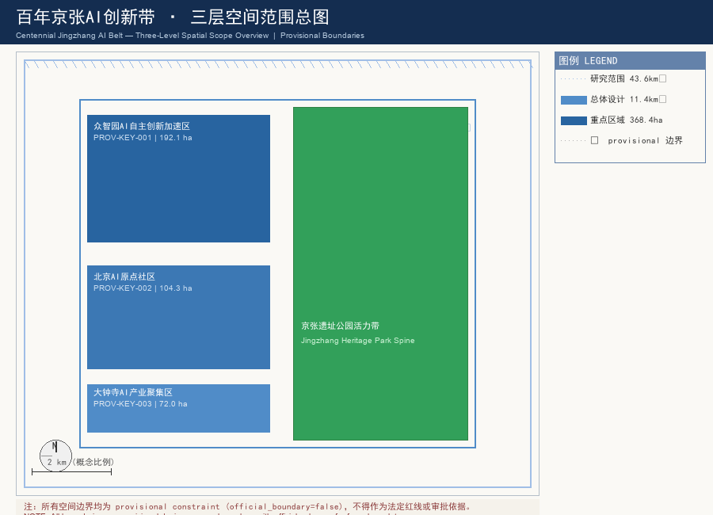
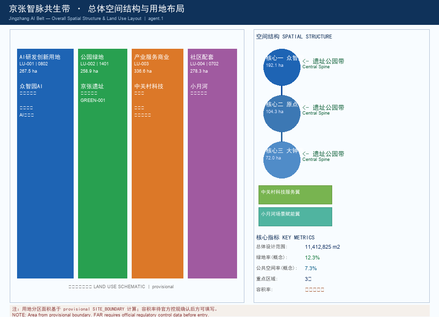
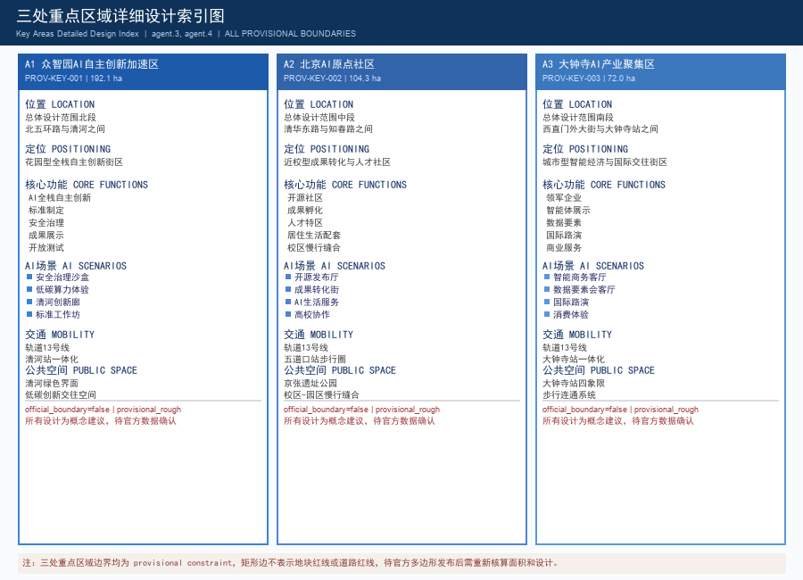
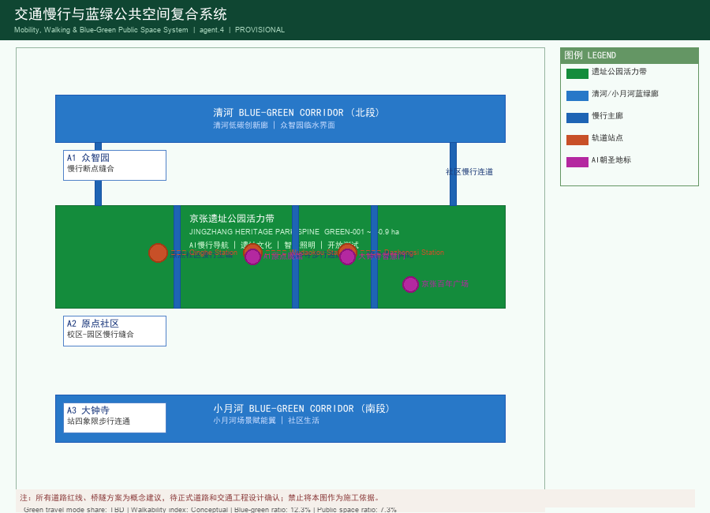
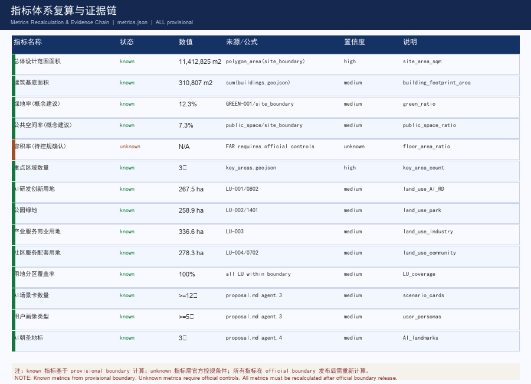

# Centennial Jingzhang AI Belt

## Design Basis and Source Inventory

This formal proposal takes the "Announcement on the International Open Call for Urban Design Schemes — Centennial Jingzhang AI Innovation Belt" published by the Haidian Branch of the Beijing Municipal Commission of Planning and Natural Resources as its primary reference, and uses the provisional rough boundaries, key areas, enumerations, metrics, and source lists registered by the maintainer in `brief/site-package/` as machine-readable references. Before generating any design, the AI agent must read `design_brief.json`, `allowed_design_space.json`, `sources.json`, `enums/`, `ranges/`, `schemas/`, `data/source_registry.json`, and `data/processed/agent_fact_pack.md`, and must establish task, scope, source usage, and gap checklists using `project_scope_summary.csv`, `agent_task_requirements.csv`, `source_use_matrix.csv`, and `missing_data_checklist.csv`. All design judgments must be broken down into traceable sources, recalculable metrics, verifiable layers, and manually auditable assumptions. The announcement requires proposals to reach the urban design depth of a control detailed planning (控规) document and the urban design depth of a comprehensive planning implementation plan; therefore, text descriptions cannot substitute for GeoJSON files, metric tables, A3 booklets, A0 display boards, and HTML digital deliverables.

This proposal is not an independent vision statement; it organizes deliverables starting from the announcement, the Agent Taskbook, and site materials. This section places only the most critical references alongside key judgments [source:OFFICIAL-ANNOUNCEMENT] [source:AGENT-TASKBOOK] [depth:existing_conditions_diagnosis]. Complete source and standard coverage are preserved separately in `sources.json`, `standard_matrix.json`, and `design_depth_matrix.json` and are not repeated in the main text as machine indices.

The usage boundaries for the source registry are as follows [source:SOURCE-REGISTRY]:

- `data/source_registry.json` registers the usage boundaries for public, cleared-rights, and provisional sources.
- Current registry summary: 0 formal-use sources, 0 background sources, 0 provisional-only sources.
- The agent must not upgrade `background_only` or `provisional_only` sources to official boundary, statutory 控规, formal scoring basis, or government implementation commitment.

`data/processed/agent_fact_pack.md` serves as a reading navigation layer for this proposal and is not a new authoritative source [source:PROCESSED-FACT-PACK]. It helps the agent organize the three-layer scope, three key areas, announcement tasks, agent.1–agent.6, source availability, and data-gap items into a readable proposal; factual judgments still require returning to registered raw materials [source:OFFICIAL-ANNOUNCEMENT] [source:AGENT-TASKBOOK]. Complete source relationships are preserved in `sources.json`.

This scaffold uses `brief/site-package/geometry/provisional_boundaries.geojson` to generate a provisional formal package in the absence of an official `SITE_BOUNDARY` or three `KEY_AREA` polygons. Both `geometry/site_boundary.geojson` and `geometry/key_areas.geojson` in the submission package must be labeled as `provisional_constraint` with `official_boundary=false`; they may only be used for proposal generation, self-checking, visualization, and design discussion, and cannot serve as official redline, approval basis, precise area basis, or statutory control conclusion. This organizer data gap itself does not block content scoring; once official polygons are provided, the site boundary, key areas, land use, roads, green space, public space, buildings, phasing, and metrics all require recalculation.

The scorable status for this scaffold-generated submission is: **Provisional boundary, precision warnings retained and recalculation required upon release of official data; content scoring is not blocked.** Therefore, spatial structure, scenarios, projects, and metrics in the main text are all written under the principle of "open for discussion, verifiable, and recalculable after official boundary replacement"; when official boundaries and key-area polygons are updated, the agent must rerun the scaffold, self-checks, and drawing/HTML generation — not merely replace a single file.

Boundary interpretation can refer back to the overall scope layer and area recalculation [data:geometry/site_boundary.geojson#SITE-001] [metric:site_area_sqm]. The three key areas are cross-referenced through independent layers and quantitative metrics [data:geometry/key_areas.geojson#PROV-KEY-001] [metric:key_area_count]. This means readers can follow evidence links from the main text without first navigating a string of machine IDs.

## Three-Layer Scope and Work Framework

The proposal organizes its work according to the three levels established by the announcement: the **overall research scope** addresses the AI industry ecosystem, strategic positioning, innovation chain, and future urban form across 43.6 km²; the **overall design scope** addresses the urban area and industrial zones within 1–2 km of the 11.4 km² Jingzhang Heritage Park, requiring a framework for urban renewal, industrial space layout, transport and municipal support, and urban character control; the **key area scope** addresses three detailed design areas covering 368.4 ha, requiring clear definition of functions and business types, building scale, classification of retain/renovate/demolish, public space connectivity, and traffic organization. The three layers are mapped item by item in `compliance_matrix.json`, ensuring that every required task from announcement sections 1.3, 1.4, and 1.5 and from agent.1 through agent.6 has corresponding chapter, layer, metric, drawing, and HTML evidence.

The depth requirements for the three-layer work framework are governed by [depth:three_level_scope_framework] and [depth:overall_spatial_structure]; spatial evidence is based on [data:geometry/site_boundary.geojson#SITE-001] and [data:geometry/key_areas.geojson#PROV-KEY-001]; task basis is based on [standard:PROJECT-OFFICIAL-ANNOUNCEMENT]; and scope indexing navigates through the three-layer scope table in `project_scope_summary.csv` within [source:PROCESSED-FACT-PACK].

The three layers of work are not a set of disconnected drawings. Overall research determines industry chain and urban form judgments; overall design translates those judgments into renewal projects, spatial structure, and facility capacity; key area detailed design verifies the implementability of specific parcels, buildings, traffic, public space, and AI application scenarios. When generating the proposal, the agent must first lock in the current official or provisional boundaries and constraints being used, then generate land use, buildings, roads, green space, public space, phasing, and AI service node layers — finally recalculating metrics from these layers and explaining in the main text which conclusions remain subject to provisional boundary limitations. Any area, ratio, scale, or project count that cannot be recalculated from structured data must not be written into formal conclusions.

The overall concept recommended for this proposal is the **"Jingzhang AI Symbiosis Corridor"**: using the Jingzhang Heritage Park as the historical and public space main axis, the three key areas — Zhongzhiyuan, Beijing AI Origin Community, and Dazhongsi — as innovation anchors, and universities, enterprises, communities, and rail stations as the daily network, forming a spatial organization of "One Belt, Three Cores, Multiple Node Scenarios, and a Blue-Green Pedestrian Composite Ring." Here, the "One Belt" is not an additional new red line to be drawn; it translates the announcement's three-layer scope into a working methodology. "Three Cores" correspond to the three key areas. "Multiple Node Scenarios" correspond to operable nodes for AI+ public services, industrial services, and urban life. The "Composite Ring" corresponds to the coordination of slow mobility, green space, public space, and activity routes.

| Layer | Design Question | Proposal Answer | Data Anchor |
| --- | --- | --- | --- |
| Overall Research Scope | How to organize the AI industry ecosystem and future urban form | Establish an innovation chain of "university origination → open-source collaboration → enterprise transformation → public experience → international dissemination" | compliance_matrix.json, standard_matrix.json |
| Overall Design Scope | How to map industrial space, urban renewal, transport and municipal infrastructure, and urban character | Land use, buildings, roads, green space, public space, and phasing layers jointly express the design | [data:geometry/land_use.geojson#LU-001], [data:geometry/roads.geojson#ROAD-001] |
| Key Area Scope | How to reach detailed design depth for the three areas | Propose positioning, spatial actions, AI scenarios, and implementation dependencies separately | [data:geometry/key_areas.geojson#PROV-KEY-001], [data:geometry/key_areas.geojson#PROV-KEY-002], [data:geometry/key_areas.geojson#PROV-KEY-003] |

## Overall Research Scope: Industry and Future Urban Form Studies

The core task of the overall research scope is to build a world-class AI innovation ecosystem. The proposal should map Haidian's university research institutes, leading enterprises, computing-algorithm-data factors, incubation platforms, listed companies, unicorns, and technology service resources, and propose a spatial coordination framework for the AI innovation chain, industry chain, talent chain, and urban service chain. The naming scheme and logo design should serve the overall identity of the "Centennial Jingzhang Cultural Belt, Urban AI Life Experience Belt, and AI Fusion Innovation Belt" — not stopping at slogans, but explaining the connections to the industry ecosystem, public space, and cultural resources. The Agent Taskbook also requires responding to the "five functions" and "three districts, two wings" coordination, forming a naming system, visual identity, overall spatial structure diagram, scenario opening, and operating mechanism that can be further developed. This section must annotate these requirements as originating from the agent open-call taskbook using [source:AGENT-TASKBOOK] and [standard:PROJECT-AGENT-OPEN-CALL-TASKBOOK], rather than statutory planning control.

Overall research does not introduce new pseudo-precise redlines; through the urban character, public space, and building layout coordination required by [standard:MOHURD-URBAN-DESIGN-MEASURES], it connects back to [data:geometry/land_use.geojson#LU-001], [data:geometry/public_space.geojson#PUBLIC-001], and [depth:overall_spatial_structure], explaining that industry strategy ultimately must be expressed in a visible, verifiable spatial structure.

The future urban form study should address how artificial intelligence is changing work, life, social interaction, learning, mobility, and public services. The proposal should implement AI traffic systems, continuous green space, innovation service facilities, and an international living-working atmosphere as locatable functional zones, nodes, corridors, and scenarios — not general technology visions. The agent should embed industry strategic metrics, AI innovation indices, talent density, spatial supply types, and AI+ vertical application priority areas into the metric system, clearly marking which are official, which are design recommendations, and which still require calibration against official data. If proposing global AI innovation events, developer communities, open scenarios, or pilgrimage routes, they should be written as "conceptual recommendations/reference schemes/available for professional team deepening study" and must not be written as already-confirmed government events or implementation arrangements.

## Overall Design Scope: Urban Renewal and Control Detailed Planning Depth Urban Design

The overall design scope requires reaching the urban design depth of a control detailed planning (控规) document. The proposal must propose an overall urban renewal spatial structure, identification of low-efficiency spaces, a renewal project inventory, implementation policy recommendations, industrial function ratios, spatial organization models, total building scale, and comprehensive carrying capacity assessment. `geometry/land_use.geojson` should completely cover the design boundary without overlap; `geometry/buildings.geojson` should express renewal or retained building footprints; `geometry/roads.geojson` should express micro-circulation, slow mobility, and rail interchange relationships; and `metrics.json` should recalculate core areas, ratios, and layer counts.

This section disaggregates 控规 depth content into auditable objects according to [standard:MOHURD-CONTROL-DETAILED-PLANNING]: [data:geometry/land_use.geojson#LU-001] expresses land use structure; [data:geometry/buildings.geojson#BLDG-001] expresses building footprints; [data:geometry/roads.geojson#ROAD-001] expresses traffic organization; [metric:building_footprint_area_sqm] is used to verify building footprint area; and [depth:land_use_layout] and [depth:development_intensity_controls] constrain deliverable depth.

The overall design must also support transport, rail, municipal, and ancillary facilities. The proposal should propose spatial layouts and implementation paths for rail station integration, road micro-circulation, non-motorized vehicle parking, parking supply, innovation service platforms, talent living services, new infrastructure, distributed energy, and edge computing. For content involving building height, development intensity, road redlines, building setback lines, and facility standards, where official control conditions are not yet available, it should be stated as "pending confirmation of official 控规 conditions" and must not use agent-speculated values as approved metrics.

## Key Area Detailed Design

Key area detailed design is mandatory. The **Zhongzhiyuan AI Autonomous Innovation Acceleration Area** should propose a detailed scheme focused on national AI platforms, full-stack autonomous innovation, standard-setting, security governance, industry exhibition, external transport, Qinghe culture, low-carbon green innovation exchange environments, and green space AI scenarios. The **Beijing AI Origin Community** should propose a detailed scheme focused on near-university innovation, achievement incubation and transfer, talent special zone, open-source system, branded events, building retain/renovate/demolish classification, achievement display and release, residential and living support, campus-park pedestrian connection, and rail station integration. The **Dazhongsi AI Industry Cluster** should propose a detailed scheme focused on leading enterprises, AI agents, intelligent terminals, content consumption, data factors, digital assets, commercial services, planning green space composite utilization, Dazhongsi Station integration, and four-quadrant pedestrian connectivity at intersections.

The three key area detailed designs must reference [data:geometry/key_areas.geojson#PROV-KEY-001], [data:geometry/key_areas.geojson#PROV-KEY-002], and [data:geometry/key_areas.geojson#PROV-KEY-003], and must be checked by [depth:three_key_area_detailed_design] for whether they reach the planning comprehensive implementation plan depth. If the proposal only describes "building a demonstration area" without evidence of functions, buildings, traffic, public space, and implementation projects, it should be considered incomplete.

The three key areas must appear in `geometry/key_areas.geojson`. If the repository provides official polygons, they should be used as `official_constraint`; if official polygons are missing, `provisional_constraint` may be used temporarily, but the main text, HTML, sources, assumptions, and self-check must state that it cannot serve as formal scoring or approval basis. `compliance_matrix.json` should separately cover announcement sections 1.5.3.1, 1.5.3.2, and 1.5.3.3. Design expression should include functions and business types, building scale, building form, retain/renovate/demolish classification, public space system, traffic organization, pedestrian connectivity, and implementation projects. HTML pages should allow switching between the three key areas; A3 booklets and A0 display boards should include at least key area overview maps, detailed局部 maps, and metric descriptions.

| Key Area | Design Positioning | Spatial Actions | AI Industry and Operating Scenarios | Evidence References |
| --- | --- | --- | --- | --- |
| Zhongzhiyuan AI Autonomous Innovation Acceleration Area | Garden-type full-stack autonomous innovation district | Strengthen Qinghe riverfront interface, industry exhibition, low-carbon innovation exchange, and external transport organization; use green space to host open testing and standard governance exhibition | Autonomous model testing, standard-setting workshops, security governance exhibition, low-carbon computing experience | [data:geometry/key_areas.geojson#PROV-KEY-001], [depth:three_key_area_detailed_design] |
| Beijing AI Origin Community | Near-university achievement transfer and talent community | Organize campus-park-district pedestrian stitching; supplement achievement release, talent services, residential living, and open-source collaboration spaces | Open-source community, achievement release, talent special zone services, near-university incubation | [data:geometry/key_areas.geojson#PROV-KEY-002], [source:AGENT-TASKBOOK] |
| Dazhongsi AI Industry Cluster | Urban intelligent economy and international exchange district | Center on Dazhongsi Station integration, four-quadrant pedestrian connectivity, commercial services, and public environment renewal around key enterprises | AI agent and intelligent terminal exhibition, content consumption, data factors, and international roadshows | [data:geometry/key_areas.geojson#PROV-KEY-003], [metric:key_area_count] |

## AI Innovation Ecosystem, User Personas, and AI+ Scenarios

The proposal should establish spatial demand profiles for AI talent and enterprises, covering R&D offices, open-source collaboration, achievement release, enterprise services, talent housing, social learning, consumer life, sports and recreation, and international exchange. AI+ scenarios should be organized around the directions of traffic, services, consumption, healthcare, education, law, and life services raised in the announcement, forming industry development scenarios and AI-empowered urban function scenarios. Each scenario should specify the service target, spatial location, data source, privacy boundary, human review mechanism, and operating entity.

AI scenarios must be tied to spatial and governance boundaries: public space scenarios reference [data:geometry/public_space.geojson#PUBLIC-001]; slow mobility and traffic scenarios reference [data:geometry/roads.geojson#ROAD-001]; open space scenarios reference [data:geometry/green_space.geojson#GREEN-001] and [metric:public_space_ratio], [metric:green_ratio]. These references let reviewers know the scenarios are not slogans but design objects located in specific layers and metrics. The Agent Taskbook requires no fewer than 10 AI scenario cards, no fewer than 3 industry testing and validation scenarios, and no fewer than 5 types of user personas; the scaffold provides only the structure — formal competitors must write scenario cards, persona profiles, privacy boundaries, human review, and operating entities into the main text, HTML, A3/A0, and compliance matrix.

| User Persona | Typical Needs | Spatial Response | Self-Check Boundary |
| --- | --- | --- | --- |
| Open-Source Developer | Release, collaboration, testing, community reputation | Open-source release hall in the Origin Community, public code wall, overnight collaboration space | No collection of individual behavior trajectories; event data used only for aggregate statistics |
| Startup Team | Low-cost office, computing access, product testing ground | Shared testing field in Zhongzhiyuan, edge computing service points, standard governance consultation | Computing and data services require separate authorization |
| Leading Enterprise Visitor | Exhibition, business, international reception, talent recruitment | Dazhongsi international roadshow lounge, rail station interchange, public space around key enterprises | Enterprise branding and cases require rights clearance |
| Surrounding Resident | Commute, recreation, community services, low-disruption renewal | Jingzhang Heritage Park pedestrian ring, embedded community services, nighttime lighting and activity grading | Resident profiles not used for commercial recommendations |
| University Faculty/Student | Achievement transfer, cross-campus collaboration, daily slow mobility | Campus-park pedestrian stitching, achievement transfer station, AI education experience point | Campus data and research outcomes require authorization |

| Scenario Card | Spatial Carrier | Design Description |
| --- | --- | --- |
| 01 Open-Source Release Hall | Beijing AI Origin Community | Targeting universities, open-source communities, and startup teams, providing achievement release, code contribution display, and small-scale roadshow space |
| 02 Security Governance Sandbox | Zhongzhiyuan | Translating standard-setting, security evaluation, and model red-team testing into visitable, bookable, and regulable exhibition and collaboration nodes |
| 03 Edge Computing Station | Overall Design Scope nodes | Combined with public services, enterprise services, and low-carbon energy strategy, serving as a new infrastructure prototype for further development |
| 04 AI Slow Mobility Navigation | Jingzhang Heritage Park Vitality Belt | Using explainable signage and low-intrusion sensing to help identify slow mobility breakpoints, congestion nodes, and accessibility needs |
| 05 Dazhongsi International Roadshow Lounge | Dazhongsi AI Industry Cluster | Serving AI agent, intelligent terminal, and content consumption enterprises for exhibition, negotiation, media release, and international exchange |
| 06 Qinghe Low-Carbon Innovation Corridor | Zhongzhiyuan riverfront along Qinghe | Combining green space, stormwater management, walking and cycling, and AI exhibition as the park's public living room |
| 07 Near-University Achievement Transfer Street | Beijing AI Origin Community | Organizing incubation, exhibition, legal, IP, and investment-finance services for university achievement transfer |
| 08 Data Factors Reception Hall | Dazhongsi area | Presenting a compliant, authorized, and auditable urban service interface for data factor and digital asset circulation |
| 09 AI Life Services Model Street | Community and commercial intersection | Grounding AI+ healthcare, education, law, life services, and other scenarios in operable small-scale district spaces |
| 10 Global AI Event Week Route | One Belt public space system | Forming a walkable and shareable experiential route from heritage culture, open-source community, industry exhibition, to international roadshows |

AI governance recommendations generated by the agent must comply with data minimization, public sources, explainability, and human review principles. Urban AI agents can assist in identifying slow mobility breakpoints, public space heat maps, facility maintenance needs, enterprise service demands, and event safety risks — but must not replace planning approval, must not output unauthorized personal profiles, and must not claim official implementation commitments. All AI scenario nodes should be entered into structured layers or the compliance matrix, making it easy for reviewers to see their relationship with industry, space, and public interest.

## Land Use, Building Scale, and Retain/Renovate/Demolish Plan

The land use proposal should be expressed according to public standards such as land and space survey, planning, and use control classifications, forming a complete, closed, and seamless land use zoning. The building proposal should distinguish between retained, renovated, renewed, newly built, or pending-confirmation objects, and clearly specify the recommended levels for building footprint, function, scale, character, roof, massing, and height control. If current building conditions, property rights, 控规, and engineering conditions are lacking, the proposal can only propose methods and pending-calibration lists and must not fabricate retain/renovate/demolish conclusions.

Land use classification follows [standard:MNR-LAND-USE-CLASSIFICATION-GUIDE]; building height, massing, interface, and character control are managed by [depth:height_massing_character]; and retain/renovate/demolish methods are managed by [depth:retain_renovate_demolish]. Primary evidence for land use and buildings is [data:geometry/land_use.geojson#LU-001], [data:geometry/buildings.geojson#BLDG-001], and [metric:building_footprint_area_sqm].

Building scale and intensity metrics must be consistent with `metrics.json` and layers. If total building scale, floor area ratio (FAR), building height, building density, green space ratio, setback lines, and building control lines lack official conditions, they should be listed as `unknown` or `pending_control` in the metric system — pseudo-precision values must not be used to create a false sense of accuracy. The A3 booklet should provide the renewal project inventory and metric verification table; the A0 display board should clearly express key spatial structure and key areas; the HTML page should provide linked viewing of metrics and layers.

## Transport, Rail, Municipal, and Public Service Facilities

The transport proposal should respond to the announcement's requirements for rail station integration, road micro-circulation, slow mobility breakpoints, external transport, parking, non-motorized vehicle parking, and green transport systems. Priority coverage should include North 5th Ring Road, Jingzhang Heritage Park crossing the ring road node, Wudaokou, the west entrance of Qinghua East Road, Dazhongsi Station, and transport connections around key enterprises. Road and slow mobility layers should remain within the submission boundary and be cross-verified with public space, green space, industry nodes, and key areas; if the submission boundary is provisional, transport conclusions can only serve as provisional design discussion.

Transport and municipal professional depth are respectively governed by [depth:traffic_rail_slow_parking] and [depth:municipal_new_infrastructure]; layer evidence references [data:geometry/roads.geojson#ROAD-001], [data:geometry/public_space.geojson#PUBLIC-001], and [data:geometry/constraints.geojson#CONSTRAINTS]. When road redlines, pipelines, fire protection, and municipal conditions are lacking, this should be stated through assumptions as items to be supplemented — not writing strategies as approved conditions.

Municipal and public service facilities should cover AI industry service facilities, innovation service platforms, talent living service facilities, new infrastructure, distributed energy, edge computing, and integration with traditional municipal facilities. The proposal should explain facility standards, spatial layout, service radius, operating model, and phased implementation logic. When pipeline, energy, drainage, flood control, fire protection, and other engineering data are lacking, they should be listed as prerequisites for formal deepening.

## Blue-Green Space, Public Space, and Urban Character

The blue-green space proposal should use the Jingzhang Heritage Park Vitality Belt as its backbone, coordinate the Qinghe River, Xiaoyue River, and travel needs of surrounding universities, enterprises, and communities, and propose a north-south through, east-west connected trail, cycling path, and green space system. The proposal should identify slow mobility breakpoints, ring-road crossing nodes, landscape nodes at the south and north ends of the park, and propose composite utilization strategies for parking, sports, innovation exchange, technology testing, application exhibition, and public services.

Blue-green public space is jointly verified by design depth items and green space and public space layers [depth:blue_green_public_space] [data:geometry/green_space.geojson#GREEN-001] [data:geometry/public_space.geojson#PUBLIC-001]. The significance of green and public space ratios is explained in the main text; complete recalculations are preserved in `metrics.json`; the coordination of urban character, public space, and building control returns to the professional standards matrix [standard:MOHURD-URBAN-DESIGN-MEASURES].

The urban character proposal should integrate the historical culture of the Jingzhang Railway, Zhongguancun innovation culture, and AI innovation culture; utilize cultural resources such as Qinghuayuan Railway Station and the Beijing Film Academy; and propose guidance for urban tone, building character, roof form, massing, interface, and public art. The agent should also propose wayfinding signage, cultural symbols, international communication narratives, AI pilgrimage landmarks, contribution walls, or honor exhibition systems — but all branding, fonts, images, portraits, and enterprise logos must have rights-cleared sources. Character control must clearly distinguish official regulations, design recommendations, and pending-confirmation conditions; pseudo-precise control lines must not be provided without heritage preservation or 控规 basis.

## Renewal Project Inventory, Implementation Policies, and Phasing Plan

The implementation proposal should form a auditable renewal project inventory, explaining project location, type, function, responsible entity, dependencies, implementation phase, risks, and evaluation metrics. Policy recommendations should cover urban renewal overall implementation, spatial supply, operating mechanisms, industry services, public participation, data governance, and property coordination. `geometry/phasing.geojson` should express phasing boundaries; `compliance_matrix.json` should link each task to phases and drawings.

Project inventory and phasing depth are managed by [depth:renewal_project_list] and [depth:phasing_implementation]; phasing spatial evidence is [data:geometry/phasing.geojson#PHASE-001]. If property rights, funding, implementing entities, and approval paths are lacking, the proposal must describe them as implementation risks rather than commitment to delivery.

| Project ID | Project Name | Type | Primary Dependencies | Evidence References |
| --- | --- | --- | --- | --- |
| JZ-01 | Jingzhang Heritage Park Slow Mobility Breakpoint Stitching | Public Space / Transport | Road redlines, under-bridge space, traffic organization verification | [data:geometry/roads.geojson#ROAD-001] |
| JZ-02 | Zhongzhiyuan Qinghe Innovation Interface | Blue-Green Space / Industry Exhibition | River blue lines, ecological and flood control conditions | [data:geometry/green_space.geojson#GREEN-001] |
| JZ-03 | Origin Community Near-University Achievement Transfer Street | Urban Renewal / Industry Services | Campus boundaries, property rights, ground-floor business types | [data:geometry/buildings.geojson#BLDG-001] |
| JZ-04 | Dazhongsi Station Four-Quadrant Pedestrian Connectivity | Rail Integration / Slow Mobility | Rail station, road intersection, municipal pipelines | [data:geometry/public_space.geojson#PUBLIC-001] |
| JZ-05 | AI Public Services and Edge Computing Nodes | New Infrastructure / Public Services | Energy, computing, security, and operating entity | [data:geometry/constraints.geojson#CONSTRAINTS] |
| JZ-06 | Global AI Event Week Public Route | Operations / Branding | Public space permits, event safety, copyright clearance | [data:geometry/phasing.geojson#PHASE-001] |

Phasing should be distinguished from the 100-day open-call design cycle: the open-call cycle is the time requirement for submitting deliverables, while implementation phasing is the advancement path for urban renewal and project construction. The proposal should propose near-term pilots, mid-term renewal, and long-term governance frameworks, and clearly indicate which content can launch first with lightweight facilities, operating activities, and service platforms — and which must wait for confirmation of official 控规, municipal, transport, and property rights conditions. For annual event systems, developer community operations, scenario open days, public experience routes, and international communication mechanisms, the main text should explain operating targets, frequency, responsibility boundaries, conversion paths, and risks — and must not be limited to promotional slogans.

## Metric System, Area Recalculation, and Compliance Matrix

The metric system should at minimum include overall design scope area, key area areas, green and public space ratios, building footprints, renewal project counts, AI scenario nodes, slow mobility connectivity metrics, industrial space metrics, talent service metrics, and self-check status. All `known` metrics must be recalculable from GeoJSON or credible sources; `unknown` metrics must provide reasons and formal submission prerequisites. The results of `scripts/spatial_review.py` and `scripts/visual_review.py` are important evidence for formal self-checks.

Metric recalculation follows the unified design depth requirement [depth:metrics_recalculation]. The main text focuses on explaining the design significance of metrics — for example, how the overall scope constrains spatial allocation, and how blue-green and public space ratios support daily interaction; complete values, formulas, source files, and confidence levels are preserved in `metrics.json`. Sample key metrics can be verified against the overall scope and green space data [metric:site_area_sqm] [data:geometry/green_space.geojson#GREEN-001].

The compliance matrix is the primary control file for task responsiveness. Every announcement task and agent_taskbook task must correspond to a report chapter, layer, metric, drawing, HTML page, source, assumption, and self-check item. Failure to cover any mandatory task from announcement sections 1.3, 1.4, or 1.5 or from agent.1 through agent.6 means the proposal must not enter formal professional scoring.

During formal deepening, the agent should also classify each metric into three categories: Category 1 comprises spatial metrics directly recalculable from submitted geometry, such as boundary area, green space ratio, public space ratio, building footprint area, and phasing area; Category 2 comprises control metrics requiring official 控规 or taskbook annex support, such as FAR, building height, building density, setback lines, road redlines, and facility standards; Category 3 comprises performance metrics requiring ongoing calibration against operational or industry data, such as AI innovation index, talent density, industry service satisfaction, slow mobility accessibility, event participation, and scenario usage frequency. The three categories of metrics should respectively enter `metrics.json`, `assumptions.json`, and `compliance_matrix.json` — avoiding the mistake of writing operational visions as approved planning conditions.

## Risk, Copyright, and Compliance Statement

**Bilingual format required.** The main proposal file may be in Chinese or English, but must provide a complete translated version through `proposal.en.md` or `proposal.zh.md`; A3/A0, HTML, and text-bearing graphics must also provide corresponding-language copies, prioritizing the competition-recommended translations from `docs/terminology-glossary.md`. The v2 package will block submission through finalize and CI checks if any required translated copy, language mapping, or valid file is missing. All image, drawing, icon, data, and code assets must state their source, license, and authorization status in `sources.json` or `report/copyright_statement.md`. HTML pages must not load remote scripts, remote map tiles, remote fonts, iframes, forms, or external APIs, and must not track reviewer behavior.

The risk and missing-data checklist is jointly verified by the risk depth item, constraint layers, and site package [depth:risk_missing_data] [data:geometry/constraints.geojson#CONSTRAINTS] [source:SITE-PACKAGE]. Official boundary, key area, 控规, road, parcel, building, municipal, heritage preservation, and public service gaps listed in `missing_data_checklist.csv` must enter `assumptions.json`, self-checks, and the risk section of the main text. Any conclusion lacking official 控规, road redlines, property rights, municipal, fire protection, or heritage preservation conditions must be downgraded to pending-confirmation items; complete professional verification is preserved in the standards matrix.

This proposal does not claim official approval, approved 控规, final land property rights, final construction scale, or guaranteed implementation. The AI agent is responsible for facts, sources, copyright, spatial data, metrics, and expression; maintainers and professional reviewers may request revisions or rejection based on self-check results, spatial verification, and compliance matrix requirements.

All spatial design proposals are conceptual proposals and reference solutions. The site boundary, key area polygons, land use, buildings, roads, green space, public space, phasing, and metrics in this proposal are based on `provisional_boundaries.geojson`; `official_boundary=false`. They serve only as design discussion references, cannot substitute for official approval documents, and must be recalculated after official boundaries are published.

## References

- brief/public-brief.md
- brief/site-package/design_brief.json
- brief/site-package/allowed_design_space.json
- brief/site-package/enums/
- brief/site-package/ranges/planning_limits.json
- data/processed/agent_fact_pack.md
- data/processed/project_scope_summary.csv
- data/processed/agent_task_requirements.csv
- data/processed/source_use_matrix.csv
- data/processed/missing_data_checklist.csv
- Complete machine index: see `sources.json`, `metrics.json`, `compliance_matrix.json`, `standard_matrix.json`, and `design_depth_matrix.json`
- Bibliographic entries in this section are based on the site package registry; complete citations and licenses are found in the structured source list [source:SITE-PACKAGE]
