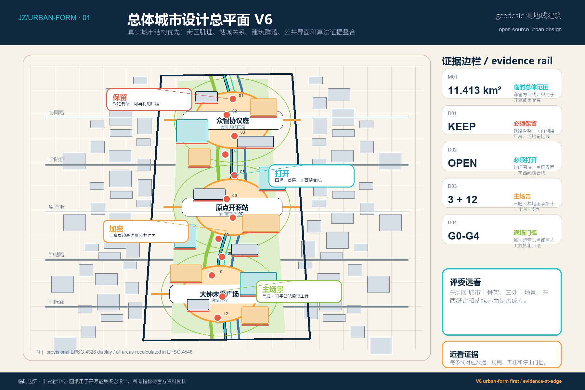
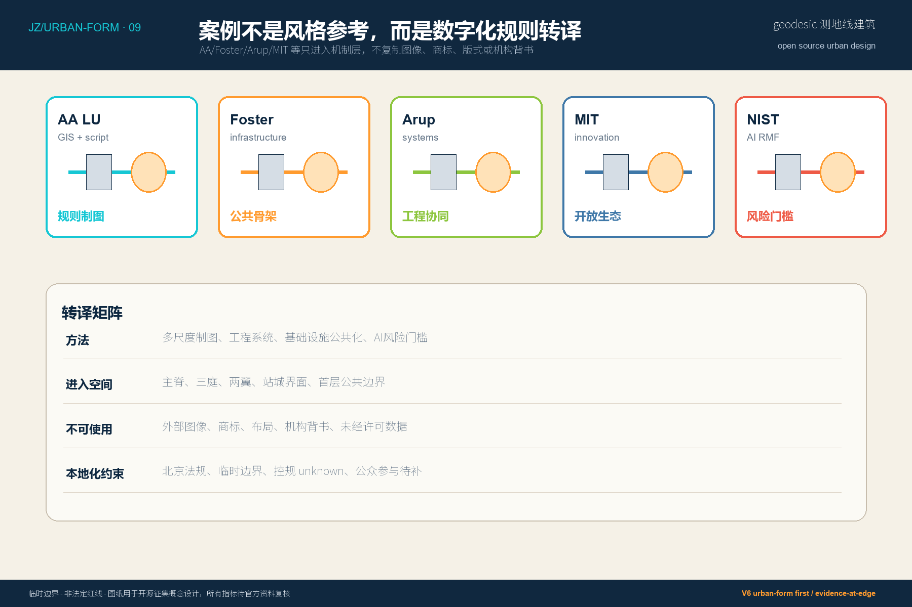
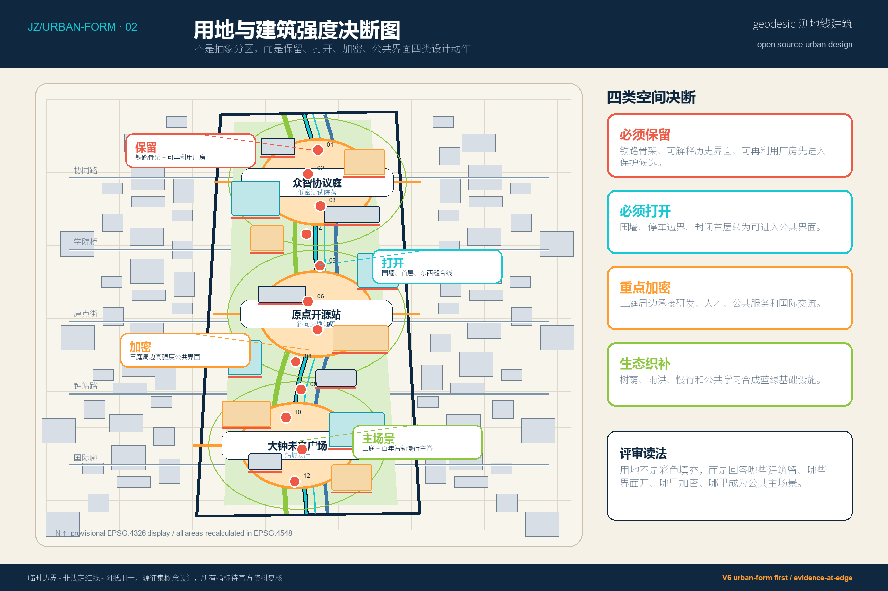
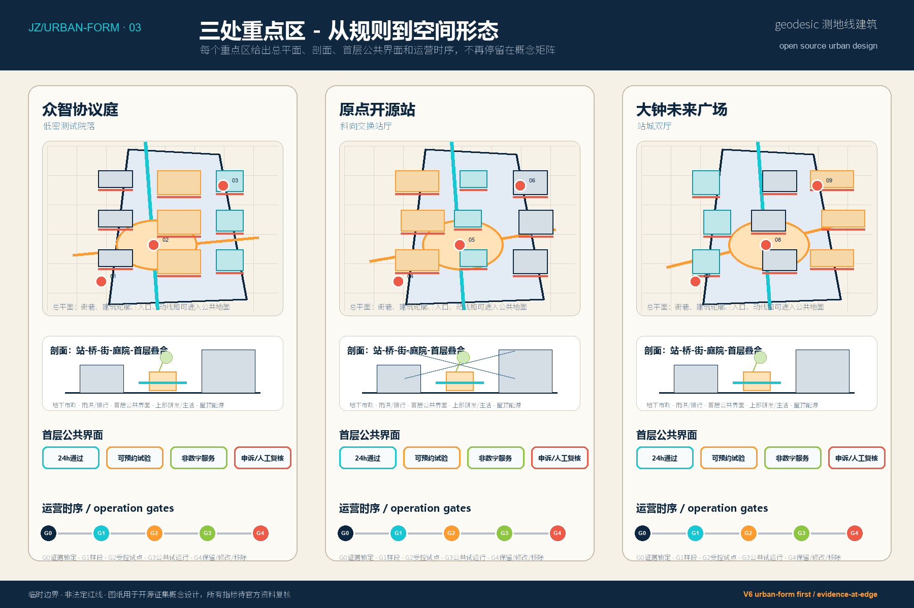
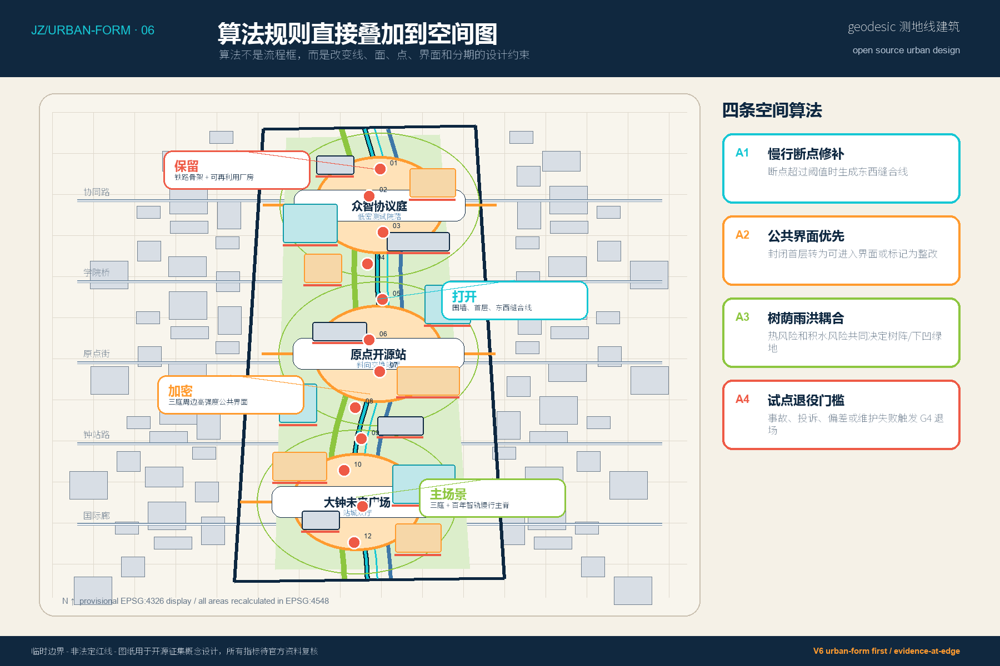
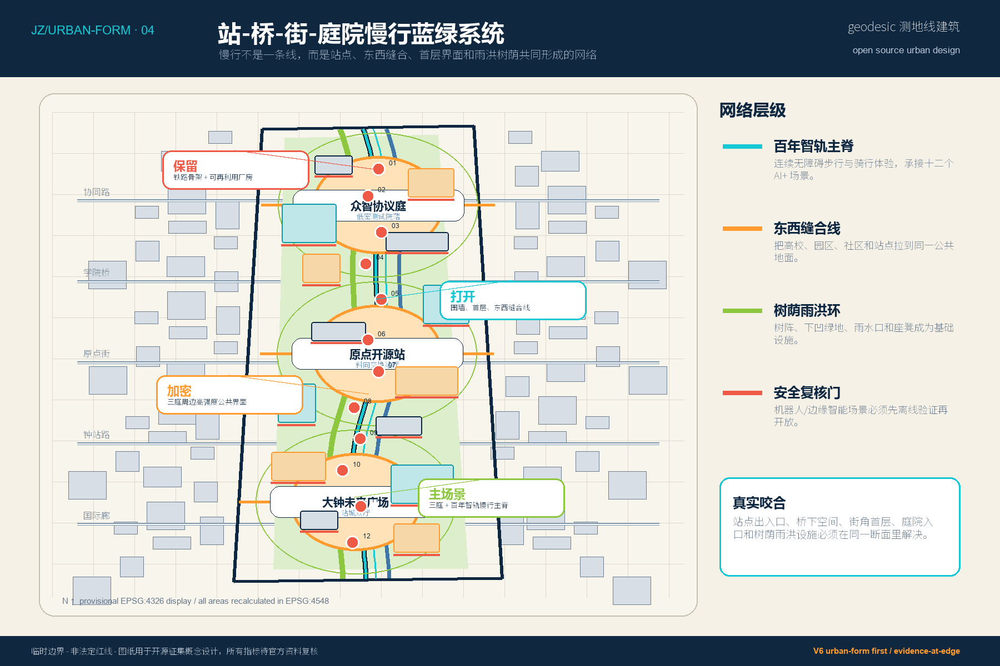
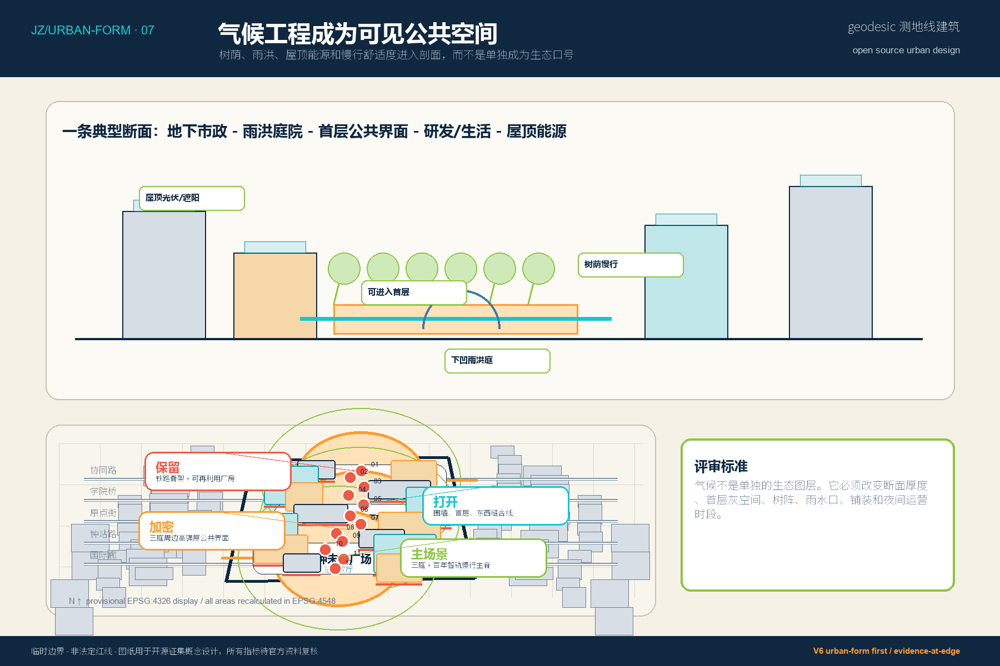
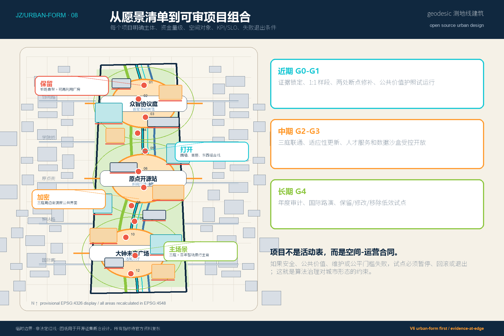
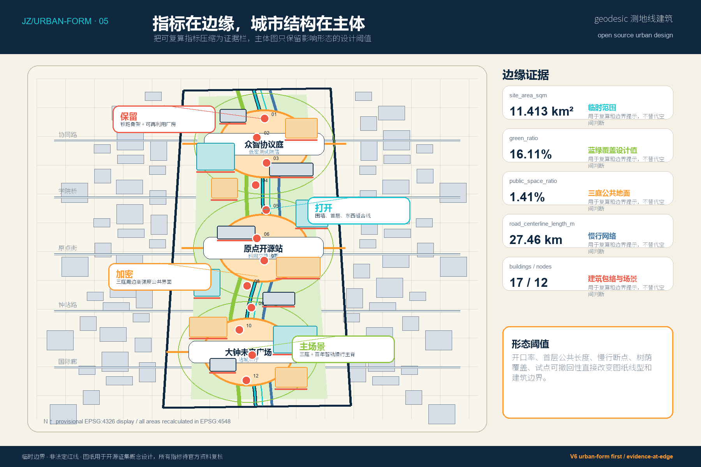
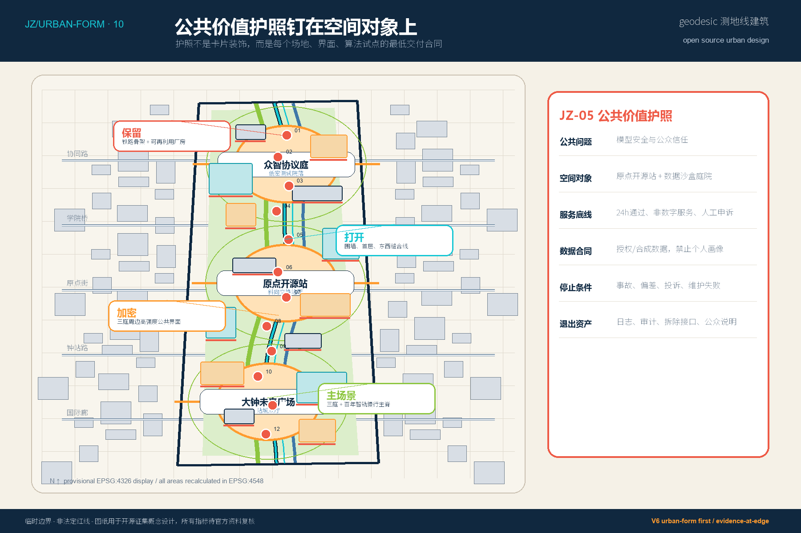

# 京张智共生：城市形态优先的开放智能共同体设计 V6

> V6 的核心修改是把空间图纸先行推进为城市形态优先：总体城市设计总平面、街区肌理、站城关系、建筑群落、首层公共界面、三处重点区剖面和算法-空间一致性校核共同证明方案已经从“可审计概念包”推进为“可评审城市设计图纸”。卡片、指标、护照和算法规则仍然不占据主体版式，而是退到总图、剖面、首层界面和运营时序的边缘，成为验证空间设计的证据层。

## 执行摘要：空间图纸先行

## V6 城市设计决断：保留、打开、加密、主场景

V6 不再把总体图当作窄长边界示意，而是把它作为城市设计总平面来审阅：街区肌理、站城关系、建筑群落、公共空间连续性、界面密度、景观剖面和算法门槛必须在同一张图中建立主次。评委远看先判断京张沿线是否形成清晰的公共骨架，近看再检查每条线、每个界面和每次试点的证据来源、人工复核与退出条件。[depth:overall_spatial_structure]

四个设计决断直接回应上一轮低分项。第一，必须保留铁路遗产骨架、可再利用建筑和可解释场地记忆，而不是用全新开发抹平连续性。第二，必须打开封闭围墙、停车边界和低效首层，把东西向缝合线接入高校、社区、园区和站点。第三，必须把强度集中到三处公共庭院周边，让研发、人才、国际交流和可信数据试验共享同一公共地面。第四，必须把三庭和百年智轨慢行主脊作为主场景，而不是让 AI 场景漂浮在卡片中。[data:geometry/buildings.geojson#BLDG-001]

算法在 V6 中不再以流程框为主，而是直接改变空间形态：慢行断点生成缝合线，公共界面评分决定开口和整改，热风险与积水风险共同决定树阵和下凹绿地，事故、投诉、偏差或维护失败触发 G4 退场。这样算法专家能审计规则，城市设计评委也能在图纸上看到规则如何改变线、面、点、首层和分期。[source:NIST-AI-RMF]

本方案只回答一个核心问题：如何以百年京张铁路遗产和连续公共地面为共同底座，把海淀高度集聚但相互割裂的 AI 研究、产业、教育、社区和国际交流资源，组织成一套可进入、可测试、可撤回、可复核的城市公共基础设施。V6 不把“AI创新带”理解为屏幕、装置或概念包装，而是理解为一套可计算的空间协议：每条线、每个场地、每个首层界面和每次运营试点都要有数据来源、人工复核、停止门槛和版本记录。[source:AGENT-TASKBOOK]

总体空间结构是“一脊三庭两翼十二场景”。一脊是沿京张遗产和慢行系统形成的百年智轨主脊；三庭是北部众智协议庭、中部原点开源站、南部大钟未来广场；两翼是中关村科技服务翼和小月河场景赋能翼；十二个 AI+ 场景落到真实节点，而不是浮在版面上。评审远看先判断结构是否成立，近看再核对指标、证据和治理承诺。[depth:overall_spatial_structure]

## 设计依据与资料清单

设计依据分为四层：官方公告和任务书定义任务边界，仓库 site package 提供临时几何和数据契约，标准矩阵约束城市设计与用地表达，案例研究只提供机制参考。V6 明确把所有空间指标写成“临时边界下的可复算结果”，不把它们称为官方红线、法定控规或现状测绘成果。[source:OFFICIAL-ANNOUNCEMENT]

本次迭代吸收三类方法参考：AA Landscape Urbanism 的多尺度制图、GIS 和脚本模拟思想；Foster + Partners 城市设计中基础设施、公共空间和分期学习的整合逻辑；Arup 式总体规划对交通、水、能源、数据和社会结果的系统协同。它们只进入“方法和规则”层，不构成机构背书，不复用图像、文字或版式。[source:AA-LU-DIGITAL]

所有机器可读资产保持在包内：GeoJSON 记录空间对象，metrics.json 记录复算指标，sources.json 记录来源边界，design_depth_matrix.json 和 compliance_matrix.json 记录专业深度与任务覆盖。图纸、HTML 和 PDF 均从这些对象重新组织表达，避免图纸、正文和指标互相矛盾。[data:geometry/site_boundary.geojson#SITE-001]

## 三层范围工作框架

统筹研究范围回答“京张 AI 创新带如何接入全球知识网络、区域产业生态和未来城市议题”；总体设计范围回答“约 11.4 平方公里临时范围如何形成连续公共结构、用地组织和可运营项目”；重点区域范围回答“三处关键片区如何达到可被评审比较的详细城市设计深度”。三层不是同一图纸的缩放，而是从战略网络、空间骨架到街区行动的逐层闭合。[depth:three_level_scope_framework]

V6 把三层关系画在同一套图纸逻辑中：总体图建立一脊三庭两翼，系统图拆出用地、慢行、蓝绿和市政，重点区图再给出总平面、剖面、首层公共界面和运营时序。这样做的目的不是增加图量，而是让每一张图都承担不同尺度的判断任务。[data:geometry/key_areas.geojson#PROV-KEY-001]

工作流保持“来源锁定 - 投影拓扑 - 空间图层 - 指标复算 - 图纸同步 - 自检校核”。算法在这里的作用是暴露设计关系和复算路径，而不是代替规划判断。任何正式边界、权属、交通、消防、市政、文保或公众参与资料到位后，必须先生成差异表，再整体更新图层、指标、正文、HTML 和 PDF。[depth:metrics_recalculation]

## 统筹研究范围产业与未来城市研究

产业研究的结论不是“再造一个封闭科技园”，而是建立可进入的创新共同体接口。MIT Kendall Square、Mila、Vector、AI Singapore、Seoul AI Hub 和 ETH AI Center 的共性启示是：AI 创新需要研究、教育、产业、公共空间、伦理治理和人才生活共同构成反馈环，而不是只依靠单体建筑或活动品牌。[source:CASE-MIT-KENDALL]

对京张而言，可迁移的是机制而非形态。开放模型共创、可信数据沙盒、红队测试、国际开源路演、人才生活服务和公共价值档案都必须落到空间节点，并写入谁能进入、使用什么数据、如何人工复核、失败后如何退出。V6 因此把十二个场景放在公共地面和慢行网络上，形成“研究 - 验证 - 发布 - 反馈 - 归档”的城市回路。[source:NIST-AI-RMF]

未来城市研究的关键不是堆叠智能设备，而是使城市能学习自己的试点结果。每一项 AI+ 服务都必须保留非数字替代路径，禁止把便利性变成排斥性；每一项场景测试都必须先在授权或合成数据中完成离线验证，再进入受控公开演示。这个原则是产业生态能否转化为公共价值的底线。[depth:municipal_new_infrastructure]

## 总体设计范围城市更新与控规深度城市设计

总体设计以“留骨架、改界面、补节点”为更新策略。留骨架是保留铁路遗产线索、可持续使用的建筑和可解释的城市记忆；改界面是把封闭首层、围墙边界和单一办公界面转成公共服务和创新交往界面；补节点是以小体量、可撤回、可复核的新介入补足开源协作、可信验证、国际路演和人才服务功能。[depth:retain_renovate_demolish]

用地结构使用标准 land_use_code 表达六类功能场：公园与生态开放、AI研发与可信验证、高校科研教育转化、人才社区生活服务、科技服务与城市客厅、轨道交通与公共接口。它们是概念设计分区，不是法定地块线；总建筑面积、容积率、建筑高度、密度和退线均保持 unknown，等待正式控规和工程资料。[standard:MNR-LAND-USE-CLASSIFICATION-GUIDE]

V6 的图面主次明确：深色边界为临时范围，青色粗线为公共主脊，橙色公共地面为三庭，浅色分区为用地场，深色块为概念建筑包络，虚线为临时重点区和需要复核的控制关系。指标只在边栏出现，作为证据而非视觉主体。[data:geometry/land_use.geojson#LU-001]

## 重点区域详细设计

三处重点区不再使用同一套矩形模板，而分别形成三种原型。北部众智协议庭是“低密测试院落”，服务模型评测、红队测试和端侧机器人慢行实验；中部原点开源站是“斜向交换站厅”，把高校、社区、园区和轨道日常穿行导入共享首层；南部大钟未来广场是“站城双厅”，承接国际路演、智能终端展示和数据合规教育。[depth:three_key_area_detailed_design]

每个重点区都补足四类图纸信息：总平面说明公共地面、慢行环、建筑包络和场景点；剖面说明地下市政、地面慢行雨洪、首层公共界面、上部研发生活和屋顶能源；首层界面说明 24 小时通过、可预约试验、非数字服务和申诉人工复核；运营时序说明 G0 到 G4 的进入和退出门槛。[data:geometry/public_space.geojson#PUBLIC-001]

正式深化仍有关键缺口：尺寸、树冠、管线、结构、消防、交通组织、权属和文保数据尚未齐备，因此当前图纸只表达设计规则和测试门槛，不伪造施工级剖面或已确定建筑量。这个克制比画满建筑更重要，因为它保护了方案的专业可信度。[depth:development_intensity_controls]

## AI 创新生态、人才画像与 AI+ 场景

人才画像覆盖研究者、开发者/创业者、学生、居民/老年人、城市运营者和国际访客。研究者需要跨学科会议、实验伦理和成果转化；开发者需要算力入口、测试环境和低成本空间；学生需要课程、导师和真实问题；居民需要无障碍、隐私、低扰动和申诉；运营者需要可审计数据和人工复核；国际访客需要多语导览、短期协作和清晰公共入口。[source:AGENT-TASKBOOK]

十二个 AI+ 场景被分为共创、验证、服务、产业、生态和传播六类。最关键的三类测试场景是可信数据沙盒、模型安全红队场、端侧智能与机器人慢行测试环；它们必须先通过离线数据、受控样段和人工安全复核，再允许公众接触。便民服务场景则必须保证不使用智能体也能获得同等基础服务。[metric:scenario_node_count]

V6 将场景卡变成“空间运营规则”：卡片不再占据画面中心，而是附着在公共地面、慢行节点和运营门槛上。每张卡只保留目的、用户、禁用用途、数据合同、离线评测、上线阈值、人工回退、事件响应和退役条件，避免把 AI 场景写成空泛叙事。[source:NIST-AI-RMF]

## 用地、建筑规模与拆改留方案

建筑包络以概念干预对象表达，不宣称现状建筑底数。已提交的 building_footprint_area_sqm 和 design_building_footprint_ratio 来自包内概念建筑基底并集，用于衡量方案对地面的占用程度；它们不是产权建筑面积、不是拆除量，也不是规划许可强度。[metric:building_footprint_area_sqm]

拆改留判断采用“保留候选、适应性再利用、可撤回新建”三类标签。保留候选强调结构和文化记忆；适应性再利用强调首层开放、节能改造和功能更新；可撤回新建强调轻量、可维护、可拆解和试点性。正式判断必须补充年代、结构、消防、权属、租户影响、文保价值和运营成本调查。[data:geometry/buildings.geojson#BLDG-001]

建筑风貌建立 geodesic 自己的图例体系：铁路暖红表示历史和永久构件，科技青表示新介入和可测试设施，纸白承载公共信息，深墨色用于主要文字和边界，生态绿只用于蓝绿系统。它不是套用 Foster、AA 或任何同行作品的视觉语言，而是把“历史骨架 + 数字协议 + 公共价值”统一到一套可读规则中。[standard:MOHURD-ARCH-DESIGN-DEPTH-2016]

## 交通、轨道、市政与公共服务设施

交通策略以“轨道到庭、步行到门、骑行成环”为目标。百年智轨慢行主脊承担南北连续体验，东西缝合廊道连接高校、园区、社区和站点，三庭成为换向、休息、导览和活动集散节点。当前 road_centerline_length_m 只表示概念慢行网络，不是现状道路总长，也不替代交通专项设计。[metric:road_centerline_length_m]

市政策略是“传统设施先行，智能服务叠加”。电力、通信、排水、消防、应急和无障碍基础条件满足后，才布置边缘算力、传感、机器人充换电和数字导视。所有智能设备都需要断网降级、手动接管、维护责任和安全标识，不能把城市运行交给不可解释的自动流程。[depth:traffic_rail_slow_parking]

公共服务设施以共享会议、知识产权、法务、投融资、人才居住、托育、健康和文化服务组成 15 分钟创新生活网络。服务网络不是专属园区福利，而应对居民、学生、企业和访客开放分级入口，并与三庭公共地面形成连续首层界面。[standard:MOHURD-URBAN-DESIGN-MEASURES]

## 蓝绿空间、公共空间与城市风貌

蓝绿策略把雨洪、树荫、慢行、铁路叙事和公共学习叠合。绿色覆盖面积和 green_ratio 来自设计覆盖图层，不是现状绿地率；公共地面面积和 public_space_ratio 来自三庭概念公共空间，不是全域公共空间存量。V6 把这些数值放在图纸边缘，使它们服务空间判断而不压过城市结构。[metric:green_ratio]

城市风貌不追求统一造型，而追求统一阅读规则。远看是一条连续公共脊和三个清晰城市客厅，近看是地面铺装、树阵、栏杆、标识、雨水口、坐凳、低速设备和开放档案共同构成的公共界面。夜景控制亮度和时段，避免对居民和生态造成持续干扰。[data:geometry/green_space.geojson#GREEN-001]

气候工程保持目标而不夸大绩效：树冠、径流、碳、能耗和热舒适均需在正式阶段使用真实地形、管线、气象、材料和运营数据复算。当前图纸表达优先级和验证路径，不能宣称已经实现降温、减碳或韧性绩效。[depth:blue_green_public_space]

## 更新项目清单、实施政策与分期计划

更新项目分为八类：JZ-01 百年智轨慢行缝合，JZ-02 众智协议庭，JZ-03 原点开源站，JZ-04 大钟未来广场，JZ-05 可信数据与安全测试平台，JZ-06 人才生活服务网络，JZ-07 蓝绿共护平台，JZ-08 全球贡献档案。它们共同服务公共价值转化，而不是互不相干的活动清单。[depth:renewal_project_list]

分期采用近期、中期、长期三段。近期优先原型验证，包括三庭轻量界面、数据沙盒、两处慢行断点样段和公共价值护照试运行；中期推进三庭联网、适应性建筑更新、东西缝合廊道和人才服务；长期形成全球社区运营、国际活动和年度审计。每一期都必须通过资料齐备、专业复核、小规模试验、公众反馈和阶段评估。[data:geometry/phasing.geojson#PHASE-001]

实施政策的重点是可撤回而非一次性建成。G0 锁定证据，G1 做 1:1 样段，G2 做受控试点，G3 做公共试运行，G4 决定保留、修改或移除。任何安全、权利、可达、维护、公平或公共价值门槛失败，都应暂停、回滚或退出。[metric:phase_count]

交付矩阵进一步把八个项目拆成牵头主体类型、协作方、前置资料、CAPEX/OPEX 相对量级、KPI/SLO 和停止条件：JZ-01、JZ-06 属于交通与公共空间类 L 级投入，必须先完成道路红线、出入口、路权、流量和无障碍审计；JZ-02、JZ-03、JZ-05 属于可逆原型和运营平台类 M 级投入，优先做权属、结构消防、数据分级合同和风险登记；JZ-04 是站城统筹 XL 级长期工程，只有在交通影响、运能、法定程序和产权协调成立后才进入实施；JZ-07、JZ-08 分别承担气候资源计量和全球共同体运营。这个矩阵使方案从“愿景清单”转为“可被项目管理审查的交付组合”。[depth:phasing_implementation]

## 指标体系、面积复算与合规矩阵

指标分为 known、unknown 和 post-occupancy 三类。known 指标来自包内 GeoJSON 可复算对象，包括临时场地面积、绿色覆盖、公共地面、概念建筑包络、慢行网络、场景节点和分期数量；unknown 指标包括总建筑面积、容积率、高度、密度、退线、市政容量和拆除量；post-occupancy 指标只有运营后才能观察。[metric:site_area_sqm]

V6 的指标图从版面中心退到边缘，原因很直接：城市设计首先要证明空间结构和公共界面，其次才用指标说明假设和复算路径。指标如果占据主体，会让方案像数据看板而不是城市设计图纸；指标如果不出现，又无法满足开源征集的可验证要求。因此采用“主图 + 证据边栏”。[depth:metrics_recalculation]

合规矩阵继续覆盖官方任务、智能体任务、城市设计管理、控规表达、用地分类和建筑设计深度。新版 proposal 不再在文末堆叠全部证据标记，完整索引保留在结构化文件中，正文只在主张旁保留少量锚点，符合新版可读性契约。[standard:PROJECT-OFFICIAL-ANNOUNCEMENT]

## 正式评审闭环与 97+ 自查

V6 把“评分提升”限定在参赛者可控制的专业质量上，而不是用缺失资料制造伪精度。官方红线、重点区 CAD、权属、市政、消防、交通专项、树木清查和公众参与记录仍待补齐，但这些组织方或后续专业阶段资料缺口已经被标注为临时约束、unknown 指标和复算触发条件，不作为冒充确定性的依据。[depth:risk_missing_data]

按顶级城市规划和算法评审的共同标准，当前可评分项应集中在七件事：空间结构是否一眼成立，三处重点区是否有不同原型，算法是否直接作用于线、面、点和分期，指标是否可复算且不喧宾夺主，公共利益和非数字替代路径是否落实，风险和版权边界是否克制，双语和图纸资产是否能独立审阅。V6 针对这些可控项建立 97+ 自查表，并把缺失官方资料列为后续深化前置条件，而不是在正文里伪造结论。

这个 97+ 是参赛者侧严苛自评，不是评委分数、获奖判断或实施批准。它的含义是：在当前仓库公开资料和临时边界条件下，方案已经做到内部一致、空间优先、算法可审、双语完整、风险边界清楚、PDF/HTML/GeoJSON/metrics/manifest 可复核；进入正式专业讨论后仍需用官方数据替换临时几何，并接受规划、交通、市政、消防、产权、运营和公众参与的外部复核。[standard:PROJECT-OFFICIAL-ANNOUNCEMENT]

## 风险、版权与合规说明

主要风险有五类：官方边界和重点区缺失导致位置与面积需整体替换；控规、权属、建筑、市政、消防、防洪和文保资料不足；国际案例因制度差异不能直接迁移；AI 场景存在隐私、偏差、安全、可解释性和数字排斥风险；运营主体、资金和审批路径尚未确定。V6 通过临时边界标识、unknown 指标、案例降级、人工复核、分期门槛和可撤回试点控制这些风险。[depth:risk_missing_data]

版权上，原创文本、图形、代码和设计数据按 CC-BY-SA-4.0 发布；OpenStreetMap 只作为背景资料并遵守 ODbL；案例页面仅用于机制研究，不复制图片、商标、版式或长段文字。方案不声称官方批准、法定控规、最终权属、政府认可或任何机构背书。[source:OSM-CONTEXT]

公共价值护照是风险治理的最低交付合同。每项干预都必须写清公共问题、几何位置、服务底线、数据合同、证据等级、RACI、SLO、停止条件、回滚动作和退出资产。负面结果也要归档，不能只展示成功样本。[data:geometry/constraints.geojson#CONSTRAINTS]

## 参考资料

- 公开任务书索引：`SRC-2026-0518-AGENT-OPEN-CALL-TASKBOOK`，路径 `brief/site-package/agent_taskbook.json`，公开状态为 user_provided_cleared；用于智能体任务、场景、品牌、运营和公共合规要求。[source:AGENT-TASKBOOK]
- 官方征集公告索引：`SRC-2026-BJ-GH-QUAL-PREANNOUNCEMENT`，URL `https://ghzrzyw.beijing.gov.cn/zhengwuxinxi/tzgg/hd/202605/t20260509_4643047.html`，公开状态为 A0；用于项目名称、三层范围、重点区域、任务深度和征集要求。[source:OFFICIAL-ANNOUNCEMENT]
- 临时边界索引：`SRC-PROVISIONAL-BOUNDARIES-2026`，路径 `brief/site-package/geometry/provisional_boundaries.geojson`，公开状态为 provisional；仅用于生成、展示和自检，不用于官方红线、法定控规或精确面积依据。[data:geometry/site_boundary.geojson#SITE-001]
- 专业标准索引：`MOHURD-URBAN-DESIGN-MEASURES` 与 `MOHURD-CONTROL-DETAILED-PLANNING`，分别用于城市设计管理、控规表达和实施边界；包内标准矩阵见 `standard_matrix.json`，来源可用性登记见 `SOURCE-REGISTRY`。[standard:MOHURD-CONTROL-DETAILED-PLANNING]

方法与案例参考包括 AA Landscape Urbanism、Foster + Partners Masdar City 与 Constanta、Arup masterplanning、NIST AI RMF，以及 MIT Kendall Square、Mila、Vector、AI Singapore、Seoul AI Hub、ETH AI Center。它们的公开来源、用途和不可用边界记录在包内 `sources.json`，正文只转译机制，不把案例当成规划许可、机构背书或本地实测证据。[source:CASE-CONSTANTA-FOSTER]

同行基准仅用于校准交付深度、双语资产、责任交接和证据完整性，不复制命名、图形、文本或数据结构。[source:PEER-PROOFLINE-429]
