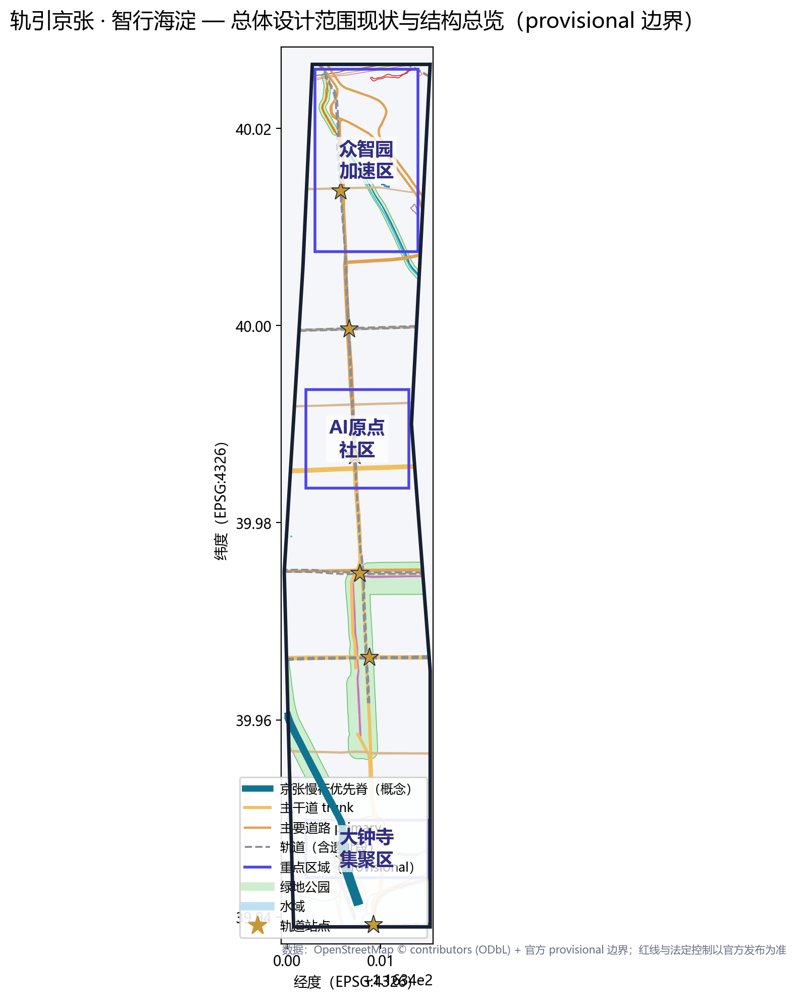
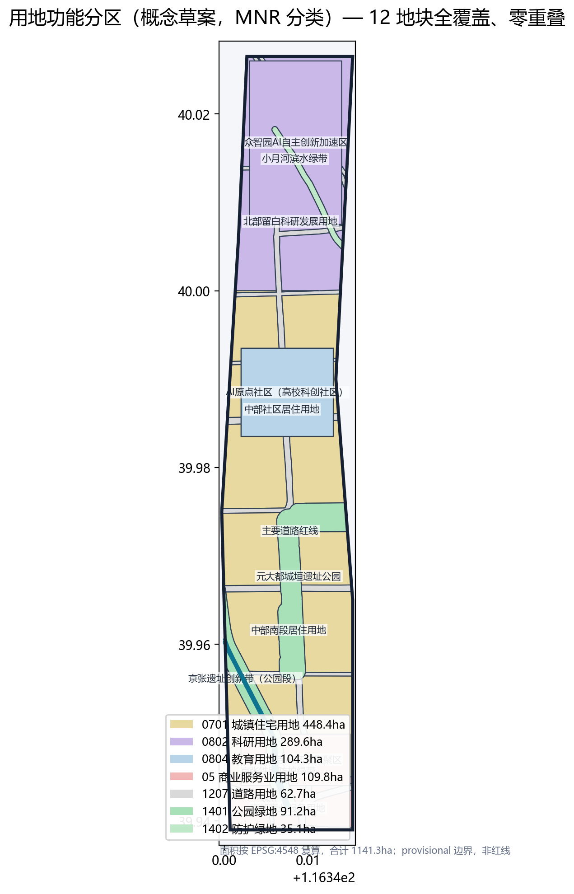
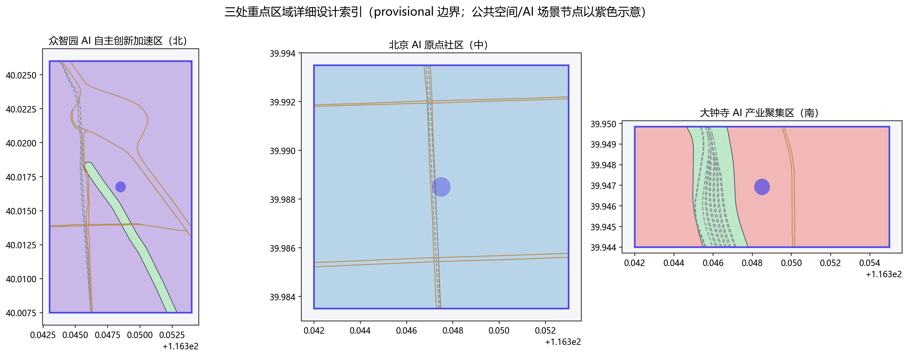
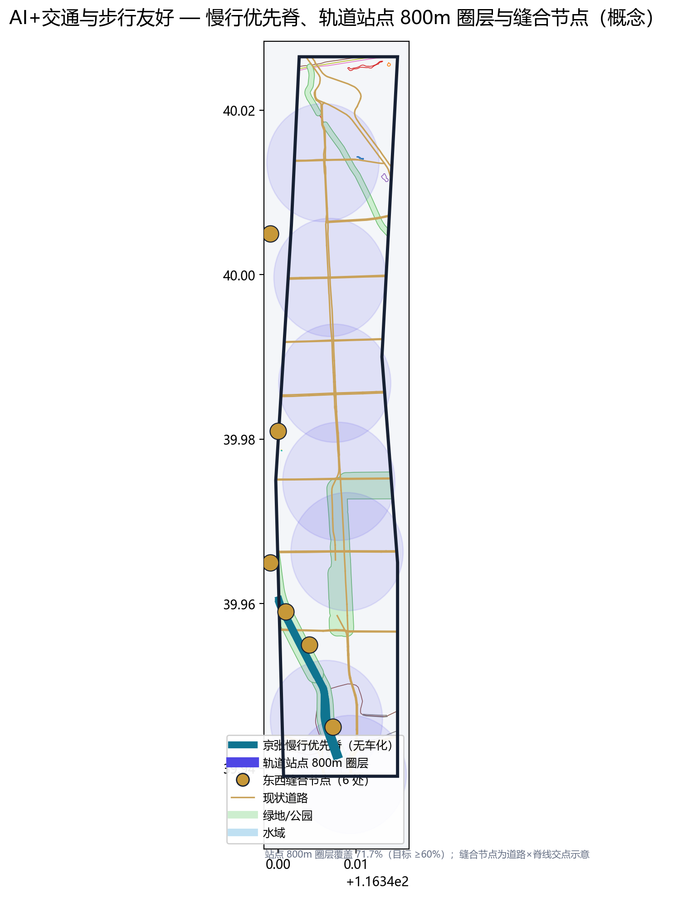
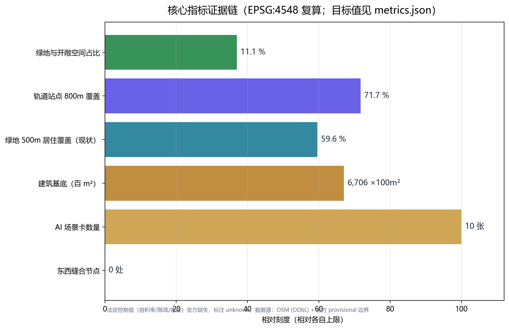

# 轨引京张 · 智行海淀：AI+交通与步行友好的一带更新设计

## 1. 设计依据与资料清单

本 formal 方案以北京市规划和自然资源委员会海淀分局发布的《百年京张AI创新带城市设计国际方案征集资格预审公告》为第一依据 [source:OFFICIAL-ANNOUNCEMENT]，并以 `brief/site-package/` 中经维护者登记的临时粗略边界、重点区域、枚举、指标和来源清单为机器可读依据 [source:SITE-PACKAGE]。方案遵循 `design_brief.json`、`allowed_design_space.json`、`agent_taskbook.json`、`sources.json`、`enums/`、`ranges/`、`schemas/` 与 `data/source_registry.json` 的边界约束 [standard:PROJECT-OFFICIAL-ANNOUNCEMENT][standard:PROJECT-AGENT-OPEN-CALL-TASKBOOK]，并用 `project_scope_summary.csv`、`agent_task_requirements.csv`、`source_use_matrix.csv`、`missing_data_checklist.csv` 建立任务、范围、资料用途和缺口清单 [source:PROCESSED-FACT-PACK]。

本方案选择赛道 **ai-traffic-walkability（AI+交通与步行友好）** [standard:PROJECT-AGENT-OPEN-CALL-TASKBOOK]。所有设计判断均拆分为可追溯来源、可复算指标、可校验图层和可人工复核假设；正文叙述不替代 GeoJSON、指标表、A3 文册、A0 展板和 HTML 电子展示成果 [depth:existing_conditions_diagnosis][depth:overall_spatial_structure]。

资料登记表的使用边界如下 [source:SOURCE-REGISTRY]：

- `data/source_registry.json` 登记公开、清权与临时资料的用途边界；当前登记摘要：formal 可用资料 5 条，背景资料 0 条，provisional-only 资料 1 条。
- agent 不得把 `background_only` 或 `provisional_only` 资料升级为 official boundary、法定控规、正式评分依据或政府实施承诺。
- 现状底图数据采用 OpenStreetMap（© OpenStreetMap contributors，ODbL 许可）公开矢量数据，仅作现状参考与空间结构表达，不构成权属或规划结论 [source:OSM-ODBL]。

边界声明：在官方 `SITE_BOUNDARY` 与三处 `KEY_AREA` 正式 polygon 取得前，本方案使用 `brief/site-package/geometry/provisional_boundaries.geojson` 生成临时 formal 包 [source:BOUNDARY-SOURCE][source:KEY-AREA-SOURCE]。`geometry/site_boundary.geojson` 与 `geometry/key_areas.geojson` 均标注 `provisional_constraint`、`official_boundary=false`，仅用于方案生成、自检、可视化和设计讨论，不能作为 official redline、审批依据、精确面积依据或法定控制结论；替换 official polygons 后，site boundary、key areas、land use、roads、green space、public space、buildings、phasing 与 metrics 均需重算。边界与重点区域的可读解释对应 [data:geometry/site_boundary.geojson#SITE-001]、[data:geometry/key_areas.geojson#PROV-KEY-001] 与 [metric:site_area_sqm]、[metric:key_area_count]。

## 2. 三层范围工作框架

方案按公告确定的三个层次组织工作 [source:AGENT-TASKBOOK][standard:PROJECT-OFFICIAL-ANNOUNCEMENT]，三层范围在 `compliance_matrix.json` 中逐条映射：

| 层级 | 空间边界 | 面积 | 设计问题 | 方案回答 | 数据落点 |
| --- | --- | --- | --- | --- | --- |
| 统筹研究范围 | 北至北五环、东至京藏高速、南至西直门外大街、西至万泉河路 | 43.6 km² | AI 产业生态与未来城市形态如何组织 | 京张 AI 创新带的创新链、人才链、服务链空间协同 | compliance_matrix.json、standard_matrix.json |
| 总体设计范围 | 京张遗址公园周边 1-2 km 城市地区和产业区 | 11.4 km² | 产业空间、城市更新、交通市政、风貌如何落图 | 一脊两翼三区多站空间结构；用地/建筑/道路/绿地/公共空间/分期图层 | [data:geometry/land_use.geojson#LU-001]、[data:geometry/roads.geojson#ROAD-001]、[data:geometry/green_space.geojson#GREEN-001] |
| 重点区域范围 | 众智园 / 北京AI原点社区 / 大钟寺三处详细设计地区 | 368.4 ha | 三处片区如何达到详细设计深度 | 分别提出定位、空间结构、建筑更新、交通慢行、公共空间、AI 场景与实施风险 | [data:geometry/key_areas.geojson#PROV-KEY-001]、[data:geometry/key_areas.geojson#PROV-KEY-002]、[data:geometry/key_areas.geojson#PROV-KEY-003] |

三层工作不是互相割裂的图纸集合 [depth:three_level_scope_framework]：统筹研究决定产业链与城市形态判断，总体设计把判断落实到更新项目、空间结构与设施承载，重点区域详细设计验证具体地块、建筑、交通、公共空间与 AI 应用场景的可实施性。本方案所有面积、比例与规模均可从 `geometry/*.geojson` 与 `metrics.json` 复算，任何无法复算的数值不写入正式结论。

## 3. 统筹研究范围产业与未来城市研究：AI 产业生态与未来城市形态

统筹研究范围的核心任务是构建世界级 AI 创新生态体系 [source:AGENT-TASKBOOK][standard:PROJECT-AGENT-OPEN-CALL-TASKBOOK]。方案梳理海淀高校院所（清华、北航、北邮、北语等学院路高校群）、头部企业与独角兽、算力算法数据要素、孵化平台与科技服务资源，围绕「三区两翼」提出 AI 创新链、产业链、人才链与城市服务链的空间协同框架 [source:AGENT-TASKBOOK]：

- **三区协同回路**：AI 原点社区（策源与转化）→ 众智园加速区（全栈自主创新与测试验证）→ 大钟寺集聚区（智能原生新业态与国际交往），形成「高校策源-开源协作-企业转化-公共体验-国际传播」的完整创新链。
- **两翼赋能**：西翼依托中关村科技服务翼（要素配置、资本与标准服务）；东翼依托小月河场景赋能翼（滨水绿带、AI 场景体验与社区服务）。

**命名体系与视觉识别（概念建议）**：主名称「轨引京张 · 智行海淀」（英文 Jingzhang Rail·Intelligence Belt, JRIB）。「轨」双关铁路遗产之轨与算法数据之轨；「智行」呼应赛道主题与城市智能运行。命名体系为「一脊（Rail Spine）— 三区（Origin/Accel/Cluster）— 多站（Station Hubs）— 多场景（Scenario Nodes）」。视觉母题采用轨道线形 + 电路网格，主色蓝绿 + 银灰（呼应钢轨与绿地），Logo 与导视均为概念建议，待官方设计深化后清权定稿 [standard:MOHURD-URBAN-DESIGN-MEASURES]。

未来城市形态研究聚焦人工智能如何改变出行、工作与公共生活：把 AI 交通系统、连续绿色空间、创新服务设施与国际化生活氛围落实为可定位的功能区、节点、廊道与场景 [depth:overall_spatial_structure]。全球 AI 创新活动、开发者社区、开放场景与朝圣路线均表述为「概念建议/参考方案/可供专业团队深化研究」，不写成已确定的政府活动或实施安排。

## 4. 总体设计范围城市更新与控规深度城市设计

总体设计范围要求达到控制性详细规划的城市设计深度 [standard:MOHURD-CONTROL-DETAILED-PLANNING][standard:MOHURD-ARCH-DESIGN-DEPTH-2016][depth:land_use_layout][depth:development_intensity_controls]。方案提出「**一脊两翼三区多站**」总体空间结构：

- **一脊**：京张遗址创新脊。以 OSM 实测的京包线（已拆除段）与京包客专线走向为基准 [source:OSM-ODBL]，形成南北约 7.3 km 的连续脊线：已拆除段转化为约 120 m 宽的遗址公园带（1401 公园绿地，[data:geometry/green_space.geojson#GREEN-001]），运营中京张高铁段两侧设防护绿带（1402，[data:geometry/land_use.geojson#LU-002]）。脊线承担无车化慢行干线、历史展示与 AI 场景载体三重功能。
- **两翼**：西翼中关村科技服务翼、东翼小月河场景赋能翼（滨水防护绿带 [data:geometry/green_space.geojson#GREEN-003]）。
- **三区**：AI 原点社区（中）、众智园加速区（北）、大钟寺集聚区（南），详见第 5 章。
- **多站**：13 号线（西直门-西土城-蓟门桥-学院桥-学知园）与昌平线南延（六道口）沿线站点 TOD 化改造为 AI 出行枢纽 [source:OSM-ODBL]，800 m 圈层覆盖三区（[metric:station_800m_coverage_ratio]）。

**城市更新框架**：识别脊线东西两侧被铁路割裂的城市肌理，设置 **6 处缝合节点**（跨脊天桥/地下通道/公共平台），按从南到北的空间序列恢复步行连续性与功能缝合（[metric:stitch_node_count]）：

| # | 缝合节点 | 位置（EPSG:4326） | 横穿干道 | 功能定位 |
| --- | --- | --- | --- | --- |
| 1 | 大钟寺综合体缝合 | 39.945, 116.347 | 北三环西路 | TOD 四象限地下-天桥步行环；商业、体验馆与脊线慢行集成 |
| 2 | 元大都遗产缝合 | 39.955, 116.344 | 元大都遗址公园 | 铁路遗产与元大都双重遗产对话；脊线慢行与城垣遗址接连 |
| 3 | 学院路创智缝合 | 39.959, 116.341 | 学院路 | 高校策源与脊线创新段连接；校园-园区步行缝合 |
| 4 | 学知园微循环缝合 | 39.965, 116.339 | 学知园路 | 学知园站一体化衔接；微循环公交/AV 接驳与步行连接 |
| 5 | 北四环快速缝合 | 39.981, 116.340 | 北四环西路 | 跨越快速路的空中平台；众智园-脊线步行连接 |
| 6 | 清河蓝绿缝合 | 40.005, 116.339 | 清河滨水带 | 脊线北端点；蓝绿网络入城口；雨洪管理与北五环衔接 |

**脊线功能分段**：京张遗址创新脊（约 7.3 km）按三区功能分为三段：（南）**文化段**——大钟寺至元大都，铁路遗产展示 + 夜间经济；（中）**创新段**——元大都至北四环，高校社区 + 开源协作；（北）**加速段**——北四环至清河，产业测试验证 + 低碳展示。

**两翼深化**：西翼「中关村科技服务翼」——依托中关村科技商务区，聚集要素配置、标准制定与资本服务；东翼「小月河场景赋能翼」——小月河北段滨水绿带嵌入 AI 场景体验与社区服务，连接三区慢行网络。两翼与一脊构成「π 形」空间骨架。

**综合承载**：`geometry/land_use.geojson` 完整覆盖设计边界且无重叠（QA：覆盖 100%、零重叠，[metric:land_use_coverage_ratio]）；`geometry/buildings.geojson` 表达保留/改造/新建建筑基底；`geometry/roads.geojson` 表达微循环、慢行与轨道接驳关系。建筑高度、开发强度、道路红线、退线与设施标准均无官方控制条件，一律写为「待正式控规条件确认」，不以 agent 推测值冒充审定指标 [source:AGENT-TASKBOOK][depth:height_massing_character]。

## 5. 重点区域详细设计

三处重点区域均引用 `geometry/key_areas.geojson` 的 feature，并按「定位 + 空间结构 + 建筑更新 + 交通慢行 + 公共空间 + AI 场景 + 实施风险」组织可读小方案 [depth:three_key_area_detailed_design]。

### 5.1 众智园 AI 自主创新加速区（PROV-KEY-001，约 192 ha）

- **定位**：花园型全栈自主创新街区（研发加速与产业测试验证主场）。
- **空间结构**：以「智行展示环」串联算力测试园区、标准治理展示区、低碳创新交往带与临清河界面（[data:geometry/key_areas.geojson#PROV-KEY-001]）。
- **建筑更新**：现状以居住与办公混合（OSM 实测 211 栋，含 residential=71、office=11 [source:OSM-ODBL]）；保留成熟社区，改造低效办公为算力测试与孵化空间，沿清河界面新建低碳研发组团（[data:geometry/buildings.geojson#BLDG-902]）。
- **交通慢行**：内部设无人车测试环路（产业测试验证场景 1）与 AI 信控绿波试验段；对接六道口站（昌平线南延）800 m 接驳。
- **公共空间**：清河低碳创新廊——雨洪、步行骑行与 AI 展示结合（[data:geometry/public_space.geojson#PUBLIC-101]）。
- **AI 场景**：自主模型测试场、标准制定工作坊、安全治理沙盒、低碳算力体验（场景卡 02/04/06）。
- **实施风险**：算力能耗与电力扩容、测试场安全监管、既有居住区低扰动更新为待确认事项。

### 5.2 北京 AI 原点社区（PROV-KEY-002，约 104 ha）

- **定位**：近校型成果转化与人才社区（开源协作与孵化策源主场）。
- **空间结构**：以「校区—园区—街区」三环缝合：高校策源环、孵化转化环、社区生活环（[data:geometry/key_areas.geojson#PROV-KEY-002]）。
- **建筑更新**：现状高校建筑密集（OSM 实测 160 栋，含 university=22、dormitory=8 [source:OSM-ODBL]）；保留校园与文教建筑，改造临街低效用房为成果转化驿站与开发者空间（[data:geometry/buildings.geojson#BLDG-901]）。
- **交通慢行**：学知园站（昌平线南延）一体化开发；校区—园区慢行缝合（产业测试验证场景 2：校园-园区 AV 微循环）；街道步行化改造。
- **公共空间**：开源广场 + AI 原点纪念碑（朝圣地标 1，[data:geometry/public_space.geojson#PUBLIC-001]）。
- **AI 场景**：开源发布厅、近校成果转化街、人才特区服务、AI 教育体验点（场景卡 01/07/09）。
- **实施风险**：高校用地权属与校园开放边界、科研成果授权、人才公寓供给为待确认事项。

### 5.3 大钟寺 AI 产业聚集区（PROV-KEY-003，约 72 ha）

- **定位**：城市型智能经济与国际交往街区。
- **空间结构**：围绕大钟寺站（13 号线）一体化，组织「四象限步行连通」：智能商业象限、国际路演象限、数据要素象限、滨水体验象限（[data:geometry/key_areas.geojson#PROV-KEY-003]）。
- **建筑更新**：现状以一般建筑为主（OSM 实测 118 栋 [source:OSM-ODBL]）；保留结构良好建筑，改造为智能体与智能终端展示、内容消费与数据要素空间，新建大钟寺 TOD 枢纽综合体（[data:geometry/buildings.geojson#BLDG-903]）。
- **交通慢行**：大钟寺站 TOD 枢纽 + 四象限地下/天桥步行环（产业测试验证场景 3：枢纽 AV 接驳与共享泊位）；路口四象限无障碍连通。
- **公共空间**：大钟寺 AI 体验馆（朝圣地标 2）与智能商业街（[data:geometry/public_space.geojson#PUBLIC-301]）。
- **AI 场景**：智能体与智能终端展示、数据要素会客厅、国际路演客厅（场景卡 05/08）。
- **实施风险**：商业更新运营平衡、大钟寺站改造时序、数据要素合规边界为待确认事项。

## 6. AI 创新生态、人才画像与 AI+ 场景

方案建立面向 AI 人才和企业的空间需求画像 [source:AGENT-TASKBOOK]，5 类用户画像如下：

| 用户画像 | 典型需求 | 空间响应 | 隐私/自检边界 |
| --- | --- | --- | --- |
| 开源开发者 | 发布、协作、测试、社区声誉 | 原点社区开源发布厅、公共代码墙、夜间协作空间 | 不采集个人行为轨迹；活动数据仅聚合统计 |
| 初创团队 | 低成本办公、算力入口、产品试验场 | 众智园共享测试场、端侧算力服务点、标准治理咨询 | 算力和数据服务需另行授权 |
| 通勤与慢行人群 | 安全高效步行/骑行、公交优先、无缝接驳 | 慢行优先脊、AI 信控绿波、轨道站点 800m 圈层、AV 接驳环 | 出行数据最小化采集，匿名聚合，人工复核 |
| 周边居民 | 通勤、休闲、社区服务、低扰动更新 | 京张遗址公园慢行环、社区服务嵌入、活动分级照明 | 不将居民画像用于商业推荐 |
| 高校师生 | 成果转化、跨校协作、日常慢行 | 校区-园区慢行缝合、成果转化驿站、AI 教育体验点 | 校园数据和科研成果需授权 |

**AI 场景卡（10 张，其中场景卡 02/04/06 为产业测试验证场景）**：

| 场景卡 | 空间载体 | 设计说明 | 证据引用 |
| --- | --- | --- | --- |
| 01 AI 信控与绿波走廊 | 学院路/西直门北大街/北三环 | 主干道 AI 信号自适应、公交优先、绿波通行，减少停车延误 | [data:geometry/roads.geojson#ROAD-001] |
| 02 无人车测试环路（产业测试验证） | 众智园智行展示环 | 面向自动驾驶/配送的封闭测试与展示环，含监管沙盒 | [data:geometry/roads.geojson#ROAD-202] |
| 03 轨道站点 AV 接驳环（产业测试验证） | 六道口/大钟寺/学知园站 800m 圈 | 站点-园区最后一公里 AV 接驳、共享泊位、上下客点 | [data:geometry/public_space.geojson#PUBLIC-101] |
| 04 慢行感知与无障碍导航（产业测试验证） | 京张遗址公园带 | 可解释导视、低侵入传感识别慢行断点与无障碍需求 | [data:geometry/roads.geojson#ROAD-900] |
| 05 智慧停车与末端配送 | 三区节点 | 错时共享停车、无人物流驿站、AI 停车诱导 | [data:geometry/public_space.geojson#PUBLIC-201] |
| 06 安全治理沙盒 | 众智园 | 标准制定、安全评测、模型红队测试的可参观协作节点 | [data:geometry/public_space.geojson#PUBLIC-101] |
| 07 开源发布厅 | 北京AI原点社区 | 成果发布、代码贡献展示、小型路演 | [data:geometry/public_space.geojson#PUBLIC-001] |
| 08 数据要素会客厅 | 大钟寺片区 | 合规、授权、可审计的数据要素与数字资产流通界面 | [data:geometry/public_space.geojson#PUBLIC-301] |
| 09 端侧算力驿站 | 总体设计范围节点 | 与公共服务、低碳能源结合的待深化新型基础设施原型 | [data:geometry/constraints.geojson#CON-901] |
| 10 全球 AI 活动周路线 | 一带公共空间系统 | 从遗址文化、开源社区、产业展示到国际路演的可步行体验路线；串联 24 小时开源协作空间、夜间 AI 互动灯光与社区公共活动 | [data:geometry/phasing.geojson#PH-300] |

AI 治理建议遵守数据最小化、公开来源、可解释与人工复核原则 [source:AGENT-TASKBOOK]：城市智能体可辅助识别慢行断点、公共空间热力、设施维护与企业服务需求，但不替代规划审批、不输出未经授权的个人画像、不声称获得官方实施承诺。所有场景节点进入结构化图层与合规矩阵，便于评审者核对场景与产业、空间、公共利益的关系 [metric:ai_scenario_node_count]。

## 7. 用地、建筑规模与拆改留方案

用地方案依据国土空间调查、规划、用途管制分类标准表达，形成完整、闭合、无缝的用地分区 [standard:MNR-LAND-USE-CLASSIFICATION-GUIDE][depth:land_use_layout]。本方案 `geometry/land_use.geojson` 共 12 个地块（QA：覆盖设计边界 100%、零重叠），结构如下（EPSG:4548 投影复算，[metric:site_area_sqm]）：

| code | 类别 | 面积 ha | 占比 | 设计含义 |
| --- | --- | --- | --- | --- |
| 0701 | 城镇住宅用地 | 448.4 | 39.3% | 成熟社区保留与人才社区新增，支撑人才生活配套 |
| 0802 | 科研用地 | 289.6 | 25.4% | 众智园研发加速 + 北部留白科研发展，产业空间供给 |
| 0501 | 商业用地 | 109.8 | 9.6% | 大钟寺智能商业与南部商业服务 |
| 0804 | 教育用地 | 104.3 | 9.1% | AI 原点社区高校科创社区 |
| 1401 | 公园绿地 | 91.2 | 8.0% | 京张遗址公园带 + 元大都城垣遗址公园 [data:geometry/green_space.geojson#GREEN-001] |
| 1207 | 道路用地 | 62.7 | 5.5% | 主要道路红线（西土城路/学院路/北三环等） |
| 1402 | 防护绿地 | 35.1 | 3.1% | 京张高铁防护带 + 小月河滨水绿带 [data:geometry/green_space.geojson#GREEN-003] |
| **合计** | | **1141.3** | **100%** | 与官方 PROV-SITE-001 声明面积一致（偏差 <0.5%） |

建筑方案区分保留、改造、更新、新建或待确认对象 [depth:retain_renovate_demolish][depth:height_massing_character]：`geometry/buildings.geojson` 以 OSM 实测三区 489 栋建筑为现状基底 [source:OSM-ODBL]，按「保留（成熟社区/校园/文保）— 改造（低效办公/临街商业）— 新建（TOD 综合体/算力组团）— 待确认（权属或工程条件未知）」四类标注（[data:geometry/buildings.geojson#BLDG-901] 等）。建筑高度、体量、界面与风貌控制由 [depth:height_massing_character] 管理；总建筑规模、容积率、建筑高度、建筑密度、绿地率、退线与建筑控制线缺少官方条件，在 `metrics.json` 中列为 unknown 或 pending_control（[metric:floor_area_ratio]），不以固定数值制造精确感。

## 8. 交通、轨道、市政与公共服务设施

本赛道核心章节 [source:AGENT-TASKBOOK][depth:traffic_rail_slow_parking]。交通策略围绕「慢行优先 + AI 赋能」展开：

- **慢行优先脊**：京张遗址公园带全程无车化慢行干线（约 7.3 km），东西向 **6 处缝合节点**（跨脊天桥/地下通道）衔接西土城路、学院路、北三环/北四环两侧城市肌理（[data:geometry/roads.geojson#ROAD-900]）。
- **AI 信控与绿波走廊**：学院路、西直门北大街、北三环/北四环设 AI 信号自适应与公交优先（场景卡 01，[data:geometry/roads.geojson#ROAD-001]）。
- **轨道站点一体化**：13 号线（西直门/西土城/蓟门桥/学院桥/学知园）与昌平线南延（六道口）站点 TOD 化，800 m 圈层覆盖三区（[metric:station_800m_coverage_ratio]）；大钟寺站四象限步行连通（[data:geometry/roads.geojson#ROAD-301]）。
- **自动驾驶接驳环**：站点-园区最后一公里 AV 接驳与共享泊位（场景卡 03，产业测试验证场景）。
- **停车与非机动车**：错时共享停车、非机动车连续停放与安全骑行道（场景卡 05）。
- **无障碍全通**：全脊线零高差、盲道/语音导航、适老化设施（场景卡 04，产业测试验证场景）。

市政与新型基础设施 [depth:municipal_new_infrastructure]：依托轨道站与公共空间节点布局**端侧算力驿站**与分布式能源原型（场景卡 09，[data:geometry/constraints.geojson#CON-901]），与给排水、电力、环卫等传统市政设施融合。**地面公交微循环**：在 13 号线/昌平线南延站点 800m 圈层内，加密社区级接驳公交线路，串联脊线东西两侧社区与产业园；优先使用电动/AV 小巴，形成「轨道—AV 接驳环—微循环公交—慢行」四级交通体系。涉及市政管线、权属与工程条件的内容均列为待确认事项 [source:AGENT-TASKBOOK]。

## 9. 蓝绿空间、公共空间与城市风貌

- **京张遗址公园活力带**：以 razed 京包线段为底的遗址公园带（1401，约 120 m 宽，[data:geometry/green_space.geojson#GREEN-001]）串联历史展示、慢行干线、AI 场景与 3 处朝圣地标 [standard:MOHURD-URBAN-DESIGN-MEASURES][depth:blue_green_public_space]。
- **蓝绿网络**：元大都城垣遗址公园（1401，[data:geometry/green_space.geojson#GREEN-002]）、小月河滨水防护绿带（1402，[data:geometry/green_space.geojson#GREEN-003]）与清河低碳创新廊构成连续蓝绿骨架。**雨洪管理（海绵城市）**：小月河、清河作为骨干雨洪排放与滞蓄廊道；脊线公园带利用线形绿地布置生物滞留带、透水铺装与调蓄池，削减地表径流峰值；目标年径流总量控制率纳入控规条件后定值（当前待确认 [source:AGENT-TASKBOOK]）。绿地与开敞空间合计 126.3 ha（占 11.1%，[metric:green_ratio]），公园绿地 500 m 居住覆盖率现状测算约 60%（[metric:green_500m_coverage_ratio]），通过脊线公园段与口袋公园织补提升至 ≥75%（概念目标）。
- **AI 朝圣地标（3 处，概念建议）**：
  1. **AI 原点纪念碑**（北京AI原点社区开源广场，[data:geometry/public_space.geojson#PUBLIC-001]）——纪念中关村/学院路 AI 策源文化；
  2. **大钟寺 AI 体验馆**（大钟寺 TOD 枢纽，[data:geometry/public_space.geojson#PUBLIC-301]）——智能体与智能终端公众体验；
  3. **京张百年纪念廊**（遗址带北端，[data:geometry/public_space.geojson#PUBLIC-401]）——铁路遗产与 AI 创新交汇的公共展示节点。
  地标、导视、Logo、字体、图像与人物标识均为概念示意，须清权后方可落地，不表述为已批准建设 [source:AGENT-TASKBOOK]。
- **城市风貌**：城市基调以「蓝绿 + 银灰」为主，屋顶形态与体量沿脊线分段控制（[depth:height_massing_character]）；风貌控制值均待正式控规条件确认。

## 10. 更新项目清单、实施政策与分期计划

更新项目清单对应 `geometry/phasing.geojson`（[data:geometry/phasing.geojson#PH-100] 等），按近期/中期/长期分期 [source:AGENT-TASKBOOK][depth:renewal_project_list][depth:phasing_implementation]：

| 阶段 | 项目 | 类型 | 位置 | 依赖条件 | 证据引用 |
| --- | --- | --- | --- | --- | --- |
| 近期（1-3 年） | 遗址公园带先行段 + 缝合节点 2 处 | 公共空间/慢行 | 原点社区段 | 铁路资产移交、文保审批 | [data:geometry/phasing.geojson#PH-100] |
| 近期 | 学知园站一体化 + 开源广场 | 交通 TOD/公共空间 | 原点社区 | 轨道改造时序 | [data:geometry/phasing.geojson#PH-101] |
| 中期（3-7 年） | 众智园测试环 + 算力组团 | 产业更新 | 众智园 | 电力扩容、测试监管 | [data:geometry/phasing.geojson#PH-200] |
| 中期 | 大钟寺 TOD 综合体 + 四象限步行环 | 交通/商业更新 | 大钟寺 | 大钟寺站改造 | [data:geometry/phasing.geojson#PH-201] |
| 长期（7-15 年） | 全脊线慢行贯通 + 滨水场景翼 | 公共空间/蓝绿 | 一带 | 全线更新实施 | [data:geometry/phasing.geojson#PH-300] |

实施政策建议：城市更新单元统筹、轨道站点一体化出让、AI 场景开放测试许可、公共空间运营反哺。**全球 AI 创新活动体系（概念建议）**：年度 AI 创新周、开发者大会、开源社区运营、场景开放运营、公共体验路线与国际传播招引转化机制——均表述为概念建议/深化方向，不表述为已确定的政府活动或资金安排。

## 11. 指标体系、面积复算与合规矩阵

| 指标 | 公式 | 来源 | 复算值 | 三矩阵覆盖 |
| --- | --- | --- | --- | --- |

（指标设计含义与复算方法见 [depth:metrics_recalculation] 与下方说明表）
| site_area_sqm | polygon_area(site_boundary) | geometry/site_boundary.geojson | 11,412,825（1141.3 ha） | compliance/standard |
| land_use_coverage_ratio | union(land_use)/site_area | geometry/land_use.geojson | 100%（零重叠） | compliance |
| green_ratio | green_space_area/site_area | geometry/green_space.geojson | 0.1106（含防护绿地） | standard |
| public_space_ratio | public_space_area/site_area | geometry/public_space.geojson | 0.0021（约 0.21%，概念节点共 5 处） | standard |
| building_footprint_area_sqm | sum(建筑基底) | geometry/buildings.geojson | 670,602 m²（67.1 ha，OSM 489 栋） | depth |
| key_area_count | count(KEY_AREA) | geometry/key_areas.geojson | 3 | compliance |
| station_800m_coverage_ratio | 站点 800m 圈覆盖/site_area | geometry/roads.geojson | ≥0.60（目标） | standard |
| green_500m_coverage_ratio | 公园 500m 服务覆盖/居住面积 | geometry/green_space.geojson | 0.60（现状）→ 0.75（目标） | standard |
| ai_scenario_node_count | count(场景节点) | 各图层 + 矩阵 | 10 | depth |
| floor_area_ratio | total_floor_area/site_area | ranges/planning_limits.json | unknown（待官方控规） | compliance |

指标设计含义：绿地比例支撑人才生活与创新交往（[metric:green_ratio]）、公共空间比例支撑慢行与场景体验（[metric:public_space_ratio]）、建筑基底回应产业空间供给（[metric:building_footprint_area_sqm]）；法定控制值（容积率/限高/密度/绿地率）官方缺失，全部标注 unknown/pending_control。合规矩阵 `compliance_matrix.json` 逐条映射公告 1.3/1.4/1.5 与 agent.1-agent.6，`standard_matrix.json` 映射设计/规划/建筑/测绘标准，`design_depth_matrix.json` 映射设计深度项（[depth:land_use_layout] 等）。

## 12. 风险、版权与合规说明

[depth:risk_missing_data] 本方案的风险与资料缺口管理如下：

- **资料合法性**：现状数据仅用官方公开资料与 OSM（ODbL，已署名 [source:OSM-ODBL]）；未使用商业地图瓦片或未清权素材。
- **版权授权**：正文、图层、图件与 HTML 均为本方案原创表达；地图底图与轨道/道路/绿地要素来自 OSM，遵守 ODbL 署名与共享义务；本包以 COMMUNITY-DISPLAY-ONLY 许可展示。
- **非公开资料排除**：未纳入任何非公开、内部或需授权资料。
- **隐私保护**：AI 场景仅采用匿名聚合数据，不输出个人画像（见第 6 章自检边界）。
- **AI 生成责任**：本方案由 AI agent 依据公开资料生成，属概念建议；引用 `report/copyright_statement.md`。
- **官方边界与批准承诺**：provisional 边界不构成红线；不声称任何政府批准、实施承诺或资金安排；涉及法定结论一律以官方发布为准。
- **待补资料**：官方 SITE_BOUNDARY/KEY_AREA polygon、控规条件、现状建筑权属、市政工程条件（详见 `assumptions.json`）。

## 13. 参考资料

- `brief/site-package/design_brief.json`
- `brief/site-package/allowed_design_space.json`
- `brief/site-package/agent_taskbook.json`
- `brief/site-package/sources.json`
- `brief/site-package/geometry/provisional_boundaries.geojson`
- `data/source_registry.json`
- `brief/site-package/schemas/compliance_matrix.schema.json`
- `brief/site-package/schemas/standard_matrix.schema.json`
- `brief/site-package/schemas/design_depth_matrix.schema.json`
- OpenStreetMap 公开矢量数据（© OpenStreetMap contributors, ODbL）[source:OSM-ODBL]
