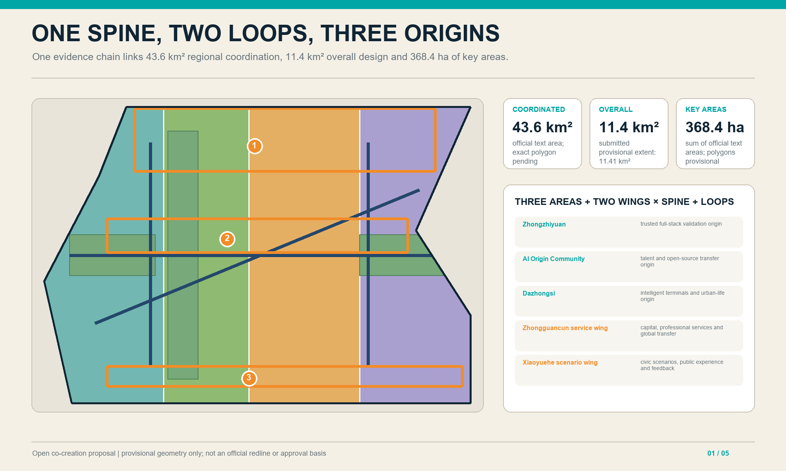
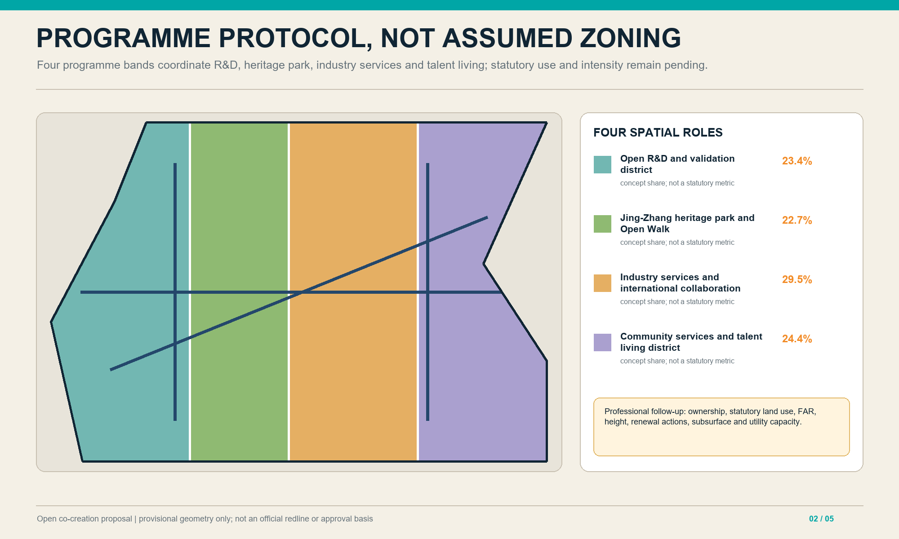
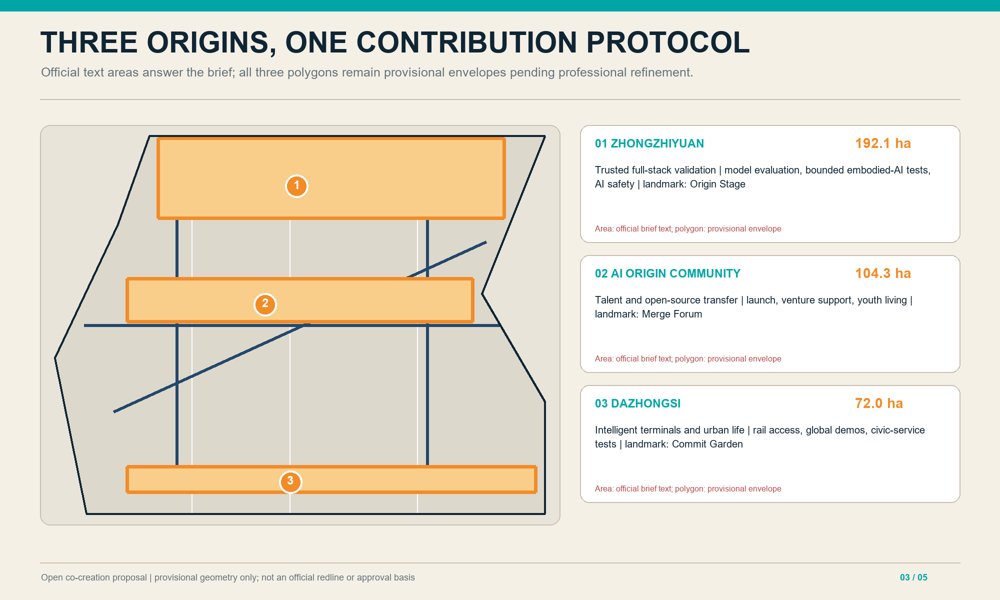
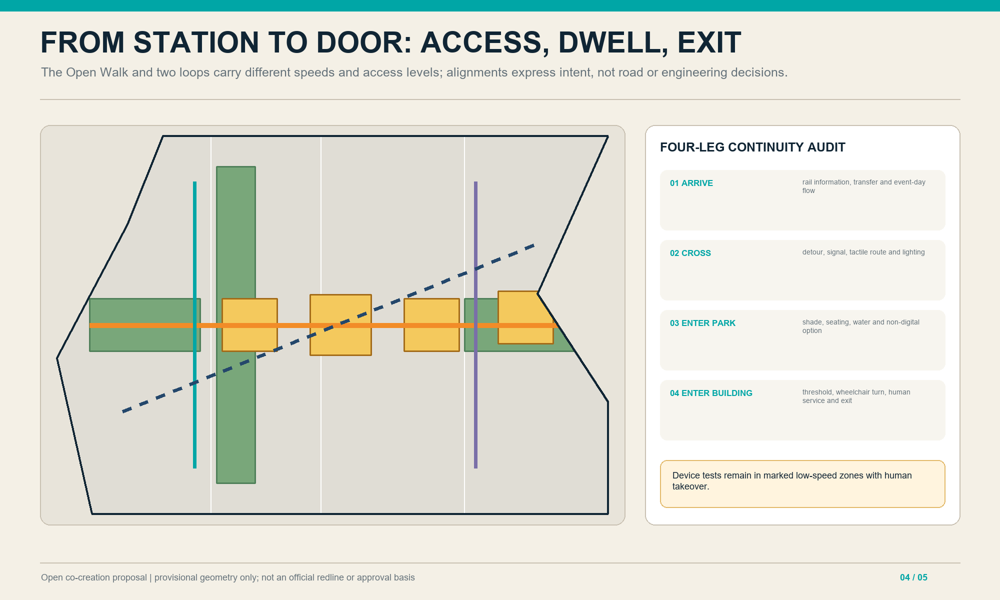
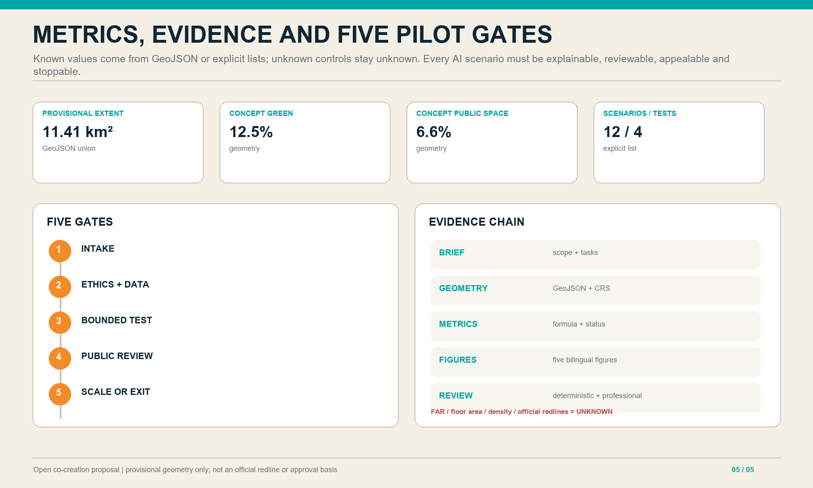

---
title: "Jing-Zhang Open Intelligence Commons"
author_github: "yuanyi5453-oss"
language: "en"
proposal_format_version: "2"
bilingual_contract_version: "1"
translation_of: "proposal.md"
license: "COMMUNITY-DISPLAY-ONLY"
summary: "A rail-memory spine, two loops and three origins turn AI innovation into civic infrastructure."
tracks: ["ai-traffic-walkability", "enterprise-services-ecosystem", "civic-agent-governance"]
scenarios: ["ai-traffic-walkability", "enterprise-service-copilot", "public-safety-operations-review"]
---

# Jing-Zhang Open Intelligence Commons

## Design Basis and Source List

The proposal treats the Centennial Jing-Zhang AI Innovation Belt as civic infrastructure for open intelligence: code, models, data, scenarios and public questions are framed, tested, reviewed and operated here. Its basis is the official announcement, the Agent taskbook, the public source registry and local professional-standard excerpts [source:OFFICIAL-ANNOUNCEMENT] [source:AGENT-TASKBOOK] [standard:STD-URBAN-DESIGN-MEASURES]. The submitted boundary and three key areas are repository-supplied provisional rough geometry for concept generation, display and intake checks only; they are not official redlines, statutory controls or precise-area evidence [data:geometry/site_boundary.geojson#SITE-001] [data:geometry/key_areas.geojson#PROV-KEY-001].

## Three-Level Scope Framework

The three levels are one decision chain rather than separate drawings. Regional mechanisms become corridors and civic interfaces at overall-design scale, then reversible prototypes in the key areas. Every prototype must feed measurable lessons back to the belt. Because official boundaries, road redlines and a full existing-condition survey are absent, areas support comparison and tool validation only. Once official geometry arrives, the base polygons, all derivative layers, metrics, figures, HTML and PDFs must be recalculated together [data:geometry/site_boundary.geojson#SITE-001].

The coordinated research area addresses regional collaboration and future-city questions; the overall design area sets renewal, public-space, mobility and blue-green structure; the three key areas become prototypes for professional deepening. All three levels share one evidence chain and explicit boundary caveat [depth:existing_conditions_diagnosis] [depth:three_level_scope_framework].

### Official Scope and Design Response

| Level | Official scale | Proposal response | Current evidence boundary |
|---|---:|---|---|
| Coordinated research | 43.6 km² | Regional innovation links, future-city mechanisms and case transfer | Mechanism study only; no statutory polygon is generated |
| Overall design | 11.4 km² | Renewal, mobility, blue-green, civic space and operating network | Provisional base recalculates to about 11.41 km²; official boundary remains required |
| Key-area detailed design | 368.4 ha | Differentiated prototypes for Zhongzhiyuan 192.1 ha, AI Origin Community 104.3 ha and Dazhongsi 72.0 ha | Areas follow the official task text; submitted polygons are provisional diagrams |

“One spine, two loops and three origins” is the proposal's spatial language; the official “three areas and two wings” is an industry-coordination requirement. They are not interchangeable. The western R&D loop connects conceptually to the Zhongguancun Technology Services Wing; the eastern civic-life loop connects to the Xiaoyue River Scenario Enablement Wing; the Open Walk links both with the three key areas. This is a design translation, not official zoning. [source:OFFICIAL-ANNOUNCEMENT] [source:AGENT-TASKBOOK]

## Coordinated Research Area: Industry and Future City Research

Case transfer follows four steps: capability, interface, space and governance. The proposal extracts verifiable collaboration mechanisms rather than copying iconic forms; specifies data, equipment and responsibility interfaces; assigns suitable labs, forums, street tests or civic rooms; and adds privacy, accessibility, incident and exit rules. Regional collaboration is a proposed common benchmark and portable protocol, not an administrative commitment. Local capacity and stakeholder needs still require public issue intake and professional research [source:SOURCE-REGISTRY].

An “open models—open scenarios—open governance” interface can connect northern science districts, Future Science City, Huairou Science City, the Economic-Technological Development Area and wider Jing-Jin-Ji nodes. Transfer mechanisms include open benchmarks, trusted data spaces, scenario challenge lists, global open-source residencies, low-carbon compute accounting and ethics review [source:AGENT-TASKBOOK] [depth:industry_ecosystem_study].

### Global Case Mechanisms

| Case | Transferable mechanism | Jing-Zhang interface | Limitation |
|---|---|---|---|
| Singapore Punggol Digital District | Industry-campus-community integration and an Open Digital Platform | Shared data dictionary and urban-lab protocol across the three origins | Mechanism reference only; governance authority and platform are not copied [source:CASE-PUNGGOL] |
| Helsinki Smart Kalasatama | Agile pilots with residents, firms and the city | Challenge list, bounded tests and public learning reviews | Must follow local data rules and community consent [source:CASE-KALASATAMA] |
| Paris STATION F | Programme-based start-up community and multi-partner services | Open-source residencies, enterprise desk and global demo calendar | A single-campus model is not treated as an urban-renewal template [source:CASE-STATION-F] |
| Montréal Mila | Research, talent, technology transfer and public-interest work | Talent origin, trustworthy-AI review and public learning | An institute model cannot substitute for a local operator [source:CASE-MILA] |
| Dubai AI Campus | Physical/digital infrastructure, accelerator and partner network | Global collaboration station and bounded validation space | Promotional claims are not used as performance evidence [source:CASE-DUBAI-AI] |
| Toronto Quayside data-governance debate | Independent oversight, responsible use and public interest | Data minimisation, public register, appeal and exit mechanisms | Governance caution only; the discontinued delivery path is not copied [source:CASE-QUAYSIDE] |

## Overall Design Area: Urban Renewal and Regulatory-Plan-Level Urban Design

The spine makes rail memory, civic questions and innovation legible; different access levels keep validation activity from disrupting daily life. Four conceptual bands cover the submitted geometry for topology checks but do not claim real parcels. Design layers are clipped to the provisional extent, while road lines express connectivity only. Intensity, heights and renewal actions await official controls and surveys [metric:site_area_sqm].

The spatial rule is visible along the spine, reachable across streets and able to shift between indoor and outdoor settings. The spine makes rail memory, civic questions and innovation processes legible; different access levels keep validation activity from disrupting daily life. Four conceptual bands cover the submitted geometry for auditable topology but do not claim real parcels or ownership. All design layers are clipped to the provisional extent, while road lines express connectivity only [metric:site_area_sqm].

The structure is one spine, two loops and three origins. The rail-memory Open Walk is the spine; a western loop serves R&D and validation, while an eastern loop serves community life and civic services. The four land-use bands are programme protocols, not new statutory zoning; intensity, heights, demolition and utility alignments remain pending [data:geometry/land_use.geojson#LU-001] [depth:land_use_and_spatial_structure].

## Detailed Design of Key Areas

Zhongzhiyuan is the trusted full-stack validation origin; AI Origin Community is the talent and open-source transfer origin; Dazhongsi is the intelligent-terminal and urban-life origin. They share a contribution protocol while retaining distinct industry roles [data:geometry/key_areas.geojson#PROV-KEY-001] [depth:three_key_area_detailed_design].

## AI Innovation Ecosystem, Personas, and AI+ Scenarios

Five core personas are open-source developers, start-ups, researchers, surrounding residents and international visitors. Older adults, children, people with low vision and people with limited mobility act as inclusion reviewers across the process [source:AGENT-TASKBOOK] [depth:public_service_facilities].

Twelve scenario cards cover accessible multimodal wayfinding; human-reviewed rail crowd prompts; campus-industry transfer matching; enterprise-service copilots; senior-service referrals; rain-garden microclimate feedback; civic co-design boards; rail-heritage interpretation; multilingual public services; bounded last-metre delivery; a trusted-agent interoperability sandbox; and low-carbon compute accounting. Delivery, interoperability, model-safety evaluation and compute accounting are testing-and-validation scenarios with bounded zones, authorised data, human takeover, event logs and exit rules [metric:scenario_card_count] [metric:testing_scenario_count].

### Five Personas and Inclusion Guardrails

| Persona | Core need | Spatial/service response | Exclusion guardrail |
|---|---|---|---|
| Open-source developer | Reproducible tests and collaborators | Commons hall, night workstations, open benchmarks | No closed hardware or paid membership as the only entry |
| Start-up team | Affordable validation and enterprise support | Shared test field, service copilot, demo interface | Human review; no automated approval conclusion |
| Researcher | Trustworthy data and transfer | Research forum, ethics review, version archive | Sensitive data remains authorised and withdrawable |
| Surrounding resident | Low disturbance, clarity and appeal | Civic room, quiet hours, non-digital desk | Public access cannot depend on an app |
| International visitor | Bilingual orientation and short collaboration | Bilingual signs, accessible demos, visitor permissions | State purpose, retention and cross-border limits |

Older adults, children, people with low vision and people with limited mobility are cross-cutting reviewers in every persona test, not a marginal “special user” scenario.

### Twelve AI+ Scenario Cards

| # | Scenario/location | Primary users | AI role and minimum data | Human fallback / exit |
|---:|---|---|---|---|
| 1 | Accessible station-to-park wayfinding | Residents, visitors | Route advice; anonymous barrier status | Paper route at desk; withdraw if error exceeds threshold |
| 2 | Rail crowd prompt | Commuters | Aggregated flow; no facial recognition | Operator review and manual broadcast |
| 3 | Campus-industry matching | Researchers, start-ups | Authorised project tags | Both parties confirm; no automated funding rank |
| 4 | Enterprise-service copilot | Start-ups | Policy corpus and volunteered information | Human desk confirms; no approval decision |
| 5 | Older-adult service referral | Older residents | Minimal volunteered enquiry text | Social worker reviews; no diagnosis or risk score |
| 6 | Rain-garden microclimate feedback | Residents, operators | Aggregated environmental sensors | Manual inspection; no personal tracking |
| 7 | Civic co-design issue board | All residents | Clustering and summaries | Source text remains auditable; pause on bias or abuse |
| 8 | Rail-heritage interpretation | Residents, visitors | Open archive and location trigger | Generated status is shown; editor reviews disputed facts |
| 9 | Multilingual civic service | International visitors | User-supplied text for translation | Bilingual staff review critical matters |
| 10 | Bounded last-metre delivery | Campus users | Device position and job ticket | Low speed, physical stop, human takeover; stop on exit |
| 11 | Trusted-agent interoperability sandbox | Developers, researchers | Synthetic/de-identified set and logs | Isolation and red-team review; stop on overreach |
| 12 | Low-carbon compute accounting | Teams, operators | Aggregated energy and job batches | Human audit; no ranking with incomplete data |

### Four Bounded Test Protocols

| Test | Boundary and acceptance | Stop condition | Accountable roles |
|---|---|---|---|
| Last-metre delivery | Marked low-speed campus segment; takeover always works and accessible route stays clear | Geofence breach, collision, failed stop or concentrated complaints | Site operator + safety officer |
| Agent interoperability | Isolated sandbox; 100% blocking of unauthorised calls and traceable logs | Data leakage, permission bypass or missing logs | Technical operator + independent reviewer |
| Model safety evaluation | Synthetic/authorised data; all high-risk outputs receive human review | Uncontrolled harmful output or unanswered appeal | Model provider + ethics panel |
| Low-carbon compute accounting | Aggregated batches; publish only above an agreed metering coverage | Meter gap, definition drift or misleading rank | Compute operator + third-party audit role |

Implementers must quantify and publish thresholds before each pilot. This proposal sets minimum guardrails but makes no engineering commitment for any institution. [metric:scenario_card_count] [metric:testing_scenario_count]

## Land Use, Building Scale, and Retain-Renovate-Demolish Strategy

Seven nodes support incubation, validation, culture, exchange, global collaboration, talent living and community services. Demolition requires structural/fire review, heritage assessment, life-cycle carbon evidence and a clear public-connectivity benefit. Since existing-building floor area and condition are unavailable, the building layer is a spatial index, not a survey. Professional teams must map the nodes to reusable stock and then test height, spacing, daylight, fire and utility capacity [depth:height_massing_character].

The sequence is retain first, retrofit second, demolish cautiously and add reversible elements. The seven footprints are conceptual nodes, not a surveyed inventory, ownership judgement or permit. Total floor area, density and FAR remain unknown [data:geometry/buildings.geojson#BLDG-101] [metric:floor_area_ratio] [depth:retain_renovate_demolish].

## Transport, Rail, Municipal Infrastructure, and Public Services

Continuity is audited from station to crossing, park and building entrance, checking gradients, tactile paving, lighting, shade, waiting and information. Delivery devices operate only in marked low-speed zones with human takeover. No capacity, parking or new-access claim is made because stops, sections, demand and utilities are missing. Later engineering must replace centre lines with official redlines and sections before checking detours, emergency access and service conflicts [metric:road_area_sqm].

The Open Walk links the three origins; two slow-mobility loops serve validation and civic life. Early work should audit breaks, universal accessibility and night safety. Parking, utility lines, road redlines and station engineering require official data. AI wayfinding offers advice only [data:geometry/roads.geojson#ROAD-101] [depth:traffic_rail_slow_parking].

## Blue-Green Network, Public Space, and Urban Character

Green continuity supports shade, retention and thermal comfort; civic interfaces make technical work understandable outside closed campuses. Every node needs free seating, water and toilet directions, wheelchair turning and a non-digital alternative. Concept ratios derive from polygons but ignore surveyed trees, hydrology, basements and ownership, so they are not statutory metrics. Rail and industrial scale should remain legible [metric:public_space_ratio].

The network carries ecological and social functions. Green continuity supports shade, retention and thermal comfort; civic interfaces make technical work understandable outside closed campuses. Every node should provide free seating, water and toilet directions, wheelchair turning and a non-digital alternative. Concept ratios derive from unioned polygons but ignore surveyed trees, hydrology, basements and ownership, so they are not statutory green-space metrics. Rail and industrial scale should remain legible [metric:public_space_ratio].

The memory green spine connects Issue Plaza, Merge Forum, Commit Garden and Public Experience Station. A scalable identity combines rail-sleeper brackets with three open-source nodes, using deep rail blue, teal and warm orange [data:geometry/public_space.geojson#PUBLIC-101] [depth:blue_green_public_space].

## Renewal Projects, Implementation Policy, and Phasing

Near-term reversible signage, walkability repairs, civic interfaces and low-risk digital pilots lead to medium-term links among validation, talent services and rail access, then a belt-wide operating network. Five gates—problem intake, ethics/data review, bounded test, public evaluation, and scale-or-exit—preserve human decision authority. Phasing is conceptual, not a funding or government commitment [data:geometry/phasing.geojson#PHASE-101] [depth:phasing_implementation].

Annual operations combine Open Model Week, Urban Agent Challenge, Jing-Zhang Commons Forum and a winter trustworthy-AI retrospective. Three pilgrimage nodes—Origin Stage, Merge Forum and Commit Garden—remain subject to professional siting and design [source:AGENT-TASKBOOK] [depth:renewal_project_list].

### Three Key-Area Project Packages and Operating Responsibility

| Key area (official text area) | First-release package | First-year verifiable outputs | Exit or adjustment gate |
|---|---|---|---|
| Zhongzhiyuan 192.1 ha | Trustworthy evaluation centre, enclosed embodied-AI test field and low-carbon compute display | Test protocol, event-log template and public safety report | Do not open without a named operator and a clear safety boundary |
| AI Origin Community 104.3 ha | Open-source release stage, youth co-living interface and campus-community walking link | Residency plan, contribution archive and continuous accessibility audit | Reduce activity if community burden rises or public access falls |
| Dazhongsi 72.0 ha | Rail interchange, international demo programme and intelligent-life service test | Bilingual service, event-day crowd plan and public feedback record | Stop expansion until transport and fire conditions are verified |

Each package uses a five-party responsibility matrix: issue proposer, site operator, technology provider, data-responsibility role and independent reviewer. Gate 1 confirms public value and a named owner; Gate 2 checks data, ethics and accessibility; Gate 3 limits the pilot to a bounded area; Gate 4 publishes verifiable evidence; and Gate 5 is a human decision to scale, revise or exit. Key performance indicators must cover public access, resolved issues, risk events, human takeovers and maintenance-cost categories rather than traffic, publicity or model-call volume alone [depth:phasing_implementation].

### AI Ethics and Rights Safeguards Matrix

| Risk | Up-front control | Operating evidence | User right |
|---|---|---|---|
| Privacy and over-collection | Data minimisation, purpose limitation and tiered authorisation | Data catalogue, access log and deletion record | Notice, refusal, withdrawal and appeal |
| Bias and accessibility | Grouped tests, accessibility review and a non-digital alternative | Grouped error rates, accessibility audit and field sample | Equal service and a human channel |
| Automated overreach | No fully automated high-stakes decision; a named takeover role | Takeover count, exception ticket and responsibility record | Explanation and human review |
| Safety and obsolescence | Red-team test, version freeze and annual exit review | Incident log, version list and decommission record | Risk notice and an alternative service |

This matrix is a minimum governance proposal, not a certification of legal compliance. Each pilot must publish its accountable roles, data boundary, thresholds and stop conditions before testing.

## Metrics, Area Recalculation, and Compliance Matrix

Only values directly recomputable from geometry or explicit lists are known; missing controls remain unknown. The three matrices map tasks, standards, depth and evidence. Every geometry change must refresh metrics, figures, HTML, PDFs and hashes, followed by human checks of units, formulas, CRS and bilingual numeric equivalence. Provisional data gaps do not block content review but every precision claim remains qualified [standard:STD-MNR-LAND-USE-CLASSIFICATION].

Metrics distinguish spatial outcomes, operating processes and governance safeguards. Only values directly recomputable from geometry or explicit lists are known; missing controls remain unknown rather than being imputed. The compliance, standard and depth matrices map tasks and evidence without crowding the narrative. Every geometry change must refresh metrics, figures, HTML, PDFs and hashes, followed by a human sample check of units, formulas, CRS and bilingual numeric equivalence [standard:STD-MNR-LAND-USE-CLASSIFICATION].

The provisional submitted extent recalculates to about 11.41 km². Concept green/public-space ratios derive from GeoJSON; there are twelve scenario cards and four validation scenarios. FAR, floor area, road area and building density remain unknown because official controls and surveys are absent [metric:site_area_sqm] [metric:green_ratio] [depth:metrics_recalculation].

## Risk, Copyright, and Compliance

Text, geometry and graphics are agent-generated from registered sources and embed no commercial basemap, remote font or third-party image. Sensitive scenarios cannot collect real personal data at concept stage. Every pilot needs an accountable operator, user notice, takeover, log limits, appeal and stop conditions. Provisional boundaries, heritage, utilities, ownership and engineering remain priority gaps; the concept cannot support tender, construction or approval [source:SITE-PACKAGE].

Text, geometry and graphics are agent-generated from registered sources and embed no commercial basemap, remote font or third-party image. Health, safety, child, movement-trace or enterprise-sensitive scenarios cannot collect real personal data at concept stage. Each pilot needs an accountable operator, user notice, takeover, log-retention limit, appeal and stop condition. Provisional boundaries, heritage, utilities, ownership and engineering conditions remain priority gaps; the concept must not be used for tender, construction or approval [source:SITE-PACKAGE].

Risks include provisional-boundary misreading, excessive data capture, bias, automation overreach, operating cost and obsolescence. Responses are prominent caveats, data minimisation, subgroup fairness tests, human review, reversible pilots and annual exit reviews. Every spatial move is a conceptual recommendation for professional deepening; no official endorsement, selection, approval or implementation is claimed [source:SOURCE-REGISTRY] [depth:risk_missing_data].

Asset authorship and clearance are tracked in `report/copyright_statement.md` and the source registry. The workflow authors or assembles the text, geometry, HTML, figures and PDFs from the package data; registered external references are used for scope or mechanism study only and are not copied as images, trademarks, layouts or performance evidence. Local system fonts are rasterised but are not redistributed. If a file is found to derive from an earlier participant package, independent originality is not asserted: the PR must add a verifiable same-author explanation or written permission and preserve the attribution chain before public release [source:SITE-PACKAGE].

## References

Core sources are the official planning announcement, Agent taskbook, source registry, provisional geometry and local standard excerpts. Announcements define scope; provisional geometry supports concept location and tool recalculation only; standards support methods only when their local snapshot permits. Any future external source must record publisher, dates, rights, scope and limits in sources.json before formal use [source:OFFICIAL-ANNOUNCEMENT] [source:BOUNDARY-SOURCE] [standard:STD-CONTROL-DETAILED-PLANNING].

Core sources are the official planning announcement, the Agent taskbook, source registry, provisional geometry and local standard excerpts. Announcements define task scope; provisional geometry supports concept location and tool recalculation only; standards support methods only when their local snapshot status permits. Any future external source must record publisher, date, access date, rights, scope and limitations in sources.json before entering the formal argument [source:OFFICIAL-ANNOUNCEMENT] [source:BOUNDARY-SOURCE] [standard:STD-CONTROL-DETAILED-PLANNING].

See `sources.json` for complete provenance, rights and use limits; `standard_matrix.json` for standards; `compliance_matrix.json` for tasks; and `design_depth_matrix.json` for depth coverage.

