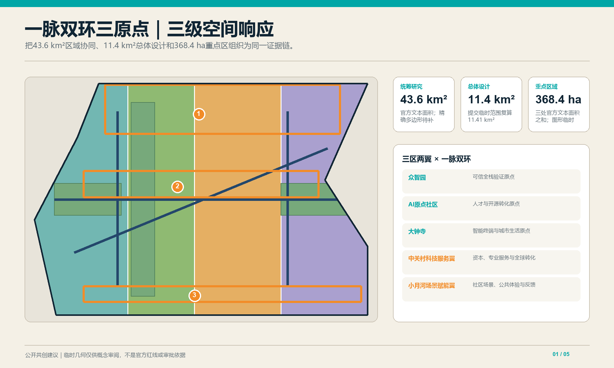
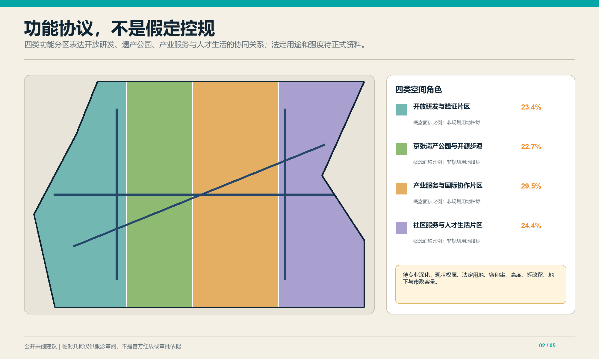
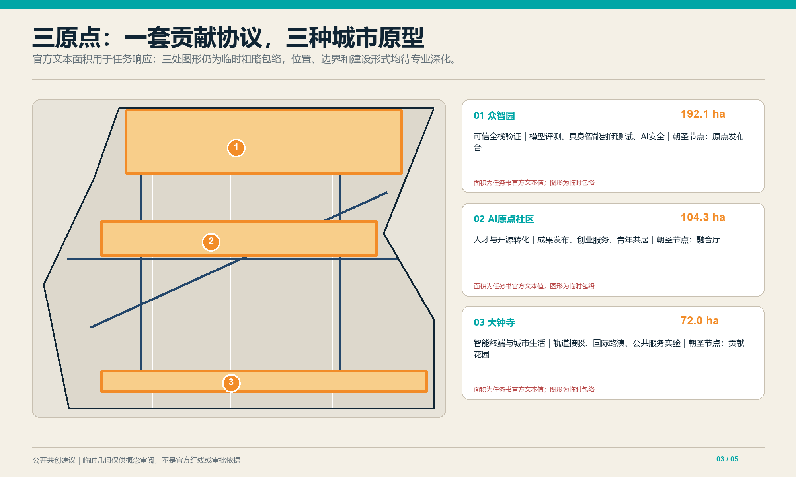
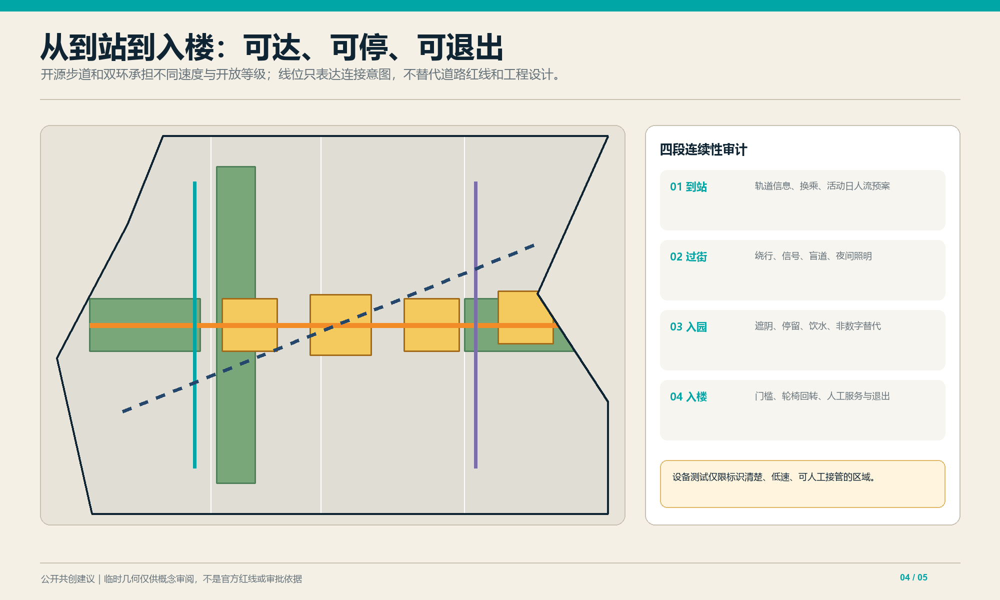
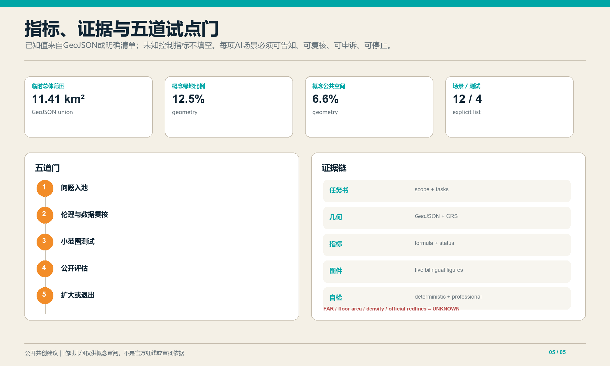

# 京张开源智脉：Jing-Zhang Open Intelligence Commons

## 设计依据与资料清单

本方案把百年京张AI创新带理解为“开放智力的城市公共基础设施”：代码、模型、数据、场景与市民问题在此被提出、验证、复核并持续运营。依据包括官方公告、面向智能体任务书、公开资料登记表及本地专业标准摘录 [source:OFFICIAL-ANNOUNCEMENT] [source:AGENT-TASKBOOK] [standard:STD-URBAN-DESIGN-MEASURES]。提交边界和三处重点区采用仓库临时粗略几何，只用于概念生成、展示和自检，不是官方红线、法定控制或精确面积依据；正式多边形发布后须统一重算 [data:geometry/site_boundary.geojson#SITE-001] [data:geometry/key_areas.geojson#PROV-KEY-001]。

## 三层范围工作框架

三层不是彼此割裂的图纸。统筹层把区域协作案例转译为机制假设，总体层把机制落到走廊、节点和公共接口，重点区层再以可逆样板检验空间是否服务开发者、企业、居民和访客。任何重点区试点都要回写总体指标，并说明向更大区域迁移的条件。仓库尚无官方总体边界、道路红线与完整现状调查，因此本方案只提交统一临时底板；面积值用于相对比较和工具校验，不用于法定判断。收到官方资料后，应先替换基础几何，再依次重算用地、建筑、慢行、绿地、公共空间和分期，最后复核全部图表与双语文本 [data:geometry/site_boundary.geojson#SITE-001]。

统筹研究范围回答区域协同与未来城市议题；总体设计范围回答更新结构、公共空间、交通与蓝绿网络；三处重点区形成可由专业团队继续深化的城市设计原型。三层之间共享同一证据链和边界警示，不把概念建议写成审批结论 [depth:existing_conditions_diagnosis] [depth:three_level_scope_framework]。

### 三层范围与官方任务对照

| 层级 | 官方规模 | 本方案回答 | 当前证据边界 |
|---|---:|---|---|
| 统筹研究范围 | 43.6 km² | 区域创新协作、未来城市机制与国际案例转译 | 仅作机制研究，不生成法定空间边界 |
| 总体设计范围 | 11.4 km² | 更新结构、交通、蓝绿、公共空间与运营网络 | 临时底板复算约11.41 km²，待官方边界校准 |
| 重点区域详细设计 | 368.4 ha | 众智园192.1 ha、北京AI原点社区104.3 ha、大钟寺72.0 ha的差异化原型 | 面积取官方任务描述；提交多边形为临时示意，不能据其判断精确红线 |

“一脉双环三原点”是本方案的空间组织语言；官方“三区两翼”是任务要求中的产业协同框架。两者不是同一层级：三原点承接三个重点区，西侧研发验证环重点连接“中关村科技服务翼”，东侧公共生活环重点连接“小月河场景赋能翼”，共同由京张开源步道串联。该对应关系是概念性转译，不替代官方规划分区。[source:OFFICIAL-ANNOUNCEMENT] [source:AGENT-TASKBOOK]

## 统筹研究范围产业与未来城市研究

案例转化采用“能力—接口—空间—治理”四步法：不复制地标造型，而提取可复核的协作机制；把机制写成数据、设备和责任接口；为接口配置共享实验室、发布厅、街道测试段或社区客厅；最后补上隐私、无障碍、事故处置和退出规则。区域协同不承诺行政协议，而建议共享公开基准、双语活动目录和可迁移场景协议。外部案例只作启发，不升级为本地控制依据；本地承载能力、利益相关者和真实需求仍需通过公开议题征集与专业调查确认。正式资料缺失时，不计算产业规模、就业容量或区域投资效应 [source:SOURCE-REGISTRY]。

建议以“开放模型—开放场景—开放治理”形成与北部科学城、未来科学城、怀柔科学城、经开区和京津冀创新节点的协作接口。可转化机制包括：开放基准测试、可信数据空间、场景需求榜、国际开源驻留、算力与绿色能源对账、技术伦理复核。每项机制先定义数据边界、运营主体和退出条件，再进入空间试点 [source:AGENT-TASKBOOK] [depth:industry_ecosystem_study]。

### 全球案例机制对照

| 案例 | 可转译机制 | 京张落地接口 | 适用限制 |
|---|---|---|---|
| 新加坡Punggol Digital District | 产业—校园—社区协同与Open Digital Platform | 三原点共享运行数据字典与城市实验协议 | 仅借鉴协同机制，不照搬治理权限或技术平台 [source:CASE-PUNGGOL] |
| Helsinki Smart Kalasatama | 居民、企业、城市共同参与的敏捷试点 | 场景榜单、小范围试验、公开复盘 | 需符合本地数据规则与社区意愿 [source:CASE-KALASATAMA] |
| 巴黎STATION F | 项目制创业社区与多伙伴服务网络 | 开源驻留、企业服务台、国际路演日历 | 不把单体园区模式等同于城市更新 [source:CASE-STATION-F] |
| Montréal Mila | 研究、人才、技术转移与公共利益议题并联 | 人才转化原点、可信AI复核与公共课程 | 研究机构模式不能替代本地运营主体 [source:CASE-MILA] |
| Dubai AI Campus | 实体空间、加速器与技术伙伴共建 | 国际合作工作站与限定验证环境 | 商业推广材料仅用于识别机制，不作为成效证据 [source:CASE-DUBAI-AI] |
| Toronto Quayside数字治理讨论 | 独立监督、公共利益、负责的数据使用 | 数据最小化、公开登记、申诉与退出机制 | 作为治理警示案例，不复制已终止项目的实施路径 [source:CASE-QUAYSIDE] |

## 总体设计范围城市更新与控规深度城市设计

空间设计强调“沿线可见、过街可达、室内外可切换”。主脉不是装饰轴，而是将铁路记忆、公共议题和创新过程并置的连续步行体验；双环通过不同速度与开放等级，避免研发测试干扰社区日常；三原点以可识别的公共首层连接专业园区和城市生活。四类概念用地完整覆盖提交边界，便于拓扑检查，但不代表现状权属与真实地块。建筑基底、公共空间和绿地均在临时边界内派生，关系可复算；道路中心线只表达连接意图，不推断现状道路等级或工程线位。强度、高度和拆改留仍待官方控规与逐栋调查 [metric:site_area_sqm]。

总体结构为“一脉双环三原点”。一脉是沿京张铁路历史叙事组织的开源步道；西环连接研发、验证和企业服务，东环连接社区、公共服务与城市体验；三原点分别承担全栈验证、人才转化和智能经济展示。用地四分区是功能协议而非新增法定分区，建筑高度、容积率、拆改留和市政线位均待正式资料与专业调查 [data:geometry/land_use.geojson#LU-001] [depth:land_use_and_spatial_structure]。

## 重点区域详细设计

众智园AI自主创新加速区定位为“可信全栈验证原点”，设置模型评测、具身智能封闭测试、AI安全与低碳算力展示；北京AI原点社区定位为“人才与开源转化原点”，设置成果发布、创业服务、青年共居与校地慢行接口；大钟寺AI产业聚集区定位为“智能终端与城市生活原点”，组织轨道接驳、国际路演、内容消费和公共服务实验。三者以同一贡献协议互认成果，但不混同产业角色 [data:geometry/key_areas.geojson#PROV-KEY-001] [depth:three_key_area_detailed_design]。

## AI 创新生态、人才画像与 AI+ 场景

五类核心画像为开源开发者、初创团队、科研人员、周边居民、国际访客；同时以老年人、儿童、低视力与行动不便者作为全流程包容性校验者。空间—运营映射分别对应协作厅与夜间工作站、共享验证场、研究发布界面、低打扰社区客厅、双语路演与无障碍导览 [source:AGENT-TASKBOOK] [depth:public_service_facilities]。

十二张场景卡为：①无障碍多模态导航；②轨道拥挤度人工复核提示；③园区—高校成果匹配；④企业服务copilot；⑤老年健康服务转介；⑥雨水花园微气候反馈；⑦公共空间共创议题板；⑧京张文化智能导览；⑨多语公共服务；⑩限定区域末端配送；⑪可信智能体互操作沙盒；⑫低碳算力对账。后四项中的末端配送、互操作沙盒、模型安全评测、低碳算力对账为测试验证场景，均需限定区域、授权数据、人工接管、事件日志和退出机制 [metric:scenario_card_count] [metric:testing_scenario_count]。

### 五类用户画像与包容性护栏

| 用户画像 | 核心需要 | 空间/服务响应 | 排除风险与护栏 |
|---|---|---|---|
| 开源开发者 | 可复现实验与协作者 | 协作厅、夜间工作站、开放基准 | 不以封闭设备或付费会员作为唯一入口 |
| 初创团队 | 低成本验证与企业服务 | 共享验证场、服务copilot、路演接口 | AI建议须有人审，不形成自动审批 |
| 科研人员 | 可信数据与成果转化 | 研究发布界面、伦理复核、版本档案 | 敏感数据不出授权域，保留撤回路径 |
| 周边居民 | 低打扰、可理解、可申诉 | 社区客厅、安静时段、非数字服务台 | 不因不使用App而降低公共服务可达性 |
| 国际访客 | 双语导览与短期协作 | 双语标识、无障碍路演、访客权限 | 明示数据用途、保存期限与跨境限制 |

老年人、儿童、低视力者和行动不便者作为横向校验者进入所有画像测试，不被压缩成单独“特殊用户”场景。

### 十二张AI+场景卡

| # | 场景/位置 | 主要用户 | AI角色与最小数据 | 人工兜底/退出条件 |
|---:|---|---|---|---|
| 1 | 站点—园区无障碍导航 | 居民、访客 | 路径推荐；匿名障碍状态 | 服务台提供纸质路线；错误率超阈即下线 |
| 2 | 轨道拥挤提示 | 通勤者 | 聚合客流提示，不做人脸识别 | 运营人员复核；异常事件切回人工广播 |
| 3 | 园区—高校成果匹配 | 科研人员、初创团队 | 经授权的项目标签 | 双方确认后对接；禁止自动排序决定资助 |
| 4 | 企业服务copilot | 初创团队 | 政策知识库与企业主动提交信息 | 人工窗口确认；不输出审批结论 |
| 5 | 老年服务转介 | 老年居民 | 主动咨询文本最小化 | 社工复核；不做诊断与自动风险评级 |
| 6 | 雨水花园微气候反馈 | 居民、运维者 | 环境传感器聚合值 | 设施异常转人工巡检；不采集个人轨迹 |
| 7 | 公共空间共创议题板 | 全体市民 | 议题聚类与摘要 | 原文可核验；偏差或滥用时暂停自动摘要 |
| 8 | 京张文化智能导览 | 居民、访客 | 开放史料与位置触发 | 明示生成内容；争议史实由编辑复核 |
| 9 | 多语公共服务 | 国际访客 | 用户输入的即时翻译 | 关键事项由双语人员复核 |
| 10 | 限定区域末端配送 | 园区用户 | 设备定位与任务单 | 低速、实体急停、人工接管；越界即停 |
| 11 | 可信智能体互操作沙盒 | 开发者、科研人员 | 合成/脱敏测试集与事件日志 | 隔离环境、红队复核；越权调用即终止 |
| 12 | 低碳算力对账 | 团队、运维者 | 聚合能耗与任务批次 | 人工审计；数据缺失时不得发布排名 |

### 四类限定试验协议

| 试验 | 边界与验收阈值 | 停止条件 | 负责角色 |
|---|---|---|---|
| 末端配送 | 标识清晰的园区低速段；全程可接管且无障碍通道不被占用 | 越界、碰撞、急停失效或投诉集中 | 场地运营方 + 安全员 |
| 智能体互操作 | 隔离沙盒；越权调用阻断率100%、日志可追溯 | 数据外泄、权限绕过或日志缺失 | 技术运营方 + 独立复核者 |
| 模型安全评测 | 合成/授权数据；高风险输出100%进入人工复核 | 出现不可控有害输出或申诉无响应 | 模型提供方 + 伦理复核组 |
| 低碳算力对账 | 聚合批次；计量覆盖率达到约定门槛后才公开 | 计量断档、口径漂移或误导性排名 | 算力运营方 + 第三方审计角色 |

阈值须由实施主体在试点前量化并公示；本稿只规定最低护栏，不替任何机构作工程承诺。[metric:scenario_card_count] [metric:testing_scenario_count]

## 用地、建筑规模与拆改留方案

七类节点承载孵化、验证、文化、融合、国际协作、人才生活和社区服务，重点是首层用途及公共界面，而不是追求新的高层地标。拆改留判断设置结构消防安全、历史价值、全寿命碳排、公共连通收益四项前置核验；缺少任一项时不得给出拆除结论。现状建筑清单、层数、面积与质量尚未公开，因此建筑图层只是设计语言的空间索引。专业深化应逐栋测绘，将概念节点匹配到可利用存量，再依据正式控规复核高度、间距、日照、消防和市政容量。总建筑面积、密度与容积率继续标记未知 [depth:height_massing_character]。

建议采用“先留、再改、慎拆、可逆增补”：保留可复用结构与具有京张记忆价值的空间线索，改造首层为开放接口，仅在结构安全、公共连通或必要设施无法满足时研究拆除。建筑基底仅表达七类概念节点，不代表现状测绘、产权判断或实施许可；总建筑面积、密度与容积率保持待定 [data:geometry/buildings.geojson#BLDG-101] [metric:floor_area_ratio] [depth:retain_renovate_demolish]。

## 交通、轨道、市政与公共服务设施

慢行系统按“到站—过街—入园—入楼”四段校验连续性，每段检查坡度、盲道、照明、遮阴、等候和导向。轨道站点接驳建议设置统一双语信息、无障碍失败回报和活动日人流预案；机器人及配送设备只在标识清楚、低速、可人工接管的限定区域测试。由于缺少公交站点、停车供需、道路断面和市政管线数据，本方案不计算交通容量与停车指标，也不承诺新增出入口。后续交通工程应把概念中心线替换为正式红线和断面，再验证步行绕行、紧急通道、消防救援和服务车辆冲突 [metric:road_area_sqm]。

“开源步道”连接三原点，两条慢行环分别服务研发验证和社区生活，并在轨道站点形成清晰接驳。建议优先开展断点盘点、无障碍连续性审查和夜间安全评估；停车、市政管线、道路红线与站城工程必须以正式资料深化。智能导航只能提供建议，不替代交通管理与应急指挥 [data:geometry/roads.geojson#ROAD-101] [depth:traffic_rail_slow_parking]。

## 蓝绿空间、公共空间与城市风貌

蓝绿系统承担生态和社会双重任务：连续绿脉提供遮阴、雨水滞蓄与热舒适，四类公共接口让技术讨论从封闭园区进入可理解的城市界面。每处空间都应提供免费停留、饮水、卫生间指引、轮椅回转和安静时段，数字交互必须有非数字替代。概念绿地与公共空间比例来自多边形联合面积复算，但尚未结合现状树木、水文、地下空间和权属，不能等同于规划绿地率或法定公共空间指标。风貌控制优先保留工业与铁路尺度感，避免用泛科技幕墙覆盖真实历史痕迹 [metric:public_space_ratio]。

京张记忆绿脉串联“问题广场—融合厅—贡献花园—公共体验站”。问题广场公开城市议题，融合厅展示原型与复核过程，贡献花园记录经许可的开源贡献，公共体验站提供面向普通市民的低门槛AI体验。视觉识别建议采用“轨枕括号 + 三个开源节点”的可延展Logo，色彩来自铁路深蓝、青绿和暖橙 [data:geometry/public_space.geojson#PUBLIC-101] [depth:blue_green_public_space]。

## 更新项目清单、实施政策与分期计划

近期建议开展可逆标识、步行断点、三处公共接口和两类低风险数字服务试点；中期联动三原点的验证设施、人才服务与轨道接驳；远期形成带状年度运营网络。建议设“问题入池—伦理与数据复核—小范围测试—公开评估—扩大或退出”五道门，每道门保留人工决定权。分期仅是概念路线，不构成投资、工期或政府承诺 [data:geometry/phasing.geojson#PHASE-101] [depth:phasing_implementation]。

年度运营包括春季Open Model Week、夏季Urban Agent Challenge、秋季Jing-Zhang Commons Forum和冬季可信AI复盘；以开发者驻留、社区议题征集、场景开放日、双语传播和贡献荣誉墙维持长期活力。三个朝圣节点分别是“原点发布台”“融合厅”“贡献花园”，其建设位置和形式均待专业深化 [source:AGENT-TASKBOOK] [depth:renewal_project_list]。

### 三重点区项目包与运营责任

| 重点区（官方文字面积） | 首发项目包 | 首年可验证成果 | 退出/调整门 |
|---|---|---|---|
| 众智园 192.1 ha | 可信评测中心、具身智能封闭测试、低碳算力展示 | 测试协议、事件日志模板、公开安全报告 | 无责任主体或安全边界不清则不开放 |
| 北京AI原点社区 104.3 ha | 开源发布台、青年共居接口、校地慢行缝合 | 驻留计划、贡献档案、连续无障碍审计 | 社区负担上升或公共开放不足则缩减活动 |
| 大钟寺 72.0 ha | 轨道接驳、国际路演、智能生活体验 | 双语服务、活动日人流预案、公众反馈 | 交通与消防条件未核定则停止扩容 |

项目采用“问题提出者—场地运营方—技术提供方—数据责任角色—独立复核者”五方责任矩阵。第一道门确认公共价值与责任人，第二道门核查数据、伦理和无障碍，第三道门仅在限定范围测试，第四道门公布可核验证据，第五道门由人工决定扩大、修正或退出。KPI同时看公共可达、问题解决、风险事件、人工接管和维护成本，禁止只以客流、曝光或模型调用量评价成功。[depth:phasing_implementation]

### AI伦理与权利保障矩阵

| 风险 | 前置控制 | 运行证据 | 用户权利 |
|---|---|---|---|
| 隐私与过度采集 | 数据最小化、目的限定、分级授权 | 数据目录、访问日志、删除记录 | 知情、拒绝、撤回与申诉 |
| 偏差与可达性 | 分组测试、无障碍与非数字替代 | 分组错误率、无障碍审计、现场抽查 | 平等服务与人工通道 |
| 自动化越权 | 关键决定不得全自动、明确接管角色 | 接管次数、异常工单、责任记录 | 获得解释与人工复核 |
| 安全与技术过时 | 红队测试、版本冻结、年度退出审查 | 事件日志、版本清单、停用记录 | 风险告知与替代服务 |

## 指标体系、面积复算与合规矩阵

指标分为空间结果、运营过程和治理保障三组。当前机器包只把能够从几何或清单直接复算的值标为已知；缺少正式资料的控制指标全部保留 unknown，不以行业平均或生成式估算填空。任务覆盖矩阵逐项映射公告和 agent.1—agent.6，标准矩阵记录本地标准摘录及待补文件，设计深度矩阵连接正文、图纸、几何和自检。任何几何更新都必须同步刷新指标、图片、HTML、PDF 与清单哈希；人工复核还要抽查单位、公式、坐标系和双语数值一致性。临时边界误差不会阻断内容评分，但所有精度相关结论必须保留警示 [standard:STD-MNR-LAND-USE-CLASSIFICATION]。

临时范围复算约11.41平方公里；概念绿地和公共空间比例由提交GeoJSON计算，场景卡12张、测试验证类4张。由于边界、道路红线、现状建筑和控规指标不完整，容积率、总建筑面积、道路面积和建筑密度明确保持未知。机器可读值、公式与假设以 `metrics.json` 为准 [metric:site_area_sqm] [metric:green_ratio] [depth:metrics_recalculation]。

## 风险、版权与合规说明

版权层面，正文、几何与图表由智能体基于仓库登记资料生成，未嵌入商业地图、远程字体或第三方图片；公开展示仍应遵循提交许可并保留来源记录。治理层面，涉及健康、公共安全、未成年人、位置轨迹或企业敏感数据的场景，不得在概念阶段收集真实个人数据。实施层面，每个试点必须明确责任主体、用户告知、人工接管、日志保存期限、申诉渠道和停止条件。临时边界、文保、市政、权属与工程条件是最高优先级缺口，在这些资料补齐前不得将概念图用于招标、施工或行政审批；任何AI输出都不能替代专业判断 [source:SITE-PACKAGE]。

主要风险包括临时边界误读、隐私过度采集、算法偏差、自动化越权、运营成本和技术过时。对策是显著标注临时性、数据最小化、分组公平性测试、人工复核、可逆试点和年度退出审查。所有空间落点均为概念建议，可供专业团队深化；本方案不宣称官方背书、入选、审批或实施 [source:SOURCE-REGISTRY] [depth:risk_missing_data]。

## 参考资料

核心来源包括北京市规划自然资源部门公开公告、仓库面向智能体任务书、公开资料登记表、临时边界数据和本地专业标准摘录。公告与任务书支撑任务范围，临时几何只支撑概念位置和工具复算，专业标准只在本地摘录状态允许时支撑方法要求，任何来源均不被扩张解释为政府实施承诺。未来若新增外部网页，必须补充发布者、日期、访问日期、许可、适用范围和限制，并在 sources.json 登记后才可进入正式论证。机器可读来源索引承担完整审计，正文仅保留与当前判断直接相关的锚点 [source:OFFICIAL-ANNOUNCEMENT] [source:BOUNDARY-SOURCE] [standard:STD-CONTROL-DETAILED-PLANNING]。

完整来源、许可、用途边界与限制见 `sources.json`；专业标准响应见 `standard_matrix.json`，任务覆盖见 `compliance_matrix.json`，设计深度见 `design_depth_matrix.json`。
