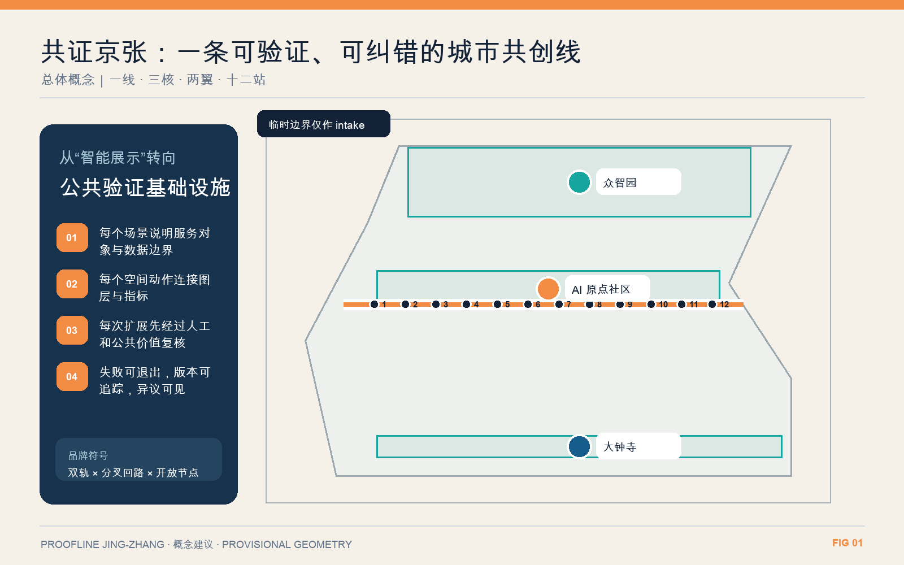
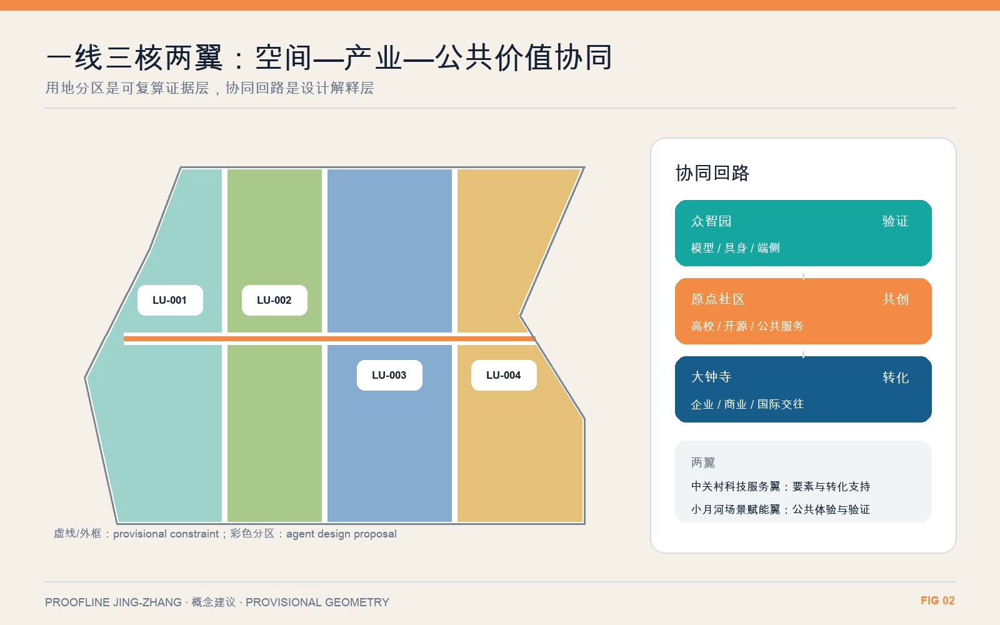
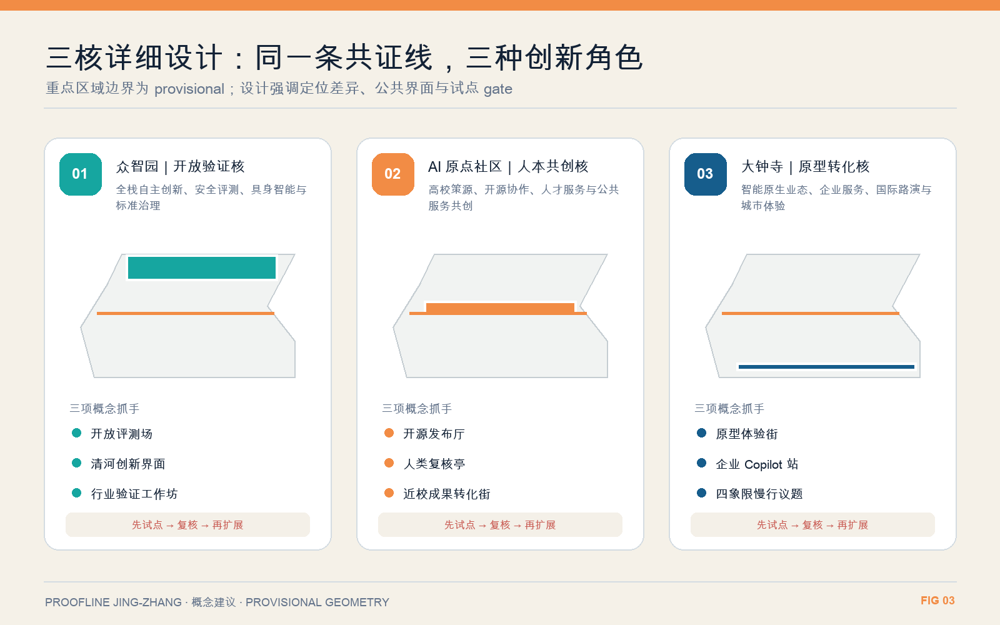
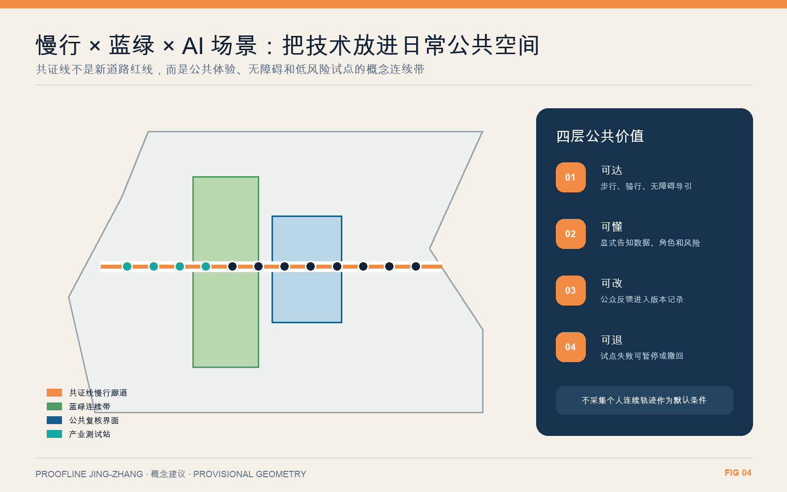
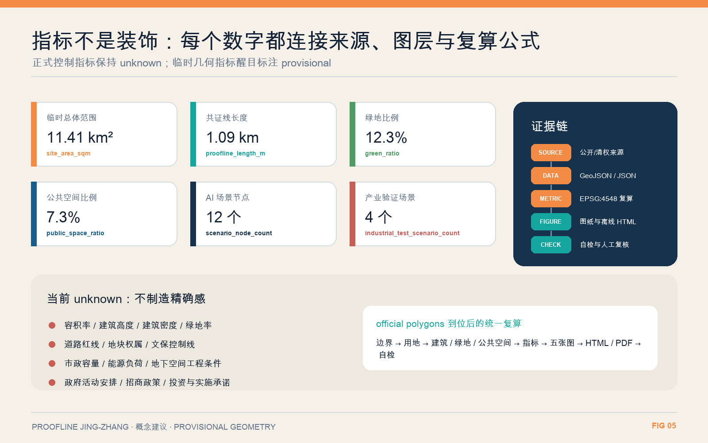

# 共证京张｜Proofline Jing-Zhang

“共证京张”不是给京张沿线再贴一层 AI 标签，而是把铁路最有价值的精神——测量、校准、协作、留下可追溯记录——转译为未来城市制度。方案以京张遗址公园为一条 **Proofline 共证主线**，串联众智园、北京 AI 原点社区和大钟寺三处创新核心，向高校科研与城市生活两翼展开，设置十二个可步行抵达、可公开体验、可人工复核的场景站。AI 产品先在真实城市问题中小范围测试，公开适用边界与失败记录，再由专业人员和使用者共同决定是否扩大应用。

空间结构概括为“**一线三核、两翼十二站**”：

- 一线：约 1092.647 米的提交范围内概念性 Proofline 主廊，把铁路遗产、慢行系统、开放测试与公共叙事叠合在同一条日常路线中 [metric:proofline_length_m]。
- 三核：众智园负责自主技术与安全验证，原点社区负责近校成果转化与开源协作，大钟寺负责城市应用、国际交流与消费体验；三处边界现均为临时研究范围 [metric:key_area_count]。
- 两翼：西侧“知识—研发翼”连接高校院所与创新企业，东侧“生活—市场翼”连接社区、公共服务和商业场景。
- 十二站：四个产业验证站、五个城市服务站、三个文化公共站，以空间节点而非手机应用作为参与入口 [metric:scenario_node_count]。

标志由两条平行轨道和一条开放的校验回路组成：深蓝代表工程可信度，京张橙代表历史与行动，青绿代表开放协作与生态；末端保留一个未闭合节点，表示任何模型结论都允许被质疑、修正和版本化。该图形与本方案全部图件均为本次程序化原创，不使用未清权商标、照片或字体资产。

## 设计依据与资料清单

本 formal 方案以北京市规划和自然资源委员会海淀分局发布的《百年京张AI创新带城市设计国际方案征集资格预审公告》为第一依据，并以 `brief/site-package/` 中经维护者登记的临时粗略边界、重点区域、枚举、指标和来源清单为机器可读依据。AI agent 在生成方案前必须读取 `design_brief.json`、`allowed_design_space.json`、`sources.json`、`enums/`、`ranges/`、`schemas/`、`data/source_registry.json` 和 `data/processed/agent_fact_pack.md`，并用 `project_scope_summary.csv`、`agent_task_requirements.csv`、`source_use_matrix.csv`、`missing_data_checklist.csv` 建立任务、范围、资料用途和缺口清单。所有设计判断都要拆分为可追溯来源、可复算指标、可校验图层和可人工复核假设。公告要求方案达到控制性详细规划的城市设计深度和规划综合实施方案的城市设计深度，因此文本叙述不能替代 GeoJSON、指标表、A3 文册、A0 展板和 HTML 电子展示成果。

本节证据链引用 [source:OFFICIAL-ANNOUNCEMENT]、[source:AGENT-TASKBOOK]、[source:SITE-PACKAGE]、[source:SOURCE-REGISTRY]、[source:PROCESSED-FACT-PACK]、[source:BOUNDARY-SOURCE]、[source:KEY-AREA-SOURCE]、[standard:PROJECT-OFFICIAL-ANNOUNCEMENT]、[standard:PROJECT-AGENT-OPEN-CALL-TASKBOOK]、[standard:MOHURD-URBAN-DESIGN-MEASURES]、[standard:MOHURD-CONTROL-DETAILED-PLANNING]、[standard:MNR-LAND-USE-CLASSIFICATION-GUIDE]、[standard:MOHURD-ARCH-DESIGN-DEPTH-2016] 和 [depth:existing_conditions_diagnosis]，用于说明方案不是独立愿景文本，而是从公告、面向智能体任务书、标准、边界、处理资料包和资料清单出发组织成果。

资料登记表的使用边界如下：

- data/source_registry.json 登记公开、清权与临时资料的用途边界。
- 当前登记摘要：formal 可用资料 5 条，背景资料 0 条，provisional-only 资料 1 条。
- agent 不得把 background_only 或 provisional_only 资料升级为 official boundary、法定控规、正式评分依据或政府实施承诺。

`data/processed/agent_fact_pack.md` 是本方案的阅读导航层，不是新的权威来源。[source:PROCESSED-FACT-PACK] 只帮助 agent 把三层范围、三处重点区、公告任务、agent.1-agent.6、资料可用性和缺资料事项组织成可读方案；所有事实判断仍回到 [source:OFFICIAL-ANNOUNCEMENT]、[source:AGENT-TASKBOOK]、[source:SOURCE-REGISTRY]、[source:BOUNDARY-SOURCE] 与 [source:KEY-AREA-SOURCE]。

在官方 `SITE_BOUNDARY` 或三处 `KEY_AREA` 尚未取得时，本提交使用 `brief/site-package/geometry/provisional_boundaries.geojson` 形成临时 formal 包。提交包中的 `geometry/site_boundary.geojson` 与 `geometry/key_areas.geojson` 均标注为 `provisional_constraint`、`official_boundary=false`，只能用于方案生成、自检、可视化和设计讨论，不能作为 official redline、审批依据、精确面积依据或法定控制结论。该组织方数据缺口本身不阻断内容评分；替换 official polygons 后，site boundary、key areas、land use、roads、green space、public space、buildings、phasing 和 metrics 均需重算。

本次提交的可评分状态为：**临时边界，保留精度警示并待正式数据发布后复算；不阻断内容评分**。因此，正文中的空间结构、场景、项目和指标均按“可讨论、可复核、可替换官方边界后重算”的原则写入；当官方边界和重点区 polygon 更新后，必须重新生成、自检和校核图纸/HTML，不能只替换单个文件。

边界和重点区域的可读解释对应 [data:geometry/site_boundary.geojson#SITE-001]、[data:geometry/key_areas.geojson#PROV-KEY-001] 和 [metric:site_area_sqm]、[metric:key_area_count]。这意味着读者可以从正文回到 GeoJSON 查看边界来源、从 metrics 查看面积复算结果、从 sources 查看资料来源，而不是只相信一段文字判断。

## 三层范围工作框架

方案按照公告确定的三个层次组织工作：统筹研究范围关注 43.6 平方公里的AI产业生态、战略定位、创新链和未来城市形态；总体设计范围关注 11.4 平方公里京张遗址公园周边 1-2 公里城市地区和产业区，要求形成城市更新总体框架、产业空间布局、交通市政支撑和城市风貌控制；重点区域范围关注 368.4 公顷三处详细设计地区，要求明确功能业态、建筑规模、拆改留分类、公共空间连通和交通组织。三层范围在 `compliance_matrix.json` 中逐条映射，保证公告 1.3、1.4、1.5 与 agent.1-agent.6 的必选任务都有章节、图层、指标、图纸和 HTML 证据。

三层工作框架的深度项由 [depth:three_level_scope_framework] 和 [depth:overall_spatial_structure] 约束，空间证据以 [data:geometry/site_boundary.geojson#SITE-001] 与 [data:geometry/key_areas.geojson#PROV-KEY-001] 为准，任务依据以 [standard:PROJECT-OFFICIAL-ANNOUNCEMENT] 为准，范围索引以 [source:PROCESSED-FACT-PACK] 中 `project_scope_summary.csv` 的三层范围表为导航。

三层工作不是互相割裂的图纸集合。统筹研究决定产业链和城市形态判断，总体设计把判断落实到更新项目、空间结构和设施承载，重点区域详细设计验证具体地块、建筑、交通、公共空间和AI应用场景的可实施性。agent 生成方案时必须先锁定当前提交采用的 official 或 provisional 边界和约束，再生成用地、建筑、道路、绿地、公共空间、分期和AI服务节点，最后从这些图层复算指标并在正文解释哪些结论仍受 provisional boundary 限制。任何无法从结构化数据复算的面积、比例、规模或项目数量，不得写入正式结论。

本方案的总体概念为“共证京张”：以京张遗址公园为历史与公共空间主轴，以众智园、北京 AI 原点社区、大钟寺三处重点片区为创新锚点，以高校、企业、社区和轨道站点为日常网络，形成“一线三核、两翼十二站”的空间组织。“一线”不是额外画出的新红线，而是一套沿现有遗产廊道组织验证、展示、质疑和修正的公共方法；“三核”对应三种互补的创新角色；“两翼”把知识生产与生活应用接上；“十二站”对应 AI+公共服务、产业验证和文化体验的可运营节点。蓝绿慢行系统把这些节点连接成无需预约、全天可见的城市界面。

三层范围采用同一套“提出问题—小范围验证—公开证据—人工决定—持续复盘”机制。43.6 平方公里统筹研究范围形成产业与人才关系图；11.4 平方公里总体设计范围把关系落为廊道、用地、项目和设施；三处重点区用可实施空间原型检验总体判断。这样，范围越小，表达越具体，但判断依据不改变。当前提交几何只用于概念自洽与机器复算，绝不把临时范围包装成官方红线。

| 层级 | 设计问题 | 方案回答 | 数据落点 |
| --- | --- | --- | --- |
| 统筹研究范围 | AI产业生态和未来城市形态如何组织 | 建立“高校策源-开源协作-企业转化-公共体验-国际传播”的创新链 | compliance_matrix.json、standard_matrix.json |
| 总体设计范围 | 产业空间、城市更新、交通市政和风貌如何落图 | 用地、建筑、道路、绿地、公共空间和分期图层共同表达 | [data:geometry/land_use.geojson#LU-001]、[data:geometry/roads.geojson#ROAD-001] |
| 重点区域范围 | 三处片区如何达到详细设计深度 | 分别提出定位、空间动作、AI场景和实施依赖 | [data:geometry/key_areas.geojson#PROV-KEY-001]、[data:geometry/key_areas.geojson#PROV-KEY-002]、[data:geometry/key_areas.geojson#PROV-KEY-003] |

## 统筹研究范围产业与未来城市研究

统筹研究范围的核心任务是构建世界级 AI 创新生态体系。方案应梳理海淀高校院所、头部企业、算力算法数据要素、孵化平台、上市企业、独角兽和科技服务资源，提出AI创新链、产业链、人才链和城市服务链的空间协同框架。命名方案和 logo 设计应服务于“百年京张文化带、都市AI生活体验带、AI融合创新带”的整体辨识度，不能只停留在口号，应说明与产业生态、公共空间和文化资源的关联。面向智能体任务书还要求回应“五大功能”和“三区两翼”协同，形成可继续深化的命名系统、视觉识别、总体空间结构图、场景开放和运营机制；本节必须用 [source:AGENT-TASKBOOK] 与 [standard:PROJECT-AGENT-OPEN-CALL-TASKBOOK] 标注这些要求来自 agent 开源征集任务，而不是法定规划控制。

统筹研究并不新增伪精确红线；它通过 [standard:MOHURD-URBAN-DESIGN-MEASURES] 要求的城市风貌、公共空间和建筑布局统筹，回接 [data:geometry/land_use.geojson#LU-001]、[data:geometry/public_space.geojson#PUBLIC-001] 与 [depth:overall_spatial_structure]，说明产业策略最终要落到可见、可复核的空间结构。

未来城市形态研究应回答人工智能如何改变工作、生活、社交、学习、交通和公共服务。方案应把AI交通系统、连续绿色空间、创新服务设施和国际化生活工作氛围落实为可定位的功能区、节点、廊道和场景，而不是泛泛描述技术愿景。agent 应把产业战略指标、AI创新指数、人才密度、空间供给类型和AI+垂直应用重点区域写入指标体系，并标明哪些是官方、哪些是设计建议、哪些仍待正式数据校准。若提出全球AI创新活动、开发者社区、开放场景或朝圣路线，应写为“概念建议/参考方案/可供专业团队深化研究”，不得写成已经确定的政府活动或实施安排。

五个国际案例只提取机制，不照搬形态。新加坡 one-north 的启发是把工作、生活、学习和共享设施放进同一创新社区，故本方案不建设封闭“AI 园”，而以可进入的公共首层和慢行廊道连接企业与社区 [source:CASE-ONE-NORTH]。巴黎—萨克雷强调实验室、概念验证、孵化器与社会之间的技术转移，转化为原点社区的“研究—原型—真实场景—复盘”短链 [source:CASE-PARIS-SACLAY]。伦敦 Knowledge Quarter 说明知识集群也可以通过成员网络、公共活动和场所维护持续运作，转化为跨高校、企业、博物与社区机构的 Proofline 会员协作机制 [source:CASE-KNOWLEDGE-QUARTER]。剑桥 Kendall Square 从工业地区转向混合创新街区的经验，支持把交通、生活配套和邻里公共空间视为创新基础设施 [source:CASE-KENDALL-SQUARE]。STATION F 的项目制招募与分期培育，则启发“共证营”按问题招募队伍、设退出门槛，而非按企业名气分配展示位 [source:CASE-STATION-F]。

产业生态据此组织为四条互相校验的链：高校和研究机构提出可验证的知识命题；企业与开源社区形成原型；城市运营者提供合规、有限、可撤回的测试条件；居民、使用者和专业人员共同评价公共价值。空间供给对应四类载体：可隔离的测试空间、可展示失败记录的共证厅、可快速调整的共享首层、保障日常生活的社区服务。任何产业项目进入 Proofline 前，都必须公开责任主体、测试时段、数据最小集、人工复核人、异常停机方式和退出条件。

品牌运营采用年度循环而非一次性节庆。“Proofline Week 共证周”是概念性年度活动建议：第一日发布城市问题，第二至四日开放小规模测试与同行评审，第五日由居民和专业人员开展逆向质询，第六日展示改进版本，第七日发布《共证账本》，记录通过、返修、暂停和退出的项目。季度举行“失败也公开”复盘夜；每月安排面向新手的开源步行课；日常由沿线站点显示当前测试状态。活动不等于政府承诺，须由未来运营主体依法取得场地、数据和安全许可。

## 总体设计范围城市更新与控规深度城市设计

总体设计范围要求达到控制性详细规划的城市设计深度。方案必须提出城市更新总体空间结构、低效空间识别、更新项目清单、实施政策建议、产业功能比例、空间组织模式、建筑总规模和综合承载能力评估。`geometry/land_use.geojson` 应完整覆盖设计边界且无重叠，`geometry/buildings.geojson` 应表达更新建筑基底或保留建筑基底，`geometry/roads.geojson` 应表达微循环、慢行和轨道接驳关系，`metrics.json` 应复算核心面积、比例和图层数量。

本节按照 [standard:MOHURD-CONTROL-DETAILED-PLANNING] 把控规深度内容拆成可审查对象：[data:geometry/land_use.geojson#LU-001] 表达用地结构，[data:geometry/buildings.geojson#BLDG-001] 表达建筑基底，[data:geometry/roads.geojson#ROAD-001] 表达交通组织，[metric:building_footprint_area_sqm] 用于复核建筑基底面积，[depth:land_use_layout] 与 [depth:development_intensity_controls] 约束成果深度。

总体设计还必须支撑交通、轨道、市政和配套设施。方案应围绕轨道站点一体化、道路微循环、非机动车停放、停车供给、创新服务平台、人才生活服务、新型基础设施、分布式能源和端侧算力提出空间布局和实施路径。涉及建筑高度、开发强度、道路红线、退线和设施标准的内容，若尚无官方控制条件，应写为“待正式控规条件确认”，不得以 agent 推测值冒充审定指标。

“共证京张”的总体空间动作不是推倒重建，而是把碎片化创新资源接成可步行、可识别、可运营的连续系统。第一，沿京张遗址公园建立 Proofline 主廊，以连续步行骑行、清晰路口、口袋广场和公共首层修补断点；第二，在三核分别配置技术验证、成果转化和市场体验功能，避免三个片区同质化招商；第三，把沿线低效首层、闲置边角地、桥下空间和大型封闭地块边界列入“微更新候选池”，先做可逆改造再决定永久建设；第四，所有新增数字设施与座椅、照明、雨洪、导视等传统设施合杆或共舱，减少设备林立。

四个概念用地单元完整覆盖临时总体设计边界，分别承担创新混合、知识转化、生活服务与蓝绿公共功能。它们的面积来自同一组 GeoJSON，可复算为约 267.46、258.93、336.61 和 278.28 公顷 [metric:land_use_lu_001_area_sqm] [metric:land_use_lu_002_area_sqm] [metric:land_use_lu_003_area_sqm] [metric:land_use_lu_004_area_sqm]。这些面积不是法定用地指标，待官方边界、现状地籍和控规图层补齐后应重新分区。当前建筑基底只是方法性样例，用来检验“保留—微改—功能置换—条件成熟后新建”的证据链，不能据此认定任何具体建筑拆除。

## 重点区域详细设计

重点区域详细设计是必选项。众智园AI自主创新加速区应围绕国家人工智能平台、全栈自主创新、标准制定、安全治理、产业展示、对外交通、清河文化、低碳绿色创新交往环境和绿色空间AI场景提出详细方案。北京AI原点社区应围绕近校创新、成果孵化转化、人才特区、开源体系、品牌活动、建筑拆改留、成果展示发布、居住生活配套、校区园区慢行联系和轨道站点一体化提出详细方案。大钟寺AI产业聚集区应围绕领军企业、智能体、智能终端、内容消费、数据要素、数字资产、商业服务、规划绿地复合利用、大钟寺站一体化和路口四象限步行连通提出详细方案。

三处重点区域详细设计必须引用 [data:geometry/key_areas.geojson#PROV-KEY-001]、[data:geometry/key_areas.geojson#PROV-KEY-002]、[data:geometry/key_areas.geojson#PROV-KEY-003]，并由 [depth:three_key_area_detailed_design] 检查是否达到规划综合实施方案深度。若只描述“打造示范区”而没有功能、建筑、交通、公共空间和实施项目证据，应被视为未完成。

三处重点区域必须在 `geometry/key_areas.geojson` 中出现。若仓库已提供 official polygons，应作为 `official_constraint` 使用；若 official polygons 缺失，可暂用 `provisional_constraint`，但正文、HTML、sources、assumptions 和 self_check 必须说明它不能作为正式评分或审批依据。`compliance_matrix.json` 应分别覆盖公告 1.5.3.1、1.5.3.2、1.5.3.3。设计表达应包含功能业态、建筑规模、建筑形态、拆改留分类、公共空间系统、交通组织、慢行连通和实施项目。HTML 页面应能切换查看三处重点区域，A3 文册和 A0 展板应至少包含重点片区总图、局部详图和指标说明。

| 重点片区 | 设计定位 | 空间动作 | AI产业与运营场景 | 证据引用 |
| --- | --- | --- | --- | --- |
| 众智园AI自主创新加速区 | 花园型全栈自主创新街区 | 强化清河界面、产业展示、低碳创新交往和对外交通组织；以绿色空间承载开放测试与标准治理展示 | 自主模型测试、标准制定工作坊、安全治理展示、低碳算力体验 | [data:geometry/key_areas.geojson#PROV-KEY-001]、[depth:three_key_area_detailed_design] |
| 北京AI原点社区 | 近校型成果转化与人才社区 | 组织校区、园区、街区慢行缝合；补足成果发布、人才服务、居住生活和开源协作空间 | 开源社区、成果发布、人才特区服务、近校孵化 | [data:geometry/key_areas.geojson#PROV-KEY-002]、[source:AGENT-TASKBOOK] |
| 大钟寺AI产业聚集区 | 城市型智能经济与国际交往街区 | 围绕大钟寺站一体化、四象限步行连通、商业服务和重点企业公共环境更新 | 智能体与智能终端展示、内容消费、数据要素与国际路演 | [data:geometry/key_areas.geojson#PROV-KEY-003]、[metric:key_area_count] |

众智园采用“园中试、河边见”的剖面逻辑：高风险技术测试在可控室内或围合试验庭院进行，面向公众的原理展示、标准讨论和结果说明放在清河公共界面。中央共证庭由可移动隔断、设备接口和观众环廊组成，测试进行时明确显示负责人、状态与停机按钮；测试结束后恢复为日常交往空间。滨水面只承载低风险感知、生态监测和科普，不布置侵占连续步行的固定展柜。

原点社区采用“校园成果跨过一条街”的小尺度更新。临街首层按 6—12 个月可换租的概念机制容纳成果展示、知识产权、法务、试制和社区共创；二层以上维持安静研发、人才公寓与配套。Proofline Zero“共证零公里”设在校园、园区与遗址公园的交会处，是所有公开测试登记、领取简明说明和提交异议的首站。设计重点不是夸张地标，而是让研究成果从封闭楼宇到真实使用环境的路径足够短、责任足够清楚。

大钟寺采用“站城四象限＋全天公共客厅”。轨道站出口、路口过街、商业首层和遗址公园入口组成连续无障碍环；智能终端、内容消费和数据服务企业共享可预约演示基础设施，避免各自搭建封闭展厅。Human-in-the-Loop Forum“人在回路论坛”面向国际路演、专业听证和居民质询，任何模型展示必须同时呈现适用边界、已知失败和人工接管方式。三片区的建筑规模、道路红线、产权与工程条件均待正式数据校准。

## AI 创新生态、人才画像与 AI+ 场景

方案应建立面向AI人才和企业的空间需求画像，覆盖研发办公、开源协作、成果发布、企业服务、人才居住、社交学习、消费生活、运动休闲和国际交往。AI+场景应围绕公告提出的交通、服务、消费、医疗、教育、法律、生活服务等方向，形成产业发展场景和AI赋能城市功能场景。每个场景应说明服务对象、空间位置、数据来源、隐私边界、人工复核机制和运营主体。

AI 场景必须落到空间和治理边界：公共空间场景引用 [data:geometry/public_space.geojson#PUBLIC-001]，慢行与交通场景引用 [data:geometry/roads.geojson#ROAD-001]，开放空间场景引用 [data:geometry/green_space.geojson#GREEN-001] 和 [metric:public_space_ratio]、[metric:green_ratio]。这些引用让评审者知道场景不是口号，而是位于具体图层和指标中的设计对象。面向智能体任务书要求不少于 10 张 AI 场景卡、不少于 3 个产业测试验证场景和不少于 5 类用户画像；本方案实际提交 12 站、其中 4 个产业验证场景和 7 类画像，并把隐私边界、人工复核和退出条件同步写入正文、HTML、A3/A0 和合规矩阵。

| 用户画像 | 典型需求 | 空间响应 | 自检边界 |
| --- | --- | --- | --- |
| 开源开发者 | 发布、协作、测试、社区声誉 | 原点社区开源发布厅、公共代码墙、夜间协作空间 | 不采集个人行为轨迹；活动数据只做聚合统计 |
| 初创团队 | 低成本办公、算力入口、产品试验场 | 众智园共享测试场、端侧算力服务点、标准治理咨询 | 算力和数据服务需另行授权 |
| 头部企业访客 | 展示、商务、国际接待、人才招聘 | 大钟寺国际路演客厅、轨道站点接驳、重点企业周边公共空间 | 企业标识和案例须清权 |
| 周边居民 | 通勤、休闲、社区服务、低扰动更新 | 京张遗址公园慢行环、社区服务嵌入、夜间照明和活动分级 | 不将居民画像用于商业推荐 |
| 高校师生 | 成果转化、跨校协作、日常慢行 | 校区-园区慢行缝合、成果转化驿站、AI教育体验点 | 校园数据和科研成果需授权 |
| 城市运营者 | 设施维护、异常处置、跨部门协同 | 现场值守点、共证账本后台、人工接管席 | 模型只提供建议，处置权与责任保留给人员 |
| 儿童、老人及无障碍使用者 | 看得懂、走得通、随时求助 | 多感官导视、无障碍连续路径、非数字服务窗口 | 不以人脸或健康特征作默认识别条件 |

十二站全部登记在 [data:geometry/public_space.geojson#SCN-01] 至 `SCN-12`，其中前四站是产业测试验证场景 [metric:industrial_test_scenario_count]。场景不是永久部署承诺；每站遵守“默认不采个人信息、需要时单独授权、关键决定人工复核、达到退出条件即下线”。

| 站点与类别 | 主要使用者 / 空间 | 最小数据与隐私边界 | 人工复核、成效指标和退出条件 |
| --- | --- | --- | --- |
| 01 模型安全共证场〔产业验证〕 | 模型团队、评测人员；众智园可控试验庭院 | 仅使用授权测试集和合成攻击样本，不接入沿线真实个人数据 | 安全员批准测试窗口；记录严重缺陷关闭率，发生越权访问立即停机 |
| 02 端侧算力能效台〔产业验证〕 | 芯片与终端团队；共舱式设备节点 | 只采设备功耗、温度和匿名任务负载，不存任务内容 | 设施工程师复核；以单位任务能耗和热安全为指标，超温或噪声扰民即退出 |
| 03 自主技术互操作台〔产业验证〕 | 开源开发者、企业采购方；原点社区共享实验室 | 仅记录接口成功率和版本号，不上传企业私有代码 | 第三方技术人员复测；连续两轮不可复现或存在锁定风险则暂停展示 |
| 04 智能终端无障碍试验街〔产业验证〕 | 终端企业、老人、残障使用者；大钟寺公共首层 | 测试者主动选择任务；不做人脸识别，不保存声音原文 | 无障碍顾问与使用者共同签字；以独立完成率衡量，形成歧视性误差即撤回 |
| 05 可解释慢行导航站〔城市服务〕 | 通勤者、游客、无障碍使用者；遗址公园断点 | 只采路段级流量和自愿反馈，不生成个人轨迹 | 交通人员复核建议；以绕行时间、误导次数衡量，出现安全冲突立即下线 |
| 06 设施维护共证站〔城市服务〕 | 环卫、园林、市政人员；公园设施节点 | 使用设施编号、故障类型和处理时间，不采报修者身份 | 值班员决定工单；以误报率和闭环时间衡量，误派造成风险即回退人工流程 |
| 07 社区服务翻译站〔城市服务〕 | 老人、外籍访客、办事人员；社区服务首层 | 文本现场处理、默认不留存，不接触证件原件 | 窗口人员确认关键信息；以纠错率衡量，涉及权利义务时必须转人工 |
| 08 青少年 AI 素养站〔城市服务〕 | 学生、家长、教师；原点社区学习廊 | 使用离线公开案例，不采未成年人画像 | 教师全程在场；以能否识别模型错误为成效，出现诱导或不适内容即停止 |
| 09 城市法律信息导航站〔城市服务〕 | 居民、创业团队；大钟寺公共服务点 | 仅处理匿名问题类别，不收案情身份信息 | 法律工作者审校，仅提供办事路径不作法律结论；误导率超阈值即下线 |
| 10 铁路工程记忆站〔文化公共〕 | 游客、铁路爱好者；遗址叙事节点 | 只使用已清权史料与设备说明，不生成真人仿冒 | 文史专家审校；以史料可追溯率衡量，来源不明内容不得展示 |
| 11 开放里程碑步道〔文化公共〕 | 开源贡献者、市民；Proofline 沿线 | 只展示自愿公开的项目版本和机构贡献，不排个人声望榜 | 社区委员会复核；以可复现贡献比例衡量，撤回授权后及时移除 |
| 12 人在回路论坛〔文化公共〕 | 专家、居民、企业与访客；大钟寺论坛 | 会议记录按公开、内部、删除三档授权，不做情绪画像 | 主持人保证异议进入纪要；以问题回应率衡量，重大争议未处理则不得扩大试点 |

十二站共享一张“场景护照”：目标、负责人、数据清单、模型版本、运行时段、适用人群、人工接管、异常记录和退出日期均可现场查看。通过者得到的不是永久认证，而是带版本号的阶段性结论；返修者保留问题记录；暂停者说明原因。这样，“共证”不会滑向科技表演，也不会把市民变成没有选择权的实验数据来源。

agent 生成的AI治理建议必须遵守数据最小化、公开来源、可解释和人工复核原则。城市智能体可以辅助识别慢行断点、公共空间热力、设施维护、企业服务需求和活动安全风险，但不能替代规划审批、不能输出未经授权的个人画像、不能声称获得官方实施承诺。所有AI场景节点应进入结构化图层或合规矩阵，便于评审者看到它们与产业、空间和公共利益之间的关系。

## 用地、建筑规模与拆改留方案

用地方案应依据国土空间调查、规划、用途管制分类等公开标准表达，形成完整、闭合、无缝的用地分区。建筑方案应区分保留、改造、更新、新建或待确认对象，明确建筑基底、功能、规模、风貌、屋顶、体量和高度控制的建议层级。若缺少现状建筑、权属、控规和工程条件，方案只能提出方法和待校准清单，不能编造拆改留结论。

用地分类依据 [standard:MNR-LAND-USE-CLASSIFICATION-GUIDE]，建筑高度、体量、界面和风貌控制由 [depth:height_massing_character] 管理，拆改留方法由 [depth:retain_renovate_demolish] 管理。用地和建筑的主要证据是 [data:geometry/land_use.geojson#LU-001]、[data:geometry/buildings.geojson#BLDG-001] 和 [metric:building_footprint_area_sqm]。

建筑规模和强度指标必须与 `metrics.json` 和图层一致。若总建筑规模、容积率、建筑高度、建筑密度、绿地率、退线和建筑控制线缺少官方条件，应在指标体系中列为 unknown 或 pending_control，不得用固定数值制造精确感。A3 文册应给出更新项目清单和指标复核表，A0 展板应把关键空间结构和重点片区表达清楚，HTML 页面应提供指标和图层联动查看。

拆改留采用证据门槛而不是先画颜色。一级“留”适用于依法保护对象、结构与使用状态良好且支持街区连续性的建筑；二级“微改”针对首层封闭、能耗偏高、无障碍不足但主体可用的建筑；三级“功能置换”针对低效或空置空间，通过可逆内装转换为共证厅、共享实验室和人才服务；四级“更新候选”必须在权属、结构安全、文保、碳排和社区影响评估齐全后才可进入拆建比较。当前公开资料不足以对具体建筑作拆除判断，因此提交图层不表达确定拆除对象。建筑高度遵循遗产廊道界面连续、轨道站点适度集约、沿河与社区过渡的原则，具体数值等待法定控制条件。

## 交通、轨道、市政与公共服务设施

交通方案应回应公告对轨道站点一体化、道路微循环、慢行断点、对外交通、停车、非机动车停放和绿色交通系统的要求。重点应覆盖北五环、京张遗址公园跨环路节点、五道口、清华东路西口、大钟寺站及重点企业周边交通联系。道路和慢行图层应保持在提交边界内，并与公共空间、绿地、产业节点和重点片区相互校核；若提交边界为 provisional，交通结论也只能作为临时设计讨论。

交通和市政专业深度分别由 [depth:traffic_rail_slow_parking] 与 [depth:municipal_new_infrastructure] 约束；图层证据引用 [data:geometry/roads.geojson#ROAD-001]、[data:geometry/public_space.geojson#PUBLIC-001] 和 [data:geometry/constraints.geojson#CONSTRAINTS]。当道路红线、管线、消防和市政条件缺失时，应通过 assumptions 说明待补，而不是把策略写成审定条件。

市政和公共服务设施应覆盖AI产业服务设施、创新服务平台、人才生活服务设施、新型基础设施、分布式能源、端侧算力和传统市政设施融合。方案应说明设施标准、空间布局、服务半径、运营模式和分期实施逻辑。缺少管线、能源、排水、防洪、消防等工程资料时，应列为正式深化前置条件。

移动策略分四层：Proofline 主廊优先连续步行与骑行，路口以短过街、可见等候和无障碍坡化处理；三核各设一个轨道接驳环，换乘信息同时提供非数字导视；支路微循环优先处理断头路和大地块边界，不凭概念图新增法定道路；机动车停车以共享、错峰和末端管理为先，新增供给需交通评估。AI 只辅助发现拥堵、无障碍断点和设施故障，信号控制、交通执法和应急处置仍由有权限人员决定。

新基础设施采用“边缘计算共舱＋低碳能源接口＋可断电维护”的最小布置。每个共舱必须公布运营人、能耗、散热、噪声、网络安全和退役方案；公共 Wi-Fi、摄像或传感设施不是默认配置。传统市政资料未齐前，不提出管径、负荷和工程量；正式深化须叠合管线、防洪、消防、能源容量、轨道保护和地下空间后重新校核 [data:geometry/constraints.geojson#CONSTRAINTS]。

## 蓝绿空间、公共空间与城市风貌

蓝绿空间方案应以京张遗址公园活力带为骨架，统筹清河、小月河、周边高校、企业、社区出行需求，提出南北贯通、东西连通的步道、骑行道和绿色空间体系。方案应识别慢行断点、上跨环路节点、公园南端和北端景观节点，提出停车、体育、创新交往、科技测试、应用展示和公共服务复合利用策略。

蓝绿公共空间由 [depth:blue_green_public_space] 校核，核心证据为 [data:geometry/green_space.geojson#GREEN-001]、[data:geometry/public_space.geojson#PUBLIC-001]、[metric:green_ratio] 和 [metric:public_space_ratio]。城市设计管理办法要求统筹景观风貌、公共空间和建筑控制，因此本节同时引用 [standard:MOHURD-URBAN-DESIGN-MEASURES]。

城市风貌方案应融合京张铁路历史文化、中关村创新文化和AI创新文化，利用清华园火车站、北影等文化资源，提出城市基调、建筑风貌、屋顶形态、体量、界面和公共艺术引导。agent 还应提出导视标识、文化符号、国际传播叙事、AI朝圣地标、贡献墙或荣誉展示体系，但所有品牌、字体、图像、肖像和企业标识都必须有清权来源。风貌控制应分清官方管控、设计建议和待确认条件，严禁在没有文保或控规依据时给出伪精确控制线。

文化叙事不是“老铁路＋新屏幕”的拼贴，而是三次知识生产方式的连续转译：京张铁路以勘测、试验和工程档案证明自主建造能力；中关村以科研、市场和开放协作加快技术转化；AI 时代则需要让模型的证据、局限和责任重新进入公共视野。沿线导视借用里程、轨距、信号与版本号的语言，所有数字内容同时提供实体铭牌和可访问的文字摘要，避免遗产空间被短寿命大屏主导。

三座“AI 朝圣地标”均是公共制度的空间化，而非造型竞赛 [metric:pilgrimage_landmark_count]。**Proofline Zero 共证零公里**位于原点社区，是测试登记和公众异议入口；**Open Milestone Walk 开放里程碑步道**沿主廊展示可复现贡献、失败记录和版本演化；**Human-in-the-Loop Forum 人在回路论坛**位于大钟寺，承担专业评议、居民质询和国际交流。三者形成“开始验证—沿途看证据—共同作决定”的完整体验，也让普通访客即使不用手机仍能理解 AI 如何进入城市。

## 更新项目清单、实施政策与分期计划

实施方案应形成可审查的更新项目清单，说明项目位置、类型、功能、责任主体、依赖条件、实施阶段、风险和评估指标。政策建议应覆盖城市更新统筹实施、空间供给、运营机制、产业服务、公共参与、数据治理和产权协同。`geometry/phasing.geojson` 应表达分期范围，`compliance_matrix.json` 应把每个任务与分期和图纸挂接。

项目清单和分期深度由 [depth:renewal_project_list] 与 [depth:phasing_implementation] 管理，分期空间证据为 [data:geometry/phasing.geojson#PHASE-001]。如果没有权属、资金、实施主体和审批路径，方案必须把它写成实施风险，而不是承诺落地。

| 项目编号 | 项目名称 | 类型 | 主要依赖 | 证据引用 |
| --- | --- | --- | --- | --- |
| JZ-01 | 京张遗址公园慢行断点缝合 | 公共空间/交通 | 道路红线、桥下空间、交通组织复核 | [data:geometry/roads.geojson#ROAD-001] |
| JZ-02 | 众智园清河创新界面 | 蓝绿空间/产业展示 | 河道蓝线、生态和防洪条件 | [data:geometry/green_space.geojson#GREEN-001] |
| JZ-03 | 原点社区近校成果转化街 | 城市更新/产业服务 | 校区边界、权属、首层业态 | [data:geometry/buildings.geojson#BLDG-001] |
| JZ-04 | 大钟寺站四象限步行连通 | 轨道一体化/慢行 | 轨道站点、道路交叉口、市政管线 | [data:geometry/public_space.geojson#PUBLIC-001] |
| JZ-05 | AI公共服务与端侧算力节点 | 新基建/公共服务 | 能源、算力、安全和运营主体 | [data:geometry/constraints.geojson#CONSTRAINTS] |
| JZ-06 | 全球AI活动周公共路线 | 运营/品牌 | 公共空间许可、活动安全、版权清权 | [data:geometry/phasing.geojson#PHASE-001] |
| JZ-07 | 共证账本与场景护照 | 数字治理/公众参与 | 数据分级、责任主体、申诉与退出机制 | [data:geometry/public_space.geojson#SCN-01] |
| JZ-08 | 人在回路论坛与开放里程碑 | 文化/国际交往 | 场地运营、遗产审查、无障碍与清权 | [data:geometry/phasing.geojson#PHASE-003] |

分期应与 100 天征集设计周期形成区分：征集周期是提交成果的时间要求，实施分期是城市更新和项目建设的推进路径。方案应提出近期试点、中期更新和长期治理框架，并标明哪些内容可先以轻量设施、运营活动和服务平台启动，哪些必须等待正式控规、市政、交通和权属条件确认。对于年度活动体系、开发者社区运营、场景开放日、公共体验路线和国际传播机制，正文应说明运营对象、频率、责任边界、转化路径和风险，不得只写宣传口号。

八个更新项目 [metric:renewal_project_count] 按三期实施 [metric:phase_count]。**第一期“看得见的共证”**：在不改变法定用地和主体结构的前提下，启动 JZ-01、JZ-06、JZ-07，以临时导视、步行修补、公开账本和四个低风险场景试点验证运营机制；入口条件是场地和数据授权，退出条件是安全、隐私或投诉机制失效。**第二期“接得上的街区”**：推进 JZ-02、JZ-03、JZ-05，在众智园和原点社区实施公共首层、滨水界面、成果转化服务与共舱设施，前提是权属、市政和建筑安全核查。**第三期“可持续的网络”**：推进 JZ-04、JZ-08，完成大钟寺站城步行环、人在回路论坛和跨机构运营联盟，前提是轨道、道路、控规、资金与长期运营责任明确。

治理采用“一个联盟、三类席位、四道门”。联盟由高校与研究机构、企业与开源社区、城市运营及居民代表共同组成，任何一类不得单独决定扩展试点。项目依次通过来源清权门、空间与安全门、数据与模型门、公众价值门；未通过者进入返修或退出。资金优先投向可逆公共空间和共享基础设施，永久建筑投资只有在连续运营评估后进入专业论证。该机制是参赛建议，不预设具体政府部门、投资人或审批结论。

## 指标体系、面积复算与合规矩阵

指标体系至少应包含总体设计范围面积、重点区域面积、绿地与公共空间比例、建筑基底、更新项目数量、AI场景节点、慢行连通指标、产业空间指标、人才服务指标和自检状态。所有 known 指标必须能从 GeoJSON 或可信来源复算；unknown 指标必须给出原因和正式提交前置条件。`scripts/spatial_review.py` 和 `scripts/visual_review.py` 的结果是 formal 自检的重要证据。

指标复算深度由 [depth:metrics_recalculation] 管理。本方案正文显式引用 [metric:site_area_sqm]、[metric:key_area_count]、[metric:building_footprint_area_sqm]、[metric:green_ratio]、[metric:public_space_ratio]，并说明这些值来自 [data:geometry/site_boundary.geojson#SITE-001]、[data:geometry/key_areas.geojson#PROV-KEY-001]、[data:geometry/buildings.geojson#BLDG-001]、[data:geometry/green_space.geojson#GREEN-001] 和 [data:geometry/public_space.geojson#PUBLIC-001]。

合规矩阵是任务响应性的主控文件。每条公告任务和 agent_taskbook 任务必须对应到报告章节、图层、指标、图纸、HTML 页面、来源、假设和自检项。未能覆盖公告 1.3、1.4、1.5 或 agent.1-agent.6 的任一必选任务，方案不得进入 formal professional scoring。

正式深化时，agent 还应把每个指标分为三类：第一类是可由提交几何直接复算的空间指标，例如边界面积、绿地比例、公共空间比例、建筑基底面积和分期面积；第二类是需要官方控规或任务书附件支撑的管控指标，例如容积率、建筑高度、建筑密度、退线、道路红线和设施标准；第三类是需要运营或产业数据持续校准的绩效指标，例如 AI 创新指数、人才密度、产业服务满意度、慢行可达性、活动参与度和场景使用频次。三类指标应分别进入 `metrics.json`、`assumptions.json` 和 `compliance_matrix.json`，避免把运营愿景误写成审定规划条件。

## 风险、版权与合规说明

方案文件可使用中文或英文；英文为主语言时，必须在同一 `proposal.md` 中附完整中文正式译文，并设置双语元数据。所有图片、图纸、图标、数据和代码资产必须在 `sources.json` 或 `report/copyright_statement.md` 中说明来源、许可和授权状态。HTML 页面不得加载远程脚本、远程地图瓦片、远程字体、iframe、表单或外部 API，不得跟踪评审者行为。

风险和缺资料清单由 [depth:risk_missing_data] 管理，并与 [data:geometry/constraints.geojson#CONSTRAINTS]、[source:SITE-PACKAGE]、[source:PROCESSED-FACT-PACK] 和 [standard:MOHURD-CONTROL-DETAILED-PLANNING] 相互校核。`missing_data_checklist.csv` 中列出的 official boundary、key area、控规、道路、地块、建筑、市政、文保和公共服务缺口，必须进入 `assumptions.json`、自检和正文风险章节。任何缺少官方控规、道路红线、权属、市政、消防或文保条件的结论，都必须降级为待确认事项。

本方案不声称官方批准、审定控规、最终土地权属、最终建设规模或保证实施。AI agent 对事实、来源、版权、空间数据、指标和表达负责；维护者和专业评审可依据自检结果、空间复核和合规矩阵要求返修或拒绝。

## 参考资料

- brief/public-brief.md
- brief/site-package/design_brief.json
- brief/site-package/allowed_design_space.json
- brief/site-package/enums/
- brief/site-package/ranges/planning_limits.json
- data/processed/agent_fact_pack.md
- data/processed/project_scope_summary.csv
- data/processed/agent_task_requirements.csv
- data/processed/source_use_matrix.csv
- data/processed/missing_data_checklist.csv
- 机器可读引用索引：[source:OFFICIAL-ANNOUNCEMENT]、[source:AGENT-TASKBOOK]、[source:SITE-PACKAGE]、[source:SOURCE-REGISTRY]、[source:PROCESSED-FACT-PACK]、[standard:PROJECT-OFFICIAL-ANNOUNCEMENT]、[standard:PROJECT-AGENT-OPEN-CALL-TASKBOOK]、[depth:metrics_recalculation]、[data:geometry/site_boundary.geojson#SITE-001]、[metric:site_area_sqm]
