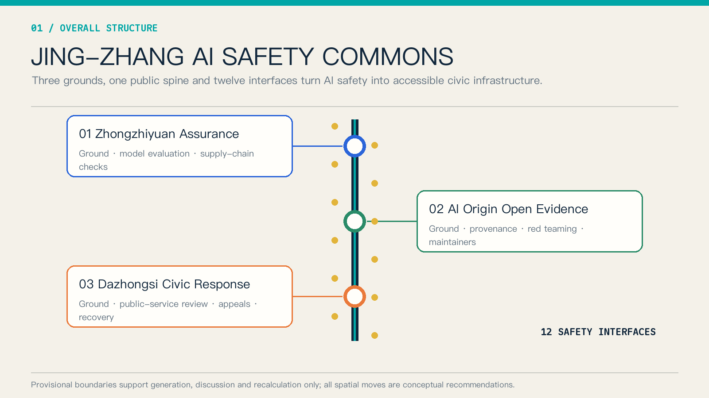
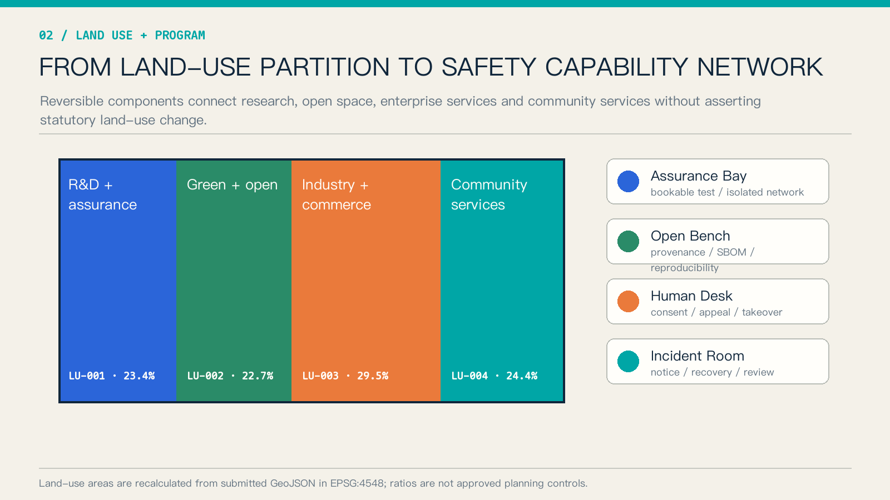
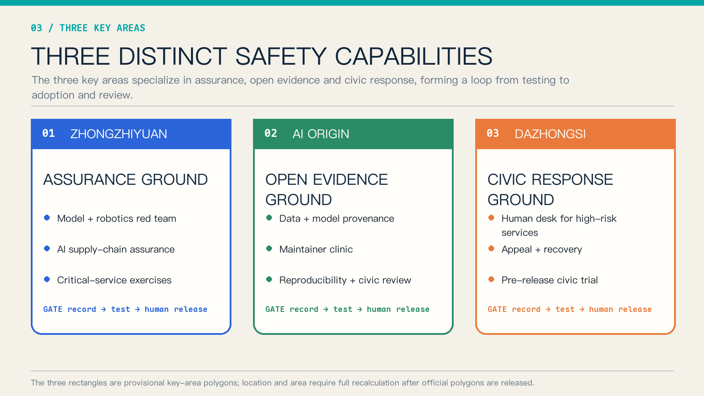
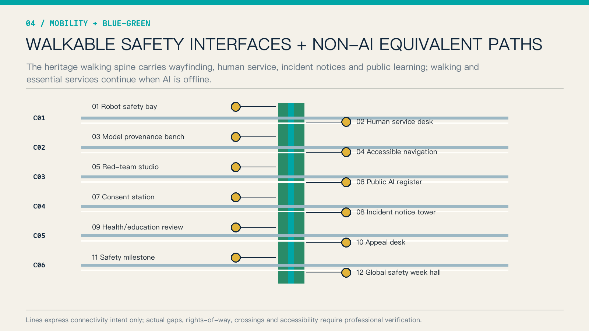
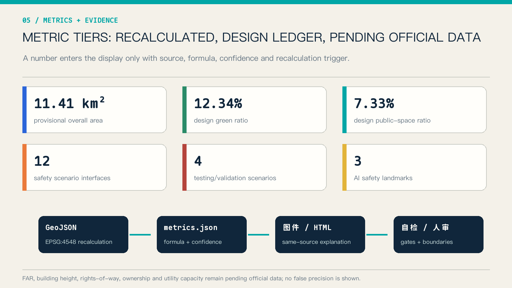

# JING-ZHANG AI SAFETY COMMONS / 京张 AI 安全公地

> The proposal makes one design judgment: AI safety should not remain confined to server rooms, compliance documents, and deployment approvals. It needs accessible urban space where developers, firms, residents, and public-service staff can observe and participate in testing, informed choice, human takeover, appeal, recovery, and review.

## Design Basis and Source List

The official announcement and Agent Taskbook define the assignment. The repository Source Registry controls permitted use, while local professional-standard snapshots define evidence depth [source:OFFICIAL-ANNOUNCEMENT] [source:AGENT-TASKBOOK] [standard:PROJECT-OFFICIAL-ANNOUNCEMENT]. The Overall Design Area and three key areas use repository-supplied provisional rough polygons for generation, discussion, and recalculation only; they are not official planning boundaries [source:BOUNDARY-SOURCE] [data:geometry/site_boundary.geojson#SITE-001].

No OSM geometry, commercial map screenshot, news diagram, personal-location record, or non-public planning material is used. Areas are recalculated from the submitted GeoJSON in EPSG:4548. FAR, building height, rights-of-way, ownership, utility capacity, and engineering feasibility remain pending official data. The processed fact pack is navigation, not a new authority [source:SOURCE-REGISTRY] [source:PROCESSED-FACT-PACK].

International cases provide transferable methods rather than statutory evidence for Beijing. NIST AI RMF supplies a Govern–Map–Measure–Manage frame; Singapore AI Verify demonstrates standardized testing tools; the UK AI Security Institute demonstrates public-interest evaluation capacity; Helsinki and Eurocities demonstrate public registers and feedback [source:NIST-AI-RMF] [source:AI-VERIFY] [source:UK-AISI].

## Three-Level Scope Framework

The Coordinated Research Area asks how safety capability becomes shared innovation infrastructure. The Overall Design Area asks how it becomes a network through the heritage park, walking connections, and urban renewal. The three Key-Area Detailed Design Areas test research assurance, open evidence, and civic adoption respectively [depth:three_level_scope_framework] [depth:overall_spatial_structure]. The single structure is “three grounds, one spine, twelve interfaces.”

| Level | Question | Output |
| --- | --- | --- |
| Coordinated Research Area | How can the ecosystem avoid duplicated safety capacity? | Shared evaluation, provenance, public registration, and incident coordination |
| Overall Design Area | How can people use and understand that capacity? | Heritage learning spine, six cross-links, four reversible components |
| Key-Area Detailed Design Area | How do three roles form a loop? | Assurance produces evidence, open evidence enables reproduction, civic response supports trial, appeal, and review |

The provisional area is about 11.41 km² and the key-area count is three. These values verify package structure; they do not define an approval boundary [metric:site_area_sqm] [metric:key_area_count] [data:geometry/key_areas.geojson#PROV-KEY-001].

## Coordinated Research Area: Industry and Future City Research

The Safety Commons supports the five official functions: supply-chain and model assurance for full-stack innovation; shared testing for a world-class ecosystem; staged trials for AI-enabled scenarios; human and offline alternatives for an active city; and public registers and post-incident evidence for global AI governance discourse [standard:PROJECT-AGENT-OPEN-CALL-TASKBOOK] [depth:overall_spatial_structure].

| International case | Verifiable lesson | Spatial translation |
| --- | --- | --- |
| NIST AI RMF | Voluntary risk framework and GenAI Profile | Four-part Govern–Map–Measure–Manage ledger [source:NIST-AI-RMF] |
| Singapore AI Verify | Testing framework and toolkit | Bookable test bays and cross-framework evidence cards [source:AI-VERIFY] |
| UK AI Security Institute | Research and evaluation of advanced-AI risks | Independent evaluation and controlled exercise spaces [source:UK-AISI] |
| Helsinki AI Register | Public information and feedback on city AI | Every interface shows purpose, data, owner, and feedback route [source:HELSINKI-AI-REGISTER] |
| Eurocities standard | Open schema for algorithmic transparency | Shared machine-readable register fields [source:EUROCITIES-ALGO-STANDARD] |
| EU regulatory sandboxes | Supervised controlled testing | Staged access from closed assurance to limited public trial [source:EU-AI-SANDBOX] |
| ISO/IEC 42001 | AI management-system standard | Enterprise-services support for organizational evidence handoff [source:ISO-42001] |

The seven cases cover standards, tools, independent evaluation, transparency, controlled experimentation, and organizational management [metric:international_case_count]. Future-city competitiveness is measured not only through models and firms, but also through discoverable failure, safe degradation, accountable ownership, and reusable evidence.

The primary name is “JING-ZHANG AI SAFETY COMMONS.” Its original geometric mark combines railway double tracks with verification brackets: parallel lines represent AI and human-equivalent routes, while three square nodes represent the grounds. Engineering blue, civic cyan, and caution orange form the palette; no third-party logo, portrait, or type asset is used.

## Overall Design Area: Urban Renewal and Regulatory-Plan-Level Urban Design

The topology-safe four-part land-use partition is retained. Safety capability is a reversible program layer, not a fabricated statutory land-use change. Research land hosts assurance bays; green/open space hosts public learning and non-AI paths; commercial land hosts enterprise trials and appeals; community-service land hosts human desks [data:geometry/land_use.geojson#LU-001] [standard:MNR-LAND-USE-CLASSIFICATION-GUIDE] [depth:land_use_layout].

Four components form the public kit: isolated Assurance Bay, provenance and reproduction Open Bench, consent and takeover Human Desk, and notification/recovery Incident Room. They begin as movable or shared installations in existing ground floors and public facilities, allowing operations to be tested before irreversible construction.

The submitted building footprint is a conceptual carrier, not a survey or approved development quantity [data:geometry/buildings.geojson#BLDG-001] [metric:building_footprint_area_sqm]. Development intensity, height, massing, and demolition decisions remain unquantified pending official parcels, existing-building data, and controls [depth:development_intensity_controls] [depth:height_massing_character].

## Detailed Design of Key Areas

The three areas receive different briefs rather than copies of one AI park [depth:three_key_area_detailed_design].

| Key area | Prototype | Functions | Handoff |
| --- | --- | --- | --- |
| Zhongzhiyuan AI Independent Innovation Acceleration Area | Assurance Ground | Model evaluation, robotics red team, supply-chain assurance, critical-service exercise | Risk card, test record, release condition [data:geometry/key_areas.geojson#PROV-KEY-001] |
| Beijing AI Origin Community | Open Evidence Ground | Provenance cards, SBOM, reproducibility, maintainer clinic, civic review | Reproducible bundle, issue list, version record [data:geometry/key_areas.geojson#PROV-KEY-002] |
| Dazhongsi AI Industry Cluster | Civic Response Ground | Human review, consumer appeal, pre-release public trial, incident recovery | Appeal receipt, recovery record, adoption advice [data:geometry/key_areas.geojson#PROV-KEY-003] |

Zhongzhiyuan combines a controlled test court, safety gallery, and exercise room. AI Origin combines an Open Bench, reproduction room, and civic review steps. Dazhongsi combines a Human Desk, Appeal Bench, and Incident Room. All moves require professional deepening against official boundaries, ownership, fire, mobility, and heritage conditions.

## AI Innovation Ecosystem, Personas, and AI+ Scenarios

Six personas are addressed: model/platform engineers, open-source maintainers, start-ups, frontline public-service staff, residents including older and disabled users, and professional evaluation/regulatory collaborators [metric:persona_count]. Facilities are shared while permissions, data, and circulation remain separated.

| Card | Place | Users | Safety and human boundary |
| --- | --- | --- | --- |
| S01 Model red-team booking | Zhongzhiyuan | Model teams, evaluators | Isolated data; human-approved scope |
| S02 Low-speed robot failure drill | Zhongzhiyuan | Robotics teams, operator | Physical enclosure, emergency stop, safety officer |
| S03 AI supply-chain provenance check | Zhongzhiyuan | Enterprise security and procurement | Reports provenance and known issues, never “absolute safety” |
| S04 Critical-service tabletop exercise | Zhongzhiyuan | Health, education, mobility staff | Synthetic data; professional confirmation |
| S05 Maintainer clinic | AI Origin | Maintainers, start-ups | Minimum disclosure; coordinated vulnerability handling |
| S06 Data/model provenance card | AI Origin | Developers, public | Purpose, provenance, limitations, accountable owner |
| S07 Public algorithm register | AI Origin | Residents, public agencies | Readable and feedback-enabled; no personal records |
| S08 Accessible AI wayfinding | Heritage spine | Visitors, disabled users | Physical signs and human assistance remain available |
| S09 Health/education navigation review | Dazhongsi | Residents, staff | Navigation only; high-impact matters transfer to humans |
| S10 Enterprise-service Copilot trial | Dazhongsi | Small firms | Sources and uncertainty shown; humans decide contracts |
| S11 Public-safety operations review | Dazhongsi | Operators, civic representatives | Redacted summary, appeal, correction |
| S12 AI cultural guide and contributor wall | Whole spine | Visitors, developers | Rights-cleared content; personalization can be disabled |

S01–S04 are four controlled testing and validation scenarios [metric:test_validation_scenario_count]. Twelve conceptual nodes in `constraints.geojson` provide an auditable spatial ledger rather than exact siting [data:geometry/constraints.geojson#SCN-01] [metric:scenario_node_count].

## Land Use, Building Scale, and Retain-Renovate-Demolish Strategy

Four land-use polygons fully cover the submitted boundary without overlap; green, public-space, and building layers stay within it [data:geometry/land_use.geojson#LU-002] [data:geometry/green_space.geojson#GREEN-001] [depth:blue_green_public_space]. Components follow embed, share, and move strategies to minimize premature construction.

Retain–renovate–demolish decisions use evidence gates rather than parcel claims: survey, ownership, structural safety, heritage, fire, and operational need must all be available first [depth:retain_renovate_demolish]. The conceptual building footprint of about 310,800 m² is only a layer-consistency check [metric:building_footprint_area_sqm].

## Transport, Rail, Municipal Infrastructure, and Public Services

One north–south heritage walking spine links the three grounds. Six conceptual cross-links express east–west stitching, and twelve interfaces remain visible, physically identified, and reachable by staff [data:geometry/roads.geojson#ROAD-001] [depth:traffic_rail_slow_parking]. Lines do not assert rights-of-way, bridges, tunnels, or station engineering.

Every AI public service preserves a non-AI equivalent: physical wayfinding, staffed desk, paper/offline receipt, and emergency shutdown notice. Edge computing and isolated networks are conceptual recommendations; power, cooling, fire, cybersecurity classification, and operational capacity remain unknown pending professional study [depth:municipal_new_infrastructure].

## Blue-Green Network, Public Space, and Urban Character

The recalculated design green ratio is 12.34% and public-space ratio 7.33%. They describe submitted design layers, not statutory ratios or existing-condition statistics [metric:green_ratio] [metric:public_space_ratio]. The blue-green walking spine combines safety learning, rest, accessible navigation, and heritage interpretation.

Three AI pilgrimage landmarks are the Failure Archive at Zhongzhiyuan, Open Provenance Monument at AI Origin, and Recovery Clock at Dazhongsi [metric:landmark_count]. They are maintained public knowledge assets, not entertainment objects. Content requires rights clearance, redaction, and human editing.

The cultural narrative translates Zhan Tianyou’s careful engineering practice into measure, test, record, review, and handoff. Signs combine text and shape with blue available, orange restricted, red paused, and grey human route, so status never depends on color alone.

## Renewal Projects, Implementation Policy, and Phasing

Eight conceptual projects cover the Assurance Bay pilot, Open Provenance Bench, public algorithm register, Human Desk, Incident Room, six cross-link surveys, three safety-culture landmarks, and annual AI Safety Open Week [metric:renewal_project_count].

Near term (0–18 months) establishes rules, ledgers, movable components, and two small pilots. Mid term (18–36 months) stabilizes three-ground operations and evidence handoff. Long term (3–5 years) considers permanent spatial work only after official polygons, operating evaluation, and professional review [data:geometry/phasing.geojson#PHASE-001] [depth:phasing_implementation].

The annual program includes Open Evidence Season, Urban Red-Team Week, Public-Service Recovery Exercise, and an International AI Safety Forum. Organizers, frequency, budgets, and approvals are proposals, not confirmed commitments.

## Metrics, Area Recalculation, and Compliance Matrix

Metrics separate recalculable geometry, design-ledger counts, and pending official data. Each has a source, formula, confidence, and recalculation trigger [depth:metrics_recalculation]. Figures, HTML, and PDFs use the same values.

| Metric | Current value | Meaning |
| --- | --- | --- |
| Provisional overall area | 11,412,825.386 m² | Recalculated boundary [metric:site_area_sqm] |
| Design green ratio | 12.3423% | Design layer / provisional boundary [metric:green_ratio] |
| Design public-space ratio | 7.3281% | Design layer / provisional boundary [metric:public_space_ratio] |
| Safety scenario interfaces | 12 | Design-ledger count [metric:scenario_node_count] |
| Testing/validation scenarios | 4 | S01–S04 [metric:test_validation_scenario_count] |
| FAR and building height | Pending official data | No inferred value [metric:floor_area_ratio] |

The compliance matrix covers announcement tasks 1.3–1.5 and agent.1–agent.6. Professional-standard and design-depth matrices retain the full evidence layer [standard:MOHURD-URBAN-DESIGN-MEASURES] [standard:MOHURD-CONTROL-DETAILED-PLANNING] [depth:risk_missing_data].

## Risk, Copyright, and Compliance

Material risks include provisional-boundary displacement, missing ownership and existing-condition data, conflicts between tests and public space, tension between incident transparency and vulnerability disclosure, and erosion of accessible non-digital service. Recovery measures are full recalculation after official polygons, field verification, physical separation, coordinated disclosure, and acceptance testing of non-AI equivalents [source:BOUNDARY-SOURCE] [depth:risk_missing_data].

This proposal is not approved planning, engineering, investment,招商, or a government event commitment. Spatial, brand, operational, and policy moves are conceptual recommendations. OpenAI Codex generated the text, geometry diagrams, HTML, and PDFs from public or rights-cleared sources. Graphics use original geometry and system fonts; no external image, remote font, trademark, or personal data is included.

## References

- Official open-call announcement [source:OFFICIAL-ANNOUNCEMENT]
- Agent Taskbook and site package [source:AGENT-TASKBOOK] [source:SITE-PACKAGE]
- NIST AI Risk Management Framework [source:NIST-AI-RMF]
- AI Verify Foundation [source:AI-VERIFY]
- UK AI Security Institute [source:UK-AISI]
- City of Helsinki AI Register [source:HELSINKI-AI-REGISTER]
- Eurocities Algorithmic Transparency Standard [source:EUROCITIES-ALGO-STANDARD]
- European Commission AI regulatory sandbox guidance [source:EU-AI-SANDBOX]
- ISO/IEC 42001 overview [source:ISO-42001]
