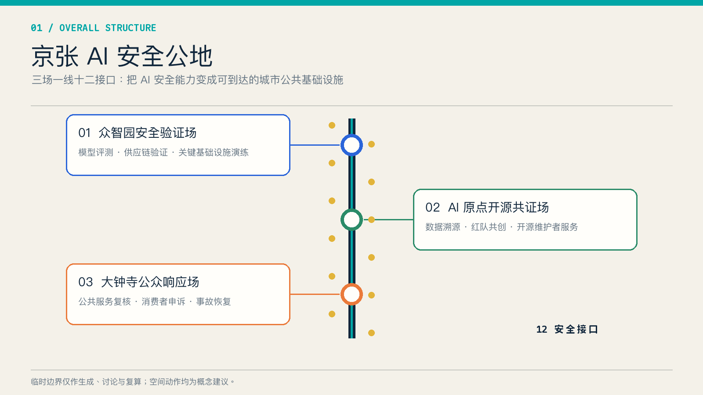
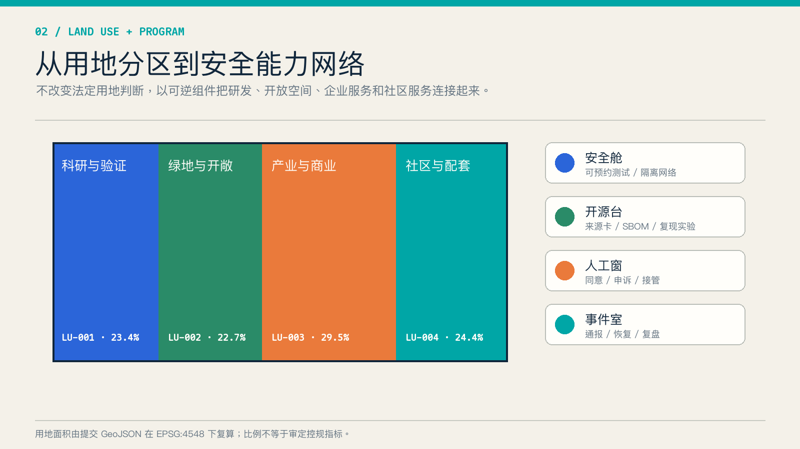
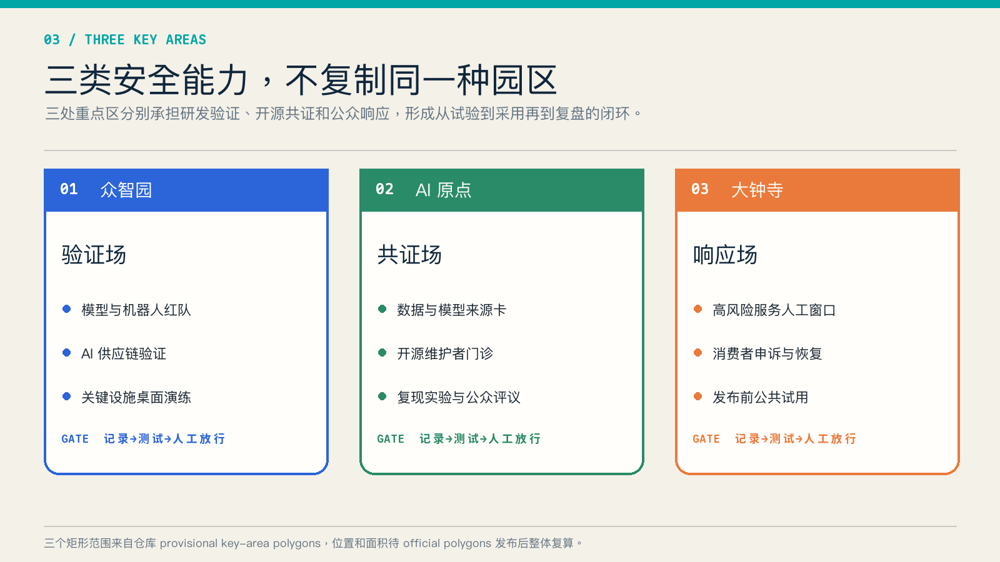
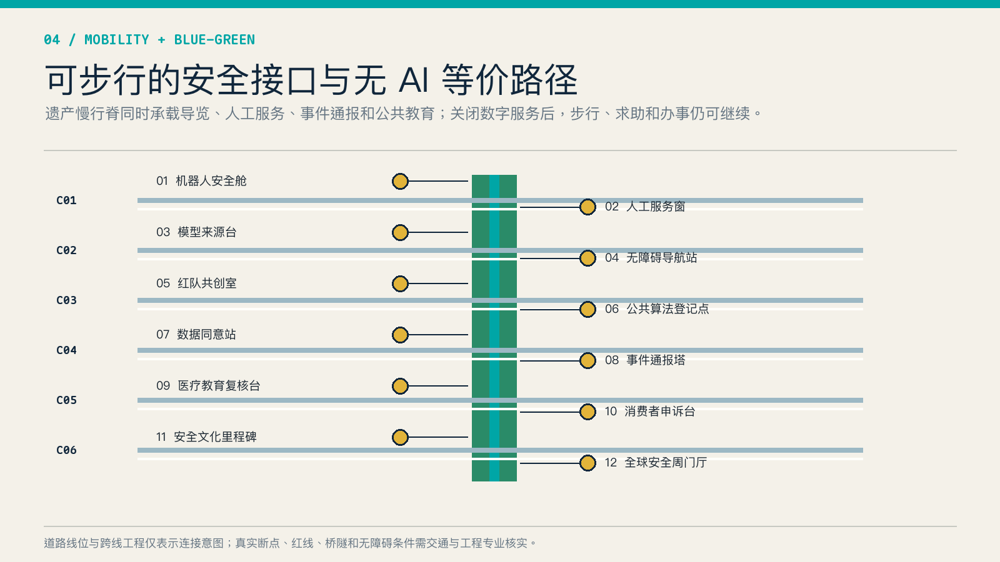
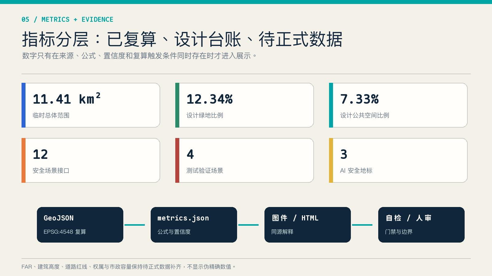

# 京张 AI 安全公地 / JING-ZHANG AI SAFETY COMMONS

> 本方案的核心判断是：AI 安全不应只存在于机房、合规文件和上线审批中。它需要面向开发者、企业、居民和公共服务人员的城市空间，让测试、知情、人工接管、申诉、恢复与复盘均可到达、可观察、可参与。

## 设计依据与资料清单

方案以公开征集公告和面向智能体任务书为任务依据，以仓库来源登记表判断资料用途，以本地专业标准快照校核成果深度 [source:OFFICIAL-ANNOUNCEMENT] [source:AGENT-TASKBOOK] [standard:PROJECT-OFFICIAL-ANNOUNCEMENT]。总体设计范围和三处重点区使用仓库提供的临时粗略多边形，只支持本次生成、讨论与复算，不是官方红线 [source:BOUNDARY-SOURCE] [data:geometry/site_boundary.geojson#SITE-001]。

本方案没有使用 OSM、商业地图截图、新闻示意图、个人位置数据或未公开规划资料。所有面积来自提交 GeoJSON 在 EPSG:4548 下的复算；容积率、建筑高度、道路红线、权属、市政容量和工程可行性保持“待正式数据补齐”。资料导航使用事实包，但具体判断仍回到原始来源 [source:SOURCE-REGISTRY] [source:PROCESSED-FACT-PACK]。

国际案例只用于提炼方法，不作为北京法定规划依据。NIST AI RMF 提供“治理—识别—测量—管理”的风险框架，新加坡 AI Verify 展示标准化测试工具，英国 AI Security Institute 展示公共部门评测能力，赫尔辛基 AI Register 与 Eurocities Algorithmic Transparency Standard 展示公共登记和反馈机制 [source:NIST-AI-RMF] [source:AI-VERIFY] [source:UK-AISI]。这些来源共同支持“把安全能力变成可访问公共服务”的设计方向，而非复制其制度。

## 三层范围工作框架

统筹研究范围回答“安全能力如何成为创新生态的共同基础”；总体设计范围回答“能力如何依托遗产公园、慢行和城市更新形成网络”；三处重点区域分别验证研发、开源和公众采用阶段 [depth:three_level_scope_framework] [depth:overall_spatial_structure]。总体结构为“三场一线十二接口”：一线是京张遗产公共安全学习脊，三场是众智园安全验证场、AI 原点开源共证场和大钟寺公众响应场，十二接口是散布于公共空间和服务节点的可退出场景。

| 层级 | 核心问题 | 本方案输出 |
| --- | --- | --- |
| 统筹研究范围 | 产业创新如何减少安全能力重复建设 | 共享评测、开源溯源、公共登记、事件协同四类能力 |
| 总体设计范围 | 能力如何被日常使用和公众理解 | 遗产慢行脊、六条横向连接、四类可逆空间组件 |
| 重点区域范围 | 三类角色如何形成闭环 | 验证场出具证据，共证场组织复现，响应场承接试用、申诉与复盘 |

临时边界复算面积为约 11.41 平方公里，三处重点区数量为 3；这两个读数用于检查结构完整性，不解释为审批范围 [metric:site_area_sqm] [metric:key_area_count] [data:geometry/key_areas.geojson#PROV-KEY-001]。

## 统筹研究范围产业与未来城市研究

AI 安全公地服务五大功能：为全栈自主创新提供供应链与模型验证，为世界级生态提供共享测试设施，为 AI+ 场景提供分级试用门槛，为活力城市保留人工和离线路径，为 AI 治理提供公开登记与复盘证据。两翼分别承担专业服务和场景反馈，三区则依次承担“验证—共证—响应”，使企业无需各自重复建设全部能力 [standard:PROJECT-AGENT-OPEN-CALL-TASKBOOK] [depth:overall_spatial_structure]。

| 国际案例 | 可核事实 | 转译为空间机制 |
| --- | --- | --- |
| NIST AI RMF | 自愿风险管理框架与生成式 AI Profile | 安全场采用治理、识别、测量、管理四段台账 [source:NIST-AI-RMF] |
| Singapore AI Verify | 以测试框架和工具支持治理原则评估 | 设置可预约评测舱和跨框架证据卡 [source:AI-VERIFY] |
| UK AI Security Institute | 研究、评测先进 AI 风险与缓解措施 | 众智园设置独立评测与受控演练空间 [source:UK-AISI] |
| Helsinki AI Register | 公开城市 AI 系统信息并接收反馈 | 每个公共 AI 接口提供用途、数据、责任和反馈入口 [source:HELSINKI-AI-REGISTER] |
| Eurocities Transparency Standard | 用开放数据结构记录算法工具及用途 | 三场共用机器可读登记字段 [source:EUROCITIES-ALGO-STANDARD] |
| EU AI regulatory sandboxes | 在监管监督下支持受控测试 | 场景从封闭验证到公共试用分级开放 [source:EU-AI-SANDBOX] |
| ISO/IEC 42001 | AI 管理体系标准 | 企业服务翼提供体系建设与证据交接支持 [source:ISO-42001] |

七个案例分别覆盖标准、工具、独立评测、公共透明、受控试验和组织管理，避免只研究科技园区形态 [metric:international_case_count]。未来城市的竞争力因此不只由模型、算力和企业数量衡量，也由失败能否被发现、服务能否安全降级、公众能否找到责任人、证据能否跨组织复用衡量。

品牌主名为“京张 AI 安全公地”，英文为 “JING-ZHANG AI SAFETY COMMONS”。标志方向取自铁路双轨与校验括号：两条平行线代表 AI 路径和人工等价路径，中间三个方形节点代表三处安全场；主色为工程蓝、公共青和警示橙。该视觉为原创几何系统，不使用企业标识、人物肖像或第三方字体资产。

## 总体设计范围城市更新与控规深度城市设计

用地分区延续脚手架的拓扑安全四分区，并把安全能力作为可逆的功能叠层，而不是编造新的法定用地。科研用地承载验证舱和实验室，绿地与开敞空间承载公众教育和无 AI 等价路径，产业商业用地承载企业测试与消费者申诉，社区配套用地承载人工服务窗口 [data:geometry/land_use.geojson#LU-001] [standard:MNR-LAND-USE-CLASSIFICATION-GUIDE] [depth:land_use_layout]。

总体设计采用四类空间组件：可隔离的“安全舱”、展示来源卡与复现实验的“开源台”、承接知情同意与人工接管的“人工窗”、支持通报恢复和复盘的“事件室”。组件优先嵌入既有公共建筑首层、园区共享空间和可移动构筑物，先运营后固化，减少缺少权属与现状数据时的不可逆判断。

建筑基底只表达概念性载体，面积由提交图层复算，不等于现状普查或批准规模 [data:geometry/buildings.geojson#BLDG-001] [metric:building_footprint_area_sqm]。开发强度、建筑高度、体量和拆改留结论在 official parcels、现状建筑和控规条件到位前不量化 [depth:development_intensity_controls] [depth:height_massing_character]。

## 重点区域详细设计

三处重点区采用不同任务书，不复制同一种“AI 园区” [depth:three_key_area_detailed_design]。

| 重点区 | 空间原型 | 核心功能 | 交接输出 |
| --- | --- | --- | --- |
| 众智园 AI 自主创新加速区 | 安全验证场 | 模型评测、机器人红队、AI 供应链验证、关键设施桌面演练 | 风险卡、测试记录、放行条件 [data:geometry/key_areas.geojson#PROV-KEY-001] |
| 北京 AI 原点社区 | 开源共证场 | 数据与模型来源卡、SBOM、复现实验、维护者门诊、公众评议 | 可复现包、问题清单、版本记录 [data:geometry/key_areas.geojson#PROV-KEY-002] |
| 大钟寺 AI 产业聚集区 | 公众响应场 | 高风险公共服务人工窗口、消费者申诉、发布前公共试用、事件恢复 | 申诉回执、恢复记录、采用建议 [data:geometry/key_areas.geojson#PROV-KEY-003] |

众智园采用“受控测试庭—安全廊—演练室”组合，测试数据与公众活动分离；AI 原点采用“开源台—复现室—共议阶梯”，让高校、维护者和企业在同一证据格式下协作；大钟寺采用“人工窗—申诉台—事件室”，让日常消费者和公共服务使用者能找到非数字入口。三处空间动作均需专业团队在官方边界、权属、消防、交通和文保条件下深化。

## AI 创新生态、人才画像与 AI+ 场景

六类用户包括模型与平台工程师、开源维护者、初创团队、公共服务一线人员、周边居民与老年/残障使用者、专业评测和监管协作人员 [metric:persona_count]。他们共享安全设施，但权限、数据和空间流线分离：研发人员进入受控环境，公众只接触清晰标注的体验界面，工作人员保留人工接管权。

| 场景卡 | 空间 | 使用者 | 安全与人工边界 |
| --- | --- | --- | --- |
| S01 模型红队预约 | 众智园安全舱 | 模型团队、评测人员 | 隔离数据；人工批准测试范围 |
| S02 机器人低速失效演练 | 众智园测试庭 | 机器人团队、场地运营 | 物理围界；急停与安全员在场 |
| S03 AI 供应链来源核验 | 众智园开源台 | 企业、采购与安全团队 | 输出组件来源和已知漏洞，不承诺绝对安全 |
| S04 关键服务桌面演练 | 众智园事件室 | 医疗、教育、交通运营人员 | 使用合成数据；结论由专业部门确认 |
| S05 开源维护者门诊 | AI 原点 | 维护者、初创团队 | 最小披露；不公开未修复高风险细节 |
| S06 数据与模型来源卡 | AI 原点 | 开发者、公众 | 公布用途、来源、限制和责任主体 |
| S07 公共算法登记点 | AI 原点 | 居民、公共部门 | 可阅读、可反馈；不展示个人记录 |
| S08 无障碍 AI 导览 | 遗产慢行脊 | 访客、视听障碍者 | 保留实体导视与人工帮助 |
| S09 AI 医疗教育导航复核 | 大钟寺人工窗 | 居民、服务人员 | 仅导航不诊断；高影响事项转人工 |
| S10 企业服务 Copilot 试用 | 大钟寺响应场 | 中小企业 | 显示来源和不确定性；合同决策由人完成 |
| S11 公共安全运营复盘 | 大钟寺事件室 | 运营者、公众代表 | 发布脱敏摘要；保留申诉与纠错 |
| S12 AI 文化导览与贡献墙 | 全线 | 访客、开发者 | 只使用清权内容；可关闭个性化 |

其中 S01–S04 是四个产业测试验证场景，均先在受控空间运行，达到记录完整、风险可接受、人工责任明确后才进入有限公共试用 [metric:test_validation_scenario_count]。十二个接口通过 `constraints.geojson` 中的概念节点形成可审查台账，而不是精确选址 [data:geometry/constraints.geojson#SCN-01] [metric:scenario_node_count]。

## 用地、建筑规模与拆改留方案

四个用地面完整覆盖提交边界且不重叠，作为机器校验的概念分区；绿地、公共空间和建筑图层位于边界内 [data:geometry/land_use.geojson#LU-002] [data:geometry/green_space.geojson#GREEN-001] [depth:blue_green_public_space]。安全组件优先采用“嵌入、共享、可移动”三类方式：嵌入既有公共建筑首层，共享园区会议与实验空间，可移动组件用于活动期临时部署。

拆改留采用证据门槛而非地块结论：只有现状测绘、权属、结构安全、文保、消防和运营需求齐备后，才进入保留、改造或拆除判断；当前只列出载体类型和后续调查表 [depth:retain_renovate_demolish]。建筑基底的概念面积约 31.08 万平方米，用于检查图层一致性，不代表建设量或现状总量 [metric:building_footprint_area_sqm]。

## 交通、轨道、市政与公共服务设施

一条南北遗产慢行脊连接三场，六条概念性横向连接表达东西缝合，十二个接口按步行可见、实体可识别、人工可到达原则布置 [data:geometry/roads.geojson#ROAD-001] [depth:traffic_rail_slow_parking]。这些线不表示道路红线、桥隧方案或站点工程；后续需核对真实断点、无障碍坡度、过街相位、轨道接驳和非机动车停放。

每个 AI 公共服务均保留“无 AI 等价路径”：实体导视、人工窗口、纸质或离线回执、紧急停用标识。市政与新基建采用小规模边缘计算和隔离网络的概念建议，电力、散热、消防、网络安全等级和运维容量在专业测算前保持未知 [depth:municipal_new_infrastructure]。

## 蓝绿空间、公共空间与城市风貌

设计绿地比例 12.34%，公共空间比例 7.33%，均由提交多边形复算；它们表达设计图层关系，不是法定绿地率或现状统计 [metric:green_ratio] [metric:public_space_ratio]。蓝绿慢行系统把安全教育、休憩、无障碍导航与遗产叙事叠加在同一公共脊上，临时边界以低对比虚线表达，安全节点和连接意图保持视觉主次。

三处 AI 朝圣地标为：众智园“失败样本馆”，展示经脱敏的失效类型和改进方法；AI 原点“开源来源碑”，记录版本、维护者与证据链；大钟寺“恢复时钟”，记录公共服务从事件到恢复的时间线 [metric:landmark_count]。地标不是娱乐装置，而是持续更新的公共知识载体；内容须清权、脱敏并接受人工编辑。

文化叙事以詹天佑的审慎工程方法为线索：测量、试验、记录、复核、交接。导视系统使用“蓝色可用、橙色受限、红色暂停、灰色人工路径”并配文字和图形，避免只用颜色传递状态。整体 Logo 与各安全场标识分层管理，防止企业品牌占据公共空间。

## 更新项目清单、实施政策与分期计划

八项更新项目为安全舱试点、开源来源台、公共算法登记点、人工服务窗、事件响应室、六条横向连接调查、安全文化三地标、年度 AI 安全开放周 [metric:renewal_project_count]。它们均为可供专业团队深化的参考方案。

近期 0–18 个月先完成规则、台账、移动组件和两处小规模试点；中期 18–36 个月在三场形成稳定运营和跨区证据交接；长期 3–5 年依据 official polygons、运营评估和专业审查决定是否固化空间 [data:geometry/phasing.geojson#PHASE-001] [depth:phasing_implementation]。任何扩大均以事件率、申诉闭环、人工服务可达性和公众理解度为门槛，不以设备数量作为主要绩效。

年度活动体系包括春季开源证据季、夏季城市红队周、秋季公共服务恢复演练、冬季国际 AI 安全论坛。开发者通过公开命题、复现实验和维护者门诊参与；企业通过评测舱和证据交接参与；公众通过登记点、体验路线和评议会参与。活动频次、主办方、预算和审批均是建议，未获确定安排。

## 指标体系、面积复算与合规矩阵

指标分为三层：GeoJSON 可复算指标、设计台账计数、待正式数据指标。前两类记录公式、来源文件和置信度；第三类说明缺口和触发条件 [depth:metrics_recalculation]。五张图、HTML 和 PDF 从同一组指标生成，避免多个数字源。

| 指标 | 当前值 | 解释 |
| --- | --- | --- |
| 临时总体范围面积 | 11,412,825.386 ㎡ | 由 provisional site boundary 复算 [metric:site_area_sqm] |
| 绿地设计比例 | 12.3423% | 设计图层 / 临时范围 [metric:green_ratio] |
| 公共空间设计比例 | 7.3281% | 设计图层 / 临时范围 [metric:public_space_ratio] |
| 安全场景接口 | 12 | 设计台账计数 [metric:scenario_node_count] |
| 测试验证场景 | 4 | S01–S04 [metric:test_validation_scenario_count] |
| FAR 与建筑高度 | 待正式数据补齐 | 不展示推测值 [metric:floor_area_ratio] |

合规矩阵覆盖公告 1.3、1.4、1.5 和 agent.1–agent.6；专业标准矩阵与设计深度矩阵分别记录依据和成果完整度 [standard:MOHURD-URBAN-DESIGN-MEASURES] [standard:MOHURD-CONTROL-DETAILED-PLANNING] [depth:risk_missing_data]。

## 风险、版权与合规说明

主要风险是临时边界定位偏差、缺少现状与权属、测试活动对公众空间的干扰、事故信息披露与漏洞细节的冲突、无障碍和非数字服务被弱化。恢复方式包括 official polygons 到位后整体复算、专业团队现场核查、测试与公众活动物理分离、漏洞协调披露、无 AI 等价路径验收 [source:BOUNDARY-SOURCE] [depth:risk_missing_data]。

本方案不声称获得批准，不构成控规、工程、投资、招商或政府活动承诺。空间落地、品牌、运营和政策均为概念建议。AI 生成的文字、几何图解、HTML 和 PDF 由 OpenAI Codex 在公开/清权资料基础上生成；图形使用基础几何和系统字体，不含外部图片、远程字体、商标或个人数据。完整许可与生成说明见 `report/copyright_statement.md`。

## 参考资料

- 北京市规划和自然资源委员会海淀分局，征集公告 [source:OFFICIAL-ANNOUNCEMENT]
- 面向智能体任务书与场地包 [source:AGENT-TASKBOOK] [source:SITE-PACKAGE]
- NIST AI Risk Management Framework [source:NIST-AI-RMF]
- AI Verify Foundation, What is AI Verify [source:AI-VERIFY]
- UK AI Security Institute [source:UK-AISI]
- City of Helsinki AI Register [source:HELSINKI-AI-REGISTER]
- Eurocities Algorithmic Transparency Standard [source:EUROCITIES-ALGO-STANDARD]
- European Commission, AI regulatory sandboxes [source:EU-AI-SANDBOX]
- ISO/IEC 42001 overview [source:ISO-42001]
