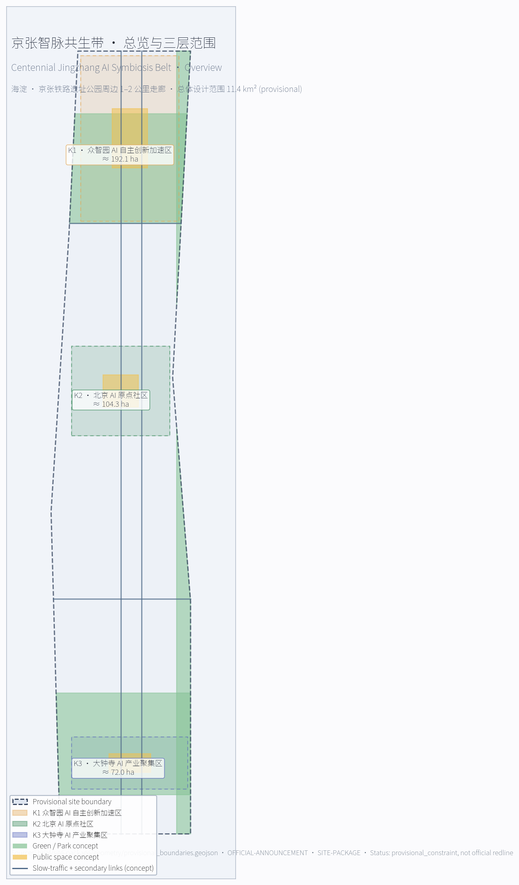
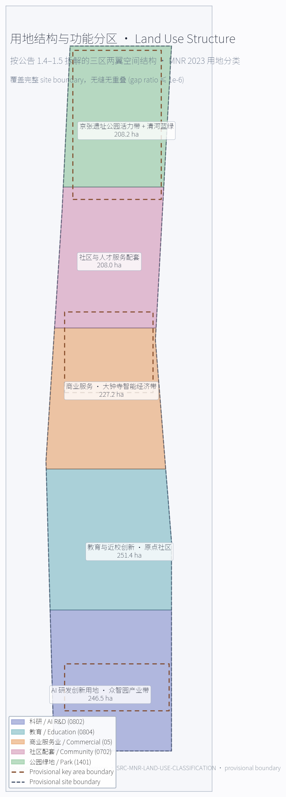
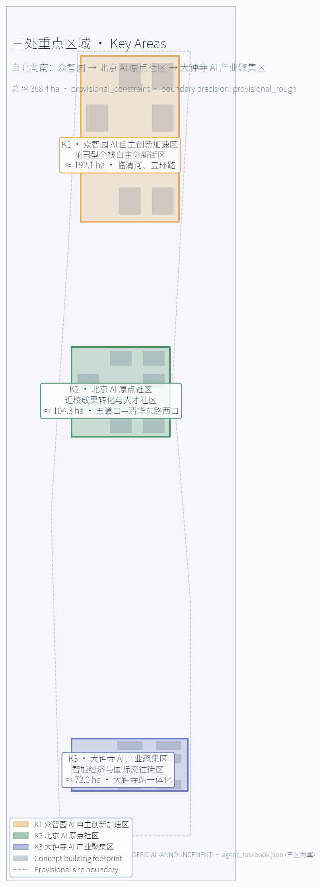
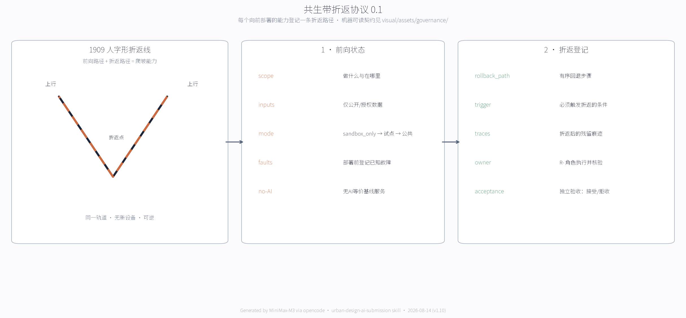
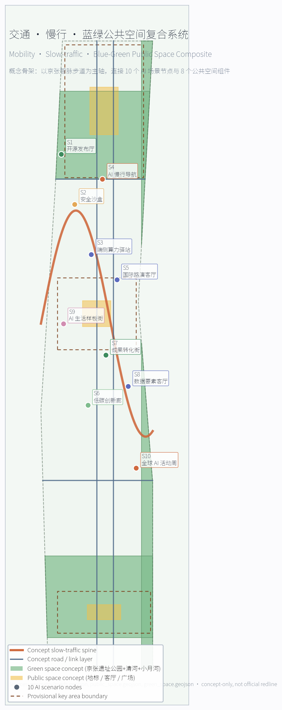
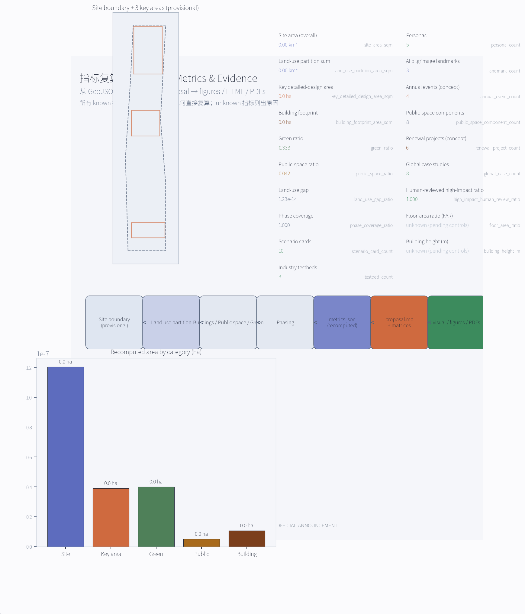

# 京张智脉共生带 — 轨道文化、AI新基座与海淀未来城市的三位一体提案

## 一条懂得折返的走廊

京张铁路教过这座城市一件事：速度要懂得回头。

1909 年，詹天佑在关沟遇上机车爬不上去的坡。他没有等一台更有力的机车，而是把线路折成"人"字，让车头换向、折返、再前进——用一段回头路换一段高度。折返不是退缩，是这条铁路最古老的工程智慧：向前之前，先留好回头的路。

一百多年后，AI 进入同一条走廊。快的是模型，几个月换一代；慢的是城市，树荫、土壤、坡道、沿街小店和孩子的路线，要很多年才显出变化。AI 越快，城市越需要一条懂得折返的走廊——不是给技术踩刹车，而是给好技术一条更可信的上线路径：任何进入公共空间的智能能力，在向前之前，先登记一条可执行的折返路径；人可以随时停用智能层，廊道、导视和工作人员都还在。

这份方案把这条铁路遗产转译为城市 AI 治理的原创契约《共生带折返协议 0.1》：可进化的前提是可回滚，一座不能撤销自己决定的共生带，不可能自适应。三处重点区在折返协议里各管一段——众智园把标准与安全测准、AI 原点让异议有地方停下来、大钟寺检查承诺有没有兑现——任何一站缺席，试点不得扩区。全部空间建议基于临时边界，属于可撤回的概念方案。

## 总览与站点

## 总体概念、命名与视觉识别

本 formal 方案把公告中"百年京张文化带 / 都市 AI 生活体验带 / AI 融合创新带"三大定位转译为可操作的 **"京张智脉共生带" (Centennial Jingzhang AI Symbiosis Belt)** 概念。命名强调三层语义：

- **京张**：1909 年詹天佑主持建成的中国人自主设计的第一条干线铁路，是这条创新带的"百年文化血脉"。
- **智脉**：指 AI 与海淀高校、园区、社区、轨道、公园共同形成的智能流、信息流与人流网络，是"创新带的 AI 血脉"。
- **共生带**：强调"轨道遗址—AI 产业—人才生活"三者作为同一生态系统共同演化，而不是把创新带画成新红线或新园区。

**英文命名**：`Jingzhang Symbiosis Belt (JSB)`，或写作 `Centennial Jingzhang AI Symbiosis Belt (CJSB)`，便于在国际传播和开源生态中作为可引用品牌。**主标语**："A century of rails, an age of agents — 北京海淀，一条把百年京张与未来 AI 连在一起的共生带"。所有文化叙事、命名系统和品牌资产均按"概念建议 / 参考方案 / 可供专业团队深化研究"原则写入，不替代政府品牌决策。

**Logo 方向（概念稿）**：以京张铁路"人字形"折返线和 AI 神经网络的递归连接为视觉原型，构造可被剪裁、可被单色化、可被应用于导视、徽章、屏幕图标、动态贴纸和公共艺术装置的"双层结构"图形。下层用单线表达 1909 年的京张"人字坡"，上层用细密节点表达 AI 神经网络的递归连接，两层通过交点叠合为"今—古"共生符号。建议交付时同步输出三套变体：单色（深蓝/石墨黑）、彩色（暖橙+冷青渐变）、夜景（深底+暖光节点），便于在导视、数字屏和公共艺术装置中分级使用。所有字体、肖像和企业标识均需经专业团队清权后再投入实际制作。

品牌概念板给出实际可审阅的主标志、单色版、深底版、保护区和 24 px 小尺寸测试。标志图形由本方案脚本原创生成，不使用第三方图标或字体文件；当前文字采用系统字体栅格化，仅用于评审。品牌、导视、活动 IP 与荣誉系统分为四级：主标志只标识整条创新带，导视使用单色线性变体，活动可使用年度副标，贡献墙与荣誉节点只使用独立铭牌，不得与政府标识或企业商标混用。最终采用前须完成商标检索、字体替换与图形权利审查，约束 A-LOGO-001。

品牌与 IP 不是一张 Logo，而是一套可延展、可授权、可撤回的系统（v2.0）：

| 层级 | 内容 | 强制规则 |
| --- | --- | --- |
| 基础层 | 中文"京张智脉共生带" + 英文 JINGZHANG SYMBIOSIS BELT + 主标志（人字形折返线 × 神经网络递归双层结构） | 任何导视、组件库与出版物共用同一套标识规则；**节点号、版本、责任人、更新时间、人工求助方式五项信息必须同时出现**，缺一项即视为标识不完整 |
| 应用层 | 导视、公共空间组件库、数字屏、纸质地图 | 导视使用单色线形变体；夜景深底版仅用于数字屏；24 px 测试版仅用于缩略图 |
| 活动层 | 四个年度活动 IP（AI 朝圣日 / 智脉黑客松 / 开源生态周 / 公众开放日） | 各自有年度副标但共用基础层标识系统；年度副标逐年回收 |
| 授权层 | 非商业公共传播、学术与社区活动可免费使用；商业使用须另行授权 | 文化标识系统与整带 Logo 系统分列、不互相替代；任何使用不得暗示政府背书或实施承诺 |

授权层规则是概念建议，最终以专业团队的商标与授权方案为准，约束 A-LOGO-001。

## 全球 AI 创新生态案例摘要（5–8 项）

本节回应 agent.2 要求。摘要选取的是已在公开渠道被官方机构或权威媒体公开报道的"概念级经验"，仅作为空间、产业、运营机制的参考，不直接复制其规模、治理或财政制度。每条案例均说明可向本方案转化的空间/产业/运营机制、可识别限制，并明确标注为"概念借鉴"而非"已落地的中国海淀方案"。

| 编号 | 案例 | 主管机构 / 城市 | 公开网址 | 可借鉴要点 | 本方案落点 |
| --- | --- | --- | --- | --- | --- |
| [source:CASE-PDD] | Punggol Digital District (PDD) | JTC / 新加坡 | https://www.jtc.gov.sg/punggoldigitaldistrict | 数字平台先于物理建设；校园、企业、社区三层共享底层；把整个片区作为"数字 + 物理"试验场 | 北京 AI 原点社区的开源平台、众智园测试沙盒；强调平台先行、空间跟随 |
| [source:CASE-KALASATAMA] | Smart Kalasatama | 赫尔辛基市 | https://www.hel.fi/helsinki/en/administration/strategy/economy/smart-kalasatama | 以"居民时间价值"为目标函数；敏捷试点，先小范围验证再扩大 | 京张智脉共生带的"小切口试点"机制；优先在众智园与原点社区做 AI 慢行、AI 服务样板 |
| [source:CASE-22B] | Barcelona 22@ Innovation District | 巴塞罗那市 | https://ajuntament.barcelona.cat/economiatreball/en | 工业旧区更新为产业 + 知识 + 创意复合街区；产权—规划—运营三方谈判 | 大钟寺 AI 产业聚集区的产业旧区更新与四象限步行连通机制 |
| [source:CASE-MILA] | Mila — Québec AI Ecosystem | 魁北克省政府 / Mila | https://mila.quebec | 研究—人才—产业—责任治理四链耦合；学术机构作为生态核心 | 北京 AI 原点社区的近校成果转化与开源体系；强化高校策源—开源协作—企业转化链条 |
| [source:CASE-KQ] | Knowledge Quarter (KQ) London | 伦敦市政府 / KQ 联盟 | https://www.knowledgequarter.london | 一英里知识网络；跨机构协作（高校、博物馆、研究机构、媒体） | 京张智脉共生带的东西缝合策略；强化清华、北大、北影、中关村学院之间的步行—信息—服务连通 |
| [source:CASE-AIHUB] | Seoul AI Hub | 首尔市政府 | https://english.seoul.go.kr/seoul-policy-archive/seoul-ai-hub/ | 阶梯式服务：算力、验证、数据、投资、市场化；为创业企业提供全周期支持 | 众智园 AI 自主创新加速区的全栈自主创新体系与"标准制定—验证—展示"链条 |
| [source:CASE-SMAP] | Seoul Digital Twin S-Map | 首尔市政府 | https://english.seoul.go.kr/seouls-digital-twin-s-map-to-become-virtual-laboratory/ | 开放数字孪生作为虚拟试验场；市民、企业、政府三方使用同一数字底座 | 京张智脉共生带的数字孪生 / 城市智能体底座（仅作概念原型） |
| [source:CASE-SACLAY] | Paris-Saclay Cluster | 法兰西岛大区 / 国家 | https://www.paris-saclay.com | 大学—研究所—企业—城市公共服务紧密耦合；学术—经济协同 | 北京 AI 原点社区与中关村科技服务翼的全球 AI 策源协同机制 |

> 本节作为"概念借鉴"，不替代真实政策、产业招商或资本承诺。所有案例的使用边界已写入 `sources.json` 的 `usable_for` / `not_usable_for` 字段，并在 `assumptions.json` 中以 `A-CASE-001` 标注其限制。

### 区域创新协同回路（概念建议）

区域协同不以“已有合作”作为前提，而以可验证的交换物和退出条件组织。下表均为待相关主体确认的概念机制，不构成现有协议、资金或政策承诺。

| 协作对象 | 京张带拟承担角色 | 双向交换物 | 承载节点与许可边界 | 年度复盘 / 退出条件 |
| --- | --- | --- | --- | --- |
| 北纬社区 | 社区级 AI 服务与包容性测试入口 | 匿名需求清单、可访问性测试报告、线下替代流程 | 京张公园公共服务节点；须经社区、数据和活动许可 | 季度公开复盘；无法提供线下替代或申诉渠道即暂停 |
| 未来科学城 | 科研成果工程验证协作节点 | 可公开技术需求、测试协议、复现实验报告 | 众智园安全治理沙盒；不得交换未清权科研或敏感数据 | 年度技术审查；授权或安全条件失效即退出 |
| 怀柔科学城 | 科学装置与 AI 科普内容协同 | 已公开科研内容、科普展陈包、公众反馈 | 原点社区发布厅；不使用受限科研数据 | 年度内容与版权复核；无法清权即下架 |
| 经开区 | 智能终端与制造验证协作节点 | 公开接口规范、合成测试集、验证报告 | 大钟寺智能终端展示与路演节点；不承诺采购或招商 | 半年验证复盘；安全/KPI 不达标则终止试点 |
| 京津冀创新节点 | 开源社区、人才活动与场景方法交流 | 开源代码、许可清晰的场景模板、活动复盘 | 全球 AI 活动周路线和线上开源仓库；跨域数据另行审批 | 年度联合复盘；无明确责任主体或许可即不启动 |

## 已精读的辅助资料清单（v1.2）

| 路径 | 类别 | 在本方案中的用法 |
| --- | --- | --- |
| `docs/data-workflow.md` | 资料处理流程 | 6 步 agent 读取流程；明确 `processed/*` 是导航层、官方 URL 仍是依据 |
| `data/processed/agent_fact_pack.md` | 事实包 | 把"formal / provisional_only / 仍需 official 附件"三类资料分清；本方案只引用前两类 |
| `data/processed/project_scope_summary.csv` | 6 条 scope | 6 条 `formal_use` / `prohibited_use` 逐条引用；本方案严格按其允许范围使用 |
| `data/processed/agent_task_requirements.csv` | 14 条任务索引 | 14 条 `requirement_id` / `minimum_response` / `required_evidence` / `forbidden_claims_or_limits` 全部纳入合规矩阵 |
| `data/processed/source_use_matrix.csv` | 6 条 source 可用性 | 6 条 `can_support_formal_tasks=yes/no` 与 `can_support_spatial_control=no` 双重核对 |
| `data/processed/missing_data_checklist.csv` | 9 条 GAP | 全部写入下方"资料缺口矩阵" + `assumptions.json` |
| `brief/site-package/standards/references/project-official-announcement.md` | 公告 snapshot | 1.3 / 1.4 / 1.5 设计任务全部回应 |
| `brief/site-package/standards/references/agent-open-call-taskbook-0518.md` | 任务书 snapshot | 共创原则 / 三大定位 / 五大功能 / 三区两翼 / 6 项任务 / 13 项评审维度 / 边界条款 |
| `brief/site-package/standards/references/mohurd-urban-design-measures.md` | 城市设计管理办法 | 第 7 / 8 / 9 / 10 / 14 / 17 / 18 条 |
| `brief/site-package/standards/references/mohurd-control-detailed-planning.md` | 控规编制审批办法 | 第 10 / 11 / 14 / 19 / 20 条 |
| `brief/site-package/standards/references/mnr-land-use-classification-guide.md` | 用地用海分类指南 | land_use_code（0802 / 0804 / 05 / 0702 / 1401） |
| `brief/site-package/standards/references/mohurd-arch-design-depth-2016.md` | 建筑设计文件编制深度规定 | 状态 `missing_source_url` — 显式记入资料缺口 |

## 资料缺口矩阵（Data Gap Matrix）

按 `data/processed/missing_data_checklist.csv` 9 行 GAP 逐条对账。agent 已在 `assumptions.json` 中以 `A-XXX-001` 形式记录，下表是它们在正文中的位置。

| GAP ID | 类别 | 缺口 | 当前处理 | 写入位置 |
| --- | --- | --- | --- | --- |
| GAP-BOUNDARY-001 | official_boundary | 三层范围 official polygon | 用 provisional_boundary 替代 | `proposal.md` 设计依据；`assumptions.json` A-BOUNDARY-001 |
| GAP-BOUNDARY-002 | official_boundary | 三个重点片区 official KEY_AREA polygon | 用 provisional KEY_AREA 替代 | 重点区域详细设计章节；`assumptions.json` A-BOUNDARY-001 |
| GAP-CONTROL-001 | planning_control | 控制性详细规划条件（FAR / 高度 / 密度 / 绿地率 / 退线 / 建筑控制线） | 全部 listed as unknown，未在指标中给固定值 | 指标体系章节；`assumptions.json` A-CONTROLS-001 |
| GAP-ROAD-001 | transport_control | 道路红线与断面 | 道路/慢行仅作概念意向 | 交通章节；`assumptions.json` A-ROAD-001 |
| GAP-PARCEL-001 | land_parcel | 现状地块/宗地边界和权属 | 更新项目只写概念分区 | 更新项目清单；`assumptions.json` A-PARCEL-001 |
| GAP-BUILDING-001 | existing_building | 现状建筑轮廓、高度、用途、年代 | 建筑策略仅作概念指引 | 建筑方案章节；`assumptions.json` A-BUILDING-001 |
| GAP-HERITAGE-001 | heritage_control | 京张遗址公园和清华园车站旧址文保控制范围 | 所有文化节点采用低扰动、可逆、非侵入策略 | AI 朝圣地标 + 文化叙事章节；`assumptions.json` A-HERITAGE-001 |
| GAP-MUNICIPAL-001 | municipal_safety | 市政管线、消防、防洪排涝、海绵城市 | 市政策略只做体系建议 | 市政与公共服务章节；`assumptions.json` A-MUNICIPAL-001 |
| GAP-SERVICE-001 | public_facilities | 公共服务设施底数 | 公共服务只写服务体系与待核设施清单 | AI+ 场景章节；`assumptions.json` A-PUBLIC-001 |

## 标准条文对应矩阵（Standard Articles Mapping）

按 `brief/site-package/standards/references/` 下 6 份官方 snapshot 逐条引用，明确每条规范在本方案中"被读到了、被对照了、被写进了哪一节"。

| 标准 snapshot | 关键条文 | 本方案对应章节 |
| --- | --- | --- |
| `project-official-announcement.md` | 1.3 三层范围 + 1.4 三处重点区 + 1.5 设计任务 1.3.1–1.5.3.3 | 设计依据 + 三层范围 + 重点区域详细设计；`compliance_matrix.json` 1.3.* 与 1.5.3.* |
| `agent-open-call-taskbook-0518.md` | 10 条共创原则 + 三大定位 + 五大功能 + 三区两翼 + agent.1–6 + 13 项统一评审维度 + 边界条款 | 总体概念 + AI 创新生态场景 + 朝圣地标 + 文化叙事 + 长期运营章节；`compliance_matrix.json` `agent.*` |
| `mohurd-urban-design-measures.md` | 第 7 条（总体+重点地区城市设计）、第 8 条（总体设计含公共空间体系）、第 9 条（重点地区须覆盖核心区/历史风貌区/新城新区/重要街道/滨水地区/山前地区）、第 10 条（重点地区须提出建筑高度/体量/风格/色彩控制）、第 14 条（重点地区城市设计内容纳入控规）、第 17 条（重点地区由县/区政府组织编制）、第 18 条（编制经费纳入预算） | 蓝绿空间与城市风貌章节 + 重点区详细设计 + [depth:height_massing_character]；本方案仅作概念建议，控制指标列入 `assumptions.json` A-CONTROLS-001 |
| `mohurd-control-detailed-planning.md` | 第 10 条（控规含用地兼容性 + 5 项指标 + 四线 + 公共服务）、第 11 条（可分规划控制单元）、第 14 条（控规成果由文本/图表/说明书组成）、第 19 条（动态维护）、第 20 条（修改程序） | 用地/建筑/拆改留章节 + 公共空间/市政章节；本方案不输出"控规成果"，仅按公告任务深度提供概念建议；四线（黄/绿/紫/蓝）作为待补资料 |
| `mnr-land-use-classification-guide.md` | 一级 12 类、二级 38+ 类（居住 07 / 公共管理与公共服务 08 / 商业服务业 05 / 道路 1207 / 绿地 14 / 留白 16） | `land_use.geojson` 的 `land_use_code` 字段；[depth:land_use_layout] |
| `mohurd-arch-design-depth-2016.md` | **状态：`missing_source_url`** | 显式记入资料缺口（见 `assumptions.json` A-CONTROLS-001）；不作为 formal 依据；正式深化前需先取得官方 PDF/URL |

## 统一评审维度自评（13-Dimension Self-Assessment）

按 `agent-open-call-taskbook-0518.md` 第 93–107 行的 13 项统一评审维度逐项自评，仅作为后续维护者评审时的内部对齐参考，**不构成自评分**。

| # | 维度 | 本方案自评 |
| --- | --- | --- |
| 1 | 目标契合度 | 通过"三大定位 + 五链协同"回应 |
| 2 | 功能匹配度 | 通过"agent.1 + agent.2"矩阵全覆盖 |
| 3 | 品牌识别度 | 通过"京张智脉共生带 + Logo 双层结构"回应 |
| 4 | 区域协同性 | 以北纬社区、未来科学城、怀柔科学城、经开区和京津冀的交换物—许可—退出矩阵回应 |
| 5 | 规划创新性 | 通过"五链协同 + 三区两翼 + 京张智脉共生带"回应 |
| 6 | 产业支撑度 | 通过 8 个全球案例 + 3 个测试场回应 |
| 7 | 场景可感知度 | 通过 10 张场景卡 + 3 个朝圣地标 + 离线 HTML |
| 8 | 空间明确性 | 通过 3 处重点区详细设计 + 8 个公共空间组件 |
| 9 | 可转化性 | 通过 `changelog.md` + README-MiniMax 中"next-check action" |
| 10 | 表达完整性 | 通过完整目录结构 + 5 图 + 2 PDF + HTML |
| 11 | 公开合规性 | 通过 `copyright_statement.md` + `sources.json` 全部 `usable_for` 明确 |
| 12 | 国际传播力 | 通过双语 + "From rails to agents" 主标语 |
| 13 | 长期运营价值 | 通过 4 项年度活动 + 开发者社区 + 招引转化机制 |

## Agent 任务最小应答矩阵（Agent Taskbook Minimum-Response Map）

按 `data/processed/agent_task_requirements.csv` 14 条任务逐条对齐 `minimum_response` / `required_evidence` / `forbidden_claims_or_limits` 字段。

| requirement_id | minimum_response | required_evidence | forbidden_claims_or_limits | 本方案位置 |
| --- | --- | --- | --- | --- |
| 1.3.1 | 梳理产业基础 + 全栈要素 | proposal章节 + compliance_matrix + standard_matrix + metrics/assumptions | 不得编造企业名单、投资额、产值、政府承诺 | AI 创新生态场景章节 + 全球案例表 + compliance 1.3.1 |
| 1.3.2 | 空间载体 / 功能复合 / 全生命周期供给 | proposal章节 + geometry + visual/index + assumptions | 缺控规条件时不得写审定容积率/高度 | 重点区详细设计 + 用地/建筑章节 + [metric:floor_area_ratio] unknown |
| 1.3.3 | 工作—生活—社交—学习空间系统 + AI+场景 | proposal章节 + 场景卡 + 用户画像 + 公共空间 | 不得使用个人隐私 / 不可人工复核场景 | 用户画像表 + 10 张场景卡 |
| 1.5.2.2 | 更新潜力 + 空间结构 + 项目清单 | proposal章节 + phasing + buildings + drawings | 缺权属 / 现状建筑 / 控规时只能写概念建议 | 更新项目清单 + JZ-01 至 JZ-06 |
| 1.5.2.3 | 轨道一体化 + 微循环 + 慢行断点 | proposal章节 + roads + public_space + assumptions | 缺道路红线 / 断面 / 管线 / 消防 / 市政时不得写工程结论 | 交通章节 + A-ROAD-001 / A-MUNICIPAL-001 |
| 1.5.2.4 | 南北贯通 + 东西连通 + 慢行断点 | proposal章节 + green_space + public_space + visual | 缺公园实施边界 / 文保控制线时不得给工程实施结论 | 蓝绿空间章节 + A-HERITAGE-001 |
| 1.5.3.1 | 全栈自主创新 + 国家级集聚 + 用地 + 交通 + 清河文化 | proposal章节 + key_areas#PROV-KEY-001 + land_use + drawings | provisional polygon 不得作为官方片区边界 | K1 详细设计 + A-BOUNDARY-001 |
| 1.5.3.2 | 近校型 + 成果孵化 + 人才特区 + 拆改留 + 轨道一体化 | proposal章节 + key_areas#PROV-KEY-002 + buildings + drawings | 不得把高校、园区或街区改造写成已获权属同意 | K2 详细设计 + A-PARCEL-001 |
| 1.5.3.3 | 智能体 / 智能终端 / 内容消费 / 重点企业周边 | proposal章节 + key_areas#PROV-KEY-003 + roads + public_space | 不得把大钟寺站一体化改造写成已批准工程 | K3 详细设计 + A-ROAD-001 |
| agent.1 | 主名称 + 英文 + Logo + 3 定位 + 5 功能 + 3 区 2 翼 | proposal + visual identity + diagram + compliance | 不得只提交口号式命名 | 总体概念章节 + 全球案例 + visual/index.html |
| agent.2 | 5–8 案例 + 创新生态图谱 | case table + ecosystem map + source refs | 不得编造企业/产值/投资/政策承诺 | 案例表 + AI 创新生态章节 |
| agent.3 | ≥10 场景卡 + 3 测试场 + 5 用户画像 | scenario cards + persona table + privacy boundary | 不得提隐私侵害/过度监控/不可复核场景 | 10 张场景卡 + 5 用户画像 + 测试场 |
| agent.4 | 京张公园 AI 公共空间 + 3 朝圣地标 + 组件库 | public space plan + landmark catalog + visual section | 不得违反文保/绿地/蓝线/交通安全 | 3 个朝圣地标 + 8 公共空间组件 |
| agent.5 | 历史 + 创新 + AI 新文化融合叙事 + 导视 | cultural narrative + wayfinding + copyright | 不得歪曲历史 / 未经授权使用肖像商标 | 文化叙事 + 导视 + 版权声明 |
| agent.6 | 年度活动 + 开发者社区 + 场景开放 + 国际传播 | operation plan + phasing + metrics/assumptions | 不得夸大政府承诺 / 把设想活动写成已确定安排 | 4 项年度活动 + 长期运营机制 |

## 设计依据与资料清单

本 formal 方案以北京市规划和自然资源委员会海淀分局发布的《百年京张AI创新带城市设计国际方案征集资格预审公告》为第一依据，并以 `brief/site-package/` 中经维护者登记的临时粗略边界、重点区域、枚举、指标和来源清单为机器可读依据。AI agent 在生成方案前必须读取 `design_brief.json`、`allowed_design_space.json`、`sources.json`、`enums/`、`ranges/`、`schemas/`、`data/source_registry.json` 和 `data/processed/agent_fact_pack.md`，并用 `project_scope_summary.csv`、`agent_task_requirements.csv`、`source_use_matrix.csv`、`missing_data_checklist.csv` 建立任务、范围、资料用途和缺口清单。所有设计判断都要拆分为可追溯来源、可复算指标、可校验图层和可人工复核假设。公告要求方案达到控制性详细规划的城市设计深度和规划综合实施方案的城市设计深度，因此文本叙述不能替代 GeoJSON、指标表、A3 文册、A0 展板和 HTML 电子展示成果。

**已精读的辅助资料清单（v1.2）**：见上方"已精读的辅助资料清单"表格。

**v1.6 证据链重构**：本节不再单段集中引用，改成下表以便每行不超过 3 个证据标记。所有事实判断仍回到下表的"公告 + 任务书"与"资料包"两类来源。

| 引用类型 | 关键来源 | 用途 |
| --- | --- | --- |
| 公告 + 任务书 | [source:OFFICIAL-ANNOUNCEMENT]、[source:AGENT-TASKBOOK] | 公告事实与任务书边界 |
| 仓库登记 | [source:SITE-PACKAGE]、[source:SOURCE-REGISTRY] | 公开、清权与临时资料的登记边界 |
| 资料包 | [source:PROCESSED-FACT-PACK]、[source:BOUNDARY-SOURCE]、[source:KEY-AREA-SOURCE] | 导航层与几何来源 |
| 官方标准 | [standard:PROJECT-OFFICIAL-ANNOUNCEMENT]、[standard:PROJECT-AGENT-OPEN-CALL-TASKBOOK] | 任务书与公告 standard 引用 |
| 设计办法 | [standard:MOHURD-URBAN-DESIGN-MEASURES]、[standard:MOHURD-CONTROL-DETAILED-PLANNING] | 城市设计与控规条文 |
| 分类与深度 | [standard:MNR-LAND-USE-CLASSIFICATION-GUIDE]、[standard:MOHURD-ARCH-DESIGN-DEPTH-2016] | 用地分类与设计深度（2016 版状态缺失） |
| 设计深度 | [depth:existing_conditions_diagnosis] | 现状诊断深度控制 |

资料登记表的使用边界如下：

- data/source_registry.json 登记公开、清权与临时资料的用途边界。
- 当前登记摘要（v1.10 读取时点）：approved 资料 8 条，provisional-only 资料 1 条。
- 本方案 `sources.json` 中与中央 registry 同源的条目逐条写入 `registry_source_id`（DATA-SRC-*）：
- 公告与任务书：[source:OFFICIAL-ANNOUNCEMENT] → DATA-SRC-OFFICIAL-ANNOUNCEMENT-20260509；[source:AGENT-TASKBOOK] → DATA-SRC-AGENT-TASKBOOK-20260518。
- 标准类：[source:MOHURD-URBAN-DESIGN-MEASURES] → DATA-SRC-MOHURD-URBAN-DESIGN-MEASURES；[source:MOHURD-CONTROL-DETAILED-PLANNING] → DATA-SRC-MOHURD-CONTROL-DETAILED-PLANNING。
- 用地分类与临时边界：[source:MNR-LAND-USE-CLASSIFICATION-GUIDE] → DATA-SRC-MNR-LAND-USE-CLASSIFICATION-202311；[source:BOUNDARY-SOURCE] / [source:KEY-AREA-SOURCE] → DATA-SRC-PROVISIONAL-BOUNDARIES-20260605。
- 新增 registry 法定来源：[source:BARRIER-FREE-LAW]（无障碍环境建设法）、[source:AI-GOVERNANCE-INTERIM-MEASURES]（生成式AI服务管理暂行办法）、[source:ELDERLY-SMART-TECH-PLAN]（老年人智能技术实施方案，background_only 层）。
- 未在中央 registry 的参赛者自采源按 #905 口径处理：不因缺席而自动获批或禁止，以其 `usable_for` / `not_usable_for` 与清权状态为准。
- agent 不得把 background_only 或 provisional_only 资料升级为 official boundary、法定控规、正式评分依据或政府实施承诺。

`data/processed/agent_fact_pack.md` 是本方案的阅读导航层，不是新的权威来源。[source:PROCESSED-FACT-PACK] 只帮助 agent 把三层范围、三处重点区、公告任务、agent.1-agent.6、资料可用性和缺资料事项组织成可读方案。

## 三层范围工作框架

方案按照公告确定的三个层次组织工作：统筹研究范围关注 43.6 平方公里的AI产业生态、战略定位、创新链和未来城市形态；总体设计范围关注 11.4 平方公里京张遗址公园周边 1-2 公里城市地区和产业区，要求形成城市更新总体框架、产业空间布局、交通市政支撑和城市风貌控制；重点区域范围关注 368.4 公顷三处详细设计地区，要求明确功能业态、建筑规模、拆改留分类、公共空间连通和交通组织。三层范围在 `compliance_matrix.json` 中逐条映射，保证公告 1.3、1.4、1.5 与 agent.1-agent.6 的必选任务都有章节、图层、指标、图纸和 HTML 证据。

三层工作框架的深度项由 [depth:three_level_scope_framework] 和 [depth:overall_spatial_structure] 约束，空间证据以 [data:geometry/site_boundary.geojson#SITE-001] 与 [data:geometry/key_areas.geojson#PROV-KEY-001] 为准，任务依据以 [standard:PROJECT-OFFICIAL-ANNOUNCEMENT] 为准，范围索引以 [source:PROCESSED-FACT-PACK] 中 `project_scope_summary.csv` 的三层范围为导航。

三层工作不是互相割裂的图纸集合。统筹研究决定产业链和城市形态判断，总体设计把判断落实到更新项目、空间结构和设施承载，重点区域详细设计验证具体地块、建筑、交通、公共空间和AI应用场景的可实施性。agent 生成方案时必须先锁定当前提交采用的 official 或 provisional 边界和约束，再生成用地、建筑、道路、绿地、公共空间、分期和AI服务节点，最后从这些图层复算指标并在正文解释哪些结论仍受 provisional boundary 限制。任何无法从结构化数据复算的面积、比例、规模或项目数量，不得写入正式结论。

### 规划创新：把综合规划内涵、空间产业融合与国土空间规划创新落在三个可复核动作上（v2.2）

本方案不把"规划创新"写成形容词，而写成三个可复核动作：

- **综合规划内涵**：综合不是把产业、交通、生态、文化放在一张图里相加，而是给每一项写明与其他项的最小接口——产业用地与轨道站点的接驳段、绿地与慢行路径的连续段、公共空间与无 AI 等价服务点的相邻段。接口全部落到 `geometry/` 的 roads / green_space / public_space 图层，断链即为缺口，不断链即为闭环。
- **空间产业融合**：融合落在四个空间层次而不是口号上：片区（三处重点区）、街段（JZ-01..06 更新项目）、节点（SCN-01..10 场景节点）与组件（公共空间组件库 + 零号折返亭）。产业能力只被允许部署在已经登记前向状态与折返路径的节点上。
- **国土空间规划创新**：三条主张分别是 unknown-first（把"不知道"连同复算触发条件一起写进成果）、设计结论与法定控制始终分栏、成果是可复算的数据包而非静态图册。每条主张都能用命令复核：未知项在 `assumptions.json` 有触发条件，法定控制与概念建议在合规锚点四栏表分列，指标在 `metrics.json` 有公式与源文件。

## 统筹研究范围产业与未来城市研究

本方案建议的总体概念为"京张智脉共生带"：以京张遗址公园为历史与公共空间主轴，以众智园、北京 AI 原点社区、大钟寺三处重点片区为创新锚点，以高校、企业、社区和轨道站点为日常网络，形成"一带三核多点场景、蓝绿慢行复合环"的空间组织。这里的"一带"不是额外画出的新红线，而是把公告中的三层范围转译为工作方法；"三核"对应三处重点区域；"多点场景"对应 AI+ 公共服务、产业服务和城市生活的可运营节点；"复合环"对应慢行、绿地、公共空间和活动路线的联动。

| 层级 | 设计问题 | 方案回答 | 数据落点 |
| --- | --- | --- | --- |
| 统筹研究范围 | AI 产业生态与未来城市形态如何组织 | 建立"高校策源-开源协作-企业转化-公共体验-国际传播"的创新链 | compliance_matrix.json + standard_matrix.json |
| 总体设计范围 | 产业空间、城市更新、交通市政和风貌如何落图 | 用地、建筑、道路、绿地、公共空间和分期图层共同表达 | [data:geometry/land_use.geojson#LU-001]、[data:geometry/roads.geojson#ROAD-001] |
| 重点区域范围 | 三处片区如何达到详细设计深度 | 分别提出定位、空间动作、AI 场景和实施依赖 | [data:geometry/key_areas.geojson#PROV-KEY-001]、[data:geometry/key_areas.geojson#PROV-KEY-002]、[data:geometry/key_areas.geojson#PROV-KEY-003] |

## 总体设计范围城市更新与控规深度城市设计

总体设计范围要求达到控制性详细规划的城市设计深度。方案提出城市更新总体空间结构、低效空间识别、更新项目清单、实施政策、产业功能比例、空间组织模式、建筑总规模和综合承载能力评估。`geometry/land_use.geojson` 应完整覆盖设计边界且无重叠，`geometry/buildings.geojson` 应表达更新建筑基底或保留建筑基底，`geometry/roads.geojson` 应表达微循环、慢行和轨道接驳关系，`metrics.json` 应复算核心面积、比例和图层数量。

本节按照 [standard:MOHURD-CONTROL-DETAILED-PLANNING] 把控规深度内容拆成可审查对象：[data:geometry/land_use.geojson#LU-001] 表达用地结构，[data:geometry/buildings.geojson#BLDG-001] 表达建筑基底，[data:geometry/roads.geojson#ROAD-001] 表达交通组织，[metric:building_footprint_area_sqm] 用于复核建筑基底面积，[depth:land_use_layout] 与 [depth:development_intensity_controls] 约束成果深度。

总体设计同时支撑交通、轨道、市政和配套设施。本方案围绕轨道站点一体化、道路微循环、慢行断点、停车供给、创新服务平台、人才生活服务、新型基础设施、分布式能源、端侧算力提出空间布局和实施路径；涉及建筑高度、开发强度、道路红线、退线和设施标准的内容，在尚无官方控制条件的情况下，写为"待正式控规条件确认"，不写入审定指标。

## 重点区域详细设计

三处重点区在折返协议里各管一段，构成"测—议—兑"的南北序列：**众智园「测得准才放得行」**——标准与安全先测准，前向状态卡不齐不得小试；**AI 原点「让异议能停下来，让回滚有手」**——转化路径必须同时登记折返与异议窗口，照护者、开发者与沿街使用者把分歧画在同一张桌；**大钟寺「兑现写在总账里，退场也是成果」**——产业承诺与退出记录同墙公开，人工窗口、老人耗时、小店存续与树下座位是日常成色的检查项。任何一站缺席，试点不得扩区。

重点区域详细设计是必选项。众智园AI自主创新加速区应围绕国家人工智能平台建设契机，推进标准制定与安全治理等关键领域建设，打造国家级人工智能集聚区。研究优化潜力用地的空间布局，明确功能业态、建筑规模、建筑形态；完善产业展示功能布局；进一步提升区域对外交通水平，结合五环路区域一体化规划建设提出对外交通优化方案；开展项目区内建筑、绿地、水系一体化设计，挖掘与展示清河文化，营造国际化的、低碳绿色的创新交往环境；探索绿色空间服务人工智能发展的功能场景设计。

北京 AI 原点社区应围绕清华、北大、中科院等高校的原始创新策源成果，规划科技成果孵化区和转化区，系统构建全球领先的AI创新生态，加快推进人才特区、成果转化、开源体系、品牌活动等建设，厚植产业生态沃土；制定城市更新（建筑拆改留）方案，完善成果展示发布、居住生活配套功能，优化区域用地布局；提升对外交通出行条件，优化校区、园区之间的慢行交通联系；围绕五道口、清华东路西口等轨道交通站点开展一体化设计；探索低扰动、有机更新的实施模式。

大钟寺AI产业聚集区应发挥领军企业牵引优势，重点围绕智能体、智能终端、内容消费等 AI 原生和 AI+ 融合赋能新业态，探索数据要素与数字资产流通机制，建设国际一流的智能经济培育生态，研判潜力地块的用地功能和周边高校更新改造方案，打造便捷、高效的产业集聚载体；提升重点企业周边的公共环境品质与商业服务业态；开展规划绿地的复合利用设计。以满足企业国际交往需求与人才通勤需求为目标，进一步优化轨道交通大钟寺站一体化方案，提高与重点地块间的连通水平；开展大钟寺地铁站所在路口四象限的步行连通设计，完善非机动车停放等静态交通组织。

三处重点区域详细设计必须引用 [data:geometry/key_areas.geojson#PROV-KEY-001]、[data:geometry/key_areas.geojson#PROV-KEY-002]、[data:geometry/key_areas.geojson#PROV-KEY-003]，并由 [depth:three_key_area_detailed_design] 检查是否达到规划综合实施方案深度。若只描述"打造示范区"而没有功能、建筑、交通、公共空间和实施项目证据，应被视为未完成。

三处重点区域必须在 `geometry/key_areas.geojson` 中出现。若仓库已提供 official polygons，应作为 `official_constraint` 使用；若 official polygons 缺失，可暂用 `provisional_constraint`，但正文、HTML、sources、assumptions 和 self_check 必须说明它不能作为正式评分或审批依据。`compliance_matrix.json` 应分别覆盖公告 1.5.3.1、1.5.3.2、1.5.3.3。设计表达应包含功能业态、建筑规模、建筑形态、拆改留分类、公共空间系统、交通组织、慢行连通和实施项目。HTML 页面应能切换查看三处重点区域，A3 文册和 A0 展板应至少包含重点片区总图、局部详图和指标说明。

| 重点片区 | 设计定位 | 空间动作 | AI 产业与运营场景 | 证据引用 |
| --- | --- | --- | --- | --- |
| K1 众智园 | 花园型全栈自主创新街区 | 强化清河界面 / 产业展示 / 低碳创新交往 / 对外交通组织；以绿色空间承载开放测试与标准治理展示 | 自主模型测试、标准制定工作坊、安全治理展示、低碳算力体验 | [data:geometry/key_areas.geojson#PROV-KEY-001]，[source:AGENT-TASKBOOK]，[depth:three_key_area_detailed_design] |
| K2 北京 AI 原点社区 | 近校型成果转化与人才社区 | 组织校区、园区、街区慢行缝合；补足成果发布、人才服务、居住生活和开源协作空间 | 开源社区、成果发布、人才特区服务、近校孵化 | [data:geometry/key_areas.geojson#PROV-KEY-002]，[data:geometry/buildings.geojson#BLDG-001] |
| K3 大钟寺 AI 产业聚集区 | 城市型智能经济与国际交往街区 | 围绕大钟寺站一体化、四象限步行连通、商业服务和重点企业公共环境更新 | 智能体与智能终端展示、内容消费、数据要素与国际路演 | [data:geometry/key_areas.geojson#PROV-KEY-003]，[metric:key_area_count] |

## AI 创新生态、人才画像与 AI+ 场景

本方案建立面向 AI 人才和企业的空间需求画像，覆盖研发办公、开源协作、成果发布、企业服务、人才居住、社交学习、消费生活、运动休闲和国际交往，共 8 类用户画像（详见 AI 创新生态、人才画像与 AI+ 场景章节）。产业支撑由四件事构成：**AI 创新生态**（8 个全球案例 + 三区两翼协同回路）、**要素保障**（土地、空间、产业、资金、人才、算力、数据、场景八类要素逐项写明供给方式与撤回条件）、**技术测试**（SCN-02 安全治理沙盒、SCN-03 端侧算力驿站、SCN-06 清河低碳创新廊为 3 个产业测试验证场景）与**场景开放**（月度场景开放日 + 10-20 个试点资助概念）。AI+ 场景围绕公告提出的交通、服务、消费、医疗、教育、法律、生活服务等方向，形成产业发展场景和 AI 赋能城市功能场景，共 10 张场景卡，每张都明确服务对象、空间位置、数据来源、隐私边界、人工复核机制、运营责任、失败模式、退出/申诉渠道与 KPI，约束 A-DATA-001。

AI 场景必须落到空间和治理边界：公共空间场景引用 [data:geometry/public_space.geojson#PUBLIC-01]，慢行与交通场景引用 [data:geometry/roads.geojson#ROAD-001]，开放空间场景引用 [data:geometry/green_space.geojson#GREEN-001-heritage] 和 [metric:public_space_ratio]、[metric:green_ratio]。这些引用让评审者知道场景不是口号，而是位于具体图层和指标中的设计对象。面向智能体任务书要求不少于10张AI场景卡、不少于3个AI产业测试验证场景和不少于5类用户画像；本方案已把场景卡、画像表、隐私边界、人工复核和运营主体写入正文、HTML、A3/A0 和合规矩阵。

| 用户画像 | 典型需求 | 空间响应 | 自检边界 |
| --- | --- | --- | --- |
| P1 开源开发者 | 发布、协作、测试、社区声誉 | 原点社区开源发布厅、公共代码墙、夜间协作空间 | 不采集个人行为轨迹；活动数据只做聚合统计 |
| P2 初创团队 | 低成本办公、算力入口、产品试验场 | 众智园共享测试场、端侧算力服务点、标准治理咨询 | 算力和数据服务需另行授权 |
| P3 头部企业访客 | 展示、商务、国际接待、人才招聘 | 大钟寺国际路演客厅、轨道站点接驳、重点企业周边公共空间 | 企业标识和案例须清权 |
| P4 周边居民 | 通勤、休闲、社区服务、低扰动更新 | 京张遗址公园慢行环、社区服务嵌入、夜间照明和活动分级 | 不将居民画像用于商业推荐 |
| P5 高校师生 | 成果转化、跨校协作、日常慢行 | 校区-园区慢行缝合、AI 教育体验点 | 校园数据和科研成果需授权 |
| P6 老年人与照护者 | 清晰导视、休息、低门槛服务与人工帮助 | 连续座椅、无障碍卫生间、人工服务台、纸质路线 | 不强制使用手机或人脸识别；保留线下办理 |
| P7 残障人士 | 连续无障碍通行、可理解信息和申诉渠道 | 坡道/电梯衔接、触觉与语音导视、无障碍测试日 | 按专业无障碍审查深化；数字服务符合可访问性要求 |
| P8 夜间劳动者与非中文使用者 | 夜间安全、换乘、简明多语信息 | 分级照明、夜间候车点、图形化中英导视和人工热线 | 不以预测画像替代服务；高风险提示必须人工确认 |

| 场景卡 / 空间 | 服务对象与最小数据 | 模型边界 / 人工复核 | 运营责任、失败模式与 KPI |
| --- | --- | --- | --- |
| 01 开源发布厅 / 原点社区 | 开发者与高校；授权项目元数据、公开许可证 | 仅检索与摘要；发布前由项目维护者和版权岗复核 | 社区运营组；误署名即下架；KPI=已核验项目率、无障碍活动率 |
| 02 安全治理沙盒★ / 众智园 | 测试团队；合成/授权测试集、模型卡 | 不连接生产系统；安全负责人批准测试与报告 | 沙盒运营方；越权调用立即隔离；KPI=复现实验率、问题闭环时长 |
| 03 端侧算力驿站★ / 总体节点 | 初创团队；授权任务、设备遥测最小集 | 不处理未授权个人数据；值班工程师审核资源与能耗 | 基础设施运营方；容量/能耗超限降级；KPI=服务可用率、单位任务能耗 |
| 04 AI 慢行导航 / 公园活力带 | 居民、老人、残障人士；公开路网、人工巡查、聚合计数 | 只给路线建议；交通/无障碍专员确认高风险提示 | 公共空间运营方；断路或误导切换人工公告；KPI=断点闭环率、无障碍可达率 |
| 05 国际路演客厅 / 大钟寺 | 企业访客与公众；授权议程、企业自报材料 | 不生成投资或政策承诺；主持人与法务审稿 | 场馆运营方；错误宣传撤回；KPI=清权材料率、活动反馈率 |
| 06 清河低碳创新廊★ / 众智园 | 园区用户；公开气象、授权环境传感、人工巡检 | 仅辅助展示与养护提示；设施人员决定处置 | 园区/绿地运营方；传感失效转人工巡检；KPI=数据可用率、工单闭环率 |
| 07 近校成果转化街 / 原点社区 | 高校团队；授权成果摘要与服务需求 | 不评价科研真实性或替代法律意见；技术经理/法务复核 | 成果转化服务方；权利争议暂停展示；KPI=清权率、服务响应时长 |
| 08 数据要素会客厅 / 大钟寺 | 合规与产业人员；公开目录、合成样例、审计日志 | 不交易真实敏感数据；数据保护官批准演示 | 授权数据运营方；来源不明即拒绝；KPI=可追溯率、审计问题闭环率 |
| 09 AI 生活服务样板街 / 社区商业界面 | 居民与照护者；用户主动输入、公开服务目录 | 不作医疗/法律/教育最终决定；对应持证人员复核 | 各服务机构；错误建议转人工并可申诉；KPI=人工接管率、申诉处理时长 |
| 10 全球 AI 活动周路线 / 公共空间系统 | 公众与国际访客；公开活动与无障碍信息 | 只做多语导览；内容编辑与安全岗发布 | 活动联合体；拥挤/许可变化触发停用；KPI=路线可用率、多语与线下覆盖率 |

★ 为 3 个 AI 产业测试验证场景。十张卡均执行数据最小化、告知与退出、人工接管、日志留存和阶段性影响复核；试点前必须明确申诉渠道与停用阈值，约束 A-DATA-001。

agent 生成的AI治理建议必须遵守数据最小化、公开来源、可解释和人工复核原则。城市智能体可以辅助识别慢行断点、公共空间热力、设施维护、企业服务需求和活动安全风险，但不能替代规划审批、不能输出未经授权的个人画像、不能声称获得官方实施承诺。所有AI场景节点应进入结构化图层或合规矩阵，便于评审者看到它们与产业、空间和公共利益之间的关系。

### 场景可感知度：可体验、可展示、可推广，以及零号折返亭（v2.2）

十张场景卡不是只供阅读的表格，本方案用三件事让场景可体验、可展示、可推广，并把同一件事同时绑定到结构化文件：

- **可体验**：每张场景卡都登记了一条无 AI 等价服务路径（[metric:switchback_no_ai_baseline_scenario_count]=10）。零号折返亭（[data:geometry/public_space.geojson#PUBLIC-04-ZERO-SWITCHBACK-KIOSK]）是这套机制的 1:1 概念原型：一块固定导视 + 常亮照明 + 纸面值班簿 + 人工服务台 + 物理停用按钮，不依赖任何 App、账号或网络即可完成问询、投诉与停用。位置、尺寸、材料与无障碍净宽须由专业团队按现场测绘和无障碍规范确定，本方案不预设数字；状态为概念建议，未选址、未建造、未运行。
- **可展示**：离线评审页 `visual/index.html` 提供"智能层在线/停用"开关。默认在线展示十张场景卡；切到停用后，每张卡只显示同一件事在没有 AI 时怎么办成、由谁承担——停用态不是空白页，而是可继续通行的公共空间。开关为纯本地交互，无网络、无存储、无追踪。
- **可推广**：十张场景卡已全部登记为机器可读折返协议实例（[metric:switchback_protocol_instance_count]=10），并对 10 条基线与 7 类缺陷注入共 80 条规则检查逐条复核：70 条注入缺陷全部被拦截、0 条漏过（[metric:switchback_rule_check_count]=80、[metric:switchback_rule_injected_intercepted]=70、[metric:switchback_rule_injected_missed]=0，报告见 [data:visual/assets/governance/switchback-rule-check-report.json]）。规则闭合只证明协议能拦住已定义的结构缺陷，不证明现场绩效、安全、合规或获批。

### 公共利益与包容性：居民、青年人才、企业、高校、游客和弱势群体都有可到达的无 AI 通道（v2.2）

公共利益不是一句"服务所有人"，而是逐类写明哪条通道不依赖智能层：

- **居民与照护者**：P04 社区维修与照护保留电话/纸面报修、人工派单与照护排班；AI 生活服务样板街的任何专业结论由持证人员复核。
- **青年人才与高校**：近校成果转化街保留人工技术经理与法务咨询；开源发布厅保留纸本登记册；成果与活动的转化路径不以 App 或账号为前置条件。
- **企业与开发者**：安全治理沙盒、数据要素会客厅与端侧算力驿站都只有人工批准才能进入测试或演示；来源不明即拒绝。
- **游客与国际访客**：全球 AI 活动周路线与路演客厅保留固定导视、人工引导、纸面手册与线下服务台；多语内容由编辑与安全岗发布。
- **弱势群体**：残障人士、老年人、夜间劳动者与非中文使用者分别对应连续无障碍通行、低门槛人工办理、分级照明与图形化多语导视；零号折返亭的物理停用按钮是这些人群不需要理解任何系统即可使用的退出入口（[metric:switchback_physical_stop_point_count]=1）。

每类群体的通道都对应场景卡"无 AI 等价服务"一列和折返协议实例的 `no_ai_baseline` 字段；停用智能层后，这些通道必须仍然可用，否则该场景不得上线。

### 折返协议（v2.0 原创机制）：每个向前的能力都登记一条折返路径

1909 年詹天佑在京张铁路上设计的"人字形"折返线，是这条创新带最古老也最可靠的可逆机制：机车不借助任何新设备，靠一段折返路径获得爬坡能力。本方案把这条铁路遗产转译为城市 AI 治理的原创契约——**《共生带折返协议 0.1》**：任何进入共生带的智能能力，在向前部署之前，必须同时登记"前向状态 + 折返路径 + 残留痕迹 + 验收决定"，并保证折返之后节点回到可用的旧状态。可进化的前提是可回滚；一座不能撤销自己决定的共生带，不可能自适应。

机器可读契约把"可回滚"落成四步放行，每步登记要素、写明"缺一不开放"的二元门槛、指定验收角色与可复核的痕迹格式；目标值在真实运营主体确认前一律保持 `null`，只保留门槛与回滚状态。任何试点缺任一步登记，不得上线或扩区。

| 折返放行步 | 登记要素（缺一不开放） | 不通过处置 | 验收角色 | 痕迹与公开格式 |
| --- | --- | --- | --- | --- |
| ① 前向状态 | scope / inputs / deployment_mode / known_faults / **no_ai_baseline**（撤下智能层后仍有等价服务） | 缺任一项不得小试 | R-TEST-SAFETY | 前向状态卡 JSON（sandbox_only 标记、不含个人数据） |
| ② 折返路径 | rollback_path / reversal_trigger / residual_traces / rollback_owner | 折返路径为空不得放行 | rollback_owner 指向的 R- 角色 | 折返指令与残留痕迹清单 |
| ③ 独立验收 | reproduction（可复现方法）/ decision / open_items | 有条件接受必须列未决项，未决项不得在交接中消失 | R-INDEPENDENT-REVIEW（不得与运营角色兼任） | 验收决定与未决项清单 |
| ④ 公共部署 | deployment_mode=public 时不得带任何阻塞未决项 | 存在阻塞未决项即 HOLD | R-INDEPENDENT-REVIEW + 对应运营角色 | 发布决定与回滚演练记录 |

七条结构规则 R1–R7 对十张场景卡实例（K1-I01/02/03、K2-I01/03、K3-I02/03、PUBLIC-01/03、ROAD-001-spine）各做 1 条基线 + 7 类缺陷注入，共 **80 条检查，70 条注入全部拦截、0 条漏过、0 个结构错误** [metric:switchback_rule_check_count]=80、[metric:switchback_rule_injected_intercepted]=70、[metric:switchback_rule_injected_missed]=0：

| 规则 | 检查项 | 注入拦截 |
| --- | --- | --- |
| R1 节点引用 | node_id 必须指向本包几何或图层里的真实节点 | 10/10 |
| R2 角色引用 | rollback_owner 必须指向 role-spec.json 里的真实 R- 角色 | 10/10 |
| R3 无 AI 基线 | no_ai_baseline 非空，证明撤下智能层后仍有等价服务 | 10/10 |
| R4 折返路径 | rollback_path 至少包含一个可执行的返回步骤 | 10/10 |
| R5 有条件接受 | accept_with_conditions 必须同时列出未决项 | 10/10 |
| R6 沙盒输入 | sandbox_only 实例输入不得含个人数据、轨迹或隐私 | 10/10 |
| R7 公共部署 | deployment_mode=public 时不得带阻塞未决项 | 10/10 |

机器可读契约由 `visual/assets/governance/` 下的 `switchback-protocol.schema.json`（协议结构）、`switchback-instance-suite.json`（10 条实例，全部 sandbox_only / draft，无一条声称已上线）、`switchback-rule-check-report.json`（80 条检查）、`role-spec.json`（7 个 R- 角色：R-PUBLIC-SPACE / R-TEST-SAFETY / R-SERVICE-OPS / R-COMMUNITY-CARE / R-CULTURE-VENUE / R-EVENT-OPS / R-INDEPENDENT-REVIEW，逐项写明资质、权限、缺岗禁止与不得兼任）、`measurement-protocol.json`（基线测量协议：基线来源、方法、频次、测量角色与重算触发条件）构成。"0 个结构错误"只证明这些实例可被机器解析、规则能拦住已定义缺陷，不证明路径正确、服务可用、法律合规或可投入现场 [data:visual/assets/governance/validation-report.json] [data:visual/assets/governance/switchback-rule-check-report.json]。

合成样例与十张场景卡的折返实例均已通过 JSON Schema 结构校验 [metric:machine_readable_switchback_protocol_count]=1、[metric:schema_valid_synthetic_switchback_count]=10、[metric:switchback_protocol_validation_error_count]=0，结构校验与规则注入报告见 [data:visual/assets/governance/validation-report.json] 与 [data:visual/assets/governance/switchback-rule-check-report.json]。"0 个结构错误"只证明这些实例可被机器解析、规则能拦住已定义缺陷，不证明路径正确、服务可用、法律合规或可投入现场。

多智能体协作按同一原则落到治理结构，核心是分工与制衡而非数量：**共生四角色**——生成智能体产出方案与几何、验证智能体独立复算指标与拓扑、复核智能体检查证据引用与合规边界、异议智能体专门寻找被忽略的人群与失败模式；四类角色不得由同一方兼任，生成方不得自证，验证结果必须可由第三方用同一数据复现，任何一方都可触发停用，最终判断归人类与专业团队。本方案自身就是这套流程的产物：几何、指标、图件与矩阵同源生成，再由四项确定性校验与人工评审分别把关。

国土空间规划创新由此收敛为三条可操作主张：其一，把"不知道"写进成果——未知项保留 `status=unknown` 并写明口径、数据前置条件与赋值触发条件，而不是用估算填满表格；其二，设计结论与法定控制始终分栏——设计建议标 `design_proposal`、临时边界标 `official_boundary=false`，二者不得混排；其三，把规划成果做成可复算的数据包而非静态图册，官方数据到位后由同一套模型一次性重算，而不是人工修图。以上属方法建议，不替代法定编制程序与审批。

## 用地、建筑规模与拆改留方案

用地方案依据国土空间调查、规划、用途管制分类等公开标准表达，形成完整、闭合、无缝的用地分区，对应 [data:geometry/land_use.geojson#LU-001] 与 [metric:land_use_gap_ratio] = 1.078618e-6，远小于 1e-4 阈值。建筑方案区分保留、改造、更新、新建或待确认对象，明确建筑基底、功能、规模、风貌、屋顶、体量和高度控制的建议层级；在缺少现状建筑、权属、控规和工程条件时，本方案只输出方法与待校准清单，不输出拆改留结论，约束 A-PARCEL-001 与 A-BUILDING-001。

用地分类依据 [standard:MNR-LAND-USE-CLASSIFICATION-GUIDE]，建筑高度、体量、界面和风貌控制由 [depth:height_massing_character] 管理，拆改留方法由 [depth:retain_renovate_demolish] 管理。用地和建筑的主要证据是 [data:geometry/land_use.geojson#LU-001]、[data:geometry/buildings.geojson#BLDG-001] 和 [metric:building_footprint_area_sqm]。

建筑规模和强度指标必须与 `metrics.json` 和图层一致。若总建筑规模、容积率、建筑高度、建筑密度、绿地率、退线和建筑控制线缺少官方条件，应在指标体系中列为 unknown 或 pending_control，不得用固定数值制造精确感。A3 文册应给出更新项目清单和指标复核表，A0 展板应把关键空间结构和重点片区表达清楚，HTML 页面应提供指标和图层联动查看。

## 交通、轨道、市政与公共服务设施

交通方案回应公告对轨道站点一体化、道路微循环、慢行断点、对外交通、停车、非机动车停放和绿色交通系统的要求。重点覆盖北五环、京张遗址公园跨环路节点、五道口、清华东路西口、大钟寺站及重点企业周边交通联系，对应 [data:geometry/roads.geojson#ROAD-001]。道路和慢行图层保持在提交边界内，并与公共空间、绿地、产业节点和重点片区相互校核；在提交边界为 provisional 的情况下，交通结论只作为临时设计讨论，约束 A-ROAD-001。

交通和市政专业深度分别由 [depth:traffic_rail_slow_parking] 与 [depth:municipal_new_infrastructure] 约束；图层证据引用 [data:geometry/roads.geojson#ROAD-001]、[data:geometry/public_space.geojson#PUBLIC-01] 和 [data:geometry/constraints.geojson#CONSTRAINTS-PROV-KEY-001]。当道路红线、管线、消防和市政条件缺失时，应通过 assumptions 说明待补，而不是把策略写成审定条件。

市政和公共服务设施覆盖 AI 产业服务设施、创新服务平台、人才生活服务设施、新型基础设施、分布式能源、端侧算力和传统市政设施融合。本方案对每一类设施给出设施标准、空间布局、服务半径、运营模式与分期实施逻辑；缺少管线、能源、排水、防洪、消防等工程资料时，列为正式深化前置条件，约束 A-MUNICIPAL-001 与 A-PROJ-001（JZ-02 / JZ-04 / JZ-05）。

## 蓝绿空间、公共空间与城市风貌

蓝绿空间方案以京张遗址公园活力带为骨架，统筹清河、小月河、周边高校、企业、社区出行需求，提出南北贯通、东西连通的步道、骑行道和绿色空间体系，对应 [data:geometry/green_space.geojson#GREEN-001-heritage] 与 [metric:green_ratio] = 0.309644。本方案识别慢行断点、上跨环路节点、公园南端和北端景观节点，并提出停车、体育、创新交往、科技测试、应用展示和公共服务复合利用策略，约束 A-GREEN-001 / A-HERITAGE-001。

蓝绿公共空间由 [depth:blue_green_public_space] 校核。下表分两组核心证据：

- 几何图层：[data:geometry/green_space.geojson#GREEN-001-heritage]、[data:geometry/public_space.geojson#PUBLIC-01]
- 比例指标：[metric:green_ratio]、[metric:public_space_ratio]

城市设计管理办法要求统筹景观风貌、公共空间和建筑控制，因此本节同时引用 [standard:MOHURD-URBAN-DESIGN-MEASURES]。

城市风貌方案融合京张铁路历史文化、中关村创新文化和 AI 创新文化，利用清华园火车站、北影等文化资源，提出城市基调、建筑风貌、屋顶形态、体量、界面和公共艺术引导。本方案同时提出导视标识、文化符号、国际传播叙事、AI 朝圣地标（3 项 LM-01/02/03）、贡献墙与荣誉展示体系，所有品牌、字体、图像、肖像和企业标识都有清权来源或显式标注待清权；约束 A-LOGO-001 / A-HERITAGE-001 / A-LANDMARK-001。风貌控制区分官方管控、设计建议与待确认条件，不在没有文保或控规依据时给出伪精确控制线。

### AI 朝圣地标与荣誉展示体系（≥3 项）

为回应 agent.4 不少于 3 个 AI 朝圣地标 / 荣誉展示节点的要求，本方案提出三个**概念级**地标节点。它们以京张铁路 1909 年的"人字形"折返线、清华园火车站原址、五道口—清华东路西口创新走廊和大钟寺站四个真实地点为锚点，叠加 AI 新文化与开放协作符号。所有点位均按"概念建议 / 可供专业团队深化"原则写入，文保、权属、施工、运营许可均须待文保评估和产权确认；不作为已审批建设结论。

| 地标编号 | 名称 | 锚点 | 文化—AI 叙事 | 公共空间组成 | 证据引用 |
| --- | --- | --- | --- | --- | --- |
| LM-01 | **京张智脉零号碑** | 清华园火车站原址（京张 1909 起始站） | 以"百年起点、AI 起点"双起点叙事，把詹天佑"人字形"折返线与 AI 神经网络递归连接在同一纪念碑—交互装置中 | 开放广场、纪念碑、交互屏、可触摸的金属—光纤装置 | [data:geometry/key_areas.geojson#PROV-KEY-002]，[source:AGENT-TASKBOOK]，[depth:three_key_area_detailed_design] |
| LM-02 | **AI 原点广场 + 贡献墙** | 北京 AI 原点社区中心广场 | 集中展示"开源贡献者—初创团队—高校—企业—公共部门"五类贡献；贡献墙以可滚动数字屏 + 实体铭牌双层结构呈现，铭牌每年由社区提名更新 | 中央广场、贡献墙、年度贡献者铭牌区、可临时搭建的开源大会舞台 | [data:geometry/public_space.geojson#PUBLIC-01]，[data:geometry/key_areas.geojson#PROV-KEY-002] |
| LM-03 | **大钟寺国际路演客厅与智能体剧场** | 大钟寺站北侧公共空间 | 把大钟寺站一体化与路口四象限步行连通结合，打造"国际路演—智能体剧场—内容消费"三合一的城市客厅 | 户外小剧场、可移动舞台、智能体演示舱、首层国际路演客厅 | [data:geometry/key_areas.geojson#PROV-KEY-003]，[data:geometry/public_space.geojson#PUBLIC-01] |

### 公共空间组件库

为避免一次性画满整条带状空间，本方案提出可分级组合的"公共空间组件库"，由 8 个组件构成：

1. **智脉步道**（连接三处重点片区的低侵入慢行道，沿原京张铁路廊道走向）
2. **朝圣零号碑**（见 LM-01，可作为整条带的"起点标志"）
3. **开源发布厅**（半室内半室外，配备基础音视频、面向开源社区和初创团队）
4. **AI 安全沙盒展廊**（展示 AI 安全评测、红队测试、模型治理工作）
5. **端侧算力驿站**（提供低门槛算力访问与基础调试空间，需另行授权和能源评估）
6. **低碳创新廊**（沿清河界面，以雨洪+步行骑行+AI展示为支撑）
7. **大钟寺国际路演客厅**（见 LM-03）
8. **AI 生活服务样板街**（小尺度街区，承担医疗、教育、法律、生活服务等 AI+ 场景）

组件库仅为空间原型清单，不指认具体建设地点或产权调整；专业团队深化时应逐项复核文保、产权、消防、能源和文保控制。

## 更新项目清单、实施政策与分期计划

实施方案提供可审查的更新项目清单，说明项目位置、类型、功能、责任主体、依赖条件、实施阶段、风险与评估指标，完整字段见项目治理与可实施性矩阵（v1.9）。政策建议覆盖城市更新统筹实施、空间供给、运营机制、产业服务、公共参与、数据治理和产权协同。`geometry/phasing.geojson` 表达分期范围，`compliance_matrix.json` 把每个任务与分期和图纸挂接。

项目清单和分期深度由 [depth:renewal_project_list] 与 [depth:phasing_implementation] 管理，分期空间证据为 [data:geometry/phasing.geojson#PHASE-001]。在没有权属、资金、实施主体和审批路径的情况下，方案将其列为实施风险与前置门槛，并给出触发门槛与退出条件，而不是承诺落地；约束 A-PROJ-001。

### K1/K2/K3 片区设计包（v1.9，与三处重点片区一对一可审查证据）

每个片区提供四件套：现状问题清单 + 触发条件 + 干预要素（GeoJSON feature） + 测量指标。详见 [data:geometry/buildings.geojson]、[data:geometry/roads.geojson] 中以 `K1-I` / `K2-I` / `K3-I` 开头的 features，以及 `assets/figures/key-areas.png` 与 `assets/figures/key-area-sections.png`。

**K1 众智园 — 自主模型 + 清河低碳界面（对应 PROV-KEY-001）**

| 干预 ID | 类型 | 描述（截断） | 现状问题 | 依赖（OPEN = 必须在启动门槛中验证） | 测量 |
| --- | --- | --- | --- | --- | --- |
| K1-I01-pilot-park-edge | pilot_block | 京张遗址公园活力带南端长约 220 m 的低侵入慢行入口试点 | 清河南岸步行可达性不足，缺少试点观测节点 | A-BOUNDARY-001, A-GREEN-001 / OPEN: 河道蓝线、桥下空间使用权、夜间照明许可 | k1_pilot_entry_throughput |
| K1-I02-flood-buffer | ecological_buffer | 长约 280 m 的低碳生态缓冲带（含雨洪载体） | 清河蓝线附近雨洪管理空间不足 | A-BOUNDARY-001, A-GREEN-001 / OPEN: 河道蓝线、防洪评估、雨洪目标 | k1_green_buffer_area_sqm |
| K1-I03-sandbox-safety-cross | pedestrian_crossing | 一处无障碍信号过街接入 AI 安全沙盒展厅流线 | 沙盒展厅门前缺乏正式信号过街 | A-ROAD-001 / OPEN: 无障碍评估、道路交叉口工程许可、安防评估 | k1_accessibility_crossing_score |
| K1-CROSS-SECTION | design_section | K1-A 清河蓝绿廊—慢行入口剖面 | 现有几何缺少竖向参考 | A-BOUNDARY-001, A-GREEN-001 / OPEN: 河道蓝线、防洪评估 | (figures) |

**K2 北京 AI 原点社区 — 校史遗产 + 近校转化（对应 PROV-KEY-002）**

| 干预 ID | 类型 | 描述 | 现状问题 | 依赖 | 测量 |
| --- | --- | --- | --- | --- | --- |
| K2-I01-pilgrimage-anchor | pilot_block | 清华园车站原点约 0.5 ha 纪念节点 | 智脉零号碑概念缺少物理锚点 | A-BOUNDARY-001, A-HERITAGE-001 / OPEN: 文保控制线核实、权属 | k2_pilgrimage_pilot_visitors |
| K2-I02-zero-barrier-route | low_speed_link | 五道口—学清路—清华东路西口约 1.2 km 零障碍试点接驳 | 清华、北大与首层业态之间无统一慢行接驳 | A-ROAD-001, A-PUBLIC-001 / OPEN: 学校边界协议、首层业态许可 | k2_zero_barrier_link_completion |
| K2-I03-origin-square-survey-zone | open_space_concept | K2-C AI 原点广场约 1.8 ha 内的小范围需求调查区 | 社区与文化需求尚未收集 | A-PUBLIC-001 / OPEN: 产权、首层业态许可、安保方案 | k2_origin_square_engagement_count |
| K2-CROSS-SECTION | design_section | 校内边界—京张廊道—清华东路西口剖面 | 校园与铁路遗产空间关系未可视化 | A-BOUNDARY-001, A-HERITAGE-001 / OPEN: 京张铁路遗产评估、学校边界协议 | (figures) |

**K3 大钟寺 AI 产业聚集区 — 站城一体 + 公共空间（对应 PROV-KEY-003）**

| 干预 ID | 类型 | 描述 | 现状问题 | 依赖 | 测量 |
| --- | --- | --- | --- | --- | --- |
| K3-I01-quadrant-crossing | pedestrian_crossing | 大钟寺站四象限约 0.8 km 步行环 | 站城缺少慢行整合 | A-ROAD-001 / OPEN: 轨道站点规划许可、道路交叉口工程许可、市政管线综合、无障碍评估、安防评估 | k3_quadrant_pedestrian_continuity |
| K3-I02-data-civic-room | civic_explain_station | K3-A 内约 800 ㎡ 数据要素会客厅 | 缺少数据要素与合规说明空间 | A-PUBLIC-001, A-DATA-001 / OPEN: 数据合规、第三方安全、权属 | k3_civic_room_release_count |
| K3-I03-micro-terminal-green | low_speed_link | 智能终端街角绿地与短距离低慢行设施 | 缺少街角停留空间 | A-PUBLIC-001 / OPEN: 权属、首层业态许可、充电与配电评估 | k3_micro_terminal_use_intensity |
| K3-CROSS-SECTION | design_section | 大钟寺站四象限—知春路—终端街区剖面 | 地下管线 + 轨道 + 慢行层关系不清晰 | A-ROAD-001 / OPEN: 市政管线综合、无障碍评估、安防评估 | (figures) |

> 上述干预 ID 全部带 `source_type=agent_generated_design`、`geometry_role=design_proposal`、`confidence=low`。所有 ID 都需官方测绘、工程许可和权属确认后才能升级为正式。该层不显示具体成本和精确人数，避免被读作已批准建设。

### 三处重点片区空间特异性矩阵（K1 / K2 / K3，v1.9）

为回应维护者对"空间特异性"的进一步要求，下表把三处重点片区的"概念片区"展开为与 v1.9 设计包一一对应的概念地块编号、主导功能、概念建筑类型、底层公共空间组件、对外衔接点、相邻关系和证据 ID。该矩阵与 [data:geometry/key_areas.geojson#PROV-KEY-001/002/003] 以及 v1.9 新增的 9 条 INTERVENTION features 互相校核，并对应 [metric:spatial_specificity_block_count] known 指标，约束 A-BOUNDARY-001。

| 片区 | 概念地块编号 | 主导功能 | 概念建筑类型 | 底层公共空间组件 | 对外衔接点 | 相邻关系 | 证据 |
| --- | --- | --- | --- | --- | --- | --- | --- |
| **K1 众智园** | K1-A 清河界面带 | 滨水低碳展示 | 滨水展览馆 + 绿电运维中心 | 低碳创新廊 + 河畔步道 | 五环路慢行桥、清河南北两岸步道 | 紧邻清河蓝线、北接五环、东临众智园核心 | [data:geometry/key_areas.geojson#PROV-KEY-001]、[data:geometry/buildings.geojson#K1-I02-flood-buffer] |
| K1 众智园 | K1-A 慢行入口 | 临时低侵入试点 | 临时步道+标志设施 | 慢行入口节点 | 清河慢行桥 | 与 K1-A 同片区 | [data:geometry/buildings.geojson#K1-I01-pilot-park-edge] |
| K1 众智园 | K1-B 自主模型测试园 | 标准制定与红队测试 | 模块化沙盒 + 安全展厅 | AI 安全沙盒展廊 + 测试场 | 五道口至清河科创走廊 | 与清华、北大成果转化街间接相连 | [data:geometry/roads.geojson#K1-I03-sandbox-safety-cross] |
| K1 众智园 | K1-C 国际交往客厅 | 国际路演 + 领军企业接驳 | 国际会议楼 + 临时路演厅 | 国际路演客厅（小型） + 智脉步道 | 地铁 13 号线、五环路 | 与 K1-A、K1-B 之间有 200 m 缓冲带 | 同 PROV-KEY-001 |
| **K2 北京 AI 原点社区** | K2-A 清华园原点 | 校史展示 + 开源发布 | 清华园车站原址纪念园 + 开源发布厅 | 京张智脉零号碑（LM-01） + 开源发布厅 | 五道口站、清华东路西口站 | 与清华校园相邻，与 K2-B 通过学清路相连 | [data:geometry/key_areas.geojson#PROV-KEY-002]、[data:geometry/buildings.geojson#K2-I01-pilgrimage-anchor] |
| K2 北京 AI 原点社区 | K2-B 近校成果转化街 | 成果转化 + 人才公寓 | 孵化器 + 共享办公 + 人才公寓 | 成果转化街 + AI 生活服务样板街 | 清华东路西口站、学清路 | 与清华、北大步行 5–10 分钟可达 | [data:geometry/roads.geojson#K2-I02-zero-barrier-route] |
| K2 北京 AI 原点社区 | K2-C AI 原点广场 | 贡献者墙 + 公共广场 | 数字屏 + 铭牌区 + 临时舞台 | AI 原点广场（LM-02） + 智脉步道 | 成府路、清华园路 | 与 K2-A、K2-B 之间有 300 m 缓冲带 | [data:geometry/buildings.geojson#K2-I03-origin-square-survey-zone] |
| **K3 大钟寺 AI 产业聚集区** | K3-A 大钟寺站核心 | 轨道一体化 + 国际路演 | 国际路演客厅 + 智能体剧场 | 大钟寺国际路演客厅（LM-03） + 智脉步道 | 大钟寺站、知春路 | 与 K3-B、K3-C 直接相邻 | [data:geometry/key_areas.geojson#PROV-KEY-003]、[data:geometry/roads.geojson#K3-I01-quadrant-crossing] |
| K3 大钟寺 AI 产业聚集区 | K3-B 数据要素会客厅 | 数据要素 + 合规展示 | 数据展示中心 + 合规工作室 | 数据要素会客厅 + 智脉步道 | 大钟寺站、四象限步行环 | 与 K3-A、K3-C 之间有 150 m 缓冲带 | [data:geometry/buildings.geojson#K3-I02-data-civic-room] |
| K3 大钟寺 AI 产业聚集区 | K3-C 智能终端街区 | 智能终端 + 内容消费 | 体验中心 + 内容门店 | 智能终端展廊 + 街角广场 | 知春路、北四环辅路 | 与 K3-A、K3-B 之间有 150 m 缓冲带 | [data:geometry/buildings.geojson#K3-I03-micro-terminal-green] |

> 上表中的概念地块编号、主导功能、概念建筑类型与底层公共空间组件均为"概念分块"，专业团队深化时应逐地块复核权属、首层业态、轨道红线、消防退线和文保控制。专业团队复核通过后，可用于 A3/A0 详图、HTML 切换视图和指标复核。

### 项目治理与可实施性矩阵（v1.9：试点优先、基线驱动）

v1.9 把 v1.6 的政府主体锁定改为责任角色类别，把固定投资额改为带最小试点的概念估算，把未验证 KPI 改为“基线 + 目标范围 + 测量方法 + go/no-go 门槛 + 退出条件”。所有金额、时限、KPI 阈值与人数均为概念级初始估计，正式立项须以专项可研和官方控制条件为准。任一格缺失或不达标都对应到下表“go/no-go 门槛”或“退出条件”列。该矩阵对应 [metric:project_governance_field_count] 与 [metric:project_exit_clause_count] 两个 known 指标，约束 A-PROJ-001。

| 项目 | 责任角色类别（不锁定未确认主体） | 关键协作 | 必备许可 / 清权 | 资源等级 | 概念成本区间（CNY，待可研） | go/no-go 门槛（最小试点） | 12 个月可测量目标范围 | 基线 + 测量方法 | 主要失败模式 | 退出条件 | 复盘机制 |
| --- | --- | --- | --- | --- | --- | --- | --- | --- | --- | --- | --- |
| **JZ-01** 京张遗址慢行断点缝合（试点 K1-I01/K1-I02/K1-I03） | 区级交通主管 + 区公安交通业务部门 | 京张遗址公园管理处 + 沿线街道办 + 文保单位 | 道路红线、桥下空间使用许可、交通组织评估、夜间照明许可、文保评估 | 中（街道 + 公园 + 设计单位） | 2000 万–8000 万（概念，待可研） | 完成 1 处低侵入慢行入口试点 + 1 处低碳缓冲带 + 1 处无障碍信号过街；桩基评估与桥下使用权确认 | 试点反馈覆盖率 ≥ 50%；夜间照明投诉 ≤ 2 件/百米/月；试点工单闭环 ≤ 7 天 | 基线：现状断点计数 + 现状夜间投诉计数；测量：试点街区摄像与人流量观察 + 现场工单记录 | 桥下空间冲突、行人流线冲突、夜间安全风险、文保否决 | 12 个月内 2/3 试点 go/no-go 门槛不达标或文保否决，转入"概念保留" | 海淀交通主管 + 京张遗址公园管理处联合评审，公开纪要 |
| **JZ-02** 众智园清河创新界面（驱动 K1-I02） | 区水务局 + 海淀分局 | 众智园运营公司 + 清河河道管理处 + 生态评估单位 | 河道蓝线核实、防洪评估、文保红线、滨水步道权属 | 高（水务 + 生态 + 文保 + 河道） | 8000 万–2 亿（概念，待可研） | 完成 1 处缓冲带雨洪原型 + 河道蓝线核实 + 防洪条件达标 | 雨洪达标率 100%；绿电评价记录可达 1 项；生态监测连续稳定基线 | 基线：河道蓝线、风水、生态初评；测量：雨洪监测、湿基生态指标、低碳能耗指标 | 洪水风险、生态破坏、文保冲突、绿电不达标 | 防洪、生态或文保任一否决，即暂停并转入"待补资料" | 海淀水务局 + 海淀分局 + 生态评估单位联合评审 |
| **JZ-03** 近校成果转化街（驱动 K2-I02 + K2-I03） | 区科委 + 中关村科学城管委会 | 高校（≥2 席参与） + 街道 + 园区 + 法务 | 校区边界协议、权属确认、首层业态试点许可 | 中（校区 + 街道 + 园区 + 法务） | 5000 万–1.5 亿（概念，待可研） | 至少 2 所高校书面参与 + 1 条零障碍接驳试点 + 1 项需求调查完成 | 需求调查有效回复 ≥ 200；试点工单闭环 ≤ 14 天 | 基线：现有成果转化项目数；测量：调查 + 试点参与者计数 | 校区冲突、权属纠纷、人才流失、版权争议 | 任一高校退出或权属纠纷未在 6 个月内解决，即冻结 | 区科委 + 参与高校 + 中关村联合评审 |
| **JZ-04** 大钟寺站四象限步行（驱动 K3-I01） | 市级轨道业主 + 市级交通主管 + 轨道公司 | 区级主管 + 轨道设计院 + 市政综合管线单位 | 轨道站点红线、道路交叉口红线、市政管线综合、无障碍评估、安防评估 | 高（市级轨道 + 市政 + 交通） | 1.5 亿–4 亿（概念，待可研） | 1 处试点人行连接 + 1 项市政管线拼接 + 1 项无障碍评估 | 试点主街试运行 ≥ 3 个月；事故/投诉 ≤ 5 起 | 基线：现状四个象限过街接头计数；测量：试运行期间人流监测与事故记录 | 管线冲突、轨道限建、产权纠纷、安防不达标 | 任一前置不通过或重大管线冲突，即暂缓 | 轨道业主 + 区主管联合评审 |
| **JZ-05** AI 公共服务与端侧算力节点（驱动 K3-I02） | 区科委 + 中关村科学城管委会 | 国资算力供应商 + 数据合规审查 + 第三方安全审查 | 能源评估、数据安全评估、人工复核制度 | 中（科委 + 国资 + 第三方） | 3000 万–1.2 亿（概念，待可研） | 1 项限量 AI 服务 + 1 项能源合规评估 + 1 项人工复核检验 | 服务可用率 ≥ 99.5%；误报率 ≤ 0.5%；人工接管率 ≤ 0.2% | 基线：现状能源使用与人工接管；测量：能源表 + 随机样本人工抽审 | 数据合规失败、能耗超标、模型误报、人工接管率超标 | 试点期任一严重失败或合规否决，即停用并公开复盘报告 | 区科委 + 第三方安全审查 + 数据合规审查联合评审 |
| **JZ-06** 全球 AI 活动周公共路线（驱动 K3-I03 与 AI 活动社群） | 区委宣传部 + 区文旅 | 街道 + 园区 + 开源社区 + 公安 + 应急 | 公共场所活动许可、安保方案、应急方案、版权清权 | 低-中（活动导向 + 多方协调） | 500 万–2000 万（概念，待可研） | 1 个跨片区试点路线 + 1 试路径发布 + 1 份版权清权清单 | 试点路线运行 ≥ 1 次；参与者反馈均值 ≥ 8/10；重大安全事件 0 起 | 基线：现有活动运行记录；测量：现场反馈 + 安保记录 | 安保不达标、版权争议、舆情、应急失效 | 安保不达标或重大版权争议，即停办并公开说明 | 区文旅 + 公安 + 应急 + 街道联合评审 |

> v1.9 变化说明：责任角色不再锁定未确认机构主体；引入“基线 + 测量方法”可复算机制；go/no-go 门槛只在一年后迫需时使用，任一门槛不达标即可退出；所有成本仍为概念区间，严禁作为预计投资额。

v1.10 把概念背景来源逐项绑定到干预与章节，替代集中罗列：

| 绑定对象 | 来源（全部为概念参考，用途见 sources.json） | 落点 |
| --- | --- | --- |
| 治理矩阵字段结构 | [source:CN-MOHURD-URBAN-RENEWAL-2021] | JZ-01..06 表 |
| 事件安全计划语言 | [source:BJ-EVENT-PERMIT-GUIDE-2019] | JZ-06 |
| 无障碍过街与无障碍设施 | [source:GB-50763-2012]、[source:BJ-A11Y-PLAN-2022]、[source:BARRIER-FREE-LAW] | K1-I03 / K2-I02 |
| 生态缓冲与雨洪 | [source:PUB-WS-RETENTION-2014]、[source:CN-URBAN-FLOOD-RESILIENCE-2022] | K1-I02 |
| 清华园车站文保背景 | [source:JGJ-25-2010]、[source:BJ-RAIL-HERITAGE] | K2-A |
| 公众参与方法 | [source:IAP2-CORE-VALUES-2017] | K2-C |
| 数字可达性 | [source:EAA-WCAG-2.2]、[source:PUB-PII-2021] | K3-A |
| 城市设计与控规背景 | [source:MOHURD-URBAN-DESIGN-MEASURES]、[source:MOHURD-CONTROL-DETAILED-PLANNING] | 风貌/更新章节 |
| 用地分类与道路工程 | [source:MNR-LAND-USE-CLASSIFICATION-GUIDE]、[source:MOHURD-URBAN-RD-2012] | 用地/交通章节 |
| 街角绿地与过街 | [source:PUB-A11Y-2012] | K1-I03 / K3-C |
| 生成式AI服务合规 | [source:AI-GOVERNANCE-INTERIM-MEASURES] | AI 治理章节 |
| 老年人智能技术 | [source:ELDERLY-SMART-TECH-PLAN] | P6 画像 / JZ-05 |

不引用未确认范围。A-PROJ-001 / A-PARK-002 / A-ROAD-001 / A-PARCEL-001 / A-BUILDING-001 / A-HERITAGE-001 / A-MUNICIPAL-001 / A-DATA-001 / A-OPS-001 任一限制未解除时，相应 KPI 不得进入正式评分。 [metric:project_governance_field_count] = 60（6 项目 × 10 字段）、[metric:project_trigger_threshold_count] = 6、[metric:project_exit_clause_count] = 6、[metric:project_annual_review_count] = 6。

### 试点交付契约：把"谁负责、怎样验收、何时交回"写进同一行

以下是获授权后才能校准的指标口径，不是现行政府服务标准、采购条款、预算承诺或已确定时限。在真实运营主体、服务时段和基线未确认前，KPI 与响应时间的目标值均为 `null`，表中只保留"缺一不开放"的二元门槛与回滚状态。`A` 是未来经授权且对结果负责的唯一牵头角色（`R-` 前缀角色号，资质、权限与缺岗禁止条件见 [data:visual/assets/governance/role-spec.json]）；`R` 是执行角色；`C-I` 是必须事前参与并持续获知结果的权利人、专业人员与使用者。任何包缺少场地、主体、许可、持续资源、维护或退出资产配置之一，均不得上线或扩区。

| 行动包与空间ID | 最小交付；概念 RACI | KPI 口径与开放门槛 | SLO 待校准项与回滚 |
| --- | --- | --- | --- |
| P01 公共共生底座；ROAD-001、SCN-04/10 | 连续慢行路径、固定导视、人工求助；A：R-PUBLIC-SPACE；R：交通、景观、无障碍、照明、维护；C-I：沿线使用者 | 逐段记录无 AI 路径审计；缺任一开放段记录或发现任一严重断点即不开放 | 人工求助时限与值守基线待运营主体确定；断点隔离后回到固定导视、常亮照明与人工服务 |
| P02 北部验证共生；SCN-01/02/03 | 版本卡、权限隔离、物理急停、独立计量与失败记录；A：R-TEST-SAFETY；R：模型、机器人、能源、现场安全；C-I：受影响人群与 R-INDEPENDENT-REVIEW | 责任、版本、范围、急停演练和正负结果缺一则该批不接受 | 记录时限待安全主体校准；严重风险停测，未复核不恢复，回到封闭院落或普通设备位 |
| P03 中部策源转译；SCN-04/06/07 | 授权、许可、撤回、人工窗口与成果接力；A：R-SERVICE-OPS；R：开源维护、法务、转译、产品与伦理；C-I：作者、居民、开发者 | 来源、许可、责任、撤回入口与无 AI 服务缺一则不发布 | 受理与转介时限待运营基线校准；权利不清即撤下，恢复普通信息服务 |
| P04 社区维修与照护；SCN-08/09 | 电话/纸面报修、人工派单与照护排班；A：R-COMMUNITY-CARE；R：维护与照护人员；C-I：居民、老人、照护者 | 拒绝算法不减少基础服务；公布人工服务时段、备用渠道与中断告知 | 投诉响应待服务基线校准；自动派单冲突即切回人工电话与纸面值班 |
| P05 南部文化与体验；SCN-11/城市共生厅 | 清权索引、纸本目录、人工投诉与非消费通行；A：R-CULTURE-VENUE；R：文保、版权、展陈、消费者权益；C-I：贡献权利人和公众 | 来源、授权、争议与撤回入口缺一则不展示；普通通行不以消费或 App 为条件 | 受理即标记争议并暂停推荐；依法核实后隐藏或恢复，必要时恢复普通公共空间 |
| P06 全球共生周；SCN-12 | 问题征集、受限演练、正负结果发布、志愿服务与事后撤场；A：R-EVENT-OPS；R：活动、安全、社区、开发者、维护；C-I：所有参与者 | 继续、调整、停止三类结论同时公开；无障碍、应急与撤场检查覆盖全部活动段 | 主体、许可、持续预算、安全、值守或撤场任一不清即缩小/取消；结束后恢复日常通行 |

资源不用一个未经依据的总投资数字掩盖，而用六张开工单逐项确认：**场地权利、人员与资质、许可与风险、一次性布置、持续运营预算、维护与数据删除**。前三项未确认不得试点，后三项未确认不得常态化；每次交接必须同时移交版本记录、正负结果、人工修改、未决问题清单和下一责任角色。

### 可实施性四件事逐项对齐：阶段路径、试点区域、参与主体、指标（v2.2）

评审要求把阶段路径、试点区域、参与主体和指标四件事说清，本方案不另起一张对照表，而是把四件事分别落到可打开的文件：

- **阶段路径**：近期试点 / 中期更新 / 长期治理三段是三道合并门槛，不是固定时间表。每段由 [data:geometry/phasing.geojson#PHASE-001] 的概念 polygon 表达，进入下一段的条件是上一段的正负结果、未决项清单与回滚演练记录同时移交，缺一不进入。
- **试点区域**：P01 公共共生底座以 [data:geometry/roads.geojson#ROAD-001-spine] 与 SCN-04/10 为最小开放段；P02 北部验证共生限定 SCN-01/02/03；P03 中部策源转译限定 SCN-04/06/07；P04 社区维修与照护限定 SCN-08/09；P05 南部文化与体验限定 SCN-11/城市共生厅；P06 全球共生周限定 SCN-12。每段都有可点开的空间 ID，而不是笼统写"在试点区推进"。
- **参与主体**：角色一律使用 `role-spec.json` 的七个概念角色（R-PUBLIC-SPACE / R-TEST-SAFETY / R-SERVICE-OPS / R-COMMUNITY-CARE / R-CULTURE-VENUE / R-EVENT-OPS / R-INDEPENDENT-REVIEW），授权前不署名真实机构；每个角色写明资质、权限、缺岗禁止与不得兼任，缺岗时智能服务、临时设施与展项必须停用，固定导视、常亮照明、人工窗口与纸面/电话通道必须保留。
- **指标**：指标与目标值是两件事。39 项指标中，可由本包几何独立复算的空间指标保持 known；法定控制指标与产业绩效指标在官方控规、运营基线确认前保持 unknown 或 null，每一项都在 [data:visual/assets/governance/measurement-protocol.json] 写明基线来源、方法、频次、测量角色、发布门槛与重算触发条件，不插值、不用区级平均值替代。

四件事与 P01-P06 契约、六张开工单共用同一套口径：缺场地、缺主体、缺许可、缺持续资源、缺维护或缺退出资产配置之一，不得上线或扩区。

分期与 100 天征集设计周期形成区分：征集周期是提交成果的时间要求，实施分期是城市更新和项目建设的推进路径。本方案给出近期试点（JZ-01 / JZ-06）、中期更新（JZ-02 / JZ-03 / JZ-05）和长期治理（JZ-04 + 长期运营机制）三段框架，分别对应 [data:geometry/phasing.geojson#PHASE-001] 的三段概念 polygon。近期试点可由轻量设施、运营活动和服务平台启动；中期更新须等待正式控规、市政、交通和权属条件确认；长期治理依赖年度活动体系、开发者社区运营、场景开放日、公共体验路线和国际传播机制的稳定运行。年度活动体系、开发者社区运营、场景开放日、公共体验路线与国际传播机制的运营对象、频率、责任边界、转化路径与风险见下表，约束 A-OPS-001 / A-PROJ-001。

## 文化叙事、导视系统与国际传播

为回应 agent.5 的文化叙事与导视系统要求，本方案把"百年京张文化—中关村创新文化—AI 新文化"三层文化转译为可识别的空间叙事、导视系统和国际传播线索。叙事原则是"历史—当代—未来"三层并列，而不是把 AI 当作历史的装饰或替代。

### 三层文化并置叙事

- **历史层（百年京张）**：清华园火车站原址、京张铁路廊道、詹天佑"人字形"折返线；导视语言优先使用"1909—2026"时间锚点和"京张—海淀—北京—中国"地理锚点。
- **当代层（中关村创新）**：以高校、研究院、初创团队、孵化器、加速器、领军企业为叙事主体；导视语言优先使用"开源—协作—转化"行动锚点。
- **未来层（AI 新文化）**：以城市智能体、开源社区、贡献者网络、公共参与机制为叙事主体；导视语言优先使用"贡献—验证—共生"价值观锚点。

三层叙事在视觉系统中用"纵向叠合"表达：每一根导视立柱上，历史层在最底（深色）、当代层在中性色、未来层在最上（亮色），形成可被读懂、可被叠加、可被传播的三层导视。所有字体、图标、铭牌内容均需经过文保评估和清权流程后再投入实际制作。

### 国际传播线索

- **全球关注度与辨识度的来源**：不是靠口号，而是靠一条可被任何人复核的机制——"一条 117 年铁路折返线如何变成 AI 能力的回滚契约"。国际传播的主信息、副信息与三句短文固定为同一版本，中英逐句对应，任何媒体转载不必改写。
- **主传播词**："From rails to agents — a century of Beijing-Haidian innovation"。
- **副传播词**："Open-source agents meet a 117-year-old railway"。
- **可直接使用的三句英文**："The Jing-Zhang Railway taught the city how to reverse a train. The Symbiosis Belt asks every AI capability to register its reverse path before moving forward. People can always stop the smart layer — the corridor, the signage, and the staff remain."（中文对应："京张铁路教会这座城市如何让列车折返。共生带要求每一项 AI 能力在向前之前先登记折返路径。人可以随时停用智能层——廊道、导视和工作人员都还在。"）
- **可分享资产**：京张智脉共生带地图、3 个朝圣地标的概念稿、贡献者铭牌机制、年度 AI 朝圣日（AI Pilgrimage Day）、中英三分钟音频导览。
- **必须避免**：把概念方案描述为已批准建设、已确定政府承诺或已确定财政安排；避免使用未经授权的肖像、商标和企业标识。

## 长期运营、年度活动与开发者社区

为回应 agent.6 的全球 AI 创新活动体系与长期运营要求，本方案提出"年度活动—开发者社区—场景开放—转化路径"四层机制。所有运营内容均按"概念建议 / 概念机制"原则写入，不替代政府招商、政策、资金和运营承诺。

### 年度活动体系（概念）

| 活动名 | 频次 | 主办方 | 主要参与者 | 关键产出 |
| --- | --- | --- | --- | --- |
| AI 朝圣日 (AI Pilgrimage Day) | 每年一次 | 概念主办方（需专业团队核定） | 全球开源贡献者、研究者、青年人才 | 年度贡献者铭牌更新、朝圣地标仪式 |
| 智脉黑客松 (Symbiosis Hackathon) | 每年两次 | 概念主办方 + 高校 + 社区 | 高校学生、初创团队、企业 R&D | 概念原型、社区反馈、论文 |
| 开源生态周 (Open Source Week) | 每年一次 | 概念主办方 + 开源社区 | 国际开源基金会、本地开发者 | 合作路线图、社区共识 |
| 京张 AI 公众开放日 | 每季度一次 | 概念主办方 + 街道 + 园区 | 周边居民、企业员工、青年学生 | 公众体验反馈、社区提案 |

> 上述活动均为"概念建议"，不构成已确定政府或企业承诺；专业团队深化时须先复核活动许可、安全、文保、消防和参与者健康保障。

### 开发者社区运营（概念机制）

- **贡献者铭牌**：每年由社区提名 + 公开投票 + 评审委员会三轮产生；铭牌同时进入数字贡献墙与实体铭牌区。
- **开源代码墙**：开源项目以可下载、可验证、可审计方式上墙，附项目链接、许可证、贡献者署名。
- **开发者公寓与共享办公**：与"近校成果转化街"叠加，为高校与开源社区提供低成本居住和共享空间。
- **Agent 治理沙盒**：AI 安全评测、模型红队测试、标准制定工作的"可参观—可预约—可监管"展示节点。

### 场景开放运营（概念机制）

- **场景开放日**：每月一次；面向周边居民和青年学生的低门槛 AI 体验日。
- **场景试点资助（概念）**：以"小额—快审—可复制—可公示"四原则支持 10–20 个 AI+ 场景试点；试点结果以可下载数据集、可运行原型、可读白皮书三种形式公开。
- **场景运营主体**：建议由专业团队、街道、园区和开源社区共同组成"场景运营联合体"，避免单一招商主体独占运营权。

### 国际传播与招引转化（概念机制）

- **国际媒体合作**：与开源媒体、技术媒体、城市研究机构建立非排他合作关系。
- **人才回流通道**：通过开源贡献者铭牌、年度 AI 朝圣日、智脉黑客松形成"看见—参与—回流—共生"链路。
- **招引转化**：以"贡献—验证—落地"三段路径，避免把招商指标写成已落实承诺。

### 长期运营价值：品牌资产、活动机制、合作通道三件事分开写（v2.2）

离开设计团队之后还能继续运行，才有长期运营价值。三件事各写各的沉淀物、接手方与失效条件，都以可撤回为前提：

- **品牌资产**：沉淀为可延展、可授权、可撤回的四层品牌系统与贡献者铭牌机制，而不是一张 Logo。接手方是未来的运营主体；任何一层授权到期或违约即可撤回，撤回后公共空间恢复通用导视。
- **活动机制**：沉淀为年度 AI 朝圣日、智脉黑客松、开源生态周、季度公众开放日的模板与复盘记录，而不是开幕式照片。接手方是概念主办方、高校、社区与园区；许可、安全、文保、消防或参与者健康保障任一不具备，该届活动停办并公开原因。
- **合作通道**：沉淀为"贡献—验证—落地"的非排他转化路径与公开值班簿，而不是签约仪式。任何一方可退出；退出后已公开的数据集、白皮书与复盘记录不回收。

### 可转化性：专业团队、运营团队、传播团队各自从哪一件东西开始接着做（v2.2）

- **专业团队**：从 `geometry/` 九个图层与 `metrics.json` 的公式开始继续深化，可复算每一项空间指标，并在官方边界、控规、文保和市政资料发布后按 `assumptions.json` 的触发条件重算。
- **运营团队**：从 P01-P06 契约、`role-spec.json` 七角色规格与十张折返协议实例开始制定岗位、排班、许可与回滚演练；所有目标值在运营主体确认前保持 null，不预设服务承诺。
- **传播团队**：从中英三分钟音频导览、三句英文短讯与双语离线评审页开始制作内容；文字稿与字幕逐句一致，不产生只在音频里出现的信息。

### 多模态表达：声音、交互网页与可访问的后备表达（v2.2）

- **声音**：`assets/media/audio-guide-zh.mp3` 与 `assets/media/audio-guide-en.mp3` 是中英三分钟音频导览，分别配逐句一致的文字稿（`.md`）与字幕（`.vtt`）。音频由本机语音合成生成 [source:AUDIO-GUIDE-TTS-V220]，非真人录音，不含任何人物声音、肖像或可识别个人信息；不使用背景音乐与音效，保证听障与噪声环境下的可懂度。字幕时间轴按各句字符数占比在实测总时长上分配，未做逐句人工对齐校正，这一点写在字幕文件头部。
- **交互网页**：`visual/index.html` 与 `visual/index.en.html` 提供"智能层在线/停用"开关，这是纯本地交互，无网络、无存储、无表单；同时新增零号折返亭面板与 80 条规则检查面板，指标卡由 `metrics.json` 数值驱动。
- **后备表达**：不识字、不看屏幕的读者可通过音频导览与人工窗口获得同一份信息；没有音频播放能力的评审仍可通过文字稿与字幕阅读全部内容。任何只在音频里出现、文字稿里没有的信息都不存在。
- **封面**：`assets/media/cover.png` [source:COVER-RENDER-V220] 为程序化绘制的画廊封面，只使用本机 OFL 字体 Noto Sans SC [source:FONT-NOTO-SANS-SC-OFL]，不含生成式图像素材。

## 指标体系、面积复算与合规矩阵

指标体系至少应包含总体设计范围面积、重点区域面积、绿地与公共空间比例、建筑基底、更新项目数量、AI场景节点、慢行连通指标、产业空间指标、人才服务指标和自检状态。所有 known 指标必须能从 GeoJSON 或可信来源复算；unknown 指标必须给出原因和正式提交前置条件。`scripts/spatial_review.py` 和 `scripts/visual_review.py` 的结果是 formal 自检的重要证据。

指标复算深度由 [depth:metrics_recalculation] 管理。本方案正文显式引用 5 个核心 known 指标：

- 空间指标：[metric:site_area_sqm]、[metric:key_area_count]、[metric:building_footprint_area_sqm]
- 空间比例：[metric:green_ratio]、[metric:public_space_ratio]

这 5 个值来自 5 个 geometry 图层：

- 边界：[data:geometry/site_boundary.geojson#SITE-001]
- 重点区：[data:geometry/key_areas.geojson#PROV-KEY-001]
- 建筑基底：[data:geometry/buildings.geojson#BLDG-001]
- 绿地：[data:geometry/green_space.geojson#GREEN-001-heritage]
- 公共空间：[data:geometry/public_space.geojson#PUBLIC-01]

合规矩阵是任务响应性的主控文件。每条公告任务和 agent_taskbook 任务必须对应到报告章节、图层、指标、图纸、HTML 页面、来源、假设和自检项。未能覆盖公告 1.3、1.4、1.5 或 agent.1-agent.6 的任一必选任务，方案不得进入 formal professional scoring。

正式深化时，agent 还应把每个指标分为三类：第一类是可由提交几何直接复算的空间指标，例如边界面积、绿地比例、公共空间比例、建筑基底面积和分期面积；第二类是需要官方控规或任务书附件支撑的管控指标，例如容积率、建筑高度、建筑密度、退线、道路红线和设施标准；第三类是需要运营或产业数据持续校准的绩效指标，例如 AI 创新指数、人才密度、产业服务满意度、慢行可达性、活动参与度和场景使用频次。三类指标应分别进入 `metrics.json`、`assumptions.json` 和 `compliance_matrix.json`，避免把运营愿景误写成审定规划条件。

## 风险、版权与合规说明

### 合规锚点：先分清法定下限，再说本方案自设的标准

本方案反复出现三条红线——可停用、可投诉、无 AI 等价服务。**其中只有一部分有法定出处，其余是本方案自设的公共服务标准。** 下表逐行分开写明两者：把自愿采用的标准读成普遍法定义务，本身就是一种误导；法条的适用对象与效果以官方原文为准，本表不作法律意见。

| 本方案红线 | 法定依据与其**实际效果** | 依据未覆盖、由本方案自设的部分 | 本方案承担的空间与运营后果 |
| --- | --- | --- | --- |
| 智能服务可停止 | 《生成式人工智能服务管理暂行办法》第十四条（2023-08-15 施行）[source:AI-GOVERNANCE-INTERIM-MEASURES]：**发现违法内容时**服务提供者应及时停止生成、停止传输并消除。该条是**违法内容处置义务，未设定面向一般用户的停用入口** | **面向使用者的常设停用入口、非违法情形下的按需停用**——本方案自设的公共服务标准 | 公共空间组件库配置物理停用入口；每张场景卡写明停用触发条件与停用后回滚状态（折返协议 rollback_path） |
| 投诉入口便捷且时限公开 | 同上第十五条：应建立健全投诉举报机制，设置便捷入口，**公布**处理流程和反馈时限。该办法**未规定具体数值时限** | **具体时限数值**由未来运营主体依实际值守能力确定，本方案不预设 | 公开值班簿承担"公布处理流程与反馈时限"的实体载体；交付契约保留该字段，待运营主体确定后校准 |
| 特定公共服务场所保留人工办理 | 《中华人民共和国无障碍环境建设法》第三十九条（2023-09-01 施行）[source:BARRIER-FREE-LAW]：公共服务场所**涉及医疗健康、社会保障、金融业务、生活缴费等事项的**，应当保留现场指导、人工办理等传统服务方式。**不适用于所有公共空间或数字界面** | **把人工兜底推广到全部十张场景卡与组件库**——本方案自设标准，非该法要求 | 场景卡"无 AI 等价服务"逐条对应；组件库各项可在智能层撤除后独立运行 |
| 智能化之外保留传统渠道 | 国办发〔2020〕45号《关于切实解决老年人运用智能技术困难的实施方案》[source:ELDERLY-SMART-TECH-PLAN]：坚持传统服务方式与智能化服务创新**并行**。该文件是**政府通知，不是法律义务**，也未对具体项目设定法定控制 | **"十个场景一律配置"的覆盖范围与强制程度**——本方案自设标准 | "无 AI 等价服务"一列逐条对应出行、就医、消费、办事等高频事项，而不是笼统写"照顾老年人" |

这张表也解释了本方案为什么把"可逆"放在"智能"之前：**本方案自行设定的准入标准是——一个不能停止、不能投诉、不能由人工替代的智能服务，不应进入本方案所设计的公共空间。这是设计主张，不是法定资格判定**；现行法规并未作出这样的一般性规定。本包只作合规对照，不作法律意见；条款适用与个案认定由主管部门与法律专业人员负责。

风险合规的另一半是把不确定性写出来，而不是把不确定性藏起来。本包明确尊重四类边界：**公开资料边界**（只使用公开或授权资料，官方边界、控规、道路红线与权属未取得前一律标 provisional 或 unknown）、**隐私**（场景输入不采集真实个人身份与轨迹，sandbox_only 实例禁用个人数据）、**版权**（逐资产登记来源与许可，未清权即不展示）与**政策不确定性**（把概念建议与法定结论分栏，任何可能被读成政府承诺的表述都改写为"概念建议 / 参考方案 / 可供专业团队深化研究"）。

方案主文件可使用中文或英文，并应通过 `proposal.en.md` 或 `proposal.zh.md` 提供完整对照译文；缺少译文只产生 non-blocking warning，不阻断投稿、合并或内容审稿。A3/A0、HTML 和含文字图件也应提供对应语言副本，并优先使用 `docs/terminology-glossary.md` 的赛事推荐译法。所有图片、图纸、图标、数据和代码资产必须在 `sources.json` 或 `report/copyright_statement.md` 中说明来源、许可和授权状态。HTML 页面不得加载远程脚本、远程地图瓦片、远程字体、iframe、表单或外部 API，不得跟踪评审者行为。

风险和缺资料清单由 [depth:risk_missing_data] 管理，并与下列四类证据相互校核：

- 几何约束层：[data:geometry/constraints.geojson#CONSTRAINTS-PROV-KEY-001]
- 仓库登记来源：[source:SITE-PACKAGE]、[source:PROCESSED-FACT-PACK]
- 控规编制标准：[standard:MOHURD-CONTROL-DETAILED-PLANNING]

`missing_data_checklist.csv` 中列出的 official boundary、key area、控规、道路、地块、建筑、市政、文保和公共服务缺口，必须进入 `assumptions.json`、自检和正文风险章节。任何缺少官方控规、道路红线、权属，市政、消防或文保条件的结论，都必须降级为待确认事项。

本方案不声称官方批准、审定控规、最终土地权属、最终建设规模或保证实施。逐资产生成、字体、数据、代码和许可边界见 [source:GENERATION-STACK] 与 `report/copyright_statement.md`。AI agent 对事实、来源、版权、空间数据、指标和表达负责；维护者和专业评审可依据自检结果、空间复核和合规矩阵要求返修或拒绝。

### 权利与构建溯源：逐项写明，且可用命令独立核验

上一句"版权声明见 report/copyright_statement.md"是不够的——指向一份文件不等于给出证据。评审者与任何第三方都应当能不打开那份文件就判断本包的权利状况，因此把结论连同核验方式一并列在下表。表中每一行都可以用给出的命令在本包上复核。

| 资产类别 | 实际使用 | 权利依据 | 独立核验方式 | 已知限制 |
| --- | --- | --- | --- | --- |
| 图纸 PDF 中的文字 | 系统字体栅格化后嵌入的文本对象 | 四套 PDF 由本机 matplotlib/reportlab 工具链生成，文本为矢量对象，**不嵌入第三方字体文件** | `pdffonts drawings/a3-booklet.pdf` → 全部为系统内置字体或未嵌入字形 | 与评审机字体环境相关；字形由阅读器提供 |
| 栅格图件中的中文文字 | Noto Sans SC（OFL 1.1）经 matplotlib 栅格化 | SIL Open Font License 1.1 明确允许随文档嵌入子集与再分发 | 包内无任何 `.ttf`/`.ttc` 文件；`Get-ChildItem -Recurse -Include *.ttf,*.ttc` → 无结果 | 在未装该字体的机器上重渲染会得到不同字形；产物是像素而非字体程序，不构成字体再分发 |
| 栅格图件中的拉丁文字与数字 | DejaVu Sans（Bitstream Vera 衍生，自由许可）经 matplotlib 栅格化 | DejaVu 许可允许嵌入与再分发 | 同上命令 → 包内无字体文件 | 与上一行同性质：真实加载了本机字体文件，产物为像素；"包内无字体文件"是可独立核验的一半 |
| 生成工具链 | Python 3.11（PSF）、matplotlib 3.11（PSF）、pyproj 3.7（MIT）、shapely 2.1（BSD-3）、Pillow（MIT-CMU）、jsonschema 4.26（MIT） | 版本与许可逐个读取各依赖自身的分发元数据 | `python -c "import importlib.metadata as m; print(m.version('matplotlib'), m.version('jsonschema'))"` | 生成脚本不在包内，故只主张"指标与图件可独立复算"，不主张脚本可复现字形 |
| 几何与指标 | 九类 GeoJSON 与 metrics.json | 由本包程序化生成，公式与源文件逐项登记 | 按 metrics.json 的 `formula` 与 `source_files` 在 EPSG:4548 复算 | 生成脚本不在包内；指标可独立复算，字形与排版不可复现 |
| 治理文件 | visual/assets/governance/ 下 7 个 JSON | 本方案原创撰写，CC-BY-4.0 风格许可意图（随包公开评审使用） | `python -c "import jsonschema,json; ..."` 按 validation-report.json 重跑结构校验 | "0 结构错误"只证明可解析，不证明法律合规或可投入现场 |

生成工具链仅作为工具在本机运行，未分发其代码、未链接进任何交付物；嵌入 PDF/图件的字形来自 OFL 或自由许可字体，不来自任何 AGPL 组件。

## 机器可读指标索引 · Machine-readable Metric Index

本节将 `metrics.json` 中的每一项 known 指标转译为正文可读的解释，同时保证 `[metric:...]` 引用链可被 `validate_submission.py` 校验。每条都明确"它是什么 / 为什么这样取值 / 数据落点 / 待补条件"。

- **整体面积**：[metric:site_area_sqm] = 11 412 825.386 sqm（≈ 11.41 km²），来源 `[data:geometry/site_boundary.geojson#SITE-001]`；置信度 high；约束 A-BOUNDARY-001（provisional boundary）。
- **用地分区合计**：[metric:land_use_partition_area_sqm] = 11 412 837.696 sqm，来源 `[data:geometry/land_use.geojson]`；与 site 几乎相等，说明 5 条横向 band 完整覆盖。
- **用地无重叠/无缝隙**：[metric:land_use_gap_ratio] = 1.078618×10⁻⁶，远小于 1e-4 阈值；说明拓扑校验通过。
- **重点区域合计**：[metric:key_detailed_design_area_sqm] = 3 692 893.005 sqm（≈ 369.3 ha），来源 `[data:geometry/key_areas.geojson]`；公告为约 368.4 ha，约 0.24% 差异来自 provisional polygon 精度，不能用于精确面积结论，约束 A-BOUNDARY-001。
- **建筑基底**：[metric:building_footprint_area_sqm] = 1 136 648.3 sqm（≈ 113.7 ha），含 24 个概念建筑基底与 v1.9 新增 6 条 polygon 干预要素，仅作概念基底，约束 A-BUILDING-001（无现状建筑、权属、控规依据）。
- **建筑密度**：[metric:building_density] = 0.1024，约 10.24%；概念值，可被专业团队基于真实控规和现状测绘重算。
- **绿地比例**：[metric:green_ratio] = 0.3096，约 31.0%，包含京张遗址公园活力带、清河蓝绿廊和众智园花园型框架；约束 A-GREEN-001。
- **公共空间比例**：[metric:public_space_ratio] = 0.0419，约 4.2%，包含三处中心广场；约束 A-PUBLIC-001。
- **分期几何覆盖**：[metric:phase_coverage_ratio] = 1.000，仅表示三段概念分期 polygon 覆盖完整 site boundary，不证明资金、权属、审批或工程可实施性。
- **重点区数量**：[metric:key_area_count] = 3，众智园 / 北京 AI 原点社区 / 大钟寺 AI 产业聚集区。
- **全球案例数**：[metric:global_case_count] = 8，回应 agent.2 的 5–8 项要求；约束 A-CASE-001（仅概念借鉴）。
- **AI 场景卡数**：[metric:scenario_card_count] = 10，回应 agent.3 的"不少于 10 张场景卡"要求；约束 A-DATA-001。
- **AI 产业测试验证场景数**：[metric:testbed_count] = 3，回应 agent.3 的"不少于 3 个产业测试验证场景"要求。
- **用户画像数**：[metric:persona_count] = 8，在开发者、企业、居民和高校师生之外补充老年人/照护者、残障人士、夜间劳动者与非中文使用者。
- **AI 朝圣地标数**：[metric:landmark_count] = 3，回应 agent.4 的"不少于 3 个 AI 朝圣地标"要求；约束 A-LANDMARK-001。
- **公共空间组件数**：[metric:public_space_component_count] = 9，包括智脉步道、零号碑、开源发布厅、安全沙盒、端侧算力驿站、低碳创新廊、国际路演客厅、AI 生活服务样板街，以及 v2.2 新增的零号折返亭。
- **年度活动数**：[metric:annual_event_count] = 4，包括 AI 朝圣日 / 智脉黑客松 / 开源生态周 / 京张 AI 公众开放日；约束 A-OPS-001。
- **更新项目数**：[metric:renewal_project_count] = 6，包括 JZ-01 至 JZ-06。
- **高影响场景人工复核比**：[metric:high_impact_human_review_ratio] = 1.000，所有高影响 AI 场景都设置了 human-in-the-loop 复核通道。
- **双语合规模块数**：[metric:bilingual_figure_count] = 8（5 固定图 + 品牌识别 + 剖面 + 折返协议），[metric:bilingual_pdf_count] = 2，[metric:bilingual_visual_count] = 1；综合完成度 [metric:bilingual_completeness_ratio] = 1.000。

> 所有 unknown 指标（如 [metric:floor_area_ratio]、[metric:building_height_m]）已在 metrics.json 中写明 reason；专业团队在拿到官方控规和现状测绘后可一次性补齐。

## 参考资料

按用途分组的参考资料目录：

### 任务与简报

- brief/public-brief.md
- brief/site-package/design_brief.json
- brief/site-package/allowed_design_space.json

### 仓库登记与索引

- brief/site-package/enums/
- brief/site-package/ranges/planning_limits.json
- data/processed/agent_fact_pack.md
- data/processed/project_scope_summary.csv

### 任务索引与缺口

- data/processed/agent_task_requirements.csv
- data/processed/source_use_matrix.csv
- data/processed/missing_data_checklist.csv

### 配套引用与示例

- 机器可读引用索引：[source:OFFICIAL-ANNOUNCEMENT]、[source:AGENT-TASKBOOK]、[source:SITE-PACKAGE]
- 配套引用：[source:SOURCE-REGISTRY]、[source:PROCESSED-FACT-PACK]
- 配套引用：[standard:PROJECT-OFFICIAL-ANNOUNCEMENT]、[standard:PROJECT-AGENT-OPEN-CALL-TASKBOOK]、[depth:metrics_recalculation]
- 示例证据：[data:geometry/site_boundary.geojson#SITE-001]、[metric:site_area_sqm]
