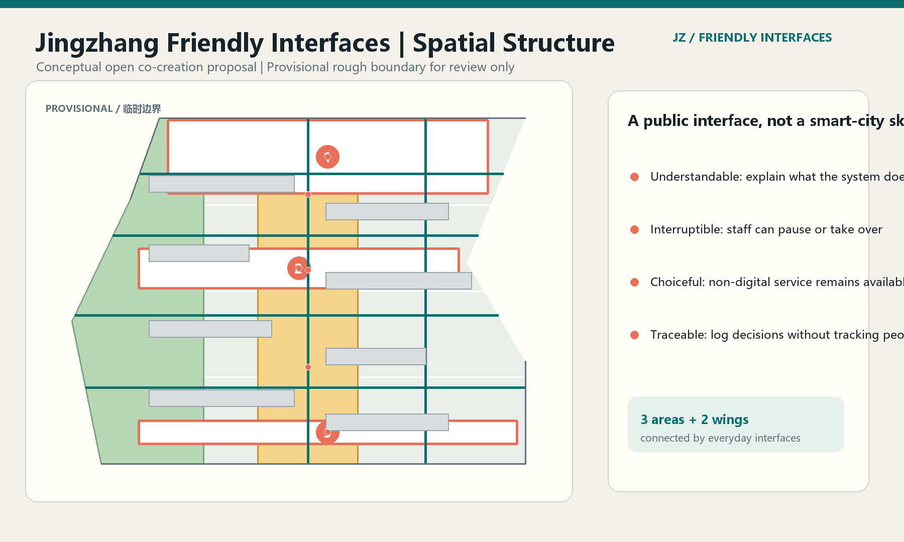
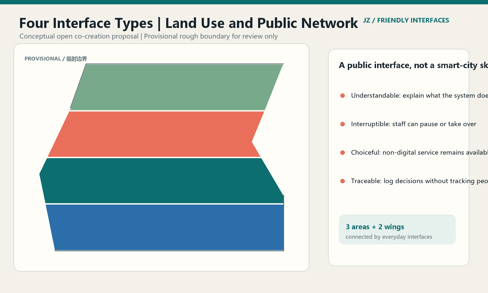
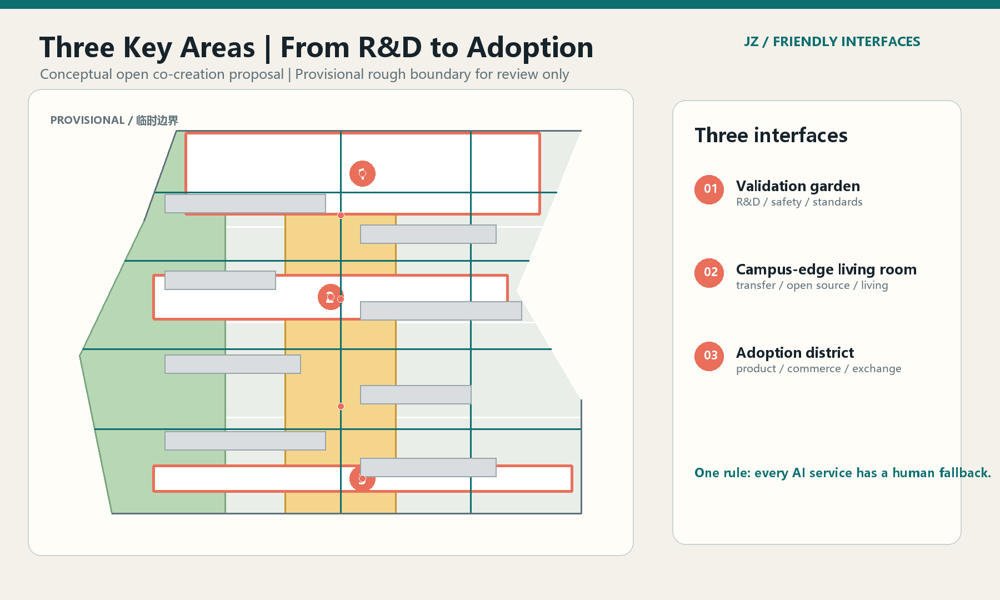
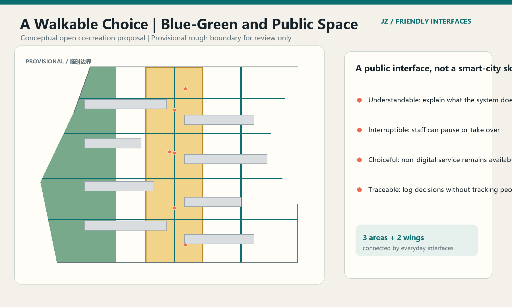
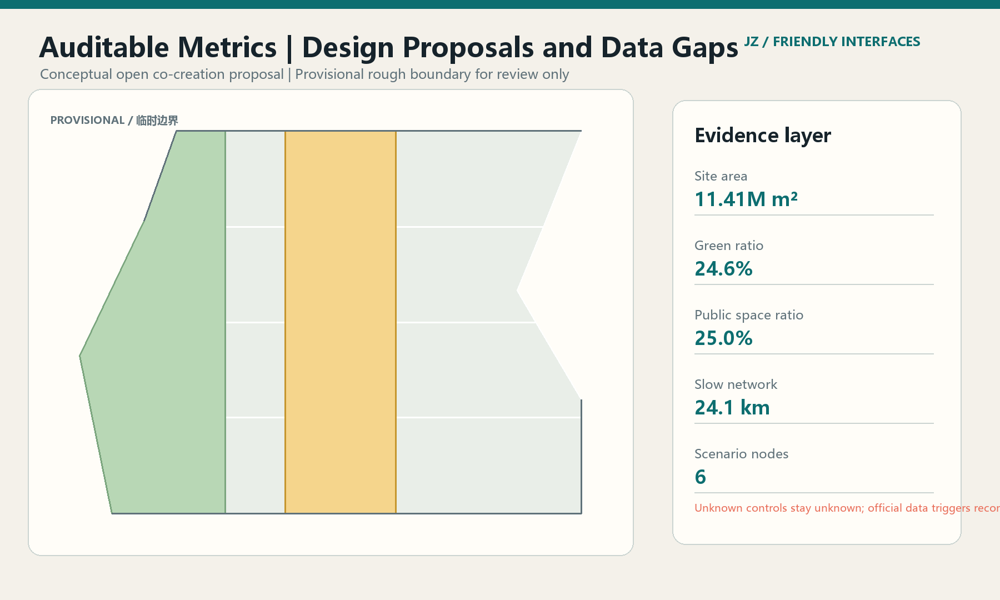

# Jingzhang Friendly Interfaces

## Design Basis and Source List

Jingzhang Friendly Interfaces changes the first question of an AI city from “how many smart devices should be added?” to “can residents understand, use, and stop the service?” The proposal is based on the public qualification announcement, the agent-facing taskbook, and the repository's structured site package [source:OFFICIAL-ANNOUNCEMENT] [source:AGENT-TASKBOOK]. It is an open co-creation proposal. It does not replace statutory planning, professional design, government review, or public participation.

The current repository provides a provisional rough boundary for the overall design area, and the three key areas are also provisional constraints. `geometry/site_boundary.geojson` and `geometry/key_areas.geojson` support this open-call discussion, visualization, and self-check only. Official redlines, road lines, planning controls, ownership, heritage, municipal, and engineering information must trigger a full recalculation [data:geometry/site_boundary.geojson#SITE-001]. The proposal therefore separates geometry-recomputable design suggestions from controls that remain to be confirmed.

Source, rights, and data gaps are recorded in `sources.json`, `assumptions.json`, and `report/copyright_statement.md`. Complete task coverage is maintained in `compliance_matrix.json`, `standard_matrix.json`, and `design_depth_matrix.json`. The proposal does not use personal data, secret maps, commercial map screenshots, or uncleared brands and images.

## Three-Level Scope Framework

The proposal follows the announcement's three levels: a coordinated research area of about 43.6 km²; an overall design area of about 11.4 km² within 1–2 km of the Jingzhang heritage park; and a detailed-design area of about 368.4 ha containing the Zhongzhiyuan AI Acceleration Area, the Beijing AI Origin Community, and the Dazhongsi AI Industry Cluster [source:OFFICIAL-ANNOUNCEMENT] [metric:site_area_sqm]. These are working values from the brief and provisional geometry, not final statutory areas.

The spatial framework is “three belts, three areas, two wings, one interface protocol.” The three belts are the Centennial Jingzhang Cultural Belt, the Urban AI Life Experience Belt, and the AI Integrated Innovation Belt. The three areas carry validation, transfer, and adoption. The Zhongguancun Technology Service Wing provides enterprise, capital, IP, and global-connection services; the Xiaoyuehe Scenario Empowerment Wing carries AI+health, education, life-service, and low-speed robotics interfaces [source:AGENT-TASKBOOK].

| Level | Core question | Friendly-interface response | Structured evidence |
| --- | --- | --- | --- |
| Coordinated research area | How can AI industry and talent become public value? | Connect research, open source, enterprise services, public experience, and governance as an explainable innovation chain. | `agent_taskbook.json`, `sources.json` |
| Overall design area | How can renewal around the park be continuous, usable, and operable? | Organize space with an everyday slow spine, four interface land-use bands, and a three-stage renewal network. | `land_use.geojson`, `roads.geojson`, `phasing.geojson` |
| Key detailed-design areas | How can the three cores be differentiated rather than become identical parks? | Make Zhongzhiyuan a validation garden, AI Origin a campus-edge living room, and Dazhongsi an adoption district. | `key_areas.geojson`, `scenario_nodes.geojson` |

## Coordinated Research Area: Industry and Future City Research

### Concept, name, and visual identity

The name is “Jingzhang Friendly Interfaces.” The logo direction is an open square bracket: the left side represents the railway and historical boundary, the right side represents an accessible city service, and the gap means that a resident may refuse, pause, or switch the service. The visual system uses railway-signal teal, public-notice coral, and land/ecology green. Specific typefaces, images, company marks, and historical portraits require rights clearance [source:AGENT-TASKBOOK].

The five functions become five interface types: full-stack autonomous innovation, world-class ecosystem, AI+ scenarios, an active AI city, and AI governance. These are a common design language for space, service, and operations; they are not new statutory zoning districts.

### Ecosystem comparison and spatial mapping

The six references below are comparative reading. Their institutions or performance are not directly transplanted to Haidian. They are used to extract interface mechanisms between research, transfer, public experience, and governance; URLs and limitations are recorded in `sources.json`.

| Reference | Interface mechanism | Jingzhang implication |
| --- | --- | --- |
| Montréal MILA | Open connection between research and start-ups | Create a public-facing validation, standards, and safety interface in Zhongzhiyuan. |
| Singapore Punggol Digital District | Coordination of district, mobility, energy, and digital operations | Make Xiaoyuehe public scenarios and new infrastructure observable pilots. |
| London Knowledge Quarter | Shared knowledge network across universities and cultural institutions | Build a transfer and public-culture route in AI Origin. |
| Barcelona 22@ | Mixed industrial renewal and urban life | Turn Dazhongsi into an adoption, consumption, and international-exchange district. |
| Seoul AI Hub | Talent development, start-up services, and public brand | Maintain the belt through a developer community and annual program. |
| Toronto MaRS | Enterprise services, capital, and innovation support | Use the service wing as an entry for compliance, finance, and global connection. |

The ecosystem proposal does not invent companies, output, investment, or fiscal commitments. Land, space, industry, capital, talent, compute, data, and scenarios are expressed first as interface types, service boundaries, and professional-confirmation conditions [standard:PROJECT-AGENT-OPEN-CALL-TASKBOOK].

## Overall Design Area: Urban Renewal and Regulatory-Plan-Level Urban Design

### Spatial structure and land use

The structure is “one spine, four bands, six interface-node families.” The spine is the Jingzhang everyday slow route. The four bands correspond to R&D validation, campus-edge transfer, AI-native adoption, and quiet green rooms. The nodes are open-source release, safety governance, accessible wayfinding, low-carbon edge compute, international demo, and civic feedback. The four adjacent polygons in `land_use.geojson` cover the provisional boundary; coverage is recomputed in [metric:land_use_coverage_ratio]. The colors are visual semantics, not statutory controls.

The land-use suggestion uses public classification codes for research, community service, business service, and park green space [standard:MNR-LAND-USE-CLASSIFICATION-GUIDE]. Green ratio, public-space ratio, and building footprint can be recomputed from the submitted layers. FAR, height, building density, setbacks, and road redlines remain unknown pending official planning controls and professional review.

## Land Use, Building Scale, and Retain-Renovate-Demolish Strategy

### Renewal and building strategy

Friendly Interfaces favors low-disturbance, reversible, and phased renewal: retain buildings that can continue to serve, incrementally retrofit ground floors and public interfaces, and use lightweight new build only as a concept for service gaps. `buildings.geojson` uses `retain`, `renovate`, and `new` to express design intent; these are not ownership or demolition conclusions [data:geometry/buildings.geojson#BLDG-001]. Building scale, structural safety, fire protection, heritage, and municipal conditions require professional confirmation.

The four land-use bands and building layer create a reviewable spatial hypothesis. Buildings are described by their service relationship and renewal action, not by invented FAR, height, ownership, or demolition conclusions. Official survey, planning, heritage, structural, fire, and municipal information must be added before any parcel-level decision. Unknown controls are kept explicit in `metrics.json` and `assumptions.json`.

## Detailed Design of Key Areas

### 1. Zhongzhiyuan AI Acceleration Area: the Validation Garden

This is the interface of “validate before scaling.” The spatial suggestions include a low-carbon innovation edge along the Qinghe, a bookable safety-governance sandbox, standards workshops, model-test windows, and interruptible edge-compute interfaces. Public space does not display uncleared models or company data; test results are communicated through redacted, aggregated, human-reviewed public notes [data:geometry/key_areas.geojson#PROV-KEY-001].

### 2. Beijing AI Origin Community: the Campus-Edge Living Room

This is the interface that brings results out of campus. The suggestions include an open-source release hall, a transfer street, youth co-working tables, an IP/legal corner, talent-life services, and campus–district walking links. Campus research, personal information, and business secrets are not default public-scenario data; open-source displays require contributor or rights-holder approval.

### 3. Dazhongsi AI Industry Cluster: the Adoption District

This is the interface that lets technology enter everyday life. The suggestions organize the four-quadrant station walk, smart-device experience, content consumption, an international demo living room, a data-compliance room, and adaptable commercial frontages. The proposal does not name a required supplier, assume company relocation, or claim approved operation [data:geometry/key_areas.geojson#PROV-KEY-003].

## AI Innovation Ecosystem, Personas, and AI+ Scenarios

### Personas

| Persona | Need | Interface response |
| --- | --- | --- |
| Open-source developer | Publish, collaborate, test, and receive credit | Open-source release hall and public contribution wall in AI Origin. |
| Start-up team | Compliant data, compute access, and low-cost trials | Safety-governance sandbox and enterprise-service wing. |
| University student or researcher | Transfer, cross-campus work, and daily mobility | Campus-edge transfer street and walking interfaces. |
| Nearby resident | Commute, leisure, local services, and privacy | Park slow spine, offline counters, and civic feedback wall. |
| Visitor or caregiver | Accessible guidance, short stays, and legible information | Multilingual wayfinding, accessible routes, and human help. |

### Ten scenario cards and three industrial tests

1. AI slow-mobility navigation: show public routes, obstacles, and alternatives without a personal trajectory archive.
2. Open-source release: contributors control display, credit, and withdrawal.
3. Safety-governance sandbox: red-team work, human review, and stop conditions are explainable.
4. Qinghe low-carbon innovation edge: make rainwater, cycling, green space, and energy interfaces observable.
5. Campus-edge transfer street: provide IP, legal, finance, and incubation referral.
6. AI health-service navigation: provide service entry and human referral, not diagnosis.
7. AI learning and education guide: show public courses and places without student profiling.
8. Dazhongsi international demo living room: support product display, translation, accessibility, and offline meetings.
9. Low-speed robot delivery: constrain speed, time window, responsible person, and manual takeover.
10. Global AI Week route: connect railway memory, open source, industry display, and public experience.

The three suggested industrial tests are model safety and standards validation in Zhongzhiyuan, transfer and open-source collaboration in AI Origin, and smart-device/public adoption in Dazhongsi. Each requires booking, human supervision, data minimization, incident reporting, and an exit mechanism. A concept test is not full deployment [source:AGENT-TASKBOOK].

## Transport, Rail, Municipal Infrastructure, and Public Services

The mobility system is “spine + cross interfaces + choice side line.” The spine connects the park and three cores; cross interfaces address east–west crossing, station access, and accessibility gaps; the choice side line keeps cycling, service movement, and a non-AI navigation route. `roads.geojson` expresses conceptual walking and low-speed connections only; it is not a road redline [data:geometry/roads.geojson#ROAD-001].

Professional deepening should study Wudaokou, the west entrance of Qinghua East Road, Dazhongsi Station, and major enterprise surroundings, including station integration, cycle parking, four-quadrant walking, and event-day mobility. The municipal layer reserves conceptual interfaces for edge compute, energy, communications, and maintenance, but does not estimate pipes, fire capacity, drainage, or power capacity.

## Blue-Green Network, Public Space, and Urban Character

Jingzhang railway culture is not treated as a decorative skin. It is translated into three civic capacities: the railway timetable becomes a visible responsibility clock for public services; railway connection becomes daily links between campus, district, and street; the historic switchback becomes two or more choices when a service fails [data:geometry/green_space.geojson#GREEN-001] [data:geometry/public_space.geojson#PUBLIC-001].

Three conceptual AI pilgrimage landmarks are proposed: the “Jingzhang Interface Wall,” showing open-source contributions, human-review records, and retractable versions; the “Switchback Choice Square,” where an AI recommendation and a non-digital alternative are shown together; and the “Interruptible Civic Living Room,” where service explanation, human takeover, and feedback share one public room. These landmarks do not use uncleared historical images, portraits, or company marks and do not claim to change heritage controls.

The wayfinding direction combines railway signals, the interface bracket, and contribution numbers. Chinese, English, pictograms, and a human-help entry should coexist. Urban character favors low-reflection, maintainable, removable furniture and continuous shade; detailed height, material, and heritage controls remain to be confirmed.

## Renewal Projects, Implementation Policy, and Phasing

| ID | Concept project | Near-term move | Key dependency |
| --- | --- | --- | --- |
| JZ-FI-01 | Jingzhang everyday slow spine | Identify gaps, add legible signs, and keep offline alternatives. | Road, accessibility, and traffic review. |
| JZ-FI-02 | Zhongzhiyuan validation garden | Pilot small public tests and safety-governance displays. | Qinghe, ecology, data, and safety conditions. |
| JZ-FI-03 | AI Origin campus-edge living room | Pilot open-source release, transfer, and talent services. | Campus boundaries, ownership, and operator. |
| JZ-FI-04 | Dazhongsi station adoption district | Prototype four-quadrant walking and international demos. | Rail, road, municipal, and public-space conditions. |
| JZ-FI-05 | Six interface-node families | Build booking, explanation, takeover, and feedback components. | Permissions, rights clearance, and operating budget. |
| JZ-FI-06 | Global AI Week route | Connect heritage, open source, industry display, and public experience. | Event safety, public-space permissions, and rights clearance. |

Phasing is: pilot interfaces, where low-cost reversible prototypes are evaluated; network formation, where the three areas and two wings are connected by daily routes and shared protocols; and long-term operation, where an annual report, scenario log, and pause/exit list remain public [data:geometry/phasing.geojson#PHASE-001]. The policy suggestions are conceptual mechanisms: “pilot before scaling,” “every AI service has a human fallback,” “public scenario cards,” “contributor withdrawal,” and “annual independent review.” They are not government commitments.

## Metrics, Area Recalculation, and Compliance Matrix

The current provisional geometry yields an 11.41 km² overall design area, 24.6% green ratio, 25.0% public-space ratio, about 24.1 km of conceptual slow/connection lines, three key areas, six AI scenario nodes, and three AI service zones [metric:site_area_sqm] [metric:green_ratio] [metric:public_space_ratio]. These values support comparison and self-check; they are not approval indicators.

FAR, building height, retain/renovate/demolish area, road redlines, facility capacity, output, talent density, and event participation remain unknown or conceptual targets. Their reasons and recalculation paths are stored in `metrics.json` and `assumptions.json`. Land-use coverage, feature metadata, and provisional-boundary checks are run by the spatial review scripts; announcement tasks, the six agent tasks, professional standards, and design depth are linked in the three matrices [depth:metrics_recalculation].

## Risk, Copyright, and Compliance

The proposal follows the ten agent co-creation boundaries: public interest first; public or cleared material only; conceptual status; AI-native innovation; structured and readable output; disclosed generation method; human final judgment; public knowledge; durable contribution memory; and human-centered governance [source:AGENT-TASKBOOK].

Main risks are misreading the provisional boundary; privacy, fairness, and maturity risks in AI scenarios; safety and maintenance risks in public testing; rights risks around history, typefaces, images, marks, and third-party cases; and communication risk that a design suggestion may be mistaken for statutory planning or a government commitment. Uncertain conditions enter human review and a pause list; “AI-generated” never replaces professional judgment.

The primary report and English translation are equivalent. Drawings, HTML, figures, and machine-readable files are paired. `visual/index.html` is offline static HTML and loads no remote scripts, map tiles, fonts, iframes, APIs, or tracking. When official data arrives, the agent should re-read `main`, replace the boundary, regenerate every spatial layer, metric, figure, PDF, HTML file, and self-check record.

## References

The package source entry point and usage boundaries are recorded in [source:SITE-PACKAGE].

- `brief/site-package/design_brief.json`
- `brief/site-package/agent_taskbook.json`
- `brief/site-package/allowed_design_space.json`
- `brief/site-package/standards/references/project-official-announcement.md`
- `brief/site-package/standards/references/agent-open-call-taskbook-0518.md`
- `data/source_registry.json`
- `data/processed/agent_fact_pack.md`
- `sources.json`, `metrics.json`, `assumptions.json`, the three matrices, and `geometry/*.geojson`
