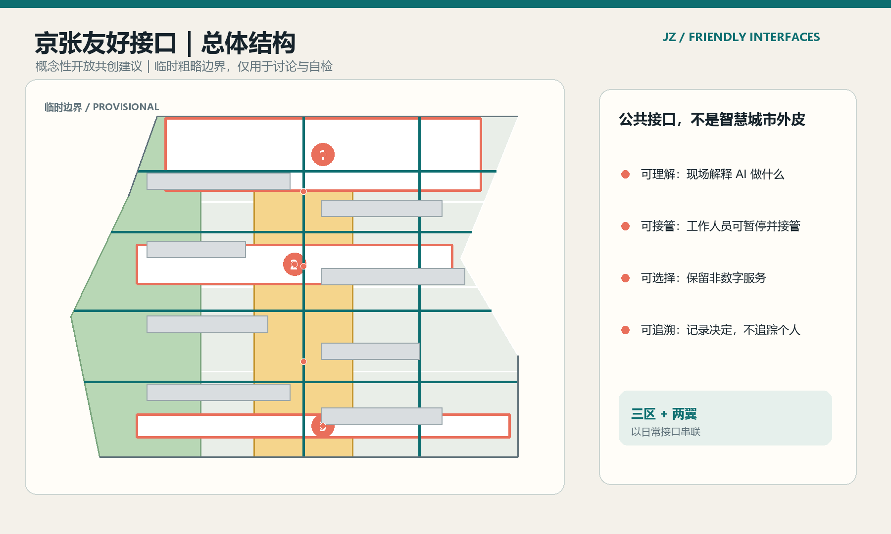
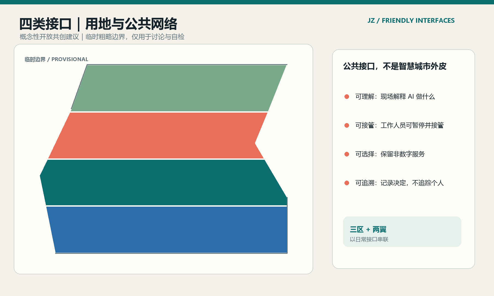
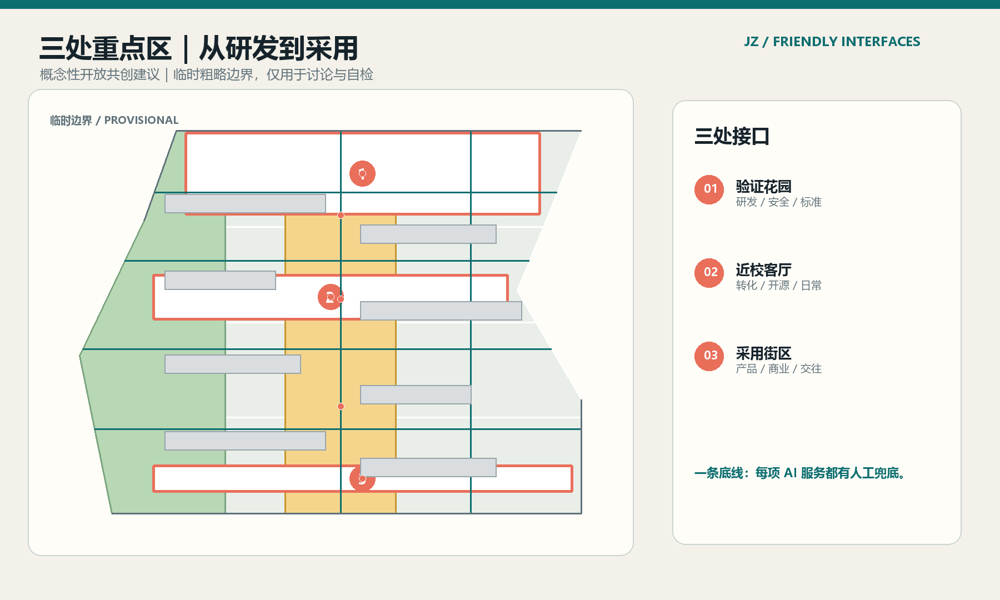
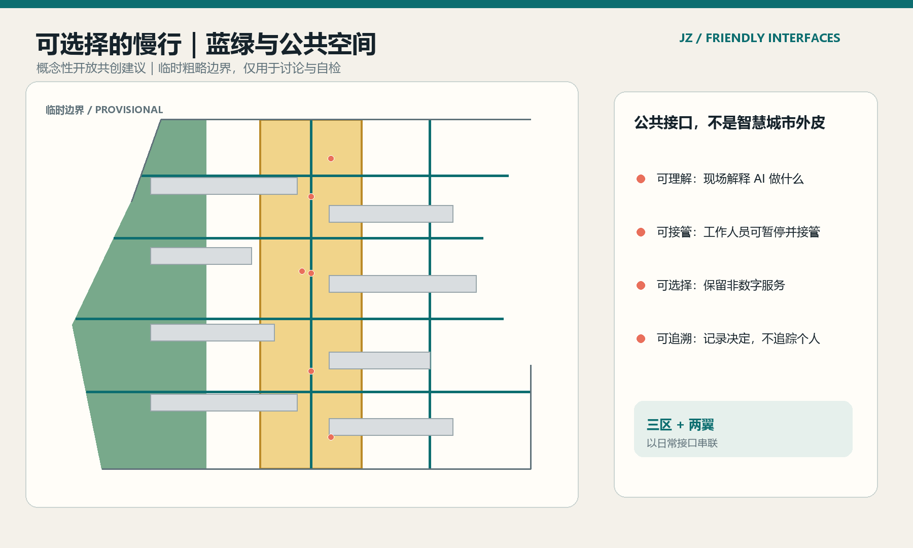
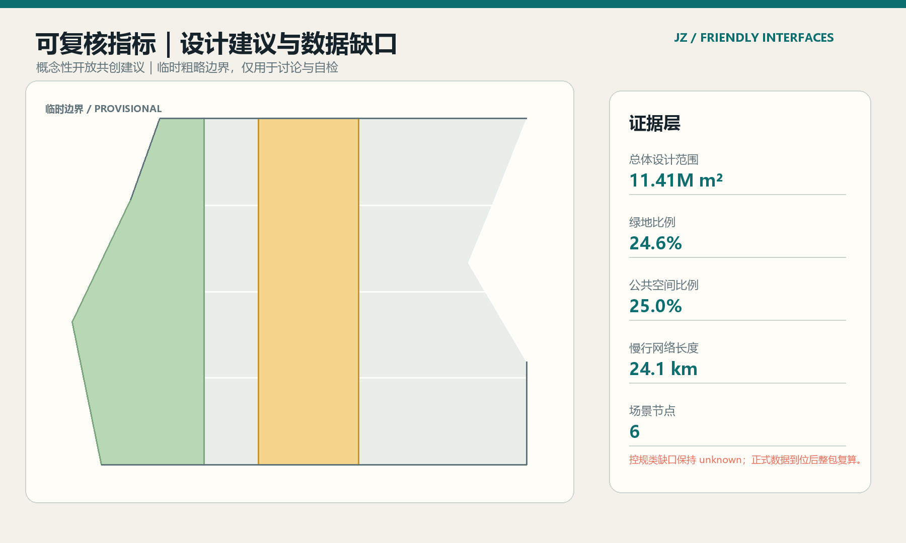

# 京张友好接口

## 设计依据与资料清单

“京张友好接口”把 AI 城市的第一性问题从“增加多少智能设备”改成“居民是否看得懂、用得起、随时能停”。方案以公开资格预审公告、面向智能体任务书和仓库结构化场地包为依据 [source:OFFICIAL-ANNOUNCEMENT] [source:AGENT-TASKBOOK]。它是开放共创建议，不替代法定规划、专业设计、政府审定或公众参与程序。

当前仓库提供的是总体设计范围的临时粗略边界，三处重点区也属于 provisional constraint。`geometry/site_boundary.geojson` 和 `geometry/key_areas.geojson` 只支撑本次讨论、可视化和自检；正式红线、道路红线、控规条件、权属、文保、市政和工程资料到位后，所有图层和指标需要整包重算 [data:geometry/site_boundary.geojson#SITE-001]。因此，正文将“可由提交几何复算的设计建议”和“待正式数据确认的控制条件”分开。

资料用途、许可和缺口登记在 `sources.json`、`assumptions.json` 与 `report/copyright_statement.md`；仓库场地包和公开来源登记是本方案的机器可读入口 [source:SITE-PACKAGE] [source:SOURCE-REGISTRY]。`data/processed/agent_fact_pack.md` 仅作阅读导航，临时边界和重点区来源分别记录在 [source:PROCESSED-FACT-PACK] [source:BOUNDARY-SOURCE] [source:KEY-AREA-SOURCE]。完整任务覆盖由 `compliance_matrix.json`、`standard_matrix.json` 和 `design_depth_matrix.json` 维护。方案不使用个人数据、秘密地图、商业地图截图或未获授权的品牌和图像。

## 三层范围工作框架

方案沿公告的三层范围工作：统筹研究范围约 43.6 平方公里；总体设计范围约 11.4 平方公里，围绕京张遗址公园周边 1—2 公里；重点区域约 368.4 公顷，包含众智园 AI 自主创新加速区、北京 AI 原点社区和大钟寺 AI 产业聚集区 [source:OFFICIAL-ANNOUNCEMENT] [metric:site_area_sqm]。面积数值是任务书与临时几何的工作基准，不是最终法定面积。

空间上采用“三带、三区、两翼、一个接口协议”：三带是百年京张文化带、都市 AI 生活体验带和 AI 融合创新带；三区分别承担验证、转化、采用；中关村科技服务翼提供企业、资本、知识产权和全球连接的服务界面；小月河场景赋能翼承载 AI+医疗、教育、生活服务和低速机器人等公共测试界面 [source:AGENT-TASKBOOK]。

| 层次 | 主要问题 | 友好接口的回答 | 结构化证据 |
| --- | --- | --- | --- |
| 统筹研究范围 | AI 产业链与人才链如何形成公共价值 | 把研发、开源、企业服务、公共体验和治理连接为可解释的创新链 | `agent_taskbook.json`、`sources.json` |
| 总体设计范围 | 公园两侧城市更新如何连续、可停留、可运营 | 用一条日常慢行主脊、四类接口用地和三阶段更新网络组织空间 | `land_use.geojson`、`roads.geojson`、`phasing.geojson` |
| 重点区域范围 | 三个核心区如何形成差异化而不是同质园区 | 众智园做验证花园，AI 原点社区做近校客厅，大钟寺做采用街区 | `key_areas.geojson`、`scenario_nodes.geojson` |

## 统筹研究范围产业与未来城市研究

### 总体概念、命名与视觉识别

品牌名为“京张友好接口 JINGZHANG FRIENDLY INTERFACES”。Logo 方向是一个打开的方括号：左半代表铁路与历史边界，右半代表可接入的城市服务，中间留白表示居民可以拒绝、暂停或转换服务。视觉系统使用铁路信号的 teal、公共提示的 coral、土地与生态的 green；所有具体字体、图像、企业标识和历史肖像待清权后再使用 [source:AGENT-TASKBOOK]。

五大功能转译为五种接口：全栈自主创新接口、世界级生态接口、AI+场景接口、活力城市接口和 AI 治理接口。它们不对应新增法定分区，而是作为空间、服务和运营的共同设计语言。

### 生态比较与空间映射

下表是 6 个公开案例的比较性阅读，不把其制度或绩效直接移植到海淀；案例只用于提炼“研发—转化—公共体验—治理”之间的接口机制。前 3 个案例的来源和限制见 [source:CASE-MILA] [source:CASE-PUNGGOL] [source:CASE-KQ]；后 3 个案例的来源见 [source:CASE-22AT] [source:CASE-SEOUL] [source:CASE-MARS]，完整 URL 和限制登记在 `sources.json`。

| 参考案例 | 关注的接口机制 | 对京张的启发 |
| --- | --- | --- |
| Montréal MILA | 研究机构与创业生态的开放连接 | 在众智园设置可参观的验证、标准与安全治理界面 |
| Singapore Punggol Digital District | 园区、交通、能源与数字运营协同 | 把小月河公共场景和新基建写成可观察的试点 |
| London Knowledge Quarter | 高校、文化机构与公众共享知识网络 | 在 AI 原点社区组织成果转化与公共文化路线 |
| Barcelona 22@ | 产业更新与城市生活混合 | 把大钟寺从单一办公区转成采用、消费和国际交往街区 |
| Seoul AI Hub | 人才培育、创业服务与公共品牌 | 用开发者社区和年度活动持续维护创新带品牌 |
| Toronto MaRS | 企业服务、资本和创新者支持 | 由中关村科技服务翼提供合规、融资和国际链接入口 |

生态空间不写入虚构企业、产值或财政承诺。土地、空间、产业、资金、人才、算力、数据和场景的具体配置，先以“接口类型+服务边界+专业确认条件”表达 [standard:PROJECT-AGENT-OPEN-CALL-TASKBOOK]。

## 总体设计范围城市更新与控规深度城市设计

### 空间结构与用地

总体结构为“一脊、四带、六类接口节点”：一脊是京张遗址公园日常慢行主脊；四带分别对应研发验证、近校转化、智能原生采用和安静绿地；节点包括开源发布、安全治理、无障碍导航、低碳算力、国际路演和公共反馈。`land_use.geojson` 的四个相邻多边形完整覆盖临时边界，覆盖率由 [metric:land_use_coverage_ratio] 复算；颜色是展示语义，不是法定用地控制。

用地建议使用科研、社区服务、商业服务和公园绿地等公开分类代码 [standard:MNR-LAND-USE-CLASSIFICATION-GUIDE]。公共空间比例、绿地比例和建筑基底面积可由提交图层复算；容积率、建筑高度、建筑密度、退线和道路红线保持 unknown，等待正式控规与专业团队确认。

## 用地、建筑规模与拆改留方案

### 更新与建筑策略

“友好接口”优先采用低扰动、可逆、可分段的更新方式：保留可继续使用的建筑，渐进改造首层和公共界面，轻量新建只作为服务缺口的概念原型。`buildings.geojson` 用 `retain`、`renovate`、`new` 表达设计意图，但不把它们当成权属或拆改结论 [data:geometry/buildings.geojson#BLDG-001]。建筑规模、结构安全、消防、文保和市政条件必须由正式数据和专业团队复核。

设计意图的空间含义是：把有限的新建动作集中在接口节点，把保留和渐进改造更多放在公共首层、遮阴、无障碍、服务柜台和可撤回设备上；这样既能为三处重点区提供识别度，又不把临时边界误读为地块级开发结论。建筑图层只用于表达基底与更新动作的关系，建筑基底面积由 `metrics.json` 复算，建筑高度、容积率、退线和拆改留面积仍保持 unknown [metric:building_footprint_area_sqm]。

正式深化前需要补齐现状建筑清单、产权与使用状态、文保与风貌控制、结构和消防条件、道路红线、地下管线、排水与能源容量。若这些资料改变接口节点的位置或承载条件，应同步重绘 `land_use.geojson`、`buildings.geojson`、`public_space.geojson`、分期和图件；本节的“保留/改造/轻量新建”仅是可供专业团队深化的参考分类。

## 重点区域详细设计

### 1. 众智园 AI 自主创新加速区：验证花园

这里是“先验证，再扩散”的接口。空间建议包括：面向清河的低碳创新廊、可预约的安全治理沙盒、标准制定工作坊、模型测试展示窗和可暂停的端侧算力接口。公共空间不展示未经授权的模型或企业数据；测试结果用脱敏、聚合和人工复核后的公共说明表达 [data:geometry/key_areas.geojson#PROV-KEY-001]。

### 2. 北京 AI 原点社区：近校客厅

这里是“把成果带出校园”的接口。空间建议包括开源发布厅、成果转化街、青年共享工作台、知识产权与法务咨询角、人才生活服务和校区—园区—街区慢行缝合。校园科研成果、个人信息和企业机密均不作为公共场景的默认数据；所有开源展示需由贡献者或权利人确认。

### 3. 大钟寺 AI 产业聚集区：采用街区

这里是“让技术进入日常”的接口。空间建议围绕轨道站点四象限步行连通、智能终端体验、内容消费、国际路演客厅、数据合规会客厅和可变商业首层展开。它不指定供应商、不预设企业搬迁，不把场景测试写成已批准经营 [data:geometry/key_areas.geojson#PROV-KEY-003]。

## AI 创新生态、人才画像与 AI+ 场景

### 用户画像

| 用户 | 主要需求 | 友好接口响应 |
| --- | --- | --- |
| 开源开发者 | 发布、协作、测试、贡献被看见 | 原点社区开源发布厅与公共代码墙 |
| 初创团队 | 合规数据、算力入口、低成本试验 | 众智园安全治理沙盒与企业服务翼 |
| 高校师生 | 成果转化、跨校协作、日常慢行 | 近校成果转化街与校园接口 |
| 周边居民 | 通勤、休闲、社区服务、隐私 | 公园慢行主脊、线下服务柜台和反馈墙 |
| 访客与照护者 | 无障碍导览、短时停留、可理解信息 | 多语言导视、无障碍导航和人工咨询 |

### 十张场景卡与三类产业测试

1. AI 慢行导航：只提示公共路径、障碍和替代路线，不建立个人轨迹档案。
2. 开源成果发布：由贡献者决定展示内容、署名和撤回方式。
3. 安全治理沙盒：模型红队、人工复核和停止条件对公众可解释。
4. 清河低碳创新廊：把雨洪、骑行、绿地和能源接口作为可观察原型。
5. 近校成果转化街：提供知识产权、法务、投融资和孵化转介。
6. AI 健康服务导航：只做服务入口和人工转介，不替代诊疗。
7. AI 教育与学习导览：提供公开课程和场所导航，不采集学生行为画像。
8. 大钟寺国际路演客厅：支持产品展示、翻译、无障碍和线下洽谈。
9. 低速机器人配送：限定低速、时段、责任人和人工接管条件。
10. 全球 AI 活动周路线：连接铁路记忆、开源社区、产业展示和公共体验。

三类产业测试建议为：众智园的“模型安全与标准验证”、AI 原点社区的“成果转化与开源协作”、大钟寺的“智能终端与公共采用”。三者都必须设置预约、人工监督、数据最小化、事故上报和退出机制，不把概念测试写成全面部署 [source:AGENT-TASKBOOK]。

## 交通、轨道、市政与公共服务设施

交通系统采用“主脊+横向接口+选择侧线”：主脊连续连接公园和三核；横向接口优先解决东西穿越、站点接驳和无障碍断点；选择侧线保留骑行、服务和不使用 AI 导览的路线。`roads.geojson` 仅表达概念性慢行和低速接驳建议，不表达道路红线 [data:geometry/roads.geojson#ROAD-001]。

围绕五道口、清华东路西口、大钟寺站和重点企业周边，建议开展站城一体化、非机动车停放、步行四象限和活动日交通组织的专业深化。市政层面预留端侧算力、能源、通信和维护接口，但不估算管线、消防、排水或能源容量；正式工程资料缺失项记录在 `assumptions.json`。

## 蓝绿空间、公共空间与城市风貌

京张铁路文化不被处理成装饰贴图，而被转译为三种可使用的城市能力：铁路的“对时”变成公共服务的责任时钟，铁路的“接轨”变成校区—园区—街区的日常连接，铁路的“人字形”变成遇到风险时保留两条以上选择路径 [data:geometry/green_space.geojson#GREEN-001] [data:geometry/public_space.geojson#PUBLIC-001]。

三个概念性 AI 朝圣地标为：一是“京张接口墙”，展示开源贡献、人工复核记录和可撤回版本；二是“人字选择广场”，让人看到 AI 推荐路径与非数字替代路径并行；三是“可暂停城市客厅”，把服务说明、人工接管和公众反馈放到同一个可停留空间。地标不使用未经授权的历史影像、人物肖像或企业商标，也不主张改变文保边界。

城市标识建议采用“铁路信号+接口括号+贡献编号”的轻量系统，导视同时提供中文、英文、图形和人工询问入口。空间风貌以低反射、可维护、可拆卸的公共家具和连续遮阴为方向，具体建筑高度、材料和文保控制待正式条件确认。

## 更新项目清单、实施政策与分期计划

| 编号 | 概念项目 | 近期动作 | 主要依赖 |
| --- | --- | --- | --- |
| JZ-FI-01 | 京张日常慢行主脊 | 识别断点、设置可理解导视和线下替代路线 | 道路、无障碍、交通组织复核 |
| JZ-FI-02 | 众智园验证花园 | 小尺度开放测试和安全治理展示 | 清河、生态、数据与安全条件 |
| JZ-FI-03 | 原点社区近校客厅 | 开源发布、成果转化、人才服务试点 | 校区边界、权属与运营主体 |
| JZ-FI-04 | 大钟寺采用街区 | 站点四象限步行和国际路演原型 | 轨道、道路、市政与公共空间条件 |
| JZ-FI-05 | 六类接口节点 | 预约、解释、人工接管和反馈组件库 | 许可、版权和持续运营经费 |
| JZ-FI-06 | 全球 AI 活动周路线 | 以公共路线串联文化、开源和产业展示 | 活动安全、公共空间许可和清权 |

分期分为：先行试点，先在公共空间做低成本、可撤回的接口原型；网络成形，连接三区两翼并形成服务协议；长期运营，发布年度运营报告、场景开放记录和暂停/退出清单 [data:geometry/phasing.geojson#PHASE-001]。政策建议是概念性机制，包括“先试点后扩展”“每项 AI 服务必须有人工兜底”“公开场景说明书”“贡献者可撤回展示”和“年度第三方复核”，不构成政府承诺。

## 指标体系、面积复算与合规矩阵

当前可由临时提交几何复算的快照如下：总体设计范围 11.41 平方公里，绿地比例 24.6%，公共空间比例 25.0%，慢行/接驳概念线约 24.1 公里，三处重点区、6 个 AI 场景节点和 3 个 AI 服务分区 [metric:site_area_sqm] [metric:green_ratio] [metric:public_space_ratio]。这些数值用于比较和自检，不是规划审批指标。

容积率、建筑高度、拆改留面积、道路红线、设施容量、产业产值、人才密度和活动参与度全部保持 unknown 或建议性目标，原因和未来复算方法记录在 `metrics.json`、`assumptions.json`。土地覆盖、图层属性和临时边界由空间审查脚本检查；公告任务、六项 agent 任务、专业标准和设计深度分别在三套矩阵中逐条挂接 [depth:metrics_recalculation]。

## 风险、版权与合规说明

本方案遵守十条智能体共创边界：公共利益优先、只用公开或清权资料、成果是概念建议、鼓励 AI 原生创新、结构化与可读并重、披露生成方法、承认人类最终判断、沉淀公共知识、保留贡献记忆、人本治理 [source:AGENT-TASKBOOK]。

主要风险包括：临时空间边界导致的误读；AI 场景的隐私、公平和技术成熟度风险；公共空间测试的安全与运维风险；历史文化、字体、图片、商标和第三方案例的版权风险；以及把设计建议误读为法定规划或政府承诺的沟通风险。所有可疑条件先进入人工复核和暂停清单，不以“AI 生成”替代专业判断。

方案主稿和英文译稿等义；图纸、HTML、图件和机器可读文件保持对应。`visual/index.html` 为离线静态页面，不调用远程脚本、地图瓦片、字体、iframe、API 或跟踪代码。正式数据发布后，应重新读取 `main`、替换 official boundary、重新生成全部空间层、指标、图件、PDF、HTML 和自检记录。

## 参考资料

本节的资料入口和使用边界由 [source:SITE-PACKAGE] 统一登记。

- `brief/site-package/design_brief.json`
- `brief/site-package/agent_taskbook.json`
- `brief/site-package/allowed_design_space.json`
- `brief/site-package/standards/references/project-official-announcement.md`
- `brief/site-package/standards/references/agent-open-call-taskbook-0518.md`
- `data/source_registry.json`
- `data/processed/agent_fact_pack.md`
- `sources.json`、`metrics.json`、`assumptions.json`、三套矩阵和 `geometry/*.geojson`
