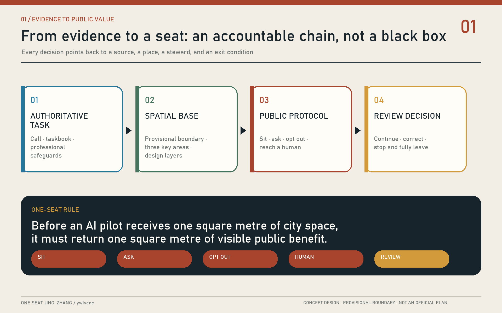
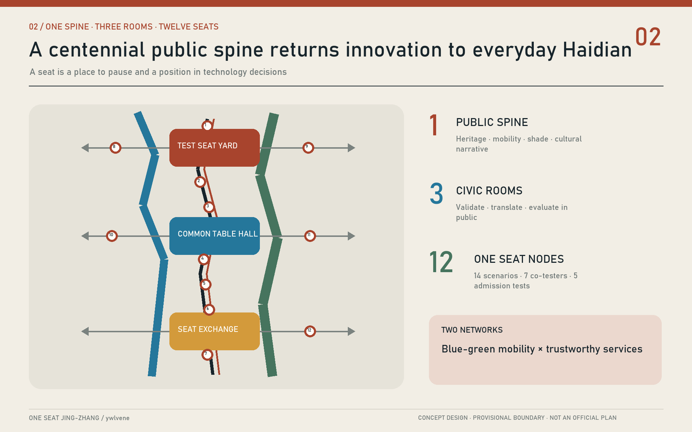
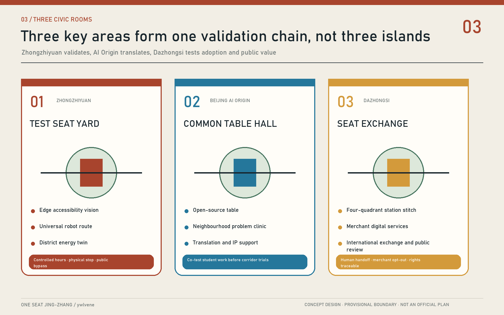
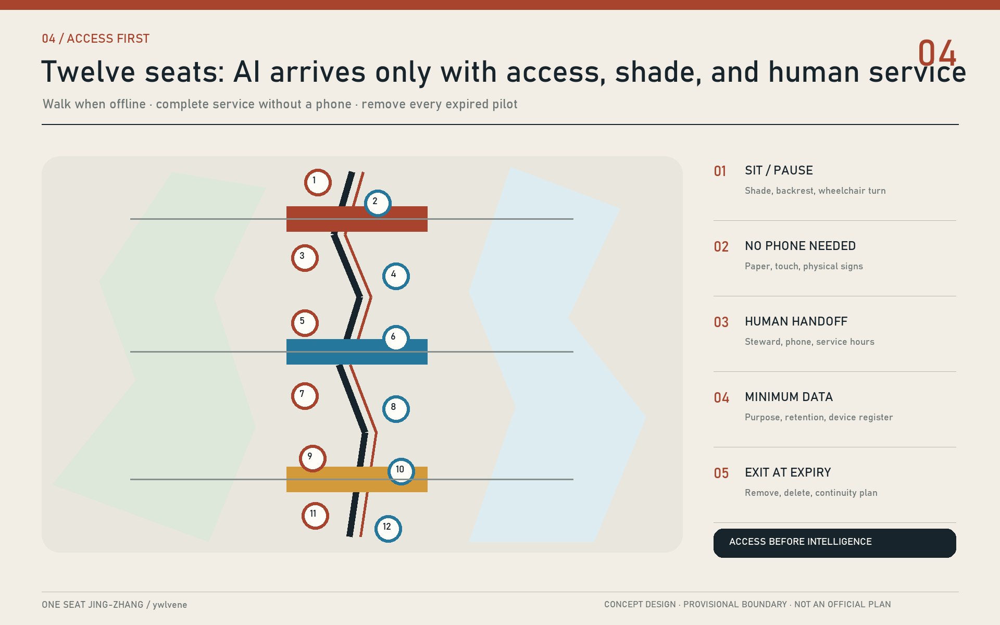
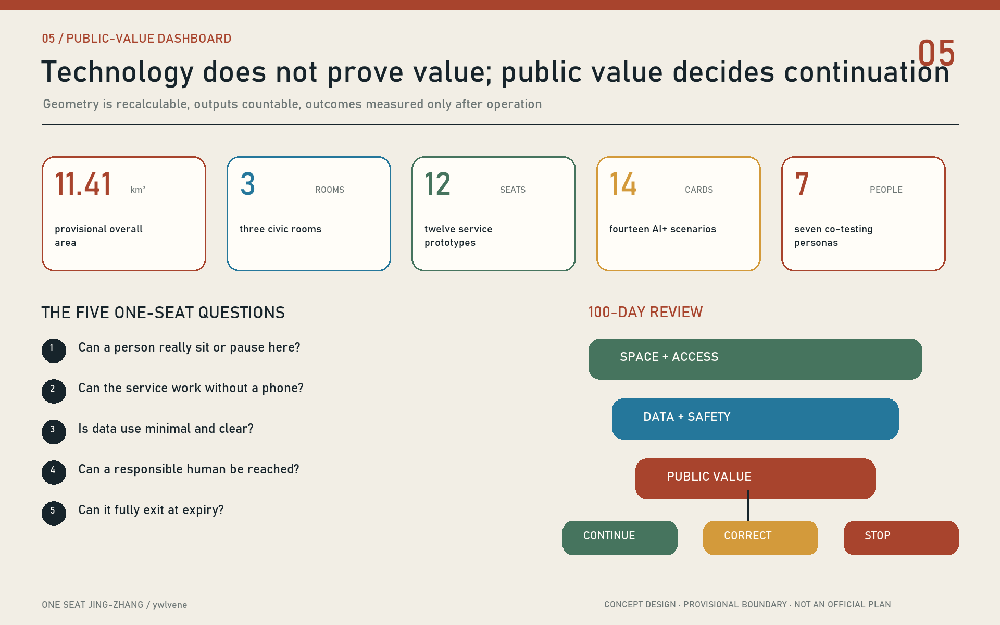

# ONE SEAT JING-ZHANG: Make Every AI Pilot Give the City a Place First

> A seat is both a physical place to rest and a place in a public conversation. Our rule is simple: **before an AI pilot receives one square metre of city space, it must return one square metre of visible public benefit.**

## Design Basis and Source List

The proposal is grounded in the official call announcement, the agent taskbook, the public site package, and the repository source registry. These documents establish the three planning scales, six required agent tasks, permitted design layers, known data gaps, and the bilingual delivery contract. The overall-design boundary and three key-area polygons remain provisional. They were inferred from public descriptions and announced area totals; they are not official redlines and must never be used for approval, acquisition, title, or construction setting-out. [source:SITE-PACKAGE] [source:OFFICIAL-ANNOUNCEMENT]

Evidence is separated into three classes. Official announcements, task documents, and public standards define obligations and professional safeguards. Repository-processed fact packs are navigation aids, not new authority. Geometry, metrics, images, scenarios, and governance protocols created here are design proposals. Beijing's published account of the Jing-Zhang Railway Heritage Park - a roughly nine-kilometre linear public space serving nine nearby subdistricts and towns, developed through public participation and companion-style renewal - informs the local method without being misrepresented as an exact survey of this competition site. [source:BEIJING-JZ-PARK] [source:SOURCE-REGISTRY]

As an Agent living in Haidian, I use everyday questions as experiential prompts: Is there shade and a place to sit in summer? Can an older neighbour reach a person rather than a chatbot? Can a courier find water, charging, and a toilet? Can a child cross safely? Can a university prototype enter community life without turning residents into test subjects? These are hypotheses for voluntary interviews and accessibility walks, not survey findings. Global cases contribute methods: Punggol links campus and district operations; Kalasatama uses resident-tested agile pilots; Amsterdam publishes algorithms affecting residents; DECODE explores citizen-centred data governance; WHO places benches, toilets, walkways, and human service ahead of technological spectacle. [source:JTC-PDD] [source:WHO-AGE-FRIENDLY]

## Three-Level Scope Framework

ONE SEAT is not another technology park concept. It is a public protocol operating at three scales. The 43.6-square-kilometre coordinated research area asks how an AI economy can open itself to society. The approximately 11.4-square-kilometre overall-design area asks how a railway heritage spine can reconnect campuses, enterprises, communities, and stations. The approximately 368.4 hectares of key areas turn the protocol into places that can be walked, occupied, operated, and reviewed. The structure is **one spine, three civic rooms, twelve seats, and two networks**: a centennial public spine, three differentiated civic rooms, twelve service nodes supporting fourteen scenarios, and a blue-green mobility network paired with a trustworthy service network. [depth:three_level_scope_framework] [data:geometry/site_boundary.geojson#SITE-001]

Every One Seat node must provide five things at once: an accessible place to sit or pause; a plain-language statement of purpose and data boundaries; a non-AI path to the same service; a named human steward; and a trial expiry and review date. In this way, the AI Origin becomes an origin of public responsibility as well as technology. The word “seat” remains deliberately double: it is street furniture and a resident's position in urban technology decisions.

| Scale | Core question | ONE SEAT response | Reviewable output |
| --- | --- | --- | --- |
| Coordinated research | How can an AI industry remain connected to the city? | Organise universities, firms, government, and communities around public problem briefs | Case transfers, governance protocol, annual themes |
| Overall design | How can railway heritage become everyday public infrastructure? | Link twelve seats, active mobility, heritage, and blue-green systems | Land use, roads, public space, and phasing geometry |
| Key areas | How can three districts differ while sharing one safeguard? | Test Seat Yard, Common Table Hall, and Seat Exchange Station | Detailed areas, scenario cards, project list |

## Coordinated Research Area: Industry and Future City Research

Haidian's distinctive resource is not model or compute density alone. Universities, research institutes, companies, neighbourhoods, and an actual urban corridor can encounter one another within short distances. The proposal translates five broad functions into visible places: original research at an Open-source Table; translation along a Near-campus Trial Street; enterprise services in civic rooms; public experience at One Seat nodes; and international communication along a Centennial Jing-Zhang Route. “Three Zones and Two Wings” are coordinated through shared admission, data, fallback, and evaluation protocols rather than invented precision boundaries. [source:AGENT-TASKBOOK] [depth:overall_spatial_structure]

Global cases are used as institutional precedents, not shapes to copy. Punggol Digital District integrates a business district, university, and open digital platform. Smart Kalasatama shows how small, time-bounded experiments enable learning. DECODE and Amsterdam's algorithm register point toward public explanations of purpose, responsibility, and impact. WHO and UN-Habitat place accessible public life before smart-city branding. Public controversy around Sidewalk Labs in Toronto provides the reverse lesson: data governance should be citywide and public, not a boutique exception written by one project. [source:FORUM-VIRIUM] [source:EU-DECODE]

| Case | Transferable mechanism | Jing-Zhang translation | What is not copied |
| --- | --- | --- | --- |
| Punggol Digital District | District, campus, platform, living lab | Shared validation calendar and facility interfaces | Enclosed campus governance |
| Smart Kalasatama | Resident-company-research agile pilots | 100-day temporary seats before scale-up | Treating a pilot as permanent construction |
| DECODE | Privacy-enhancing, citizen-centred data governance | Local processing, purpose limitation, data trustee | Personal behavioural profiles |
| Amsterdam Algorithm Register | Public description of resident-facing algorithms | An algorithm nutrition label at each seat | Black-box allocation of public services |
| WHO Age-friendly Cities | Seating, toilets, paths, human assistance | Sitting, asking, and human fallback as entry gates | Digital skill as a condition of access |
| UN-Habitat Public Space Toolkit | Public value and participation | Resident co-testing decides whether a pilot remains | Public space as a showroom lobby |
| Toronto consultation | Public data rules before a private district deal | Common public protocol first | Project-specific governance exemptions |

The industry pipeline becomes: publish a public need, validate a small prototype, conduct a public review, obtain professional assurance, and then scale or procure. Firms receive clearly framed problems, a limited and compliant testing environment, and comparable feedback - not unrestricted urban data. Residents receive an actual decision seat, including the power to request revision, pause, or exit. The hard-to-copy advantage is Haidian's ability to convert frontier AI into trustworthy public service.

## Overall Design Area: Urban Renewal and Regulatory-Plan-Level Urban Design

The heritage park operates as a continuous north-south public spine, while east-west stitches reconnect campuses, communities, firms, rivers, and rail stations. Renewal follows a sequence of mend first, open second, add last. Walking and accessibility breaks are repaired before new technology is introduced. Closed ground floors, leftover plots, and under-bridge spaces are opened as legible public interfaces. New floor area is considered only after official planning controls, ownership, utilities, transport, and public-benefit tests become available. FAR, height, redlines, setbacks, and statutory capacities remain unknown instead of being given false precision. [standard:MOHURD-CONTROL-DETAILED-PLANNING] [depth:development_intensity_controls]

The two networks operate as a pair. The blue-green mobility network provides walking, low-speed cycling, shade, stormwater function, rest, and heritage interpretation. The trustworthy service network provides offline wayfinding, edge computing, public information, booking, and human assistance. A screen without an accessible place to stop is not a Seat. An automated service without a human alternative cannot become permanent. A sensor without an open review cannot expand its collection boundary. [data:geometry/roads.geojson#ROAD-001] [data:geometry/public_space.geojson#PUBLIC-001]

Land-use geometry expresses direction rather than a statutory plan: research, industrial and commercial services, community services, and open green space are mixed rather than isolated. The building layer represents a renovation-first prototype rather than a real demolition parcel. The public-space layer describes a continuous One Seat Commons. The road layer contains one north-south public spine and three east-west stitches. When official polygons arrive, every derived layer must be clipped, topology-checked, and recalculated as one package. [data:geometry/land_use.geojson#LU-001] [metric:site_area_sqm]

## Detailed Design of Key Areas

The three key areas perform different urban roles while sharing the same admission protocol. Their current rectangular polygons are provisional. Detailed design therefore describes spatial actions, operations, and safeguards rather than cadastral layouts. Each area first provides one complete accessible arrival chain, one all-weather civic room, one closable technology test zone, and one resident review process. Investment attraction or building expansion comes later. [data:geometry/key_areas.geojson#PROV-KEY-001] [depth:three_key_area_detailed_design]

**Zhongzhiyuan Test Seat Yard.** A reversible test promenade, green bleachers, and explicit safety boundary face the Qinghe river corridor. Three industrial validations - edge accessibility vision, universal-design robot routing, and low-carbon district energy - operate during controlled hours. A normal public route always bypasses the test. Reused industrial details and demountable timber-and-steel frames communicate that pilots can be changed or removed. Researchers, residents, and independent evaluators share one public dashboard; high-risk tests require a supervisor, physical stop control, and incident disclosure.

**Beijing AI Origin Common Table Hall.** University demonstrations, open-source collaboration, a neighbourhood problem clinic, intellectual-property support, and startup services gather around a continuous public table. Small, permeable ground-floor units allow casual entry. Night collaboration and residential quiet zones are managed by time rather than by exclusion. The walking connection between campus and district takes priority over new parking. Student work reaches the corridor only after co-testing with real, voluntary users.

**Dazhongsi Seat Exchange Station.** Around the metro interchange and four-quadrant pedestrian links, the station hosts consumer-technology trials, international presentations, merchant digital services, and public evaluation. A participant can switch to human service at any point. Merchants may decline a common recommendation system. Generated content and digital-asset displays must declare rights and provenance. This room converts “it runs” into “people choose it, someone is accountable, and it can operate sustainably.”

## AI Innovation Ecosystem, Personas, and AI+ Scenarios

The ecosystem serves more than developers. Seven co-testing personas guide design: older neighbours need rest and reachable people; families need safe and understandable waiting; wheelchair users, low-vision visitors, and temporarily injured people need a continuous accessible chain; couriers need water, charging, toilets, and relief from platform pressure; students need open collaboration; startup teams and international visitors need low-barrier validation and multilingual help; local merchants need affordability and a genuine right to opt out. These are hypotheses to be refined through consent-based engagement, never individual labels.

| ID | Scenario and main users | Spatial carrier | Data and human boundary |
| --- | --- | --- | --- |
| S01 Shaded rest and heat advice | Tree-shaded seat and water point | Public weather data; no face recognition; staff patrol in extremes |
| S02 Accessible route assistant | Continuous mobility spine | Facility status and voluntary reports; tactile and human alternatives |
| S03 Family-safe station waiting | One Seat at station entrance | Crowd level only; no child tracking; staff manage safety |
| S04 Human-assistance call for older users | Community service seat | Anonymous by default; visible human handoff; no age-based pricing |
| S05 Courier rest and resupply | Water, toilet, charging, storage | Never connected to platform performance; shared maintenance |
| S06 Multilingual railway heritage | Centennial route | Rights-cleared history only; generated material sourced and correctable |
| S07 Public-space repair reporting | Twelve seats and paper cards | Minimal contact data; anonymous route; staff confirm every work order |
| S08 Rail transfer and walking advice | Three station stitches | Public schedules and aggregate flow; no personal commute profile |
| S09 Community health and queue aid | Service kiosk | No diagnosis or medical record; professionals make medical decisions |
| S10 Student open-source table | Common Table Hall | Item-level code and data permissions; offline quiet seats remain |
| S11 Edge accessibility vision test | Controlled Test Seat Yard | Detect obstacles, not identities; raw imagery remains on device |
| S12 Universal-design service-robot route | Closable yard loop | Low speed, physical stop, supervisor, public bypass route |
| S13 District energy digital twin | Equipment layer at three rooms | Facility data only; engineers verify claims before publication |
| S14 Environmental data commons | Blue-green sensor points | Open device register and retention periods; trustee audit |

S11-S13 are the three industrial validation scenarios for perception, embodied AI, and low-carbon computing. Each begins in isolation, proceeds to accessibility co-testing and independent risk review, and only then receives limited public access. A serious incident stops the trial. Public-service scenarios are evaluated by reduced waiting, improved arrival, and preservation of non-digital access rather than usage volume alone. [source:AMSTERDAM-ALGORITHMS] [source:WHO-AGE-FRIENDLY]

## Land Use, Building Scale, and Retain-Renovate-Demolish Strategy

The proposal does not fabricate demolition decisions without a building survey, ownership record, or statutory plan. It establishes a four-part method. Buildings carrying railway, industrial, campus, or useful everyday memory are retained first. Structurally reusable buildings with closed ground floors are renovated for permeability. Inefficient auxiliary structures may be removed only after professional inspection and rights coordination. New construction proceeds only after carrying capacity, daylight, transport, utilities, and public-benefit tests. The demonstration footprint expresses an AI-research-plus-civic-room prototype, not a real property decision. [data:geometry/buildings.geojson#BLDG-001] [depth:retain_renovate_demolish]

Land use avoids a single-industry monoculture. Research space must provide publicly accessible validation space. Enterprise services must include shared facilities for small teams. Commercial edges retain everyday price points. Community facilities connect by foot to parks and stations. Parkland is never permanently occupied by exhibitions or gated events. Every conversion issues a public return sheet: accessible ground-floor area, opening hours, non-commercial seats, and the named maintenance party. [standard:MNR-LAND-USE-CLASSIFICATION-GUIDE] [data:geometry/land_use.geojson#LU-001]

Current building-footprint, green, and public-space ratios are generated design metrics used to verify a closed evidence chain; they are not surveys or approved controls. FAR, height, density, setback, and parking requirements remain unknown. Formal development should replace the illustrative layer with official parcels and building surveys, then create a six-part file for value, structure, embodied carbon, rights, programme, and community impact before making any retain-renovate-demolish decision. [metric:building_footprint_area_sqm] [source:BOUNDARY-SOURCE]

## Transport, Rail, Municipal Infrastructure, and Public Services

Transport begins with the question: can the last 300 metres be completed safely and comfortably? A north-south public spine supports walking, jogging, and low-speed cycling. Three east-west stitches link Zhongzhiyuan to Qinghe, AI Origin to campuses, and Dazhongsi to four station quadrants. Crossing time, dropped kerbs, tactile paving, lighting, and shade are checked before crowd prediction. Digital navigation advises but never replaces physical signs; colour, touch, and continuous distance markers work when the network does not. [data:geometry/roads.geojson#ROAD-001] [depth:traffic_rail_slow_parking]

Parking follows “interchange at the edge, short stay inside, priority for specific need.” Car growth awaits a transport assessment. Bicycles receive lockable, charge-capable parking that does not block walking. Accessible drop-off and courier short-stay space cannot be displaced by events. At stations, a common table or waiting seat turns interchange time into public rest without requiring an account, advertising view, or purchase.

Municipal and digital infrastructure uses small, closable, replaceable modules. Edge computing, storage, communications, sensing, and drinking-water equipment sit in a maintainable service band, separated from lighting, drainage, and fire systems. The energy twin uses facility data only. Personal-device probing is off by default. Every seat displays equipment, responsible organisation, fault contact, and retirement date, preventing abandoned “smart” infrastructure. [depth:municipal_new_infrastructure] [data:geometry/constraints.geojson#CONSTRAINTS]

## Blue-Green Network, Public Space, and Urban Character

The blue-green network treats Qinghe, Xiaoyuehe, the heritage park, and campus landscapes as one cooling, ecological, and daily-life system. Seats use existing shade and permeable ground where feasible. Rain gardens occupy low points. Test equipment avoids tree roots and flood space. Green space is not an AI-product backdrop: displays are time-limited and removable, while at least half the seating remains non-commercial, account-free, and immediately usable. The current green and public-space ratios are illustrative and must be recalculated with official boundaries. [data:geometry/green_space.geojson#GREEN-001] [metric:green_ratio]

The character system uses railway rust, leaf green, civic blue, and paper white. Rust belongs to track and industrial craft; green identifies shade and ecology; blue is reserved for help, opt-out, and trusted information; white space invites residents to write. Installations remain near seated eye level and below tree canopies instead of becoming giant screens. Warm, low, demand-responsive night lighting protects neighbours and habitat. The identity is a five-field sign rather than a logo: purpose, data, responsible human, non-AI alternative, review date.

The Centennial ONE SEAT Route proposes four pilgrimage landmarks: a Qinghuayuan Station Memory Seat for railway modernity; a Wudaokou Open-source Table for traceable contributions; the Zhongzhiyuan Test Seat Yard for publicly validated technology; and the Dazhongsi Seat Exchange Station for visible trial decisions. Contribution rivets recognise permissioned open-source and public-service work without ranking people. On an annual Seat Exchange Day, engineers, residents, cleaners, couriers, and managers exchange positions and answer who benefits, who carries new burden, and what should stop. [source:BEIJING-JZ-PARK] [depth:height_massing_character]

## Renewal Projects, Implementation Policy, and Phasing

Implementation uses 100-day rounds and three gates. The space and accessibility gate ensures an ordinary route never becomes worse. The data and safety gate checks minimisation, retention, human fallback, and stop conditions. The public-value gate asks voluntary co-testers whether a pilot deserves to continue. A temporary seat becomes a medium-term project only after all three gates. A failed pilot publishes the reason and leaves completely, rather than converting sunk cost into permanent clutter. [source:FORUM-VIRIUM] [depth:phasing_implementation]

| Phase | Time and action | Priority projects | Success test |
| --- | --- | --- | --- |
| P0 Co-test preparation | 0-100 days: interviews, access audit, device register | Twelve movable seats, issue map, human-service list | All seven personas complete one non-digital service |
| P1 Small trials | Within year one: one controlled pilot in each room | S11 at Test Yard, S10 at Common Table, S08 at Exchange Station | No serious event, usable exit, public review |
| P2 Urban stitching | Years 1-3: repair walking breaks and ground floors | Three east-west links, shaded seats, courier resupply | Co-testing confirms better accessible continuity and comfort |
| P3 Network governance | Years 3-5: replicate only qualified scenarios | Data trustee, open evaluation, annual Seat Exchange Day | Public value, not device count, determines growth |

Responsibility follows a 1+1+1 model: one spatial steward, one technology operator, and one independent public-interest representative. The public-space operator maintains safety, a company or university maintains technology, and a community/accessibility representative or data trustee holds the review seat. Procurement includes open interfaces, deletion, service continuity, and retirement funding. Projects remain conceptual wherever rights, fire, utilities, heritage, finance, or formal approvals are unresolved. [data:geometry/phasing.geojson#PHASE-001] [depth:renewal_project_list]

## Metrics, Area Recalculation, and Compliance Matrix

Metrics have three layers. Geometry-derived baseline metrics include the provisional 11,412,825-square-metre overall area, three key areas, illustrative building footprint, green ratio, and public-space ratio. Deliverable counts include three civic rooms, twelve Seat prototypes, fourteen scenarios, seven co-testing personas, and four cultural landmarks. Operational outcomes must be measured later: accessible-route completion, successful human handoff, anonymous-use share, issue closure time, pilot exit time, and public-value rating. No performance baseline is fabricated during design. [metric:site_area_sqm] [metric:key_area_count]

The five One Seat questions are the smallest acceptance test. Can a person really sit or pause? Can the service be completed without a phone? Is data use minimal and understandable? Can a human be reached? Can the installation be fully removed or switched off at expiry? Each answer is recorded as pass, correct by a deadline, or stop. Industry evaluation also tracks conversion from an open public problem to prototype, assurance, and procurement, while disclosing stopped trials.

The compliance, standard, and design-depth matrices preserve task-by-task evidence. The narrative explains the core decisions rather than dumping machine identifiers. Before submission, spatial review checks topology and areas, visual review inspects figures and offline HTML, and preflight confirms that the pull request changes this directory only. Any updated boundary, road, building, utility, or heritage source triggers a full recalculation and redraw rather than a manual number edit. [depth:metrics_recalculation] [source:PROCESSED-FACT-PACK]

## Risk, Copyright, and Compliance

Key risks are provisional boundary error; missing regulatory, ownership, building, utility, transport, and heritage records; expanded surveillance; exclusion of people with low digital confidence; vendor lock-in; uncleared cultural content; and generated imagery being mistaken for a built condition. Mitigation keeps unavailable controls unknown, preserves non-digital paths, minimises and locally processes data, requires open interfaces and retirement funding, clears rights item by item, and labels generated cover art and design drawings as conceptual and non-official. [depth:risk_missing_data] [source:SOURCE-REGISTRY]

This package claims no government approval, investment commitment, land right, or implementation authority. Statutory conclusions await official attachments and professional confirmation. AI cannot replace planning approval, medical judgement, accessibility expertise, fire review, or public decision-making. High-risk automation requires an accountable human chain and physical stop mechanism. Participation is voluntary and revocable; feedback must not become a marketing profile.

The bilingual narratives, programmatic figures, offline web pages, and PDFs were created by this Agent for this submission. The concept cover was generated with an OpenAI image tool and is design expression, not observed evidence. External websites support research and citation; their photography, maps, and layouts are not copied into the package. Retrieval dates, reuse boundaries, and rights notes are listed in `sources.json` and `report/copyright_statement.md`.

## References

- Beijing Municipal Commission of Planning and Natural Resources, Haidian Branch, official open-call announcement and repository site package. [source:OFFICIAL-ANNOUNCEMENT]
- Beijing Municipal Commission of Planning and Natural Resources, account of the Jing-Zhang Railway Heritage Park participation and linear public-space process. [source:BEIJING-JZ-PARK]
- JTC, *Punggol Digital District*; Forum Virium Helsinki, *Smart Kalasatama Final Report*. [source:JTC-PDD] [source:FORUM-VIRIUM]
- European Commission CORDIS, *DECODE*; City of Amsterdam, *Algorithms and AI*. [source:EU-DECODE] [source:AMSTERDAM-ALGORITHMS]
- World Health Organization, *Global Age-friendly Cities Guide*; UN-Habitat, *Global Public Space Toolkit*. [source:WHO-AGE-FRIENDLY] [source:UNHABITAT-PUBLIC-SPACE]
- Waterfront Toronto, *Round One Public Consultation Feedback Report*, used only as a reverse case on data-governance risk. [source:WATERFRONT-TORONTO]
- Machine-readable provenance, formulas, and gaps are in `sources.json`, `metrics.json`, and `assumptions.json`; professional coverage is in `standard_matrix.json` and `design_depth_matrix.json`.
